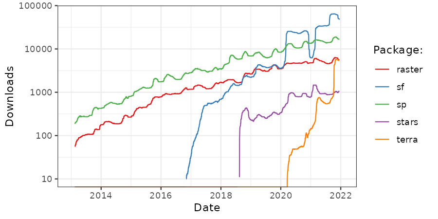

```{asis index-2, echo=knitr::is_latex_output()}
\mainmatter
```

# はじめに  {#intro}
<!--rl-->

本書は、コンピュータの力を使って、地理データで<u>作業をすること</u>について書かれている。
地理データの読み書きと何らかの処理、静的およびインタラクティブな地図の作成、実世界の問題を解決するためのジオコンピュテーション\index{geocomputation} の適用、地理現象のモデリングなど、さまざまな空間スキルを習得することができる。
本書は、様々な地理的操作をどのようにリンクさせることができるかを、文章に挟まれた再現可能な「コードチャンク」で示す。このことにより、透明性のある、したがって科学的なワークフローも教えてくれる。
R のコマンドラインから利用できる豊富な地理空間ツールの使い方を学ぶことは刺激的であるが、<u>新しいツール</u>を作成することは真に自由をもたらすだろう。
本書全体で解説するコマンドライン駆動のアプローチと、Chapter \@ref(algorithms)\index{algorithm} で解説するプログラミングにより、ソフトウェアによって課された創造性の制約を取り除くことができる。
本書を読み、演習問題を解いた後は、R\index{R} の 素晴らしい地理的機能によって開かれる可能性を強く理解し、地理データを使って現実世界の問題を解決する新しいスキル、地図と再現性のあるコードで自分の仕事を伝える力を身につけたと感じるはずである。

ここ数十年の間に、地理空間用のフリー＆オープンソースソフトウェア（FOSS4G \index{FOSS4G}  ）は驚くほどのスピードで進歩している。
OSGeo のような組織のおかげで、地理データ解析はもはや高価なハードウェアやソフトウェアを持つ人だけのものではなくなり、誰でも高性能な空間ライブラリをダウンロードして実行することができるようになったのである。
 [QGIS](http://qgis.org/en/site/)\index{QGIS}  などのオープンソースの地理情報システム（geographical information system, GIS\index{GIS}）により、世界中で地理分析にアクセスできるようになった。
GIS プログラムはグラフィカル・ユーザー・インターフェース \index{graphical user interface} (graphical user interface, GUI) を重視する傾向があり、意図しない結果として再現性\index{reproducibility}が損なわれている（Chapter \@ref(gis) で見るように、多くはコマンドラインから使用することができる）。
それに対して R は、コマンドラインインターフェース \index{command-line interface}（command line interface, CLI）を重視している。
大きく異なる二つのアプローチを単純に比較すると、Table \@ref(tab:gdsl) に示すようになる。

```{r gdsl, echo=FALSE, message=FALSE}
d = readr::read_csv("extdata/gis-vs-gds-table-ja.csv")


knitr::kable(x = d, 
             caption = "ソフトウェアパッケージによる重点の違い（地理情報システム（GIS）の GUI と R の GUI）。",
             caption.short = "Differences between GUI and CLI",
             booktabs = TRUE)
```

本書を執筆する動機は、科学研究における再現性の重要性\index{reproducibility}（下記注参照）である。
再現性のある地理データ解析\index{geographic data analysis}ワークフローをより身近なものにし、コマンドラインから利用できるオープンな地理空間ソフトウェアの力を実証することを目的としている。
「他のソフトウェアとのインターフェイスは R の一部である」 [@eddelbuettel_extending_2018]。
つまり、R では、優れた「内蔵」機能に加え、他の多くの空間ソフトウェアライブラリにアクセスすることができる。これについては、Section \@ref(why-use-r-for-geocomputation) で簡単に説明し、Chapter \@ref(gis) で実際に実行している。
しかし、このソフトウェアの詳細に触れる前に、一歩下がってジオコンピュテーションとは何かを考えてみる価値がある。 \index{geocomputation}

```{block2 01-introduction-1, type='rmdnote'}
再現性はコマンドラインインターフェイスの大きな利点だが、実際にはどのような意味があるのだろうか。
ここでは、次のように定義している。「一般にアクセス可能なコードを用いて、他の人が同じ結果を生成できるプロセス」

これは単純で簡単に思えるかもしれないが（Rのコードをスクリプトファイルで注意深く管理すれば）、教育や科学的プロセスにとって深い意味を持つ [@pebesma_r_2012]。
```
\index{reproducibility}

## ジオコンピュテーションとは？  {#what-is-geocomputation}
<!--rl-->

ジオコンピュテーション \index{geocomputation!definition}  は、1996年に開催されたこのテーマに関する最初のカンファレンスに遡る、新しい言葉である。^[
この会議は、著者の一人（Robin）が現在在籍しているリーズ大学で開催された。
第21回 GeoComputation Conference もリーズ大学で開催され、Robin と Jakub はこの間に発表を行い、「整えられた（tidy）」空間データ解析に関するワークショップを主導し、本の共同制作を行った（カンファレンスシリーズ、および20年にわたる論文/発表の詳細については www.geocomputation.org を参照）。
] 
ジオコンピュテーションを（当時）一般的に使われていた「量的地理学」と区別したのは、その初期の提唱者が提唱した、「創造的・実験的」応用 [@longley_geocomputation_1998]  と新しいツールや手法の開発に重点を置いたことである [@openshaw_geocomputation_2000]。
「ジオコンピュテーションは、様々な異なるタイプのジオデータを使用し、「科学的」アプローチという全体的な文脈の中で、関連するジオツールを開発することである。」
この本は、方法やコードを教えるだけではない。この本を読み終わる頃には、ジオコンピュテーションのスキルを使って、「有益で役に立つ実践的な仕事」ができるようになることを目指している [@openshaw_geocomputation_2000]。

しかし、私たちのアプローチは、Stan Openshaw のようなアーリーアダプターとは異なり、再現性とコラボレーションに重点を置いている。
21世紀初頭、必要なハードウェア、ソフトウェア、データへのアクセスを妨げる障壁があり、読者がコード例を再現することを期待するのは非現実的だった。
それから20年、事態は急速に進展している。
RAM を十分に（少なくとも 8 GB 以上）搭載したノートパソコンがあれば、一般に公開されているデータセットにジオコンピュテーション用のソフトウェアをインストールし、ジオコンピュテーションのためのソフトウェアを実行し、また本書を再現することができるはずである。
1990年代から2000年代初頭にかけて、高性能なコンピュータが一般の人々にとって手の届かないものであったために存在したジオコンピュテーションに対する金銭的・ハード的な障害は、現在では取り除かれている。^[
この条件に適合するノートパソコンは、多くの国では [Ebay](https://www.ebay.com/sch/i.html?_from=R40&_nkw=laptop&_sacat=0&_oaa=1&_udhi=100&rt=nc&RAM%2520Size=4%2520GB%7C16%2520GB%7C8%2520GB&_dcat=177) などのサイトで $100 以下で購入することができる。
[Ubuntu 22.04](https://rtask.thinkr.fr/installation-of-r-4-2-on-ubuntu-22-04-lts-and-tips-for-spatial-packages/) などの最新 OS における Rのインストール方法は、Chapter \@ref(spatial-class) で詳しく述べる。
] 
また、公的に入手できるデータセットが広く普及してきたことも、ジオコンピュテーションはより身近になってきた理由の一つである。この点については、Chapter \@ref(read-write) で扱う。
この分野の初期の作品とは異なり、本書で紹介するすべての研究は、本書と一緒に提供されるコードと **spData** のサンプルデータを使って再現可能である。**spData** などの R\index{R} パッケージのインストールは Chapter \@ref(spatial-class) で解説する。

ジオコンピュテーション\index{geocomputation}  は、地理情報科学（GIScience）、ジオマティクス、ジオインフォマティクス、空間情報科学、地理情報工学 [@longley_geographic_2015]、地理データ科学\index{Geographic Data Science}（Geographic Data Science, GDS）といった他の用語と密接に関連している。
それぞれの用語は、起源や主な適用分野は異なるものの、GIS\index{GIS!definition} の影響を受けた「科学的」（再現性と反証可能性を意味する）アプローチに重点を置いている点で共通している。
例えば、GDS は「データサイエンス」のスキルと大規模なデータセットを重視し、ジオインフォマティクスはデータ構造に焦点を当てる傾向がある。
しかし、用語間の違いよりも重複の方が大きいため、すべてを包含する大まかな同義語としてジオコンピュテーションを使用している。
これらはすべて、地理データを応用科学的な作業に利用することを目的としている。
しかし、この用語の初期の使用者とは異なり、私たちは「ジオコンピュテーション（Geocomputation）」（またはスタン・オープンショウが呼んだ「ジオコンピュテーション（GeoComputation、C が大文字になっている）」）というまとまった学術分野があることを示そうとするものではない。
その代わりに、私たちはこの言葉を次のように定義している。「コード、再現性\index{reproducibility}およびモジュール性に重点を置いた、計算機による地理データの処理」である。

ジオコンピュテーションは最近の言葉であるが、古い考えに影響を受けている。
2000年以上の歴史を持つ地理学\index{Geography} の一部と見ることができる [@talbert_ancient_2014]。
また、1960年代に登場した *Geographic Information Systems* (GIS\index{GIS} ) [@neteler_open_2008] の延長線上にあるものでもある [@coppock_history_1991]。

地理学\index{Geography}は、しかしながら、コンピュータが発明されるずっと以前から、人類と自然界との関係を説明し、影響を与える上で重要な役割を担ってきた。
1800年代初頭、Alexander von Humboldt \index{von Humboldt} が南米を旅したことが、この役割を物語っている。
その結果、物理地理学や植物地理学の伝統の基礎を築いただけでなく、自然界を保護するための政策への道も開いたのである [@wulf_invention_2015]。
本書は、現代のコンピュータとオープンソースソフトウェアの力を活用し、「地理的伝統」 [@livingstone_geographical_1992]  に貢献することを目的としている。

この本が古い学問分野とリンクしていることは、本のタイトルの提案に反映された。*Geography with R* と *R for GIS* である。
それぞれに利点がある。
前者は、単なる空間データ以上のもので構成されているというメッセージを伝えている。 
非空間的な属性データは、ジオメトリデータと必然的に織り込まれる。Geography\index{Geography} は、何かが地図上のどこにあるかということだけではない。
後者は、この本が GIS\index{GIS} として R を使い、<u>地理データ</u>の空間演算を行うための本であることを伝えている [@bivand_applied_2013]。
しかし、GIS という言葉には、R\index{R} の最大の強みを伝えきれない意味を含んでいる（Table \@ref(tab:gdsl) 参照）。
強みとはすなわち、地理データ処理、モデリング、可視化タスクをシームレスに切り替えることができるコンソールベースの機能である。
これに対し、ジオコンピューテーション\index{geocomputation}という言葉は、再現可能で創造的なプログラミングを意味する。\index{GIS!connotations} 
もちろん、（ジオコンピュテーション）アルゴリズム \index{algorithm}  は、非常に複雑になり得る強力なツールである。
しかし、すべてのアルゴリズムは、より小さな部分から構成されている。
その基礎となる構造を学ぶことで、地理データの問題に対する独自の革新的な解決策を生み出す力を身につけることを目的としている。

## なぜ R をジオコンピュテーションに使うのか？  {#why-use-r-for-geocomputation}
<!--rl-->

初期の地理学者は、気圧計、コンパス、 [sextants](https://en.wikipedia.org/wiki/Sextant) などのさまざまな道具を使って、世界に関する知識を深めてきた [@wulf_invention_2015]。
海上での経度計算が可能になったのは、1761年に発明された[マリン・クロノメーター](https://en.wikipedia.org/wiki/Marine_chronometer)からで、これにより船はより直進的な航路をとることができるようになった。

現在では、このような地理的なデータの不足は考えにくい。
すべてのスマートフォンに全地球測位（GPS\index{GPS}）受信機が搭載され、人工衛星や半自動運転車、市民科学者に至るまで、数多くのセンサーが世界のあらゆる場所を絶え間なく測定している。
データの生成速度が圧倒的に速いのである。
例えば、自律走行車は1日あたり 100 GB のデータを生成することができる [@theeconomist_autonomous_2016]。
人工衛星からのリモートセンシング\index{remote sensing}  データが膨大になり、対応するデータを1台のコンピュータで解析することが難しくなったため、 [OpenEO](http://r-spatial.org/2016/11/29/openeo.html) のような取り組みが行われている。

この「ジオデータ革命」は、高性能なコンピュータハードウェアと、効率的でスケーラブルなソフトウェアに対する需要を喚起し、ノイズから信号を処理・抽出することで、世界を理解し、おそらく世界を変えることができる。
空間データベース\index{spatial database}は、膨大な地理データの保存と管理可能なサブセットの生成を可能にし、そこから知識を得るためのインターフェイスは、今後の重要なツールになる。
R はそのようなツールの一つで、高度な分析、モデリング、可視化機能を備えている。
この文脈では、本書の焦点は言語そのものにあるわけではない [@wickham_advanced_2019 参照]。
その代わりに、私たちは R を世界を理解するための「商売道具」として使っている。フンボルト\index{von Humboldt}がその複雑さと相互関係のすべてにおいて自然を深く理解するために道具を使ったのと同じようにである [@wulf_invention_2015 参照]。
プログラミングは還元主義的な活動に見えるが、R を使ったジオコンピューテイション\index{geocomputation}を楽しむだけでなく、世界を理解するために教えることを目的としている。

R は、統計計算とグラフィックスのためのマルチプラットフォームであり、オープンソースな言語と環境である（[r-project.org/](https://www.r-project.org/)）。
R は、幅広いパッケージによって高度な地理空間統計学 \index{statistics}、モデリング、可視化もサポートしている。
\index{R!language}
RStudio\index{RStudio}  のような新しい統合開発環境（integrated development environment、IDE\index{IDE}）は、多くの人にとって R をより使いやすくし、インタラクティブな視覚化専用のパネルで地図の作成を容易にした。

その中核となる R はオブジェクト指向で、 [functional programming language](https://adv-r.hadley.nz/fp.html) [@wickham_advanced_2019]、特に他のソフトウェアとの対話型インタフェースとして設計されたものである [@chambers_extending_2016]。 
後者には、GIS\index{GIS}  ソフトウェア、「ジオライブラリ」、関数の宝庫への「橋」も多く含まれている（Chapter \@ref(gis) を参照）。
そのため、C言語\index{C}、FORTRAN\index{FORTRAN}、Java\index{Java}  などの低レベル言語（Rと比較して）を習得する必要がなく、「ジオツール」を素早く作成するのに理想的である（Section \@ref(software-for-geocomputation) を参照）。 
\index{R}
これは、GUI ベースの地理情報システムやプロプライエタリな地理情報システムが課す比喩的な「見えない壁」からの脱却のように感じられるだろう（GUI\index{graphical user interface} の定義については Table \@ref(tab:gdsl) を参照）。
さらに、R は他の言語へのアクセスを容易にしている。
パッケージの **Rcpp** と **reticulate** は、例えば C++\index{C++} と Python\index{Python} のコードにアクセスできるようにする。
つまり、R はさまざまな地理空間プログラムへの「橋渡し役」として使用できるのである（Section \@ref(software-for-geocomputation) 参照）。

R の柔軟性と進化する地理的機能を示すもう一つの例は、インタラクティブな地図作成である\index{map making!interactive}。
Chapter \@ref(adv-map) で見るように、R には「限られた対話型（プロット）機能しかない」 [@bivand_applied_2013]  というのは、もはや真実ではない。
これは、Figure \@ref(fig:interactive) を作成する以下のコードチャンクで実証されている（プロットを生成する関数は、Section \@ref(interactive-maps) でカバーされている）。

```{r 01-introduction-2, eval=FALSE, echo=FALSE}
a = osmdata::getbb("Hereford")
b = osmdata::getbb("Bialystok")
rowMeans(a)
rowMeans(b)
```

```{r interactive-demo, eval=FALSE}
library(leaflet)
popup = c("Robin", "Jakub", "Jannes")
leaflet() |>
  addProviderTiles("NASAGIBS.ViirsEarthAtNight2012") |>
  addMarkers(lng = c(-3, 23, 11),
             lat = c(52, 53, 49), 
             popup = popup)
```

```{r interactive, fig.cap="青いマーカーは著者の出身地を示している。ベースマップは、NASAが提供する夜の地球のタイル画像。オンライン版（r.geocompx.org）では、ズームインしたりポップアップをクリックするなどして、インタラクティブに楽しむことができる。", out.width="100%", fig.scap="Where the authors are from.", echo=FALSE}
if(knitr::is_latex_output()){
    knitr::include_graphics("figures/interactive.png")  
} else if(knitr::is_html_output()){
    # library(leaflet)
    # popup = c("Robin", "Jakub", "Jannes")
    # interactive = leaflet() |>
    #   addProviderTiles("NASAGIBS.ViirsEarthAtNight2012") |>
    #   addMarkers(lng = c(-3, 23, 11),
    #              lat = c(52, 53, 49), 
    #              popup = popup) 
    # library(htmlwidgets)
    # saveWidget(interactive, file = "interactive.html")
    # file.copy("interactive.html", "~/geocompr/geocompr.github.io/static/img/interactive.html")
    knitr::include_url("https://geocompr.github.io/img/interactive.html")
}
```

\index{map making!interactive}

インタラクティブな地図としてならともかく、数年前に R を使って Figure \@ref(fig:interactive) を作成するのは困難だっただろう。
これは R の柔軟性と、**knitr** や **leaflet** などの開発のおかげで、他のソフトウェアへのインターフェースとして使用できることを示すもので、本書を通じて繰り返し出てくるテーマである。
そのため、R コードを使用することで、抽象的な概念だけでなく、現実の現象を表す再現性の高い事例を参考にしながらジオコンピュテーションの教育を行うことができる。

## ジオコンピュテーションのためのソフトウェア  {#software-for-geocomputation}
<!--rl-->

R は地理計算のための強力な言語であるが、地理データ解析のための他の多くの選択肢があり、何千もの地理関数\index{function}を提供している。
地理計算のための他の言語を理解することは、特定のタスクに別のツールがより適切である場合を決定し、より広い地理空間生態系に R を配置するのに役立つ。
本節では、Chapter \@ref(gis) に向けて、ジオコンピュテーションのための言語 [C++](https://isocpp.org/)\index{C++}、 [Java](https://www.oracle.com/java/index.html)\index{Java}、 [Python](https://www.python.org/)\index{Python} を簡単に紹介する。

R（とPython）の重要な特徴として、インタプリタ型言語であることが挙げられる。
REPL（Read-Eval-Print Loop）\index{REPL}で対話的にプログラミングできるのがメリットである。
コンソールに入力されたコードは、コンパイルという中間段階を待たずに、即座に実行され、結果が表示される。
一方、C++\index{C++} や Java\index{Java} などのコンパイルされた言語は、（一度コンパイルされると）動作が速くなる傾向がある。

C++\index{C++} は、[QGIS](https://www.qgis.org/)\index{QGIS}、 [GRASS](https://grass.osgeo.org/)\index{GRASS}、[SAGA](http://www.saga-gis.org/)\index{SAGA} などの多くの GIS パッケージの基礎を提供しているので、賢明な出発点であると言えるだろう。
よく書かれた C++\index{C++} は非常に高速で、大規模な地理データセットを処理するようなパフォーマンスが重要なアプリケーションに適しているが、Python や R に比べて習得が困難である。
C++\index{C++} は、**Rcpp** パッケージによってよりアクセスしやすくなり、R ユーザーのために C\index{C!language}  プログラミングへの良い「入り方」を提供している。
このような低レベルの言語を使いこなすことで、新しい高性能な「ジオアルゴリズム」を生み出す可能性や、GIS ソフトウェアの仕組みをより深く理解することができる（Chapter \@ref(algorithms) を参照）。

Java\index{Java} もジオコンピュテーションのための重要な多用途言語である。
GIS パッケージ gvSig、OpenJump、uDig はすべて Java\index{Java} で記述されている。
Java で書かれた GIS ライブラリは、GeoTools や Java Topology Suite の JTS など多数ある（GEOS\index{GEOS} は JTS の C++\index{C++} 移植版）。
さらに、Geoserver/Geonode、deegree、52°North WPS など、多くの地図サーバーアプリケーションは Java\index{Java}  を使用している。

Java\index{Java} のオブジェクト指向の構文は、C++\index{C++} のに似ている。
Java\index{Java} の大きな利点は、プラットフォームに依存せず（コンパイル言語としては異例）、拡張性が高いことで、本書を執筆した RStudio\index{RStudio} のような IDE\index{IDE} に適した言語であることが挙げられる。
Java は、データサイエンスに使用できるものの、統計的モデリングや可視化のためのツールが Python や R に比べて少ない [@brzustowicz_data_2017]。

Python\index{Python} は、特に GRASS\index{GRASS}、SAGA\index{SAGA}、QGIS\index{QGIS}  などの多くのデスクトップ GIS\index{GIS} が Python API\index{API} を提供しているので、ジオコンピュテーションには重要な言語である（Chapter \@ref(gis) を参照）。
R\index{R} と同様、データサイエンスのための [popular](https://stackoverflow.blog/2017/10/10/impressive-growth-r/) ツールである。
両言語はオブジェクト指向であり、重複する部分が多いため、R から Python\index{Python} へのアクセスを容易にする **reticulate** パッケージや、オープンソースデータサイエンスエコシステム全体の利益のためにポータブルライブラリをサポートする [Ursa Labs](https://ursalabs.org/) イニシアチブなどの取り組みに繋がっている。

実際には、R と Python のどちらにも強みがあり、どちらを使うかは、ある程度、応用や結果の伝達の領域よりは重要ではない。
どちらかを習得することで、もう一方を習得するためのスタートラインに立つことができるのである。
しかし、ジオコンピュテーション\index{geocomputation}においては、Python\index{Python} よりも R \index{R} の方が大きな利点がある。
これには、言語自体の地理データモデルであるベクタとラスタのサポートが大幅に向上したこと（Chapter \@ref(spatial-class)）と、それに対応する可視化の可能性（Chapter \@ref(spatial-class) と Chapter \@ref(adv-map) 参照） が含まれる。
\index{spatial!statistics} 同様に重要なこととして、R は空間統計 \index{statistics}  を含む統計のための比類ないサポートを持っており、何百ものパッケージ（Python\index{Python}  の比ではない）が何千もの統計手法をサポートしている。

Python の大きな利点は、<u>汎用</u>プログラミング言語であることである。
デスクトップソフトウェア、コンピュータゲーム、Web サイト、データサイエンス\index{data science}など、多くの領域で使用されている。
Python\index{Python}  は、異なる（ジオコンピュテーション）コミュニティ間で唯一共有される言語であることが多く、多くの GIS\index{GIS}  プログラムをまとめる「接着剤」と見なすことができる。
QGIS\index{QGIS} や ArcMap を含む多くのジオアルゴリズム \index{geoalgorithm} は、Python のコマンドラインからアクセスできるため、コマンドライン GIS のスターター言語として適している^[
ジオアルゴリズム\index{geoalgorithm}へのアクセスを提供する Python モジュールには、GRASS\index{GRASS} 用の `grass.script`、
SAGA-GIS\index{SAGA} 用の `saga-python`、
QGIS\index{QGIS} 用　`processing`、
ArcGIS\index{ArcGIS} 用の `arcpy` がある。]

しかし、空間統計\index{spatial!statistics}と予測モデリングでは、R は他の追随を許さない。
これは、R と Python のどちらかを選ばなければならないということではない。Python\index{Python} は、ほとんどの一般的な統計手法をサポートしており（ただし、空間統計の新しい開発は R の方が早くサポートする傾向がある）、Python で学んだ多くの概念は R\index{R}  の世界にも適用することができる。
<!--rl:toDo-->
<!--to update! -->
R と同様に、Python も地理データの解析と操作をサポートしており、**osgeo**、**Shapely**、**NumPy**、**PyGeoProcessing** などのパッケージがある [@garrard_geoprocessing_2016]。

## Rの空間エコシステム  {#r-ecosystem}

R で地理データを扱う方法はたくさんあり、この分野では何十ものパッケージ\index{R-spatial}がある。^[
R の空間エコシステムの概要は、CRAN\index{CRAN}  Task View on Analysis of Spatial Data に掲載されている。
（参照：https://cran.r-project.org/web/views/Spatial.html）。
] 
本書では、この分野の最先端を学ぶと同時に、将来的にも通用する手法を確保するよう努めることとした。
ソフトウェア開発の多くの分野と同様に、R の空間エコシステムは急速に進化している（Figure \@ref(fig:cranlogs)）。
R はオープンソースであるため、アイザック・ニュートンが [1675](http://digitallibrary.hsp.org/index.php/Detail/Object/Show/object_id/9285) で述べたように、「巨人の肩の上に立つ」ことによって、これらの開発は容易に過去の研究の上に構築することができるのである。
この方法は、コラボレーションを促進し、「車輪の再発明」を避けることができるという利点がある。
例えば、**sf**\index{sf} （Chapter \@ref(spatial-class) で取り上げている）というパッケージは、前身の **sp** の上に構築されたものである。

R-spatial\index{R-spatial} の開発時間が急増し、R コンソーシアムから、ベクタ形状の保存とアクセスのためのオープンソースの標準とモデルであるシンプルフィーチャのサポートの開発に対する助成金が授与された。 
その結果、**sf** パッケージ（Section \@ref(intro-sf)）が誕生したのである。
複数の場所で **sf** への絶大な関心を反映している。 
特に、長年にわたって蓄積された R-spatial の知恵を多く含むオープンアクセスのメールリストである [R-sig-Geo Archives](https://stat.ethz.ch/pipermail/r-sig-geo/) がそうである。

```{r cranlogs, fig.cap="2013年初頭から現在までの、地理データを扱うための R パッケージのダウンロード数。y軸は、よく使われる cloud.r-project.org CRAN ミラーからの日次ダウンロードの平均数を91日間ローリングウィンドウ法で示している（対数スケール）。", echo=FALSE, fig.scap="The popularity of spatial packages in R."}

```

データ処理パッケージ **dplyr**（[2014年](https://cran.r-project.org/src/contrib/Archive/dplyr/)にリリース）に代表されるように、より広い R コミュニティのシフトが R の空間エコシステムのシフトに影響を与えたことは注目に値する。 
**dplyr** は [2016年](https://cran.r-project.org/src/contrib/Archive/tidyverse/) の後半に **tidyverse**\index{tidyverse (package)}  という「メタパッケージ」に配置され、スタイルを共有する他のパッケージ（例えば、**ggplot2** など）と並び、「整えられた（tidy）データ」に重点を置いている。
<!--rl:toDo-->
<!-- add reference -->
ロング型データと直感的な名前の関数に焦点を当てた **tidyverse**\index{tidyverse (package)}  アプローチは、絶大な人気を誇っている。
そのため、「整えられた地理的データ」が求められ、その一部を **sf** が担ってきている。
**tidyverse** の明らかな特徴として、パッケージが調和して動作する傾向がある。
<!--rl:toDo-->
<!--is the next sentence still valid? -->
同等の **geoverse** はないが、 [r-spatial](https://github.com/r-spatial/discuss/issues/11) 組織でホストされているパッケージ間の調和を図る試みがあり、**sf**\index{sf} を使うパッケージが増えつつある（Table \@ref(tab:revdep)）。

```{r revdep, echo=FALSE, message=FALSE}
top_dls = readr::read_csv("extdata/top_dls.csv")
knitr::kable(top_dls[1:5, 1:2], digits = 0, 
             caption = paste("sfに依存するパッケージで、前月の1日あたりの平均ダウンロード数が多い上位5位。", 
                             "", 
                             "",
                             min(top_dls$date), "時点で、", nrow(top_dls), 
                             "件のパッケージが sf をインポートしている。"), 
             caption.short = "Top 5 most downloaded packages depending on sf.",
             booktabs = TRUE,
             col.names = c("パッケージ", "ダウンロード数"))
# cranlogs::cran_top_downloads(when = "last-month") # most downloaded pkgs
```

並行して行われる開発群は、 [rspatial](https://github.com/rspatial) パッケージ群に関連するものである。^["r-spatial" は **sf** などのパッケージを含む組織で、"rspatial" は **terra** を担当する組織であるという違いに注意。] 
主なメンバーは、空間ラスタを扱う **terra** パッケージである（Section \@ref(an-introduction-to-terra) を参照）。

## R-spatial の歴史  {#the-history-of-r-spatial}

最新の空間パッケージである **sf** を使うメリットはたくさんあるが、R の空間機能の歴史を知っておくことも重要である。多くの機能、ユースケース、教材は古いパッケージに含まれている。
古いものにも、見るところさえ分かれば、今でも十分役に立つ。
\index{R!history}
\index{R-spatial!history}

R の空間機能は、S 言語の初期の空間パッケージが起源である [@bivand_implementing_2000]。
\index{S}
1990年代には、数多くの S スクリプトが開発され、空間統計\index{statistics}のためのパッケージも数多く開発された。
GeoComputation 2000 で発表された [article](http://www.geocomputation.org/2000/GC009/Gc009.htm) によると、「点パターン解析、地球統計学、探索的空間データ解析、空間経済学」という様々な空間手法のための R パッケージが 2000 年までに誕生した [@bivand_open_2000]。
これらのうち、特に **spatial**、**sgeostat**、**splancs** は CRAN\index{CRAN} でまだ利用可能である [@rowlingson_splancs_1993; @rowlingson_splancs_2017;@venables_modern_2002; @majure_sgeostat_2016]。

その後の R News（[The R Journal](https://journal.r-project.org/) の前身）の記事には、当時の R の空間統計ソフトウェアの概要が掲載されており、その多くは S/S-PLUS\index{S}   のために書かれた以前のコードに基づいていた [@ripley_spatial_2001]。
この概要では、**akima** や **geoR** [@akima_akima_2016; @jr_geor_2016]  などの空間平滑化や補間のパッケージ、**splancs** [@rowlingson_splancs_2017] や **spatstat** [@baddeley_spatial_2015]  などの点パターン解析のパッケージについて説明した。

R News の次の号（Volume 1/3） では、空間系パッケージに再びスポットライトを当て、**splancs** をより詳しく紹介し、空間統計に関する将来の展望を解説した [@bivand_more_2001]。
さらに、この問題では空間自己相関を検定するための2つのパッケージが紹介され、最終的には **spdep** [@bivand_spdep_2017]  の一部となった。
特に、空間インターフェースの標準化、GIS\index{GIS} とのデータ交換の効率的な仕組み、座標参照系（coordinate reference systems, CRS\index{CRS}）などの空間メタデータの取り扱いの必要性について言及している。

**maptools**（Nicholas Lewin-Koh 作成; @bivand_maptools_2017）もこの時の重要なパッケージである。
当初 **maptools** は [shapelib](http://shapelib.maptools.org/) のラッパーを含んでいるだけで、ESRI Shapefiles\index{Shapefile}  をジオメトリのネストされたリストに読み込むことを許可していた。 
対応する、今では廃止されたS3クラス\index{S3 class} の "Map" は、このリストを属性データフレームと一緒に保存していた。 
それにもかかわらず、"Map" クラス表現に関する作業は、CRAN\index{CRAN} で出版される前の **sp** に直接反映されたので重要であった。

2003年、Roger Bivand は空間パッケージの拡張レビューを発表した。
「GDAL\index{GDAL} が提供するデータオブジェクト」をサポートするクラスシステムを提案し、「基本的な」点、線、ポリゴン、ラスタタイプを含む。
さらに、外部ライブラリへのインタフェースは、モジュール化された R パッケージの基礎となるべきであると提言している [@hornik_approaches_2003]。
これらのアイデアは、**rgdal** と **sp** というパッケージで、かなりの部分実現されている。
これらは、2008年に初版が発行された *Applied Spatial Data Analysis with R* (ASDAR) [@bivand_applied_2013]  で説明されているように、R による空間データ解析の基礎を提供するものであった。
10年後、R の空間機能は大幅に進化したが、@hornik_approaches_2003 で示されたアイデアの上に成り立っていることに変わりはない。
例えば、GDAL\index{GDAL} と PROJ\index{PROJ}  のインターフェースは、R の高性能な地理データ入出力と CRS\index{CRS} 変換機能を依然として支えている（それぞれ、Chapter \@ref(reproj-geo-data) および Chapter @ref(read-write) を参照）。

2003 年にリリースされた **rgdal** は、R に GDAL \index{GDAL}  バインディングを提供し、これまで利用できなかった地理データ形式からデータをインポートする機能を大幅に向上させることとした。
初期リリースではラスタドライバのみをサポートしていたが、その後の機能拡張により、座標参照系（PROJ ライブラリ経由）、再投影、ベクタファイル形式のインポート（ファイル形式については Chapter \@ref(read-write) を参照）をサポートするようになった。 
これらの追加機能の多くは、Barry Rowlingson によって開発され、2006年に **rgdal** コードベースでリリースされた[コンテキストについては、 @rowlingson_rasp:_2003 と [R-help](https://stat.ethz.ch/pipermail/r-help/2003-January/028413.html) email list を参照]。

2005年にリリースされた **sp** は、R の空間オブジェクトと非空間オブジェクトの区別ができない点を克服した [@pebesma_classes_2005]。
**sp** は2003年にウィーンの [workshop](http://spatial.nhh.no/meetings/vienna/index.html) から発展し、 [R-Forge](https://r-forge.r-project.org) に移行する前は sourceforge でホストされていた。
2005年以前は、地理座標は一般的に他の数値と同様に扱われていた。 
点、線、ポリゴン、グリッド、属性データをサポートするクラスと汎用メソッドにより、**sp** はこれを変更した。

**sp** は、S4 クラス \index{S4 class} システムを使用して、バウンディングボックス \index{bounding box}、座標参照系\index{CRS}、属性などの情報を `Spatial` オブジェクトのスロットに格納する。
データ操作で地理データを扱えるようにする（Section \@ref(why-simple-features) 参照）。
さらに、**sp** では、地理データのための `summary()` や `plot()` などの汎用的なメソッドが用意されている。
その後の10年間で **sp** クラスは R の地理データ用として急速に普及し、これに依存するパッケージの数は2008年の約20から2013年には100以上に増加した [@bivand_applied_2013]。
現在では、**sp** に依存するパッケージは500を超え（これに対して、**sf** パッケージはより速く成長している）、R のエコシステムの重要な一部となっている。 
**sp** を使用する主な R パッケージには、以下のものがある。**gstat** は空間・時空間地球統計学 \index{spatial!statistics}、 **geosphere** は球面三角法、**adehabitat** は動物による生息地選択の分析 [@R-gstat; @calenge_package_2006; @hijmans_geosphere_2016]。

```{r, eval=FALSE, echo=FALSE}
# Aim: show n. pkgs that depend on sf and sp
revdep_sp = devtools::revdep(pkg = "sp")
length(revdep_sp) # 622 # 2022-05-29
revdep_sf = devtools::revdep(pkg = "sf")
length(revdep_sf) # 479 # 2022-05-29
```

**rgdal** と **sp** は空間に関する多くの問題を解決したが、2010年の Google Summer of Code プロジェクト（[@R-rgeos]）で **rgeos** が開発されるまで、**sp** オブジェクトでジオメトリ操作を行うことができなかった。
`gIntersection()` などの機能により、地理的なオブジェクト間の空間的な関係を見つけたり、その形状を変更したりすることが可能になった（**sf**による幾何学的な操作の詳細については、Chapter \@ref(geometry-operations) を参照）。

**sp** エコシステムの限界は、ラスタデータのサポートが限定的であることであった。
これを克服したのが、2010年に初めてリリースされた **raster**\index{raster}  である [@R-raster]。
Section \@ref(raster-data) にあるように、**raster** クラスシステムと関数によって、さまざまなラスタ操作が可能になり、現在では **terra** パッケージに実装されている。
**raster** と **terra** の重要な機能は、RAMに収まらないほど大きなデータセットを扱うことができることである（R の PostGIS\index{PostGIS} へのインターフェースも、地理ベクタデータセットのディスク外操作をサポートしている）。
**raster** および **terra** は、Section \@ref(map-algebra) で説明されているように、マップ代数もサポートしている。

このようなクラスシステムや手法の開発と並行して、専用の GIS ソフトのインターフェースとして R がサポートされるようになった。
**GRASS** [@bivand_using_2000] とそれに続くパッケージ **spgrass6** と **rgrass7** （それぞれ GRASS\index{GRASS} GIS 6 と 7 に対応）は、この方向性の顕著な例であった [@bivand_rgrass7_2016;@bivand_spgrass6_2016]。
R と GIS の橋渡しの例としては、他に **RSAGA** [@R-RSAGA, first published in 2008]\index{RSAGA (package)}、**RPyGeo** [@brenning_arcgis_2012、2008 年に初登場]、**RQGIS** [@muenchow_rqgis:_2017、2016 年に初登場]\index{RQGIS (package)}、**rqgisprocess**\index{rqgisprocess (package)} がある（Chapter \@ref(gis) 参照）。
<!--toDo-->
<!-- rqgisprocess ref! -->

R-spatial の開発の大部分は解析と地理的な操作に集中しており、当初は可視化には焦点が当てられていなかった。
base と lattice の両方のプロット方式で地図を作る方法を提供していた **sp** であるが、高度な地図作成機能への要望が高まっていた。
2009 年にリリースされた **RgoogleMaps** は、Google Maps や OpenStreetMap [@loecher_rgooglemaps_2015]  などのオンラインサービスの「ベースマップ」タイルの上に R 空間データを重ね合わせることができる。
\index{ggplot2 (package)}
その後、**ggplot2** [@kahle_ggmap_2013]  に同様の「ベースマップ」タイル機能を追加した **ggmap** パッケージがリリースされた。
**gpmap** は **ggplot2** で地図を作ることを容易にしたが、`fortify` 空間オブジェクトをロング形式のデータフレームに変換する必要があるため、その実用性は限られていた。
これは点に対してはうまくいくが、線やポリゴンに対しては計算効率が悪く、各座標（頂点）が行に変換されるため、複雑な形状を表現するためには巨大なデータフレームが必要となるのである。
地理的な可視化はベクタデータを中心に行われる傾向があるが、ラスタの可視化は **raster** でサポートされており、空間と時間のデータの可視化に関する書籍 [@lamigueiro_displaying_2018] で紹介されている **rasterVis** のリリースで盛り上がりを見せた。
それ以来、R でのマップ作成は話題となり、Chapter \@ref(adv-map) で強調されているように、**tmap**、**leaflet**、**rayshader**、**mapview**などの専用パッケージが人気を博している。

Geocomputation with R 第1版が出版された2018年以降、地理系 R パッケージの開発が加速している。 
\index{terra (package)}
**raster** パッケージの後継である **terra** は、2020年に初めてリリースされ、ラスタデータセットを扱うR ユーザーにいくつかの利点をもたらしている [@hijmans_terra_2021]。Section \@ref(raster-data) で説明されているように、前任者よりも高速でより分かりやすいユーザーインターフェイスを持っている。

2021年半ば、**sf** パッケージに球面幾何学計算を取り入れるという大幅な（場合によっては破たんする）変更が行われた。
それ以来、地理的 CRS を持つデータに対する多くの空間演算は、Section \@ref(s2) で説明されているように、バックエンドとして S2 球形ジオメトリエンジンを使うのがデフォルトになっている。
また、2018年以降の R で地理データを表現し作業する方法として、**stars** と **lidR** パッケージが追加されている。
**sf** と密接に統合されている **stars** は、ラスタおよびベクタデータキューブを処理する [@pebesma_stars_2021]。
空中の LiDAR (Light Detection and Ranging) 点群を **lidR** 処理する [@Roussel2020]。
\index{stars (package)}
\index{lidR (package)}

この近代化には、新しい技術や標準の出現、R環境以外での空間ソフトウェア開発による影響など、いくつかの動機があった [@bivand_progress_2021]。
R 空間パッケージを含むほとんどの空間ソフトウェアに影響を与える最も重要な外部要因は、2018年に始まった PROJ ライブラリ\index{PROJ} の多くの破壊的な変更を含む大規模なアップデートであった。
最も重要なのは、これらの変更により、座標参照系の「proj-string」表現が、Section \@ref(crs-intro) と Chapter \@ref(reproj-geo-data) で説明されているように、「Well Known Text」に置き換えられなければならなくなったことである。

\index{rayshader (package)}
2018年以降、R による空間可視化ツールの進展は、いくつかの要因が関係している。
まず、新しいタイプの空間プロットが開発され、レイトレーシングと複数のヒルシェード手法を組み合わせて 2D および 3D のデータ可視化を行う **rayshader** パッケージが提供された [@morganwall_rayshader_2021]。
\index{ggplot2 (package)}
第二に、**ggplot2** は、スケールバーや北矢印などの空間可視化要素を追加する **ggspatial** パッケージ [@dunnington_ggspatial_2021]  と、スムーズでカスタマイズ可能な空間アニメーションを可能にする **gganimate** パッケージ [@pedersen_gganimate_2020]  など、新しく空間機能が追加された。
3つ目は、大規模な空間データの可視化性能の向上である。
特に、**tmap** におけるダウンスケールしたラスタの自動プロットや、**mapview** パッケージの高性能インタラクティブレンダリングプラットフォーム（`"leafgl"` や `"mapdeck"` など）の使用可能性に関連している。
最後に、既存のマッピングツールの中には、依存関係の最小化、ユーザーインターフェースの改善、拡張機能の作成が容易になるように書き直されたものがある。
これには **mapsf** パッケージ (**cartography** の後継) [@giraud_mapsf_2021]  と **tmap** パッケージのバージョン 4 が含まれ、内部コードの大部分が改訂された。

<!-- toDo: rl-->
<!-- question: should we add a paragraph about the following stuff here?-->
<!-- add info about specialized packages - sfnetworks, landscapemetrics, gdalcubes, rgee, etc. -->
<!-- better to add review papers, including Robin's, mine, etc. -->
<!-- interoperbility? -->
<!-- @hesselbarth_opensource_2021 -->
<!-- @lovelace_open_2021a -->

<!-- spatstat?? -->

2021年後半、2023年末に、Roger Bivand によって [R-sig-Geo mailing list](https://stat.ethz.ch/pipermail/r-sig-geo/2021-September/028760.html) において **rgdal**、**rgeos**、**maptools** が引退する予定であることが発表された。
これは、これらのパッケージを適用している既存のワークフローに大きな影響を与えるだけでなく、 **rgdal**、**rgeos**、**maptools** に依存しているパッケージにも影響を与えるだろう。 
そこで、Bivand は、本書の次の章で説明するように **sf** や **terra** などより現代的なツールへの移行を計画することを提案している。

## 演習

```{r, echo=FALSE, results='asis'}
res = knitr::knit_child('_01-ex.Rmd', quiet = TRUE, options = list(include = FALSE, eval = FALSE))
cat(res, sep = '\n')
```
