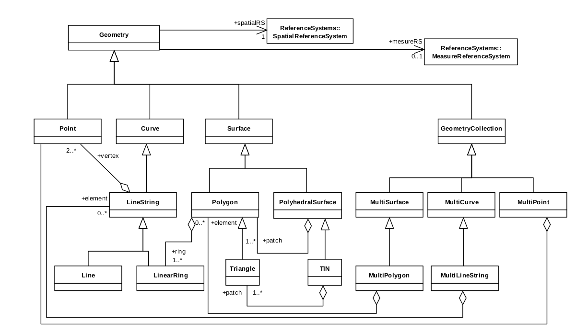

# Introduction {#intro}

This book exists at the intersection between Geography and R (Figure \@ref(fig:venn)).
Suggested titles were *Geography with R* and *R for GIS*, each of which has advantages.
The former conveys the message that it's not just about spatial data: 
non-spatial attribute data are inevitably interwoven with geometry data, and Geography is about more than where something is on the map.
The latter option communicates that this is a book about using R as a *Geographic Information System* (GIS), to perform spatial operations on *geographic data* [@bivand_applied_2013].
However, the term GIS has some negative connotations (see Table \@ref(tab:gdsl)) and fails to communicate one of R's greatest strengths:
it's unparalleled ability to seamlessly switch between geographic and non-geographic data processing, modelling and visualisation tasks.

The title was chosen because this book is about more than routine spatial data processing, something that is well captured by the term *geocomputation*.
What defines geocomputation as a development on previous work is the "creative and experimental use of GIS that it entails" [@longley_geocomputation:_1998].
With the right know-how, geographic data can be used in ways that would have been unthinkable to early practitioners of GIS.

Another advantage of geocomputation that it conveys the centrality of the concept of algorithms (which can be implemented in R functions) to advanced geographical research. Geocomputation as an academic field is relatively
young^[Geocomputation
has a ~30 year history dating back to the first [conference](http://www.geocomputation.org/) on the subject in 1996 (at the University of Leeds where the concept for this book was dreamt up) which was followed by a flurry of subsequent
publications.]
but research published under the geocomputational banner have made major contributions to geographic methods, some of which we will use in this book.
Algorithms are powerful tools that can become highly complex.
However, all algorithms are composed of smaller, often modular parts.
By teaching these foundations we aim to empower you.
Creating your own solutions to geographic data problems can feel breaking free from the metaphorical 'glass ceiling' imposed by GUI-based proprietary geographic information systems (see Table @\ref(tab:gdsl) for a definition of GUI).

<!-- todo: what contributions, which will we use, where in the book? -->

While embracing recent developments in the field, we also wanted to pay respects the wider field of Geography, and its 2000 year history [@roller_eratosthenes_2010], of which geocomputation is a part.
Geography has played an important role in explaining and influencing humanity's relationship with the natural world and this book aims to be a part of the 'Geographic tradition'.
Geocomputation in this book therefore means more than simply analyzing geographic data on a computer.
It's about trying to make research which involves geographic data more reproducible, scientific and socially beneficial.
This book is also part of the movement towards Geographic Data Science (GDS) which differs from GIS in several ways, some of which are outlined in Table \@ref(tab:gdsl).

```{r gdsl, echo=FALSE, message=FALSE}
d = readr::read_csv("extdata/gis-vs-gds-table.csv")
knitr::kable(x = d, caption = "Differences in emphasis between the fields of Geographic Information Systems (GIS) and Geographic Data Science (GDS).")
```

This book aims teach how to do geocomputation rather than just think about it.
The hope is that it will enable more people to conduct reproducible scientific research in pursuit of knowledge and for the greater good.


## Why Geocomputation with R?

In this book we treat R as a 'tool for the trade', in a similar way that early geographers used rulers, compasses, sextants and other instruments to advance knowledge about the world.
Actions often speak louder than words, so this book teaches Geocomputation with reference to real-world examples and reproducible code rather than abstract concepts.
But before we crack-on with the action, a few introductory remarks are needed to explain the approach taken here and provide context.
However, background an understanding of both topics will help you get the most out of the subsequent work, so we start with some definitions and references for further reading for historical context:

- Geography, of which Geocomputation is a part, is the study of where things are located on the Earth. Primarily we are interested in the part of Geography that deals with *geographic data* and *maps*: information with a location and the visualisation of such data.

- R is an open source statistical programming language that has powerful geographical capabilities, thanks largely to add-on packages.

```{r venn, fig.cap="Venn diagram of the intersection between Geography and R.", echo=FALSE, message=FALSE}
library(sf) # load sf library
p = st_sfc(st_point(c(0, 1)), st_point(c(1, 1))) # create 2 points
b = st_buffer(p, dist = 1) # convert points to circles
i = st_intersection(b[1], b[2]) # find intersection between circles
plot(b) # plot circles
text(x = c(-0.5, 1.5), y = 1, labels = c("Geography", "R")) # add text
plot(i, col = "lightgrey", add = TRUE) # color intersecting area
```

## R's spatial ecosystem

<!-- Ideas here on the history please @nowosad! -->

The most important recent evolution in R's spatial ecosystem has without doubt been support for simple features thanks to the **sf** package, introduced below (see Chapter \@ref(spatial-class) for a detailed account of the `sf` class system).

## An introduction to Simple Features

Simple Features is an open standard data model developed and endorsed by the Open Geospatial Consortium ([OGC](http://portal.opengeospatial.org/files/?artifact_id=25355)) to describe how features with geographical and non-geographical features should be represented.
It is a hierarchical data model that simplifies geographic data by condensing the complex range of possible geographic forms (e.g., line, point, polygon, multipolygon forms) into a single geometry class.

<!-- (Figure \@ref(fig:sf-ogc)). -->

<!-- ```{r sf-ogc, fig.cap="The Simple Features class hierarchy, used with permission (on condition of linking to the source) from the Open Geospatial Consortium's document 06-103r4 (see http://www.opengeospatial.org/standards/sfa)", out.width="100%", echo=FALSE} -->
<!--  -->
<!-- ``` -->

The R implementation of Simple Features is provided by the **sf** package [@R-sf].
**sf** incorporates the functionality of the 3 main packages of the **sp** paradigm (**sp** [@R-sp] for the class system, **rgdal** [@R-rgdal] for reading and writing data, **rgeos** [@R-rgeos] for spatial operations undertaken by GEOS) in a single, cohesive whole.
This is well-documented in **sf**'s [vignettes](http://cran.rstudio.com/package=sf):

```{r, eval=FALSE}
vignette("sf1") # for an introduction to the package
vignette("sf2") # for reading, writing and converting Simple Features
vignette("sf3") # for manipulating Simple Features
```

As the first vignette explains, simple feature objects in R are stored in a data frame, with geographical data occupying special column, a 'list-column'. This column is usually named 'geom' or 'geometry'.
Let's see how simple feature in R work, with reference to world boundary data from the **spData** package:

```{r, results='hide'}
library(sf)
# devtools::install_github("nowosad/spData")
f = system.file("shapes/wrld.shp", package = "spData")
world = st_read(f)
```

This has loaded an object that is simultaneously of class `data.frame` and `sf`:

```{r}
class(world)
```

The output of the preceding command shows that objects with class `sf` are also data frames. Thus, they can be treated like regular `data.frame`, making life easy if you are already used to working with data frames.

Let's look the first 2 rows and 3 columns of this object.
The output shows 2 major differences compared with a regular `data.frame`: the inclusion of additional geographical data (`geometry type`, `dimension`, `bbox` and CRS information - `epsg (SRID)`, `proj4string`), and the presence of final `geometry` column:

```{r}
world[1:2, 1:3]
```

All this may seem rather complex, especially for a class system that is supposed to be simple.
However, there are good reasons for organizing things this way and using **sf**.

### Exercises

What does the summary of the `geometry` column tell us about the `world` dataset, in terms of:

- The geometry type?
- How many countries there are?
- The coordinate reference system (CRS)?

## Why Simple Features?

There are many advantages of **sf** over **sp**, including:

- Faster reading and writing of data (more than 10 times faster in some cases)
- Better plotting performance
- **sf** objects can be treated as dataframes in most operations
- **sf** functions can be combined using `%>%` operator and works well with the [tidyverse](http://tidyverse.org/) collection of R packages
- **sf** function names are relatively consistent and intuitive (all begin with `st_`) compared with the function names and syntax of the **sp**, **rgdal** and **rgeos** packages that it supersedes.

A broader advantage is that simple features are so well supported by other software products, not least PostGIS, which has heavily influenced the design of **sf**.

A disadvantage you should be aware of, however, is that **sf** is not *feature complete* and that it continues to evolve.
The transition from **sp** to **sf** will likely take many years, and many spatial packages may never switch.
Even if you discover spatial data with R through the **sf** package, it is still worth at least being aware of **sp** classes, even if you rarely use them for everyday geospatial tasks.

Fortunately it is easy to translate between **sp** and **sf** using the `as()` function, even when **sp** is not loaded: 

```{r, eval=FALSE}
world_sp = as(object = world, Class = "Spatial")
```


<!-- 
- r, rstudio, gdal, proj4, geos, udunits 
- r packages sf, raster, etc.
- datasets 
-->

<!-- ## Introduction to GIS -->

<!-- 
- what's R
- what's GIS
- GIS data models (vector vs raster)
- coordinate reference system - CRS
- GIS data formats
- GDAL, GEOS, PROJ4
- GIS R package
- GIS beyond R 
-->
