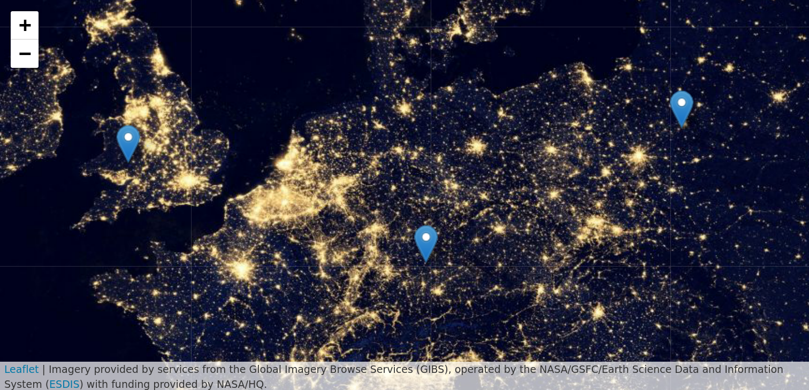
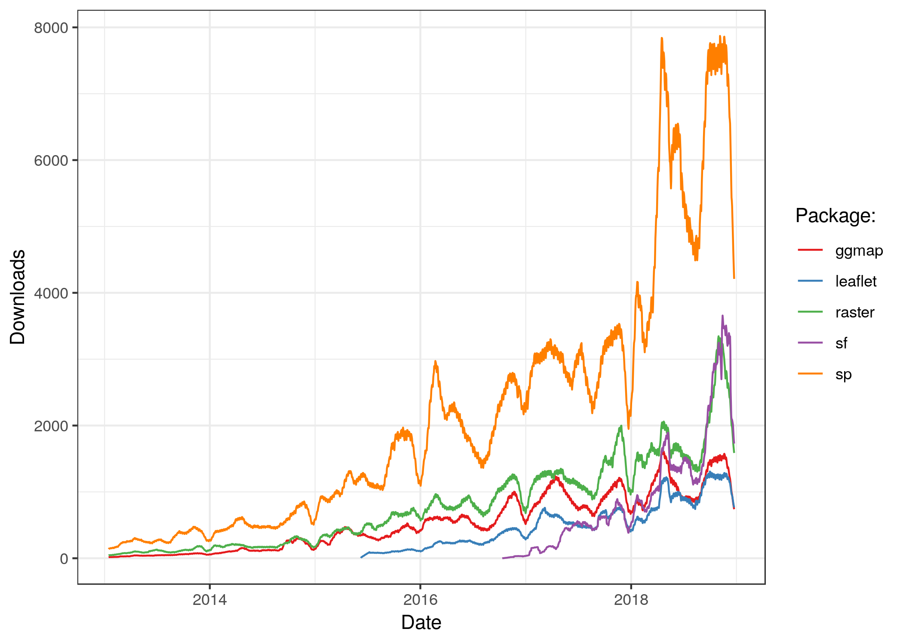

```{asis index-2, echo=knitr::is_latex_output()}
\mainmatter
```

# Introduction {#intro}

This book is about using the power of computers to *do things* with geographic data.
It teaches a range of spatial skills, including: reading, writing and manipulating geographic data; making static and interactive maps; applying geocomputation\index{geocomputation} to solve real-world problems; and modeling geographic phenomena.
By demonstrating how various geographic operations can be linked, in reproducible 'code chunks' that intersperse the prose, the book also teaches a transparent and thus scientific workflow.
Learning how to use the wealth of geospatial tools available from the R command line can be exciting, but creating *new ones* can be truly liberating.
Using the command-line driven approach taught throughout, and programming techniques covered in Chapter \@ref(algorithms)\index{algorithm}, can help remove constraints on your creativity imposed by software.
After reading the book and completing the exercises, you should therefore feel empowered with a strong understanding of the possibilities opened up by R's\index{R} impressive geographic capabilities, new skills to solve real-world problems with geographic data, and the ability to communicate your work with maps and reproducible code.

Over the last few decades free and open source software for geospatial (FOSS4G\index{FOSS4G}) has progressed at an astonishing rate.
Thanks to organizations such as OSGeo, geographic data analysis is no longer the preserve of those with expensive hardware and software: anyone can now download and run high-performance spatial libraries.
Open source Geographic Information Systems (GIS\index{GIS}), such as [QGIS](http://qgis.org/en/site/)\index{QGIS}, have made geographic analysis accessible worldwide.
GIS programs tend to emphasize graphical user interfaces\index{graphical user interface} (GUIs), with the unintended consequence of discouraging reproducibility\index{reproducibility} (although many can be used from the command line as we'll see in Chapter \@ref(gis)).
R, by contrast, emphasizes the command line interface\index{command-line interface} (CLI).
A simplistic comparison between the different approaches is illustrated in Table \@ref(tab:gdsl).
<!-- Still, many GIS programs ... but most teaching materials focus on the GUI ... to supplement the main graphical user interface (GUI), but  -->

```{r gdsl, echo=FALSE, message=FALSE}
d = readr::read_csv("extdata/gis-vs-gds-table.csv")
knitr::kable(x = d, 
             caption = paste("Differences in emphasis between software", 
                             "packages (Graphical User Interface (GUI) of", 
                             "Geographic Information Systems (GIS) and R)."),
             caption.short = "Differences between GUI and CLI",
             booktabs = TRUE)
```

This book is motivated by the importance of reproducibility\index{reproducibility} for scientific research (see the note below).
<!-- , something that is often lacking in geographic work. -->
It aims to make reproducible geographic data analysis\index{geographic data analysis} workflows more accessible, and demonstrate the power of open geospatial software available from the command-line.
"Interfaces to other software are part of R" [@eddelbuettel_extending_2018].
This means that in addition to outstanding 'in house' capabilities, R allows access to many other spatial software libraries, explained in Section \@ref(why-use-r-for-geocomputation) and demonstrated in Chapter \@ref(gis).
Before going into the details of the software, however, it is worth taking a step back and thinking about what we mean by geocomputation\index{geocomputation}.

```{block2 01-introduction-1, type='rmdnote'}
Reproducibility is a major advantage of command-line interfaces, but what does it mean in practice?
We define it as follows: "A process in which the same results can be generated by others using publicly accessible code."

This may sound simple and easy to achieve (which it is if you carefully maintain your R code in script files), but has profound implications for teaching and the scientific process [@pebesma_r_2012].
```
\index{reproducibility}

## What is geocomputation?

Geocomputation\index{geocomputation!definition} is a young term, dating back to the first conference on the subject in 1996.^[
The conference took place at the University of Leeds, where one of the authors (Robin) is currently based.
The 21^st^ GeoComputation conference was also hosted at the University of Leeds, during which Robin and Jakub presented, led a workshop on 'tidy' spatial data analysis and collaborated on the book (see www.geocomputation.org for more on the conference series, and papers/presentations spanning two decades).
]
What distinguished geocomputation from the (at the time) commonly used term 'quantitative geography', its early advocates proposed, was its emphasis on "creative and experimental" applications [@longley_geocomputation_1998] and the development of new tools and methods [@openshaw_geocomputation_2000]:
"GeoComputation is about using the various different types of geodata and about developing relevant geo-tools within the overall context of a 'scientific' approach."
This book aims to go beyond teaching methods and code; by the end of it you should be able to use your geocomputational skills, to do "practical work that is beneficial or useful" [@openshaw_geocomputation_2000].

Our approach differs from early adopters such as Stan Openshaw, however, in its emphasis on reproducibility and collaboration.
At the turn of the 21^st^ Century, it was unrealistic to expect readers to be able to reproduce code examples, due to barriers preventing access to the necessary hardware, software and data.
Fast-forward two decades and things have progressed rapidly.
Anyone with access to a laptop with ~4GB RAM can realistically expect to be able to install and run software for geocomputation on publicly accessible datasets, which are more widely available than ever before (as we will see in Chapter \@ref(read-write)).^[
A laptop with 4GB running a modern operating system such as Ubuntu 16.04 onward should also be able to reproduce the contents of this book.
A laptop with this specification or above can be acquired second-hand for ~US$100 in many countries nowadays, reducing the financial/hardware barrier to geocomputation far below the levels in operation in the early 2000s, when high-performance computers were unaffordable for most people.
]
Unlike early works in the field, all the work presented in this book is reproducible using code and example data supplied alongside the book, in R\index{R} packages such as **spData**, the installation of which is covered in Chapter \@ref(spatial-class).

Geocomputation\index{geocomputation} is closely related to other terms including: Geographic Information Science (GIScience); Geomatics; Geoinformatics; Spatial Information Science; Geoinformation Engineering [@longley_geographic_2015]; and Geographic Data Science\index{Geographic Data Science} (GDS).
Each term shares an emphasis on a 'scientific' (implying reproducible and falsifiable) approach influenced by GIS\index{GIS!definition}, although their origins and main fields of application differ.
GDS, for example, emphasizes 'data science' skills and large datasets, while Geoinformatics tends to focus on data structures.
But the overlaps between the terms are larger than the differences between them and we use geocomputation as a rough synonym encapsulating all of them:
they all seek to use geographic data for applied scientific work.
Unlike early users of the term, however, we do not seek to imply that there is any cohesive academic field called 'Geocomputation' (or 'GeoComputation' as Stan Openshaw called it).
Instead, we define the term as follows: working with geographic data in a computational way, focusing on code, reproducibility\index{reproducibility} and modularity.

Geocomputation is a recent term but is influenced by old ideas.
It can be seen as a part of Geography\index{Geography}, which has a 2000+ year history [@talbert_ancient_2014];
and an extension of *Geographic Information Systems* (GIS\index{GIS}) [@neteler_open_2008], which emerged in the 1960s [@coppock_history_1991].

Geography\index{Geography} has played an important role in explaining and influencing humanity's relationship with the natural world long before the invention of the computer, however.
Alexander von Humboldt's\index{von Humboldt} travels to South America in the early 1800s illustrates this role:
not only did the resulting observations lay the foundations for the traditions of physical and plant geography, they also paved the way towards policies to protect the natural world [@wulf_invention_2015].
This book aims to contribute to the 'Geographic Tradition' [@livingstone_geographical_1992] by harnessing the power of modern computers and open source software.
<!-- GIS has become almost synonymous with handling spatial data on a computer, and provides a basis for excellent open source tools which can be accessed from R, as we will see in Chapter 13. -->
<!-- todo - add dynamic reference to c13-->

The book's links to older disciplines were reflected in suggested titles for the book: *Geography with R* and *R for GIS*.
Each has advantages.
The former conveys the message that it comprises much more than just spatial data: 
non-spatial attribute data are inevitably interwoven with geometry data, and Geography\index{Geography} is about more than where something is on the map.
The latter communicates that this is a book about using R as a GIS\index{GIS}, to perform spatial operations on *geographic data* [@bivand_applied_2013].
However, the term GIS conveys some connotations (see Table \@ref(tab:gdsl)) which simply fail to communicate one of R's\index{R} greatest strengths:
its console-based ability to seamlessly switch between geographic and non-geographic data processing, modeling and visualization tasks.
By contrast, the term geocomputation\index{geocomputation} implies reproducible and creative programming.\index{GIS!connotations}
Of course, (geocomputational) algorithms\index{algorithm} are powerful tools that can become highly complex.
However, all algorithms are composed of smaller parts.
By teaching you its foundations and underlying structure, we aim to empower you to create your own innovative solutions to geographic data problems.

## Why use R for geocomputation?

Early geographers used a variety of tools including barometers, compasses and [sextants](https://en.wikipedia.org/wiki/Sextant) to advance knowledge about the world [@wulf_invention_2015]. 
It was only with the invention of the marine [chronometer](https://en.wikipedia.org/wiki/Marine_chronometer) in 1761 that it became possible to calculate longitude at sea, enabling ships to take more direct routes.

Nowadays such lack of geographic data is hard to imagine.
Every smartphone has a global positioning (GPS\index{GPS}) receiver and a multitude of sensors on devices ranging from satellites and semi-autonomous vehicles to citizen scientists incessantly measure every part of the world.
The rate of data produced is overwhelming.
An autonomous vehicle, for example, can generate 100 GB of data per day [@theeconomist_autonomous_2016].
Remote sensing\index{remote sensing} data from satellites has become too large to analyze the corresponding data with a single computer, leading to initiatives such as  [OpenEO](http://r-spatial.org/2016/11/29/openeo.html).

This 'geodata revolution' drives demand for high performance computer hardware and efficient, scalable software to handle and extract signal from the noise, to understand and perhaps change the world.
Spatial databases\index{spatial database} enable storage and generation of manageable subsets from the vast geographic data stores, making interfaces for gaining knowledge from them vital tools for the future.
R is one such tool, with advanced analysis, modeling and visualization capabilities.
In this context the focus of the book is not on the language itself [see @wickham_advanced_2014].
Instead we use R as a 'tool for the trade' for understanding the world, similar to Humboldt's\index{von Humboldt} use of tools to gain a deep understanding of nature in all its complexity and interconnections [see @wulf_invention_2015].
Although programming can seem like a reductionist activity, the aim is to teach geocomputation\index{geocomputation} with R not only for fun, but for understanding the world.

R is a multi-platform, open source language and environment for statistical computing and graphics ([r-project.org/](https://www.r-project.org/)).
With a wide range of packages, R also supports advanced geospatial statistics\index{statistics}, modeling and visualization.
\index{R!language}
New integrated development environments (IDEs\index{IDE}) such as RStudio\index{RStudio} have made R more user-friendly for many, easing map making with a panel dedicated to interactive visualization.

At its core, R is an object-oriented, [functional programming language](http://adv-r.had.co.nz/Functional-programming.html) [@wickham_advanced_2014], and was specifically designed as an interactive interface to other software [@chambers_extending_2016]. 
The latter also includes many 'bridges' to a treasure trove of GIS\index{GIS} software, 'geolibraries' and functions (see Chapter \@ref(gis)).
It is thus ideal for quickly creating 'geo-tools', without needing to master lower level languages (compared to R) such as C\index{C}, FORTRAN\index{FORTRAN} or Java\index{Java} (see Section \@ref(software-for-geocomputation)). 
\index{R}
This can feel like breaking free from the metaphorical 'glass ceiling' imposed by GUI-based or proprietary geographic information systems (see Table \@ref(tab:gdsl) for a definition of GUI\index{graphical user interface}).
Furthermore, R facilitates access to other languages:
the packages **Rcpp** and **reticulate** enable access to C++\index{C++} and Python\index{Python} code, for example.
This means R can be used as a 'bridge' to a wide range of geospatial programs (see Section \@ref(software-for-geocomputation)).

Another example showing R's flexibility and evolving geographic capabilities is interactive map making\index{map making!interactive}.
As we'll see in Chapter \@ref(adv-map), the statement that R has "limited interactive [plotting] facilities" [@bivand_applied_2013] is no longer true.
This is demonstrated by the following code chunk, which creates Figure \@ref(fig:interactive) (the functions that generate the plot are covered in Section \@ref(interactive-maps)).

```{r 01-introduction-2, eval=FALSE, echo=FALSE}
a = osmdata::getbb("Hereford")
b = osmdata::getbb("Bialystok")
rowMeans(a)
rowMeans(b)
```

```{r, eval=FALSE}
library(leaflet)
popup = c("Robin", "Jakub", "Jannes")
leaflet() %>%
  addProviderTiles("NASAGIBS.ViirsEarthAtNight2012") %>%
  addMarkers(lng = c(-3, 23, 11),
             lat = c(52, 53, 49), 
             popup = popup)
```


```{r interactive, fig.cap="The blue markers indicate where the authors are from. The basemap is a tiled image of the Earth at night provided by NASA. Interact with the online version at geocompr.robinlovelace.net, for example by zooming in and clicking on the popups.", out.width="100%", fig.scap="Where the authors are from.", echo=FALSE}
if(knitr::is_latex_output()){
       
} else if(knitr::is_html_output()){
    # library(leaflet)
    # popup = c("Robin", "Jakub", "Jannes")
    # interactive = leaflet() %>%
    #   addProviderTiles("NASAGIBS.ViirsEarthAtNight2012") %>%
    #   addMarkers(lng = c(-3, 23, 11),
    #              lat = c(52, 53, 49), 
    #              popup = popup)  
    # library(htmlwidgets)
    # saveWidget(interactive, file = "interactive.html")
    # file.copy("interactive.html", "~/geocompr/geocompr.github.io/static/img/interactive.html")
    knitr::include_url("https://geocompr.github.io/img/interactive.html")
}
```

\index{map making!interactive}

It would have been difficult to produce Figure \@ref(fig:interactive) using R a few years ago, let alone as an interactive map.
This illustrates R's flexibility and how, thanks to developments such as **knitr** and **leaflet**, it can be used as an interface to other software, a theme that will recur throughout this book.
The use of R code, therefore, enables teaching geocomputation with reference to reproducible examples such as that provided in Figure \@ref(fig:interactive) rather than abstract concepts.

## Software for geocomputation

R is a powerful language for geocomputation but there are many other options for geographic data analysis providing thousands of geographic functions\index{function}.
Awareness of other languages for geocomputation will help decide when a different tool may be more appropriate for a specific task, and place R in the wider geospatial ecosystem.
<!-- JM: a bit out of context here
Various R interfaces or 'bridges' to dedicated GIS software have been created (see Chapter \@ref(gis)) so it's worth knowing what is out there even from an R spatial perspective: there may already be an existing (or in-development) bridge enabling functions implemented in other languages to be run from the R command line.
-->
This section briefly introduces the languages [C++](https://isocpp.org/)\index{C++}, [Java](https://www.oracle.com/java/index.html)\index{Java} and [Python](https://www.python.org/)\index{Python} for geocomputation, in preparation for Chapter \@ref(gis).

An important feature of R (and Python) is that it is an interpreted language.
This is advantageous because it enables interactive programming in a Read–Eval–Print Loop (REPL):\index{REPL}
code entered into the console is immediately executed and the result is printed, rather than waiting for the intermediate stage of compilation.
On the other hand, compiled languages such as C++\index{C++} and Java\index{Java} tend to run faster (once they have been compiled).

C++\index{C++} provides the basis for many GIS packages such as [QGIS](www.qgis.org)\index{QGIS}, [GRASS](https://grass.osgeo.org/)\index{GRASS} and [SAGA](www.saga-gis.org)\index{SAGA} so it is a sensible starting point.
<!-- even [ArcGIS](https://www.arcgis.com/)) relies in great parts on it. -->
Well-written C++\index{C++} is very fast, making it a good choice for performance-critical applications such as processing large geographic datasets, but is harder to learn than Python or R.
C++\index{C++} has become more accessible with the **Rcpp** package, which provides a good 'way in' to C\index{C!language} programming for R users.
Proficiency with such low-level languages opens the possibility of creating new, high-performance 'geoalgorithms' and a better understanding of how GIS software works (see Chapter \@ref(algorithms)).

Java\index{Java} is another important and versatile language for geocomputation.
GIS packages gvSig, OpenJump and uDig are all written in Java\index{Java}.
There are many GIS libraries written in Java, including GeoTools and JTS, the Java Topology Suite (GEOS\index{GEOS} is a C++\index{C++} port of JTS).
Furthermore, many map server applications use Java\index{Java} including Geoserver/Geonode, deegree and 52°North WPS.

Java's\index{Java} object-oriented syntax is similar to that of C++\index{C++}.
<!-- but its memory management, at least from a user's perspective, is simpler and more robust. -->
<!-- Java is rather unforgiving regarding class, object and variable declarations, which encourages well-designed programming structure, useful in large projects with thousands of lines of codes placed in numerous files. -->
<!-- Following the *write once, run anywhere* principle, -->
A major advantage of Java\index{Java} is that it is platform-independent (which is unusual for a compiled language) and is highly scalable, making it a suitable language for IDEs\index{IDE} such as RStudio\index{RStudio}, with which this book was written.
Java has fewer tools for statistical modeling and visualization than Python or R, although it can be used for data science [@brzustowicz_data_2017].
<!-- Furthermore Java is hard to use interactively. -->
<!-- Interpreted languages (such as R and Python) are better suited for the type of interactive workflow used in many geographic workflows than compiled languages (such as Java and C++). -->
<!-- Unlike Java (and most other languages) R has native support for data frames and matrices, making it especially well suited for (geographic) data analysis. -->

Python\index{Python} is an important language for geocomputation especially because many Desktop GIS\index{GIS} such as GRASS\index{GRASS}, SAGA\index{SAGA} and QGIS\index{QGIS} provide a Python API\index{API} (see Chapter \@ref(gis)).
Like R\index{R}, it is a [popular](https://stackoverflow.blog/2017/10/10/impressive-growth-r/) tool for data science.
Both languages are object-oriented, and have many areas of overlap, leading to initiatives such as the **reticulate** package that facilitates access to Python\index{Python} from R and the [Ursa Labs](https://ursalabs.org/) initiative to support portable libraries to the benefit of the entire open source data science ecosystem.

In practice both R and Python have their strengths and to some extent which you use is less important than the domain of application and communication of results.
Learning either will provide a head-start in learning the other.
However, there are major advantages of R\index{R} over Python\index{Python} for geocomputation\index{geocomputation}.
This includes its much better support of the geographic data models vector and raster in the language itself (see Chapter \@ref(spatial-class)) and corresponding visualization possibilities (see Chapters \@ref(spatial-class) and \@ref(adv-map)).
Equally important, R has unparalleled support for statistics\index{statistics}, including spatial statistics\index{spatial!statistics}, with hundreds of packages (unmatched by Python\index{Python}) supporting thousands of statistical methods.

The major advantage of Python is that it is a *general-purpose* programming language.
It is used in many domains, including desktop software, computer games, websites and data science\index{data science}.
<!--
R, by contrast, was originally developed for statistics.
It has been extended in many directions including, for example, web application development (see \@ref(adv-map)), but is still primarily used for statistics and data science, explaining its smaller (but rapidly growing) user base.
-->
Python\index{Python} is often the only shared language between different (geocomputation) communities and can be seen as the 'glue' that holds many GIS\index{GIS} programs together.
Many geoalgorithms\index{geoalgorithm}, including those in QGIS\index{QGIS} and ArcMap, can be accessed from the Python command line, making it well-suited as a starter language for command-line GIS.^[
Python modules providing access to geoalgorithms\index{geoalgorithm} include `grass.script` for GRASS\index{GRASS},
<!-- (https://grasswiki.osgeo.org/wiki/GRASS_and_Python), -->
`saga-python` for SAGA-GIS\index{SAGA},
<!-- (http://saga-python.readthedocs.io/en/latest/), -->
`processing` for QGIS\index{QGIS} and `arcpy` for ArcGIS\index{ArcGIS}.
]

For spatial statistics\index{spatial!statistics} and predictive modeling, however, R is second-to-none.
This does not mean you must choose either R or Python: Python\index{Python} supports most common statistical techniques (though R tends to support new developments in spatial statistics earlier) and many concepts learned from Python can be applied to the R\index{R} world.
Like R, Python also supports geographic data analysis and manipulation with packages such as **osgeo**, **Shapely**, **NumPy** and **PyGeoProcessing** [@garrard_geoprocessing_2016].

## R's spatial ecosystem

<!-- paragraphs (with references to chapters in the book): -->
<!-- 1. this book focus -> sf + raster/stars + leaflet/mapview (the recent state of spatial R); the history of R spatial is way longer -->

There are many ways to handle geographic data in R, with dozens of packages\index{R-spatial} in the area.^[
An overview of R's spatial ecosystem can be found in the CRAN\index{CRAN} Task View on the Analysis of Spatial Data
(see https://cran.r-project.org/web/views/Spatial.html).
]
In this book we endeavor to teach the state-of-the-art in the field whilst ensuring that the methods are future-proof.
Like many areas of software development, R's spatial ecosystem is rapidly evolving (Figure \@ref(fig:cranlogs)).
Because R is open source, these developments can easily build on previous work, by 'standing on the shoulders of giants', as Isaac Newton put it in [1675](http://digitallibrary.hsp.org/index.php/Detail/Object/Show/object_id/9285).
This approach is advantageous because it encourages collaboration and avoids 'reinventing the wheel'.
The package **sf**\index{sf} (covered in Chapter \@ref(spatial-class)), for example, builds on its predecessor **sp**.

A surge in development time (and interest) in 'R-spatial\index{R-spatial}' has followed the award of a grant by the R Consortium for the development of support for Simple Features, an open-source standard and model to store and access vector geometries. 
This resulted in the **sf** package (covered in Section \@ref(intro-sf)).
Multiple places reflect the immense interest in **sf**. This is especially true for the [R-sig-Geo Archives](https://stat.ethz.ch/pipermail/r-sig-geo/), a long-standing open access email list containing much R-spatial wisdom accumulated over the years.

```{r cranlogs, fig.cap="The popularity of spatial packages in R. The y-axis shows average number of downloads per day, within a 30-day rolling window, of prominent spatial packages.", echo=FALSE, fig.scap="The popularity of spatial packages in R."}

```

It is noteworthy that shifts in the wider R community, as exemplified by the data processing package **dplyr** (released in [2014](https://cran.r-project.org/src/contrib/Archive/dplyr/)) influenced shifts in R's spatial ecosystem. 
Alongside other packages that have a shared style and emphasis on 'tidy data' (including, e.g., **ggplot2**), **dplyr** was placed in the **tidyverse** 'metapackage'\index{tidyverse (package)} in late [2016](https://cran.r-project.org/src/contrib/Archive/tidyverse/).
The **tidyverse**\index{tidyverse (package)} approach, with its focus on long-form data and fast intuitively named functions, has become immensely popular.
This has led to a demand for 'tidy geographic data' which has been partly met by **sf** and other approaches such as **tabularaster**.
An obvious feature of the **tidyverse** is the tendency for packages to work in harmony.
There is no equivalent **geoverse**, but there are attempts at harmonization between packages hosted in the [r-spatial](https://github.com/r-spatial/discuss/issues/11) organization and a growing number of packages use **sf**\index{sf} (Table \@ref(tab:revdep)). 

```{r revdep, echo=FALSE, message=FALSE}
top_dls = readr::read_csv("extdata/top_dls.csv")
knitr::kable(top_dls[1:5, 1:2], digits = 0, 
             caption = paste("The top 5 most downloaded packages that depend", 
                             "on sf, in terms of average number of downloads", 
                             "per day over the previous month. As of",
                             min(top_dls$date), " there are ", nrow(top_dls), 
                             " packages which import sf."), 
             caption.short = "Top 5 most downloaded packages depending on sf.",
             booktabs = TRUE)
# cranlogs::cran_top_downloads(when = "last-month") # most downloaded pkgs
```

## The history of R-spatial

There are many benefits of using recent spatial packages such as **sf**, but it also important to be aware of the history of R's spatial capabilities: many functions, use-cases and teaching material are contained in older packages.
These can still be useful today, provided you know where to look.
\index{R!history}
\index{R-spatial!history}

R's spatial capabilities originated in early spatial packages in the S language [@bivand_implementing_2000].
\index{S}
The 1990s saw the development of numerous S scripts and a handful of packages for spatial statistics\index{statistics}.
R packages arose from these and by 2000 there were R packages for various spatial methods "point pattern analysis, geostatistics, exploratory spatial data analysis and spatial econometrics", according to an [article](http://www.geocomputation.org/2000/GC009/Gc009.htm) presented at GeoComputation 2000 [@bivand_open_2000].
Some of these, notably **spatial**, **sgeostat** and **splancs** are still available on CRAN\index{CRAN} [@rowlingson_splancs_1993; @rowlingson_splancs_2017;@venables_modern_2002; @majure_sgeostat_2016].

A subsequent article in R News (the predecessor of [The R Journal](https://journal.r-project.org/)) contained an overview of spatial statistical software in R at the time, much of which was based on previous code written for S/S-PLUS\index{S} [@ripley_spatial_2001].
This overview described packages for spatial smoothing and interpolation, including **akima** and **geoR** [@akima_akima_2016; @jr_geor_2016], and point pattern analysis, including **splancs** [@rowlingson_splancs_2017] and **spatstat** [@baddeley_spatial_2015].

The following R News issue (Volume 1/3) put spatial packages in the spotlight again, with a more detailed introduction to **splancs** and a commentary on future prospects regarding spatial statistics [@bivand_more_2001].
Additionally, the issue introduced two packages for testing spatial autocorrelation that eventually became part of **spdep** [@bivand_spdep_2017].
Notably, the commentary mentions the need for standardization of spatial interfaces, efficient mechanisms for exchanging data with GIS\index{GIS}, and handling of spatial metadata such as coordinate reference systems (CRS\index{CRS}).

**maptools** [written by Nicholas Lewin-Koh; @bivand_maptools_2017] is another important package from this time.
Initially **maptools** just contained a wrapper around [shapelib](http://shapelib.maptools.org/) and permitted the reading of ESRI Shapefiles\index{Shapefile} into geometry nested lists. 
The corresponding and nowadays obsolete S3 class\index{S3 class} called "Map" stored this list alongside an attribute data frame. 
The work on the "Map" class representation was nevertheless important since it directly fed into **sp** prior to its publication on CRAN\index{CRAN}.

In 2003 Roger Bivand published an extended review of spatial packages.
It proposed a class system to support the "data objects offered by GDAL"\index{GDAL}, including 'fundamental' point, line, polygon, and raster types.
Furthermore, it suggested interfaces to external libraries should form the basis of modular R packages [@hornik_approaches_2003].
To a large extent these ideas were realized in the packages **rgdal** and **sp**.
These provided a foundation for spatial data analysis with R, as described in *Applied Spatial Data Analysis with R* (ASDAR) [@bivand_applied_2013], first published in 2008.
Ten years later, R's spatial capabilities have evolved substantially but they still build on ideas set-out by @hornik_approaches_2003:
interfaces to GDAL\index{GDAL} and PROJ\index{PROJ}, for example, still power R's high-performance geographic data I/O and CRS\index{CRS} transformation capabilities (see Chapters \@ref(reproj-geo-data) and \@ref(read-write), respectively).

**rgdal**, released in 2003, provided GDAL\index{GDAL} bindings for R which greatly enhanced its ability to import data from previously unavailable geographic data formats.
The initial release supported only raster drivers but subsequent enhancements provided support for coordinate reference systems (via the PROJ library), reprojections and import of vector file formats (see Chapter \@ref(read-write) for more on file formats). 
Many of these additional capabilities were developed by Barry Rowlingson and released in the **rgdal** codebase in 2006 [see @rowlingson_rasp:_2003 and the [R-help](https://stat.ethz.ch/pipermail/r-help/2003-January/028413.html) email list for context].

<!-- ^[ -->
<!-- A presentation at the 2003 DSC conference in Vienna gives the background as he saw it then [@rowlingson_rasp:_2003]; see also his announcement of the **Rmap** package on [R-help](https://stat.ethz.ch/pipermail/r-help/2003-January/028413.html) in early 2003.] -->

**sp**, released in 2005, overcame R's inability to distinguish spatial and non-spatial objects [@pebesma_classes_2005].
<!-- It grew from a [workshop](http://spatial.nhh.no/meetings/vienna/index.html) before, and a session at the 2003 DSC conference in Vienna, gathering input from most interested package developers.  -->
**sp** grew from a [workshop](http://spatial.nhh.no/meetings/vienna/index.html) in Vienna in 2003 and was hosted at sourceforge before migrating to [R-Forge](https://r-forge.r-project.org).
<!-- removed: r-sig-geo is mentioned elsewhere -->
<!-- five years later) and the [R-sig-geo mailing list](https://stat.ethz.ch/mailman/listinfo/r-sig-geo) was started. -->
Prior to 2005, geographic coordinates were generally treated like any other number. 
**sp** changed this with its classes and generic methods supporting points, lines, polygons and grids, and attribute data.

<!-- points, multipoints, pixels, full grid, line, lines, spatial lines, polygon, polygons, spatial polygons -->
**sp** stores information such as bounding box\index{bounding box}, coordinate reference system\index{CRS} and attributes in slots in `Spatial` objects using the S4 class\index{S4 class} system,
<!-- These can be accessed via the `@` symbol which can be accessed  `x@data`. -->
<!-- This enables non-spatial data operations to work alongside spatial operations (see Section \@ref(why-simple-features)). -->
enabling data operations to work on geographic data (see Section \@ref(why-simple-features)).
Further, **sp** provides generic methods such as `summary()` and `plot()` for geographic data.
In the following decade, **sp** classes rapidly became popular for geographic data in R and the number of packages that depended on it increased from around 20 in 2008 to over 100 in 2013 [@bivand_applied_2013].
As of 2018 almost 500 packages rely on **sp**, making it an important part of the R ecosystem. 
<!-- https://github.com/Robinlovelace/geocompr/issues/58 -->
<!-- https://github.com/edzer/sfr/issues/387#issuecomment-308949140 -->
Prominent R packages using **sp** include: **gstat**, for spatial and spatio-temporal geostatistics\index{spatial!statistics}; **geosphere**, for spherical trigonometry; and **adehabitat** used for the analysis of habitat selection by animals [@R-gstat; @calenge_package_2006; @hijmans_geosphere_2016].

While **rgdal** and **sp** solved many spatial issues, R still lacked the ability to do geometric operations (see Chapter \@ref(geometric-operations)).
Colin Rundel addressed this issue by developing **rgeos**, an R interface to  the open-source geometry library (GEOS\index{GEOS}) during a Google Summer of Code project in 2010 [@R-rgeos].
**rgeos** enabled GEOS\index{GEOS} to manipulate **sp** objects, with functions such as `gIntersection()`.

Another limitation of **sp** --- its limited support for raster data --- was overcome by **raster**\index{raster}, first released in 2010 [@R-raster].
Its class system and functions support a range of raster operations as outlined in Section \@ref(raster-data).
A key feature of **raster** is its ability to work with datasets that are too large to fit into RAM (R's interface to PostGIS\index{PostGIS} supports off-disc operations on vector geographic data).
**raster** also supports map algebra (see Section \@ref(map-algebra)).

In parallel with these developments of class systems and methods came the support for R as an interface to dedicated GIS software.
**GRASS** [@bivand_using_2000] and follow-on packages **spgrass6** and **rgrass7** (for GRASS\index{GRASS} GIS 6 and 7, respectively) were prominent examples in this direction [@bivand_rgrass7_2016;@bivand_spgrass6_2016].
Other examples of bridges between R and GIS include **RSAGA** [@R-RSAGA, first published in 2008]\index{RSAGA (package)}, **RPyGeo** [@brenning_arcgis_2012, first published in 2008], and **RQGIS** [@muenchow_rqgis:_2017, first published in 2016]\index{RQGIS (package)} (see Chapter \@ref(gis)).

Visualization was not a focus initially, with the bulk of R-spatial development focused on analysis and geographic operations.
**sp** provided methods for map making using both the base and lattice plotting system but demand was growing for advanced map making capabilities, especially after the release of **ggplot2** in 2007.
**ggmap** extended **ggplot2**'s spatial capabilities [@kahle_ggmap_2013], by facilitating access to 'basemap' tiles from online services such as Google Maps. 
<!--Additionally, *ggmap** lets you use (mainly Google's) geocoding and routing services.-->
Though **ggmap** facilitated map-making with **ggplot2**, its utility was limited by the need to `fortify` spatial objects, which means converting them into long data frames.
While this works well for points it is computationally inefficient for lines and polygons, since each coordinate (vertex) is converted into a row, leading to huge data frames to represent complex geometries.
<!-- This is especially disadvantageous if you need to deal with tens of thousands of polygons. -->
<!-- With the introduction of simple features to R this limitation disappears, and it seems likely that this will make **ggplot2** the standard tool for the visualization of vector data.  -->
Although geographic visualization tended to focus on vector data, raster visualization is supported in **raster** and received a boost with the release of **rasterVis**, which is described in a book on the subject of spatial and temporal data visualization [@lamigueiro_displaying_2018].
<!-- More recently, new packages aim at easing the creation of complex, high-quality maps with minimal code. -->
<!-- The **tmap** package (released in 2014) might serve as an archetype for this kind of development [@R-tmap]. -->
<!-- It facilitates the user-friendly creation of thematic maps with an intuitive command-line interface (see also [**mapmisc**](https://cran.r-project.org/package=mapmisc)) .  -->
<!-- ADD THIS LATTER -->
<!-- CITE the paper Tennekes, M. (2017) tmap: Thematic Maps in R. Forthcoming in the Journal
of Statistical Software http://von-tijn.nl/tijn/research/presentations/tmap_user2017.pdf-->
As of 2018 map making in R is a hot topic with dedicated packages such as **tmap**, **leaflet** and **mapview** all supporting the class system provided by **sf**, the focus of the next chapter (see Chapter \@ref(adv-map) for more on visualization).
<!-- **tmap** is a sophisticated yet user friendly mapping package which works in harmony with the **leaflet** package (released in 2015) for interactive map making [@R-leaflet].  -->
<!-- Similarly, the **mapview** package builds also on top of **leaflet** [@R-mapview] for interactive mapping based on **sp** or **sf** objects. **mapview** allows the access of a wide range of background maps, scale bars and more. -->

<!-- The release of **sf** in 2016 is important development  in R's spatial ecosystem [@R-sf]. -->
<!-- Naturally, this is the reason why we will describe **sf** in detail in Chapter \@ref(spatial-class). -->

<!-- ## How to read this book -->

## Exercises

1. Think about the terms 'GIS'\index{GIS}, 'GDS' and 'geocomputation' described above. Which (if any) best describes the work you would like to do using geo* methods and software and why?

1. Provide three reasons for using a scriptable language such as R for geocomputation instead of using an established GIS program such as QGIS\index{QGIS}.

1. Name two advantages and two disadvantages of using mature vs recent packages for geographic data analysis\index{geographic data analysis} (for example **sp** vs **sf**\index{sf}).

