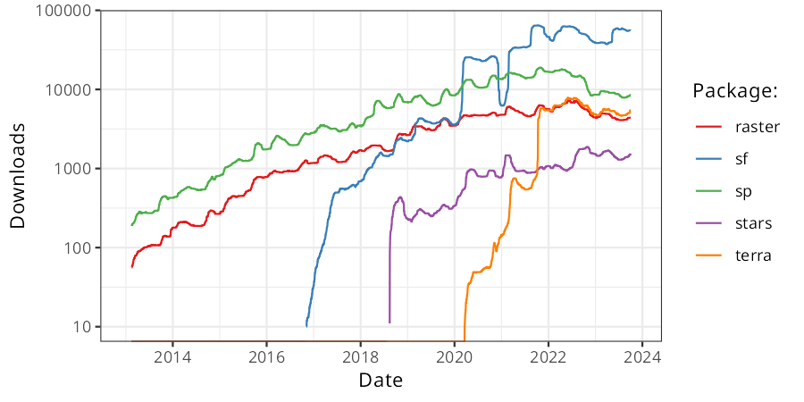

```{asis index-2, echo=knitr::is_latex_output()}
\mainmatter
```

# Introduction {#intro}

```{r, include=FALSE}
source("code/before_script.R")
```

This book is about using the power of computers to *do things* with geographic data.
It teaches a range of spatial skills, including: reading, writing and manipulating geographic file formats; making static and interactive maps; and applying geocomputation\index{geocomputation} to support more evidence-based decision-making related to a range of geographic phenomena, from transport systems to ecosystems.
By demonstrating how various geographic operations can be linked, in 'code chunks' that intersperse the prose, the book also teaches reproducible, open and thus scientific workflows.

The book is not just about using the wealth of *existing tools* for geocomputation: it's also about understanding the geographic data structures and software needed to build *new tools*.
The approach we teach throughout, and programming techniques covered in Chapter \@ref(algorithms)\index{algorithm} in particular, can remove constraints on your creativity imposed by software.
After reading the book and completing the exercises, you should be ready to tackle real-world problems, communicate your work in maps and code, and contribute to the open source communities developing tools and documentation for reproducible geocomputation.

Over the last few decades, free and open source software for geospatial (FOSS4G\index{FOSS4G}) has progressed at an astonishing rate.
Thanks to organizations such as OSGeo, advanced geographic techniques are no longer the preserve of those with expensive hardware and software: anyone can now download and run high-performance software for geocomputation.
Open source Geographic Information Systems (GIS\index{GIS}), such as [QGIS](https://qgis.org/en/site/)\index{QGIS}, have made geographic analysis accessible worldwide.
GIS software products are powerful, but they tend to emphasize a graphical user interface\index{graphical user interface} (GUI) approach over the command-line interface (CLI) approach advocated in this book.
The 'GUI focus' of many GIS products has the unintended consequence of disabling many users from making their work fully reproducible\index{reproducibility}, a problem that can be overcome by calling 'geoalgorithms' contained in GIS software from the command line, as we'll see in Chapter \@ref(gis).
A simplistic comparison between the different approaches is illustrated in Table \@ref(tab:gdsl).

```{r gdsl, echo=FALSE, message=FALSE}
d = readr::read_csv("extdata/gis-vs-gds-table.csv")
knitr::kable(x = d,
             caption = paste("Differences in emphasis between software", 
                             "packages (Graphical User Interface (GUI) of", 
                             "Geographic Information Systems (GIS) and R)."),
             caption.short = "Differences between GUI and CLI",
             booktabs = TRUE)
```

R is not the only language providing a CLI for geocomputation.
Other command environments with powerful geographic capabilities exist, including Python\index{Python} (covered in the book [Geocomputation with Python](https://py.geocompx.org/)), Julia, and JavaScript.
However, R has advantages that make it a good language for learning geocomputation and for many geocomputation tasks, especially for statistics, modeling and visualization, as outlined in Section \@ref(why-open-source).

This book is also motivated by the importance of reproducibility\index{reproducibility} for scientific research.
It aims to make reproducible geographic data analysis\index{geographic data analysis} workflows more accessible, and demonstrate the power of open geospatial software available from the command line.
R provides ways to interface with other languages [@eddelbuettel_extending_2018], enabling numerous spatial software libraries to be called from R, as explained in Section \@ref(why-use-r-for-geocomputation) and demonstrated in Chapter \@ref(gis).
Before going into the details of the software, however, it is worth taking a step back and thinking about what we mean by geocomputation\index{geocomputation}.

```{block2 01-introduction-1, type='rmdnote'}
Reproducibility is a major advantage of command-line interfaces, but what does it mean in practice?
We define it as follows: "A process in which the same results can be generated by others using publicly accessible code".
This may sound simple and easy to achieve (which it is if you carefully maintain your R code in script files), but it has profound implications for teaching and the scientific process [@pebesma_r_2012].
```
\index{reproducibility}

## What is geocomputation?

We define geocomputation as

> Academic research, software development and practical applications that use geographic data to solve problems, with a focus on reproducibility, flexibility and tool development.

Geocomputation\index{geocomputation!definition} is a young term, dating back to the first conference on the subject in 1996.^[
The first 'GeoComputation' conference took place at the University of Leeds, where one of the authors (Robin) is currently based.
In 2017 the GeoComputation conference returned to University of Leeds, providing a chance for us to work on and present the book (see www.geocomputation.org for more on the conference series, and papers/presentations spanning more than two decades).
]
What distinguished geocomputation from the (at the time) commonly used term 'quantitative geography' was its emphasis on "creative and experimental" applications [@longley_geocomputation_1998] and the development of new tools and methods.
In the words of Stan Openshaw, a pioneer in the field who was an advocate (and possibly originator) of the term, "GeoComputation is about using the various different types of geodata and about developing relevant geo-tools within the overall context of a 'scientific' approach" [@openshaw_geocomputation_2000].
Building on this early definition, *Geocomputation with R* goes beyond data analysis and modeling to include the development of new tools and methods for work that is not just interesting academically but beneficial.

Our approach differs from early definitions of geocomputation in one important way, however: in its emphasis on reproducibility\index{reproducibility} and collaboration.
At the turn of the 21^st^ Century, it was unrealistic to expect readers to be able to reproduce code examples, due to barriers preventing access to the necessary hardware, software and data.
Fast-forward to today and things have progressed rapidly.
Anyone with access to a laptop with sufficient RAM (at least eight GB recommended) can install and run software for geocomputation, and reproduce the contents of this book.
Financial and hardware barriers to geocomputation that existed in 1990s and early 2000s, when high-performance computers were too expensive for most people, have been removed.^[
A suitable laptop can be acquired second-hand for $100 or less in most countries today from websites such as [Ebay](https://www.ebay.com/sch/i.html?_from=R40&_nkw=laptop&_sacat=0&_oaa=1&_udhi=100&rt=nc&RAM%2520Size=4%2520GB%7C16%2520GB%7C8%2520GB&_dcat=177).
Guidance on installing R and a suitable code editor is provided in Chapter \@ref(spatial-class).
]
Geocomputation is also more accessible because publicly accessible datasets are more widely available than ever before, as we will see in Chapter \@ref(read-write).
Unlike early works in the field, all the work presented in this book is reproducible using code and example data supplied alongside the book, in R\index{R} packages such as **spData**, the installation of which is covered in Chapter \@ref(spatial-class).

Geocomputation\index{geocomputation} is closely related to other terms including: Geographic Information Science (GIScience); Geomatics; Geoinformatics; Spatial Information Science; Geoinformation Engineering [@longley_geographic_2015]; and Spatial Data Science\index{spatial data science}\index{geographical data science|see spatial data science} (SDS).
Each term shares an emphasis on a 'scientific' (implying reproducible and falsifiable) approach influenced by GIS\index{GIS!definition}, although their origins and main fields of application differ.
SDS, for example, emphasizes 'data science' skills and large datasets, while Geoinformatics tends to focus on data structures.
But the overlaps between the terms are larger than the differences between them and we use geocomputation as a rough synonym encapsulating all of them:
they all seek to use geographic data for applied scientific work.
Unlike early users of the term, however, we do not seek to imply that there is any cohesive academic field called 'Geocomputation' (or 'GeoComputation' as Stan Openshaw called it).

Geocomputation is a recent term but is influenced by old ideas.
It can be seen as a part of Geography\index{geography}, which has a 2000+ year history [@talbert_ancient_2014];
and an extension of GIS\index{GIS} [@neteler_open_2008], which emerged in the 1960s [@coppock_history_1991].

Geography\index{geography} has played an important role in explaining and influencing humanity's relationship with the natural world long before the invention of the computer.
The famous explorer, early geographer and pioneering polymath Alexander von Humboldt\index{von Humboldt} (who has dozens of species, geographic features, places and even universities named after him, such was his influence) illustrates this role:
not only did his travels to South America in the early 1800s and resulting observations lay the foundations for physical geography and ecology, they also paved the way towards policies to protect the natural world [@wulf_invention_2015].
This book aims to contribute to the still-evolving 'Geographic Tradition' [@livingstone_geographical_1992] by harnessing the power of modern computers and open source software.

The book's links to older disciplines were reflected in suggested titles for the book: *Geography with R* and *R for GIS*.
Each has advantages.
The former conveying the applied nature of the content, about more than where something is on the map.
The latter communicates that this is a book about using R as a powerful command-line geographic information system, to perform spatial operations on *geographic data*.
However, the term GIS has connotations which fail to communicate some of R's\index{R} greatest strengths:
its abilities to seamlessly switch between geographic and non-geographic data processing, modeling and visualization tasks while enabling reproducibility go far beyond the capabilities of GIS.
Geocomputation\index{geocomputation} implies working with geographic data in a reproducible code-driven environment and programming new results, methods and tools, which is what this book is all about.\index{GIS!connotations}

## Why use open source tools for geocomputation? {#why-open-source}

Early geographers used a variety of tools including barometers, compasses and [sextants](https://en.wikipedia.org/wiki/Sextant) to advance knowledge about the world [@wulf_invention_2015]. 
It was only with the invention of the marine [chronometer](https://en.wikipedia.org/wiki/Marine_chronometer) in 1761 that it became possible to calculate longitude at sea, enabling ships to take more direct routes, for example.
Before the turn of the century, there was an acute shortage of data and tools for geographic analysis.
<!-- Using a sextant was a difficult-to-learn but essential tool for navigation in the 18th century.
Likewise, learning to program and write and share reproducible code can be hard, but is a key skill for modern geocomputation. -->
<!-- Maps were predominantly hand-drawn until modern computing enabled digitisation, a process which only become widespread in the 1990s and which is still ongoing [@gold_outsidein_1996; @auffret_histmapr_2017]. -->

Nowadays, researchers and practitioners have no such limitations and in some cases face the opposite problem: too much data and too many tools.
Most phones now have a global positioning (GPS\index{GPS}) receiver.
Sensors ranging from satellites and semi-autonomous vehicles to citizen scientists incessantly measure every part of the world.
The rate of data produced can be overwhelming, with emerging technologies such as autonomous vehicles generating hundreds or even thousands of gigabytes of data daily.
Remote sensing\index{remote sensing} datasets from satellites are too large to analyze with a single computer, as outlined in Chapter \@ref(gis).
This 'geodata revolution' drives demand for high performance computer hardware and efficient, scalable software to handle and extract signal from the noise.
Evolving open source tools can import and process subsets from the vast geographic data stores directly, via application programming interfaces (APIs) and via interfaces to databases. \index{spatial database}

With the rapidly changing hardware, software and data landscapes, it's important to choose tools that are future-proof.
A major advantage of open source software is its **rate of development and longevity**, with thousands of potential contributors.
Hundreds of people submit bug reports and suggest new features as well as documentation improvements to open source projects every day --- a rate of evolution that most proprietary solutions simply cannot keep up with.

A linked advantage is **interoperability**.
While proprietary products tend to be monolithic 'empires' that are difficult to maintain (linked to the previously mentioned advantage), open source software is more like a 'federation' of modular tools that can be combined in different ways.
This has allowed open source data science languages such as R to rapidly incorporate new developments such as interfaces to high performance visualization libraries and file formats, while proprietary solutions struggle to keep up.

Another major advantage is **reproducibility**.
Being able to replicate findings is vital for scientific research, and open source software removes an important barrier of reproducibility by enabling others to check your findings or applying your methods in new contexts using the same tools.
The combination of using tools that can be accessed by anyone for free with the ability to share code and data means that the results of your work can be checked and built upon by others, which is a huge advantage if you want your work to be used and cited.

The biggest advantage of open source software combined with sharing of reproducible code for many people, however, is the **community**.
The community enables you to get support far quicker and often of higher quality than is possible with a centralized and budget-limited support team associated with proprietary software.
The community can provide feedback, ideas and, as discussed in the Chapter \@ref(conclusion)), can help you to develop your own tools and methods.

R is an open source software project, a powerful language, and an ever-evolving community of statisticians and developers [@wickham_advanced_2019].
R is not the only language enabling reproducible geocomputation with open source software, as outlined in Section \@ref(software-for-geocomputation)).
Many of the reasons for using R also apply to other open source languages for reproducible data science, such as Python\index{Python} and Julia.
However, R has some key advantages, as outlined in Section \@ref(why-use-r-for-geocomputation).

## Why use R for geocomputation? {#why-use-r-for-geocomputation}

R is a multi-platform, open source language and environment for statistical computing and graphics ([r-project.org/](https://www.r-project.org/)).
With a wide range of packages, R also supports advanced geospatial statistics\index{statistics}, modeling and visualization.
\index{R!language}
Integrated development environments (IDEs\index{IDE}) such as RStudio\index{RStudio} have made R more user-friendly for many, easing map-making with a panel dedicated to interactive visualization.

At its core, R is an object-oriented, [functional programming language](https://adv-r.hadley.nz/fp.html) [@wickham_advanced_2019] and was specifically designed as an interactive interface to other software [@chambers_extending_2016]. 
The latter also includes many 'bridges' to a treasure trove of GIS\index{GIS} software, 'geolibraries' and functions (see Chapter \@ref(gis)).
It is thus ideal for quickly creating 'geo-tools', without needing to master lower level languages (compared to R) such as C\index{C}, FORTRAN\index{FORTRAN} or Java\index{Java} (see Section \@ref(software-for-geocomputation)). 
\index{R}
This can feel like breaking free from the metaphorical 'glass ceiling' imposed by GUI-based or proprietary geographic information systems (see Table \@ref(tab:gdsl) for a definition of GUI\index{graphical user interface}).
Furthermore, R facilitates access to other languages:
the packages **Rcpp** and **reticulate** enable access to C++\index{C++} and Python\index{Python} code, for example.
This means R can be used as a 'bridge' to a wide range of geospatial programs (see Section \@ref(software-for-geocomputation)).

Another example showing R's flexibility and evolving geographic capabilities is interactive map-making\index{map-making!interactive maps}.
As we'll see in Chapter \@ref(adv-map), the statement that R has "limited interactive [plotting] facilities" [@bivand_applied_2013] is no longer true.
This is demonstrated by the following code chunk, which creates Figure \@ref(fig:interactive) (the functions that generate the plot are covered in Section \@ref(interactive-maps)).

```{r 01-introduction-2, eval=FALSE, echo=FALSE}
a = osmdata::getbb("Hereford")
b = osmdata::getbb("Bialystok")
rowMeans(a)
rowMeans(b)
```

```{r interactive-demo, eval=FALSE}
library(leaflet)
popup = c("Robin", "Jakub", "Jannes")
leaflet() |>
  addProviderTiles("NASAGIBS.ViirsEarthAtNight2012") |>
  addMarkers(lng = c(-3, 23, 11),
             lat = c(52, 53, 49), 
             popup = popup)
```

```{r interactive, fig.cap="The blue markers indicate where the authors are from. The basemap is a tiled image of the Earthat night provided by NASA. Interact with the online version at r.geocompx.org, for example by zooming in and clicking on the pop-ups.", out.width="100%", fig.scap="Where the authors are from.", echo=FALSE}
if (knitr::is_latex_output()){
    knitr::include_graphics("images/interactive.png")
} else if (knitr::is_html_output()){
    # library(leaflet)
    # popup = c("Robin", "Jakub", "Jannes")
    # interactive = leaflet() |>
    #   addProviderTiles("NASAGIBS.ViirsEarthAtNight2012") |>
    #   addMarkers(lng = c(-3, 23, 11),
    #              lat = c(52, 53, 49), 
    #              popup = popup)  
    # library(htmlwidgets)
    # saveWidget(interactive, file = "interactive.html")
    # file.copy("interactive.html", "~/geocompr/geocompr.github.io/static/img/interactive.html")
    knitr::include_url("https://geocompr.github.io/img/interactive.html")
}
```

\index{map-making!interactive}

It would have been difficult to produce Figure \@ref(fig:interactive) using R (or any open source language for data science) a few years ago, let alone as an interactive map.
This illustrates R's flexibility and how, thanks to developments such as **knitr** and **leaflet**, it can be used as an interface to other software, a theme that will recur throughout this book.
The use of R code, therefore, enables teaching geocomputation with reference to reproducible examples representing real-world phenomena, rather than just abstract concepts.

The 'R-spatial stack' is easy to install and has comprehensive, well-maintained and highly interoperable packages.
R has 'batteries included' with statistical functions as part of the base installation and hundreds of well-maintained packages implementing many cutting edge methods.
With R, you can dive and get things working with surprisingly few lines of code, enabling you to focus on the geographic methods and data, rather than debugging and managing package dependencies.
A particular strength of R is the ease with which it allows you to create publication quality interactive maps thanks to excellent mapping packages, as outlined in Chapter \@ref(adv-map).

## Software for geocomputation

R is a powerful language for geocomputation, but there are many other options for geographic data analysis providing thousands of geographic functions\index{function}.
Awareness of other languages for geocomputation will help decide when a different tool may be more appropriate for a specific task, and will place R in the wider geospatial ecosystem.
This section briefly introduces the languages [C++](https://isocpp.org/)\index{C++}, [Java](https://www.oracle.com/java/)\index{Java} and [Python](https://www.python.org/)\index{Python} for geocomputation, in preparation for Chapter \@ref(gis).

An important feature of R (and Python) is that it is an interpreted language.
This is advantageous because it enables interactive programming in a Read–Eval–Print Loop (REPL):\index{REPL}
code entered into the console is immediately executed and the result is printed, rather than waiting for the intermediate stage of compilation.
On the other hand, compiled languages such as C++\index{C++} and Java\index{Java} tend to run faster (once they have been compiled).

C++\index{C++} provides the basis for many GIS packages such as [QGIS](https://www.qgis.org/en/site/)\index{QGIS}, [GRASS GIS](https://grass.osgeo.org/)\index{GRASS GIS} and [SAGA](https://saga-gis.sourceforge.io/)\index{SAGA}, so it is a sensible starting point.
Well-written C++\index{C++} is very fast, making it a good choice for performance-critical applications such as processing large geographic datasets, but is harder to learn than Python or R.
C++\index{C++} has become more accessible with the **Rcpp** package, which provides a good 'way in' to C\index{C} programming for R users.
Proficiency with such low-level languages opens the possibility of creating new, high-performance 'geoalgorithms' and a better understanding of how GIS software works (see Chapter \@ref(algorithms)).
However, it is not necessary to learn C++\index{C++} to use R for geocomputation.

Python\index{Python} is an important language for geocomputation, especially because many Desktop GIS\index{GIS} such as GRASS GIS\index{GRASS GIS}, SAGA\index{SAGA} and QGIS\index{QGIS} provide a Python API\index{API} (see Chapter \@ref(gis)).
Like R\index{R}, Python is a popular language for data science.
Both languages are object-oriented, and have many areas of overlap, leading to initiatives such as the **reticulate** package that facilitates access to Python\index{Python} from R and the [Ursa Labs](https://ursalabs.org/) initiative to support portable libraries to the benefit of the entire open source data science ecosystem.

In practice both R and Python have their strengths.
To some extent which you use is less important than the domain of application and communication of results.
Learning either will provide a head-start in learning the other.
However, there are major advantages of R\index{R} over Python\index{Python} for geocomputation\index{geocomputation}.
This includes its much better support of the geographic raster data model in the language itself (see Chapter \@ref(spatial-class)) and corresponding visualization possibilities (see Chapters \@ref(spatial-class) and \@ref(adv-map)).
Equally important, R has unparalleled support for statistics\index{statistics}, including spatial statistics\index{spatial!statistics}, with hundreds of packages (unmatched by Python\index{Python}) supporting thousands of statistical methods.

The major advantage of Python is that it is a *general-purpose* programming language.
It is used in many domains, including desktop software, computer games, websites and data science\index{data science}.
Python\index{Python} is often the only shared language between different (geocomputation) communities and can be seen as the 'glue' that holds many GIS\index{GIS} programs together.
Many geoalgorithms\index{geoalgorithm}, including those in QGIS\index{QGIS} and ArcMap, can be accessed from the Python command line, making it well suited as a starter language for command line GIS.^[
Python modules providing access to geoalgorithms\index{geoalgorithm} include `grass.script` for GRASS GIS\index{GRASS GIS},
`saga-python` for SAGA-GIS\index{SAGA},
`processing` for QGIS\index{QGIS} and `arcpy` for ArcGIS\index{ArcGIS}.
]

For spatial statistics\index{spatial!statistics} and predictive modeling, however, R is second-to-none.
This does not mean you must choose either R or Python: Python\index{Python} supports most common statistical techniques (though R tends to support new developments in spatial statistics earlier) and many concepts learned from Python can be applied to the R\index{R} world.
Like R, Python also supports geographic data analysis and manipulation with packages such as **shapely**, **geopandas**, **rasterio** and **xarray**.

## R's spatial ecosystem {#r-ecosystem}

There are many ways to handle geographic data in R, with dozens of packages\index{R-spatial} in the area.^[
An overview of R's spatial ecosystem can be found in the CRAN\index{CRAN} Task View on the Analysis of Spatial Data
(see https://cran.r-project.org/view=Spatial).
]
In this book, we endeavor to teach the state-of-the-art in the field whilst ensuring that the methods are future-proof.
Like many areas of software development, R's spatial ecosystem is rapidly evolving (Figure \@ref(fig:cranlogs)).
Because R is open source, these developments can easily build on previous work, by 'standing on the shoulders of giants', as Isaac Newton put it in [1675](https://digitallibrary.hsp.org/index.php/Detail/objects/9792).
This approach is advantageous because it encourages collaboration and avoids 'reinventing the wheel'.
The package **sf**\index{sf} (covered in Chapter \@ref(spatial-class)), for example, builds on its predecessor **sp**.

A surge in development time (and interest) in 'R-spatial\index{R-spatial}' has followed the award of a grant by the R Consortium for the development of support for *simple features*, an open-source standard and model to store and access vector geometries. 
This resulted in the **sf** package (covered in Section \@ref(intro-sf)).
Multiple places reflect the immense interest in **sf**. 
This is especially true for the [R-sig-Geo Archives](https://stat.ethz.ch/pipermail/r-sig-geo/), a long-standing open access email list containing much R-spatial wisdom accumulated over the years.

```{r cranlogs, fig.cap="Downloads of selected R packages for working with geographic data from early 2013 to present. The y axis shows the average number of daily downloads from the popular cloud.r-project.org CRAN mirror with a 91-day rolling window (log scale).", echo=FALSE, fig.scap="The popularity of spatial packages in R."}

```

It is noteworthy that shifts in the wider R community, as exemplified by the data processing package **dplyr** (released in [2014](https://cran.r-project.org/src/contrib/Archive/dplyr/)), influenced shifts in R's spatial ecosystem. 
Alongside other packages that have a shared style and emphasis on 'tidy data' (including, e.g., **ggplot2**), **dplyr** was placed in the **tidyverse** 'metapackage'\index{tidyverse (package)} in late [2016](https://cran.r-project.org/src/contrib/Archive/tidyverse/).
The **tidyverse**\index{tidyverse (package)} approach, with its focus on long-form data and fast intuitively named functions, has become immensely popular.
This has led to a demand for 'tidy geographic data' which has been partly met by **sf**.
An obvious feature of the **tidyverse** is the tendency for packages to work in harmony.
There is no equivalent 'geoverse', but the modern R-spatial ecosystem has consolidated around **sf**, as illustrated by key packages that depend on it shown in Table \@ref(tab:revdep), and **terra**, both of which are taught in this book.
The stack is highly interoperable both between packages and with other languages, as outlined in Chapter \@ref(gis).

```{r revdep, echo=FALSE, message=FALSE}
top_dls = readr::read_csv("extdata/top_dls.csv")
knitr::kable(top_dls[1:5, 1:2], digits = 0, 
             caption = paste("The top 5 most downloaded packages that depend", 
                             "on sf, in terms of average number of downloads", 
                             "per day over the previous month. As of",
                             min(top_dls$date), ", there are ", nrow(top_dls), 
                             " packages which import sf."), 
             caption.short = "Top 5 most downloaded packages depending on sf.",
             booktabs = TRUE,
             col.names = c("Package", "Downloads"))
# cranlogs::cran_top_downloads(when = "last-month") # most downloaded pkgs
```

## History of R-spatial

There are many benefits of using modern spatial packages such as **sf**, but there is value in understanding the history of R's spatial capabilities.
Many functions, use cases and teaching materials are contained in older packages, many of which are still useful, provided you know where to look.
\index{R!history}
\index{R-spatial!history}

R's spatial capabilities originated in early spatial packages in the S language [@bivand_implementing_2000].
\index{S}
The 1990s saw the development of numerous S scripts and a handful of packages for spatial statistics\index{statistics}.
By the year 2000, there were R packages for various spatial methods, including "point pattern analysis, geostatistics, exploratory spatial data analysis and spatial econometrics" [@bivand_open_2000].
Some of these, notably **spatial**, **sgeostat** and **splancs** are still available on CRAN\index{CRAN} [@rowlingson_splancs_1993; @rowlingson_splancs_2017;@venables_modern_2002; @majure_sgeostat_2016].
Key spatial packages were described in @ripley_spatial_2001, which outlined R packages for spatial smoothing and interpolation and point pattern analysis.
One of these (**spatstat**) is still being actively maintained, more than 20 years after its first release.

A following commentary outlined the future prospects of spatial statistics [@bivand_more_2001], setting the stage for the development of the popular **spdep** package [@bivand_spdep_2017].
Notably, the commentary mentioned the need for standardization of spatial interfaces, efficient mechanisms for exchanging data with GIS\index{GIS}, and handling of spatial metadata such as coordinate reference systems (CRS\index{CRS}).
These aims have largely been achieved.

**maptools** [@bivand_maptools_2017] is another important package from this time, which provided an interface to the [shapelib](http://shapelib.maptools.org/) library for reading the Shapefile\index{Shapefile} file format and which fed into **sp**.
An extended review of spatial packages proposed a class system to support the "data objects offered by GDAL"\index{GDAL}, including fundamental point, line, polygon, and raster types, and interfaces to external libraries [@hornik_approaches_2003].
To a large extent, these ideas were realized in the packages **rgdal** and **sp**, providing a foundation for the seminal book *Applied Spatial Data Analysis with R* (ASDAR) [@bivand_applied_2013], first published in 2008.
R's spatial capabilities have evolved substantially since then, but they still build on the ideas of early pioneers.
Interfaces to GDAL\index{GDAL} and PROJ\index{PROJ}, for example, still power R's high-performance geographic data I/O and CRS\index{CRS} transformation capabilities, as outlined in Chapters \@ref(reproj-geo-data) and \@ref(read-write), respectively.

**rgdal**, released in 2003, provided GDAL\index{GDAL} bindings for R which greatly enhanced its ability to import data from previously unavailable geographic data formats.
The initial release supported only raster drivers, but subsequent enhancements provided support for CRSs (via the PROJ library), reprojections and import of vector file formats.
Many of these additional capabilities were developed by Barry Rowlingson and released in the **rgdal** codebase in 2006, as described in @rowlingson_rasp:_2003 and the [R-help](https://stat.ethz.ch/pipermail/r-help/2003-January/028413.html) email list.

The **sp** package, released in 2005, was a significant advancement in R's spatial capabilities.
It introduced classes and generic methods for handling geographic coordinates, including points, lines, polygons, and grids, as well as attribute data.
With the S4 class system, **sp** stores information such as bounding box, coordinate reference system (CRS), and attributes in slots within `Spatial` objects.
This allows for efficient data operations on geographic data.
The package also provided generic methods like `summary()` and `plot()` for working with geographic data.

In the following decade, **sp** classes rapidly became popular for geographic data in R and the number of packages that depended on it increased from around 20 in 2008 to over 100 in 2013 [@bivand_applied_2013].
By 2019 more than 500 packages imported **sp**.
Although the number of packages that depend on **sp** has decreased since the release of **sf** it is still used by prominent R packages, including **gstat** (for spatial and spatiotemporal geostatistics)\index{spatial!statistics} and **geosphere** (for spherical trigonometry) [@R-gstat; @hijmans_geosphere_2016].

```{r, eval=FALSE, echo=FALSE}
# Aim: show n. pkgs that depend on sf and sp
revdep_sp = devtools::revdep(pkg = "sp")
length(revdep_sp) # 449 # 2023-11-16
revdep_sf = devtools::revdep(pkg = "sf")
length(revdep_sf) # 739 # 2023-11-16
```

While **rgdal** and **sp** solved many spatial issues, it was not until **rgeos** was developed during a Google Summer of Code project in 2010 [@R-rgeos] that geometry operations could be undertaken on **sp** objects.
Functions such as `gIntersection()` enabled users to find spatial relationships between geographic objects and to modify their geometries (see Chapter \@ref(geometry-operations) for details on geometric operations with **sf**).

\index{raster (package)}
A limitation of the **sp** ecosystem was its limited support for raster data.
This was overcome by **raster**\index{raster (package)}, first released in 2010 [@R-raster].
**raster**'s class system and functions enabled a range of raster operations, capabilities now implemented in the **terra** package, which supersedes **raster**, as outlined in Section \@ref(raster-data).
An important capability of **raster** and **terra** is their ability to work with datasets that are too large to fit into RAM by supporting off-disk operations.
**raster** and **terra** also supports map algebra, as described in Section \@ref(map-algebra).

In parallel with these developments of class systems and methods, came the support for R as an interface to dedicated GIS software.
**GRASS** [@bivand_using_2000] and follow-on packages **spgrass6**, **rgrass7** and **rgrass** were prominent examples in this direction [@bivand_rgrass7_2016;@bivand_spgrass6_2016;@R-rgrass].
Other examples of bridges between R and GIS include bridges to QGIS via **qgisprocess** [@R-qgisprocess], SAGA via **Rsagacmd** [@R-Rsagacmd] or **RSAGA** [@R-RSAGA]\index{RSAGA (package)} and ArcGIS via **RPyGeo** [@brenning_arcgis_2012, first published in 2008], and more (see Chapter \@ref(gis)).

Visualization was not a focus initially, with the bulk of R-spatial development focused on analysis and geographic operations.
**sp** provided methods for map-making using both the base and lattice plotting system, but demand was growing for advanced map-making capabilities.
**RgoogleMaps** first released in 2009, allowed to overlay R spatial data on top of 'basemap' tiles from online services such as Google Maps or OpenStreetMap [@loecher_rgooglemaps_2015].
\index{ggplot2 (package)}
It was followed by the **ggmap** package that added similar 'basemap' tiles capabilities to **ggplot2** [@kahle_ggmap_2013].
Though **ggmap** facilitated map-making with **ggplot2**, its utility was limited by the need to `fortify` spatial objects, which means converting them into long data frames.
While this works well for points, it is computationally inefficient for lines and polygons, since each coordinate (vertex) is converted into a row, leading to huge data frames to represent complex geometries.
Although geographic visualization tended to focus on vector data, raster visualization was supported in **raster** and received a boost with the release of **rasterVis** [@lamigueiro_displaying_2018].
Since then map-making in R has become a hot topic, with dedicated packages such as **tmap**, **leaflet** and **mapview** gaining popularity, as highlighted in Chapter \@ref(adv-map).

Since 2018, when the First Edition of Geocomputation with R was published, the development of geographic R packages has accelerated. 
\index{terra (package)}\index{raster (package)}
**terra**, a successor of the **raster** package, was firstly released in 2020 [@R-terra], bringing several benefits to R users working with raster datasets: it  is faster and has more a straightforward user interface than its predecessor, as described in Section \@ref(raster-data).

In mid-2021, **sf** started using the S2 spherical geometry engine for geometry operations on unprojected datasets, as described in Section \@ref(s2).
Additional ways of representing and working with geographic data in R since 2018 have been developed, including with the **stars** and **lidR** packages [@pebesma_stars_2021; @Roussel2020].
\index{stars (package)}
\index{lidR (package)}

Such developments have been motivated by the emergence of new technologies, standards and software outside of the R environment [@bivand_progress_2021].
Major updates to the PROJ library\index{PROJ} beginning in 2018 forced the replacement of 'proj-string' representations of CRSs with 'Well Known Text', as described in Section \@ref(crs-intro) and Chapter \@ref(reproj-geo-data).

\index{rayshader (package)}
Since the publication of the first version of Geocomputation with R in 2018, several packages for spatial data visualization have been developed and improved.
The **rayshader** package, for example, enables the development of striking and easy-to-animate 3D visualizations via raytracing and multiple hill-shading methods [@morganwall_rayshader_2021].
\index{ggplot2 (package)}
The very popular **ggplot2** package gained new spatial capabilities, thanks to work on the **ggspatial** package, which provides scale bars and north arrows [@dunnington_ggspatial_2021].
**gganimate** enables smooth and customizable spatial animations [@pedersen_gganimate_2020].

Existing visualization packages have also been improved or rewritten.
Large raster objects are automatically downscaled in **tmap** and high-performance interactive maps are now possible thanks to packages including **leafgl** and **mapdeck**.
<!-- TODO: add release date of tmap 4.0 when ready -->
The **mapsf** package (successor of **cartography**) was rewritten to reduce dependencies and improve performance [@giraud_mapsf_2021]; and **tmap** underwent a major update in Version 4, in which most of the internal code was revised.

In late 2021, the planned retirement of **rgdal**, **rgeos** and **maptools** [was announced](https://stat.ethz.ch/pipermail/r-sig-geo/2021-September/028760.html) and in October 2023 they were archived on CRAN.
This retirement at the end of 2023 not only has had a large impact on existing workflows applying these packages, but also [influenced the packages that depend on them](https://geocompx.org/post/2023/rgdal-retirement/). 
Modern R packages such as **sf** and **terra**, described in Chapter \@ref(spatial-class) provide a strong and future-proof foundation for geocomputation that we build on in this book.

## Exercises

```{r, echo=FALSE, results='asis'}
res = knitr::knit_child('_01-ex.Rmd', quiet = TRUE, options = list(include = FALSE, eval = FALSE))
cat(res, sep = '\n')
```
