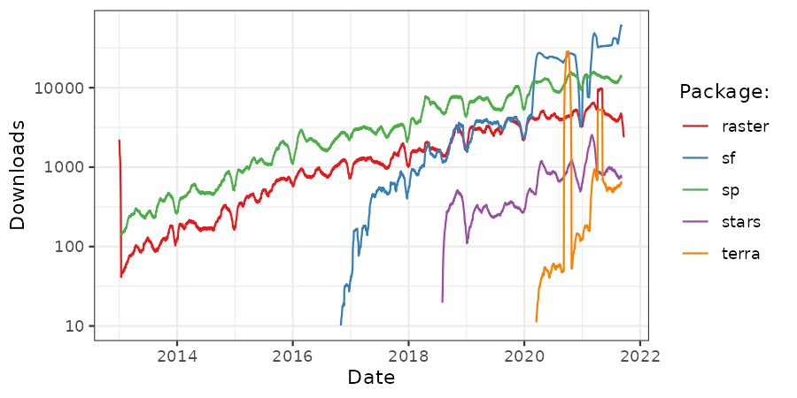

# Introduction {#intro}

This book exists at the intersection between Geography and R (Figure \@ref(fig:venn)).
Suggested titles were *Geography with R* and *R for GIS*, each of which has advantages.
The former conveys the message that it's not just about spatial data: 
non-spatial attribute data are inevitably interwoven with geometry data, and Geography is about more than where something is on the map.
The latter option communicates that this is a book about using R as a *Geographic Information System* (GIS), to perform spatial operations on *geographic data* [@bivand_applied_2013].
However, the term GIS has some negative connotations <!-- I see what you mean by negative connotations but I had to think immediately of qualitative GIS and critical GIS, i.e., scientists from the humanities criticising GIS technologies. Think of the so-called "GIS crisis", positivism, make-believe objectivity, etc.--> (see Table \@ref(tab:gdsl)) and fails to communicate one of R's greatest strengths:
its unparalleled ability to seamlessly switch between geographic and non-geographic data processing, modeling and visualization tasks.

```{r venn, fig.cap="Venn diagram of the intersection between Geography and R.", echo=FALSE, message=FALSE}
library(sf) # load sf library
p = st_sfc(st_point(c(0, 1)), st_point(c(1, 1))) # create 2 points
b = st_buffer(p, dist = 1) # convert points to circles
i = st_intersection(b[1], b[2]) # find intersection between circles
plot(b) # plot circles
text(x = c(-0.5, 1.5), y = 1, labels = c("Geography", "R")) # add text
plot(i, col = "lightgrey", add = TRUE) # color intersecting area
```

The title was chosen because this book is about more than routine spatial data processing.
What defines geocomputation as a development on previous work is the "creative and experimental use of GIS that it entails" [@longley_geocomputation:_1998].
Another advantage of the term is that it conveys the centrality of the concept of algorithms (which can be implemented in R functions) to advanced geographical research.
This is captured in the following quote from another seminal book on the subject [@openshaw_geocomputation_2000]:

> GeoComputation is about using the various different types of geodata and about
developing relevant geo-tools within the overall context of a 'scientific'
approach.

Thus geocomputation is not just about using existing tools, but creating new ones.
R is a [functional language](http://adv-r.had.co.nz/Functional-programming.html) [@wickham_advanced_2014].
It has many 'bridges' that allow access to a treasure trove of GIS algorithms.
<!-- todo - add this reference to end of previous line: -->
<!-- (\@ref(gis)). -->
It is thus ideal for quickly creating 'geo-tools', without needing to master low level languages such as C, FORTRAN and Java. 

But geocomputation is not just about the methods and code: it is about doing
"practical work that is beneficial or useful" [@openshaw_geocomputation_2000].
After reading this book you should be able to do more than just *understand* geocomputational methods or *follow* the reproducible examples implemented in code chunks in each chapter.
This book is about *doing* geocomputation.
This means applying the methods you have learned (and skills you will master) on real-world data to solve pressing problems for social and environmental benefit.

Geocomputation is a relatively young field^[Geocomputation has a ~30 year history dating back to the first [conference](http://www.geocomputation.org/) on the subject in 1996 (at the University of Leeds where the concept for this book was dreamt up) which was followed by a flurry of subsequent publications.] but algorithms published under the geocomputational banner have influenced the direction of geographical research, as we will see in subsequent chapters.
Algorithms are powerful tools that can become highly complex.
However, all algorithms are composed of smaller parts.
By teaching these foundations we aim to empower you to create your own solutions to geographic data problems. This can feel like breaking free from the metaphorical 'glass ceiling' imposed by GUI-based proprietary geographic information systems (see Table \@ref(tab:gdsl) for a definition of GUI).

<!-- todo: what contributions, which will we use, where in the book? -->

While embracing recent developments in the field, we also wanted to pay respects to the wider field of Geography, and its 2000 year history [@roller_eratosthenes_2010], of which geocomputation is a part.
Geography has played an important role in explaining and influencing humanity's relationship with the natural world and this book aims to be a part of the 'Geographic tradition'.
Geocomputation in this book therefore means more than simply analyzing geographic data on a computer.
It's about trying to make research which involves making geographic data more reproducible, scientific and socially beneficial.
This book is also part of the movement towards Geographic Data Science (GDS) which differs from GIS in several ways, some of which are outlined in Table \@ref(tab:gdsl).
Inspired by the emphasis of GDS research on reproducible research, this book aims to teach how to do geocomputation rather than just think about it.

```{r gdsl, echo=FALSE, message=FALSE}
d = readr::read_csv("extdata/gis-vs-gds-table.csv")
knitr::kable(x = d, caption = "Differences in emphasis between the fields of Geographic Information Systems (GIS) and Geographic Data Science (GDS).")
```

## Why Geocomputation with R?

In this book we treat R as a 'tool for the trade'.
Early geographers used a variety of tools including rulers, compasses and sextants to advance knowledge about the world. 
<!--nowadays part-->
It is important to remember that while R is a powerful tool, especially when interfaced with other software such as [GDAL](http://www.gdal.org/) and [PostGIS](http://postgis.net/), other tools may be better for certain tasks. <!-- What exactly do you mean? Which tasks? Is there a geocomputational task for which we do not have an interface? So maybe rephrase along the lines that R is not a GIS and therefore not suited for some geoprocessing tasks but that interfaces close this gap. -->

R is characterized by its flexibility, enabling geographical software developers to extend it in multiple ways.
A good example of this is support for generating interactive maps thanks to **leaflet** [@R-leaflet], which has been subsequently built-on by **tmap** and **mapview** [@R-tmap; @R-mapview].
These packages help overcome the criticism that R has "limited interactive [plotting] facilities" [@bivand_applied_2013].
This is no longer true, as illustrated by the code below which generates Figure \@ref(fig:interactive).

```{r, eval=FALSE, echo=FALSE}
a = osmdata::getbb("Hereford")
b = osmdata::getbb("Bialystok")
rowMeans(a)
rowMeans(b)
```

```{r interactive, fig.cap="World at night imagery from NASA overlaid by the authors' approximate home locations to illustrate interactive mapping with R."}
library(leaflet)
popup = c("Robin", "Jakub")
leaflet() %>%
  addProviderTiles("NASAGIBS.ViirsEarthAtNight2012") %>% 
  addAwesomeMarkers(lng = c(-3, 23), lat = c(52, 53), popup = popup)
```

It would be difficult to produce Figure \@ref(fig:interactive) with only 4 lines of code in another language, let alone embed the results in an interactive html page (the interactive version can be viewed at [robinlovelace.net/geocompr](http://robinlovelace.net/geocompr/intro.html)), illustrating R's flexibility. 

<!-- Other reasons for using R for geocompuation include: -->

R provides a stable language that behaves consistently across multiple computers, free of charge.
The use of R code therefore enables teaching geocomputation with reference to reproducible examples such as that provided in \@ref(fig:interactive) rather than abstract concepts.
But before cracking-on with the action, a few introductory remarks are needed to explain the approach taken here and provide context.

## R's spatial ecosystem

<!-- paragraphs (with references to chapters in the book): -->
<!-- 1. this book focus -> sf + raster/stars + leaflet/mapview (the recent state of spatial R); the history of R spatial is way longer -->

This book teaches Geocomputational techniques using an ecosystem of R packages that in many ways supersede their predecessors in terms of speed and performance.
This evolution is common in open source software: because all the code is open, developers can learn from the experiences of prior work, 'standing on the shoulders of giants', as Isaac Newton put it in [1675](http://digitallibrary.hsp.org/index.php/Detail/Object/Show/object_id/9285), rather than constantly reinventing the wheel.
In the context of spatial vector data classes in R, this can be clearly seen in the evolution of the **sf** package which in many ways evolved from the earlier **sp** package.

R's evolving spatial ecosystem should also be understood in the context of developments in the wider R community.
The visualisation and data processing packages **ggplot2** and **dplyr** (released on CRAN in [2007](https://cran.r-project.org/src/contrib/Archive/ggplot2/) and [2014](https://cran.r-project.org/src/contrib/Archive/dplyr/) respectively) exemplify these shifts.
These and other packages written by Hadley Wickham and collaborators share a common style, with a focus on 'tidy data' (hence the emergence of the term 'Hadleyverse' in [2013](https://trends.google.com/trends/explore?q=hadleyverse)).
For ease of installation and to harmonize packages in this style, the **tidyverse** 'metapackage' was released in late [2016](https://cran.r-project.org/src/contrib/Archive/tidyverse/).
Although there is no equivalent **sfverse**, there are a growing number of actively developed package which use **sf** (Table \@ref(tab:revdep)) and discussion of harmonization among R's many spatial packages.^[
See the [r-spatial](https://github.com/r-spatial/) organisation and conversations in the [discussion](https://github.com/r-spatial/discuss/issues/11) repo for more on this.
]

```{r revdep, echo=FALSE, message=FALSE}
top_dls = readr::read_csv("extdata/top_dls.csv")
cap = paste0("The top 5 most downloaded packages that depend on sf, in terms of average number of downloads per day over the previous month. As of ", min(top_dls$date), " there are ", nrow(top_dls), " packages which import sf.")
knitr::kable(top_dls[1:5, 1:2], digits = 0, caption = cap)
# cranlogs::cran_top_downloads(when = "last-month") # most downloaded pkgs
```

A surge in development time (and interest) in 'R-Geo' has followed the award of a grant by the R Consortium for the development of support for Simple Features and the resulting **sf** package (covered in \@ref(intro-sf)).
This is illustrated in multiple places, not least the [R-sig-Geo Archives](https://stat.ethz.ch/pipermail/r-sig-geo/), a long-standing open access email list containing much R-spatial wisdom accumulated over the years.
Many posts on the list now discuss **sf** and related packages, suggesting that R's spatial software developers are using the package and, therefore, it is here to stay.
We will see in the next chapter how Simple Features in R work and their many advantages.

We propose that the release of **sf** heralds a new era for spatial data analysis and geocomputation in R.
This era (which we refrain from labelling the **sfverse** with any seriousness, awaiting a better name!) clearly has the wind in its sails and is set to dominate future developments in R's spatial ecosystem for years to come.
So time invested in learning the 'new ways' of handling spatial data and, hopefully, reading this book, is well spent!

```{r cranlogs, fig.cap="The popularity of spatial packages in R. The y axis shows the average number of downloads, within a 30 day rolling window, of R's top 5 spatial packages, defined as those with the highest number of downloads within the last 30 days.", echo=FALSE}

```

This book focuses on the 'new' way of doing geocomputation for practical purposes and to ensure that what you learn here is 'future-proof'.
There is one caveat to this, however: younger packages are generally less stable and may undergo changes to the way they function or (more commonly) add more features. In other words:

> If you live on the cutting edge you risk getting hurt.

It is therefore worth being aware of the history of the development of spatial data functionality in R.
This not only because the incumbent packages are highly mature: there is a wealth of functions, use-cases and teaching material written using older packages in R's spatial ecosystem, so it's worth being aware of the history preceding the rise of **sf** depicted in Figure \@ref(fig:cranlogs).

## The history of geocomputing with R

<!-- INTRO -->
<!-- https://cran.r-project.org/web/views/Spatial.html -->
<!-- We would like to give you the ability to use the **sf**, raster/stars, **tmap**, **leaflet** and **mapview** packages to solve spatial problems.  -->
<!-- However, spatial analysis in R has a long history. -->
<!-- 2. R spatial story (from spatstat, by maptools, sp, raster, leaflet, to sf) -->
In the volume 1/2 of R News (the predecessor of The R Journal), Brian Ripley created an overview of the spatial statistics state in June 2001 [@ripley_spatial_2001]. 
He shortly described eight packages, mostly used for spatial smoothing end interpolation (such as **akima**, **spatial**, **sgeostat** and **geoR**) and spatial point patterns (**splancs** and **spatstat**).
Most of these packages where based on the previous code written for S or S-PLUS.
The last mentioned package, **spatstat** became a standard for analyzing spatial point patterns.
<!-- We shortly described examples of point pattern analysis in \@ref(point-pattern). -->
However, most of this topic goes beyond the scope of this book, so for more information we recommend the book of @baddeley_spatial_2015.

In the next issue of R News, @bivand_more_2001 gave an introduction to the **splanc** package and suggested some future prospects.
The most notably, he mentioned the need for standardized R spatial interface, more efficient mechanisms for exchanging data with GIS, and better ways to treat spatial metadata (such as spatial projections).
<!-- https://pdfs.semanticscholar.org/9bb5/c9571d64bd3e1ae376967b6c6aca39d6fa70.pdf -->
<!-- http://onlinelibrary.wiley.com/doi/10.1111/j.0016-7363.2005.00672.x/full -->
Two years later, he presented an extended review of existing R spatial packages at the 3rd International Workshop on Distributed Statistical Computing (DSC 2003) [@hornik_approaches_2003]. 
At this stage, R spatial development started to be connected with the advancement in spatial software libraries, especially the Geospatial Data Abstraction Library (GDAL) and PROJ.4. <!--CITE-->
They allow reading and writing vector and raster data formats, and conversions between coordinate reference systems. 
<!-- More importantly, he also proposed a basis for spatial data classes in R there., which were partially based on the ESRI Shapefile format.-->
Based on the data types offered by GDAL, Bivand also proposed a basis for spatial data classes in R, with the fundamental types of spatial data highlighted - point, line, polygon and raster.
<!-- https://edzer.github.io/UseR2017/#a-short-history-of-handling-spatial-data-in-r -->
This idea was converted into a reality with creation of two, very closely connected R packages - **rgdal** and **sp**.

The first one, **rgdal** was released on CRAN in 2003 and provided an interface to GDAL and the PROJ.4 libraries.
It gave unmatched abilities to read and write dozens of different spatial data formats.
Importantly, it also was able to keep an information about coordinate reference system and allowed for map projection and datum transformation.

The second one, **sp**, was created in 2003-2004 and its first version was released in 2005. 
This package was an answer to the major R spatial shortcoming - inability to distinguish spatial and non-spatial objects.
Prior to the creation of **sp**, spatial coordinates were treated as numbers. 
The **sp** package provided classes and methods for spatial data. 
Spatial objects could be represented as a one of four **sp** structures - points, lines, polygons and grids, all of which had two version - with and without attribute data. <!--???-->
<!-- points, multipoints, pixels, full grid, line, lines, spatial lines, polygon, polygons, spatial polygons -->
These objects were built using S4 classes, where all the information (such as bounding box, coordinate reference system, attribute table) were stored in specific slots.
Attribute data in **sp** were represented as `data.frame`, which enabled users to do non-spatial processing, for example data subsetting or adding new columns.
More importantly, this package also implemented a set of spatial methods.
For example, it allowed for spatial summary and retrieval of spatial information, such as a number of dimensions, bounding box, spatial coordinates.
The **sp** package together with **rgdal** made possible transform from one coordinate reference system to another.
Finally, **sp** provided mapping capabilities using either the base plotting system or the lattice system.

The organization of spatial data in the **sp** package rapidly become an R spatial standard.
This resulted in a growing number of R packages built upon **sp**. 
About twenty packages depended **sp** by 2008, about one hundred by 2013 and more than 125 in 2017 [@bivand_applied_2013].
On top of that, now about 220 packages imports some functions from the **sp** package. 
<!-- https://github.com/Robinlovelace/geocompr/issues/58 -->
<!-- https://github.com/edzer/sfr/issues/387#issuecomment-308949140 -->
Some of the most prominent R packages using **sp** are: **gstat** - a set of functions for spatial and spatio-temporal geostatistics, **geosphere** used for spherical trigonometry, and **adehabitat** used for the analysis of habitat selection by animals.

**rgdal** and **sp** overcome many spatial R shortcomings, however R still lacked a geometry calculation abilities.
A robust geometry engine to R was added in the **rgeos** package as a part of Google Summer of Code 2010.
It integrated spatial object from **sp** with the spatial functions and operators from GEOS library.

Although **sp** provided a possibility of read and process grid data, its non-vector capabilities were limited. 
A new **raster** package was created to fill this gap.
It established new spatial classes for raster objects and add functions for creating, reading and writing raster data.
Moreover, it implemented raster algebra, general raster functions and gave tools for development of more specific raster functions.
Very important feature of **raster** was its ability to work with raster dataset that are too large to be fitted in RAM.
<!-- one more sentence -->
<!-- https://cran.r-project.org/web/packages/raster/vignettes/Raster.pdf -->
<!-- https://geoscripting-wur.github.io/IntroToRaster/#Overview_of_the_raster_package -->
<!-- https://cran.r-project.org/src/contrib/Archive/raster/ (2010) -->
<!-- https://artax.karlin.mff.cuni.cz/r-help/library/raster/html/raster-package.html -->

<!-- http://www.geocomputation.org/2000/GC009/Gc009.htm -->
<!-- http://www.sciencedirect.com/science/article/pii/S0098300400000571 -->
<!-- http://onlinelibrary.wiley.com/doi/10.1111/j.0016-7363.2005.00672.x/full -->
Simultaneously with the development of spatial classes and methods, R started to be used as an interface to several GIS software.
The most popular early example was the **GRASS** package <!--CITE-->. <!--http://www.sciencedirect.com/science/article/pii/S0098300400000571?via%3Dihub-->
Its first version was released in 2000 and enabled a connection between R and GRASS GIS 5.0.
In the latter years, a two new packages were published after the release of the new GRASS GIS versions: **spgrass6** for GRASS GIS 6 and **rgrass7** for GRASS GIS 7.
Other examples of bridges between R and GIS include RSAGA (first release in 2008), ArcGIS (2008) and RQGIS (2016). <!--CITE-->
More information about interfaces between R and GIS software could be find in \@ref(gis).

**sp** provided methods for plotting data using the two existing systems - base and lattile.
In 2007, the third system, **ggplot2**, was published.
It gave a possibilty to convert spatial objects from **sp** into `data.frames` to plot them. <!-- rewrite; check when projections were implemented -->
**ggplot2** spatial capabilities were improved in 2011  with the release of its accompanning <!--??--> package - **ggmap**, which added <!--x, y, z.-->
<!--raster in the ggplot2 package??-->
Also in 2011, the possibilities of the lattice system was added to raster objects with publish of the **rasterVis** package.
<!-- its power -->

Hovewer, demand for convinient methods for data visualisations rose with an increase in R spatial possibilities. 
Demand for convinient methods for data visualisations rose with an increase in R spatial possibilities. 


<!-- visualization revolution -->
<!-- ggplot2 -->
<!-- ggmap -->
<!-- rasterVis -->
<!-- tmap -->
<!-- R - an interface to visualisation libraries - mostly java script - leaflet->mapview -->
<!-- leaflet + mapview -->

<!-- Nowadays xx spatial packages in R -->
<!-- https://cran.r-project.org/web/views/Spatial.html -->
The most important recent evolution in R's spatial ecosystem has without doubt been support for simple features thanks to the **sf** package [@R-sf], described in Chapter \@ref(spatial-class).
