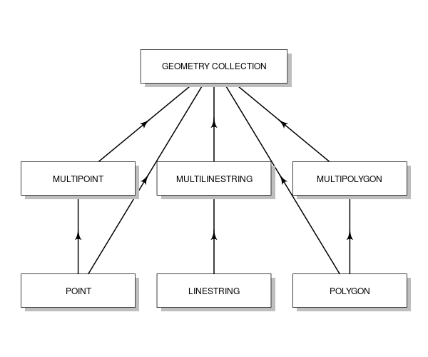
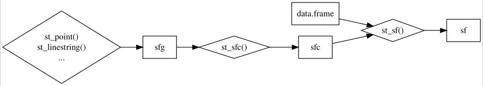
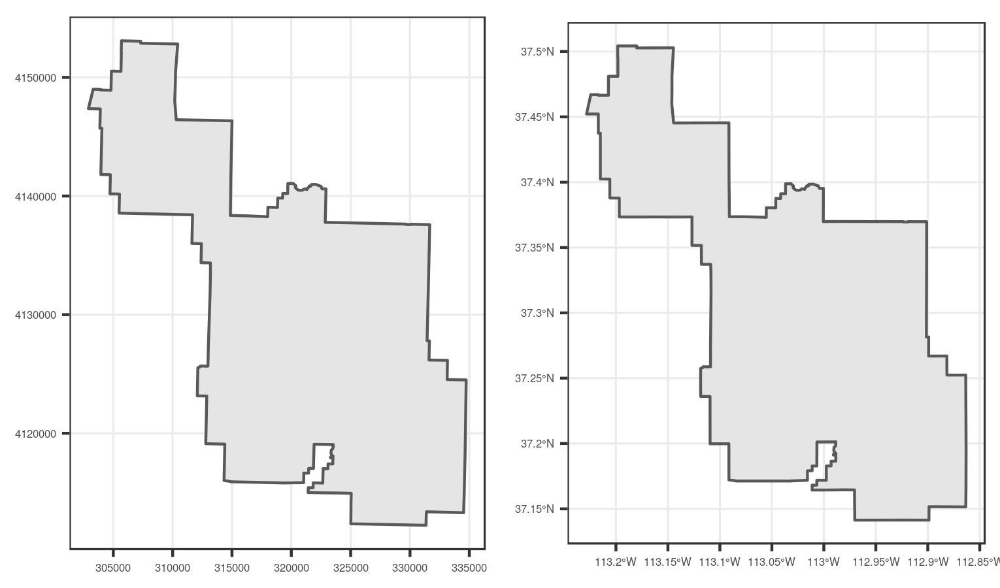

# (PART) Foundations {-}

# Geographic data in R {#spatial-class}

## Prerequisites {-}

This is the first practical chapter of the book, and therefore it comes with some software requirements.
You need access to a computer with a recent version of R installed (R [4.2.0](https://stat.ethz.ch/pipermail/r-announce/2022/000683.html) or a later version).
We recommend not only reading the prose but also *running the code* in each chapter to build your geocomputational skills.

To keep track of your learning journey, it may be worth starting by creating a new folder on your computer to save your R scripts, outputs and other things related to Geocomputation with R as you go.
You can also [download](https://github.com/Robinlovelace/geocompr/archive/refs/heads/main.zip) or [clone](https://docs.github.com/en/repositories/creating-and-managing-repositories/cloning-a-repository) the [source code](https://github.com/Robinlovelace/geocompr) underlying the book to support your learning.
We strongly recommend installing an integrated development environment (IDE) such as [RStudio](https://www.rstudio.com/products/rstudio/download/#download) (recommended for most people) or [VS Code](https://github.com/REditorSupport/vscode-R) when writing/running/testing R code.^[
We recommend using [RStudio projects](https://r4ds.had.co.nz/workflow-projects.html), [VS Code workspaces](https://code.visualstudio.com/docs/editor/workspaces) or similar system to manage your projects.
A quick way to do this with RStudio is via the **rstudioapi** package.
Open a new project called 'geocompr-learning' in your home directory with the following command from the R console in RStudio, for example: `rstudioapi::openProject("~/geocompr-learning")`.
]

If you are new to R, we recommend following introductory R resources such as [Hands on Programming with R](https://rstudio-education.github.io/hopr/starting.html) by Garrett Grolemund or an [Introduction to R](https://cengel.github.io/R-intro/) by Claudia Engel before you dive into Geocomputation with R code.
Organize your work (e.g., with RStudio projects) and give scripts sensible names such as `chapter-02-notes.R` to document the code as you learn.
\index{R!pre-requisites}

After you have got a good set-up, it's time to run some code!
Unless you already have these packages installed, the first thing to do is to install foundational R packages used in this chapter, with the following commands:^[
**spDataLarge** is not on CRAN\index{CRAN}, meaning it must be installed via *r-universe*  or with the following command: `remotes::install_github("Nowosad/spDataLarge")`.
]

```{r 02-spatial-data-1, eval=FALSE}
install.packages("sf")
install.packages("terra")
install.packages("spData")
install.packages("spDataLarge", repos = "https://nowosad.r-universe.dev")
```

\index{R!installation}
```{block2 02-spatial-data-2, type='rmdnote'}
We recommend following R instructions on [CRAN](https://cran.r-project.org/).
If you're running Mac or Linux, the previous command to install **sf** may not work first time.
These operating systems (OSs) have 'systems requirements' that are described in the package's [README](https://github.com/r-spatial/sf).
Other OS-specific instructions can be found online, including the article *Installation of R 4.2 on Ubuntu 22.04.1 LTS and tips for spatial packages* on the [rtask.thinkr.fr](https://rtask.thinkr.fr/installation-of-r-4-2-on-ubuntu-22-04-lts-and-tips-for-spatial-packages/) website.
```

The packages needed to reproduce Part 1 of this book can be installed with the following command: `remotes::install_github("geocompr/geocompkg")`.
This command uses the function `install_packages()` from the **remotes** package to install source code hosted on the GitHub code hosting, version and collaboration platform.
The following command will install **all** dependencies required to reproduce the entire book (warning: this may take several minutes): `remotes::install_github("geocompr/geocompkg", dependencies = TRUE)`

The packages needed to run the code presented in this chapter can be 'loaded' (technically they are attached) with the `library()` function as follows:

```{r 02-spatial-data-3-1, message=TRUE}
library(sf)          # classes and functions for vector data
```

The output from `library(sf)` reports which versions of key geographic libraries such as GEOS the package is using, as outlined in Section \@ref(intro-sf).

```{r 02-spatial-data-3-2, message=FALSE}
library(terra)      # classes and functions for raster data
```

The other packages that were installed contain data that will be used in the book:

```{r 02-spatial-data-4, results='hide'}
library(spData)        # load geographic data
library(spDataLarge)   # load larger geographic data
```

## Introduction {#intro-spatial-class}

This chapter will provide brief explanations of the fundamental geographic data models:\index{data models} vector and raster.
We will introduce the theory behind each data model and the disciplines in which they predominate, before demonstrating their implementation in R.

The *vector data model* represents the world using points, lines and polygons.
These have discrete, well-defined borders, meaning that vector datasets usually have a high level of precision (but not necessarily accuracy as we will see in Section \@ref(units)).
The *raster data model* divides the surface up into cells of constant size.
Raster datasets are the basis of background images used in web-mapping and have been a vital source of geographic data since the origins of aerial photography and satellite-based remote sensing devices.
Rasters aggregate spatially specific features to a given resolution, meaning that they are consistent over space and scalable (many worldwide raster datasets are available).

Which to use?
The answer likely depends on your domain of application:

- Vector data tends to dominate the social sciences because human settlements tend to have discrete borders
- Raster dominates many environmental sciences because of the reliance on remote sensing data

There is much overlap in some fields and raster and vector datasets can be used together:
ecologists and demographers, for example, commonly use both vector and raster data.
Furthermore, it is possible to convert between the two forms (see Section \@ref(raster-vector)).
Whether your work involves more use of vector or raster datasets, it is worth understanding the underlying data model before using them, as discussed in subsequent chapters.
This book uses **sf** and **terra** packages to work with vector data and raster datasets, respectively.

## Vector data

```{block2 02-spatial-data-5, type="rmdnote"}
Take care when using the word 'vector' as it can have two meanings in this book:
geographic vector data and the `vector` class (note the `monospace` font) in R.
The former is a data model, the latter is an R class just like `data.frame` and `matrix`.
Still, there is a link between the two: the spatial coordinates which are at the heart of the geographic vector data model can be represented in R using `vector` objects.
```

The geographic vector data model\index{vector data model} is based on points located within a coordinate reference system\index{coordinate reference system|see {CRS}} (CRS\index{CRS}).
Points can represent self-standing features (e.g., the location of a bus stop) or they can be linked together to form more complex geometries such as lines and polygons.
Most point geometries contain only two dimensions (3-dimensional CRSs contain an additional $z$ value, typically representing height above sea level).

In this system London, for example, can be represented by the coordinates `c(-0.1, 51.5)`.
This means that its location is -0.1 degrees east and 51.5 degrees north of the origin.
The origin in this case is at 0 degrees longitude (the Prime Meridian) and 0 degree latitude (the Equator) in a geographic ('lon/lat') CRS (Figure \@ref(fig:vectorplots), left panel).
The same point could also be approximated in a projected CRS with 'Easting/Northing' values of `c(530000, 180000)` in the [British National Grid](https://en.wikipedia.org/wiki/Ordnance_Survey_National_Grid), meaning that London is located 530 km *East* and 180 km *North* of the $origin$ of the CRS.
This can be verified visually: slightly more than 5 'boxes' --- square areas bounded by the gray grid lines 100 km in width --- separate the point representing London from the origin (Figure \@ref(fig:vectorplots), right panel).

The location of National Grid's\index{National Grid} origin, in the sea beyond South West Peninsular, ensures that most locations in the UK have positive Easting and Northing values.^[
The origin we are referring to, depicted in blue in Figure \@ref(fig:vectorplots), is in fact the 'false' origin.
The 'true' origin, the location at which distortions are at a minimum, is located at 2° W and 49° N.
This was selected by the Ordnance Survey to be roughly in the center of the British landmass longitudinally.
]
There is more to CRSs, as described in Sections \@ref(crs-intro) and \@ref(reproj-geo-data) but, for the purposes of this section, it is sufficient to know that coordinates consist of two numbers representing distance from an origin, usually in $x$ then $y$ dimensions.

```{r vectorplots-source, include=FALSE, eval=FALSE}
source("https://github.com/Robinlovelace/geocompr/raw/main/code/02-vectorplots.R") # generate subsequent figure
```

```{r vectorplots, fig.cap="Illustration of vector (point) data in which location of London (the red X) is represented with reference to an origin (the blue circle). The left plot represents a geographic CRS with an origin at 0° longitude and latitude. The right plot represents a projected CRS with an origin located in the sea west of the South West Peninsula.", out.width="49%", fig.show='hold', echo=FALSE, fig.scap="Illustration of vector (point) data."}
knitr::include_graphics(c("figures/vector_lonlat.png", "figures/vector_projected.png"))
```

**sf** provides classes for geographic vector data and a consistent command-line interface to important low level libraries for geocomputation:

- [GDAL](https://gdal.org/)\index{GDAL}, for reading, writing and manipulating a wide range of geographic data formats, covered in Chapter \@ref(read-write)
- [PROJ](https://proj.org/), a powerful library for coordinate system transformations, which underlies the content covered in Chapter \@ref(reproj-geo-data)
- [GEOS](https://libgeos.org/)\index{GEOS}, a planar geometry engine for operations such as calculating buffers and centroids on data with a projected CRS, covered in Chapter \@ref(geometry-operations)
- [S2](https://s2geometry.io/), a spherical geometry engine written in C++ developed by Google, via the [**s2**](https://r-spatial.github.io/s2/) package, covered in Section \@ref(s2) below and in Chapter \@ref(reproj-geo-data)
<!-- - [liblwgeom](https://github.com/postgis/postgis/tree/master/liblwgeom), a geometry engine used by PostGIS, via the [**lwgeom**](https://r-spatial.github.io/lwgeom/) package -->

Information about these interfaces is printed by **sf** the first time the package is loaded: the message `Linking to GEOS 3.8.0, GDAL 3.0.4, PROJ 6.3.1; sf_use_s2() is TRUE` that appears below the `library(sf)` command at the beginning of this chapter tells us the versions of linked GEOS, GDAL and PROJ libraries (these vary between computers and over time) and whether or not the S2 interface is turned on.
Nowadays, we take it for granted, however, only the tight integration with different geographic libraries makes reproducible geocomputation possible in the first place.

A neat feature of **sf** is that you can change the default geometry engine used on unprojected data: 'switching off' S2 can be done with the command `sf::sf_use_s2(FALSE)`, meaning that the planar geometry engine GEOS will be used by default for all geometry operations, including geometry operations on unprojected data.
As we will see in Section \@ref(s2), planar geometry is based on 2 dimensional space.
Planar geometry engines such as GEOS assume 'flat' (projected) coordinates while spherical geometry engines such as S2 assume unprojected (lon/lat) coordinates.

This section introduces **sf** classes in preparation for subsequent chapters (Chapters \@ref(geometry-operations) and \@ref(read-write) cover the GEOS and GDAL interface, respectively).

### An introduction to simple features {#intro-sf}

Simple features is an [open standard](http://portal.opengeospatial.org/files/?artifact_id=25355) developed and endorsed by the Open Geospatial Consortium (OGC), a not-for-profit organization whose activities we will revisit in a later chapter (in Section \@ref(file-formats)).
\index{simple features |see {sf}}
Simple Features is a hierarchical data model that represents a wide range of geometry types.
Of 18 geometry types supported by the specification, only 7 are used in the vast majority of geographic research (see Figure \@ref(fig:sf-ogc));
these core geometry types are fully supported by the R package **sf** [@pebesma_simple_2018].^[
The full OGC standard includes rather exotic geometry types including 'surface' and 'curve' geometry types, which currently have limited application in real world applications.
All 18 types can be represented with the **sf** package, although at the time of writing (2022) plotting only works for the 'core 7'.
]

```{r sf-ogc, fig.cap="Simple feature types fully supported by sf.", out.width="60%", echo=FALSE}

```

**sf** can represent all common vector geometry types (raster data classes are not supported by **sf**): points, lines, polygons and their respective 'multi' versions (which group together features of the same type into a single feature).
\index{sf}
\index{sf (package)|see {sf}}
**sf** also supports geometry collections, which can contain multiple geometry types in a single object.
**sf** provides the same functionality (and more) previously provided in three packages --- **sp** for data classes [@R-sp], **rgdal** for data read/write via an interface to GDAL and PROJ [@R-rgdal] and **rgeos** for spatial operations via an interface to GEOS [@R-rgeos].


To re-iterate the message from Chapter 1, geographic R packages have a long history of interfacing with lower level libraries, and **sf** continues this tradition with a unified interface to recent versions GEOS for geometry operations, the GDAL library for reading and writing geographic data files, and the PROJ library for representing and transforming projected coordinate reference systems.
Through **s2**,
<!-- **s2** functions have replaced **lwgeom** ones (Bivand 2021). -->
<!-- and **lwgeom**, **sf** also has an inter to PostGIS's [`liblwgeom`](https://github.com/postgis/postgis/tree/master/liblwgeom) library  -->
"an R interface to Google's spherical geometry library [`s2`](https://s2geometry.io/), **sf** also has access to fast and accurate "measurements and operations on non-planar geometries" [@bivand_progress_2021].
Since **sf** version 1.0.0, launched in [June 2021](https://cran.r-project.org/src/contrib/Archive/sf/), **s2** functionality is now used by [default](https://r-spatial.org/r/2020/06/17/s2.html) on geometries with geographic (longitude/latitude) coordinate systems, a unique feature of **sf** that differs from spatial libraries that only support GEOS for geometry operations such as the Python package [GeoPandas](geopandas/geopandas/issues/2098).
We will discuss **s2** in subsequent chapters.
<!-- Todo: link to them, e.g. (RL 2021-11) -->
<!-- See sections \@ref(s2) and \@ref(buffers) for further details. -->

**sf**'s ability to integrate multiple powerful libraries for geocomputation into a single framework is a notable achievement that reduces 'barriers to entry' into the world of reproducible geographic data analysis with high-performance libraries.
**sf**'s functionality is well documented on its website at [r-spatial.github.io/sf/](https://r-spatial.github.io/sf/index.html) which contains 7 vignettes.
These can be viewed offline as follows:

```{r 02-spatial-data-6, eval=FALSE}
vignette(package = "sf") # see which vignettes are available
vignette("sf1")          # an introduction to the package
```

```{r 02-spatial-data-7, eval=FALSE, echo=FALSE}
vignette("sf1") # an introduction to the package
vignette("sf2") # reading, writing and converting simple features
vignette("sf3") # manipulating simple feature geometries
vignette("sf4") # manipulating simple features
vignette("sf5") # plotting simple features
vignette("sf6") # miscellaneous long-form documentation
vignette("sf7") # spherical geometry operations
```

As the first vignette explains, simple feature objects in R are stored in a data frame, with geographic data occupying a special column, usually named 'geom' or 'geometry'.
We will use the `world` dataset provided by **spData**, loaded at the beginning of this chapter, to show what `sf` objects and how they work.
`world` is an '`sf` data frame' containing spatial and attribute columns, the names of which are returned by the function `names()` (the last column in this example contains the geographic information):

```{r 02-spatial-data-8}
class(world)
names(world)
```

The contents of this `geom` column give `sf` objects their spatial powers: `world$geom` is a '[list column](https://adv-r.hadley.nz/vectors-chap.html#list-columns)' that contains all the coordinates of the country polygons.
\index{list column}
`sf` objects can be plotted quickly with the base R function `plot()`;
the following command creates Figure \@ref(fig:world-all).

```{r world-all, fig.cap="A spatial plot of the world using the sf package, with a facet for each attribute.", warning=FALSE, fig.scap="A spatial plot of the world using the sf package."}
plot(world)
```

Note that instead of creating a single map by default for geographic objects, as most GIS programs do, `plot()`ing `sf` objects results in a map for each variable in the datasets.
This behavior can be useful for exploring the spatial distribution of different variables and is discussed further in Section \@ref(basic-map).

More broadly, treating geographic objects as regular data frames with spatial powers has many advantages, especially if you are already used to working with data frames.
The commonly used `summary()` function, for example, provides a useful overview of the variables within the `world` object.

```{r 02-spatial-data-9}
summary(world["lifeExp"])
```

Although we have only selected one variable for the `summary()` command, it also outputs a report on the geometry.
This demonstrates the 'sticky' behavior of the geometry columns of **sf** objects, meaning the geometry is kept unless the user deliberately removes them, as we'll see in Section \@ref(vector-attribute-manipulation).
The result provides a quick summary of both the non-spatial and spatial data contained in `world`: the mean average life expectancy is 71 years (ranging from less than 51 to more than 83 years with a median of 73 years) across all countries.

```{block2 02-spatial-data-10, type='rmdnote'}
The word `MULTIPOLYGON` in the summary output above refers to the geometry type of features (countries) in the `world` object.
This representation is necessary for countries with islands such as Indonesia and Greece.
Other geometry types are described in Section \@ref(geometry).
```

It is worth taking a deeper look at the basic behavior and contents of this simple feature object, which can usefully be thought of as a '**s**patial data **f**rame'.

`sf` objects are easy to subset: the code below shows how to return an object containing only the first two rows and the first three columns of the `world` object.
The output shows two major differences compared with a regular `data.frame`: the inclusion of additional geographic metadata (`Geometry type`, `Dimension`, `Bounding box` and coordinate reference system information on the line beginning `Geodetic CRS` CRS information), and the presence of a 'geometry column', here named `geom`:

```{r 02-spatial-data-11}
world_mini = world[1:2, 1:3]
world_mini
```

All this may seem rather complex, especially for a class system that is supposed to be 'simple'!
However, there are good reasons for organizing things this way and using **sf** to work with vector geographic datasets.

Before describing each geometry type that the **sf** package supports, it is worth taking a step back to understand the building blocks of `sf` objects. 
Section \@ref(sf) shows how simple features objects are data frames, with special geometry columns.
These spatial columns are often called `geom` or `geometry`: `world$geom` refers to the spatial element of the `world` object described above.
These geometry columns are 'list columns' of class `sfc` (see Section \@ref(sfc)).
In turn, `sfc` objects are composed of one or more objects of class `sfg`: simple feature geometries that we describe in Section \@ref(sfg).
\index{sf!sfc}
\index{simple feature columns|see {sf!sfc}}

To understand how the spatial components of simple features work, it is vital to understand simple feature geometries.
For this reason we cover each currently supported simple features geometry type in Section \@ref(geometry) before moving on to describe how these can be represented in R using `sf` objects, which are based on `sfg` and `sfc` objects.

```{block2 assignment, type='rmdnote'}
The preceding code chunk uses `=` to create a new object called `world_mini` in the command `world_mini = world[1:2, 1:3]`.
This is called assignment.
An equivalent command to achieve the same result is `world_mini <- world[1:2, 1:3]`.
Although 'arrow assigment' is more commonly used, we use 'equals assignment' because it's slightly faster to type and easier to teach due to compatibility with commonly used languages such as Python and JavaScript.
Which to use is largely a matter of preference as long as you're consistent (packages such as **styler** can be used to change style).
```

### Why simple features?

Simple features is a widely supported data model that underlies data structures in many GIS applications including QGIS\index{QGIS} and PostGIS\index{PostGIS}.
A major advantage of this is that using the data model ensures your work is cross-transferable to other set-ups, for example importing from and exporting to spatial databases.
\index{sf!why simple features}

A more specific question from an R perspective is "why use the **sf** package when **sp** is already tried and tested"?
There are many reasons (linked to the advantages of the simple features model):

- Fast reading and writing of data
- Enhanced plotting performance
- **sf** objects can be treated as data frames in most operations
- **sf** function names are relatively consistent and intuitive (all begin with `st_`)
- **sf** functions can be combined with the `|>` operator and works well with the [tidyverse](http://tidyverse.org/) collection of R packages\index{tidyverse}.

**sf**'s support for **tidyverse** packages is exemplified by the provision of the `read_sf()` function for reading geographic vector datasets.
Unlike the function `st_read()`, which returns attributes stored in a base R `data.frame` (and which provides more verbose messages, not shown in the code chunk below), `read_sf()` returns data as a **tidyverse** `tibble`.
This is demonstrated below (see Section \@ref(iovec)) on reading geographic vector data):

```{r}
world_dfr = st_read(system.file("shapes/world.shp", package = "spData"))
world_tbl = read_sf(system.file("shapes/world.shp", package = "spData"))
class(world_dfr)
class(world_tbl)
```

As described in Chapter \@ref(attr), which shows how to manipulate `sf` objects with **tidyverse** functions, **sf** is now the go-to package for analysis of spatial vector data in R (not withstanding the **spatstat** package ecosystem which provides numerous functions for spatial statistics).
Many popular packages build on **sf**, as shown by the rise in its popularity in terms of number of downloads per day, as shown in Section \@ref(r-ecosystem) in the previous chapter.
Transitioning established packages and workflows away from legacy packages **rgeos** and **rgdal** takes time [@bivand_progress_2021], but the process was given a sense of urgency by messages printed when they were loaded, which state that they "will be retired by the end of 2023".
This means that anyone still using these packages should "**transition to sf/stars/terra functions using GDAL and PROJ at your earliest convenience**". 

In other words, **sf** is future proof but **sp** is not.
For workflows that depend on the legacy class system, `sf` objects can be converted from and to the `Spatial` class of the **sp** package as follows:

```{r 02-spatial-data-12, eval=FALSE}
library(sp)
world_sp = as(world, "Spatial") # from an sf object to sp
# sp functions ...
world_sf = st_as_sf(world_sp)           # from sp to sf
```

### Basic map making {#basic-map}

Basic maps are created in **sf** with `plot()`.
By default this creates a multi-panel plot, one sub-plot for each variable of the object, as illustrated in the left-hand panel in Figure \@ref(fig:sfplot).
A legend or 'key' with a continuous color is produced if the object to be plotted has a single variable (see the right-hand panel).
Colors can also be set with `col = `, although this will not create a continuous palette or a legend. 
\index{map making!basic}

```{r sfplot, fig.cap="Plotting with sf, with multiple variables (left) and a single variable (right).", out.width="49%", fig.show='hold', warning=FALSE, fig.scap="Plotting with sf."}
plot(world[3:6])
plot(world["pop"])
```

Plots are added as layers to existing images by setting `add = TRUE`.^[
`plot()`ing of **sf** objects uses `sf:::plot.sf()` behind the scenes.
`plot()` is a generic method that behaves differently depending on the class of object being plotted.
]
To demonstrate this, and to provide a insight into the contents of Chapters \@ref(attr) and \@ref(spatial-operations) on attribute and spatial data operations, the subsequent code chunk filters countries in Asia and combines them into a single feature:

```{r 02-spatial-data-14, warning=FALSE}
world_asia = world[world$continent == "Asia", ]
asia = st_union(world_asia)
```

We can now plot the Asian continent over a map of the world.
Note that the first plot must only have one facet for `add = TRUE` to work.
If the first plot has a key, `reset = FALSE` must be used (result not shown):

```{r asia, out.width='50%', fig.cap="A plot of Asia added as a layer on top of countries worldwide.", eval=FALSE}
plot(world["pop"], reset = FALSE)
plot(asia, add = TRUE, col = "red")
```

Adding layers in this way can be used to verify the geographic correspondence between layers: 
the `plot()` function is fast to execute and requires few lines of code, but does not create interactive maps with a wide range of options.
For more advanced map making we recommend using dedicated visualization packages such as **tmap** (see Chapter \@ref(adv-map)).

There are various ways to modify maps with **sf**'s `plot()` method.
Because **sf** extends base R plotting methods `plot()`'s arguments such as `main =` (which specifies the title of the map) work with `sf` objects (see `?graphics::plot` and `?par`).^[
Note: many plot arguments are ignored in facet maps, when more than one `sf` column is plotted.
]
\index{base plot|see {map making}}
\index{map making!base plotting}

Figure \@ref(fig:contpop) illustrates this flexibility by overlaying circles, whose diameters (set with `cex =`) represent country populations, on a map of the world.
An unprojected version of this figure can be created with the following commands (see exercises at the end of this chapter and the script [`02-contplot.R`](https://github.com/Robinlovelace/geocompr/blob/main/code/02-contpop.R) to reproduce Figure \@ref(fig:contpop)):

```{r 02-spatial-data-16, eval=FALSE}
plot(world["continent"], reset = FALSE)
cex = sqrt(world$pop) / 10000
world_cents = st_centroid(world, of_largest = TRUE)
plot(st_geometry(world_cents), add = TRUE, cex = cex)
```

```{r contpop, fig.cap="Country continents (represented by fill color) and 2015 populations (represented by circles, with area proportional to population).", echo=FALSE, warning=FALSE, fig.scap="Country continents and 2015 populations."}
source("https://github.com/Robinlovelace/geocompr/raw/main/code/02-contpop.R")
```

The code above uses the function `st_centroid()` to convert one geometry type (polygons) to another (points) (see Chapter \@ref(geometry-operations)), the aesthetics of which are varied with the `cex` argument.

\index{bounding box}
**sf**'s plot method also has arguments specific to geographic data. `expandBB`, for example, can be used to plot an `sf` object in context:
it takes a numeric vector of length four that expands the bounding box of the plot relative to zero in the following order: bottom, left, top, right.
This is used to plot India in the context of its giant Asian neighbors, with an emphasis on China to the east, in the following code chunk, which generates Figure \@ref(fig:china) (see exercises below on adding text to plots):^[
Note the use of `st_geometry(india)` to return only the geometry associated with the object to prevent attributes being plotted in a simple feature column (`sfc`) object.
An alternative is to use `india[0]`, which returns an `sf` object that contains no attribute data..
]

```{r 02-spatial-data-17, eval=FALSE}
india = world[world$name_long == "India", ]
plot(st_geometry(india), expandBB = c(0, 0.2, 0.1, 1), col = "gray", lwd = 3)
plot(st_geometry(world_asia), add = TRUE)
```

```{r china, fig.cap="India in context, demonstrating the expandBB argument.", warning=FALSE, echo=FALSE, out.width="50%"}
old_par = par(mar = rep(0, 4))
india = world[world$name_long == "India", ]
indchi = world_asia[grepl("Indi|Chi", world_asia$name_long), ]
indchi_points = st_centroid(indchi)
indchi_coords = st_coordinates(indchi_points)
plot(st_geometry(india), expandBB = c(-0.2, 0.5, 0, 1), col = "gray", lwd = 3)
plot(world_asia[0], add = TRUE)
text(indchi_coords[, 1], indchi_coords[, 2], indchi$name_long)
par(old_par)
```

```{r, eval=FALSE, echo=FALSE}
waldo::compare(st_geometry(world), world[0])
```

Note the use of `lwd` to emphasize India in the plotting code.
See Section \@ref(other-mapping-packages) for other visualization techniques for representing a range of geometry types, the subject of the next section.

### Geometry types {#geometry}

Geometries are the basic building blocks of simple features.
Simple features in R can take on one of the 18 geometry types supported by the **sf** package.
\index{geometry types|see {sf!geometry types}}
\index{sf!geometry types}
In this chapter we will focus on the seven most commonly used types: `POINT`, `LINESTRING`, `POLYGON`, `MULTIPOINT`, `MULTILINESTRING`, `MULTIPOLYGON` and `GEOMETRYCOLLECTION`.
Find the whole list of possible feature types in [the PostGIS manual ](http://postgis.net/docs/using_postgis_dbmanagement.html).

Generally, well-known binary (WKB) or well-known text (WKT) are the standard encoding for simple feature geometries.
\index{well-known text}
\index{WKT|see {well-known text}}
\index{well-known binary}
WKB representations are usually hexadecimal strings easily readable for computers.
This is why GIS and spatial databases use WKB to transfer and store geometry objects.
WKT, on the other hand, is a human-readable text markup description of simple features. 
Both formats are exchangeable, and if we present one, we will naturally choose the WKT representation.

The basis for each geometry type is the point. 
A point is simply a coordinate in 2D, 3D or 4D space (see `vignette("sf1")` for more information) such as (see left panel in Figure \@ref(fig:sfcs)):
\index{sf!point}

- `POINT (5 2)`

\index{sf!linestring}
A linestring is a sequence of points with a straight line connecting the points, for example (see middle panel in Figure \@ref(fig:sfcs)):

- `LINESTRING (1 5, 4 4, 4 1, 2 2, 3 2)`

A polygon is a sequence of points that form a closed, non-intersecting ring.
Closed means that the first and the last point of a polygon have the same coordinates (see right panel in Figure \@ref(fig:sfcs)).^[
By definition, a polygon has one exterior boundary (outer ring) and can have zero or more interior boundaries (inner rings), also known as holes.
A polygon with a hole would be, for example, `POLYGON ((1 5, 2 2, 4 1, 4 4, 1 5), (2 4, 3 4, 3 3, 2 3, 2 4))`
]
\index{sf!hole}

- Polygon without a hole: `POLYGON ((1 5, 2 2, 4 1, 4 4, 1 5))`

```{r sfcs, echo=FALSE, fig.cap="Illustration of point, linestring and polygon geometries.", fig.asp=0.4}
old_par = par(mfrow = c(1, 3), pty = "s", mar = c(0, 3, 1, 0))
plot(st_as_sfc(c("POINT(5 2)")), axes = TRUE, main = "POINT")
plot(st_as_sfc("LINESTRING(1 5, 4 4, 4 1, 2 2, 3 2)"), axes = TRUE, main = "LINESTRING")
plot(st_as_sfc("POLYGON((1 5, 2 2, 4 1, 4 4, 1 5))"), col="gray", axes = TRUE, main = "POLYGON")
par(old_par)
```

```{r polygon_hole, echo=FALSE, out.width="30%", eval=FALSE}
# not printed - enough of these figures already (RL)
par(pty = "s")
plot(st_as_sfc("POLYGON((1 5, 2 2, 4 1, 4 4, 1 5), (2 4, 3 4, 3 3, 2 3, 2 4))"), col = "gray", axes = TRUE, main = "POLYGON with a hole")
```

So far we have created geometries with only one geometric entity per feature.
However, **sf** also allows multiple geometries to exist within a single feature (hence the term 'geometry collection') using "multi" version of each geometry type:
\index{sf!multi features}

- Multipoint: `MULTIPOINT (5 2, 1 3, 3 4, 3 2)`
- Multilinestring: `MULTILINESTRING ((1 5, 4 4, 4 1, 2 2, 3 2), (1 2, 2 4))`
- Multipolygon: `MULTIPOLYGON (((1 5, 2 2, 4 1, 4 4, 1 5), (0 2, 1 2, 1 3, 0 3, 0 2)))`

```{r multis, echo=FALSE, fig.cap="Illustration of multi* geometries.", fig.asp=0.4}
old_par = par(mfrow = c(1, 3), pty = "s", mar = c(0, 3, 1, 0))
plot(st_as_sfc("MULTIPOINT (5 2, 1 3, 3 4, 3 2)"), axes = TRUE, main = "MULTIPOINT")
plot(st_as_sfc("MULTILINESTRING ((1 5, 4 4, 4 1, 2 2, 3 2), (1 2, 2 4))"), axes = TRUE, main = "MULTILINESTRING")
plot(st_as_sfc("MULTIPOLYGON (((1 5, 2 2, 4 1, 4 4, 1 5), (0 2, 1 2, 1 3, 0 3, 0 2)))"), col = "gray", axes = TRUE, main = "MULTIPOLYGON")
par(old_par)
```

Finally, a geometry collection can contain any combination of geometries including (multi)points and linestrings (see Figure \@ref(fig:geomcollection)):
\index{sf!geometry collection}

- Geometry collection: `GEOMETRYCOLLECTION (MULTIPOINT (5 2, 1 3, 3 4, 3 2), LINESTRING (1 5, 4 4, 4 1, 2 2, 3 2))`

```{r geomcollection, echo=FALSE, fig.asp=1, fig.cap="Illustration of a geometry collection.", out.width="33%"}
# Plotted - it is referenced in ch5 (st_cast)
old_par = par(pty = "s", mar = c(2, 3, 3, 0))
plot(st_as_sfc("GEOMETRYCOLLECTION (MULTIPOINT (5 2, 1 3, 3 4, 3 2), LINESTRING (1 5, 4 4, 4 1, 2 2, 3 2))"),
     axes = TRUE, main = "GEOMETRYCOLLECTION", col = 1)
par(old_par)
```

### The sf class {#sf}

Simple features consist of two main parts: geometries and non-geographic attributes.
Figure \@ref(fig:02-sfdiagram) shows how an sf object is created -- geometries come from an `sfc` object, while attributes are taken from a `data.frame` or `tibble`.
To learn more about building sf geometries from scratch read the following Sections \@ref(sfg) and \@ref(sfc).

```{r 02-sfdiagram, fig.cap="Building blocks of sf objects.", echo=FALSE}
# source("code/02-sfdiagram.R")

```

Non-geographic attributes represent the name of the feature or other attributes such as measured values, groups, and other things.
\index{sf!class}
To illustrate attributes, we will represent a temperature of 25°C in London on June 21^st^, 2017.
This example contains a geometry (the coordinates), and three attributes with three different classes (place name, temperature and date).^[
Other attributes might include an urbanity category (city or village), or a remark if the measurement was made using an automatic station.
]
Objects of class `sf` represent such data by combining the attributes (`data.frame`) with the simple feature geometry column (`sfc`).
They are created with `st_sf()` as illustrated below, which creates the London example described above:

```{r 02-spatial-data-33}
lnd_point = st_point(c(0.1, 51.5))                 # sfg object
lnd_geom = st_sfc(lnd_point, crs = 4326)           # sfc object
lnd_attrib = data.frame(                           # data.frame object
  name = "London",
  temperature = 25,
  date = as.Date("2017-06-21")
  )
lnd_sf = st_sf(lnd_attrib, geometry = lnd_geom)    # sf object
```

What just happened? First, the coordinates were used to create the simple feature geometry (`sfg`).
Second, the geometry was converted into a simple feature geometry column (`sfc`), with a CRS.
Third, attributes were stored in a `data.frame`, which was combined with the `sfc` object with `st_sf()`.
This results in an `sf` object, as demonstrated below (some output is omitted):

```{r 02-spatial-data-34, eval=FALSE}
lnd_sf
#> Simple feature collection with 1 features and 3 fields
#> ...
#>     name temperature       date         geometry
#> 1 London          25 2017-06-21 POINT (0.1 51.5)
```

```{r 02-spatial-data-35}
class(lnd_sf)
```

The result shows that `sf` objects actually have two classes, `sf` and `data.frame`.
Simple features are simply data frames (square tables), but with spatial attributes stored in a list column, usually called `geometry`, as described in Section \@ref(intro-sf).
This duality is central to the concept of simple features:
most of the time a `sf` can be treated as and behaves like a `data.frame`.
Simple features are, in essence, data frames with a spatial extension.

```{r 02-spatial-data-36, eval=FALSE, echo=FALSE}
ruan_point = st_point(c(-9, 53))
# sfc object
our_geometry = st_sfc(lnd_point, ruan_point, crs = 4326)
# data.frame object
our_attributes = data.frame(
  name = c("London", "Ruan"),
                            temperature = c(25, 13),
                            date = c(as.Date("2017-06-21"), as.Date("2017-06-22")),
                            category = c("city", "village"),
                            automatic = c(FALSE, TRUE))
# sf object
sf_points = st_sf(our_attributes, geometry = our_geometry)
```

### Simple feature geometries (sfg) {#sfg}

The `sfg` class represents the different simple feature geometry types in R: point, linestring, polygon (and their 'multi' equivalents, such as multipoints) or geometry collection.
\index{simple feature geometries|see {sf!sfg}}

Usually you are spared the tedious task of creating geometries on your own since you can simply import an already existing spatial file.
However, there are a set of functions to create simple feature geometry objects (`sfg`) from scratch if needed.
The names of these functions are simple and consistent, as they all start with the `st_`  prefix and end with the name of the geometry type in lowercase letters:

- A point: `st_point()`
- A linestring: `st_linestring()`
- A polygon: `st_polygon()`
- A multipoint: `st_multipoint()`
- A multilinestring: `st_multilinestring()`
- A multipolygon: `st_multipolygon()`
- A geometry collection: `st_geometrycollection()`

`sfg` objects can be created from three base R data types:

1. A numeric vector: a single point
2. A matrix: a set of points, where each row represents a point, a multipoint or linestring
3. A list: a collection of objects such as matrices, multilinestrings or geometry collections

The function `st_point()` creates single points from numeric vectors:

```{r 02-spatial-data-18}
st_point(c(5, 2))                 # XY point
st_point(c(5, 2, 3))              # XYZ point
st_point(c(5, 2, 1), dim = "XYM") # XYM point
st_point(c(5, 2, 3, 1))           # XYZM point
```

The results show that XY (2D coordinates), XYZ (3D coordinates) and XYZM (3D with an additional variable, typically measurement accuracy) point types are created from vectors of length 2, 3, and 4, respectively. 
The XYM type must be specified using the `dim` argument (which is short for dimension).

By contrast, use matrices in the case of multipoint (`st_multipoint()`) and linestring (`st_linestring()`) objects:

```{r 02-spatial-data-19}
# the rbind function simplifies the creation of matrices
## MULTIPOINT
multipoint_matrix = rbind(c(5, 2), c(1, 3), c(3, 4), c(3, 2))
st_multipoint(multipoint_matrix)
## LINESTRING
linestring_matrix = rbind(c(1, 5), c(4, 4), c(4, 1), c(2, 2), c(3, 2))
st_linestring(linestring_matrix)
```

Finally, use lists for the creation of multilinestrings, (multi-)polygons and geometry collections:

```{r 02-spatial-data-20}
## POLYGON
polygon_list = list(rbind(c(1, 5), c(2, 2), c(4, 1), c(4, 4), c(1, 5)))
st_polygon(polygon_list)
```

```{r 02-spatial-data-21}
## POLYGON with a hole
polygon_border = rbind(c(1, 5), c(2, 2), c(4, 1), c(4, 4), c(1, 5))
polygon_hole = rbind(c(2, 4), c(3, 4), c(3, 3), c(2, 3), c(2, 4))
polygon_with_hole_list = list(polygon_border, polygon_hole)
st_polygon(polygon_with_hole_list)
```

```{r 02-spatial-data-22}
## MULTILINESTRING
multilinestring_list = list(rbind(c(1, 5), c(4, 4), c(4, 1), c(2, 2), c(3, 2)), 
                            rbind(c(1, 2), c(2, 4)))
st_multilinestring((multilinestring_list))
```

```{r 02-spatial-data-23}
## MULTIPOLYGON
multipolygon_list = list(list(rbind(c(1, 5), c(2, 2), c(4, 1), c(4, 4), c(1, 5))),
                         list(rbind(c(0, 2), c(1, 2), c(1, 3), c(0, 3), c(0, 2))))
st_multipolygon(multipolygon_list)
```

```{r 02-spatial-data-24, eval=FALSE}
## GEOMETRYCOLLECTION
geometrycollection_list = list(st_multipoint(multipoint_matrix),
                              st_linestring(linestring_matrix))
st_geometrycollection(geometrycollection_list)
#> GEOMETRYCOLLECTION (MULTIPOINT (5 2, 1 3, 3 4, 3 2),
#>   LINESTRING (1 5, 4 4, 4 1, 2 2, 3 2))
```

### Simple feature columns (sfc) {#sfc}

One `sfg` object contains only a single simple feature geometry. 
A simple feature geometry column (`sfc`) is a list of `sfg` objects, which is additionally able to contain information about the coordinate reference system in use.
For instance, to combine two simple features into one object with two features, we can use the `st_sfc()` function. 
\index{sf!simple feature columns (sfc)}
This is important since `sfc` represents the geometry column in **sf** data frames:

```{r 02-spatial-data-25}
# sfc POINT
point1 = st_point(c(5, 2))
point2 = st_point(c(1, 3))
points_sfc = st_sfc(point1, point2)
points_sfc
```

In most cases, an `sfc` object contains objects of the same geometry type.
Therefore, when we convert `sfg` objects of type polygon into a simple feature geometry column, we would also end up with an `sfc` object of type polygon, which can be verified with `st_geometry_type()`. 
Equally, a geometry column of multilinestrings would result in an `sfc` object of type multilinestring:

```{r 02-spatial-data-26}
# sfc POLYGON
polygon_list1 = list(rbind(c(1, 5), c(2, 2), c(4, 1), c(4, 4), c(1, 5)))
polygon1 = st_polygon(polygon_list1)
polygon_list2 = list(rbind(c(0, 2), c(1, 2), c(1, 3), c(0, 3), c(0, 2)))
polygon2 = st_polygon(polygon_list2)
polygon_sfc = st_sfc(polygon1, polygon2)
st_geometry_type(polygon_sfc)
```

```{r 02-spatial-data-27}
# sfc MULTILINESTRING
multilinestring_list1 = list(rbind(c(1, 5), c(4, 4), c(4, 1), c(2, 2), c(3, 2)), 
                            rbind(c(1, 2), c(2, 4)))
multilinestring1 = st_multilinestring((multilinestring_list1))
multilinestring_list2 = list(rbind(c(2, 9), c(7, 9), c(5, 6), c(4, 7), c(2, 7)), 
                            rbind(c(1, 7), c(3, 8)))
multilinestring2 = st_multilinestring((multilinestring_list2))
multilinestring_sfc = st_sfc(multilinestring1, multilinestring2)
st_geometry_type(multilinestring_sfc)
```

It is also possible to create an `sfc` object from `sfg` objects with different geometry types:

```{r 02-spatial-data-28}
# sfc GEOMETRY
point_multilinestring_sfc = st_sfc(point1, multilinestring1)
st_geometry_type(point_multilinestring_sfc)
```

As mentioned before, `sfc` objects can additionally store information on the coordinate reference systems (CRS).
The default value is `NA` (*Not Available*), as can be verified with `st_crs()`:

```{r 02-spatial-data-29}
st_crs(points_sfc)
```

All geometries in `sfc` objects must have the same CRS.
A CRS can be specified with the `crs` argument of `st_sfc()` (or `st_sf()`), which takes a **CRS identifier** provided as a text string, such as `crs = "EPSG:4326"` (see Section \@ref(crs-in-r) for other CRS representations and details on what this means).

```{r 02-spatial-data-30, eval=FALSE}
# Set the CRS with an identifier referring to an 'EPSG' CRS code:
points_sfc_wgs = st_sfc(point1, point2, crs = "EPSG:4326")
st_crs(points_sfc_wgs) # print CRS (only first 4 lines of output shown)
#> Coordinate Reference System:
#>   User input: EPSG:4326 
#>   wkt:
#> GEOGCRS["WGS 84",
#> ...
```

### The sfheaders package

```{r sfheaers-setup, echo=FALSE}
## Detatch {sf} to remove 'print' methods
## because I want to show the underlying structure 
##
## library(sf) will be called later
# unloadNamespace("sf") # errors
# pkgload::unload("sf")
```

**sfheaders** is an R package that speeds-up the construction, conversion and manipulation of `sf` objects [@cooley_sfheaders_2020].
It focuses on building `sf` objects from vectors, matrices and data frames, rapidly, and without depending on the **sf** library; and exposing its underlying C++ code through header files (hence the name, **sfheaders**).
This approach enables others to extend it using compiled and fast-running code.
Every core **sfheaders** function has a corresponding C++ implementation, as described in [the `Cpp` vignette](https://dcooley.github.io/sfheaders/articles/Cpp.html).
For most people, the R functions will be more than sufficient to benefit from the computational speed of the package.
**sfheaders** was developed separately from **sf**, but aims to be fully compatible, creating valid `sf` objects of the type described in preceding sections.

The simplest use-case for **sfheaders** is demonstrated in the code chunks below with examples of building `sfg`, `sfc`, and `sf` objects showing:

- A vector converted to `sfg_POINT`
- A matrix converted to `sfg_LINESTRING`
- A data frame converted to `sfg_POLYGON`

We will start by creating the simplest possible `sfg` object, a single coordinate pair, assigned to a vector named `v`:

```{r}
v = c(1, 1)
v_sfg_sfh = sfheaders::sfg_point(obj = v)
```

```{r sfheaders-sfg_point, eval=FALSE} 
v_sfg_sfh # printing without sf loaded
#>      [,1] [,2]
#> [1,]    1    1
#> attr(,"class")
#> [1] "XY"    "POINT" "sfg" 
```

```{r, eval=FALSE, echo=FALSE}
v_sfg_sfh = sf::st_point(v)
```

The example above shows how the `sfg` object `v_sfg_sfh` is printed when **sf** is not loaded, demonstrating its underlying structure.
When **sf** is loaded (as is the case here), the result of the above command is indistinguishable from `sf` objects:

```{r}
v_sfg_sf = st_point(v)
print(v_sfg_sf) == print(v_sfg_sfh)
```

```{r, echo=FALSE, eval=FALSE}
# (although `sfg` objects created with **sfheaders** have a dimension while `sfg` objects created with the **sf** package do not)
waldo::compare(v_sfg_sf, v_sfg_sfh)
dim(v_sfg_sf)
dim(v_sfg_sfh)
attr(v_sfg_sfh, "dim")
```

The next examples shows how **sfheaders** creates `sfg` objects from matrices and data frames:

```{r sfheaders-sfg_linestring}
# matrices
m = matrix(1:8, ncol = 2)
sfheaders::sfg_linestring(obj = m)
# data.frames
df = data.frame(x = 1:4, y = 4:1)
sfheaders::sfg_polygon(obj = df)
```

Reusing the objects `v`, `m`, and `df` we can also build simple feature columns (`sfc`) as follows (outputs not shown):

```{r sfheaders-sfc_point2, eval=FALSE}
sfheaders::sfc_point(obj = v)
sfheaders::sfc_linestring(obj = m)
sfheaders::sfc_polygon(obj = df)
```

Similarly, `sf` objects can be created as follows:

```{r sfheaders-sfc_point, eval=FALSE}
sfheaders::sf_point(obj = v)
sfheaders::sf_linestring(obj = m)
sfheaders::sf_polygon(obj = df)
```

In each of these examples the CRS (coordinate reference system) is not defined.
If you plan on doing any calculations or geometric operations using **sf** functions, we encourage you to set the CRS (see Chapter \@ref(reproj-geo-data) for details):

```{r sfheaders-crs}
df_sf = sfheaders::sf_polygon(obj = df)
st_crs(df_sf) = "EPSG:4326"
```

**sfheaders** is also good at 'deconstructing' and 'reconstructing' `sf` objects, meaning converting geometry columns into data frames that contain data on the coordinates of each vertex and geometry feature (and multi-feature) ids.
It is fast and reliable at 'casting' geometry columns to different types, a topic covered in Chapter \@ref(geometry-operations).
Benchmarks, in the package's [documentation](https://dcooley.github.io/sfheaders/articles/examples.html#performance) and in test code developed for this book, show it is much faster than the `sf` package for such operations.

### Spherical geometry operations with S2 {#s2}

Spherical geometry engines are based on the fact that world is round while simple mathematical procedures for geocomputation, such as calculating a straight line between two points or the area enclosed by a polygon, assume planar (projected) geometries.
Since **sf** version 1.0.0, R supports spherical geometry operations 'out of the box', thanks to its interface to Google's S2 spherical geometry engine via the **s2** interface package.
S2 is perhaps best known as an example of a Discrete Global Grid System (DGGS).
Another example is the [H3](https://eng.uber.com/h3/) global hexagonal hierarchical spatial index  [@bondaruk_assessing_2020].

Although potentially useful for describing locations anywhere on Earth using character strings such as [e66ef376f790adf8a5af7fca9e6e422c03c9143f](https://developers.google.com/maps/documentation/gaming/concepts_playable_locations), the main benefit of **sf**'s interface to S2 is its provision of drop-in functions for calculations such as distance, buffer, and area calculations, as described in **sf**'s built in documentation which can be opened with the command [`vignette("sf7")`](https://r-spatial.github.io/sf/articles/sf7.html).

**sf** can run in two modes with respect to S2: on and off.
By default the S2 geometry engine is turned on, as can be verified with the following command:

```{r}
sf_use_s2()
```

An example of the consequences of turning the geometry engine off is shown below, by creating buffers around the `india` object created earlier in the chapter (note the warnings emitted when S2 is turned off):

```{r}
india_buffer_with_s2 = st_buffer(india, 1)
sf_use_s2(FALSE)
india_buffer_without_s2 = st_buffer(india, 1)
```

```{r s2example, echo=FALSE, fig.cap="Example of the consequences of turning off the S2 geometry engine. Both representations of a buffer around India were created with the same command but the purple polygon object was created with S2 switched on, resulting in a buffer of 1 m. The larger light green polygon was created with S2 switched off, resulting in a buffer with inaccurate units of degrees longitude/latitude.", fig.asp=0.75}
library(tmap)
tm1 = tm_shape(india_buffer_with_s2) +
  tm_fill(col = hcl.colors(4, palette = "purple green")[3]) +
  tm_shape(india) +
  tm_fill(col = "grey95") +
  tm_layout(main.title = "st_buffer() with dist = 1",
            title = "s2 switched on (default)")

tm2 = tm_shape(india_buffer_without_s2) +
  tm_fill(col = hcl.colors(4, palette = "purple green")[3]) +
  tm_shape(india) +
  tm_fill(col = "grey95") +
  tm_layout(main.title = " ",
            title = "s2 switched off")

tmap_arrange(tm1, tm2, ncol = 2)
```

Throughout this book we will assume that S2 is turned on, unless explicitly stated.
Turn it on again with the following command.

```{r}
sf_use_s2(TRUE)
```

```{block2 09-gis-2, type="rmdnote"}
Although the **sf**'s used of S2 makes sense in many cases, in some cases there are good reasons for turning S2 off for the duration of an R session or even for an entire project.
As documented in issue [1771](https://github.com/r-spatial/sf/issues/1771) in **sf**'s GitHub repo, the default behavior can make code that would work with S2 turned off (and with older versions of **sf**) fail.
These edge cases include operations on polygons that are not valid according to S2's stricter definition.
If you see error message such as `#> Error in s2_geography_from_wkb ...` it may be worth trying the command that generated the error message again, after turning off S2. 
To turn off S2 for the entirety of a project you can create a file called .Rprofile in the root directory (the main folder) of your project containing the command `sf::sf_use_s2(FALSE)`.
```

## Raster data

The spatial raster data model represents the world with the continuous grid of cells (often also called pixels; Figure \@ref(fig:raster-intro-plot):A).
This data model often refers to so-called regular grids, in which each cell has the same, constant size -- and we will focus on the regular grids in this book only.
However, several other types of grids exist, including rotated, sheared, rectilinear, and curvilinear grids (see Chapter 1 of @pebesma_spatial_2022 or Chapter 2 of @tennekes_elegant_2022).

The raster data model usually consists of a raster header\index{raster!header}
and a matrix (with rows and columns) representing equally spaced cells (often also called pixels; Figure \@ref(fig:raster-intro-plot):A).^[
Depending on the file format the header is part of the actual image data file, e.g., GeoTIFF, or stored in an extra header or world file, e.g., ASCII grid formats. 
There is also the headerless (flat) binary raster format which should facilitate the import into various software programs.]
The raster header\index{raster!header} defines the coordinate reference system, the extent and the origin.
\index{raster}
\index{raster data model}
The origin (or starting point) is frequently the coordinate of the lower-left corner of the matrix (the **terra** package, however, uses the upper left corner, by default (Figure  \@ref(fig:raster-intro-plot):B)).
The header defines the extent via the number of columns, the number of rows and the cell size resolution.
Hence, starting from the origin, we can easily access and modify each single cell by either using the ID of a cell (Figure  \@ref(fig:raster-intro-plot):B) or by explicitly specifying the rows and columns.
This matrix representation avoids storing explicitly the coordinates for the four corner points (in fact it only stores one coordinate, namely the origin) of each cell corner as would be the case for rectangular vector polygons.
This and map algebra (Section \@ref(map-algebra)) makes raster processing much more efficient and faster than vector data processing.
However, in contrast to vector data, the cell of one raster layer can only hold a single value.
The value might be numeric or categorical (Figure \@ref(fig:raster-intro-plot):C).

```{r raster-intro-plot, echo = FALSE, fig.cap = "Raster data types: (A) cell IDs, (B) cell values, (C) a colored raster map.", fig.scap="Raster data types.", fig.asp=0.5, message=FALSE}
source("https://github.com/Robinlovelace/geocompr/raw/main/code/02-raster-intro-plot.R", print.eval = TRUE)
```

Raster maps usually represent continuous phenomena such as elevation, temperature, population density or spectral data.
Discrete features such as soil or land-cover classes can also be represented in the raster data model.
Both uses of raster datasets are illustrated in Figure \@ref(fig:raster-intro-plot2), which shows how the borders of discrete features may become blurred in raster datasets.
Depending on the nature of the application, vector representations of discrete features may be more suitable.

```{r raster-intro-plot2, echo=FALSE, fig.cap="Examples of continuous and categorical rasters.", warning=FALSE, message=FALSE}
source("code/02-raster-intro-plot2.R", print.eval = TRUE)
# knitr::include_graphics("https://user-images.githubusercontent.com/1825120/146617327-45919232-a6a3-4d9d-a158-afa87f47381b.png")
```

### R packages for working with raster data

Over the last two decades, several packages for reading and processing raster datasets have been developed.
As outlined in Section \@ref(the-history-of-r-spatial), chief among them was **raster**, which led to a step change in R's raster capabilities when it was launched in 2010 and the premier package in the space until the development of **terra** and **stars**.
Both more recently developed package provide powerful and performant functions for working with raster datasets and there is substantial overlap between their possible use cases.
In this book we focus on **terra**, which replaces the older and (in most cases) slower **raster**.
Before learning about the how **terra**'s class system works, this section describes similarities and differences between **terra** and **stars**; this knowledge will help decide which is most appropriate in different situations.

First, **terra** focuses on the most common raster data model (regular grids), while **stars** also allows storing less popular models (including regular, rotated, sheared, rectilinear, and curvilinear grids).
While **terra** usually handles one or multi-layered rasters^[It also has an additional class `SpatRasterDataset` for storing many collections of datasets.], the **stars** package provides ways to store raster data cubes -- a raster object with many layers (e.g., bands), for many moments in time (e.g., months), and many attributes (e.g., sensor type A and sensor type B).
Importantly, in both packages, all layers or elements of a data cube must have the same spatial dimensions and extent.
Second, both packages allow to either read all of the raster data into memory or just to read its metadata -- this is usually done automatically based on the input file size.
However, they store raster values very differently. 
**terra** is based on C++ code and mostly uses C++ pointers.
**stars** stores values as lists of arrays for smaller rasters or just a file path for larger ones.
Third, **stars** functions are closely related to the vector objects and functions in **sf**, while **terra** uses its own class of objects for vector data, namely `SpatVector`.
Fourth, both packages have a different approach for how various functions work on their objects.
The **terra** package mostly relies on a large number of built-in functions, where each function has a specific purpose (e.g., resampling or cropping).
On the other hand, **stars** uses some build-in functions (usually with names starting with `st_`), has its own methods for existing R functions (e.g., `split()` or `aggregate()`), and also for existing **dplyr** functions (e.g., `filter()` or `slice()`).

Importantly, it is straightforward to convert objects from **terra** to **stars** (using `st_as_stars()`) and the other way round (using `rast()`).
We also encourage you to read @pebesma_spatial_2022 for the most comprehensive introduction to the **stars** package.

### An introduction to terra

The **terra** package supports raster objects in R.
Like its predecessor **raster** (created by the same developer, Robert Hijmans), it provides an extensive set of functions to create, read, export, manipulate and process raster datasets.
**terra**'s functionality is largely the same as the more mature **raster** package, but there are some differences: **terra** functions are usually more computationally efficient than **raster** equivalents.
<!-- todo: add evidence (RL 2021-11) -->
On the other hand, the **raster** class system is popular and used by many other packages.
You can seamlessly translate between the two types of object to ensure backwards compatibility with older scripts and packages, for example, with the functions [`raster()`](https://rspatial.github.io/raster/reference/raster.html), [`stack()`](https://rspatial.github.io/raster/reference/stack.html), and `brick()` in the **raster** package (see the previous chapter for more on the evolution of R packages for working with geographic data).

```{r, echo=FALSE, eval=FALSE}
# # test raster/terra conversions
# See https://github.com/rspatial/terra/issues/399
```

In addition to functions for raster data manipulation, **terra** provides many low-level functions that can form a foundation for developing new tools for working with raster datasets.
\index{terra (package)|see {terra}}
**terra** also lets you work on large raster datasets that are too large to fit into the main memory.
In this case, **terra** provides the possibility to divide the raster into smaller chunks, and processes these iteratively instead of loading the whole raster file into RAM.

For the illustration of **terra** concepts, we will use datasets from the **spDataLarge**.
It consists of a few raster objects and one vector object covering an area of the Zion National Park (Utah, USA).
For example, `srtm.tif` is a digital elevation model of this area (for more details, see its documentation `?srtm`).
First, let's create a `SpatRaster` object named `my_rast`:

```{r 02-spatial-data-37, message=FALSE}
raster_filepath = system.file("raster/srtm.tif", package = "spDataLarge")
my_rast = rast(raster_filepath)
class(my_rast)
```

Typing the name of the raster into the console, will print out the raster header (dimensions, resolution, extent, CRS) and some additional information (class, data source, summary of the raster values): 

```{r 02-spatial-data-38}
my_rast
```

Dedicated functions report each component: `dim()` returns the number of rows, columns and layers; `ncell()` the number of cells (pixels); `res()` the spatial resolution; `ext()` its spatial extent; and `crs()` its coordinate reference system (raster reprojection is covered in Section \@ref(reproj-ras)).
`inMemory()` reports whether the raster data is stored in memory or on disk.

`help("terra-package")` returns a full list of all available **terra** functions.

### Basic map making {#basic-map-raster}

Similar to the **sf** package, **terra** also provides `plot()` methods for its own classes.
\index{map making!basic raster}

```{r basic-new-raster-plot, fig.cap="Basic raster plot."}
plot(my_rast)
```

There are several other approaches for plotting raster data in R that are outside the scope of this section, including:

- `plotRGB()` function from the **terra** package to create *a Red-Green-Blue plot* based on three layers in a `SpatRaster` object
- Packages such as **tmap** to create static and interactive maps of raster and vector objects (see Chapter \@ref(adv-map)) 
- Functions, for example `levelplot()` from the **rasterVis** package, to create facets, a common technique for visualizing change over time

### Raster classes {#raster-classes}

The `SpatRaster` class represents rasters object in **terra**.
The easiest way to create a raster object in R is to read-in a raster file from disk or from a server (Section \@ref(raster-data-read).
\index{raster!class}

```{r 02-spatial-data-41}
single_raster_file = system.file("raster/srtm.tif", package = "spDataLarge")
single_rast = rast(raster_filepath)
```

The **terra** package supports numerous drivers with the help of the GDAL library.
Rasters from files are usually not read entirely into RAM, with an exception of their header and a pointer to the file itself.

Rasters can also be created from scratch using the same `rast()` function.
This is illustrated in the subsequent code chunk, which results in a new `SpatRaster` object.
The resulting raster consists of 36 cells (6 columns and 6 rows specified by `nrows` and `ncols`) centered around the Prime Meridian and the Equator (see `xmin`, `xmax`, `ymin` and `ymax` parameters).
The default CRS of raster objects is WGS84, but can be changed with the `crs` argument.
This means the unit of the resolution is in degrees which we set to 0.5 (`resolution`). 
Values (`vals`) are assigned to each cell: 1 to cell 1, 2 to cell 2, and so on.
Remember: `rast()` fills cells row-wise (unlike `matrix()`) starting at the upper left corner, meaning the top row contains the values 1 to 6, the second 7 to 12, etc.

```{r 02-spatial-data-42}
new_raster = rast(nrows = 6, ncols = 6, resolution = 0.5, 
                  xmin = -1.5, xmax = 1.5, ymin = -1.5, ymax = 1.5,
                  vals = 1:36)
```

For other ways of creating raster objects, see `?rast`.

The `SpatRaster` class also handles multiple layers, which typically correspond to a single multispectral satellite file or a time-series of rasters.

```{r 02-spatial-data-45}
multi_raster_file = system.file("raster/landsat.tif", package = "spDataLarge")
multi_rast = rast(multi_raster_file)
multi_rast
```

`nlyr()` retrieves the number of layers stored in a `SpatRaster` object:

```{r 02-spatial-data-47}
nlyr(multi_rast)
```

For multi-layer raster objects, layers can be selected with `terra::subset()`.^[
The `[[` and `$` operators can also be used to select layers, for example with commands `multi_rast$landsat_1` and `multi_rast[["landsat_1"]]`.
]
It accepts a layer number or its name as the second argument:

```{r}
multi_rast3 = subset(multi_rast, 3)
multi_rast4 = subset(multi_rast, "landsat_4")
```

The opposite operation, combining several `SpatRaster` objects into one, can be done using the `c` function:

```{r}
multi_rast34 = c(multi_rast3, multi_rast4)
```

```{block2 02-spatial-data-2a, type='rmdnote'}
Most `SpatRaster` objects do not store raster values, but rather a pointer to the file itself.
This has a significant side-effect -- they cannot be directly saved to `".rds"` or `".rda"` files or used in cluster computing.
In these cases, there are two possible solutions: (1) use of the `wrap()` function that creates a special kind of temporary object that can be saved as an R object or used in cluster computing, or (2) save the object as a regular raster with `writeRaster()`.
```

<!--jn:toDo-->
<!--consider new section with other data models-->
<!-- e.g. point clouds, data cubes, meshes, etc. -->

## Geographic and projected Coordinate Reference Systems {#crs-intro}

\index{CRS!introduction}
Vector and raster spatial data types share concepts intrinsic to spatial data.
Perhaps the most fundamental of these is the Coordinate Reference System (CRS), which defines how the spatial elements of the data relate to the surface of the Earth (or other bodies).
CRSs are either geographic or projected, as introduced at the beginning of this chapter (see Figure \@ref(fig:vectorplots)).
This section explains each type, laying the foundations for Chapter \@ref(reproj-geo-data), which provides a deep dive into setting, transforming and querying CRSs.

### Geographic coordinate systems

\index{CRS!geographic}
Geographic coordinate systems identify any location on the Earth's surface using two values --- longitude and latitude (see left panel of Figure \@ref(fig:vector-crs)). 
*Longitude* is location in the East-West direction in angular distance from the Prime Meridian plane.
*Latitude* is angular distance North or South of the equatorial plane.
Distances in geographic CRSs are therefore not measured in meters.
This has important consequences, as demonstrated in Section \@ref(reproj-geo-data).

The surface of the Earth in geographic coordinate systems is represented by a spherical or ellipsoidal surface.
Spherical models assume that the Earth is a perfect sphere of a given radius -- they have the advantage of simplicity but, at the same time, they are inaccurate: the Earth is not a sphere!
Ellipsoidal models are defined by two parameters: the equatorial radius and the polar radius.
These are suitable because the Earth is compressed: the equatorial radius is around 11.5 km longer than the polar radius [@maling_coordinate_1992].^[
The degree of compression is often referred to as *flattening*, defined in terms of the equatorial radius ($a$) and polar radius ($b$) as follows: $f = (a - b) / a$. The terms *ellipticity* and *compression* can also be used.
Because $f$ is a rather small value, digital ellipsoid models use the 'inverse flattening' ($rf = 1/f$) to define the Earth's compression.
Values of $a$ and $rf$ in various ellipsoidal models can be seen by executing `sf_proj_info(type = "ellps")`.
]

Ellipsoids are part of a wider component of CRSs: the *datum*.
This contains information on what ellipsoid to use and the precise relationship between the Cartesian coordinates and location on the Earth's surface.
There are two types of datum --- geocentric (such as `WGS84`) and local (such as `NAD83`).
You can see examples of these two types of datums in Figure \@ref(fig:datum-fig).
Black lines represent a *geocentric datum*, whose center is located in the Earth's center of gravity and is not optimized for a specific location.
In a *local datum*, shown as a purple dashed line, the ellipsoidal surface is shifted to align with the surface at a particular location.
These allow local variations in Earth's surface, for example due to large mountain ranges, to be accounted for in a local CRS.
This can be seen in Figure \@ref(fig:datum-fig), where the local datum is fitted to the area of Philippines, but is misaligned with most of the rest of the planet's surface. 
Both datums in Figure \@ref(fig:datum-fig) are put on top of a geoid - a model of global mean sea level.^[Please note that the geoid on the Figure exaggerates the bumpy surface of the geoid by a factor of 10,000 to highlight the irregular shape of the planet.]

(ref:datum-fig) Geocentric and local geodetic datums shown on top of a geoid (in false color and the vertical exaggeration by 10,000 scale factor). Image of the geoid is adapted from the work of @essd-11-647-2019.

```{r datum-fig, echo=FALSE, message=FALSE, fig.cap="(ref:datum-fig)", fig.scap="Geocentric and local geodetic datums on a geoid."}
knitr::include_graphics("figures/02_datum_fig.png")
```

### Projected coordinate reference systems 

\index{CRS!projected}
All projected CRSs are based on a geographic CRS, described in the previous section, and rely on map projections to convert the three-dimensional surface of the Earth into Easting and Northing (x and y) values in a projected CRS.
Projected CRSs are based on Cartesian coordinates on an implicitly flat surface (right panel of Figure \@ref(fig:vector-crs)).
They have an origin, x and y axes, and a linear unit of measurement such as meters.

This transition cannot be done without adding some deformations.
Therefore, some properties of the Earth's surface are distorted in this process, such as area, direction, distance, and shape.
A projected coordinate system can preserve only one or two of those properties.
Projections are often named based on a property they preserve: equal-area preserves area, azimuthal preserve direction, equidistant preserve distance, and conformal preserve local shape.

There are three main groups of projection types - conic, cylindrical, and planar (azimuthal).
In a conic projection, the Earth's surface is projected onto a cone along a single line of tangency or two lines of tangency. 
Distortions are minimized along the tangency lines and rise with the distance from those lines in this projection.
Therefore, it is the best suited for maps of mid-latitude areas.
A cylindrical projection maps the surface onto a cylinder.
This projection could also be created by touching the Earth's surface along a single line of tangency or two lines of tangency. 
Cylindrical projections are used most often when mapping the entire world.
A planar projection projects data onto a flat surface touching the globe at a point or along a line of tangency. 
It is typically used in mapping polar regions.
`sf_proj_info(type = "proj")` gives a list of the available projections supported by the PROJ library.

A quick summary of different projections, their types, properties, and suitability can be found in @_map_1993 and at https://www.geo-projections.com/.
We will expand on CRSs and explain how to project from one CRS to another in Chapter \@ref(reproj-geo-data).
For now, it is sufficient to know:

- That coordinate systems are a key component of geographic objects
- Knowing which CRS your data is in, and whether it is in geographic (lon/lat) or projected (typically meters), is important and has consequences for how R handles spatial and geometry operations
- CRSs of `sf` objects can be queried with the function `st_crs()`, CRSs of `terra` objects can be queried with the function `crs()`

```{r vector-crs, echo=FALSE, fig.cap="Examples of geographic (WGS 84; left) and projected (NAD83 / UTM zone 12N; right) coordinate systems for a vector data type.", message=FALSE, fig.asp=0.56, fig.scap="Examples of geographic and projected CRSs (vector data)."}
# source("https://github.com/Robinlovelace/geocompr/raw/main/code/02-vector-crs.R")

```

## Units
<!--rl-->

<!-- https://cran.r-project.org/web/packages/units/vignettes/measurement_units_in_R.html -->
An important feature of CRSs is that they contain information about spatial units.
Clearly, it is vital to know whether a house's measurements are in feet or meters, and the same applies to maps.
It is good cartographic practice to add a *scale bar* or some other distance indicator onto maps to demonstrate the relationship between distances on the page or screen and distances on the ground.
Likewise, it is important to formally specify the units in which the geometry data or cells are measured to provide context, and ensure that subsequent calculations are done in context.

A novel feature of geometry data in `sf` objects is that they have *native support* for units.
This means that distance, area and other geometric calculations in **sf** return values that come with a `units` attribute, defined by the **units** package [@pebesma_measurement_2016].
This is advantageous, preventing confusion caused by different units (most CRSs use meters, some use feet) and providing information on dimensionality.
This is demonstrated in the code chunk below, which calculates the area of Luxembourg:
\index{units}
\index{sf!units}

```{r 02-spatial-data-57}
luxembourg = world[world$name_long == "Luxembourg", ]
```

```{r 02-spatial-data-58}
st_area(luxembourg) # requires the s2 package in recent versions of sf
```

The output is in units of square meters (m^2^), showing that the result represents two-dimensional space.
This information, stored as an attribute (which interested readers can discover with `attributes(st_area(luxembourg))`), can feed into subsequent calculations that use units, such as population density (which is measured in people per unit area, typically per km^2^).
Reporting units prevents confusion.
To take the Luxembourg example, if the units remained unspecified, one could incorrectly assume that the units were in hectares.
To translate the huge number into a more digestible size, it is tempting to divide the results by a million (the number of square meters in a square kilometer):

```{r 02-spatial-data-59}
st_area(luxembourg) / 1000000
```

However, the result is incorrectly given again as square meters.
The solution is to set the correct units with the **units** package:

```{r 02-spatial-data-60}
units::set_units(st_area(luxembourg), km^2)
```

Units are of equal importance in the case of raster data.
However, so far **sf** is the only spatial package that supports units, meaning that people working on raster data should approach changes in the units of analysis (for example, converting pixel widths from imperial to decimal units) with care.
The `my_rast` object (see above) uses a WGS84 projection with decimal degrees as units.
Consequently, its resolution is also given in decimal degrees but you have to know it, since the `res()` function simply returns a numeric vector.

```{r 02-spatial-data-61}
res(my_rast)
```

If we used the UTM projection, the units would change.

```{r 02-spatial-data-62, warning=FALSE, message=FALSE}
repr = project(my_rast, "EPSG:26912")
res(repr)
```

Again, the `res()` command gives back a numeric vector without any unit, forcing us to know that the unit of the UTM projection is meters.

## Exercises {#ex2}

```{r, echo=FALSE, results='asis'}
res = knitr::knit_child('_02-ex.Rmd', quiet = TRUE, options = list(include = FALSE, eval = FALSE))
cat(res, sep = '\n')
```
