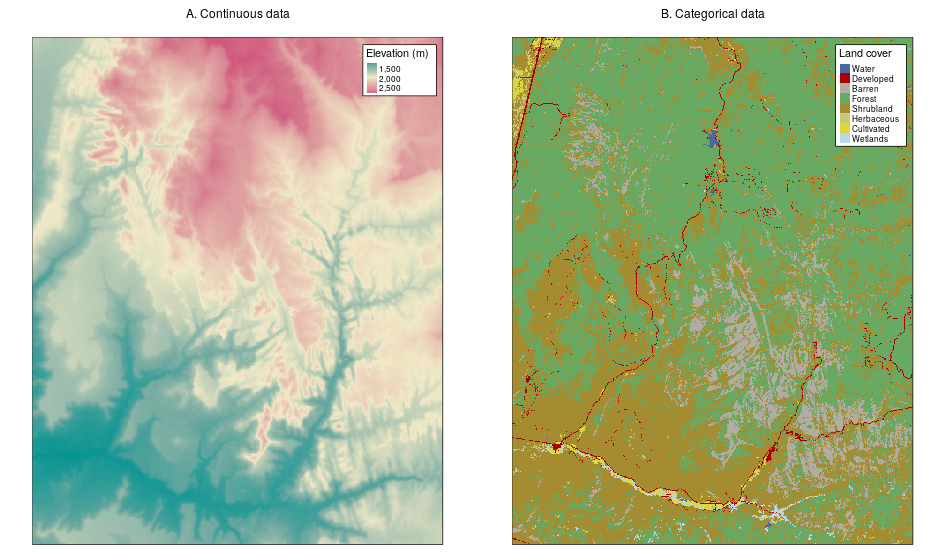

# Geographic data in R {#spatial-class}

## Prerequisites {-}

This is the first practical chapter of the book, and therefore it comes with some software requirements.
We assume that you have installed on your computer a recent version of R and that you are comfortable using it at the command line, e.g., via an integrated development environment (IDE) such as RStudio (recommended).
R/RStudio works on all major operating systems.
You can install and set up both in a few minutes on most modern computers, as described in [section 2.3](https://csgillespie.github.io/efficientR/set-up.html#r-version) and [section 2.5](https://csgillespie.github.io/efficientR/set-up.html#rstudio) of @gillespie_efficient_2016 (other guides are available).

If you are not a regular R user, we recommend that you familiarize yourself with the language before proceeding with this chapter.
You can do so using resources such as @gillespie_efficient_2016, @grolemund_r_2016 as well as online interactive guides such as [DataCamp](https://www.datacamp.com/courses/free-introduction-to-r).
We recommend organising your work as you learn, for example with the help of an RStudio '[project](https://csgillespie.github.io/efficientR/set-up.html#project-management)' called `geocomp-learning` or similar and a new script for each chapter.
The code you type to help learn the content of this chapter, for example, could be placed in a script called `chapter-02.R`.
Everyone learns in a different way so it is important that you structure your code in a way that makes sense to you and that you avoid copy-pasting to get used to typing code.
<!-- Another option is to use the RStudio project provided in the root directory of the [`geocompr`](https://github.com/Robinlovelace/geocompr) GitHub repository. -->
<!-- This will make it easier to run this book's worked examples on your computer. -->

* * *

After testing your up-to-date R/RStudio set-up the next step is to load the spatial packages used in this chapter (these must be installed and should be up-to-date):

```{r, message=FALSE}
library(raster)      # classes and functions for raster data
library(spData)      # geographic data
library(spDataLarge) # geographic data
library(sf)          # classes and functions for vector data
```

```{block2, type='rmdnote'}
On Mac and Linux a few requirements must be met to install **sf**.
These are described in the package's README at [github.com/r-spatial/sf](https://github.com/r-spatial/sf).
```

This chapter will provide brief explanations of the fundamental geographic data models: vector and raster.
We will introduce the theory behind each data model and the disciplines in which they predominate, before demonstrating their implementation in R.
<!-- Vector and raster models are vital to geospatial analysis [@longley_geographic_2015]. -->

The *vector data model* represents the world using points, lines and polygons.
This means, it supports data with discrete, well-defined borders.
Generally, vector datasets have a high level of precision (but not necessarily accuracy as we will see in \@ref(units)).

The *raster data model* is good at representing continuous phenomena such as elevation or rainfall with the help of grid cells that divide the surface up into a cells of constant size (*resolution*).
Rasters aggregate spatially specific features to a given resolution, meaning that they are spatially consistent and scalable (many worldwide raster datasets are available).
The downside of this is that small features can be blurred or lost.
<!-- todo: add figure(s) showing raster data and blurring? -->

The appropriate data model to use depends on the domain of application:

- Vector data tends to dominate the social sciences because human settlements and boundaries have discrete borders.
- By contrast, raster data often dominates the environmental sciences because these often use remotely sensed imagery. 

However, there is a substantial level of overlap:
ecologists and demographers, for example, commonly use both vector and raster data.
We, therefore, strongly recommend learning about each data model before proceeding to understand how to manipulate them in subsequent chapters.
This book uses **sf** and **raster** packages to work with vector data and raster datasets respectively.

## Vector data

```{block2 type="rmdnote"}
Take care when using the word 'vector' as it can have two meanings in this book:
geographic vector data and `vector`s (note the `monospace` font) in R.
The former is a data model, the latter is an R class just like `data.frame` and `matrix`.
Still, there is a link between the two: the spatial coordinates which are at the heart of the geographic vector data model can be represented in R using `vector` objects.
```

The geographic vector model is based on points located within a coordinate reference system (CRS).
Points can represent self-standing features (e.g. the location of a bus stop) or they can be linked together to form more complex geometries such as lines and polygons.
Most point geometries contain only two dimension (3 dimensional CRSs contain an additional $z$ value, typically representing height above sea level).

In this system London, for example, can be represented by the coordinates `c(-0.1, 51.5)`.
This mean its location is -0.1 degrees east and 55.5 degrees north of the origin at 0 degrees longitude (the Prime Meridian) and 0 degree latitude (the Equator) in a geographic ('lon/lat') CRS (Figure \@ref(fig:vectorplots), left panel).
The same point could also be approximated in a projected CRS with 'Easting/Northing' values of `c(530000, 180000)` in the British National Grid (BNG).
In the vector data model this suggests that London is located 530 km *East* and 180 km *North* of the $origin$ of the CRS.
This can be verified visually: slightly more than 5 'boxes' --- square areas bounded by the grey grid lines 100 km in width --- separate the point representing London from the origin in Figure \@ref(fig:vectorplots).
This shows that the origin of the BNG is located in the sea to the southeast of the UK, ensuring that all locations in the UK can be represented with positive Easting and Northing values.
CRSs are described in section \@ref(crs-intro).

```{r, include=FALSE, eval = FALSE}
library(globe)
library(dplyr)
london_lonlat = st_point(c(-0.1, 51.5)) %>%
  st_sfc() %>%
  st_sf(crs = 4326)
london_osgb = st_transform(london_lonlat, 27700)
origin_osgb = st_point(c(0, 0)) %>% 
  st_sfc() %>% 
  st_sf(crs = 27700)
london_orign = rbind(london_osgb, origin_osgb)

png("figures/vector_lonlat.png")
globe::globeearth(eye = c(0, 0))
gratmat = st_coordinates(st_graticule())[, 1:2]
globe::globelines(loc = gratmat, col = "grey", lty = 3)
globe::globelines(loc = matrix(c(-90, 90, 0, 0), ncol = 2))
globe::globelines(loc = matrix(c(0, 0, -90, 90), ncol = 2))
globe::globepoints(loc = c(-0.1, 51.5), pch = 4, cex = 2, lwd = 3, col = "red")
globe::globepoints(loc = c(0, 0), pch = 1, cex = 2, lwd = 3, col = "blue")
dev.off()
png("figures/vector_projected.png")
uk = rnaturalearth::ne_countries(scale = 50) %>% 
  st_as_sf() %>% 
  filter(grepl(pattern = "United Kingdom|Ire", x = name_long)) %>% 
  st_transform(27700)
plot(uk$geometry)
plot(london_orign[1,], add = TRUE, pch = 4, cex = 2, lwd = 3, col = "red")
plot(london_orign[2,], add = TRUE, pch = 1, cex = 2, lwd = 3, col = "blue")
abline(h = seq(0, 9e5, length.out = 10), col = "grey", lty = 3)
abline(v = seq(0, 9e5, length.out = 10), col = "grey", lty = 3)
dev.off()
```

```{r vectorplots, fig.cap="Illustration of vector (point) data in R with the location of London (the red X) represented with reference to an origin (the blue circle). The left plot represents a geographic CRS with an origin at 0° Longitude and latitude. The right plot represents a projected CRS with an origin at -2° longitude and 49° latitude, and units of meters.", out.width="45%", fig.show='hold', echo=FALSE}
knitr::include_graphics(c("figures/vector_lonlat.png", "figures/vector_projected.png"))
```


<!-- Commented out: not really necessary here - keeping as could be useful elsewhere: -->
<!-- In mathematical notation these points are typically represented as numbers separated by commas and enclosed by a pair of brackets:  -->
<!-- $(1, 3)$ for example, represents a point located one unit to the right and three units above the origin. -->
<!-- Instead of creating these points manually, one would commonly read-in data with functions such as `read_csv()` from the **tidyverse** or `read_sf()` from the **sf** package (see chapter \@ref(read-write)). -->
<!-- To generate new data (e.g., for testing), one can use the command `c()` (think of 'c' for 'combine'), as illustrated -->
<!-- below:^[Other methods for generating numbers include with the `seq()` function (short for 'sequence') for generating regular sequences or `runif()`, `rnorm()` and other functions generating random numbers following some kind of probability distribution. -->
<!-- The **mapedit** package can be used to create spatial data manually on an interactive map. -->
<!-- ] -->

<!-- ```{r} -->
<!-- p = c(1, 3) -->
<!-- ``` -->

<!-- Now this can be plotted in Cartesian space, as illustrated in figure \@ref(fig:cartesian): -->

<!-- ```{r cartesian, fig.cap="Illustration of vector point data in base R."} -->
<!-- plot(x = p[1], y = p[2], xlim =  c(0, 5), ylim = c(0, 5)) -->
<!-- ``` -->

### An introduction to simple features {#intro-sf}

Simple features is an open standard developed and endorsed by the Open Geospatial Consortium ([OGC](http://portal.opengeospatial.org/files/?artifact_id=25355)) to represent a wide range of geographic information.
It is a hierarchical data model that simplifies geographic data by condensing a complex range of geographic forms into a single geometry class.
Only 7 out of 68 possible types of simple feature are currently used in the vast majority of GIS operations (Figure \@ref(fig:sf-ogc)).
The R package **sf** [@R-sf] fully supports all of these (including plotting methods etc.).^[
The full OGC standard includes rather exotic geometry types including 'surface' and 'curve' geometry types, which currently have limited application in real world applications.
All 68 types can be represented in R, although (at the time of writing) all methods, such as plotting, are only supported for the 7 types that are used.
]

```{r sf-ogc, fig.cap="The subset of the Simple Features class hierarchy supported by sf.", out.width="100%", echo=FALSE}
knitr::include_graphics("figures/sf-classes.png")
```

**sf** can represent all common vector geometry types (raster data classes are not supported by **sf**): points, lines, polygons and their respective 'multi' versions (which group together features of the same type into a single feature).
**sf** also supports geometry collections, which can contain multiple geometry types in a single object.
Given the breadth of geographic data forms, it may come as a surprise that a class system to support all of them is provided in a single package, which can be installed from CRAN:^[The
development version, which may contain new features, can be installed with `devtools::install_github("r-spatial/sf").`
]
**sf** incorporates the functionality of the three main packages of the **sp** paradigm (**sp** [@R-sp] for the class system, **rgdal** [@R-rgdal] for reading and writing data, **rgeos** [@R-rgeos] for spatial operations undertaken by GEOS) in a single, cohesive whole.
This is well-documented in **sf**'s [vignettes](http://cran.rstudio.com/package=sf):

```{r, eval=FALSE}
vignette("sf1") # for an introduction to the package
vignette("sf2") # for reading, writing and converting Simple Features
vignette("sf3") # for manipulating Simple Features
```

As the first vignette explains, simple feature objects in R are stored in a data frame, with geographic data occupying a special column, a 'list-column'. This column is usually named 'geom' or 'geometry'.
We will use the `world` dataset provided by the **spData**, loaded at the beginning of this chapter (see [nowosad.github.io/spData](https://nowosad.github.io/spData/) for a list datasets loaded by the package).
`world` is a spatial object containing spatial and attribute columns, the names of which are returned by the function `names()` (the last column contains the geographic information):

```{r}
names(world)
```

It is the contents of this modest-looking `geom` column that gives `sf` objects their spatial powers, a 'list-column' that contains all the coordinates.
The **sf** package provides a `plot()` method for vizualising geographic data:
the follow command creates Figure \@ref(fig:world-all).

```{r world-all, fig.cap="A spatial plot of the world using the sf package, with a facet for each attribute."}
plot(world)
```

Note that instead of creating a single map, as most GIS programs would, the `plot()` command has created multiple maps, one for each variable in the `world` datasets.
This behavior can be useful for exploring the spatial distribution of different variables and is discussed further in \@ref(basic-map) below.

Being able to treat spatial objects as regular data frames with spatial powers has many advantages, especially if you are already used to working with data frames.
The commonly used `summary()` function, for example, provides a useful overview of the variables within the `world` object.

```{r}
summary(world["lifeExp"])
```

Although we have only selected one variable for the `summary` command, it also outputs a report on the geometry.
This demonstrates the 'sticky' behavior of the geometry columns of **sf** objects, meaning the geometry is kept unless the user deliberately removes them, as we'll see in section \@ref(vector-attribute-manipulation).
The result provides a quick summary of both the non-spatial and spatial data contained in `world`: the average life expectancy is 73 years (ranging from less than 50 to more than 80 years) across all countries.

```{block2 type='rmdnote'}
The word `MULTIPOLYGON` in the summary output above refers to the geometry type of features (countries) in the `world` object.
This representation is necessary for countries with islands such as Indonesia and Greece.
Other geometry types are described in section \@ref(sf-classes).
```

<!-- TODO: cross-reference section covering CRSs. -->
It is worth taking a deeper look at the basic behavior and contents of this simple feature object, which can usefully be thought of as a '**S**patial data**F**rame).

`sf` objects are easy to subset.
The code below shows its first two rows and three columns.
The output shows two major differences compared with a regular `data.frame`: the inclusion of additional geographic data (`geometry type`, `dimension`, `bbox` and CRS information - `epsg (SRID)`, `proj4string`), and the presence of final `geometry` column:

```{r}
world[1:2, 1:3]
```

All this may seem rather complex, especially for a class system that is supposed to be simple.
However, there are good reasons for organizing things this way and using **sf**.

<!-- It's a `MULTIPOLYGON` with 177 features and a geographic (longitude/latidue) coordinate reference system (CRS) with an EPSG code of `4326`. -->

### Why simple features?

Simple features is a widely supported data model that underlies data structures in many GIS applications including QGIS and PostGIS.
A major advantage of this is that using the data model ensures your work is cross-transferable to other set-ups, for example importing from exporting to spatial databases.

A more specific question from an R perspective is "why use the **sf** package when **sp** is already tried and tested"?
There are many reasons (linked to the advantages of the simple features model) including:

- Fast reading and writing of data
- Ehnhanced plotting performance
- **sf** objects can be treated as data frames in most operations
- **sf** functions can be combined using `%>%` operator and works well with the [tidyverse](http://tidyverse.org/) collection of R packages
- **sf** function names are relatively consistent and intuitive (all begin with `st_`)

Due to such advantages some spatial packages (including **tmap**, **mapview** and **tidycensus**) have added support for **sf**.
However, it will take many years for many packages to transition, and some packages will never switch.
Fortunately these can still be used in a workflow based on `sf` objects, by converting them to the `Spatial` class used in **sp**: 

```{r, eval=FALSE}
library(sp)
world_sp = as(world, Class = "Spatial")
# sp functions ...
```

`Spatial` objects can be converted back to `sf` in the same way or with `st_as_sf()`:

```{r, eval=FALSE}
world_sf = st_as_sf(world_sp, "sf")
```


### Basic map making {#basic-map}

You can quickly create basic maps in **sf** with the base `plot()` function. By default, **sf** creates a multi-panel plot (like **sp**'s `spplot()`), one sub-plot for each variable (see left-hand image in Figure \@ref(fig:sfplot)). 

```{r sfplot, fig.cap="Plotting with sf, with multiple variables (left) and a single variable (right).", out.width="49%", fig.show='hold', warning=FALSE}
plot(world[3:4])
plot(world["pop"])
```

As with **sp**, you can add further layers to your maps using the `add = TRUE`-argument of the `plot()` function .^[In
fact, when you `plot()` an **sf** object, R is calling `sf:::plot.sf()` behind the scenes.
`plot()` is a generic method that behaves differently depending on the class of object being plotted.]
To illustrate this, and prepare for content covered in chapters \@ref(attr) and \@ref(spatial-data-operations) on attribute and spatial data operations, we will subset and combine countries in the `world` object, which creates a single object representing Asia:

```{r, warning=FALSE}
asia = world[world$continent == "Asia", ]
asia = st_union(asia)
```

We can now plot the Asian continent over a map of the world.
Note, however, that this only works if the initial plot has only one layer:

```{r asia, out.width='50%', fig.cap="A plot of Asia added as a layer on top of countries worldwide."}
plot(world["pop"])
plot(asia, add = TRUE, col = "red")
```

This can be very useful for quickly checking the geographic correspondence between two or more layers: 
the `plot()` function is fast to execute and requires few lines of code, but does not create interactive maps with a wide range of options.
For more advanced map making we recommend using a dedicated visualization package such as **tmap**, **ggplot2**, **mapview**, or **leaflet**.
<!-- TODO: cross reference advanced mapping chapter -->

<!-- 
- plot() function 
- map export 
-->

<!-- Maybe show also somewhere that `world[0]` produces only a plot of the geometry which is rather useful if you do not want to plot a specific attribute. This way, you can for example dismiss the col = "white"-argument in your Nigeria example.
Sorry for commenting on this again but just to clarify africa[0] selects zero columns but since the geometry column is sticky it won't be dismissed. Neverthess, to be more explicit one should probably use plot(st_geometry(africa))-->

```{r, eval=FALSE, echo=FALSE}
plot(africa[0], lwd = 3, main = "Nigeria in context", border = "lightgrey")
```

### Base plot arguments {#base-args}

**sf** simplifies spatial data objects compared with **sp** and provides a near-direct interface to GDAL and GEOS C++ functions.
In theory this should make **sf** faster than **sp**/**rgdal**/**rgeos**, something that is tested in Chapter 5 for data I/O.
This section introduces **sf** classes in preparation for subsequent chapters which deal with vector data (in particular Chapter \@ref(spatial-data-operations)).

As a final exercise, we will see one way of how to do a spatial overlay in **sf**.
First, we convert the countries of the world into centroids, and then subset those in Asia. Finally, the `summary`-command tells us how many centroids (countries) are part of Asia (43) and how many are not (134).

```{r}
world_centroids = st_centroid(world)
sel_asia = st_intersects(world_centroids, asia, sparse = FALSE)
summary(sel_asia)
```

Note: `st_intersects()` uses [GEOS](https://trac.osgeo.org/geos/) in the background for the spatial overlay operation (see also Chapter \@ref(spatial-data-operations)).

Since **sf**'s `plot()` function builds on base plotting methods, you may also use its many optional arguments (see `?plot` and `?par`).
This provides a powerful but not necessarily intuitive interface.
To make the area of circles proportional to population, for example, the `cex` argument can be used as follows (see Figure \@ref(fig:contpop) created with the code below and the exercises in section \@ref(ex2)):

```{r, eval=FALSE}
plot(world["continent"])
plot(world_centroids, add = TRUE, cex = sqrt(world$pop) / 10000)
```

```{r contpop, fig.cap="Country continents (represented by fill colour) and 2015 populations (represented by points, with point area proportional to population) worldwide.", echo=FALSE, warning=FALSE}
world_proj = st_transform(world, "+proj=eck4")
par_old = par()
par(mar=c(0, 0, 0, 0)) 
world_centroids_largest = st_centroid(world_proj, of_largest_polygon = TRUE)
plot(st_graticule(x = world_proj)[1], col = "grey", main = "\nCountry continents and populations")
plot(world_proj["continent"], add = TRUE)
plot(world_centroids_largest, add = TRUE, cex = sqrt(world$pop) / 10000, pch = 16, col = "red")
par(par_old)
```


<!-- More appropriate for subsequent chapters. -->
<!-- This shows that there are 43 countries in Asia -->
<!-- We can check if they are the same countries as follows: -->

<!-- ```{r} -->
<!-- africa_centroids2 = world_centroids[sel_africa, ] -->
<!-- identical(africa_centroids, africa_centroids2) -->
<!-- ``` -->

### Simple feature classes {#sf-classes}

To understand new data formats in depth, it often helps to build them from the ground up.
This section walks you through vector spatial classes step-by-step, from the elementary simple feature geometry to simple feature objects of class `sf` representing complex spatial data.
Before describing each geometry type that the **sf** package supports, it is worth taking a step back to understand the building blocks of `sf` objects. 
As stated in section \@ref(intro-sf), simple features are simply data frames with at least one special column that makes it spatial.
These spatial columns are often called `geom` or `geometry` and can be like non-spatial columns: `world$geom` refers to the spatial element of the `world` object described above.
These geometry columns are 'list columns' of class `sfc`: they are simple feature collections.
In turn, `sfc` objects are composed of one or more objects of class `sfg`: simple feature geometries.

To understand how the spatial components of simple features work, it is vital to understand simple feature geometries.
For this reason we cover each currently supported `sfg` type in the next subsections before moving on to describe how these can be combined to form `sfc` and eventually full `sf` objects.

#### Simple feature geometry types {#geometry}

<!-- This section demonstrates how the full range of geometry types supported by the **sf** package can be created, combined and plotted. -->
Geometries are the basic building blocks of simple features.
Simple features in R can take on one of the 17 geometry types supported by the **sf** package.
In this chapter we will focus on the seven most commonly used types: `POINT`, `LINESTRING`, `POLYGON`, `MULTIPOINT`, `MULTILINESTRING`, `MULTIPOLYGON` and `GEOMETRYCOLLECTION`.<!--FIG-->
Find the whole list of possible feature types in [the PostGIS manual ](http://postgis.net/docs/using_postgis_dbmanagement.html).

Generally, well-known binary (WKB) or well-known text (WKT) are the standard encoding for simple feature geometries.
WKB representations are usually hexadecimal strings easily readable for computers.
This is why, GIS and spatial databases use WKB to transfer and store geometry objects.
WKT, on the other hand, is a human-readable text markup description of simple features. 
Both formats are exchangeable, and if we present one, we will naturally choose the WKT representation.

The basis for each geometry type is the point. 
A point is simply a coordinate in 2D, 3D or 4D space (see `vignette("sf1")` for more information) such as:

- `POINT (5 2)`

```{r point, echo=FALSE}
plot(st_as_sfc(c("POINT(5 2)")), axes = TRUE, main = "POINT")
```

A linestring is a sequence of points with a straight line connecting the points, for example:

- `LINESTRING (1 5, 4 4, 4 1, 2 2, 3 2)`

```{r linestring, echo=FALSE}
plot(st_as_sfc("LINESTRING(1 5, 4 4, 4 1, 2 2, 3 2)"), axes = TRUE, main = "LINESTRING")
```

A polygon is a sequence of points that form a closed, non-intersecting ring.
Closed means that the first and the last point of a polygon have the same coordinates. 
By definition, a polygon has one exterior boundary (outer ring) and can have zero or more interior boundaries (inner rings), also known as holes.

- Polygon without a hole - `POLYGON ((1 5, 2 2, 4 1, 4 4, 1 5))`

```{r polygon, echo=FALSE}
plot(st_as_sfc("POLYGON((1 5, 2 2, 4 1, 4 4, 1 5))"), col="gray", axes = TRUE, main = "POLYGON")
```

- Polygon with one hole - `POLYGON ((1 5, 4 4, 4 1, 2 2, 1 5), (2 4, 3 4, 3 3, 2 3, 2 4))`

```{r polygon_hole, echo=FALSE}
plot(st_as_sfc("POLYGON((1 5, 2 2, 4 1, 4 4, 1 5), (2 4, 3 4, 3 3, 2 3, 2 4))"), col="gray", axes = TRUE, main = "POLYGON with a hole")
```

So far we have created geometries with only one geometric entity per feature.
However, **sf** also allows multiple geometries to exist within a single feature (hence the term 'geometry collection') using "multi" version of each geometry type:

- Multipoint - `MULTIPOINT (5 2, 1 3, 3 4, 3 2)`
- Multistring - `MULTILINESTRING ((1 5, 4 4, 4 1, 2 2, 3 2), (1 2, 2 4))`
- Multipolygon - `MULTIPOLYGON (((1 5, 2 2, 4 1, 4 4, 1 5), (0 2, 1 2, 1 3, 0 3, 0 2)))`

```{r multis, echo=FALSE}
par(mfrow = c(1, 3))
plot(st_as_sfc("MULTIPOINT (5 2, 1 3, 3 4, 3 2)"), axes = TRUE, main = "MULTIPOINT")
plot(st_as_sfc("MULTILINESTRING ((1 5, 4 4, 4 1, 2 2, 3 2), (1 2, 2 4))"), axes = TRUE, main = "MULTILINESTRING")
plot(st_as_sfc("MULTIPOLYGON (((1 5, 2 2, 4 1, 4 4, 1 5), (0 2, 1 2, 1 3, 0 3, 0 2)))"), col="gray", axes = TRUE, main = "MULTIPOLYGON")
par(mfrow = c(1, 1))
```

Finally, a geometry collection might contain any combination of geometry types:

- Geometry collection - `GEOMETRYCOLLECTION (MULTIPOINT (5 2, 1 3, 3 4, 3 2), LINESTRING (1 5, 4 4, 4 1, 2 2, 3 2)))`

```{r geom_collection, echo=FALSE}
plot(st_as_sfc("GEOMETRYCOLLECTION (MULTIPOINT (5 2, 1 3, 3 4, 3 2), LINESTRING (1 5, 4 4, 4 1, 2 2, 3 2)))"),
     axes = TRUE, main = "GEOMETRYCOLLECTION")
```

#### Simple feature geometry (sfg) objects {#sfg}

In R, the `sfg` class represents the different simple feature geometry types: (multi-)point, (multi-)linestring, (multi-)polygon or geometry collection.

Usually you are spared the tedious task of creating geometries on your own since you can simply import an already existing spatial file.
However, there are a set of function to create simple feature geometry objects (`sfg`) from scratch if needed.
The names of these functions are simple and consistent, as they all start with the `st_`  prefix and end with the name of the geometry type in lowercase letters:

- A point - `st_point()`
- A linestring - `st_linestring()`
- A polygon - `st_polygon()`
- A multipoint - `st_multipoint()`
- A multilinestring - `st_multilinestring()`
- A multipolygon - `st_multipolygon()`
- A geometry collection - `st_geometrycollection()`

In R, you create `sfg` objects with the help of three native data types:

1. A numeric vector - a single point
2. A matrix - a set of points, where each row contains a point - a multipoint or linestring
3. A list - any other set, e.g. a multilinestring or geometry collection

To create point objects, we use the `st_point()` function in conjunction with a numeric vector:

```{r}
# note that we use a numeric vector for points
st_point(c(5, 2)) # XY point
st_point(c(5, 2, 3)) # XYZ point
st_point(c(5, 2, 1), dim = "XYM") # XYM point
st_point(c(5, 2, 3, 1)) # XYZM point
```

<!-- is this really important? -->
XY, XYZ and XYZM types of points are automatically created based on the length of a numeric vector. 
Only the XYM type needs to be specified using a `dim` argument.

By contrast, use matrices in the case of multipoint (`st_multipoint()`) and linestring (`st_linestring()`) objects:

```{r}
# the rbind function simplifies the creation of matrices
## MULTIPOINT
multipoint_matrix = rbind(c(5, 2), c(1, 3), c(3, 4), c(3, 2))
st_multipoint(multipoint_matrix)

## LINESTRING
linestring_matrix = rbind(c(1, 5), c(4, 4), c(4, 1), c(2, 2), c(3, 2))
st_linestring(linestring_matrix)
```

Finally, use lists for the creation of multilinestrings, (multi-)polygons and geometry collections:

```{r}
## POLYGON
polygon_list = list(rbind(c(1, 5), c(2, 2), c(4, 1), c(4, 4), c(1, 5)))
st_polygon(polygon_list)
```

```{r}
## POLYGON with a hole
polygon_border = rbind(c(1, 5), c(2, 2), c(4, 1), c(4, 4), c(1, 5))
polygon_hole = rbind(c(2, 4), c(3, 4), c(3, 3), c(2, 3), c(2, 4))
polygon_with_hole_list = list(polygon_border, polygon_hole)
st_polygon(polygon_with_hole_list)
```

```{r}
## MULTILINESTRING
multilinestring_list = list(rbind(c(1, 5), c(4, 4), c(4, 1), c(2, 2), c(3, 2)), 
                            rbind(c(1, 2), c(2, 4)))
st_multilinestring((multilinestring_list))
```

```{r}
## MULTIPOLYGON
multipolygon_list = list(list(rbind(c(1, 5), c(2, 2), c(4, 1), c(4, 4), c(1, 5))),
                         list(rbind(c(0, 2), c(1, 2), c(1, 3), c(0, 3), c(0, 2))))
st_multipolygon(multipolygon_list)
```

```{r}
## GEOMETRYCOLLECTION
gemetrycollection_list = list(st_multipoint(multipoint_matrix),
                              st_linestring(linestring_matrix))
st_geometrycollection(gemetrycollection_list)
```

<!-- table -->
<!-- figure - image/fig1.jpg -->
<!-- they are interconnected - points could create mulitpoints or lines; -->
<!-- lines could create mutlilines or polygons, etc. -->
<!-- https://r-spatial.github.io/sf/articles/sf1.html -->

#### Simple feature collections {#sfc}

One `sfg` object contains only a single simple feature geometry. 
A collection of simple feature geometries (`sfc`) is a list is a list of `sfg` objects and can additionally contain information about the coordinate reference system in use.
For instance, to combine two simple features into one object with two features, we can use the `st_sfc()` function. 
This is important since this collection represents the geometry column in **sf** data frames:

```{r}
# sfc POINT
point1 = st_point(c(5, 2))
point2 = st_point(c(1, 3))
st_sfc(point1, point2)
```

In most cases, an `sfc` object contains objects of the same geometry type.
Therefore, when we convert `sfg` objects of type polygon into a simple feature collection, we would also end up with an `sfc` object of type polygon. 
Equally, a collection of multilinestrings would result in an `sfc` object of type multilinestring:

```{r}
# sfc POLYGON
polygon_list1 = list(rbind(c(1, 5), c(2, 2), c(4, 1), c(4, 4), c(1, 5)))
polygon1 = st_polygon(polygon_list)
polygon_list2 = list(rbind(c(0, 2), c(1, 2), c(1, 3), c(0, 3), c(0, 2)))
polygon2 = st_polygon(polygon_list2)
st_sfc(polygon1, polygon2)
```

```{r}
# sfc MULTILINESTRING
multilinestring_list1 = list(rbind(c(1, 5), c(4, 4), c(4, 1), c(2, 2), c(3, 2)), 
                            rbind(c(1, 2), c(2, 4)))
multilinestring1 = st_multilinestring((multilinestring_list1))
multilinestring_list2 = list(rbind(c(2, 9), c(7, 9), c(5, 6), c(4, 7), c(2, 7)), 
                            rbind(c(1, 7), c(3, 8)))
multilinestring2 = st_multilinestring((multilinestring_list2))
st_sfc(multilinestring1, multilinestring2)
```

It is also possible to create an `sfc` object from `sfg` objects with different geometry types:

```{r}
# sfc GEOMETRY
st_sfc(point1, multilinestring1)
```

<!-- if you want to use it - st_cast() to a proper geometry type -->
<!-- or st_is to select only one geometry type -->
<!-- http://r-spatial.org/r/2017/01/12/newssf.html -->
<!-- methods(class = "sfc") -->

As mentioned before, `sfc` objects can additionally store information on the coordinate reference systems (CRS).
<!-- What's CRS -->
To specify a certain CRS, we can use the `epsg (SRID)` or `proj4string` attributes of an `sfc` object.
The default value of `epsg (SRID)` and `proj4string` is `NA` (*Not Available*):

```{r}
st_sfc(point1, point2)
```

Of course, all geometries in an `sfc` object must have the same CRS. 

We can add coordinate reference system as a `crs` argument of `st_sfc()`. 
This argument accepts either an integer with the `epsg` code (e.g., `4326`)  or a `proj4string` character string (e.g., `"+proj=longlat +datum=WGS84 +no_defs"`) (see section \@ref(crs-intro)). 

```{r}
# EPSG definition
st_sfc(point1, point2, crs = 4326)
```

```{r}
# PROJ4STRING definition
st_sfc(point1, point2, crs = "+proj=longlat +datum=WGS84 +no_defs")
```

For example, we can set the UTM Zone 11N projection with `epsg` code `2955`:

```{r}
st_sfc(point1, point2, crs = 2955)
```

As you can see above, the `proj4string` definition was automatically added.
Now we can try to set the CRS using `proj4string`:

```{r}
st_sfc(point1, point2, crs = "+proj=utm +zone=11 +ellps=GRS80 +towgs84=0,0,0,0,0,0,0 +units=m +no_defs")
```

However, the `epsg` string of our result remained empty. 
This is because there is no general method to convert from `proj4string` to `epsg`.

<!-- precision -->
<!-- plots can be made -->

#### Simple feature objects {#sf}

So far, we have only dealt with the pure geometries.
Most of the time, however, these geometries come with a set of attributes describing them. 
These attributes could represent the name of the geometry, measured values, groups to which the geometry belongs, and many more.
For example, we measured a temperature of 25°C on Trafalgar Square in London on June 21^th^ 2017. 
Hence, we have a specific point in space (the coordinates), the name of the location (Trafalgar Square), a temperature value, the date of the measurement.
Other attributes might include a urbanity category (city or village), or a remark if the measurement was made using an automatic station.

The simple feature class, `sf`, is a combination of an attribute table (`data.frame`) and a simple feature geometry collection (`sfc`).
Simple features are created using the `st_sf()` function:

```{r}
# sfg objects
london_point = st_point(c(0.1, 51.5))
ruan_point = st_point(c(-9, 53))

# sfc object
our_geometry = st_sfc(london_point, ruan_point, crs = 4326)

# data.frame object
our_attributes = data.frame(name = c("London", "Ruan"),
                            temperature = c(25, 13),
                            date = c(as.Date("2017-06-21"), as.Date("2017-06-22")),
                            category = c("city", "village"),
                            automatic = c(FALSE, TRUE))

# sf object
sf_points = st_sf(our_attributes, geometry = our_geometry)
```

The above example illustrates the components of `sf` objects. 
Firstly, coordinates define the geometry of the simple feature geometry (`sfg`).
Secondly, we can combine the geometries in a simple feature collection (`sfc`) which also stores the CRS.
Subsequently, we store the attribute information on the geometries in a `data.frame`.
Finally, the `st_sf()` function combines the attribute table and the `sfc` object in an `sf` object.

```{r}
sf_points
```

```{r}
class(sf_points)
```

The result shows that `sf` objects actually have two classes, `sf` and `data.frame`.
Simple features are simply data frames (square tables), but with spatial attributes (usually stored in a special `geom` list-column in the data frame).
This duality is central to the concept of simple features:
most of the time a `sf` can be treated as and behaves like a `data.frame`.
Simple features are, in essence, data frames with a spatial extension.

<!-- methods -->
<!-- methods(class = "sf") -->
<!-- plots -->
<!-- https://r-spatial.github.io/sf/articles/sf1.html#how-attributes-relate-to-geometries -->

## Raster data

The geographic raster data model consists of a raster header and a matrix (with rows and columns) representing equally spaced cells (often also called pixels; Figure \@ref(fig:raster-intro-plot):A).
The raster header defines the coordinate reference system, the extent and the origin.
The origin (or starting point) is frequently the coordinate of the lower-left corner of the matrix (the **raster** package, however, uses the upper left corner, by default (Figure  \@ref(fig:raster-intro-plot):B)).
The header defines the extent via the number of columns, the number of rows and the cell size resolution.
Hence, starting from the origin, we can easily access and modify each single cell by either using the ID of a cell  (Figure  \@ref(fig:raster-intro-plot):B) or by explicitly specifying the rows and columns.
This matrix representation avoids storing explicitly the coordinates for the four corner points (in fact it only stores one coordinate, namely the origin) of each cell corner as would be the case for rectangular vector polygons.
This and matrix algebra makes raster processing much more efficient and faster than vector data processing.
However, in contrast to vector data, a raster cell can only hold a single value.
The value might be numeric or categorical (Figure  \@ref(fig:raster-intro-plot):C).
You can also specify a no-data value in the header of a raster, frequently -9999 (in R we often use `NA`).

```{r raster-intro-plot, echo=FALSE, fig.cap="Raster data: A - a grid representation; B - numbers of the cells; C - values of the cells; D - a final raster map."}
knitr::include_graphics("figures/02_raster_intro_plot.png")
```

Raster maps usually represent continuous phenomena such as elevation, temperature, population density or spectral data (Figure \@ref(fig:raster-intro-plot2)).
Of course, we can represent discrete features such as soil or landcover classes also with the help of a raster data model (Figure \@ref(fig:raster-intro-plot2)).
Consequently, the discrete borders of these features become blurred, and depending on the spatial task a vector representation might be more suitable.

```{r raster-intro-plot2, echo=FALSE, fig.cap="Examples of continuous (left) and categorical (right) raster."}

```

### An introduction to raster

The **raster** package supports raster objects in R. 
It provides an extensive set of functions to create, read, export, manipulate and process raster datasets.
Aside from general raster data manipulation, **raster** provides many low level functions that can form the basis to develop more advanced raster functionality.
**raster** also lets you work on large raster datasets that are too large to fit into the main memory. 
In this case, **raster** provides the possibility to divide the raster into smaller chunks (rows or blocks), and processes these iteratively instead of loading the whole raster file into RAM (for more information, please refer to `vignette("functions", package = "raster")`.

For the illustration of **raster** concepts, we will use datasets from the **spDataLarge** (note these packages were loaded at the beginning of the chapter).
It consists of a few raster and one vector datasets covering an area of the Zion National Park (Utah, USA).
For example, `srtm.tif` is a digital elevation model of this area (for more details - see its documentation `?srtm`)
First of all, we would like to create a `RasterLayer` object named `new_raster`:

```{r, message=FALSE}
raster_filepath = system.file("raster/srtm.tif", package = "spDataLarge")
new_raster = raster(raster_filepath)
```

Typing the name of the raster into the console, will print out the raster header (extent, dimensions, resolution, CRS) and some additional information (class, data source name, summary of the raster values): 

```{r}
new_raster
```

To access individual header information, you can use following commands:

```{r}
# dimensions (number of rows, number of columns, number of cells)
dim(new_raster)
```

```{r}
# spatial resolution
res(new_raster)
```

```{r}
# spatial extent
extent(new_raster)
```

```{r}
# coordinate reference system
crs(new_raster)
```

<!--CRSargs(CRS("+init=epsg:4326"))-->
Note that in contrast to the **sf** package, **raster** only accepts the `proj4string` representation of the coordinate reference system.

<!--
You can also summarize and plot raster cell values in a non-spatial fashion using base R functions such as `summary()` and `hist()`.

```{r}
# numerical summary of the data
summary(new_raster)
```

```{r new_raster-hist}
# histogram of the values
hist(new_raster)
```

`getValues()` extracts the values of a raster as a numerical vector.
To only select specific rows, use the `row` parameter.

```{r}
new_raster_values = getValues(new_raster)
head(new_raster_values)
```

The new vector, `new_raster_values`, can serve as input for subsequent statistical operations.
-->

Sometimes it is important to know if all values of a raster are currently in memory or on disk.
Find out with the `inMemory()` function:

```{r}
inMemory(new_raster)
```

`help(package = "raster", topic = "raster-package")` returns a full list of all available **raster** functions.

### Basic map making

Similar to the **sf** package, **raster** also provides `plot()` methods for its own classes.

```{r basic-new-raster-plot}
plot(new_raster)
```

Moreover, it is possible to plot a raster and overlay it with vector data.
For this purpose, we need to read-in a vector dataset:

```{r, message=FALSE, results='hide'}
vector_filepath = system.file("vector/zion.gpkg", package="spDataLarge")
new_vector = st_read(vector_filepath)
```

Our new object, `new_vector`, is a polygon representing the borders of Zion National Park (`?zion`).
We can add the borders to the elevation map using the `add` argument of the `plot()`:

```{r basic-new-raster-vector-plot}
plot(new_raster)
plot(new_vector, add = TRUE)
```

There are several different approaches to plot raster data in R:

- You can use `spplot()` to visualize several (such as spatiotemporal) layers at once. You can also do so  with the **rasterVis** package which provides more advanced methods for plotting raster objects.
- Packages such as **tmap**, **mapview** and **leaflet** facilitate especially interactive mapping of both raster and vector objects. 
<!-- TODO: cross reference advanced mapping chapter -->

### Raster classes {#raster-classes}

The `RasterLayer` class represents the simplest form of a raster object, and consists of only one layer.
The easiest way to create a raster object in R is to read-in a raster file from disk or from a server.

```{r}
raster_filepath = system.file("raster/srtm.tif", package = "spDataLarge")
new_raster = raster(raster_filepath)
```

The **raster** package support numerous drivers with the help of **rgdal**.
To find out which drivers are available on your system, run `raster::writeFormats()` and `rgdal::gdalDrivers()`.

Aside from reading in a raster, you can also create one from scratch.
Running `raster()` creates an empty `RasterLayer`.
Here, however, we will create manually a very simple raster.
This should make it easy to understand how raster and related operations work.
Our raster should consist of just three rows and columns centered around the null meridian and the equator (see `xmn`, `xmx`, `ymn` and `ymx` parameters).
Additionally, we define a resolution of 0.5, which here corresponds to 0.5 degrees since the default proj4string of a raster object is WGS84.
Finally, we set the values with the `vals` argument.
Here, we just number the cells, that means we assign 1 to cell 1, 2 to cell 2, and finally 36 to cell 36.
We know that there are 36 cells by multiplying six (rows) by six (columns).
As we have seen above, setting raster values in R corresponds to a rowwise cell filling starting at the upper left corner.
Consequently, the upper first row contains the values 1 to 6, the second row 7 to 12, and the last row 31 to 36.

```{r}
# creation of the RasterLayer object with a given number of columns and rows, and extent
new_raster2 = raster(nrow = 6, ncol = 6, res = 0.5, 
                     xmn = -1.5, xmx = 1.5, ymn = -1.5, ymx = 1.5,
                     vals = 1:36)
```

For still further ways of creating a raster object have a look at the help file - `?raster`.
<!--
There are several ways to add new values to the `Raster*` objects.
Values for the whole object could be add with `setValues()`:

```{r, eval=FALSE}
# adding random values to the raster object
new_random_values = sample(seq_len(ncell(new_raster4)))
setValues(new_raster4, new_random_values)
```


It is also possible to replace cell values by specifying cell numbers, or row and column numbers:

```{r, eval=FALSE}
# change the value of 15th cell to 826
new_raster4[15] = 826
# change the value of the cell in the second row and forth column to 826
new_raster4[2, 4] = 826 
```
-->

Aside from `RasterLayer`, there are two additional classes: `RasterBrick` and `RasterStack`.
Both can handle multiple layers, but differ regarding the number of supported file formats, type of internal representation and processing speed.

A `RasterBrick` consists of multiple layers, which typically correspond to a single multispectral satellite file or a single multilayer object in memory. 
The `brick()` function creates a `RasterBrick` object.
Usually, you provide it with a filename to a multilayer raster file but might also use another raster object and other spatial objects (see its help page for all supported formats).

```{r}
multilayer_raster_filepath = system.file("raster/landsat.tif", package="spDataLarge")
r_brick = brick(multilayer_raster_filepath)
r_brick
```

The `nlayers` function retrieves the number of layers stored in a `Raster*` object:

```{r}
nlayers(r_brick)
```

A `RasterStack` is similar to a `RasterBrick` in the sense that it consists also of multiple layers.
However, in contrast to `RasterBrick`, `RasterStack` allows to connect several raster objects stored in different files or multiply objects in memory.
More specifically, a `RasterStack` is a list of `RasterLayer` objects with the same extent and resolution. 
Hence, one way to create it is with the help of spatial objects already existing in R's global environment. 
And again, one can simply specify a path to a file stored on disk.
<!-- The possibility to create a `RasterStack` from a file stored on disk and an object residing in R's global environment is one of the main differences compared to a `RasterBrick`. -->

```{r}
raster_on_disk = raster(r_brick, layer = 1)
raster_in_memory = raster(xmn = 301905, xmx = 335745, ymn = 4111245, ymx = 4154085, res = 30)
values(raster_in_memory) = sample(1:ncell(raster_in_memory))
crs(raster_in_memory) = crs(raster_on_disk)
```

```{r}
r_stack <- stack(raster_in_memory, raster_on_disk)
r_stack
```

Another difference is that the processing time for `RasterBrick` objects is usually shorter than for `RasterStack` objects.

Decision on which `Raster*` class should be used depends mostly on a character of input data. 
Processing of a single mulitilayer file or object is the most effective with `RasterBrick`, while `RasterStack` allows calculations based on many files, many `Raster*` objects, or both.

```{block2 type='rmdnote'}
Operations on `RasterBrick` and `RasterStack` objects will typically return a `RasterBrick`.
```

## Coordinate Reference Systems {#crs-intro}

Vector and raster spatial data types share concepts intrinsic to spatial data.
Perhaps the most fundamental of these is the Coordinate Reference System (CRS), which defines how the spatial elements of the data relate to the surface of the Earth (or other bodies).
<!-- Coordinates are meaningles without a CRS, as we don't know theirs units (meters, feets, degrees) or what's the origin -->
<!-- (-12579102, 4439107) = (-113, 37) -->
Coordinate system could be either geographic or projected (Figures \@ref(fig:vector-crs) and \@ref(fig:raster-crs)).

### Geographic coordinate systems

Geographic coordinate systems identify any location on the Earth's surface using two values - longitude and latitude. 
The first one is an angle from the prime meridian plan and the second one is an angle from the equatorial plane to this location.
Therefore, units of geographic coordinate systems are degrees.
<!-- for example Los Angeles, Melbourne -->

The surface of the Earth in geographic coordinate systems is represented by a spherical or ellipsoidal surface.
Spherical models represent the shape of the Earth of a specific radius, assuming that the Earth is a perfect sphere. 
While it simplifies calculations and works well for small scale maps, it could not be sufficient for the work at a larger scale.
More accurate measurements can be done with an ellipsoidal model.
The shape of an ellipse is defined by either the equatorial radius (a) and the polar radius (b), or by a and the inverse flattening (rf), where:
$$rf = 1/((a-b)/a)$$
<!--fig?-->
<!-- WGS84   a=6378137.0     rf=298.2572 -->
<!-- 1/((a-b)/a) -->
<!-- a - 1/rf * a = b -->
Since the Earth is flattened at the poles, an equatorial radius is slightly longer than a polar axis.
For example, the difference of the equatorial radius and polar radius in the WGS 84 ellipsoid is about 21.385 km.
You can access a list of available ellipses and theirs properties using the `st_proj_info(type = "ellps")` function.
<!-- ellipsoid example -->

Additionally, a position and orientation of the spheroid relative to the center of the Earth needs to be defined using a datum.
The Earth’s surface is irregular due to gravitational and surface feature variations.
Therefore, datums were created to account for the local variations in establishing a coordinate system.
There are two types of datums - local and geocentric.
In local datums, the ellipsoid surface aligns closely to the Earth surface at a particular location.
For example, NAD27 (North American Datum of 1927) is a local datum created for the United States area.
Geocentric datums are aligned to the center of the Earth
It includes WGS84 (World Geodetic System 1984) Datum.
A list of datums supported in R could be obtain with `st_proj_info(type = "datum")`.
<!-- plots? -->
<!-- plus maybe table (few examples) -->

### Projected coordinate systems 

Projected coordinate systems are based on Cartesian coordinates (X, Y) and represent any area on a flat surface. 
A projected coordinate system has an origin, x and y axes, and a linear unit of measure.
All projected coordinate systems are based on geographic coordinate systems.
Maps projections are mathematical models for conversion of three-dimensional surface into a two-dimensional representation on a map.
This transition cannot be done without adding some distortion.
Therefore, some properties of the Earth's surface are distorted in this process, such as area, direction, distance, and shape.
A projected coordinate system can preserve only one or two of those properties.
Projections are often named based on a property they preserve: equal-area preserves area, azimuthal preserve direction, equidistant preserve distance, and conformal preserve local shape.

There are three main groups of projection types - conic, cylindrical, and planar.
In a conic projection the Earth surface is projected onto a cone along a single line of tangency or two lines of tangency. 
Distortions are minimized along the tangency lines and rise with the distance from those lines in this projection.
Therefore, it is the best suited for maps of mid-latitude areas.
A cylindrical projection maps the surface onto a cylinder.
This projection also could be created by touching the Earth's surface along a single line of tangency or two lines of tangency. 
Cylindrical projections are the most often used in mapping of the entire world.
A planar projection projects data onto a flat surface touching the globe at a point or along a line of tangency. 
It is typically used in mapping polar regions.
<!-- other projections? -->
<!-- https://en.wikipedia.org/wiki/List_of_map_projections -->
<!-- plus maybe table (few examples) -->
<!-- add good reference to projections -->
`st_proj_info(type = "proj")` gives a list of the available projections supported by the PROJ.4 library.

### CRS in R

Two main ways to describe CRS in R are an `epsg` code or a `proj4string` definition.
Both of these approaches have advantages and disadvantages. 
An `epsg` code is usually shorter, and therefore easier to remember. 
The code also refers to only one, well-defined coordinate reference system. 
On the other hand, a `proj4string` definition allows you more flexibility when it comes to specifying different parameters such as the projection type, the datum and the ellipsoid. 
This way you can specify many different projections, and modify existing ones.
This makes the `proj4string` approach also more complicated.
<!-- ^[In the background, `sf` and `raster` use the [PROJ.4](http://proj4.org/) software, which enables transformations between different projections]. -->
`epsg` points to exactly one particular CRS.

Spatial R packages support a wide range of CRSs they use long-establish [proj4](http://proj4.org/) library.
Other than searching for EPSG codes on-line, another quick way to find-out about available CRSs is via the `rgdal::make_EPSG()` function, which outputs a data frame of available projections.
Before going into more detail into these, it's worth learning how to view and filter them inside R, as this could save time trawling the internet.
The following code will show available CRSs interactively, allowing filtering of ones of interest (try filtering for the OSGB CRSs for example):

```{r, eval=FALSE}
crs_data = rgdal::make_EPSG()
View(crs_data)
```

In **sf** the CRS of an object can be retrieved using `st_crs()`:

```{r}
st_crs(new_vector) # get CRS
```

In cases when a coordinate reference system (CRS) is missing or the wrong CRS is set, the `st_set_crs()` function can be used:

```{r}
new_vector = st_set_crs(new_vector, 26912) # set CRS
```

The warning message informs that the `st_set_crs()` function do not transform data from one CRS to another.

```{r vector-crs, echo=FALSE, fig.cap="Examples of geographic (WGS 84; left) and projected (NAD83 / UTM zone 12N; right) and coordinate systems for a vector data type."}
knitr::include_graphics("figures/02_vector_crs.png")
```

The `projection()` function can be use to access a CRS information from the `Raster*` object: 

```{r}
projection(new_raster) # get CRS
```

The same function, `projection()`, is used to set a CRS for raster objects.
The main difference, comparing to vector data, is that raster objects accepts only `proj4` definitions:

```{r}
projection(new_raster) = "+proj=utm +zone=12 +ellps=GRS80 +towgs84=0,0,0,0,0,0,0 +units=m +no_defs" # set CRS
```

```{r raster-crs, echo=FALSE, fig.cap="Examples of geographic (WGS 84; left) and projected (NAD83 / UTM zone 12N; right) and coordinate systems for a raster data type"}
knitr::include_graphics("figures/02_raster_crs.png")
```

More information on CRS and spatial tranformation is in chapter \@ref(transform).

## Units

<!-- https://cran.r-project.org/web/packages/units/vignettes/measurement_units_in_R.html -->
An important feature of CRSs is that they contain information about spatial units.
Clearly it is vital to know whether a house's measurements are in feet or meters, and the same applies to maps.
It is good cartographic practice to add a *scale bar* onto maps to demonstrate the relationship between distances on the page or screen and distances on the ground.
Likewise, it is important to formally specify the units in which the geometry data or pixels are measured to provide context, and ensure that subsequent calculations are done in context.

A novel feature of geometry data in `sf` objects is that they have *native support* for units.
This means that distance, area and other geometric calculations in **sf** return values that come with a `units` attribute, defined by the **units** package [@pebesma_measurement_2016].
This is advantageous because it prevents confusion caused by the fact that different CRSs use different units (most use meters, some use feet).
Furthermore, it also provides information on dimensionality, as illustrated by the following calculation which reports the area of Nigeria:

```{r}
nigeria = world[world$name_long == "Nigeria", ]
```

```{r}
st_area(nigeria)
```

The result is in units of square meters (m^2^), showing a) that the result represents two-dimensional space and b) and that Nigeria is a large country!
This information, stored as an attribute (which interested readers can discover with `attributes(st_area(nigeria))`) is advantageous for many reasons, for example it could feed into subsequent calculations such as population density.
Reporting units prevents confusion.
To take the Nigeria example, if the units remained unspecified, one could incorrectly assume that the units were in km^2^.
To translate the huge number into a more digestible size, it is tempting to divide the results by a million (the number of square meters in a square kilometer):

```{r}
st_area(nigeria) / 1e6
```

However, the result is incorrectly given again as square meters.
The solution is to set the correct units with the **units** package:

```{r}
units::set_units(st_area(nigeria), km^2)
```

<!-- Is that right? I mean, the units DESCRIPTION says "Support for measurement units in R vectors, matrices and arrays". Since raster datasets are just matrices, units might be easily used with them?-->
Units are of equal importance in the case of raster data.
However, so far **sf** is the only spatial package that supports units, meaning that people working on raster data should approach changes in the units of analysis (e.g., converting pixel widths from imperial to decimal units) with care.
The `new_raster` object (see above) uses a UTM projection with meters as units.
Consequently, its resolution is also given in meters but you have to know it, since the `res()` function simply returns a numeric vector.

```{r}
res(new_raster)
```

If we used the WGS84 projection, the units would change.

```{r, warning=FALSE, message=FALSE}
repr = projectRaster(new_raster, crs = "+init=epsg:4326")
res(repr)
```

Again, the `res()` command gives back a numeric vector without any unit, forcing us to know that the unit of the WGS84 projection is decimal degrees.

<!-- Something about when units are not set: -->
<!-- ```{r} -->
<!-- st_distance(sf_point1, sf_point2) -->
<!-- ``` -->

<!-- ## Precision -->

## Exercises {#ex2}

<!-- vector exercises -->
1. What does the summary of the `geometry` column tell us about the `world` dataset, in terms of:
    - The geometry type?
    - How many countries there are?
    - The coordinate reference system (CRS)?

2. Using **sf**'s `plot()` command, create a map of Nigeria in context, building on the code that creates and plots Asia above (see Figure \@ref(fig:asia) for an example of what this could look like). 
    - Hint: this used the `lwd`, `main` and `col` arguments of `plot()`. 
    - Bonus: make the country boundaries a dotted grey line.
    - Hint: `border` is an additional argument of `plot()` for **sf**  objects.

3. What does the `cex` argument do in the `plot()` function that generates Figure \@ref(fig:contpop)?
    - Why was `cex` passed the `sqrt(world$pop) / 10000` instead of just the population directly?
    - Bonus: what equivalent arguments to `cex` exist in the dedicated vizualisation package **tmap**?
    
4. Re-run the code that 'generated' Figure \@ref(fig:contpop) at the end of \@ref(base-args) and find 3 similarities and 3 differences between the plot produced on your computer and that in the book.
    - What is similar?
    - What has changed?
    - Bonus: play around with and research base plotting arguments to make your version of Figure \@ref(fig:contpop) more attractive. Which arguments were most useful.
    - Advanced: try to reproduce the map presented in Figure \@ref(base-args). Copy-and-pasting is prohibited!

<!-- raster exercises -->
5. Read the `raster/nlcd2011.tif` file from the **spDataLarge** package. 
What kind of information can you get about the properties of this file?
<!-- (crs, ncols, nrow, ncells, bbox, navalues) -->
6. Create an empty `RasterLayer` object called `my_raster` with 10 columns and 10 rows, and resolution of 10 units.
Assign random values between 0 and 10 to the new raster and plot it.
<!-- crs exercises -->
<!-- 1. pros and cons of the projection types -->
<!-- 1. what's the difference between vector and raster transformation -->
<!-- units exercises -->
<!-- 1. ?? -->
