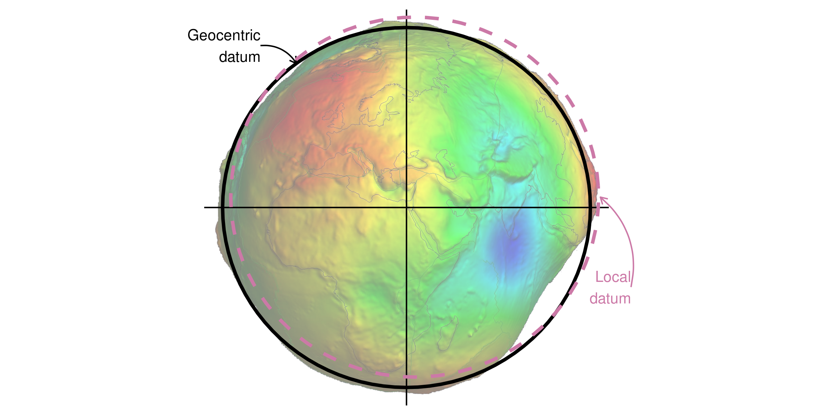
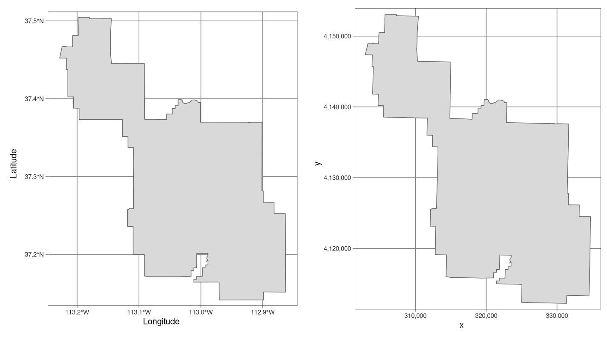

# (PART) Foundations {-}

# Geographic data in R {#spatial-class}

## Prerequisites {-}

This is the first practical chapter of the book, and therefore it comes with some software requirements.
We assume that you have an up-to-date version of R installed and that you are comfortable using software with a command-line interface such as the integrated development environment (IDE) RStudio.
<!--or VSCode?-->

If you are new to R, we recommend reading Chapter 2 of the online book *Efficient R Programming* by @gillespie_efficient_2016 and learning the basics of the language with reference to resources such as @grolemund_r_2016.
Organize your work (e.g., with RStudio projects) and give scripts sensible names such as `02-chapter.R` to document the code you write as you learn.
\index{R!pre-requisites}

The packages used in this chapter can be installed with the following commands:^[
**spDataLarge** is not on CRAN\index{CRAN}, meaning it must be installed via *r-universe*  or with the following command: `remotes::install_github("Nowosad/spDataLarge")`.
]


```r
install.packages("sf")
install.packages("terra")
install.packages("spData")
install.packages("spDataLarge", repos = "https://nowosad.r-universe.dev")
```

\index{R!installation}
\BeginKnitrBlock{rmdnote}<div class="rmdnote">If you're running Mac or Linux, the previous command to install **sf** may not work first time.
These operating systems (OSs) have 'systems requirements' that are described in the package's [README](https://github.com/r-spatial/sf).
Various OS-specific instructions can be found online, such as the article *Installation of R 4.0 on Ubuntu 20.04* on the blog [rtask.thinkr.fr](https://rtask.thinkr.fr/installation-of-r-4-0-on-ubuntu-20-04-lts-and-tips-for-spatial-packages/).</div>\EndKnitrBlock{rmdnote}

All the packages needed to reproduce the contents of the book can be installed with the following command: `remotes::install_github("geocompr/geocompkg")`.
The necessary packages can be 'loaded' (technically they are attached) with the `library()` function as follows:


```r
library(sf)          # classes and functions for vector data
#> Linking to GEOS 3.8.0, GDAL 3.0.4, PROJ 6.3.1
```

The output from `library(sf)` reports which versions of key geographic libraries such as GEOS the package is using, as outlined in Section \@ref(intro-sf).


```r
library(terra)      # classes and functions for raster data
```

The other packages that were installed contain data that will be used in the book:


```r
library(spData)        # load geographic data
library(spDataLarge)   # load larger geographic data
```

## Introduction {#intro-spatial-class}

This chapter will provide brief explanations of the fundamental geographic data models:\index{data models} vector and raster.
We will introduce the theory behind each data model and the disciplines in which they predominate, before demonstrating their implementation in R.

The *vector data model* represents the world using points, lines and polygons.
These have discrete, well-defined borders, meaning that vector datasets usually have a high level of precision (but not necessarily accuracy as we will see in Section \@ref(units)).
The *raster data model* divides the surface up into cells of constant size.
Raster datasets are the basis of background images used in web-mapping and have been a vital source of geographic data since the origins of aerial photography and satellite-based remote sensing devices.
Rasters aggregate spatially specific features to a given resolution, meaning that they are consistent over space and scalable (many worldwide raster datasets are available).

Which to use?
The answer likely depends on your domain of application:

- Vector data tends to dominate the social sciences because human settlements tend to have discrete borders
- Raster dominates many environmental sciences because of the reliance on remote sensing data

There is much overlap in some fields and raster and vector datasets can be used together:
ecologists and demographers, for example, commonly use both vector and raster data.
Furthermore, it is possible to convert between the two forms (see Section \@ref(raster-vector)).
Whether your work involves more use of vector or raster datasets, it is worth understanding the underlying data model before using them, as discussed in subsequent chapters.
This book uses **sf** and **raster** packages to work with vector data and raster datasets, respectively.

## Vector data

\BeginKnitrBlock{rmdnote}<div class="rmdnote">Take care when using the word 'vector' as it can have two meanings in this book:
geographic vector data and the `vector` class (note the `monospace` font) in R.
The former is a data model, the latter is an R class just like `data.frame` and `matrix`.
Still, there is a link between the two: the spatial coordinates which are at the heart of the geographic vector data model can be represented in R using `vector` objects.</div>\EndKnitrBlock{rmdnote}

The geographic vector data model\index{vector data model} is based on points located within a coordinate reference system\index{coordinate reference system|see {CRS}} (CRS\index{CRS}).
Points can represent self-standing features (e.g., the location of a bus stop) or they can be linked together to form more complex geometries such as lines and polygons.
Most point geometries contain only two dimensions (3-dimensional CRSs contain an additional $z$ value, typically representing height above sea level).

In this system London, for example, can be represented by the coordinates `c(-0.1, 51.5)`.
This means that its location is -0.1 degrees east and 51.5 degrees north of the origin.
The origin in this case is at 0 degrees longitude (the Prime Meridian) and 0 degree latitude (the Equator) in a geographic ('lon/lat') CRS (Figure \@ref(fig:vectorplots), left panel).
The same point could also be approximated in a projected CRS with 'Easting/Northing' values of `c(530000, 180000)` in the [British National Grid](https://en.wikipedia.org/wiki/Ordnance_Survey_National_Grid), meaning that London is located 530 km *East* and 180 km *North* of the $origin$ of the CRS.
This can be verified visually: slightly more than 5 'boxes' --- square areas bounded by the gray grid lines 100 km in width --- separate the point representing London from the origin (Figure \@ref(fig:vectorplots), right panel).

The location of National Grid's\index{National Grid} origin, in the sea beyond South West Peninsular, ensures that most locations in the UK have positive Easting and Northing values.^[
The origin we are referring to, depicted in blue in Figure \@ref(fig:vectorplots), is in fact the 'false' origin.
The 'true' origin, the location at which distortions are at a minimum, is located at 2° W and 49° N.
This was selected by the Ordnance Survey to be roughly in the center of the British landmass longitudinally.
]
There is more to CRSs, as described in Sections \@ref(crs-intro) and \@ref(reproj-geo-data) but, for the purposes of this section, it is sufficient to know that coordinates consist of two numbers representing distance from an origin, usually in $x$ then $y$ dimensions.


<div class="figure" style="text-align: center">

<p class="caption">(\#fig:vectorplots)Illustration of vector (point) data in which location of London (the red X) is represented with reference to an origin (the blue circle). The left plot represents a geographic CRS with an origin at 0° longitude and latitude. The right plot represents a projected CRS with an origin located in the sea west of the South West Peninsula.</p>
</div>

**sf** is a package providing a class system for geographic vector data.
Not only does **sf** supersede **sp**, it also provides a consistent command-line interface to GEOS\index{GEOS} and GDAL\index{GDAL}, superseding **rgeos** and **rgdal** (described in Section \@ref(the-history-of-r-spatial)).
This section introduces **sf** classes in preparation for subsequent chapters (Chapters \@ref(geometric-operations) and \@ref(read-write) cover the GEOS and GDAL interface, respectively).

### An introduction to simple features {#intro-sf}

Simple features is an [open standard](http://portal.opengeospatial.org/files/?artifact_id=25355) developed and endorsed by the Open Geospatial Consortium (OGC), a not-for-profit organization whose activities we will revisit in a later chapter (in Section \@ref(file-formats)).
\index{simple features |see {sf}}
Simple Features is a hierarchical data model that represents a wide range of geometry types.
Of 17 geometry types supported by the specification, only 7 are used in the vast majority of geographic research (see Figure \@ref(fig:sf-ogc));
these core geometry types are fully supported by the R package **sf** [@pebesma_simple_2018].^[
The full OGC standard includes rather exotic geometry types including 'surface' and 'curve' geometry types, which currently have limited application in real world applications.
All 17 types can be represented with the **sf** package, although (as of summer 2018) plotting only works for the 'core 7'.
]

<div class="figure" style="text-align: center">

<p class="caption">(\#fig:sf-ogc)Simple feature types fully supported by sf.</p>
</div>

**sf** can represent all common vector geometry types (raster data classes are not supported by **sf**): points, lines, polygons and their respective 'multi' versions (which group together features of the same type into a single feature).
\index{sf}
\index{sf (package)|see {sf}}
**sf** also supports geometry collections, which can contain multiple geometry types in a single object.
**sf** provides the same functionality (and more) previously provided in three packages --- **sp** for data classes [@R-sp], **rgdal** for data read/write via an interface to GDAL and PROJ [@R-rgdal] and **rgeos** for spatial operations via an interface to GEOS [@R-rgeos].
To re-iterate the message from Chapter 1, geographic R packages have a long history of interfacing with lower level libraries, and **sf** continues this tradition with a unified interface to recent versions of the GEOS library for geometry operations, the GDAL library for reading and writing geographic data files, and the PROJ library for representing and transforming projected coordinate reference systems.
This is a notable achievement that reduces the headspace needed for 'context switching between' different packages and enables access to high-performance geographic libraries.
Documenation on **sf** can be found on its website and in 6 vignettes, which can be loaded as follows:


```r
vignette(package = "sf") # see which vignettes are available
vignette("sf1")          # an introduction to the package
```


As the first vignette explains, simple feature objects in R are stored in a data frame, with geographic data occupying a special column, usually named 'geom' or 'geometry'.
We will use the `world` dataset provided by the **spData**, loaded at the beginning of this chapter (see [nowosad.github.io/spData](https://nowosad.github.io/spData/) for a list of datasets loaded by the package).
`world` is a spatial object containing spatial and attribute columns, the names of which are returned by the function `names()` (the last column contains the geographic information):


```r
names(world)
#>  [1] "iso_a2"    "name_long" "continent" "region_un" "subregion" "type"     
#>  [7] "area_km2"  "pop"       "lifeExp"   "gdpPercap" "geom"
```

The contents of this `geom` column give `sf` objects their spatial powers: `world$geom` is a '[list column](https://jennybc.github.io/purrr-tutorial/ls13_list-columns.html)' that contains all the coordinates of the country polygons.
\index{list column}
The **sf** package provides a `plot()` method for visualizing geographic data:
the following command creates Figure \@ref(fig:world-all).


```r
plot(world)
```

<div class="figure" style="text-align: center">

<p class="caption">(\#fig:world-all)A spatial plot of the world using the sf package, with a facet for each attribute.</p>
</div>

Note that instead of creating a single map, as most GIS programs would, the `plot()` command has created multiple maps, one for each variable in the `world` datasets.
This behavior can be useful for exploring the spatial distribution of different variables and is discussed further in Section \@ref(basic-map) below.

Being able to treat spatial objects as regular data frames with spatial powers has many advantages, especially if you are already used to working with data frames.
The commonly used `summary()` function, for example, provides a useful overview of the variables within the `world` object.


```r
summary(world["lifeExp"])
#>     lifeExp                geom    
#>  Min.   :50.6   MULTIPOLYGON :177  
#>  1st Qu.:65.0   epsg:4326    :  0  
#>  Median :72.9   +proj=long...:  0  
#>  Mean   :70.9                      
#>  3rd Qu.:76.8                      
#>  Max.   :83.6                      
#>  NA's   :10
```

Although we have only selected one variable for the `summary` command, it also outputs a report on the geometry.
This demonstrates the 'sticky' behavior of the geometry columns of **sf** objects, meaning the geometry is kept unless the user deliberately removes them, as we'll see in Section \@ref(vector-attribute-manipulation).
The result provides a quick summary of both the non-spatial and spatial data contained in `world`: the mean average life expectancy is 71 years (ranging from less than 51 to more than 83 years with a median of 73 years) across all countries.

\BeginKnitrBlock{rmdnote}<div class="rmdnote">The word `MULTIPOLYGON` in the summary output above refers to the geometry type of features (countries) in the `world` object.
This representation is necessary for countries with islands such as Indonesia and Greece.
Other geometry types are described in Section \@ref(geometry).</div>\EndKnitrBlock{rmdnote}

It is worth taking a deeper look at the basic behavior and contents of this simple feature object, which can usefully be thought of as a '**s**patial data **f**rame'.

`sf` objects are easy to subset.
The code below shows its first two rows and three columns.
The output shows two major differences compared with a regular `data.frame`: the inclusion of additional geographic data (`geometry type`, `dimension`, `bbox` and CRS information - `epsg (SRID)`, `proj4string`), and the presence of a `geometry` column, here named `geom`:


```r
world_mini = world[1:2, 1:3]
world_mini
#> Simple feature collection with 2 features and 3 fields
#> Geometry type: MULTIPOLYGON
#> Dimension:     XY
#> Bounding box:  xmin: -180 ymin: -18.3 xmax: 180 ymax: -0.95
#> Geodetic CRS:  WGS 84
#> # A tibble: 2 × 4
#>   iso_a2 name_long continent                                                geom
#>   <chr>  <chr>     <chr>                                      <MULTIPOLYGON [°]>
#> 1 FJ     Fiji      Oceania   (((-180 -16.6, -180 -16.5, -180 -16, -180 -16.1, -…
#> 2 TZ     Tanzania  Africa    (((33.9 -0.95, 31.9 -1.03, 30.8 -1.01, 30.4 -1.13,…
```

All this may seem rather complex, especially for a class system that is supposed to be simple.
However, there are good reasons for organizing things this way and using **sf**.

Before describing each geometry type that the **sf** package supports, it is worth taking a step back to understand the building blocks of `sf` objects. 
Section \@ref(sf) shows how simple features objects are data frames, with special geometry columns.
These spatial columns are often called `geom` or `geometry`: `world$geom` refers to the spatial element of the `world` object described above.
These geometry columns are 'list columns' of class `sfc` (see Section \@ref(sfc)).
In turn, `sfc` objects are composed of one or more objects of class `sfg`: simple feature geometries that we describe in Section \@ref(sfg).
\index{sf!sfc}
\index{simple feature columns|see {sf!sfc}}

To understand how the spatial components of simple features work, it is vital to understand simple feature geometries.
For this reason we cover each currently supported simple features geometry type in Section \@ref(geometry) before moving on to describe how these can be represented in R using `sfg` objects, which form the basis of `sfc` and eventually full `sf` objects.

\BeginKnitrBlock{rmdnote}<div class="rmdnote">The preceding code chunk uses `=` to create a new object called `world_mini` in the command `world_mini = world[1:2, 1:3]`.
This is called assignment.
An equivalent command to achieve the same result is `world_mini <- world[1:2, 1:3]`.
Although 'arrow assigment' is more commonly used, we use 'equals assignment' because it's slightly faster to type and easier to teach due to compatibility with commonly used languages such as Python and JavaScript.
Which to use is largely a matter of preference as long as you're consistent (packages such as **styler** can be used to change style).</div>\EndKnitrBlock{rmdnote}

### Why simple features?

Simple features is a widely supported data model that underlies data structures in many GIS applications including QGIS\index{QGIS} and PostGIS\index{PostGIS}.
A major advantage of this is that using the data model ensures your work is cross-transferable to other set-ups, for example importing from and exporting to spatial databases.
\index{sf!why simple features}

A more specific question from an R perspective is "why use the **sf** package when **sp** is already tried and tested"?
There are many reasons (linked to the advantages of the simple features model):

- Fast reading and writing of data
- Enhanced plotting performance
- **sf** objects can be treated as data frames in most operations
- **sf** functions can be combined using `%>%` operator and works well with the [tidyverse](http://tidyverse.org/) collection of R packages\index{tidyverse}.
- **sf** function names are relatively consistent and intuitive (all begin with `st_`)

Due to such advantages, some spatial packages (including **tmap**, **mapview** and **tidycensus**) have added support for **sf**.
However, it will take many years for most packages to transition and some will never switch.
Fortunately, these can still be used in a workflow based on `sf` objects, by converting them to the `Spatial` class used in **sp**: 


```r
library(sp)
world_sp = as(world, Class = "Spatial")
# sp functions ...
```

`Spatial` objects can be converted back to `sf` in the same way or with `st_as_sf()`:


```r
world_sf = st_as_sf(world_sp)
```

### Basic map making {#basic-map}

Basic maps are created in **sf** with `plot()`.
By default this creates a multi-panel plot (like **sp**'s `spplot()`), one sub-plot for each variable of the object, as illustrated in the left-hand panel in Figure \@ref(fig:sfplot).
A legend or 'key' with a continuous color is produced if the object to be plotted has a single variable (see the right-hand panel).
Colors can also be set with `col = `, although this will not create a continuous palette or a legend. 
\index{map making!basic}


```r
plot(world[3:6])
plot(world["pop"])
```

<div class="figure" style="text-align: center">

<p class="caption">(\#fig:sfplot)Plotting with sf, with multiple variables (left) and a single variable (right).</p>
</div>

Plots are added as layers to existing images by setting `add = TRUE`.^[
`plot()`ing of **sf** objects uses `sf:::plot.sf()` behind the scenes.
`plot()` is a generic method that behaves differently depending on the class of object being plotted.
]
To demonstrate this, and to provide a taster of content covered in Chapters \@ref(attr) and \@ref(spatial-operations) on attribute and spatial data operations, the subsequent code chunk combines countries in Asia:


```r
world_asia = world[world$continent == "Asia", ]
asia = st_union(world_asia)
```

We can now plot the Asian continent over a map of the world.
Note that the first plot must only have one facet for `add = TRUE` to work.
If the first plot has a key, `reset = FALSE` must be used (result not shown):


```r
plot(world["pop"], reset = FALSE)
plot(asia, add = TRUE, col = "red")
```

Adding layers in this way can be used to verify the geographic correspondence between layers: 
the `plot()` function is fast to execute and requires few lines of code, but does not create interactive maps with a wide range of options.
For more advanced map making we recommend using dedicated visualization packages such as **tmap** (see Chapter \@ref(adv-map)).

### Base plot arguments {#base-args}

There are various ways to modify maps with **sf**'s `plot()` method.
Because **sf** extends base R plotting methods `plot()`'s arguments such as `main =` (which specifies the title of the map) work with `sf` objects (see `?graphics::plot` and `?par`).^[
Note: many plot arguments are ignored in facet maps, when more than one `sf` column is plotted.
]
\index{base plot|see {map making}}
\index{map making!base plotting}

Figure \@ref(fig:contpop) illustrates this flexibility by overlaying circles, whose diameters (set with `cex =`) represent country populations, on a map of the world.
An unprojected version of this figure can be created with the following commands (see exercises at the end of this chapter and the script [`02-contplot.R`](https://github.com/Robinlovelace/geocompr/blob/main/code/02-contpop.R) to reproduce Figure \@ref(fig:contpop)):


```r
plot(world["continent"], reset = FALSE)
cex = sqrt(world$pop) / 10000
world_cents = st_centroid(world, of_largest = TRUE)
plot(st_geometry(world_cents), add = TRUE, cex = cex)
```

<div class="figure" style="text-align: center">

<p class="caption">(\#fig:contpop)Country continents (represented by fill color) and 2015 populations (represented by circles, with area proportional to population).</p>
</div>

The code above uses the function `st_centroid()` to convert one geometry type (polygons) to another (points) (see Chapter \@ref(geometric-operations)), the aesthetics of which are varied with the `cex` argument.

\index{bounding box}
**sf**'s plot method also has arguments specific to geographic data. `expandBB`, for example, can be used to plot an `sf` object in context:
it takes a numeric vector of length four that expands the bounding box of the plot relative to zero in the following order: bottom, left, top, right.
This is used to plot India in the context of its giant Asian neighbors, with an emphasis on China to the east, in the following code chunk, which generates Figure \@ref(fig:china) (see exercises below on adding text to plots):


```r
india = world[world$name_long == "India", ]
plot(st_geometry(india), expandBB = c(0, 0.2, 0.1, 1), col = "gray", lwd = 3)
plot(world_asia[0], add = TRUE)
```

<div class="figure" style="text-align: center">

<p class="caption">(\#fig:china)India in context, demonstrating the expandBB argument.</p>
</div>

Note the use of `[0]` to keep only the geometry column and `lwd` to emphasize India.
See Section \@ref(other-mapping-packages) for other visualization techniques for representing a range of geometry types, the subject of the next section.

### Geometry types {#geometry}

Geometries are the basic building blocks of simple features.
Simple features in R can take on one of the 17 geometry types supported by the **sf** package.
\index{geometry types|see {sf!geometry types}}
\index{sf!geometry types}
In this chapter we will focus on the seven most commonly used types: `POINT`, `LINESTRING`, `POLYGON`, `MULTIPOINT`, `MULTILINESTRING`, `MULTIPOLYGON` and `GEOMETRYCOLLECTION`.
Find the whole list of possible feature types in [the PostGIS manual ](http://postgis.net/docs/using_postgis_dbmanagement.html).

Generally, well-known binary (WKB) or well-known text (WKT) are the standard encoding for simple feature geometries.
\index{well-known text}
\index{WKT|see {well-known text}}
\index{well-known binary}
WKB representations are usually hexadecimal strings easily readable for computers.
This is why GIS and spatial databases use WKB to transfer and store geometry objects.
WKT, on the other hand, is a human-readable text markup description of simple features. 
Both formats are exchangeable, and if we present one, we will naturally choose the WKT representation.

The basis for each geometry type is the point. 
A point is simply a coordinate in 2D, 3D or 4D space (see `vignette("sf1")` for more information) such as (see left panel in Figure \@ref(fig:sfcs)):
\index{sf!point}

- `POINT (5 2)`

\index{sf!linestring}
A linestring is a sequence of points with a straight line connecting the points, for example (see middle panel in Figure \@ref(fig:sfcs)):

- `LINESTRING (1 5, 4 4, 4 1, 2 2, 3 2)`

A polygon is a sequence of points that form a closed, non-intersecting ring.
Closed means that the first and the last point of a polygon have the same coordinates (see right panel in Figure \@ref(fig:sfcs)).^[
By definition, a polygon has one exterior boundary (outer ring) and can have zero or more interior boundaries (inner rings), also known as holes.
A polygon with a hole would be, for example, `POLYGON ((1 5, 2 2, 4 1, 4 4, 1 5), (2 4, 3 4, 3 3, 2 3, 2 4))`
]
\index{sf!hole}

- Polygon without a hole: `POLYGON ((1 5, 2 2, 4 1, 4 4, 1 5))`

<div class="figure" style="text-align: center">

<p class="caption">(\#fig:sfcs)Illustration of point, linestring and polygon geometries.</p>
</div>


So far we have created geometries with only one geometric entity per feature.
However, **sf** also allows multiple geometries to exist within a single feature (hence the term 'geometry collection') using "multi" version of each geometry type:
\index{sf!multi features}

- Multipoint: `MULTIPOINT (5 2, 1 3, 3 4, 3 2)`
- Multilinestring: `MULTILINESTRING ((1 5, 4 4, 4 1, 2 2, 3 2), (1 2, 2 4))`
- Multipolygon: `MULTIPOLYGON (((1 5, 2 2, 4 1, 4 4, 1 5), (0 2, 1 2, 1 3, 0 3, 0 2)))`

<div class="figure" style="text-align: center">

<p class="caption">(\#fig:multis)Illustration of multi* geometries.</p>
</div>

Finally, a geometry collection can contain any combination of geometries including (multi)points and linestrings (see Figure \@ref(fig:geomcollection)):
\index{sf!geometry collection}

- Geometry collection: `GEOMETRYCOLLECTION (MULTIPOINT (5 2, 1 3, 3 4, 3 2), LINESTRING (1 5, 4 4, 4 1, 2 2, 3 2))`

<div class="figure" style="text-align: center">

<p class="caption">(\#fig:geomcollection)Illustration of a geometry collection.</p>
</div>

### Simple feature geometries (sfg) {#sfg}

The `sfg` class represents the different simple feature geometry types in R: point, linestring, polygon (and their 'multi' equivalents, such as multipoints) or geometry collection.
\index{simple feature geometries|see {sf!sfg}}

Usually you are spared the tedious task of creating geometries on your own since you can simply import an already existing spatial file.
However, there are a set of functions to create simple feature geometry objects (`sfg`) from scratch if needed.
The names of these functions are simple and consistent, as they all start with the `st_`  prefix and end with the name of the geometry type in lowercase letters:

- A point: `st_point()`
- A linestring: `st_linestring()`
- A polygon: `st_polygon()`
- A multipoint: `st_multipoint()`
- A multilinestring: `st_multilinestring()`
- A multipolygon: `st_multipolygon()`
- A geometry collection: `st_geometrycollection()`

`sfg` objects can be created from three base R data types:

1. A numeric vector: a single point
2. A matrix: a set of points, where each row represents a point, a multipoint or linestring
3. A list: a collection of objects such as matrices, multilinestrings or geometry collections

The function `st_point()` creates single points from numeric vectors:


```r
st_point(c(5, 2))                 # XY point
#> POINT (5 2)
st_point(c(5, 2, 3))              # XYZ point
#> POINT Z (5 2 3)
st_point(c(5, 2, 1), dim = "XYM") # XYM point
#> POINT M (5 2 1)
st_point(c(5, 2, 3, 1))           # XYZM point
#> POINT ZM (5 2 3 1)
```

The results show that XY (2D coordinates), XYZ (3D coordinates) and XYZM (3D with an additional variable, typically measurement accuracy) point types are created from vectors of length 2, 3, and 4, respectively. 
The XYM type must be specified using the `dim` argument (which is short for dimension).

By contrast, use matrices in the case of multipoint (`st_multipoint()`) and linestring (`st_linestring()`) objects:


```r
# the rbind function simplifies the creation of matrices
## MULTIPOINT
multipoint_matrix = rbind(c(5, 2), c(1, 3), c(3, 4), c(3, 2))
st_multipoint(multipoint_matrix)
#> MULTIPOINT ((5 2), (1 3), (3 4), (3 2))
## LINESTRING
linestring_matrix = rbind(c(1, 5), c(4, 4), c(4, 1), c(2, 2), c(3, 2))
st_linestring(linestring_matrix)
#> LINESTRING (1 5, 4 4, 4 1, 2 2, 3 2)
```

Finally, use lists for the creation of multilinestrings, (multi-)polygons and geometry collections:


```r
## POLYGON
polygon_list = list(rbind(c(1, 5), c(2, 2), c(4, 1), c(4, 4), c(1, 5)))
st_polygon(polygon_list)
#> POLYGON ((1 5, 2 2, 4 1, 4 4, 1 5))
```


```r
## POLYGON with a hole
polygon_border = rbind(c(1, 5), c(2, 2), c(4, 1), c(4, 4), c(1, 5))
polygon_hole = rbind(c(2, 4), c(3, 4), c(3, 3), c(2, 3), c(2, 4))
polygon_with_hole_list = list(polygon_border, polygon_hole)
st_polygon(polygon_with_hole_list)
#> POLYGON ((1 5, 2 2, 4 1, 4 4, 1 5), (2 4, 3 4, 3 3, 2 3, 2 4))
```


```r
## MULTILINESTRING
multilinestring_list = list(rbind(c(1, 5), c(4, 4), c(4, 1), c(2, 2), c(3, 2)), 
                            rbind(c(1, 2), c(2, 4)))
st_multilinestring((multilinestring_list))
#> MULTILINESTRING ((1 5, 4 4, 4 1, 2 2, 3 2), (1 2, 2 4))
```


```r
## MULTIPOLYGON
multipolygon_list = list(list(rbind(c(1, 5), c(2, 2), c(4, 1), c(4, 4), c(1, 5))),
                         list(rbind(c(0, 2), c(1, 2), c(1, 3), c(0, 3), c(0, 2))))
st_multipolygon(multipolygon_list)
#> MULTIPOLYGON (((1 5, 2 2, 4 1, 4 4, 1 5)), ((0 2, 1 2, 1 3, 0 3, 0 2)))
```


```r
## GEOMETRYCOLLECTION
gemetrycollection_list = list(st_multipoint(multipoint_matrix),
                              st_linestring(linestring_matrix))
st_geometrycollection(gemetrycollection_list)
#> GEOMETRYCOLLECTION (MULTIPOINT (5 2, 1 3, 3 4, 3 2),
#>   LINESTRING (1 5, 4 4, 4 1, 2 2, 3 2))
```

### Simple feature columns (sfc) {#sfc}

One `sfg` object contains only a single simple feature geometry. 
A simple feature geometry column (`sfc`) is a list of `sfg` objects, which is additionally able to contain information about the coordinate reference system in use.
For instance, to combine two simple features into one object with two features, we can use the `st_sfc()` function. 
\index{sf!simple feature columns (sfc)}
This is important since `sfc` represents the geometry column in **sf** data frames:


```r
# sfc POINT
point1 = st_point(c(5, 2))
point2 = st_point(c(1, 3))
points_sfc = st_sfc(point1, point2)
points_sfc
#> Geometry set for 2 features 
#> Geometry type: POINT
#> Dimension:     XY
#> Bounding box:  xmin: 1 ymin: 2 xmax: 5 ymax: 3
#> CRS:           NA
#> POINT (5 2)
#> POINT (1 3)
```

In most cases, an `sfc` object contains objects of the same geometry type.
Therefore, when we convert `sfg` objects of type polygon into a simple feature geometry column, we would also end up with an `sfc` object of type polygon, which can be verified with `st_geometry_type()`. 
Equally, a geometry column of multilinestrings would result in an `sfc` object of type multilinestring:


```r
# sfc POLYGON
polygon_list1 = list(rbind(c(1, 5), c(2, 2), c(4, 1), c(4, 4), c(1, 5)))
polygon1 = st_polygon(polygon_list1)
polygon_list2 = list(rbind(c(0, 2), c(1, 2), c(1, 3), c(0, 3), c(0, 2)))
polygon2 = st_polygon(polygon_list2)
polygon_sfc = st_sfc(polygon1, polygon2)
st_geometry_type(polygon_sfc)
#> [1] POLYGON POLYGON
#> 18 Levels: GEOMETRY POINT LINESTRING POLYGON MULTIPOINT ... TRIANGLE
```


```r
# sfc MULTILINESTRING
multilinestring_list1 = list(rbind(c(1, 5), c(4, 4), c(4, 1), c(2, 2), c(3, 2)), 
                            rbind(c(1, 2), c(2, 4)))
multilinestring1 = st_multilinestring((multilinestring_list1))
multilinestring_list2 = list(rbind(c(2, 9), c(7, 9), c(5, 6), c(4, 7), c(2, 7)), 
                            rbind(c(1, 7), c(3, 8)))
multilinestring2 = st_multilinestring((multilinestring_list2))
multilinestring_sfc = st_sfc(multilinestring1, multilinestring2)
st_geometry_type(multilinestring_sfc)
#> [1] MULTILINESTRING MULTILINESTRING
#> 18 Levels: GEOMETRY POINT LINESTRING POLYGON MULTIPOINT ... TRIANGLE
```

It is also possible to create an `sfc` object from `sfg` objects with different geometry types:


```r
# sfc GEOMETRY
point_multilinestring_sfc = st_sfc(point1, multilinestring1)
st_geometry_type(point_multilinestring_sfc)
#> [1] POINT           MULTILINESTRING
#> 18 Levels: GEOMETRY POINT LINESTRING POLYGON MULTIPOINT ... TRIANGLE
```

As mentioned before, `sfc` objects can additionally store information on the coordinate reference systems (CRS).
To specify a certain CRS, we can use the `epsg (SRID)` or `proj4string` attributes of an `sfc` object.
The default value of `epsg (SRID)` and `proj4string` is `NA` (*Not Available*), as can be verified with `st_crs()`:


```r
st_crs(points_sfc)
#> Coordinate Reference System: NA
```

All geometries in an `sfc` object must have the same CRS.
We can add coordinate reference system as a `crs` argument of `st_sfc()`. 
This argument accepts an integer with the `epsg` code such as `4326`, which automatically adds the 'proj4string' (see Section \@ref(crs-intro)):


```r
# EPSG definition
points_sfc_wgs = st_sfc(point1, point2, crs = 4326)
st_crs(points_sfc_wgs)
#> Coordinate Reference System:
#>   User input: EPSG:4326 
#>   wkt:
#> GEOGCRS["WGS 84",
#>     DATUM["World Geodetic System 1984",
#>         ELLIPSOID["WGS 84",6378137,298.257223563,
#>             LENGTHUNIT["metre",1]]],
#>     PRIMEM["Greenwich",0,
#>         ANGLEUNIT["degree",0.0174532925199433]],
#>     CS[ellipsoidal,2],
#>         AXIS["geodetic latitude (Lat)",north,
#>             ORDER[1],
#>             ANGLEUNIT["degree",0.0174532925199433]],
#>         AXIS["geodetic longitude (Lon)",east,
#>             ORDER[2],
#>             ANGLEUNIT["degree",0.0174532925199433]],
#>     USAGE[
#>         SCOPE["unknown"],
#>         AREA["World"],
#>         BBOX[-90,-180,90,180]],
#>     ID["EPSG",4326]]
```

It also accepts a raw proj4string (result not shown):


```r
# PROJ4STRING definition
st_sfc(point1, point2, crs = "+proj=longlat +datum=WGS84 +no_defs")
```

\BeginKnitrBlock{rmdnote}<div class="rmdnote">Sometimes `st_crs()` will return a `proj4string` but not an `epsg` code. 
This is because there is no general method to convert from `proj4string` to `epsg` (see Chapter \@ref(reproj-geo-data)).</div>\EndKnitrBlock{rmdnote}

### The sf class {#sf}

Sections \@ref(geometry) to \@ref(sfc) deal with purely geometric objects, 'sf geometry' and 'sf column' objects, respectively.
These are geographic building blocks of geographic vector data represented as simple features.
The final building block is non-geographic attributes, representing the name of the feature or other attributes such as measured values, groups, and other things.
\index{sf!class}

To illustrate attributes, we will represent a temperature of 25°C in London on June 21^st^, 2017.
This example contains a geometry (the coordinates), and three attributes with three different classes (place name, temperature and date).^[
Other attributes might include an urbanity category (city or village), or a remark if the measurement was made using an automatic station.
]
Objects of class `sf` represent such data by combining the attributes (`data.frame`) with the simple feature geometry column (`sfc`).
They are created with `st_sf()` as illustrated below, which creates the London example described above:


```r
lnd_point = st_point(c(0.1, 51.5))                 # sfg object
lnd_geom = st_sfc(lnd_point, crs = 4326)           # sfc object
lnd_attrib = data.frame(                           # data.frame object
  name = "London",
  temperature = 25,
  date = as.Date("2017-06-21")
  )
lnd_sf = st_sf(lnd_attrib, geometry = lnd_geom)    # sf object
```

What just happened? First, the coordinates were used to create the simple feature geometry (`sfg`).
Second, the geometry was converted into a simple feature geometry column (`sfc`), with a CRS.
Third, attributes were stored in a `data.frame`, which was combined with the `sfc` object with `st_sf()`.
This results in an `sf` object, as demonstrated below (some output is omitted):


```r
lnd_sf
#> Simple feature collection with 1 features and 3 fields
#> ...
#>     name temperature       date         geometry
#> 1 London          25 2017-06-21 POINT (0.1 51.5)
```


```r
class(lnd_sf)
#> [1] "sf"         "data.frame"
```

The result shows that `sf` objects actually have two classes, `sf` and `data.frame`.
Simple features are simply data frames (square tables), but with spatial attributes stored in a list column, usually called `geometry`, as described in Section \@ref(intro-sf).
This duality is central to the concept of simple features:
most of the time a `sf` can be treated as and behaves like a `data.frame`.
Simple features are, in essence, data frames with a spatial extension.


## Raster data

The spatial raster data model represents the world with the continuous grid of cells (often also called pixels; Figure \@ref(fig:raster-intro-plot):A).
This data model often refers to so-called regular grids, in which each cell has the same, constant size -- and we will focus on the regular grids in this book only.
However, several other types of grids exist, including rotated, sheared, rectilinear, and curvilinear grids (see Chapter 1 of @pebesma_spatial_2022 or Chapter 2 of @tennekes_elegant_2022).

The raster data model usually consists of a raster header\index{raster!header}
and a matrix (with rows and columns) representing equally spaced cells (often also called pixels; Figure \@ref(fig:raster-intro-plot):A).^[
Depending on the file format the header is part of the actual image data file, e.g., GeoTIFF, or stored in an extra header or world file, e.g., ASCII grid formats. 
There is also the headerless (flat) binary raster format which should facilitate the import into various software programs.]
The raster header\index{raster!header} defines the coordinate reference system, the extent and the origin.
\index{raster}
\index{raster data model}
The origin (or starting point) is frequently the coordinate of the lower-left corner of the matrix (the **terra** package, however, uses the upper left corner, by default (Figure  \@ref(fig:raster-intro-plot):B)).
The header defines the extent via the number of columns, the number of rows and the cell size resolution.
Hence, starting from the origin, we can easily access and modify each single cell by either using the ID of a cell (Figure  \@ref(fig:raster-intro-plot):B) or by explicitly specifying the rows and columns.
This matrix representation avoids storing explicitly the coordinates for the four corner points (in fact it only stores one coordinate, namely the origin) of each cell corner as would be the case for rectangular vector polygons.
This and map algebra (Section \@ref(map-algebra)) makes raster processing much more efficient and faster than vector data processing.
However, in contrast to vector data, the cell of one raster layer can only hold a single value.
The value might be numeric or categorical (Figure \@ref(fig:raster-intro-plot):C).

<div class="figure" style="text-align: center">

<p class="caption">(\#fig:raster-intro-plot)Raster data types: (A) cell IDs, (B) cell values, (C) a colored raster map.</p>
</div>

Raster maps usually represent continuous phenomena such as elevation, temperature, population density or spectral data (Figure \@ref(fig:raster-intro-plot2)).
Of course, we can represent discrete features such as soil or land-cover classes also with the help of a raster data model (Figure \@ref(fig:raster-intro-plot2)).
Consequently, the discrete borders of these features become blurred, and depending on the spatial task a vector representation might be more suitable.

<div class="figure" style="text-align: center">

<p class="caption">(\#fig:raster-intro-plot2)Examples of continuous and categorical rasters.</p>
</div>

### R packages for raster data handling

<!--jn:toDo - update:-->
<!-- one intro paragraph about terra + stars -->
<!-- maybe also add comparison table -->


### An introduction to terra

The **terra** package supports raster objects in R. 
It provides an extensive set of functions to create, read, export, manipulate and process raster datasets.
Aside from general raster data manipulation, **terra** provides many low-level functions that can form the basis to develop more advanced raster functionality.
\index{terra (package)|see {terra}}
**terra** also lets you work on large raster datasets that are too large to fit into the main memory. 
In this case, **terra** provides the possibility to divide the raster into smaller chunks, and processes these iteratively instead of loading the whole raster file into RAM.

For the illustration of **terra** concepts, we will use datasets from the **spDataLarge**.
It consists of a few raster objects and one vector object covering an area of the Zion National Park (Utah, USA).
For example, `srtm.tif` is a digital elevation model of this area (for more details, see its documentation `?srtm`).
First, let's create a `SpatRaster` object named `my_rast`:


```r
raster_filepath = system.file("raster/srtm.tif", package = "spDataLarge")
my_rast = rast(raster_filepath)
```

Typing the name of the raster into the console, will print out the raster header (dimensions, resolution, extent, CRS) and some additional information (class, data source, summary of the raster values): 


```r
my_rast
#> class       : SpatRaster 
#> dimensions  : 457, 465, 1  (nrow, ncol, nlyr)
#> resolution  : 0.000833, 0.000833  (x, y)
#> extent      : -113, -113, 37.1, 37.5  (xmin, xmax, ymin, ymax)
#> coord. ref. : lon/lat WGS 84 (EPSG:4326) 
#> source      : srtm.tif 
#> name        : srtm 
#> min value   : 1024 
#> max value   : 2892
```

Dedicated functions report each component: `dim(my_rast)` returns the number of rows, columns and layers; `ncell()` the number of cells (pixels); `res()` the spatial resolution; `ext()` its spatial extent; and `crs()` its coordinate reference system (raster reprojection is covered in Section \@ref(reprojecting-raster-geometries)).
`inMemory()` reports whether the raster data is stored in memory or on disk.

`help("terra-package")` returns a full list of all available **terra** functions.

### Basic map making {#basic-map-raster}

Similar to the **sf** package, **terra** also provides `plot()` methods for its own classes.
\index{map making!basic raster}


```r
plot(my_rast)
```

<div class="figure" style="text-align: center">

<p class="caption">(\#fig:basic-new-raster-plot)Basic raster plot.</p>
</div>

There are several other approaches for plotting raster data in R that are outside the scope of this section, including:

- packages such as **tmap** to create static and interactive maps of raster and vector objects (see Chapter \@ref(adv-map)) 
- functions, for example `levelplot()` from the **rasterVis** package, to create facets, a common technique for visualizing change over time

### Raster classes {#raster-classes}

The `SpatRaster` class represents rasters object in **terra**.
The easiest way to create a raster object in R is to read-in a raster file from disk or from a server (Section \@ref(raster-data-1).
\index{raster!class}


```r
single_raster_file = system.file("raster/srtm.tif", package = "spDataLarge")
single_rast = rast(raster_filepath)
```

The **terra** package supports numerous drivers with the help of the GDAL library.
Rasters from files are usually not read entirely into RAM, with an exception of their header and a pointer to the file itself.

Rasters can also be created from scratch using the same `rast()` function.
This is illustrated in the subsequent code chunk, which results in a new `SpatRaster` object.
The resulting raster consists of 36 cells (6 columns and 6 rows specified by `nrows` and `ncols`) centered around the Prime Meridian and the Equator (see `xmin`, `xmax`, `ymin` and `ymax` parameters).
The default CRS of raster objects is WGS84, but can be changed with the `crs` argument.
This means the unit of the resolution is in degrees which we set to 0.5 (`resolution`). 
Values (`vals`) are assigned to each cell: 1 to cell 1, 2 to cell 2, and so on.
Remember: `rast()` fills cells row-wise (unlike `matrix()`) starting at the upper left corner, meaning the top row contains the values 1 to 6, the second 7 to 12, etc.


```r
new_raster = rast(nrows = 6, ncols = 6, resolution = 0.5, 
                  xmin = -1.5, xmax = 1.5, ymin = -1.5, ymax = 1.5,
                  vals = 1:36)
```

For other ways of creating raster objects, see `?rast`.

The `SpatRaster` class also handles multiple layers, which typically correspond to a single multispectral satellite file or a time-series of rasters.


```r
multi_raster_file = system.file("raster/landsat.tif", package = "spDataLarge")
multi_rast = rast(multi_raster_file)
multi_rast
#> class       : SpatRaster 
#> dimensions  : 1428, 1128, 4  (nrow, ncol, nlyr)
#> resolution  : 30, 30  (x, y)
#> extent      : 301905, 335745, 4111245, 4154085  (xmin, xmax, ymin, ymax)
#> coord. ref. : WGS 84 / UTM zone 12N (EPSG:32612) 
#> source      : landsat.tif 
#> names       : lan_1, lan_2, lan_3, lan_4 
#> min values  :  7550,  6404,  5678,  5252 
#> max values  : 19071, 22051, 25780, 31961
```

`nlyr()` retrieves the number of layers stored in a `SpatRaster` object:


```r
nlyr(multi_rast)
#> [1] 4
```

For multi-layer raster objects, layers can be selected with `terra::subset()`.^[The `[[` and `$` operators can also be used for layers' selection.]
It accepts a layer number or its name as the second argument:


```r
multi_rast3 = subset(multi_rast, 3)
multi_rast4 = subset(multi_rast, 4)
```

The opposite operation, combining several `SpatRaster` objects into one, can be done using the `c` function:


```r
multi_rast34 = c(multi_rast3, multi_rast4)
```

\BeginKnitrBlock{rmdnote}<div class="rmdnote">Most `SpatRaster` objects do not store raster values, but rather a pointer to the file itself.
This has a significant side-effect -- they cannot be directly saved to `".rds"` or `".rda"` files or used in cluster computing.
In these cases, there are two possible solutions: (1) use of the `wrap()` function that creates a special kind of temporary object that can be saved as an R object or using in cluster computing, or (2) save the object as a regular raster with `writeRaster()`.</div>\EndKnitrBlock{rmdnote}

<!--jn:toDo-->
<!--consider new section with other data models-->
<!-- e.g. point clouds, data cubes, meshes, etc. -->

## Coordinate Reference Systems {#crs-intro}

\index{CRS!introduction}
Vector and raster spatial data types share concepts intrinsic to spatial data.
Perhaps the most fundamental of these is the Coordinate Reference System (CRS), which defines how the spatial elements of the data relate to the surface of the Earth (or other bodies).
CRSs are either geographic or projected, as introduced at the beginning of this chapter (see Figure \@ref(fig:vectorplots)).
This section will explain each type, laying the foundations for Section \@ref(reproj-geo-data) on CRS transformations.

### Geographic coordinate systems

\index{CRS!geographic}
Geographic coordinate systems identify any location on the Earth's surface using two values --- longitude and latitude (see left panel of Figure \@ref(fig:vector-crs)). 
*Longitude* is location in the East-West direction in angular distance from the Prime Meridian plane.
*Latitude* is angular distance North or South of the equatorial plane.
Distances in geographic CRSs are therefore not measured in meters.
This has important consequences, as demonstrated in Section \@ref(reproj-geo-data).

The surface of the Earth in geographic coordinate systems is represented by a spherical or ellipsoidal surface.
Spherical models assume that the Earth is a perfect sphere of a given radius -- they have the advantage of simplicity but, at the same time, they are inaccurate: the Earth is not a sphere!
Ellipsoidal models are defined by two parameters: the equatorial radius and the polar radius.
These are suitable because the Earth is compressed: the equatorial radius is around 11.5 km longer than the polar radius [@maling_coordinate_1992].^[
The degree of compression is often referred to as *flattening*, defined in terms of the equatorial radius ($a$) and polar radius ($b$) as follows: $f = (a - b) / a$. The terms *ellipticity* and *compression* can also be used.
Because $f$ is a rather small value, digital ellipsoid models use the 'inverse flattening' ($rf = 1/f$) to define the Earth's compression.
Values of $a$ and $rf$ in various ellipsoidal models can be seen by executing `sf_proj_info(type = "ellps")`.
]

Ellipsoids are part of a wider component of CRSs: the *datum*.
This contains information on what ellipsoid to use and the precise relationship between the Cartesian coordinates and location on the Earth's surface.
There are two types of datum --- geocentric (such as `WGS84`) and local (such as `NAD83`).
You can see examples of these two types of datums in Figure \@ref(fig:datum-fig).
Black lines represent a *geocentric datum*, which center is located in the Earth's center of gravity and is not optimized for a specific location.
In a *local datum*, shown as a purple dashed line, the ellipsoidal surface is shifted to align with the surface at a particular location.
These allow local variations in Earth's surface, for example due to large mountain ranges, to be accounted for in a local CRS.
This can be seen in Figure \@ref(fig:datum-fig), where the local datum is fitted to the area of Philippines, but is misaligned with most of the rest of the planet's surface. 
Both datums in Figure \@ref(fig:datum-fig) are put on top of a geoid - a model of global mean sea level.^[Please note that the geoid on the Figure exaggerates the bumpy surface of the geoid by a factor of 10,000 to highlight the irregular shape of the planet.]

(ref:datum-fig) Geocentric and local geodetic datums shown on top of a geoid (in false color and the vertical exaggeration by 10,000 scale factor). Image of the geoid is adapted from the work of @essd-11-647-2019.

<div class="figure" style="text-align: center">

<p class="caption">(\#fig:datum-fig)(ref:datum-fig)</p>
</div>

### Projected coordinate reference systems 

\index{CRS!projected}
All projected CRSs are based on a geographic CRS, described in the previous section, and rely on map projections to convert the three-dimensional surface of the Earth into Easting and Northing (x and y) values in a projected CRS.
Projected CRSs are based on Cartesian coordinates on an implicitly flat surface (right panel of Figure \@ref(fig:vector-crs)).
They have an origin, x and y axes, and a linear unit of measurement such as meters.

This transition cannot be done without adding some deformations.
Therefore, some properties of the Earth's surface are distorted in this process, such as area, direction, distance, and shape.
A projected coordinate system can preserve only one or two of those properties.
Projections are often named based on a property they preserve: equal-area preserves area, azimuthal preserve direction, equidistant preserve distance, and conformal preserve local shape.

There are three main groups of projection types - conic, cylindrical, and planar (azimuthal).
In a conic projection, the Earth's surface is projected onto a cone along a single line of tangency or two lines of tangency. 
Distortions are minimized along the tangency lines and rise with the distance from those lines in this projection.
Therefore, it is the best suited for maps of mid-latitude areas.
A cylindrical projection maps the surface onto a cylinder.
This projection could also be created by touching the Earth's surface along a single line of tangency or two lines of tangency. 
Cylindrical projections are used most often when mapping the entire world.
A planar projection projects data onto a flat surface touching the globe at a point or along a line of tangency. 
It is typically used in mapping polar regions.
`sf_proj_info(type = "proj")` gives a list of the available projections supported by the PROJ library.

A quick summary of different projections, their types, properties, and suitability can be found in @_map_1993.

<div class="figure" style="text-align: center">

<p class="caption">(\#fig:vector-crs)Examples of geographic (WGS 84; left) and projected (NAD83 / UTM zone 12N; right) coordinate systems for a vector data type.</p>
</div>

### CRSs in R {#crs-in-r}

\index{CRS!EPSG}
\index{CRS!WKT2}
\index{CRS!proj4string}
Spatial R packages support a wide range of CRSs and they use the long-established [PROJ](https://proj.org) library.
Two recommend ways to describe CRSs in R are (a) Spatial Reference System Identifier (SRID) or (b) well-known text (known as WKT2^[
Several WKT dialects were created to describe CRSs, including ESRI WKT, GDAL WKT1, and the current WKT2:2018 [@lott_geographic_2015]]) definitions.
Both of these approaches have advantages and disadvantages. 

A SRID is a unique value used to identify coordinate reference system definitions in a form of *AUTHORITY:CODE*.
The most popular registry of SRIDs is *EPSG*, however, other registries, such as *ESRI* or *OGR*, exist.
For example, *EPSG:4326* represents the latitude/longitude WGS84 CRS, and *ESRI:54030* - Robinson projection.
SRIDs are usually short and therefore easier to remember. 
Each SRID is associated with a well-known text (WKT2) definition of the coordinate reference system. 

A WKT2 describes coordinate reference systems (CRSs) and coordinates operations between them in the form of well-known text strings.
It is exhaustive, detailed, and precise (as you can see later in this section), allowing for unambiguous CRSs storage and transformations.
It consists of all information about any given CRS, including its datum and ellipsoid, prime meridian, projection, units, etc.
This feature also makes the WKT2 approach more complicated
and usually too complex to be manually defined.

In the past, the `proj4string` definitions, was the standard way to specify coordinate operations and store CRSs.
These string representations, built on a key=value form (e.g, `+proj=longlat +datum=WGS84 +no_defs`), are, however, currently discouraged in most cases.
PROJ version 6 and further still allows to use `proj4string`s to define coordinate operations, but some `proj4string` keys are no longer supported or are not advisable to use (e.g., `+nadgrids`, `+towgs84`, `+k`, `+init=epsg:`) and only three datums (i.e., WGS84, NAD83, and NAD27) can be directly set in `proj4string`.
Importantly, `proj4string`s are not used to store CRSs anymore.
Longer explanations on the recent changes in the PROJ library and why `proj4string` was replaced by `WKT2` can be found in @bivand_progress_2020a, Chapter 2 of @pebesma_spatial_2022, and [blog post by Floris Vanderhaeghe](https://inbo.github.io/tutorials/tutorials/spatial_crs_coding/).

Let's look at how CRSs are stored in R spatial objects and how they can be set.
For this, we need to read-in a vector dataset:


```r
vector_filepath = system.file("shapes/world.gpkg", package = "spData")
new_vector = read_sf(vector_filepath)
```

Our new object, `new_vector`, is a polygon representing a world map data (`?spData::world`).
In **sf** the CRS of an object can be retrieved using `st_crs()`.


```r
st_crs(new_vector) # get CRS
#> Coordinate Reference System:
#>   User input: WGS 84 
#>   wkt:
#> GEOGCRS["WGS 84",
#>     DATUM["World Geodetic System 1984",
#>         ELLIPSOID["WGS 84",6378137,298.257223563,
#>             LENGTHUNIT["metre",1]]],
#>     PRIMEM["Greenwich",0,
#>         ANGLEUNIT["degree",0.0174532925199433]],
#>     CS[ellipsoidal,2],
#>         AXIS["geodetic latitude (Lat)",north,
#>             ORDER[1],
#>             ANGLEUNIT["degree",0.0174532925199433]],
#>         AXIS["geodetic longitude (Lon)",east,
#>             ORDER[2],
#>             ANGLEUNIT["degree",0.0174532925199433]],
#>     USAGE[
#>         SCOPE["unknown"],
#>         AREA["World"],
#>         BBOX[-90,-180,90,180]],
#>     ID["EPSG",4326]]
```

CRS in the `sf` objects is a list of two elements - `input` and `wkt`.
The `input` element is quite flexible, and depending on the input file or user input, can contain SRID representation (e.g., `"EPSG:4326"`), CRS's name (e.g., `"WGS84"`), or even `proj4string` definition.
The `wkt` element stores the WKT2 representation, which is used when saving the object to a file or doing any coordinate operations.
Above, we can see that the `new_vector` object has the WGS84 ellipsoid, uses the Greenwich prime meridian, and the latitude and longitude axis order.
In this case, we also have some additional elements, such as `USAGE` explaining the area suitable for the use of this CRS, and `ID` pointing to the CRS's SRID - `"EPSG:4326"`.

The `st_crs` function also has one helpful feature -- we can retrieve some additional information about the used CRS. 
For example, try to run:

- `st_crs(new_vector)$IsGeographic` to check is the CRS is geographic or not
- `st_crs(new_vector)$units_gdal` to find out the CRS units
- `st_crs(new_vector)$srid` extracts its SRID (when available)
- `st_crs(new_vector)$proj4string` extracts the `proj4string` representation

In cases when a coordinate reference system (CRS) is missing or the wrong CRS is set, the `st_set_crs()` function can be used:


```r
new_vector = st_set_crs(new_vector, "EPSG:4326") # set CRS
```

The second argument in the above function could be either SRID (`"EPSG:4326"` in the example), complete WKT2 representation, `proj4string`, or CRS extracted from the existing object with `st_crs()`.

The `crs()` function can be used to access CRS information from a `SpatRaster` object^[Use the `cat()` (e.g., `cat(crs(my_rast))`) function to print it nicely.]: 


```r
crs(my_rast) # get CRS
#> [1] "GEOGCRS[\"WGS 84\",\n    DATUM[\"World Geodetic System 1984\",\n        ELLIPSOID[\"WGS 84\",6378137,298.257223563,\n            LENGTHUNIT[\"metre\",1]]],\n    PRIMEM[\"Greenwich\",0,\n        ANGLEUNIT[\"degree\",0.0174532925199433]],\n    CS[ellipsoidal,2],\n        AXIS[\"geodetic latitude (Lat)\",north,\n            ORDER[1],\n            ANGLEUNIT[\"degree\",0.0174532925199433]],\n        AXIS[\"geodetic longitude (Lon)\",east,\n            ORDER[2],\n            ANGLEUNIT[\"degree\",0.0174532925199433]],\n    ID[\"EPSG\",4326]]"
```

The output is the WKT2 representation of CRS. 

The same function, `crs()`, is can be also used to set a CRS for raster objects.


```r
crs(my_rast) = "EPSG:26912" # set CRS
```

Here, we can use either SRID, complete WKT2 representation, `proj4string`, or CRS extracted from other existing object with `crs()`.

Importantly, the `st_crs()` and `crs()` functions do not alter coordinates' values or geometries.
Their role is only to set a metadata information about the object CRS.
We will expand on CRSs and explain how to project from one CRS to another in Chapter \@ref(reproj-geo-data).

## Units
<!--rl-->

<!-- https://cran.r-project.org/web/packages/units/vignettes/measurement_units_in_R.html -->
An important feature of CRSs is that they contain information about spatial units.
Clearly, it is vital to know whether a house's measurements are in feet or meters, and the same applies to maps.
It is good cartographic practice to add a *scale bar* or some other distance indicator onto maps to demonstrate the relationship between distances on the page or screen and distances on the ground.
Likewise, it is important to formally specify the units in which the geometry data or cells are measured to provide context, and ensure that subsequent calculations are done in context.

A novel feature of geometry data in `sf` objects is that they have *native support* for units.
This means that distance, area and other geometric calculations in **sf** return values that come with a `units` attribute, defined by the **units** package [@pebesma_measurement_2016].
This is advantageous, preventing confusion caused by different units (most CRSs use meters, some use feet) and providing information on dimensionality.
This is demonstrated in the code chunk below, which calculates the area of Luxembourg:
\index{units}
\index{sf!units}


```r
luxembourg = world[world$name_long == "Luxembourg", ]
```


```r
st_area(luxembourg) # requires the s2 package in recent versions of sf
#> 2.41e+09 [m^2]
```

The output is in units of square meters (m^2^), showing that the result represents two-dimensional space.
This information, stored as an attribute (which interested readers can discover with `attributes(st_area(luxembourg))`), can feed into subsequent calculations that use units, such as population density (which is measured in people per unit area, typically per km^2^).
Reporting units prevents confusion.
To take the Luxembourg example, if the units remained unspecified, one could incorrectly assume that the units were in hectares.
To translate the huge number into a more digestible size, it is tempting to divide the results by a million (the number of square meters in a square kilometer):


```r
st_area(luxembourg) / 1000000
#> 2409 [m^2]
```

However, the result is incorrectly given again as square meters.
The solution is to set the correct units with the **units** package:


```r
units::set_units(st_area(luxembourg), km^2)
#> 2409 [km^2]
```

Units are of equal importance in the case of raster data.
However, so far **sf** is the only spatial package that supports units, meaning that people working on raster data should approach changes in the units of analysis (for example, converting pixel widths from imperial to decimal units) with care.
The `my_rast` object (see above) uses a WGS84 projection with decimal degrees as units.
Consequently, its resolution is also given in decimal degrees but you have to know it, since the `res()` function simply returns a numeric vector.


```r
res(my_rast)
#> [1] 0.000833 0.000833
```

If we used the UTM projection, the units would change.

<!--jn:toDO-->
<!--set eval=TRUE later-->

```r
repr = project(my_rast, "EPSG:26912")
res(repr)
```

Again, the `res()` command gives back a numeric vector without any unit, forcing us to know that the unit of the UTM projection is meters.

## Exercises {#ex2}


E1. Use `summary()` on the geometry column of the `world` data object. What does the output tell us about:

- Its geometry type?
- The number of countries?
- Its coordinate reference system (CRS)?
    


E2. Run the code that 'generated' the map of the world in Section 2.2.4 Base plot arguments.
Find two similarities and two differences between the image on your computer and that in the book.

- What does the `cex` argument do (see `?plot`)?
- Why was `cex` set to the `sqrt(world$pop) / 10000`?
- Bonus: experiment with different ways to visualize the global population.

    
E3. Use `plot()` to create maps of Nigeria in context (see Section 2.2.4 Base plot arguments).

- Adjust the `lwd`, `col` and `expandBB` arguments of `plot()`. 
- Challenge: read the documentation of `text()` and annotate the map.


E4. Create an empty `SpatRaster` object called `my_raster` with 10 columns and 10 rows.
Assign random values between 0 and 10 to the new raster and plot it.


E5. Read-in the `raster/nlcd.tif` file from the **spDataLarge** package. 
What kind of information can you get about the properties of this file?
