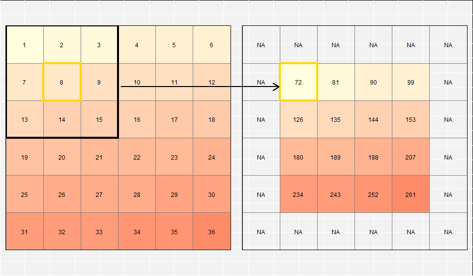

# Attribute data operations {#attr}

## Prerequisites {-}

- This chapter requires the packages **tidyverse** and **sf**:

```{r, message=FALSE}
library(sf)
library(tidyverse)
```

- We will also make use of the `world` and `worldbank_df` data sets. Note that loading the **spData** package automatically attaches these data sets to your global environment:

```{r, results='hide'}
library(spData)
```

## Introduction

Attribute data is non-spatial information associated with geographic (geometry) data.
A bus station, for example, could be represented by an attribute field containing its name, associated with its latitude and longitude position (geometry data).
A raster example might be the elevation value (attribute) for a specific grid cell.
Interestingly, the raster data model stores the coordinate of the grid cell only indirectly.
Say, we are in the 3rd row and the 4th column of a raster matrix.
To derive the corresponding coordinate, we have to move from the origin three cells in x-direction and four cells in y-direction with the cell resolution defining the distance for each x- and y-step.
The raster header simply gives the matrix a spatial dimension which we need when plotting the raster or when we want to combine two rasters, think, for instance, of adding the values of one raster to another.
Before such an operation, the corresponding algorithm simply checks if the two rasters share the same extent, projection and resolution, that is the raster headers. 
Hence, the spatial dimension of raster data is (often) of no importance at the processing level.
Then, raster processing uses in fact matrix algebra which is why it is so much faster compared to vector processing.
<!-- should we somewhere add a table comparing advantages/disadvantages of using the vector or raster data model, would fit nicely into chapter 2 -->

Simple features, described in the previous chapter, store attribute data in a data frame, with each column corresponding to a variable (such as 'name') and each row to one observation (such as an individual bus station).
In addition, a special column, usually named `geom` or `geometry`, stores the geometry data of **sf** objects.
For a bus station, that would likely be a single point representing its coordinate of the bus station.
By contrast, a line or a polygon consist of multiple points.
Still, these points only correspond to one row in the attribute table.
This works since **sf** stores the geometry in the form of a list. 
The list elements correspond to the number of observations in the attribute table.
But each list element can contain more than one coordinate if required or even another list as it is the case for polygons with holes (see previous sections).
This structure enables multiple columns to represent a range of attributes for thousands of features (one row per feature).

This chapter focuses on non-geographical operations on vector and raster data.
Regarding vector data, we will introduce subsetting, aggregating or joining attribute data. 
Note that the corresponding functions also have a geographical equivalent.
Sometimes you can even use the same functions for attribute and spatial operations.
This is, for example, the case for subsetting as base R's `[` and tidyverse's `filter()` let you also subset spatial data based on the spatial extent of another spatial object (see Chapter \@ref(spatial-data-operations)).
That is, the skills you learn here are cross-transferable which is also why this chapter lays the foundation for the next chapter (Chapter \@ref(spatial-data-operations)) which extends the here presented methods to the spatial world.

In the case of raster data we will learn how to create, and how to extract cell values from one layer and multiple layers at once (subsetting).
Finally, we will introduce the concept of map algebra. 
Since the underlying mathematics is basically matrix algebra (see above), we present them in this chapter (non-spatial attribute operations).

## Vector attribute manipulation
As outlined in Chapter \@ref(spatial-class), **sf** provided support for simple features in R and made them work with generic R functions such as `plot()` and `summary()` (as can be seen by executing `methods("summary")` and/or `methods("plot")`).

The reliable `data.frame` (and modifications to it such as the `tibble` class used in the tidyverse) is the basis for data analysis in R.
Extending this system to work with spatial data has many advantages. 
The most important one is that the accumulated know-how in the R community for handling data frames can be transferred to geographic attribute data.

Before proceeding to perform various attribute operations on a dataset, let's explore its structure.
To find out more about the structure of our use case dataset `world`, we use base R functions for working with tabular data such as `nrow()` and `ncol()`:

```{r}
dim(world) # it is a 2 dimensional object, with rows and columns
nrow(world) # how many rows?
ncol(world) # how many columns?
```

Our dataset contains ten non-geographical columns (and one geometry list-column) with almost 200 rows representing the world's countries.

Extracting the attribute data of an `sf` object is the same as removing its geometry:

```{r}
world_df = st_set_geometry(world, NULL)
class(world_df)
```

This can be useful if the geometry column causes problems, e.g., by occupying large amounts of RAM, or to focus the attention on the attribute data.
For most cases, however, there is no harm in keeping the geometry column because non-spatial data operations on `sf` objects act only on the attribute data.
For this reason, being good at working with attribute data of spatial objects is the same as being proficient at handling data frames in R.
For many applications, **dplyr** offers the most effective and most intuitive approach of working with data frames, as we will see in the next
section.^[
Unlike objects of class `Spatial` of the **sp** package, `sf` objects are also compatible with the **tidyverse** packages **dplyr** and **ggplot2**.
The former provides fast and powerful functions for data manipulation (see [Section 6.7](https://csgillespie.github.io/efficientR/data-carpentry.html#data-processing-with-data.table) of @gillespie_efficient_2016), and the latter provides powerful plotting capabilities.
]
This chapter focuses on **dplyr** because of its intuitive function names and ability to perform multiple chained operations using the pipe operator.

### Subsetting
Because simple feature objects are also data frames (run `class(world)`to verify), you can use a wide range of functions (from base R and other packages) for subsetting them.
Base R subsetting functions include `[`, `subset()` and  `$`.
**dplyr** subsetting functions include `select()`, `filter()`, and `pull()`.
Both sets of functions preserve the spatial components of the data.

The `[` operator can subset both rows and columns. 
You use indices to specify the elements you wish to extract from an object, e.g., `object[i, j]` with `i` and `j` representing rows and columns.
<!-- you can also use `[`(world, 1:6, 1) -->
The indices can be either numeric, indicating position, or character strings, indicating row or column names.
Leaving `i` or `j` empty, simply returns all rows or columns.
For instance, `object[1:5, ]` returns the first five rows and all columns.
Below, we demonstrate how to use base R subsetting (results not shown - try running this on your own computer to check the output is as expected):

```{r, eval=FALSE}
world[1:6, ] # subset rows by position
```

```{r, eval=FALSE}
world[, 1:3] # subset columns by position
```

```{r, eval=FALSE}
world[, c("name_long", "lifeExp")] # subset columns by name
```

The `[` subsetting operator also accepts `logical` vectors consisting of `TRUE` and `FALSE` elements.
The following code chunk, for example, creates a new object, `small_countries`, which only contains nations whose surface area is smaller than 100,000 km^2^:

```{r}
sel_area = world$area_km2 < 10000
summary(sel_area)
small_countries = world[sel_area, ]
```

Note that we created the intermediary `sel_object`, a logical vector, for illustration purposes, and to show that only seven countries match our query.
A more concise command, that omits the intermediary object, generates the same result:

```{r}
small_countries = world[world$area_km2 < 10000, ]
```

Another the base R function `subset()` provides yet another way to achieve the same result:

```{r, eval=FALSE}
small_countries = subset(world, area_km2 < 10000)
```

You can use the `$` operator to select a specific variable by its name. The result is a vector:

```{r, eval=FALSE}
world$name_long
```

<!-- , after the package has been loaded: [or - it is a part of tidyverse] -->
Base R functions are essential, and we recommend that you have a working knowledge of them.
However, **dplyr** often makes working with data frames easier.
Moreover, **dplyr** is usually much faster than base R since it makes use of C++ in the background. 
This comes in especially handy when working with large data sets.
As a special bonus, **dplyr** is compatible with `sf` objects.
The main **dplyr** subsetting functions are `select()`, `slice()`, `filter()` and `pull()`.

The `select()` function selects columns by name or position.
For example, you could select only two columns, `name_long` and `pop`, with the following command (note the `geom` column remains):

```{r}
world1 = select(world, name_long, pop)
names(world1)
```

`select()` also allows subsetting of a range of columns with the help of the `:` operator: 

```{r, eval=TRUE}
# all columns between name_long and pop (inclusive)
world2 = select(world, name_long:pop)
names(world2)
```

Omit specific columns with the `-` operator:

```{r, eval=TRUE}
# all columns except subregion and area_km2 (inclusive)
world3 = select(world, -subregion, -area_km2)
```

Conveniently, `select()` lets you subset and rename columns at the same time, for example:

```{r}
world4 = select(world, name_long, population = pop)
names(world4)
```

This is more concise than the base R equivalent:

```{r, eval=FALSE}
world5 = world[, c("name_long", "pop")] # subset columns by name
names(world5)[2] = "population" # rename column manually
```

`select()` also works with 'helper functions' for advanced subsetting operations, including `contains()`, `starts_with()` and `num_range()` (see the help page with `?select` for details).

`slice()` is the row-equivalent of `select()`.
The following code chunk, for example, selects the 3^rd^ to 5^th^ rows:

```{r, eval=FALSE}
slice(world, 3:5)
```

`filter()` is **dplyr**'s equivalent of base R's `subset()` function.
It keeps only rows matching given criteria, e.g., only countries with a very high average of life expectancy:

```{r, eval=FALSE}
# only countries with a life expectation larger than 82 years
world6 = filter(world, lifeExp > 82)
```

The standard set of comparison operators can be used in the `filter()` function: 

```{r, echo=FALSE}
operators = c("`==`", "`!=`", "`>`", "`>=`", "`<`", "`<=`", "`&`", "|", "`!`")
operators_exp = c("Equal to", "Not equal to", "Greater than", "Greater than or equal",
                  "Less than", "Less than or equal", "And", "Or", "Not")
knitr::kable(data_frame(Symbol = operators, Name = operators_exp))
```

<!-- describe these: ==, !=, >, >=, <, <=, &, | -->
<!-- add warning about = vs == -->
<!-- add info about combination of &, |, ! -->

Finally, we would like to introduce the special *pipe* operator (` %>% `) of the **magrittr** package.
The *pipe* operator feeds ('pipes forward') the output of one function into the first argument of the next function.
Combining many functions together with pipes is called *chaining* or *piping*.
For example, let us first take the `world` dataset, then let us select the two columns named `name_long` and `continent`, and then we just would like to return the first five rows.

```{r}
world %>%
  select(name_long, continent) %>%
  slice(1:5)
```

The pipe operator supports an intuitive data analysis workflow.
It allows operations to be written in a clear order, line-by-line and from left to right (as with most languages), avoiding 'nesting', whereby one function is burried inside another (without pipes the code in the previous chunk would be written as `slice(select(world, name_long, continent), 1:5)` which is harder for most people to read, write and understand).
Another advantage over the nesting approach is that you can easily comment out certain parts of a pipe.
**dplyr** works especially well with the pipe operator because its fundamental functions (or 'verbs', like `select()`) expect a data frame object as input and also return one.^[If you want **dplyr** to return a vector, use `pull`.]

### Aggregating

<!-- https://github.com/ropenscilabs/skimr ?? -->

<!-- As demonstrated in chapter \@ref(spatial-class), `summary()` provides a quick summary of the spatial and non-spatial components of spatial objects.
Enter the following command for an overview of the `world` object and all its variables (result not shown):

```{r, eval=FALSE}
summary(world)
```

This function is useful when using R interactively, but lacks flexibility and should not be used to create new objects.-->
The **dplyr** equivalent is `summarize()`, which returns summary statistics of groups and variables defined by the user.
The following code, for example, calculates the total population and number of all countries in the world:

```{r}
# customized data summary
world_summary = world %>% 
  summarize(pop = sum(pop, na.rm = TRUE), country_n = n())
world_summary
```

The new object, `world_summary`, is an aggregation of all 177 world's countries.
It consists of one row and two columns. 
The `pop =` and `country_n =` created the names of the two columns, while the `sum()`- and `n()`-function actually did the aggregation.
The first function added up all inhabitants, while the latter simply counted the number of rows. 
 
You can use a wide range of functions within `summarize()` for aggregation and summary purposes.
Type `?summarize` for a list with useful functions and more information.

`summarize()` becomes even more powerful when combined with `group_by()`, which allows simultaneous aggregate/summary operations *per group*, analogous to the base R function `aggregate()`.
The following code chunk calculates the total population and number of countries *per continent* (see Chapter 5 of [R for Data Science](http://r4ds.had.co.nz/transform.html#grouped-summaries-with-summarize) for a more detailed overview of `summarize()`):

```{r}
# data summary by groups
world_continents = world %>% 
  group_by(continent) %>% 
  summarize(pop = sum(pop, na.rm = TRUE), country_n = n())
world_continents
```

`sf` objects are well-integrated with the **tidyverse**, as illustrated by the fact that the aggregated objects preserve the geometry of the original `world` object.
What is more, under the hood `sf` is already doing a spatial aggregation of polygon data which is known as 'dissolving polygons' in the GIS world - an operation we will explain in more detail in the the next chapter.
This means that summaries of the world's continents can be plotted spatially, as illustrated below, which generates a plot of population by continent (note that borders between countries have largely been removed):

```{r continent-pop, fig.cap="Geographic representation of attribute aggregation by continent: total population by continent generated by `summarize()`."}
plot(world_continents["pop"])
```

Using the base R function `aggregate()` you can obtain the same result with a slightly different syntax: you have to indicate the grouping variable as a `list`-object:

```{r}
ag_var = list(world$continent)
world_continents2 = aggregate(world["pop"], by = ag_var, FUN = sum, na.rm = TRUE)
```

<!-- Todo (optional): add exercise exploring similarities/differences with `world_continents`? -->

<!-- should it stay or should it go (?) aka should we present the arrange function?: -->
<!-- Jannes: I would suggest to leave the arrange function as an exercise to the reader. -->

<!-- ```{r} -->
<!-- # sort variables -->
<!-- ## by name -->
<!-- world_continents %>%  -->
<!--   arrange(continent) -->
<!-- ## by population (in descending order) -->
<!-- world_continents %>%  -->
<!--   arrange(-pop) -->
<!-- ``` -->

### Joining

<!-- https://github.com/dgrtwo/fuzzyjoin -->
<!-- http://r4ds.had.co.nz/relational-data.html -->
<!-- non-unique keys -->

Combining data from different sources is one of the most common tasks in data preparation. 
Joins are methods to combine pair of tables based on a shared key variable.
The **dplyr** package has a set of verbs to easily join `data.frames` - `left_join()`, `right_join()`,  `inner_join()`, `full_join`, `semi_join()` and `anti_join()`.
These function names follow conventions used in the database language SQL, as explained in [Chapter 13](http://r4ds.had.co.nz/relational-data.html) of *R for Data Science* [@grolemund_r_2016].

Working with spatial data, however, usually involves a connection between spatial data (`sf` objects) and tables (`data.frame` objects).
Fortunately, the **sf** package has all of the **dplyr** join functions adapted to work with `sf` objects.
The only important difference between combining two `data.frames` and combining `sf` and `data.frame` objects is the special `sf` column storing the geometry information.
Therefore, the result of data joins can be either an `sf` or `data.frame` object.

The easiest way to understand the concept of joins is to show how they work with a smaller dataset. 
We will use an `sf` object `north_america` with country codes (`iso_a2`), names and geometries, as well as a `data.frame` object `wb_north_america` containing information about urban population and unemployment for three countries.
It is important to add that the first object contains data about Canada, Greenland and the United States and the second one about Canada, Mexico and the United States:

```{r}
north_america = world %>%
  filter(subregion == "Northern America") %>%
  select(iso_a2, name_long)
north_america
```

```{r}
plot(north_america[0])
```

```{r}
wb_north_america = worldbank_df %>% 
  filter(name %in% c("Canada", "Mexico", "United States")) %>%
  select(name, iso_a2, urban_pop, unemploy = unemployment)

wb_north_america
```

In this book, we focus on spatial data. 
Most of the following join examples will have a `sf` object as the first argument and a `data.frame` object as the second argument which results in a new `sf` object.
However, the reverse order is also possible and will give you back a `data.frame` object.
This is mostly beyond the scope of this book, but we encourage you to try it.
We will focus on the commonly used left and inner joins, which use the same syntax as the other join types [@grolemund_r_2016].

Left joins are the most commonly used operation for adding attributes to spatial data. 
The `left_join()` returns all observations from the left object (`north_america`) and the matched observations from the right object (`wb_north_america`). 
In cases, like `Greenland`, absent in the right object, `NA` values will show up.

To join two objects we need to specify a key.
This is a variable (or a set of variables) that uniquely identifies each observation (row). 
The `by` argument of **dplyr**'s join functions lets you identify the key variable. 
In simple cases, a single, unique variable exist in both objects like the `iso_a2` column in our example:

```{r}
left_join1 = north_america %>% 
  left_join(wb_north_america, by = "iso_a2")
left_join1
```

It is also possible to join objects by different variables.
Both of the datasets have variables with names of countries, but they are named differently.
The `north_america` has a `name_long` column and the `wb_north_america` has a `name` column.
In these cases, we can use a named vector to specify the connection, e.g. `c("name_long" = "name")`:

```{r}
left_join2 = north_america %>% 
  left_join(wb_north_america, by = c("name_long" = "name"))
left_join2
```

The new object `left_join2`, however, contains two duplicated variables - `iso_a2.x` and `iso_a2.y` because both of the input tables possessed a variable named `iso_a2`.
To solve this problem we should specify all the keys:

```{r}
left_join3 = north_america %>% 
  left_join(wb_north_america, by = c("iso_a2", "name_long" = "name"))
left_join3
```

It is also possible to use our objects in the reverse order, where a `data.frame` object is the first argument and a `sf` object is the second argument.
This would keep the geometry column but drop the `sf` class, and result in a `data.frame` object.

```{r}
# keeps the geom column, but drops the sf class
left_join4 = wb_north_america %>%
  left_join(north_america, by = c("iso_a2"))
left_join4
class(left_join4)
```

`left_join4` has only one class - `data.frame`, however it is possible to add spatial `sf` class using the `st_as_sf()` function: 

```{r}
left_join4_sf = st_as_sf(left_join4)
left_join4_sf
class(left_join4_sf)
```

On the other hand, it is also possible to remove the geometry column of `left_join4` using base R functions or `dplyr`.
Here, this is this simple because the geometry column is just another `data.frame` column and no longer the sticky geometry column of an `sf` object (see also Chapter \@ref(spatial-class)):

```{r}
# base R
left_join4_df = subset(left_join4, select = -geom)
# or dplyr
left_join4_df = left_join4 %>% select(-geom)
left_join4_df
class(left_join4_df)
```

In contrast to the left join, the `inner_join()` keeps only observations from the left object (`north_america`) where there are matching observations in the right object (`wb_north_america`). 
Additionally, all columns from the left and right object are kept:

```{r}
inner_join1 = north_america %>% 
  inner_join(wb_north_america, by = c("iso_a2", "name_long" = "name"))
inner_join1
```

### Creating attributes and removing spatial information
<!-- lubridate? -->

Often, we would like to create a new column based on already existing columns.
For example, we want to calculate population density for each country.
For this we need to divide a population column, here `pop`, by an area column , here `area_km2` with unit area in square km.
Using base R, we can type:

```{r}
data("world")
world_new = world # do not overwrite our original data
world_new$pop_dens = world_new$pop / world_new$area_km2
```

Alternatively, we can use one of **dplyr** functions - `mutate()` or `transmute()`.
`mutate()` adds new columns at the penultimate position in the `sf` object (the last one is reserved for the geometry):

```{r, eval=FALSE}
world %>% 
  mutate(pop_dens = pop / area_km2)
```

The difference between `mutate()` and `transmute()` is that the latter skips all other existing columns (except for the sticky geometry column):

```{r, eval=FALSE}
world %>% 
  transmute(pop_dens = pop / area_km2)
```

Existing columns could be also paste together using `unite()`. 
For example, we want to stick together `continent` and `region_un` columns into a new `con_reg` column.
We could specify a separator to use between values and if input columns should be removed:

<!-- todo: set eval = TRUE when travis issue resolved -->

```{r, eval=FALSE}
world_unite = world %>%
  unite("con_reg", continent:region_un, sep = ":", remove = TRUE)
```

The `separate()` function is the complement of the `unite()` function.
Its role is to split one column into multiple columns using either a regular expression or character position.

```{r, eval=FALSE}
world_separate = world_unite %>% 
  separate(con_reg, c("continent", "region_un"), sep = ":")
```

```{r, echo=FALSE, eval=FALSE}
identical(world, world_separate)
```

Two helper functions, `rename()` and `set_names` can be used to change columns names.
The first one, `rename()` replace an old name with a new one.
For example, we want to change a name of column from `name_long` to `name`:

```{r, eval=FALSE}
world %>% 
  rename(name = name_long)
```

`set_names` can be used to change names of many columns. 
In this function, we do not need to provide old names: 

```{r, eval=FALSE}
new_names = c("ISO_A2", "Name", "Continent", "Region", "Subregion", 
              "Country_type", "Area_in_km2", "Population", "Life_Expectancy",
              "GDP_per_capita", "geom")
world %>% 
  set_names(new_names)
```

It is important to note that the attribute data operations preserve the geometry of the simple features.
As mentioned at the outset of the chapter, however, it can be useful to remove the geometry.
Do do this, you have to explicitly remove it because `sf` explicitly makes the geometry column sticky.
This behavior ensures that data frame operations do not accidently remove the geometry column.
Hence, an approach such as `select(world, -geom)` will be unsuccessful instead use `st_set_geometry()`^[Note that
`st_geometry(world_st) = NULL`
also works to remove the geometry from `world` but overwrites the original object.
].

```{r}
world_data = world %>% st_set_geometry(NULL)
class(world_data)
```

## Manipulating raster objects
In contrast to simple features (vector data), raster data represents continuous surfaces.
In the following, we shortly repeat how to create a raster.
However, here we will use both numerical and categorical data as raster values.
Next we will have a look at subsetting operations. 
And finally, we classify raster operations into four categories using the map algebra scheme [@tomlin_geographic_1990], and present each of these classes individually by example.

Let us start with manually recreating the raster dataset of Chapter \@ref{spatial-class}.
This should make it easy to understand how **raster** and related operations work.

```{r}
library(raster)
r = raster(nrow = 6, ncol = 6, res = 0.5, 
           xmn = -1.5, xmx = 1.5, ymn = -1.5, ymx = 1.5,
           vals = 1:36)
plot(r)
```

Note that a raster object can also contain categorical data.
For this, we can use either boolean or factor variables in R.
For instance, we can create a raster representing grain sizes:

```{r}
grain_size = c("clay", "silt", "sand")
r_2 = raster(nrow = 6, ncol = 6, res = 0.5, 
             xmn = -1.5, xmx = 1.5, ymn = -1.5, ymx = 1.5,
             vals = factor(rep(grain_size, each = 12), levels = grain_size))
```

Internally, R represents boolean and factor variables as integers.
This is why the legend shows numbers when plotting a categorical raster.

### Raster subsetting
There are several ways how to subset raster datasets in R:

- using row-column indexing with the help of `[`
- by cell ID
- by coordinates

So if we want to access the value of the upper left corner cell, we can use one of the following commands:

```{r, eval = FALSE}
# row 1, column 1
r[1, 1]
# cell ID 1
r[1]
# xy coordinates x = -1 and y = 1
r[cellFromXY(r, xy = c(-1, 1))]
```

To extract all values or complete rows, you can use `values()` and `getValues()`
In case you apply subsetting to a raster stack or brick, this will return the cell value(s) for each single layer, for example `stack(r, r_2)[1]` returns a matrix with one row and two columns - one for each layer.
On the other hand, the `raster::subset()` command lets you extract a specific or several layers from a raster stack or brick.
For the same operation, you can also use the `[[` operator.
If you only want to extract a single layer, you might also use the `$` operator.

### Map algebra
Map algebra (or cartographic modeling) divides raster operations into four subclasses [@tomlin_geographic_1990], with each of them either working on one or several grids simultaneously:

1. *Local* or per-cell operations.
2. *Focal* or neighborhood operations.
Most often the output cell value is the result of a 3 x 3 input cell block.
3. *Zonal* operations are similar to focal operations but instead of a predefined neighborhood, classes, which can take on any, i.e. also irregular size and shape, are the basis for calculations.
4. *Global* or per-raster operations, that means the output cell derives its value potentially from one or several entire rasters

This classification scheme uses basically the number of cells involved in a processing step as distinguishing feature.
Of course, one can classify raster operations based on other characteristics such as discipline.
Think, for instance, of terrain, hydrological analysis or image classifications.
In the following paragraphs, we will explain each of the four map algebra operations by example.

Local operations comprise all cell-by-cell operations in one or several layers.
In the simplest case, we modify a single cell value.
To do so, we overwrite existing values with the help of subsetting operations (see above).
For instance, let us replace the upper left cell of `r` with a value of 12:

```{r}
r[1, 1] = 12
r[]
```

Leaving the square brackets empty is a shortcut version of `values()` for retrieving all values of a raster.
Of course, one can use indexing to modify multiple cells or even blocks.
However, local functions more commonly refer to operations that work on all raster cells of one or several rasters.
A good example is the classification of intervals of numeric values into groups.
For example, one might want to divide a digital elevation model into low (class 1), middle (class 2) and high elevations (class 3).
Using the `reclassify()` command, we need first to construct a reclassification matrix, where the first column corresponds to the lower and the second column to the upper end of the class.
The third column represents the new value for the specified ranges in column one and two.
Here, we assign the raster values 1 to 3, 4 to 6 and 7 to 12 to the classes 1, 2 and 3, respectively.

```{r, eval = FALSE}
rcl = matrix(c(0, 3, 1, 3, 6, 2, 6, 12, 3), ncol = 3, byrow = TRUE)
recl = reclassify(r, rcl = rcl)
```

Raster algebra is another classical use case of local operations.
This includes adding, subtracting and squaring two rasters.
Raster algebra also allows logical operations such as finding all raster cells that are greater than a specific value (5 in our example below).
The **raster** package allows all these operations in a way natural to R users.
Please see the `Raster`-vignette for a more detailed description on algebraic operations (`vignette("Raster", package = "raster")`).

```{r, eval = FALSE}
r + r
r^2
log(r)
r > 5
```

The calculation of the normalized difference vegetation index (NDVI) is one of the most famous local, i.e. pixel-by-pixel, raster operations.
The NDVI is an indication for the presense of living vegetation.
It ranges between - 1 and 1 with positive values indicating the of presence of living plants (mostly > 0.2).
To calculate the NDVI, one uses the red and near-infrared bands of remotely sensed imagery (e.g., Landsat or Sentinel imagery) exploiting the fact that vegetation absorpts light heavily in the visible light spectrum, and especially in the red channel, while reflecting it in the near-infrared spectrum.

$$
\begin{split}
NDVI&= \frac{\text{NIR} - \text{Red}}{\text{NIR} + \text{Red}}\\
\end{split}
$$
where NIR = near infrared channel
      Red = red channel

Predictive mapping is another interesting application of local raster operations.
We fit a model (using `lm`, `glm`, `gam` or a machine-learning technique) to predict, for example, species richness, the presence of landslides, tree disease or crop yield.
The response variable correspond to points in space.
We retrieve the predictor variables from various rasters (elevation, pH, precipitation, temperature, landcover, soil class, etc.).
To make a spatial prediction, all we have to do, is to apply the estimated coefficients to the predictor rasters, and summing up the resulting output rasters (Chapter ??; see also @muenchow_predictive_2013).
<!-- add reference to chapter ecological modeling -->

While local functions operate on one cell, though possibly from multiple layers, focal operations take into account a central cell and its neigbors.
The neigborhood (also named kernel, filter or moving window) under consideration is typically of size 3-by-3 cells (that is the central cell and its eight surrounding neighbors) but can take on any other (not necessarily rectangular) shape as defined by the user.
A focal operation applies an aggregation function to all cells within the specified neighborhood, uses the corresponding output as the new value for the the central cell, and moves on to the next central cell (Figure @ref(fig:focal_example)).
Other names for this operation are spatial filtering and convolution [@burrough_principles_2015].

To retrieve the minimum for a 3-by-3 moving window, we can use the `focal()` function in R (Figure @ref(fig:focal_example)).
We define the function we wish to apply to this neighborhood with the `fun` argument and the shape of the moving window with a `matrix` whose values correspond to weights.
Here, we choose the minimum, but of course we can use any other function such as the the sum, the mean, the median, the maximum, the variance or a function which returns the most frequent appearance.

```{r, eval = FALSE}
r_focal = focal(r, w = matrix(1, nrow = 3, ncol = 3), fun = min)
```

```{r focal_example, echo = FALSE, fig.cap = "Input raster (left) and resulting output raster (right) due to a focal operation - summing up 3-by-3 windows"}

```

We can quickly check if the output meets our expectations.
In our example, the minimum value has to be always the upper left corner of the moving window (remember we have created the input raster by rowwise incrementing the cell values by one starting at the upper left corner).
Of course, the `focal()`-function has computed the correct result.
In this example, our weighting matrix consists only of 1s.
This means each cell has the same weight on the output.
Of course, you can change this by specifying different weights.

Focal functions or filters play a dominant role in image processing.
Low-pass or smoothing filters use the mean function to remove extremes.
In the case of categorical data, we can replace the mean with the mode, which is the most common value.
By contrast, high-pass filters accentuate features.
The line detection Laplace and Sobel filters might serve as an example here.
Check the `focal()` help page how to use them in R.

Also, terrain processing uses heavily focal functions.
Think, for instance, of the calculation of the slope, aspect and flow directions.
The `terrain()` function lets you compute a few of these terrain characteristics but has not implemented all popular methods, for example, the Zevenbergen and Thorne method to compute the slope is missing.
Equally, many other terrain and GIS functions are **not** implemented in R such as curvatures, contributing areas, wetness indexes, and many more.
Fortunately, desktop GIS commonly provide these algorithms.
In Chapter 13 we will learn how to access GIS functionality from within R.
<!-- Reference 13-gis chapter -->

### Zonal and global operations

Printing the raster object to the console yields the raster header and also the minimum and maximum raster value.You can also use the `summary()` function for the most common descriptive statistics (minimum, maximum, interquartile range and number of `NA`s).
If we are interested in further summary operations such as the standard deviation (see below) or if we want to define our own summary functions, we can do so with the `cellStats` command. 
```{r}
cellStats(r, sd)
```

Finally, if you provide the `summary()` and `cellStats()` functions with a raster stack or brick object, they will summarize each layer separately. Try `summary(brick(r, r_2))`. 

global: distance from one cell

Let us find out the mean elevation (raster `r`) for each grain size (raster object `r_2` with the classes clay, silt and sand). 

```{r}
zonal(r, r_2, fun = "mean")
```

The `zonal()` command returns the statistics, here the mean altitude for each grainsize class.
A true raster operation is of course to assign the mean values to the 


global: viewshed, zwei Hauptgruppen von globalen Operatoren, die auf der euklidischen oder gewichteten Distanz beruhen (z.B. Berechnung von Kostenoberflächen). see ESRI HELPPAGE

point to `vignette("Raster")`

Spatial functions for later chapters, I guess:
- raster aggregation/disaggregation (changing spatial resolution)
- raster merging (-> merging of two rasters is also a spatial operation)
- crop, overlay
- extract values to points and raster from points -> probably vector/raster chapter

## Exercises

For these exercises we will use the `us_states` and `us_states_df` datasets from the **spData** package:

```{r}
library(spData)
data(us_states)
data(us_states_df)
```

`us_states` is a spatial object (of class `sf`), containing geometry and a few attributes (including name, region, area, and population) of states within the contiguous United States.
`us_states_df` is a data frame (of class `data.frame`) containing the name and additional variables (including median income and poverty level, for years 2010 and 2015) of US states, including Alaska, Hawaii and Puerto Rico.
The data comes from the US Census Bureau, and is documented in `?us_states` and `?us_states_df`.

<!-- Attribute subsetting -->
1. Create a new object called `us_states_name` that contains only the `NAME` column from the `us_states` object. 
What is the class of the new object? <!--why there is a "sf" part? -->
2. Select columns from the `us_states` object which contain population data.
Obtain the same result using a different command (bonus: try to find three ways of obtaining the same result).
Hint: try to use helper functions, such as `contains` or `starts_with` from **dplyr** (see `?contains`).
3. Find all states with the following characteristics (bonus find *and* plot them):
- belong to the Midwest region.
- belong to the West region, have an area below 250,000 km^2^ *and* in 2015 a population greater than 5,000,000 residents (hint: you may need to use the function `units::set_units()` or `as.numeric()`).
- belong to the South region, had an area larger than 150,000 km^2^ or a total population in 2015 larger than 7,000,000 residents.
<!-- Attribute aggregation -->
4. What was the total population in 2015 in the `us_states` dataset?
What was the minimum and maximum total population in 2015?
5. How many states are there in each region?
6. What was the minimum and maximum total population in 2015 in each region?
What was the total population in 2015 in each region?
<!-- Attribute joining -->
7. Add variables from `us_states_df` to `us_states`, and create a new object called `us_states_stats`.
What function did you use and why?
Which variable is the key in both datasets?
What is the class of the new object?
8. `us_states_df` has two more variables than `us_states`.
How you can find them? (hint: try to use the `dplyr::anti_join` function)
<!-- Attribute creation -->
9. What was the population density in 2015 in each state?
What was the population density in 2010 in each state?
10. How much has population density changed between 2010 and 2015 in each state?
Calculate the change in percentages and map them.
11. Change the columns names in `us_states` to lowercase. (Hint: helper functions - `tolower()` and `colnames()` may help).
<!-- Mixed exercises -->
<!-- combination of use of select, mutate, group_by, summarize, etc  -->
12. Using `us_states` and `us_states_df` create a new object called `us_states_sel`.
The new object should have only two variables - `median_income_15` and `geometry`.
Change the name of the `median_income_15` column to `Income`.
13. Calculate the change in median income between 2010 and 2015 for each state.
Bonus: what was the minimum, average and maximum median income in 2015 for each region?
What is the region with the largest increase of the median income?
14. Calculate the NDVI of a Landsat image. 
Use the Landsat image provided by the **spDataLarge** package (`system.file("raster/landsat.tif", package="spDataLarge")`).