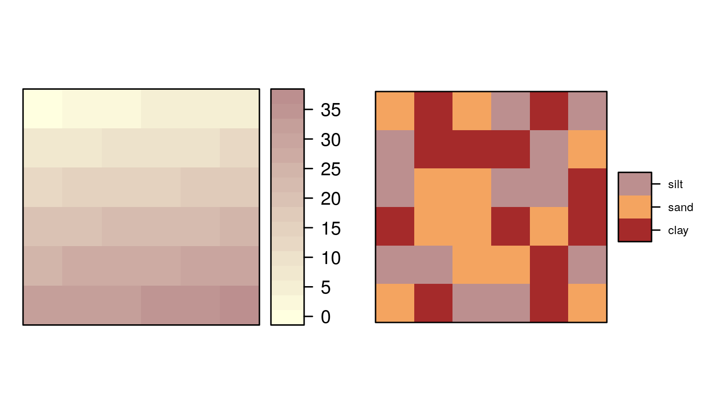

# Attribute operations {#attr}

## Prerequisites {-}

- This chapter requires the packages **sf**, **raster** and **tidyverse**: 

```{r, message=FALSE}
library(sf)
library(raster)
library(tidyverse)
```

- It also relies on **spData**, which loads datasets used in the code examples of this chapter:

```{r, results='hide'}
library(spData)
```

## Introduction

Attribute data is non-spatial information associated with geographic (geometry) data.
A bus stop provides a simple example.
In a spatial vector object its position would typically be represented by latitude and longitude coordinates (geometry data), in addition to its name.
The name is an *attribute* of the feature (to use Simple Features terminology) that bears no relation to its geometry.
<!-- idea: add an example of a bus stop (or modify a previous example so it represents a bus stop) in the previous chapter  -->

Another example is the elevation value (attribute) for a specific grid cell in raster data.
Unlike vector data, the raster data model stores the coordinate of the grid cell only indirectly:
There is a less clear distinction between attribute and spatial information in raster data.
Say, we are in the 3^rd^ row and the 4^th^ column of a raster matrix.
To derive the corresponding coordinate, we have to move from the origin three cells in x-direction and four cells in y-direction with the cell resolution defining the distance for each x- and y-step.
The raster header gives the matrix a spatial dimension which we need when plotting the raster or when we want to combine two rasters, think, for instance, of adding the values of one raster to another (see also next chapter).
<!-- should we somewhere add a table comparing advantages/disadvantages of using the vector or raster data model, would fit nicely into chapter 2 -->

This chapter focuses on non-geographic operations on vector and raster data.
For vector data, we will introduce subsetting, aggregating and joining attribute data in the next section.
Note that the corresponding functions also have a geographic equivalent.
Sometimes you can even use the same functions for attribute and spatial operations.
This is the case for subsetting as base R's `[` and tidyverse's `filter()` let you also subset spatial data based on the spatial extent of another spatial object (see Chapter \@ref(spatial-operations)).
Therefore the skills you learn here are cross-transferable which is why this chapter lays the foundation for the next (Chapter \@ref(spatial-operations)) which extends the methods presented here to the spatial world.

Raster attribute data operations are covered in Section \@ref(manipulating-raster-objects), which covers creating continuous and categorical raster layers and extracting cell values from one layer and multiple layers (raster subsetting). 
Section \@ref(summarizing-raster-objects) provides an overview of 'global' raster operations which can be used to characterize entire raster datasets.

## Vector attribute manipulation

Geographic vector data in R are well-support by `sf`, a class which extends the `data.frame`.
Thus `sf` objects have one column per attribute variable (such as 'name') and one row per observation, or *feature* (e.g. per bus station).
`sf` objects also have a special column to contain geometry data, usually named `geometry`.
The `geometry` column is special because it is a *list-colum*, which can contain multiple geographic entities (points, lines, polygons) per row.
In Chapter \@ref(spatial-class) we saw how to perform *generic methods* such as `plot()` and `summary()` on `sf` objects.
**sf** also provides methods that allow `sf` objects to behave like regular data frames:

```{r, eval=FALSE}
methods(class = "sf") # methods for sf objects, first 12 shown
```

```{r}
#>  [1] aggregate             cbind                 coerce               
#>  [4] initialize            merge                 plot                 
#>  [7] print                 rbind                 [                    
#> [10] [[<-                  $<-                   show                 
```

```{r, eval=FALSE, echo=FALSE}
# Another way to show sf methods:
attributes(methods(class = "sf"))$info %>% 
  filter(!visible)
```

Many of these functions, including `rbind()` (for binding rows of data together) and `$<-` (for creating new columns) were developed for data frames.
A key feature of `sf` objects is that they store spatial and non-spatial data in the same way, as columns in a `data.frame` (the geometry column is typically called `geometry`).

```{block2 type = 'rmdnote'}
The geometry column of `sf` objects is typically called `geometry` but any name can be used.
The following command, for example, creates a geometry column named g:
  
`st_sf(data.frame(n = world$name_long), g = world$geom)`

This enables geometries imported from spatial databases to have a variety of names such as `wkb_geometry` and `the_geom`.
```

`sf` objects also support `tibble` and `tbl` classes used in the tidyverse, allowing 'tidy' data analysis workflows for spatial data.
Thus **sf** enables the full power of R's data analysis capabilities to be unleashed on geographic data.
Before using these capabilities it's worth re-capping how to discover the basic properties of vector data objects.
Let's start by using base R functions to get a measure of the `world` dataset:

```{r}
dim(world) # it is a 2 dimensional object, with rows and columns
nrow(world) # how many rows?
ncol(world) # how many columns?
```

Our dataset contains ten non-geographic columns (and one geometry list-column) with almost 200 rows representing the world's countries.

Extracting the attribute data of an `sf` object is the same as removing its geometry:

```{r}
world_df = st_set_geometry(world, NULL)
class(world_df)
```

This can be useful if the geometry column causes problems, e.g. by occupying large amounts of RAM, or to focus the attention on the attribute data.
For most cases, however, there is no harm in keeping the geometry column because non-spatial data operations on `sf` objects only change an object's geometry when appropriate (e.g. by dissolving borders between adjacent polygons following aggregation).
This means that proficiency with attribute data in `sf` objects equates to proficiency with data frames in R.
For many applications, the tidyverse package **dplyr** offers the most effective and intuitive approach of working with data frames, hence the focus on this approach in this section.^[
Unlike objects of class `Spatial` of the **sp** package, `sf` objects are also compatible with the **tidyverse** packages **dplyr** and **ggplot2**.
The former provides fast and powerful functions for data manipulation (see [Section 6.7](https://csgillespie.github.io/efficientR/data-carpentry.html#data-processing-with-data.table) of @gillespie_efficient_2016), and the latter provides powerful plotting capabilities.
]

### Vector attribute subsetting

Base R subsetting functions include `[`, `subset()` and  `$`.
**dplyr** subsetting functions include `select()`, `filter()`, and `pull()`.
Both sets of functions preserve the spatial components of attribute data in `sf` objects.

The `[` operator can subset both rows and columns. 
You use indices to specify the elements you wish to extract from an object, e.g. `object[i, j]`, with `i` and `j` typically being numbers or logical vectors --- `TRUE`s and `FALSE`s --- representing rows and columns (they can also be character strings, indicating row or column names).
<!-- you can also use `[`(world, 1:6, 1) -->
Leaving `i` or `j` empty returns all rows or columns, so `world[1:5, ]` returns the first five rows and all columns.
The examples below demonstrate subsetting with base R.
The results are not shown; check the results on your own computer:

```{r, eval=FALSE}
world[1:6, ] # subset rows by position
```

```{r, eval=FALSE}
world[, 1:3] # subset columns by position
```

```{r, eval=FALSE}
world[, c("name_long", "lifeExp")] # subset columns by name
```

A demonstration of the utility of using `logical` vectors for subsetting is shown in the code chunk below.
This creates a new object, `small_countries`, containing nations whose surface area is smaller than 10,000 km^2^:

```{r}
sel_area = world$area_km2 < 10000
summary(sel_area) # a logical vector
small_countries = world[sel_area, ]
```

The intermediary `sel_object` is a logical vector that shows that only seven countries match the query.
A more concise command, that omits the intermediary object, generates the same result:

```{r}
small_countries = world[world$area_km2 < 10000, ]
```

The base R function `subset()` provides yet another way to achieve the same result:

```{r, eval=FALSE}
small_countries = subset(world, area_km2 < 10000)
```

<!-- , after the package has been loaded: [or - it is a part of tidyverse] -->
Base R functions are mature and widely used.
However, the more recent **dplyr** approach has several advantages.
It enables intuitive workflows.
It is fast, due to its C++ backend.
This is especially useful when working with big data as well as **dplyr**'s database integration.
The main **dplyr** subsetting functions are `select()`, `slice()`, `filter()` and `pull()`.

```{block type='rmdnote'}
**raster** and **dplyr** packages have a function called `select()`. If both packages are loaded, this can generate error messages containing the text: `unable to find an inherited method for function ‘select’ for signature ‘"sf"’`.
To avoid this error message, and prevent ambiguity, we use the long-form function name, prefixed by the package name and two colons (usually omitted from R scripts for concise code): `dplyr::select()`.
```

`select()` selects columns by name or position.
For example, you could select only two columns, `name_long` and `pop`, with the following command (note the sticky `geom` column remains):

```{r}
world1 = dplyr::select(world, name_long, pop)
names(world1)
```

`select()` also allows subsetting of a range of columns with the help of the `:` operator: 

```{r}
# all columns between name_long and pop (inclusive)
world2 = dplyr::select(world, name_long:pop)
```

Omit specific columns with the `-` operator:

```{r}
# all columns except subregion and area_km2 (inclusive)
world3 = dplyr::select(world, -subregion, -area_km2)
```

Conveniently, `select()` lets you subset and rename columns at the same time, for example:

```{r}
world4 = dplyr::select(world, name_long, population = pop)
names(world4)
```

This is more concise than the base R equivalent:

```{r, eval=FALSE}
world5 = world[, c("name_long", "pop")] # subset columns by name
names(world5)[names(world5) == "pop"] = "population" # rename column manually
```

`select()` also works with 'helper functions' for advanced subsetting operations, including `contains()`, `starts_with()` and `num_range()` (see the help page with `?select` for details).

All **dplyr** functions including `select()` always return a dataframe-like object. 
To extract a single vector, one has to explicitly use the `pull()` command.
The subsetting operator in base R (see `?[`), by contrast, tries to return objects in the lowest possible dimension.
This means selecting a single column returns a vector in base R.
To turn off this behavior, set the `drop` argument to `FALSE`.

```{r, eval=FALSE}
# create throw-away dataframe
d = data.frame(pop = 1:10, area = 1:10)
# return dataframe object when selecting a single column
d[, "pop", drop = FALSE]
select(d, pop)
# return a vector when selecting a single column
d[, "pop"]
pull(d, pop)
```

Due to the sticky geometry column, selecting a single attribute from an sf-object with the help of `[()` returns also a dataframe.
Contrastingly, `pull()` and `$` will give back a vector.

```{r, eval = FALSE}
# dataframe object
world[, "pop"]
# vector objects
world$pop
pull(world, pop)
```

`slice()` is the row-equivalent of `select()`.
The following code chunk, for example, selects the 3^rd^ to 5^th^ rows:

```{r, eval=FALSE}
slice(world, 3:5)
```

`filter()` is **dplyr**'s equivalent of base R's `subset()` function.
It keeps only rows matching given criteria, e.g. only countries with a very high average of life expectancy:

```{r, eval=FALSE}
# Countries with a life expectancy longer than 82 years
world6 = filter(world, lifeExp > 82)
```

The standard set of comparison operators can be used in the `filter()` function, as illustrated in Table \@ref(tab:operators): 

```{r operators, echo=FALSE}
operators = c("`==`", "`!=`", "`>, <`", "`>=, <=`", "`&, |, !`")
operators_exp = c("Equal to", "Not equal to", "Greater/Less than", "Greater/Less than or equal", "Logical operators: And, Or, Not")
knitr::kable(data_frame(Symbol = operators, Name = operators_exp), caption = "Table of comparison operators that result in boolean (TRUE/FALSE) outputs.")
```

<!-- describe these: ==, !=, >, >=, <, <=, &, | -->
<!-- add warning about = vs == -->
<!-- add info about combination of &, |, ! -->

A benefit of **dplyr** is its compatibility with the *pipe* operator ` %>% `.
This 'R pipe', which takes its name from the Unix pipe `|` and is part of the **magrittr** package, enables expressive code by 'piping' the output of a previous command into the first argument of the next function.
This allows *chaining* data analysis commands, with the data frame being passed from one function to the next.

This is illustrated below, in which the `world` dataset is subset by columns (`name_long` and `continent`) and the first five rows (result not shown).

```{r}
world7 = world %>%
  filter(continent == "Asia") %>%
  dplyr::select(name_long, continent) %>%
  slice(1:5)
```

The above chunk shows how the pipe operator allows commands to be written in a clear order:
the above run from top to bottom (line-by-line) and left to right.
Without `%>%` one would be forced to create intermediary objects or use nested function calls, e.g.:

```{r}
world8 = slice(
  dplyr::select(
    filter(world, continent == "Asia"),
    name_long, continent),
  1:5)
```

This generates the same result --- verify this with `identical(world7, world8)` --- in the same number of lines of code, but in a much more confusing way, starting with the function that is called last!

There are additional advantages of pipes from a communication perspective: they encourage adding comments to self-contained functions and allow single lines *commented-out* without breaking the code.

### Vector attribute aggregation

Aggregation operations summarize datasets by a grouping variables, which can be either another attribute column or a spatial object.
Imagine we would like to calculate the number of people per continent. 
Fortunately, our `world` dataset has the necessary ingredients, with the `pop` column containing the population per country and the grouping variable `continent`.
In base R this can be done with `aggregate()` as follows:

```{r, eval=FALSE}
aggregate(pop ~ continent, FUN = sum, data = world, na.rm = TRUE)
```

The result is a non-spatial data frame with six rows, one per continent, and two columns (see Table \@ref(tab:continents) with results for the top 3 most populous continents).

`summarize()` is the **dplyr** equivalent of `aggregate()`, which uses the function `group_by()` to create the grouping variable.
The tidy equivalent of the `aggregate()` method is as follows:

```{r, eval=FALSE}
group_by(world, continent) %>%
  summarize(pop = sum(pop, na.rm = TRUE))
```

This approach is flexible, allowing the resulting columns to be named.
Further, omitting the grouping variable puts everything in one group.
This means `summarize()` can be used to calculate the Earth's total population (~7 billion) and number of countries:

```{r, eval=FALSE}
world %>% 
  summarize(pop = sum(pop, na.rm = TRUE), n_countries = n())
```

```{r, echo=FALSE}
world %>% 
  st_set_geometry(NULL) %>%
  summarize(pop = sum(pop, na.rm = TRUE), n_countries = n())
```

The result is a spatial data frame of class `sf` (only the non-spatial results are shown): the aggregation procedure dissolves boundaries within continental land masses (explained in detail in section \@ref(geometry-unions)).
In the previous code chunk `pop` and `n_countries` are column names in the result.
`sum()` and `n()` were the aggregating functions.

Let's combine what we've learned so far about **dplyr** by chaining together functions to find the world's 3 most populous continents (with `dplyr::n()` ) and the number of countries they contain.
The output of the following code is presented in Table \@ref(tab:continents)):

```{r, eval=FALSE}
world %>% 
  dplyr::select(pop, continent) %>% 
  group_by(continent) %>% 
  summarize(pop = sum(pop, na.rm = TRUE), n_countries = n()) %>% 
  top_n(n = 3, wt = pop) %>%
  st_set_geometry(value = NULL) 
```


```{r continents, echo=FALSE}
world %>% 
  dplyr::select(pop, continent) %>% 
  group_by(continent) %>% 
  summarize(pop = sum(pop, na.rm = TRUE), n_countries = n()) %>% 
  top_n(n = 3, wt = pop) %>%
  st_set_geometry(value = NULL) %>% 
  knitr::kable(caption = "The top 3 most populous continents, and the number of countries in each.")
```

```{block2 type='rmdnote'}
More details are provided in the help pages (which can be accessed via `?summarize` and `vignette(package = "dplyr")` and Chapter 5 of [R for Data Science](http://r4ds.had.co.nz/transform.html#grouped-summaries-with-summarize). 
```

<!-- `sf` objects are well-integrated with the **tidyverse**, as illustrated by the fact that the aggregated objects preserve the geometry of the original `world` object. -->
<!-- Here, we even had to make some efforts to prevent a spatial operation. -->
<!-- When `aggregate()`ing the population we have just used the population vector.  -->
<!-- Had we used the spatial object (world[, "population"]), `aggregate()` would have done a spatial aggregation of the polygon data.  -->
<!-- The same would have happened, had we not dismissed the geometry prior to using the `summarize()` function. -->
<!-- We will explain this so-called 'dissolving polygons' in more detail in the the next chapter. -->

<!-- Todo (optional): add exercise exploring similarities/differences with `world_continents`? -->

<!-- should it stay or should it go (?) aka should we present the arrange function?: -->
<!-- Jannes: I would suggest to leave the arrange function as an exercise to the reader. -->

<!-- ```{r} -->
<!-- # sort variables -->
<!-- ## by name -->
<!-- world_continents %>%  -->
<!--   arrange(continent) -->
<!-- ## by population (in descending order) -->
<!-- world_continents %>%  -->
<!--   arrange(-pop) -->
<!-- ``` -->

###  Vector attribute joining

<!-- https://github.com/dgrtwo/fuzzyjoin -->
<!-- http://r4ds.had.co.nz/relational-data.html -->
<!-- non-unique keys -->

Combining data from different sources is a common task in data preparation. 
Joins do this by combining tables based on a shared 'key' variable.
**dplyr** has powerful functions for joining: `left_join()`, `right_join()`,  `inner_join()`, `full_join`, `semi_join()` and `anti_join()`.
These function names follow conventions used in the database language [SQL](http://r4ds.had.co.nz/relational-data.html) [@grolemund_r_2016, Chapter 13].
Using them with `sf` objects is the focus of this section.
**dplyr** join functions work the same on data frames and `sf` objects, the only important difference being the `geometry` list column.
The result of data joins can be either an `sf` or `data.frame` object.

Most joins involving spatial data will have an `sf` object as the first argument and a `data.frame` object as the second argument, resulting in a new `sf` object (the reverse order is also possible and will return a `data.frame`).
We will focus on the commonly used left and inner joins, which use the same syntax as the other join types [see @grolemund_r_2016 for more join types].

The easiest way to understand the concept of joins is to show how they work with a smaller dataset. 
We will use an `sf` object `north_america` with country codes (`iso_a2`), names and geometries, as well as a `data.frame` object `wb_north_america` containing information about urban population and unemployment for three countries.
Note that `north_america` contains data about Canada, Greenland and the United States but the World Bank dataset (`wb_north_america`) contains information about Canada, Mexico and the United States:

```{r}
north_america = world %>%
  filter(subregion == "Northern America") %>%
  dplyr::select(iso_a2, name_long)
north_america$name_long
```

```{r}
wb_north_america = worldbank_df %>% 
  filter(name %in% c("Canada", "Mexico", "United States")) %>%
  dplyr::select(name, iso_a2, urban_pop, unemploy = unemployment)
```

We will use a left join to combine the two datasets.
Left joins are the most commonly used operation for adding attributes to spatial data, as they return all observations from the left object (`north_america`) and the matched observations from the right object (`wb_north_america`) in new columns.
Rows in the left object without matches in the right (`Greenland` in this case) result in `NA` values.

To join two objects we need to specify a key.
This is a variable (or a set of variables) that uniquely identifies each observation (row). 
The `by` argument of **dplyr**'s join functions lets you identify the key variable. 
In simple cases, a single, unique variable exist in both objects like the `iso_a2` column in our example (you may need to rename columns with identifying information for this to work):

```{r}
left_join1 = north_america %>% 
  left_join(wb_north_america, by = "iso_a2")
```

This has created a spatial dataset with the new variables added.
The utility of this is shown in Figure \@ref(fig:unemploy), which shows the unemployment rate (a World Bank variable) across the countries of North America.

```{r unemploy, echo=FALSE, fig.cap="The unemployment rate (taken from World Bank statistics) in Canada and the United States to illustrate the utility of joining attribute data on to spatial datasets."}
# tmap::qtm(left_join1, "unemploy", fill.breaks = c(6, 6.5, 7), fill.title="Unemployment rate: ",
#           projection = "+proj=aea +lat_1=20 +lat_2=60 +lat_0=40 +lon_0=-96 +x_0=0 +y_0=0 +ellps=GRS80 +datum=NAD83 +units=m +no_defs")
library(tmap)
tm_shape(left_join1) + 
  tm_polygons("unemploy", breaks = c(6, 6.5, 7), title = "Unemployment rate: ") +
  tm_layout(legend.position = c("right", "bottom"))
```

It is also possible to join objects by different variables.
Both of the datasets have variables with names of countries, but they are named differently.
The `north_america` has a `name_long` column and the `wb_north_america` has a `name` column.
In these cases a named vector, such as `c("name_long" = "name")`, can specify the connection:

```{r}
left_join2 = north_america %>% 
  left_join(wb_north_america, by = c("name_long" = "name"))
names(left_join2)
```

Note that the result contains two duplicated variables - `iso_a2.x` and `iso_a2.y` because both `x` and `y` objects have the column `iso_a2`.
This can be solved by specifying all the keys:

```{r}
left_join3 = north_america %>% 
  left_join(wb_north_america, by = c("iso_a2", "name_long" = "name"))
```

Joins also work when a data frame is the first argument.
This keeps the geometry column but drops the `sf` class, returning a `data.frame` object.

```{r}
# keeps the geom column, but drops the sf class
left_join4 = wb_north_america %>%
  left_join(north_america, by = c("iso_a2"))
class(left_join4)
```

```{block2 type='rmdnote'}
In most cases the geometry column is only useful in an `sf` object.
The geometry column can only be used for creating maps and spatial operations if R 'knows' it is a spatial object, defined by a spatial package such as **sf**.
Fortunately non-spatial data frames with a geometry list column (like `left_join4`) can be coerced into an `sf` object as follows: `st_as_sf(left_join4)`. 
```

<!-- On the other hand, it is also possible to remove the geometry column of `left_join4` using base R functions or `dplyr`. -->
<!-- Here, this is this simple because the geometry column is just another `data.frame` column and no longer the sticky geometry column of an `sf` object (see also Chapter \@ref(spatial-class)): -->

<!-- ```{r} -->
<!-- # base R -->
<!-- left_join4_df = subset(left_join4, select = -geom) -->
<!-- # or dplyr -->
<!-- left_join4_df = left_join4 %>% dplyr::select(-geom) -->
<!-- left_join4_df -->
<!-- class(left_join4_df) -->
<!-- ``` -->

In contrast to `left_join()`, `inner_join()` keeps only observations from the left object (`north_america`) where there are matching observations in the right object (`wb_north_america`). 
All columns from the left and right object are still kept:

```{r}
inner_join1 = north_america %>% 
  inner_join(wb_north_america, by = c("iso_a2", "name_long" = "name"))
inner_join1$name_long
```

### Creating attributes and removing spatial information {#vec-attr-creation}
<!-- lubridate? -->

Often, we would like to create a new column based on already existing columns.
For example, we want to calculate population density for each country.
For this we need to divide a population column, here `pop`, by an area column , here `area_km2` with unit area in square km.
Using base R, we can type:

```{r}
world_new = world # do not overwrite our original data
world_new$pop_dens = world_new$pop / world_new$area_km2
```

Alternatively, we can use one of **dplyr** functions - `mutate()` or `transmute()`.
`mutate()` adds new columns at the penultimate position in the `sf` object (the last one is reserved for the geometry):

```{r, eval=FALSE}
world %>% 
  mutate(pop_dens = pop / area_km2)
```

The difference between `mutate()` and `transmute()` is that the latter skips all other existing columns (except for the sticky geometry column):

```{r, eval=FALSE}
world %>% 
  transmute(pop_dens = pop / area_km2)
```

`unite()` pastes together existing columns. 
For example, we want to combine the `continent` and `region_un` columns into a new column named `con_reg`.
Additionally, we can define a separator (here: a colon `:`) which defines how the values of the input columns should be joined, and if the original columns should be removed (here: `TRUE`):

```{r, eval=FALSE}
world_unite = world %>%
  unite("con_reg", continent:region_un, sep = ":", remove = TRUE)
```

The `separate()` function does the exact opposite of the `unite()` function, i.e. it splits one column into multiple columns using either a regular expression or character positions.

```{r, eval=FALSE}
world_separate = world_unite %>% 
  separate(con_reg, c("continent", "region_un"), sep = ":")
```

```{r, echo=FALSE, eval=FALSE}
identical(world, world_separate)
```

The two functions `rename()` and `set_names()` are useful for renaming columns.
The first one, `rename()` replaces an old name with a new one.
For example, to change a column name from `name_long` to `name`, we type:

```{r, eval=FALSE}
world %>% 
  rename(name = name_long)
```

`set_names()` changes all column names at once, which is why we only have to provide the new names in form of a vector: 

```{r, eval=FALSE}
new_names = c("ISO_A2", "Name", "Continent", "Region", "Subregion", 
              "Country_type", "Area_in_km2", "Population", "Life_Expectancy",
              "GDP_per_capita", "geom")
world %>% 
  set_names(new_names)
```

It is important to note that attribute data operations preserve the geometry of the simple features.
As mentioned at the outset of the chapter, it can be useful to remove the geometry.
To do this, you have to explicitly remove it because `sf` explicitly makes the geometry column sticky.
This behavior ensures that data frame operations do not accidentally remove the geometry column.
Hence, an approach such as `select(world, -geom)` will be unsuccessful and you should instead use `st_set_geometry()`.^[Note that `st_geometry(world_st) = NULL` also works to remove the geometry from `world` but overwrites the original object.]

```{r}
world_data = world %>% st_set_geometry(NULL)
class(world_data)
```

## Manipulating raster objects

In contrast to the vector data model underlying simple features (which represents points, lines and polygons as discrete entities in space), raster data represent continuous surfaces.
This section shows how raster objects work, by creating them *from scratch*, building on section \@ref(an-introduction-to-raster).
Because of their unique structure, subsetting and other operations on raster datasets work in a different way, as demonstrated in section \@ref(raster-subsetting).

The following code recreates the raster dataset used in section \@ref(raster-classes), the result of which is illustrated in Figure \@ref(fig:cont-cate-rasters).
This demonstrates how the `raster()` function works to create an example raster named `elev` (representing elevations).

```{r, message=FALSE, eval = FALSE}
elev = raster(nrow = 6, ncol = 6, res = 0.5,
              xmn = -1.5, xmx = 1.5, ymn = -1.5, ymx = 1.5,
              vals = 1:36)
```

The result is a raster object with 6 rows and 6 columns (specified by the `nrow` and `ncol` arguments), and a minimum and maximum spatial extent in x and y direction (`xmn`, `xmx`, `ymn`, `ymax`).
The `vals` argument sets the values that each cell contains: numeric data ranging from 1 to 36 in this case.
Raster objects can also contain categorical values of class `logical` or `factor` variables in R.
The following code creates a raster representing grain sizes (Figure \@ref(fig:cont-cate-rasters)):

```{r, eval = FALSE}
grain_order = c("clay", "silt", "sand")
grain_char = sample(grain_order, 36, replace = TRUE)
grain_fact = factor(grain_char, levels = grain_order)
grain = raster(nrow = 6, ncol = 6, res = 0.5, 
               xmn = -1.5, xmx = 1.5, ymn = -1.5, ymx = 1.5,
               vals = grain_fact)
```

```{r, include = FALSE}
library(spData)
data("elev")
data("grain")
```

```{block2 type='rmdnote'}
`raster` objects can contain values of class `numeric`, `integer`, `logical` or `factor`, but not `character`.
To use character values they must first be converted into an appropriate class, for example using the function `factor()`. 
The `levels` argument was used in the preceding code chunk to create an ordered factor:
clay < silt < sand in terms of grain size.
See the [Data structures](http://adv-r.had.co.nz/Data-structures.html) chapter of @wickham_advanced_2014 for further details on classes.
```

`raster` objects represent categorical variables as integers, so `grain[1, 1]` returns a number that represents a unique identifier, rather than "clay", "silt" or "sand". 
The raster object stores the corresponding look-up table or "Raster Attribute Table" (RAT) as a data frame in a new slot named `attributes`, which can be viewed with `ratify(grain)` (see `?ratify()` for more information).
Use the function `levels()` for retrieving and adding new factor levels to the attribute table:

```{r}
levels(grain)[[1]] = cbind(levels(grain)[[1]], wetness = c("wet", "moist", "dry"))
levels(grain)
```

This behavior demonstrates that raster cells can only possess one value, an identifier which can be used to look up the attributes in the corresponding attribute table (stored in a slot named `attributes`).
This is illustrated in command below, which returns the grain size and wetness of cell IDs 1, 11 and 35, we can run:

```{r}
factorValues(grain, grain[c(1, 11, 35)])
```

```{r cont-cate-rasters, echo = FALSE, results = "hide", message = FALSE, fig.width = 7, fig.height = 3, fig.cap = "Raster datasets with numeric (left) and categorical values (right)."}
# 
source("code/03-cont-raster-plot.R")
```

### Raster subsetting

Raster subsetting is done with the base R operator `[`, which accepts a variety of inputs:

- row-column indexing
- cell IDs
- coordinates
- another raster object

The latter two represent spatial subsetting (see section \@ref(raster-subsetting) in the next chapter).
The first two subsetting options are demonstrated in the commands below ---
both return the value of the top left pixel in the raster object `elev` (results not shown):

```{r, eval = FALSE}
# row 1, column 1
elev[1, 1]
# cell ID 1
elev[1]
```

To extract all values or complete rows, you can use `values()` and `getValues()`.
For multi-layered raster objects `stack` or `brick`, this will return the cell value(s) for each layer.
For example, `stack(elev, grain)[1]` returns a matrix with one row and two columns --- one for each layer.
<!-- In this example we have used cell ID subsetting, of course, you can also use row-column or coordinate indexing. -->
For multi-layer raster objects another way to subset is with `raster::subset()`, which extracts layers from a raster stack or brick. The `[[` and `$` operators can also be used:

```{r, eval = FALSE}
r_stack = stack(elev, grain)
names(r_stack) = c("elev", "grain")
# three ways to extract a layer of a stack
raster::subset(r_stack, "elev")
r_stack[["elev"]]
r_stack$elev
``` 

Cell values can be modified by overwriting existing values in conjunction with a subsetting operation.
The following code chunk, for example, sets the upper left cell of `elev` to 0:

```{r}
elev[1, 1] = 0
elev[]
```

Leaving the square brackets empty is a shortcut version of `values()` for retrieving all values of a raster.
Multiple cells can also be modified in this way:

```{r}
elev[1, 1:2] = 0
```

### Summarizing raster objects

**raster** contains functions for extracting descriptive statistics for entire rasters.
Printing a raster object to the console by typing its name, returns minimum and maximum values of a raster.
`summary()` provides common descriptive statistics (minimum, maximum, interquartile range and number of `NA`s).
Further summary operations such as the standard deviation (see below) or custom summary statistics can be calculated with `cellStats()`. 

```{r, eval = FALSE}
cellStats(elev, sd)
```

```{block2 type='rmdnote'}
If you provide the `summary()` and `cellStats()` functions with a raster stack or brick object, they will summarize each layer separately, as can be illustrated by running: `summary(brick(elev, grain))`
```

Raster value statistics can be visualized in a variety of ways.
Specific functions such as `boxplot()`, `density()`, `hist()` and `pairs()` work also with raster objects, as demonstrated in the histogram created with the command below (not shown):

```{r, eval=FALSE}
hist(elev)
```

In case a visualization function does not work with raster objects, one can extract the raster data to be plotted with the help of `values()` or `getValues()`.

Descriptive raster statistics belong to the so-called global raster operations.
These and other typical raster processing operations are part of the map algebra scheme which are covered in the next chapter (section \@ref(map-algebra)).

```{block type='rmdnote'}
Some function names clash between packages (e.g. `select`, as discussed in a previous note).
In addition to not loading packages by referring to functions verbosely (e.g.  `dplyr::select()`) another way to prevent function names clashes is by unloading the offending package with `detach()`.
The following command, for example, unloads the **raster** package (this can also be done in the *package* tab which resides by default in the right-bottom pane in RStudio): `detach("package:raster", unload = TRUE, force = TRUE)`.
The `force` argument makes sure that the package will be detached even if other packages depend on it.
This, however, may lead to a restricted usability of packages depending on the detached package, and is therefore not recommended.
```

## Exercises

For these exercises we will use the `us_states` and `us_states_df` datasets from the **spData** package:

```{r}
library(spData)
data(us_states)
data(us_states_df)
```

`us_states` is a spatial object (of class `sf`), containing geometry and a few attributes (including name, region, area, and population) of states within the contiguous United States.
`us_states_df` is a data frame (of class `data.frame`) containing the name and additional variables (including median income and poverty level, for years 2010 and 2015) of US states, including Alaska, Hawaii and Puerto Rico.
The data comes from the US Census Bureau, and is documented in `?us_states` and `?us_states_df`.

<!-- Attribute subsetting -->
1. Create a new object called `us_states_name` that contains only the `NAME` column from the `us_states` object. 
What is the class of the new object? <!--why there is a "sf" part? -->
1. Select columns from the `us_states` object which contain population data.
Obtain the same result using a different command (bonus: try to find three ways of obtaining the same result).
Hint: try to use helper functions, such as `contains` or `starts_with` from **dplyr** (see `?contains`).
1. Find all states with the following characteristics (bonus find *and* plot them):
    - Belong to the Midwest region.
    - Belong to the West region, have an area below 250,000 km^2^ *and* in 2015 a population greater than 5,000,000 residents (hint: you may need to use the function `units::set_units()` or `as.numeric()`).
    - Belong to the South region, had an area larger than 150,000 km^2^ or a total population in 2015 larger than 7,000,000 residents.
<!-- Attribute aggregation -->
1. What was the total population in 2015 in the `us_states` dataset?
What was the minimum and maximum total population in 2015?
1. How many states are there in each region?
1. What was the minimum and maximum total population in 2015 in each region?
What was the total population in 2015 in each region?
<!-- Attribute joining -->
1. Add variables from `us_states_df` to `us_states`, and create a new object called `us_states_stats`.
What function did you use and why?
Which variable is the key in both datasets?
What is the class of the new object?
1. `us_states_df` has two more variables than `us_states`.
How can you find them? (hint: try to use the `dplyr::anti_join` function)
<!-- Attribute creation -->
1. What was the population density in 2015 in each state?
What was the population density in 2010 in each state?
1. How much has population density changed between 2010 and 2015 in each state?
Calculate the change in percentages and map them.
1. Change the columns names in `us_states` to lowercase. (Hint: helper functions - `tolower()` and `colnames()` may help).
<!-- Mixed exercises -->
<!-- combination of use of select, mutate, group_by, summarize, etc  -->
1. Using `us_states` and `us_states_df` create a new object called `us_states_sel`.
The new object should have only two variables - `median_income_15` and `geometry`.
Change the name of the `median_income_15` column to `Income`.
1. Calculate the change in median income between 2010 and 2015 for each state.
Bonus: what was the minimum, average and maximum median income in 2015 for each region?
What is the region with the largest increase of the median income?
<!-- Raster exercises -->
1. Create a raster from scratch with nine rows and columns and a resolution of 0.5 decimal degrees (WGS84).
Fill it with random numbers.
Extract the values of the four corner cells. 
1. What is the most common class of our example raster `grain` (hint: `modal()`)?
1. Plot the histogram and the boxplot of the `data(dem, package = "RQGIS")` raster. 
1. Now attach also `data(ndvi, package = "RQGIS")`. 
Create a raster stack using `dem` and `ndvi`, and make a `pairs()` plot
