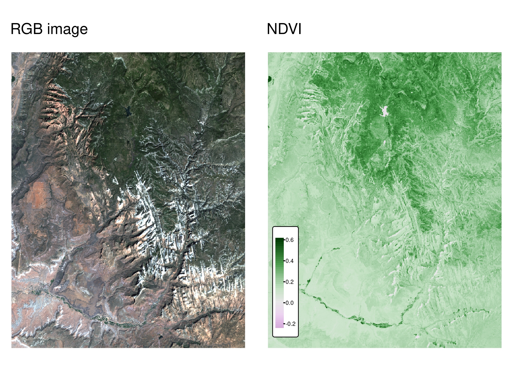

# 空間データ操作  {#spatial-operations}

## 必須パッケージ  {- #prerequisites-04}

- この章では、Chapter \@ref(attr) で使用したものと同じパッケージが必要である。 

```{r 04-spatial-operations-1, message=FALSE, results='hide'}
library(sf)
library(terra)
library(dplyr)
library(spData)
```

- さらに、Section \@ref(spatial-ras) では、以下の二つのデータセットも読み込む必要がある。

```{r 04-spatial-operations-1-1}
elev = rast(system.file("raster/elev.tif", package = "spData"))
grain = rast(system.file("raster/grain.tif", package = "spData"))
```

## イントロダクション  {#introduction-04}

ジオコンピュテーション\index{geocomputation}において、ベクタデータセット間の空間結合やラスタデータセットのローカルおよびフォーカル演算などの空間演算は重要な要素である。
この章では、空間オブジェクトがその位置と形状に基づいて、さまざまな方法で変更できることを紹介する。
空間的な操作の多くは、非空間的（属性的）な操作に相当するため、前の章で示したデータセットの部分集合や結合といった概念がここでも適用できる。
これは特にベクタ操作に当てはまる。ベクタ属性の操作に関する Section \@ref(vector-attribute-manipulation) は、空間的な対応である空間部分集合（Section \@ref(spatial-subsetting) で取り上げている）を理解するための基礎となるものである。
空間結合（Section \@ref(spatial-joining)）と属性集計（Section \@ref(spatial-aggr)）には、前の章で説明した非空間的な対応関係がある。

しかし、空間演算は非空間演算と異なる点がいくつもある。
例えば空間結合は、ターゲットデータセットと交差する、または一定の距離内にあるモノのマッチングなど、結合方法は多数ある。一方、前章の Section \@ref(vector-attribute-joining) で説明した属性結合は、1つの方法でしかできない（ただし [**fuzzyjoin**](https://cran.r-project.org/package=fuzzyjoin) パッケージのドキュメントで説明した、ファジー結合を使う場合は別）。
オブジェクト間の空間的関係のさまざまな<u>タイプ</u>（intersect と disjoint を含む）については、Section \@ref(topological-relations) で説明する。
\index{spatial operations}
空間オブジェクトのもう一つのユニークな側面は距離である。すべての空間オブジェクトは空間を通じて関連しており、距離計算を行うことでこの関係の強さを調べることができる。これは、Section \@ref(distance-relations) のベクタデータで説明する。

ラスタの空間演算には、部分集合（Section \@ref(spatial-raster-subsetting)）、および複数のラスタ「タイル」を単一のオブジェクトに統合する（Section \@ref(merging-rasters)）方法がある。
<u>マップ代数</u>は、ラスタのセルの値を、周囲のセル値を参照して、あるいは参照せずに変更する操作を対象とする。
多くのアプリケーションに不可欠なマップ代数の概念は、Section \@ref(map-algebra) で紹介している。ローカル、フォーカル、ゾーンのマップ代数演算については、それぞれ Section \@ref(local-operations)、Section \@ref(focal-operations)、Section \@ref(zonal-operations) のセクションで解説している。ラスタデータセット全体を表す要約統計量を生成するグローバルマップ代数操作と、ラスタの距離計算については、Section \@ref(global-operations-and-distances) で説明する。
演習の前の最後の章では、2つのラスタデータセットを合成する方法について説明し、再現可能な例を挙げて実演している。

```{block2 04-spatial-operations-2, type='rmdnote'}
2つの空間オブジェクトを使用する空間操作は、両方のオブジェクトが同じ座標参照系を持つことに依存することに留意する。この点については、Section \@ref(crs-intro) で紹介し、Chapter \@ref(reproj-geo-data) でさらに詳しく解説する。
```

## ベクタデータに対する空間演算  {#spatial-vec}

ここでは、**sf** パッケージのシンプルフィーチャとして表現されたベクタ地理データに対する空間演算の概要を説明する。
 Section \@ref(spatial-ras) は、**terra** パッケージのクラスと関数を使用したラスタデータセットの空間演算を紹介する。

### 空間部分集合  {#spatial-subsetting}

空間部分集合とは、空間オブジェクトを取り出し、別のオブジェクトと空間的に<u>関連する</u>フィーチャだけを含む新しいオブジェクトを返す処理である。
<u>属性部分集合</u>（Section \@ref(vector-attribute-subsetting) で説明）と同様に、`sf` データフレームの部分集合は、角括弧を使用して作成できる (`[`) を使い、`x[y, , op = st_intersects]` という文法を使う。ここで `x` は行の部分集合が返される `sf` オブジェクト、`y` は「部分集合・オブジェクト」、`op = st_intersects` は部分集合を行うために使われる位相関係（二項述語 binary predicate としても知られている）を指定するオプションの引数である。
`op` 引数がないときに使用されるデフォルトの位相関係は、`st_intersects()`である。つまり、コマンド `x[y, ] ` は `x[y, , op = st_intersects] ` と同じであり `x[y, , op = st_disjoint]` とは異なる（これらのトポロジカル関係の意味と他のトポロジカル関係は次のセクションで説明する）。
**tidyverse**\index{tidyverse (package)} の `filter()` 関数も使用できるが、この方法は、以下の例で見るように、より冗長である。
\index{vector!subsetting}
\index{spatial!subsetting}

空間部分集合を示すために、**spData** パッケージの `nz` と `nz_height` データセットを使用する。これは、ニュージーランドの 16 の主要地域と 101 の最高地点に関する地理データをそれぞれ含み（Figure \@ref(fig:nz-subset)）、投影座標系で表示されるものである。
次のコードでは、Canterbury を表すオブジェクトを作成し、空間部分集合を使用して、対象地域のすべての High Point を返す。

```{r 04-spatial-operations-3}
canterbury = nz |> filter(Name == "Canterbury")
canterbury_height = nz_height[canterbury, ]
```

```{r nz-subset, echo=FALSE, warning=FALSE, fig.cap="赤い三角形はニュージーランドの 101 の High Point を表し、中央のカンタベリー地域付近に集まっている（左）。カンタベリーのポイントは、`[`部分集合演算子で作成された（グレーでハイライト、右）。", fig.scap="Illustration of spatial subsetting.", message=FALSE}
library(tmap)
p_hpnz1 = tm_shape(nz) + tm_polygons(col = "white") +
  tm_shape(nz_height) + tm_symbols(shape = 2, col = "red", size = 0.25) +
  tm_layout(main.title = "ニュージーランドの High Point", main.title.size = 1,
            bg.color = "lightblue", fontfamily = "HiraginoSans-W3")
p_hpnz2 = tm_shape(nz) + tm_polygons(col = "white") +
  tm_shape(canterbury) + tm_fill(col = "gray") + 
  tm_shape(canterbury_height) + tm_symbols(shape = 2, col = "red", size = 0.25) +
  tm_layout(main.title = "カンタベリーの High Point", main.title.size = 1,
            bg.color = "lightblue", fontfamily = "HiraginoSans-W3")
tmap_arrange(p_hpnz1, p_hpnz2, ncol = 2)
```

属性による部分集合と同様に、コマンド  `x[y, ]` （`nz_height[canterbury, ]` と同等）は、<u>ソース</u> オブジェクトの内容を使用して、<u>ターゲット</u>のフィーチャの部分集合を返す。
しかし、`y` がクラス `logical` または `integer` のベクトルである代わりに、空間部分集合では `x` と `y` の両方が地理オブジェクトでなければならない。
具体的には、この方法で空間部分集合に使用されるオブジェクトは、クラス `sf` または `sfc` を持つ必要がある。`nz` と `nz_height` は共に地理ベクタデータフレームで、クラス `sf` を持つ。操作の結果、ターゲット `nz_height` オブジェクトの中で `canterbury` 地域と交差する（この場合はその中にある点）フィーチャを表す別の `sf` オブジェクトが返される。 

空間部分集合には、ターゲットオブジェクトのフィーチャが選択される部分集合オブジェクトとどのような空間的関係を持たなければならないかを決める、様々な<u>位相関係</u>を用いることができる。
これには、Section \@ref(topological-relations) で見るように、*touches*、*crosses*、*within* が含まれる。 
デフォルトの設定 `st_intersects` は、ソース「部分集合」オブジェクトに *touches*、*crosses*、*within* するターゲット内のフィーチャを返す「全て」トポロジー関係である。
上記のように、`op =` 引数で別の空間演算子を指定することができる。次のコマンドでは、`st_intersects()` の逆で、カンタベリーと交差しない点を返す（ Section \@ref(topological-relations) を参照）。

```{r 04-spatial-operations-4, eval=FALSE}
nz_height[canterbury, , op = st_disjoint]
```

```{block2 04-spatial-operations-5, type='rmdnote'}
空白の引数（`, ,` で示される）は、`[` が、`sf` オブジェクトの3番目の引数である `op` を強調するために含まれていることに注意。
これを使うと、部分集合操作をいろいろな方法で変更することができる。
例えば、`nz_height[canterbury, 2, op = st_disjoint]` は同じ行を返すが、2番目の属性列のみを含む （詳細は `` sf:::`[.sf` `` and the `?sf`）。
```

ベクタデータの空間部分集合についてこれだけ知っておけば多くの応用例を使うことができる。
`st_intersects()` や `st_disjoint()` 以外のトポロジカル・リレーションをすぐに学びたいのであれば、残りを飛ばして次の章（Section \@ref(topological-relations)）に飛んでも構わない。
ここからは、その他の部分集合化の方法などの詳細について説明する。

空間部分集合を行うもう一つの方法は、位相演算子によって返されるオブジェクトを使用することである。
これらのオブジェクトは、それ自体、例えば、連続する領域間の関係のグラフネットワークを探索する際に有用であるが、以下のコードチャンクで示されるように、部分集合にも使用できる。

```{r 04-spatial-operations-6}
sel_sgbp = st_intersects(x = nz_height, y = canterbury)
class(sel_sgbp)
sel_sgbp
sel_logical = lengths(sel_sgbp) > 0
canterbury_height2 = nz_height[sel_logical, ]
```

上記のコードチャンクは、クラス `sgbp` のオブジェクト（疎な幾何学二項述語、空間演算における長さ `x` のリスト）を作成し、それを論理ベクタ `sel_logical` （ `TRUE` と `FALSE` の値のみを含み、**dplyr** のフィルタ関数でも使用できるもの）に変換している。
\index{binary predicate|seealso {topological relations}}
関数 `lengths()` は、`nz_height` のどのフィーチャが `y` の <u>任意の</u>物体と交差しているかを特定する。
この場合、1が最も大きな値であるが、より複雑な操作を行う場合には、例えば、ソースオブジェクトの2つ以上のフィーチャと交差するフィーチャのみを部分集合するような方法を用いることができる。

```{block2 04-spatial-operations-7, type='rmdnote'}
注意: 論理的な出力を返す別の方法として、`st_intersects()` などの演算子で `sparse = FALSE` (「疎行列ではなく密行列を返す」という意味) をセットする方法がある。例えば、`st_intersects(x = nz_height, y = canterbury, sparse = FALSE)[, 1]` というコマンドは、`sel_logical` と同じ出力を返す。
注意: `sgbp` オブジェクトを含むソリューションは、多対多のオペレーションに対応し、より低いメモリ要件で動作するため、より一般的な方法である。
```

`sf` オブジェクトと **dplyr** データ操作コードの互換性を高めるために[作成](https://github.com/r-spatial/sf/issues/1148)された **sf** 関数 `st_filter()` でも同じ結果を得ることができる。

```{r}
canterbury_height3 = nz_height |>
  st_filter(y = canterbury, .predicate = st_intersects)
```

<!--toDo:jn-->
<!-- fix pipes -->

```{r 04-spatial-operations-7b-old, eval=FALSE, echo=FALSE}
# Additional tests of subsetting
canterbury_height4 = nz_height |>
  filter(st_intersects(x = _, y = canterbury, sparse = FALSE))
canterbury_height5 = nz_height |>
  filter(sel_logical)
identical(canterbury_height3, canterbury_height4)
identical(canterbury_height3, canterbury_height5)
identical(canterbury_height2, canterbury_height4)
identical(canterbury_height, canterbury_height4)
waldo::compare(canterbury_height2, canterbury_height4)
```

この時点で、（行名以外は）同じバージョンの `canterbury_height` が3つある。1つは `[` 演算子を用いて作成し、もう1つは中間選択オブジェクトを介して作成し、最後は **sf** の便利な関数 `st_filter()` を用いて作成した。
<!-- RL: commented out for now as old. Todo: if we ever update that vignette uncomment the next line. -->
<!-- To explore spatial subsetting in more detail, see the supplementary vignettes on `subsetting` and [`tidyverse-pitfalls`](https://geocompr.github.io/geocompkg/articles/) on the [geocompkg website](https://geocompr.github.io/geocompkg/articles/). -->
次のセクションでは、二つのフィーチャが空間的に関連しているかどうかを識別するために使用できる、二項述語としても知られている、さまざまなタイプの空間的関係性を探る。

### トポロジー関係  {#topological-relations}

トポロジー関係は、オブジェクト間の空間的な関係を表す。
「二項位相関係」（binary topological relationships）とは、2次元以上の点（一般的には点、線、ポリゴン）の順序集合で定義される2つの物体間の空間関係について論理的に記述したもの（答えは `TRUE` か `FALSE` しかない）である [@egenhofer_mathematical_1990]。
このように言うと、かなり抽象的に聞こえるだろうが、実際、位相関係の定義と分類は、1966年に初めて書籍として出版された数学的基礎に基づいている [@spanier_algebraic_1995]。 代数的位相幾何学の分野は21世紀まで続いている [@dieck_algebraic_2008]。

トポロジー関係は数学的な起源を持つが、一般的な空間的関係をテストするためによく使われる関数を視覚化することで、直感的に理解することが可能である。
Figure \@ref(fig:relations) は、様々なジオメトリペアとその関連性を示している。
Figure \@ref(fig:relations) の3番目と4番目のペア（左から右、そして下）は、ある関係では順序が重要であることを示している。関係 *equals*、*intersects*、*crosses*、*touches*、*overlaps* は対称であり、`function(x, y)` が真なら `function(y, x)` も真となるが、 *contains* と *within* など幾何学の順序が重要である関係は、そうではない。
各ジオメトリペアには、次節で説明する FF2F11212 のような「DE-9IM」文字列があることを確認しておこう。
\index{topological relations}

```{r relations, echo=FALSE, fig.cap="Egenhofer and Herring (1990)の Figure 1 と Figure 2 を参考にした、ベクトル幾何学間のトポロジー関係。関数(x, y)が真となる関係が、各ジオメトリのペアについて印刷されており、xはピンク、yは青で表されている。各ペアの空間的関係の性質は、Dimensionally Extended 9-Intersection Model 文字列で記述されている。", fig.show='hold', message=FALSE, fig.asp=0.66, warning=FALSE}
# source("https://github.com/geocompx/geocompr/raw/c4-v2-updates-rl/code/de_9im.R")
source("code/de_9im.R")
library(sf)
xy2sfc = function(x, y) st_sfc(st_polygon(list(cbind(x, y))))
p1 = xy2sfc(x = c(0, 0, 1, 1,   0), y = c(0, 1, 1, 0.5, 0))
p2 = xy2sfc(x = c(0, 1, 1, 0), y = c(0, 0, 0.5, 0))
p3 = xy2sfc(x = c(0, 1, 1, 0), y = c(0, 0, 0.7, 0))
p4 = xy2sfc(x = c(0.7, 0.7, 0.9, 0.7), y = c(0.8, 0.5, 0.5, 0.8))
p5 = xy2sfc(x = c(0.6, 0.7, 1, 0.6), y = c(0.7, 0.5, 0.5, 0.7))
p6 = xy2sfc(x = c(0.1, 1, 1, 0.1), y = c(0, 0, 0.3, 0))
p7 = xy2sfc(x = c(0.05, 0.05, 0.6, 0.5, 0.05), y = c(0.4, 0.97, 0.97, 0.4, 0.4))

# todo: add 3 more with line/point relations?
tmap::tmap_arrange(de_9im(p1, p2), de_9im(p1, p3), de_9im(p1, p4),
                   de_9im(p7, p1), de_9im(p1, p5), de_9im(p1, p6), nrow = 2)
```

`sf` では、異なる種類の位相関係をテストする関数を「二項述語」と呼ぶ。これは、コマンド [`vignette("sf3")`](https://r-spatial.github.io/sf/articles/sf3.html)（訳注：[日本語版](https://www.uclmail.net/users/babayoshihiko/R/index.html#sf)）、およびヘルプページ [`?geos_binary_pred`](https://r-spatial.github.io/sf/reference/geos_binary_ops.html) で見ることができる。
位相関係が実際にどのように機能するかを見るために、Figure \@ref(fig:relations) で説明した関係を基に、前の章（Section \@ref(geometry)）で学んだベクタギオメトリの表現方法の知識を統合して、簡単な再現性のある例を作ってみよう。
なお、ポリゴンの頂点の座標（x、y）を表す表形式のデータを作成するために、R の基本関数 `cbind()` を使って、座標点を表す行列、`POLYGON`、そして最後に `sfc` オブジェクトを作成する（Chapter \@ref(spatial-class) で説明）。

```{r}
polygon_matrix = cbind(
  x = c(0, 0, 1, 1,   0),
  y = c(0, 1, 1, 0.5, 0)
)
polygon_sfc = st_sfc(st_polygon(list(polygon_matrix)))
```

次のコマンドで、空間的な関係を示す追加の形状を作成する。これらの形状は、上で作成したポリゴンの上にプロットすると、Figure \@ref(fig:relation-objects) に示すように、互いに空間的に関連するようになる。
関数 `st_as_sf()` と引数 `coords` を使って、座標を表す列を含むデータフレームから、点を含む `sf` オブジェクトに効率的に変換していることに注目してみよう。

```{r}
line_sfc = st_sfc(st_linestring(cbind(
  x = c(0.4, 1),
  y = c(0.2, 0.5)
)))
# create points
point_df = data.frame(
  x = c(0.2, 0.7, 0.4),
  y = c(0.1, 0.2, 0.8)
)
point_sf = st_as_sf(point_df, coords = c("x", "y"))
```

```{r relation-objects, echo=FALSE, fig.cap="点、線、ポリゴンのオブジェクトを配置し、トポロジー関係を表現。", fig.asp=1, out.width="50%", fig.scap="Demonstration of topological relations."}
par(pty = "s")
plot(polygon_sfc, border = "red", col = "gray", axes = TRUE)
plot(line_sfc, lwd = 5, add = TRUE)
plot(point_sf, add = TRUE, lab = 1:4, cex = 2)
text(point_df[, 1] + 0.02, point_df[, 2] + 0.04, 1:3, cex = 1.3)
```

簡単なクエリを作ってみよう。`point_sf` の点のうち、ポリゴン `polygon_sfc` と何らかの形で交差しているものはどれか？
この問題は、見れば答えることができる（点1は接していて、点3は中にある）。
この質問には、空間についての関数 `st_intersects()` を用いて、次のように答えることができる。

```{r 04-spatial-operations-9, eval=FALSE}
st_intersects(point_sf, polygon_sfc)
#> Sparse geometry binary predicate... `intersects'
#>  1: 1
#>  2: (empty)
#>  3: 1
```

その結果は、直感と一致するはずである。
1点目と3点目は真の値（`1`）、2点目は偽の値（空のベクタで表される）が返され、ポリゴンの境界の外にある。
予想外のは、その結果がベクタのリストという形になっていることだ。
この<u>疎行列</u> (sparse matrix) 出力は、関係が存在する場合にのみ登録され、複数フィーチャに対する位相幾何学的操作のメモリ要件を軽減する。
前節で見たように、`TRUE` または `FALSE` の値からなる<u>密な行列</u> (dense matrix) が返されるのは、`sparse = FALSE` の時である。

```{r 04-spatial-operations-10}
st_intersects(point_sf, polygon_sfc, sparse = FALSE)
```

上記の出力では、各行がターゲット（引数 `x`）オブジェクトの特徴量、各列が選択オブジェクト（`y`）の特徴量を表している。
この場合、`y` オブジェクト `polygon_sfc` にはフィーチャが1つしかないので、Section \@ref(spatial-subsetting) で見たように部分集合に使える結果は1列だけである。

`st_intersects()` は、フィーチャが接触しているだけの場合でも `TRUE` を返す。*intersects* は、Figure \@ref(fig:relations) に示されているように、多くのタイプの空間的関係を識別する「全て捕まえる」トポロジー操作である。
Figure \@ref(fig:relations) より限定的な質問としては、どの点がポリゴン内にあるか、どのフィーチャが `y` と共有の境界線上にあるか、またはそれを含んでいるか、などがある。
こうした問いには、次のように答えることができる（結果は示していない）。

```{r 04-spatial-operations-9-2, eval=FALSE}
st_within(point_sf, polygon_sfc)
st_touches(point_sf, polygon_sfc)
```

点 1 は境界ポリゴンに接触しているが、境界ポリゴン内にはない。
`st_intersects()` の反対は `st_disjoint()` で、これは選択したオブジェクトと空間的に何ら関係のないオブジェクトだけを返す（注：`[, 1]` は結果をベクトルに変換する）。

```{r 04-spatial-operations-11}
st_disjoint(point_sf, polygon_sfc, sparse = FALSE)[, 1]
```

関数 `st_is_within_distance()` は、選択オブジェクトに<u>ほぼ接触</u>しているフィーチャを検出する。この関数には、さらに `dist` という引数がある。
ターゲットオブジェクトが選択されるまでに必要な距離を設定することができる。
点 2 は `polygon_sfc` の最も近い頂点から 0.2 単位以上離れているが、距離を 0.2 に設定すると、まだ選択されていることに注意されたい。
これは、距離が最も近い辺まで測定されるためで、この場合、Figure \@ref(fig:relation-objects) の点2の真上にあるポリゴンの部分である。
（点 2 とポリゴンの実際の距離が 0.13 であることは、コマンド `st_distance(point_sf, polygon_sfc)` で確認できる。）
'is within distance' という二値空間述語は以下のコードチャンクで示され、その結果、すべての点がポリゴンから 0.2 単位以内にあることが示される。

```{r 04-spatial-operations-14}
st_is_within_distance(point_sf, polygon_sfc, dist = 0.2, sparse = FALSE)[, 1]
```

```{r, eval=FALSE, echo=FALSE}
# verify distances to the polygon with reference to paragraph above:
st_distance(point_sf, polygon_sfc)
#           [,1]
# [1,] 0.0000000
# [2,] 0.1341641
# [3,] 0.0000000
```


```{block2 04-spatial-operations-15, type='rmdnote'}
位相関係を計算する関数では、空間インデックスを用いることで、空間クエリの性能を大幅に向上させることができる。
これは、Sort-Tile-Recursive (STR) アルゴリズムにより実現される。
次のセクションで紹介する `st_join` 関数も、空間インデックスを利用している。
詳しくは、以下のサイトを参照。 https://www.r-spatial.org/r/2017/06/22/spatial-index.html
```

```{r 04-spatial-operations-16, eval=FALSE, echo=FALSE}
# other tests
st_overlaps(point_sf, polygon_sfc, sparse = FALSE)
st_covers(point_sf, polygon_sfc, sparse = FALSE)
st_covered_by(point_sf, polygon_sfc, sparse = FALSE)
```

```{r 04-spatial-operations-17, eval=FALSE, echo=FALSE}
st_contains(a, p[2, ], sparse = TRUE)
```

```{r 04-spatial-operations-18, eval=FALSE, echo=FALSE}
# starting simpler so commented
a1 = st_polygon(list(rbind(c(-1, -1), c(1, -1), c(1, 1), c(-1, -1))))
a2 = st_polygon(list(rbind(c(2, 0), c(2, 2), c(3, 2), c(3, 0), c(2, 0))))
a = st_sfc(a1, a2)

b1 = a1 * 0.5
b2 = a2 * 0.4 + c(1, 0.5)
b = st_sfc(b1, b2)

l1 = st_linestring(x = matrix(c(0, 3, -1, 1), , 2))
l2 = st_linestring(x = matrix(c(-1, -1, -0.5, 1), , 2))
l = st_sfc(l1, l2)

p = st_multipoint(x = matrix(c(0.5, 1, -1, 0, 1, 0.5), , 2))

plot(a, border = "red", axes = TRUE)
plot(b, border = "green", add = TRUE)
plot(l, add = TRUE)
plot(p, add = TRUE)
```

### DE-9IM 文字列  {#de-9im-strings}

前節で示した二項述語の根底には、DE-9IM（Dimensionally Extended 9-Intersection Model）というものがある。
名前からして暗号のようであり、簡単なテーマではない。
しかし、空間的な関係をよりよく理解するために、学習する価値があるだろう。
さらに、DE-9IM の高度な使い方として、カスタム空間述語を作成することも可能である。
このモデルは当初、発明者によって「2つのフィーチャの境界、内部、外部の交点の次元」を意味する「DE + 9IM」と表示されていたが [@clementini_comparison_1995]、現在は「DE-9IM」と表記されている [@shen_classification_2018]。
<!-- The model's workings can be demonstrated with reference to two intersecting polygons, as illustrated in Figure \@ref(fig:de-9im). -->

```{r de-9im, echo=FALSE, eval=FALSE}
# Todo one day: revive this
b = st_sfc(st_point(c(0, 1)), st_point(c(1, 1))) # create 2 points
b = st_buffer(b, dist = 1) # convert points to circles
bsf = sf::st_sf(data.frame(Object = c("a", "b")), geometry = b)
b9 = replicate(bsf, n = 9, simplify = FALSE)
b9sf = do.call(rbind, b9)
domains = c("Interior", "Boundary", "Exterior")
b9sf$domain_a = rep(rep(domains, 3), each = 2)
b9sf$domain_b = rep(rep(domains, each = 3), each = 2)
library(ggplot2)
ggplot(b9sf) +
  geom_sf() +
  facet_grid(domain_a ~ domain_b)

plot(b9sf)
tmap_arrange(
  tm_shape(b) + tm_polygons(alpha = 0.5) + tm_layout(title = "Interior-Interior"),
  tm_shape(b) + tm_polygons(alpha = 0.5) + tm_layout(title = "Interior-Boundary"),
  tm_shape(b) + tm_polygons(alpha = 0.5),
  tm_shape(b) + tm_polygons(alpha = 0.5),
  tm_shape(b) + tm_polygons(alpha = 0.5),
  tm_shape(b) + tm_polygons(alpha = 0.5),
  tm_shape(b) + tm_polygons(alpha = 0.5),
  tm_shape(b) + tm_polygons(alpha = 0.5),
  tm_shape(b) + tm_polygons(alpha = 0.5),
  nrow = 3
)

plot(b)
text(x = c(-0.5, 1.5), y = 1, labels = c("x", "y")) # add text
```

DE-9IM 文字列がどのように機能するかを示すために、Figure \@ref(fig:relations) の最初のジオメトリペアの様々な関連性を見てみよう。
Figure \@ref(fig:de9imgg) は、各オブジェクトの内部、境界、外部のあらゆる組み合わせの交点を示す9交差点モデル（9IM）を示している。最初のオブジェクト `x` の各コンポーネントを列とし、`y` の各コンポーネントを行として配置すると、各要素間の交点が強調されたファセット図形が作成される。

```{r de9imgg, echo=FALSE, warning=FALSE, fig.cap="Dimensionally Extended 9 Intersection Model (DE-9IM) の仕組みを説明する図。凡例にない色は、異なる構成要素間の重なりを表している。太い線は2次元の交わりを強調する。例えば、オブジェクト x の境界とオブジェクト y の内部の交わりは、中央上部のファセットで示されている。", message=FALSE}
p1_2 = st_as_sf(c(p1, p3))
ii = st_as_sf(st_intersection(p1, p3))
ii$Object = "Intersection"
ii$domain_a = "Interior"
ii$domain_b = "Interior"

bi = st_sf(x = st_intersection(
  st_cast(p1, "LINESTRING"),
  st_difference(p3, st_buffer(st_cast(p3, "LINESTRING"), dist = 0.01))
  ))
bi = st_buffer(bi, dist = 0.01)
bi$Object = "Intersection"
bi$domain_a = "Boundary"
bi$domain_b = "Interior"

ei = st_sf(x = st_difference(p3, p1))
ei$Object = "Intersection"
ei$domain_a = "Exterior"
ei$domain_b = "Interior"

ib = st_sf(x = st_intersection(
  st_cast(p3, "LINESTRING"),
  st_difference(p1, st_buffer(st_cast(p1, "LINESTRING"), dist = 0.005))
  ))
ib = st_buffer(ib, dist = 0.01)
ib$Object = "Intersection"
ib$domain_a = "Interior"
ib$domain_b = "Boundary"

bb = st_cast(ii, "POINT")
bb_line = st_sf(x = st_sfc(st_linestring(matrix(c(1, 0.5, 1, 0.7), nrow = 2, byrow = TRUE))))
bb_line_buffer = st_buffer(bb_line, dist = 0.01)
bb_buffer = st_buffer(bb, dist = 0.01)
bb = st_union(bb_buffer, bb_line_buffer)
bb$Object = "Intersection"
bb$domain_a = "Boundary"
bb$domain_b = "Boundary"

eb = st_sf(x = st_difference(
  st_cast(p3, "LINESTRING"),
  p1
  ))
eb = st_buffer(eb, dist = 0.01)
eb$Object = "Intersection"
eb$domain_a = "Exterior"
eb$domain_b = "Boundary"

ie = st_sf(x = st_difference(p1, p3))
ie$Object = "Intersection"
ie$domain_a = "Interior"
ie$domain_b = "Exterior"

be = st_sf(x = st_difference(
  st_cast(p1, "LINESTRING"),
  p3
  ))
be = st_buffer(be, dist = 0.01)
be$Object = "Intersection"
be$domain_a = "Boundary"
be$domain_b = "Exterior"

ee = st_sf(x = st_difference(
  st_buffer(st_union(p1, p3), 0.02),
  st_union(p1, p3)
  ))
ee$Object = "Intersection"
ee$domain_a = "Exterior"
ee$domain_b = "Exterior"

b9 = replicate(p1_2, n = 9, simplify = FALSE)
b9sf = do.call(rbind, b9)
b9sf$Object = rep(c("x", "y"), 9)
domains = c("Interior", "Boundary", "Exterior")
b9sf$domain_a = rep(rep(domains, 3), each = 2)
b9sf$domain_b = rep(rep(domains, each = 3), each = 2)
b9sf = rbind(b9sf, ii, bi, ei, ib, bb, eb, ie, be, ee)
b9sf$domain_a = ordered(b9sf$domain_a, levels = c("Interior", "Boundary", "Exterior"))
b9sf$domain_b = ordered(b9sf$domain_b, levels = c("Interior", "Boundary", "Exterior"))
b9sf = b9sf |> 
  mutate(alpha = case_when(
   Object == "x" ~ 0.1, 
   Object == "y" ~ 0.1, 
   TRUE ~ 0.2 
  ))
library(ggplot2)
ggplot(b9sf) +
  geom_sf(aes(fill = Object, alpha = alpha)) +
  facet_grid(domain_b ~ domain_a) +
  scale_fill_manual(values = c("red", "lightblue", "yellow"), position = "top", name = "") +
  scale_alpha_continuous(range = c(0.3, 0.9)) +
  guides(alpha = "none") +
  theme_void() +
  theme(legend.position = "top")
```

DE-9IM 文字列は、各タイプの関係の次元から導き出される。
この場合、Figure \@ref(fig:de9imgg) の赤い交点は、 Table \@ref(tab:de9emtable) に示すように、0（点）、1（線）、2（ポリゴン）の次元を持つ。

```{r de9emtable, echo=FALSE}
# See https://github.com/geocompx/geocompr/issues/699
pattern = st_relate(p1, p3)
matrix_de_9im = function(pattern) {
    string = unlist(strsplit(pattern , ""))
    matrix_de_9im = matrix(string, nrow = 3, byrow = TRUE)
    colnames(matrix_de_9im) = c("I", "B", "E")
    row.names(matrix_de_9im) = c("I", "B", "E")
    return(matrix_de_9im)
}

m = matrix_de_9im(pattern)
colnames(m) = c("Interior (x)", "Boundary (x)", "Exterior (x)")
rownames(m) = c("Interior (y)", "Boundary (y)", "Exterior (y)")
knitr::kable(m, caption = "ジオメトリ x、y の内部、境界、外部の関係を示す表。")
```

この行列を「行単位」で一列にすると（つまり、1行目、2行目、3行目の順に連結する）、文字列 `212111212` が得られる。
もうひとつの例で、このシステムを紹介する。
Figure \@ref(fig:relations) に示す関係（3列目1行目のポリゴンペア）は、DE-9IM システムでは以下のように定義できる。

- 大きなオブジェクト `x` の<u>内部</u>と `y` の内部、境界、外部との交点は、それぞれ 2、1、2 の寸法を持つ
- 大きなオブジェクト `x` の<u>境界</u>と `y` の内部、境界、外部との交点はそれぞれ F, F, 1 の次元を持ち、ここで 'F' は 'false' を意味し、オブジェクトは不連続である
- `x` の<u>外部</u>と `y` の内部、境界、外部との交点はそれぞれ F、F、2 の寸法を持つ。大きなオブジェクトの外部は `y` の内部や境界に接触しないが、小さなオブジェクトと大きなオブジェクトの外部は同じ面積をカバーする

これら3つの構成要素を連結すると、文字列 `212` , `FF1` , `FF2` が作成される。
これは、関数 `st_relate()` で得られた結果と同じである（ Figure \@ref(fig:relations) の他の形状がどのように作成されたかは、この章のソースコードを参照されたい）。

```{r}
xy2sfc = function(x, y) st_sfc(st_polygon(list(cbind(x, y))))
x = xy2sfc(x = c(0, 0, 1, 1,   0), y = c(0, 1, 1, 0.5, 0))
y = xy2sfc(x = c(0.7, 0.7, 0.9, 0.7), y = c(0.8, 0.5, 0.5, 0.8))
st_relate(x, y)
```

DE-9IM 文字列を理解することで、新しい二値空間述語を開発することができる。
ヘルプページ `?st_relate` では、チェスの駒を利用して、ポリゴンが境界を共有する「クイーン」（queen）と点のみを共有する「ルーク」（rook、将棋でいう飛車と同じ動き）関係に対する関数定義がそれぞれ記載されている。
「クイーン」の関係は、「境界-境界」の関係（Table \@ref(tab:de9emtable) の2列目と2行目のセル、または DE-9IM 文字列の5番目の要素）が空であってはならないという意味で、パターン `F***T****` に対応し、「ルーク」の関係では同じ要素が1でなければならない（線形交点を意味する）ことを意味している。
これらは以下のように実装されている。

```{r}
st_queen = function(x, y) st_relate(x, y, pattern = "F***T****")
st_rook = function(x, y) st_relate(x, y, pattern = "F***1****")
```

先に作成したオブジェクト `x` をベースに、新たに作成した関数を用いて、グリッドの中央のマスに対して、どの要素が「クイーン」「ルーク」であるかを以下のように調べることができる。

```{r queenscode, fig.show='hide'}
grid = st_make_grid(x, n = 3)
grid_sf = st_sf(grid)
grid_sf$queens = lengths(st_queen(grid, grid[5])) > 0
plot(grid, col = grid_sf$queens)
grid_sf$rooks = lengths(st_rook(grid, grid[5])) > 0
plot(grid, col = grid_sf$rooks)
```

```{r queens, fig.cap="9つの形状を持つグリッドの中央の正方形に対する「クイーン」（左）と「ルーク」（右）の関係を見つけるためのカスタムバイナリ空間述語のデモ。", echo=FALSE, warning=FALSE}
tm_shape(grid_sf) +
  tm_fill(col = c("queens", "rooks"), palette = c("white", "black")) +
  tm_shape(grid_sf) +
  tm_borders(col = "grey", lwd = 2) +
  tm_layout(frame = FALSE, legend.show = FALSE,
            panel.labels = c("クィーン (queen)", "ルーク (rook)"), fontfamily = "HiraginoSans-W3")
```


<!-- Another of a custom binary spatial predicate is 'overlapping lines' which detects lines that overlap for some or all of another line's geometry. -->
<!-- This can be implemented as follows, with the pattern signifying that the intersection between the two line interiors must be a line: -->

```{r, echo=FALSE, eval=FALSE}
st_lineoverlap = function(x, y) st_relate(x, y, pattern = "T*1******")
line1 = st_sfc(st_linestring(cbind(
  x = c(0, 0.8),
  y = c(0, 0)
)))
line2 = st_sfc(st_linestring(cbind(
  x = c(0.1, 0.5),
  y = c(0, 0)
)))
line3 = st_sfc(st_linestring(cbind(
  x = c(0, 0.5),
  y = c(0, 0.2)
)))
st_queen(line1, line2)
st_relate(line1, line2)
st_relate(line1, line3)
st_lineoverlap(line1, line2)
st_lineoverlap(line1, line3)
de_9im(line1, line2)
# test the function
rnet = pct::get_pct_rnet(region = "isle-of-wight")
osm_net = osmextract::oe_get_network(place = "isle-of-wight", mode = "driving")
sel = st_relate(rnet, osm_net, pattern = "T*1******")
summary(lengths(sel) > 0)
rnet_joined1 = st_join(rnet, osm_net, join = st_lineoverlap)
rnet_joined2 = st_join(rnet, osm_net, join = st_relate, pattern = "T*1******")
rnet_joined3 = st_join(rnet, osm_net)
summary(is.na(rnet_joined1$osm_id))
summary(is.na(rnet_joined2$osm_id))
summary(is.na(rnet_joined3$osm_id))
sel_relates = st_relate(rnet[1, ], osm_net)
dim(sel_relates)
sel_table = table(sel_relates)
sel_table
dim(sel_table)
sel_restrictive = sel_relates[1, ] == "0F1FF0102"
summary(sel_restrictive)
nrow(osm_net)
mapview::mapview(rnet[1, ]) + mapview::mapview(osm_net[sel_restrictive, ])

rnet_approx = rnet
st_precision(rnet_approx) = 100
head(st_coordinates(rnet_approx))

sel_relates = st_relate(rnet_approx[1, ], osm_net)
dim(sel_relates)
sel_table = table(sel_relates)
sel_table

```

### 空間結合  {#spatial-joining}

2つの非空間データセットを結合するには、Section \@ref(vector-attribute-joining) で説明されているように、共有の「キー」変数に依存する。
空間データ結合は同じ概念を適用するが、その代わりに前節で説明した空間関係に依存する。
属性データの場合と同様に、結合では、ソースオブジェクト( `y` )からターゲットオブジェクト( 結合関数の引数 `x` )に新しい列を追加する。
\index{join!spatial}
\index{spatial!join}

例えば、地球上にランダムに分布する10個の点があり、そのうちの陸地にある点はどの国のものか？
このアイデアを [reproducible example](https://github.com/Robinlovelace/geocompr/blob/main/code/04-spatial-join.R) に実装することで、地理データを扱うスキルが身に付き、空間結合がどのように機能するかを知ることができる。
出発点は、地表にランダムに散らばる点を作ることである。

```{r 04-spatial-operations-19}
set.seed(2018) # 再現できるように seed を設定
(bb = st_bbox(world)) # 世界の境界
random_df = data.frame(
  x = runif(n = 10, min = bb[1], max = bb[3]),
  y = runif(n = 10, min = bb[2], max = bb[4])
)
random_points = random_df |> 
  st_as_sf(coords = c("x", "y")) |> # 座標を設定
  st_set_crs("EPSG:4326") # 地理 CRC を設定
```

Figure \@ref(fig:spatial-join) で示したシナリオでは、`random_points` オブジェクト（左上）には属性データがないのに対し、`world` （右上）には凡例で示した国名のサンプルを含む属性があることがわかる。
空間結合は、以下のコードチャンクに示すように、`st_join()` で実装されている。
出力は、`random_joined` のオブジェクトで、Figure \@ref(fig:spatial-join) （左下）に図示されている。
結合データセットを作成する前に、空間部分集合を用いて、ランダムな点を含む国だけを含む `world_random` を作成し、結合データセットで返される国名の数が4であることを検証している（ Figure \@ref(fig:spatial-join) の右上のパネル参照）。

```{r 04-spatial-operations-20, message=FALSE}
world_random = world[random_points, ]
nrow(world_random)
random_joined = st_join(random_points, world["name_long"])
```

```{r spatial-join, echo=FALSE, fig.cap="空間結合の図解。ソースワールドオブジェクト（右上）からランダムポイント（左上）に新しい属性変数が追加され、最後のパネルで表されるデータになる。", fig.asp=0.5, warning=FALSE, message=FALSE, out.width="100%", fig.scap="Illustration of a spatial join."}
# source("https://github.com/geocompx/geocompr/raw/main/code/04-spatial-join.R")
source("code/04-spatial-join.R")
tmap_arrange(jm1, jm2, jm3, jm4, nrow = 2, ncol = 2)
```

デフォルトでは、`st_join()` は左結合を行う。つまり、結果は `y` にマッチしない行を含む `x` の全ての行を含むオブジェクトとなる（ Section \@ref(vector-attribute-joining) を参照）。Inner Join をする場合には、`left = FALSE` とする。
空間部分集合と同様に、`st_join()` で使用されるデフォルトの位相演算子は `st_intersects()` である。これは `join` 引数を設定することで変更できる（詳細は `?st_join` を参照）。
上の例では、ポリゴンレイヤからポイントレイヤへの列の追加を示しているが、ジオメトリの種類に関係なく同じ方法で行える。
このような場合、例えば `x` にポリゴンが含まれ、それぞれが `y` の複数のオブジェクトと一致する場合、空間結合では `y` の一致するオブジェクトごとに新しい行が作成されるため、重複フィーチャが作られる。

<!-- Idea: demonstrate what happens when there are multiple matches with reprex (low priority, RL: 2021-12) -->

### 非重複結合  {#non-overlapping-joins}

2つの地理データセットが接触していなくても、地理的に強い関係がある場合がある。
すでに **spData** パッケージに含まれているデータセット `cycle_hire` と `cycle_hire_osm` が良い例となる。
これらをプロットすると、Figure \@ref(fig:cycle-hire) に示すように、しばしば密接に関連しているが、接触していないことがわかる。このベースバージョンは、以下のコードで作成される。
\index{join!non-overlapping}

```{r 04-spatial-operations-21, eval=FALSE}
plot(st_geometry(cycle_hire), col = "blue")
plot(st_geometry(cycle_hire_osm), add = TRUE, pch = 3, col = "red")
```

以下のように、同じ `st_intersects()` な点があるかどうかを確認することができる。

```{r 04-spatial-operations-22, message=FALSE}
any(st_touches(cycle_hire, cycle_hire_osm, sparse = FALSE))
```

```{r 04-spatial-operations-23, echo=FALSE, eval=FALSE}
# included to show alternative ways of showing there's no overlap
sum(st_geometry(cycle_hire) %in% st_geometry(cycle_hire_osm))
sum(st_coordinates(cycle_hire)[, 1] %in% st_coordinates(cycle_hire_osm)[, 1])
```

```{r cycle-hire, fig.cap="公式データ（青）とOpenStreetMapのデータ（赤）に基づく、ロンドンにおける自転車レンタルポイントの空間分布。", echo=FALSE, warning=FALSE, fig.scap="The spatial distribution of cycle hire points in London."}
if (knitr::is_latex_output()){
  knitr::include_graphics("figures/cycle-hire-1.png")
} else if (knitr::is_html_output()){
  # library(tmap)
  # osm_tiles = tmaptools::read_osm(tmaptools::bb(cycle_hire, ext = 1.3), type =   "https://korona.geog.uni-heidelberg.de/tiles/roadsg/x={x}&y={y}&z={z}")
  # qtm(osm_tiles) +
    # tm_shape(cycle_hire) +
    # tm_bubbles(col = "blue", alpha = 0.5, size = 0.2) +
    # tm_shape(cycle_hire_osm) +
    # tm_bubbles(col = "red", alpha = 0.5, size = 0.2) +
    # tm_scale_bar()
  library(leaflet)
  leaflet() |>
    # addProviderTiles(providers$OpenStreetMap.BlackAndWhite) |>
    addCircles(data = cycle_hire) |>
    addCircles(data = cycle_hire_osm, col = "red") 
}
```

`cycle_hire_osm` の変数 `capacity` を `cycle_hire` に含まれる公式の「ターゲット」データに結合する必要があるとする。
このとき、オーバーラップしない結合が必要である。
最も簡単な方法は、トポロジカル演算子 `st_is_within_distance()` を使用することで、下記で閾値 20 m で示している。
単位としては、**sff** のデフォルトである S2 を使用していれば、投影していないデータ（例えば、WGS84 などの緯度経度 CRS）でもメートル法で指定することができる（Section \@ref(s2) 参照）。

```{r 04-spatial-operations-24}
sel = st_is_within_distance(cycle_hire, cycle_hire_osm, 
                            dist = units::set_units(20, "m"))
summary(lengths(sel) > 0)
```

```{r 04-spatial-operations-24-without-s2-test, eval=FALSE, echo=FALSE}
sf::sf_use_s2(FALSE)
sel = st_is_within_distance(cycle_hire, cycle_hire_osm, dist = 20)
summary(lengths(sel) > 0)
# still works: must be lwgeom or some other magic!
```


```{r 04-spatial-operations-24-projected, eval=FALSE, echo=FALSE}
# This chunk contains the non-overlapping join on projected data, a step that is no longer needed:
# Note that, before performing the relation, both objects are transformed into a projected CRS.
# These projected objects are created below (note the affix `_P`, short for projected):
cycle_hire_P = st_transform(cycle_hire, 27700)
cycle_hire_osm_P = st_transform(cycle_hire_osm, 27700)
sel = st_is_within_distance(cycle_hire_P, cycle_hire_osm_P, dist = 20)
summary(lengths(sel) > 0)
```

これは、ターゲットオブジェクト `cycle_hire` の中に、閾値距離 `cycle_hire_osm` 内に `r sum(lengths(sel) > 0)` 個の点があることを示している。
それぞれの `cycle_hire_osm` ポイントに関連する<u>値</u>を取得する方法は？
解答は再び `st_join()`だが、引数 `dist` を追加する（20 m 以下に設定）。

```{r 04-spatial-operations-25}
z = st_join(cycle_hire, cycle_hire_osm, st_is_within_distance, 
            dist = units::set_units(20, "m"))
nrow(cycle_hire)
nrow(z)
```

結合結果の行数がターゲットより多いことに注意。
これは、`cycle_hire` の一部のサイクルレンタル・ステーションが、`cycle_hire_osm` で複数のマッチングを行っているためである。
重なった点の値を集約して平均値を返すには、Chapter \@ref(attr) で学習した集約方法を用いると、対象と同じ行数を持つオブジェクトが得られる。

```{r 04-spatial-operations-26}
z = z |> 
  group_by(id) |> 
  summarize(capacity = mean(capacity))
nrow(z) == nrow(cycle_hire)
```

近くのステーションの収容台数は、ソース `cycle_hire_osm` のデータの収容台数のプロットとこの新しいオブジェクトの結果を比較することで検証できる（プロットは表示していない）。

```{r 04-spatial-operations-27, eval=FALSE}
plot(cycle_hire_osm["capacity"])
plot(z["capacity"])
```

この結合の結果、単純なフィーチャの属性データは空間演算で変更されたが、各フィーチャに関連するジオメトリは変更されていない。

### 空間的な集計  {#spatial-aggr}

属性データの集約と同様に、空間データの集約では、集約された出力は集約されていない入力よりも少ない行数で済む。
平均値や合計値などの統計的\index{statistics}な<u>集約関数</u>は、変数の複数の値を要約し、<u>グループ化変数</u>ごとに単一の値を返す。
Section \@ref(vector-attribute-aggregation) は、`aggregate()` と `group_by() |> summarize()` が属性変数に基づいてデータを集約する方法を示したが、このセクションでは、同じ関数が空間オブジェクトでどのように機能するかを示す。
`aggregate()` `group_by() |> summarize()` \index{aggregation!spatial}

ニュージーランドの例に戻って、各地域の高所の平均的な高さを求めるとする。ターゲットオブジェクト（`x` または `nz_height`）の値がどのようにグループ化されるかを定義するのは、ソース（この場合は `y` または `nz`）のジオメトリである。
これは、base R の `aggregate()` メソッドを使えば、1行のコードで可能である。

```{r 04-spatial-operations-28}
nz_agg = aggregate(x = nz_height, by = nz, FUN = mean)
```

前のコマンドの結果は、（空間）集約オブジェクト（`nz`）と同じジオメトリを持つ `sf` オブジェクトである。これは、コマンド `identical(st_geometry(nz), st_geometry(nz_agg))` で確認することができる。
先の操作の結果を Figure \@ref(fig:spatial-aggregation) に示す。これは、ニュージーランドの16の地域それぞれにおける `nz_height` のフィーチャの平均値を示している。
また、次のように `st_join()` の出力を「tidy」関数 `group_by()` と `summarize()` にパイプすることでも、同じ結果を生成することができる。

```{r spatial-aggregation, echo=FALSE, fig.cap="ニュージーランドの各地域の上位101の高さの平均値。", fig.asp=1, message=FALSE, out.width="50%"}
library(tmap)
tm_shape(nz_agg) +
  tm_fill("elevation", breaks = seq(27, 30, by = 0.5) * 1e2) +
  tm_borders()
```

```{r 04-spatial-operations-29}
nz_agg2 = st_join(x = nz, y = nz_height) |>
  group_by(Name) |>
  summarize(elevation = mean(elevation, na.rm = TRUE))
```

```{r test-tidy-spatial-join, eval=FALSE, echo=FALSE}
plot(nz_agg)
plot(nz_agg2)
# aggregate looses the name of aggregating objects
```

出来上がった `nz_agg` オブジェクトは、集計オブジェクト `nz` と同じジオメトリを持つが、関数 `mean()` を用いて、各地域の `x` の値をまとめた列が新たに追加されている。
ここでは、`mean()` の代わりに、`median()`、`sd()` など、グループごとに単一の値を返す他の関数を使用することも可能である。
注: `aggregate()` と `group_by() |> summarize()` のアプローチの違いの一つは、前者は一致しない地域名に対して `NA` の値を返すのに対し、後者は地域名を保持することである。
したがって、「tidy」アプローチは、集計関数や結果の列名の点でより柔軟である。
新しいジオメトリも作成する集計操作については、Section \@ref(geometry-unions) で説明している。


### 不一致レイヤを結合  {#incongruent}

空間一致 (Spatial congruence\index{spatial congruence}) は、 空間的集計に関連する重要な概念である。
<u>集合体</u>（ここでは `y` と呼ぶ）は、2つのオブジェクトが境界を共有している場合、ターゲットオブジェクト（`x`）と<u>一致</u>している。
行政区域のデータでは、大きな単位、例えばイギリスのMiddle Layer Super Output Area（[MSOAs](https://www.ons.gov.uk/methodology/geography/ukgeographies/censusgeography)）や他の多くのヨーロッパ諸国の地区が、多くの小さな単位で構成されていることがよくあることである。

対照的に、<u>不一致</u> (incongruent) 集約オブジェクトは、ターゲットと共通の境界を共有しない [@qiu_development_2012]。
これは、Figure \@ref(fig:areal-example) で説明されている空間集約（およびその他の空間操作）において問題となる。各サブゾーンの重心を集約すると、正確な結果を得ることができない。
面積補間は、単純な面積加重法や「ピクノフィラティック」 (pycnophylactic) 法などのより洗練されたアプローチを含む様々なアルゴリズムを使用して、1セットの面積単位から別の単位に値を転送することによってこの問題を克服している [@tobler_smooth_1979]。

```{r areal-example, echo=FALSE, fig.cap="大きな凝集帯（半透明の青い枠）に対して、一致する面単位（左）と不一致する面単位（右）を示した図。", fig.asp=0.2, fig.scap="Illustration of congruent and incongruent areal units."}
source("https://github.com/geocompx/geocompr/raw/main/code/04-areal-example.R", print.eval = TRUE)
```

**spData** パッケージには、`incongruent` ( Figure \@ref(fig:areal-example) の右側のパネルにある黒い縁取りのある色のついたポリゴン) と `aggregating_zones` ( Figure \@ref(fig:areal-example) の右側のパネルにある半透明の青い縁取りのある二つのポリゴン) という名前のデータセットが含まれている。
ここで、`incongruent` の `value` 列が、百万ユーロ単位の地域総所得を指すと仮定しよう。
基礎となる9つの空間ポリゴンの値を、`aggregating_zones` の2つのポリゴンにどのように移せばいいのだろうか？

このための最も簡単で有用な方法は、<u>面積加重</u>空間補間で、`incongruent` オブジェクトから `aggregating_zones` の新しい列に、重なり合う面積に比例して値を転送する。入力と出力のフィーチャの空間交差が大きければ大きいほど、対応する値も大きくなる。
これは、以下のコードチャンクに示すように、`st_interpolate_aw()` で実装されている。

```{r 04-spatial-operations-30}
iv = incongruent["value"] # 転送する値だけを残す
agg_aw = st_interpolate_aw(iv, aggregating_zones, extensive = TRUE)
agg_aw$value
```

この場合、所得が小さなゾーンに均等に分布していると仮定すると、総所得はいわゆる空間的に広範な変数（面積とともに増加する）なので、集計ゾーンに入る交差点の値を合計することは意味がある（したがって、上記の警告メッセージが表示されるの）。
これは、<u>平均</u>所得やパーセンテージのような空間的に[集中しがちな](https://geodacenter.github.io/workbook/3b_rates/lab3b.html#spatially-extensive-and-spatially-intensive-variables)変数では異なるだろうが、面積が大きくなればなるほど増加するわけではない。
`st_interpolate_aw()` は、空間的に集約された変数でも同様に動作する。`extensive` パラメータを `FALSE` に設定すると、集約の際に合計関数ではなく平均を使用する。

### 距離の関係  {#distance-relations}

位相関係が二値（あるフィーチャが別のフィーチャと交差するかしないか）であるのに対して、距離関係は連続的である。
2つのオブジェクト間の距離は、`st_distance()` 関数で計算される。
これは、ニュージーランドの最高地点と、Section \@ref(spatial-subsetting) で作成したカンタベリー地域の地理的重心との間の距離を求めるコードである。
\index{sf!distance relations}

```{r 04-spatial-operations-31, warning=FALSE}
nz_highest = nz_height |> slice_max(n = 1, order_by = elevation)
canterbury_centroid = st_centroid(canterbury)
st_distance(nz_highest, canterbury_centroid)
```

この結果には、2つの驚くべきことがある。

- `units`、距離は10万インチではなく、10万メートルであることを教えてくれる。
- 結果には1つの値しか含まれないが、行列として返される

この2番目の特徴は、`st_distance()` のもう一つの便利な特徴である、オブジェクト `x` と `y` の特徴のすべての組み合わせの間の<u>距離行列</u>を返す機能を示唆するものである。
このコマンドは、`nz_height` の最初の 3 つのフィーチャと、オブジェクト `co` で表されるニュージーランドのオタゴおよびカンタベリー地域との間の距離を求めるものである。

```{r 04-spatial-operations-32}
co = filter(nz, grepl("Canter|Otag", Name))
st_distance(nz_height[1:3, ], co)
```

なお、`nz_height` の2番目と3番目のフィーチャと、`co` の2番目のフィーチャの距離は0である。
これは、点とポリゴンの間の距離は、<u>ポリゴンの任意の部分</u>への距離を指すという事実を示している。
`nz_height` の2番目と3番目の点は、オタゴ<u>内に</u>ある。これは、プロットすることで確認できる（結果は示していない）。

```{r 04-spatial-operations-33, eval=FALSE}
plot(st_geometry(co)[2])
plot(st_geometry(nz_height)[2:3], add = TRUE)
```

## ラスタデータに対する空間演算  {#spatial-ras}

このセクションでは、ラスタデータセットを操作するためのさまざまな基本メソッドを紹介した Section \@ref(manipulating-raster-objects) をベースに、より高度で明示的な空間ラスタ操作を実演する。また、Section \@ref(manipulating-raster-objects) で手動で作成したオブジェクト `elev` と `grain` を使用する。
これらのデータセットは、読者の便宜を図るため **spData** パッケージにも含まれている。

### 空間部分集合  {#spatial-raster-subsetting}

前の章（Section \@ref(manipulating-raster-objects)）では、特定のセル ID や行と列の組み合わせに関連する値を取得する方法を紹介した。
ラスタオブジェクトは、位置（座標）などの空間オブジェクトを抽出することも可能である。
部分集合に座標を使用するには、**terra** の関数 `cellFromXY()` で座標をセル ID に「変換」することができる。
別の方法として、`terra::extract()`（注意： **tidyverse**\index{tidyverse (package)} の中にも `extract()` という関数がある）を使って値を抽出することができる。
以下に、座標 0.1, 0.1 に位置する点を覆うセルの値を求める方法を示す。
\index{raster!subsetting}
\index{spatial!subsetting}

```{r 04-spatial-operations-34, eval = FALSE}
id = cellFromXY(elev, xy = matrix(c(0.1, 0.1), ncol = 2))
elev[id]
# the same as
terra::extract(elev, matrix(c(0.1, 0.1), ncol = 2))
```

<!--jn:toDo-->
<!-- to update? -->
<!-- It is convenient that both functions also accept objects of class `Spatial* Objects`. -->
ラスタオブジェクトは、以下のコードのように、別のラスタオブジェクトの内部に部分集合することもできる。

```{r 04-spatial-operations-35, eval=FALSE}
clip = rast(xmin = 0.9, xmax = 1.8, ymin = -0.45, ymax = 0.45,
            resolution = 0.3, vals = rep(1, 9))
elev[clip]
# we can also use extract
# terra::extract(elev, ext(clip))
```

これは、Figure \@ref(fig:raster-subset) に示すように、2 番目のラスタ（ここでは `clip`）の範囲内にある最初のラスタオブジェクト（この場合は `elev`）の値を取得することになる。

```{r raster-subset, echo = FALSE, fig.cap = "元のラスタ（左）。ラスタマスク（中）。ラスタをマスクした出力（右）。", fig.scap="Subsetting raster values."}
knitr::include_graphics("figures/04_raster_subset.png")
```

上記の例では、特定のセルの値を返したが、多くの場合、ラスタデータセットの部分集合操作による空間出力が必要である。
これは、`[` 演算子で、`drop` を `FALSE` に設定して行うことができる。
以下のコードは、`elev` の先頭行の2つのセル、つまり最初の２行をラスタオブジェクトとして返す（出力の最初の2行のみ表示）。

```{r 04-spatial-operations-36, eval=FALSE}
elev[1:2, drop = FALSE]    # spatial subsetting with cell IDs
#> class       : SpatRaster 
#> dimensions  : 1, 2, 1  (nrow, ncol, nlyr)
#> ...
```

```{r 04-spatial-operations-37, echo=FALSE, eval=FALSE}
# aim: illustrate the result of previous spatial subsetting example
x = elev[1, 1:2, drop = FALSE]
plot(x)
```

空間部分集合のもう一つの一般的な使用例は、`logical`（または `NA`）値のラスタを使用して、同じ範囲と解像度の別のラスタをマスクする場合である（Figure \@ref(fig:raster-subset) に図示）。
この場合、`[`、`mask()` 関数を使用することができる（結果は示していない）。

```{r 04-spatial-operations-38, eval=FALSE}
# ラスタのマスクを作成
rmask = elev
values(rmask) = sample(c(NA, TRUE), 36, replace = TRUE)
```

上記のコードでは、`rmask` というマスクオブジェクトを作成し、`NA` と `TRUE` にランダムな値を割り当てている。
次に、`elev` のうち、`TRUE` となる値を `rmask` に保持したい。
つまり、`elev` を `rmask` でマスクしたい。

```{r 04-spatial-operations-38b, eval=FALSE}
# 空間的に部分集合を作成
elev[rmask, drop = FALSE]     # [ operator を使用
mask(elev, rmask)             # mask() を使用
```

上記の方法は、一部の値（例えば、間違っていると予想される値）を NA に置き換えるために使用することも可能である。 

```{r 04-spatial-operations-38c, eval=FALSE}
elev[elev < 20] = NA
```

これらの操作は、実際のところ、2つのラスタをセル単位で比較するローカルの論理操作である。
次のサブセクションでは、これらの操作と関連する操作についてより詳しく説明する。

### マップ代数  {#map-algebra}

\index{map algebra}
「マップ代数」(Map algebra) という用語は、1970年代後半に、地理的なラスタデータ<u>および</u>（あまり目立たないが）ベクタデータを分析するための「規則、機能、および技術のセット」を表すために作られたものである [@tomlin_map_1994]。
<!-- Although the concept never became widely adopted, the term usefully encapsulates and helps classify the range operations that can be undertaken on raster datasets. -->
ここでは、マップ代数をより狭く定義し、周囲のセル、ゾーン、またはすべてのセルに適用される統計関数を参照して、ラスタセル値を修正または要約する操作としている。

ラスタデータセットは暗黙的に座標を保存しているだけなので、マップ代数演算は高速になる傾向があり、そのため[古いことわざ](https://geozoneblog.wordpress.com/2013/04/19/raster-vs-vector/)では「ラスタは高速だがベクタは補正が効く」とされている。
ラスタデータセットのセルの位置は、その行列の位置と、データセットの解像度および原点（ヘッダに格納）を使用して計算することができる。
しかし、処理にあたっては、処理後のセル位置が変わらないことを確認すれば、セルの地理的な位置はほとんど関係ない。
さらに、2つ以上のラスタデータセットが同じ範囲、投影、解像度を共有している場合、それらを行列として処理することができる。

これは、マップ代数が **terra** パッケージで動作する方法である。
まず、ラスタデータセットのヘッダを照会し、（マップ代数演算が複数のデータセットに対して行われる場合）データセットの互換性を確認する。
第二に、マップ代数はいわゆる一対一の位置対応を保持しており、セルは移動できないことを意味している。
これは、行列の掛け算や割り算などで値の位置が変わる行列代数とは異なる。

マップ代数（またはラスタデータによる地図作成）では、ラスタ操作を4つのサブクラスに分け [@tomlin_geographic_1990]、それぞれが1つまたは複数のグリッドを同時に処理するようにしている。

1. <u>ローカル</u> (Local)、つまりセル単位の操作
2. <u>フォーカル</u> (Focal)、つまり近傍（Nighborhood）オペレーション。
多くの場合、出力セルの値は、3×3の入力セルブロックの結果
3. <u>ゾーン</u> (Zonal) 演算は、フォーカル演算と似ているが、新しい値を計算する周囲の画素グリッドは不規則なサイズと形状を持つことができる。
4. <u>グローバル</u> (Global) またはラスタ単位の操作。
つまり、出力セルは1つまたは複数のラスタ全体から潜在的にその値を引き出す。

このトポロジーは、マップ代数演算を、各ピクセル処理ステップに使用するセル数と出力の種類によって分類したものである。
なお、ラスタ演算は、地形、水文解析、画像分類などの分野ごとの分類方法もある。
以下では、各タイプのマップ代数演算の使用方法について、動作例を参照しながら説明する。

### ローカルオペレーション  {#local-operations}

\index{map algebra!local operations}
**ローカル**操作は、1つまたは複数のレイヤにおけるすべてのセル単位の操作で構成されている。
ラスタ代数とは、ローカル操作の典型的な使用例で、ラスタからの値の加算や減算、ラスタの二乗や乗算が含まれる。
ラスタ代数では、特定の値（下の例では5）より大きいラスタセルをすべて見つけるなどの論理演算も可能である。
**terra** パッケージは、以下のように、これらすべての操作に対応している( Figure \@ref(fig:04-local-operations) )。

```{r 04-spatial-operations-41, eval = FALSE}
elev + elev
elev^2
log(elev)
elev > 5
```

```{r 04-local-operations, echo=FALSE, fig.cap="elev ラスタオブジェクトのさまざまなローカル操作の例：2つのラスタの加算、二乗、対数変換の適用、論理演算の実行。"}
knitr::include_graphics("figures/04-local-operations.png")
```

ローカル演算のもう一つの良い例は、デジタル標高モデルを低標高（クラス1）、中標高（クラス2）、高標高（クラス3）にグループ化するように、数値の間隔をグループに分類することである。
`classify()` コマンドを使って、まず再分類行列を作る必要がある。ここで、最初の列はクラスの下限、2番目の列は上限に対応する。
3列目は、1列目と2列目で指定した範囲の新しい値を表している。

```{r 04-spatial-operations-40}
rcl = matrix(c(0, 12, 1, 12, 24, 2, 24, 36, 3), ncol = 3, byrow = TRUE)
rcl
```

ここでは、0～12、12～24、24～36の範囲のラスタ値をそれぞれ1、2、3に<u>再分類</u>している。

```{r 04-spatial-operations-40b, eval = FALSE}
recl = classify(elev, rcl = rcl)
```

`classify()` 関数は、カテゴリー別ラスタのクラス数を減らしたい場合にも使用できる。
Chapter \@ref(location) では、いくつかの追加的な再分類を実施する予定である。

算術演算子とは別に、`app()`、`tapp()`、`lapp()` 関数も使用することができる。
より効率的であるため、大規模なラスタデータが存在する場合に適している。 
さらに、出力ファイルを直接保存することも可能である。
関数 `app()` は、ラスタの各セルに関数を適用し、複数のレイヤの値を1つのレイヤにまとめる（合計を計算するなど）ために使用される。
`tapp()` は、`app()` の拡張で、ある操作を行いたいレイヤの部分集合（`index` の引数を参照）を選択することができるようになっている。
最後に、関数 `lapp()` は、レイヤを引数として各セルに関数を適用することができる。`lapp()` のアプリケーションを以下に示す。

正規化差分植生指数（normalized difference vegetation index, NDVI）の算出は、よく知られたローカル（ピクセル単位）のラスタ処理である。
正の値は生きた植物が存在することを示す(ほとんどが0.2以上)。
NDVI は、Landsat や Sentinel などの衛星システムから得られるリモートセンシング画像の赤色および近赤外（near-infrared、NIR）バンドから算出されるものである。
植物は可視光線、特に赤色光を強く吸収し、近赤外光を反射するため、NVDI の計算式が成り立っている。

$$
\begin{split}
NDVI&= \frac{\text{NIR} - \text{Red}}{\text{NIR} + \text{Red}}\\
\end{split}
$$

ザイオン国立公園のマルチスペクトル衛星ファイルについて、NDVI を計算してみよう。

```{r}
multi_raster_file = system.file("raster/landsat.tif", package = "spDataLarge")
multi_rast = rast(multi_raster_file)
```

ラスタオブジェクトは、青、緑、赤、近赤外（NIR）の4つの衛星バンドを持っている。
次のステップは、NDVI の計算式を R の関数に実装することである。

```{r}
ndvi_fun = function(nir, red){
  (nir - red) / (nir + red)
}
```

この関数は、2つの数値引数（`nir` と `red`）を受け取り、NDVI 値を含む数値ベクタを返す。
`lapp()` の `fun` 引数として使用することができる。
この関数が必要とするのは2つのバンド（元のラスタの4つではない）であり、それらはNIR、赤の順である必要があることを覚えておく必要がある。
そのため、入力ラスタを部分集合し、計算を行う前に  `multi_rast [[c(4, 3)] ]` で部分集合してから計算を行う。

```{r}
ndvi_rast = lapp(multi_rast[[c(4, 3)]], fun = ndvi_fun)
```

その結果を右図（ Figure \@ref(fig:04-ndvi) ）に示すように、同じ領域のRGB画像（同図の左図）と比較することができる。
これにより、NDVI値が最も大きいのは北部の密林地帯、最も低いのは北部の湖と雪山の尾根に関連していることがわかる。

```{r 04-ndvi, echo=FALSE, fig.cap="ザイオン国立公園の衛星ファイルの例で計算されたRGB画像（左）とNDVI値（右）"}

```

予測マッピングも、ローカルラスタ操作の興味深い応用例である。
応答変数は、例えば、種の豊富さ、地滑りの存在、木の病気、作物の収穫量など、空間における測定または観測された点に対応する。
その結果、様々なラスタ（標高、pH、降水量、気温、土地被覆、土壌等級など）から、宇宙や空中の予測変数を簡単に取得することができるようになる。
その後、`lm()`、`glm()`、`gam()` または機械学習技術を使用して、予測因子の関数として応答をモデル化する。 
したがって、ラスタオブジェクトの空間予測は、予測ラスタ値に推定係数を適用し、出力ラスタ値を合計することで行うことができる（Chapter \@ref(eco) を参照）。

### フォーカルオペレーション  {#focal-operations}

\index{map algebra!focal operations}
ローカルな機能とは、1つのセル（複数の層からなる可能性もある）を対象とするものであるのに対し、**フォーカル**な機能とは、中心（焦点）のセルとその近隣のセルを考慮したものである。
近傍領域（カーネル、フィルタ、移動窓とも呼ばれる）は、通常、3×3セル（つまり、中心セルとその周囲8個の近傍セル）のサイズであるが、ユーザーが定義する他の形状（必ずしも長方形ではない）をとることができる。
フォーカル操作は、指定された近傍領域内のすべてのセルに集約関数を適用し、対応する出力を中心セルの新しい値として使用し、次の中心セル（Figure \@ref(fig:focal-example)）へと進む。
この操作は、空間フィルタリング (spatial filtering) やコンボリューション (convolution) などと呼ばれることもある [@burrough_principles_2015]。

R では、`focal()` 関数で空間フィルタリングを行うことができる。 
移動窓の形状を `matrix` で定義する。その値は重みに対応する（以下のコードチャンクの `w` パラメータを参照）。
次に、`fun` パラメータで、この近傍領域に適用したい関数を指定することができる。
ここでは、最小値を選んでいるが、`sum()`、`mean()`、`var()` など、他の要約関数も使用可能である。

```{r 04-spatial-operations-42, eval = FALSE}
r_focal = focal(elev, w = matrix(1, nrow = 3, ncol = 3), fun = min)
```

この関数は、例えば、プロセス中の NA を削除すべきか（`na.rm = TRUE`）、しないか（`na.rm = FALSE`）などの追加引数も受け付ける。

```{r focal-example, echo = FALSE, fig.cap = "焦点演算による入力ラスタ（左）と出力ラスタ（右）-3×3の移動窓で最小値を求める。", fig.scap="Illustration of a focal operation."}
knitr::include_graphics("figures/04_focal_example.png")
```

期待通りの出力が得られるかどうか、すぐに確認することができる。
この例では、最小値は常に移動ウィンドウの左上隅でなければならない（入力ラスタは、左上隅から始まるセルの値を行単位で1つずつ増加させることによって作成したことを思い出してほしい）。
この例では、重み付け行列は1だけで構成されており、各セルの出力に対する重みが同じであることを意味しているが、これは変更可能である。

画像処理では、焦点関数やフィルターが重要な役割を担っている。
ローパスフィルタやスムージングフィルタは、平均関数を用いて極端な部分を除去する。
カテゴリーデータの場合、平均値を最頻値に置き換えることができる。
それに対して、ハイパスフィルターはフィーチャを強調する。
ここでは、ライン検出のラプラスフィルターやソーベルフィルターがその例として挙げられるだろう。
R での使い方は、`focal()` のヘルプページで確認してみよう（この章の最後の演習でも使用する）。

傾斜、アスペクト、流れ方向などの地形特性を計算する地形処理では、焦点関数に依存している。
`terrain()` は、これらの指標の計算に使用することができる。ただし、勾配を計算する Zevenbergen and Thorne 法を含むいくつかの地形アルゴリズムは、この **terra** 関数には実装されていない。
その他、曲率、寄与率、湿潤指数など多くのアルゴリズムが、オープンソースのデスクトップ型地理情報システム（GIS）ソフトウェアに実装されている。
Chapter \@ref(gis) は、このような GIS 機能を R 内からアクセスする方法を示している。

### ゾーンオペレーション  {#zonal-operations}

\index{map algebra!zonal operations}
ゾーン演算は、フォーカル演算と同様に、複数のラスタセルに集計関数を適用する。
しかし、前節で紹介したフォーカル操作の場合の事前定義された近傍ウィンドウとは対照的に、ゾーン操作の場合は、通常カテゴリー値で構成される第二ラスタが<u>ゾーンフィルター</u>（または「ゾーン」）を定義する。
そのため、ゾーンフィルタを定義するラスタセルは、必ずしも隣接している必要はない。
粒径ラスタはその良い例で、Figure \@ref(fig:cont-raster) の右側のパネルに示されているように、異なる粒径がラスタ全体に不規則に広がっていることがわかる。
最後に、ゾーン操作の結果は、ゾーンごとにグループ化された要約表となる。このため、この操作は、GIS\index{GIS} の世界では<u>ゾーン統計</u>とも呼ばれる。 
これは、ラスタオブジェクトを返すフォーカルオペレーションとは対照的である。

次のコードチャンクは、`zonal()` 関数を使用して、例えば、各粒度クラスに関連する平均標高を計算する。

```{r 04-spatial-operations-43}
z = zonal(elev, grain, fun = "mean")
z
```

これは、各カテゴリーの統計値 \index{statistics}、ここでは各粒度クラスの平均高度を返す。
注： `as.raster` 引数を `TRUE` に設定することで、各ゾーンの統計情報を計算したラスタを取得することも可能である。

### グローバルな操作と距離  {#global-operations-and-distances}

<u>グローバル</u>操作は、ラスタデータセット全体が1つのゾーンに相当するゾーン操作の特殊なケースである。
最も一般的なグローバル操作は、最小値や最大値など、ラスタデータセット全体の記述統計\index{statistics}である。これらの操作については、Section \@ref(summarizing-raster-objects) ですでに説明した。

それ以外にも、距離や重みのラスタの計算にもグローバル操作は有効である。
最初のケースでは、各セルから特定のターゲットセルまでの距離を計算することができる。
例えば、最も近い海岸までの距離を計算したい場合がある（`terra::distance()` も参照）。
また、地形も考慮したい。つまり、純粋な距離だけでなく、海岸に行くときに山脈を越えないようにしたいのである。
そのためには、標高が1メートル増えるごとにユークリッド距離が「伸びる」ように、標高で距離に重みをつければいいのだ。
Visibility と viewshed の計算もグローバル操作に属する ( Chapter \@ref(gis) の演習では、viewshed ラスタを計算する)。

### ベクタ処理における写像代数の対応  {#map-algebra-counterparts-in-vector-processing}

多くのマップ代数演算はベクタ処理に対応するものである [@liu_essential_2009]。
最大距離のみを考慮した距離ラスタの計算（グローバル演算）は、ベクタバッファ演算（Section \@ref(clipping)）と同等である。
ラスタデータの再分類（入力に応じてローカルまたはゾーン関数）は、ベクタデータの溶解（Section \@ref(spatial-joining)）と同等である。 
2つのラスタを重ね合わせ（ローカル操作）、一方がマスクを表す `NULL` または `NA` の値を含む場合、ベクタクリッピング（Section \@ref(clipping)）に類似している。
空間クリッピングとよく似たものに、2つのレイヤを交差させるものがある( Section \@ref(spatial-subsetting) )。 
違いは、これら2つのレイヤ（ベクタまたはラスタ）は、単に重複する領域を共有することである（例として Figure \@ref(fig:venn-clip) を参照）。
ただし、表現には注意が必要である。
ラスタデータモデルとベクタデータモデルでは、同じ言葉でも微妙に意味が異なることがある。
集計 (aggregate) とは、ベクタデータの場合はポリゴンを融合 (dissolve) することであるが、ラスタデータの場合はセルを大きくして解像度を下げることである。
ゾーン演算は、あるラスタのセルを、別のラスタのゾーン（カテゴリ）に合わせて、集約 (aggregate) 関数を使って融合 (dissolve) することができる。

### ラスタのマージ  {#merging-rasters}

\index{raster!merge}
NDVI を計算し（Section \@ref(local-operations) 参照）、さらに、調査地域内の観測の標高データから地形属性を計算したいとする。
このような計算には、リモートセンシングの情報が必要である。 
リモートセンシング画像は、特定の空間範囲をカバーするシーンに分割されることが多く、1つの調査エリアが複数のシーンにまたがっていることがよくある。
そして、調査対象シーンをマージする必要がある。 
一番簡単なのは、これらのシーンをマージする、つまり並べることである。
これは例えば、デジタル標高データ（SRTM、ASTER）で可能である。
以下のコードでは、まずオーストリアとスイスの SRTM 標高データをダウンロードする（国番号については、**geodata** 関数 `country_codes()` を参照）。
第二段階では、2つのラスタを1つに統合する。

```{r 04-spatial-operations-44, eval = FALSE}
aut = geodata::elevation_30s(country = "AUT", path = tempdir())
ch = geodata::elevation_30s(country = "CHE", path = tempdir())
aut_ch = merge(aut, ch)
```

**terra** の `merge()` コマンドは、2つの画像を合成し、重なった場合は、最初のラスタの値を使用する。
<!--jn:toDo-->
<!-- gdalUtils is slower (for this files): -->
<!-- two_rast = c(terra::sources(aut)$source, terra::sources(ch)$source) -->
<!-- tf = tempfile(fileext = ".tif") -->
<!-- bench::mark({gdalUtils::mosaic_rasters(two_rast, tf)}) -->
<!-- You can do exactly the same with `gdalUtils::mosaic_rasters()` which is faster, and therefore recommended if you have to merge a multitude of large rasters stored on disk. -->

重複する値が互いに対応しない場合、マージアプローチはほとんど意味がない。
このようなケースは、撮影日が異なるシーンの分光画像を合成する場合によくある。
`merge()` コマンドはそのまま使え、出来上がった画像にはっきりとした枠が表示される。
一方、`mosaic()` コマンドでは、オーバーラップする領域に対して関数を定義することができる。 
例えば、平均値を計算することもできる。この場合、マージされた結果における明確な境界線は滑らかになるだろうが、ほとんどの場合、それを消すことはできない。
<!-- The following sentences have been commented out and can be removed because the packages, and info, is now out of date -->
<!-- See https://github.com/geocompx/geocompr/pull/424 for discussion -->
<!-- To do so, we need a more advanced approach.  -->
<!-- Remote sensing scientists frequently apply histogram matching or use regression techniques to align the values of the first image with those of the second image. -->
<!-- The packages **landsat** (`histmatch()`, `relnorm()`, `PIF()`), **satellite** (`calcHistMatch()`) and **RStoolbox** (`histMatch()`, `pifMatch()`) provide the corresponding functions for the **raster**'s package objects. -->
R によるリモートセンシングの詳しい紹介は、@wegmann_remote_2016 を参照。
<!--jn:toDo-->
<!--update the above reference to the 2nd edition-->

## 演習


```{r, echo=FALSE, results='asis'}
res = knitr::knit_child('_04-ex.Rmd', quiet = TRUE, options = list(include = FALSE, eval = FALSE))
cat(res, sep = '\n')
```
