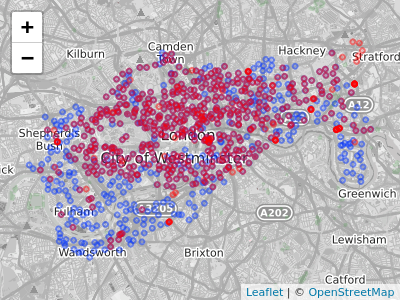

# Spatial data operations {#spatial-operations}

## Prerequisites {-}

- This chapter requires the same packages used in Chapter \@ref(attr): 

```{r 04-spatial-operations-1, message=FALSE, results='hide'}
library(sf)
library(terra)
library(dplyr)
library(spData)
elev = rast(system.file("raster/elev.tif", package = "spData"))
grain = rast(system.file("raster/grain.tif", package = "spData"))
```

## Introduction

Spatial operations are a vital part of geocomputation\index{geocomputation}.
This chapter shows how spatial objects can be modified in a multitude of ways based on their location and shape.
The content builds on the previous chapter because many spatial operations have a non-spatial (attribute) equivalent.
This is especially true for *vector* operations: Section \@ref(vector-attribute-manipulation) on vector attribute manipulation provides the basis for understanding its spatial counterpart, namely spatial subsetting (covered in Section \@ref(spatial-subsetting)).
Spatial joining (Section \@ref(spatial-joining)) and aggregation (Section \@ref(spatial-aggr)) also have non-spatial counterparts, covered in the previous chapter.

Spatial operations differ from non-spatial operations in some ways, however.
To illustrate the point, imagine you are researching road safety.
Spatial joins can be used to find road speed limits related with administrative zones, even when no zone ID is provided.
But this raises the question: should the road completely fall inside a zone for its values to be joined?
Or is simply crossing or being within a certain distance sufficient?
When posing such questions, it becomes apparent that spatial operations differ substantially from attribute operations on data frames:
the *type* of spatial relationship between objects must be considered.
These are covered in Section \@ref(topological-relations), on topological relations.

\index{spatial operations}
Another unique aspect of spatial objects is distance.
All spatial objects are related through space, and distance calculations can be used to explore the strength of this relationship. These are covered in Section \@ref(distance-relations).

Spatial operations also apply to raster objects.
Spatial subsetting of raster objects is covered in Section \@ref(spatial-raster-subsetting); merging several raster 'tiles' into a single object is covered in Section \@ref(merging-rasters).
For many applications, the most important spatial operation on raster objects is *map algebra*, as we will see in Sections \@ref(map-algebra) to \@ref(global-operations-and-distances).
Map algebra is also the prerequisite for distance calculations on rasters, a technique which is covered in Section \@ref(global-operations-and-distances).

```{block2 04-spatial-operations-2, type='rmdnote'}
It is important to note that spatial operations that use two spatial objects rely on both objects having the same coordinate reference system, a topic that was introduced in Section \@ref(crs-intro) and which will be covered in more depth in Chapter \@ref(reproj-geo-data).
```

## Spatial operations on vector data {#spatial-vec}

This section provides an overview of spatial operations on vector geographic data represented as simple features in the **sf** package before Section \@ref(spatial-ras), which presents spatial methods using the **terra** package.

### Spatial subsetting

<!--jn:toDo-->
<!--consider adding st_filter explanation-->

Spatial subsetting is the process of selecting features of a spatial object based on whether or not they in some way *relate* in space to another object.
It is analogous to *attribute subsetting* (covered in Section \@ref(vector-attribute-subsetting)) and can be done with the base R square bracket (`[`) operator or with the `filter()` function from the **tidyverse**\index{tidyverse (package)}.
\index{vector!subsetting}
\index{spatial!subsetting}

An example of spatial subsetting is provided by the `nz` and `nz_height` datasets in **spData**.
These contain projected data on the 16 main regions and 101 highest points in New Zealand, respectively (Figure \@ref(fig:nz-subset)).
The following code chunk first creates an object representing Canterbury, then uses spatial subsetting to return all high points in the region:

```{r 04-spatial-operations-3}
canterbury = nz %>% filter(Name == "Canterbury")
canterbury_height = nz_height[canterbury, ]
```

```{r nz-subset, echo=FALSE, warning=FALSE, fig.cap="Illustration of spatial subsetting with red triangles representing 101 high points in New Zealand, clustered near the central Canterbuy region (left). The points in Canterbury were created with the `[` subsetting operator (highlighted in gray, right).", fig.scap="Illustration of spatial subsetting.", message=FALSE}
library(tmap)
p_hpnz1 = tm_shape(nz) + tm_polygons(col = "white") +
  tm_shape(nz_height) + tm_symbols(shape = 2, col = "red", size = 0.25) +
  tm_layout(main.title = "High points in New Zealand", main.title.size = 1,
            bg.color = "lightblue")
p_hpnz2 = tm_shape(nz) + tm_polygons(col = "white") +
  tm_shape(canterbury) + tm_fill(col = "gray") + 
  tm_shape(canterbury_height) + tm_symbols(shape = 2, col = "red", size = 0.25) +
  tm_layout(main.title = "High points in Canterbury", main.title.size = 1,
            bg.color = "lightblue")
tmap_arrange(p_hpnz1, p_hpnz2, ncol = 2)
```

Like attribute subsetting `x[y, ]` subsets features of a *target* `x` using the contents of a *source* object `y`.
Instead of `y` being of class `logical` or `integer` --- a vector of `TRUE` and `FALSE` values or whole numbers --- for spatial subsetting it is another spatial (`sf`) object.

Various *topological relations* can be used for spatial subsetting.
These determine the type of spatial relationship that features in the target object must have with the subsetting object to be selected, including *touches*, *crosses* or *within* (see Section \@ref(topological-relations)). 
*Intersects* is the default spatial subsetting operator, a default that returns `TRUE` for many types of spatial relations, including *touches*, *crosses* and *is within*.
These alternative spatial operators can be specified with the `op =` argument, a third argument that can be passed to the `[` operator for `sf` objects.
This is demonstrated in the following command which returns the opposite of `st_intersects()`, points that do not intersect with Canterbury (see Section \@ref(topological-relations)):

```{r 04-spatial-operations-4, eval=FALSE}
nz_height[canterbury, , op = st_disjoint]
```

```{block2 04-spatial-operations-5, type='rmdnote'}
Note the empty argument --- denoted with `, ,` --- in the preceding code chunk is included to highlight `op`, the third argument in `[` for `sf` objects.
One can use this to change the subsetting operation in many ways.
`nz_height[canterbury, 2, op = st_disjoint]`, for example, returns the same rows but only includes the second attribute column (see `` sf:::`[.sf` `` and the `?sf` for details).
```

For many applications, this is all you'll need to know about spatial subsetting for vector data.
In this case, you can safely skip to Section \@ref(topological-relations).

If you're interested in the details, including other ways of subsetting, read on.
Another way of doing spatial subsetting uses objects returned by *topological operators*.
This is demonstrated in the first command below:

```{r 04-spatial-operations-6}
sel_sgbp = st_intersects(x = nz_height, y = canterbury)
class(sel_sgbp)
sel_logical = lengths(sel_sgbp) > 0
canterbury_height2 = nz_height[sel_logical, ]
```

In the above code chunk, an object of class `sgbp` (a sparse geometry binary predicate, a list of length `x` in the spatial operation) is created and then converted into a logical vector `sel_logical` (containing only `TRUE` and `FALSE` values).
\index{binary predicate|seealso {topological relations}}
The function `lengths()` identifies which features in `nz_height` intersect with *any* objects in `y`.
In this case 1 is the greatest possible value but for more complex operations one could use the method to subset only features that intersect with, for example, 2 or more features from the source object.

```{block2 04-spatial-operations-7, type='rmdnote'}
Note: another way to return a logical output is by setting `sparse = FALSE` (meaning 'return a dense matrix not a sparse one') in operators such as `st_intersects()`. The command `st_intersects(x = nz_height, y = canterbury, sparse = FALSE)[, 1]`, for example, would return an output identical to `sel_logical`.
Note: the solution involving `sgbp` objects is more generalisable though, as it works for many-to-many operations and has lower memory requirements.
```

It should be noted that a logical  can also be used with `filter()` as follows (`sparse = FALSE` is explained in Section \@ref(topological-relations)):

```{r 04-spatial-operations-7b}
canterbury_height3 = nz_height %>%
  filter(st_intersects(x = ., y = canterbury, sparse = FALSE))
```

At this point, there are three versions of `canterbury_height`, one created with spatial subsetting directly and the other two via intermediary selection objects.
To explore these objects and spatial subsetting in more detail, see the supplementary vignettes on `subsetting` and [`tidyverse-pitfalls`](https://geocompr.github.io/geocompkg/articles/).

### Topological relations

Topological relations describe the spatial relationships between objects.
To understand them, it helps to have some simple test data to work with.
Figure \@ref(fig:relation-objects) contains a polygon (`a`), a line (`l`) and some points (`p`), which are created in the code below.
\index{topological relations}

```{r 04-spatial-operations-8}
# create a polygon
a_poly = st_polygon(list(rbind(c(-1, -1), c(1, -1), c(1, 1), c(-1, -1))))
a = st_sfc(a_poly)
# create a line
l_line = st_linestring(x = matrix(c(-1, -1, -0.5, 1), ncol = 2))
l = st_sfc(l_line)
# create points
p_matrix = matrix(c(0.5, 1, -1, 0, 0, 1, 0.5, 1), ncol = 2)
p_multi = st_multipoint(x = p_matrix)
p = st_cast(st_sfc(p_multi), "POINT")
```

```{r relation-objects, echo=FALSE, fig.cap="Points (p 1 to 4), line and polygon objects arranged to illustrate topological relations.", fig.asp=1, out.width="50%", fig.scap="Demonstration of topological relations."}
par(pty = "s")
plot(a, border = "red", col = "gray", axes = TRUE)
plot(l, add = TRUE)
plot(p, add = TRUE, lab = 1:4)
text(p_matrix[, 1] + 0.04, p_matrix[, 2] - 0.06, 1:4, cex = 1.3)
```

A simple query is: which of the points in `p` intersect in some way with polygon `a`?
The question can be answered by inspection (points 1 and 2 are over or touch the triangle).
It can also be answered by using a *spatial predicate* such as *do the objects intersect*?
This is implemented in **sf** as follows:

```{r 04-spatial-operations-9, eval=FALSE}
st_intersects(p, a)
#> Sparse geometry binary ..., where the predicate was `intersects'
#> 1: 1
#> 2: 1
#> 3: (empty)
#> 4: (empty)
```

The contents of the result should be as you expected:
the function returns a positive (`1`) result for the first two points, and a negative result (represented by an empty vector) for the last two.
What may be unexpected is that the result comes in the form of a list of vectors.
This *sparse matrix* output only registers a relation if one exists, reducing the memory requirements of topological operations on multi-feature objects.
As we saw in the previous section, a *dense matrix* consisting of `TRUE` or `FALSE` values for each combination of features can also be returned when `sparse = FALSE`:

```{r 04-spatial-operations-10}
st_intersects(p, a, sparse = FALSE)
```

The output is a matrix in which each row represents a feature in the target object and each column represents a feature in the selecting object.
In this case, only the first two features in `p` intersect with `a` and there is only one feature in `a` so the result has only one column.
The result can be used for subsetting as we saw in Section \@ref(spatial-subsetting).

Note that `st_intersects()` returns `TRUE` for the second feature in the object `p` even though it just touches the polygon `a`: *intersects* is a 'catch-all' topological operation which identifies many types of spatial relation.

The opposite of `st_intersects()` is `st_disjoint()`, which returns only objects that do not spatially relate in any way to the selecting object (note `[, 1]` converts the result into a vector):

```{r 04-spatial-operations-11}
st_disjoint(p, a, sparse = FALSE)[, 1]
```

`st_within()` returns `TRUE` only for objects that are completely within the selecting object.
This applies only to the first object, which is inside the triangular polygon, as illustrated below:

```{r 04-spatial-operations-12}
st_within(p, a, sparse = FALSE)[, 1]
```

Note that although the first point is *within* the triangle, it does not *touch* any part of its border.
For this reason `st_touches()` only returns `TRUE` for the second point:

```{r 04-spatial-operations-13}
st_touches(p, a, sparse = FALSE)[, 1]
```

What about features that do not touch, but *almost touch* the selection object?
These can be selected using `st_is_within_distance()`, which has an additional `dist` argument.
It can be used to set how close target objects need to be before they are selected.
Note that although point 4 is one unit of distance from the nearest node of `a` (at point 2 in Figure \@ref(fig:relation-objects)), it is still selected when the distance is set to 0.9.
This is illustrated in the code chunk below, the second line of which converts the lengthy list output into a `logical` object:

```{r 04-spatial-operations-14}
sel = st_is_within_distance(p, a, dist = 0.9) # can only return a sparse matrix
lengths(sel) > 0
```


```{block2 04-spatial-operations-15, type='rmdnote'}
Functions for calculating topological relations use spatial indices to largely speed up spatial query performance.
They achieve that using the Sort-Tile-Recursive (STR) algorithm.
The `st_join` function, mentioned in the next section, also uses the spatial indexing. 
You can learn more at https://www.r-spatial.org/r/2017/06/22/spatial-index.html.
```

```{r 04-spatial-operations-16, eval=FALSE, echo=FALSE}
# other tests
st_overlaps(p, a, sparse = FALSE)
st_covers(p, a, sparse = FALSE)
st_covered_by(p, a, sparse = FALSE)
```

```{r 04-spatial-operations-17, eval=FALSE, echo=FALSE}
st_contains(a, p[2, ], sparse = TRUE)
```

```{r 04-spatial-operations-18, eval=FALSE, echo=FALSE}
# starting simpler so commented
a1 = st_polygon(list(rbind(c(-1, -1), c(1, -1), c(1, 1), c(-1, -1))))
a2 = st_polygon(list(rbind(c(2, 0), c(2, 2), c(3, 2), c(3, 0), c(2, 0))))
a = st_sfc(a1, a2)

b1 = a1 * 0.5
b2 = a2 * 0.4 + c(1, 0.5)
b = st_sfc(b1, b2)

l1 = st_linestring(x = matrix(c(0, 3, -1, 1), , 2))
l2 = st_linestring(x = matrix(c(-1, -1, -0.5, 1), , 2))
l = st_sfc(l1, l2)

p = st_multipoint(x = matrix(c(0.5, 1, -1, 0, 1, 0.5), , 2))

plot(a, border = "red", axes = TRUE)
plot(b, border = "green", add = TRUE)
plot(l, add = TRUE)
plot(p, add = TRUE)
```

### Spatial joining 

Joining two non-spatial datasets relies on a shared 'key' variable, as described in Section \@ref(vector-attribute-joining).
Spatial data joining applies the same concept, but instead relies on shared areas of geographic space (it is also known as spatial overlay).
As with attribute data, joining adds a new column to the target object (the argument `x` in joining functions), from a source object (`y`).
\index{join!spatial}
\index{spatial!join}

The process can be illustrated by an example.
Imagine you have ten points randomly distributed across the Earth's surface.
Of the points that are on land, which countries are they in?
Random points to demonstrate spatial joining are created as follows:

```{r 04-spatial-operations-19}
set.seed(2018) # set seed for reproducibility
(bb_world = st_bbox(world)) # the world's bounds
random_df = tibble(
  x = runif(n = 10, min = bb_world[1], max = bb_world[3]),
  y = runif(n = 10, min = bb_world[2], max = bb_world[4])
)
random_points = random_df %>% 
  st_as_sf(coords = c("x", "y")) %>% # set coordinates
  st_set_crs(4326) # set geographic CRS
```

The scenario is illustrated in Figure \@ref(fig:spatial-join).
The `random_points` object (top left) has no attribute data, while the `world` (top right) does.
The spatial join operation is done by `st_join()`, which adds the `name_long` variable to the points, resulting in `random_joined` which is illustrated in Figure \@ref(fig:spatial-join) (bottom left --- see [`04-spatial-join.R`](https://github.com/Robinlovelace/geocompr/blob/main/code/04-spatial-join.R)).
Before creating the joined dataset, we use spatial subsetting to create `world_random`, which contains only countries that contain random points, to verify the number of country names returned in the joined dataset should be four (see the top right panel of Figure \@ref(fig:spatial-join)).

```{r 04-spatial-operations-20, message=FALSE}
world_random = world[random_points, ]
nrow(world_random)
random_joined = st_join(random_points, world["name_long"])
```

```{r spatial-join, echo=FALSE, fig.cap="Illustration of a spatial join. A new attribute variable is added to random points (top left) from source world object (top right) resulting in the data represented in the final panel.", fig.asp=0.5, warning=FALSE, message=FALSE, out.width="100%", fig.scap="Illustration of a spatial join."}
source("https://github.com/Robinlovelace/geocompr/raw/main/code/04-spatial-join.R")
tmap_arrange(jm1, jm2, jm3, jm4, nrow = 2, ncol = 2)
```

By default, `st_join()` performs a left join (see Section \@ref(vector-attribute-joining)), but it can also do inner joins by setting the argument `left = FALSE`.
Like spatial subsetting, the default topological operator used by `st_join()` is `st_intersects()`.
This can be changed with the `join` argument (see `?st_join` for details).
In the example above, we have added features of a polygon layer to a point layer.
In other cases, we might want to join point attributes to a polygon layer.
There might be occasions where more than one point falls inside one polygon. 
In such a case `st_join()` duplicates the polygon feature: it creates a new row for each match.

### Non-overlapping joins

Sometimes two geographic datasets do not touch but still have a strong geographic relationship enabling joins.
The datasets `cycle_hire` and `cycle_hire_osm`, already attached in the **spData** package, provide a good example.
Plotting them shows that they are often closely related but they do not touch, as shown in Figure \@ref(fig:cycle-hire), a base version of which is created with the following code below:
\index{join!non-overlapping}

```{r 04-spatial-operations-21, eval=FALSE}
plot(st_geometry(cycle_hire), col = "blue")
plot(st_geometry(cycle_hire_osm), add = TRUE, pch = 3, col = "red")
```

We can check if any points are the same `st_intersects()` as shown below:

```{r 04-spatial-operations-22, message=FALSE}
any(st_touches(cycle_hire, cycle_hire_osm, sparse = FALSE))
```

```{r 04-spatial-operations-23, echo=FALSE, eval=FALSE}
# included to show alternative ways of showing there's no overlap
sum(st_geometry(cycle_hire) %in% st_geometry(cycle_hire_osm))
sum(st_coordinates(cycle_hire)[, 1] %in% st_coordinates(cycle_hire_osm)[, 1])
```

```{r cycle-hire, fig.cap="The spatial distribution of cycle hire points in London based on official data (blue) and OpenStreetMap data (red).", echo=FALSE, warning=FALSE, fig.scap="The spatial distribution of cycle hire points in London."}
if (knitr::is_latex_output()){
  
} else if (knitr::is_html_output()){
  # library(tmap)
  # osm_tiles = tmaptools::read_osm(tmaptools::bb(cycle_hire, ext = 1.3), type =   "https://korona.geog.uni-heidelberg.de/tiles/roadsg/x={x}&y={y}&z={z}")
  # qtm(osm_tiles) +
    # tm_shape(cycle_hire) +
    # tm_bubbles(col = "blue", alpha = 0.5, size = 0.2) +
    # tm_shape(cycle_hire_osm) +
    # tm_bubbles(col = "red", alpha = 0.5, size = 0.2) +
    # tm_scale_bar()
  library(leaflet)
  leaflet() %>%
    # addProviderTiles(providers$OpenStreetMap.BlackAndWhite) %>%
    addCircles(data = cycle_hire) %>%
    addCircles(data = cycle_hire_osm, col = "red")  
}
```

Imagine that we need to join the `capacity` variable in `cycle_hire_osm` onto the official 'target' data contained in `cycle_hire`.
This is when a non-overlapping join is needed.
The simplest method is to use the topological operator `st_is_within_distance()` shown in Section \@ref(topological-relations), using a threshold distance of 20 m.
Note that, before performing the relation, both objects are transformed into a projected CRS.
These projected objects are created below (note the affix `_P`, short for projected):

```{r 04-spatial-operations-24}
cycle_hire_P = st_transform(cycle_hire, 27700)
cycle_hire_osm_P = st_transform(cycle_hire_osm, 27700)
sel = st_is_within_distance(cycle_hire_P, cycle_hire_osm_P, dist = 20)
summary(lengths(sel) > 0)
```

This shows that there are `r sum(lengths(sel) > 0)` points in the target object `cycle_hire_P` within the threshold distance of `cycle_hire_osm_P`.
How to retrieve the *values* associated with the respective `cycle_hire_osm_P` points?
The solution is again with `st_join()`, but with an addition `dist` argument (set to 20 m below):

```{r 04-spatial-operations-25}
z = st_join(cycle_hire_P, cycle_hire_osm_P,
            join = st_is_within_distance, dist = 20)
nrow(cycle_hire)
nrow(z)
```

Note that the number of rows in the joined result is greater than the target.
This is because some cycle hire stations in `cycle_hire_P` have multiple matches in `cycle_hire_osm_P`.
To aggregate the values for the overlapping points and return the mean, we can use the aggregation methods learned in Chapter \@ref(attr), resulting in an object with the same number of rows as the target:

```{r 04-spatial-operations-26}
z = z %>% 
  group_by(id) %>% 
  summarize(capacity = mean(capacity))
nrow(z) == nrow(cycle_hire)
```

The capacity of nearby stations can be verified by comparing a plot of the capacity of the source `cycle_hire_osm` data with the results in this new object (plots not shown):

```{r 04-spatial-operations-27, eval=FALSE}
plot(cycle_hire_osm["capacity"])
plot(z["capacity"])
```

The result of this join has used a spatial operation to change the attribute data associated with simple features;  the geometry associated with each feature has remained unchanged.

### Spatial data aggregation {#spatial-aggr}

Like attribute data aggregation, covered in Section \@ref(vector-attribute-aggregation), spatial data aggregation can be a way of *condensing* data.
Aggregated data show some statistics\index{statistics} about a variable (typically average or total) in relation to some kind of *grouping variable*.
Section \@ref(vector-attribute-aggregation) demonstrated how `aggregate()` and `group_by() %>% summarize()` condense data based on attribute variables.
This section demonstrates how the same functions work using spatial grouping variables.
\index{aggregation!spatial}

Returning to the example of New Zealand, imagine you want to find out the average height of high points in each region.
This is a good example of spatial aggregation: it is the geometry of the source (`y` or `nz` in this case) that defines how values in the target object (`x` or `nz_height`) are grouped.
This is illustrated using the base `aggregate()` function below:

```{r 04-spatial-operations-28}
nz_avheight = aggregate(x = nz_height, by = nz, FUN = mean)
```

The result of the previous command is an `sf` object with the same geometry as the (spatial) aggregating object (`nz`).^[
This can be verified with `identical(st_geometry(nz), st_geometry(nz_avheight))`.
]
The result of the previous operation is illustrated in Figure \@ref(fig:spatial-aggregation).
The same result can also be generated using the 'tidy' functions `group_by()` and `summarize()` (used in combination with `st_join()`):

```{r spatial-aggregation, echo=FALSE, fig.cap="Average height of the top 101 high points across the regions of New Zealand.", fig.asp=1, message=FALSE, out.width="50%"}
library(tmap)
tm_shape(nz_avheight) +
  tm_fill("elevation", breaks = seq(27, 30, by = 0.5) * 1e2) +
  tm_borders()
```

```{r 04-spatial-operations-29}
nz_avheight2 = nz %>%
  st_join(nz_height) %>%
  group_by(Name) %>%
  summarize(elevation = mean(elevation, na.rm = TRUE))
```

The resulting `nz_avheight` objects have the same geometry as the aggregating object `nz` but with a new column representing the mean average height of points within each region of New Zealand (other summary functions such as `median()` and `sd()` can be used in place of `mean()`).
Note that regions containing no points have an associated `elevation` value of `NA`.
For aggregating operations which also create new geometries, see Section \@ref(geometry-unions).

Spatial congruence\index{spatial congruence} is an important concept related to spatial aggregation.
An *aggregating object* (which we will refer to as `y`) is *congruent* with the target object (`x`) if the two objects have shared borders.
Often this is the case for administrative boundary data, whereby larger units --- such as Middle Layer Super Output Areas ([MSOAs](https://www.ons.gov.uk/methodology/geography/ukgeographies/censusgeography)) in the UK or districts in many other European countries --- are composed of many smaller units.

*Incongruent* aggregating objects, by contrast, do not share common borders with the target [@qiu_development_2012].
This is problematic for spatial aggregation (and other spatial operations) illustrated in Figure \@ref(fig:areal-example).
Areal interpolation overcomes this issue by transferring values from one set of areal units to another.
Algorithms developed for this task include area weighted and 'pycnophylactic' areal interpolation methods [@tobler_smooth_1979].

```{r areal-example, echo=FALSE, fig.cap="Illustration of congruent (left) and incongruent (right) areal units with respect to larger aggregating zones (translucent blue borders).", fig.asp=0.2, fig.scap="Illustration of congruent and incongruent areal units."}
source("https://github.com/Robinlovelace/geocompr/raw/main/code/04-areal-example.R", print.eval = TRUE)
```

The **spData** package contains a dataset named `incongruent` (colored polygons with black borders in the right panel of Figure \@ref(fig:areal-example)) and a dataset named `aggregating_zones` (the two polygons with the translucent blue border in the right panel of Figure \@ref(fig:areal-example)).
Let us assume that the `value` column of `incongruent` refers to the total regional income in million Euros.
How can we transfer the values of the underlying nine spatial polygons into the two polygons of `aggregating_zones`?

The simplest useful method for this is *area weighted* spatial interpolation.
In this case values from the `incongruent` object are allocated to the `aggregating_zones` in proportion to area; the larger the spatial intersection  between input and output features, the larger the corresponding value. 
For instance, if one intersection of `incongruent` and `aggregating_zones` is 1.5 km^2^ but the whole incongruent polygon in question has 2 km^2^ and a total income of 4 million Euros, then the target aggregating zone will obtain three quarters of the income, in this case 3 million Euros.
This is implemented in `st_interpolate_aw()`, as demonstrated in the code chunk below.

```{r 04-spatial-operations-30}
agg_aw = st_interpolate_aw(incongruent[, "value"], aggregating_zones,
                           extensive = TRUE)
# show the aggregated result
agg_aw$value
```

In our case it is meaningful to sum up the values of the intersections falling into the aggregating zones since total income is a so-called spatially extensive variable.
This would be different for spatially intensive variables, which are independent of the spatial units used, such as income per head or [percentages](http://ibis.geog.ubc.ca/courses/geob370/notes/intensive_extensive.htm).
In this case it is more meaningful to apply an average function when doing the aggregation instead of a sum function.
To do so, one would only have to set the `extensive` parameter to `FALSE`.

### Distance relations 

While topological relations are binary --- a feature either intersects with another or does not --- distance relations are continuous.
The distance between two objects is calculated with the `st_distance()` function.
This is illustrated in the code chunk below, which finds the distance between the highest point in New Zealand and the geographic centroid of the Canterbury region, created in Section \@ref(spatial-subsetting):
\index{sf!distance relations}

```{r 04-spatial-operations-31, warning=FALSE}
nz_heighest = nz_height %>% top_n(n = 1, wt = elevation)
canterbury_centroid = st_centroid(canterbury)
st_distance(nz_heighest, canterbury_centroid)
```

There are two potentially surprising things about the result:

- It has `units`, telling us the distance is 100,000 meters, not 100,000 inches, or any other measure of distance
- It is returned as a matrix, even though the result only contains a single value

This second feature hints at another useful feature of `st_distance()`, its ability to return *distance matrices* between all combinations of features in objects `x` and `y`.
This is illustrated in the command below, which finds the distances between the first three features in `nz_height` and the Otago and Canterbury regions of New Zealand represented by the object `co`.

```{r 04-spatial-operations-32}
co = filter(nz, grepl("Canter|Otag", Name))
st_distance(nz_height[1:3, ], co)
```

Note that the distance between the second and third features in `nz_height` and the second feature in `co` is zero.
This demonstrates the fact that distances between points and polygons refer to the distance to *any part of the polygon*:
The second and third points in `nz_height` are *in* Otago, which can be verified by plotting them (result not shown):

```{r 04-spatial-operations-33, eval=FALSE}
plot(st_geometry(co)[2])
plot(st_geometry(nz_height)[2:3], add = TRUE)
```

## Spatial operations on raster data {#spatial-ras}

This section builds on Section \@ref(manipulating-raster-objects), which highlights various basic methods for manipulating raster datasets, to demonstrate more advanced and explicitly spatial raster operations, and uses the objects `elev` and `grain` manually created in Section \@ref(manipulating-raster-objects).
For the reader's convenience, these datasets can be also found in the **spData** package.

### Spatial subsetting {#spatial-raster-subsetting}

The previous chapter (Section \@ref(manipulating-raster-objects)) demonstrated how to retrieve values associated with specific cell IDs or row and column combinations.
Raster objects can also be extracted by location (coordinates) and other spatial objects.
To use coordinates for subsetting, one can 'translate' the coordinates into a cell ID with the **terra** function `cellFromXY()`.
An alternative is to use `terra::extract()` (be careful, there is also a function called `extract()` in the **tidyverse**\index{tidyverse (package)}) to extract values.
Both methods are demonstrated below to find the value of the cell that covers a point located at coordinates of 0.1, 0.1.
\index{raster!subsetting}
\index{spatial!subsetting}

```{r 04-spatial-operations-34, eval = FALSE}
id = cellFromXY(elev, xy = matrix(c(0.1, 0.1), ncol = 2))
elev[id]
# the same as
terra::extract(elev, matrix(c(0.1, 0.1), ncol = 2))
```

Raster objects can also be subset with another raster object, as demonstrated in the code chunk below:

```{r 04-spatial-operations-35}
clip = rast(xmin = 0.9, xmax = 1.8, ymin = -0.45, ymax = 0.45,
            resolution = 0.3, vals = rep(1, 9))
elev[clip]
# we can also use extract
# terra::extract(elev, ext(clip))
```

Basically, this amounts to retrieving the values of the first raster (here: `elev`) falling within the extent of a second raster (here: `clip`).

```{r raster-subset, echo = FALSE, fig.cap = "Original raster (left). Raster mask (middle). Output of masking a raster (right).", fig.scap="Subsetting raster values."}
knitr::include_graphics("figures/04_raster_subset.png")
```

So far, the subsetting returned the values of specific cells, however, when doing spatial subsetting, one often also expects a spatial object as an output.
To do this, we can use again the `[` when we additionally set the `drop` parameter to `FALSE`.
Let's illustrate this by retrieving the first two cells of `elev` as an individual raster object. 
As mentioned in Section \@ref(manipulating-raster-objects), the `[` operator accepts various inputs to subset rasters and returns a raster object when `drop = FALSE`.
The code chunk below subsets the `elev` raster by cell ID and row-column index with identical results: the first two cells on the top row (only the first 2 lines of the output is shown):

```{r 04-spatial-operations-36, eval=FALSE}
elev[1:2, drop = FALSE]    # spatial subsetting with cell IDs
elev[1, 1:2, drop = FALSE] # spatial subsetting by row,column indices
#> class       : SpatRaster 
#> dimensions  : 1, 2, 1  (nrow, ncol, nlyr)
#> ...
```

```{r 04-spatial-operations-37, echo=FALSE, eval=FALSE}
# aim: illustrate the result of previous spatial subsetting example
x = elev[1, 1:2, drop = FALSE]
plot(x)
```

Another common use case of spatial subsetting is when a raster with `logical` (or `NA`) values is used to mask another raster with the same extent and resolution, as illustrated in Figure \@ref(fig:raster-subset).
In this case, the `[` and `mask()` functions can be used (results not shown):

```{r 04-spatial-operations-38, eval=FALSE}
# create raster mask
rmask = elev
values(rmask) = sample(c(NA, TRUE), 36, replace = TRUE)
```

In the code chunk above, we have created a mask object called `rmask` with values randomly assigned to `NA` and `TRUE`.
Next, we want to keep those values of `elev` which are `TRUE` in `rmask`.
In other words, we want to mask `elev` with `rmask`.

```{r 04-spatial-operations-38b, eval=FALSE}
# spatial subsetting
elev[rmask, drop = FALSE]           # with [ operator
mask(elev, rmask)                   # with mask()
```

The above approach can be also used to replace some values (e.g., expected to be wrong) with NA. 

```{r 04-spatial-operations-38c, eval=FALSE}
elev[elev < 20] = NA
```

These operations are in fact Boolean local operations since we compare cell-wise two rasters.
The next subsection explores these and related operations in more detail.

### Map algebra

\index{map algebra}
Map algebra makes raster processing really fast.
This is because raster datasets only implicitly store coordinates.
To derive the coordinate of a specific cell, we have to calculate it using its matrix position and the raster resolution and origin.
For the processing, however, the geographic position of a cell is barely relevant as long as we make sure that the cell position is still the same after the processing.
Additionally, if two or more raster datasets share the same extent, projection and resolution, one could treat them as matrices for the processing.
This is exactly what map algebra is doing in R.
First, the **terra** package checks the headers of the rasters on which to perform any algebraic operation, and only if they are correspondent to each other, the processing goes on.
And secondly, map algebra retains the so-called one-to-one locational correspondence.
This is where it substantially differs from matrix algebra which changes positions when for example multiplying or dividing matrices.

Map algebra (or cartographic modeling) divides raster operations into four subclasses [@tomlin_geographic_1990], with each working on one or several grids simultaneously:

1. *Local* or per-cell operations
2. *Focal* or neighborhood operations.
Most often the output cell value is the result of a 3 x 3 input cell block
3. *Zonal* operations are similar to focal operations, but the surrounding pixel grid on which new values are computed can have irregular sizes and shapes
4. *Global* or per-raster operations; that means the output cell derives its value potentially from one or several entire rasters

This typology classifies map algebra operations by the number of cells used for each pixel processing step and the type of the output.
For the sake of completeness, we should mention that raster operations can also be classified by discipline such as terrain, hydrological analysis, or image classification.
The following sections explain how each type of map algebra operations can be used, with reference to worked examples.

### Local operations

\index{map algebra!local operations}
**Local** operations comprise all cell-by-cell operations in one or several layers.
Raster algebra is a classical use case of local operations -- this includes adding or subtracting values from a raster, squaring and multipling rasters.
Raster algebra also allows logical operations such as finding all raster cells that are greater than a specific value (5 in our example below).
The **terra** package supports all these operations and more, as demonstrated below (Figure \@ref(fig:04-local-operations)):

```{r 04-spatial-operations-41, eval = FALSE}
elev + elev
elev^2
log(elev)
elev > 5
```

```{r 04-local-operations, echo=FALSE, fig.cap="Examples of different local operations of the elev raster object: adding two rasters, squaring, applying logarithmic transformation, and performing a logical operation."}
knitr::include_graphics("figures/04-local-operations.png")
```

Another good example of local operations is the classification of intervals of numeric values into groups such as grouping a digital elevation model into low (class 1), middle (class 2) and high elevations (class 3).
Using the `classify()` command, we need first to construct a reclassification matrix, where the first column corresponds to the lower and the second column to the upper end of the class.
The third column represents the new value for the specified ranges in column one and two.

```{r 04-spatial-operations-40}
rcl = matrix(c(0, 12, 1, 12, 24, 2, 24, 36, 3), ncol = 3, byrow = TRUE)
rcl
```

Here, we assign the raster values in the ranges 0--12, 12--24 and 24--36 are *reclassified* to take values 1, 2 and 3, respectively.

```{r 04-spatial-operations-40b, eval = FALSE}
recl = classify(elev, rcl = rcl)
```

The `classify()` function can be also used when we want to reduce the number of classes in our categorical rasters.
We will perform several additional reclassifications in Chapter \@ref(location).

Apart of arithmetic operators, one can also use the `app()`, `tapp()` and `lapp()` functions.
They are more efficient, hence, they are preferable in the presence of large raster datasets. 
Additionally, they allow you to save an output file directly.
The `app()` function applies a function to each cell of a raster and is used to summarize (e.g., calculating the sum) the values of multiple layers into one layer.
`tapp()` is an extension of `app()`, allowing us to select a subset of layers (see the `index` argument) for which we want to perform a certain operation.
Finally, the `lapp()` function allows to apply a function to each cell using layers as arguments -- an application of `lapp()` is presented below.

The calculation of the normalized difference vegetation index (NDVI) is a well-known local (pixel-by-pixel) raster operation.
It returns a raster with values between -1 and 1; positive values indicate the presence of living plants (mostly > 0.2).
NDVI is calculated from red and near-infrared (NIR) bands of remotely sensed imagery, typically from satellite systems such as Landsat or Sentinel.
Vegetation absorbs light heavily in the visible light spectrum, and especially in the red channel, while reflecting NIR light, explaining the NVDI formula:

$$
\begin{split}
NDVI&= \frac{\text{NIR} - \text{Red}}{\text{NIR} + \text{Red}}\\
\end{split}
$$

Let's calculate NDVI for the multispectral satellite file of the Zion National Park.

```{r}
multi_raster_file = system.file("raster/landsat.tif", package = "spDataLarge")
multi_rast = rast(multi_raster_file)
```

The raster object has four satellite bands - blue, green, red, and near-infrared (NIR).
Our next step should be to implement the NDVI formula into an R function:

```{r}
ndvi_fun = function(nir, red){
  (nir - red) / (nir + red)
}
```

This function accepts two numerical arguments, `nir` and `red`, and returns a numerical vector with NDVI values.
It can be used as the `fun` argument of `lapp()`.
We just need to remember that our function just needs two bands (not four from the original raster), and they need to be in the NIR, red order.
That is why we subset the input raster with `multi_rast[[c(4, 3)]]` before doing any calculations.

```{r}
ndvi_rast = lapp(multi_rast[[c(4, 3)]], fun = ndvi_fun)
```

The result, shown on the right panel in Figure \@ref(fig:04-ndvi), can be compared to the RGB image of the same area (left panel of the same Figure).
It allows us to see that the largest NDVI values are connected to areas of dense forest in the northern parts of the area, while the lowest values are related to the lake in the north and snowy mountain ridges.

```{r 04-ndvi, echo=FALSE, fig.cap="RGB image (left) and NDVI values (right) calculated for the example satellite file of the Zion National Park"}
knitr::include_graphics("figures/04-ndvi.png")
```

Predictive mapping is another interesting application of local raster operations.
The response variable corresponds to measured or observed points in space, for example, species richness, the presence of landslides, tree disease or crop yield.
Consequently, we can easily retrieve space- or airborne predictor variables from various rasters (elevation, pH, precipitation, temperature, landcover, soil class, etc.).
Subsequently, we model our response as a function of our predictors using `lm()`, `glm()`, `gam()` or a machine-learning technique. 
Spatial predictions on raster objects can therefore be made by applying estimated coefficients to the predictor raster values, and summing the output raster values (see Chapter \@ref(eco)).

### Focal operations

\index{map algebra!focal operations}
While local functions operate on one cell, though possibly from multiple layers, **focal** operations take into account a central (focal) cell and its neighbors.
The neighborhood (also named kernel, filter or moving window) under consideration is typically of size 3-by-3 cells (that is the central cell and its eight surrounding neighbors), but can take on any other (not necessarily rectangular) shape as defined by the user.
A focal operation applies an aggregation function to all cells within the specified neighborhood, uses the corresponding output as the new value for the the central cell, and moves on to the next central cell (Figure \@ref(fig:focal-example)).
Other names for this operation are spatial filtering and convolution [@burrough_principles_2015].

In R, we can use the `focal()` function to perform spatial filtering. 
We define the shape of the moving window with a `matrix` whose values correspond to weights (see `w` parameter in the code chunk below).
Secondly, the `fun` parameter lets us specify the function we wish to apply to this neighborhood.
Here, we choose the minimum, but any other summary function, including `sum()`, `mean()`, or `var()` can be used.

```{r 04-spatial-operations-42, eval = FALSE}
r_focal = focal(elev, w = matrix(1, nrow = 3, ncol = 3), fun = min)
```

This function also accepts additional arguments, for example, should it remove NAs in the process (`na.rm = TRUE`) or not (`na.rm = FALSE`).

```{r focal-example, echo = FALSE, fig.cap = "Input raster (left) and resulting output raster (right) due to a focal operation - finding the minimum value in 3-by-3 moving windows.", fig.scap="Illustration of a focal operation."}
knitr::include_graphics("figures/04_focal_example.png")
```

We can quickly check if the output meets our expectations.
In our example, the minimum value has to be always the upper left corner of the moving window (remember we have created the input raster by row-wise incrementing the cell values by one starting at the upper left corner).
In this example, the weighting matrix consists only of 1s, meaning each cell has the same weight on the output, but this can be changed.

Focal functions or filters play a dominant role in image processing.
Low-pass or smoothing filters use the mean function to remove extremes.
In the case of categorical data, we can replace the mean with the mode, which is the most common value.
By contrast, high-pass filters accentuate features.
The line detection Laplace and Sobel filters might serve as an example here.
Check the `focal()` help page for how to use them in R (this will also be used in the exercises at the end of this chapter).

Terrain processing, the calculation of topographic characteristics such as slope, aspect and flow directions, relies on focal functions.
`terrain()` can be used to calculate these metrics, although some terrain algorithms, including the Zevenbergen and Thorne method to compute slope, are not implemented in this **terra** function.
Many other algorithms --- including curvatures, contributing areas and wetness indices --- are implemented in open source desktop geographic information system (GIS) software.
Chapter \@ref(gis) shows how to access such GIS functionality from within R.

### Zonal operations

\index{map algebra!zonal operations}
Just like focal operations, *zonal* operations apply an aggregation function to multiple raster cells.
However, a second raster, usually a categorical raster, defines the *zonal filters* (or 'zones') in the case of zonal operations as opposed to a predefined neighborhood window in the case of focal operations (see previous Section).
Consequently, the raster cells defining the zonal filter do not necessarily have to be neighbors.
Our grain size raster is a good example (right panel of Figure \@ref(fig:cont-raster)) because the different grain sizes are spread in an irregular fashion throughout the raster.
Finally, the result of a zonal operation is a summary table grouped by zone which is why this operation is also known as *zonal statistics* in the GIS world\index{GIS}. 
This is in contrast to focal operations which return a raster object (see previous Section).

For example, to find the mean elevation for each grain size class (Figure \@ref(fig:cont-raster)), we use the `zonal()` function.

```{r 04-spatial-operations-43}
z = zonal(elev, grain, fun = "mean")
z
```

This returns the statistics\index{statistics} for each category, here the mean altitude for each grain size class.^[It is also possible to get a raster with calculated statistics for each zone by setting the `as.raster` argument to `TRUE`.]

### Global operations and distances

*Global* operations are a special case of zonal operations with the entire raster dataset representing a single zone.
The most common global operations are descriptive statistics\index{statistics} for the entire raster dataset such as the minimum or maximum -- we already discussed those in Section \@ref(summarizing-raster-objects).

Aside from that, global operations are also useful for the computation of distance and weight rasters.
In the first case, one can calculate the distance from each cell to a specific target cell.
For example, one might want to compute the distance to the nearest coast (see also `terra::distance()`).
We might also want to consider topography, that means, we are not only interested in the pure distance but would like also to avoid the crossing of mountain ranges when going to the coast.
To do so, we can weight the distance with elevation so that each additional altitudinal meter 'prolongs' the Euclidean distance.
Visibility and viewshed computations also belong to the family of global operations (in the exercises of Chapter \@ref(gis), you will compute a viewshed raster).

### Map algebra counterparts in vector processing

Many map algebra operations have a counterpart in vector processing [@liu_essential_2009].
Computing a distance raster (global operation) while only considering a maximum distance (logical focal operation) is the equivalent to a vector buffer operation (Section \@ref(clipping)).
Reclassifying raster data (either local or zonal function depending on the input) is equivalent to dissolving vector data (Section \@ref(spatial-joining)). 
Overlaying two rasters (local operation), where one contains `NULL` or `NA` values representing a mask, is similar to vector clipping (Section \@ref(clipping)).
Quite similar to spatial clipping is intersecting two layers (Section \@ref(spatial-subsetting)). 
The difference is that these two layers (vector or raster) simply share an overlapping area (see Figure \@ref(fig:venn-clip) for an example).
However, be careful with the wording.
Sometimes the same words have slightly different meanings for raster and vector data models.
Aggregating in the case of vector data refers to dissolving polygons, while it means increasing the resolution in the case of raster data.
In fact, one could see dissolving or aggregating polygons as decreasing the resolution. 
However, zonal operations might be the better raster equivalent compared to changing the cell resolution. 
Zonal operations can dissolve the cells of one raster in accordance with the zones (categories) of another raster using an aggregation function (see above).

### Merging rasters

\index{raster!merge}
Suppose we would like to compute the NDVI (see Section \@ref(local-operations)), and additionally want to compute terrain attributes from elevation data for observations within a study area.
Such computations rely on remotely sensed information. 
The corresponding imagery is often divided into scenes covering a specific spatial extent, and frequently, a study area covers more than one scene.
Then, we would need to merge the scenes covered by our study area. 
In the easiest case, we can just merge these scenes, that is put them side by side.
This is possible, for example, with digital elevation data (SRTM, ASTER).
In the following code chunk we first download the SRTM elevation data for Austria and Switzerland (for the country codes, see the **geodata** function `country_codes()`).
In a second step, we merge the two rasters into one.

```{r 04-spatial-operations-44, eval = FALSE}
aut = geodata::elevation_30s(country = "AUT", path = tempdir())
ch = geodata::elevation_30s(country = "CHE", path = tempdir())
aut_ch = merge(aut, ch)
```

**terra**'s `merge()` command combines two images, and in case they overlap, it uses the value of the first raster.
<!--jn:toDo-->
<!-- gdalUtils is slower (for this files): -->
<!-- two_rast = c(terra::sources(aut)$source, terra::sources(ch)$source) -->
<!-- tf = tempfile(fileext = ".tif") -->
<!-- bench::mark({gdalUtils::mosaic_rasters(two_rast, tf)}) -->
<!-- You can do exactly the same with `gdalUtils::mosaic_rasters()` which is faster, and therefore recommended if you have to merge a multitude of large rasters stored on disk. -->

The merging approach is of little use when the overlapping values do not correspond to each other.
This is frequently the case when you want to combine spectral imagery from scenes that were taken on different dates.
The `merge()` command will still work but you will see a clear border in the resulting image.
On the other hand, the `mosaic()` command lets you define a function for the overlapping area. 
For instance, we could compute the mean value -- this might smooth the clear border in the merged result but it will most likely not make it disappear.
To do so, we need a more advanced approach. 
Remote sensing scientists frequently apply histogram matching or use regression techniques to align the values of the first image with those of the second image.
The packages **landsat** (`histmatch()`, `relnorm()`, `PIF()`), **satellite** (`calcHistMatch()`) and **RStoolbox** (`histMatch()`, `pifMatch()`) provide the corresponding functions for the **raster**'s package objects.
For a more detailed introduction on how to use R for remote sensing, we refer the reader to @wegmann_remote_2016.
<!--jn:toDo-->
<!--update the above reference to the 2nd edition-->

## Exercises


```{r, echo=FALSE, results='asis'}
res = knitr::knit_child('_04-ex.Rmd', quiet = TRUE, options = list(include = FALSE, eval = FALSE))
cat(res, sep = '\n')
```