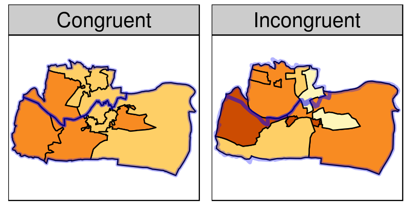
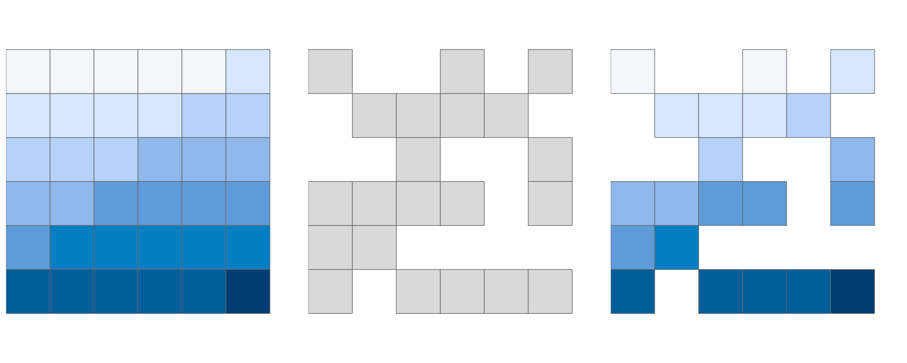

# Spatial operations

## Prerequisites {-}

- This chapter requires the same packages used in Chapter \@ref(attr): 

```{r, message=FALSE, results='hide'}
library(sf)
library(raster)
library(tidyverse)
library(spData)
```

## Introduction

Spatial operations are a vital part of geocomputation.
This chapter shows how spatial objects can be modified in a multitude of ways based on their location and shape.
The content builds on the previous chapter because many spatial operations have a non-spatial (attribute) equivalent.
This is especially true for *vector* operations: section \@ref(vector-attribute-manipulation) on vector attribute manipulation provides the basis for understanding its spatial counterpart, namely spatial subsetting (covered in section \@ref(spatial-subsetting)).
Spatial joining (section \@ref(spatial-joining)) and aggregation (\@ref(spatial-aggr)) also have non-spatial counterparts, covered in the previous chapter.

Spatial operations differ from non-spatial operations in some ways, however.
To illustrate the point, imagine you are researching road safety.
Spatial joins can be used to find road speed limits related with administrative zones, even when no zone ID is provided.
<!-- This could be a good example that - a candidate to replace the rather contrived asia example below. -->
But this raises the question: should the road completely fall inside a zone for its values to be joined?
Or is simply crossing or being within a certain distance sufficent?
When posing such questions it becomes apparent that spatial operations differ substantially from attribute operations on data frames:
the *type* of spatial relationship between objects must be considered.
These are covered in section \@ref(topological-relations), on topological relations.

Another unique aspect of spatial objects is distance.
All spatial objects are related through space and distance calculations, covered in section \@ref(distance-relations), can be used to explore the strength of this relationship.

Naturally, we can also subset *rasters* based on location and coordinates (section \@ref(raster-subsetting)) and merge different raster tiles into one raster (covered in section \@ref(merging-rasters)). 
The most important spatial operation on raster data, however, is *map algebra*. 
Map algebra makes raster processing very elegant and fast (covered in sections \@ref(map-algebra) to \@ref(global-operations-and-distances)).
Map algebra is also the prerequisite for distance calculations on rasters \@ref(global-operations-and-distances).

```{block2 type='rmdnote'}
It is important to note that spatial operations that use two spatial objects rely on both objects having the same coordinate reference system, a topic that was introduced in \@ref(crs-intro) and which will be covered in more depth in Chapter \@ref(transform).
```

## Spatial operations on vector data {#spatial-vec}

This section provides an overview of spatial operations on vector geographic data represented as simple features in the **sf** package before section \@ref(spatial-ras), which presents spatial methods using the **raster** package.

### Spatial subsetting

Spatial subsetting is the process of selecting features of a spatial object based on whether or not they in some way *relate* in space to another object.
It is analogous to *attribute subsetting* (covered in section \@ref(vector-attribute-subsetting)) and can be done with the base R square bracket (`[`) operator or with the `filter()` function from the **tidyverse**.

An example of spatial subsetting is provided by the `nz` and `nz_height` datasets in **spData**.
These contain projected data on the 16 main regions and 101 highest points in New Zealand respectively (Figure \@ref(fig:nz-subset)).
The following code chunk first creates an object representing Canterbury, then uses spatial subsetting to return all high points in the region:

```{r}
canterbury = nz %>% filter(REGC2017_NAME == "Canterbury Region")
canterbury_height = nz_height[canterbury, ]
```

```{r nz-subset, echo=FALSE, warning=FALSE, fig.cap="Illustration of spatial subsetting with red triangles representing 101 high points in New Zealand, clustered near the central Canterbuy region. The right-hand map contains points, subset with the command `nz_height[canterbury, ]`, located in Canterbury (highlighted in grey)."}
par_old = par(mfrow = c(1, 2), mar = c(0, 0, 1, 0))
plot(nz$geometry, col = "white", bgc = "lightblue", main = "High points in New Zealand")
plot(nz_height$geometry, add = TRUE, pch = 2, col = "red")
par(mar=c(0, 0, 1, 0))
plot(nz$geometry, col = "white", bgc = "lightblue", main = "High points in Canterbury")
plot(canterbury$geometry, col = "grey", add = TRUE)
plot(canterbury_height$geometry, add = TRUE, pch = 2, col = "red")
par(par_old)
```

Like attribute subsetting `x[y, ]` subsets features of a *target* 
`x` using the contents of a *source* object `y`.
Instead of `y` being of class `logical` or `integer` --- a vector of `TRUE` and `FALSE` values or whole numbers --- for spatial subsetting it is another spatial (`sf`) object.

Various *topological relations* can be used for spatial subsetting.
These determine the type of spatial relationship that features in the target object must have with the subsetting object to be selected, including *touches*, *crosses* or *within* (see section \@ref(topological-relations)). 
*Intersects* is the default spatial subsetting operator, a default that returns `TRUE` for many types of spatial relations, including *touches*, *crosses* and *is within*.
These alternative spatial operators can be specified with the `op =` argument, a third argument that can be passed to the `[` operator for `sf` objects.
This is demonstrated in the following command which returns the opposite of `st_intersect()`, points that do not intersect with Cantebury (see in section \@ref(topological-relations)):

```{r, eval=FALSE}
nz_height[canterbury, , op = st_disjoint]
```

```{block2 type='rmdnote'}
Note the empty argument --- donoted with `, ,` --- in the preceding code chunk is not necessary (`nz_height[canterbury, op = st_disjoint]` returns the same result) but is included to emphasise the fact that `op` is the third argument in `[` for `sf` objects, after arguments for subsetting rows and columns.
`nz_height[canterbury, 2, op = st_disjoint]`, for example, returns the same rows but only includes the second attribute column.
Interested readers can see this default value of `op` set in the first line of the function call by entering its long-form name into the console `` sf:::`[.sf` ``.
The `?sf` help page documents this also.
```

For many applications this is all you'll need to know about spatial subsetting for vector data.
If this is the case, you can safely skip to the next section (\@ref(topological-relations)).
If you're interested in the details, including other ways of subsetting, read-on.

Another way of doing spatial subsetting uses objects returned by *topological operators*.
This is demonstrated in the first command below which uses the `sparse = FALSE` (meaning in English 'return a dense matrix not a sparse one') argument in the topological operator `st_intersects()` to ensure a `logical` result is returned:

```{r}
sel = st_intersects(x = nz_height, y = canterbury, sparse = FALSE)
canterbury_height2 = nz_height[sel, ]
```

This creates `sel` (short for 'selection object') containing only `TRUE` and `FALSE` values, which are used in the second line of the pevious code chunk to create `canterbury_height2`, which is identical to `canterbury_height`.
`sel` can also be used with `filter()`:

```{r}
canterbury_height3 = nz_height %>% filter(sel)
```

At this point there are three versions of `canterbury_height`, one created with spatial subsetting directly and the other two via the intermediary object `sel`.
We can test whether they are identical as follows:

```{r}
identical(x = canterbury_height, y = canterbury_height2)
identical(x = canterbury_height, y = canterbury_height3)
```

What is different about `canterbury_height3`?
The only difference is that `filter()` changed the row names:

```{r}
row.names(canterbury_height)[1:3]
row.names(canterbury_height3)[1:3]
```

If the row names are re-set, the objects become identical:

```{r}
attr(canterbury_height3, "row.names") = attr(x = canterbury_height, "row.names")
identical(canterbury_height, canterbury_height3)
```

```{block type='rmdnote'}
This discarding of row names is not something that is specific to spatial
data, as illustrated in the code chunk below.
**dplyr** discards row names by design.
For further discussion of this decision, and some controversy, see the (closed) issue [#366](https://github.com/tidyverse/dplyr/issues/366) in the package's issue tracker.
```

`sel` is not, as one might imagine, a `logical` `vector` (although it behaves as one as it only has one column) but a `logical` `matrix`:

```{r}
class(sel)
typeof(sel)
dim(sel)
```

The dimensions of `sel` (returned by the base R command `dim()`) show one row per feature in the target object (`nz_height`) and a column per feature in the subsetting object (`canterbury`).
The general pattern here is that `sel[i, j]` is `TRUE` if the i^th^ feature in the target object intersects with the j^th^ feature in the subsetting object.
If there is more than one feature in `y` the resulting selection `matrix` must be converted into a `vector` before it is used for subsetting, e.g. with `rowSums(sel_matrix) > 0`.
Another solution is to convert the default sparse matrix (`list`) output from `st_intersects()` to a `logical` vector using the function `lengths()`.
This approach to spatial subsetting, used internally by **sf** (see the source code of `` sf:::`[.sf` ``), is illustrated in the code chunk below:

```{r}
co = filter(nz, grepl("Canter|Otag", REGC2017_NAME))
sel_sparse = st_intersects(nz_height, co)
sel_vector = lengths(sel_sparse) > 0
heights_co = nz_height[sel_vector, ]
```

The above code chunk results in an object, `heights_co`, that represents the high points that intersect with either Canterbury *or* Otago region (hence the object name `co`).
It did this in four stages:

1. Subset the regions of `nz` containing "Canter" or "Otago" in their names. This was done using the pattern matching function `grepl()` in combination with the `|` character, which means 'or', resulting in the subsetting object `co`.
2. Create a sparse geometry binary predicate `sgbp` object, a list representing which features of `nz_height` intersect with the regions in `co`.
3. Convert the selection list into a `logical` 'selection vector'. `lengths()`  finds the features in `nz_height` matching *any* features in `co`.
4. Use the result to subset `nz_heights`, creating a new object `heights_co`. 

### Topological relations

<!-- http://lin-ear-th-inking.blogspot.com/2007/06/subtleties-of-ogc-covers-spatial.html -->
<!-- https://edzer.github.io/sfr/articles/sf3.html -->
<!-- https://github.com/edzer/sfr/wiki/migrating#relevant-commands-exported-by-rgeos -->
<!-- Relations and inverse relations -->
<!-- http://desktop.arcgis.com/en/arcmap/latest/extensions/data-reviewer/types-of-spatial-relationships-that-can-be-validated.htm -->
<!-- Topological relations: + difference between datatypes -->
<!-- ?geos_binary_pred -->
<!-- Distance relations -->
<!-- Subset (1) points in polygons <-> (2) -->
Topological relations define the spatial relationships between objects.
To understand them, it helps to have some simple test data to work with.
Figure \@ref(fig:relation-objects) contains a polygon (`a`), a line (`l`) and some points (`p`), which are created in the code below.

```{r}
a_poly = st_polygon(list(rbind(c(-1, -1), c(1, -1), c(1, 1), c(-1, -1))))
a = st_sfc(a_poly)

l_line = st_linestring(x = matrix(c(-1, -1, -0.5, 1), , 2))
l = st_sfc(l_line)

p_matrix = matrix(c(0.5, 1, -1, 0, 0, 1, 0.5, 1), ncol = 2)
p_multi = st_multipoint(x = p_matrix)
p = st_sf(st_cast(st_sfc(p_multi), "POINT"))
```

```{r relation-objects, echo=FALSE, fig.cap="Points (p 1 to 4), line and polygon objects arranged to demonstrate spatial relations.",fig.asp=1}
par(pty = "s")
plot(a, border = "red", col = "grey", axes = TRUE)
plot(l, add = TRUE)
plot(p, add = TRUE, lab = 1:4)
text(p_matrix[, 1] + 0.02, p_matrix[, 2] - 0.05, 1:4)
```

A simple query is: which of the points in `p` intersect in some way with polygon `a`?
The question can be answered by inspection (points 1 and 2 are over or touch the triangle).
It can also be answered by using the topological relation *intersects*, implemented in **sf** as follows:

```{r}
st_intersects(p, a)
```

The contents of the result should be as you expected:
the function returns a positive (`1`) result for the first two points, and a negative result (represented by an empty vector) for the last two.
What may be unexpected is that the result comes in the form of a list of vectors.
This *sparse matrix* output only registers a relation if one exists, reducing the memory requirements of topological operations on multi-feature objects.
As we saw in the previous section a *dense matrix* consisting of `TRUE` or `FALSE` values for each combination of features can also be returned when `sparse = FALSE`:

```{r}
st_intersects(p, a, sparse = FALSE)
```

The output is a matrix in which each row represents a feature in the target object and each column represents a feature in the selecting object.
In this case only the first two features in `p` intersect with `a` and there is only one feature in `a` so the result has only one column.
The result can be used for subsetting as we saw in section \@ref(spatial-subsetting).

Note that `st_intersects()` returns `TRUE` for the second feature in the object `p` even though it just touches the polygon `a`: *intersects* is a 'catch-all' topological operation which identifies many types of spatial relation.

The opposite of `st_intersects()` is `st_disjoint()`, which returns only objects that do not spatially relate in any way to the selecting object (`[, 1]` ensures the output is a vector consuming one rather than four lines when printed:

```{r}
st_disjoint(p, a, sparse = FALSE)[, 1]
```

`st_within()` returns `TRUE` only for objects that are completely within the selecting object.
This applies only to the second object, which is inside the triangular polygon, as illustrated below:

```{r}
st_within(p, a, sparse = FALSE)[, 1]
```

Note that although the first point is *within* the triangle, it does not *touch* any part of its border.
For this reason `st_touches()` only returns `TRUE` for the second point:

```{r}
st_touches(p, a, sparse = FALSE)[, 1]
```

What about features that do not touch, but *almost touch* the selection object?
These can be selected using `st_is_within_distance()`, which has an additional `dist` argument.
It can be used to set how close target objects need to be before they are selected.
Note that although point 4 is one unit of distance from the nearest node of `a` (at point 2 in Figure \@ref(fig:relation-objects)), it is still selected when the distance is set to 0.9.
This is illustrated in the code chunk below, the second line of which converts the lengthy list output into a `logical` object:

```{r}
sel = st_is_within_distance(p, a, dist = 0.9) # can only return a sparse matrix
lengths(sel) > 0
```


```{r, eval=FALSE, echo=FALSE}
# other tests
st_overlaps(p, a, sparse = FALSE)
st_covers(p, a, sparse = FALSE)
st_covered_by(p, a, sparse = FALSE)
```


```{r, eval=FALSE, echo=FALSE}
st_contains(a, p[2, ], sparse = TRUE)
```


```{r, eval=FALSE, echo=FALSE}
# starting simpler so commented
a1 = st_polygon(list(rbind(c(-1, -1), c(1, -1), c(1, 1), c(-1, -1))))
a2 = st_polygon(list(rbind(c(2, 0), c(2, 2), c(3, 2), c(3, 0), c(2, 0))))
a = st_sfc(a1, a2)

b1 = a1 * 0.5
b2 = a2 * 0.4 + c(1, 0.5)
b = st_sfc(b1, b2)

l1 = st_linestring(x = matrix(c(0, 3, -1, 1), , 2))
l2 = st_linestring(x = matrix(c(-1, -1, -0.5, 1), , 2))
l = st_sfc(l1, l2)

p = st_multipoint(x = matrix(c(0.5, 1, -1, 0, 1, 0.5), , 2))

plot(a, border = "red", axes = TRUE)
plot(b, border = "green", add = TRUE)
plot(l, add = TRUE)
plot(p, add = TRUE)
```

<!-- Equals: -->
<!-- https://postgis.net/docs/ST_Equals.html -->

<!-- ```{r, eval=FALSE} -->
<!-- st_equals(a, b, sparse = FALSE) -->
<!-- ``` -->

<!-- Contains: -->
<!-- https://postgis.net/docs/ST_Contains.html -->
<!-- https://postgis.net/docs/ST_ContainsProperly.html -->

<!-- ```{r, eval=FALSE} -->
<!-- st_contains(a, b, sparse = FALSE) -->
<!-- st_contains_properly(a, b, sparse = FALSE) -->
<!-- ``` -->

<!-- Covers: -->
<!-- https://postgis.net/docs/ST_Covers.html -->
<!-- https://postgis.net/docs/ST_CoveredBy.html -->

<!-- ```{r, eval=FALSE} -->
<!-- st_covers(a, b, sparse = FALSE) -->
<!-- st_covered_by(a, b, sparse = FALSE) -->
<!-- ``` -->

<!-- Within: -->
<!-- https://postgis.net/docs/ST_Within.html -->

<!-- ```{r, eval=FALSE} -->
<!-- st_within(a, b, sparse = FALSE) -->
<!-- ``` -->

<!-- Overlaps: -->
<!-- https://postgis.net/docs/ST_Overlaps.html -->

<!-- ```{r, eval=FALSE} -->
<!-- st_overlaps(a, b, sparse = FALSE) -->
<!-- ``` -->

<!-- Intersects: -->
<!-- https://postgis.net/docs/ST_Intersects.html -->

<!-- ```{r, eval=FALSE} -->
<!-- st_intersects(a, b, sparse = FALSE) -->
<!-- ``` -->

<!-- Disjoint: -->
<!-- https://postgis.net/docs/ST_Disjoint.html -->

<!-- ```{r, eval=FALSE} -->
<!-- st_disjoint(a, b, sparse = FALSE) -->
<!-- ``` -->

<!-- Touches: -->
<!-- https://postgis.net/docs/ST_Touches.html -->

<!-- ```{r, eval=FALSE} -->
<!-- st_touches(a, b, sparse = FALSE) -->
<!-- ``` -->

<!-- Crosses: -->
<!-- https://postgis.net/docs/ST_Crosses.html -->

<!-- ```{r, eval=FALSE} -->
<!-- st_crosses(a, b, sparse = FALSE) -->
<!-- ``` -->

<!-- DE9-IM - https://en.wikipedia.org/wiki/DE-9IM -->
<!-- https://edzer.github.io/sfr/reference/st_relate.html -->

<!-- ```{r, eval=FALSE} -->
<!-- st_relate(a, b, sparse = FALSE) -->
<!-- ``` -->

<!-- examples (points/polygons) -->
<!-- examples (points/lines) -->
<!-- examples (lines/polygons) -->

<!-- TODO? create a series of polygons distributed evenly over the surface of the Earth and clip them. -->

<!-- ```{r} -->
<!-- set.seed(2018) -->
<!-- blob_points = st_sample(x = world, size = 2) -->
<!-- blobs = st_buffer(x = blob_points, dist = 1) -->
<!-- plot(blobs) -->


### Spatial joining 

Joining two non-spatial datasets relies on a shared 'key' variable, as described in section \@ref(vector-attribute-joining).
Spatial data joining applies the same concept, but instead relies on shared areas of geographic space.
As with attribute data, joining adds a new column to the target object (the argument `x` in joining functions) from a source object (`y`).
<!-- Think the last sentence needs a comma, but not sure where? -->

The process is illustrated in Figure \@ref(fig:spatial-join), which shows a target object (the `asia` dataset, left) being joined to a source dataset (the three most populous cities of the world), resulting in a new attribute being added to the `joined` dataset (right).
<!-- Idea: use random points over Earth's surface to allocate data to world countries. -->
<!-- I'm not sure this is a good starting example to show how st_join works - thoughts? -->

```{r}
asia = world %>% 
  filter(continent == "Asia")
urb = urban_agglomerations %>% 
  filter(year == 2020) %>% 
  top_n(n = 3, wt = population_millions)
```

```{r, message=FALSE}
joined = st_join(x = asia, y = urb) %>% 
  na.omit()
```

```{r spatial-join, echo=FALSE, fig.cap="Illustration of a spatial join: the populations of the world's three largest agglomerations joined onto their respective countries.", fig.asp=0.4, warning=FALSE}
source("code/04-spatial-join.R")
```

This operation is also know as spatial overlay.
By default, `st_join()` performs a left join (see section \@ref(vector-attribute-joining)), but it can also do inner joins by setting the argument `left = FALSE`.
Like spatial subsetting, the default topological operator used by `st_join()` is `st_intersects()`.
This can be changed with the `join` argument (see `?st_join` for details).
In the example above, we have added features of a point layer to a polygon layer but there might be multiple point matches per polygon. 
Had we chosen to select the four (instead of three) most populous cities in the world, two of them would have belonged to China (Shanghai and Beijing, give it a try yourself).
In such a case `st_join()` simply adds a new row.
In our example we would have ended up with two polygons representing China.

### Non-overlapping joins

Sometimes two geographic datasets do not touch but still have a strong geographic relationship enabling joins.
The datasets `cycle_hire` and `cycle_hire_osm`, already loaded in the **spData** package, provide a good example.
Plotting them shows that they are often closely related but they do not touch, as shown in Figure \@ref(fig:cycle-hire), a base version of which is created with the following code below:

```{r, eval=FALSE}
plot(cycle_hire$geometry, col = "blue")
plot(cycle_hire_osm$geometry, add = TRUE, pch = 3, col = "red")
```

We can check if any points are the same `st_intersects()` as shown below:

```{r, message=FALSE}
any(st_touches(cycle_hire, cycle_hire_osm, sparse = FALSE))
```

```{r, echo=FALSE, eval=FALSE}
# included to show alternative ways of showing there's no overlap
sum(cycle_hire$geometry %in% cycle_hire_osm$geometry)
sum(st_coordinates(cycle_hire)[, 1] %in% st_coordinates(cycle_hire_osm)[, 1])
```

```{r cycle-hire, fig.cap="The spatial distribution of cycle hire points in London based on official data (blue) and OpenStreetMap data (red).", echo=FALSE, warning=FALSE}
# library(tmap)
# osm_tiles = tmaptools::read_osm(tmaptools::bb(cycle_hire, ext = 1.3), type = "https://korona.geog.uni-heidelberg.de/tiles/roadsg/x={x}&y={y}&z={z}")
# qtm(osm_tiles) +
  # tm_shape(cycle_hire) +
  # tm_bubbles(col = "blue", alpha = 0.5, size = 0.2) +
  # tm_shape(cycle_hire_osm) +
  # tm_bubbles(col = "red", alpha = 0.5, size = 0.2) +
  # tm_scale_bar()
library(leaflet)
leaflet() %>%
  addProviderTiles(providers$Esri.WorldGrayCanvas) %>%
  addCircles(data = cycle_hire) %>%
  addCircles(data = cycle_hire_osm, col = "red")
```

Imagine that we need to join the `capacity` variable in `cycle_hire_osm` onto the official 'target' data contained in `cycle_hire`.
This is when a non-overlapping join is needed.
The simplest method is to use the topological operator `st_within_distance()` shown in section \@ref(topological-relations), using a threshold distance of 20 m.
Note that before performing the relation both datasets must be transformed into a projected CRS, saved as new objects denoted by the affix `P` (for projected) below:

```{r}
cycle_hire_P = st_transform(cycle_hire, 27700)
cycle_hire_osm_P = st_transform(cycle_hire_osm, 27700)
sel = st_is_within_distance(cycle_hire_P, cycle_hire_osm_P, dist = 20)
summary(lengths(sel) > 0)
```

This shows that there are `r sum(lengths(sel) > 0)` points in the target object `cycle_hire_P` within the threshold distance of `cycle_hire_osm_P`.
How to retrieve the *values* associated with the respective `cycle_hire_osm_P` points?
The solution is again with `st_join()` although the additional dist argument must be specified:
<!-- should 'dist' be in another font? -->

```{r}
z = st_join(cycle_hire_P, cycle_hire_osm_P, st_is_within_distance, dist = 20)
nrow(cycle_hire)
nrow(z)
```

Note that the number of rows in the joined result is greater than the target.
This is because some cycle hire stations in `cycle_hire_P` have multiple matches in `cycle_hire_osm_P`.
To aggregate the values for the overlapping points and return the mean, we can use the aggregation methods learned in Chapter \@ref(attr), resulting in an object with the same number of rows as the target:

```{r}
z = z %>% 
  group_by(id) %>% 
  summarize(capacity = mean(capacity))
nrow(z) == nrow(cycle_hire)
```

The capacity of nearby stations can be verified by comparing a plot of the capacity of the source `cycle_hire_osm` data with the results in this new object (plots not shown):

```{r, eval=FALSE}
plot(cycle_hire_osm["capacity"])
plot(z["capacity"])
```

<!-- Nearest neighbour analysis -->
<!-- e.g. two point's datasets (non-overlapping) -->
<!-- e.g. two point's datasets (overlapping) -->
<!-- ? topological problems of joining lines/polygons? -->
<!-- joining different types (e.g. points + polygons = geometry) -> save as GPKG? -->
<!-- `merge()`; `st_interpolate_aw()` -->

The result of this join has used a spatial operation to change the attribute data associated with simple features but the geometry associated with each feature has remained unchanged.

### Spatial data aggregation {#spatial-aggr}

Like attribute data aggregation, covered in section \@ref(vector-attribute-aggregation), spatial data aggregation can be a way of *condensing* data.
Aggregated data show some statistics about a variable (typically average or total) in relation to some kind of *grouping variable*.
Section \@ref(vector-attribute-aggregation) demonstrated how `aggregate()` and `group_by() %>% summarize()` condense data based on attribute variables.
This section demonstrates how the same functions work using spatial grouping variables.

Returning to the example of New Zealand, imagine you want to find out the average height of high points in each region.
This is a good example of spatial aggregation: it is the geometry of the source (`y` or `nz` in this case) that defines how values in the target object (`x` or `nz_height`) are grouped.
This is illustrated using the base `aggregate()` function below:

```{r}
nz_avheight = aggregate(x = nz_height, nz, FUN = mean)
```

The result of the previous command is an `sf` object with the same geometry as the (spatial) aggregating object (`nz`).^[This can be verified with `identical(nz$geometry, nz_avheight$geometry)`.]
The result of the previous operation is illustrated in Figure \@ref(fig:spatial-aggregation).
The same result can also be generated using the 'tidy' functions `group_by()` and `summarize()` (used in combination with `st_join()`):

```{r spatial-aggregation, echo=FALSE, fig.cap="Average height of high points (stored in the `nz_height` object) across the regions of New Zealand (stored in `nz`.)"}
library(tmap)
tm_shape(nz_avheight) +
  tm_fill("elevation", breaks = seq(27, 29, by = 0.5) * 1e2) +
  tm_borders()
```


```{r}
nz_avheight2 = st_join(nz, nz_height) %>%
  group_by(REGC2017_NAME) %>%
  summarize(elevation = mean(elevation, na.rm = TRUE))
```

The resulting `nz_avheight` objects have the same geometry as the aggregating object `nz` but with a new column representing the mean average height of points within each region of New Zealand (other summary functions such as `median()` and `sd()` can be used in place of `mean()`).
Note that regions containing no points have an associated `elevation` value of `NA`.
For aggregating operations which also create new geometries, see section \@ref(geometry-unions).

Spatial congruence is an important concept related to spatial aggregation.
An *aggregating object* (which we will refer to as `y`) is *congruent* with the target object (`x`) if the two objects have shared borders.
Often this is the case for administrative boundary data, whereby the larger units (e.g. Middle Layer Super Output Areas in the UK or districts in many other European countries) are composed of many smaller units (Output Areas in the UK, see [ons.gov.uk](https://www.ons.gov.uk/methodology/geography/ukgeographies/censusgeography) for further details or municipalities in many other European countries).

*Incongruent* aggregating objects, by contrast, do not share common borders with the target [@qiu_development_2012].
This is problematic for spatial aggregation (and other spatial operations) illustrated in Figure \@ref(fig:areal-example).
Areal interpolation can help to alleviate this issue.
It helps to transfer data from one set of areal units to another.
A number of algorithms have been developed for areal interpolation, including area weighted and pycnophylactic interpolation methods [@tobler_smooth_1979].

<!-- somehow the incongruent borders are hardly to discern in the right figure, maybe increasing the figure size could help -->
```{r areal-example, echo=FALSE, fig.cap="Illustration of congruent (left) and incongruent (right) areal units with respect to larger aggregating zones (translucent blue borders).", out.width="100%"}
# source("code/04-congruence.R")

```

The simplest useful method for spatial interpolation is *area weighted* spatial interpolation.
This is implemented in `st_interpolate_aw()`, as demonstrated in the code chunk below.
In this case values from the `incongruent` object are allocated to the `aggregating_zones` in proportion to the area:

```{r}
agg_aw = st_interpolate_aw(incongruent[, "value"], aggregating_zones, extensive = TRUE)
```

Instead of simply taking the mean average of each area within each aggregating feature, `st_interpolate_aw` applies a weight to each value in proportion to its area in each aggregating zone (use `extensive = FALSE` for 'spatially intensive' variables such as population density which should be averaged rather than summed).
For instance, if one intersection of `incongruent` and `aggregating_zones` is 0.5 km^^2^^ but the whole incongruent polygon in question has 1 km^^2^^ and 100  inhabitants, then the target aggregating zone will obtain half of the population, in this case 50 inhabitants.
<!-- - `aggregate.sf()` - aggregate an sf object, possibly union-ing geometries -->
<!-- - disaggregation?? `st_cast()` - https://github.com/edzer/sfr/wiki/migrating -->
<!-- - `group_by()` + `summarise()` - potential errors -->
<!-- - ? generalization **rmapsharper** - https://github.com/ateucher/rmapshaper -->
<!-- `st_union` -->

### Distance relations 

While topological relations are binary --- a feature either intersects with another or does not --- distance relations are continuous.
The distance between two objects is calculated with the `st_distance()` function.
This is illustrated in the code chunk below, which finds the distance between the highest point in New Zealand and the geographic centroid of the Canterbury region, created in section \@ref(spatial-subsetting):

```{r}
nz_heighest = nz_height %>% top_n(n = 1, wt = elevation)
canterbury_centroid = st_centroid(canterbury)
st_distance(nz_heighest, canterbury_centroid)
```

There are two potentially surprising things about the result: 1) it comes with a `units` attribute, so you know that it's just over 100,000 m (not 100,000 inches, or any other measure of distance!); and 2) it is returned as a matrix, even though the result only contains a single value.
This second feature hints at another useful feature of `st_distance()`, its ability to return *distance matrices* between all combinations of features in objects `x` and `y`.
This is illustrated in the command below, which finds the distances between the first three features in `nz_height` and the Otago and Canterbury regions of New Zealand represented by the object `co`.

```{r}
st_distance(nz_height[1:3, ], co)
```

Note that the distance between the second and third feature in `nz_height` and the second feature in `co` is zero.
This demonstrates the fact that distances between points and polygons refer to the distance to *any part of the polygon*:
The second and third points in `nz_height` are *in* Otago, which can be verified by plotting them (result not shown):

```{r, eval=FALSE}
plot(co$geometry[2])
plot(nz_height$geometry[2:3], add = TRUE)
```


## Spatial operations on raster data {#spatial-ras}

This section builds on section \@ref(manipulating-raster-objects), which highlights various basic methods for manipulating raster datasets, to demonstrate more advanced and explicitly spatial raster operations, and uses the objects `elev` and `grain` manually created in section \@ref(manipulating-raster-objects).
For the reader's convenience, these datasets can be also found in the **spData** package.

### Spatial subsetting {#raster-subsetting}

In the previous chapter (section \@ref(manipulating-raster-objects)) we have already learned how to subset raster datasets using cell IDs and matrix indexing.
Naturally, we can subset rasters also with the help of coordinates and spatial objects.
To use coordinates for subsetting, we have to 'translate' them into the corresponding cell ID(s) or by using the `extract()` command.
This operation is also known as extracting values/attributes to points.

```{r, eval = FALSE}
# point within the top left pixel
elev[cellFromXY(elev, xy = c(-1.5, 1.5))]
# the same as
extract(elev, data.frame(x = -1.5, y = 1.5))
```

It is convenient that both functions also accept objects of class `SpatialObjects` and `sf`.
Raster objects can also be subset with another raster object, as illustrated in Figure \@ref(fig:raster-subset) (left panel) and demonstrated in the code chunk below:

```{r}
clip = raster(nrow = 3, ncol = 3, res = 0.3, xmn = 0.9, xmx = 1.8, 
              ymn = -0.45, ymx = 0.45, vals = rep(1, 9))
elev[clip]
# we can also use extract
# extract(elev, extent(clip))
```

Basically, this amounts to retrieving the values of the first raster (here: `elev`) falling within the extent of a second raster (here: `clip`).
To retrieve a spatial output, we can tell R to keep the matrix structure.
This will return the two output values as a raster object.

```{r}
elev[clip, drop = FALSE]
```

For the same operation we can also use the `intersect()` and `crop()` command.

```{r raster-subset, echo = FALSE, fig.cap = "Subsetting raster values with the help of another raster (left). Raster mask (middle). Output of masking a raster."}

```

Frequently, however, we have two rasters with the same extent and resolution where one raster object serves as a mask (Figure \@ref(fig:raster-subset) middle and right panel).
In these cases `intersect()` and `crop()` are of little use.
Instead we can use the `[` again or the `mask()` and `overlay()` commands:

```{r, eval = FALSE}
rmask = raster(nrow = 6, ncol = 6, res = 0.5, 
               xmn = -1.5, xmx = 1.5, ymn = -1.5, ymx = 1.5,
               vals = sample(c(FALSE, TRUE), 36, replace = TRUE))
elev[rmask, drop = FALSE]
# using the mask command
mask(elev, rmask, maskvalue = TRUE)
# using overlay
# first we replace FALSE by NA
rmask[rmask == FALSE] = NA
# then we retrieve the maximum values
overlay(elev, rmask, fun = "max")
```

In the code chunk above, we have created a mask object called `rmask` randomly setting its values to `FALSE` and `TRUE`.
Next we only want to keep those values of `elev` which are `TRUE` in `rmask`, or expressed differently, we want to mask `elev` with `rmask`.
These operations are in fact Boolean local operations since we compare cell-wise two rasters.
The next subsection explores these and related operations in more detail.

### Map algebra

Map algebra makes raster processing really fast.
This is because raster datasets only implicitly store coordinates.
To derive the coordinate of a specific cell, we have to calculate it using its matrix position and the raster resolution and origin.
For the processing, however, the geographic position of a cell is barely relevant as long as we make sure that the cell position is still the same after the processing (one-to-one locational correspondence).
Additionally, if two or more raster datasets share the same extent, projection and resolution, one could treat them as matrices for the processing.
This is exactly what map algebra is doing.
First, it checks the headers of the rasters on which to perform any algebraic operation, and only if they correspondent to each other, the processing goes on.
And secondly, map algebra retains the so-called one-to-one locational correspondence.
This is where it substantially differs from matrix algebra which changes positions when for example multiplying or dividing matrices.

Map algebra (or cartographic modeling) divides raster operations into four subclasses [@tomlin_geographic_1990], with each of them either working on one or several grids simultaneously:

1. *Local* or per-cell operations.
2. *Focal* or neighborhood operations.
Most often the output cell value is the result of a 3 x 3 input cell block.
3. *Zonal* operations are similar to focal operations but instead of a predefined neighborhood, classes, which can take on any, i.e. also an irregular size and shape, are the basis for calculations.
<!-- sentence structure could be confusing in the sentence above -->
4. *Global* or per-raster operations, that means the output cell derives its value potentially from one or several entire rasters.

This classification scheme uses basically the number of cells involved in a processing step as distinguishing feature.
For the sake of completeness, we should mention that raster operations can also be classified by discipline such as terrain, hydrological analysis or image classification.
The following sections explain how each type of map algebra operations can be used, with reference to worked examples (also see `vignette("Raster")` for a technical description of map algebra).

### Local operations

**Local** operations comprise all cell-by-cell operations in one or several layers.
A good example is the classification of intervals of numeric values into groups such as grouping a digital elevation model into low (class 1), middle (class 2) and high elevations (class 3).
Using the `reclassify()` command, we need first to construct a reclassification matrix, where the first column corresponds to the lower and the second column to the upper end of the class.
The third column represents the new value for the specified ranges in column one and two.
Here, we assign the raster values in the ranges 0--12, 12--24 and 24--36 are *reclassified* to take values 1, 2 and 3, respectively.

```{r, eval = FALSE}
rcl = matrix(c(0, 12, 1, 12, 24, 2, 24, 36, 3), ncol = 3, byrow = TRUE)
recl = reclassify(elev, rcl = rcl)
```

We will perform several reclassifactions in chapter \@ref(location).

Raster algebra is another classical use case of local operations.
This includes adding, subtracting and squaring two rasters.
Raster algebra also allows logical operations such as finding all raster cells that are greater than a specific value (5 in our example below).
The **raster** package supports all these operations and more, as described in `vignette("Raster")` and demonstrated below (results not show):

```{r, eval = FALSE}
elev + elev
elev^2
log(elev)
elev > 5
```

Instead of arithmetic operators, one can also use the `calc()` and `overlay()` functions.
These functions are more efficient, hence, they are preferable in the presence of large raster datasets. 
Additionally, they allow you to directly store an output file.

The calculation of the normalized difference vegetation index (NDVI) is one of the most famous local, i.e. pixel-by-pixel, raster operations.
It ranges between - 1 and 1 with positive values indicating the presence of living plants (mostly > 0.2).
To calculate the NDVI, one uses the red and near-infrared bands of remotely sensed imagery (e.g. Landsat or Sentinel imagery) exploiting the fact that vegetation absorbs light heavily in the visible light spectrum, and especially in the red channel, while reflecting it in the near-infrared spectrum.

$$
\begin{split}
NDVI&= \frac{\text{NIR} - \text{Red}}{\text{NIR} + \text{Red}}\\
\end{split}
$$
where NIR = near infrared channel
      Red = red channel
      <!-- better to separate with comma or put NIR and Red on separate lines? -->

Predictive mapping is another interesting application of local raster operations.
The response variable corresponds to measured or observed points in space, for example, species richness, the presence of landslides, tree disease or crop yield.
Consequently, we can easily retrieve space- or airborne predictor variables from various rasters (elevation, pH, precipitation, temperature, landcover, soil class, etc.).
Subsequently, we model our response as a function of our predictors using `lm`, `glm`, `gam` or a machine-learning technique. 
To make a spatial prediction, all we have to do, is to apply the estimated coefficients to the predictor rasters, and summing up the resulting output rasters (<!--Chapter ??; -->see also @muenchow_predictive_2013).
<!-- add reference to chapter ecological modeling -->

### Focal operations

While local functions operate on one cell, though possibly from multiple layers, **focal** operations take into account a central cell and its neighbors.
The neighborhood (also named kernel, filter or moving window) under consideration is typically of size 3-by-3 cells (that is the central cell and its eight surrounding neighbors) but can take on any other (not necessarily rectangular) shape as defined by the user.
A focal operation applies an aggregation function to all cells within the specified neighborhood, uses the corresponding output as the new value for the the central cell, and moves on to the next central cell (Figure \@ref(fig:focal-example)).
Other names for this operation are spatial filtering and convolution [@burrough_principles_2015].

In R, we can use the `focal()` function to perform spatial filtering. 
We define the shape of the moving window with a `matrix` whose values correspond to weights (see `w` parameter in the code chunk below).
Secondly, the `fun` parameter lets us specify the function we wish to apply to this neighborhood.
Here, we choose the minimum, but any other summary function, including `sum()`, `mean()`, or `var()` can be used.

```{r, eval = FALSE}
r_focal = focal(elev, w = matrix(1, nrow = 3, ncol = 3), fun = min)
```

```{r focal-example, echo = FALSE, fig.cap = "Input raster (left) and resulting output raster (right) due to a focal operation - summing up 3-by-3 windows."}
knitr::include_graphics("figures/04_focal_example.png")
```

We can quickly check if the output meets our expectations.
In our example, the minimum value has to be always the upper left corner of the moving window (remember we have created the input raster by rowwise incrementing the cell values by one starting at the upper left corner).
In this example, the weighting matrix consists only of 1s, meaning each cell has the same weight on the output, but this can be changed.

Focal functions or filters play a dominant role in image processing.
Low-pass or smoothing filters use the mean function to remove extremes.
In the case of categorical data, we can replace the mean with the mode, which is the most common value.
By contrast, high-pass filters accentuate features.
The line detection Laplace and Sobel filters might serve as an example here.
Check the `focal()` help page for how to use them in R (this will also be used in the excercises at the end of this chapter).

Also, terrain processing uses heavily focal functions.
Think, for instance, of the calculation of the slope, aspect and flow directions.
The `terrain()` function lets you compute a few of these terrain characteristics but has not implemented all popular methods.
For example, the Zevenbergen and Thorne method to compute the slope is missing.
Equally, many other terrain and GIS functions are **not** implemented in R such as curvatures, contributing areas, different wetness indexes, and many more.
Fortunately, desktop GIS commonly provide these algorithms.
In Chapter 13 we will learn how to access GIS functionality from within R.
<!-- Reference 13-gis chapter -->

### Zonal operations

*Zonal* operations are similar to focal operations.
The difference is that zonal filters can take on any shape instead of just a predefined window.
Our grain size raster is a good example (Figure \@ref(fig:cont-cate-rasters)) because the different grain sizes are spread in an irregular fashion throughout the raster.

To find the mean elevation for each grain size class, we can use the `zonal()` command.
This kind of operation is also known as *zonal statistics* in the GIS world. 

```{r}
z = zonal(elev, grain, fun = "mean") %>%
  as.data.frame
z
```

This returns the statistics for each category, here the mean altitude for each grain size class, and can be added to the attribute table of the ratified raster (see previous chapter).

### Global operations and distances

*Global* operations are a special case of zonal operations with the entire raster dataset representing a single zone.
The most common global operations are descriptive statistics for the entire raster dataset such as the minimum or maximum (see previous chapter).
Aside from that, global operations are also useful for the computation of distance and weight rasters.
In the first case, one can calculate the distance from each cell to a specific target cell.
For example, one might want to compute the distance to the nearest coast (see also `raster::distance()`).
We might also want to consider topography, that means, we are not only interested in the pure distance but would like also to avoid the crossing of mountain ranges when going to the coast.
To do so, we can weight the distance with elevation so that each additional altitudinal meter 'prolongs' the euclidean distance.
Visibility and viewshed computations also belong to the family of global operations<!--(in the exercises of Chapter ?? you will compute a viewshed raster)-->.
<!-- reference 13-gis chapter-->

Many map algebra operations have a counterpart in vector processing [@liu_essential_2009].
Computing a distance raster (zonal operation) while only considering a maximum distance (logical focal operation) is the equivalent to a vector buffer operation (section \@ref(clipping)).
Reclassifying raster data (either local or zonal function depending on the input) is equivalent to dissolving vector data (section \@ref(spatial-joining)). 
Overlaying two rasters (local operation), where one contains `NULL` or `NA` values representing a mask, is similar to vector clipping (section \@ref(clipping)).
Quite similar to spatial clipping is intersecting two layers (section \@ref(spatial-subsetting)). 
The difference is that these two layers (vector or raster) simply share an overlapping area (see Figure \@ref(fig:venn-clip) for an example).
However, be careful with the wording.
Sometimes the same words have slightly different meanings for raster and vector data models.
Aggregating in the case of vector data refers to dissolving polygons while it means increasing the resolution in the case of raster data.
In fact, one could see dissolving or aggregating polygons as decreasing the resolution. 
However, zonal operations might be the better raster equivalent compared to changing the cell resolution. 
Zonal operations can dissolve the cells of one raster in accordance with the zones (categories) of another raster using an aggregation function (see above).

### Merging rasters

Suppose we would like to compute the NDVI (see section \@ref(local-operations)), and additionally want to compute terrain attributes from elevation data for observations within a study area.
Before such computations we would have to acquire airborne or remotely sensed information.
The corresponding imagery is often divided into scenes covering a specific spatial extent.
Frequently, a study area covers more than one scene.
In these cases we would like to merge the scenes covered by our study area. 
In the easiest case, we can just merge these scenes, that is put them side to side.
This is possible with digital elevation data (SRTM, ASTER).
In the following code chunk we first download the SRTM elevation data for Austria and Switzerland (for the country codes have a look at `ccodes()`).
In a second step, we merge the two rasters into one.

```{r, eval = FALSE}
aut = getData("alt", country = "AUT", mask = TRUE)
ch = getData("alt", country = "CHE", mask = TRUE)
aut_ch = merge(aut, ch)
```

**Raster**'s `merge()` command combines two images, and in case they overlap, it uses the value of the first raster.
You can do exactly the same with `gdalUtils::mosaic_rasters()` which is faster, and therefore recommended if you have to merge a multitude of large rasters stored on disk.

The merging approach is of little use when the overlapping values do not correspond to each other.
This is frequently the case when you want to combine spectral imagery from scenes that were taken on different dates.
The `merge()` command will still work but you will see a clear border in the resulting image.
The `mosaic()` command lets you define a function for the overlapping area. 
For instance, we could compute the mean value. 
This might smooth the clear border in the merged result but it will most likely not make it disappear.
To do so, we need a more advanced approach. 
Remote sensing scientists frequently apply histogram matching or use regression techniques to align the values of the first image with those of the second image.
The packages **landsat** (`histmatch()`, `relnorm()`, `PIF()`), **satellite** (`calcHistMatch()`) and **RStoolbox** (`histMatch()`, `pifMatch()`) provide the corresponding functions.

<!-- ## Spatial data creation -->

<!-- where should "area" example be? in this or the previous chapter? -->
<!-- Not here - I think this chapter should focus on geomtry data -->
<!-- `st_centroid()` -->
<!-- `st_buffer()` -->
<!-- http://r-spatial.org//r/2017/06/09/mapedit_0-2-0.html -->

<!-- Commented out - think this would be better in c3 (RL) -->
<!-- ```{r} -->
<!-- # add a new column -->
<!-- africa$area = set_units(st_area(africa), value = km^2) -->
<!-- africa$pop_density = africa$pop / africa$area -->

<!-- # OR -->
<!-- africa = africa %>% -->
<!--         mutate(area = set_units(st_area(.), value = km^2)) %>% -->
<!--         mutate(pop_density = pop / area) -->
<!-- ``` -->

<!-- Note that this has created a attributes for the area and population density variables: -->

<!-- ```{r} -->
<!-- attributes(africa$area) -->
<!-- attributes(africa$pop_density) -->
<!-- ``` -->

<!-- These can be set to `NULL` as follows: -->

<!-- ```{r} -->
<!-- attributes(africa$area) = NULL -->
<!-- attributes(africa$pop_density) = NULL -->
<!-- ``` -->

<!-- ## Spatial data transformation -->
<!-- changes classes; polygonize, etc-->

## Exercises
<!-- vector exercises -->
1. It was established in section \@ref(spatial-vec) that Canterbury was the region of New Zealand containing most of 100 highest points in the country. How many of these high points does Canterbury Region contain?
```{r, eval=FALSE, echo=FALSE}
library(tmap)
tmap_mode("view")
qtm(nz) + qtm(nz_height)
canterbury = nz %>% filter(REGC2017_NAME == "Canterbury Region")
canterbury_height = nz_height[canterbury, ]
nrow(canterbury_height) # answer: 61
```
1. Which region has the second highest number of `nz_height` points in, and how many does it have?
```{r, echo=FALSE, eval=FALSE}
nz_height_count = aggregate(nz_height, nz, length)
nz_height_combined = cbind(nz, count = nz_height_count$elevation)
nz_height_combined %>% 
  st_set_geometry(NULL) %>% 
  dplyr::select(REGC2017_NAME, count) %>% 
  arrange(desc(count)) %>% 
  na.omit()
```
1. Generalizing the question to all regions: how many of New Zealand's 16 regions contain points which belong to the top 100 highest points in the country? Which regions?
    - Bonus: create a table listing these regions in order of the number of points and their name.
<!-- Raster exercises-->
1. Use `data(dem, package = "RQGIS")`, and reclassify the elevation in three classes: low, middle and high.
Secondly, compute the NDVI (`data(ndvi, package = "RQGIS")`) and the mean elevation for each altitudinal class.
1. Apply a line detection filter to `data(dem, package = "RQGIS")`.
1. Calculate the NDVI of a Landsat image. 
Use the Landsat image provided by the **spDataLarge** package (`system.file("raster/landsat.tif", package="spDataLarge")`).
1. This [post](https://stackoverflow.com/questions/35555709/global-raster-of-geographic-distances) shows how to compute distances to the nearest coastline using `raster::distance()`.
Retrieve a digital elevation model of Spain, and compute a raster which represents the distance to the coast.
(Hint: Have a look at `getData()` to retrieve a digital elevation model and administrative boundaries for Spain.)
Before computing the distance raster, you might want to increase the resolution of the input dem raster, otherwise computing time might become too long. 
Secondly, weight the distance raster with elevation.
Every 100 altitudinal meters should increase the distance to the coast by 10 km.
Finally, compute the difference between the raster using the euclidean distance and the raster weighted by elevation.
(Note that this is a very simple weighting approach.
A more advanced approach might instead weight by flow direction, i.e. favor the steepest drop or the slightest increase in elevation.)
