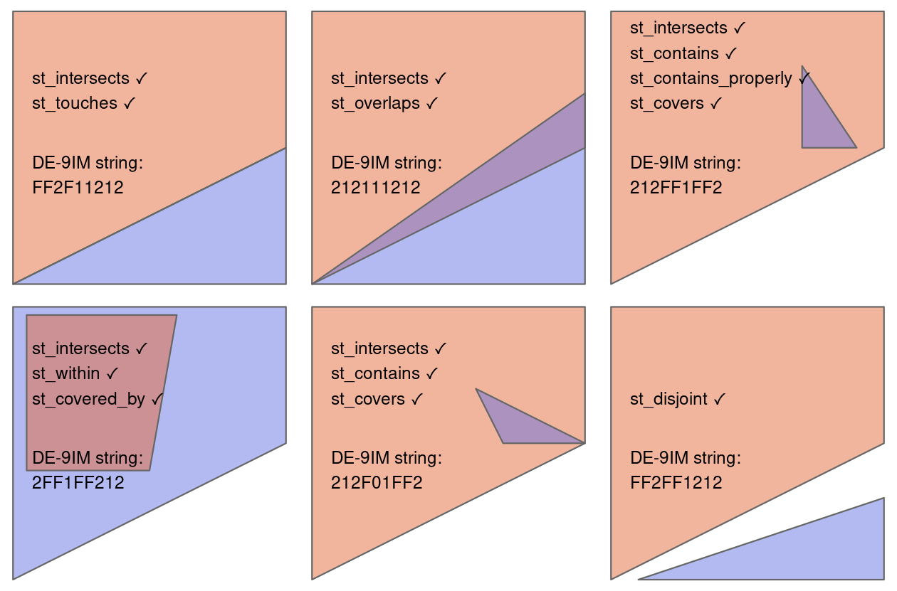
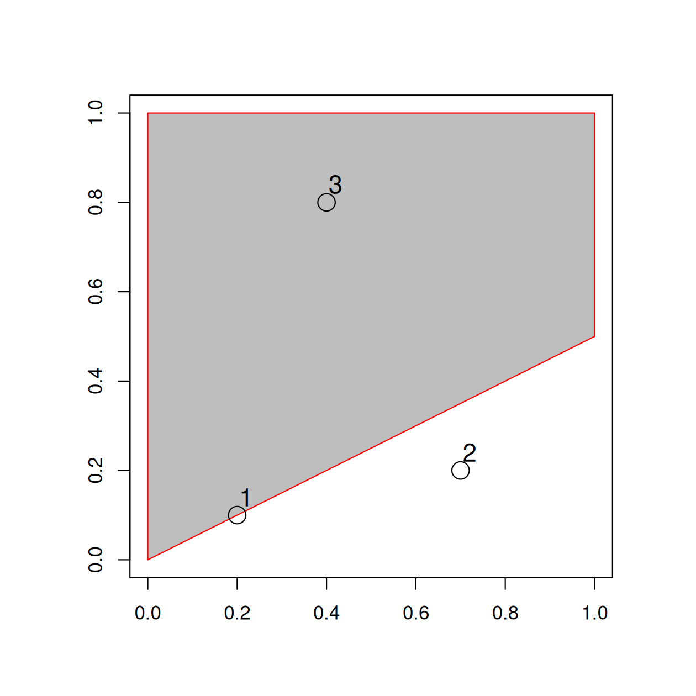
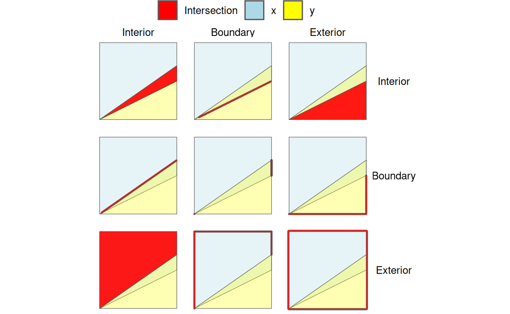
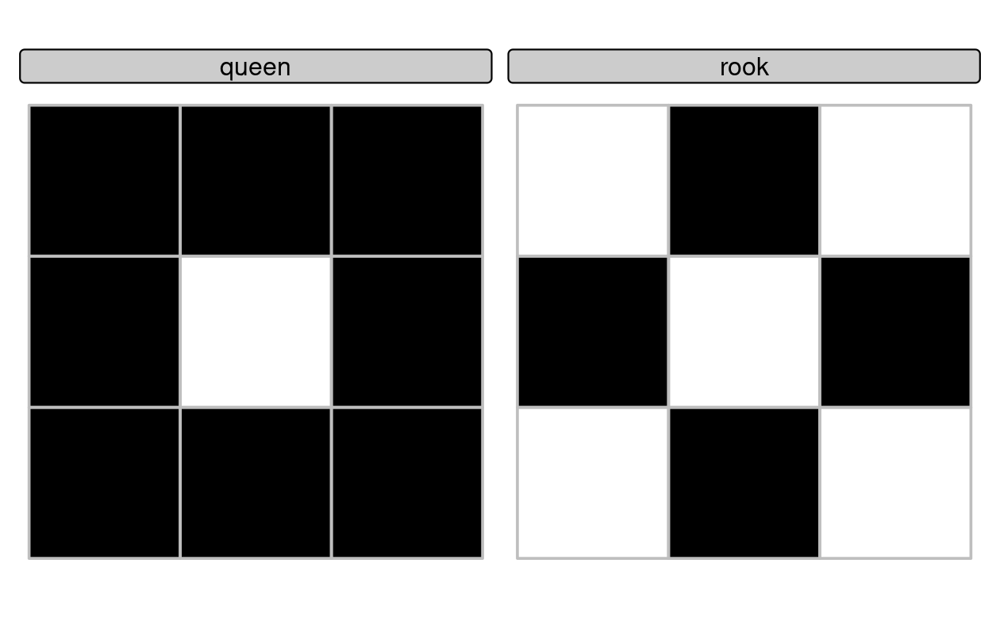
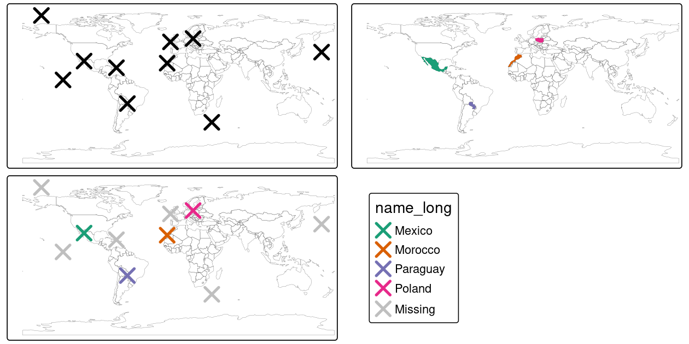
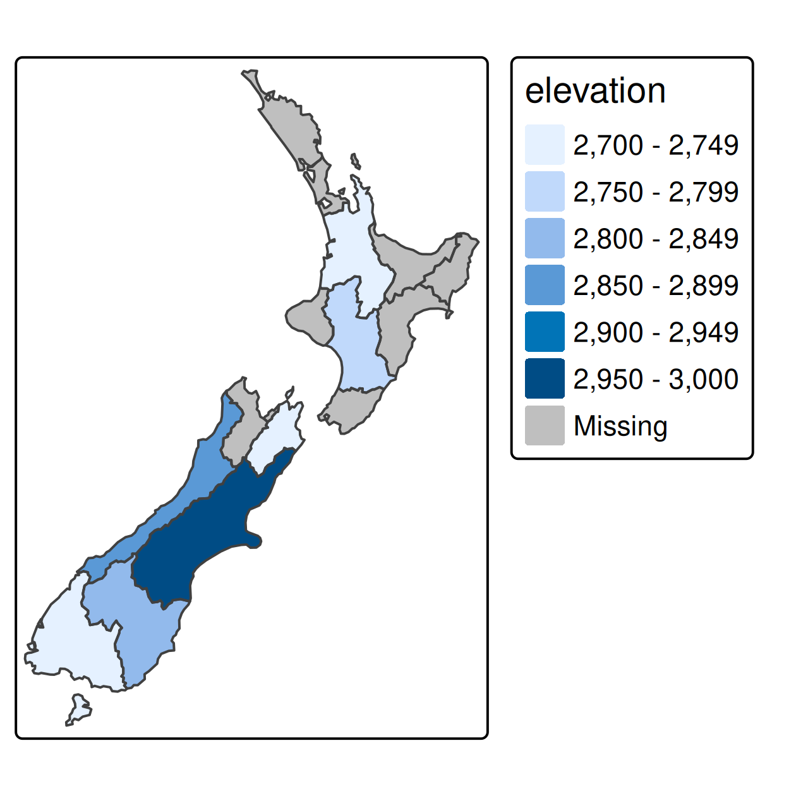
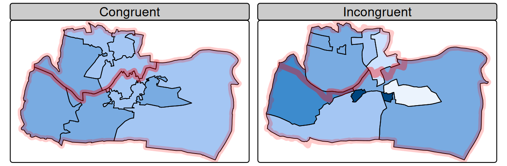

# Spatial data operations {#spatial-operations}


## Prerequisites {-}

- This chapter requires the same packages used in Chapter \@ref(attr): 


```r
library(sf)
library(terra)
library(dplyr)
library(spData)
```

## Introduction

Spatial operations, including spatial joins between vector datasets and local and focal operations on raster datasets, are a vital part of geocomputation\index{geocomputation}.
This chapter shows how spatial objects can be modified in a multitude of ways based on their location and shape.
Many spatial operations have a non-spatial (attribute) equivalent, so concepts such as subsetting and joining datasets demonstrated in the previous chapter are applicable here.
This is especially true for *vector* operations: Section \@ref(vector-attribute-manipulation) on vector attribute manipulation provides the basis for understanding its spatial counterpart, namely spatial subsetting (covered in Section \@ref(spatial-subsetting)).
Spatial joining (Sections \@ref(spatial-joining), \@ref(non-overlapping-joins) and \@ref(incongruent)) and aggregation (Section \@ref(spatial-aggr)) also have non-spatial counterparts, covered in the previous chapter.

Spatial operations differ from non-spatial operations in a number of ways, however:
spatial joins, for example, can be done in a number of ways --- including matching entities that intersect with or are within a certain distance of the target dataset --- while the attribution joins discussed in Section \@ref(vector-attribute-joining) in the previous chapter can only be done in one way (except when using fuzzy joins, as described in the documentation of the [**fuzzyjoin**](https://cran.r-project.org/package=fuzzyjoin) package).
Different *types* of spatial relationship between objects, including intersects and disjoint, are described in Sections \@ref(topological-relations) and \@ref(DE-9IM-strings).
\index{spatial operations}
Another unique aspect of spatial objects is distance: all spatial objects are related through space, and distance calculations can be used to explore the strength of this relationship, as described in the context of vector data in Section \@ref(distance-relations).

Spatial operations on raster objects include subsetting --- covered in Section \@ref(spatial-raster-subsetting).
*Map algebra* covers a range of operations that modify raster cell values, with or without reference to surrounding cell values.
The concept of map algebra, vital for many applications, is introduced in Section \@ref(map-algebra); local, focal and zonal map algebra operations are covered in sections \@ref(local-operations), \@ref(focal-operations), and \@ref(zonal-operations), respectively. 
Global map algebra operations, which generate summary statistics representing an entire raster dataset, and distance calculations on rasters, are discussed in Section \@ref(global-operations-and-distances).
Next, relation between map algebra and vector operations are discussed in Section \@ref(map-algebra-counterparts-in-vector-processing).
In the final section before the exercises (\@ref(merging-rasters)) the process of merging two raster datasets is discussed and demonstrated with reference to a reproducible example.

\BeginKnitrBlock{rmdnote}<div class="rmdnote">It is important to note that spatial operations that use two spatial objects rely on both objects having the same coordinate reference system, a topic that was introduced in Section \@ref(crs-intro) and which will be covered in more depth in Chapter \@ref(reproj-geo-data).</div>\EndKnitrBlock{rmdnote}

## Spatial operations on vector data {#spatial-vec}

This section provides an overview of spatial operations on vector geographic data represented as simple features in the **sf** package.
Section \@ref(spatial-ras) presents spatial operations on raster datasets using classes and functions from the **terra** package.

### Spatial subsetting

Spatial subsetting is the process of taking a spatial object and returning a new object containing only features that *relate* in space to another object.
Analogous to *attribute subsetting* (covered in Section \@ref(vector-attribute-subsetting)), subsets of `sf` data frames can be created with square bracket (`[`) operator using the syntax `x[y, , op = st_intersects]`, where `x` is an `sf` object from which a subset of rows will be returned, `y` is the 'subsetting object' and `, op = st_intersects` is an optional argument that specifies the topological relation (also known as the binary predicate) used to do the subsetting.
The default topological relation used when an `op` argument is not provided is `st_intersects()`: the command `x[y, ]` is identical to `x[y, , op = st_intersects]` shown above but not `x[y, , op = st_disjoint]` (the meaning of these and other topological relations is described in the next section).
The `filter()` function from the **tidyverse**\index{tidyverse (package)} can also be used but this approach is more verbose, as we will see in the examples below.
\index{vector!subsetting}
\index{spatial!subsetting}

To demonstrate spatial subsetting, we will use the `nz` and `nz_height` datasets in the **spData** package, which contain geographic data on the 16 main regions and 101 highest points in New Zealand, respectively (Figure \@ref(fig:nz-subset)), in a projected coordinate reference system.
The following code chunk creates an object representing Canterbury, then uses spatial subsetting to return all high points in the region.


```r
canterbury = nz |> filter(Name == "Canterbury")
canterbury_height = nz_height[canterbury, ]
```

<div class="figure" style="text-align: center">

<p class="caption">(\#fig:nz-subset)Illustration of spatial subsetting with red triangles representing 101 high points in New Zealand, clustered near the central Canterbuy region (left). The points in Canterbury were created with the `[` subsetting operator (highlighted in gray, right).</p>
</div>

Like attribute subsetting, the command `x[y, ]` (equivalent to `nz_height[canterbury, ]`) subsets features of a *target* `x` using the contents of a *source* object `y`.
Instead of `y` being a vector of class `logical` or `integer`, however, for spatial subsetting both `x` and `y` must be geographic objects.
Specifically, objects used for spatial subsetting in this way must have the class `sf` or `sfc`: both `nz` and `nz_height` are geographic vector data frames and have the class `sf`, and the result of the operation returns another `sf` object representing the features in the target `nz_height` object that intersect with (in this case high points that are located within) the `canterbury` region. 

Various *topological relations* can be used for spatial subsetting which determine the type of spatial relationship that features in the target object must have with the subsetting object to be selected.
These include *touches*, *crosses* or *within*, as we will see shortly in Section \@ref(topological-relations). 
The default setting `st_intersects` is a 'catch all' topological relation that will return features in the target that *touch*, *cross* or are *within* the source 'subsetting' object.
Alternative spatial operators can be specified with the `op =` argument, as demonstrated in the following command which returns the opposite of `st_intersects()`, points that do not intersect with Canterbury (see Section \@ref(topological-relations)).


```r
nz_height[canterbury, , op = st_disjoint]
```

\BeginKnitrBlock{rmdnote}<div class="rmdnote">Note the empty argument --- denoted with `, ,` --- in the preceding code chunk is included to highlight `op`, the third argument in `[` for `sf` objects.
One can use this to change the subsetting operation in many ways.
`nz_height[canterbury, 2, op = st_disjoint]`, for example, returns the same rows but only includes the second attribute column (see `` sf::`[.sf` `` and the `?sf` for details).</div>\EndKnitrBlock{rmdnote}

For many applications, this is all you'll need to know about spatial subsetting for vector data: it just works.
If you are impatient to learn about more topological relations, beyond `st_intersects()` and `st_disjoint()`, skip to the next section (\@ref(topological-relations)).
If you're interested in the details, including other ways of subsetting, read on.

Another way of doing spatial subsetting uses objects returned by topological operators.
These objects can be useful in their own right, for example when exploring the graph network of relationships between contiguous regions, but they can also be used for subsetting, as demonstrated in the code chunk below.


```r
sel_sgbp = st_intersects(x = nz_height, y = canterbury)
class(sel_sgbp)
#> [1] "sgbp" "list"
sel_sgbp
#> Sparse geometry binary predicate list of length 101, where the
#> predicate was `intersects'
#> first 10 elements:
#>  1: (empty)
#>  2: (empty)
#>  3: (empty)
#>  4: (empty)
#>  5: 1
#>  6: 1
....
sel_logical = lengths(sel_sgbp) > 0
canterbury_height2 = nz_height[sel_logical, ]
```

The above code chunk creates an object of class `sgbp` (a sparse geometry binary predicate, a list of length `x` in the spatial operation) and then converts it into a logical vector `sel_logical` (containing only `TRUE` and `FALSE` values, something that can also be used by **dplyr**'s filter function).
\index{binary predicate|seealso {topological relations}}
The function `lengths()` identifies which features in `nz_height` intersect with *any* objects in `y`.
In this case 1 is the greatest possible value but for more complex operations one could use the method to subset only features that intersect with, for example, 2 or more features from the source object.

\BeginKnitrBlock{rmdnote}<div class="rmdnote">Note: another way to return a logical output is by setting `sparse = FALSE` (meaning 'return a dense matrix not a sparse one') in operators such as `st_intersects()`. The command `st_intersects(x = nz_height, y = canterbury, sparse = FALSE)[, 1]`, for example, would return an output identical to `sel_logical`.
Note: the solution involving `sgbp` objects is more generalisable though, as it works for many-to-many operations and has lower memory requirements.</div>\EndKnitrBlock{rmdnote}

The same result can be also achieved with the **sf** function `st_filter()` which was [created](https://github.com/r-spatial/sf/issues/1148) to increase compatibility between `sf` objects and **dplyr** data manipulation code:


```r
canterbury_height3 = nz_height |>
  st_filter(y = canterbury, .predicate = st_intersects)
```


At this point, there are three identical (in all but row names) versions of `canterbury_height`, one created using the `[` operator, one created via an intermediary selection object, and another using **sf**'s convenience function `st_filter()`.
<!-- RL: commented out for now as old. Todo: if we ever update that vignette uncomment the next line. -->
<!-- To explore spatial subsetting in more detail, see the supplementary vignettes on `subsetting` and [`tidyverse-pitfalls`](https://geocompr.github.io/geocompkg/articles/) on the [geocompkg website](https://geocompr.github.io/geocompkg/articles/). -->
The next section explores different types of spatial relation, also known as binary predicates, that can be used to identify whether or not two features are spatially related or not.

### Topological relations

Topological relations describe the spatial relationships between objects.
"Binary topological relationships", to give them their full name, are logical statements (in that the answer can only be `TRUE` or `FALSE`) about the spatial relationships between two objects defined by ordered sets of points (typically forming points, lines and polygons) in two or more dimensions [@egenhofer_mathematical_1990].
That may sound rather abstract and, indeed, the definition and classification of topological relations is based on mathematical foundations first published in book form in 1966 [@spanier_algebraic_1995], with the field of algebraic topology continuing into the 21^st^ century [@dieck_algebraic_2008].

Despite their mathematical origins, topological relations can be understood intuitively with reference to visualizations of commonly used functions that test for common types of spatial relationships.
Figure \@ref(fig:relations) shows a variety of geometry pairs and their associated relations.
The third and fourth pairs in Figure \@ref(fig:relations) (from left to right and then down) demonstrate that, for some relations, order is important.
While the relations *equals*, *intersects*, *crosses*, *touches* and *overlaps* are symmetrical, meaning that if `function(x, y)` is true, `function(y, x)` will also be true, relations in which the order of the geometries are important such as *contains* and *within* are not.
Notice that each geometry pair has a "DE-9IM" string such as FF2F11212, described in the next section.
\index{topological relations}

<div class="figure" style="text-align: center">

<p class="caption">(\#fig:relations)Topological relations between vector geometries, inspired by Figures 1 and 2 in Egenhofer and Herring (1990). The relations for which the function(x, y) is true are printed for each geometry pair, with x represented in pink and y represented in blue. The nature of the spatial relationship for each pair is described by the Dimensionally Extended 9-Intersection Model string.</p>
</div>

In `sf`, functions testing for different types of topological relations are called 'binary predicates', as described in the vignette *Manipulating Simple Feature Geometries*, which can be viewed with the command [`vignette("sf3")`](https://r-spatial.github.io/sf/articles/sf3.html), and in the help page [`?geos_binary_pred`](https://r-spatial.github.io/sf/reference/geos_binary_ops.html).
To see how topological relations work in practice, let's create a simple reproducible example, building on the relations illustrated in Figure \@ref(fig:relations) and consolidating knowledge of how vector geometries are represented from a previous chapter (Section \@ref(geometry)).
Note that to create tabular data representing coordinates (x and y) of the polygon vertices, we use the base R function `cbind()` to create a matrix representing coordinates points, a `POLYGON`, and finally an `sfc` object, as described in Chapter \@ref(spatial-class):


```r
polygon_matrix = cbind(
  x = c(0, 0, 1, 1,   0),
  y = c(0, 1, 1, 0.5, 0)
)
polygon_sfc = st_sfc(st_polygon(list(polygon_matrix)))
```

We will create additional geometries to demonstrate spatial relations with the following commands which, when plotted on top of the polygon created above, relate in space to one another, as shown in Figure \@ref(fig:relation-objects).
Note the use of the function `st_as_sf()` and the argument `coords` to efficiently convert from a data frame containing columns representing coordinates to an `sf` object containing points:


```r
line_sfc = st_sfc(st_linestring(cbind(
  x = c(0.4, 1),
  y = c(0.2, 0.5)
)))
# create points
point_df = data.frame(
  x = c(0.2, 0.7, 0.4),
  y = c(0.1, 0.2, 0.8)
)
point_sf = st_as_sf(point_df, coords = c("x", "y"))
```

<div class="figure" style="text-align: center">

<p class="caption">(\#fig:relation-objects)Points, line and polygon objects arranged to illustrate topological relations.</p>
</div>

A simple query is: which of the points in `point_sf` intersect in some way with polygon `polygon_sfc`?
The question can be answered by inspection (points 1 and 3 are touching and within the polygon, respectively).
This question can be answered with the spatial predicate `st_intersects()` as follows:


```r
st_intersects(point_sf, polygon_sfc)
#> Sparse geometry binary predicate... `intersects'
#>  1: 1
#>  2: (empty)
#>  3: 1
```

The result should match your intuition:
positive (`1`) results are returned for the first and third point, and a negative result (represented by an empty vector) for the second are outside the polygon's border.
What may be unexpected is that the result comes in the form of a list of vectors.
This *sparse matrix* output only registers a relation if one exists, reducing the memory requirements of topological operations on multi-feature objects.
As we saw in the previous section, a *dense matrix* consisting of `TRUE` or `FALSE` values is returned when `sparse = FALSE`.


```r
st_intersects(point_sf, polygon_sfc, sparse = FALSE)
#>       [,1]
#> [1,]  TRUE
#> [2,] FALSE
#> [3,]  TRUE
```

In the above output each row represents a feature in the target (argument `x`) object and each column represents a feature in the selecting object (`y`).
In this case, there is only one feature in the `y` object `polygon_sfc` so the result, which can be used for subsetting as we saw in Section \@ref(spatial-subsetting), has only one column.

`st_intersects()` returns `TRUE` even in cases where the features just touch: *intersects* is a 'catch-all' topological operation which identifies many types of spatial relation, as illustrated in Figure \@ref(fig:relations).
More restrictive questions include which points lie within the polygon, and which features are on or contain a shared boundary with `y`?
These can be answered as follows (results not shown):


```r
st_within(point_sf, polygon_sfc)
st_touches(point_sf, polygon_sfc)
```

Note that although the first point *touches* the boundary polygon, it is not within it; the third point is within the polygon but does not touch any part of its border.
The opposite of `st_intersects()` is `st_disjoint()`, which returns only objects that do not spatially relate in any way to the selecting object (note `[, 1]` converts the result into a vector).


```r
st_disjoint(point_sf, polygon_sfc, sparse = FALSE)[, 1]
#> [1] FALSE  TRUE FALSE
```

The function `st_is_within_distance()` detects features that *almost touch* the selection object, which has an additional `dist` argument.
It can be used to set how close target objects need to be before they are selected.
The 'is within distance' binary spatial predicate is demonstrated in the code chunk below, the results of which show that every point is within 0.2 units of the polygon.


```r
st_is_within_distance(point_sf, polygon_sfc, dist = 0.2, sparse = FALSE)[, 1]
#> [1] TRUE TRUE TRUE
```

Note that although point 2 is more than 0.2 units of distance from the nearest vertex of `polygon_sfc`, it is still selected when the distance is set to 0.2.
This is because distance is measured to the nearest edge, in this case the part of the polygon that lies directly above point 2 in Figure \@ref(fig:relation-objects).
(You can verify the actual distance between point 2 and the polygon is 0.13 with the command `st_distance(point_sf, polygon_sfc)`.)


\BeginKnitrBlock{rmdnote}<div class="rmdnote">Functions for calculating topological relations use spatial indices to largely speed up spatial query performance.
They achieve that using the Sort-Tile-Recursive (STR) algorithm.
The `st_join` function, mentioned in the next section, also uses the spatial indexing. 
You can learn more at https://www.r-spatial.org/r/2017/06/22/spatial-index.html.</div>\EndKnitrBlock{rmdnote}


### Distance relations 

While the topological relations presented in the previous section are binary (a feature either intersects with another or does not) distance relations are continuous.
The distance between two `sf` objects is calculated with `st_distance()`, which is also used behind the scenes in Section \@ref(non-overlapping-joins) for distance-based joins.
This is illustrated in the code chunk below, which finds the distance between the highest point in New Zealand and the geographic centroid of the Canterbury region, created in Section \@ref(spatial-subsetting):
\index{sf!distance relations}


```r
nz_highest = nz_height |> slice_max(n = 1, order_by = elevation)
canterbury_centroid = st_centroid(canterbury)
st_distance(nz_highest, canterbury_centroid)
#> Units: [m]
#>        [,1]
#> [1,] 115540
```

There are two potentially surprising things about the result:

- It has `units`, telling us the distance is 100,000 meters, not 100,000 inches, or any other measure of distance
- It is returned as a matrix, even though the result only contains a single value

This second feature hints at another useful feature of `st_distance()`, its ability to return *distance matrices* between all combinations of features in objects `x` and `y`.
This is illustrated in the command below, which finds the distances between the first three features in `nz_height` and the Otago and Canterbury regions of New Zealand represented by the object `co`.


```r
co = filter(nz, grepl("Canter|Otag", Name))
st_distance(nz_height[1:3, ], co)
#> Units: [m]
#>        [,1]  [,2]
#> [1,] 123537 15498
#> [2,]  94283     0
#> [3,]  93019     0
```

Note that the distance between the second and third features in `nz_height` and the second feature in `co` is zero.
This demonstrates the fact that distances between points and polygons refer to the distance to *any part of the polygon*:
The second and third points in `nz_height` are *in* Otago, which can be verified by plotting them (result not shown):


```r
plot(st_geometry(co)[2])
plot(st_geometry(nz_height)[2:3], add = TRUE)
```

### DE-9IM strings {#DE-9IM-strings}

Underlying the binary predicates demonstrated in the previous section is the Dimensionally Extended 9-Intersection Model (DE-9IM).
As the cryptic name suggests, this is not an easy topic to understand, but it is worth knowing about because it underlies many spatial operations and enables the creation of custom spatial predicates.
The model was originally labelled "DE + 9IM" by its inventors, referring to the "dimension of the intersections of boundaries, interiors, and exteriors of two features" [@clementini_comparison_1995], but is now referred to as DE-9IM [@shen_classification_2018].
DE-9IM is applicable to 2-dimensional objects (points, lines and polygons) in Euclidean space, meaning that the model (and software implementing it such as GEOS) assumes you are working with data in a projected coordinate reference system, described in Chapter \@ref(reproj-geo-data).


To demonstrate how DE-9IM strings work, let's take a look at the various ways that the first geometry pair in Figure \@ref(fig:relations) relate.
Figure \@ref(fig:de9imgg) illustrates the 9 intersection model (9IM) which shows the intersections between every combination of each object's interior, boundary and exterior: when each component of the first object `x` is arranged as columns and each component of `y` is arranged as rows, a facetted graphic is created with the intersections between each element highlighted.

<div class="figure" style="text-align: center">

<p class="caption">(\#fig:de9imgg)Illustration of how the Dimensionally Extended 9 Intersection Model (DE-9IM) works. Colors not in the legend represent the overlap between different components. The thick lines highlight 2 dimensional intesections, e.g., between the boundary of object x and the interior of object y, shown in the middle top facet.</p>
</div>

DE-9IM strings are derived from the dimension of each type of relation.
In this case the red intersections in Figure \@ref(fig:de9imgg) have dimensions of 0 (points), 1 (lines), and 2 (polygons), as shown in Table \@ref(tab:de9emtable).


Table: (\#tab:de9emtable)Table showing relations between interiors, boundaries and exteriors of geometries x and y.

|             |Interior (x) |Boundary (x) |Exterior (x) |
|:------------|:------------|:------------|:------------|
|Interior (y) |2            |1            |2            |
|Boundary (y) |1            |1            |1            |
|Exterior (y) |2            |1            |2            |


Flattening this matrix 'row-wise' (meaning concatenating the first row, then the second, then the third) results in the string `212111212`.
Another example will serve to demonstrate the system:
the relation shown in Figure \@ref(fig:relations) (the third polygon pair in the third column and 1st row) can be defined in the DE-9IM system as follows:

- The intersections between the *interior* of the larger object `x` and the interior, boundary and exterior of `y` have dimensions of 2, 1 and 2 respectively
- The intersections between the *boundary* of the larger object `x` and the interior, boundary and exterior of `y` have dimensions of F, F and 1 respectively, where 'F' means 'false', the objects are disjoint
- The intersections between the *exterior* of `x` and the interior, boundary and exterior of `y` have dimensions of F, F and 2 respectively: the exterior of the larger object does not touch the interior or boundary of `y`, but the exterior of the smaller and larger objects cover the same area

These three components, when concatenated, create the string `212`, `FF1`, and `FF2`.
This is the same as the result obtained from the function `st_relate()` (see the source code of this chapter to see how other geometries in Figure \@ref(fig:relations) were created):


```r
xy2sfc = function(x, y) st_sfc(st_polygon(list(cbind(x, y))))
x = xy2sfc(x = c(0, 0, 1, 1, 0), y = c(0, 1, 1, 0.5, 0))
y = xy2sfc(x = c(0.7, 0.7, 0.9, 0.7), y = c(0.8, 0.5, 0.5, 0.8))
st_relate(x, y)
#>      [,1]       
#> [1,] "212FF1FF2"
```

Understanding DE-9IM strings allows new binary spatial predicates to be developed.
The help page `?st_relate` contains function definitions for 'queen' and 'rook' relations in which polygons share a border or only a point, respectively.
'Queen' relations mean that 'boundary-boundary' relations (the cell in the second column and the second row in Table \@ref(tab:de9emtable), or the 5th element of the DE-9IM string) must not be empty, corresponding to the pattern `F***T****`, while for 'rook' relations the same element must be 1 (meaning a linear intersection).
These are implemented as follows:


```r
st_queen = function(x, y) st_relate(x, y, pattern = "F***T****")
st_rook = function(x, y) st_relate(x, y, pattern = "F***1****")
```

Building on the object `x` created previously, we can use the newly created functions to find out which elements in the grid are a 'queen' and 'rook' in relation to the middle square of the grid as follows:


```r
grid = st_make_grid(x, n = 3)
grid_sf = st_sf(grid)
grid_sf$queens = lengths(st_queen(grid, grid[5])) > 0
plot(grid, col = grid_sf$queens)
grid_sf$rooks = lengths(st_rook(grid, grid[5])) > 0
plot(grid, col = grid_sf$rooks)
```

<div class="figure" style="text-align: center">

<p class="caption">(\#fig:queens)Demonstration of custom binary spatial predicates for finding 'queen' (left) and 'rook' (right) relations to the central square in a grid with 9 geometries.</p>
</div>

<!-- Another of a custom binary spatial predicate is 'overlapping lines' which detects lines that overlap for some or all of another line's geometry. -->
<!-- This can be implemented as follows, with the pattern signifying that the intersection between the two line interiors must be a line: -->


### Spatial joining 

Joining two non-spatial datasets relies on a shared 'key' variable, as described in Section \@ref(vector-attribute-joining).
Spatial data joining applies the same concept, but instead relies on spatial relations, described in the previous section.
As with attribute data, joining adds new columns to the target object (the argument `x` in joining functions), from a source object (`y`).
\index{join!spatial}
\index{spatial!join}

The process is illustrated by the following example: imagine you have ten points randomly distributed across the Earth's surface and you ask, for the points that are on land, which countries are they in?
Implementing this idea in a [reproducible example](https://github.com/geocompx/geocompr/blob/main/code/04-spatial-join.R) will build your geographic data handling skills and show how spatial joins work.
The starting point is to create points that are randomly scattered over the Earth's surface.


```r
set.seed(2018) # set seed for reproducibility
(bb = st_bbox(world)) # the world's bounds
#>   xmin   ymin   xmax   ymax 
#> -180.0  -89.9  180.0   83.6
random_df = data.frame(
  x = runif(n = 10, min = bb[1], max = bb[3]),
  y = runif(n = 10, min = bb[2], max = bb[4])
)
random_points = random_df |> 
  st_as_sf(coords = c("x", "y"), crs = "EPSG:4326") # set coordinates and CRS
```

The scenario illustrated in Figure \@ref(fig:spatial-join) shows that the `random_points` object (top left) lacks attribute data, while the `world` (top right) has attributes, including country names shown for a sample of countries in the legend.
Spatial joins are implemented with `st_join()`, as illustrated in the code chunk below.
The output is the `random_joined` object which is illustrated in Figure \@ref(fig:spatial-join) (bottom left).
Before creating the joined dataset, we use spatial subsetting to create `world_random`, which contains only countries that contain random points, to verify the number of country names returned in the joined dataset should be four (Figure \@ref(fig:spatial-join), top right panel).


```r
world_random = world[random_points, ]
nrow(world_random)
#> [1] 4
random_joined = st_join(random_points, world["name_long"])
```

<div class="figure" style="text-align: center">

<p class="caption">(\#fig:spatial-join)Illustration of a spatial join. A new attribute variable is added to random points (top left) from source world object (top right) resulting in the data represented in the final panel.</p>
</div>

By default, `st_join()` performs a left join, meaning that the result is an object containing all rows from `x` including rows with no match in `y` (see Section \@ref(vector-attribute-joining)), but it can also do inner joins by setting the argument `left = FALSE`.
Like spatial subsetting, the default topological operator used by `st_join()` is `st_intersects()`, which can be changed by setting the `join` argument (see `?st_join` for details).
The example above demonstrates the addition of a column from a polygon layer to a point layer, but the approach works regardless of geometry types.
In such cases, for example when `x` contains polygons, each of which match multiple objects in `y`, spatial joins will result in duplicate features by creating a new row for each match in `y`.

### Distance-based joins {#non-overlapping-joins}

Sometimes two geographic datasets do not intersect but still have a strong geographic relationship due to their proximity.
The datasets `cycle_hire` and `cycle_hire_osm`, already attached in the **spData** package, provide a good example.
Plotting them shows that they are often closely related but they do not touch, as shown in Figure \@ref(fig:cycle-hire), a base version of which is created with the following code below:
\index{join!non-overlapping}


```r
plot(st_geometry(cycle_hire), col = "blue")
plot(st_geometry(cycle_hire_osm), add = TRUE, pch = 3, col = "red")
```

We can check if any points are the same using `st_intersects()` as shown below:


```r
any(st_intersects(cycle_hire, cycle_hire_osm, sparse = FALSE))
#> [1] FALSE
```


<div class="figure" style="text-align: center">

```{=html}
<div class="leaflet html-widget html-fill-item" id="htmlwidget-9580c84d0c32f0a22a8c" style="width:100%;height:389.34px;"></div>
<script type="application/json" data-for="htmlwidget-9580c84d0c32f0a22a8c">{"x":{"options":{"crs":{"crsClass":"L.CRS.EPSG3857","code":null,"proj4def":null,"projectedBounds":null,"options":{}}},"calls":[{"method":"addCircles","args":[[51.52916347,51.49960695,51.52128377,51.53005939,51.49313,51.51811784,51.53430039,51.52834133,51.5073853,51.50597426,51.52395143,51.52168078,51.51991453,51.52994371,51.51772703,51.52635795,51.5216612,51.51477076,51.52505093,51.52773634,51.53007835,51.5222641,51.51943538,51.51908011,51.5288338,51.52728093,51.51382102,51.52351808,51.513735,51.52915444,51.52953709,51.52469624,51.5341235,51.50173726,51.49159394,51.4973875,51.5263778,51.52127071,51.52001715,51.53099181,51.52026,51.51073687,51.522511,51.507131,51.52334476,51.51248445,51.50706909,51.52867339,51.52671796,51.52295439,51.5099923,51.52174785,51.51707521,51.52058381,51.52334672,51.52452699,51.53176825,51.52644828,51.49738251,51.4907579,51.53089041,51.50946212,51.52522753,51.51795029,51.51882555,51.52059681,51.5262363,51.53136059,51.5154186,51.52352001,51.52572618,51.48591714,51.53219984,51.52559505,51.52341837,51.52486887,51.50069361,51.52025302,51.514274,51.50963938,51.51593725,51.50064702,51.48947903,51.51646835,51.51858757,51.5262503,51.53301907,51.49368637,51.49889832,51.53440868,51.49506109,51.5208417,51.53095071,51.49792478,51.52554222,51.51457763,51.49043573,51.51155322,51.51340693,51.50472376,51.51159481,51.51552971,51.51410514,51.52600832,51.49812559,51.51563144,51.53304322,51.5100172,51.51580998,51.49646288,51.52451738,51.51423368,51.51449962,51.49288067,51.49582705,51.52589324,51.51573534,51.51891348,51.52111369,51.52836014,51.49654462,51.50069491,51.51782144,51.51700801,51.49536226,51.5118973,51.50950627,51.53300545,51.52364804,51.50136494,51.504904,51.52326004,51.51196176,51.49087475,51.51227622,51.49488108,51.52096262,51.51530805,51.49372451,51.4968865,51.48894022,51.50074359,51.48836528,51.51494305,51.49211134,51.48478899,51.49705603,51.51213691,51.49217002,51.51183419,51.50379168,51.49586666,51.49443626,51.50039792,51.49085368,51.51461995,51.50663341,51.49234577,51.51760685,51.4931848,51.515607,51.517932,51.50185512,51.49395092,51.50040123,51.51474612,51.52784273,51.4916156,51.49121192,51.50486,51.512529,51.52174384,51.51791921,51.49616092,51.48985626,51.5129118,51.49941247,51.52202903,51.52071513,51.48805753,51.51733558,51.49247977,51.5165179,51.53166681,51.48997562,51.50311799,51.51251523,51.50581776,51.50462759,51.50724437,51.50368837,51.50556905,51.51048489,51.51492456,51.5225965,51.51236389,51.51821864,51.52659961,51.518144,51.518154,51.50135267,51.52505151,51.49358391,51.51681444,51.49464523,51.50658458,51.50274025,51.52683806,51.51906932,51.49094565,51.51615461,51.48971651,51.49016361,51.49066456,51.49481649,51.50275704,51.49148474,51.51476963,51.50935342,51.50844614,51.52891573,51.50742485,51.50654321,51.50669284,51.49396755,51.51501025,51.50777049,51.53450449,51.49571828,51.51838043,51.5084448,51.5233534,51.52443845,51.50545935,51.52200801,51.49096258,51.51611887,51.4853572,51.52285301,51.530052,51.50645179,51.49859784,51.489932,51.518908,51.5046364,51.53404294,51.53051587,51.52557531,51.51362054,51.52248185,51.50143293,51.50494561,51.5136846,51.5134891,51.49874469,51.51422502,51.52644342,51.51595344,51.50102668,51.49206037,51.49320445,51.50082346,51.4863434,51.53583617,51.50144456,51.50613324,51.49671237,51.52004497,51.50930161,51.50315739,51.5034938,51.51862243,51.490083,51.49580589,51.51906446,51.49914063,51.5272947,51.52367314,51.49236962,51.50923022,51.51678023,51.48483991,51.49888404,51.49815779,51.488226,51.50029631,51.49363156,51.49612799,51.50227992,51.49398524,51.50501351,51.51475963,51.466907,51.50295379,51.51211869,51.48677988,51.51816295,51.50990837,51.49907558,51.50963123,51.4908679,51.51918144,51.53088935,51.51734403,51.50088934,51.52536703,51.49768448,51.49679128,51.51004801,51.52702563,51.49357351,51.49785559,51.526293,51.523196,51.49652013,51.50908747,51.53266186,51.53114,51.53095,51.53589283,51.51641749,51.52085887,51.49334336,51.50860544,51.505044,51.51196803,51.504942,51.51108452,51.51175646,51.5333196,51.51444134,51.50810309,51.53692216,51.528246,51.48802358,51.50013942,51.51217033,51.51196,51.5017154373867,51.529423,51.486965,51.49459148,51.506767,51.486575,51.494412,51.520994,51.51643491,51.49782999,51.49675303,51.50391972,51.536264,51.5291212008901,51.519656,51.530344,51.5109192966489,51.5173721,51.50024195,51.520205,51.49775,51.515208,51.49980661,51.50402793,51.50194596,51.49188409,51.50535447,51.49559291,51.51431171,51.50686435,51.51953043,51.50935171,51.51310333,51.496481,51.51352755,51.49369988,51.51070161,51.51013066,51.521776,51.51066202,51.49942855,51.51733427,51.524826,51.492462,51.51809,51.51348,51.502319,51.52261762,51.517703,51.528187,51.52289229,51.51689296,51.50204238,51.49418566,51.512303,51.51222,51.51994326,51.493146,51.519968,51.49337264,51.488105,51.485821,51.504043,51.504044,51.49456127,51.490491,51.533379,51.493072,51.51397065,51.499917,51.48902,51.534474,51.496957,51.524564,51.488852,51.51824,51.488124,51.5338,51.483145,51.495656,51.510101,51.515256,51.52568,51.52388,51.528936,51.493381,51.50623,51.511088,51.515975,51.504719,51.505697,51.508447,51.487679,51.49447,51.538071,51.542138,51.504749,51.535179,51.516196,51.516,51.541603,51.534776,51.51417,51.53558,51.534464,51.523538,51.521564,51.513757,51.530535,51.533283,51.529452,51.496137,51.498125,51.499041,51.489096,51.49109,51.521889,51.527152,51.5128711,51.487129,51.509843,51.51328,51.528828,51.531127,51.525645,51.511811,51.506946,51.513074,51.508622,51.522507,51.524677,51.50196,51.528169,51.52512,51.527058,51.519265,51.522561,51.502635,51.520893,51.496454,51.520398,51.517475,51.528692,51.519362,51.517842,51.509303,51.511066,51.532091,51.5142228,51.516204,51.500088,51.5112,51.532513,51.528224,51.518811,51.526041,51.534137,51.525941,51.51549,51.511654,51.504714,51.503143,51.503802,51.507326,51.486892,51.508896,51.530326,51.50357,51.528222,51.531864,51.537349,51.51793,51.508981,51.531091,51.528302,51.506613,51.514115,51.509591,51.526153,51.539957,51.517428,51.509474,51.498386,51.49605,51.521564,51.503447,51.511542,51.535678,51.513548,51.502661,51.51601,51.493978,51.501391,51.511624,51.518369,51.51746,51.499286,51.509943,51.521905,51.509158,51.51616,51.53213,51.503083,51.506256,51.539099,51.485587,51.53356,51.497304,51.528869,51.527607,51.511246,51.48692917,51.497622,51.51244,51.490645,51.50964,51.52959,51.487196,51.53256,51.506093,51.5171,51.531066,51.513875,51.493267,51.472817,51.473471,51.494499,51.485743,51.481747,51.514767,51.472993,51.477839,51.538792,51.520331,51.504199,51.468814,51.491093,51.46512358,51.48256792,51.50646524,51.46925984,51.50403821,51.47817208,51.4768851,51.48102131,51.47107905,51.47625965,51.4737636,51.47518024,51.46086446,51.50748124,51.46193072,51.4729184,51.47761941,51.48438657,51.4687905,51.46881971,51.45995384,51.47073264,51.4795017,51.47053858,51.48959104,51.49434708,51.48606206,51.46706414,51.45787019,51.46663393,51.48357068,51.47286577,51.49824168,51.46916161,51.5190427,51.48373225,51.50173215,51.49886563,51.50035306,51.46904022,51.48180515,51.51687069,51.48089844,51.51148696,51.47084722,51.48267821,51.48294452,51.46841875,51.4996806,51.47729232,51.46437067,51.49087074,51.51632095,51.48498496,51.51323001,51.474376,51.46108367,51.49610093,51.5015946,51.49422354,51.47614939,51.46718562,51.475089,51.4646884,51.46517078,51.53546778,51.46348914,51.47787084,51.46866929,51.46231278,51.47453545,51.47768469,51.47303687,51.48810829,51.46506424,51.45475251,51.46067005,51.48814438,51.49760804,51.46095151,51.45922541,51.47047503,51.47946386,51.54211855,51.464786,51.53638435,51.48728535,51.53639219,51.53908372,51.5366541,51.47696496,51.47287627,51.52868155,51.51505991,51.45682071,51.45971528,51.50215353,51.49021762,51.46161068,51.46321128,51.47439218,51.48335692,51.51854104,51.54100708,51.47311696,51.51563007,51.51542791,51.53658514,51.53571683,51.53642464,51.48724429,51.53603947,51.52458353,51.46822047,51.45799126,51.47732253,51.47505096,51.47569809,51.46199911,51.47893931,51.49208492,51.47727637,51.50630441,51.50542628,51.46230566,51.46489445,51.47993289,51.47514228,51.48176572,51.51092871,51.5129814,51.51510818,51.46079243,51.46745485,51.47816972,51.4795738,51.48796408,51.53727795,51.53932857,51.4710956,51.51612862,51.45816465,51.49263658,51.5129006,51.48512191,51.47515398,51.48795853,51.51787005,51.52456169,51.52526975,51.48321729,51.50070305,51.52059714,51.46239255,51.46760141,51.45752945,51.45705988,51.46134382,51.473611,51.491026,51.509224,51.47250956,51.511891,51.470131,51.496664,51.460333,51.4619230679],[-0.109970527,-0.197574246,-0.084605692,-0.120973687,-0.156876,-0.144228881,-0.1680743,-0.170134484,-0.09644075100000001,-0.092754157,-0.122502346,-0.130431727,-0.136039674,-0.123616824,-0.127854211,-0.125979294,-0.109006325,-0.12221963,-0.131161087,-0.135273468,-0.13884627,-0.114079481,-0.119123345,-0.124678402,-0.132250369,-0.11829517,-0.107927706,-0.143613641,-0.193487,-0.093421615,-0.08335332300000001,-0.084439283,-0.129386874,-0.184980612,-0.192369256,-0.197245586,-0.07813092100000001,-0.0755789,-0.08391116799999999,-0.093903825,-0.157183945,-0.144165239,-0.162298,-0.06691,-0.183846408,-0.099141408,-0.145904427,-0.08745937600000001,-0.104298194,-0.094934859,-0.143495266,-0.09447507199999999,-0.086685542,-0.154701411,-0.120202614,-0.079248081,-0.114329032,-0.172190727,-0.089446947,-0.106323685,-0.089782579,-0.124749274,-0.13518856,-0.108657431,-0.108028472,-0.116688468,-0.134407652,-0.117069978,-0.098850915,-0.108340165,-0.08848618799999999,-0.124469948,-0.105480698,-0.144083893,-0.124121774,-0.099489485,-0.102091246,-0.141327271,-0.111257,-0.131510949,-0.111778348,-0.078600401,-0.115156562,-0.079684557,-0.132053392,-0.123509611,-0.139174593,-0.111014912,-0.100440521,-0.109025404,-0.08581448899999999,-0.09734016199999999,-0.078505384,-0.183834706,-0.138231303,-0.158264483,-0.122806861,-0.0929401,-0.076793375,-0.192538767,-0.07712132200000001,-0.190240716,-0.147301667,-0.096317627,-0.132102166,-0.132328837,-0.172528678,-0.157275636,-0.105270275,-0.183289032,-0.158963647,-0.07353765399999999,-0.141423695,-0.114934001,-0.13547809,-0.090847761,-0.093080779,-0.156166631,-0.078869751,-0.104724625,-0.150905245,-0.094524319,-0.096496865,-0.09388536,-0.185296516,-0.137043852,-0.07545948199999999,-0.136792671,-0.074754872,-0.191462381,-0.06797,-0.104708922,-0.097441687,-0.153319609,-0.157436972,-0.117974901,-0.085634242,-0.147203711,-0.198286569,-0.161203828,-0.111435796,-0.202759212,-0.129361842,-0.11614642,-0.138364847,-0.110683213,-0.168917077,-0.201554966,-0.101536865,-0.174292825,-0.11282408,-0.191933711,-0.092921165,-0.193068385,-0.196170309,-0.137841333,-0.131773845,-0.141334487,-0.121328408,-0.167894973,-0.183118788,-0.183716959,-0.159237081,-0.147624377,-0.195455928,-0.165164288,-0.108068155,-0.186753859,-0.173715911,-0.113001,-0.115163,-0.08111889999999999,-0.188098863,-0.140947636,-0.141923621,-0.153645496,-0.152317537,-0.165842551,-0.14521173,-0.140741432,-0.175810943,-0.178433004,-0.164393768,-0.109914711,-0.132845681,-0.153520935,-0.133201961,-0.100186337,-0.091773776,-0.106237501,-0.098497684,-0.111606696,-0.082989638,-0.06607803700000001,-0.161113413,-0.06954201,-0.100791005,-0.112432615,-0.06275,-0.062697,-0.153194766,-0.166304359,-0.165101392,-0.151926305,-0.158105512,-0.199004026,-0.149569201,-0.130504336,-0.088285377,-0.181190899,-0.08242239899999999,-0.170194408,-0.19039362,-0.166485083,-0.13045856,-0.155349725,-0.090220911,-0.188129731,-0.196422,-0.131961389,-0.115480888,-0.134621209,-0.123179697,-0.103137426,-0.17873226,-0.112753217,-0.130699733,-0.106992706,-0.110889274,-0.073438925,-0.067176443,-0.175116099,-0.138019439,-0.10569204,-0.151359288,-0.139625122,-0.128585022,-0.142207481,-0.099994052,-0.168314,-0.170279555,-0.096191134,-0.162727,-0.079249,-0.116542278,-0.08637971699999999,-0.106408455,-0.179592915,-0.116764211,-0.154907218,-0.178656971,-0.123247648,-0.135580879,-0.191351186,-0.103132904,-0.08066008299999999,-0.109256828,-0.169249375,-0.180246101,-0.132224622,-0.144132875,-0.089740764,-0.122492418,-0.156285395,-0.110699309,-0.114686385,-0.20528437,-0.09217644699999999,-0.084985356,-0.191496313,-0.07962099,-0.176645823,-0.162418,-0.127575233,-0.059642081,-0.112031483,-0.174653609,-0.128377673,-0.147478734,-0.151296092,-0.175488803,-0.138089062,-0.165471605,-0.209494128,-0.135635511,-0.092762704,-0.190603326,-0.106000855,-0.074189225,-0.136928582,-0.172729559,-0.148105415,-0.216573,-0.158456089,-0.16209757,-0.115853961,-0.135025698,-0.187842717,-0.08566631600000001,-0.119047563,-0.116911864,-0.140485596,-0.176770502,-0.138072691,-0.08315935200000001,-0.153463612,-0.141943703,-0.093913472,-0.138846453,-0.08854277100000001,-0.139956043,-0.081608045,-0.07395500000000001,-0.083067,-0.101384068,-0.129697889,-0.099981142,-0.086016,-0.085603,-0.160854428,-0.179135079,-0.089887855,-0.194757949,-0.193764092,-0.115851,-0.120718759,-0.115533,-0.197524944,-0.119643424,-0.111781191,-0.087587447,-0.12602103,-0.150181444,-0.10102611,-0.166878535,-0.113936001,-0.150481272,-0.142783033,-0.1798541843891,-0.097122,-0.116625,-0.134234258,-0.123702,-0.117286,-0.173881,-0.139016,-0.124332175,-0.135440826,-0.138733562,-0.11342628,-0.133952,-0.171185284853,-0.132339,-0.100168,-0.1511263847351,-0.1642075,-0.15934065,-0.174593,-0.10988,-0.117863,-0.176415994,-0.11386435,-0.194392952,-0.125674815,-0.113656543,-0.179077626,-0.200838199,-0.150666888,-0.13577731,-0.14744969,-0.13121385,-0.192404,-0.130110822,-0.121394101,-0.121723604,-0.155757901,-0.068856,-0.142345694,-0.179702476,-0.103604248,-0.176268,-0.159919,-0.163609,-0.17977,-0.200742,-0.071653961,-0.154106,-0.075375,-0.171681991,-0.158249929,-0.184400221,-0.18267094,-0.159988,-0.160785,-0.170704337,-0.099828,-0.169774,-0.09968067,-0.110121,-0.149004,-0.105312,-0.104778,-0.15393398,-0.149186,-0.139159,-0.129925,-0.09294031,-0.174554,-0.17524,-0.122203,-0.173894,-0.116279,-0.105593,-0.11655,-0.120903,-0.118677,-0.113134,-0.114605,-0.211358,-0.058641,-0.055312,-0.06507599999999999,-0.055894,-0.007542,-0.02296,-0.057159,-0.053177,-0.063531,-0.07054199999999999,-0.055167,-0.021582,-0.014409,-0.144664,-0.145393,-0.057544,-0.03338,-0.029138,-0.038775,-0.138853,-0.071881,-0.052099,-0.08248999999999999,-0.07634100000000001,-0.030556,-0.022694,-0.020467,-0.025492,-0.028155,-0.027616,-0.019355,-0.011457,-0.020157,-0.009205,-0.018716,-0.04667,-0.058005,-0.0389866,-0.009001,-0.02377,-0.047784,-0.013258,-0.048017,-0.06954299999999999,-0.025626,-0.058681,-0.064094,-0.06500599999999999,-0.041378,-0.03562,-0.016251,-0.018703,-0.015578,-0.025296,-0.021345,-0.054883,-0.022702,-0.051394,-0.009506000000000001,-0.026768,-0.07585500000000001,-0.059091,-0.074431,-0.090075,-0.025996,-0.053558,-0.06142,-0.055656,-0.155525,-0.211316,-0.014438,-0.033085,-0.037471,-0.011662,-0.047218,-0.037366,-0.036017,-0.013475,-0.179668,-0.014293,-0.008428,-0.215808,-0.145827,-0.170983,-0.012413,-0.042744,-0.020068,-0.069743,-0.066035,-0.147154,-0.067937,-0.00699,-0.075901,-0.144466,-0.142844,-0.033828,-0.204666,-0.102208,-0.145246,-0.107987,-0.002275,-0.107913,-0.104193,-0.039264,-0.016233,-0.056667,-0.062546,-0.005659,-0.021596,-0.0985,-0.127554,-0.205991,-0.205921,-0.043371,-0.12335,-0.009152,-0.117619,-0.063386,-0.224103,-0.18697,-0.08298999999999999,-0.017676,-0.218337,-0.141728,-0.18119,-0.09315,-0.022793,-0.047548,-0.057133,-0.09305099999999999,-0.102996299,-0.125978,-0.19096,-0.014582,-0.08497,-0.0801,-0.179369,-0.16862,-0.2242237,-0.18377,-0.11934,-0.117774,-0.21985,-0.199783,-0.20782,-0.228188,-0.223616,-0.124642,-0.225787,-0.133972,-0.116493,-0.138535,-0.163667,-0.210941,-0.210279,-0.216493,-0.157788279,-0.172078187,-0.208486599,-0.141812513,-0.217400093,-0.144690541,-0.215895601,-0.209973497,-0.207842908,-0.193254007,-0.197010096,-0.167160736,-0.187427294,-0.205535908,-0.180791784,-0.132102704,-0.149551631,-0.20481514,-0.158230901,-0.184318843,-0.190184054,-0.126994068,-0.141770709,-0.163041605,-0.209378594,-0.215804559,-0.214428378,-0.193502076,-0.174691623,-0.169821175,-0.202038682,-0.148059277,-0.117495865,-0.174485792,-0.204764421,-0.223852256,-0.100292412,-0.137424571,-0.217515071,-0.19627483,-0.18027465,-0.213872396,-0.183853573,-0.218190203,-0.17070367,-0.117661574,-0.219346128,-0.199135704,-0.221791552,-0.16478637,-0.174619404,-0.206029743,-0.202608612,-0.167919869,-0.211593602,-0.155442787,-0.191722864,-0.208158259,-0.222293381,-0.236769936,-0.1232585,-0.152248582,-0.201968,-0.173656546,-0.18038939,-0.11619105,-0.182126248,-0.126874471,-0.146544642,-0.211468596,-0.170210533,-0.170329317,-0.214749808,-0.22660621,-0.163750945,-0.195197203,-0.198735357,-0.222456468,-0.21145598,-0.20066766,-0.180884959,-0.152130083,-0.195777222,-0.028941601,-0.215618902,-0.102757578,-0.217995921,-0.112721065,-0.070329419,-0.07023031,-0.174347066,-0.176267008,-0.06555032099999999,-0.10534448,-0.202802098,-0.212145939,-0.083632928,-0.215087092,-0.21614583,-0.215550761,-0.163347594,-0.216305546,-0.034903714,-0.14326094,-0.137235175,-0.049067243,-0.02356501,-0.07588568599999999,-0.060291813,-0.054162264,-0.205279052,-0.026262677,-0.058631453,-0.190346493,-0.184806157,-0.138748723,-0.150908371,-0.20587627,-0.206240805,-0.208485293,-0.229116862,-0.189210466,-0.087262995,-0.150817316,-0.175407201,-0.17302926,-0.19411695,-0.187278987,-0.185273723,-0.214594781,-0.219486603,-0.208565479,-0.212607684,-0.172293499,-0.18243547,-0.17903854,-0.161765173,-0.079201849,-0.07428467499999999,-0.157850096,-0.120909408,-0.20600248,-0.234094148,-0.214762686,-0.174971902,-0.159169801,-0.187404506,-0.201005397,-0.165668686,-0.163795009,-0.211860644,-0.129698963,-0.032566533,-0.16829214,-0.20682737,-0.192165613,-0.200806304,-0.159322467,-0.191803,-0.209121,-0.216016,-0.122831913,-0.107349,-0.20464,-0.223868,-0.167029,-0.165297856693],10,null,null,{"interactive":true,"className":"","stroke":true,"color":"#03F","weight":5,"opacity":0.5,"fill":true,"fillColor":"#03F","fillOpacity":0.2},null,null,null,{"interactive":false,"permanent":false,"direction":"auto","opacity":1,"offset":[0,0],"textsize":"10px","textOnly":false,"className":"","sticky":true},null,null]},{"method":"addCircles","args":[[51.52912521362305,51.53401565551758,51.52729034423828,51.52582931518555,51.53001403808594,51.52594375610352,51.52664947509766,51.52085876464844,51.51682281494141,51.51473617553711,51.49416351318359,51.50061798095703,51.51780319213867,51.51329803466797,51.51405334472656,51.51224899291992,51.4882698059082,51.50081253051758,51.52448272705078,51.50056076049805,51.50337982177734,51.49507141113281,51.50747680664062,51.51416015625,51.51640701293945,51.51606750488281,51.50171279907227,51.50201034545898,51.49529647827148,51.51899337768555,51.51996994018555,51.51194000244141,51.52170944213867,51.51566314697266,51.51248550415039,51.497802734375,51.5099983215332,51.49079895019531,51.49155807495117,51.51231002807617,51.49150466918945,51.51769638061523,51.51214218139648,51.4901008605957,51.51478576660156,51.49358367919922,51.49903106689453,51.49145126342773,51.50217819213867,51.5250129699707,51.52245712280273,51.52287673950195,51.52532196044922,51.52196884155273,51.5164794921875,51.5145263671875,51.51681137084961,51.53588104248047,51.51811218261719,51.52334213256836,51.52565383911133,51.51673126220703,51.52835464477539,51.52250289916992,51.53087615966797,51.51727676391602,51.51192092895508,51.53435897827148,51.51531219482422,51.52731704711914,51.52647399902344,51.52053451538086,51.53308486938477,51.52260208129883,51.53691482543945,51.51469421386719,51.52555847167969,51.52023696899414,51.51406478881836,51.52341842651367,51.5207405090332,51.52516174316406,51.51856994628906,51.52337646484375,51.50148010253906,51.52470016479492,51.49089813232422,51.51391220092773,51.51790237426758,51.5232048034668,51.51870346069336,51.51491165161133,51.52326965332031,51.52390670776367,51.53091430664062,51.53261947631836,51.52450561523438,51.50960540771484,51.5159797668457,51.50600814819336,51.50090026855469,51.50944519042969,51.51948928833008,51.51821517944336,51.53089904785156,51.52178573608398,51.52351760864258,51.5269660949707,51.50862121582031,51.50478363037109,51.50655364990234,51.50936508178711,51.51110458374023,51.50312423706055,51.50276184082031,51.5063591003418,51.50270462036133,51.50302886962891,51.52287292480469,51.50719833374023,51.50673675537109,51.53334808349609,51.53291702270508,51.51734924316406,51.52548599243164,51.52022933959961,51.5236930847168,51.52767562866211,51.53001022338867,51.52880477905273,51.52627182006836,51.50925064086914,51.51859283447266,51.53307342529297,51.5191764831543,51.52675247192383,51.51288986206055,51.51224899291992,51.51071548461914,51.5118522644043,51.50993728637695,51.50992584228516,51.51190948486328,51.5057373046875,51.50535202026367,51.51589202880859,51.51157760620117,51.51702117919922,51.5191650390625,51.52096939086914,51.52167510986328,51.53197479248047,51.49435043334961,51.52944183349609,51.51446151733398,51.51610946655273,51.51904678344727,51.52439880371094,51.52506637573242,51.5257682800293,51.52671051025391,51.52104187011719,51.49912261962891,51.49487686157227,51.4920654296875,51.49595642089844,51.49212265014648,51.53086471557617,51.50924682617188,51.52347564697266,51.51543426513672,51.50062561035156,51.49895477294922,51.50366973876953,51.49112319946289,51.52059555053711,51.49082183837891,51.49552536010742,51.50117111206055,51.49394226074219,51.51353073120117,51.49674224853516,51.49799728393555,51.50186538696289,51.49391937255859,51.49413681030273,51.49236297607422,51.507080078125,51.49700927734375,51.49364471435547,51.49655914306641,51.49946212768555,51.49881744384766,51.50128936767578,51.49464797973633,51.49319076538086,51.49240493774414,51.49787902832031,51.49010848999023,51.48990249633789,51.49111938476562,51.48974227905273,51.48804092407227,51.49075317382812,51.50144577026367,51.51197814941406,51.51037216186523,51.49218368530273,51.51503753662109,51.50650405883789,51.51491928100586,51.5050163269043,51.51174926757812,51.51435470581055,51.506591796875,51.50767517089844,51.50740432739258,51.50800323486328,51.50844955444336,51.50907516479492,51.50968933105469,51.51758193969727,51.51374435424805,51.51470565795898,51.51447296142578,51.53133010864258,51.52838516235352,51.52645874023438,51.5267333984375,51.53044891357422,51.52826690673828,51.52888107299805,51.5291633605957,51.5278205871582,51.53181838989258,51.53451538085938,51.53160095214844,51.53448486328125,51.51836013793945,51.51002502441406,51.52993011474609,51.52622222900391,51.50460433959961,51.49643325805664,51.51578903198242,51.51375961303711,51.51592254638672,51.50947189331055,51.49486923217773,51.49581527709961,51.49396896362305,51.49613571166992,51.52635192871094,51.48826599121094,51.49322128295898,51.49234771728516,51.49362945556641,51.48994445800781,51.50579833984375,51.48537826538086,51.48810958862305,51.48983383178711,51.4981575012207,51.51644515991211,51.53055953979492,51.48485565185547,51.51791381835938,51.51488494873047,51.51557922363281,51.51791763305664,51.51560592651367,51.51712799072266,51.51890182495117,51.51425933837891,51.51215744018555,51.52226638793945,51.49868392944336,51.49961090087891,51.50031661987305,51.49734878540039,51.4966926574707,51.50032806396484,51.49629974365234,51.50531768798828,51.50063705444336,51.49807739257812,51.51834106445312,51.49370193481445,51.49331665039062,51.4958381652832,51.50140762329102,51.51897048950195,51.50468826293945,51.52130126953125,51.49744033813477,51.49075317382812,51.48680877685547,51.48625946044922,51.49372863769531,51.48944473266602,51.49286270141602,51.48483657836914,51.49043655395508,51.49571228027344,51.48894882202148,51.48603057861328,51.4908561706543,51.50009155273438,51.51220703125,51.50178909301758,51.51728439331055,51.50294494628906,51.51157760620117,51.51779556274414,51.51667022705078,51.49860000610352,51.49674987792969,51.51644897460938,51.51970672607422,51.49796676635742,51.50197982788086,51.52048873901367,51.49689483642578,51.51947021484375,51.52097702026367,51.51348495483398,51.51299285888672,51.52950668334961,51.51092147827148,51.51813125610352,51.50935363769531,51.51070404052734,51.50686645507812,51.49713134765625,51.4997673034668,51.50234985351562,51.53605651855469,51.5134391784668,51.51768112182617,51.51806259155273,51.51361083984375,51.51009750366211,51.51062393188477,51.49942779541016,51.49175262451172,51.51727676391602,51.5125617980957,51.5200080871582,51.50026702880859,51.52265167236328,51.51991271972656,51.52025604248047,51.51988983154297,51.51507186889648,51.50411224365234,51.52243041992188,51.52361297607422,51.5246696472168,51.52186584472656,51.50592422485352,51.49340438842773,51.49310684204102,51.53213119506836,51.53573226928711,51.51632308959961,51.53445053100586,51.53379821777344,51.49440765380859,51.52646636962891,51.53155136108398,51.53030395507812,51.53110504150391,51.51013946533203,51.5091667175293,51.50912857055664,51.51172637939453,51.51735305786133,51.50736999511719,51.50645065307617,51.50137329101562,51.50635147094727,51.53342437744141,51.51915740966797,51.5282096862793,51.50611114501953,51.50505065917969,51.50486373901367,51.50396728515625,51.50378799438477,51.51714706420898,51.51609420776367,51.51236724853516,51.52350616455078,51.51633834838867,51.51122665405273,51.51162338256836,51.51406478881836,51.51754379272461,51.52091598510742,51.52569198608398,51.52255630493164,51.53409194946289,51.52899169921875,51.53515625,51.53250503540039,51.53331756591797,51.53050994873047,51.5294303894043,51.52883529663086,51.52602005004883,51.49992370605469,51.52867889404297,51.51124572753906,51.51420593261719,51.51108169555664,51.51920318603516,51.5088996887207,51.5390510559082,51.50929641723633,51.48754119873047,51.5162467956543,51.53112411499023,51.53093719482422,51.50707626342773,51.49605560302734,51.52891540527344,51.52882385253906,51.52891540527344,51.52885055541992,51.52882766723633,51.52885818481445,51.52874755859375,51.52875518798828,51.49691772460938,51.50173568725586,51.45926666259766,51.46195983886719,51.46232986450195,51.4643669128418,51.46463394165039,51.46493530273438,51.51509857177734,51.49330902099609,51.49103164672852,51.54203796386719,51.53428268432617,51.53427886962891,51.53406143188477,51.53406143188477,51.4881706237793,51.51298141479492,51.53634262084961,51.49882507324219,51.50459289550781,51.52611923217773,51.5133056640625,51.5135383605957,51.50959014892578,51.51366806030273,51.52515029907227,51.5159912109375,51.46982192993164,51.46978759765625,51.46990585327148,51.46994018554688,51.48889923095703,51.52953720092773,51.51374435424805,51.52818298339844,51.50558471679688,51.50534057617188,51.5048713684082,51.50386810302734,51.51820755004883,51.51516342163086,51.52561187744141,51.52750015258789,51.52717208862305,51.49206924438477,51.47304916381836,51.51152038574219,51.52157974243164,51.51946258544922,51.53804016113281,51.49589157104492,51.50403213500977,51.50404739379883,51.50413131713867,51.52257537841797,51.50473785400391,51.50476455688477,51.50480651855469,51.50482940673828,51.52818298339844,51.47513198852539,51.53466033935547,51.52820587158203,51.54682540893555,51.54629898071289,51.50030136108398,51.53590393066406,51.52753829956055,51.540283203125,51.53598022460938,51.51189804077148,51.49393081665039,51.48147964477539,51.54103469848633,51.54169464111328,51.48582458496094,51.46757125854492,51.53876876831055,51.51645278930664,51.50397491455078,51.47622680664062,51.47941589355469,51.47994232177734,51.48358535766602,51.48390197753906,51.50931167602539,51.50931930541992,51.50932312011719,51.50933837890625,51.50934219360352,51.50983428955078,51.50983810424805,51.50997161865234,51.50997543334961,51.54087066650391,51.54308319091797,51.53842926025391,51.52247619628906,51.48233413696289,51.51785659790039,51.51787567138672,51.51789855957031,51.51802825927734,51.49266815185547,51.50943374633789,51.50895309448242],[-0.09338779747486115,-0.129309207201004,-0.1182352006435394,-0.09083600342273712,-0.1210571974515915,-0.1038272008299828,-0.1123251020908356,-0.08988530188798904,-0.1582169979810715,-0.1221619993448257,-0.1825312972068787,-0.09451589733362198,-0.09637469798326492,-0.07670540362596512,-0.07358500361442566,-0.06940989941358566,-0.1356287002563477,-0.0898251011967659,-0.1588800996541977,-0.07856839895248413,-0.07957950234413147,-0.08594369888305664,-0.09640560299158096,-0.08061859756708145,-0.07962480187416077,-0.08212079852819443,-0.1848890036344528,-0.1843793988227844,-0.1852709054946899,-0.1247294023633003,-0.1358640938997269,-0.1207367032766342,-0.1304273009300232,-0.1322115063667297,-0.1331615000963211,-0.08164320141077042,-0.157212495803833,-0.196125403046608,-0.186663806438446,-0.1597979962825775,-0.1924726963043213,-0.1280096024274826,-0.1620880961418152,-0.1904651969671249,-0.1652061939239502,-0.1906657963991165,-0.08559329807758331,-0.09012889862060547,-0.07422350347042084,-0.1662103980779648,-0.1548451036214828,-0.171658992767334,-0.153420701622963,-0.1513393968343735,-0.1644168943166733,-0.1582493036985397,-0.1518975049257278,-0.160705104470253,-0.1441397964954376,-0.1838506013154984,-0.1439844071865082,-0.1755494028329849,-0.1700911968946457,-0.1622716933488846,-0.1768050044775009,-0.1758725941181183,-0.174384206533432,-0.1681527942419052,-0.1470558047294617,-0.1746665984392166,-0.1721556931734085,-0.1547646969556808,-0.1726416945457458,-0.1610399037599564,-0.150157704949379,-0.1480903029441833,-0.1795047968626022,-0.1570902019739151,-0.1472848057746887,-0.175151601433754,-0.1450770050287247,-0.135173499584198,-0.1766694933176041,-0.1241701990365982,-0.1107200980186462,-0.08494079858064651,-0.1394933015108109,-0.09281720221042633,-0.1084283962845802,-0.1047310009598732,-0.108025997877121,-0.06618840247392654,-0.1204117983579636,-0.1224915981292725,-0.09387639909982681,-0.09995549917221069,-0.07924109697341919,-0.07465779781341553,-0.1692546010017395,-0.09271299839019775,-0.08347310125827789,-0.1243832036852837,-0.1191532015800476,-0.06269069761037827,-0.07854320108890533,-0.1092348992824554,-0.1083744987845421,-0.08861500024795532,-0.1937263011932373,-0.1925584971904755,-0.1989907026290894,-0.1963624060153961,-0.1974851042032242,-0.1535256057977676,-0.1494038999080658,-0.1701322048902512,-0.1552689969539642,-0.191404402256012,-0.09995950013399124,-0.1061898022890091,-0.1032897979021072,-0.1117890030145645,-0.1367686986923218,-0.1381060928106308,-0.1382132023572922,-0.1412868946790695,-0.1284389048814774,-0.1353798061609268,-0.1387432068586349,-0.1322190016508102,-0.1342364996671677,-0.151116207242012,-0.1319689005613327,-0.1391572952270508,-0.1405548006296158,-0.1305487006902695,-0.1536446958780289,-0.1575558930635452,-0.1441929936408997,-0.142809197306633,-0.1388102024793625,-0.1879072934389114,-0.1370330005884171,-0.09979409724473953,-0.105653703212738,-0.09304329752922058,-0.09291200339794159,-0.09384860098361969,-0.08823960274457932,-0.08566469699144363,-0.09442149847745895,-0.1054814979434013,-0.09292580187320709,-0.08337190002202988,-0.08765500038862228,-0.1285894960165024,-0.05971070006489754,-0.1381545066833496,-0.1311517059803009,-0.0884820967912674,-0.0781090036034584,-0.07875949889421463,-0.1120520979166031,-0.1179369017481804,-0.1321800053119659,-0.1353285014629364,-0.1383174955844879,-0.08993770182132721,-0.08472809940576553,-0.1435666978359222,-0.09880249947309494,-0.1019288972020149,-0.1001908034086227,-0.09848310053348541,-0.09712529927492142,-0.116697296500206,-0.1813008040189743,-0.1791877001523972,-0.1802363991737366,-0.1787330061197281,-0.1913225948810577,-0.1388126015663147,-0.1438243985176086,-0.1592289954423904,-0.1476075947284698,-0.1546085029840469,-0.1476241052150726,-0.1459303945302963,-0.1688434034585953,-0.1649394929409027,-0.1509203016757965,-0.152325302362442,-0.165447399020195,-0.1532440930604935,-0.1580667048692703,-0.1680227965116501,-0.1784097999334335,-0.1838334947824478,-0.1625753045082092,-0.1625996977090836,-0.1736893951892853,-0.1702129989862442,-0.1668481975793839,-0.1662604063749313,-0.1784280985593796,-0.09751179814338684,-0.08290299773216248,-0.1015529036521912,-0.1126210987567902,-0.1232742965221405,-0.1162168979644775,-0.1727204024791718,-0.1197232007980347,-0.1184678003191948,-0.1317393034696579,-0.131008505821228,-0.1346541047096252,-0.1259603053331375,-0.1318870931863785,-0.1297453045845032,-0.1314696967601776,-0.1213387995958328,-0.1354451030492783,-0.1375370025634766,-0.1414363980293274,-0.1170132011175156,-0.1010444983839989,-0.1091234982013702,-0.1042855009436607,-0.1063415035605431,-0.1047158986330032,-0.1154187023639679,-0.1099506989121437,-0.1080510020256042,-0.1142947971820831,-0.1090492978692055,-0.1098138988018036,-0.10696080327034,-0.0730184018611908,-0.1434559971094131,-0.1235487014055252,-0.1234614998102188,-0.09175200015306473,-0.1016196012496948,-0.1052607968449593,-0.1078827977180481,-0.1117516979575157,-0.1190444976091385,-0.1305709928274155,-0.1275409013032913,-0.1368478983640671,-0.1408818960189819,-0.1259883940219879,-0.1292545050382614,-0.1441729068756104,-0.1413037925958633,-0.1400548070669174,-0.132818803191185,-0.136564701795578,-0.1421748995780945,-0.1405968070030212,-0.1420411020517349,-0.1319441050291061,-0.1791722029447556,-0.1674931049346924,-0.138083204627037,-0.1879784017801285,-0.1881255954504013,-0.1831178069114685,-0.1836283057928085,-0.190236896276474,-0.08666019886732101,-0.1560654938220978,-0.2009900957345963,-0.201490193605423,-0.11407820135355,-0.1039230972528458,-0.1975031048059464,-0.1930058002471924,-0.1972882002592087,-0.2052401006221771,-0.195428803563118,-0.1058785989880562,-0.112193301320076,-0.2025800049304962,-0.2094330042600632,-0.1006769984960556,-0.198381707072258,-0.1947298943996429,-0.1918330043554306,-0.1915650963783264,-0.07889190316200256,-0.1232506036758423,-0.08454930037260056,-0.08951500058174133,-0.1062221974134445,-0.1158493012189865,-0.1222822964191437,-0.1110500991344452,-0.1150930970907211,-0.1149597987532616,-0.1106337010860443,-0.1227603033185005,-0.1110092028975487,-0.1114194020628929,-0.1243795976042747,-0.1168795973062515,-0.1139174029231071,-0.1504797041416168,-0.1797240972518921,-0.1644082069396973,-0.1585202068090439,-0.0769961029291153,-0.09002619981765747,-0.1795178949832916,-0.09621690213680267,-0.09396609663963318,-0.1242700964212418,-0.1323571056127548,-0.1350177973508835,-0.194334402680397,-0.09731210023164749,-0.1613789945840836,-0.1357111930847168,-0.1389185041189194,-0.1300491988658905,-0.1311278939247131,-0.09709309786558151,-0.1512179970741272,-0.1349456012248993,-0.1474936008453369,-0.1421763002872467,-0.1506551057100296,-0.1922765970230103,-0.1763094961643219,-0.2007306963205338,-0.133782297372818,-0.1797408014535904,-0.1540451943874359,-0.1635331958532333,-0.1934694051742554,-0.1556915044784546,-0.1216448023915291,-0.1797050982713699,-0.1256998926401138,-0.1035635992884636,-0.115013100206852,-0.09218680113554001,-0.09272850304841995,-0.07158850133419037,-0.1697838008403778,-0.1745657026767731,-0.1705185025930405,-0.1181337013840675,-0.2174990028142929,-0.04176019877195358,-0.07494830340147018,-0.03569810092449188,-0.04663209989666939,-0.07068169862031937,-0.09982819855213165,-0.09984319657087326,-0.06135139986872673,-0.06271539628505707,-0.09847539663314819,-0.1220870018005371,-0.118647001683712,-0.1735181957483292,-0.0286301001906395,-0.06618860363960266,-0.04279280081391335,-0.04798439890146255,-0.2114519029855728,-0.2242292016744614,-0.2196248024702072,-0.2059940993785858,-0.1231873035430908,-0.1457414031028748,-0.1430086046457291,-0.2059323042631149,-0.2184094041585922,-0.09320160001516342,-0.1477314978837967,-0.03735850006341934,-0.1146802976727486,-0.1159529015421867,-0.1153946965932846,-0.1138684973120689,-0.1130378022789955,-0.1834370046854019,-0.1873559057712555,-0.1909584999084473,-0.0305780004709959,-0.02917139977216721,-0.09299620240926743,-0.06898610293865204,-0.1111695989966393,-0.1079486981034279,-0.05132989957928658,-0.05524060130119324,-0.05480609834194183,-0.03731809929013252,-0.05588379874825478,-0.03340740129351616,-0.03296750038862228,-0.02815829962491989,-0.02544780075550079,-0.02760040014982224,-0.0477617010474205,-0.0358303003013134,-0.1745879054069519,-0.08740100264549255,-0.01404820010066032,-0.03362049907445908,-0.05736390128731728,-0.02137940004467964,-0.01240990031510592,-0.1416262984275818,-0.02587329968810081,-0.1168603971600533,-0.1552148014307022,-0.08595810085535049,-0.08555299788713455,-0.06689970195293427,-0.1042110025882721,-0.01334539987146854,-0.01331450045108795,-0.01330539956688881,-0.01330920029431581,-0.01334969978779554,-0.01334539987146854,-0.01334269996732473,-0.01337889954447746,-0.1738771051168442,-0.1003087982535362,-0.1808453053236008,-0.1808360069990158,-0.1753010004758835,-0.1747123003005981,-0.1738660931587219,-0.1728828996419907,-0.1054434031248093,-0.2191217988729477,-0.216540202498436,-0.02883020043373108,-0.08636900037527084,-0.08640450239181519,-0.08638259768486023,-0.08634699881076813,-0.2223017960786819,-0.06408549845218658,-0.1025628000497818,-0.1373721957206726,-0.1165795028209686,-0.04696319997310638,-0.04797070100903511,-0.1167192980647087,-0.08465509861707687,-0.1176247969269753,-0.015591099858284,-0.1208008974790573,-0.1408015936613083,-0.1407676041126251,-0.1404854953289032,-0.140521302819252,-0.105547197163105,-0.08009859919548035,-0.02040489949285984,-0.07548379898071289,-0.1117931008338928,-0.1136531010270119,-0.1129046976566315,-0.1134240031242371,-0.1165020987391472,-0.05844509974122047,-0.06955330073833466,-0.05706809833645821,-0.05791860073804855,-0.2291229963302612,-0.2147257030010223,-0.05670920014381409,-0.02237650007009506,-0.0744313970208168,-0.1446426063776016,-0.1728768050670624,-0.2174569964408875,-0.2173631936311722,-0.2174052000045776,-0.04101530089974403,-0.06754639744758606,-0.06752920150756836,-0.06778910011053085,-0.06777189671993256,-0.06979779899120331,-0.1592990010976791,-0.124966099858284,-0.06943450123071671,-0.01454740017652512,-0.01002360042184591,-0.1590677946805954,-0.1560537070035934,-0.1348813027143478,-0.02166059985756874,-0.02660050056874752,-0.1071562990546227,-0.1274670958518982,-0.1380670964717865,-0.1431670933961868,-0.1390734016895294,-0.1488102972507477,-0.2066828012466431,-0.1384492963552475,-0.1183784976601601,-0.01320760045200586,-0.1932822018861771,-0.1957414001226425,-0.1941318064928055,-0.2020470052957535,-0.1975594013929367,-0.02592330053448677,-0.02581189945340157,-0.02573350071907043,-0.02573220059275627,-0.02582200057804585,-0.02373870089650154,-0.0237748995423317,-0.02368880063295364,-0.02372509986162186,-0.01074429973959923,-0.007984300144016743,-0.01189500000327826,-0.04172470048069954,-0.1362718045711517,-0.04322149977087975,-0.04317649826407433,-0.04341059923171997,-0.04321610182523727,-0.0923537015914917,-0.002419099910184741,-0.006909300107508898],10,null,null,{"interactive":true,"className":"","stroke":true,"color":"red","weight":5,"opacity":0.5,"fill":true,"fillColor":"red","fillOpacity":0.2},null,null,null,{"interactive":false,"permanent":false,"direction":"auto","opacity":1,"offset":[0,0],"textsize":"10px","textOnly":false,"className":"","sticky":true},null,null]}],"limits":{"lat":[51.45475251,51.54682540893555],"lng":[-0.236769936,-0.002275]}},"evals":[],"jsHooks":[]}</script>
```

<p class="caption">(\#fig:cycle-hire)The spatial distribution of cycle hire points in London based on official data (blue) and OpenStreetMap data (red).</p>
</div>

Imagine that we need to join the `capacity` variable in `cycle_hire_osm` onto the official 'target' data contained in `cycle_hire`.
This is when a non-overlapping join is needed.
The simplest method is to use the binary predicate `st_is_within_distance()`, as demonstrated below using a threshold distance of 20 m.
One can set the threshold distance in metric units also for unprojected data (e.g., lon/lat CRSs such as WGS84), if the spherical geometry engine (S2) is enabled, as it is in **sf** by default (see Section \@ref(s2)).


```r
sel = st_is_within_distance(cycle_hire, cycle_hire_osm, 
                            dist = units::set_units(20, "m"))
summary(lengths(sel) > 0)
#>    Mode   FALSE    TRUE 
#> logical     304     438
```

This shows that there are 438 points in the target object `cycle_hire` within the threshold distance of `cycle_hire_osm`.
How to retrieve the *values* associated with the respective `cycle_hire_osm` points?
The solution is again with `st_join()`, but with an additional `dist` argument (set to 20 m below):


```r
z = st_join(cycle_hire, cycle_hire_osm, st_is_within_distance, 
            dist = units::set_units(20, "m"))
nrow(cycle_hire)
#> [1] 742
nrow(z)
#> [1] 762
```

Note that the number of rows in the joined result is greater than the target.
This is because some cycle hire stations in `cycle_hire` have multiple matches in `cycle_hire_osm`.
To aggregate the values for the overlapping points and return the mean, we can use the aggregation methods learned in Chapter \@ref(attr), resulting in an object with the same number of rows as the target.


```r
z = z |> 
  group_by(id) |> 
  summarize(capacity = mean(capacity))
nrow(z) == nrow(cycle_hire)
#> [1] TRUE
```

The capacity of nearby stations can be verified by comparing a plot of the capacity of the source `cycle_hire_osm` data with the results in this new object (plots not shown):


```r
plot(cycle_hire_osm["capacity"])
plot(z["capacity"])
```

The result of this join has used a spatial operation to change the attribute data associated with simple features; the geometry associated with each feature has remained unchanged.

### Spatial aggregation {#spatial-aggr}

As with attribute data aggregation, spatial data aggregation *condenses* data: aggregated outputs have fewer rows than non-aggregated inputs.
Statistical *aggregating functions*, such as mean average or sum, summarise multiple values \index{statistics} of a variable, and return a single value per *grouping variable*.
Section \@ref(vector-attribute-aggregation) demonstrated how `aggregate()` and `group_by() |> summarize()` condense data based on attribute variables, this section shows how the same functions work with spatial objects.
\index{aggregation!spatial}

Returning to the example of New Zealand, imagine you want to find out the average height of high points in each region: it is the geometry of the source (`y` or `nz` in this case) that defines how values in the target object (`x` or `nz_height`) are grouped.
This can be done in a single line of code with base R's `aggregate()` method.


```r
nz_agg = aggregate(x = nz_height, by = nz, FUN = mean)
```

The result of the previous command is an `sf` object with the same geometry as the (spatial) aggregating object (`nz`), which you can verify with the command `identical(st_geometry(nz), st_geometry(nz_agg))`.
The result of the previous operation is illustrated in Figure \@ref(fig:spatial-aggregation), which shows the average value of features in `nz_height` within each of New Zealand's 16 regions.
The same result can also be generated by piping the output from `st_join()` into the 'tidy' functions `group_by()` and `summarize()` as follows:

<div class="figure" style="text-align: center">

<p class="caption">(\#fig:spatial-aggregation)Average height of the top 101 high points across the regions of New Zealand.</p>
</div>


```r
nz_agg2 = st_join(x = nz, y = nz_height) |>
  group_by(Name) |>
  summarize(elevation = mean(elevation, na.rm = TRUE))
```


The resulting `nz_agg` objects have the same geometry as the aggregating object `nz` but with a new column summarizing the values of `x` in each region using the function `mean()`.
Other functions could be used instead of `mean()` here, including `median()`, `sd()` and other functions that return a single value per group.
Note: one difference between the `aggregate()` and `group_by() |> summarize()` approaches is that the former results in `NA` values for unmatching region names while the latter preserves region names.
The 'tidy' approach is thus more flexible in terms of aggregating functions and the column names of the results.
Aggregating operations that also create new geometries are covered in Section \@ref(geometry-unions).

### Joining incongruent layers {#incongruent}

Spatial congruence\index{spatial congruence} is an important concept related to spatial aggregation.
An *aggregating object* (which we will refer to as `y`) is *congruent* with the target object (`x`) if the two objects have shared borders.
Often this is the case for administrative boundary data, whereby larger units --- such as Middle Layer Super Output Areas ([MSOAs](https://www.ons.gov.uk/methodology/geography/ukgeographies/censusgeography)) in the UK or districts in many other European countries --- are composed of many smaller units.

*Incongruent* aggregating objects, by contrast, do not share common borders with the target [@qiu_development_2012].
This is problematic for spatial aggregation (and other spatial operations) illustrated in Figure \@ref(fig:areal-example): aggregating the centroid of each sub-zone will not return accurate results.
Areal interpolation overcomes this issue by transferring values from one set of areal units to another, using a range of algorithms including simple area weighted approaches and more sophisticated approaches such as 'pycnophylactic' methods [@tobler_smooth_1979].

<div class="figure" style="text-align: center">

<p class="caption">(\#fig:areal-example)Illustration of congruent (left) and incongruent (right) areal units with respect to larger aggregating zones (translucent red borders).</p>
</div>

The **spData** package contains a dataset named `incongruent` (colored polygons with black borders in the right panel of Figure \@ref(fig:areal-example)) and a dataset named `aggregating_zones` (the two polygons with the translucent blue border in the right panel of Figure \@ref(fig:areal-example)).
Let us assume that the `value` column of `incongruent` refers to the total regional income in million Euros.
How can we transfer the values of the underlying nine spatial polygons into the two polygons of `aggregating_zones`?

The simplest useful method for this is *area weighted* spatial interpolation, which transfers values from the `incongruent` object to a new column in `aggregating_zones` in proportion with the area of overlap: the larger the spatial intersection between input and output features, the larger the corresponding value.
This is implemented in `st_interpolate_aw()`, as demonstrated in the code chunk below.


```r
iv = incongruent["value"] # keep only the values to be transferred
agg_aw = st_interpolate_aw(iv, aggregating_zones, extensive = TRUE)
#> Warning in st_interpolate_aw.sf(iv, aggregating_zones, extensive = TRUE):
#> st_interpolate_aw assumes attributes are constant or uniform over areas of x
agg_aw$value
#> [1] 19.6 25.7
```

In our case it is meaningful to sum up the values of the intersections falling into the aggregating zones since total income is a so-called spatially extensive variable (which increases with area), assuming income is evenly distributed across the smaller zones (hence the warning message above).
This would be different for spatially [intensive](https://geodacenter.github.io/workbook/3b_rates/lab3b.html#spatially-extensive-and-spatially-intensive-variables) variables such as *average* income or percentages, which do not increase as the area increases.
`st_interpolate_aw()` works equally with spatially intensive variables: set the `extensive` parameter to `FALSE` and it will use an average rather than a sum function when doing the aggregation.

## Spatial operations on raster data {#spatial-ras}

This section builds on Section \@ref(manipulating-raster-objects), which highlights various basic methods for manipulating raster datasets, to demonstrate more advanced and explicitly spatial raster operations, and uses the objects `elev` and `grain` manually created in Section \@ref(manipulating-raster-objects).
For the reader's convenience, these datasets can be also found in the **spData** package.


```r
elev = rast(system.file("raster/elev.tif", package = "spData"))
grain = rast(system.file("raster/grain.tif", package = "spData"))
```

### Spatial subsetting {#spatial-raster-subsetting}

The previous chapter (Section \@ref(manipulating-raster-objects)) demonstrated how to retrieve values associated with specific cell IDs or row and column combinations.
Raster objects can also be extracted by location (coordinates) and other spatial objects.
To use coordinates for subsetting, one can 'translate' the coordinates into a cell ID with the **terra** function `cellFromXY()`.
An alternative is to use `terra::extract()` (be careful, there is also a function called `extract()` in the **tidyverse**\index{tidyverse (package)}) to extract values.
Both methods are demonstrated below to find the value of the cell that covers a point located at coordinates of 0.1, 0.1.
\index{raster!subsetting}
\index{spatial!subsetting}


```r
id = cellFromXY(elev, xy = matrix(c(0.1, 0.1), ncol = 2))
elev[id]
# the same as
terra::extract(elev, matrix(c(0.1, 0.1), ncol = 2))
```

Raster objects can also be subset with another raster object, as demonstrated in the code chunk below:


```r
clip = rast(xmin = 0.9, xmax = 1.8, ymin = -0.45, ymax = 0.45,
            resolution = 0.3, vals = rep(1, 9))
elev[clip]
# we can also use extract
# terra::extract(elev, ext(clip))
```

This amounts to retrieving the values of the first raster object (in this case `elev`) that fall within the extent of a second raster (here: `clip`), as illustrated in Figure \@ref(fig:raster-subset).

<div class="figure" style="text-align: center">

<p class="caption">(\#fig:raster-subset)Original raster (left). Raster mask (middle). Output of masking a raster (right).</p>
</div>

The example above returned the values of specific cells, but in many cases spatial outputs from subsetting operations on raster datasets are needed.
This can be done by setting the `drop` argument of the `[` operator to `FALSE`.
The code below returns the first two cells of `elev`, i.e., the first two cells of the top row, as a raster object (only the first 2 lines of the output is shown):


```r
elev[1:2, drop = FALSE]    # spatial subsetting with cell IDs
#> class       : SpatRaster 
#> dimensions  : 1, 2, 1  (nrow, ncol, nlyr)
#> ...
```


Another common use case of spatial subsetting is when a raster with `logical` (or `NA`) values is used to mask another raster with the same extent and resolution, as illustrated in Figure \@ref(fig:raster-subset).
In this case, the `[` and `mask()` functions can be used (results not shown).


```r
# create raster mask
rmask = elev
values(rmask) = sample(c(NA, TRUE), 36, replace = TRUE)
```

In the code chunk above, we have created a mask object called `rmask` with values randomly assigned to `NA` and `TRUE`.
Next, we want to keep those values of `elev` which are `TRUE` in `rmask`.
In other words, we want to mask `elev` with `rmask`.


```r
# spatial subsetting
elev[rmask, drop = FALSE]           # with [ operator
# we can also use mask
# mask(elev, rmask)
```

The above approach can be also used to replace some values (e.g., expected to be wrong) with NA. 


```r
elev[elev < 20] = NA
```

These operations are in fact Boolean local operations since we compare cell-wise two rasters.
The next subsection explores these and related operations in more detail.

### Map algebra

\index{map algebra}
The term 'map algebra' was coined in the late 1970s to describe a "set of conventions, capabilities, and techniques" for the analysis of geographic raster *and* (although less prominently) vector data [@tomlin_map_1994].
In this context, we define map algebra more narrowly, as operations that modify or summarize raster cell values, with reference to surrounding cells, zones, or statistical functions that apply to every cell.

Map algebra operations tend to be fast, because raster datasets only implicitly store coordinates, hence the [old adage](https://geozoneblog.wordpress.com/2013/04/19/raster-vs-vector/) "raster is faster but vector is corrector".
The location of cells in raster datasets can be calculated by using its matrix position and the resolution and origin of the dataset (stored in the header).
For the processing, however, the geographic position of a cell is barely relevant as long as we make sure that the cell position is still the same after the processing.
Additionally, if two or more raster datasets share the same extent, projection and resolution, one could treat them as matrices for the processing.

This is the way that map algebra works with the **terra** package.
First, the headers of the raster datasets are queried and (in cases where map algebra operations work on more than one dataset) checked to ensure the datasets are compatible.
Second, map algebra retains the so-called one-to-one locational correspondence, meaning that cells cannot move.
This differs from matrix algebra, in which values change position, for example when multiplying or dividing matrices.

Map algebra (or cartographic modeling with raster data) divides raster operations into four subclasses [@tomlin_geographic_1990], with each working on one or several grids simultaneously:

1. *Local* or per-cell operations
2. *Focal* or neighborhood operations.
Most often the output cell value is the result of a 3 x 3 input cell block
3. *Zonal* operations are similar to focal operations, but the surrounding pixel grid on which new values are computed can have irregular sizes and shapes
4. *Global* or per-raster operations. 
That means the output cell derives its value potentially from one or several entire rasters

This typology classifies map algebra operations by the number of cells used for each pixel processing step and the type of the output.
For the sake of completeness, we should mention that raster operations can also be classified by discipline such as terrain, hydrological analysis, or image classification.
The following sections explain how each type of map algebra operations can be used, with reference to worked examples.

### Local operations

\index{map algebra!local operations}
**Local** operations comprise all cell-by-cell operations in one or several layers.
This includes adding or subtracting values from a raster, squaring and multipling rasters.
Raster algebra also allows logical operations such as finding all raster cells that are greater than a specific value (5 in our example below).
The **terra** package supports all these operations and more, as demonstrated below (Figure \@ref(fig:04-local-operations)):


```r
elev + elev
elev^2
log(elev)
elev > 5
```

<div class="figure" style="text-align: center">

<p class="caption">(\#fig:04-local-operations)Examples of different local operations of the elev raster object: adding two rasters, squaring, applying logarithmic transformation, and performing a logical operation.</p>
</div>

Another good example of local operations is the classification of intervals of numeric values into groups such as grouping a digital elevation model into low (class 1), middle (class 2) and high elevations (class 3).
Using the `classify()` command, we need first to construct a reclassification matrix, where the first column corresponds to the lower and the second column to the upper end of the class.
The third column represents the new value for the specified ranges in column one and two.


```r
rcl = matrix(c(0, 12, 1, 12, 24, 2, 24, 36, 3), ncol = 3, byrow = TRUE)
rcl
#>      [,1] [,2] [,3]
#> [1,]    0   12    1
#> [2,]   12   24    2
#> [3,]   24   36    3
```

Here, we assign the raster values in the ranges 0--12, 12--24 and 24--36 are *reclassified* to take values 1, 2 and 3, respectively.


```r
recl = classify(elev, rcl = rcl)
```

The `classify()` function can be also used when we want to reduce the number of classes in our categorical rasters.
We will perform several additional reclassifications in Chapter \@ref(location).

Apart from applying arithmetic operators directly, one can also use the `app()`, `tapp()` and `lapp()` functions.
They are more efficient, hence, they are preferable in the presence of large raster datasets. 
Additionally, they allow you to save an output file directly.
The `app()` function applies a function to each cell of a raster and is used to summarize (e.g., calculating the sum) the values of multiple layers into one layer.
`tapp()` is an extension of `app()`, allowing us to select a subset of layers (see the `index` argument) for which we want to perform a certain operation.
Finally, the `lapp()` function allows us to apply a function to each cell using layers as arguments -- an application of `lapp()` is presented below.

The calculation of the normalized difference vegetation index (NDVI) is a well-known local (pixel-by-pixel) raster operation.
It returns a raster with values between -1 and 1; positive values indicate the presence of living plants (mostly > 0.2).
NDVI is calculated from red and near-infrared (NIR) bands of remotely sensed imagery, typically from satellite systems such as Landsat or Sentinel.
Vegetation absorbs light heavily in the visible light spectrum, and especially in the red channel, while reflecting NIR light. Here's the NVDI formula:

$$
\begin{split}
NDVI&= \frac{\text{NIR} - \text{Red}}{\text{NIR} + \text{Red}}\\
\end{split}
$$

Let's calculate NDVI for the multispectral satellite file of the Zion National Park.


```r
multi_raster_file = system.file("raster/landsat.tif", package = "spDataLarge")
multi_rast = rast(multi_raster_file)
```

Our raster object has four satellite bands from the Landsat 8 satellite — blue, green, red, and near-infrared (NIR).
Importantly, Landsat level-2 products are stored as integers to save disk space, and thus we need to convert them to floating-point numbers before doing any calculations.
For that purpose, we need to apply a scaling factor (0.0000275) and add an offset (-0.2) to the original values.^[You can read more about it at https://www.usgs.gov/faqs/how-do-i-use-a-scale-factor-landsat-level-2-science-products.]


```r
multi_rast = (multi_rast * 0.0000275) - 0.2
```

The proper values now should be in a range between 0 and 1.
This is not the case here, probably due to the presence of clouds and other atmospheric effects, thus we need to replace below 0 to 0.


```r
multi_rast[multi_rast < 0] = 0
```

The next step should be to implement the NDVI formula into an R function:


```r
ndvi_fun = function(nir, red){
  (nir - red) / (nir + red)
}
```

This function accepts two numerical arguments, `nir` and `red`, and returns a numerical vector with NDVI values.
It can be used as the `fun` argument of `lapp()`.
We just need to remember that our function expects two bands (not four from the original raster), and they need to be in the NIR, red order.
That is why we subset the input raster with `multi_rast[[c(4, 3)]]` before doing any calculations.


```r
ndvi_rast = lapp(multi_rast[[c(4, 3)]], fun = ndvi_fun)
```

The result, shown on the right panel in Figure \@ref(fig:04-ndvi), can be compared to the RGB image of the same area (left panel of the same Figure).
It allows us to see that the largest NDVI values are connected to northern areas of dense forest, while the lowest values are related to the lake in the north and snowy mountain ridges.

<div class="figure" style="text-align: center">

<p class="caption">(\#fig:04-ndvi)RGB image (left) and NDVI values (right) calculated for the example satellite file of the Zion National Park</p>
</div>

Predictive mapping is another interesting application of local raster operations.
The response variable corresponds to measured or observed points in space, for example, species richness, the presence of landslides, tree disease or crop yield.
Consequently, we can easily retrieve space- or airborne predictor variables from various rasters (elevation, pH, precipitation, temperature, land cover, soil class, etc.).
Subsequently, we model our response as a function of our predictors using `lm()`, `glm()`, `gam()` or a machine-learning technique. 
Spatial predictions on raster objects can therefore be made by applying estimated coefficients to the predictor raster values, and summing the output raster values (see Chapter \@ref(eco)).

### Focal operations

\index{map algebra!focal operations}
While local functions operate on one cell, though possibly from multiple layers, **focal** operations take into account a central (focal) cell and its neighbors.
The neighborhood (also named kernel, filter or moving window) under consideration is typically of size 3-by-3 cells (that is the central cell and its eight surrounding neighbors), but can take on any other size or (not necessarily rectangular) shape as defined by the user.
A focal operation applies an aggregation function to all cells within the specified neighborhood, uses the corresponding output as the new value for the central cell, and moves on to the next central cell (Figure \@ref(fig:focal-example)).
Other names for this operation are spatial filtering and convolution [@burrough_principles_2015].

In R, we can use the `focal()` function to perform spatial filtering. 
We define the shape of the moving window with a `matrix` whose values correspond to weights (see `w` parameter in the code chunk below).
Secondly, the `fun` parameter lets us specify the function we wish to apply to this neighborhood.
Here, we choose the minimum, but any other summary function, including `sum()`, `mean()`, or `var()` can be used.


```r
r_focal = focal(elev, w = matrix(1, nrow = 3, ncol = 3), fun = min)
```

This function also accepts additional arguments, for example, should it remove NAs in the process (`na.rm = TRUE`) or not (`na.rm = FALSE`).

<div class="figure" style="text-align: center">

<p class="caption">(\#fig:focal-example)Input raster (left) and resulting output raster (right) due to a focal operation - finding the minimum value in 3-by-3 moving windows.</p>
</div>

We can quickly check if the output meets our expectations.
In our example, the minimum value has to be always the upper left corner of the moving window (remember we have created the input raster by row-wise incrementing the cell values by one starting at the upper left corner).
In this example, the weighting matrix consists only of 1s, meaning each cell has the same weight on the output, but this can be changed.

Focal functions or filters play a dominant role in image processing.
Low-pass or smoothing filters use the mean function to remove extremes.
In the case of categorical data, we can replace the mean with the mode, which is the most common value.
By contrast, high-pass filters accentuate features.
The line detection Laplace and Sobel filters might serve as an example here.
Check the `focal()` help page for how to use them in R (this will also be used in the exercises at the end of this chapter).

Terrain processing, the calculation of topographic characteristics such as slope, aspect and flow directions, relies on focal functions.
`terrain()` can be used to calculate these metrics, although some terrain algorithms, including the Zevenbergen and Thorne method to compute slope, are not implemented in this **terra** function.
Many other algorithms --- including curvatures, contributing areas and wetness indices --- are implemented in open source desktop geographic information system (GIS) software.
Chapter \@ref(gis) shows how to access such GIS functionality from within R.

### Zonal operations

\index{map algebra!zonal operations}
Just like focal operations, *zonal* operations apply an aggregation function to multiple raster cells.
However, a second raster, usually with categorical values, defines the *zonal filters* (or 'zones') in the case of zonal operations, as opposed to a neighborhood window in the case of focal operations presented in the previous section.
Consequently, raster cells defining the zonal filter do not necessarily have to be neighbors.
Our grain size raster is a good example, as illustrated in the right panel of Figure \@ref(fig:cont-raster): different grain sizes are spread irregularly throughout the raster.
Finally, the result of a zonal operation is a summary table grouped by zone which is why this operation is also known as *zonal statistics* in the GIS world\index{GIS}. 
This is in contrast to focal operations which return a raster object by default.

The following code chunk uses the `zonal()` function to calculate the mean elevation associated with each grain size class.


```r
z = zonal(elev, grain, fun = "mean")
z
#>   grain elev
#> 1  clay 14.8
#> 2  silt 21.2
#> 3  sand 18.7
```

This returns the statistics\index{statistics} for each category, here the mean altitude for each grain size class.
Note that it is also possible to get a raster with calculated statistics for each zone by setting the `as.raster` argument to `TRUE`.

### Global operations and distances

*Global* operations are a special case of zonal operations with the entire raster dataset representing a single zone.
The most common global operations are descriptive statistics\index{statistics} for the entire raster dataset such as the minimum or maximum -- we already discussed those in Section \@ref(summarizing-raster-objects).

Aside from that, global operations are also useful for the computation of distance and weight rasters.
In the first case, one can calculate the distance from each cell to a specific target cell.
For example, one might want to compute the distance to the nearest coast (see also `terra::distance()`).
We might also want to consider topography, that means, we are not only interested in the pure distance but would like also to avoid the crossing of mountain ranges when going to the coast.
To do so, we can weight the distance with elevation so that each additional altitudinal meter 'prolongs' the Euclidean distance (in Exercises 8 and 9 at the end of this chapter you will do exactly that).
Visibility and viewshed computations also belong to the family of global operations (in the exercises of Chapter \@ref(gis), you will compute a viewshed raster).

### Map algebra counterparts in vector processing

Many map algebra operations have a counterpart in vector processing [@liu_essential_2009].
Computing a distance raster (global operation) while only considering a maximum distance (logical focal operation) is the equivalent to a vector buffer operation (Section \@ref(clipping)).
Reclassifying raster data (either local or zonal function depending on the input) is equivalent to dissolving vector data (Section \@ref(spatial-joining)). 
Overlaying two rasters (local operation), where one contains `NULL` or `NA` values representing a mask, is similar to vector clipping (Section \@ref(clipping)).
Quite similar to spatial clipping is intersecting two layers (Section \@ref(spatial-subsetting)). 
The difference is that these two layers (vector or raster) simply share an overlapping area (see Figure \@ref(fig:venn-clip) for an example).
However, be careful with the wording.
Sometimes the same words have slightly different meanings for raster and vector data models.
While aggregating polygon geometries means dissolving boundaries, for raster data geometries it means increasing cell sizes and thereby reducing spatial resolution.
Zonal operations dissolve the cells of one raster in accordance with the zones (categories) of another raster dataset using an aggregating function.

### Merging rasters

\index{raster!merge}
Suppose we would like to compute the NDVI (see Section \@ref(local-operations)), and additionally want to compute terrain attributes from elevation data for observations within a study area.
Such computations rely on remotely sensed information. 
The corresponding imagery is often divided into scenes covering a specific spatial extent, and frequently, a study area covers more than one scene.
Then, we would need to merge the scenes covered by our study area. 
In the easiest case, we can just merge these scenes, that is put them side by side.
This is possible, for example, with digital elevation data.
In the following code chunk we first download the SRTM elevation data for Austria and Switzerland (for the country codes, see the **geodata** function `country_codes()`).
In a second step, we merge the two rasters into one.


```r
aut = geodata::elevation_30s(country = "AUT", path = tempdir())
ch = geodata::elevation_30s(country = "CHE", path = tempdir())
aut_ch = merge(aut, ch)
```

**terra**'s `merge()` command combines two images, and in case they overlap, it uses the value of the first raster.

The merging approach is of little use when the overlapping values do not correspond to each other.
This is frequently the case when you want to combine spectral imagery from scenes that were taken on different dates.
The `merge()` command will still work but you will see a clear border in the resulting image.
On the other hand, the `mosaic()` command lets you define a function for the overlapping area. 
For instance, we could compute the mean value -- this might smooth the clear border in the merged result but it will most likely not make it disappear.
For a more detailed introduction to remote sensing with R, see @wegmann_remote_2016.

## Exercises


```r
library(sf)
library(dplyr)
library(spData)
```

E1. It was established in Section \@ref(spatial-vec) that Canterbury was the region of New Zealand containing most of the 100 highest points in the country.
How many of these high points does the Canterbury region contain?

**Bonus:** plot the result using the `plot()` function to show all of New Zealand, `canterbury` region highlighted in yellow, high points in Canterbury represented by red crosses (hint: `pch = 7`) and high points in other parts of New Zealand represented by blue circles. See the help page `?points` for details with an illustration of different `pch` values.


E2. Which region has the second highest number of `nz_height` points, and how many does it have?


E3. Generalizing the question to all regions: how many of New Zealand's 16 regions contain points which belong to the top 100 highest points in the country? Which regions?

- Bonus: create a table listing these regions in order of the number of points and their name.


E4. Test your knowledge of spatial predicates by finding out and plotting how US states relate to each other and other spatial objects.

The starting point of this exercise is to create an object representing Colorado state in the USA. Do this with the command 
`colorado = us_states[us_states$NAME == "Colorado",]` (base R) or with with the  `filter()` function (tidyverse) and plot the resulting object in the context of US states.

- Create a new object representing all the states that geographically intersect with Colorado and plot the result (hint: the most concise way to do this is with the subsetting method `[`).
- Create another object representing all the objects that touch (have a shared boundary with) Colorado and plot the result (hint: remember you can use the argument `op = st_intersects` and other spatial relations during spatial subsetting operations in base R).
- Bonus: create a straight line from the centroid of the District of Columbia near the East coast to the centroid of California near the West coast of the USA (hint: functions `st_centroid()`, `st_union()` and `st_cast()` described in Chapter 5 may help) and identify which states this long East-West line crosses.


E5. Use `dem = rast(system.file("raster/dem.tif", package = "spDataLarge"))`, and reclassify the elevation in three classes: low (<300), medium and high (>500).
Secondly, read the NDVI raster (`ndvi = rast(system.file("raster/ndvi.tif", package = "spDataLarge"))`) and compute the mean NDVI and the mean elevation for each altitudinal class.


E6. Apply a line detection filter to `rast(system.file("ex/logo.tif", package = "terra"))`.
Plot the result.
Hint: Read `?terra::focal()`.


E7. Calculate the Normalized Difference Water Index	(NDWI; `(green - nir)/(green + nir)`) of a Landsat image. 
Use the Landsat image provided by the **spDataLarge** package (`system.file("raster/landsat.tif", package = "spDataLarge")`).
Also, calculate a correlation between NDVI and NDWI for this area (hint: you can use the `layerCor()` function).


E8. A StackOverflow [post](https://stackoverflow.com/questions/35555709/global-raster-of-geographic-distances) shows how to compute distances to the nearest coastline using `raster::distance()`.
Try to do something similar but with `terra::distance()`: retrieve a digital elevation model of Spain, and compute a raster which represents distances to the coast across the country (hint: use `geodata::elevation_30s()`).
Convert the resulting distances from meters to kilometers.
Note: it may be wise to increase the cell size of the input raster to reduce compute time during this operation (`aggregate()`).


E9. Try to modify the approach used in the above exercise by weighting the distance raster with the elevation raster; every 100 altitudinal meters should increase the distance to the coast by 10 km.
Next, compute and visualize the difference between the raster created using the Euclidean distance (E7) and the raster weighted by elevation.
