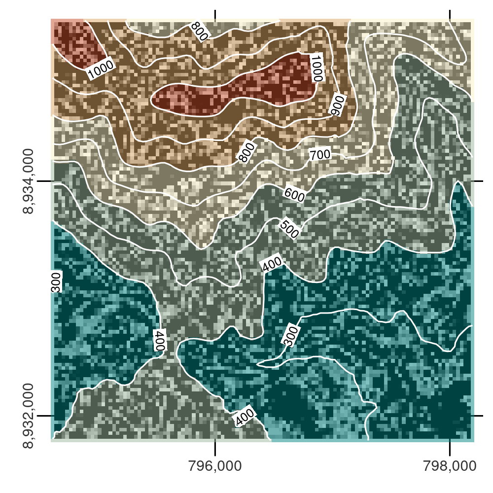

# Geometry operations {#geometric-operations}

## Prerequisites {-}

- This chapter uses the same packages as Chapter \@ref(spatial-operations) but with the addition of **spDataLarge**, which was installed in Chapter \@ref(spatial-class):

```{r 05-geometry-operations-1, message=FALSE}
library(sf)
library(terra)
library(dplyr)
library(spData)
library(spDataLarge)
```

## Introduction

The previous three chapters have demonstrated how geographic datasets are structured in R (Chapter \@ref(spatial-class)) and how to manipulate them based on their non-geographic attributes (Chapter \@ref(attr)) and spatial properties (Chapter \@ref(spatial-operations)).
This chapter extends these skills.
After reading it --- and attempting the exercises at the end --- you should understand and have control over the geometry column in `sf` objects and the geographic location of pixels represented in rasters.

Section \@ref(geo-vec) covers transforming vector geometries with 'unary' and 'binary' operations.
Unary operations work on a single geometry in isolation.
This includes simplification (of lines and polygons), the creation of buffers and centroids, and shifting/scaling/rotating single geometries using 'affine transformations' (Sections \@ref(simplification) to \@ref(affine-transformations)).
Binary transformations modify one geometry based on the shape of another.
This includes clipping and geometry unions\index{vector!union}, covered in Sections \@ref(clipping) and \@ref(geometry-unions), respectively.
Type transformations (from a polygon to a line, for example) are demonstrated in Section \@ref(type-trans).

Section \@ref(geo-ras) covers geometric transformations on raster objects.
This involves changing the size and number of the underlying pixels, and assigning them new values.
It teaches how to change the resolution (also called raster aggregation and disaggregation), the extent and the origin of a raster.
These operations are especially useful if one would like to align raster datasets from diverse sources.
Aligned raster objects share a one-to-one correspondence between pixels, allowing them to be processed using map algebra operations, described in Section \@ref(map-algebra). The final Section \@ref(raster-vector) connects vector and raster objects. 
It shows how raster values can be 'masked' and 'extracted' by vector geometries.
Importantly it shows how to 'polygonize' rasters and 'rasterize' vector datasets, making the two data models more interchangeable.

## Geometric operations on vector data {#geo-vec}

This section is about operations that in some way change the geometry of vector (`sf`) objects.
It is more advanced than the spatial data operations presented in the previous chapter (in Section \@ref(spatial-vec)), because here we drill down into the geometry:
the functions discussed in this section work on objects of class `sfc` in addition to objects of class `sf`.

### Simplification

\index{vector!simplification} 
Simplification is a process for generalization of vector objects (lines and polygons) usually for use in smaller scale maps.
Another reason for simplifying objects is to reduce the amount of memory, disk space and network bandwidth they consume:
it may be wise to simplify complex geometries before publishing them as interactive maps. 
The **sf** package provides `st_simplify()`, which uses the GEOS implementation of the Douglas-Peucker algorithm to reduce the vertex count.
`st_simplify()` uses the `dTolerance` to control the level of generalization in map units [see @douglas_algorithms_1973 for details].
Figure \@ref(fig:seine-simp) illustrates simplification of a `LINESTRING` geometry representing the river Seine and tributaries.
The simplified geometry was created by the following command:

```{r 05-geometry-operations-2}
seine_simp = st_simplify(seine, dTolerance = 2000)  # 2000 m
```

```{r seine-simp, echo=FALSE, fig.cap="Comparison of the original and simplified geometry of the seine object.", warning=FALSE, fig.scap="Simplification in action.", message=FALSE}
library(tmap)
p_simp1 = tm_shape(seine) + tm_lines() +
  tm_layout(main.title = "Original data")
p_simp2 = tm_shape(seine_simp) + tm_lines() +
  tm_layout(main.title = "st_simplify")
tmap_arrange(p_simp1, p_simp2, ncol = 2)
```

The resulting `seine_simp` object is a copy of the original `seine` but with fewer vertices.
This is apparent, with the result being visually simpler (Figure \@ref(fig:seine-simp), right) and consuming less memory than the original object, as verified below:

```{r 05-geometry-operations-3}
object.size(seine)
object.size(seine_simp)
```

Simplification is also applicable for polygons.
This is illustrated using `us_states`, representing the contiguous United States.
As we show in Chapter \@ref(reproj-geo-data), GEOS assumes that the data is in a projected CRS and this could lead to unexpected results when using a geographic CRS.
Therefore, the first step is to project the data into some adequate projected CRS, such as US National Atlas Equal Area (epsg = 2163) (on the left in Figure \@ref(fig:us-simp)):

```{r 05-geometry-operations-4}
us_states2163 = st_transform(us_states, 2163)
```

`st_simplify()` works equally well with projected polygons:

```{r 05-geometry-operations-5}
us_states_simp1 = st_simplify(us_states2163, dTolerance = 100000)  # 100 km
```

A limitation with `st_simplify()` is that it simplifies objects on a per-geometry basis.
This means the 'topology' is lost, resulting in overlapping and 'holy' areal units illustrated in Figure \@ref(fig:us-simp) (middle panel).
`ms_simplify()` from **rmapshaper** provides an alternative that overcomes this issue.
By default it uses the Visvalingam algorithm, which overcomes some limitations of the Douglas-Peucker algorithm [@visvalingam_line_1993].
<!-- https://bost.ocks.org/mike/simplify/ -->
The following code chunk uses this function to simplify `us_states2163`.
The result has only 1% of the vertices of the input (set using the argument `keep`) but its number of objects remains intact because we set `keep_shapes = TRUE`:^[
Simplification of multipolygon objects can remove small internal polygons, even if the `keep_shapes` argument is set to TRUE. To prevent this, you need to set `explode = TRUE`. This option converts all mutlipolygons into separate polygons before its simplification.
]

```{r 05-geometry-operations-6, warning=FALSE, message=FALSE}
# proportion of points to retain (0-1; default 0.05)
us_states2163$AREA = as.numeric(us_states2163$AREA)
us_states_simp2 = rmapshaper::ms_simplify(us_states2163, keep = 0.01,
                                          keep_shapes = TRUE)
```

Finally, the visual comparison of the original dataset and the two simplified versions shows differences between the Douglas-Peucker (`st_simplify`) and Visvalingam (`ms_simplify`) algorithm outputs (Figure \@ref(fig:us-simp)):

```{r us-simp, echo=FALSE, fig.cap="Polygon simplification in action, comparing the original geometry of the contiguous United States with simplified versions, generated with functions from sf (center) and rmapshaper (right) packages.", warning=FALSE, fig.asp=0.3, fig.scap="Polygon simplification in action."}
library(tmap)
p_ussimp1 = tm_shape(us_states2163) + tm_polygons() + tm_layout(main.title = "Original data")
p_ussimp2 = tm_shape(us_states_simp1) + tm_polygons() + tm_layout(main.title = "st_simplify")
p_ussimp3 = tm_shape(us_states_simp2) + tm_polygons() + tm_layout(main.title = "ms_simplify")
tmap_arrange(p_ussimp1, p_ussimp2, p_ussimp3, ncol = 3)
```

### Centroids

\index{vector!centroids} 
Centroid operations identify the center of geographic objects.
Like statistical measures of central tendency (including mean and median definitions of 'average'), there are many ways to define the geographic center of an object.
All of them create single point representations of more complex vector objects.

The most commonly used centroid operation is the *geographic centroid*.
This type of centroid operation (often referred to as 'the centroid') represents the center of mass in a spatial object (think of balancing a plate on your finger).
Geographic centroids have many uses, for example to create a simple point representation of complex geometries, or to estimate distances between polygons.
They can be calculated with the **sf** function `st_centroid()` as demonstrated in the code below, which generates the geographic centroids of regions in New Zealand and tributaries to the River Seine, illustrated with black points in Figure \@ref(fig:centr).

```{r 05-geometry-operations-7, warning=FALSE}
nz_centroid = st_centroid(nz)
seine_centroid = st_centroid(seine)
```

Sometimes the geographic centroid falls outside the boundaries of their parent objects (think of a doughnut).
In such cases *point on surface* operations can be used to guarantee the point will be in the parent object (e.g., for labeling irregular multipolygon objects such as island states), as illustrated by the red points in Figure \@ref(fig:centr).
Notice that these red points always lie on their parent objects.
They were created with `st_point_on_surface()` as follows:^[
A description of how `st_point_on_surface()` works is provided at https://gis.stackexchange.com/q/76498.
]

```{r 05-geometry-operations-8, warning=FALSE}
nz_pos = st_point_on_surface(nz)
seine_pos = st_point_on_surface(seine)
```

```{r centr, warning=FALSE, echo=FALSE, fig.cap="Centroids (black points) and 'points on surface' (red points) of New Zealand's regions (left) and the Seine (right) datasets.", fig.scap="Centroid vs point on surface operations."}
p_centr1 = tm_shape(nz) + tm_borders() +
  tm_shape(nz_centroid) + tm_symbols(shape = 1, col = "black", size = 0.5) +
  tm_shape(nz_pos) + tm_symbols(shape = 1, col = "red", size = 0.5)  
p_centr2 = tm_shape(seine) + tm_lines() +
  tm_shape(seine_centroid) + tm_symbols(shape = 1, col = "black", size = 0.5) +
  tm_shape(seine_pos) + tm_symbols(shape = 1, col = "red", size = 0.5)  
tmap_arrange(p_centr1, p_centr2, ncol = 2)
```

Other types of centroids exist, including the *Chebyshev center* and the *visual center*.
We will not explore these here but it is possible to calculate them using R, as we'll see in Chapter \@ref(algorithms).

### Buffers

\index{vector!buffers} 
Buffers are polygons representing the area within a given distance of a geometric feature:
regardless of whether the input is a point, line or polygon, the output is a polygon.
Unlike simplification (which is often used for visualization and reducing file size) buffering tends to be used for geographic data analysis.
How many points are within a given distance of this line?
Which demographic groups are within travel distance of this new shop?
These kinds of questions can be answered and visualized by creating buffers around the geographic entities of interest.

Figure \@ref(fig:buffs) illustrates buffers of different sizes (5 and 50 km) surrounding the river Seine and tributaries.
These buffers were created with commands below, which show that the command `st_buffer()` requires at least two arguments: an input geometry and a distance, provided in the units of the CRS (in this case meters):

```{r 05-geometry-operations-9}
seine_buff_5km = st_buffer(seine, dist = 5000)
seine_buff_50km = st_buffer(seine, dist = 50000)
```

```{r buffs, echo=FALSE, fig.cap="Buffers around the Seine dataset of 5 km (left) and 50 km (right). Note the colors, which reflect the fact that one buffer is created per geometry feature.", fig.show='hold', out.width="75%", fig.scap="Buffers around the seine dataset."}
p_buffs1 = tm_shape(seine_buff_5km) + tm_polygons(col = "name") +
  tm_shape(seine) + tm_lines() +
  tm_layout(main.title = "5 km buffer", legend.show = FALSE)
p_buffs2 = tm_shape(seine_buff_50km) + tm_polygons(col = "name") +
  tm_shape(seine) + tm_lines() +
  tm_layout(main.title = "50 km buffer", legend.show = FALSE)
tmap_arrange(p_buffs1, p_buffs2, ncol = 2)
```

```{block2 05-geometry-operations-10, type = "rmdnote"}
The third and final argument of `st_buffer()` is `nQuadSegs`, which means 'number of segments per quadrant' and is set by default to 30 (meaning circles created by buffers are composed of $4 \times 30 = 120$ lines).
This argument rarely needs to be set.
Unusual cases where it may be useful include when the memory consumed by the output of a buffer operation is a major concern (in which case it should be reduced) or when very high precision is needed (in which case it should be increased).
```

```{r nQuadSegs, eval=FALSE, echo=FALSE}
# Demonstrate nQuadSegs
seine_buff_simple = st_buffer(seine, dist = 50000, nQuadSegs = 3)
plot(seine_buff_simple, key.pos = NULL, main = "50 km buffer")
plot(seine, key.pos = NULL, lwd = 3, pal = rainbow, add = TRUE)
seine_points = st_cast(seine[1, ], "POINT")
buff_single = st_buffer(seine_points[1, ], 50000, 2)
buff_points = st_cast(buff_single, "POINT")
plot(st_geometry(buff_single), add = TRUE)
```

### Affine transformations

\index{vector!affine transformation} 
Affine transformation is any transformation that preserves lines and parallelism.
However, angles or length are not necessarily preserved.
Affine transformations include, among others, shifting (translation), scaling and rotation.
Additionally, it is possible to use any combination of these.
Affine transformations are an essential part of geocomputation.
For example, shifting is needed for labels placement, scaling is used in non-contiguous area cartograms (see Section \@ref(other-mapping-packages)), and many affine transformations are applied when reprojecting or improving the geometry that was created based on a distorted or wrongly projected map.
The **sf** package implements affine transformation for objects of classes `sfg` and `sfc`.

```{r 05-geometry-operations-11}
nz_sfc = st_geometry(nz)
```

Shifting moves every point by the same distance in map units.
It could be done by adding a numerical vector to a vector object.
For example, the code below shifts all y-coordinates by 100,000 meters to the north, but leaves the x-coordinates untouched (left panel of Figure \@ref(fig:affine-trans)). 

```{r 05-geometry-operations-12}
nz_shift = nz_sfc + c(0, 100000)
```

Scaling enlarges or shrinks objects by a factor.
It can be applied either globally or locally.
Global scaling increases or decreases all coordinates values in relation to the origin coordinates, while keeping all geometries topological relations intact.
It can be done by subtraction or multiplication of a`sfg` or `sfc` object.

```{r 05-geometry-operations-13, echo=FALSE,eval=FALSE}
nz_scale0 = nz_sfc * 0.5
```

Local scaling treats geometries independently and requires points around which geometries are going to be scaled, e.g., centroids.
In the example below, each geometry is shrunk by a factor of two around the centroids (middle panel in Figure \@ref(fig:affine-trans)).
To achieve that, each object is firstly shifted in a way that its center has coordinates of `0, 0` (`(nz_sfc - nz_centroid_sfc)`). 
Next, the sizes of the geometries are reduced by half (`* 0.5`).
Finally, each object's centroid is moved back to the input data coordinates (`+ nz_centroid_sfc`). 

```{r 05-geometry-operations-14}
nz_centroid_sfc = st_centroid(nz_sfc)
nz_scale = (nz_sfc - nz_centroid_sfc) * 0.5 + nz_centroid_sfc
```

Rotation of two-dimensional coordinates requires a rotation matrix:

$$
R =
\begin{bmatrix}
\cos \theta & -\sin \theta \\  
\sin \theta & \cos \theta \\
\end{bmatrix}
$$

It rotates points in a clockwise direction.
The rotation matrix can be implemented in R as:

```{r 05-geometry-operations-15}
rotation = function(a){
  r = a * pi / 180 #degrees to radians
  matrix(c(cos(r), sin(r), -sin(r), cos(r)), nrow = 2, ncol = 2)
} 
```

The `rotation` function accepts one argument `a` - a rotation angle in degrees.
Rotation could be done around selected points, such as centroids (right panel of Figure \@ref(fig:affine-trans)).
See `vignette("sf3")` for more examples.

```{r 05-geometry-operations-16}
nz_rotate = (nz_sfc - nz_centroid_sfc) * rotation(30) + nz_centroid_sfc
```

```{r affine-trans, echo=FALSE, fig.cap="Illustrations of affine transformations: shift, scale and rotate.", warning=FALSE, eval=TRUE, fig.scap="Illustrations of affine transformations."}
st_crs(nz_shift) = st_crs(nz_sfc)
st_crs(nz_scale) = st_crs(nz_sfc)
st_crs(nz_rotate) = st_crs(nz_sfc)
p_at1 = tm_shape(nz_sfc) + tm_polygons() +
  tm_shape(nz_shift) + tm_polygons(col = "red") +
  tm_layout(main.title = "Shift")
p_at2 = tm_shape(nz_sfc) + tm_polygons() +
  tm_shape(nz_scale) + tm_polygons(col = "red") +
  tm_layout(main.title = "Scale")
p_at3 = tm_shape(nz_sfc) + tm_polygons() +
  tm_shape(nz_rotate) + tm_polygons(col = "red") +
  tm_layout(main.title = "Rotate")
tmap_arrange(p_at1, p_at2, p_at3, ncol = 3)
```

```{r 05-geometry-operations-17, echo=FALSE,eval=FALSE}
nz_scale_rotate = (nz_sfc - nz_centroid_sfc) * 0.25 * rotation(90) + nz_centroid_sfc
```
```{r 05-geometry-operations-18, echo=FALSE,eval=FALSE}
shearing = function(hx, hy){
  matrix(c(1, hy, hx, 1), nrow = 2, ncol = 2)
}
nz_shear = (nz_sfc - nz_centroid_sfc) * shearing(1.1, 0) + nz_centroid_sfc
```
```{r 05-geometry-operations-19, echo=FALSE,eval=FALSE}
plot(nz_sfc)
plot(nz_shear, add = TRUE, col = "red")
```

Finally, the newly created geometries can replace the old ones with the `st_set_geometry()` function: 

```{r 05-geometry-operations-20}
nz_scale_sf = st_set_geometry(nz, nz_scale)
```

### Clipping {#clipping}

\index{vector!clipping} 
\index{spatial!subsetting} 
Spatial clipping is a form of spatial subsetting that involves changes to the `geometry` columns of at least some of the affected features.

Clipping can only apply to features more complex than points: 
lines, polygons and their 'multi' equivalents.
To illustrate the concept we will start with a simple example:
two overlapping circles with a center point one unit away from each other and a radius of one (Figure \@ref(fig:points)).

```{r points, fig.cap="Overlapping circles.", fig.asp=1, out.width="50%"}
b = st_sfc(st_point(c(0, 1)), st_point(c(1, 1))) # create 2 points
b = st_buffer(b, dist = 1) # convert points to circles
plot(b)
text(x = c(-0.5, 1.5), y = 1, labels = c("x", "y")) # add text
```

Imagine you want to select not one circle or the other, but the space covered by both `x` *and* `y`.
This can be done using the function `st_intersection()`\index{vector!intersection}, illustrated using objects named `x` and `y` which represent the left- and right-hand circles (Figure \@ref(fig:circle-intersection)).

```{r circle-intersection, fig.cap="Overlapping circles with a gray color indicating intersection between them.", fig.asp=1, out.width="50%", , fig.scap="Overlapping circles showing intersection types."}
x = b[1]
y = b[2]
x_and_y = st_intersection(x, y)
plot(b)
plot(x_and_y, col = "lightgrey", add = TRUE) # color intersecting area
```

The subsequent code chunk demonstrates how this works for all combinations of the 'Venn' diagram representing `x` and `y`, inspired by [Figure 5.1](http://r4ds.had.co.nz/transform.html#logical-operators) of the book *R for Data Science* [@grolemund_r_2016].

```{r venn-clip, echo=FALSE, fig.cap="Spatial equivalents of logical operators.", warning=FALSE}
source("https://github.com/Robinlovelace/geocompr/raw/main/code/05-venn-clip.R")
```

To illustrate the relationship between subsetting and clipping spatial data, we will subset points that cover the bounding box of the circles `x` and `y` in Figure \@ref(fig:venn-clip).
Some points will be inside just one circle, some will be inside both and some will be inside neither.
`st_sample()` is used below to generate a *simple random* distribution of points within the extent of circles `x` and `y`, resulting in output illustrated in Figure \@ref(fig:venn-subset).

```{r venn-subset, fig.cap="Randomly distributed points within the bounding box enclosing circles x and y.", out.width="50%", fig.asp=1, fig.scap="Randomly distributed points within the bounding box."}
bb = st_bbox(st_union(x, y))
box = st_as_sfc(bb)
set.seed(2017)
p = st_sample(x = box, size = 10)
plot(box)
plot(x, add = TRUE)
plot(y, add = TRUE)
plot(p, add = TRUE)
text(x = c(-0.5, 1.5), y = 1, labels = c("x", "y"))
```

The logical operator way would find the points inside both `x` and `y` using a spatial predicate such as `st_intersects()`, whereas the intersection\index{vector!intersection} method simply finds the points inside the intersecting region created above as `x_and_y`.
As demonstrated below the results are identical, but the method that uses the clipped polygon is more concise:

```{r 05-geometry-operations-21}
sel_p_xy = st_intersects(p, x, sparse = FALSE)[, 1] &
  st_intersects(p, y, sparse = FALSE)[, 1]
p_xy1 = p[sel_p_xy]
p_xy2 = p[x_and_y]
identical(p_xy1, p_xy2)
```


```{r 05-geometry-operations-22, echo=FALSE, eval=FALSE}
# An alternative way to sample from the bb
bb = st_bbox(st_union(x, y))
pmulti = st_multipoint(pmat)
box = st_convex_hull(pmulti)
```

### Geometry unions

\index{vector!union} 
\index{aggregation!spatial} 
As we saw in Section \@ref(vector-attribute-aggregation), spatial aggregation can silently dissolve the geometries of touching polygons in the same group.
This is demonstrated in the code chunk below in which 49 `us_states` are aggregated into 4 regions using base and **tidyverse**\index{tidyverse (package)} functions (see results in Figure \@ref(fig:us-regions)):

```{r 05-geometry-operations-23}
regions = aggregate(x = us_states[, "total_pop_15"], by = list(us_states$REGION),
                    FUN = sum, na.rm = TRUE)
regions2 = us_states %>% group_by(REGION) %>%
  summarize(pop = sum(total_pop_15, na.rm = TRUE))
```

```{r 05-geometry-operations-24, echo=FALSE}
# st_join(buff, africa[, "pop"]) %>%
#   summarize(pop = sum(pop, na.rm = TRUE))
# summarize(africa[buff, "pop"], pop = sum(pop, na.rm = TRUE))
```

```{r us-regions, fig.cap="Spatial aggregation on contiguous polygons, illustrated by aggregating the population of US states into regions, with population represented by color. Note the operation automatically dissolves boundaries between states.", echo=FALSE, warning=FALSE, fig.asp=0.2, out.width="100%", fig.scap="Spatial aggregation on contiguous polygons."}
source("https://github.com/Robinlovelace/geocompr/raw/main/code/05-us-regions.R", print.eval = TRUE)
```

What is going on in terms of the geometries?
Behind the scenes, both `aggregate()` and `summarize()` combine the geometries and dissolve the boundaries between them using `st_union()`.
This is demonstrated in the code chunk below which creates a united western US: 

```{r 05-geometry-operations-25}
us_west = us_states[us_states$REGION == "West", ]
us_west_union = st_union(us_west)
```

The function can take two geometries and unite them, as demonstrated in the code chunk below which creates a united western block incorporating Texas (challenge: reproduce and plot the result):

```{r 05-geometry-operations-26, message=FALSE}
texas = us_states[us_states$NAME == "Texas", ]
texas_union = st_union(us_west_union, texas)
```

```{r 05-geometry-operations-27, echo=FALSE, eval=FALSE}
plot(texas_union)
# aim: experiment with st_union
us_south2 = st_union(us_west[1, ], us_west[6, ])
plot(us_southhwest)
```

### Type transformations {#type-trans}

\index{vector!geometry casting} 
Geometry casting is a powerful operation that enables transformation of the geometry type.
It is implemented in the `st_cast` function from the **sf** package.
Importantly, `st_cast` behaves differently on single simple feature geometry (`sfg`) objects, simple feature geometry column (`sfc`) and simple features objects.

Let's create a multipoint to illustrate how geometry casting works on simple feature geometry (`sfg`) objects:

```{r 05-geometry-operations-28}
multipoint = st_multipoint(matrix(c(1, 3, 5, 1, 3, 1), ncol = 2))
```

In this case, `st_cast` can be useful to transform the new object into linestring or polygon (Figure \@ref(fig:single-cast)):

```{r 05-geometry-operations-29}
linestring = st_cast(multipoint, "LINESTRING")
polyg = st_cast(multipoint, "POLYGON")
```

```{r single-cast, echo = FALSE, fig.cap="Examples of linestring and polygon casted from a multipoint geometry.", warning=FALSE, fig.asp=0.3, fig.scap="Examples of casting operations."}
p_sc1 = tm_shape(st_sfc(multipoint)) + tm_symbols(shape = 1, col = "black", size = 0.5) +
  tm_layout(main.title = "MULTIPOINT", inner.margins = c(0.05, 0.05, 0.05, 0.05))
p_sc2 = tm_shape(st_sfc(linestring)) + tm_lines() +
  tm_layout(main.title = "LINESTRING")
p_sc3 = tm_shape(st_sfc(polyg)) + tm_polygons(border.col = "black") +
  tm_layout(main.title = "POLYGON")
tmap_arrange(p_sc1, p_sc2, p_sc3, ncol = 3)
```

Conversion from multipoint to linestring is a common operation that creates a line object from ordered point observations, such as GPS measurements or geotagged media.
This allows spatial operations such as the length of the path traveled.
Conversion from multipoint or linestring to polygon is often used to calculate an area, for example from the set of GPS measurements taken around a lake or from the corners of a building lot.

The transformation process can be also reversed using `st_cast`:

```{r 05-geometry-operations-30}
multipoint_2 = st_cast(linestring, "MULTIPOINT")
multipoint_3 = st_cast(polyg, "MULTIPOINT")
all.equal(multipoint, multipoint_2, multipoint_3)
```

```{block2 05-geometry-operations-31, type='rmdnote'}
For single simple feature geometries (`sfg`), `st_cast` also provides geometry casting from non-multi-types to multi-types (e.g., `POINT` to `MULTIPOINT`) and from multi-types to non-multi-types.
However, only the first element of the old object would remain in the second group of cases.
```

```{r 05-geometry-operations-32, include=FALSE}
cast_all = function(xg) {
  lapply(c("MULTIPOLYGON", "MULTILINESTRING", "MULTIPOINT", "POLYGON", "LINESTRING", "POINT"), 
         function(x) st_cast(xg, x))
}
t = cast_all(multipoint)
t2 = cast_all(polyg)
```

Geometry casting of simple features geometry column (`sfc`) and simple features objects works the same as for single geometries in most of the cases. 
One important difference is the conversion between multi-types to non-multi-types.
As a result of this process, multi-objects are split into many non-multi-objects.

Table \@ref(tab:sfs-st-cast) shows possible geometry type transformations on simple feature objects.
Each input simple feature object with only one element (first column) is transformed directly into another geometry type.
Several of the transformations are not possible, for example, you cannot convert a single point into a multilinestring or a polygon (so the cells `[1, 4:5]` in the table are NA).
On the other hand, some of the transformations are splitting the single element input object into a multi-element object.
You can see that, for example, when you cast a multipoint consisting of five pairs of coordinates into a point.

```{r sfs-st-cast, echo=FALSE}
sfs_st_cast = read.csv("extdata/sfs-st-cast.csv")
abbreviate_geomtypes = function(geomtypes) {
  geomtypes_new = gsub(pattern = "POINT", replacement = "POI", x = geomtypes)
  geomtypes_new = gsub(pattern = "POLYGON", replacement = "POL", x = geomtypes_new)
  geomtypes_new = gsub(pattern = "LINESTRING", replacement = "LIN", x = geomtypes_new)
  geomtypes_new = gsub(pattern = "MULTI", replacement = "M", x = geomtypes_new)
  geomtypes_new = gsub(pattern = "GEOMETRYCOLLECTION", replacement = "GC", x = geomtypes_new)
  geomtypes_new
}
sfs_st_cast$input_geom = abbreviate_geomtypes(sfs_st_cast$input_geom)
names(sfs_st_cast) = abbreviate_geomtypes(names(sfs_st_cast))
names(sfs_st_cast)[1] = ""
knitr::kable(sfs_st_cast, 
             caption = paste("Geometry casting on simple feature geometries", 
                             "(see Section 2.1) with input type by row and", 
                             "output type by column"),
             caption.short = "Geometry casting on simple feature geometries.",
             booktabs = TRUE) %>% 
  kableExtra::add_footnote("Note: Values like (1) represent the number of features; NA means the operation is not possible. Abbreviations: POI, LIN, POL and GC refer to POINT, LINESTRING, POLYGON and GEOMETRYCOLLECTION. The MULTI version of these geometry types is indicated by a preceding M, e.g., MPOI is the acronym for MULTIPOINT.", notation = "none")
```

Let's try to apply geometry type transformations on a new object, `multilinestring_sf`, as an example (on the left in Figure \@ref(fig:line-cast)):

```{r 05-geometry-operations-33}
multilinestring_list = list(matrix(c(1, 4, 5, 3), ncol = 2), 
                            matrix(c(4, 4, 4, 1), ncol = 2),
                            matrix(c(2, 4, 2, 2), ncol = 2))
multilinestring = st_multilinestring((multilinestring_list))
multilinestring_sf = st_sf(geom = st_sfc(multilinestring))
multilinestring_sf
```

You can imagine it as a road or river network. 
The new object has only one row that defines all the lines.
This restricts the number of operations that can be done, for example it prevents adding names to each line segment or calculating lengths of single lines.
The `st_cast` function can be used in this situation, as it separates one mutlilinestring into three linestrings:

```{r 05-geometry-operations-34}
linestring_sf2 = st_cast(multilinestring_sf, "LINESTRING")
linestring_sf2
```

```{r line-cast, echo=FALSE, fig.cap="Examples of type casting between MULTILINESTRING (left) and LINESTRING (right).", warning=FALSE, fig.scap="Examples of type casting."}
p_lc1 = tm_shape(multilinestring_sf) + tm_lines(lwd = 3) +
  tm_layout(main.title = "MULTILINESTRING")
linestring_sf2$name = c("Riddle Rd", "Marshall Ave", "Foulke St")
p_lc2 = tm_shape(linestring_sf2) + tm_lines(lwd = 3, col = "name", palette = "Set2") +
  tm_layout(main.title = "LINESTRING", legend.show = FALSE)
tmap_arrange(p_lc1, p_lc2, ncol = 2)
```

The newly created object allows for attributes creation (see more in Section \@ref(vec-attr-creation)) and length measurements:

```{r 05-geometry-operations-35}
linestring_sf2$name = c("Riddle Rd", "Marshall Ave", "Foulke St")
linestring_sf2$length = st_length(linestring_sf2)
linestring_sf2
```

## Geometric operations on raster data {#geo-ras}

\index{raster!manipulation} 
Geometric raster operations include the shift, flipping, mirroring, scaling, rotation or warping of images.
These operations are necessary for a variety of applications including georeferencing, used to allow images to be overlaid on an accurate map with a known CRS [@liu_essential_2009].
A variety of georeferencing techniques exist, including:

- Georectification based on known [ground control points](https://www.qgistutorials.com/en/docs/3/georeferencing_basics.html)
- Orthorectification, which also accounts for local topography
- Image [registration](https://en.wikipedia.org/wiki/Image_registration) is used to combine images of the same thing but shot from different sensors by aligning one image with another (in terms of coordinate system and resolution)

R is rather unsuitable for the first two points since these often require manual intervention which is why they are usually done with the help of dedicated GIS software (see also Chapter \@ref(gis)).
On the other hand, aligning several images is possible in R and this section shows among others how to do so.
This often includes changing the extent, the resolution and the origin of an image.
A matching projection is of course also required but is already covered in Section \@ref(reprojecting-raster-geometries).

In any case, there are other reasons to perform a geometric operation on a single raster image.
For instance, in Chapter \@ref(location) we define metropolitan areas in Germany as 20 km^2^ pixels with more than 500,000 inhabitants. 
The original inhabitant raster, however, has a resolution of 1 km^2^ which is why we will decrease (aggregate) the resolution by a factor of 20 (see Section \@ref(define-metropolitan-areas)).
Another reason for aggregating a raster is simply to decrease run-time or save disk space.
Of course, this is only possible if the task at hand allows a coarser resolution.
Sometimes a coarser resolution is sufficient for the task at hand.

### Geometric intersections

\index{raster!intersection} 
In Section \@ref(spatial-raster-subsetting) we have shown how to extract values from a raster overlaid by other spatial objects.
To retrieve a spatial output, we can use almost the same subsetting syntax.
The only difference is that we have to make clear that we would like to keep the matrix structure by setting the `drop` argument to `FALSE`.
This will return a raster object containing the cells whose midpoints overlap with `clip`.

```{r 05-geometry-operations-36}
elev = rast(system.file("raster/elev.tif", package = "spData"))
clip = rast(xmin = 0.9, xmax = 1.8, ymin = -0.45, ymax = 0.45,
            resolution = 0.3, vals = rep(1, 9))
elev[clip, drop = FALSE]
```

For the same operation we can also use the `intersect()` and `crop()` command.

### Extent and origin

\index{raster!merging} 
When merging or performing map algebra on rasters, their resolution, projection, origin and/or extent have to match. Otherwise, how should we add the values of one raster with a resolution of 0.2 decimal degrees to a second raster with a resolution of 1 decimal degree?
The same problem arises when we would like to merge satellite imagery from different sensors with different projections and resolutions. 
We can deal with such mismatches by aligning the rasters.

In the simplest case, two images only differ with regard to their extent.
Following code adds one row and two columns to each side of the raster while setting all new values to an elevation of 1000 meters (Figure \@ref(fig:extend-example)).

```{r extend-example0}
elev = rast(system.file("raster/elev.tif", package = "spData"))
elev_2 = extend(elev, c(1, 2))
```

```{r extend-example, fig.cap = "Original raster (left) and the same raster (right) extended by one row on the top and bottom and two columns on the left and right.", fig.scap="Extending rasters.", echo=FALSE, fig.asp=0.6}
source("https://github.com/Robinlovelace/geocompr/raw/main/code/05-extend-example.R", print.eval = TRUE)
```

Performing an algebraic operation on two objects with differing extents in R, the **terra** package returns an error.

```{r 05-geometry-operations-37, error=TRUE}
elev_3 = elev + elev_2
```

However, we can align the extent of two rasters with `extend()`. 
Instead of telling the function how many rows or columns should be added (as done before), we allow it to figure it out by using another raster object.
Here, we extend the `elev` object to the extent of `elev_2`. 
The newly added rows and column receive the default value of the `value` parameter, i.e., `NA`.

```{r 05-geometry-operations-38}
elev_4 = extend(elev, elev_2)
```

The origin of a raster is the cell corner closest to the coordinates (0, 0).
The `origin()` function returns the coordinates of the origin.
In the below example a cell corner exists with coordinates (0, 0), but that is not necessarily the case.

```{r 05-geometry-operations-39}
origin(elev_4)
```

If two rasters have different origins, their cells do not overlap completely which would make map algebra impossible.
To change the origin -- use `origin()`.^[
If the origins of two raster datasets are just marginally apart, it sometimes is sufficient to simply increase the `tolerance` argument  of `terra::terraOptions()`.
]
Looking at Figure \@ref(fig:origin-example) reveals the effect of changing the origin.

```{r}
# change the origin
origin(elev_4) = c(0.25, 0.25)
```

```{r origin-example, fig.cap="Rasters with identical values but different origins.", echo=FALSE}
elev_poly = st_as_sf(as.polygons(elev, dissolve = FALSE))
elev4_poly = st_as_sf(as.polygons(elev_4, dissolve = FALSE))
tm_shape(elev4_poly) +
  tm_grid() +
  tm_polygons(col = "elev") + 
  tm_shape(elev_poly) +
  tm_polygons(col = "elev") +
  tm_layout(frame = FALSE, legend.show = FALSE,
            inner.margins = c(0.1, 0.12, 0, 0))
```

Note that changing the resolution (next section) frequently also changes the origin.

### Aggregation and disaggregation

\index{raster!aggregation} 
\index{raster!disaggregation} 
Raster datasets can also differ with regard to their resolution. 
To match resolutions, one can either decrease  (`aggregate()`) or increase (`disagg()`) the resolution of one raster.^[
Here we refer to spatial resolution.
In remote sensing the spectral (spectral bands), temporal (observations through time of the same area) and radiometric (color depth) resolution are also important.
Check out the `tapp()` example in the documentation for getting an idea on how to do temporal raster aggregation.
]
As an example, we here change the spatial resolution of `dem` (found in the **spDataLarge** package) by a factor of 5 (Figure \@ref(fig:aggregate-example)).
Additionally, the output cell value should correspond to the mean of the input cells (note that one could use other functions as well, such as `median()`, `sum()`, etc.):

```{r 05-geometry-operations-40}
dem = rast(system.file("raster/dem.tif", package = "spDataLarge"))
dem_agg = aggregate(dem, fact = 5, fun = mean)
```

```{r aggregate-example, fig.cap = "Original raster (left). Aggregated raster (right).", echo=FALSE}
p_ar1 = tm_shape(dem) +
  tm_raster(style = "cont", legend.show = FALSE) +
  tm_layout(main.title = "A. Original", frame = FALSE)
p_ar2 = tm_shape(dem_agg) + 
  tm_raster(style = "cont", legend.show = FALSE) +
  tm_layout(main.title = "B. Aggregated", frame = FALSE)
tmap_arrange(p_ar1, p_ar2, ncol = 2)
```

By contrast, the `disagg()` function increases the resolution.
However, we have to specify a method on how to fill the new cells.
The `disagg()` function provides two methods.
The default one (`method = "near"`) simply gives all output cells the value of the input cell, and hence duplicates values which leads to a blocky output image.

The `bilinear` method, in turn, is an interpolation technique that uses the four nearest pixel centers of the input image (salmon colored points in Figure \@ref(fig:bilinear)) to compute an average weighted by distance (arrows in Figure \@ref(fig:bilinear) as the value of the output cell - square in the upper left corner in Figure \@ref(fig:bilinear)).

```{r 05-geometry-operations-41}
dem_disagg = disagg(dem_agg, fact = 5, method = "bilinear")
identical(dem, dem_disagg)
```

```{r bilinear, echo = FALSE, fig.width=8, fig.height=10, fig.cap="The distance-weighted average of the four closest input cells determine the output when using the bilinear method for disaggregation.", fig.scap="Bilinear disaggregation in action.", warning=FALSE}
source("https://github.com/Robinlovelace/geocompr/raw/main/code/05-bilinear.R", print.eval = TRUE)
```

Comparing the values of `dem` and `dem_disagg` tells us that they are not identical (you can also use `compareGeom()` or `all.equal()`).
However, this was hardly to be expected, since disaggregating is a simple interpolation technique.
It is important to keep in mind that disaggregating results in a finer resolution; the corresponding values, however, are only as accurate as their lower resolution source.

### Resampling

\index{raster!resampling}
The above methods of aggregation and disaggregation are only suitable when we want to change the resolution of our raster by the aggregation/disaggregation factor. 
However, what to do when we have two or more rasters with different resolutions and origins?
This is the role of resampling -- a process of computing values for new pixel locations.
In short, this process takes the values of our original raster and recalculates new values for a target raster with custom resolution and origin.

Several methods for recalculating (estimating) values for a raster with different resolutions/origins exist (Figure \@ref(fig:resampl)).
It includes:

- Nearest neighbor - assigns the value of the nearest cell of the original raster to the cell of the target one.
It is fast and usually suitable for categorical rasters.
- Bilinear interpolation - assigns a weighted average of the four nearest cells from the original raster to the cell of the target one (Figure \@ref(fig:bilinear)). The fastest method for continuous rasters.
- Cubic interpolation - uses values of 16 nearest cells of the original raster to determine the output cell value, applying third-order polynomial functions. Used for continuous rasters. It results in a more smoothed surface than the bilinear interpolation, but is also more computationally demanding.
- Cubic spline interpolation - also uses values of 16 nearest cells of the original raster to determine the output cell value, but applies cubic splines (piecewise third-order polynomial functions) to derive the results. Used for continuous rasters.
- Lanczos windowed sinc resampling - uses values of 36 nearest cells of the original raster to determine the output cell value. Used for continuous rasters.^[More detailed explanation of this method can be found at https://gis.stackexchange.com/a/14361/20955.]

As you can find in the above explanation, only *nearest neighbor* is suitable for categorical rasters, while all the methods can be used (with different outcomes) for the continuous rasters.
Additionally, each successive method requires more processing time.

To apply resampling, the **terra** package provides a `resample()` function.
It accepts an input raster (`x`), a raster with target spatial properties (`y`), and a resampling method (`method`).

We need a raster with target spatial properties to see how the `resample()` function works.
For this example, we create `target_rast`, but you would often use an already existing raster object.

```{r 05-geometry-operations-42}
target_rast = rast(xmin = 794600, xmax = 798200, 
                   ymin = 8931800, ymax = 8935400,
                   resolution = 150, crs = "EPSG:32717")
```

Next, we need to provide our two raster objects as the first two arguments and one of the resampling methods described above.

```{r 05-geometry-operations-42b}
dem_resampl = resample(dem, y = target_rast, method = "bilinear")
```

Figure \@ref(fig:resampl) shows a comparison of different resampling methods on the `dem` object.

```{r resampl, echo=FALSE, fig.cap="Visual comparison of the original raster and five different resampling methods."}
dem_resampl1 = resample(dem, target_rast, method = "near")
dem_resampl2 = resample(dem, target_rast, method = "bilinear")
dem_resampl3 = resample(dem, target_rast, method = "cubic")
dem_resampl4 = resample(dem, target_rast, method = "cubicspline")
dem_resampl5 = resample(dem, target_rast, method = "lanczos")

library(tmap)
tm1 = tm_shape(dem) +
  tm_raster(breaks = seq(200, 1100, by = 150), legend.show = FALSE) +
  tm_layout(frame = FALSE, main.title = "Original raster")
tm2 = tm_shape(dem_resampl1) +
  tm_raster(breaks = seq(200, 1100, by = 150), legend.show = FALSE) +
  tm_layout(frame = FALSE, main.title = "near")
tm3 = tm_shape(dem_resampl2) +
  tm_raster(breaks = seq(200, 1100, by = 150), legend.show = FALSE) +
  tm_layout(frame = FALSE, main.title = "bilinear")
tm4 = tm_shape(dem_resampl3) +
  tm_raster(breaks = seq(200, 1100, by = 150), legend.show = FALSE) +
  tm_layout(frame = FALSE, main.title = "cubic")
tm5 = tm_shape(dem_resampl4) +
  tm_raster(breaks = seq(200, 1100, by = 150), legend.show = FALSE) +
  tm_layout(frame = FALSE, main.title = "cubicspline")
tm6 = tm_shape(dem_resampl5) +
  tm_raster(breaks = seq(200, 1100, by = 150), legend.show = FALSE) +
  tm_layout(frame = FALSE, main.title = "lanczos")
tmap_arrange(tm1, tm2, tm3, tm4, tm5, tm6)
```

As you will see in section \@ref(reprojecting-raster-geometries), raster reprojection is a special case of resampling when our target raster has a different CRS than the original raster.

<!--jn:toDo-->
<!-- decide -->
<!-- should we mention gdalUtils or gdalUtilities? -->
<!-- gdalUtils - https://cran.r-project.org/web/packages/gdalUtils/index.html - we mentioned it in geocompr 1; however it seems abandoned -->
<!-- gdalUtilities - https://cran.r-project.org/web/packages/gdalUtilities/index.html -->
<!-- also - add some reference to GDAL functions! -->
\index{GDAL}
```{block2 type='rmdnote'}
Most geometry operations in **terra** are user-friendly, rather fast, and work on large raster objects.
However, there could be some cases, when **terra** is not the most performant either for extensive rasters or many raster files, and some alternatives should be considered.

The most established alternatives come with the GDAL library.
It contains several utility functions, including:

- `gdalinfo` - lists various information about a raster file, including its resolution, CRS, bounding box, and more
- `gdal_translate` - converts raster data between different file formats
- `gdal_rasterize` - converts vector data into raster files
- `gdalwarp` - allows for raster mosaicing, resampling, cropping, and reprojecting

All of the above functions are written in C++, but can be called in R using the **gdalUtilities** package.
Importantly, all of these functions expect a raster file path as an input and often return their output as a raster file (for example, `gdalUtilities::gdal_translate("my_file.tif", "new_file.tif", t_srs = "EPSG:4326")`)
This is very different from the usual **terra** approach, which expects `SpatRaster` objects as inputs.
```

## Raster-vector interactions {#raster-vector}

\index{raster-vector!interactions} 
This section focuses on interactions between raster and vector geographic data models, introduced in Chapter \@ref(spatial-class).
It includes four main techniques:
raster cropping and masking using vector objects (Section \@ref(raster-cropping));
extracting raster values using different types of vector data (Section \@ref(raster-extraction));
and raster-vector conversion (Sections \@ref(rasterization) and \@ref(spatial-vectorization)).
The above concepts are demonstrated using data used in previous chapters to understand their potential real-world applications.

### Raster cropping

\index{raster-vector!raster cropping} 
Many geographic data projects involve integrating data from many different sources, such as remote sensing images (rasters) and administrative boundaries (vectors).
Often the extent of input raster datasets is larger than the area of interest.
In this case raster **cropping** and **masking** are useful for unifying the spatial extent of input data.
Both operations reduce object memory use and associated computational resources for subsequent analysis steps, and may be a necessary preprocessing step before creating attractive maps involving raster data.

<!--jn:toDo-->
<!-- two possibilities: -->
<!-- 1. explain the need of the use of `vect()` -->
<!-- 2. wait for https://github.com/rspatial/terra/issues/89 -->

We will use two objects to illustrate raster cropping:

- A `SpatRaster` object `srtm` representing elevation (meters above sea level) in south-western Utah.
- A vector (`sf`) object `zion` representing Zion National Park.

Both target and cropping objects must have the same projection.
The following code chunk therefore not only reads the datasets from the **spDataLarge** package (installed in Chapter \@ref(spatial-class)), it also reprojects `zion` (see Section \@ref(reproj-geo-data) for more on reprojection):

```{r 05-geometry-operations-43, results='hide'}
srtm = rast(system.file("raster/srtm.tif", package = "spDataLarge"))
zion = st_read(system.file("vector/zion.gpkg", package = "spDataLarge"))
zion = st_transform(zion, crs(srtm))
```

We will use `crop()` from the **terra** package to crop the `srtm` raster.
It reduces the rectangular extent of the object passed to its first argument based on the extent of the object passed to its second argument, as demonstrated in the command below (which generates Figure \@ref(fig:cropmask)(B) --- note the smaller extent of the raster background):

```{r 05-geometry-operations-44}
srtm_cropped = crop(srtm, vect(zion))
```

\index{raster-vector!raster masking} 
Related to `crop()` is the **terra** function `mask()`, which sets values outside of the bounds of the object passed to its second argument to `NA`.
The following command therefore masks every cell outside of the Zion National Park boundaries (Figure \@ref(fig:cropmask)(C)):

```{r 05-geometry-operations-45}
srtm_masked = mask(srtm, vect(zion))
```

Importantly, we want to use both `crop()` and `mask()` together in most cases. 
This combination of functions would (a) limit the raster's extent to our area of interest and then (b) replace all of the values outside of the area to NA.

```{r}
srtm_cropped = crop(srtm, vect(zion))
srtm_final = mask(srtm_cropped, vect(zion))
```

Changing the settings of `mask()` yields different results.
Setting `updatevalue = 0`, for example, will set all pixels outside the national park to 0.
Setting `inverse = TRUE` will mask everything *inside* the bounds of the park (see `?mask` for details) (Figure \@ref(fig:cropmask)(D)).

```{r 05-geometry-operations-46}
srtm_inv_masked = mask(srtm, vect(zion), inverse = TRUE)
```

```{r cropmask, echo = FALSE, fig.cap="Illustration of raster cropping and raster masking.", fig.asp=0.36, fig.width = 10, warning=FALSE}
library(tmap)
library(rcartocolor)
terrain_colors = carto_pal(7, "Geyser")
pz1 = tm_shape(srtm) + 
  tm_raster(palette = terrain_colors, legend.show = FALSE, style = "cont") + 
  tm_shape(zion) + 
  tm_borders(lwd = 2) + 
  tm_layout(main.title = "A. Original", inner.margins = 0)
pz2 = tm_shape(srtm_cropped) +
  tm_raster(palette = terrain_colors, legend.show = FALSE, style = "cont") + 
  tm_shape(zion) +
  tm_borders(lwd = 2) + 
  tm_layout(main.title = "B. Crop", inner.margins = 0)
pz3 = tm_shape(srtm_masked) + 
  tm_raster(palette = terrain_colors, legend.show = FALSE, style = "cont") + 
  tm_shape(zion) + 
  tm_borders(lwd = 2) + 
  tm_layout(main.title = "C. Mask", inner.margins = 0)
pz4 = tm_shape(srtm_inv_masked) +
  tm_raster(palette = terrain_colors, legend.show = FALSE, style = "cont") + 
  tm_shape(zion) +
  tm_borders(lwd = 2) + 
  tm_layout(main.title = "D. Inverse mask", inner.margins = 0)
tmap_arrange(pz1, pz2, pz3, pz4, ncol = 4, asp = NA)
```

### Raster extraction

<!--jn:toDo-->
<!-- two possibilities: -->
<!-- 1. explain the need of the use of `vect()` -->
<!-- 2. wait for https://github.com/rspatial/terra/issues/89 -->

\index{raster-vector!raster extraction} 
Raster extraction is the process of identifying and returning the values associated with a 'target' raster at specific locations, based on a (typically vector) geographic 'selector' object.
The results depend on the type of selector used (points, lines or polygons) and arguments passed to the `terra::extract()` function, which we use to demonstrate raster extraction.
The reverse of raster extraction --- assigning raster cell values based on vector objects --- is rasterization, described in Section \@ref(rasterization).

The basic example is of extracting the value of a raster cell at specific **points**.
For this purpose, we will use `zion_points`, which contain a sample of 30 locations within the Zion National Park (Figure \@ref(fig:pointextr)). 
The following command extracts elevation values from `srtm` and creates a data frame with points' IDs (one value per vector's row) and related `srtm` values for each point.
Now, we can add the resulting object to our `zion_points` dataset with the `cbind()` function: 

```{r 05-geometry-operations-47}
data("zion_points", package = "spDataLarge")
elevation = terra::extract(srtm, vect(zion_points))
zion_points = cbind(zion_points, elevation)
```

```{r, echo=FALSE, eval=FALSE}
library(dplyr)
zion_points2 = zion_points
zion_points2$a = 1
zion_points2 = zion_points2 %>% group_by(a) %>% summarise()
elevation = terra::extract(srtm, vect(zion_points2))
zion_points = cbind(zion_points, elevation)
```

```{r pointextr, echo=FALSE, message=FALSE, warning=FALSE, fig.cap="Locations of points used for raster extraction.", fig.asp=0.57}
source("https://github.com/Robinlovelace/geocompr/raw/main/code/05-pointextr.R", print.eval = TRUE)
```

Raster extraction also works with **line** selectors.
Then, it extracts one value for each raster cell touched by a line.
However, the line extraction approach is not recommended to obtain values along the transects as it is hard to get the correct distance between each pair of extracted raster values.

In this case, a better approach is to split the line into many points and then extract the values for these points.
To demonstrate this, the code below creates `zion_transect`, a straight line going from northwest to southeast of the Zion National Park, illustrated in Figure \@ref(fig:lineextr)(A) (see Section \@ref(vector-data) for a recap on the vector data model):

```{r 05-geometry-operations-49}
zion_transect = cbind(c(-113.2, -112.9), c(37.45, 37.2)) %>%
  st_linestring() %>% 
  st_sfc(crs = crs(srtm)) %>% 
  st_sf()
```

```{r 05-geometry-operations-50, eval=FALSE, echo=FALSE}
# Aim: show how extraction works with non-straight lines by
# using this alternative line object:
zion_transect2 = cbind(c(-113.2, -112.9, -113.2), c(36.45, 37.2, 37.5)) %>%
  st_linestring() %>% 
  st_sfc(crs = crs(srtm)) %>% 
  st_sf()
zion_transect = rbind(zion_transect, zion_transect2)
```

The utility of extracting heights from a linear selector is illustrated by imagining that you are planning a hike.
The method demonstrated below provides an 'elevation profile' of the route (the line does not need to be straight), useful for estimating how long it will take due to long climbs.

The first step is to add a unique `id` for each transect.
Next, with the `st_segmentize()` function we can add points along our line(s) with a provided density (`dfMaxLength`) and convert them into points with `st_cast()`.

```{r, warning=FALSE}
zion_transect$id = 1:nrow(zion_transect)
zion_transect = st_segmentize(zion_transect, dfMaxLength = 250)
zion_transect = st_cast(zion_transect, "POINT")
```

Now, we have a large set of points, and we want to derive a distance between the first point in our transects and each of the subsequent points. 
In this case, we only have one transect, but the code, in principle, should work on any number of transects:

```{r}
zion_transect = zion_transect %>% 
  group_by(id) %>% 
  mutate(dist = st_distance(geometry)[, 1]) 
```

Finally, we can extract elevation values for each point in our transects and combine this information with our main object.

```{r}
zion_elev = terra::extract(srtm, vect(zion_transect))
zion_transect = cbind(zion_transect, zion_elev)
```

The resulting `zion_transect` can be used to create elevation profiles, as illustrated in Figure \@ref(fig:lineextr)(B).

```{r lineextr, echo=FALSE, message=FALSE, warning=FALSE, fig.cap="Location of a line used for raster extraction (left) and the elevation along this line (right).", fig.scap="Line-based raster extraction."}
library(tmap)
library(grid)
library(ggplot2)

zion_transect_line = cbind(c(-113.2, -112.9), c(37.45, 37.2)) %>%
  st_linestring() %>% 
  st_sfc(crs = crs(srtm)) %>% 
  st_sf()

zion_transect_points = st_cast(zion_transect, "POINT")[c(1, nrow(zion_transect)), ]
zion_transect_points$name = c("start", "end")

rast_poly_line = tm_shape(srtm) +
  tm_raster(palette = terrain_colors, title = "Elevation (m)", 
            legend.show = TRUE, style = "cont") + 
  tm_shape(zion) +
  tm_borders(lwd = 2) + 
  tm_shape(zion_transect_line) + 
  tm_lines(col = "black", lwd = 4) + 
  tm_shape(zion_transect_points) +                                                 
  tm_text("name", bg.color = "white", bg.alpha = 0.75, auto.placement = TRUE) +
  tm_layout(legend.frame = TRUE, legend.position = c("right", "top"))

plot_transect = ggplot(zion_transect, aes(as.numeric(dist), srtm)) + 
  geom_line() +
  labs(x = "Distance (m)", y = "Elevation (m a.s.l.)") + 
  theme_bw() +
  # facet_wrap(~id) +
  theme(plot.margin = unit(c(5.5, 15.5, 5.5, 5.5), "pt"))

grid.newpage()
pushViewport(viewport(layout = grid.layout(2, 2, heights = unit(c(0.25, 5), "null"))))
grid.text("A. Line extraction", vp = viewport(layout.pos.row = 1, layout.pos.col = 1))
grid.text("B. Elevation along the line", vp = viewport(layout.pos.row = 1, layout.pos.col = 2))
print(rast_poly_line, vp = viewport(layout.pos.row = 2, layout.pos.col = 1))
print(plot_transect, vp = viewport(layout.pos.row = 2, layout.pos.col = 2))
```

The final type of geographic vector object for raster extraction is **polygons**.
Like lines, polygons tend to return many raster values per polygon.
This is demonstrated in the command below, which results in a data frame with column names `ID` (the row number of the polygon) and `srtm` (associated elevation values):

```{r 05-geometry-operations-53, eval=FALSE, echo=FALSE}
# aim: create zion_many to test multi-polygon results
n = 3
zion_many = st_sample(x = zion, size = n) %>% 
  st_buffer(dist = 500) %>% 
  st_sf(data.frame(v = 1:n), geometry = .)
plot(zion_many)

# for continuous data:
zion_srtm_values1 = terra::extract(x = srtm, y = vect(zion_many), fun = min)
zion_srtm_values2 = terra::extract(x = srtm, y = vect(zion_many), fun = mean)
zion_srtm_values3 = terra::extract(x = srtm, y = vect(zion_many), fun = max)

# for categories
nlcd = rast(system.file("raster/nlcd.tif", package = "spDataLarge"))
zion_many2 = st_transform(zion_many, st_crs(nlcd))
zion_nlcd = terra::extract(nlcd, vect(zion_many2))
count(zion_nlcd, levels)
```

```{r 05-geometry-operations-54}
zion_srtm_values = terra::extract(x = srtm, y = vect(zion))
```

Such results can be used to generate summary statistics for raster values per polygon, for example to characterize a single region or to compare many regions.
The generation of summary statistics is demonstrated in the code below, which creates the object `zion_srtm_df` containing summary statistics for elevation values in Zion National Park (see Figure \@ref(fig:polyextr)(A)):

```{r 05-geometry-operations-55}
group_by(zion_srtm_values, ID) %>% 
  summarize(across(srtm, list(min = min, mean = mean, max = max)))
```

<!--jn:toDo -->
<!--should we use the tidyverse name or dplyr here?-->
<!--btw we could also add reference to the tidyverse paper somewhere in the book-->

The preceding code chunk used the **tidyverse**\index{tidyverse (package)} to provide summary statistics for cell values per polygon ID, as described in Chapter \@ref(attr).
The results provide useful summaries, for example that the maximum height in the park is around 2,661 meters above see level (other summary statistics, such as standard deviation, can also be calculated in this way).
Because there is only one polygon in the example a data frame with a single row is returned; however, the method works when multiple selector polygons are used.

The similar approach works for counting occurrences of categorical raster values within polygons.
This is illustrated with a land cover dataset (`nlcd`) from the **spDataLarge** package in Figure \@ref(fig:polyextr)(B), and demonstrated in the code below:

```{r 05-geometry-operations-56, warning=FALSE, message=FALSE}
nlcd = rast(system.file("raster/nlcd.tif", package = "spDataLarge"))
zion2 = st_transform(zion, st_crs(nlcd))
zion_nlcd = terra::extract(nlcd, vect(zion2))
zion_nlcd %>% 
  group_by(ID, levels) %>%
  count()
```

```{r polyextr, echo=FALSE, message=FALSE, warning=FALSE, fig.cap="Area used for continuous (left) and categorical (right) raster extraction."}
rast_poly_srtm = tm_shape(srtm) + 
  tm_raster(palette = terrain_colors, title = "Elevation (m)",
            legend.show = TRUE, style = "cont") + 
  tm_shape(zion) +
  tm_polygons(lwd = 2, alpha = 0.3) +
  tm_layout(main.title = "A. Continuous data extraction",
            main.title.size = 1, legend.frame = TRUE,
            legend.position = c("left", "bottom"))
rast_poly_nlcd = tm_shape(nlcd) +
  tm_raster(drop.levels = TRUE, title = "Land cover", legend.show = TRUE) + 
  tm_shape(zion) +
  tm_polygons(lwd = 2, alpha = 0.3) +
  tm_layout(main.title = "B. Categorical data extraction", 
            main.title.size = 1, legend.frame = TRUE, 
            legend.position = c("left", "bottom"))
tmap_arrange(rast_poly_srtm, rast_poly_nlcd, ncol = 2)
```

```{block2 05-geometry-operations-56b, type='rmdnote'}
Polygons usually have irregular shapes, and therefore, a polygon can overlap only some parts of a raster's cells. 
To get more detailed results, the `extract()` function has an argument called `exact`. 
With `exact = TRUE`, we get one more column `fraction` in the output data frame, which contains a fraction of each cell that is covered by the polygon.
This could be useful to calculate a weighted mean for continuous rasters or more precise coverage for categorical rasters.
By default, it is `FALSE` as this operation requires more computations.
```

```{r, include=FALSE}
zion_srtm_values = terra::extract(x = srtm, y = vect(zion), exact = FALSE)
```

### Rasterization {#rasterization}

\index{raster-vector!rasterization} 
Rasterization is the conversion of vector objects into their representation in raster objects.
Usually, the output raster is used for quantitative analysis (e.g., analysis of terrain) or modeling.
As we saw in Chapter \@ref(spatial-class) the raster data model has some characteristics that make it conducive to certain methods.
Furthermore, the process of rasterization can help simplify datasets because the resulting values all have the same spatial resolution: rasterization can be seen as a special type of geographic data aggregation.

The **terra** package contains the function `rasterize()` for doing this work.
Its first two arguments are, `x`, vector object to be rasterized and, `y`, a 'template raster' object defining the extent, resolution and CRS of the output.
The geographic resolution of the input raster has a major impact on the results: if it is too low (cell size is too large), the result may miss the full geographic variability of the vector data; if it is too high, computational times may be excessive.
There are no simple rules to follow when deciding an appropriate geographic resolution, which is heavily dependent on the intended use of the results.
Often the target resolution is imposed on the user, for example when the output of rasterization needs to be aligned to the existing raster.

To demonstrate rasterization in action, we will use a template raster that has the same extent and CRS as the input vector data `cycle_hire_osm_projected` (a dataset on cycle hire points in London is illustrated in Figure \@ref(fig:vector-rasterization1)(A)) and spatial resolution of 1000 meters:

```{r 05-geometry-operations-57}
cycle_hire_osm_projected = st_transform(cycle_hire_osm, "EPSG:27700")
raster_template = rast(ext(cycle_hire_osm_projected), resolution = 1000,
                       crs = st_crs(cycle_hire_osm_projected)$wkt)
```

Rasterization is a very flexible operation: the results depend not only on the nature of the template raster, but also on the type of input vector (e.g., points, polygons) and a variety of arguments taken by the `rasterize()` function.

To illustrate this flexibility we will try three different approaches to rasterization.
First, we create a raster representing the presence or absence of cycle hire points (known as presence/absence rasters).
In this case `rasterize()` requires only one argument in addition to `x` and `y` (the aforementioned vector and raster objects): a value to be transferred to all non-empty cells specified by `field` (results illustrated Figure \@ref(fig:vector-rasterization1)(B)).

```{r 05-geometry-operations-58}
ch_raster1 = rasterize(vect(cycle_hire_osm_projected), raster_template,
                       field = 1)
```

The `fun` argument specifies summary statistics used to convert multiple observations in close proximity into associate cells in the raster object.
By default `fun = "last"` is used but other options such as `fun = "length"` can be used, in this case to count the number of cycle hire points in each grid cell (the results of this operation are illustrated in Figure \@ref(fig:vector-rasterization1)(C)).

```{r 05-geometry-operations-59}
ch_raster2 = rasterize(vect(cycle_hire_osm_projected), raster_template, 
                       fun = "length")
```

The new output, `ch_raster2`, shows the number of cycle hire points in each grid cell.
The cycle hire locations have different numbers of bicycles described by the `capacity` variable, raising the question, what's the capacity in each grid cell?
To calculate that we must `sum` the field (`"capacity"`), resulting in output illustrated in Figure \@ref(fig:vector-rasterization1)(D), calculated with the following command (other summary functions such as `mean` could be used):

```{r 05-geometry-operations-60}
ch_raster3 = rasterize(vect(cycle_hire_osm_projected), raster_template, 
                       field = "capacity", fun = sum)
```

```{r vector-rasterization1, echo=FALSE, fig.cap="Examples of point rasterization.", warning=FALSE}
source("https://github.com/Robinlovelace/geocompr/raw/main/code/05-vector-rasterization1.R", print.eval = TRUE)
```

Another dataset based on California's polygons and borders (created below) illustrates rasterization of lines.
After casting the polygon objects into a multilinestring, a template raster is created with a resolution of a 0.5 degree:

```{r 05-geometry-operations-61}
california = dplyr::filter(us_states, NAME == "California")
california_borders = st_cast(california, "MULTILINESTRING")
raster_template2 = rast(ext(california), resolution = 0.5,
                        crs = st_crs(california)$wkt)
```

When considering line or polygon rasterization, one useful additional argument is `touches`.
By default it is `FALSE`, but when changed to `TRUE` -- all cells that are touched by a line or polygon border get a value.
Line rasterization with `touches = TRUE` is demonstrated in the code below (Figure \@ref(fig:vector-rasterization2)(A)).

```{r 05-geometry-operations-62}
california_raster1 = rasterize(vect(california_borders), raster_template2,
                               touches = TRUE)
```

Compare it to a polygon rasterization, with `touches = FALSE` by default, which selects only cells whose centroids are inside the selector polygon, as illustrated in Figure \@ref(fig:vector-rasterization2)(B).

```{r 05-geometry-operations-63}
california_raster2 = rasterize(vect(california), raster_template2) 
```

```{r vector-rasterization2, echo=FALSE, fig.cap="Examples of line and polygon rasterizations.", warning=FALSE}
source("https://github.com/Robinlovelace/geocompr/raw/main/code/05-vector-rasterization2.R", print.eval = TRUE)
```

### Spatial vectorization

\index{raster-vector!spatial vectorization} 
Spatial vectorization is the counterpart of rasterization (Section \@ref(rasterization)), but in the opposite direction.
It involves converting spatially continuous raster data into spatially discrete vector data such as points, lines or polygons.

```{block2 05-geometry-operations-64, type="rmdnote"}
Be careful with the wording!
In R, vectorization refers to the possibility of replacing `for`-loops and alike by doing things like `1:10 / 2` (see also @wickham_advanced_2019).
```

The simplest form of vectorization is to convert the centroids of raster cells into points.
`as.points()` does exactly this for all non-`NA` raster grid cells (Figure \@ref(fig:raster-vectorization1)).
Note, here we also used `st_as_sf()` to convert the resulting object to the `sf` class.

```{r 05-geometry-operations-65}
elev_point = as.points(elev) %>% 
  st_as_sf()
```

```{r raster-vectorization1, echo=FALSE, fig.cap="Raster and point representation of the elev object.", warning=FALSE}
source("https://github.com/Robinlovelace/geocompr/raw/main/code/05-raster-vectorization1.R", print.eval = TRUE)
```

Another common type of spatial vectorization is the creation of contour lines representing lines of continuous height or temperatures (isotherms) for example.
We will use a real-world digital elevation model (DEM) because the artificial raster `elev` produces parallel lines (task for the reader: verify this and explain why this happens).
Contour lines can be created with the **terra** function `as.contour()`, which is itself a wrapper around `filled.contour()`, as demonstrated below (not shown):

```{r 05-geometry-operations-66, eval=FALSE}
dem = rast(system.file("raster/dem.tif", package = "spDataLarge"))
cl = as.contour(dem)
plot(dem, axes = FALSE)
plot(cl, add = TRUE)
```

Contours can also be added to existing plots with functions such as `contour()`, `rasterVis::contourplot()` or `tmap::tm_iso()`.
As illustrated in Figure \@ref(fig:contour-tmap), isolines can be labelled.

```{r contour, eval=FALSE, fig.cap="DEM with hillshading, showing the southern flank of Mt. Mongón overlaid with contour lines.", fig.scap="DEM with hillshading."}
# create hillshade
hs = shade(slope = terrain(dem, "slope", unit = "radians"),
           aspect = terrain(dem, "aspect", unit = "radians"))
plot(hs, col = gray(0:100 / 100), legend = FALSE)
# overlay with DEM
plot(dem, col = terrain.colors(25), alpha = 0.5, legend = FALSE, add = TRUE)
# add contour lines
contour(dem, col = "white", add = TRUE)
```

\index{hillshade}

```{r contour-tmap, echo=FALSE, message=FALSE, fig.cap="DEM hillshade of the southern flank of Mt. Mongón overlaid by contour lines.", warning=FALSE, fig.asp=0.56, fig.scap="Hillshade overlaid by contours."}

```

The final type of vectorization involves conversion of rasters to polygons.
This can be done with `terra::as.polygons()`, which converts each raster cell into a polygon consisting of five coordinates, all of which are stored in memory (explaining why rasters are often fast compared with vectors!).

This is illustrated below by converting the `grain` object into polygons and subsequently dissolving borders between polygons with the same attribute values (also see the `dissolve` argument in `as.polygons()`).

```{r 05-geometry-operations-67}
grain = rast(system.file("raster/grain.tif", package = "spData"))
grain_poly = as.polygons(grain) %>% 
  st_as_sf()
```

```{r raster-vectorization2, echo=FALSE, fig.cap="Illustration of vectorization of raster (left) into polygon (center) and polygon aggregation (right).", warning=FALSE, fig.asp=0.4, fig.scap="Illustration of vectorization."}
source("https://github.com/Robinlovelace/geocompr/raw/main/code/05-raster-vectorization2.R", print.eval = TRUE)
```

## Exercises

```{r, echo=FALSE, results='asis'}
res = knitr::knit_child('_05-ex.Rmd', quiet = TRUE, options = list(include = FALSE, eval = FALSE))
cat(res, sep = '\n')
```
