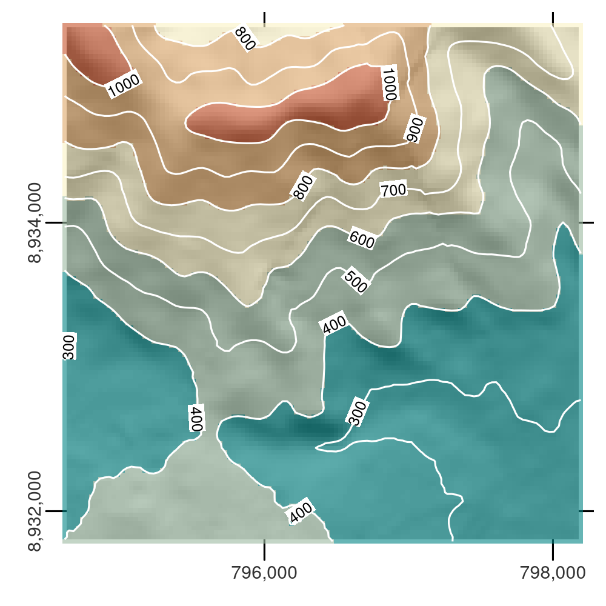

# Raster-vector interactions {#raster-vector}

This chapter requires the following packages:


```r
library(dplyr)
library(terra)
library(sf)
```

## Introduction

\index{raster-vector!interactions} 
This Chapter focuses on interactions between raster and vector geographic data models, introduced in Chapter \@ref(spatial-class).
It includes four main techniques:
raster cropping and masking using vector objects (Section \@ref(raster-cropping));
extracting raster values using different types of vector data (Section \@ref(raster-extraction));
and raster-vector conversion (Sections \@ref(rasterization) and \@ref(spatial-vectorization)).
The above concepts are demonstrated using data used in previous chapters to understand their potential real-world applications.

## Raster cropping

\index{raster-vector!raster cropping} 
Many geographic data projects involve integrating data from many different sources, such as remote sensing images (rasters) and administrative boundaries (vectors).
Often the extent of input raster datasets is larger than the area of interest.
In this case raster **cropping** and **masking** are useful for unifying the spatial extent of input data.
Both operations reduce object memory use and associated computational resources for subsequent analysis steps, and may be a necessary preprocessing step before creating attractive maps involving raster data.

<!--jn:toDo-->
<!-- two possibilities: -->
<!-- 1. explain the need of the use of `vect()` -->
<!-- 2. wait for https://github.com/rspatial/terra/issues/89 -->

We will use two objects to illustrate raster cropping:

- A `SpatRaster` object `srtm` representing elevation (meters above sea level) in south-western Utah.
- A vector (`sf`) object `zion` representing Zion National Park.

Both target and cropping objects must have the same projection.
The following code chunk therefore not only reads the datasets from the **spDataLarge** package (installed in Chapter \@ref(spatial-class)), it also reprojects `zion` (see Section \@ref(reproj-geo-data) for more on reprojection):


```r
srtm = rast(system.file("raster/srtm.tif", package = "spDataLarge"))
zion = st_read(system.file("vector/zion.gpkg", package = "spDataLarge"))
zion = st_transform(zion, crs(srtm))
```

We will use `crop()` from the **terra** package to crop the `srtm` raster.
It reduces the rectangular extent of the object passed to its first argument based on the extent of the object passed to its second argument, as demonstrated in the command below (which generates Figure \@ref(fig:cropmask)(B) --- note the smaller extent of the raster background):


```r
srtm_cropped = crop(srtm, vect(zion))
```

\index{raster-vector!raster masking} 
Related to `crop()` is the **terra** function `mask()`, which sets values outside of the bounds of the object passed to its second argument to `NA`.
The following command therefore masks every cell outside of the Zion National Park boundaries (Figure \@ref(fig:cropmask)(C)):


```r
srtm_masked = mask(srtm, vect(zion))
```

Importantly, we want to use both `crop()` and `mask()` together in most cases. 
This combination of functions would (a) limit the raster's extent to our area of interest and then (b) replace all of the values outside of the area to NA.


```r
srtm_cropped = crop(srtm, vect(zion))
srtm_final = mask(srtm_cropped, vect(zion))
```

Changing the settings of `mask()` yields different results.
Setting `updatevalue = 0`, for example, will set all pixels outside the national park to 0.
Setting `inverse = TRUE` will mask everything *inside* the bounds of the park (see `?mask` for details) (Figure \@ref(fig:cropmask)(D)).


```r
srtm_inv_masked = mask(srtm, vect(zion), inverse = TRUE)
```

<div class="figure" style="text-align: center">

<p class="caption">(\#fig:cropmask)Illustration of raster cropping and raster masking.</p>
</div>

## Raster extraction

<!--jn:toDo-->
<!-- two possibilities: -->
<!-- 1. explain the need of the use of `vect()` -->
<!-- 2. wait for https://github.com/rspatial/terra/issues/89 -->

\index{raster-vector!raster extraction} 
Raster extraction is the process of identifying and returning the values associated with a 'target' raster at specific locations, based on a (typically vector) geographic 'selector' object.
The results depend on the type of selector used (points, lines or polygons) and arguments passed to the `terra::extract()` function, which we use to demonstrate raster extraction.
The reverse of raster extraction --- assigning raster cell values based on vector objects --- is rasterization, described in Section \@ref(rasterization).

The basic example is of extracting the value of a raster cell at specific **points**.
For this purpose, we will use `zion_points`, which contain a sample of 30 locations within the Zion National Park (Figure \@ref(fig:pointextr)). 
The following command extracts elevation values from `srtm` and creates a data frame with points' IDs (one value per vector's row) and related `srtm` values for each point.
Now, we can add the resulting object to our `zion_points` dataset with the `cbind()` function: 


```r
data("zion_points", package = "spDataLarge")
elevation = terra::extract(srtm, vect(zion_points))
zion_points = cbind(zion_points, elevation)
```


<div class="figure" style="text-align: center">

<p class="caption">(\#fig:pointextr)Locations of points used for raster extraction.</p>
</div>

Raster extraction also works with **line** selectors.
Then, it extracts one value for each raster cell touched by a line.
However, the line extraction approach is not recommended to obtain values along the transects as it is hard to get the correct distance between each pair of extracted raster values.

In this case, a better approach is to split the line into many points and then extract the values for these points.
To demonstrate this, the code below creates `zion_transect`, a straight line going from northwest to southeast of the Zion National Park, illustrated in Figure \@ref(fig:lineextr)(A) (see Section \@ref(vector-data) for a recap on the vector data model):


```r
zion_transect = cbind(c(-113.2, -112.9), c(37.45, 37.2)) %>%
  st_linestring() %>% 
  st_sfc(crs = crs(srtm)) %>% 
  st_sf()
```


The utility of extracting heights from a linear selector is illustrated by imagining that you are planning a hike.
The method demonstrated below provides an 'elevation profile' of the route (the line does not need to be straight), useful for estimating how long it will take due to long climbs.

The first step is to add a unique `id` for each transect.
Next, with the `st_segmentize()` function we can add points along our line(s) with a provided density (`dfMaxLength`) and convert them into points with `st_cast()`.


```r
zion_transect$id = 1:nrow(zion_transect)
zion_transect = st_segmentize(zion_transect, dfMaxLength = 250)
zion_transect = st_cast(zion_transect, "POINT")
```

Now, we have a large set of points, and we want to derive a distance between the first point in our transects and each of the subsequent points. 
In this case, we only have one transect, but the code, in principle, should work on any number of transects:


```r
zion_transect = zion_transect %>% 
  group_by(id) %>% 
  mutate(dist = st_distance(geometry)[, 1]) 
```

Finally, we can extract elevation values for each point in our transects and combine this information with our main object.


```r
zion_elev = terra::extract(srtm, vect(zion_transect))
zion_transect = cbind(zion_transect, zion_elev)
```

The resulting `zion_transect` can be used to create elevation profiles, as illustrated in Figure \@ref(fig:lineextr)(B).

<div class="figure" style="text-align: center">

<p class="caption">(\#fig:lineextr)Location of a line used for raster extraction (left) and the elevation along this line (right).</p>
</div>

The final type of geographic vector object for raster extraction is **polygons**.
Like lines, polygons tend to return many raster values per polygon.
This is demonstrated in the command below, which results in a data frame with column names `ID` (the row number of the polygon) and `srtm` (associated elevation values):


```r
zion_srtm_values = terra::extract(x = srtm, y = vect(zion))
```

Such results can be used to generate summary statistics for raster values per polygon, for example to characterize a single region or to compare many regions.
The generation of summary statistics is demonstrated in the code below, which creates the object `zion_srtm_df` containing summary statistics for elevation values in Zion National Park (see Figure \@ref(fig:polyextr)(A)):


```r
group_by(zion_srtm_values, ID) %>% 
  summarize(across(srtm, list(min = min, mean = mean, max = max)))
#> # A tibble: 1 × 4
#>      ID srtm_min srtm_mean srtm_max
#>   <dbl>    <int>     <dbl>    <int>
#> 1     1     1122     1818.     2661
```

<!--jn:toDo -->
<!--should we use the tidyverse name or dplyr here?-->
<!--btw we could also add reference to the tidyverse paper somewhere in the book-->

The preceding code chunk used the **tidyverse**\index{tidyverse (package)} to provide summary statistics for cell values per polygon ID, as described in Chapter \@ref(attr).
The results provide useful summaries, for example that the maximum height in the park is around 2,661 meters above see level (other summary statistics, such as standard deviation, can also be calculated in this way).
Because there is only one polygon in the example a data frame with a single row is returned; however, the method works when multiple selector polygons are used.

The similar approach works for counting occurrences of categorical raster values within polygons.
This is illustrated with a land cover dataset (`nlcd`) from the **spDataLarge** package in Figure \@ref(fig:polyextr)(B), and demonstrated in the code below:


```r
nlcd = rast(system.file("raster/nlcd.tif", package = "spDataLarge"))
zion2 = st_transform(zion, st_crs(nlcd))
zion_nlcd = terra::extract(nlcd, vect(zion2))
zion_nlcd %>% 
  group_by(ID, levels) %>%
  count()
#> # A tibble: 7 × 3
#> # Groups:   ID, levels [7]
#>      ID levels      n
#>   <dbl>  <int>  <int>
#> 1     1      2   4205
#> 2     1      3  98285
#> 3     1      4 298299
#> 4     1      5 203701
#> # … with 3 more rows
```

<div class="figure" style="text-align: center">

<p class="caption">(\#fig:polyextr)Area used for continuous (left) and categorical (right) raster extraction.</p>
</div>

\BeginKnitrBlock{rmdnote}<div class="rmdnote">Polygons usually have irregular shapes, and therefore, a polygon can overlap only some parts of a raster's cells. 
To get more detailed results, the `extract()` function has an argument called `exact`. 
With `exact = TRUE`, we get one more column `fraction` in the output data frame, which contains a fraction of each cell that is covered by the polygon.
This could be useful to calculate a weighted mean for continuous rasters or more precise coverage for categorical rasters.
By default, it is `FALSE` as this operation requires more computations.</div>\EndKnitrBlock{rmdnote}


## Rasterization {#rasterization}

\index{raster-vector!rasterization} 
Rasterization is the conversion of vector objects into their representation in raster objects.
Usually, the output raster is used for quantitative analysis (e.g., analysis of terrain) or modeling.
As we saw in Chapter \@ref(spatial-class) the raster data model has some characteristics that make it conducive to certain methods.
Furthermore, the process of rasterization can help simplify datasets because the resulting values all have the same spatial resolution: rasterization can be seen as a special type of geographic data aggregation.

The **terra** package contains the function `rasterize()` for doing this work.
Its first two arguments are, `x`, vector object to be rasterized and, `y`, a 'template raster' object defining the extent, resolution and CRS of the output.
The geographic resolution of the input raster has a major impact on the results: if it is too low (cell size is too large), the result may miss the full geographic variability of the vector data; if it is too high, computational times may be excessive.
There are no simple rules to follow when deciding an appropriate geographic resolution, which is heavily dependent on the intended use of the results.
Often the target resolution is imposed on the user, for example when the output of rasterization needs to be aligned to the existing raster.

To demonstrate rasterization in action, we will use a template raster that has the same extent and CRS as the input vector data `cycle_hire_osm_projected` (a dataset on cycle hire points in London is illustrated in Figure \@ref(fig:vector-rasterization1)(A)) and spatial resolution of 1000 meters:


```r
cycle_hire_osm = spData::cycle_hire_osm
cycle_hire_osm_projected = st_transform(cycle_hire_osm, "EPSG:27700")
raster_template = rast(ext(cycle_hire_osm_projected), resolution = 1000,
                       crs = st_crs(cycle_hire_osm_projected)$wkt)
```

Rasterization is a very flexible operation: the results depend not only on the nature of the template raster, but also on the type of input vector (e.g., points, polygons) and a variety of arguments taken by the `rasterize()` function.

To illustrate this flexibility we will try three different approaches to rasterization.
First, we create a raster representing the presence or absence of cycle hire points (known as presence/absence rasters).
In this case `rasterize()` requires only one argument in addition to `x` and `y` (the aforementioned vector and raster objects): a value to be transferred to all non-empty cells specified by `field` (results illustrated Figure \@ref(fig:vector-rasterization1)(B)).


```r
ch_raster1 = rasterize(vect(cycle_hire_osm_projected), raster_template,
                       field = 1)
```

The `fun` argument specifies summary statistics used to convert multiple observations in close proximity into associate cells in the raster object.
By default `fun = "last"` is used but other options such as `fun = "length"` can be used, in this case to count the number of cycle hire points in each grid cell (the results of this operation are illustrated in Figure \@ref(fig:vector-rasterization1)(C)).


```r
ch_raster2 = rasterize(vect(cycle_hire_osm_projected), raster_template, 
                       fun = "length")
```

The new output, `ch_raster2`, shows the number of cycle hire points in each grid cell.
The cycle hire locations have different numbers of bicycles described by the `capacity` variable, raising the question, what's the capacity in each grid cell?
To calculate that we must `sum` the field (`"capacity"`), resulting in output illustrated in Figure \@ref(fig:vector-rasterization1)(D), calculated with the following command (other summary functions such as `mean` could be used):


```r
ch_raster3 = rasterize(vect(cycle_hire_osm_projected), raster_template, 
                       field = "capacity", fun = sum)
```

<div class="figure" style="text-align: center">

<p class="caption">(\#fig:vector-rasterization1)Examples of point rasterization.</p>
</div>

Another dataset based on California's polygons and borders (created below) illustrates rasterization of lines.
After casting the polygon objects into a multilinestring, a template raster is created with a resolution of a 0.5 degree:


```r
california = dplyr::filter(us_states, NAME == "California")
california_borders = st_cast(california, "MULTILINESTRING")
raster_template2 = rast(ext(california), resolution = 0.5,
                        crs = st_crs(california)$wkt)
```

When considering line or polygon rasterization, one useful additional argument is `touches`.
By default it is `FALSE`, but when changed to `TRUE` -- all cells that are touched by a line or polygon border get a value.
Line rasterization with `touches = TRUE` is demonstrated in the code below (Figure \@ref(fig:vector-rasterization2)(A)).


```r
california_raster1 = rasterize(vect(california_borders), raster_template2,
                               touches = TRUE)
```

Compare it to a polygon rasterization, with `touches = FALSE` by default, which selects only cells whose centroids are inside the selector polygon, as illustrated in Figure \@ref(fig:vector-rasterization2)(B).


```r
california_raster2 = rasterize(vect(california), raster_template2) 
```

<div class="figure" style="text-align: center">

<p class="caption">(\#fig:vector-rasterization2)Examples of line and polygon rasterizations.</p>
</div>

## Spatial vectorization

\index{raster-vector!spatial vectorization} 
Spatial vectorization is the counterpart of rasterization (Section \@ref(rasterization)), but in the opposite direction.
It involves converting spatially continuous raster data into spatially discrete vector data such as points, lines or polygons.

\BeginKnitrBlock{rmdnote}<div class="rmdnote">Be careful with the wording!
In R, vectorization refers to the possibility of replacing `for`-loops and alike by doing things like `1:10 / 2` (see also @wickham_advanced_2019).</div>\EndKnitrBlock{rmdnote}

The simplest form of vectorization is to convert the centroids of raster cells into points.
`as.points()` does exactly this for all non-`NA` raster grid cells (Figure \@ref(fig:raster-vectorization1)).
Note, here we also used `st_as_sf()` to convert the resulting object to the `sf` class.


```r
elev = rast(system.file("raster/elev.tif", package = "spData"))
elev_point = as.points(elev) %>% 
  st_as_sf()
```


<div class="figure" style="text-align: center">

<p class="caption">(\#fig:raster-vectorization1)Raster and point representation of the elev object.</p>
</div>

Another common type of spatial vectorization is the creation of contour lines representing lines of continuous height or temperatures (isotherms) for example.
We will use a real-world digital elevation model (DEM) because the artificial raster `elev` produces parallel lines (task for the reader: verify this and explain why this happens).
Contour lines can be created with the **terra** function `as.contour()`, which is itself a wrapper around `filled.contour()`, as demonstrated below (not shown):


```r
dem = rast(system.file("raster/dem.tif", package = "spDataLarge"))
cl = as.contour(dem)
plot(dem, axes = FALSE)
plot(cl, add = TRUE)
```

Contours can also be added to existing plots with functions such as `contour()`, `rasterVis::contourplot()` or `tmap::tm_iso()`.
As illustrated in Figure \@ref(fig:contour-tmap), isolines can be labelled.

\index{hillshade}

<div class="figure" style="text-align: center">

<p class="caption">(\#fig:contour-tmap)DEM with hillshading, showing the southern flank of Mt. Mongón overlaid with contour lines.</p>
</div>

The final type of vectorization involves conversion of rasters to polygons.
This can be done with `terra::as.polygons()`, which converts each raster cell into a polygon consisting of five coordinates, all of which are stored in memory (explaining why rasters are often fast compared with vectors!).

This is illustrated below by converting the `grain` object into polygons and subsequently dissolving borders between polygons with the same attribute values (also see the `dissolve` argument in `as.polygons()`).


```r
grain = rast(system.file("raster/grain.tif", package = "spData"))
grain_poly = as.polygons(grain) %>% 
  st_as_sf()
```

<div class="figure" style="text-align: center">

<p class="caption">(\#fig:06-raster-vector-40)Illustration of vectorization of raster (left) into polygon (center) and polygon aggregation (right).</p>
</div>

## Exercises


Some of the exercises use a vector (`zion_points`) and raster dataset (`srtm`) from the **spDataLarge** package.
They also use a polygonal 'convex hull' derived from the vector dataset (`ch`) to represent the area of interest:

```r
library(sf)
library(terra)
library(spData)
zion_points = read_sf(system.file("vector/zion_points.gpkg", package = "spDataLarge"))
srtm = rast(system.file("raster/srtm.tif", package = "spDataLarge"))
ch = st_combine(zion_points) %>%
  st_convex_hull() %>% 
  st_as_sf()
```

E1. Crop the `srtm` raster using (1) the `zion_points` dataset and (2) the `ch` dataset.
Are there any differences in the output maps?
Next, mask `srtm` using these two datasets.
Can you see any difference now?
How can you explain that?


E2. Firstly, extract values from `srtm` at the points represented in `zion_points`.
Next, extract average values of `srtm` using a 90 buffer around each point from `zion_points` and compare these two sets of values. 
When would extracting values by buffers be more suitable than by points alone?


E3. Subset points higher than 3100 meters in New Zealand (the `nz_height` object) and create a template raster with a resolution of 3 km for the extent of the new point dataset. 
Using these two new objects:

- Count numbers of the highest points in each grid cell.
- Find the maximum elevation in each grid cell.


E4. Aggregate the raster counting high points in New Zealand (created in the previous exercise), reduce its geographic resolution by half (so cells are 6 by 6 km) and plot the result.

- Resample the lower resolution raster back to the original resolution of 3 km. How have the results changed?
- Name two advantages and disadvantages of reducing raster resolution.


E5. Polygonize the `grain` dataset and filter all squares representing clay.


- Name two advantages and disadvantages of vector data over raster data.
- When would it be useful to convert rasters to vectors in your work?
