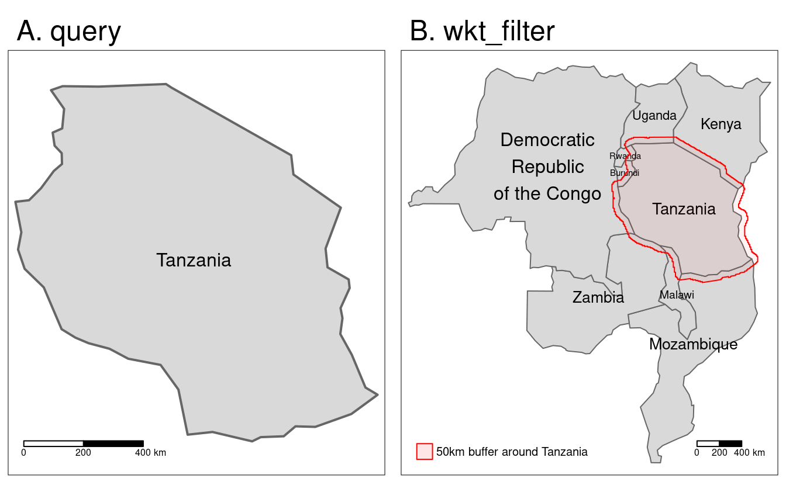

# Geographic data I/O {#read-write}

## Prerequisites {-}

This chapter requires the following packages:


```r
library(sf)
library(terra)
library(dplyr)
library(spData)
#> Warning: multiple methods tables found for 'approxNA'
```

## Introduction

<!--toDo:RL-->
<!--revise and update the following section-->

This chapter is about reading and writing geographic data.
Geographic data *import* is essential for geocomputation\index{geocomputation}: real-world applications are impossible without data.
For others to benefit from the results of your work, data *output* is also vital.
Taken together, we refer to these processes as I/O, short for input/output.

Geographic data I/O is almost always part of a wider process.
It depends on knowing which datasets are *available*, where they can be *found* and how to *retrieve* them.
These topics are covered in Section \@ref(retrieving-data), which describes various *geoportals*, which collectively contain many terabytes of data, and how to use them.
To further ease data access, a number of packages for downloading geographic data have been developed.
These are described in Section \@ref(geographic-data-packages).

There are many geographic file formats, each of which has pros and cons.
These are described in Section \@ref(file-formats).
The process of actually reading and writing such file formats efficiently is not covered until Sections \@ref(data-input) and \@ref(data-output), respectively.
The final Section \@ref(visual-outputs) demonstrates methods for saving visual outputs (maps), in preparation for Chapter \@ref(adv-map) on visualization.

## Retrieving open data {#retrieving-data}

<!--toDo:RL-->
<!--revise and update the following section-->
<!-- we should add http://freegisdata.rtwilson.com/ somewhere -->

\index{open data}
A vast and ever-increasing amount of geographic data is available on the internet, much of which is free to access and use (with appropriate credit given to its providers).
In some ways there is now *too much* data, in the sense that there are often multiple places to access the same dataset.
Some datasets are of poor quality.
In this context, it is vital to know where to look, so the first section covers some of the most important sources.
Various 'geoportals' (web services providing geospatial datasets such as [Data.gov](https://catalog.data.gov/dataset?metadata_type=geospatial)) are a good place to start, providing a wide range of data but often only for specific locations (as illustrated in the updated [Wikipedia page](https://en.wikipedia.org/wiki/Geoportal) on the topic).

\index{geoportals}
Some global geoportals overcome this issue.
The [GEOSS portal](http://www.geoportal.org/) and the [Copernicus Open Access Hub](https://scihub.copernicus.eu/), for example, contain many raster datasets with global coverage.
A wealth of vector datasets can be accessed from the [SEDAC](http://sedac.ciesin.columbia.edu/) portal run by the National Aeronautics and Space Administration (NASA) and the European Union's [INSPIRE geoportal](http://inspire-geoportal.ec.europa.eu/), with global and regional coverage.

Most geoportals provide a graphical interface allowing datasets to be queried based on characteristics such as spatial and temporal extent, the United States Geological Services' [EarthExplorer](https://earthexplorer.usgs.gov/) being a prime example.
*Exploring* datasets interactively on a browser is an effective way of understanding available layers.
*Downloading* data is best done with code, however, from reproducibility and efficiency perspectives.
Downloads can be initiated from the command line using a variety of techniques, primarily via URLs and APIs\index{API} (see the [Sentinel API](https://scihub.copernicus.eu/twiki/do/view/SciHubWebPortal/APIHubDescription) for example).
Files hosted on static URLs can be downloaded with `download.file()`, as illustrated in the code chunk below which accesses US National Parks data from [catalog.data.gov/dataset/national-parks](https://catalog.data.gov/dataset/national-parks):


```r
download.file(url = "https://irma.nps.gov/DataStore/DownloadFile/666527",
              destfile = "nps_boundary.zip")
unzip(zipfile = "nps_boundary.zip")
usa_parks = read_sf(dsn = "nps_boundary.shp")
```

## Geographic data packages

<!--toDo:RL-->
<!--toDo:JN-->
<!--revise and update the following section-->

\index{data packages}
Many R packages have been developed for accessing geographic data, some of which are presented in Table \@ref(tab:datapackages).
These provide interfaces to one or more spatial libraries or geoportals and aim to make data access even quicker from the command line.

<!--toDo:JN-->
<!-- update the table -->


<table class="table" style="margin-left: auto; margin-right: auto;">
<caption>(\#tab:datapackages)Selected R packages for geographic data retrieval.</caption>
 <thead>
  <tr>
   <th style="text-align:left;"> Package </th>
   <th style="text-align:left;"> Description </th>
  </tr>
 </thead>
<tbody>
  <tr>
   <td style="text-align:left;"> osmdata </td>
   <td style="text-align:left;"> Download and import small OpenStreetMap datasets. </td>
  </tr>
  <tr>
   <td style="text-align:left;"> osmextract </td>
   <td style="text-align:left;"> Download and import large OpenStreetMap datasets. </td>
  </tr>
  <tr>
   <td style="text-align:left;"> geodata </td>
   <td style="text-align:left;"> Download and import imports administrative, elevation, WorldClim data. </td>
  </tr>
  <tr>
   <td style="text-align:left;"> rnaturalearth </td>
   <td style="text-align:left;"> Access to Natural Earth vector and raster data. </td>
  </tr>
</tbody>
</table>

<!--toDo:JN-->
<!-- new ideas: 
geocoding -- tidygeocoder, 
rstac - https://gist.github.com/h-a-graham/420434c158c139180f5eb82859099082,
censuses (tigris book ref - https://walker-data.com/census-r/working-with-census-data-outside-the-united-states.html); tigris, tidycensus, geobr, RCzechia, bcdata, cancensus, idbr
rgee - see https://github.com/loreabad6/30DayMapChallenge/blob/main/scripts/day08_blue.R

check: geoTS, sta, FedData, elevatr, modistsp, giscoR, climateR, KrigR, getSpatialData, https://rspatialdata.github.io/

https://github.com/eblondel/geosapi
raster/nonraster tables 
https://github.com/ropensci/rsat
-->

It should be emphasized that Table \@ref(tab:datapackages) represents only a small number of available geographic data packages.
<!--toDo:JN-->
<!-- update the list -->
Other notable packages include **GSODR**, which provides Global Summary Daily Weather Data in R (see the package's [README](https://github.com/ropensci/GSODR) for an overview of weather data sources);
**tidycensus** and **tigris**, which provide socio-demographic vector data for the USA; and **hddtools**, which provides access to a range of hydrological datasets.

Each data package has its own syntax for accessing data.
This diversity is demonstrated in the subsequent code chunks, which show how to get data using three packages from Table \@ref(tab:datapackages).
Country borders are often useful and these can be accessed with the `ne_countries()` function from the **rnaturalearth** package as follows:


```r
library(rnaturalearth)
usa = ne_countries(country = "United States of America") # United States borders
class(usa)
#> [1] "SpatialPolygonsDataFrame"
#> attr(,"package")
#> [1] "sp"
# alternative way of accessing the data, with geodata
# geodata::gadm("USA", level = 0, path = tempdir())
```

By default **rnaturalearth** returns objects of class `Spatial*`.
The result can be converted into an `sf` objects with `st_as_sf()` as follows:


```r
usa_sf = st_as_sf(usa)
```

<!--toDo:JN-->
<!-- add info about other world-data packages -->
<!-- https://github.com/wmgeolab/rgeoboundaries -->
<!-- https://journals.plos.org/plosone/article?id=10.1371/journal.pone.0231866 -->
<!-- https://www.geoboundaries.org/ -->

A second example downloads a series of rasters containing global monthly precipitation sums with spatial resolution of ten minutes (~18.5 km at the equator) using the **geodata** package.
The result is a multilayer object of class `SpatRaster`.


```r
library(geodata)
worldclim_prec = worldclim_global("prec", res = 10, path = tempdir())
class(worldclim_prec)
#> [1] "SpatRaster"
#> attr(,"package")
#> [1] "terra"
```

A third example uses the **osmdata** package [@R-osmdata] to find parks from the OpenStreetMap (OSM) database\index{OpenStreetMap}.
As illustrated in the code-chunk below, queries begin with the function `opq()` (short for OpenStreetMap query), the first argument of which is bounding box, or text string representing a bounding box (the city of Leeds in this case).
The result is passed to a function for selecting which OSM elements we're interested in (parks in this case), represented by *key-value pairs*.
Next, they are passed to the function `osmdata_sf()` which does the work of downloading the data and converting it into a list of `sf` objects (see `vignette('osmdata')` for further details):


```r
library(osmdata)
parks = opq(bbox = "leeds uk") %>% 
  add_osm_feature(key = "leisure", value = "park") %>% 
  osmdata_sf()
```

A limitation with the **osmdata** package is that it is *rate limited*, meaning that it cannot download large OSM datasets (e.g. all the OSM data for a large city).
To overcome this limitation, the **osmextract** package was developed, which can be used to download and import binary `.pbf` files containing compressed versions of the OSM database for pre-defined regions.
<!--todo: add proper citation-->

OpenStreetMap is a vast global database of crowd-sourced data, is growing daily, and has a wider ecosystem of tools enabling easy access to the data, from the [Overpass turbo](https://overpass-turbo.eu/) web service for rapid development and testing of OSM queries to [osm2pgsql](https://osm2pgsql.org/) for importing the data into a PostGIS database.
Although the quality of datasets derived from OSM varies, the data source and wider OSM ecosystems have many advantages: they provide datasets that are available globally, free of charge, and constantly improving thanks to an army of volunteers.
Using OSM encourages 'citizen science' and contributions back to the digital commons (you can start editing data representing a part of the world you know well at [www.openstreetmap.org](https://www.openstreetmap.org)).
Further examples of OSM data in action are provided in Chapters \@ref(gis), \@ref(transport) and \@ref(location).

Sometimes, packages come with built-in datasets.
These can be accessed in four ways: by attaching the package (if the package uses 'lazy loading' as **spData** does), with `data(dataset, package = mypackage)`, by referring to the dataset with `mypackage::dataset`, or with `system.file(filepath, package = mypackage)` to access raw data files.
The following code chunk illustrates the latter two options using the `world` dataset (already loaded by attaching its parent package with `library(spData)`):^[
For more information on data import with R packages, see Sections 5.5 and 5.6 of @gillespie_efficient_2016.
]


```r
world2 = spData::world
world3 = read_sf(system.file("shapes/world.gpkg", package = "spData"))
```

The last example, `system.file("shapes/world.gpkg", package = "spData")`, returns a path to the `world.gpkg` file, which is stored inside of the `"shapes/"` folder of the **spData** package.

<!--toDo:jn-->
<!-- consider data from rgee -->

## Geographic web services

<!--toDo:RL-->
<!--revise and update the following section-->
<!--jn: Robin, I am leaving this section entirely to you -- I have zero knowledge about OWS-->

\index{geographic web services}
In an effort to standardize web APIs for accessing spatial data, the Open Geospatial Consortium (OGC) has created a number of specifications for web services (collectively known as OWS, which is short for OGC Web Services).
These specifications include the Web Feature Service (WFS)\index{geographic web services!WFS}, Web Map Service (WMS)\index{geographic web services!WMS}, Web Map Tile Service (WMTS)\index{geographic web services!WMTS}, the Web Coverage Service (WCS)\index{geographic web services!WCS} and even a Web Processing Service (WPS)\index{geographic web services!WPS}.
Map servers such as PostGIS have adopted these protocols, leading to standardization of queries.
Like other web APIs, OWS APIs use a 'base URL', an 'endpoint' and 'URL query arguments' following a `?` to request data (see the [`best-practices-api-packages`](https://httr.r-lib.org/articles/api-packages.html) vignette in the **httr** package).

There are many requests that can be made to a OWS service.
One of the most fundamental is `getCapabilities`, demonstrated with **httr** below.
The code chunk demonstrates how API\index{API} queries can be constructed and dispatched, in this case to discover the capabilities of a service run by the Food and Agriculture Organization of the United Nations (FAO):


```r
base_url = "http://www.fao.org"
endpoint = "/figis/geoserver/wfs"
q = list(request = "GetCapabilities")
res = httr::GET(url = httr::modify_url(base_url, path = endpoint), query = q)
res$url
#> [1] "https://www.fao.org/figis/geoserver/wfs?request=GetCapabilities"
```

The above code chunk demonstrates how API\index{API} requests can be constructed programmatically with the `GET()` function, which takes a base URL and a list of query parameters which can easily be extended.
The result of the request is saved in `res`, an object of class `response` defined in the **httr** package, which is a list containing information of the request, including the URL.
As can be seen by executing `browseURL(res$url)`, the results can also be read directly in a browser.
One way of extracting the contents of the request is as follows:


```r
txt = httr::content(res, "text")
xml = xml2::read_xml(txt)
```


```r
xml
#> {xml_document} ...
#> [1] <ows:ServiceIdentification>\n  <ows:Title>GeoServer WFS...
#> [2] <ows:ServiceProvider>\n  <ows:ProviderName>UN-FAO Fishe...
#> ...
```

Data can be downloaded from WFS services with the `GetFeature` request and a specific `typeName` (as illustrated in the code chunk below).


Available names differ depending on the accessed web feature service.
One can extract them programmatically using web technologies [@nolan_xml_2014] or scrolling manually through the contents of the `GetCapabilities` output in a browser.


```r
qf = list(request = "GetFeature", typeName = "area:FAO_AREAS")
file = tempfile(fileext = ".gml")
httr::GET(url = base_url, path = endpoint, query = qf, httr::write_disk(file))
fao_areas = read_sf(file)
```

Note the use of `write_disk()` to ensure that the results are written to disk rather than loaded into memory, allowing them to be imported with **sf**.
This example shows how to gain low-level access to web services using **httr**, which can be useful for understanding how web services work.
For many everyday tasks, however, a higher-level interface may be more appropriate, and a number of R packages, and tutorials, have been developed precisely for this purpose.

Packages **ows4R**, **rwfs** and **sos4R** have been developed for working with OWS services in general, WFS and the sensor observation service (SOS) respectively.
As of October 2018, only **ows4R** is on CRAN.
The package's basic functionality is demonstrated below, in commands that get all `FAO_AREAS` as we did in the previous code chunk:^[
To filter features on the server before downloading them, the argument `cql_filter` can be used. Adding `cql_filter = URLencode("F_CODE= '27'")` to the command, for example, would instruct the server to only return the feature with values in the `F_CODE` column equal to 27.
]


```r
library(ows4R)
wfs = WFSClient$new("http://www.fao.org/figis/geoserver/wfs",
                      serviceVersion = "1.0.0", logger = "INFO")
fao_areas = wfs$getFeatures("area:FAO_AREAS")
```


There is much more to learn about web services and much potential for development of R-OWS interfaces, an active area of development.
For further information on the topic, we recommend examples from European Centre for Medium-Range Weather Forecasts (ECMWF) services at [github.com/OpenDataHack](https://github.com/OpenDataHack/data_service_catalogue) and reading-up on OCG Web Services at [opengeospatial.org](http://www.opengeospatial.org/standards).


## File formats

\index{file formats}
Geographic datasets are usually stored as files or in spatial databases.
File formats can either store vector or raster data, while spatial databases such as [PostGIS](https://postgis.net/) can store both (see also Section \@ref(postgis)).
Today the variety of file formats may seem bewildering but there has been much consolidation and standardization since the beginnings of GIS software in the 1960s when the first widely distributed program ([SYMAP](https://news.harvard.edu/gazette/story/2011/10/the-invention-of-gis/)) for spatial analysis was created at Harvard University [@coppock_history_1991].

\index{GDAL}
GDAL (which should be pronounced "goo-dal", with the double "o" making a reference to object-orientation), the Geospatial Data Abstraction Library, has resolved many issues associated with incompatibility between geographic file formats since its release in 2000.
GDAL provides a unified and high-performance interface for reading and writing of many raster and vector data formats.^[As we mentioned in Chapter \@ref(geometric-operations), GDAL also contains a set of utility functions allowing for raster mosaicing, resampling, cropping, and reprojecting, etc.]
Many open and proprietary GIS programs, including GRASS, ArcGIS\index{ArcGIS} and QGIS\index{QGIS}, use GDAL\index{GDAL} behind their GUIs\index{graphical user interface} for doing the legwork of ingesting and spitting out geographic data in appropriate formats.

GDAL\index{GDAL} provides access to more than 200 vector and raster data formats.
Table \@ref(tab:formats) presents some basic information about selected and often used spatial file formats.

<table>
<caption>(\#tab:formats)Selected spatial file formats.</caption>
 <thead>
  <tr>
   <th style="text-align:left;"> Name </th>
   <th style="text-align:left;"> Extension </th>
   <th style="text-align:left;"> Info </th>
   <th style="text-align:left;"> Type </th>
   <th style="text-align:left;"> Model </th>
  </tr>
 </thead>
<tbody>
  <tr>
   <td style="text-align:left;"> ESRI Shapefile </td>
   <td style="text-align:left;width: 7em; "> .shp (the main file) </td>
   <td style="text-align:left;width: 14em; "> Popular format consisting of at least three files. No support for: files &gt; 2GB;  mixed types; names &gt; 10 chars; cols &gt; 255. </td>
   <td style="text-align:left;"> Vector </td>
   <td style="text-align:left;width: 7em; "> Partially open </td>
  </tr>
  <tr>
   <td style="text-align:left;"> GeoJSON </td>
   <td style="text-align:left;width: 7em; "> .geojson </td>
   <td style="text-align:left;width: 14em; "> Extends the JSON exchange format by including a subset of the simple feature representation. </td>
   <td style="text-align:left;"> Vector </td>
   <td style="text-align:left;width: 7em; "> Open </td>
  </tr>
  <tr>
   <td style="text-align:left;"> KML </td>
   <td style="text-align:left;width: 7em; "> .kml </td>
   <td style="text-align:left;width: 14em; "> XML-based format for spatial visualization, developed for use with Google Earth. Zipped KML file forms the KMZ format. </td>
   <td style="text-align:left;"> Vector </td>
   <td style="text-align:left;width: 7em; "> Open </td>
  </tr>
  <tr>
   <td style="text-align:left;"> GPX </td>
   <td style="text-align:left;width: 7em; "> .gpx </td>
   <td style="text-align:left;width: 14em; "> XML schema created for exchange of GPS data. </td>
   <td style="text-align:left;"> Vector </td>
   <td style="text-align:left;width: 7em; "> Open </td>
  </tr>
  <tr>
   <td style="text-align:left;"> FlatGeobuf </td>
   <td style="text-align:left;width: 7em; "> .fgb </td>
   <td style="text-align:left;width: 14em; "> Single file format allowing for quick reading and writing of vector data. Has streaming capabilities. </td>
   <td style="text-align:left;"> Vector </td>
   <td style="text-align:left;width: 7em; "> Open </td>
  </tr>
  <tr>
   <td style="text-align:left;"> GeoTIFF </td>
   <td style="text-align:left;width: 7em; "> .tif/.tiff </td>
   <td style="text-align:left;width: 14em; "> Popular raster format. A TIFF file containing additional spatial metadata. </td>
   <td style="text-align:left;"> Raster </td>
   <td style="text-align:left;width: 7em; "> Open </td>
  </tr>
  <tr>
   <td style="text-align:left;"> Arc ASCII </td>
   <td style="text-align:left;width: 7em; "> .asc </td>
   <td style="text-align:left;width: 14em; "> Text format where the first six lines represent the raster header, followed by the raster cell values arranged in rows and columns. </td>
   <td style="text-align:left;"> Raster </td>
   <td style="text-align:left;width: 7em; "> Open </td>
  </tr>
  <tr>
   <td style="text-align:left;"> SQLite/SpatiaLite </td>
   <td style="text-align:left;width: 7em; "> .sqlite </td>
   <td style="text-align:left;width: 14em; "> Standalone  relational database, SpatiaLite is the spatial extension of SQLite. </td>
   <td style="text-align:left;"> Vector and raster </td>
   <td style="text-align:left;width: 7em; "> Open </td>
  </tr>
  <tr>
   <td style="text-align:left;"> ESRI FileGDB </td>
   <td style="text-align:left;width: 7em; "> .gdb </td>
   <td style="text-align:left;width: 14em; "> Spatial and nonspatial objects created by ArcGIS. Allows: multiple feature classes; topology. Limited support from GDAL. </td>
   <td style="text-align:left;"> Vector and raster </td>
   <td style="text-align:left;width: 7em; "> Proprietary </td>
  </tr>
  <tr>
   <td style="text-align:left;"> GeoPackage </td>
   <td style="text-align:left;width: 7em; "> .gpkg </td>
   <td style="text-align:left;width: 14em; "> Lightweight database container based on SQLite allowing an easy and platform-independent exchange of geodata </td>
   <td style="text-align:left;"> Vector and raster </td>
   <td style="text-align:left;width: 7em; "> Open </td>
  </tr>
</tbody>
</table>
\index{Shapefile}
\index{GeoPackage}

An important development ensuring the standardization and open-sourcing of file formats was the founding of the Open Geospatial Consortium ([OGC](http://www.opengeospatial.org/)) in 1994.
Beyond defining the simple features data model (see Section \@ref(intro-sf)), the OGC also coordinates the development of open standards, for example as used in file formats such as KML\index{KML} and GeoPackage\index{GeoPackage}.
Open file formats of the kind endorsed by the OGC have several advantages over proprietary formats: the standards are published, ensure transparency and open up the possibility for users to further develop and adjust the file formats to their specific needs.

ESRI Shapefile\index{Shapefile} is the most popular vector data exchange format; however, it is not an open format (though its specification is open).
It was developed in the early 1990s and has a number of limitations.
First of all, it is a multi-file format, which consists of at least three files.
It only supports 255 columns, column names are restricted to ten characters and the file size limit is 2 GB.
Furthermore, ESRI Shapefile\index{Shapefile} does not support all possible geometry types, for example, it is unable to distinguish between a polygon and a multipolygon.^[To learn more about ESRI Shapefile limitations and possible alternative file formats, visit http://switchfromshapefile.org/.]
Despite these limitations, a viable alternative had been missing for a long time. 
In the meantime, [GeoPackage](https://www.geopackage.org/)\index{GeoPackage} emerged, and seems to be a more than suitable replacement candidate for ESRI Shapefile.
Geopackage is a format for exchanging geospatial information and an OGC standard. 
The GeoPackage standard describes the rules on how to store geospatial information in a tiny SQLite container.
Hence, GeoPackage is a lightweight spatial database container, which allows the storage of vector and raster data but also of non-spatial data and extensions.
Aside from GeoPackage, there are other geospatial data exchange formats worth checking out (Table \@ref(tab:formats)).

\index{GeoTIFF}
\index{COG}
The GeoTIFF format seems to be the most prominent raster data format.
It allows spatial information, such as CRS, to be embedded within a TIFF file. 
Similar to ESRI Shapefile, this format was firstly developed in the 1990s, but as an open format.
Additionally, GeoTIFF is still being expanded and improved.
One of the most significant recent addition to the GeoTIFF format is its variant called COG (*Cloud Optimized GeoTIFF*).
Raster objects saved as COGs can be hosted on HTTP servers, so other people can read only parts of the file without downloading the whole file.

<!-- jn:toDo-->
<!-- add ref to cog example if we will made one-->

## Data input (I) {#data-input}

Executing commands such as `sf::read_sf()` (the main function we use for loading vector data) or `terra::rast()` (the main function used for loading raster data) silently sets off a chain of events that reads data from files.
Moreover, there are many R packages containing a wide range of geographic data or providing simple access to different data sources.
All of them load the data into R or, more precisely, assign objects to your workspace, stored in RAM accessible from the [`.GlobalEnv`](http://adv-r.had.co.nz/Environments.html) of the R session.

### Vector data {#iovec}

\index{vector!data input}
Spatial vector data comes in a wide variety of file formats.
Most popular representations such as `.geojson` and `.gpkg` files can be imported directly into R with the **sf** function `read_sf()` (or the equivalent `st_read()`), which uses [GDAL's vector drivers](https://gdal.org/drivers/vector/index.html)\index{GDAL} behind the scenes.
`st_drivers()` returns a data frame containing `name` and `long_name` in the first two columns, and features of each driver available to GDAL (and therefore **sf**), including ability to write data and store raster data in the subsequent columns, as illustrated for key file formats in Table \@ref(tab:drivers).  
The following commands show the first three drivers reported the computer's GDAL installation (results can vary depending on the GDAL version installed) and a summary of the their features.
Note that the majority of drivers can write data (51 out of 87) while only 16 formats can efficiently represent raster data in addition to vector data (see `?st_drivers()` for details):


```r
sf_drivers = st_drivers()
head(sf_drivers, n = 3)
summary(sf_drivers[-c(1:2)])
```

<table>
<caption>(\#tab:drivers)Popular drivers/formats for reading/writing vector data.</caption>
 <thead>
  <tr>
   <th style="text-align:left;"> name </th>
   <th style="text-align:left;"> long_name </th>
   <th style="text-align:left;"> write </th>
   <th style="text-align:left;"> copy </th>
   <th style="text-align:left;"> is_raster </th>
   <th style="text-align:left;"> is_vector </th>
   <th style="text-align:left;"> vsi </th>
  </tr>
 </thead>
<tbody>
  <tr>
   <td style="text-align:left;"> ESRI Shapefile </td>
   <td style="text-align:left;width: 7em; "> ESRI Shapefile </td>
   <td style="text-align:left;"> TRUE </td>
   <td style="text-align:left;"> FALSE </td>
   <td style="text-align:left;"> FALSE </td>
   <td style="text-align:left;"> TRUE </td>
   <td style="text-align:left;"> TRUE </td>
  </tr>
  <tr>
   <td style="text-align:left;"> GPX </td>
   <td style="text-align:left;width: 7em; "> GPX </td>
   <td style="text-align:left;"> TRUE </td>
   <td style="text-align:left;"> FALSE </td>
   <td style="text-align:left;"> FALSE </td>
   <td style="text-align:left;"> TRUE </td>
   <td style="text-align:left;"> TRUE </td>
  </tr>
  <tr>
   <td style="text-align:left;"> KML </td>
   <td style="text-align:left;width: 7em; "> Keyhole Markup Language (KML) </td>
   <td style="text-align:left;"> TRUE </td>
   <td style="text-align:left;"> FALSE </td>
   <td style="text-align:left;"> FALSE </td>
   <td style="text-align:left;"> TRUE </td>
   <td style="text-align:left;"> TRUE </td>
  </tr>
  <tr>
   <td style="text-align:left;"> GeoJSON </td>
   <td style="text-align:left;width: 7em; "> GeoJSON </td>
   <td style="text-align:left;"> TRUE </td>
   <td style="text-align:left;"> FALSE </td>
   <td style="text-align:left;"> FALSE </td>
   <td style="text-align:left;"> TRUE </td>
   <td style="text-align:left;"> TRUE </td>
  </tr>
  <tr>
   <td style="text-align:left;"> GPKG </td>
   <td style="text-align:left;width: 7em; "> GeoPackage </td>
   <td style="text-align:left;"> TRUE </td>
   <td style="text-align:left;"> TRUE </td>
   <td style="text-align:left;"> TRUE </td>
   <td style="text-align:left;"> TRUE </td>
   <td style="text-align:left;"> TRUE </td>
  </tr>
</tbody>
</table>

<!-- One of the major advantages of **sf** is that it is fast. -->
<!-- reference to the vignette -->
The first argument of `read_sf()` is `dsn`, which should be a text string or an object containing a single text string.
The content of a text string could vary between different drivers.
In most cases, as with the ESRI Shapefile\index{Shapefile} (`.shp`) or the `GeoPackage`\index{GeoPackage} format (`.gpkg`), the `dsn` would be a file name.
`read_sf()` guesses the driver based on the file extension, as illustrated for a `.gpkg` file below:


```r
vector_filepath = system.file("shapes/world.gpkg", package = "spData")
world = read_sf(vector_filepath, quiet = TRUE)
```

For some drivers, `dsn` could be provided as a folder name, access credentials for a database, or a GeoJSON string representation (see the examples of the `read_sf()` help page for more details).

Some vector driver formats can store multiple data layers.
By default, `read_sf()` automatically reads the first layer of the file specified in `dsn`; however, using the `layer` argument you can specify any other layer.

The `read_sf()` function also allows for reading just parts of the file into RAM with two possible mechanisms.
The first one is related to the `query` argument, which allows specifying what part of the data to read with [the OGR SQL query text](https://gdal.org/user/ogr_sql_dialect.html).
An example below extracts data for Tanzania only (Figure \@ref(fig:readsfquery):A).
It is done by specifying that we want to get all columns (`SELECT *`) from the `"world"` layer for which the `name_long` equals to `"Tanzania"`:


```r
tanzania = read_sf(vector_filepath,
                   query = 'SELECT * FROM "world" WHERE name_long = "Tanzania"')
```

The second mechanism uses the `wkt_filter` argument.
This argument expects a well-known text representing study area for which we want to extract the data.
Let's try it using a small example -- we want to read polygons from our file that intersect with the buffer of 50,000 meters of Tanzania's borders.
To do it, we need to prepare our "filter" by (a) creating the buffer (Section \@ref(buffers)), (b) converting the `sf` buffer object into an `sfc` geometry object with `st_geometry()`, and (c) translating geometries into their well-known text representation with `st_as_text()`:


```r
tanzania_buf = st_buffer(tanzania, 50000)
tanzania_buf_geom = st_geometry(tanzania_buf)
tanzania_buf_wkt = st_as_text(tanzania_buf_geom)
```

Now, we can apply this "filter" using the `wkt_filter` argument.


```r
tanzania_neigh = read_sf(vector_filepath,
                         wkt_filter = tanzania_buf_wkt)
```

Our result, shown in Figure \@ref(fig:readsfquery):B, contains Tanzania and every country within its 50 km buffer.

<div class="figure" style="text-align: center">

<p class="caption">(\#fig:readsfquery)Reading a subset of the vector data using a query (A) and a wkt filter (B).</p>
</div>

Naturally, some options are specific to certain drivers.^[
A list of supported vector formats and options can be found at http://gdal.org/ogr_formats.html.
]
For example, think of coordinates stored in a spreadsheet format (`.csv`).
To read in such files as spatial objects, we naturally have to specify the names of the columns (`X` and `Y` in our example below) representing the coordinates.
We can do this with the help of the `options` parameter.
To find out about possible options, please refer to the 'Open Options' section of the corresponding GDAL\index{GDAL} driver description.
For the comma-separated value (csv) format, visit http://www.gdal.org/drv_csv.html.


```r
cycle_hire_txt = system.file("misc/cycle_hire_xy.csv", package = "spData")
cycle_hire_xy = read_sf(cycle_hire_txt, options = c("X_POSSIBLE_NAMES=X",
                                                    "Y_POSSIBLE_NAMES=Y"))
```

Instead of columns describing xy-coordinates, a single column can also contain the geometry information.
Well-known text (WKT)\index{well-known text}, well-known binary (WKB)\index{well-known binary}, and the GeoJSON formats are examples of this.
For instance, the `world_wkt.csv` file has a column named `WKT` representing polygons of the world's countries.
We will again use the `options` parameter to indicate this.
<!--toDo:JN-->
<!--add a comment about st_read-->
<!-- Here, we will use `read_sf()`, the tidyverse-flavoured version of `st_read()`: strings are parsed as characters instead of factors and the resulting data frame is a [tibble](https://r4ds.had.co.nz/tibbles.html). The driver name is also not printed to the console. -->


```r
world_txt = system.file("misc/world_wkt.csv", package = "spData")
world_wkt = read_sf(world_txt, options = "GEOM_POSSIBLE_NAMES=WKT")
# the same as
world_wkt2 = st_read(world_txt, options = "GEOM_POSSIBLE_NAMES=WKT", 
                    quiet = TRUE, stringsAsFactors = FALSE, as_tibble = TRUE)
```


\BeginKnitrBlock{rmdnote}<div class="rmdnote">Not all of the supported vector file formats store information about their coordinate reference system.
In these situations, it is possible to add the missing information using the `st_set_crs()` function.
Please refer also to Section \@ref(crs-intro) for more information.</div>\EndKnitrBlock{rmdnote}

As a final example, we will show how `read_sf()` also reads KML files.
A KML file stores geographic information in XML format - a data format for the creation of web pages and the transfer of data in an application-independent way [@nolan_xml_2014].
Here, we access a KML file from the web.
This file contains more than one layer.
`st_layers()` lists all available layers.
We choose the first layer `Placemarks` and say so with the help of the `layer` parameter in `read_sf()`.


```r
u = "https://developers.google.com/kml/documentation/KML_Samples.kml"
download.file(u, "KML_Samples.kml")
st_layers("KML_Samples.kml")
#> Driver: LIBKML 
#> Available layers:
#>               layer_name geometry_type features fields
#> 1             Placemarks                      3     11
#> 2      Styles and Markup                      1     11
#> 3       Highlighted Icon                      1     11
#> 4        Ground Overlays                      1     11
#> 5        Screen Overlays                      0     11
#> 6                  Paths                      6     11
#> 7               Polygons                      0     11
#> 8          Google Campus                      4     11
#> 9       Extruded Polygon                      1     11
#> 10 Absolute and Relative                      4     11
kml = read_sf("KML_Samples.kml", layer = "Placemarks")
```

All the examples presented in this section so far have used the **sf** package for geographic data import.
It is fast and flexible but it may be worth looking at other packages for specific file formats.
An example is the **geojsonsf** package.
A [benchmark](https://github.com/ATFutures/geobench) suggests it is around 10 times faster than the **sf** package for reading `.geojson`.


### Raster data

\index{raster!data input}
Similar to vector data, raster data comes in many file formats with some of them supporting multilayer files.
**terra**'s `rast()` command reads in a single layer when a file with just one layer is provided.


```r
raster_filepath = system.file("raster/srtm.tif", package = "spDataLarge")
single_layer = rast(raster_filepath)
```

It also works in case you want to read a multilayer file.


```r
multilayer_filepath = system.file("raster/landsat.tif", package = "spDataLarge")
multilayer_rast = rast(multilayer_filepath)
```

\index{vsicurl}
\index{GDAL}
\index{COG}
All of the previous examples read spatial information from files stored on your hard drive. 
However, GDAL also allows reading data directly from online resources, such as HTTP/HTTPS/FTP web resources.
The only thing we need to do is to add a `/vsicurl/` prefix before the path to the file.
Let's try it by connecting to the global monthly snow probability at 500 m resolution for the period 2000–2012 [@hengl_t_2021_5774954].
Snow probability for December is stored as a Cloud Optimized GeoTIFF (COG) file (see Section \@ref(file-formats)) at https://zenodo.org/record/5774954/files/clm_snow.prob_esacci.dec_p.90_500m_s0..0cm_2000..2012_v2.0.tif.
To read an online file, we just need to provide its URL together with the `/vsicurl/` prefix.


```r
myurl = "/vsicurl/https://zenodo.org/record/5774954/files/clm_snow.prob_esacci.dec_p.90_500m_s0..0cm_2000..2012_v2.0.tif"
snow = rast(myurl)
snow
#> class       : SpatRaster 
#> dimensions  : 35849, 86400, 1  (nrow, ncol, nlyr)
#> resolution  : 0.00417, 0.00417  (x, y)
#> extent      : -180, 180, -62, 87.4  (xmin, xmax, ymin, ymax)
#> coord. ref. : lon/lat WGS 84 (EPSG:4326) 
#> source      : clm_snow.prob_esacci.dec_p.90_500m_s0..0cm_2000..2012_v2.0.tif 
#> name        : clm_snow.prob_esacci.dec_p.90_500m_s0..0cm_2000..2012_v2.0
```

Due to the fact that the input data is COG, we are actually not reading this file to our RAM, but rather creating a connection to it without obtaining any values.
Its values will be read if we apply any value-based operation.
This allows us also to just read a tiny portion of the data without downloading the entire file.
For example, we can get the snow probability for December in Reykjavik by specifying its coordinates and applying the `extract()` function:


```r
rey = data.frame(lon = -21.94, lat = 64.15)
snow_rey = extract(snow, rey)
snow_rey
#>   ID clm_snow.prob_esacci.dec_p.90_500m_s0..0cm_2000..2012_v2.0
#> 1  1                                                         70
```

This way, we just downloaded a single value instead of the whole, large GeoTIFF file.

The above example just shows one simple (but useful) case, but there is more to explore.
The `/vsicurl/` prefix also works not only for raster but also for vector file formats allowing to read vectors directly from online storage.
Importantly, it is not the only prefix provided by GDAL -- many more exist, such as `/vsizip/` to read spatial files from ZIP archives without decompressing them beforehand or `/vsis3/` for on-the-fly reading files available in AWS S3 buckets.
You can learn more about it at https://gdal.org/user/virtual_file_systems.html.

<!-- ### Databases -->

<!-- jn:toDo-->
<!-- postgis input example -->

## Data output (O) {#data-output}

Writing geographic data allows you to convert from one format to another and to save newly created objects.
Depending on the data type (vector or raster), object class (e.g., `sf` or `SpatRaster`), and type and amount of stored information (e.g., object size, range of values), it is important to know how to store spatial files in the most efficient way.
The next two sections will demonstrate how to do this.

### Vector data

\index{vector!data output}


The counterpart of `read_sf()` is `write_sf()`.
It allows you to write **sf** objects to a wide range of geographic vector file formats, including the most common such as `.geojson`, `.shp` and `.gpkg`.
Based on the file name, `write_sf()` decides automatically which driver to use. 
The speed of the writing process depends also on the driver.


```r
write_sf(obj = world, dsn = "world.gpkg")
```

**Note**: if you try to write to the same data source again, the function will overwrite the file:


```r
write_sf(obj = world, dsn = "world.gpkg")
```

Instead of overwriting the file, we could add a new layer to the file with `append = TRUE`, which is supported my several spatial formats, including GeoPackage.


```r
write_sf(obj = world, dsn = "world_many_layers.gpkg", append = TRUE)
```

Alternatively, you can use `st_write()` since it is equivalent to `write_sf()`.
However, it has different defaults -- it does not overwrite files (returns an error when you try to do it) and shows a short summary of the written file format and the object.


```r
st_write(obj = world, dsn = "world2.gpkg")
#> Writing layer `world2' to data source `world2.gpkg' using driver `GPKG'
#> Writing 177 features with 10 fields and geometry type Multi Polygon.
```

The `layer_options` argument could be also used for many different purposes.
One of them is to write spatial data to a text file.
This can be done by specifying `GEOMETRY` inside of `layer_options`. 
It could be either `AS_XY` for simple point datasets (it creates two new columns for coordinates) or `AS_WKT` for more complex spatial data (one new column is created which contains the well-known text representation of spatial objects).


```r
write_sf(cycle_hire_xy, "cycle_hire_xy.csv", layer_options = "GEOMETRY=AS_XY")
write_sf(world_wkt, "world_wkt.csv", layer_options = "GEOMETRY=AS_WKT")
```


### Raster data

\index{raster!data output}
The `writeRaster()` function saves `SpatRaster` objects to files on disk. 
The function expects input regarding output data type and file format, but also accepts GDAL options specific to a selected file format (see `?writeRaster` for more details).

\index{raster!data types}
The **terra** package offers nine data types when saving a raster: LOG1S, INT1S, INT1U, INT2S, INT2U, INT4S, INT4U, FLT4S, and FLT8S.^[
Using INT4U is not recommended as R does not support 32-bit unsigned integers.
]
The data type determines the bit representation of the raster object written to disk (Table \@ref(tab:datatypes)).
Which data type to use depends on the range of the values of your raster object.
The more values a data type can represent, the larger the file will get on disk.
Unsigned integers (INT1U, INT2U, INT4U) are suitable for categorical data, while float numbers (FLT4S and FLT8S) usually represent continuous data.
`writeRaster()` uses FLT4S as the default.
While this works in most cases, the size of the output file will be unnecessarily large if you save binary or categorical data.
Therefore, we would recommend to use the data type that needs the least storage space, but is still able to represent all values (check the range of values with the `summary()` function).

<table>
<caption>(\#tab:datatypes)Data types supported by the terra package.</caption>
 <thead>
  <tr>
   <th style="text-align:left;"> Data type </th>
   <th style="text-align:left;"> Minimum value </th>
   <th style="text-align:left;"> Maximum value </th>
  </tr>
 </thead>
<tbody>
  <tr>
   <td style="text-align:left;"> INT1U </td>
   <td style="text-align:left;"> 0 </td>
   <td style="text-align:left;"> 255 </td>
  </tr>
  <tr>
   <td style="text-align:left;"> INT2S </td>
   <td style="text-align:left;"> -32,767 </td>
   <td style="text-align:left;"> 32,767 </td>
  </tr>
  <tr>
   <td style="text-align:left;"> INT2U </td>
   <td style="text-align:left;"> 0 </td>
   <td style="text-align:left;"> 65,534 </td>
  </tr>
  <tr>
   <td style="text-align:left;"> INT4S </td>
   <td style="text-align:left;"> -2,147,483,647 </td>
   <td style="text-align:left;"> 2,147,483,647 </td>
  </tr>
  <tr>
   <td style="text-align:left;"> INT4U </td>
   <td style="text-align:left;"> 0 </td>
   <td style="text-align:left;"> 4,294,967,296 </td>
  </tr>
  <tr>
   <td style="text-align:left;"> FLT4S </td>
   <td style="text-align:left;"> -3.4e+38 </td>
   <td style="text-align:left;"> 3.4e+38 </td>
  </tr>
  <tr>
   <td style="text-align:left;"> FLT8S </td>
   <td style="text-align:left;"> -1.7e+308 </td>
   <td style="text-align:left;"> 1.7e+308 </td>
  </tr>
</tbody>
</table>

By default, the output file format is derived from the filename.
Naming a file `*.tif` will create a GeoTIFF file, as demonstrated below:


```r
writeRaster(single_layer, filename = "my_raster.tif", datatype = "INT2U")
```

Some raster file formats have additional options, that can be set by providing [GDAL parameters](http://www.gdal.org/formats_list.html) to the `options` argument of `writeRaster()`.
GeoTIFF files are written in **terra**, by default, with the LZW compression `gdal = c("COMPRESS=LZW")`.
To change or disable the compression, we need to modify this argument.
Additionally, we can save our raster object as COG (*Cloud Optimized GeoTIFF*, Section \@ref(file-formats)) with the `"of=COG"` option.


```r
writeRaster(x = single_layer,
            filename = "my_raster.tif",
            datatype = "INT2U",
            gdal = c("COMPRESS=NONE", "of=COG"),
            overwrite = TRUE)
```

## Visual outputs

\index{map making!outputs}
R supports many different static and interactive graphics formats.
The most general method to save a static plot is to open a graphic device, create a plot, and close it, for example:


```r
png(filename = "lifeExp.png", width = 500, height = 350)
plot(world["lifeExp"])
dev.off()
```

Other available graphic devices include `pdf()`, `bmp()`, `jpeg()`, and `tiff()`. 
You can specify several properties of the output plot, including width, height and resolution.

Additionally, several graphic packages provide their own functions to save a graphical output.
For example, the **tmap** package has the `tmap_save()` function.
You can save a `tmap` object to different graphic formats or an HTML file by specifying the object name and a file path to a new file.


```r
library(tmap)
tmap_obj = tm_shape(world) + tm_polygons(col = "lifeExp")
tmap_save(tmap_obj, filename = "lifeExp_tmap.png")
```

On the other hand, you can save interactive maps created in the **mapview** package as an HTML file or image using the `mapshot()` function:


```r
library(mapview)
mapview_obj = mapview(world, zcol = "lifeExp", legend = TRUE)
mapshot(mapview_obj, file = "my_interactive_map.html")
```

## Exercises


E1. List and describe three types of vector, raster, and geodatabase formats.

E2. Name at least two differences between `read_sf()` and the more well-known function `st_read()`.

E3. Read the `cycle_hire_xy.csv` file from the **spData** package as a spatial object (Hint: it is located in the `misc` folder).
What is a geometry type of the loaded object? 

E4. Download the borders of Germany using **rnaturalearth**, and create a new object called `germany_borders`.
Write this new object to a file of the GeoPackage format.

E5. Download the global monthly minimum temperature with a spatial resolution of five minutes using the **geodata** package.
Extract the June values, and save them to a file named `tmin_june.tif` file (hint: use `terra::subset()`).


E6. Create a static map of Germany's borders, and save it to a PNG file.

E7. Create an interactive map using data from the `cycle_hire_xy.csv` file. 
Export this map to a file called `cycle_hire.html`.
