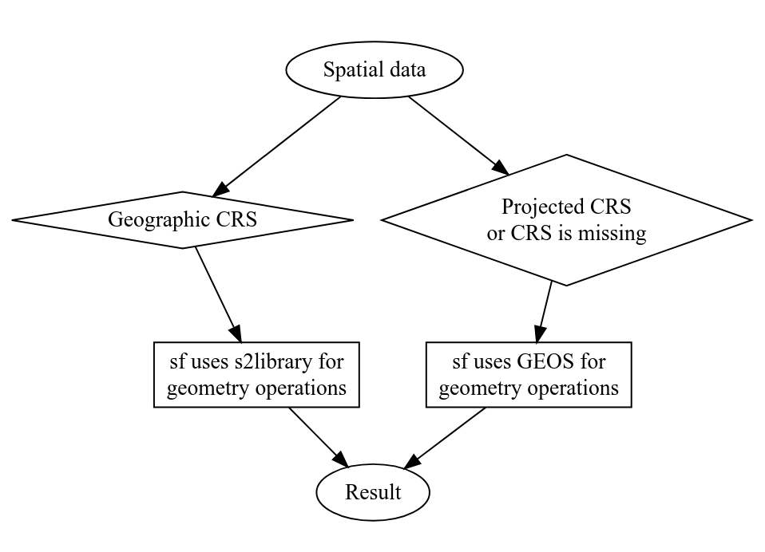

# 地理データの再投影  {#reproj-geo-data}

## 必須パッケージ  {- #prerequisites-07}

- この章では、以下のパッケージが必要である。

<!-- TODO: remove warning=FALSE in next chunk to suppress the following message: -->
<!-- #> Warning: multiple methods tables found for 'gridDistance' -->
```{r 06-reproj-1, message=FALSE, warning=FALSE}
library(sf)
library(terra)
library(dplyr)
library(spData)
library(spDataLarge)
```

## イントロダクション  {#reproj-intro}

Section \@ref(crs-intro) は、座標参照系 (CRS) を紹介し、2つの主要なタイプに焦点を当てた。<u>地理座標系</u>（'lon/lat'、単位は経度と緯度）と<u>投影座標系</u>（通常は基準点からのメートル）である。
この章では、その知識をもとに、さらに踏み込んだ内容になっている。
本書では、ある CRS から別の CRS に地理データを設定し、<u>変換</u>する方法を説明する。さらに、特にデータが緯度経度座標で保存されている場合、CRS を無視することによって発生し得る問題があるので、これを明らかにして注意を促したい。
\index{CRS!geographic} 
\index{CRS!projected} 

多くのプロジェクトでは、CRS について心配する必要はないし、変換について考える必要もない。
しかし、データが投影座標系なのか地理座標系なのか、そしてそれがジオメトリ操作に与える影響を知ることは重要である。
データの CRS とジオメトリ操作の結果（次のセクションで取り上げる）を知っていれば、CRS は裏で<u>ただ</u>うまく機能してくれる。しかし、物事がうまくいかないとき、突然 CRS について学ぶ必要が出てくるのである。
すべての投影データが入る投影 CRS を明確に定義し、異なる CRS をどのように、そしてなぜ使うのかを理解することで、物事がうまくいくことを確実にすることができる。
さらに、座標系について学ぶことで、地理データセットとその効果的な使用方法についての知識を深めることができる。

この章では、CRS の基本を学び、異なる CRS を使用した場合の結果（何が問題になるかを含む）を示し、ある座標系から別の座標系にデータセットを「再投影」する方法について説明する。
次のセクションでは R における CRS を紹介し、続いて Section \@ref(crs-in-r) で空間オブジェクトに関連する CRS の取得と設定方法を示す。 
Section \@ref(geom-proj) は、バッファを作成する作業例を参照しながら、データがどの CRS にあるのかを知ることの重要性を示している。
Section \@ref(whenproject) と Section \@ref(which-crs) において、それぞれ、いつ再投影するべきか、どの CRS を使うかという問題に取り組んでいる。
ベクタとラスタの再投影については、\@ref(reproj-vec-geom) と \@ref(reproj-ras) で、地図投影の修正については Section \@ref(mapproj) で説明している。


## 座標参照系  {#crs-in-r}

\index{CRS!EPSG}
\index{CRS!WKT}
\index{CRS!proj-string}
R-spatial のコアパッケージや QGIS などのデスクトップ GIS ソフトウェアなど、CRS 変換を必要とする最新の地理ツールのほとんどは、「ある座標参照系（CRS）から別の座標に変換する」オープンソース C++ ライブラリ [PROJ](https://proj.org) とつながっている。
CRS には、以下のような様々な表現がある。

1. 単純だが曖昧になる可能性のある記述、例えば「lon/lat座標で表示される」。
2. `+proj=longlat +ellps=WGS84 +datum=WGS84 +no_defs` のような、形式化された、しかし今では時代遅れの「proj4 文字列」。
3. `EPSG:4326` のような識別用の 'authority:code' テキスト文字列。

上の例はそれぞれ、全地球測位システム（GPS）座標やその他多くのデータセットの基礎となる「WGS84」座標系という同じものを指している。（訳注：WGS84 は、世界で一般的に用いられている緯度経度座標系だが、日本の場合は、JGD2011 が用いられることが多い。そのコードは `EPSG:6668` である。なお、JGD2011 は東日本大震災の影響を考慮しており、震災以前は JGD2000 が用いられていた。そのコードは `EPSG:4612` である。データが作成された年によって両者を使い分けるとよい。詳細については、[空間情報クラブ](https://club.informatix.co.jp/?p=998)などを参照。）
しかし、どれが正しいのだろうか？

短く答えると、CRS を識別する3つ目の方法が正しい。`EPSG:4326` は、本書で取り上げた **sf** と **terra** （さらに **stars**）パッケージ、及び [QGIS](https://docs.qgis.org/3.16/en/docs/user_manual/working_with_projections/working_with_projections.html) や [PROJ](https://proj.org/development/quickstart.html) などの地理データを扱うための多くのソフトウェアプロジェクトによって理解されている。
`EPSG:4326` は将来を見据えたものである。
さらに、機械可読でありながら、proj-string 表現とは異なり、「EPSG:4326」は短く、覚えやすく、オンラインで非常に「見つけやすい」（例えば、EPSG:4326 を検索すると、ウェブサイト [epsg.io](https://epsg.io/4326) の専用ページが表示される）。
より簡潔に `4326` だけでも **sf** によって理解されるが、 **曖昧さを防ぎ、文脈を提供するために、より明示的な `AUTHORITY:CODE` という形式を推奨する**。

より長く答えると、3つの記述のどれも十分ではなく、CRS の処理と変換を明確にするためには、より詳細な情報が必要になる。
このため、Open Geospatial Consortium（OGC、**sf** パッケージが実装するシンプルフィーチャの仕様も整備している団体）が、WKT（Well Known Text）と呼ばれる CRS 記述形式をオープンスタンダードで開発した。
これは、「ISO 19111:2019 に記述された座標参照系の抽象モデルのテキスト文字列実装の構造と内容を定義する」[100ページを超えるドキュメント](https://portal.opengeospatial.org/files/18-010r7)に詳細が記述されている。 [@opengeospatialconsortium_wellknown_2019]。
WGS84 CRS、**識別子** `EPSG:4326` の WKT 表現は以下の通りである。

<!-- Source: https://spatialreference.org/ref/epsg/4326/prettywkt/ -->
<!-- ``` -->
<!-- GEOGCS["WGS 84", -->
<!--     DATUM["WGS_1984", -->
<!--         SPHEROID["WGS 84",6378137,298.257223563, -->
<!--             AUTHORITY["EPSG","7030"]], -->
<!--         AUTHORITY["EPSG","6326"]], -->
<!--     PRIMEM["Greenwich",0, -->
<!--         AUTHORITY["EPSG","8901"]], -->
<!--     UNIT["degree",0.01745329251994328, -->
<!--         AUTHORITY["EPSG","9122"]], -->
<!--     AUTHORITY["EPSG","4326"]] -->
<!-- ``` -->

```{r}
st_crs("EPSG:4326")
```

コマンドの出力は、CRS 識別子（空間参照識別子または [SRID](https://postgis.net/workshops/postgis-intro/projection.html)とも呼ばれる）がどのように機能するかを示している。これは単にルックアップであり、CRS のより完全な WKT 表現に関連する一意の識別子を提供するものである。
このことは、識別子と CRS の長い WKT 表現との間にミスマッチがある場合はどうなるのか、という問題を提起している。
この点、@opengeospatialconsortium_wellknown_2019 は明確で、冗長な WKT 表現が[識別子](https://docs.opengeospatial.org/is/18-010r7/18-010r7.html#37)より優先される。 

> 引用された識別子の属性や値が、WKT 記述で明示的に与えられた属性や値と矛盾する場合、 WKT の値が優先されるものとする。

CRS の識別子を `AUTHORITY:CODE` という形式で参照する慣習は、他の[言語](https://jorisvandenbossche.github.io/blog/2020/02/11/geopandas-pyproj-crs/)で書かれた地理ソフトウェアでも使われており、正式に定義された広範囲の座標系を参照することができる。^[
[QGIS](https://docs.qgis.org/3.16/en/docs/pyqgis_developer_cookbook/crs.html?highlight=srid) は、5つの識別子タイプ（EPSGコード、PostGIS SRID、INTERNAL SRID、PROJ4 文字列、WKT 文字列）や、`EPSG:4326` 識別子のより長い表現である `urn:ogc:def:crs:EPSG::4326` も受け入れ可能で、固有の CRS を参照する [@opengeospatialconsortium_wellknown_2019]。
]
CRS の識別子で最もよく使われる機関は、CRS の標準化リストを発表した欧州石油調査グループ（European Petroleum Survey Group）の頭文字をとった *EPSG* である（EPSG は2005年に石油・ガス団体の [Geomatics Committee of the International Association of Oil & Gas Producers](https://www.iogp.org/our-committees/geomatics/) により[引き継ぎ](http://wiki.gis.com/wiki/index.php/European_Petroleum_Survey_Group)された）。
CRS の識別子には、他の機関を使用することもできる。
例えば、`ESRI:54030` は、ESRI の Robinson 投影の実装で、以下の WKT 文字列（最初の8行のみ表示）を持っていることを指している。

```{r, eval=FALSE}
sf::st_crs("ESRI:54030")
#> Coordinate Reference System:
#>   User input: ESRI:54030 
#>   wkt:
#> PROJCRS["World_Robinson",
#>     BASEGEOGCRS["WGS 84",
#>         DATUM["World Geodetic System 1984",
#>             ELLIPSOID["WGS 84",6378137,298.257223563,
#>                 LENGTHUNIT["metre",1]]],
#> ...
```

```{r, eval=FALSE, echo=FALSE}
sf::st_crs("urn:ogc:def:crs:EPSG::4326")
```


WKT 文字列は網羅的で詳細かつ正確であるため、CRS の格納や変換を曖昧にすることなく行うことができる。
測地系、楕円体、本初子午線、投影法、単位など、任意の CRS に関するすべての関連情報が含まれている。^[
WKT の CRS 定義が登場する以前は、proj-string が座標操作の指定と CRS の保存の標準的な方法であった。
この文字列表現は、key=value の形式（例えば、`+proj=longlat +datum=WGS84 +no_defs`）で構築されているが、ほとんどの場合、すでに WKT 表現に取って代わられたか、将来的に取って代わられるはずである。
]

最近の PROJ のバージョン（6+）では、座標操作を定義するために proj-string を使用することができるが、いくつかの proj-string キー（`+nadgrids` , `+towgs84` , `+k` , `+init=epsg:`）はもうサポートされていないか、推奨されないものである。
また、proj-string に直接設定できる測地系は3つ（WGS84、NAD83、NAD27）だけである。
CRS の定義の進化と PROJ ライブラリの長い説明は、@bivand_progress_2021、@pebesma_spatial_2022 の第2章、[Floris Vanderhaeghe によるブログ](https://inbo.github.io/tutorials/tutorials/spatial_crs_coding/)に記載されている。
[PROJ documentation](https://proj.org/development/reference/cpp/cpp_general.html) に概説されているように、WKT CRS 形式には WKT1 と 2 種類の WKT2 があり、後者 (WKT2, 2018 仕様) は ISO 19111:2019 に対応するものである [@opengeospatialconsortium_wellknown_2019]。

## 座標系の照会と設定  {#crs-setting}

R の空間オブジェクトに CRS がどのように格納され、どのようにクエリや設定ができるのかを見ていこう。
まず、**ベクタ**の地理データオブジェクトの CRS の取得と設定について、次の例から見ていく。

```{r 02-spatial-data-52, message=FALSE, results='hide'}
vector_filepath = system.file("shapes/world.gpkg", package = "spData")
new_vector = read_sf(vector_filepath)
```

新しいオブジェクトである `new_vector` は、世界の国々を表すクラス `sf` のデータフレームである（詳しくはヘルプページ `?spData::world` を参照）。
CRS は **sf** 関数 `st_crs()` で取得することができる。

```{r 02-spatial-data-53, eval=FALSE}
st_crs(new_vector) # get CRS
#> Coordinate Reference System:
#>   User input: WGS 84 
#>   wkt:
#>   ...
```

```{r, echo=FALSE, eval=FALSE}
# Aim: capture crs for comparison with updated CRS
new_vector_crs = st_crs(new_vector)
```

出力は主に2つの要素を含むリストである。

1. `User input` (この場合、`WGS 84`、入力ファイルから取得した `EPSG:4326` の同義語)、前述の CRS 識別子に対応する。
1. `wkt` CRS に関するすべての関連情報を含む完全な WKT 文字列を含む。

`input` 要素は柔軟性があり、入力ファイルやユーザー入力に応じて、`AUTHORITY:CODE` 表現（例：`EPSG:4326`）、CRS の名前（例： `WGS 84`）、あるいは proj-string 定義を含めることができる。
`wkt` 要素には WKT 表現が格納され、オブジェクトをファイルに保存したり、座標演算を行う際に使用される。
上記で、`new_vector` のオブジェクトは、WGS84 楕円体を持ち、グリニッジ本初子午線を使用し、緯度・経度軸の順番になっていることがわかる。
この場合、この CRS の使用に適したエリアを説明する `USAGE` や、CRS の識別子を指し示す `ID`（`EPSG:4326`） などの追加要素もある。

また、`st_crs` 関数には、使用中の CRS に関する追加情報を取得することができる、という便利な特徴もある。 
例えば、実行させてみよう。

- `st_crs(new_vector)$IsGeographic`、CRS がジオグラフィックかどうかを確認する。
- `st_crs(new_vector)$units_gdal`、CRS 単位を調べることができる。
- `st_crs(new_vector)$srid` その「SRID」識別子を抽出する（利用可能な場合）。
- `st_crs(new_vector)$proj4string` proj-string表現を抽出する。

座標参照系（CRS）がない場合や間違った CRS が設定されている場合は、`st_set_crs()` 関数を使用することができる（この場合、ファイル読み込み時にすでに CRS が正しく設定されているので、WKT 文字列は変更されずに残る）。

```{r 02-spatial-data-54}
new_vector = st_set_crs(new_vector, "EPSG:4326") # CRS を設定
```

```{r, echo=FALSE, eval=FALSE}
waldo::compare(new_vector_crs, st_crs(new_vector))
# `old$input`: "WGS 84"   
# `new$input`: "EPSG:4326"
```

CRS の取得と設定は、**ラスタ** 地理データオブジェクトと同様の方法で行われる。
`terra` パッケージの `crs()` 関数は `SpatRaster` オブジェクトから CRS 情報にアクセスする （きれいに印刷するために `cat()` 関数を使用していることに注意）。 

```{r 02-spatial-data-55}
raster_filepath = system.file("raster/srtm.tif", package = "spDataLarge")
my_rast = rast(raster_filepath)
cat(crs(my_rast)) # CRS を取得
```

出力は CRS の WKT 表現である。 
同じ関数、`crs()` を使って、ラスタオブジェクトに CRS を設定することもできる。

```{r 02-spatial-data-56}
crs(my_rast) = "EPSG:26912" # CRS を設定
```

ここでは、識別子（ほとんどの場合推奨）または完全な WKT 表現のいずれかを使用することができる。
`crs` を設定する代替方法としては、proj-string 文字列または `crs()` を持つ他の既存のオブジェクトから抽出された CRS があるが、これらのアプローチは将来対応されない可能性がある。

重要なのは、`st_crs()` と `crs()` 関数は、座標の値や形状を変更しないことである。
その役割は、オブジェクト CRS のメタデータ情報を設定することのみである。

Section \@ref(vector-data) で紹介したロンドンの例を基に、以下のコードで作成した `london` データセットのように、地理的オブジェクトの CRS が不明な場合がある。

```{r 06-reproj-2}
london = data.frame(lon = -0.1, lat = 51.5) |> 
  st_as_sf(coords = c("lon", "lat"))
st_is_longlat(london)
```

この出力 `NA` は、**sf** が CRS が何であるかを知らず、推測するつもりがないことを示している（`NA` は、"Not Applicable/Available" の略語で、文字通り「利用できない」という意味）。
CRS を手動で指定するか、CRS メタデータを持つソースから読み込まれない限り、**sf** は座標系について「わからない」と言う以外の明示的な仮定をしない。
この動作は、利用可能な CRS の多様性を考えると理にかなっているが、GeoJSON ファイルフォーマット仕様のような、すべての座標が lon/lat CRS（EPSG:4326`）を持つという単純化した仮定をするいくつかのアプローチとは異なる。

`sf` オブジェクトに CRS を追加するには、主に 3 つの方法がある。

- CRS をあらかじめ存在するオブジェクトに割り当てる。例えば `st_crs(london) = "EPSG:4326"` 
- `st_as_sf(... crs = "EPSG:4326")` などのジオメトリオブジェクトを作成する **sf** 関数の `crs` 引数に CRS を渡すことで、ジオメトリオブジェクトを作成することができる。また、ラスタデータセットを作成する際にも、同じ引数で CRS を設定することができる（例：`rast(crs = "EPSG:4326")`）。
- 新しい CRS を持つデータのバージョンを返す `st_set_crs()`、例を次のコードチャンクで示す。

```{r 06-reproj-3}
london_geo = st_set_crs(london, "EPSG:4326")
st_is_longlat(london_geo)
```

<!-- The following example demonstrates how to add CRS metadata to raster datasets. -->
<!-- Todo: add this -->

CRS の指定されていないデータセットは、問題を起こすことがある。すべての地理座標には座標系があり、ソフトウェアでは、使用する CRS の種類がわかっている場合にのみ、プロットやジオメトリ操作に関する適切な判断を行うことができる。

## 投影データおよび非投影データに対する幾何学操作  {#geom-proj}

**sf** version 1.0.0 より、R は緯度経度 CRS を持って入るベクタデータセットに対する機能が大幅に強化された。この機能強化は、Section \@ref(s2) で取り上げた S2 <u>球面ジオメトリエンジン</u>によるものである。
Figure \@ref(fig:s2geos) で示すように、**sf** は、CRS 種別に応じて GEOS または S2 を使い分ける（デフォルトは S2）。
投影されたデータと CRS がないデータの場合、常に GEOS が使われる。地理データではデフォルトで S2 が使われるが、無効化したい場合は `sf::sf_use_s2(FALSE)` とする。

```{r s2geos, fig.cap="入力データの CRS に依存する sf パッケージのジオメトリ操作の動作。", echo=FALSE}
'digraph G3 {
   layout=dot
   rankdir=TB

   node [shape = rectangle];
   rec1 [label = "空間データ" shape = oval];
   rec2 [label = "Geographic CRS" shape = diamond];
   rec3 [label = "Projected CRS\nor CRS is missing" shape = diamond]
   rec4 [label = "S2 enabled\n(default)" shape = diamond]
   rec5 [label = "S2 disabled" shape = diamond]
   rec6 [label = "sf uses s2library for \ngeometry operations" center = true];
   rec7 [label = "sf uses GEOS for \ngeometry operations" center = true];
   rec8 [label = "Result" shape = oval weight=100];
   rec9 [label = "Result" shape = oval weight=100];

   rec1 -> rec2;
   rec1 -> rec3;
   rec2 -> rec4;
   rec2 -> rec5;
   rec3 -> rec7;
   rec4 -> rec6;
   rec5 -> rec7;
   rec6 -> rec8;
   rec7 -> rec9;
   }' -> s2geos
# # exported manually; the code below returns a low res version of png
# tmp = DiagrammeR::grViz(s2geos)
# htmlwidgets::saveWidget(widget = tmp, file = "figures/07-s2geos.html")
# # tmp
# tmp = DiagrammeRsvg::export_svg(tmp)
# library(htmltools)
# html_print(HTML(tmp))
# tmp = charToRaw(tmp)
# # rsvg::rsvg_png(tmp, "figures/07-s2geos.png")
# webshot::webshot(url = "figures/07-s2geos.html", file = "figures/07-s2geos.png", vwidth = 800, vheight = 600)
# download.file(
#   "https://user-images.githubusercontent.com/1825120/188572856-7946ae32-98de-444c-9f48-b1d7afcf9345.png", 
#   destfile = "figures/07-s2geos.png"
#   )
# browseURL("figures/07-s2geos.png")

```


CRS の重要性を示すために、このセクションでは、前セクションで作成した `london` オブジェクトの周りに 100 km のバッファを作成する。
また、100 km にほぼ相当する1度（赤道では1度は約 111 km）の「距離」を持つ意図的に欠陥のあるバッファを作成する。
コードに入る前に、Figure \@ref(fig:crs-buf) を見て、これからコードチャンクで再現するはずの出力を視覚的に把握するのもよいだろう。

最初の段階として、上記で作成した `london` と `london_geo` のオブジェクトの周りに、ロンドン中心部から1度と 100 km（または 10万 m、科学的表記法では `1e5` と表現できる）の境界距離の3つのバッファを作成する。

```{r 06-reproj-4-1}
london_buff_no_crs = st_buffer(london, dist = 1)  # incorrect: no CRS
london_buff_s2 = st_buffer(london_geo, dist = 1e5) # silent use of s2
london_buff_s2_100_cells = st_buffer(london_geo, dist = 1e5, max_cells = 100) 
```

上の1行目では、**sf** は入力が投影されていると仮定して、度数単位のバッファを持つ結果を生成しているが、後述するようにこれは問題である。
2行目の **sf** では、Chapter \@ref(spatial-class) で導入された球面幾何エンジン S2 を無言で使用して、`max_cells = 1000` のデフォルト値 --- 3行目で `100` に設定 --- を使用してバッファの範囲を計算しているが、その結果はすぐに明らかになるだろう（詳しくは `?s2::s2_buffer_cells` を参照）。
非投影（地理）座標系に対する **sf** の S2 幾何エンジン使用の影響を強調するために、以下のコードチャンクで、コマンド `sf_use_s2()` （デフォルトではオン、`TRUE` ）で一時的にそれを無効にしてみよう。
`london_buff_no_crs` と同様、新しい `london_geo` オブジェクトは、単位が度でほとんどの場合意味を持たない。

```{r 06-reproj-4-2}
sf::sf_use_s2(FALSE)
london_buff_lonlat = st_buffer(london_geo, dist = 1) # incorrect result
sf::sf_use_s2(TRUE)
```

上記の警告メッセージは、lon/lat データに対して平面ジオメトリ演算を実行する際の問題を示唆している。 
球形幾何演算をコマンド（`sf::sf_use_s2(FALSE)`）でオフにすると、バッファ（およびその他のジオメトリ演算）は緯度と経度の単位を使用するため、メートルなどの適切な距離単位の代わりにならないため、価値のない出力となる場合がある。

```{block2 06-reproj-5, type="rmdnote"}
子午線と呼ばれる 2 本の経線間の距離は、赤道では約 111 km である（正確な距離は `geosphere::distGeo(c(0, 0), c(1, 0))` を実行して調べられる）。
これは極点でゼロに縮まる。
例えば、ロンドンの緯度では、子午線の距離は 70 km 以下である（課題：これを検証するコードを実行しなさい）。
<!-- `geosphere::distGeo(c(0, 51.5), c(1, 51.5))` -->
一方、緯度線は緯度に関係なく等距離にあり、赤道や極付近を含めて常に 111 km 程度の間隔がある（Figure \@ref(fig:crs-buf) から Figure \@ref(fig:wintriproj)参照）。
```

地理的（緯度経度）CRS に関する警告は「CRS を設定してはいけない」という解釈をするべきではない。むしろ、ほとんど常に設定すべきである。
これは、投影された CRS にデータを<u>再投影</u>することを提案したと理解するのがよいだろう。
ただし、この提案に常に耳を傾ける必要もない。空間演算と幾何演算を実行しても、ほとんど違いがない場合もある（例えば、空間的な部分集合作成など）。
しかし、バッファ作成など距離を伴う操作では、（球面幾何エンジンを使わずに）良い結果を得るには、データの投影コピーを作成し、それに対して操作を実行するしかない。
<!--toDo:rl-->
<!-- jn: idea -- maybe it would be add a table somewhere in the book showing which operations are impacted by s2? -->
これは、以下のコードチャンクで行われる。

```{r 06-reproj-6}
london_proj = data.frame(x = 530000, y = 180000) |> 
  st_as_sf(coords = 1:2, crs = "EPSG:27700")
```

結果は、`london` と同じであるが、適切な CRS（この場合、EPSG コードが 27700 の British National Grid）に再投影され、単位がメートルである新しいオブジェクトになる。
CRS が変化したことは、`st_crs()` を使って次のように確認できる（出力の一部は `...` で置き換えている）。

```{r 06-reproj-7, eval=FALSE}
st_crs(london_proj)
#> Coordinate Reference System:
#>   User input: EPSG:27700 
#>   wkt:
#> PROJCRS["OSGB36 / British National Grid",
#>     BASEGEOGCRS["OSGB36",
#>         DATUM["Ordnance Survey of Great Britain 1936",
#>             ELLIPSOID["Airy 1830",6377563.396,299.3249646,
#>                 LENGTHUNIT["metre",1]]],
#> ...
```

この CRS の記述で注目すべきは、EPSG コード (`EPSG: 27700`) と詳細な `wkt` の文字列（最初の5行のみ表示）であろう。^[
最も関連性の高い投影パラメータと関連する概念の簡単な説明については、Jochen Albrecht による第4回講演を参照。
http://www.geography.hunter.cuny.edu/~jochen/GTECH361/lectures/ および https://proj.org/usage/projections.html に情報がある。
投影に関する他の素晴らしいリソースは、spatialreference.orgとprogonos.com/furuti/MapProjである。
]
LENGTHUNIT フィールドに記述された CRS の単位が（度ではなく）メートルであることから、これが投影型 CRS であることがわかる。 `st_is_longlat(london_proj)` は現在 `FALSE` を返し、`london_proj` に対する幾何演算は警告なしで機能する。
`london_proj` のバッファ操作は GEOS を使用し、結果は適切な距離の単位で返される。
次のコードは、ちょうど 100 km の<u>投影</u>データの周りにバッファを作成するものである。

```{r 06-reproj-8}
london_buff_projected = st_buffer(london_proj, 1e5)
```

先に作成した CRS を<u>持つ</u>3つの `london_buff*` オブジェクト（`london_buff_s2`、`london_buff_lonlat`、`london_buff_projected`)の形状を Figure \@ref(fig:crs-buf) に示す。

```{r crs-buf-old, include=FALSE, eval=FALSE}
uk = rnaturalearth::ne_countries(scale = 50) |> 
  st_as_sf() |> 
  filter(grepl(pattern = "United Kingdom|Ire", x = name_long))
plot(london_buff_s2, graticule = st_crs(4326), axes = TRUE, reset = FALSE, lwd = 2)
plot(london_buff_s2_100_cells, lwd = 9, add = TRUE)
plot(st_geometry(uk), add = TRUE, border = "gray", lwd = 3)
uk_proj = uk |>
  st_transform("EPSG:27700")
plot(london_buff_projected, graticule = st_crs("EPSG:27700"), axes = TRUE, reset = FALSE, lwd = 2)
plot(london_proj, add = TRUE)
plot(st_geometry(uk_proj), add = TRUE, border = "gray", lwd = 3)
plot(london_buff_lonlat, graticule = st_crs("EPSG:27700"), axes = TRUE, reset = FALSE, lwd = 2)
plot(london_proj, add = TRUE)
plot(st_geometry(uk), add = TRUE, border = "gray", lwd = 3)
```

```{r crs-buf, fig.cap="ロンドン周辺のバッファで、S2球面幾何エンジンを用いて作成した緯度経度データ（左）、投影データ（中）、球面幾何を用いない緯度経度データ（右）の結果を示している。左のプロットは、投影されていないデータを sf でバッファ作成した結果を示しており、デフォルトで Google の S2 spherical geometry engine を max_cells を 1000 に設定して呼び出している（細線）。太い「ブロック状の」線は、max_cells を 100 に設定して同じ操作を行った結果を示している。", fig.scap="Buffers around London with a geographic and projected CRS.", echo=FALSE, fig.asp=0.39, fig.width = 8}
uk = rnaturalearth::ne_countries(scale = 50) |> 
  st_as_sf() |> 
  filter(grepl(pattern = "United Kingdom|Ire", x = name_long))
library(tmap)
tm1 = tm_shape(london_buff_s2, bbox = st_bbox(london_buff_s2_100_cells)) + 
  tm_graticules(lwd = 0.2) +
  tm_borders(col = "black", lwd = 0.5) + 
  tm_shape(london_buff_s2_100_cells) +
  tm_borders(col = "black", lwd = 1.5) +
  tm_shape(uk) +
  tm_polygons(lty = 3, alpha = 0.2, col = "#567D46") +
  tm_shape(london_proj) +
  tm_symbols()

tm2 = tm_shape(london_buff_projected, bbox = st_bbox(london_buff_s2_100_cells)) + 
  tm_grid(lwd = 0.2) +
  tm_borders(col = "black", lwd = 0.5) + 
  tm_shape(uk) +
  tm_polygons(lty = 3, alpha = 0.2, col = "#567D46") +
  tm_shape(london_proj) +
  tm_symbols()

tm3 = tm_shape(london_buff_lonlat, bbox = st_bbox(london_buff_s2_100_cells)) + 
  tm_graticules(lwd = 0.2) +
  tm_borders(col = "black", lwd = 0.5) + 
  tm_shape(uk) +
  tm_polygons(lty = 3, alpha = 0.2, col = "#567D46") +
  tm_shape(london_proj) +
  tm_symbols()

tmap_arrange(tm1, tm2, tm3, nrow = 1)
```

`s2` と適切に予測された CRS に基づくバッファは、バッファの境界のすべての部分がロンドンから等距離にあることを意味し、「つぶされた」ものではないことは、Figure \@ref(fig:crs-buf) から明らかである。
入力に CRS がないか、`sf_use_s2()` がオフになっているため、`s2` が<u>使われていない</u>ときに緯度経度 CRS から生成される結果は、南北軸に細長く歪んでいる。緯度経度に投影データを仮定する（GEOS による）アルゴリズムを使うことが危険であることが明らかである。
しかし、S2 で生成された結果も、劇的な変化はないものの、歪んでいる。
Figure \@ref(fig:crs-buf) (左) のバッファ境界はどちらもギザギザしているが、これは `s2` の引数 `max_cells` を 100 に設定して作成したバッファを表す太い境界の場合のみ、明らかまたは関連性があると考えられる。
<!--toDo:rl-->
<!--jn: maybe it is worth to emphasize that the differences are due to the use of S2 vs GEOS-->
<!--jn: you mention S2 a lot in this section, but not GEOS...-->
S2 経由の緯度経度データから得られる結果は、投影データから得られる結果とは異なるという教訓である。
投影データにおける S2 由来のバッファと GEOS 由来のバッファの差は、`max_cells` の値が大きくなるほど小さくなる。この引数の「正しい」値は多くの要因に依存すると思われるが、デフォルト値1000は妥当なデフォルト値だと思われる。
`max_cells` の値を選択する時、多くの場合、計算の速度と結果の解像度のバランスをとる必要がある。
曲線の境界が有利な場合、バッファ作成（または他のジオメトリ操作）の前に投影型 CRS に変換することが適切な場合がある。

CRS の重要性（主に投影か地理的か）と、緯度経度に対してバッファ作成する際に S2 を使用するという **sf** のデフォルト設定がデータに与える影響は、上記の例から明らかである。
この後のセクションでは、投影 CRS が必要な場合にどの CRS を使用するか、ベクタおよびラスタオブジェクトの再投影の詳細について、より深く掘り下げて説明する。

## いつ再投影するべきか？  {#whenproject}

\index{CRS!reprojection} 
前節では、CRS を手動で設定する方法として、`st_set_crs(london, "EPSG:4326")` を紹介した。
しかし、現実のアプリケーションでは、データの読み込み時に自動的にCRS が設定されるのが一般的である。
多くのプロジェクトで、CRS 関連の主なタスクは、ある CRS から別の CRS に、オブジェクトを<u>変換</u>することである。
しかし、どのような場合にデータを変換する必要があるのだろうか。 
そして、どの CRS に？
こういった質問に対する明確な答えはなく、CRS の選択には常にメリットだけでなくデメリットもある [@maling_coordinate_1992]。
このセクションでは、決定する際に役立つ一般原則を紹介しよう。 

まず最初に、<u>いつ変換するべきか</u>を考える。
<!--toDo:rl-->
<!--not longer valid-->
Figure \@ref(fig:crs-buf) が示すように、`st_buffer()` など幾何学的な関数を使う場合、投影型 CRS への変換が不可欠な場合がある。
逆に、**leaflet** パッケージでデータをオンライン公開する場合は、地理的 CRS が必要になる。
また、異なる CRS を持つ2つのオブジェクトの距離を求める場合のように、異なる CRS を持つ2つのオブジェクトを比較したり、組み合わせたりする必要がある場合もある。

```{r 06-reproj-9, eval=FALSE}
st_distance(london_geo, london_proj)
# > Error: st_crs(x) == st_crs(y) is not TRUE
```

`london` と `london_proj` のオブジェクトを地理的に比較できるようにするには、一方を他方の CRS に変換する必要がある。
しかし、どの CRS を使えばいいのか？
特にウェブマッピングを含む多くのプロジェクトでは、EPSG:4326 での出力が必要であるが、その場合、投影オブジェクトを変換する価値がある。
しかし、球面幾何演算エンジンではなく平面ジオメトリ演算が必要なプロジェクト（例えば、滑らかなエッジを持つバッファを作成する）の場合、地理的 CRS のデータを英国ナショナルグリッド（EPSG：27700）などの投影 CRS で同等のオブジェクトに変換する価値があるだろう。
それが、Section \@ref(reproj-vec-geom) のテーマである。

## どの CRS を使うべきか？  {#which-crs}

\index{CRS!reprojection} 
\index{projection!World Geodetic System}
どのCRSを使うかというのは難しい問題で、「正しい」答えがあるわけではない。
「万能の投影は存在せず、すべて指定したフレームの中心から離れると歪みが発生する」 [@bivand_applied_2013] 。
さらに言えば、すべてのタスクで1つのプロジェクターだけに執着するべきではない。
ある投影法を解析の一部に使い、別の投影法を別の部分に使い、さらに別の投影法を可視化することも可能である。
常に自分の目標に最も適した CRS を選ぶように心がけよう

**地理的 CRS** を選択する場合、[WGS84](https://en.wikipedia.org/wiki/World_Geodetic_System#A_new_World_Geodetic_System:_WGS_84) という答えになることが多いようである。（訳注：上で既に述べたが、WGS84 に対応する日本の CRS は、東日本大震災以降の JGD2011 と、それ以前の JGD2000 である。）
ウェブマッピングだけでなく、GPS データセットや何千ものラスタ、ベクタデータセットがこの CRS でデフォルトで提供されているため、利用されている。
WGS84 は世界で最も一般的な CRS なので、その EPSG コード 4326 を知っておくとよいだろう。（訳注：JGD2011は 6668、JGD2000 は 4612 である。）
この「マジックナンバー」は、投影された CRS が異常なオブジェクトを、広く理解されるものに変換するために使用することができる。

**投影 CRS** が必要な場合はどうだろうか？
場合によっては、自由に決められるものではない。
「多くの場合、投影の選択は公的な地図作成機関によって行われる」 [@bivand_applied_2013] 。
つまり、現地のデータソースで作業する場合、公式の CRS が最も正確ではないとしても、互換性を確保するために、データが提供された CRS で作業することが望ましいと思われる。
ロンドンの例は、(a) 英国ナショナルグリッド（関連する EPSG コード27700）がよく知られており、(b) 元のデータセット（`london`）がすでにその CRS を持っていたので、簡単に答えることができたのである。

\index{UTM} 
一般的に使われているデフォルトは Universal Transverse Mercator（[UTM](https://en.wikipedia.org/wiki/Universal_Transverse_Mercator_coordinate_system)）で、地球を縦60個のくさびと横20個の緯度に分割した CRS のセットである。
UTM CRS で使用されている横メルカトル図法はコンフォーマルであるが、UTM ゾーンの中心から離れるにつれて面積や距離の歪みがひどくなる。
そのため、GIS ソフトウェア Manifold のドキュメントでは、UTM ゾーンを使用するプロジェクトの縦断範囲を中心子午線から6度までに制限することを提案している（出典： [manifold.net](http://www.manifold.net/doc/mfd9/universal_transverse_mercator_projection.htm)）。
そのため、UTM は比較的狭い範囲でのアングル保存を重視する場合にのみ使用することを勧める。

地球上のほとんどの場所には UTM コードがあり、例えば「60H」 は R が発明されたニュージーランド北部を指している。
UTM EPSG コードは、北半球では32601から32660まで、南半球では32701から32760まで順次表示される。

```{r 06-reproj-12, eval=FALSE, echo=FALSE}
utm_nums_n = 32601:32660
utm_nums_s = 32701:32760
crs_data = rgdal::make_EPSG()
crs_data[grep(utm_nums_n[1], crs_data$code), ] # zone 1N
crs_data[grep(utm_nums_n[60], crs_data$code), ] # zone 60N
crs_data[grep(utm_nums_s[1], crs_data$code), ] 
crs_data[grep(utm_nums_s[60], crs_data$code), ] 
crs_data[grep("UTM zone 60N", crs_data$note), ] # many
crs_data[grep("UTM zone 60S", crs_data$note), ] # many
crs_data[grep("UTM zone 60S", crs_data$note), ] # many
crs_utm = crs_data[grepl("utm", crs_data$prj4), ] # 1066
crs_utm_zone = crs_utm[grepl("zone=", crs_utm$prj4), ]
crs_utm_south = crs_utm[grepl("south", crs_utm$prj4), ]
```

その仕組みを説明するために、 [ここにある通り](https://stackoverflow.com/a/9188972/)、地球上の任意の地点に関連する EPSG コードを計算する関数 `lonlat2UTM()` を作ってみよう。 

```{r 06-reproj-13}
lonlat2UTM = function(lonlat) {
  utm = (floor((lonlat[1] + 180) / 6) %% 60) + 1
  if(lonlat[2] > 0) {
    utm + 32600
  } else{
    utm + 32700
  }
}
```

次のコマンドは、この機能を利用して、オークランドとロンドンの UTM ゾーンと関連する EPSG コードを特定する。

```{r 06-reproj-14, echo=FALSE, eval=FALSE}
stplanr::geo_code("Auckland")
```

```{r 06-reproj-15}
lonlat2UTM(c(174.7, -36.9))
lonlat2UTM(st_coordinates(london))
```

現在、適切な CRS を選択するためのツールも用意されており、これには **crssuggest** パッケージ<!--add ref or docs--> が含まれている。
このパッケージのメイン関数である `suggest_crs()` は、地理的な CRS を持つ空間オブジェクトを受け取り、与えられた領域に使用可能な投影 CRS のリストを返す。^[また、本パッケージでは、CRS 情報を付加していないデータの真の CRS を把握することも可能。] 
もう一つの便利なツールは、選択した場所とタイプに基づいて CRS をリストアップするウェブページhttps://jjimenezshaw.github.io/crs-explorer/。
重要な注意点：これらのツールは多くの場面で役立つが、適用する前に推奨される CRS の特性を知っておく必要がある。

\index{CRS!custom} 
適切な CRS がすぐにわからない場合、CRS の選択は、その後の地図や分析において保存することが最も重要である特性によって決められるべきだろう。
すべての CRS は、等面積、等距離、コンフォーマル（形状はそのまま）、またはそれらの妥協点の組み合わせである（「投影座標参照系」参照）。
ローカルパラメータを持つカスタム CRS を対象地域に合わせて作成し、単一の CRS がすべてのタスクに適合しないプロジェクトでは、複数の CRS を使用することができる。
測地線計算」は、CRS が適切でない場合のフォールバックを提供することができる（[proj.org/geodesic.html](https://proj.org/geodesic.html) を参照）。
どの投影 CRS を使っても、数百キロメートルに及ぶジオメトリでは、結果が正確でない可能性がある。

\index{CRS!custom}
カスタム CRS を決定する際には、以下を勧める。^[
<!--toDo:rl-->
<!-- jn:I we can assume who is the "anonymous reviewer", can we ask him/her to use his/her name? -->
このアドバイスの基礎となるコメントを下さった匿名の査読者の方に感謝する。
]

\index{projection!Lambert azimuthal equal-area}
\index{projection!Azimuthal equidistant}
\index{projection!Lambert conformal conic}
\index{projection!Stereographic}
\index{projection!Universal Transverse Mercator}

- カスタムローカル投影（原点の緯度・経度を調査地域の中心に設定）のランバート方位角等値投影（ [LAEA](https://en.wikipedia.org/wiki/Lambert_azimuthal_equal-area_projection)）、これはすべての場所で等面積投影だが数千キロメートル以上では形状が歪んでしまう。
- ある地点とローカル投影の中心点との直線距離を具体的に正確に表す方位角等距離（ [AEQD](https://en.wikipedia.org/wiki/Azimuthal_equidistant_projection)）投影図
- 数千 km に及ぶ地域のランバート共形円錐（[LCC](https://en.wikipedia.org/wiki/Lambert_conformal_conic_projection)）投影。円錐は、距離と面積の特性がセカント線間で妥当となるように設定されている。
- 極域のステレオグラフ（[STERE](https://en.wikipedia.org/wiki/Stereographic_projection)）投影。ただし、中心から数千キロメートル離れた面積や距離の計算に頼らないように注意すること。

地域のデータセットに特化した投影 CRS を自動的に選択する方法として、調査地域の中心点に対して方位角等距離（[AEQD](https://en.wikipedia.org/wiki/Azimuthal_equidistant_projection)）投影を作成することが考えられる。
これは、データセットの中心点に基づくメートル単位でカスタム CRS（EPSGコードなし）を作成するものである。
他のデータセットが作成したカスタム CRS と互換性がなく、数百キロメートルに及ぶ広範なデータセットに使用すると、結果が正確でなくなる可能性がある。

このセクションで説明する原則は、ベクタデータセットとラスタデータセットに等しく適用される。
しかし、CRS 変換のフィーチャには、それぞれの地理データモデルに特有のものがある。
ベクタデータ変換の特殊性は Section \@ref(reproj-vec-geom) で、ラスタ変換の特殊性は Section \@ref(reproj-ras) で説明する。
次に、最後のセクションでは、カスタムマッププロジェクション（Section \@ref(mapproj)）を作成する方法を紹介する。

## ベクタジオメトリの再投影  {#reproj-vec-geom}

<!--jn: idea adding info about custom piplines?-->

\index{CRS!reprojection} 
\index{vector!reprojection} 
Chapter \@ref(spatial-class) は、ベクタ幾何学がいかに点で構成されているか、そしていかに点が直線や多角形などのより複雑なオブジェクトの基礎を形成しているかを示した。
つまり、ベクタの再投影は、直線や多角形の頂点となるこれらの点の座標を変換することになる。

Section \@ref(whenproject) は、2つのオブジェクト間の距離を計算するために、少なくとも1つの `sf` オブジェクトを異なる CRS を持つ同等のオブジェクトに変換する必要がある例を含んでいる。

```{r 06-reproj-10}
london2 = st_transform(london_geo, "EPSG:27700")
```

`london` の変換版ができたので、**sf** 関数 `st_transform()` を使って、2つのロンドン表現間の距離を求めることができる。^[
`st_transform()` に代わるものとして、**lwgeom** の `st_transform_proj()` がある。これは、GDAL をバイパスする変換を可能にし、GDAL がサポートしていない投影をサポートすることができる。
本稿執筆時点（2022年）では、`st_transform_proj()` でサポートされているが、`st_transform()` でサポートされていないプロジェクションを見つけることはできなかった。
]
`london` と `london2` が 2 km 以上も離れているのは意外かもしれない。^[
この2点の位置の違いは、変換操作の不完全さ（実際は非常に正確）ではなく、`london` と `london_proj` を作成した手動で作成した座標の精度の低さによるものである。
また、驚くべきは、その結果がメートル単位の行列で提供されていることである。
これは、`st_distance()` が多くのフィーチャ間の距離を提供できることと、CRS の単位がメートルであるためである。
`as.numeric()` を使って、結果を普通の数字に強制する。
]

```{r 06-reproj-11}
st_distance(london2, london_proj)
```

CRS の問い合わせと再投影のための関数を、`cycle_hire_osm` を参照して以下に示す。これは **spData** の `sf` オブジェクトで、ロンドンで自転車をレンタルできる「ドッキングステーション」を表しているものである。
`sf` Section \@ref(reproj-intro) オブジェクトの CRS は、関数 を使って問い合わせることができる。
`st_crs()` 出力は、座標系に関する情報を含む複数行のテキストとして印刷される。

```{r}
st_crs(cycle_hire_osm)
```

Section \@ref(crs-setting) で見たように、主な CRS コンポーネントである `User input` と `wkt` は単一の実体として出力される。`st_crs()` の出力は、実際には、次のコードチャンクの出力に示すように、`input` と `wkt` という単一の文字列という2つの要素を持つクラス `crs` の名前付きリストになっている。

```{r 06-reproj-16}
crs_lnd = st_crs(london_geo)
class(crs_lnd)
names(crs_lnd)
```

`Name`、`proj4string`、`epsg` を含む追加の要素を `$` 演算子で取り出すことができる（詳しくは  [`?st_crs`](https://r-spatial.github.io/sf/reference/st_crs.html) と GDAL [website](https://gdal.org/tutorials/osr_api_tut.html#querying-coordinate-reference-system) の CRS and tranformation tutorial を参照）。

```{r}
crs_lnd$Name
crs_lnd$proj4string
crs_lnd$epsg
```

Section \@ref(crs-in-r) で述べたように、`crs_lnd` オブジェクトの `$wkt` 要素に格納された WKT 表現は、究極の真理の源である。
これは、前のコードチャンクの出力が、オブジェクトとその CRS の固有の属性ではなく、PROJ によって提供される `wkt` 表現からのクエリであることを意味する。

オブジェクトの CRS が変換されると、CRS の `wkt` と `User Input` の両方の要素が変更される。
以下のコードチャンクでは、CRS を投影した新しいバージョンの `cycle_hire_osm` を作成する（簡潔さのため、CRS 出力の最初の4行のみを表示す）。

```{r 06-reproj-18, eval=FALSE}
cycle_hire_osm_projected = st_transform(cycle_hire_osm, "EPSG:27700")
st_crs(cycle_hire_osm_projected)
#> Coordinate Reference System:
#>   User input: EPSG:27700 
#>   wkt:
#> PROJCRS["OSGB36 / British National Grid",
#> ...
```

この結果、オブジェクトは EPSG コード27700の新しい CRS を持つことになる。
しかし、この EPSG コードや他のコードの詳細を調べるにはどうしたらよいだろうか？
ネットで検索するのも一つの方法である。 

```{r 06-reproj-19}
crs_lnd_new = st_crs("EPSG:27700")
crs_lnd_new$Name
crs_lnd_new$proj4string
crs_lnd_new$epsg
```

その結果、EPSG コード27700が英国ナショナルグリッドを表しており、「 [EPSG 27700](https://www.google.com/search?q=CRS+27700)」とネット検索すれば出てくるような結果である。

```{block2 06-reproj-21, type='rmdnote'}
コンソールで空間オブジェクトを表示すると、自動的にその座標参照系が返される。
明示的にアクセスして変更するには、`st_crs()` 関数、例えば `st_crs(cycle_hire_osm)` を使用する。
```

## ラスタジオメトリの再投影  {#reproj-ras}

\index{raster!reprojection} 
\index{raster!warping} 
\index{raster!transformation} 
\index{raster!resampling} 
前節で説明した投影の概念は、ラスタにも同様に適用できる。
しかし、ベクタとラスタの再投影には重要な違いがある。
ベクタオブジェクトの変換は、すべての頂点の座標を変更することになるが、ラスタデータには当てはまらない。
ラスタは同じ大きさの矩形セル（度やメートルなどの地図単位で表現される）で構成されているため、通常、ピクセルの座標を個別に変換することは不可能である。
ラスタの再投影では、多くの場合、元のオブジェクトとは異なる列と行の数で、新しいラスタオブジェクトを作成する。
その後、新しいピクセルを適切な値で「埋める」ことができるように、属性を再推定する必要がある。
つまり、ラスタの再投影は、ラスタ範囲を別の CRS にベクタ再投影（Section \@ref(reproj-vec-geom)）、リサンプリングによる新しいピクセル値の計算（Section \@ref(resampling)）という2つの別々の空間処理として考えることができる。
したがって、ラスタデータとベクタデータの両方を使用する場合は、ラスタの再投影を避け、ベクタの再投影を行う方が良い場合がほとんどである。

```{block2 06-reproj-35a, type='rmdnote'}
通常のラスターの再投影は、ワーピングとも呼ばれている。
さらに、似たような操作で「変形」と呼ばれるものが2つある。
すべての値をリサンプリングするのではなく、すべての値をそのままに、ラスタセルごとに新しい座標を再計算し、グリッドジオメトリを変更する。
例えば、入力されたラスタ（正方形の格子）を曲線的な格子に変換することができる。
変換操作は、[**stars** パッケージ](https://r-spatial.github.io/stars/articles/stars5.html)を用いて R で行うことができる。
```

```{r, include=FALSE}
# 上のアイデアをテスト
library(terra)
library(sf)
con_raster = rast(system.file("raster/srtm.tif", package = "spDataLarge"))
con_raster_ea = project(con_raster, "EPSG:32612", method = "bilinear")

con_poly = st_as_sf(as.polygons(con_raster>0))
con_poly_ea = st_transform(con_poly, "EPSG:32612")

plot(con_raster)
plot(con_poly, col = NA, add = TRUE, lwd = 4)

plot(con_raster_ea)
plot(con_poly_ea, col = NA, add = TRUE, lwd = 4)
```

ラスタの再投影処理は、**terra** パッケージの `project()` を使用する。
前節で紹介した `st_transform()` 関数と同様、`project()` は地理的オブジェクト（この場合はラスタデータセット）と何らかの CRS 表現を第二引数として受け取る。
余談だが、第2引数には、異なる CRS を持つ既存のラスタオブジェクトを指定することもできる。

ラスタ変換の例として、カテゴリデータと連続データを使ったものを見てみよう。
土地被覆データは、通常、カテゴリ化された地図で表現される。
`nlcd.tif` ファイルは、以下のコードチャンクの出力に示すように、NAD83 / UTM ゾーン 12N CRS の [National Land Cover Database 2011](https://www.mrlc.gov/data/nlcd-2011-land-cover-conus) から取得した米国ユタ州の小領域の情報を提供する（出力の最初の行のみ示す）。

```{r 06-reproj-29, results='hide'}
cat_raster = rast(system.file("raster/nlcd.tif", package = "spDataLarge"))
crs(cat_raster)
#> PROJCRS["NAD83 / UTM zone 12N",
#> ...
```

この地域では、8つの土地被覆クラスが区別された（NLCD2011の土地被覆クラスの全リストは、 [mrlc.gov](https://www.mrlc.gov/data/legends/national-land-cover-database-2011-nlcd2011-legend)で見ることができる）。

```{r 06-reproj-30}
unique(cat_raster)
```

カテゴリ別ラスタを再投影する場合、推定値は元のラスタと同じでなければならない。
これは、各新規セルの値を入力ラスタの最も近いセル（中心）の値に設定する最近傍法（`near`）を使って行うことができる。
例えば、ウェブマッピングに適した地理的 CRS である WGS84 に `cat_raster` を再投影している。
まず、この CRS の PROJ 定義を取得する。これは、例えば、 [http://spatialreference.org](http://spatialreference.org/ref/epsg/wgs-84/) のウェブページを使用して行うことができる。 
最後のステップは、`project()` 関数でラスタを再投影することである。カテゴリデータの場合は、最近傍法（`near`）を使用する。

```{r 06-reproj-31}
cat_raster_wgs84 = project(cat_raster, "EPSG:4326", method = "near")
```

新しいオブジェクトの多くのプロパティは、Table \@ref(tab:catraster) に示すように、列と行の数（したがってセルの数）、解像度（メートルから度に変換）、範囲など、以前のオブジェクトとは異なる（新しいカテゴリが作成されたのではなく、`NA` 値が追加されたため、カテゴリ数が 8 から 9 に増加していることに注意してみよう --- 土地被覆クラスは維持されている）。

```{r catraster, echo=FALSE}
tibble(
  CRS = c("NAD83", "WGS84"),
  nrow = c(nrow(cat_raster), nrow(cat_raster_wgs84)),
  ncol = c(ncol(cat_raster), ncol(cat_raster_wgs84)),
  ncell = c(ncell(cat_raster), ncell(cat_raster_wgs84)),
  resolution = c(mean(res(cat_raster)), mean(res(cat_raster_wgs84),
                                             na.rm = TRUE)),
  unique_categories = c(length(unique(values(cat_raster))),
                        length(unique(values(cat_raster_wgs84))))) |>
  knitr::kable(caption = paste("オリジナル（'cat_raster'）と", 
                               "投影（'cat_raster_wgs84'）のカテゴリーラスタ", 
                               "データセットの主要な属性。"),
               caption.short = paste("Key attributes in the original and", 
                                     "projected raster datasets"),
               digits = 4, booktabs = TRUE)
```

数値ラスタ（`numeric` またはこの場合は `integer` の値）の再投影もほぼ同じ手順で行う。
これは、[Shuttle Radar Topography Mission (SRTM)](https://www2.jpl.nasa.gov/srtm/) の **spDataLarge** にある `srtm.tif` で実証されており、WGS84 CRS による海抜メートル（標高）の高さを表している。

```{r 06-reproj-32}
con_raster = rast(system.file("raster/srtm.tif", package = "spDataLarge"))
crs(con_raster)
```

これから、このデータセットを投影型 CRS に再投影するが、カテゴリデータに適した最近傍法では<u>ない</u>。
その代わりに、元のラスタの4つの最近接セルに基づいて出力セルの値を計算するバイリニア法を使用する。^[
Section \@ref(resampling) に記載されている他の方法も、ここで使用することができる。
]
投影されたデータセットの値は、これら4つのセルの値の距離加重平均である。
入力セルが出力セルの中心に近いほど、その重みは大きくなる。
以下のコマンドは、WGS 84 / UTM zone 12N を表すテキストストリングを作成し、この CRS にラスタを `bilinear` 方式で再投影するものである。

```{r 06-reproj-34}
con_raster_ea = project(con_raster, "EPSG:32612", method = "bilinear")
crs(con_raster_ea)
```

数値変数のラスタ再投影は、セル数、解像度、範囲などの値や空間特性にも小さな変化をもたらす。
これらの変化は、Table \@ref(tab:rastercrs) で実証されている。^[ 
もう一つの小さな変更点は、Table \@ref(tab:rastercrs) で表現されていないが、新しい投影ラスタデータセットの値のクラスが `numeric` になっていることである。
これは、`bilinear` 方式が連続データを扱うため、結果が整数値に強制されることがほとんどないためである。
これは、ラスタデータセットを保存する際のファイルサイズに影響を与える可能性がある。
]:

```{r rastercrs, echo=FALSE}
tibble(
  CRS = c("WGS84", "UTM zone 12N"),
  nrow = c(nrow(con_raster), nrow(con_raster_ea)),
  ncol = c(ncol(con_raster), ncol(con_raster_ea)),
  ncell = c(ncell(con_raster), ncell(con_raster_ea)),
  resolution = c(mean(res(con_raster)), mean(res(con_raster_ea), 
                                             na.rm = TRUE)),
  mean = c(mean(values(con_raster)), mean(values(con_raster_ea), 
                                          na.rm = TRUE))) |>
  knitr::kable(caption = paste("オリジナル（'con_raster'）と投影（'con_raster_ea'）", 
                               "連続ラスタデータセット", 
                               "の主要な属性。"),
               caption.short = paste("Key attributes in the original and", 
                                     "projected raster datasets"),
               digits = 4, booktabs = TRUE)
```

```{block2 06-reproj-35, type='rmdnote'}
もちろん、2次元の地球投影の限界は、ラスターデータと同様にベクターデータにも当てはまる。
3つの空間特性（距離、面積、方向）のうち2つを維持することしかできない。
したがって、どのプロジェクションを選択するかは、目の前の課題によって決まる。
例えば、密度（1グリッドセルあたりの点数や1グリッドセルあたりの住民数）に興味がある場合は、等面積投影を使用する（ Chapter \@ref(location) も参照）。
```

## カスタム地図投影法  {#mapproj}

`EPSG:4326` のような `AUTHORITY:CODE` の識別子で捕捉される確立された CRS は、多くのアプリケーションに適している。
しかし、場合によっては、代替的な予測を使用したり、カスタム CRS を作成したりすることが望ましい。
Section \@ref(which-crs) は、カスタム CRS を使用する理由を述べ、いくつかの可能なアプローチを提示した。
ここでは、これらのアイデアを R で応用する方法を紹介する。

一つは、既存の CRS の WKT の定義を取り、その要素の一部を変更し、新しい定義を再投影に使用する方法である。
これは、空間ベクタでは `st_crs()$wkt` と `st_transform()` で、空間ラスタでは `crs()` と `project()` で行うことができる。次の例では、`zion` オブジェクトをカスタム方位角等距離（AEQD）CRS に変換する例を示している。

```{r}
zion = read_sf(system.file("vector/zion.gpkg", package = "spDataLarge"))
```

カスタム AEQD CRS を使用するには、データセットの中心点の座標を度数で知る必要がある（地理的CRS）。
私たちの場合、`zion` 領域の重心を計算し、WGS84 に変換することでこの情報を抽出することができる。

```{r, warning=FALSE}
zion_centr = st_centroid(zion)
zion_centr_wgs84 = st_transform(zion_centr, "EPSG:4326")
st_as_text(st_geometry(zion_centr_wgs84))
```

次に、新たに得られた値を用いて、以下に示す方位角等距離（AEQD）CRS の WKT 定義を更新することができる。
`"Central_Meridian"` は重心の経度、`"Latitude_Of_Origin"` は緯度であることに注意しておこう。

```{r}
my_wkt = 'PROJCS["Custom_AEQD",
 GEOGCS["GCS_WGS_1984",
  DATUM["WGS_1984",
   SPHEROID["WGS_1984",6378137.0,298.257223563]],
  PRIMEM["Greenwich",0.0],
  UNIT["Degree",0.0174532925199433]],
 PROJECTION["Azimuthal_Equidistant"],
 PARAMETER["Central_Meridian",-113.0263],
 PARAMETER["Latitude_Of_Origin",37.29818],
 UNIT["Meter",1.0]]'
```

この方法の最後のステップは、元のオブジェクト（`zion`）を新しいカスタム CRS（`zion_aeqd`）に変換することである。

```{r}
zion_aeqd = st_transform(zion, my_wkt)
```

カスタムプロジェクションは、例えば [Projection Wizard](https://projectionwizard.org/#) のウェブアプリケーションを使って、対話的に行うことも可能である [@savric_projection_2016]。
このサイトでは、データの空間的範囲と歪みのプロパティを選択すると、可能な投影のリストが返される。
また、このリストには投影の WKT 定義が含まれており、コピーして再投影に使用することができる。
WKT 文字列を用いたカスタム CRS 定義の作成については、@opengeospatialconsortium_wellknown_2019 を参照。

\index{CRS!proj-string}
PROJ 文字列は、Section \@ref(crs-in-r) で述べた、投影、特に大きな地理的領域をカバーする幾何学に固有の制限を受け入れて、カスタム投影を作成するために使用することもできる。
多くの投影法が開発され、PROJ 文字列の `+proj=` の要素で設定することができる。 [PROJ website](https://proj.org/operations/projections/index.html) だけでも数十のプロジェクトが詳細に記述されている。 

面積の関係を維持したまま世界を地図化する場合、Figure \@ref(fig:mollproj) に示される Mollweide 投影が一般的で、賢明な選択となる [@jenny_guide_2017]。
この射影を使用するには、`st_transform` 関数の proj-string 要素 `"+proj=moll"` を使って指定する必要がある。

```{r 06-reproj-22}
world_mollweide = st_transform(world, crs = "+proj=moll")
```

```{r mollproj, fig.cap="世界のモルワイデ図法。", warning=FALSE, message=FALSE, echo=FALSE}
library(tmap)
world_mollweide_gr = st_graticule(lat = c(-89.9, seq(-80, 80, 20), 89.9)) |>
  st_transform(crs = "+proj=moll")
tm_shape(world_mollweide_gr) +
  tm_lines(col = "gray") +
  tm_shape(world_mollweide) +
  tm_borders(col = "black") 
```

世界地図を作成する際、すべての空間特性（面積、方向、距離）に対して歪みを最小化することが望まれることが多い。
これを実現するための代表的なプロジェクションとして、Figure \@ref(fig:wintriproj) に示される [ヴィンケル図法（第 3 図法）](http://www.winkel.org/other/Winkel%20Tripel%20Projections.htm) (Winkel Tripel Projections) がある。^[
この投影図は、ナショナルジオグラフィック協会などで使用されている。
]
結果は、以下のコマンドで作成された。

```{r 06-reproj-23}
world_wintri = st_transform(world, crs = "+proj=wintri")
```

```{r 06-reproj-23-tests, eval=FALSE, echo=FALSE}
world_wintri = lwgeom::st_transform_proj(world, crs = "+proj=wintri")
world_wintri2 = st_transform(world, crs = "+proj=wintri")
world_tissot = st_transform(world, crs = "+proj=tissot +lat_1=60 +lat_2=65")
waldo::compare(world_wintri$geom[1], world_wintri2$geom[1])
world_tpers = st_transform(world, crs = "+proj=tpers +h=5500000 +lat_0=40")
plot(st_cast(world_tpers, "MULTILINESTRING")) # fails
plot(st_coordinates(world_tpers)) # fails
world_tpers_complete = world_tpers[st_is_valid(world_tpers), ] 
world_tpers_complete = world_tpers_complete[!st_is_empty(world_tpers_complete), ] 
plot(world_tpers_complete["pop"]) 
```


```{r wintriproj, fig.cap="世界のヴィンケル第 3 図法。", echo=FALSE}
world_wintri_gr = st_graticule(lat = c(-89.9, seq(-80, 80, 20), 89.9)) |>
  st_transform(crs = "+proj=wintri")
library(tmap)
tm_shape(world_wintri_gr) + tm_lines(col = "gray") +
  tm_shape(world_wintri) + tm_borders(col = "black")
```

<!--jn:toDO-->
<!--check if the following block is still correct-->

```{block2 06-reproj-24, type='rmdnote', echo=FALSE}
The three main functions for transformation of simple features coordinates are `sf::st_transform()`, `sf::sf_project()`, and `lwgeom::st_transform_proj()`.
`st_transform()` uses the GDAL interface to PROJ, while `sf_project()` (which works with two-column numeric matrices, representing points) and `lwgeom::st_transform_proj()` use PROJ directly.
`st_tranform()` is appropriate for most situations, and provides a set of the most often used parameters and well-defined transformations.
`sf_project()` may be suited for point transformations when speed is important.
`st_transform_proj()` allows for greater customization of a projection, which includes cases when some of the PROJ parameters (e.g., `+over`) or projection (`+proj=wintri`) is not available in `st_transform()`.
```

```{r 06-reproj-25, eval=FALSE, echo=FALSE}
# demo of sf_project
mat_lonlat = as.matrix(data.frame(x = 0:20, y = 50:70))
plot(mat_lonlat)
mat_projected = sf_project(from = st_crs(4326)$proj4string, to = st_crs(27700)$proj4string, pts = mat_lonlat)
plot(mat_projected)
```

さらに、proj-string パラメータはほとんどの CRS 定義で変更可能であり、例えば `+lon_0` と `+lat_0` パラメータを使用して投影の中心を調整することができる。
以下のコードは、ニューヨークの経度と緯度を中心としたランバート方位等面積投影に座標を変換するものである（Figure \@ref(fig:laeaproj2)）。

```{r 06-reproj-27}
world_laea2 = st_transform(world,
                           crs = "+proj=laea +x_0=0 +y_0=0 +lon_0=-74 +lat_0=40")
```

```{r laeaproj2, fig.cap="ニューヨークを中心とした世界のランバート方位等面積投影図。", fig.scap="Lambert azimuthal equal-area projection centered on New York City.", warning=FALSE, echo=FALSE}
world_laea2_g = st_graticule(ndiscr = 10000) |>
  st_transform("+proj=laea +x_0=0 +y_0=0 +lon_0=-74 +lat_0=40.1 +ellps=WGS84 +no_defs") |>
  st_geometry()
tm_shape(world_laea2_g) + tm_lines(col = "gray") +
  tm_shape(world_laea2) + tm_borders(col = "black")
# knitr::include_graphics("https://user-images.githubusercontent.com/1825120/72223267-c79a4780-3564-11ea-9d7e-9644523e349b.png")
```

CRS の変更に関する詳しい情報は、[Using PROJ](https://proj.org/usage/index.html) のドキュメントに記載されている。

<!--toDo:jn-->
<!--revise the last paragraph-->

<!-- There is more to learn about CRSs. -->
<!-- An excellent resource in this area, also implemented in R, is the website R Spatial. -->
<!-- Chapter 6 from this free online book is recommended reading --- see: [rspatial.org/terra/spatial/6-crs.html](https://rspatial.org/terra/spatial/6-crs.html) -->

## 演習

```{r, echo=FALSE, results='asis'}
res = knitr::knit_child('_07-ex.Rmd', quiet = TRUE, options = list(include = FALSE, eval = FALSE))
cat(res, sep = '\n')
```
