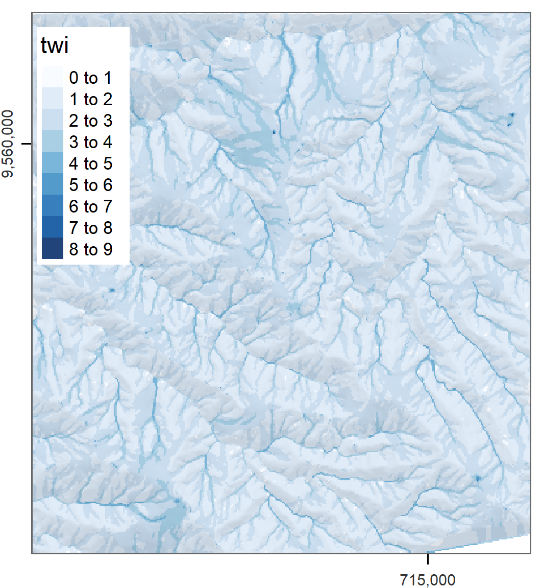

# Bridges to GIS software {#gis}

## Prerequisites {-}

- This chapter requires the following packages:

```{r, message=FALSE}
library(sf)
library(raster)
library(dplyr)
library(spData)
library(RQGIS)
library(RSAGA)
library(rgrass7)
library(tmap)
```

## Introduction

An important feature of R is that users must use the command-line interface (CLI) to interact with the computer:
you type commands and hit `Enter` to execute them interactively.
The most popular open-source GIS software packages, by contrast, feature a prominent graphical user interface (GUI):
you *can* interact with QGIS, SAGA and gvSIG by typing into (dockable) command-lines, but most users interact with such programs by 'pointing and clicking their way through life' as Gary Sherman puts it below [@sherman_desktop_2008]:^[
<!-- Should the commented-out mega-footnote go in a vignette? (todo, RL) -->
<!-- yes, we should shorten the footnote or put it somewhere into the text. I just rewrote it to make clearer what was meant. At least this was what I gathered. -->
GRASS GIS and PostGIS are popular in academia and industry and can be seen as products which buck this trend as they are built around the command-line.
<!-- In [2008](http://gama.fsv.cvut.cz/~landa/publications/2008/gis-ostrava-08/paper/landa-grass-gui-wxpython.pdf) GRASS developers added a sophisticated GUI, shifting the emphasis slightly away from its CLI. -->
<!-- However, GRASS lacks a sophisticated and feature-rich IDE such as RStudio that supports 'CLI newbies'.  -->
<!-- On the other hand, PostGIS is the spatial extension of the popular PostgreSQL open source database, and therefore not really a dedicated GIS.  -->
<!-- This is also highlighted by the fact that PostGIS lacks any geovisualization capabilities and its description of 'legacy GIS' on its [website](http://workshops.boundlessgeo.com/postgis-intro/introduction.html). -->
<!-- Similar to GRASS, PostgreSQGL provides a (partial) GUI called [pgAdmin](https://www.pgadmin.org/) to facilitate the editing and administration of the database.  -->
<!-- To make it clear, though PostGIS provides spatial functions, its main purpose is the handling of spatial objects in a relational database management system. -->
<!-- Therefore, frequently users store their spatial data in PostGIS, and interact with it through a dedicated GIS software such as QGIS. Of course, you can also use R to access data from PostGIS (**sf**, **rgdal**, **rpostgis**). -->
<!-- In summary,  a typical workflow would be: perform a large spatial query with PostGIS, then load the result into a further application (QGIS, R) for further geoprocessing.    -->
]

> With the advent of 'modern' GIS software, most people want to point and
click their way through life. That’s good, but there is a tremendous amount
of flexibility and power waiting for you with the command line. Many times
you can do something on the command line in a fraction of the time you
can do it with a GUI.

Gary Sherman is well-qualified to comment on this matter as the creator of QGIS, the world's premier open source GUI-based GIS!

The 'CLI vs GUI' debate is often adversarial and polarized but it does not have to be: both options are great if well chosen in accordance with your needs and tasks.
The advantages of a good CLI such as that provided by R are numerous. 
Among others, a CLI:

- Facilitates the automation of repetitive tasks. 
- Ensures transparency and reproducibility (which also is the backbone of good scientific practice), and therefore is the preferred option for doing Geographic Data Science.
- Encourages extending existing software by making it easy to modify, enhance and implement new functions.
- Professional and advanced technical skills will certainly enhance your career prospects, and are in dire need across a wide range of disciplines.
- Is fun, but admittedly that is a subjective argument.

On the other hand, GUI-based GIS systems (particularly QGIS) are also advantageous.
For instance, think of:

- The really user-friendly graphical interface which spares the user from programming and facilitates interactive geographic data exploration and interactive map production.
- Digitizing and all related tools (trace, snap, topological rules, etc.).^[Note that there is also the **mapedit** package but its intention is to allow the quick editing of a few spatial features, and not professional, large-scale cartographic digitizing.]
- Georeferencing with ground control points and orthorectification. 
The process of locating control points, choosing the right transformation model, and evaluating the registration error are inherently interactive, and thus unsuitable to be done with R, or any other programming language.
- Stereoscopic mapping (e.g., LiDAR and structure from motion).
- The built-in geodatabase management system often integrated in Desktop GIS (ArcMap, GRASS GIS) and all related advantages such as object-oriented relational data modeling, topology, fast (spatial) querying, among others.

Another advantage of GIS software is that they provide access to hundreds of 'geoalgorithms' (computational recipes to solve geographic problems --- see Chapter \@ref(algorithms)), many of which are unavailable from the R command line.
The good news is that such geoalgorithms can be accessed from the R command via 'GIS bridges', hence the title of (and motivation for) this chapter.^[
An early use of the term 'bridge' referred the coupling of R with GRASS [@neteler_open_2008].
Roger Bivand elaborated on this in his talk "Bridges between GIS and R", delivered at the 2016 GEOSTAT summer school (see slides at http://spatial.nhh.no/misc/).
<!-- The resulting slides can be found on Roger's personal website at [http://spatial.nhh.no/misc](http://spatial.nhh.no/misc/?C=M;O=D) in the file -->
<!-- `geostat_talk16.zip`. -->
]

The R language was originally designed as an interface to and extension of other languages, especially C and FORTRAN, to enable access to statistical algorithms in a user-friendly and intuitive read-evaluate-print loop (REPL) [@chambers_extending_2016].
R was not originally intended to be a GIS.
This makes the breadth of R's geospatial capabilities astonishing to many who are unaware of its ability to replicate established GIS software for many operations on spatial data.
There are some domains where R can now outperform desktop GIS including spatial statistical modeling, online interactive visualization and the generation of animated or faceted maps.

Instead of implementing existing GIS algorithms in R, it makes sense to avoid 'reinventing the wheel' by taking advantage of R's ability to interface with other languages (especially C++, which is used for much low-level and high-performance GIS work).
Using compiled code for new geoprocessing functionality (particularly with the help of the excellent **Rcpp** package) could form the basis of new R packages, building on the success of **sf** [@pebesma_simple_2018].
However, there is already a wide range of algorithms that can be accessed via R's interfaces to dedicated GIS software.
It makes sense to understand these before moving to develop your own optimized algorithms.
For this reason this chapter focuses on 'bridges' to the mature GIS products [QGIS](http://qgis.org/) (via the package **RQGIS**), [SAGA](http://www.saga-gis.org/) (**RSAGA**) and [GRASS](https://grass.osgeo.org/) (**rgrass7**) from within R (Table \@ref(tab:gis-comp)).
Obviously, we here focus on open-source software solutions, however, there is also a bridge to the commercial GIS leader [ArcGIS](https://www.arcgis.com) through the **RPyGeo** package.
And the so-called [R-ArcGIS bridge](https://github.com/R-ArcGIS/r-bridge) allows to use R from within ArcGIS.
As a final note, we would like to point out that aside from interfaces to desktop GIS there are also interfaces to geospatial libraries such as [GDAL](www.gdal.org) (**gdalUtils**, **rgdal**, **sf**) and [GEOS](https://trac.osgeo.org/geos/) (**rgeos**, **sf**). 
By the end of the chapter you should have a working knowledge of the functionality such packages open up, and a more nuanced understanding of the  'CLI vs GUI' debate.
As mentioned in Chapter \@ref(intro), doing GIS at the command-line makes it more reproducible, in-line with the principles of Geographic Data Science.


```{r gis-comp, echo=FALSE, message=FALSE}
library(tidyverse)
d = tibble("GIS" = c("GRASS", "QGIS", "SAGA"),
            "first release" = c("1984", "2002", "2004"),
            "no. functions" = c(">500", ">1000", ">600"),
            "support" = c("hybrid", "hybrid", "hybrid"))
knitr::kable(x = d, caption = "Comparison between three open-source GIS. Hybrid refers to the support of vector and raster operations.") #%>%
  # kableExtra::add_footnote(label = "Comparing downloads of different providers is rather difficult (see http://spatialgalaxy.net/2011/12/19/qgis-users-around-the-world), and here also useless since every Windows QGIS download automatically also downloads SAGA and GRASS.", notation = "alphabet")
```

## (R)QGIS

QGIS is one of the most popular open-source GIS [Table \@ref(tab:gis-comp); @graser_processing_2015]. 
Its main advantage lies in the fact that it provides a unified interface to several other open-source GIS.
This means that you have access to GDAL/OGR, GRASS and SAGA through QGIS [@graser_processing_2015]. 
To run all these geoalgorithms (frequently more than 1000 depending on your set up) outside of the QGIS GUI, QGIS provides a Python API.
**RQGIS** establishes a tunnel to this Python API through the **reticulate** package. 
Basically, functions `set_env()` and `open_app()` are doing this. 
Note that it is optional to run `set_env()` and `open_app()` since all functions depending on their output will run them automatically if needed.
Before running **RQGIS** you have to make sure to have installed QGIS and all its (third-party) dependencies such as SAGA and GRASS.
To install **RQGIS** a number of dependencies are required, as described in the [`install_guide`](https://cran.r-project.org/web/packages/RQGIS/vignettes/install_guide.html) vignette, which covers installation on Windows, Linux and Mac.
Please install the long-term release of QGIS, i.e. 2.18, since **RQGIS** so far does not support QGIS 3.

```{r qgis_setup, eval=FALSE}
devtools::install_github("jannes-m/RQGIS") # use dev version (for now)
library(RQGIS)
set_env(dev = FALSE)
#> $`root`
#> [1] "C:/OSGeo4W64"
#> $qgis_prefix_path
#> [1] "C:/OSGeo4W64/apps/qgis-ltr"
#> $python_plugins
#> [1] "C:/OSGeo4W64/apps/qgis-ltr/python/plugins"
```

Leaving the `path`-argument of `set_env()` unspecified will search the computer for a QGIS installation.
Hence, it is faster to specify explicitly the path to your QGIS installation.
Subsequently, `open_app` sets all paths necessary to run QGIS from within R, and finally creates a so-called QGIS custom application (see [http://docs.qgis.org/testing/en/docs/pyqgis_developer_cookbook/intro.html#using-pyqgis-in-custom-applications](http://docs.qgis.org/testing/en/docs/pyqgis_developer_cookbook/intro.html#using-pyqgis-in-custom-applications)).

```{r, eval=FALSE}
open_app()
```

We are now ready for some QGIS geoprocessing from within R! 

Unioning polygons often produces so-called sliver polygons - the case when the borders of the polygons to union do not overlap completely.
This happens often when combining data from different sources.
Here, we will reuse the incongruent polygons we have already encountered in section \@ref(spatial-aggr).
Both polygon datasets are available in the **spData** package, and for both we would like to use a geographic CRS (see also Chapter \@ref(reproj-geo-data)).

```{r}
data("incongruent", package = "spData")
data("aggregating_zones", package = "spData")
incongruent = st_transform(incongruent, 4326)
aggregating_zones = st_transform(aggregating_zones, 4326)
```

First, we will need a QGIS geoalgorithm that unions polygons.
`find_algorithms()` searches all QGIS geoalgorithms with the help of regular expressions.
Assuming that the short description of the function contains the word "union", we can run:

```{r, eval=FALSE}
find_algorithms("union", name_only = TRUE)
#> [1] "qgis:union"        "saga:fuzzyunionor" "saga:union"   
```


If you also want to have a short description for each geoalgorithm, set the `name_only`-parameter to `FALSE`.
If one has no clue at all what the name of a geoalgorithm might be, one can leave the `search_term`-argument empty which will return a list of all available QGIS geoalgorithms.
You can also find the algorithms in the [QGIS online documentation](https://docs.qgis.org/2.18/en/docs/user_manual/processing_algs/index.html).

The next step is to find out how `qgis:union` can be used.
`open_help()` opens the online help of the geoalgorithm in question.
`get_usage()` returns all function parameters and default values. 


```{r, eval=FALSE}
alg = "qgis:union"
open_help(alg)
get_usage(alg)
#>ALGORITHM: Union
#>	INPUT <ParameterVector>
#>	INPUT2 <ParameterVector>
#>	OUTPUT <OutputVector>
```

Finally, we can let QGIS do the work.
Note that the workhorse function `run_qgis()` accepts R named arguments, i.e., you can specify the parameter names as returned by `get_usage()` in `run_qgis()` as you would do in any other regular R function.
Note also that `run_qgis()` accepts spatial objects residing in R's global environment as input (here: `aggregating_zones` and `incongruent`). 
But of course, you could also specify paths to spatial vector files stored on disk.
Setting the `load_output` to `TRUE` automatically loads the QGIS output as an **sf**-object into R.

```{r, eval=FALSE}
union = run_qgis(alg, INPUT = incongruent, INPUT2 = aggregating_zones, 
                 OUTPUT = file.path(tempdir(), "union.shp"),
                 load_output = TRUE)
#> $`OUTPUT`
#> [1] "C:/Users/geocompr/AppData/Local/Temp/RtmpcJlnUx/union.shp"
```

Note that the QGIS union operation merges the two input layers into one layer by using the intersection and the symmetrical difference of the two input layers (which by the way is also the default when doing a union operation in GRASS and SAGA).
This is **not** the same as `st_union(incongruent, aggregating_zones)` (see Exercises)!
The QGIS output contains empty geometries and multipart polygons.
Empty geometries might lead to problems in subsequent geoprocessing tasks which is why they will be deleted.
`st_dimension()` returns `NA` if a geometry is empty, and can therefore be used as a filter. 

```{r, eval=FALSE}
# remove empty geometries
union = union[!is.na(st_dimension(union)), ]
```

Next we convert multipart polygons into single part polygons (also known as explode geometries or casting).
This is necessary for the deletion of sliver polygons later on.

```{r, eval=FALSE, message=FALSE, warning=FALSE}
# multipart polygons to single polygons
single = st_cast(union, "POLYGON")
```

One way to identify slivers is to find polygons with comparatively very small areas, here, e.g., 25000 m^2^ (see left panel of Figure \@ref(fig:sliver-fig)). 

```{r, eval=FALSE}
# find polygons which are smaller than 25000 m^2
x = 25000
units(x) = "m^2"
single$area = st_area(single)
sub = dplyr::filter(single, area < x)
```

The next step is to find a function that makes the slivers disappear.
Assuming the function or its short description contains the word "sliver", we can run:

```{r, eval=FALSE}
find_algorithms("sliver", name_only = TRUE)
#> [1] "qgis:eliminatesliverpolygons"
```

This returns only one geoalgorithm whose parameters can be accessed with the help of `get_usage()` again.

```{r, eval=FALSE}
alg = "qgis:eliminatesliverpolygons"
get_usage(alg)
#>ALGORITHM: Eliminate sliver polygons
#>	INPUT <ParameterVector>
#>	KEEPSELECTION <ParameterBoolean>
#>	ATTRIBUTE <parameters from INPUT>
#>	COMPARISON <ParameterSelection>
#>	COMPARISONVALUE <ParameterString>
#>	MODE <ParameterSelection>
#>	OUTPUT <OutputVector>
#>	...
```

Conveniently, the user has not to specify each single parameter.
In case a parameter is left unspecified, `run_qgis()` will automatically use the corresponding default value as argument if available.
To find out about the default values, run `get_args_man()`.  

To finally get rid off the slivers, we specify that all polygons with an area less or equal to 25000 m^2^ should be joined to that neighboring polygon with the largest area (see right panel of Figure \@ref(fig:sliver-fig)).

```{r, eval=FALSE}
clean = run_qgis("qgis:eliminatesliverpolygons",
                 INPUT = single,
                 ATTRIBUTE = "area",
                 COMPARISON = "<=",
                 COMPARISONVALUE = 25000,
                 OUTPUT = file.path(tempdir(), "clean.shp"),
                 load_output = TRUE)
#> $`OUTPUT`
#> [1] "C:/Users/geocompr/AppData/Local/Temp/RtmpcJlnUx/clean.shp"
```

```{r sliver-fig, echo=FALSE, fig.cap="Sliver polygons colored in blue (left panel). Cleaned polygons (right panel)."}
knitr::include_graphics("figures/09_sliver.png")
```

Other notes:

- Leaving the output parameter(s) unspecified, saves the resulting QGIS output to a temporary folder created by QGIS.
`run_qgis` prints these paths to the console after successfully running the QGIS engine.
- If the output consists of multiple files and you have set `load_output` to `TRUE`, `run_qgis` will return a list with each element corresponding to one output file.

To learn more about **RQGIS** please refer to @muenchow_rqgis:_2017. 

## (R)SAGA {#rsaga}

The System for Automated Geoscientific Analyses (SAGA; Table \@ref(tab:gis-comp)) provides the possibility to execute SAGA modules via the command line interface (saga_cmd.exe under Windows and just saga_cmd under Linux) (see also [https://sourceforge.net/p/saga-gis/wiki/Executing%20Modules%20with%20SAGA%20CMD/](https://sourceforge.net/p/saga-gis/wiki/Executing%20Modules%20with%20SAGA%20CMD/)).
In addition, there is a Python interface (SAGA Python API).
**RSAGA** uses the former to run SAGA from within R.

Though SAGA is a hybrid GIS, its main focus has been on raster processing, and here particularly on digital elevation models (soil properties, terrain attributes, climate parameters). 
Hence, SAGA is especially good at the fast processing of large (high-resolution) raster datasets [@conrad_system_2015]. 
Therefore, we will introduce **RSAGA** with a raster use case from @muenchow_geomorphic_2012.
Specifically, we would like to compute the SAGA wetness index from a digital elevation model.
First of all, we need to make sure that **RSAGA** will find SAGA on the computer when called.
For this, all **RSAGA** functions using SAGA in the background make use of `rsaga.env()`. 
Usually, `rsaga.env()` will detect SAGA automatically by searching several likely directories (see its help for more information).

```{r, warning=FALSE, message=FALSE, eval=FALSE}
library(RSAGA)
rsaga.env()
```

However, it is possible to have 'hidden' SAGA in a location `rsaga.env()` does not search automatically. 
`linkSAGA` searches your computer for a valid SAGA installation. 
If it finds one, it adds the newest version to the PATH environment variable thereby making sure that `rsaga.env()` runs successfully.
It is only necessary to run the next code chunk if `rsaga.env()` was unsuccessful (see previous code chunk).

```{r, warning=FALSE, message=FALSE, eval=FALSE}
library(link2GI)
saga = linkSAGA()
rsaga.env()
```

Secondly, we need to write the digital elevation model to a SAGA-format. 
Note that calling `data(landslides)` attaches two object to the global environment - `dem`, a digital elevation model in the form of a `list`, and `landslides`, a `data.frame` containing observations representing the presence or absence of a landslide:

<!-- The following examples only work with SAGA < 2.3. We have informed the package maintainer to update SAGA -->

```{r, eval=FALSE}
data(landslides)
write.sgrd(data = dem, file = file.path(tempdir(), "dem"), header = dem$header)
```
 
The organization of SAGA is modular.
Libraries contain so-called modules, i.e., geoalgorithms.
To find out which libraries are available, run:

```{r, eval=FALSE}
rsaga.get.libraries()
```

We choose the library `ta_hydrology` (`ta` is the abbreviation for terrain analysis).
Subsequently, we can access the available modules of a specific library (here: `ta_hydrology`) as follows:

```{r, eval=FALSE}
rsaga.get.modules(libs = "ta_hydrology")
```

`rsaga.get.usage()` prints the function parameters of a specific geoalgorithm, e.g., the `SAGA Wetness Index`, to the console.

```{r, eval=FALSE}
rsaga.get.usage(lib = "ta_hydrology", module = "SAGA Wetness Index")
```

Finally, you can run SAGA from within R using **RSAGA**'s geoprocessing workhorse function `rsaga.geoprocessor()`. 
The function expects a parameter-argument list in which you have specified all necessary parameters.

```{r, eval=FALSE}
params = list(DEM = file.path(tempdir(), "dem.sgrd"),
              TWI = file.path(tempdir(), "twi.sdat"))
rsaga.geoprocessor(lib = "ta_hydrology", module = "SAGA Wetness Index", 
                   param = params)
```

To facilitate the access to the SAGA interface, **RSAGA** frequently provides user-friendly wrapper-functions with meaningful default values (see **RSAGA** documentation for examples, e.g., `?rsaga.wetness.index`).
So the function call for calculating the 'SAGA Wetness Index' becomes as simple as:

```{r, eval=FALSE}
rsaga.wetness.index(in.dem = file.path(tempdir(), "dem"), 
                    out.wetness.index = file.path(tempdir(), "twi"))
```

Of course, we would like to inspect our result visually (Figure \@ref(fig:saga-twi)). 
To load and plot the SAGA output file, we use the **raster** package. 

```{r saga-twi, fig.cap="SAGA wetness index of Mount Mongón, Peru.", echo=FALSE}

```

```{r, eval=FALSE}
library(raster)
twi = raster::raster(file.path(tempdir(), "twi.sdat"))
# shown is a version using tmap
plot(twi, col = RColorBrewer::brewer.pal(n = 9, name = "Blues"))
```

```{r, include=FALSE}
# or using mapview
# proj4string(twi) = paste0("+proj=utm +zone=17 +south +ellps=WGS84 +towgs84=", 
#                           "0,0,0,0,0,0,0 +units=m +no_defs")
# mapview(twi, col.regions = RColorBrewer::brewer.pal(n = 9, "Blues"), 
#         at = seq(cellStats(twi, "min") - 0.01, cellStats(twi, "max") + 0.01, 
#                  length.out = 9))
```

You can find a much more extended version of the presented example in the RSAGA vignette `vignette("RSAGA-landslides")`.
This example includes statistical geocomputing, i.e., it uses a GIS to derive terrain attributes as predictors for a non-linear Generalized Additive Model (GAM) to predict spatially landslide susceptibility [@muenchow_geomorphic_2012].
The term statistical geocomputation emphasizes the strength of combining R's data science power with the geoprocessing power of a GIS which is at the very heart of building a bridge from R to GIS.

## GRASS through **rgrass7**  {#rgrass}

The U.S. Army - Construction Engineering Research Laboratory (USA-CERL) created the core of the Geographical Resources Analysis Support System (GRASS) [Table \@ref(tab:gis-comp); @neteler_open_2008] from 1982 to 1995. 
Academia continued this work since 1997.
Similar to SAGA, GRASS focused on raster processing in the beginning while only later, since GRASS 6.0, adding advanced vector functionality [@bivand_applied_2013].

We will introduce **rgrass7** with one of the most interesting problems in GIScience - the traveling salesman problem. 
Suppose a traveling salesman would like to visit 24 customers. 
Additionally, he would like to start and finish his journey at home which makes a total of 25 locations while covering the shortest distance possible.
There is a single best solution to this problem, however, to find it, is even for modern computers (mostly) impossible [@longley_geographic_2015].
In our case, the number of possible solutions correspond to `(25 - 1)! / 2`, i.e., the factorial of 24 divided by 2 (since we do not differentiate between forward or backward direction).
Even if one iteration can be done in a nanosecond this still corresponds to `r format(factorial(25 - 1) / (2 * 10^9 * 3600 * 24 * 365))` years. 
Luckily, there are clever, almost optimal solutions which run in a tiny fraction of this inconceivable amount of time.
GRASS GIS provides one of these solutions (for more details see [v.net.salesman](https://grass.osgeo.org/grass75/manuals/v.net.salesman.html)). 
In our use case, we would like to find the shortest path between the first 25 bicycle stations (instead of customers) on London's streets (and we simply assume that the first bike station corresponds to the home of our traveling salesman).

```{r}
data("cycle_hire", package = "spData")
points = cycle_hire[1:25, ]
```

Aside from the cycle hire points data, we will need the OpenStreetMap data of London.
We download it with the help of the **osmdata** package (see also section \@ref(retrieving-data)).
We constrain the download of the street network (in OSM language called "highway") to  the bounding box of the cycle hire data, and attach the corresponding data as an `sf`-object.
`osmdata_sf` returns a list with several spatial objects (points, lines, polygons, etc.).
Here, we will only keep the line objects.
OpenStreetMap objects come with a lot of columns, `streets` features almost 500.
In fact, we are only interested the geometry column.
Nevertheless, we are keeping one attribute column, otherwise we later on run into trouble when trying to provide `writeVECT()` only with a geometry object (see further below and `?writeVECT` for more details).
Remember that the geometry column is sticky, hence, even though we are just selecting one attribute, the geometry column will be also returned (see section \@ref(intro-sf)).
<!-- To learn more about how to use the **osmdata**-package, please refer to [https://ropensci.github.io/osmdata/](https://ropensci.github.io/osmdata/). -->

```{r, eval=FALSE}
library(sf)
library(osmdata)
b_box = sf::st_bbox(cycle_hire)
london_streets = opq(b_box) %>%
  add_osm_feature(key = "highway") %>%
  osmdata_sf() %>%
  `[[`("osm_lines")
london_streets = dplyr::select(london_streets, osm_id)
```

As a convenience to the reader, one can attach `london_streets` to the global environment using `data("london_streets", package = "spDataLarge")`. 

```{r, eval=FALSE, echo=FALSE}
data("london_streets", package = "spDataLarge")
```

Now that we have the data, we can go on and initiate a GRASS session, i.e., we have to create a GRASS geodatabase.
The GRASS geodatabase system is based on SQLite.
Consequently, different users can easily work on the same project, possibly with different read/write permissions.
However, one has to set up this geodatabase (also from within R), and users used to a GIS GUI popping up by one click might find this process a bit intimidating in the beginning.
First of all, the GRASS database requires its own directory, and contains a location (see the [GRASS GIS Database](https://grass.osgeo.org/grass75/manuals/grass_database.html) help pages at [grass.osgeo.org](https://grass.osgeo.org/grass75/manuals/index.html) for further information).
The location in turn simply contains the geodata for one project. 
Within one location several mapsets can exist, and typically refer to different users. 
PERMANENT is a mandatory mapset, and created automatically.
It stores the projection, the spatial extent and the default resolution for raster data.
In order to share spatial data with all users of a project, the database owner can add spatial data to the PERMANENT mapset.
Please refer to @neteler_open_2008 and the [GRASS GIS quick start](https://grass.osgeo.org/grass75/manuals/helptext.html) for more information on the GRASS geodatabase system.

You have to set up a location and a mapset if you want to use GRASS from within R.
First of all, we need to find out if and where GRASS7 is installed on the computer.

```{r, eval=FALSE}
library(link2GI)
link = findGRASS() 
```

`link` is a `data.frame` which contains in its rows the GRASS 7 installations on your computer. 
Here, we will use a GRASS7 installation.
If you have not installed GRASS7 on your computer, we recommend that you do so now.
Assuming that we have found a working installation on your computer, we use the corresponding path in `initGRASS`. 
Additionally, we specify where to store the geodatabase (gisDbase), name the location `london`, and use the PERMANENT mapset.

```{r, eval=FALSE}
library(rgrass7)
# find a GRASS7 installation, and use the first one
ind = grep("7", link$version)[1]
# next line of code only necessary if we want to use GRASS as installed by 
# OSGeo4W. Among others, this adds some paths to PATH, which are also needed
# for running GRASS.
link2GI::paramGRASSw(link[ind, ])
grass_path = 
  ifelse(test = !is.null(link$installation_type) && 
           link$installation_type[ind] == "osgeo4W",
         yes = file.path(link$instDir[ind], "apps/grass", link$version[ind]),
         no = link$instDir)
initGRASS(gisBase = grass_path,
          # home parameter necessary under UNIX-based systems
          home = tempdir(),
          gisDbase = tempdir(), location = "london", 
          mapset = "PERMANENT", override = TRUE)
```

Subsequently, we define the projection, the extent and the resolution.

```{r, eval=FALSE}
execGRASS("g.proj", flags = c("c", "quiet"), 
          proj4 = sf::st_crs(london_streets)$proj4string)
b_box = sf::st_bbox(london_streets) 
execGRASS("g.region", flags = c("quiet"), 
          n = as.character(b_box["ymax"]), s = as.character(b_box["ymin"]), 
          e = as.character(b_box["xmax"]), w = as.character(b_box["xmin"]), 
          res = "1")
```

Once you are familiar how to set up the GRASS environment, it becomes tedious to do so over and over again.
Luckily, `linkGRASS7()` of the **link2GI** packages lets you do it with one line of code.
The only thing you need to provide is a spatial object which determines the projection and the extent of the geodatabase.
First, `linkGRASS7()` finds all GRASS installations on your computer.
Since we have set `ver_select` to `TRUE`, we can interactively choose one of the found GRASS-installations.
If there is just one installation, the `linkGRASS7()` automatically chooses this one.
Secondly, `linkGRASS7()` establishes a connection to GRASS7.
 
```{r, eval=FALSE}
link2GI::linkGRASS7(london_streets, ver_select = TRUE)
```

Before we can use GRASS geoalgorithms, we need to add data to GRASS's spatial database.
Luckily, the convenience function `writeVECT()` does this for us.
(Use `writeRast()` in the case of raster data.)
In our case we add the street and cycle hire point data while using only the first attribute column, and name them also `london_streets` and `points`. 
Note that we are converting the **sf**-objects into objects of class `Spatial*`.
In time, **rgrass7** will also work with **sf**-objects.

<!-- in time we can also use sf- and raster-objects with rgrass7, Roger has already implemented this in the rgrass7 developer version -->

```{r, eval=FALSE}
writeVECT(SDF = as(london_streets, "Spatial"), vname = "london_streets")
writeVECT(SDF = as(points[, 1], "Spatial"), vname = "points")
```

To perform our network analysis, we need a topological clean street network.
GRASS's `v.clean` takes care of the removal of duplicates, small angles and dangles, among others. 
Here, we break lines at each intersection to ensure that the subsequent routing algorithm can actually turn right or left at an intersection, and save the output in a GRASS object named `streets_clean`.
Probably a few of our cycling station points do not exactly lie on a street segment.
However, to find the shortest route between them, we need to connect them to the nearest streets segment.
`v.net`'s connect-operator does exactly this. 
We save its output in `streets_points_con`.

```{r, eval=FALSE}
execGRASS(cmd = "v.clean", input = "london_streets", output = "streets_clean",
          tool = "break", flags = "overwrite")
execGRASS(cmd = "v.net", input = "streets_clean", output = "streets_points_con", 
          points = "points", operation = "connect", threshold = 0.001,
          flags = c("overwrite", "c"))
```

The resulting clean dataset serves as input for the `v.net.salesman`-algorithm, which finally finds the shortest route between all cycle hire stations.
`center_cats` requires a numeric range as input.
This range represents the points for which a shortest route should be calculated. 
Since we would like to calculate the route for all cycle stations, we set it to `1-25`.
To access the GRASS help page of the traveling salesman algorithm, run `execGRASS("g.manual", entry = "v.net.salesman")`.

```{r, eval=FALSE}
execGRASS(cmd = "v.net.salesman", input = "streets_points_con",
          output = "shortest_route", center_cats = paste0("1-", nrow(points)),
          flags = c("overwrite"))
```

To visualize our result, we import the output layer into R, convert it into an sf-object , just keep the geometry and visualize it with the help of the **mapview** package (Figure \@ref(fig:grass-mapview)).

```{r grass-mapview, fig.cap="Shortest route between 24 cycle hire station on the OSM street network of London.", echo=FALSE}
knitr::include_graphics("figures/09_shortest_route.png")
```

```{r, eval=FALSE}
route = readVECT("shortest_route") %>%
  st_as_sf() %>%
  st_geometry()
mapview::mapview(route, map.types = "OpenStreetMap.BlackAndWhite", lwd = 7) +
  points
```

Further notes:

- Please note that we have used GRASS's geodatabase (based on SQLite) which allows faster processing. 
That means we have only exported spatial data in the beginning.
Then we created new objects but only imported the final result back into R.
To find out which datasets are currently available, run `execGRASS("g.list", type = "vector,raster", flags = "p")`.
- Of course, we could have also accessed an already existing GRASS geodatabase from within R.
Prior to importing data into R, you might want to perform some (spatial) subsetting.
Use `v.select` and `v.extract` for vector data. 
`db.select` lets you select subsets of the attribute table of a vector layer without returning the corresponding geometry.
- You can start R also from within a running GRASS session [for more information please refer to @bivand_applied_2013 and this [wiki](https://grasswiki.osgeo.org/wiki/R_statistics/rgrass7)].
- Refer to the excellent [GRASS online help](https://grass.osgeo.org/grass75/manuals/) or `execGRASS("g.manual", flags = "i")` for more information on each available GRASS geoalgorithm.
- If you would like to use GRASS 6 from within R, use the R package **spgrass6**.

## When to use what?

To recommend a single R-GIS interface is hard since the usage depends on personal preferences, the tasks at hand and your familiarity with different GIS software packages which in turn probably depends on your field of study.
As mentioned previously, SAGA is especially good at the fast processing of large (high-resolution) raster datasets, and frequently used by hydrologists, climatologists and soil scientists [@conrad_system_2015].
GRASS GIS, on the other hand, is the only GIS presented here supporting a topologically based spatial database which is especially useful for network analyses but also simulation studies (see further below).
QGIS is much more user-friendly compared to GRASS- and SAGA-GIS, especially for first-time GIS users, and probably the most popular open-source GIS.
Therefore, **RQGIS** is an appropriate choice for most use cases.
Its main advantages are:

- A unified access to several GIS, and therefore the provision of >1000 geoalgorithms (Table \@ref(tab:gis-comp)).
Of course, this includes duplicated functionality, e.g., you can perform overlay-operations using QGIS-, SAGA- or GRASS-geoalgorithms.
- The automatic data format conversions. 
For instance, SAGA uses `.sdat` grid files and GRASS uses its own database format but QGIS will handle the corresponding conversions for you on the fly.
- **RQGIS** can also handle spatial objects residing in R as input for geoalgorithms, and loads QGIS output automatically back into R if desired.
- Its convenience functions to support the access of the online help, R named arguments and automatic default value retrieval.
Please note that **rgrass7** inspired the latter two features.

By all means, there are use cases when you certainly should use one of the other R-GIS bridges.
Though QGIS is the only GIS providing a unified interface to several GIS software packages, it only provides access to a subset of the corresponding third-party geoalgorithms (for more information please refer to @muenchow_rqgis:_2017).
Therefore, to use the complete set of SAGA and GRASS functions, stick with **RSAGA** and **rgrass7**. 
When doing so, make advantage of **RSAGA**'s numerous user-friendly functions.
Note also, that **RSAGA** offers native R functions for geocomputation such as `multi.local.function`, `pick.from.grid` and many more.
**RSAGA** supports much more SAGA versions than (R)QGIS.
Finally, if you need topological correct data and/or geodatabase-management functionality such as multi-user access, we recommend the usage of GRASS. 
In addition, if you would like to run simulations with the help of a geodatabase [@krug_clearing_2010], use **rgrass7** directly since **RQGIS** always starts a new GRASS session for each call.

Please note that there are a number of further GIS software packages that have a scripting interface but for which there is no dedicated R package that accesses these: gvSig, OpenJump, Orfeo Toolbox and TauDEM.

## A short note on further spatial APIs

There are many further interfaces to other spatial software packages aside from the interfaces to Desktop GIS software presented in detail in this chapter.
This includes interfaces to spatial libraries (section \@ref(gdal)), spatial databases (section \@ref(postgis)) and web mapping services (see chapter \@ref(adv-map)).
In this section we will only have a short glance at two selected examples.
Hopefully, this will give an impression of all the spatial power and flexibility that is readily available on our fingertips.

### Spatial library API - GDAL {#gdal}

GDAL/OGR is especially known for its support for numerous spatial drivers (data formats).
In fact, there is barely a geospatial software that is not using GDAL in the background for importing and exporting geographic data.
But GDAL offers more than I/O functions, e.g., geoprocessing tools for vector and raster data (for an overview have a look at http://www.gdal.org/pages.html).
One can easily access these tools via the command line. 
In the code chunk below `linkGDAL()` searches the computer for a working GDAL installation and adds the path of the executable files to the PATH variable. 
This allows us to easily run GDAL/OGR via system calls.
For example, `ogrinfo` gives back meta information of vector data.

```{r, eval=FALSE, message=FALSE}
link2GI::linkGDAL()
cmd = paste("ogrinfo -ro -so -al", 
            system.file("shape/nc.shp", package = "sf"))
system(cmd)
#>INFO: Open of `C:/Users/geocompr/Documents/R/win-library/3.5/sf/shape/nc.shp'
#>    using driver `ESRI Shapefile' successful.
#>
#>Layer name: nc
#>Metadata:
#> DBF_DATE_LAST_UPDATE=2016-10-26
#>Geometry: Polygon
#>Feature Count: 100
#>Extent: (-84.323853, 33.881992) - (-75.456978, 36.589649)
#>Layer SRS WKT:
#>GEOGCS["GCS_North_American_1927",
#>    DATUM["North_American_Datum_1927",
#>        SPHEROID["Clarke_1866",6378206.4,294.9786982]],
#>    PRIMEM["Greenwich",0],
#>    UNIT["Degree",0.017453292519943295],
#>    AUTHORITY["EPSG","4267"]]
#>AREA: Real (24.15)
#>PERIMETER: Real (24.15)
#>CNTY_: Real (24.15)
#>CNTY_ID: Real (24.15)
#>NAME: String (80.0)
#>FIPS: String (80.0)
#>FIPSNO: Real (24.15)
#>CRESS_ID: Integer (9.0)
#>BIR74: Real (24.15)
#>SID74: Real (24.15)
#>NWBIR74: Real (24.15)
#>BIR79: Real (24.15)
#>SID79: Real (24.15)
#>NWBIR79: Real (24.15)
```

This is of course a very simple example, and we could have achieved the same using `rgdal::ogrInfo()`.
Still, it shows how we can use GDAL via the command-line from within R independently of other packages, and nothing stops us from using more advanced and/or not already implemented GDAL/OGR utilities in R.
Note also that the **RSAGA** package uses the command line interface to use SAGA geoalgorithms from within R (see section \@ref(rsaga)). 
TauDEM (http://hydrology.usu.edu/taudem/taudem5/index.html) and the Orfeo Toolbox (https://www.orfeo-toolbox.org/) are further examples for offering a command line interface. 
At the time of writing it appears that there is only a developer version of an R/TauDEM interface on R-Forge (https://r-forge.r-project.org/R/?group_id=956)).
In any case, you now have the tools to build an interface yourself.

Please keep in mind that the **sf** package already brings most of the power provided by GDAL, GEOS and PROJ to R.
Instead of using the command-line interface to access the functionality of these external dependencies, **sf** uses an **Rcpp** interface.
This is an even better approach since it circumvents the command-line and allows a direct access to GDAL/GEOS/PROJ all of which are written in either C++ or C.

### Spatial database API - PostgreSQL/PostGIS {#postgis}

Spatial database management systems (spatial DBMS) allow to store spatial and non-spatial data in a structured way (as opposed to loose collections of data somewhere stored on disk) and to relate tables (entities) to each other explicitly via unique identifiers (primary and foreign keys) and implicitly via space (think for instance of a spatial join). 
Geographic data tends to become big quite quickly.
Databases are especially useful for large and big data and querying it efficiently spatially and non-spatially.
Additionally, spatial DBMS provide multi-user access and topology support.
The most important open source spatial database is probably the combination of PostgreSQL with its spatial extension PostGIS [@obe_postgis_2015].^[SQlLite/SpatiaLite are certainly also important but implicitly we have already introduced this approach since GRASS is using SQLite in the background (see section \@ref(rgrass)).]

From within R, one can easily query data from a (spatial) DBMS which is needed for a specific analysis. 
Hence, it is not necessary to attach several gigabyte of geographic data to R's global environment which most likely would crash the R session anyway.
To give you an idea how to work with R and PostGIS in tandem, we present SQL queries from "1.4 Hello real word" of the book **PostGIS in Action, Second Edition** published with Manning [@obe_postgis_2015].^[We are thankful to Manning Publications and Regina Obe as well as Leo Hsu for giving us permission to reproduce their example here.]

The subsequent code requires a working internet connection since we are accessing a PostgreSQL/PostGIS database which is living in the [QGIS Cloud](https://qgiscloud.com/).^[QGIS Cloud lets you store geographic data and maps in the cloud. 
In the background it uses QGIS Server and PostgreSQL/PostGIS.
This way, the reader can follow the PostGIS example without the need to have PostgreSQL/PostGIS installed on a local machine.
We are thankful to the QGIS Cloud team for hosting our PostGIS example.]

```{r, eval=FALSE}
library(RPostgreSQL)
conn = dbConnect(drv = PostgreSQL(), dbname = "rtafdf_zljbqm",
                 host = "db.qgiscloud.com",
                 port = "5432", user = "rtafdf_zljbqm", 
                 password = "d3290ead")
```

The first thing to find out is which tables can be found in the database.

```{r, eval=FALSE}
dbListTables(conn)
#>[1] "spatial_ref_sys" "topology"        "layer"           "restaurants"    
#>[5] "highways" 
```

We are only interested in the `restaurants` and the `highways` tables.
The former represents the locations of fast-food restaurants in the US and the latter are principal US highways.
To find out about attributes available in a table, we can run:

```{r, eval=FALSE}
dbListFields(conn, "highways")
#>[1] "qc_id"        "wkb_geometry" "gid"          "feature"     
#>[5] "name"         "state"   
```

The first query will select `US Route 1` in Maryland (`MD`).
Note that `st_read()` allows to read spatial data from a database if it is provided with an open connection to a database and a query.
Additionally, `st_read()` needs to know which column represents the geometry (here: `wkb_geometry`).

```{r, eval=FALSE}
query = paste(
  "SELECT *",
  "FROM highways",
  "WHERE name = 'US Route 1' AND state = 'MD';")
us_route = st_read(conn, query = query, geom = "wkb_geometry")
```

This results in an **sf**-object named `us_route` of type `sfc_MULTILINESTRING`.
The next step is to add a 20-mile buffer around the selected highway (Figure \@ref(fig:postgis)).

```{r, eval=FALSE}
query = paste(
  "SELECT ST_Union(ST_Buffer(wkb_geometry, 1609 * 20))::geometry",
  "FROM highways",
  "WHERE name = 'US Route 1' AND state = 'MD';")
buf = st_read(conn, query = query)
```

Note that this was a spatial query using functions (`ST_Union()`, `ST_Buffer()`) you should be already familiar with since you find them also in the **sf**-package though here they are written in lowercase characters (`st_union()`, `st_buffer()`).
In fact, function names of the **sf** package largely follow the PostGIS naming conventions.^[By the way, the prefix `st` stands for space/time.]
The last query will find all Hardee restaurants (`HDE`) within the buffer zone (Figure \@ref(fig:postgis)).

```{r, eval=FALSE, warning=FALSE}
query = paste(
  "SELECT r.wkb_geometry",
  "FROM restaurants r",
  "WHERE EXISTS (",
  "SELECT gid",
  "FROM highways",
  "WHERE",
  "ST_DWithin(r.wkb_geometry, wkb_geometry, 1609 * 20) AND",
  "name = 'US Route 1' AND",
  "state = 'MD' AND",
  "r.franchise = 'HDE');"
)
hardees = st_read(conn, query = query)
```

Please refer to @obe_postgis_2015 for a detailed explanation of the spatial SQL query.
Finally, it is good practice to close the database connection.
Here, it is even more important since the free plan of QGIS Cloud allows only ten users to access the database at the same time. 

```{r, eval=FALSE}
RPostgreSQL::postgresqlCloseConnection(conn)
```

```{r, echo=FALSE}
load("extdata/postgis_data.Rdata")
```

```{r postgis, echo=FALSE, fig.cap="Visualization of the output of three spatial queries: highway (black line), 20-mile buffer (light yellow) and three restaurants (lightblue points) within the buffer."}
# plot the results of the queries
par(mar = rep(0, 4))
plot(buf$st_union, col = "lightyellow")
plot(st_geometry(us_route), add = TRUE, lwd = 2)
plot(st_geometry(hardees), pch = 21, cex = 1.5,
     bg = "lightblue", fill = "black", add = TRUE)
```

Unlike PostGIS, **sf** only supports spatial vector data. 
To query and manipulate raster data stored in a PostGIS database, use the **rpostgis** package [@bucklin_rpostgis_2018] and/or use command-line tools such as `rastertopgsql` which comes as part of the PostGIS installation. 

Of course, this subsection was only a very brief introduction to PostgreSQL/PostGIS.
Nevertheless, we would like to encourage the practice of storing geographic and non-geographic data in a spatial DBMS while only attaching those subsets to R's global environment which are needed for further (geo-)statistical analysis.
Please refer to @obe_postgis_2015 for a much more detailed description of the here presented SQL queries and a much more comprehensive introduction to PostgreSQL/PostGIS in general.
PostgreSQL/PostGIS is a formidable choice as an open source spatial database.
But the same is true for the lightweight SQLite/SpatiaLite database engine and GRASS which uses SQLite in the background (see section \@ref(rgrass)).

As a final note, if your data is even getting to big for PostgreSQL/PostGIS and you require massive spatial data management and query performance, then the logical next step is to use large-scale geographic querying on distributed computing systems, as for example, provided by GeoMesa (http://www.geomesa.org/) or GeoSpark [http://geospark.datasyslab.org/; @huang_geospark_2017].

## Exercises

1. Create two overlapping polygons (`poly_1` and `poly_2`) with the help of the **sf**-package (see Chapter \@ref(spatial-class)). 

1. Union `poly_1` and `poly_2` using `st_union()` and `qgis:union`.
What is the difference between the two union operations? 
How can we use the **sf** package to obtain the same result as QGIS?

1. Calculate the intersection of `poly_1` and `poly_2` using:

    - **RQGIS**, **RSAGA** and **rgrass7**
    - **sf**

1. Attach `data(dem, package = "RQGIS")` and `data(random_points, package = "RQGIS")`.
Select randomly a point from `random_points` and find all `dem` pixels that can be seen from this point (hint: viewshed).
Visualize your result.
For example, plot a hillshade, and on top of it the digital elevation model, your viewshed output and the point.
Additionally, give `mapview` a try.

1. Use `gdalinfo` via a system call for a raster file stored on disk of your choice.

1. Query all Californian highways from the PostgreSQL/PostGIS database living in the QGIS Cloud introduced in this chapter.

