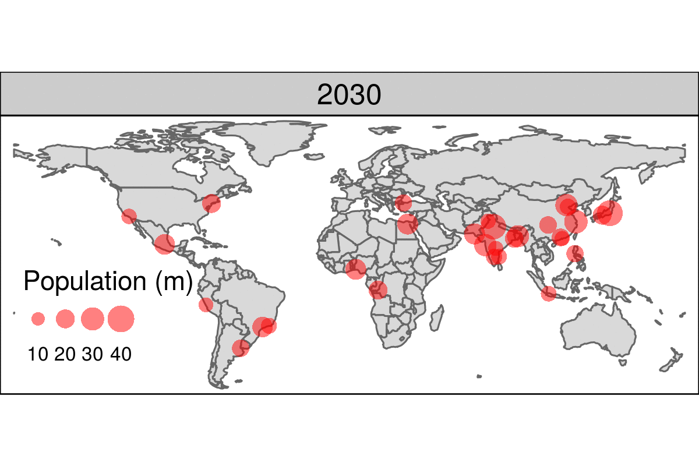
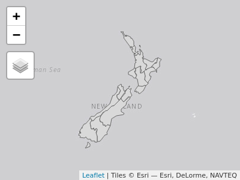
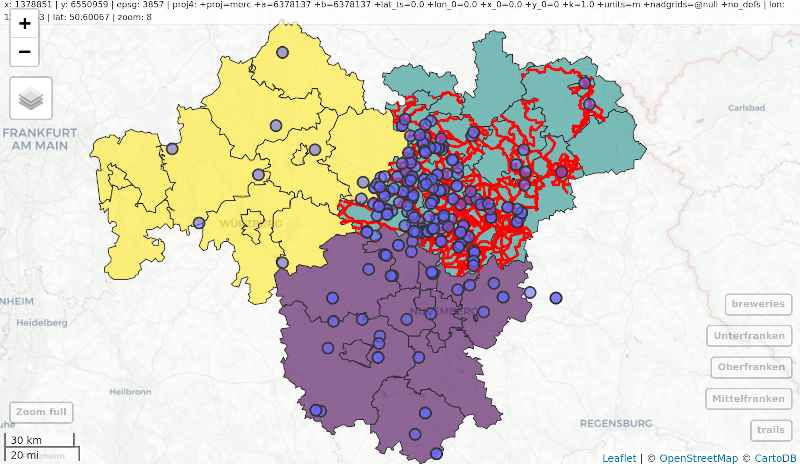

# (PART) 拡張機能 {- #extensions}

# Rで地図を作る  {#adv-map}

## 必須パッケージ  {- #prerequisites-09}

- この章では、すでに使用している以下のパッケージが必要である。

```{r 08-mapping-1, message=FALSE }
library(sf)
library(terra)
library(dplyr)
library(spData)
library(spDataLarge)
```

- また、以下の可視化パッケージを使用する（インタラクティブな地図アプリケーションを開発する場合は shiny もインストールしておこう）。

```{r 08-mapping-2, message=FALSE}
library(tmap)   # for static and interactive maps
library(leaflet) # for interactive maps
library(ggplot2) # tidyverse data visualization package
```

- Section \@ref(spatial-ras) については、以下の二つのデータセットを読み込む必要がある。

```{r 04-spatial-operations-1-1}
nz_elev = rast(system.file("raster/nz_elev.tif", package = "spDataLarge"))
```

## イントロダクション  {#introduction-09}

地理学的研究の満足度と重要性は、その結果を伝えることにある。
地図作りは、コミュニケーションと直感、そして創造力を必要とする古来の技術である。
R における静的マッピングは、Section \@ref(basic-map) で見たように、`plot()` 関数を使えば簡単にできる。
R の基本メソッドを使って高度なマップを作成することも可能ではある [@murrell_r_2016]。
しかし、この章の焦点は、専用の地図作成パッケージを使った地図作成である。
新しいスキルを身につけるには、1つの分野の知識を深めてから手を広げていくことが大切である。
地図の作成も例外ではない。そのため、この章では多くのパッケージを表面的にではなく、1つのパッケージ（**tmap**）を深く掘り下げて説明する。

地図製作は、楽しくてクリエイティブなだけでなく、実用的にも重要な役割を担っている。
丁寧に作られた地図は、仕事の成果を伝えるのに最適な方法であるが、デザインの悪い地図は印象を悪くすることがある。
よくあるデザイン上の問題点としては、Journal of Maps のスタイル[ガイド](https://www.tandf.co.uk//journals/authors/style/TJOM-suppmaterial-quick-guide.pdf)で説明されているように、文字の配置やサイズ、読みにくさ、色の選び方の不注意などが挙げられる。
さらに、地図作りが不十分だと、結果の伝達にも支障が生じることがある [@brewer_designing_2015]。

> 素人が作ったような地図では、情報の重要性が伝わらず、専門家によるデータ調査をうまく表現できないことがある。
地図は数千年前からさまざまな用途に使われてきた。
歴史的な例としては、3000年以上前の古バビロニア王朝の建物や土地所有の地図、約2000年前のプトレマイオスの代表作<u>地理学</u>の世界地図などがある [@talbert_ancient_2014] .

地図は、歴史的にエリート自身が作るか、あるいはエリートのために作られる行為であった（訳注：陸軍参謀本部陸地測量部の剱岳の登攀などの歴史を思い出してほしい）。
しかし、R パッケージの **tmap** や QGIS\index{QGIS} のPrint Composer（訳注：現在の「印刷レイアウト」）のようなオープンソースの地図作成ソフトが登場し、誰でも高品質の地図を作ることができるようになり、「市民科学」が可能になったことで、状況は一変した。
また、ジオコンピュテーションの研究成果をわかりやすく紹介するためには、地図が最適な方法であることが多い。
したがって、地図作成はジオコンピュテーション\index{geocomputation}の重要な一部であり、世界を記述するだけでなく、世界を<u>変えること</u>にも重点を置いているのである。

この章では、さまざまな地図の作り方を紹介する。
次のセクションでは、美観への配慮、ファセット、インセットマップなど、さまざまな静的マップについて説明する。
また、Section \@ref(animated-maps) から Section \@ref(mapping-applications) では、アニメーションやインタラクティブなマップ（Webマップやマッピングアプリケーションを含む）を紹介している。
最後に、Section \@ref(other-mapping-packages) は、**ggplot2** や **cartogram** などの地図作成用パッケージの代替となるものをカバーしている。

## 静的地図  {#static-maps}

\index{map making!static maps}
ジオコンピュテーションの視覚的な出力として最も一般的なのが静止地図であろう。
標準的なフォーマットとしては、ラスタ出力用に `.png`、ベクタ出力用に `.pdf` がよく用いられる。
当初、R が作成できる地図の種類は静的地図だけだった。
**sp** [@pebesma_classes_2005 参照]  のリリースで状況が進展し、その後、地図作成のための多くの技術が開発された。
しかし、インタラクティブ・マッピングがどんどん発明されてきたにもかかわらず、10年経っても R では依然として静的なプロットが地理データの可視化の重点となっていた [@cheshire_spatial_2015]。

ジェネリック関数の `plot()` 関数は、ベクタやラスタの空間オブジェクトから静的マップを作成する最速の方法であることが多い（\@ref(basic-map)、\@ref(basic-map-raster) の項を参照）。
特にプロジェクトの開発段階では、シンプルさとスピードが優先され、`plot()` はこの点で優れている。
ベース R のアプローチは拡張可能で、`plot()` は何十もの引数を提供している。
また、@murrell_r_2016 の Chapter  [14](https://www.stat.auckland.ac.nz/~paul/RG2e/chapter14.html) に示されているように、静的マップの低レベル制御を可能にする **grid** パッケージもアプローチの1つである。
この Section では、**tmap** に焦点を当て、重要な美観とレイアウトのオプションに重点を置いている。

\index{tmap (package)}
**tmap** は強力で柔軟な地図作成パッケージで、賢明なデフォルトが設定されている。
簡潔な構文で、**ggplot2** のユーザには馴染みのある最小限のコードで魅力的なマップを作成することができる。
また、`tmap_mode()` を介して、同じコードで静的な地図とインタラクティブな地図を生成するユニークな機能を備えている。
最後に、（**sf** オブジェクトと **terra** オブジェクトを含む）空間クラスを受け入れることができる点では、**ggplot2** などよりも優れている（vignette  [`tmap-getstarted`](https://cran.r-project.org/web/packages/tmap/vignettes/tmap-getstarted.html)、 [`tmap-changes-v2`](https://cran.r-project.org/web/packages/tmap/vignettes/tmap-changes-v2.html) や @tennekes_tmap_2018 などのドキュメントを参照）。


### tmap の基礎知識  {#tmap-basics}

\index{tmap (package)!basics}
**ggplot2**と同様に、**tmap** は「グラフィックの文法」という考えに基づいている [@wilkinson_grammar_2005]。
各入力データセットは、地図上の位置（データの `geometry` で定義）、色、その他の視覚的変数など、さまざまな方法で「マッピング」することができる。
基本的な構成要素は `tm_shape()` (入力データ、ラスタおよびベクタオブジェクトを定義する) で、その後に `tm_fill()` や `tm_dots()` などの 1 つまたは複数のレイヤ要素が続く。
以下のチャンクは、このようなレイヤ構成を示し、Figure \@ref(fig:tmshape) の地図を生成する。

```{r 08-mapping-3, eval=FALSE}
# nz shape に塗りつぶしレイヤを追加
tm_shape(nz) +
  tm_fill() 
# nz shape に境界レイヤを追加
tm_shape(nz) +
  tm_borders() 
# nz shape に塗りつぶしと境界レイヤを追加
tm_shape(nz) +
  tm_fill() +
  tm_borders() 
```

```{r tmshape, echo=FALSE, message=FALSE, fig.cap="ニュージーランドの形状を tmap 関数で塗りつぶし（左）、境界（中）、塗りつぶしと境界（右）のレイヤを追加してプロット。", fig.scap="New Zealand's shape plotted using tmap functions."}
source("https://github.com/geocompx/geocompr/raw/main/code/09-tmshape.R", print.eval = TRUE)
```

この場合、`tm_shape()` に渡されるオブジェクトは `nz` で、ニュージーランドの地域を表す `sf` オブジェクトである（`sf` オブジェクトについては Section \@ref(intro-sf) を参照）。
`nz` を視覚的に表現するためにレイヤを追加し、`tm_fill()` と `tm_borders()` でそれぞれ Figure \@ref(fig:tmshape) の陰影部分（左図）と枠線（中図）を作成している。

これは、直感的な地図作りの手法である。
新しいレイヤを追加する一般的なタスクは、追加演算子 `+` とそれに続く `tm_*()` によって引き受けられる。
アスタリスク(\*)は、`fill`、`borders` (上記)、`bubbles`、`text`、`raster`（全リストは `help("tmap-element")` 参照）など、さまざまな名前から明らかなレイヤを指す。
Figure \@ref(fig:tmshape) の右側のパネルでは、塗りつぶし (fill) レイヤ<u>の上に</u>境界 (borders) を重ねた結果を示す。

```{block2 qtm, type = 'rmdnote'}
`qtm()` （**q**uick **t**hematic **m**aps）は、主題図を簡単に作成する関数である。
簡潔で、多くの場合、良いデフォルトの可視化を提供する。
例えば、`qtm(nz)` は `tm_shape(nz) + tm_fill() + tm_borders()` と全く同じである。
さらに、レイヤ追加も `qtm()` では `qtm(nz) + qtm(nz_height)` と簡単である。
欠点としては、美観をコントロールすることが難しい点がある。このため、この Chapter では解説しない。
```

### 地図オブジェクト  {#map-obj}

**tmap** の便利な点は、地図を表す<u>オブジェクト</u>を格納できることである。
以下のコードは、Figure \@ref(fig:tmshape) の最後のプロットをクラス `tmap` のオブジェクトとして保存することでこれを示している (`tm_fill() + tm_borders()` を単一の関数に凝縮した `tm_polygons()` の使用に注意してみよう)。

```{r 08-mapping-4}
map_nz = tm_shape(nz) + tm_polygons()
class(map_nz)
```

`map_nz` は後でプロットすることができる。例えば、レイヤを追加したり（下図参照）、コンソールで `map_nz` を実行するだけで、`print(map_nz)` と同じ意味になる。

新しい *shape* は、`+ tm_shape(new_obj)` で追加することができる。
この場合、`new_obj` は、先行するレイヤの上にプロットされる新しい空間オブジェクトを表す。
このようにして新しい形状が追加されると、次の新しい形状が追加されるまで、それ以降のすべての美観機能はその形状を参照する。
この構文により、複数の形状やレイヤを持つマップを作成することができる。次のコードでは、関数 `tm_raster()` を使ってラスタレイヤ（レイヤを半透明にするために `alpha` が設定されている）を描画している様子を示している。

```{r 08-mapping-5, results='hide'}
map_nz1 = map_nz +
  tm_shape(nz_elev) + tm_raster(alpha = 0.7)
```

先に作成した `map_nz` オブジェクトをベースに、新しいマップオブジェクト `map_nz1` を作成する。このオブジェクトには、ニュージーランド全土の平均標高を表す別の図形（`nz_elev`）が含まれている（Figure \@ref(fig:tmlayers) 左図）。
さらに図形やレイヤを追加することもできる。以下のコードでは、ニュージーランドの [territorial waters](https://en.wikipedia.org/wiki/Territorial_waters) を表す `nz_water` を作成し、作成した線を既存の地図オブジェクトに追加している。

```{r 08-mapping-6}
nz_water = st_union(nz) |> st_buffer(22200) |> 
  st_cast(to = "LINESTRING")
map_nz2 = map_nz1 +
  tm_shape(nz_water) + tm_lines()
```

`tmap` オブジェクトに追加できるレイヤやシェイプの数に制限はない。
同じ形状を複数回使用することも可能である。
 Figure \@ref(fig:tmlayers) に示される最終的な地図は、先に作成された `map_nz2` オブジェクトに `tm_dots()` で高ポイントを表すレイヤ（オブジェクト `nz_height` に格納）を追加して作成される（**tmap** のポイントプロット機能の詳細については `?tm_dots` と `?tm_bubbles` を参照）。
その結果、4つのレイヤを持つマップができあがり、Figure \@ref(fig:tmlayers) の右側のパネルに示されている。

```{r 08-mapping-7}
map_nz3 = map_nz2 +
  tm_shape(nz_height) + tm_dots()
```

便利だがあまり知られていない **tmap** の機能として、`tmap_arrange()` がある。これは、複数の地図オブジェクトを一つの「メタプロット」に配置することができる。
Figure \@ref(fig:tmlayers)は、`map_nz1` から `map_nz3` までをメタプロットしている例である。

```{r tmlayers, message=FALSE, fig.cap="Figure 9.1 の最終地図にレイヤを追加した地図。", fig.scap="Additional layers added to the output of Figure 9.1."}
tmap_arrange(map_nz1, map_nz2, map_nz3)
```

また、`+` 演算子でさらに要素を追加することができる。
ただし、美観の設定は、レイヤ関数の引数で制御する。

### 美観  {#aesthetics}

\index{tmap (package)!aesthetics}
前節のプロットは、**tmap** のデフォルトの美観セッティングを示してきた。
`tm_fill()` と `tm_bubbles()` のレイヤには灰色の影を使用し、`tm_lines()` で作成した線を表現するために、連続した黒い線を使用する。
もちろん、これらのデフォルト値やその他の美観はオーバーライドすることができる。
このセクションの目的は、その方法を示すことである。

地図の美観には、大きく分けて「データによって変化するもの」と「一定であるもの」がある。
ヘルパー関数 `aes()` を使って変数の美観を表現する **ggplot2** とは異なり、 **tmap** は美観の引数を直接受け付ける。
変数を美観に対応させるには、その列名を対応する引数に渡し、固定の美観を設定するには、希望の値を渡す。^[
固定値と列名の間に衝突があった場合、列名が優先される。これは、`nz$red = 1:nrow(nz)` を実行した後に次のコードチャンクを実行することで確認できる。
]
塗りつぶしやボーダーのレイヤで最もよく使われる美観には、色、透明度、線幅、線種があり、それぞれ `col`、`alpha`、`lwd`、`lty` の引数で設定される。
これらを固定値で設定した場合の影響を、Figure \@ref(fig:tmstatic) に示す。

```{r tmstatic, message=FALSE, fig.cap="よく使われる塗りつぶしや枠線の美観を固定値に変更した場合の影響。", fig.scap="The impact of changing commonly used aesthetics."}
ma1 = tm_shape(nz) + tm_fill(col = "red")
ma2 = tm_shape(nz) + tm_fill(col = "red", alpha = 0.3)
ma3 = tm_shape(nz) + tm_borders(col = "blue")
ma4 = tm_shape(nz) + tm_borders(lwd = 3)
ma5 = tm_shape(nz) + tm_borders(lty = 2)
ma6 = tm_shape(nz) + tm_fill(col = "red", alpha = 0.3) +
  tm_borders(col = "blue", lwd = 3, lty = 2)
tmap_arrange(ma1, ma2, ma3, ma4, ma5, ma6)
```

```{r 08-mapping-8, echo=FALSE, eval=FALSE}
# aim: show what happpens when names clash
library(tmap)
library(spData)
nz$red = 1:nrow(nz)
qtm(nz, "red")
```

ベース R プロットと同様に、美観を定義する引数もまた、様々な値を受け取ることができる。
以下のベース R コード（Figure \@ref(fig:tmcol) の左のパネルを生成）とは異なり、**tmap** 美観引数は数値ベクタを受け付けない。

```{r 08-mapping-9, eval=FALSE}
plot(st_geometry(nz), col = nz$Land_area)  # 成功
tm_shape(nz) + tm_fill(col = nz$Land_area) # 失敗
#> Error: Fill argument neither colors nor valid variable name(s)
```

代わりに、`col` （および、ラインレイヤのための `lwd`、ポイントレイヤのための `size` など、異なることがある他の美観）は、プロットされるジオメトリに関連する属性を指定する文字列を必要とする。
したがって、次のように望ましい結果を得ることができる（Figure \@ref(fig:tmcol) の右側のパネルにプロットされている）。

```{r 08-mapping-10, fig.show='hide', message=FALSE}
tm_shape(nz) + tm_fill(col = "Land_area")
```

```{r tmcol, message=FALSE, fig.cap="数値色フィールドのbase（左）とtmap（右）の処理方法の比較。", fig.scap="Comparison of base graphics and tmap", echo=FALSE, out.width="45%", fig.show='hold', warning=FALSE, message=FALSE}
plot(nz["Land_area"])
tm_shape(nz) + tm_fill(col = "Land_area")
```

`tm_fill()` のような美観レイヤを定義する関数において重要な引数は `title` であろう。これは関連する凡例のタイトルを設定する。
次のコードチャンクは、変数名 `Land_area` （上付き文字を作成するために `expression()` を使用していることに注意）よりも魅力的な名前を提供することがわかるだろう。訳注：mac の場合、タイトルに日本語を設定するとそのままでは文字化けする。

```{r 08-mapping-11}
legend_title = expression("面積 (km"^2*")")
map_nza = tm_shape(nz) +
  tm_fill(col = "Land_area", title = legend_title) + tm_borders() + tm_layout(fontfamily = "HiraginoSans-W3")
```

### 色の設定  {#color-settings}

\index{tmap (package)!color breaks}
カラー設定は、地図デザインの重要な要素である。
Figure \@ref(fig:tmpal) に示すように、空間変動の描き方に大きな影響を与える可能性がある。
これは、ニュージーランドの地域を中央値によって色分けする4つの方法を、左から右に示している（下のコードチャンクでも示している）。

- デフォルトの設定では、次の段落で説明する 'pretty' 区切りが使用される
- `breaks` では、手動で区切りを設定することができる
- `n` は、数値変数を分類するビンの数を設定する
- `palette` は配色を定義するもので、例えば `BuGn` 

```{r 08-mapping-12, eval=FALSE}
tm_shape(nz) + tm_polygons(col = "Median_income")
breaks = c(0, 3, 4, 5) * 10000
tm_shape(nz) + tm_polygons(col = "Median_income", breaks = breaks)
tm_shape(nz) + tm_polygons(col = "Median_income", n = 10)
tm_shape(nz) + tm_polygons(col = "Median_income", palette = "BuGn")
```

```{r tmpal, message=FALSE, fig.cap="色設定に影響を与える設定の説明図。結果は（左から）デフォルト設定、手動区切り、N 区切り、パレットを変更した場合の影響を示している。", fig.scap="Illustration of settings that affect color settings.", echo=FALSE, fig.asp=0.56}
source("https://github.com/geocompx/geocompr/raw/main/code/09-tmpal.R", print.eval = TRUE)
```

色設定を変更するもう一つの方法は、色区切り（またはビン）の設定を変更することである。
**tmap** では、`breaks` を手動で設定するだけでなく、`style` の引数で自動的に区切りを作成するアルゴリズムを指定することができる。
\index{tmap (package)!break styles}
ここでは、最も便利なブレイクスタイルを6つ紹介する。

- `style = "pretty"` は、デフォルトの設定では、可能な限り改行を整数に丸め、均等にスペースを取る。
- `style = "equal"` は、入力値を同じ範囲のビンに分割し、一様な分布を持つ変数に適している（結果のマップが色の多様性に乏しくなる可能性があるため、歪んだ分布を持つ変数には推奨されていない）。
- `style = "quantile"` は、同じ数のオブザベーションが各カテゴリに入ることを保証する（ビンの範囲が広く変化する可能性があるというマイナス面を含む）。
- `style = "jenks"` は、データ中の類似した値のグループを識別し、カテゴリ間の差異を最大化する。
- `style = "cont"` (および `"order"` ) は、連続カラーフィールド上の多数の色を提示し、特に連続ラスタに適している ( `"order"` は、歪んだ分布の視覚化に役立つ)。
- `style = "cat"` は、カテゴリ値を表現するために設計され、各カテゴリが固有の色を受け取ることを保証している。

```{r break-styles, message=FALSE, fig.cap="tmap の style 引数で設定するビン方法の違いによる説明。", , fig.scap="Illustration of different binning methods using tmap.", echo=FALSE}
source("https://github.com/geocompx/geocompr/raw/main/code/09-break-styles.R", print.eval = TRUE)
```

```{block2 break-style-note, type='rmdnote'}
`style` は **tmap** 関数の引数ではあるが、これはもともと `classInt::classIntervals()` の引数である。よって、詳細はこの関数のヘルプを参照。
```

パレットは、ビンに関連付けられ、前述の `breaks`、`n`、`style` 引数で決定される色域を定義する。
デフォルトの色パレットは `tm_layout()` で指定されている（詳しくは Section \@ref(layouts) を参照）。しかし、引数 `palette` を使えば、すぐに変更することができる。
この引数には色ベクトルまたは新しい色パレット名を与えるが、`tmaptools::palette_explorer()` で対話的に選択することができる。
プレフィックスとして `-` を付けると、パレットの順序を逆にすることができる。

カラーパレット\index{map making!color palettes}には大きく分けて、カテゴリ (category)、連続色 (sequence)、発散 (diverging) の3つのグループがあり（Figure \@ref(fig:colpal)）、それぞれ異なる目的をもっている。
カテゴリパレットは、区別しやすい色で構成されており、州名や土地被覆クラスなど、特定の順序を持たないカテゴリデータに最適である。
色は直感的にわかるように、例えば川は青、牧草地は緑にする。
カテゴリを増やしすぎると、大きな凡例や多くの色を使った地図は理解できないことがある。^[
`col = "MAP_COLORS"` は、個々のポリゴンが多数存在する地図（例えば、個々の国の地図）で、隣接するポリゴンに固有の色を作成するために使用することができる。
] 

連続色パレットというグループがある。
連続色パレットは、例えば明るい色から暗い色への勾配に沿っており（明るい色は低い値を表す傾向がある）、連続的な（数値）変数に適している。
連続色パレットは、以下のコードで示すように、単色（例えば、`Blues` は明るい青から暗い青へ）または多色/色相（例えば、`YlOrBr` は明るい黄色からオレンジを経て茶色へのグラデーション）である（出力は示していない）。結果を見るために自分でコードを実行してみよう。

```{r 08-mapping-13, eval=FALSE}
tm_shape(nz) + tm_polygons("Population", palette = "Blues")
tm_shape(nz) + tm_polygons("Population", palette = "YlOrBr")
```

最後に、発散型パレットは、通常3色の間（紫-白-緑： Figure \@ref(fig:colpal) ）で、通常2つの単色パレットの両端を濃い色で結合して作成される。
その主な目的は、ある気温、世帯収入の中央値、干ばつイベントの平均確率など、重要な基準点からの差異を可視化することである。
参照点の値は、`midpoint` の引数を用いて **tmap** で調整することができる。

```{r colpal, echo=FALSE, message=FALSE, fig.cap="カテゴリ、連続色、発散のパレットの例。", out.width="50%"}
library(RColorBrewer)
many_palette_plotter = function(color_names, n, titles){
  n_colors = length(color_names)
  ylim = c(0, n_colors)
  par(mar = c(0, 5, 0, 0))
  plot(1, 1, xlim = c(0, max(n)), ylim = ylim,
       type = "n", axes = FALSE, bty = "n", xlab = "", ylab = "")
  
  for(i in seq_len(n_colors)){
    one_color = brewer.pal(n = n, name = color_names[i])
    rect(xleft = 0:(n - 1), ybottom = i - 1, xright = 1:n, ytop = i - 0.2,
         col = one_color, border = "light gray")
    }
  text(rep(-0.1, n_colors), (1: n_colors) - 0.6, labels = titles, xpd = TRUE, adj = 1)
}

many_palette_plotter(c("PRGn", "YlGn", "Set2"), 7, 
                     titles = c("Diverging", "Sequential", "Categorical"))
```

色を扱う際に考慮すべき重要な原則は、「知覚可能性」と「アクセシビリティ」の2つである。
まず、地図の色は感覚と合っていなければならない。 
つまり、特定の色は、経験や文化的なレンズを通して見ることができる。
例えば、緑は植物や低地を表し、青は水や涼しさを連想させる色である。
また、情報を効果的に伝えるために、カラーパレットは分かりやすいものが望ましい。
どの数値が低く、どの数値が高いかが明確で、色も徐々に変化することが望ましい。
この特性はレインボーカラーパレットでは保存されないため、地理データのビジュアライゼーションでは避けることを勧める [@borland_rainbow_2007]。
代わりに、**tmap** でも利用可能な [viridis カラーパレット](https://cran.r-project.org/web/packages/viridis/) を使用することができる。
第二に、色の変化は、多くの人がアクセスできるものでなければならない。
そのため、色弱者用のパレットをできるだけ多く使うことが大切である。^[`tmaptools::palette_explorer()` の「色盲シミュレータ」オプションを参照。] 

### レイアウト  {#layouts}

\index{tmap (package)!layouts}
地図レイアウトとは、すべての地図要素を組み合わせて、まとまりのある地図にすることである。
マップ要素には、マップされるオブジェクト、タイトル、スケールバー、マージン、アスペクト比などがあり、前のセクションで説明したカラー設定は、マップの見え方に影響を与えるパレットとブレークポイントに関連している。
どちらも微妙な変化をもたらすだろうが、地図が残す印象には同じように大きな影響を与える。

北矢印\index{tmap (package)!north arrows}やスケールバー\index{tmap (package)!scale bars}などの追加要素には、それぞれ独自の機能がある。`tm_compass()` と `tm_scale_bar()`（Figure \@ref(fig:na-sb)）である。

```{r na-sb, message=FALSE, fig.cap="北矢印とスケールバーを追加した地図。", out.width="50%", fig.asp=1, fig.scap="Map with a north arrow and scale bar."}
map_nz + 
  tm_compass(type = "8star", position = c("left", "top")) +
  tm_scale_bar(breaks = c(0, 100, 200), text.size = 1)
```

また、**tmap** では、様々なレイアウト設定を変更することができる。その一部を、以下のコードで作成し、Figure \@ref(fig:layout1) に図示している（全リストは、`args(tm_layout)` または `?tm_layout` を参照）。訳注：mac で title に日本語を使用する場合は、fontfamily = "HiraginoSans-W3" を追加する。

```{r 08-mapping-14, eval=FALSE}
map_nz + tm_layout(title = "ニュージーランド", fontfamily = "HiraginoSans-W3")
map_nz + tm_layout(scale = 5)
map_nz + tm_layout(bg.color = "lightblue")
map_nz + tm_layout(frame = FALSE)
```

```{r layout1, message=FALSE, fig.cap="レイアウトオプションは、（左から）title、scale、bg.color、frameの各引数で指定。", fig.scap="Layout options specified by the tmap arguments.", echo=FALSE, fig.asp=0.56}
source("code/09-layout1-ja.R", print.eval = TRUE)
```

`tm_layout()` の他の引数は、マップが配置されるキャンバスとの関係で、マップの多くの側面を制御する。
ここでは、便利なレイアウト設定をご紹介する（一部、Figure \@ref(fig:layout2) ）。

- フレーム幅（`frame.lwd`）と二重線（`frame.double.line`）を許可するオプション
- `outer.margin` を含むマージン設定と `inner.margin` 
- `fontface` で制御されるフォント設定と `fontfamily` 
- 凡例設定には、`legend.show` （凡例を表示すかどうか）、`legend.only` （地図を省略するか）、`legend.outside` （凡例を地図の外に出すか）などの二値オプションや、次のような多肢選択設定がある。 `legend.position` 
- 美観レイヤのデフォルト色（`aes.color`）、フレームなどのマップ属性 (`attr.color`)
- `sepia.intensity`（マップのセピア度合）と `saturation`（色・グレースケール）を制御する色設定

```{r layout2, message=FALSE, fig.cap="選択したレイアウトオプションの説明図。", echo=FALSE, fig.asp=0.56}
# todo: add more useful settings to this plot
source("code/09-layout2.R", print.eval = TRUE)
```

上記のカラー設定を変更した場合の影響を、Figure \@ref(fig:layout3) に示す（全リストは `?tm_layout` を参照）。

```{r layout3, message=FALSE, fig.cap="色に関するレイアウトの選択について説明図。", echo=FALSE, fig.asp=0.56}
source("code/09-layout3.R", print.eval = TRUE)
```

\index{tmap (package)!styles}
レイアウトや色などの低レベルの制御だけでなく、**tmap** では `tm_style()` 関数を用いて高レベルのスタイルも提供している(パッケージにおける「スタイル」の2番目の意味を表している)。
`tm_style("cobalt")` のようなスタイルでは、マップがスタイル化されるが、`tm_style("gray")` のようなスタイルでは、以下のコードで作成された Figure \@ref(fig:tmstyles) に示されるように、より微妙な変化を与える（ `08-tmstyles.R` を参照）。

```{r 08-mapping-15, eval=FALSE}
map_nza + tm_style("bw")
map_nza + tm_style("classic")
map_nza + tm_style("cobalt")
map_nza + tm_style("col_blind")
```

```{r tmstyles, message=FALSE, fig.cap="よく使われる tmap スタイル。", fig.scap="Selected tmap styles.", echo=FALSE, fig.asp=0.56}
source("https://github.com/geocompx/geocompr/raw/main/code/09-tmstyles.R", print.eval = TRUE)
```

```{block2 styles, type='rmdnote'}
定義済みのスタイルは、`tmap_style_catalogue()` で作成することができる。
これは、 `tmap_style_previews` というフォルダを作成し、９つの画像を保存する。
`tm_style_albatross.png` から `tm_style_white.png` までの画像は、それぞれ対応する世界のファセット地図を示す。
注記：`tmap_style_catalogue()` は実行に時間がかかる。
```

### ファセット・マップ  {#faceted-maps}

\index{map making!faceted maps}
\index{tmap (package)!faceted maps}
ファセット・マップは「スモール・マルチプル」とも呼ばれ、多数のマップを横に並べ、時には縦に重ねて構成されている [@meulemans_small_2017]。
ファセットは、空間的な関係が時間などの別の変数に対してどのように変化するかを視覚化することができる。
例えば、集落の人口の変化を、各パネルが特定の時点の人口を表すファセット・マップで表現することができる。
時間の次元は、色などの別の美観感覚で表現できるだろう。
しかし、これは複数のポイントが重なるため、地図が乱雑になる危険性がある（都市は時間が経つにつれて移動することはない！）。

通常、ファセット・マップの個々のファセットには、同じジオメトリ・データが複数回繰り返され、属性データの各列に対して1回ずつ含まれている（これは `sf` オブジェクトのデフォルトのプロット方法、Chapter \@ref(spatial-class) を参照）。
しかし、ファセットは、点パターンの経時変化など、幾何学的な変化を表現することもできる。
このファセット化されたプロットの使用例を Figure \@ref(fig:urban-facet) に示す。

```{r urban-facet, message=FALSE, fig.cap="国連による人口予測に基づき、1970年から2030年までの都市集積の上位30位までを示したファセット・マップ。", fig.scap="Faceted map showing urban agglomerations.", fig.asp=0.5}
urb_1970_2030 = urban_agglomerations |> 
  filter(year %in% c(1970, 1990, 2010, 2030))

tm_shape(world) +
  tm_polygons() +
  tm_shape(urb_1970_2030) +
  tm_symbols(col = "black", border.col = "white", size = "population_millions") +
  tm_facets(by = "year", nrow = 2, free.coords = FALSE)
```

このコードでは、**tmap**で作成されたファセット・マップの主要なフィーチャを示している。

- ファセット変数を持たないシェイプは繰り返される（この場合、`world` の国々）
- 変数によって変化する `by` の引数（この場合は `year` ）。
- `nrow` / `ncol` ファセットが配置される行と列の数を指定する設定である。
- 各マップが独自のバウンディングボックスを持つかどうかを指定する `free.coords` パラメータ

ファセット・マップは、変化する空間的関係を示すのに有用なだけでなく、アニメーション・マップの基礎としても有用である（ Section \@ref(animated-maps) 参照）。

### インセットマップ

\index{map making!inset maps}
\index{tmap (package)!inset maps}
挿入地図（インセットマップ）とは、メインマップの中や横に描画される小さなマップのことである。 
コンテキストを提供したり（Figure \@ref(fig:insetmap1)）、非連続な領域を接近させて比較を容易にしたり（Figure \@ref(fig:insetmap2)）、様々な目的を果たすことが可能である。
また、より小さなエリアに焦点を当てたり、地図と同じエリアを別のトピックでカバーしたりすることもできる。

下の例では、ニュージーランドのサザンアルプスの中央部の地図を作成している。
挿入地図は、メインマップがニュージーランド全体に対してどのような位置にあるかを示すものである。
最初のステップは、関心のある領域を定義することである。これは、新しい空間オブジェクト `nz_region` を作成することで可能である。

```{r 08-mapping-16}
nz_region = st_bbox(c(xmin = 1340000, xmax = 1450000,
                      ymin = 5130000, ymax = 5210000),
                    crs = st_crs(nz_height)) |> 
  st_as_sfc()
```

ステップ 2 では、ニュージーランドのサザンアルプス周辺を示すベースマップを作成する。 
ここは、最も重要なメッセージが述べられている場所である。 

```{r 08-mapping-17}
nz_height_map = tm_shape(nz_elev, bbox = nz_region) +
  tm_raster(style = "cont", palette = "YlGn", legend.show = TRUE) +
  tm_shape(nz_height) + tm_symbols(shape = 2, col = "red", size = 1) +
  tm_scale_bar(position = c("left", "bottom"))
```

ステップ 3 では、インセットマップの作成である。 
文脈を示し、関心のある領域を特定するのに役立つ。 
重要なのは、この地図は、境界線を記載するなどして、メインマップの位置を明確に示す必要があることである。

```{r 08-mapping-18}
nz_map = tm_shape(nz) + tm_polygons() +
  tm_shape(nz_height) + tm_symbols(shape = 2, col = "red", size = 0.1) + 
  tm_shape(nz_region) + tm_borders(lwd = 3) 
```

最後に、**grid** パッケージの関数 `viewport()` を使って、2つのマップを結合する。この関数の最初の引数は、インセットマップの中心位置（`x` と `y`）とサイズ（`width` と `height`）を指定する。

```{r insetmap1, message=FALSE, fig.cap="ニュージーランドのサザンアルプス中央部の位置がわかる挿入地図。", fig.scap="Inset map providing a context."}
library(grid)
nz_height_map
print(nz_map, vp = viewport(0.8, 0.27, width = 0.5, height = 0.5))
```

インセットマップのファイルへの保存は、グラフィックデバイス（ Section \@ref(visual-outputs) 参照）、`tmap_save()` 関数とその引数 - `insets_tm` および `insets_vp` のいずれかを使用することができる。

また、インセットマップは、非連続なエリアを1つの地図にするために使用する。
おそらく最もよく使われる例は、アメリカ合衆国の地図で、アメリカ本土とハワイ、アラスカで構成されている。
このようなケースでは、個々のインセットに最適なプロジェクションを見つけることが非常に重要である（詳しくは Chapter \@ref(reproj-geo-data) を参照）。
`tm_shape()` の引数 `projection` に US National Atlas Equal Area の EPSG コードを指定すれば、米国本土の地図に US National Atlas Equal Area を使用することができる。

```{r 08-mapping-19}
us_states_map = tm_shape(us_states, projection = "EPSG:2163") + tm_polygons() + 
  tm_layout(frame = FALSE)
```

残りのオブジェクト、`hawaii` と `alaska` は、すでに適切な投影を持っている。したがって、2つのマップを別々に作成するだけでよい。

```{r 08-mapping-20}
hawaii_map = tm_shape(hawaii) + tm_polygons() + 
  tm_layout(title = "Hawaii", frame = FALSE, bg.color = NA, 
            title.position = c("LEFT", "BOTTOM"))
alaska_map = tm_shape(alaska) + tm_polygons() + 
  tm_layout(title = "Alaska", frame = FALSE, bg.color = NA)
```

これら3つの地図を組み合わせて配置することで、最終的な地図ができあがる。

```{r insetmap2, message=FALSE, fig.cap="アメリカ合衆国の地図。"}
us_states_map
print(hawaii_map, vp = grid::viewport(0.35, 0.1, width = 0.2, height = 0.1))
print(alaska_map, vp = grid::viewport(0.15, 0.15, width = 0.3, height = 0.3))
```

上記で紹介したコードはコンパクトで、他のインセットマップのベースとして使用することができるが、その結果、Figure \@ref(fig:insetmap2)、ハワイとアラスカの位置がうまく表現されていないことがわかる。
より詳細なアプローチについては、**geocompkg** の  [ `us-map` ](https://geocompr.github.io/geocompkg/articles/us-map.html) vignette を参照。

## アニメーションマップ  {#animated-maps}

\index{map making!animated maps}
\index{tmap (package)!animated maps}
Section \@ref(faceted-maps) で紹介されているファセット・マップは、変数の空間分布が（例えば時間経過とともに）どのように変化するかを示すことができるが、このアプローチには欠点がある。
ファセットは数が多いと小さくなる。
さらに、画面やページ上で各ファセットが物理的に分離しているため、ファセット間の微妙な差異を検出することが難しい。

アニメーション地図は、これらの問題を解決する。
デジタル出版に依存しているが、より多くのコンテンツがオンラインに移行するにつれて、これは問題ではなくなってきている。
印刷された地図のアニメーション（またはインタラクティブ）バージョンを含むウェブページに読者をリンクすることで、地図を生き生きとさせることができる。
R でアニメーションを生成する方法はいくつかあり、**ggplot2**をベースにした **ganimate** のようなアニメーションパッケージもある（ Section \@ref(other-mapping-packages) を参照）。
このセクションでは、**tmap**を使ったアニメーションマップの作成に焦点を当てる。なぜなら、その構文はこれまでのセクションでお馴染みであり、アプローチの柔軟性があることがある。

 Figure \@ref(fig:urban-animated) は、アニメーションマップの簡単な例である。
ファセットプロットとは異なり、複数の地図を一画面に押し込むことはなく、世界で最も人口の多い集積地の空間分布が時間とともにどのように進化していくかを見ることができる（アニメーション版は同書のウェブサイトを参照）。

```{r urban-animated, message=FALSE, fig.cap="1950年から2030年までの、国連による人口予測に基づく都市集積の上位30位を示したアニメーション地図。アニメーション版は、r.geocompx.org で見ることができる。", fig.scap="Animated map showing the top 30 largest 'urban agglomerations'.", echo=FALSE}
if (knitr::is_latex_output()){
    
} else if (knitr::is_html_output()){
    knitr::include_graphics("figures/urban-animated.gif")
}
```

```{r 08-mapping-21, echo=FALSE, eval=FALSE}
source("https://github.com/geocompx/geocompr/raw/main/code/09-urban-animation.R")
```

Figure \@ref(fig:urban-animated) に示したアニメーションマップは、Section \@ref(faceted-maps) で示したファセット・マップを生成するのと同じ **tmap** 技術を使用して作成することができる。
ただし、`tm_facets()` の引数に関連して、2つの違いがある。

- `by = "year"` の代わりに `along = "year"` が使用される。
- `free.coords = FALSE`、これは各マップ反復のためのマップ範囲を維持する。

これらの追加引数は、次のコードチャンクで示される。

```{r 08-mapping-22}
urb_anim = tm_shape(world) + tm_polygons() + 
  tm_shape(urban_agglomerations) + tm_dots(size = "population_millions") +
  tm_facets(along = "year", free.coords = FALSE)
```

その結果、`urb_anim`、各年度の個別の地図のセットを表している。
最終的には、`tmap_animation()` でこれらを合成して、`.gif` ファイルとして保存する。
次のコマンドは、Figure \@ref(fig:urban-animated) に示されたアニメーションを作成する。ただし、いくつかの要素が欠けているので、演習で追加する。

```{r 08-mapping-23, eval=FALSE}
tmap_animation(urb_anim, filename = "urb_anim.gif", delay = 25)
```

アニメーション・マップの威力を示すもう一つの例が、Figure \@ref(fig:animus) にある。
これは、アメリカにおける州の発達を示すもので、最初は東部で形成され、その後徐々に西部へ、最後は内陸部へと発展していった。
このマップを再現するためのコードは、スクリプト `08-usboundaries.R` に記載されている。

```{r 08-mapping-24, echo=FALSE, eval=FALSE}
source("https://github.com/geocompx/geocompr/raw/main/code/09-usboundaries.R")
```

```{r animus, echo=FALSE, message=FALSE, fig.cap="米国における人口増加、州形成、境界線の変化を示すアニメーション地図（1790-2010年）。アニメーション版は r.geocompx.org でオンライン公開。", fig.scap="Animated map showing boundary changes in the United States."}
u_animus_html = "https://user-images.githubusercontent.com/1825120/38543030-5794b6f0-3c9b-11e8-9da9-10ec1f3ea726.gif"
u_animus_pdf = "figures/animus.png"
if (knitr::is_latex_output()){
    knitr::include_graphics(u_animus_pdf) 
} else if (knitr::is_html_output()){
    knitr::include_graphics(u_animus_html) 
}
```

## インタラクティブ・マップ  {#interactive-maps}

\index{map making!interactive maps}
\index{tmap (package)!interactive maps}
静止画やアニメーションの地図は、地理データセットを盛り上げることができるが、インタラクティブな地図は、それらを新しいレベルに引き上げることができる。
インタラクティブ性には様々な形態があるが、最も一般的で有用なのは、地理データセットのどの部分でもパンしたりズームしたりして、「ウェブ地図」の上に重ねてコンテキストを表示す機能である。
より高度なインタラクティブ性のレベルとしては、さまざまなフィーチャをクリックすると表示されるポップアップ、つまりインタラクティブラベルのようなものがある。
より高度なインタラクティブ機能としては、下記の **mapdeck** の例で示したように、地図を傾けたり回転させたりする機能や、ユーザーがパンやズームをすると自動的に更新される「動的にリンクした」サブプロット [@pezanowski_senseplace3_2018]  を提供する機能などが挙げられる。

しかし、インタラクティブ性の最も重要なタイプは、インタラクティブまたは「スリッピー」なウェブマップ上での地理データの表示である。
2015年にリリースされた **leaflet** パッケージは、R内からインタラクティブなWebマップの作成に革命をもたらし、多くのパッケージがこれらの基盤の上に新機能を追加し（例：**leaflet.extras**）、Webマップの作成を静的マップ作成と同じくらいシンプルにしている（例：**mapview** や **tmap** など）。
ここでは、各アプローチを逆の順番で説明する。
ここでは、**tmap**（すでに学習済みの構文）、**mapview**\index{mapview (package)}、そして最後に **leaflet** \index{leaflet (package)} （対話型マップの低レベル制御を提供）を使って、動く地図を作成する方法を探究する。

Section \@ref(static-maps) で述べた **tmap** の特徴は、同じコードを使って静的な地図とインタラクティブな地図を作ることができることである。
地図は、`tmap_mode("view")` のコマンドでビューモードに切り替えることで、任意の時点でインタラクティブに表示すことができる。
このコードは、`tmap` オブジェクト `map_nz` に基づいてニュージーランドのインタラクティブ地図を作成し、Section \@ref(map-obj) で作成し、Figure \@ref(fig:tmview) で図示している。

```{r 08-mapping-25, eval=FALSE}
tmap_mode("view")
map_nz
```

```{r tmview, message=FALSE, fig.cap="tmap のビューモードで作成されたニュージーランドのインタラクティブマップ。インタラクティブ版は r.geocompx.org からオンラインで入手可能。", fig.scap="Interactive map of New Zealand.", echo=FALSE}
if (knitr::is_latex_output()){
    
} else if (knitr::is_html_output()){
    # tmap_mode("view")
    # m_tmview = map_nz
    # tmap_save(m_tmview, "tmview-1.html")
    # file.copy("tmview-1.html", "~/geocompr/geocompr.github.io/static/img/tmview-1.html")
    knitr::include_url("https://geocompr.github.io/img/tmview-1.html")
}

```

インタラクティブモードが「オン」になったので、**tmap**で作成したすべての地図が起動する（インタラクティブな地図を作成する別の方法として、`tmap_leaflet` 機能がある）。
このインタラクティブモードの特筆すべき点は、以下のデモのように `tm_basemap()`（または `tmap_options()`）でベースマップを指定できることである（結果は表示していない）。

```{r 08-mapping-26, eval=FALSE}
map_nz + tm_basemap(server = "OpenTopoMap")
```

あまり知られていないが、**tmap** の表示モードは、ファセット・プロットにも対応している。
この場合、`tm_facets()` の引数 `sync` を使用すると、以下のコードで作成した Figure \@ref(fig:sync) のように、ズームとパンの設定が同期した複数のマップを作成することができる。

```{r 08-mapping-27, eval=FALSE}
world_coffee = left_join(world, coffee_data, by = "name_long")
facets = c("coffee_production_2016", "coffee_production_2017")
tm_shape(world_coffee) + tm_polygons(facets) + 
  tm_facets(nrow = 1, sync = TRUE)
```

```{r sync, message=FALSE, fig.cap="2016年と2017年の世界のコーヒー生産量を同期させたファセット化されたインタラクティブマップで、tmapのビューモードの動作を実演。", fig.scap="Faceted interactive maps of global coffee production.", echo=FALSE}
knitr::include_graphics("figures/interactive-facets.png")
```

同じ機能で **tmap** をプロットモードに戻す。

```{r 08-mapping-28}
tmap_mode("plot")
```

もし、**tmap** を使いこなせない場合は、**mapview** \index{mapview (package)}  を使ってインタラクティブマップを作成するのが一番手っ取り早いだろう。
以下の「ワンライナー」は、さまざまな地理データ形式をインタラクティブに探索するための信頼できる方法である。

```{r 08-mapping-29, eval=FALSE}
mapview::mapview(nz)
```

```{r mapview, message=FALSE, fig.cap="マップビューの動作イメージ図。", echo=FALSE}
knitr::include_graphics("figures/mapview.png")
# knitr::include_graphics("https://user-images.githubusercontent.com/1825120/39979522-e8277398-573e-11e8-8c55-d72c6bcc58a4.png")
# mv = mapview::mapview(nz)
# mv@map
```


**mapview** は簡潔な構文でありながら、強力な機能を備えている。
デフォルトでは、マウスの位置情報、（ポップアップによる）属性問い合わせ、スケールバー、レイヤへのズームボタンなどの標準的な GIS 機能が提供されている。
データセットを複数のレイヤに「バースト」する機能や、`+` の後に地理的オブジェクトの名前を付けて複数のレイヤを追加する機能など、高度な制御を提供する。 
さらに、属性の自動的な色付けも可能である（引数 `zcol` ）。
要するに、データドリブンの**leaflet** API\index{API}  と考えることができる（**leaflet** については後述する）。 
**mapview** は常に空間オブジェクト（`sf` と `SpatRaster`）を最初の引数として期待することから、パイプ式の末尾でうまく機能する。 


次の例では、**sf** を使って直線とポリゴンを交差させ、**mapview**（Figure \@ref(fig:mapview2)）で可視化する場合を考えてみよう。

```{r 08-mapping-30, eval=FALSE}
library(mapview)
oberfranken = subset(franconia, district == "Oberfranken")
trails |>
  st_transform(st_crs(oberfranken)) |>
  st_intersection(oberfranken) |>
  st_collection_extract("LINESTRING") |>
  mapview(color = "red", lwd = 3, layer.name = "trails") +
  mapview(franconia, zcol = "district", burst = TRUE) +
  breweries
```

```{r mapview2, message=FALSE, fig.cap="sf ベースのパイプ式の末尾で mapview を使用。", echo=FALSE, warning=FALSE}

# knitr::include_graphics("https://user-images.githubusercontent.com/1825120/39979271-5f515256-573d-11e8-9ede-e472ca007d73.png")
# commented out because interactive version not working
# mv2 = trails |>
#   st_transform(st_crs(franconia)) |>
#   st_intersection(franconia[franconia$district == "Oberfranken", ]) |>
#   st_collection_extract("LINE") |>
#   mapview(color = "red", lwd = 3, layer.name = "trails") +
#   mapview(franconia, zcol = "district", burst = TRUE) +
#   breweries
# mv2@map
```

<!--toDo:jn-->
<!-- add more info about mapview improved performance ("mapview can use all of them by setting e.g. `mapviewOptions(platform = "leafgl"/"mapdeck")` or `mapviewOptions(georaster = TRUE)`") -->

注意点としては、**mapview**のレイヤは `+` 演算子で追加される（**ggplot2** や **tmap** に似ている）。 
**mapview** の詳細については、パッケージのウェブサイトを参照。 [r-spatial.github.io/mapview/](https://r-spatial.github.io/mapview/articles/) を参照。

R でインタラクティブな地図を作成する方法は他にもある。
例えば、**googleway**\index{googleway (package)} パッケージは、柔軟で拡張性の高いインタラクティブなマッピングインターフェイスを提供する
（詳細は [`googleway-vignette`](https://cran.r-project.org/web/packages/googleway/vignettes/googleway-vignette.html) 参照。）。
同じ著者による別のアプローチとして、**[mapdeck](https://github.com/SymbolixAU/mapdeck)** があり、Uber の `Deck.gl` フレームワーク \index{mapdeck (package)}  にアクセスできるようになっている。
WebGL を使用することで、大規模なデータセット（最大数百万点）をインタラクティブに可視化することができる。
本パッケージは、Mapbox [access tokens](https://www.mapbox.com/help/how-access-tokens-work/) を使用している。本パッケージを使用する前に、登録する必要がある。

```{block2 08-mapping-31, type='rmdnote'}
以下のブロックは、`MAPBOX=your_unique_key` という形式で R 環境にアクセストークンがあることを想定している。
これは、**usethis** パッケージの `edit_r_environ()` で追加することができる。
```

**mapdeck** のユニークな点は、インタラクティブな「2.5次元」パースペクティブを提供することで、Figure \@ref(fig:mapdeck) で図示されている。
これは、地図をパン、ズーム、回転することができる上に、地図から「押し出した」データを見ることができるのである。
Figure \@ref(fig:mapdeck) は、英国における交通事故を可視化したもので、棒の高さは地域ごとの死傷者数を表している。

```{r 08-mapping-32, engine='zsh', echo=FALSE, eval=FALSE}
https://raw.githubusercontent.com/uber-common/deck.gl-data/master/examples/3d-heatmap/heatmap-data.csv
curl -i https://git.io -F "url=https://raw.githubusercontent.com/uber-common/deck.gl-data/master/examples/3d-heatmap/heatmap-data.csv" \
    -F "code=geocompr-mapdeck"
```

```{r 08-mapping-33, eval=FALSE}
library(mapdeck)
set_token(Sys.getenv("MAPBOX"))
crash_data = read.csv("https://git.io/geocompr-mapdeck")
crash_data = na.omit(crash_data)
ms = mapdeck_style("dark")
mapdeck(style = ms, pitch = 45, location = c(0, 52), zoom = 4) |>
  add_grid(data = crash_data, lat = "lat", lon = "lng", cell_size = 1000,
           elevation_scale = 50, layer_id = "grid_layer",
           colour_range = hcl.colors(6, "plasma"))
```

```{r mapdeck, echo=FALSE, fig.cap="mapdeck によって生成された、イギリス全土の道路交通事故死傷者数を表す地図。1kmのセルの高さは事故件数を表す。", fig.scap="Map generated by mapdeck."}
knitr::include_graphics("figures/mapdeck-mini.png")
```

ブラウザでは、ズームやドラッグのほか、`Cmd` / `Ctrl` を押すと、地図を回転させたり傾けたりすることができる。
[`mapdeck` vignette](https://cran.r-project.org/web/packages/mapdeck/vignettes/mapdeck.html) で示したように、パイプ演算子で複数のレイヤを追加することができる。

**mapdeck** は `sf` オブジェクトもサポートしている。先のコードチャンクの `add_grid()` 関数呼び出しを `add_polygon(data = lnd, layer_id = "polygon_layer")` に置き換えて、インタラクティブな傾いた地図にロンドンを表すポリゴンを追加してみるとわかる。

```{r 08-mapping-35, eval=FALSE, echo=FALSE}
library(mapdeck)
set_token(Sys.getenv("MAPBOX"))
df = read.csv("https://git.io/geocompr-mapdeck")
ms = mapdeck_style('dark')
mapdeck(style = ms, pitch = 45, location = c(0, 52), zoom = 4) |>
# add_grid(data = df, lat = "lat", lon = "lng", cell_size = 1000,
#          elevation_scale = 50, layer_id = "grid_layer",
#          colour_range = viridisLite::plasma(5)) |> 
  add_polygon(data = lnd, layer_id = "polygon_layer")
```


```{r 08-mapping-36, eval=FALSE, echo=FALSE}
library(sf)
str(roads)
mapdeck(
  , style = mapdeck_style('dark')
  , location = c(145, -37.8)
  , zoom = 10
  ) |>
  add_path(
    data = roads
    , stroke_colour = "RIGHT_LOC"
    , layer_id = "path_layer"
    , tooltip = "ROAD_NAME"
    , auto_highlight = TRUE
  )
```

最後になったが、**leaflet**\index{leaflet (package)} は R  で最も成熟し、広く使われている対話型の地図制作パッケージである。
**leaflet** は、Leaflet JavaScript ライブラリへの比較的低レベルのインタフェースを提供し、その引数の多くは、オリジナルの JavaScript ライブラリのドキュメントを読めば理解できる ( [leafletjs.com](https://leafletjs.com/) を参照)。

リーフレットマップは `leaflet()` で作成され、その結果は `leaflet` マップオブジェクトとなり、他の **leaflet** 関数にパイプで渡すことができる。
これにより、Figure \@ref(fig:leaflet) を生成する以下のコードで示すように、複数の地図レイヤや制御設定をインタラクティブに追加することができる（詳しくは [rstudio.github.io/leaflet/](https://rstudio.github.io/leaflet/) を参照）。

```{r leaflet-code, echo=TRUE, eval=FALSE}
pal = colorNumeric("RdYlBu", domain = cycle_hire$nbikes)
leaflet(data = cycle_hire) |> 
  addProviderTiles(providers$CartoDB.Positron) |>
  addCircles(col = ~pal(nbikes), opacity = 0.9) |> 
  addPolygons(data = lnd, fill = FALSE) |> 
  addLegend(pal = pal, values = ~nbikes) |> 
  setView(lng = -0.1, 51.5, zoom = 12) |> 
  addMiniMap()
```

```{r leaflet, message=FALSE, fig.cap="ロンドン市内の自転車レンタルポイントを紹介したリーフレットパッケージの実例。インタラクティブ版は[オンライン](https://geocompr.github.io/img/leaflet.html)を参照。", fig.scap="The leaflet package in action.", echo=FALSE}
if (knitr::is_latex_output() | knitr::is_html_output()){
  knitr::include_graphics("figures/leaflet-1.png")
} else {
  # pre-generated for https://github.com/ropensci/stplanr/issues/385
  # pal = colorNumeric("RdYlBu", domain = cycle_hire$nbikes)
  # m = leaflet(data = cycle_hire) |>
  #   addProviderTiles(providers$CartoDB.Positron) |>
  #   addCircles(col = ~pal(nbikes), opacity = 0.9) |>
  #   addPolygons(data = lnd, fill = FALSE) |>
  #   addLegend(pal = pal, values = ~nbikes) |>
  #   setView(lng = -0.1, 51.5, zoom = 12) |>
  #   addMiniMap()
  # htmlwidgets::saveWidget(m, "leaflet.html")
  # browseURL("leaflet.html")
  # file.rename("leaflet.html", "~/geocompr/geocompr.github.io/static/img/leaflet.html")
  # abort old way of including - mixed content issues
  knitr::include_url("https://geocompr.github.io/img/leaflet.html")
}
```

## マッピングアプリケーション  {#mapping-applications}

\index{map making!mapping applications}
Section \@ref(interactive-maps) で示されたインタラクティブなウェブマップは、遠くまで行くことができる。
表示すレイヤを慎重に選択し、ベースマップとポップアップを使用することで、ジオコンピュテーションを含む多くのプロジェクトの主な結果を伝えることができる。
しかし、ウェブマッピングというアプローチでインタラクティブ性を追求することには限界がある。

- 地図はパン、ズーム、クリックといったインタラクティブな動きをするが、コードは静的で、ユーザーインターフェイスは固定されている。
- ウェブ地図では、すべての地図コンテンツが一般的に静的であるため、ウェブ地図は大規模なデータセットを容易に扱うことができない。
- 変数間の関係を示すグラフや「ダッシュボード」のようなインタラクティブなレイヤを追加することは、ウェブ地図のアプローチでは困難である

これらの制約を克服するためには、静的なウェブ地図にとどまらず、地理空間系のフレームワークや地図サーバーを利用することが必要である。
この分野の製品には、 [GeoDjango](https://docs.djangoproject.com/en/2.0/ref/contrib/gis/)\index{GeoDjango}（Django Web フレームワークを拡張したもので、 [Python](https://github.com/django/django)\index{Python}）、[MapServer](https://github.com/mapserver/mapserver)\index{MapServer}（Web アプリケーション開発用のフレームワークで、大部分が C と C++\index{C++} で書かれている）や [GeoServer](https://github.com/geoserver/geoserver) （Java\index{Java} で書かれた成熟した強力なマップサーバ）が含まれる。
これら（特に GeoServer）はそれぞれ拡張性があり、毎日何千人もの人々に地図を提供することが可能である（あなたの地図に対する人々の関心が十分に高ければの話であるが）。
欠点としては、このようなサーバーサイドのソリューションは、セットアップと保守に多くの熟練した開発者の時間を必要とし、地理空間データベース管理者（[DBA](https://wiki.gis.com/wiki/index.php/Database_administrator)）などの役割を持つ人々を巻き込んでしまうこともよくある。


R のコードをインタラクティブなウェブアプリケーションに変換するためのパッケージである **shiny**\index{shiny (package)}  を使って、ウェブ地図アプリケーションを素早く作成できるようになったのは良いニュースである。
これは、RStudio の **leaflet** ウェブサイトの [Shiny integration](https://rstudio.github.io/leaflet/shiny.html) セクションで説明されている `renderLeaflet()` などの関数によって、インタラクティブな地図をサポートしているためである。
このセクションでは、ウェブ地図の観点から **shiny** の基本を学び、100行未満のコードで全画面マッピングアプリケーションを完成させることができる。

**shiny** の仕組みは、 [shiny.rstudio.com](https://shiny.rstudio.com/)に詳しく書かれている。
**shiny** アプリの2つの重要な要素は、ほとんどのウェブアプリケーション開発に共通する二つのエンド、すなわち「フロントエンド」（ユーザーが見る部分）と「バックエンド」コードを反映している。
**shiny** アプリでは、これらの要素は通常、`app フォルダ`内にある `app.R` という R スクリプト内の  `ui` と `server` というオブジェクトで作成される。
これにより、ウェブマッピングのアプリケーションを1つのファイルで表現することができ、例えば、本書の GitHub リポジトリにある [`CycleHireApp/app.R`](https://github.com/Robinlovelace/geocompr/blob/main/apps/CycleHireApp/app.R) ファイルのような単一のファイルで表現できる。

```{block2 shiny, type = 'rmdnote'}
**shiny** アプリでは、これらはしばしば `ui.R` (ユーザーインターフェースの略) と `server.R` ファイルに分けられる。この命名規則は、一般向けの Web サイトで shiny アプリを提供するサーバーサイド Linux アプリケーション、 `shiny-server` で使用されている。
`shiny-server` は、'app フォルダ' 内にある `app.R` という単一ファイルで定義されるアプリを提供することもある。
詳細は https://github.com/rstudio/shiny-server 。
```

大規模なアプリを検討する前に、「lifeApp」と名付けた最小限の例を実際に見てみよう。^[
ここでいう「アプリ」とは「Webアプリケーション」のことであり、一般的な意味であるスマートフォンのアプリと混同しないようにしよう。
]
以下のコードでは、`shinyApp()` というコマンドで、lifeApp を定義して起動する。これは、平均寿命のレベルが低い国を表示させることができるインタラクティブなスライダーである（Figure \@ref(fig:lifeApp) を参照）。

```{r 08-mapping-37, eval=FALSE}
library(shiny)   # shiny
library(leaflet) # renderLeaflet 関数
library(spData)  # world データを読み込む 
ui = fluidPage(
  sliderInput(inputId = "life", "Life expectancy", 49, 84, value = 80),
      leafletOutput(outputId = "map")
  )
server = function(input, output) {
  output$map = renderLeaflet({
    leaflet() |> 
      # addProviderTiles("OpenStreetMap.BlackAndWhite") |>
      addPolygons(data = world[world$lifeExp < input$life, ])})
}
shinyApp(ui, server)
```

```{r lifeApp, echo=FALSE, message=FALSE, fig.cap="shiny で作成したWeb地図アプリケーションの最小限の例を示す画面。", fig.scap="Minimal example of a web mapping application."}
# knitr::include_graphics("https://user-images.githubusercontent.com/1825120/39690606-8f9400c8-51d2-11e8-84d7-f4a66a477d2a.png")
knitr::include_graphics("figures/shiny-app.png")
```

lifeApp の **ユーザーインターフェース** ( `ui` ) は `fluidPage()` で作成されている。
これには、入力と出力の「ウィジェット」 --- この場合、`sliderInput()`（他にも多くの `*Input()` 関数が利用できる）と `leafletOutput()` が含まれる。
これらはデフォルトで列方向に配置されており、Figure \@ref(fig:lifeApp) でスライダーインターフェイスがマップの真上に配置されている理由を説明している（列方向にコンテンツを追加する方法については `?column` を参照）。

**サーバー側** (`server`) は、`input` と `output` を引数に持つ関数である。
`output` は、`render*()` 関数によって生成された要素を含むオブジェクトのリストである。この例では、`renderLeaflet()` が `output$map` を生成している。
サーバーで参照される `input$life` などの入力要素は、上記のコードで `ui` --- `inputId = "life"` によって定義される中に存在する要素に関連していなければならない。
関数 `shinyApp()` は `ui` と `server` の両要素を結合し、その結果を新しい R プロセスで対話的に提供する。
Figure \@ref(fig:lifeApp) に表示されているマップのスライダーを動かすと、ユーザーインターフェースでは見えないようになっているが、実際にはRのコードが再実行される。

この基本的な例をもとに、どこにヘルプがあるか（`?shiny` 参照）を知っておけば、あとは読むのをやめてプログラミングを始めるのが一番だろうね。
次のステップとして推奨されるのは、以前に紹介した  [`CycleHireApp/app.R`](https://github.com/geocompx/geocompr/blob/main/apps/CycleHireApp/app.R) スクリプトを任意の IDE で開き、それを修正して繰り返し実行することである。
この例では、**shiny** で実装されたウェブマッピングアプリケーションのコンポーネントの一部が含まれており、それらがどのように動作するかを「照らす」べきものである。

`CycleHireApp/app.R` スクリプトには、単純な 'lifeApp' の例で示されたものを超える **shiny** 関数が含まれている。
`reactive()` と `observe()` (ユーザーインターフェースに反応する出力を作成するため --- `?reactive` 参照) と `leafletProxy()` (すでに作成されている `leaflet` オブジェクトを変更するため) がある。
このような要素は、**shiny** で実装された Web マッピングアプリケーションの作成に不可欠である。
RStudio の **leaflet** [ウェブサイト](https://rstudio.github.io/leaflet/shiny.html) の shiny セクションで説明されているように、新しいレイヤの描画やデータのサブセットなどの高度な機能を含むさまざまな「イベント」をプログラムすることが可能である。

```{block2 shinynote, type='rmdnote'}
**shiny** アプリの実行方法はたくさんある。
RStudio を使用している場合、最も簡単な方法は、`app.R`、`ui.R`、`server.R` を開いている際に、Source ペインの右上になる 'Run App' ボタンを押すことである。
別の方法としては、`runApp()` に最初の引数にアプリのコードとデータを含むフォルダを指定することである。`runApp("CycleHireApp")` という例では、作業ディレクトリ中の `CycleHireApp` フォルダに `app.R` スクリプトがある。
Unix コマンドラインの場合は、`Rscript -e 'shiny::runApp("CycleHireApp")'` コマンドでアプリを立ち上げることができる。
```

`CycleHireApp` などのアプリを試すことで、RによるWeb地図アプリケーションの知識だけでなく、実践的なスキルも身につけることができる。
例えば、`setView()` の内容を変更すると、アプリが起動されたときにユーザーに表示される開始バウンディングボックスが変更される。
このような実験は、ランダムに行うのではなく、関連する文書を参照し、`?shiny` を始めとして、演習で提起されたような問題を解決したいという動機で行うべきである。


このように **shiny** を使用することで、地図アプリケーションのプロトタイプ作成をこれまで以上に迅速かつ身近に行うことができる（**shiny** アプリケーションの実装は、この章の範囲を超えた別のトピック）。
最終的にアプリケーションが異なる技術で展開されるとしても、**shiny** によって、ウェブ地図アプリケーションが比較的少ないコード行数で開発できることは間違いない（CycleHireApp の場合、76行）。
しかし、shiny アプリは巨大になる傾向がある。
例えば、[pct.bike](https://www.pct.bike/) でホストされている Propensity to Cycle Tool（PCT）は、英国運輸省の資金援助による全国規模の地図ツールである。
PCT は毎日何十人もの人が利用しており、1000行以上の [コード](https://github.com/npct/pct-shiny/blob/master/regions_www/m/server.R) [@lovelace_propensity_2017]  に基づいた複数のインタラクティブな要素を備えている。

このようなアプリの開発には時間と労力がかかるが、**shiny** は再現性のあるプロトタイプ作成のためのフレームワークを提供し、開発プロセスを支援するはずである。
**shiny** でプロトタイプを簡単に開発することの問題点として、地図アプリケーションの目的が詳細に想定されていない段階でプログラミングを開始する誘惑に駆られることが挙げられる。
そのため、**shiny** を提案しながらも、インタラクティブ地図のプロジェクトの第一段階として、ペンと紙という古くからある技術から始めることを推奨している。
このように、プロトタイプのウェブアプリケーションは、技術的な考慮事項ではなく、開発者の動機と想像力によって制限されるべきものなのである。

```{r CycleHireApp-html, echo=FALSE, message=FALSE, fig.cap="Hire a cycle App は、住んでいる場所と必要な自転車に基づいて、最も近い自転車レンタルステーションを見つけるためのシンプルなウェブマッピングアプリケーション。インタラクティブ版は r.geocompx.org で確認できる。",fig.scap="Cycle Hire App, a simple web mapping application.", eval=knitr::is_html_output(), out.width="690"}

knitr::include_app("https://shiny.robinlovelace.net/CycleHireApp/")
```


```{r CycleHireApp-latex, echo=FALSE, message=FALSE, fig.cap="Hire a cycle App は、住んでいる場所と必要な自転車に基づいて、最も近い自転車レンタルステーションを見つけるためのシンプルなウェブマッピングアプリケーション。インタラクティブ版は r.geocompx.org で確認できる。", fig.scap="coffeeApp, a simple web mapping application.", eval=knitr::is_latex_output()}
knitr::include_graphics("figures/CycleHireApp-2.png")
```

## その他のマッピングパッケージ  {#other-mapping-packages}

**tmap** は、さまざまな静的マップ（Section \@ref(static-maps)）を作成するための強力なインターフェイスを提供し、インタラクティブなマップ（ection \@ref(interactive-maps)）もサポートしている。
しかし、R でマップを作成するためのオプションは他にもたくさんある。
このセクションの目的は、これらの一部を紹介し、追加リソースのポインタを提供することである。マップ作成は、R パッケージの開発において驚くほど活発な分野なので、ここでカバーしきれないほど多くのことを学ぶことができる。

最も成熟した選択肢は、コアな空間パッケージである **sf** と **terra** が提供する `plot()` メソッドを使用することである。
これらのセクションで触れていないのは、ベクタとラスタのオブジェクトのプロットメソッドは、結果が同じプロットエリアに描画される場合、組み合わせることができるということである (**sf** プロットのキーやマルチバンドのラスタなどの要素はこれを邪魔する)。
この動作は、Figure \@ref(fig:nz-plot) を生成する次のコードチャンクで説明される。
`plot()` には他にも多くのオプションがあり、`?plot` のヘルプページと **sf** vignette [`sf5`](https://cran.r-project.org/web/packages/sf/vignettes/sf5.html) のリンクをたどって調べることができる（訳注：[vignette 日本語版](https://www.uclmail.net/users/babayoshihiko/R/)）。

```{r nz-plot, message=FALSE, fig.cap="plot() で作成したニュージーランドの地図。右の凡例は標高 (海抜 1000 m) を示している。", fig.scap="Map of New Zealand created with plot()."}
g = st_graticule(nz, lon = c(170, 175), lat = c(-45, -40, -35))
plot(nz_water, graticule = g, axes = TRUE, col = "blue")
terra::plot(nz_elev / 1000, add = TRUE, axes = FALSE)
plot(st_geometry(nz), add = TRUE)
```

**tidyverse**\index{tidyverse (package)} のプロットパッケージ **ggplot2** は `sf` オブジェクトを `geom_sf()`\index{ggplot2 (package)} でサポートしている。
構文は **tmap** で使用されているものと似ている。
最初は `ggplot()` で、次に `+ geom_*()` を追加釣ることで、レイヤを追加する。ここで `*` は、`geom_sf()`（`sf` オブジェクトの場合）や `geom_points()`（点の場合）などのレイヤタイプを表す。
   
**ggplot2** はデフォルトで経緯度図郭線を描画する。
経緯度図郭線のデフォルト設定は、`scale_x_continuous()` , `scale_y_continuous()` または  [`coord_sf(datum = NA)`](https://github.com/tidyverse/ggplot2/issues/2071) で上書きできる。
その他の注目すべき特徴としては、`aes()` でカプセル化された引用符なしの変数名を使って、どの美観が異なるかを示したり、`data` 引数を使ってデータソースを切り替えたりしている。以下のコードチャンクでは Figure \@ref(fig:nz-gg) を作成している。

```{r nz-gg, out.width="50%", message=FALSE, fig.cap="ggplot2 を使って作成したニュージーランドの地図。"}
library(ggplot2)
g1 = ggplot() + geom_sf(data = nz, aes(fill = Median_income)) +
  geom_sf(data = nz_height) +
  scale_x_continuous(breaks = c(170, 175))
g1
```

また、**ggplot2** をベースにした地図の利点として、**plotly** パッケージ\index{plotly (package)} の関数 `ggplotly()` を使って印刷すると、簡単にインタラクティブなレベルを与えることができることが挙げられる。
例えば、`plotly::ggplotly(g1)` を試してみて、その結果を他の **plotly** マッピング関数と比較してみてみよう。 [blog.cpsievert.me](https://blog.cpsievert.me/2018/03/30/visualizing-geo-spatial-data-with-sf-and-plotly/)で説明されている他の **plotly** マッピング関数と比較してみてみよう。

```{r 08-mapping-38, eval=FALSE, echo=FALSE}
plotly::ggplotly(g1)
```

**gplot2** の利点は、強力なユーザコミュニティと多くのアドオンパッケージを持っていることである。
例えば、**ggplot2** の地図機能を強化するために、北矢印（`annotation_north_arrow()`）や縮尺バー（`annotation_scale()`）あるいは背景タイル（`annotation_map_tile()`）を追加する **ggspatial** がある。
また、`layer_spatial()` は様々な空間データクラスを扱うことができる。
これによって、Figure \@ref(fig:ggterra) で示すように、**terra** の `SpatRaster` オブジェクトをプロットすることができる。
 
```{r ggterra, echo=FALSE, eval=FALSE, message=FALSE, fig.cap="Map of New Zealand's elevation created with ggplot2 and ggspatial."}
library(ggspatial)
ggplot() + 
  layer_spatial(nz_elev) +
  geom_sf(data = nz, fill = NA) +
  annotation_scale() +
  scale_x_continuous(breaks = c(170, 175)) +
  scale_fill_continuous(na.value = NA)
```

同時に、**ggplot2** にはいくつかの欠点がある。
`geom_sf()` 関数は、空間[データ](https://github.com/tidyverse/ggplot2/issues/2037) から使用する希望の凡例を作成できない場合がある。
オープンソースの [ggplot2 book](https://github.com/hadley/ggplot2-book) [@wickham_ggplot2_2016] や、**ggrepel** や **tidygraph** などの多数の '**gg**package' の説明の中に、良い追加リソースがある。

最初に **sf**、**terra**、**ggplot2** パッケージを使ったマッピングを取り上げたのは、これらのパッケージが非常に柔軟で、様々な静的マップを作成することが可能であることがある。
特定の種類の地図を作図するためのマッピングパッケージ（次の段落）を取り上げる前に、すでに取り上げた汎用マッピングのパッケージの代替品（Table \@ref(tab:map-gpkg)）について考えてみる価値がある。

```{r map-gpkg, echo=FALSE, message=FALSE, warning=FALSE}
gpkg_df = readr::read_csv("extdata/generic_map_pkgs-ja.csv")
map_gpkg_df = dplyr::select(gpkg_df, Package = package, Title = title)
map_gpkg_df$Title[map_gpkg_df$Package == "leaflet"] =
  "JavaScript 'Leaflet' ライブラリを使ったインタラクティブウェブ地図を作成"
knitr::kable(map_gpkg_df, 
             caption = "厳選された汎用地図製作パッケージ", 
             caption.short = "Selected general-purpose mapping packages.", 
             booktabs = TRUE) |>
  kableExtra::column_spec(2, width = "9cm")
```

Table \@ref(tab:map-gpkg) は、さまざまな地図製作パッケージが利用可能であることを示しており、この表に記載されていないものも多数ある。
特に注目すべきは **mapsf** で、コロプレス図、プロポーショナルシンボル地図、フロー地図など、さまざまな地理的視覚化を生成することができる。
これらは、[`mapsf`](https://cran.r-project.org/web/packages/mapsf/vignettes/mapsf.html)\index{mapsf (package)} vignette に記載されている。

Table \@ref(tab:map-spkg) に示すように、いくつかのパッケージは、特定のマップタイプに焦点を当てている。
地理空間を歪めたカルトグラムの作成、ラインマップの作成、ポリゴンの正六角形グリッドへの変換、複雑なデータを地理的トポロジーを表すグリッド上に可視化し、３次元表現をするパッケージである。

```{r map-spkg, echo=FALSE, message=FALSE}
spkg_df = readr::read_csv("extdata/specific_map_pkgs-ja.csv")
map_spkg_df = dplyr::select(spkg_df, Package = package, Title = title)
knitr::kable(map_spkg_df, 
             caption = "特定の目的のための地図製作パッケージを選択し、関連する指標を示す。",
             caption.short = "Selected specific-purpose mapping packages.",
             booktabs = TRUE)
```

しかし、前述のパッケージはいずれも、データ準備や地図作成のアプローチが異なっている。
次の段落では、**cartogram** パッケージ \index{cartogram (package)}  にのみ焦点を当てる。
そのため、[linemap](https://github.com/rCarto/linemap)\index{linemap (package)}、[geogrid](https://github.com/jbaileyh/geogrid)\index{geogrid (package)}、 [geofacet](https://github.com/hafen/geofacet) \index{geofacet (package)}、[rayshader](https://github.com/tylermorganwall/rayshader)\index{rayshader (package)} のドキュメントを読んで、より詳しく知ることを勧める。

カルトグラムとは、地図変数を表現するために一定の幾何学的な歪みを持たせた地図のことである（訳注：訳語は[東北大学空間計画科学研究室](http://www.plan.civil.tohoku.ac.jp/inoue/research/cartogram/)に準じた。）。
このような地図の作成は、R では **cartogram** を用いることで、連続・非連続の面積カルトグラム（area cartogram）を作成することが可能である。
これ自体は地図製作パッケージではないが、汎用の地図製作パッケージを使用してプロットできるような歪んだ空間オブジェクトを構築することが可能である。

`cartogram_cont()` 機能は、連続した面積のカルトグラムを作成する。
入力として、`sf` オブジェクトと変数名（列）を受け取る。
さらに、`intermax` 引数（カルトグラム変換の最大反復回数）を変更することが可能である。
例えば、ニュージーランドの地域の所得の中央値を連続カルトグラム（Figure \@ref(fig:cartomap1) の右側のパネル）で表すと、次のようになる。

```{r 08-mapping-39, fig.show='hide', message=FALSE}
library(cartogram)
nz_carto = cartogram_cont(nz, "Median_income", itermax = 5)
tm_shape(nz_carto) + tm_polygons("Median_income")
```

```{r cartomap1, echo=FALSE, message=FALSE, fig.cap="標準地図（左）と連続範囲（右）の比較。", fig.scap="Comparison of standard map and continuous area cartogram."}
carto_map1 = tm_shape(nz) + 
  tm_polygons("Median_income", title = "所得中央値 (NZD)", palette = "Greens") + tm_layout(fontfamily = "HiraginoSans-W3")
carto_map2 = tm_shape(nz_carto) + 
  tm_polygons("Median_income", title = "所得中央値 (NZD)", palette = "Greens") + tm_layout(fontfamily = "HiraginoSans-W3")
tmap_arrange(carto_map1, carto_map2)
```

**cartogram** では、`cartogram_ncont()` を使用して非連続面積カルトグラムを、`cartogram_dorling()` を使用してサークルエリア（Dorling）カルトグラムを作成することもできる。
非連続面積カルトグラムは、提供された重み付け変数に基づいて各面積を縮小することによって作成される。
サークルエリア（Dorling）カルトグラムは、重み付け変数に比例した面積を持つ円から構成されている。
以下のコードは、米国各州の人口の非連続面積とサークルエリア（Dorling）カルトグラムの作成例である（Figure \@ref(fig:cartomap2)）。

```{r 08-mapping-40, fig.show='hide', message=FALSE}
us_states2163 = st_transform(us_states, "EPSG:2163")
us_states2163_ncont = cartogram_ncont(us_states2163, "total_pop_15")
us_states2163_dorling = cartogram_dorling(us_states2163, "total_pop_15")
```

```{r cartomap2, echo=FALSE, message=FALSE, fig.cap="非連続領域カルトグラム（左）と Dorling カルトグラム（右）の比較。", fig.scap="Comparison of cartograms.", fig.asp=0.32}
carto_map3 = tm_shape(us_states2163_ncont) + 
  tm_polygons("total_pop_15", title = "合計人口", palette = "BuPu") +
  tm_layout(legend.show = FALSE)
carto_map4 = tm_shape(us_states2163_dorling) + 
  tm_polygons("total_pop_15", title = "合計人口", palette = "BuPu") +
  tm_layout(legend.show = FALSE)
carto_map_34legend = tm_shape(us_states2163_dorling) + 
  tm_polygons("total_pop_15", title = "合計人口", palette = "BuPu") +
  tm_layout(legend.only = TRUE, fontfamily = "HiraginoSans-W3")
tmap_arrange(carto_map3, carto_map4, carto_map_34legend, ncol = 3)
```


<!--toDo:JN-->
<!-- add https://github.com/riatelab/fisheye -->

## 演習

```{r, echo=FALSE, results='asis'}
res = knitr::knit_child('_09-ex.Rmd', quiet = TRUE, 
                        options = list(include = FALSE, eval = FALSE))
cat(res, sep = '\n')
```


