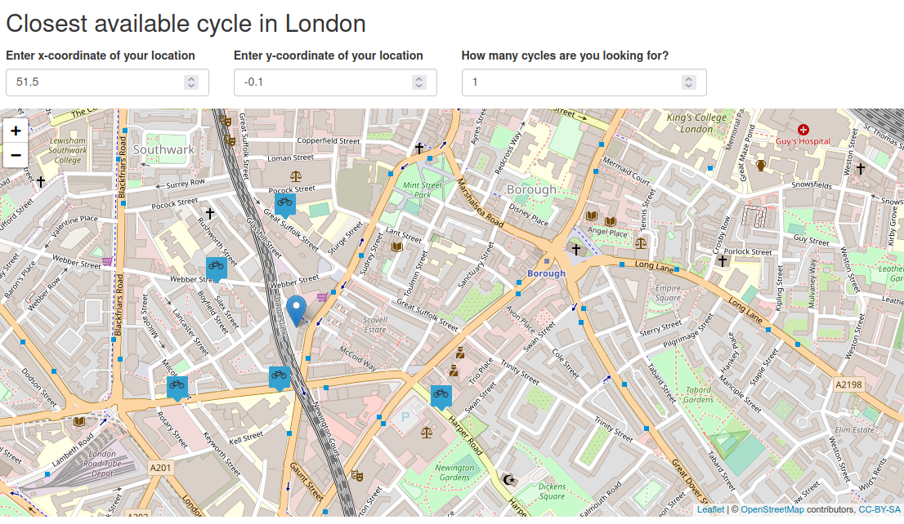

# (PART) Extensions {-}

# Making maps with R {#adv-map}

## Prerequisites {-}

- This chapter requires the following packages that we have already been using:

```{r 08-mapping-1, message=FALSE }
library(sf)
library(raster)
library(dplyr)
library(spData)
library(spDataLarge)
```

- In addition, it uses the following visualization packages (also install shiny if you want to develop interactive mapping applications):

```{r 08-mapping-2, message=FALSE}
library(tmap)    # for static and interactive maps
library(leaflet) # for interactive maps
library(ggplot2) # tidyverse data visualization package
```

## Introduction

A satisfying and important aspect of geographic research is communicating the results.
Map making --- the art of cartography --- is an ancient skill that involves communication, intuition, and an element of creativity.
Static mapping in R is straightforward with the `plot()` function, as we saw in Section \@ref(basic-map).
It is possible to create advanced maps using base R methods [@murrell_r_2016].
The focus of this chapter, however, is cartography with dedicated map-making packages.
When learning a new skill, it makes sense to gain depth-of-knowledge in one area before branching out.
Map making is no exception, hence this chapter's coverage of one package (**tmap**) in depth rather than many superficially.

In addition to being fun and creative, cartography also has important practical applications.
A carefully crafted map can be the best way of communicating the results of your work, but poorly designed maps can leave a bad impression.
Common design issues include poor placement, size and readability of text and careless selection of colors, as outlined in the style [guide](https://www.tandf.co.uk//journals/authors/style/TJOM-suppmaterial-quick-guide.pdf) of the Journal of Maps.
Furthermore, poor map making can hinder the communication of results [@brewer_designing_2015]:

> Amateur-looking maps can undermine your audience’s ability to understand important information and weaken the presentation of a professional data investigation.

Maps have been used for several thousand years for a wide variety of purposes.
Historic examples include maps of buildings and land ownership in the Old Babylonian dynasty more than 3000 years ago and Ptolemy's world map in his masterpiece *Geography* nearly 2000 years ago [@talbert_ancient_2014].

Map making has historically been an activity undertaken only by, or on behalf of, the elite.
This has changed with the emergence of open source mapping software such as the R package **tmap** and the 'print composer' in QGIS\index{QGIS} which enable anyone to make high-quality maps, enabling 'citizen science'.
Maps are also often the best way to present the findings of geocomputational research in a way that is accessible.
Map making is therefore a critical part of geocomputation\index{geocomputation} and its emphasis not only on describing, but also *changing* the world.

This chapter shows how to make a wide range of maps.
The next section covers a range of static maps, including aesthetic considerations, facets and inset maps.
Sections \@ref(animated-maps) to \@ref(mapping-applications) cover animated and interactive maps (including web maps and mapping applications).
Finally, Section \@ref(other-mapping-packages) covers a range of alternative map-making packages including **ggplot2** and **cartogram**.

## Static maps

\index{map making!static maps}
Static maps are the most common type of visual output from geocomputation.
Standard formats include `.png` and `.pdf` for raster and vector outputs respectively.
Initially, static maps were the only type of maps that R could produce.
Things advanced with the release of **sp** [see @pebesma_classes_2005] and many techniques for map making have been developed since then.
However, despite the innovation of interactive mapping, static plotting was still the emphasis of geographic data visualisation in R a decade later [@cheshire_spatial_2015].

The generic `plot()` function is often the fastest way to create static maps from vector and raster spatial objects (see sections \@ref(basic-map) and \@ref(basic-map-raster)).
Sometimes, simplicity and speed are priorities, especially during the development phase of a project, and this is where `plot()` excels.
The base R approach is also extensible, with `plot()` offering dozens of arguments.
Another approach is the **grid** package which allows low level control of static maps, as illustrated in Chapter [14](https://www.stat.auckland.ac.nz/~paul/RG2e/chapter14.html) of @murrell_r_2016.
This section focuses on **tmap** and emphasizes the important aesthetic and layout options.

\index{tmap (package)}
**tmap** is a powerful and flexible map-making package with sensible defaults.
It has a concise syntax that allows for the creation of attractive maps with minimal code which will be familiar to **ggplot2** users.
It also has the unique capability to generate static and interactive maps using the same code via `tmap_mode()`.
Finally, it accepts a wider range of spatial classes (including `raster` objects) than alternatives such as **ggplot2** (see the vignettes [`tmap-getstarted`](https://cran.r-project.org/web/packages/tmap/vignettes/tmap-getstarted.html) and [`tmap-changes-v2`](https://cran.r-project.org/web/packages/tmap/vignettes/tmap-changes-v2.html), as well as @tennekes_tmap_2018, for further documentation).

### tmap basics

\index{tmap (package)!basics}
Like **ggplot2**, **tmap** is based on the idea of a 'grammar of graphics' [@wilkinson_grammar_2005].
This involves a separation between the input data and the aesthetics (how data are visualised): each input dataset can be 'mapped' in a range of different ways including location on the map (defined by data's `geometry`), color, and other visual variables.
The basic building block is `tm_shape()` (which defines input data, raster and vector objects), followed by one or more layer elements such as `tm_fill()` and `tm_dots()`.
This layering is demonstrated in the chunk below, which generates the maps presented in Figure \@ref(fig:tmshape):

```{r 08-mapping-3, eval=FALSE}
# Add fill layer to nz shape
tm_shape(nz) +
  tm_fill() 
# Add border layer to nz shape
tm_shape(nz) +
  tm_borders() 
# Add fill and border layers to nz shape
tm_shape(nz) +
  tm_fill() +
  tm_borders() 
```

```{r tmshape, echo=FALSE, message=FALSE, fig.cap="New Zealand's shape plotted with fill (left), border (middle) and fill and border (right) layers added using tmap functions.", fig.scap="New Zealand's shape plotted using tmap functions."}
source("https://github.com/Robinlovelace/geocompr/raw/main/code/09-tmshape.R", print.eval = TRUE)
```

The object passed to `tm_shape()` in this case is `nz`, an `sf` object representing the regions of New Zealand (see Section \@ref(intro-sf) for more on `sf` objects).
Layers are added to represent `nz` visually, with `tm_fill()` and `tm_borders()` creating shaded areas (left panel) and border outlines (middle panel) in Figure \@ref(fig:tmshape), respectively.

This is an intuitive approach to map making:
the common task of *adding* new layers is undertaken by the addition operator `+`, followed by `tm_*()`.
The asterisk (\*) refers to a wide range of layer types which have self-explanatory names including `fill`, `borders` (demonstrated above), `bubbles`, `text` and `raster` (see `help("tmap-element")` for a full list).
This layering is illustrated in the right panel of Figure \@ref(fig:tmshape), the result of adding a border *on top of* the fill layer.

```{block2 qtm, type = 'rmdnote'}
`qtm()` is a handy function to create **q**uick **t**hematic **m**aps (hence the snappy name).
It is concise and provides a good default visualization in many cases:
`qtm(nz)`, for example, is equivalent to `tm_shape(nz) + tm_fill() + tm_borders()`.
Further, layers can be added concisely using multiple `qtm()` calls, such as `qtm(nz) + qtm(nz_height)`.
The disadvantage is that it makes aesthetics of individual layers harder to control, explaining why we avoid teaching it in this chapter.
```

### Map objects {#map-obj}

A useful feature of **tmap** is its ability to store *objects* representing maps.
The code chunk below demonstrates this by saving the last plot in Figure \@ref(fig:tmshape) as an object of class `tmap` (note the use of `tm_polygons()` which condenses `tm_fill()  + tm_borders()` into a single function):

```{r 08-mapping-4}
map_nz = tm_shape(nz) + tm_polygons()
class(map_nz)
```

`map_nz` can be plotted later, for example by adding additional layers (as shown below) or simply running `map_nz` in the console, which is equivalent to `print(map_nz)`.

New *shapes* can be added with `+ tm_shape(new_obj)`.
In this case `new_obj` represents a new spatial object to be plotted on top of preceding layers.
When a new shape is added in this way, all subsequent aesthetic functions refer to it, until another new shape is added.
This syntax allows the creation of maps with multiple shapes and layers, as illustrated in the next code chunk which uses the function `tm_raster()` to plot a raster layer (with `alpha` set to make the layer semi-transparent):

```{r 08-mapping-5, results='hide'}
map_nz1 = map_nz +
  tm_shape(nz_elev) + tm_raster(alpha = 0.7)
```

Building on the previously created `map_nz` object, the preceding code creates a new map object `map_nz1` that contains another shape (`nz_elev`) representing average elevation across New Zealand (see Figure \@ref(fig:tmlayers), left).
More shapes and layers can be added, as illustrated in the code chunk below which creates `nz_water`, representing New Zealand's [territorial waters](https://en.wikipedia.org/wiki/Territorial_waters), and adds the resulting lines to an existing map object.

```{r 08-mapping-6}
nz_water = st_union(nz) |> st_buffer(22200) |> 
  st_cast(to = "LINESTRING")
map_nz2 = map_nz1 +
  tm_shape(nz_water) + tm_lines()
```

There is no limit to the number of layers or shapes that can be added to `tmap` objects.
The same shape can even be used multiple times.
The final map illustrated in Figure \@ref(fig:tmlayers) is created by adding a layer representing high points (stored in the object `nz_height`) onto the previously created `map_nz2` object with `tm_dots()` (see `?tm_dots` and `?tm_bubbles` for details on **tmap**'s point plotting functions).
The resulting map, which has four layers, is illustrated in the right-hand panel of Figure \@ref(fig:tmlayers):

```{r 08-mapping-7}
map_nz3 = map_nz2 +
  tm_shape(nz_height) + tm_dots()
```

A useful and little known feature of **tmap** is that multiple map objects can be arranged in a single 'metaplot' with `tmap_arrange()`.
This is demonstrated in the code chunk below which plots `map_nz1` to `map_nz3`, resulting in Figure \@ref(fig:tmlayers).

```{r tmlayers, message=FALSE, fig.cap="Maps with additional layers added to the final map of Figure 9.1.", fig.scap="Additional layers added to the output of Figure 9.1."}
tmap_arrange(map_nz1, map_nz2, map_nz3)
```

More elements can also be added with the `+` operator.
Aesthetic settings, however, are controlled by arguments to layer functions.

### Aesthetics

\index{tmap (package)!aesthetics}
The plots in the previous section demonstrate **tmap**'s default aesthetic settings.
Gray shades are used for `tm_fill()` and  `tm_bubbles()` layers and a continuous black line is used to represent lines created with `tm_lines()`.
Of course, these default values and other aesthetics can be overridden.
The purpose of this section is to show how.

There are two main types of map aesthetics: those that change with the data and those that are constant.
Unlike **ggplot2**, which uses the helper function `aes()` to represent variable aesthetics, **tmap** accepts aesthetic arguments directly.
To map a variable to an aesthetic, pass its column name to the corresponding argument, and to set a fixed aesthetic, pass the desired value instead.^[
If there is a clash between a fixed value and a column name, the column name takes precedence. This can be verified by running the next code chunk after running `nz$red = 1:nrow(nz)`.
]
The most commonly used aesthetics for fill and border layers include color, transparency, line width and line type, set with `col`, `alpha`, `lwd`, and `lty` arguments, respectively.
The impact of setting these with fixed values is illustrated in Figure \@ref(fig:tmstatic).

```{r tmstatic, message=FALSE, fig.cap="The impact of changing commonly used fill and border aesthetics to fixed values.", fig.scap="The impact of changing commonly used aesthetics."}
ma1 = tm_shape(nz) + tm_fill(col = "red")
ma2 = tm_shape(nz) + tm_fill(col = "red", alpha = 0.3)
ma3 = tm_shape(nz) + tm_borders(col = "blue")
ma4 = tm_shape(nz) + tm_borders(lwd = 3)
ma5 = tm_shape(nz) + tm_borders(lty = 2)
ma6 = tm_shape(nz) + tm_fill(col = "red", alpha = 0.3) +
  tm_borders(col = "blue", lwd = 3, lty = 2)
tmap_arrange(ma1, ma2, ma3, ma4, ma5, ma6)
```

```{r 08-mapping-8, echo=FALSE, eval=FALSE}
# aim: show what happpens when names clash
library(tmap)
library(spData)
nz$red = 1:nrow(nz)
qtm(nz, "red")
```

Like base R plots, arguments defining aesthetics can also receive values that vary.
Unlike the base R code below (which generates the left panel in Figure \@ref(fig:tmcol)), **tmap** aesthetic arguments will not accept a numeric vector:

```{r 08-mapping-9, eval=FALSE}
plot(st_geometry(nz), col = nz$Land_area)  # works
tm_shape(nz) + tm_fill(col = nz$Land_area) # fails
#> Error: Fill argument neither colors nor valid variable name(s)
```

Instead `col` (and other aesthetics that can vary such as `lwd` for line layers and `size` for point layers) requires a character string naming an attribute associated with the geometry to be plotted.
Thus, one would achieve the desired result as follows (plotted in the right-hand panel of Figure \@ref(fig:tmcol)):

```{r 08-mapping-10, fig.show='hide', message=FALSE}
tm_shape(nz) + tm_fill(col = "Land_area")
```

```{r tmcol, message=FALSE, fig.cap="Comparison of base (left) and tmap (right) handling of a numeric color field.", fig.scap="Comparison of base graphics and tmap", echo=FALSE, out.width="45%", fig.show='hold', warning=FALSE, message=FALSE}
plot(nz["Land_area"])
tm_shape(nz) + tm_fill(col = "Land_area")
```

An important argument in functions defining aesthetic layers such as `tm_fill()` is `title`, which sets the title of the associated legend.
The following code chunk demonstrates this functionality by providing a more attractive name than the variable name `Land_area` (note the use of `expression()` to create superscript text):

```{r 08-mapping-11}
legend_title = expression("Area (km"^2*")")
map_nza = tm_shape(nz) +
  tm_fill(col = "Land_area", title = legend_title) + tm_borders()
```

### Color settings

\index{tmap (package)!color breaks}
Color settings are an important part of map design.
They can have a major impact on how spatial variability is portrayed as illustrated in Figure \@ref(fig:tmpal).
This shows four ways of coloring regions in New Zealand depending on median income, from left to right (and demonstrated in the code chunk below):

- The default setting uses 'pretty' breaks, described in the next paragraph
- `breaks` allows you to manually set the breaks
- `n` sets the number of bins into which numeric variables are categorized
- `palette` defines the color scheme, for example `BuGn`

```{r 08-mapping-12, eval=FALSE}
tm_shape(nz) + tm_polygons(col = "Median_income")
breaks = c(0, 3, 4, 5) * 10000
tm_shape(nz) + tm_polygons(col = "Median_income", breaks = breaks)
tm_shape(nz) + tm_polygons(col = "Median_income", n = 10)
tm_shape(nz) + tm_polygons(col = "Median_income", palette = "BuGn")
```

```{r tmpal, message=FALSE, fig.cap="Illustration of settings that affect color settings. The results show (from left to right): default settings, manual breaks, n breaks, and the impact of changing the palette.", fig.scap="Illustration of settings that affect color settings.", echo=FALSE, fig.asp=0.56}
source("https://github.com/Robinlovelace/geocompr/raw/main/code/09-tmpal.R", print.eval = TRUE)
```

Another way to change color settings is by altering color break (or bin) settings.
In addition to manually setting `breaks` **tmap** allows users to specify algorithms to automatically create breaks with the `style` argument.
\index{tmap (package)!break styles}
Here are six of the most useful break styles:

- `style = "pretty"`, the default setting, rounds breaks into whole numbers where possible and spaces them evenly;
- `style = "equal"` divides input values into bins of equal range and is appropriate for variables with a uniform distribution (not recommended for variables with a skewed distribution as the resulting map may end-up having little color diversity);
- `style = "quantile"` ensures the same number of observations fall into each category (with the potential downside that bin ranges can vary widely);
- `style = "jenks"` identifies groups of similar values in the data and maximizes the differences between categories;
- `style = "cont"` (and `"order"`) present a large number of colors over continuous color fields and are particularly suited for continuous rasters (`"order"` can help visualize skewed distributions);
- `style = "cat"` was designed to represent categorical values and assures that each category receives a unique color.

```{r break-styles, message=FALSE, fig.cap="Illustration of different binning methods set using the style argument in tmap.", , fig.scap="Illustration of different binning methods using tmap.", echo=FALSE}
source("https://github.com/Robinlovelace/geocompr/raw/main/code/09-break-styles.R", print.eval = TRUE)
```

```{block2 break-style-note, type='rmdnote'}
Although `style` is an argument of **tmap** functions, in fact it originates as an argument in `classInt::classIntervals()` --- see the help page of this function for details.
```

Palettes define the color ranges associated with the bins and  determined by the `breaks`, `n`, and `style` arguments described above.
The default color palette is specified in `tm_layout()` (see Section \@ref(layouts) to learn more); however, it could be quickly changed using the `palette` argument.
It expects a vector of colors or a new color palette name, which can be selected interactively with `tmaptools::palette_explorer()`.
You can add a `-` as prefix to reverse the palette order.

There are three main groups of color palettes\index{map making!color palettes}: categorical, sequential and diverging (Figure \@ref(fig:colpal)), and each of them serves a different purpose.
Categorical palettes consist of easily distinguishable colors and are most appropriate for categorical data without any particular order such as state names or land cover classes.
Colors should be intuitive: rivers should be blue, for example, and pastures green.
Avoid too many categories: maps with large legends and many colors can be uninterpretable.^[
`col = "MAP_COLORS"` can be used in maps with a large number of individual polygons (for example, a map of individual countries) to create unique colors for adjacent polygons.
] 

The second group is sequential palettes.
These follow a gradient, for example from light to dark colors (light colors tend to represent lower values), and are appropriate for continuous (numeric) variables.
Sequential palettes can be single (`Blues` go from light to dark blue, for example) or multi-color/hue (`YlOrBr` is gradient from light yellow to brown via orange, for example), as demonstrated in the code chunk below --- output not shown, run the code yourself to see the results!

```{r 08-mapping-13, eval=FALSE}
tm_shape(nz) + tm_polygons("Population", palette = "Blues")
tm_shape(nz) + tm_polygons("Population", palette = "YlOrBr")
```

The last group, diverging palettes, typically range between three distinct colors (purple-white-green in Figure \@ref(fig:colpal)) and are usually created by joining two single-color sequential palettes with the darker colors at each end.
Their main purpose is to visualize the difference from an important reference point, e.g., a certain temperature, the median household income or the mean probability for a drought event.
The reference point's value can be adjusted in **tmap** using the `midpoint` argument.

```{r colpal, echo=FALSE, message=FALSE, fig.cap="Examples of categorical, sequential and diverging palettes.", out.width="50%"}
library(RColorBrewer)
many_palette_plotter = function(color_names, n, titles){
  n_colors = length(color_names)
  ylim = c(0, n_colors)
  par(mar = c(0, 5, 0, 0))
  plot(1, 1, xlim = c(0, max(n)), ylim = ylim,
       type = "n", axes = FALSE, bty = "n", xlab = "", ylab = "")
  
  for(i in seq_len(n_colors)){
    one_color = brewer.pal(n = n, name = color_names[i])
    rect(xleft = 0:(n - 1), ybottom = i - 1, xright = 1:n, ytop = i - 0.2,
         col = one_color, border = "light gray")
    }
  text(rep(-0.1, n_colors), (1: n_colors) - 0.6, labels = titles, xpd = TRUE, adj = 1)
}

many_palette_plotter(c("PRGn", "YlGn", "Set2"), 7, 
                     titles = c("Diverging", "Sequential", "Categorical"))
```

There are two important principles for consideration when working with colors: perceptibility and accessibility.
Firstly, colors on maps should match our perception. 
This means that certain colors are viewed through our experience and also cultural lenses.
For example, green colors usually represent vegetation or lowlands and blue is connected with water or cool.
Color palettes should also be easy to understand to effectively convey information.
It should be clear which values are lower and which are higher, and colors should change gradually.
This property is not preserved in the rainbow color palette; therefore, we suggest avoiding it in geographic data visualization [@borland_rainbow_2007].
Instead, [the viridis color palettes](https://cran.r-project.org/web/packages/viridis/), also available in **tmap**, can be used.
Secondly, changes in colors should be accessible to the largest number of people.
Therefore, it is important to use colorblind friendly palettes as often as possible.^[See the "Color blindness simulator" options in `tmaptools::palette_explorer()`.]

### Layouts

\index{tmap (package)!layouts}
The map layout refers to the combination of all map elements into a cohesive map.
Map elements include among others the objects to be mapped, the title, the scale bar, margins and aspect ratios, while the color settings covered in the previous section relate to the palette and break-points used to affect how the map looks.
Both may result in subtle changes that can have an equally large impact on the impression left by your maps.

Additional elements such as north arrows\index{tmap (package)!north arrows} and scale bars\index{tmap (package)!scale bars} have their own functions: `tm_compass()` and `tm_scale_bar()` (Figure \@ref(fig:na-sb)).

```{r na-sb, message=FALSE, fig.cap="Map with additional elements - a north arrow and scale bar.", out.width="50%", fig.asp=1, fig.scap="Map with a north arrow and scale bar."}
map_nz + 
  tm_compass(type = "8star", position = c("left", "top")) +
  tm_scale_bar(breaks = c(0, 100, 200), text.size = 1)
```

**tmap** also allows a wide variety of layout settings to be changed, some of which, produced using the following code (see `args(tm_layout)` or `?tm_layout` for a full list), are illustrated in Figure \@ref(fig:layout1):

```{r 08-mapping-14, eval=FALSE}
map_nz + tm_layout(title = "New Zealand")
map_nz + tm_layout(scale = 5)
map_nz + tm_layout(bg.color = "lightblue")
map_nz + tm_layout(frame = FALSE)
```

```{r layout1, message=FALSE, fig.cap="Layout options specified by (from left to right) title, scale, bg.color and frame arguments.", fig.scap="Layout options specified by the tmap arguments.", echo=FALSE, fig.asp=0.56}
source("https://github.com/Robinlovelace/geocompr/raw/main/code/09-layout1.R", print.eval = TRUE)
```

The other arguments in `tm_layout()` provide control over many more aspects of the map in relation to the canvas on which it is placed.
Here are some useful layout settings (some of which are illustrated in Figure \@ref(fig:layout2)):

- Frame width (`frame.lwd`) and an option to allow double lines (`frame.double.line`)
- Margin settings including `outer.margin` and `inner.margin`
- Font settings controlled by `fontface` and `fontfamily`
- Legend settings including binary options such as `legend.show` (whether or not to show the legend) `legend.only` (omit the map) and `legend.outside` (should the legend go outside the map?), as well as multiple choice settings such as `legend.position`
- Default colors of aesthetic layers (`aes.color`), map attributes such as the frame (`attr.color`)
- Color settings controlling `sepia.intensity` (how yellowy the map looks) and `saturation` (a color-grayscale)

```{r layout2, message=FALSE, fig.cap="Illustration of selected layout options.", echo=FALSE, fig.asp=0.56}
# todo: add more useful settings to this plot
source("https://github.com/Robinlovelace/geocompr/raw/main/code/09-layout2.R", print.eval = TRUE)
```

The impact of changing the color settings listed above is illustrated in Figure \@ref(fig:layout3) (see `?tm_layout` for a full list).

```{r layout3, message=FALSE, fig.cap="Illustration of selected color-related layout options.", echo=FALSE, fig.asp=0.56}
source("https://github.com/Robinlovelace/geocompr/raw/main/code/09-layout3.R", print.eval = TRUE)
```

\index{tmap (package)!styles}
Beyond the low-level control over layouts and colors, **tmap** also offers high-level styles, using the `tm_style()` function (representing the second meaning of 'style' in the package).
Some styles such as `tm_style("cobalt")` result in stylized maps, while others such as `tm_style("gray")` make more subtle changes, as illustrated in Figure \@ref(fig:tmstyles), created using the code below (see `08-tmstyles.R`):

```{r 08-mapping-15, eval=FALSE}
map_nza + tm_style("bw")
map_nza + tm_style("classic")
map_nza + tm_style("cobalt")
map_nza + tm_style("col_blind")
```

```{r tmstyles, message=FALSE, fig.cap="Selected tmap styles.", fig.scap="Selected tmap styles.", echo=FALSE, fig.asp=0.56}
source("https://github.com/Robinlovelace/geocompr/raw/main/code/09-tmstyles.R", print.eval = TRUE)
```

```{block2 styles, type='rmdnote'}
A preview of predefined styles can be generated by executing `tmap_style_catalogue()`.
This creates a folder called `tmap_style_previews` containing nine images.
Each image, from `tm_style_albatross.png` to `tm_style_white.png`, shows a faceted map of the world in the corresponding style.
Note: `tmap_style_catalogue()` takes some time to run.
```

### Faceted maps

\index{map making!faceted maps}
\index{tmap (package)!faceted maps}
Faceted maps, also referred to as 'small multiples', are composed of many maps arranged side-by-side, and sometimes stacked vertically [@meulemans_small_2017].
Facets enable the visualization of how spatial relationships change with respect to another variable, such as time.
The changing populations of settlements, for example, can be represented in a faceted map with each panel representing the population at a particular moment in time.
The time dimension could be represented via another *aesthetic* such as color.
However, this risks cluttering the map because it will involve multiple overlapping points (cities do not tend to move over time!).

Typically all individual facets in a faceted map contain the same geometry data repeated multiple times, once for each column in the attribute data (this is the default plotting method for `sf` objects, see Chapter \@ref(spatial-class)).
However, facets can also represent shifting geometries such as the evolution of a point pattern over time.
This use case of faceted plot is illustrated in Figure \@ref(fig:urban-facet).

```{r urban-facet, message=FALSE, fig.cap="Faceted map showing the top 30 largest urban agglomerations from 1970 to 2030 based on population projections by the United Nations.", fig.scap="Faceted map showing urban agglomerations.", fig.asp=0.5}
urb_1970_2030 = urban_agglomerations |> 
  filter(year %in% c(1970, 1990, 2010, 2030))

tm_shape(world) +
  tm_polygons() +
  tm_shape(urb_1970_2030) +
  tm_symbols(col = "black", border.col = "white", size = "population_millions") +
  tm_facets(by = "year", nrow = 2, free.coords = FALSE)
```

The preceding code chunk demonstrates key features of faceted maps created with **tmap**:

- Shapes that do not have a facet variable are repeated (the countries in `world` in this case)
- The `by` argument which varies depending on a variable (`year` in this case).
- The `nrow`/`ncol` setting specifying the number of rows and columns that facets should be arranged into
- The `free.coords` parameter specifying if each map has its own bounding box

In addition to their utility for showing changing spatial relationships, faceted maps are also useful as the foundation for animated maps (see Section \@ref(animated-maps)).

### Inset maps

\index{map making!inset maps}
\index{tmap (package)!inset maps}
An inset map is a smaller map rendered within or next to the main map. 
It could serve many different purposes, including providing a context (Figure \@ref(fig:insetmap1)) or bringing some non-contiguous regions closer to ease their comparison (Figure \@ref(fig:insetmap2)).
They could be also used to focus on a smaller area in more detail or to cover the same area as the map, but representing a different topic.

In the example below, we create a map of the central part of New Zealand's Southern Alps.
Our inset map will show where the main map is in relation to the whole New Zealand.
The first step is to define the area of interest, which can be done by creating a new spatial object, `nz_region`.

```{r 08-mapping-16}
nz_region = st_bbox(c(xmin = 1340000, xmax = 1450000,
                      ymin = 5130000, ymax = 5210000),
                    crs = st_crs(nz_height)) |> 
  st_as_sfc()
```

In the second step, we create a base map showing the New Zealand's Southern Alps area. 
This is a place where the most important message is stated. 

```{r 08-mapping-17}
nz_height_map = tm_shape(nz_elev, bbox = nz_region) +
  tm_raster(style = "cont", palette = "YlGn", legend.show = TRUE) +
  tm_shape(nz_height) + tm_symbols(shape = 2, col = "red", size = 1) +
  tm_scale_bar(position = c("left", "bottom"))
```

The third step consists of the inset map creation. 
It gives a context and helps to locate the area of interest. 
Importantly, this map needs to clearly indicate the location of the main map, for example by stating its borders.

```{r 08-mapping-18}
nz_map = tm_shape(nz) + tm_polygons() +
  tm_shape(nz_height) + tm_symbols(shape = 2, col = "red", size = 0.1) + 
  tm_shape(nz_region) + tm_borders(lwd = 3) 
```

Finally, we combine the two maps using the function `viewport()` from the **grid** package, the first arguments of which specify the center location (`x` and `y`) and a size (`width` and `height`) of the inset map.

```{r insetmap1, message=FALSE, fig.cap="Inset map providing a context - location of the central part of the Southern Alps in New Zealand.", fig.scap="Inset map providing a context."}
library(grid)
nz_height_map
print(nz_map, vp = viewport(0.8, 0.27, width = 0.5, height = 0.5))
```

Inset map can be saved to file either by using a graphic device (see Section \@ref(visual-outputs)) or the `tmap_save()` function and its arguments - `insets_tm` and `insets_vp`.

Inset maps are also used to create one map of non-contiguous areas.
Probably, the most often used example is a map of the United States, which consists of the contiguous United States, Hawaii and Alaska.
It is very important to find the best projection for each individual inset in these types of cases (see Chapter \@ref(reproj-geo-data) to learn more).
We can use US National Atlas Equal Area for the map of the contiguous United States by putting its EPSG code in the `projection` argument of `tm_shape()`.

```{r 08-mapping-19}
us_states_map = tm_shape(us_states, projection = 2163) + tm_polygons() + 
  tm_layout(frame = FALSE)
```

The rest of our objects, `hawaii` and `alaska`, already have proper projections; therefore, we just need to create two separate maps:

```{r 08-mapping-20}
hawaii_map = tm_shape(hawaii) + tm_polygons() + 
  tm_layout(title = "Hawaii", frame = FALSE, bg.color = NA, 
            title.position = c("LEFT", "BOTTOM"))
alaska_map = tm_shape(alaska) + tm_polygons() + 
  tm_layout(title = "Alaska", frame = FALSE, bg.color = NA)
```

The final map is created by combining and arranging these three maps:

```{r insetmap2, message=FALSE, fig.cap="Map of the United States."}
us_states_map
print(hawaii_map, vp = grid::viewport(0.35, 0.1, width = 0.2, height = 0.1))
print(alaska_map, vp = grid::viewport(0.15, 0.15, width = 0.3, height = 0.3))
```

The code presented above is compact and can be used as the basis for other inset maps but the results, in Figure \@ref(fig:insetmap2), provide a poor representation of the locations of Hawaii and Alaska.
For a more in-depth approach, see the [`us-map`](https://geocompr.github.io/geocompkg/articles/us-map.html) vignette from the **geocompkg**.

## Animated maps

\index{map making!animated maps}
\index{tmap (package)!animated maps}
Faceted maps, described in Section \@ref(faceted-maps), can show how spatial distributions of variables change (e.g., over time), but the approach has disadvantages.
Facets become tiny when there are many of them.
Furthermore, the fact that each facet is physically separated on the screen or page means that subtle differences between facets can be hard to detect.

Animated maps solve these issues.
Although they depend on digital publication, this is becoming less of an issue as more and more content moves online.
Animated maps can still enhance paper reports: you can always link readers to a web-page containing an animated (or interactive) version of a printed map to help make it come alive.
There are several ways to generate animations in R, including with animation packages such as **gganimate**, which builds on **ggplot2** (see Section \@ref(other-mapping-packages)).
This section focusses on creating animated maps with **tmap** because its syntax will be familiar from previous sections and the flexibility of the approach.

Figure \@ref(fig:urban-animated) is a simple example of an animated map.
Unlike the faceted plot, it does not squeeze multiple maps into a single screen and allows the reader to see how the spatial distribution of the world's most populous agglomerations evolve over time (see the book's website for the animated version).

```{r urban-animated, message=FALSE, fig.cap="Animated map showing the top 30 largest urban agglomerations from 1950 to 2030 based on population projects by the United Nations. Animated version available online at: geocompr.robinlovelace.net.", fig.scap="Animated map showing the top 30 largest 'urban agglomerations'.", echo=FALSE}
if (knitr::is_latex_output()){
    knitr::include_graphics("figures/urban-animated.png")
} else if (knitr::is_html_output()){
    
}
```

```{r 08-mapping-21, echo=FALSE, eval=FALSE}
source("https://github.com/Robinlovelace/geocompr/raw/main/code/09-urban-animation.R")
```

The animated map illustrated in Figure \@ref(fig:urban-animated) can be created using the same **tmap** techniques that generate faceted maps, demonstrated in Section \@ref(faceted-maps).
There are two differences, however, related to arguments in `tm_facets()`:

- `along = "year"` is used instead of `by = "year"`.
- `free.coords = FALSE`, which maintains the map extent for each map iteration.

These additional arguments are demonstrated in the subsequent code chunk:

```{r 08-mapping-22}
urb_anim = tm_shape(world) + tm_polygons() + 
  tm_shape(urban_agglomerations) + tm_dots(size = "population_millions") +
  tm_facets(along = "year", free.coords = FALSE)
```

The resulting `urb_anim` represents a set of separate maps for each year.
The final stage is to combine them and save the result as a `.gif` file with `tmap_animation()`.
The following command creates the animation illustrated in Figure \@ref(fig:urban-animated), with a few elements missing, that we will add in during the exercises:

```{r 08-mapping-23, eval=FALSE}
tmap_animation(urb_anim, filename = "urb_anim.gif", delay = 25)
```

Another illustration of the power of animated maps is provided in Figure \@ref(fig:animus).
This shows the development of states in the United States, which first formed in the east and then incrementally to the west and finally into the interior.
Code to reproduce this map can be found in the script `08-usboundaries.R`.

```{r 08-mapping-24, echo=FALSE, eval=FALSE}
source("https://github.com/Robinlovelace/geocompr/raw/main/code/09-usboundaries.R")
```

```{r animus, echo=FALSE, message=FALSE, fig.cap="Animated map showing population growth, state formation and boundary changes in the United States, 1790-2010. Animated version available online at geocompr.robinlovelace.net.", fig.scap="Animated map showing boundary changes in the United States."}
u_animus_html = "https://user-images.githubusercontent.com/1825120/38543030-5794b6f0-3c9b-11e8-9da9-10ec1f3ea726.gif"
u_animus_pdf = "figures/animus.png"
if (knitr::is_latex_output()){
    knitr::include_graphics(u_animus_pdf)  
} else if (knitr::is_html_output()){
    knitr::include_graphics(u_animus_html)  
}
```

## Interactive maps

\index{map making!interactive maps}
\index{tmap (package)!interactive maps}
While static and animated maps can enliven geographic datasets, interactive maps can take them to a new level.
Interactivity can take many forms, the most common and useful of which is the ability to pan around and zoom into any part of a geographic dataset overlaid on a 'web map' to show context.
Less advanced interactivity levels include popups which appear when you click on different features, a kind of interactive label.
More advanced levels of interactivity include the ability to tilt and rotate maps, as demonstrated in the **mapdeck** example below, and the provision of "dynamically linked" sub-plots which automatically update when the user pans and zooms [@pezanowski_senseplace3_2018].

The most important type of interactivity, however, is the display of geographic data on interactive or 'slippy' web maps.
The release of the **leaflet** package in 2015 revolutionized interactive web map creation from within R and a number of packages have built on these foundations adding new features (e.g., **leaflet.extras**) and making the creation of web maps as simple as creating static maps (e.g., **mapview** and **tmap**).
This section illustrates each approach in the opposite order.
We will explore how to make slippy maps with **tmap** (the syntax of which we have already learned), **mapview**\index{mapview (package)} and finally **leaflet**\index{leaflet (package)} (which provides low-level control over interactive maps).

A unique feature of **tmap** mentioned in Section \@ref(static-maps) is its ability to create static and interactive maps using the same code.
Maps can be viewed interactively at any point by switching to view mode, using the command `tmap_mode("view")`.
This is demonstrated in the code below, which creates an interactive map of New Zealand based on the `tmap` object `map_nz`, created in Section \@ref(map-obj), and illustrated in Figure \@ref(fig:tmview):

```{r 08-mapping-25, eval=FALSE}
tmap_mode("view")
map_nz
```

```{r tmview, message=FALSE, fig.cap="Interactive map of New Zealand created with tmap in view mode. Interactive version available online at: geocompr.robinlovelace.net.", fig.scap="Interactive map of New Zealand.", echo=FALSE}
if (knitr::is_latex_output()){
    knitr::include_graphics("figures/tmview-1.png")
} else if (knitr::is_html_output()){
    # tmap_mode("view")
    # m_tmview = map_nz
    # tmap_save(m_tmview, "tmview-1.html")
    # file.copy("tmview-1.html", "~/geocompr/geocompr.github.io/static/img/tmview-1.html")
    knitr::include_url("https://geocompr.github.io/img/tmview-1.html")
}

```

Now that the interactive mode has been 'turned on', all maps produced with **tmap** will launch (another way to create interactive maps is with the `tmap_leaflet` function).
Notable features of this interactive mode include the ability to specify the basemap  with `tm_basemap()` (or `tmap_options()`) as demonstrated below (result not shown):

```{r 08-mapping-26, eval=FALSE}
map_nz + tm_basemap(server = "OpenTopoMap")
```

An impressive and little-known feature of **tmap**'s view mode is that it also works with faceted plots.
The argument `sync` in `tm_facets()` can be used in this case to produce multiple maps with synchronized zoom and pan settings, as illustrated in Figure \@ref(fig:sync), which was produced by the following code:

```{r 08-mapping-27, eval=FALSE}
world_coffee = left_join(world, coffee_data, by = "name_long")
facets = c("coffee_production_2016", "coffee_production_2017")
tm_shape(world_coffee) + tm_polygons(facets) + 
  tm_facets(nrow = 1, sync = TRUE)
```

```{r sync, message=FALSE, fig.cap="Faceted interactive maps of global coffee production in 2016 and 2017 in sync, demonstrating tmap's view mode in action.", fig.scap="Faceted interactive maps of global coffee production.", echo=FALSE}
knitr::include_graphics("figures/interactive-facets.png")
```

Switch **tmap** back to plotting mode with the same function:

```{r 08-mapping-28}
tmap_mode("plot")
```

If you are not proficient with **tmap**, the quickest way to create interactive maps may be with **mapview**\index{mapview (package)}.
The following 'one liner' is a reliable way to interactively explore a wide range of geographic data formats:

```{r 08-mapping-29, eval=FALSE}
mapview::mapview(nz)
```

```{r mapview, message=FALSE, fig.cap="Illustration of mapview in action.", echo=FALSE}
knitr::include_graphics("figures/mapview.png")
# knitr::include_graphics("https://user-images.githubusercontent.com/1825120/39979522-e8277398-573e-11e8-8c55-d72c6bcc58a4.png")
# mv = mapview::mapview(nz)
# mv@map
```

**mapview** has a concise syntax yet is powerful. By default, it provides some standard GIS functionality such as mouse position information, attribute queries (via pop-ups), scale bar, and zoom-to-layer buttons.
It offers advanced controls including the ability to 'burst' datasets into multiple layers and the addition of multiple layers with `+` followed by the name of a geographic object. 
Additionally, it provides automatic coloring of attributes (via argument `zcol`).
In essence, it can be considered a data-driven **leaflet** API\index{API} (see below for more information about **leaflet**). 
Given that **mapview** always expects a spatial object (`sf`, `Spatial*`, `Raster*`) as its first argument, it works well at the end of piped expressions. 
Consider the following example where **sf** is used to intersect lines and polygons and then is visualized with **mapview** (Figure \@ref(fig:mapview2)).

```{r 08-mapping-30, eval=FALSE}
trails |>
  st_transform(st_crs(franconia)) |>
  st_intersection(franconia[franconia$district == "Oberfranken", ]) |>
  st_collection_extract("LINE") |>
  mapview(color = "red", lwd = 3, layer.name = "trails") +
  mapview(franconia, zcol = "district", burst = TRUE) +
  breweries
```

```{r mapview2, message=FALSE, fig.cap="Using mapview at the end of a sf-based pipe expression.", echo=FALSE, warning=FALSE}
knitr::include_graphics("figures/mapview-example.png")
# knitr::include_graphics("https://user-images.githubusercontent.com/1825120/39979271-5f515256-573d-11e8-9ede-e472ca007d73.png")
# commented out because interactive version not working
# mv2 = trails |>
#   st_transform(st_crs(franconia)) |>
#   st_intersection(franconia[franconia$district == "Oberfranken", ]) |>
#   st_collection_extract("LINE") |>
#   mapview(color = "red", lwd = 3, layer.name = "trails") +
#   mapview(franconia, zcol = "district", burst = TRUE) +
#   breweries
# mv2@map
```

<!--toDo:jn-->
<!-- add more info about mapview improved performance ("mapview can use all of them by setting e.g. `mapviewOptions(platform = "leafgl"/"mapdeck")` or `mapviewOptions(georaster = TRUE)`") -->

One important thing to keep in mind is that **mapview** layers are added via the `+` operator (similar to **ggplot2** or **tmap**). 
This is a frequent [gotcha](https://en.wikipedia.org/wiki/Gotcha_(programming)) in piped workflows where the main binding operator is `|>`.
For further information on **mapview**, see the package's website at: [r-spatial.github.io/mapview/](https://r-spatial.github.io/mapview/articles/).

There are other ways to create interactive maps with R.
The **googleway** package\index{googleway (package)}, for example, provides an interactive mapping interface that is flexible and extensible
(see the [`googleway-vignette`](https://cran.r-project.org/web/packages/googleway/vignettes/googleway-vignette.html) for details).
Another approach by the same author is **[mapdeck](https://github.com/SymbolixAU/mapdeck)**, which provides access to Uber's `Deck.gl` framework\index{mapdeck (package)}.
Its use of WebGL enables it to interactively visualize large datasets (up to millions of points).
The package uses Mapbox [access tokens](https://www.mapbox.com/help/how-access-tokens-work/), which you must register for before using the package.

```{block2 08-mapping-31, type='rmdnote'}
Note that the following block assumes the access token is stored in your R environment as `MAPBOX=your_unique_key`.
This can be added with `edit_r_environ()` from the **usethis** package.
```

A unique feature of **mapdeck** is its provision of interactive '2.5d' perspectives, illustrated in Figure \@ref(fig:mapdeck).
This means you can can pan, zoom and rotate around the maps, and view the data 'extruded' from the map.
Figure \@ref(fig:mapdeck), generated by the following code chunk, visualizes road traffic crashes in the UK, with bar height respresenting casualties per area.

```{r 08-mapping-32, engine='zsh', echo=FALSE, eval=FALSE}
https://raw.githubusercontent.com/uber-common/deck.gl-data/master/examples/3d-heatmap/heatmap-data.csv
curl -i https://git.io -F "url=https://raw.githubusercontent.com/uber-common/deck.gl-data/master/examples/3d-heatmap/heatmap-data.csv" \
    -F "code=geocompr-mapdeck"
```

```{r 08-mapping-33, eval=FALSE}
library(mapdeck)
set_token(Sys.getenv("MAPBOX"))
crash_data = read.csv("https://git.io/geocompr-mapdeck")
crash_data = na.omit(crash_data)
ms = mapdeck_style("dark")
mapdeck(style = ms, pitch = 45, location = c(0, 52), zoom = 4) |>
  add_grid(data = crash_data, lat = "lat", lon = "lng", cell_size = 1000,
         elevation_scale = 50, layer_id = "grid_layer",
         colour_range = viridisLite::plasma(6))
```

```{r mapdeck, echo=FALSE, fig.cap="Map generated by mapdeck, representing road traffic casualties across the UK. Height of 1 km cells represents number of crashes.", fig.scap="Map generated by mapdeck."}

```

In the browser you can zoom and drag, in addition to rotating and tilting the map when pressing `Cmd`/`Ctrl`.
Multiple layers can be added with the `|>` operator, as demonstrated in the [`mapdeck` vignette](https://cran.r-project.org/web/packages/mapdeck/vignettes/mapdeck.html). 

Mapdeck also supports `sf` objects, as can be seen by replacing the `add_grid()` function call in the preceding code chunk with `add_polygon(data = lnd, layer_id = "polygon_layer")`, to add polygons representing London to an interactive tilted map.

```{r 08-mapping-35, eval=FALSE, echo=FALSE}
library(mapdeck)
set_token(Sys.getenv("MAPBOX"))
df = read.csv("https://git.io/geocompr-mapdeck")
ms = mapdeck_style('dark')
mapdeck(style = ms, pitch = 45, location = c(0, 52), zoom = 4) |>
# add_grid(data = df, lat = "lat", lon = "lng", cell_size = 1000,
#          elevation_scale = 50, layer_id = "grid_layer",
#          colour_range = viridisLite::plasma(5)) |> 
  add_polygon(data = lnd, layer_id = "polygon_layer")
```


```{r 08-mapping-36, eval=FALSE, echo=FALSE}
library(sf)
str(roads)
mapdeck(
  , style = mapdeck_style('dark')
  , location = c(145, -37.8)
  , zoom = 10
  ) |>
  add_path(
    data = roads
    , stroke_colour = "RIGHT_LOC"
    , layer_id = "path_layer"
    , tooltip = "ROAD_NAME"
    , auto_highlight = TRUE
  )
```

Last but not least is **leaflet** which is the most mature and widely used interactive mapping package in R\index{leaflet (package)}.
**leaflet** provides a relatively low-level interface to the Leaflet JavaScript library and many of its arguments can be understood by reading the documentation of the original JavaScript library (see [leafletjs.com](https://leafletjs.com/)).

Leaflet maps are created with `leaflet()`, the result of which is a `leaflet` map object which can be piped to other **leaflet** functions.
This allows multiple map layers and control settings to be added interactively, as demonstrated in the code below which generates Figure \@ref(fig:leaflet) (see [rstudio.github.io/leaflet/](https://rstudio.github.io/leaflet/) for details).

```{r leaflet-code, echo=TRUE, eval=FALSE}
pal = colorNumeric("RdYlBu", domain = cycle_hire$nbikes)
leaflet(data = cycle_hire) |> 
  addProviderTiles(providers$CartoDB.Positron) |>
  addCircles(col = ~pal(nbikes), opacity = 0.9) |> 
  addPolygons(data = lnd, fill = FALSE) |> 
  addLegend(pal = pal, values = ~nbikes) |> 
  setView(lng = -0.1, 51.5, zoom = 12) |> 
  addMiniMap()
```

```{r leaflet, message=FALSE, fig.cap="The leaflet package in action, showing cycle hire points in London. See interactive version [online](https://geocompr.github.io/img/leaflet.html).", fig.scap="The leaflet package in action.", echo=FALSE}
if (knitr::is_latex_output() | knitr::is_html_output()){
  
} else {
  # pre-generated for https://github.com/ropensci/stplanr/issues/385
  # pal = colorNumeric("RdYlBu", domain = cycle_hire$nbikes)
  # m = leaflet(data = cycle_hire) |>
  #   addProviderTiles(providers$CartoDB.Positron) |>
  #   addCircles(col = ~pal(nbikes), opacity = 0.9) |>
  #   addPolygons(data = lnd, fill = FALSE) |>
  #   addLegend(pal = pal, values = ~nbikes) |>
  #   setView(lng = -0.1, 51.5, zoom = 12) |>
  #   addMiniMap()
  # htmlwidgets::saveWidget(m, "leaflet.html")
  # browseURL("leaflet.html")
  # file.rename("leaflet.html", "~/geocompr/geocompr.github.io/static/img/leaflet.html")
  # abort old way of including - mixed content issues
  knitr::include_url("https://geocompr.github.io/img/leaflet.html")
}
```

## Mapping applications

\index{map making!mapping applications}
The interactive web maps demonstrated in Section \@ref(interactive-maps) can go far.
Careful selection of layers to display, base-maps and pop-ups can be used to communicate the main results of many projects involving geocomputation.
But the web mapping approach to interactivity has limitations:

- Although the map is interactive in terms of panning, zooming and clicking, the code is static, meaning the user interface is fixed
- All map content is generally static in a web map, meaning that web maps cannot scale to handle large datasets easily
- Additional layers of interactivity, such a graphs showing relationships between variables and 'dashboards' are difficult to create using the web-mapping approach

Overcoming these limitations involves going beyond static web mapping and towards geospatial frameworks and map servers.
Products in this field include [GeoDjango](https://docs.djangoproject.com/en/2.0/ref/contrib/gis/)\index{GeoDjango} (which extends the Django web framework and is written in [Python](https://github.com/django/django))\index{Python}, [MapGuide](https://www.osgeo.org/projects/mapguide-open-source/)\index{MapGuide} (a framework for developing web applications, largely written in [C++](https://trac.osgeo.org/mapguide/wiki/MapGuideArchitecture))\index{C++} and [GeoServer](https://github.com/geoserver/geoserver) (a mature and powerful map server written in [Java](https://github.com/geoserver/geoserver)\index{Java}).
Each of these (particularly GeoServer) is scalable, enabling maps to be served to thousands of people daily --- assuming there is sufficient public interest in your maps!
The bad news is that such server-side solutions require much skilled developer time to set-up and maintain, often involving teams of people with roles such as a dedicated geospatial database administrator ([DBA](https://wiki.gis.com/wiki/index.php/Database_administrator)).

The good news is that web mapping applications can now be rapidly created using **shiny**\index{shiny (package)}, a package for converting R code into interactive web applications.
This is thanks to its support for interactive maps via functions such as `renderLeaflet()`, documented on the [Shiny integration](https://rstudio.github.io/leaflet/shiny.html) section of RStudio's **leaflet** website.
This section gives some context, teaches the basics of **shiny** from a web mapping perspective and culminates in a full-screen mapping application in less than 100 lines of code.

The way **shiny** works is well documented at [shiny.rstudio.com](https://shiny.rstudio.com/).
The two key elements of a **shiny** app reflect the duality common to most web application development: 'front end' (the bit the user sees) and 'back end' code.
In **shiny** apps, these elements are typically created in objects named `ui` and `server` within an R script named `app.R`, which lives in an 'app folder'.
This allows web mapping applications to be represented in a single file, such as the [`coffeeApp/app.R`](https://github.com/Robinlovelace/geocompr/blob/main/apps/coffeeApp/app.R) file in the book's GitHub repo.

```{block2 shiny, type = 'rmdnote'}
In **shiny** apps these are often split into `ui.R` (short for user interface) and `server.R` files, naming conventions used by `shiny-server`, a server-side Linux application for serving shiny apps on public-facing websites.
`shiny-server` also serves apps defined by a single `app.R` file in an 'app folder'.
Learn more at: https://github.com/rstudio/shiny-server.
```

Before considering large apps, it is worth seeing a minimal example, named 'lifeApp', in action.^[
The word 'app' in this context refers to 'web application' and should not be confused with smartphone apps, the more common meaning of the word.
]
The code below defines and launches --- with the command `shinyApp()` --- a lifeApp, which provides an interactive slider allowing users to make countries appear with progressively lower levels of life expectancy (see Figure \@ref(fig:lifeApp)):

```{r 08-mapping-37, eval=FALSE}
library(shiny)    # for shiny apps
library(leaflet)  # renderLeaflet function
library(spData)   # loads the world dataset 
ui = fluidPage(
  sliderInput(inputId = "life", "Life expectancy", 49, 84, value = 80),
      leafletOutput(outputId = "map")
  )
server = function(input, output) {
  output$map = renderLeaflet({
    leaflet() |> 
      # addProviderTiles("OpenStreetMap.BlackAndWhite") |>
      addPolygons(data = world[world$lifeExp < input$life, ])})
}
shinyApp(ui, server)
```

```{r lifeApp, echo=FALSE, message=FALSE, fig.cap="Screenshot showing minimal example of a web mapping application created with shiny.", fig.scap="Minimal example of a web mapping application."}
# knitr::include_graphics("https://user-images.githubusercontent.com/1825120/39690606-8f9400c8-51d2-11e8-84d7-f4a66a477d2a.png")
knitr::include_graphics("figures/shiny-app.png")
```

The **user interface** (`ui`) of lifeApp is created by `fluidPage()`.
This contains input and output 'widgets' --- in this case, a `sliderInput()` (many other `*Input()` functions are available) and a `leafletOutput()`.
These are arranged row-wise by default, explaining why the slider interface is placed directly above the map in Figure \@ref(fig:lifeApp) (see `?column` for adding content column-wise).

The **server side** (`server`) is a function with `input` and `output` arguments.
`output` is a list of objects containing elements generated by `render*()` function --- `renderLeaflet()` which in this example generates `output$map`.
Input elements such as `input$life` referred to in the server must relate to elements that exist in the `ui` --- defined by `inputId = "life"` in the code above.
The function `shinyApp()` combines both the `ui` and `server` elements and serves the results interactively via a new R process.
When you move the slider in the map shown in Figure \@ref(fig:lifeApp), you are actually causing R code to re-run, although this is hidden from view in the user interface.

Building on this basic example and knowing where to find help (see `?shiny`), the best way forward now may be to stop reading and start programming!
The recommended next step is to open the previously mentioned [`CycleHireApp/app.R`](https://github.com/Robinlovelace/geocompr/blob/main/apps/CycleHireApp/app.R) script in an IDE of choice, modify it and re-run it repeatedly.
The example contains some of the components of a web mapping application implemented in **shiny** and should 'shine' a light on how they behave.

The `CycleHireApp/app.R` script contains **shiny** functions that go beyond those demonstrated in the simple 'lifeApp' example.
These include `reactive()` and `observe()` (for creating outputs that respond to the user interface --- see `?reactive`) and `leafletProxy()` (for modifying a `leaflet` object that has already been created).
Such elements are critical to the creation of web mapping applications implemented in **shiny**.
A range of 'events' can be programmed including advanced functionality such as drawing new layers or subsetting data, as described in the shiny section of RStudio's **leaflet** [website.](https://rstudio.github.io/leaflet/shiny.html)

```{block2 shinynote, type='rmdnote'}
There are a number of ways to run a **shiny** app.
For RStudio users, the simplest way is probably to click on the 'Run App' button located in the top right of the source pane when an `app.R`, `ui.R` or `server.R` script is open.
**shiny** apps can also be initiated by using `runApp()` with the first argument being the folder containing the app code and data: `runApp("CycleHireApp")` in this case (which assumes a folder named `CycleHireApp` containing the `app.R` script is in your working directory).
You can also launch apps from a Unix command line with the command `Rscript -e 'shiny::runApp("CycleHireApp")'`.
```

Experimenting with apps such as `CycleHireApp` will build not only your knowledge of web mapping applications in R, but also your practical skills.
Changing the contents of `setView()`, for example, will change the starting bounding box that the user sees when the app is initiated.
Such experimentation should not be done at random, but with reference to relevant documentation, starting with `?shiny`, and motivated by a desire to solve problems such as those posed in the exercises.

**shiny** used in this way can make prototyping mapping applications faster and more accessible than ever before (deploying **shiny** apps is a separate topic beyond the scope of this chapter).
Even if your applications are eventually deployed using different technologies, **shiny** undoubtedly allows web mapping applications to be developed in relatively few lines of code (76 in the case of CycleHireApp).
That does not stop shiny apps getting rather large.
The Propensity to Cycle Tool (PCT) hosted at [pct.bike](https://www.pct.bike/), for example, is a national mapping tool funded by the UK's Department for Transport.
The PCT is used by dozens of people each day and has multiple interactive elements based on more than 1000 lines of [code](https://github.com/npct/pct-shiny/blob/master/regions_www/m/server.R) [@lovelace_propensity_2017].

While such apps undoubtedly take time and effort to develop, **shiny** provides a framework for reproducible prototyping that should aid the development process.
One potential problem with the ease of developing prototypes with **shiny** is the temptation to start programming too early, before the purpose of the mapping application has been envisioned in detail.
For that reason, despite advocating **shiny**, we recommend starting with the longer established technology of a pen and paper as the first stage for interactive mapping projects.
This way your prototype web applications should be limited not by technical considerations, but by your motivations and imagination.

```{r CycleHireApp-html, echo=FALSE, message=FALSE, fig.cap="Hire a cycle App, a simple web mapping application for finding the closest cycle hiring station based on your location and requirement of cycles. Interactive version available online at geocompr.robinlovelace.net.",fig.scap="Cycle Hire App, a simple web mapping application.", eval=knitr::is_html_output(), out.width="600"}

knitr::include_app("https://shiny.robinlovelace.net/CycleHireApp/")
```

```{r CycleHireApp-latex, echo=FALSE, message=FALSE, fig.cap="Hire a cycle App, a simple web mapping application for finding the closest cycle hiring station based on your location and requirement of cycles. Interactive version available online at geocompr.robinlovelace.net.", fig.scap="coffeeApp, a simple web mapping application.", eval=knitr::is_latex_output()}

```

## Other mapping packages

**tmap** provides a powerful interface for creating a wide range of static maps (Section \@ref(static-maps)) and also supports interactive maps (Section \@ref(interactive-maps)).
But there are many other options for creating maps in R.
The aim of this section is to provide a taster of some of these and pointers for additional resources: map making is a surprisingly active area of R package development, so there is more to learn than can be covered here.

The most mature option is to use `plot()` methods provided by core spatial packages **sf** and **raster**, covered in Sections \@ref(basic-map) and \@ref(basic-map-raster), respectively.
What we have not mentioned in those sections was that plot methods for raster and vector objects can be combined when the results draw onto the same plot area (elements such as keys in **sf** plots and multi-band rasters will interfere with this).
This behavior is illustrated in the subsequent code chunk which generates Figure \@ref(fig:nz-plot).
`plot()` has many other options which can be explored by following links in the `?plot` help page and the **sf** vignette [`sf5`](https://cran.r-project.org/web/packages/sf/vignettes/sf5.html).

```{r nz-plot, message=FALSE, fig.cap="Map of New Zealand created with plot(). The legend to the right refers to elevation (1000 m above sea level).", fig.scap="Map of New Zealand created with plot()."}
g = st_graticule(nz, lon = c(170, 175), lat = c(-45, -40, -35))
plot(nz_water, graticule = g, axes = TRUE, col = "blue")
raster::plot(nz_elev / 1000, add = TRUE)
plot(st_geometry(nz), add = TRUE)
```

Since version [2.3.0](https://www.tidyverse.org/articles/2018/05/ggplot2-2-3-0/), the **tidyverse**\index{tidyverse (package)} plotting package **ggplot2** has supported `sf` objects with `geom_sf()`\index{ggplot2 (package)}.
The syntax is similar to that used by **tmap**:
an initial `ggplot()` call is followed by one or more layers, that are added with `+ geom_*()`, where `*` represents a layer type such as `geom_sf()` (for `sf` objects) or `geom_points()` (for points).

**ggplot2** plots graticules by default.
The default settings for the graticules can be overridden using `scale_x_continuous()`, `scale_y_continuous()` or [`coord_sf(datum = NA)`](https://github.com/tidyverse/ggplot2/issues/2071).
Other notable features include the use of unquoted variable names encapsulated in `aes()` to indicate which aesthetics vary and switching data sources using the `data` argument, as demonstrated in the code chunk below which creates Figure \@ref(fig:nz-gg):

```{r nz-gg, out.width="50%", message=FALSE, fig.cap="Map of New Zealand created with ggplot2."}
library(ggplot2)
g1 = ggplot() + geom_sf(data = nz, aes(fill = Median_income)) +
  geom_sf(data = nz_height) +
  scale_x_continuous(breaks = c(170, 175))
g1
```

An advantage of **ggplot2** is that it has a strong user-community and many add-on packages.
Good additional resources can be found in the open source [ggplot2 book](https://github.com/hadley/ggplot2-book) [@wickham_ggplot2_2016] and in the descriptions of the multitude of '**gg**packages' such as **ggrepel** and **tidygraph**.

Another benefit of maps based on **ggplot2** is that they can easily be given a level of interactivity when printed using the function `ggplotly()` from the **plotly** package\index{plotly (package)}.
Try `plotly::ggplotly(g1)`, for example, and compare the result with other **plotly** mapping functions described at: [blog.cpsievert.me](https://blog.cpsievert.me/2018/03/30/visualizing-geo-spatial-data-with-sf-and-plotly/).

```{r 08-mapping-38, eval=FALSE, echo=FALSE}
plotly::ggplotly(g1)
```

At the same time, **ggplot2** has a few drawbacks.
The `geom_sf()` function is not always able to create a desired legend to use from the spatial [data](https://github.com/tidyverse/ggplot2/issues/2037).
Raster objects are also not natively supported in **ggplot2** and need to be converted into a data frame before plotting.

We have covered mapping with **sf**, **raster** and **ggplot2** packages first because these packages are highly flexible, allowing for the creation of a wide range of static maps.
Before we cover mapping packages for plotting a specific type of map (in the next paragraph), it is worth considering alternatives to the packages already covered for general-purpose mapping (Table \@ref(tab:map-gpkg)).

```{r map-gpkg, echo=FALSE, message=FALSE, warning=FALSE}
gpkg_df = readr::read_csv("extdata/generic_map_pkgs.csv")
map_gpkg_df = dplyr::select(gpkg_df, Package = package, Title = title)
map_gpkg_df$Title[map_gpkg_df$Package == "leaflet"] =
  "Create Interactive Web Maps with Leaflet"
knitr::kable(map_gpkg_df, 
             caption = "Selected general-purpose mapping packages.", 
             caption.short = "Selected general-purpose mapping packages.", 
             booktabs = TRUE) |>
  kableExtra::column_spec(2, width = "9cm")
```

Table \@ref(tab:map-gpkg) shows a range of mapping packages are available, and there are many others not listed in this table.
Of note is **cartography**, which can generate range of geographic visualizations including choropleth, 'proportional symbol' and 'flow' maps.
These are documented in the [`cartography`](https://cran.r-project.org/web/packages/cartography/vignettes/cartography.html)\index{cartography (package)} vignette.

Several packages focus on specific map types, as illustrated in Table \@ref(tab:map-spkg).
Such packages create cartograms that distort geographical space, create line maps, transform polygons into regular or hexagonal grids, and visualize complex data on grids representing geographic topologies.

```{r map-spkg, echo=FALSE, message=FALSE}
spkg_df = readr::read_csv("extdata/specific_map_pkgs.csv")
map_spkg_df = dplyr::select(spkg_df, Package = package, Title = title)
knitr::kable(map_spkg_df, 
             caption = paste("Selected specific-purpose mapping packages,", 
                             "with associated metrics."),
             caption.short = "Selected specific-purpose mapping packages.",
             booktabs = TRUE)
```

All of the aforementioned packages, however, have different approaches for data preparation and map creation.
In the next paragraph, we focus solely on the **cartogram** package\index{cartogram (package)}.
Therefore, we suggest to read the [linemap](https://github.com/rCarto/linemap)\index{linemap (package)}, [geogrid](https://github.com/jbaileyh/geogrid)\index{geogrid (package)} and [geofacet](https://github.com/hafen/geofacet)\index{geofacet (package)} documentations to learn more about them.

A cartogram is a map in which the geometry is proportionately distorted to represent a mapping variable. 
Creation of this type of map is possible in R with **cartogram**, which allows for creating continuous and non-contiguous area cartograms.
It is not a mapping package per se, but it allows for construction of distorted spatial objects that could be plotted using any generic mapping package.

The `cartogram_cont()` function creates continuous area cartograms.
It accepts an `sf` object and name of the variable (column) as inputs.
Additionally, it is possible to modify the `intermax` argument - maximum number of iterations for the cartogram transformation.
For example, we could represent median income in New Zeleand's regions as a continuous cartogram (the right-hand panel of Figure \@ref(fig:cartomap1)) as follows:

```{r 08-mapping-39, fig.show='hide', message=FALSE}
library(cartogram)
nz_carto = cartogram_cont(nz, "Median_income", itermax = 5)
tm_shape(nz_carto) + tm_polygons("Median_income")
```

```{r cartomap1, echo=FALSE, message=FALSE, fig.cap="Comparison of standard map (left) and continuous area cartogram (right).", fig.scap="Comparison of standard map and continuous area cartogram."}
carto_map1 = tm_shape(nz) + 
  tm_polygons("Median_income", title = "Median income (NZD)", palette = "Greens")
carto_map2 = tm_shape(nz_carto) + 
  tm_polygons("Median_income", title = "Median income (NZD)", palette = "Greens")
tmap_arrange(carto_map1, carto_map2)
```

**cartogram** also offers creation of non-contiguous area cartograms using  `cartogram_ncont()` and Dorling cartograms using `cartogram_dorling()`.
Non-contiguous area cartograms are created by scaling down each region based on the provided weighting variable.
Dorling cartograms consist of circles with their area proportional to the weighting variable.
The code chunk below demonstrates creation of non-contiguous area and Dorling cartograms of US states' population (Figure \@ref(fig:cartomap2)):

```{r 08-mapping-40, fig.show='hide', message=FALSE}
us_states2163 = st_transform(us_states, 2163)
us_states2163_ncont = cartogram_ncont(us_states2163, "total_pop_15")
us_states2163_dorling = cartogram_dorling(us_states2163, "total_pop_15")
```

```{r cartomap2, echo=FALSE, message=FALSE, fig.cap="Comparison of non-continuous area cartogram (left) and Dorling cartogram (right).", fig.scap="Comparison of cartograms.", fig.asp=0.32}
carto_map3 = tm_shape(us_states2163_ncont) + 
  tm_polygons("total_pop_15", title = "Total population", palette = "BuPu") +
  tm_layout(legend.show = FALSE)
carto_map4 = tm_shape(us_states2163_dorling) + 
  tm_polygons("total_pop_15", title = "Total population", palette = "BuPu") +
  tm_layout(legend.show = FALSE)
carto_map_34legend = tm_shape(us_states2163_dorling) + 
  tm_polygons("total_pop_15", title = "Total population", palette = "BuPu") +
  tm_layout(legend.only = TRUE)
tmap_arrange(carto_map3, carto_map4, carto_map_34legend, ncol = 3)
```

New mapping packages are emerging all the time.
In 2018 alone, a number of mapping packages have been released on CRAN\index{CRAN}, including **mapdeck**, **mapsapi**, and **rayshader**.
In terms of interactive mapping, **leaflet.extras** contains many functions for extending the functionality of **leaflet** (see the end of the [`point-pattern`](https://geocompr.github.io/geocompkg/articles/point-pattern.html) vignette in the **geocompkg** website for examples of heatmaps created by **leaflet.extras**).

<!--toDo:JN-->
<!-- add https://github.com/riatelab/fisheye -->

## Exercises

These exercises rely on a new object, `africa`.
Create it using the `world` and `worldbank_df` datasets from the **spData** package as follows (see Chapter \@ref(attr)):

```{r 08-mapping-41, warning=FALSE}
africa = world |> 
  filter(continent == "Africa", !is.na(iso_a2)) |> 
  left_join(worldbank_df, by = "iso_a2") |> 
  dplyr::select(name, subregion, gdpPercap, HDI, pop_growth) |> 
  st_transform("+proj=aea +lat_1=20 +lat_2=-23 +lat_0=0 +lon_0=25")
```

We will also use `zion` and `nlcd` datasets from **spDataLarge**:

```{r 08-mapping-42, results='hide'}
zion = st_read((system.file("vector/zion.gpkg", package = "spDataLarge")))
data(nlcd, package = "spDataLarge")
```

1. Create a map showing the geographic distribution of the Human Development Index (`HDI`) across Africa with base **graphics** (hint: use `plot()`) and **tmap** packages (hint: use `tm_shape(africa) + ...`).
    - Name two advantages of each based on the experience.
    - Name three other mapping packages and an advantage of each.
    - Bonus: create three more maps of Africa using these three packages.
1. Extend the **tmap** created for the previous exercise so the legend has three bins: "High" (`HDI` above 0.7), "Medium" (`HDI` between 0.55 and 0.7) and "Low" (`HDI` below 0.55).
    - Bonus: improve the map aesthetics, for example by changing the legend title, class labels and color palette.
1. Represent `africa`'s subregions on the map. 
Change the default color palette and legend title.
Next, combine this map and the map created in the previous exercise into a single plot.
1. Create a land cover map of the Zion National Park.
    - Change the default colors to match your perception of the land cover categories
    - Add a scale bar and north arrow and change the position of both to improve the map's aesthetic appeal
    - Bonus: Add an inset map of Zion National Park's location in the context of the Utah state. (Hint: an object representing Utah can be subset from the `us_states` dataset.) 
1. Create facet maps of countries in Eastern Africa:
    - With one facet showing HDI and the other representing population growth (hint: using variables `HDI` and `pop_growth`, respectively)
    - With a 'small multiple' per country
<!--comment to the next q:  worldbank_df along the iso_a2 variable is pegging Kosovo and South Cyprus to Somaliland -->
1. Building on the previous facet map examples, create animated maps of East Africa:
    - Showing first the spatial distribution of HDI scores then population growth
    - Showing each country in order
1. Create an interactive map of Africa:
    - With **tmap**
    - With **mapview**
    - With **leaflet**
    - Bonus: For each approach, add a legend (if not automatically provided) and a scale bar
1. Sketch on paper ideas for a web mapping app that could be used to make transport or land-use policies more evidence based:
    - In the city you live, for a couple of users per day
    - In the country you live, for dozens of users per day
    - Worldwide for hundreds of users per day and large data serving requirements
1. Update the code in `coffeeApp/app.R` so that instead of centering on Brazil the user can select which country to focus on:
    - Using `textInput()`
    - Using `selectInput()`
1. Reproduce Figure \@ref(fig:tmshape) and the 1st and 6th panel of Figure \@ref(fig:break-styles) as closely as possible using the **ggplot2** package.
1. Join `us_states` and `us_states_df` together and calculate a poverty rate for each state using the new dataset.
Next, construct a continuous area cartogram based on total population. 
Finally, create and compare two maps of the poverty rate: (1) a standard choropleth map and (2) a map using the created cartogram boundaries.
What is the information provided by the first and the second map?
How do they differ from each other?
1. Visualize population growth in Africa. 
Next, compare it with the maps of a hexagonal and regular grid created using the **geogrid** package.
