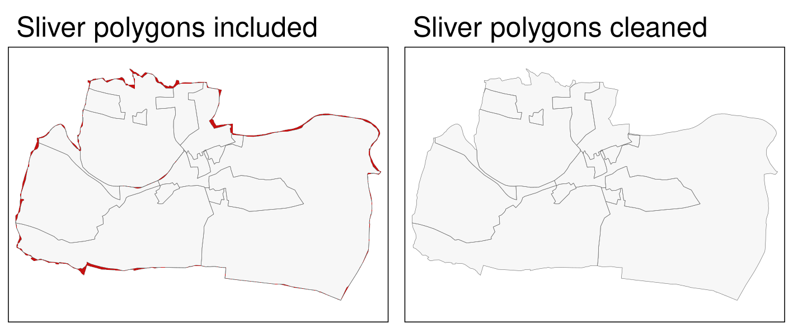
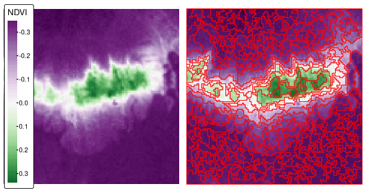

# GISソフトウェアへのブリッジ  {#gis}

## 必須パッケージ  {- #prerequisites-10}

- 本章では、QGIS \index{QGIS}、SAGA \index{SAGA}、GRASS \index{GRASS}  がインストールされていること、および以下のパッケージが添付されていることを条件とする。

```{r 09-gis-1, message=FALSE}
library(sf)
library(terra)
```

```{r 09-gis-1-2, message=FALSE, eval=FALSE}
# remotes::install_github("paleolimbot/qgisprocess")
library(qgisprocess)
library(Rsagacmd)
library(rgrass)
library(rstac)
library(gdalcubes)
```


## イントロダクション  {#introduction-10}

R の特徴は、その使い方にある。
コマンドを入力し、`Enter`（RStudio のソースエディタでコードを書いている場合は `Ctrl+Enter` \index{RStudio}）を押すと、対話的にコマンドが実行される。
このようなコンピュータとの対話方法は、コマンドラインインターフェイス（CLI） \index{command-line interface}  と呼ばれる（下記の注の定義参照）。
CLI は R だけのものではない。^[
他の「コマンドライン」としては、オペレーティングシステムと対話するためのターミナルや、Python などのインタプリタ言語が含まれる。
そもそも、多くの GIS は CLI が発祥である。
GUI \index{graphical user interface}  が一般的になったのは、1990年代にコンピューターのマウスと高解像度スクリーンが普及してからのことである。
例えば、最も長い歴史を持つ GIS \index{GIS}  プログラムの一つである GRASS は、洗練された GUI [@landa_new_2008]  を獲得するまでは、主にコマンドラインでの対話に依存していた。
]
一方、専用の GIS \index{GIS} パッケージでは、グラフィカルユーザーインターフェイス（Grafical User Interface, GUI\index{graphical user interface）に重点が置かれる傾向がある。
QGIS\index{QGIS}、SAGA\index{SAGA}、GRASS\index{GRASS}、gvSIG をシステムターミナルや組み込み CLI\index{command-line interface} から操作することは<u>可能</u>であるが、「マウス操作」が一般的である。
QGIS\index{QGIS} [@sherman_desktop_2008] の作成者である Gary Sherman によれば、これは多くの GIS\index{GIS}  ユーザーがコマンドラインの利点を見逃していることを意味するとのことである。

> 「近代的」GIS ソフトウェアの発展に伴い、マウス操作を好む人がほとんどである。それはいいことであるが、とてつもない量のコマンドラインには、柔軟性とパワーが待っている。繰り返しコマンドラインで作業をする場合、同じことを GUI で行う場合よりも短い時間で行うことができる。

「CLI vs GUI」 \index{graphical user interface}  の議論は逆境になることもあるが、その必要はない。どちらの選択肢も、目の前のタスクとユーザーのスキルセットに応じて、互換的に使用することができる^[GRASS GIS や PostGIS は、アカデミックや産業界で人気があり、コマンドラインを中心に構築されているため、この流れに逆行する製品ともいえる。] 。
R が提供するような優れた CLI\index{command-line interface}（そして RStudio\index{RStudio} のような IDE\index{IDE}  によって強化されている）の利点は数多くある。
良い CLI とは、

- 繰り返の作業の自動化を促進する
- 優れた科学的実践とデータサイエンスのバックボーンである透明性と再現性を可能にする
- 既存の機能を修正したり、新しい機能を実装するためのツールを提供することで、ソフトウェア開発を促進する
- 多くの分野や産業で求められている、将来性のあるプログラミングスキルを身につけることができる
- ユーザーフレンドリーで高速、効率的なワークフローを実現する

一方、GUIベースのGIS \index{GIS}  システム（特にQGIS \index{QGIS}  ）も有利である。
良い GIS GUI とは、

- 学習曲線が「浅い」ので、新しい言語を何時間も学ぶことなく、地理データを探索し、可視化することができる
- トレース、スナップ、トポロジーツールなど、「デジタイジング」（新しいベクタデータセットの作成）のための優れたサポートを提供する^[
**mapedit** パッケージは、いくつかの空間的特徴を素早く編集することができるが、専門的で大規模な地図製作のデジタイズはできない。
]
- 地上基準点によるジオリファレンス（ラスタ画像と既存地図とのマッチング）、オルソレクションが可能である
- 立体視マッピング（LiDAR、Structure from Motionなど）に対応する

専用 GIS のもう一つの利点は、何百もの「ジオアルゴリズム」（地理的問題を解決するための計算レシピ、Chapter \@ref(algorithms) を参照）を利用できることである。
これらの多くは、本章のテーマであり動機でもある「GIS ブリッジ」を経由する以外、R のコマンドラインから利用することはできない。^[
「ブリッジ」という用語の初期の使用は、R と GRASS\index{GRASS} [@neteler_open_2008]  の結合を指していた。
]

```{block2 09-gis-2, type="rmdnote"}
コマンドラインインタフェースとは、ユーザーが連続したテキスト行（コマンドライン）を介してコマンドを発行することで、コンピュータプログラムと対話するための手段である。
Linuxの `bash` や Windows の `PowerShell` が一般的な例である。
CLI は、RStudio for R のような IDE で補強することができ、コードの自動補完やユーザーエクスペリエンスを向上させる機能を提供する。
```

R はインターフェース言語として誕生した。
その前身である S は、他の言語（特に FORTRAN\index{FORTRAN}）の統計アルゴリズムへのアクセスを提供していたが、直感的な 入力・評価・出力（read-evaluate-print loop, REPL）でアクセスできるようになっていた [@chambers_extending_2016]。
Chapter \@ref(intro) で述べたように、R はこの伝統を受け継ぎ、特に C++\index{C++}  などの多くの言語へのインタフェースを提供している。
R は GIS として設計されたものではない。
しかし、専用の GIS とのインターフェイスが可能なため、驚異的な地理空間能力を発揮する。
R は統計プログラミング言語としてよく知られているが、GIS のワークフローを再現することができ、さらに（比較的）一貫した CLI という利点があることを知らない人が多いようである。
さらに、R は、インタラクティブ/アニメーションマップ作成（Chapter \@ref(adv-map) 参照）や空間統計モデリング（ Chapter \@ref(spatial-cv) 参照）など、ジオコンピューティング\index{geocomputation}のいくつかの分野では GIS を凌駕する性能を有している。
この章では、3つの成熟したオープンソース GIS 製品への「ブリッジ」（Table \@ref(tab:gis-comp) 参照）に焦点を当てる。QGIS\index{QGIS} (**qgisprocess**\index{qgisprocess (package)}; Section \@ref(rqgis) )、SAGA\index{SAGA} (**Rsagacmd**\index{Rsagacmd (package)}; Section \@ref(saga))、GRASS\index{GRASS} (**rgrass**\index{rgrass (package)}; Section \@ref(grass))である。^[
長らくメンテナンスされている **RPyGeo** は、R から ArcGIS のジオプロセッシングツールへのインターフェイスを確立した。
ここでは取り上げないが、ArcGIS\index{ArcGIS} から R を使用するための R-ArcGIS ブリッジ（https://github.com/R-ArcGIS/r-bridge 参照）も知っておくとよいだろう。
また、QGIS\index{QGIS} 内から R スクリプトを使用することもできる（https://docs.qgis.org/3.22/en/docs/training_manual/processing/r_intro.html 参照）。
最後に、GRASS GIS\index{GRASS} のコマンドラインから R を使用することも可能となる（https://grasswiki.osgeo.org/wiki/R_statistics/rgrass#R_within_GRASS 参照）。
]

```{r gis-comp, echo=FALSE, message=FALSE}
library(dplyr)
d = tibble("GIS" = c("QGIS", "SAGA", "GRASS"),
            "First release" = c("2002", "2004", "1982"),
            "No. functions" = c(">1000", ">600", ">500"),
            "Support" = c("hybrid", "hybrid", "hybrid"))
knitr::kable(x = d, 
             caption = paste("Comparison between three open-source GIS.", 
                             "Hybrid refers to the support of vector and", 
                             "raster operations."),
             caption.short = "Comparison between three open-source GIS.", 
             booktabs = TRUE) #|>
  # kableExtra::add_footnote(label = "Comparing downloads of different providers is rather difficult (see http://spatialgalaxy.net/2011/12/19/qgis-users-around-the-world), and here also useless since every Windows QGIS download automatically also downloads SAGA and GRASS.", notation = "alphabet")
```

また、R-GIS ブリッジを補完するために、第 2 部では空間ライブラリへのインタフェース（Section \@ref(gdal)、 空間データベース\index{spatial database} (Section \@ref(postgis))、 地球観測データのクラウド処理 (Section \@ref(cloud)) について簡単に紹介する。）

## **qgisprocess** から QGIS  {#rqgis}

<!--toDo:jn-->
<!-- how to mention/use the QGIS package (https://en.cahik.cz//2022/03/07/r-package-qgis/) here? -->

QGIS \index{QGIS}  は、最も人気のあるオープンソース GIS の 1 つである [Table \@ref(tab:gis-comp) ; @graser_processing_2015]。 
その最大の特徴は、他のオープンソース GIS と統一されたインターフェースを提供する点にある。
つまり、QGIS\index{QGIS} から、GDAL\index{GDAL}、GRASS\index{GRASS}、SAGA\index{SAGA}   を利用することができるのである [@graser_processing_2015]。 
バージョン 3.14 以降、QGIS はコマンドライン API \index{API} `qgis_process` を提供しており、QGIS GUI の外でこれらのすべてのジオアルゴリズム（セットアップによっては 1000 以上）を実行することが可能である。

**qgisprocess**\index{qgisprocess (package)} パッケージは、QGIS コマンドラインユーティリティをラップ（訳注：プログラミング用語で、機能を使いやすく覆い隠す wrap こと）しているため、R セッションから QGIS、GDAL、GRASS、SAGA アルゴリズムを呼び出すことが可能である。
**qgisprocess**\index{qgisprocess (package)}  を実行する前に、QGIS\index{QGIS} と、SAGA \index{SAGA} や GRASS \index{GRASS} などの（サードパーティの）依存パッケージがすべてインストールされていることを確認してみよう。

```{r, eval=FALSE}
library(qgisprocess)
#> Using 'qgis_process' in the system PATH.
#> QGIS version: 3.26.1-Buenos Aires
#> ...
```

このパッケージは、QGISのインストールを自動的に検出しようとし、検出できない場合は警告を発する。 ^[検出プロセスの詳細は、`qgis_configure()` を実行すると表示される。] 
設定に失敗した場合の解決策としては、`options(qgisprocess.path = "path/to/your_qgis_process")`、環境変数 `R_ QGISPROCESS_PATH` を設定する方法が考えられる。
<!--toDo:jn-->
<!-- link to the vignette https://github.com/paleolimbot/qgisprocess/pull/31/files when it is online -->
上記の方法は、複数のQGISがインストールされており、どれを使うかを決めたい場合にも使える。

次に、どのプロバイダ（異なるソフトウェアを意味する）が自分のコンピュータで利用できるかを調べる。

```{r providers, eval=FALSE}
qgis_providers()
#> # A tibble: 6 × 2
#>   provider provider_title   
#>   <chr>    <chr>            
#> 1 3d       QGIS (3D)       
#> 2 gdal     GDAL             
#> 3 grass7   GRASS            
#> 4 native   QGIS (native c++)
#> 5 qgis     QGIS             
#> 6 saga     SAGA
```

出力表から、QGISのジオアルゴリズム（`native`, `qgis`, `3d`）と、サードパーティプロバイダの GDAL、SAGA、GRASS の外部アルゴリズムを QGIS インターフェースを通して使用できることが確認できた。

これで、R から QGIS の地理計算をする準備ができた。
それでは、2つの事例を試してみよう。
最初のものは、異なる境界線を持つ2つのポリゴンデータセットを統合する方法を示している \index{union}  (Section \@ref(qgis-vector) ) 。
もう一つは、ラスタ（Section \@ref(qgis-raster) ）で表現された数値標高モデルから新しい情報を導き出すことに重点を置いている。

### ベクタデータ  {#qgis-vector}

異なる空間単位（地域、行政単位など）を持つ2つのポリゴンオブジェクトがある場合を考えてみよう。
この2つのオブジェクトを統合して、すべての境界線と関連する属性を含む1つのオブジェクトにすることが目標である。
Section \@ref(incongruent) ( Figure \@ref(fig:uniondata) ) ですでに出会った不整合なポリゴンを再び利用する。
どちらのポリゴンデータセットも **spData** パッケージで提供されており、その両方に地理的な CRS \index{CRS!geographic}  を使用したい（Chapter \@ref(reproj-geo-data) も参照）。

```{r 09-gis-4}
data("incongruent", "aggregating_zones", package = "spData")
incongr_wgs = st_transform(incongruent, "EPSG:4326")
aggzone_wgs = st_transform(aggregating_zones, "EPSG:4326")
```

```{r uniondata, echo=FALSE, fig.cap="Illustration of two areal units: incongruent (black lines) and aggregating zones (red borders). "}
library(tmap)
tm_shape(incongr_wgs) +
  tm_polygons(border.col = "grey5") +
  tm_shape(aggzone_wgs) +
  tm_borders(alpha = 0.5, col = "red") +
  tm_add_legend(type = "line",
                labels = c("incongr_wgs", "aggzone_wgs"),
                col = c("grey5", "red"),
                lwd = 3) +
  tm_scale_bar(position = c("left", "bottom"),
               breaks = c(0, 0.5, 1)) +
  tm_layout(frame = FALSE,
            legend.text.size = 1)
```

この作業を行うアルゴリズムを見つけるには、`qgis_algorithms()` 関数の出力を検索すればよい。
この関数は、利用可能なすべてのプロバイダと、それらが含むアルゴリズムを含むデータフレームを返す。^[したがって、予想されるプロバイダが表示されない場合は、まだ外部の GIS ソフトウェアをインストールする必要があるためと思われる。]

```{r, eval=FALSE}
qgis_algo = qgis_algorithms()
```

`qgis_algo` オブジェクトには多くの列があるが、通常、私たちが関心を持つのは、プロバイダとアルゴリズム名の情報を組み合わせた `algorithm` 列だけである。
関数の短い説明文に「union」という単語が含まれていると仮定すると \index{union}、以下のコードを実行して、興味のあるアルゴリズムを見つけることができる。

```{r, eval=FALSE}
grep("union", qgis_algo$algorithm, value = TRUE)
#> [1] "native:multiunion" "native:union"      "saga:fuzzyunionor" "saga:polygonunion"
```

上記のリストにあるアルゴリズムの1つ、`"native:union"` は、探している機能の可能性が高そうである。
次のステップは、このアルゴリズムが何をするのか、どう使えばいいのかを知ることである。
`qgis_show_help()` がそのためにある。これは、アルゴリズムが何をし、引数や出力についての要約を返す。^[`qgis_description()`、`qgis_arguments()`、`qgis_outputs()` それぞれからの情報の一部のみ示す。]
これによって、出力が長くなる。
ここでは、`"native:union"` という引数で得られる結果を示す。

```{r 09-gis-6, eval=FALSE}
alg = "native:union"
qgis_arguments(alg) |> 
  dplyr::mutate(acceptable_values = unlist(acceptable_values)) |>
  dplyr::select(name, description, acceptable_values)
```

引数は、`INPUT`、`OVERLAY`、`OVERLAY_FIELDS_PREFIX`、`OUTPUT` である。
これらの引数は、ベクタレイヤへのパスを期待しているようである（列名: `acceptaple_values`）。
ただし、**qgisprocess** パッケージでは、このような場合にも `sf` オブジェクトを提供することが可能となる。^[ラスタレイヤへのパスの場合、パッケージ **terra** と **stars** が使われる。] 
この機能は便利だが、もしすでに R セッション中に空間データがある場合、**qgisprocess** にそのパスを送る時のみ使用することを勧める。なぜなら、**qgisprocess** がジオアルゴリズムを実行する際に最初にすることは、R セッション中の空間データを QGIS が分かる .gpkg または .tif に変換することだからである。

最後に、QGIS\index{QGIS} に作業を任せることができる。
**qgisprocess** の主な機能は `qgis_run_algorithm()` である。
使用するアルゴリズム名とヘルプに示される名前付き引数のセットを受け取り、期待される計算を実行する。
今回のケースでは、`INPUT`、`OVERLAY`、`OUTPUT` の3つの引数が重要だと思われる。
最初の `INPUT` は、主なベクタオブジェクト `incongr_wgs` であり、2番目の `OVERLAY` は、`aggzone_wgs` である。
最後の引数、`OUTPUT` は新しいベクタファイルへのパスを期待する。しかし、パスを提供しない場合、**qgisprocess**は自動的に一時ファイルを作成する。
引数 `.quiet` は、**qgisprocess** のメッセージを減らす。

```{r 09-gis-7, eval=FALSE}
union = qgis_run_algorithm(alg, INPUT = incongr_wgs, OVERLAY = aggzone_wgs, 
                           .quiet = TRUE)
union
```

上記のコードを実行すると、2つの入力オブジェクトが一時的な .gpkg ファイルに保存され、選択されたアルゴリズムがそれらに実行され、一時的な .gpkg ファイルが出力として返される。
**qgisprocess** パッケージは、`qgis_run_algorithm()` の結果を、この場合は出力ファイルへのパスを含むリストとして保存する。
このファイルを R に読み戻すには、`read_sf()` (例,  `union_sf = read_sf(union [[1] ])` を使うか、`st_as_sf()` を使って直接読み込むことができる。

```{r, eval=FALSE}
union_sf = st_as_sf(union)
```

QGIS\index{QGIS} の union \index{vector!union}  の操作は、交差\index{vector!intersection}  と2つの入力レイヤーの対称差分を用いて、2つの入力レイヤーを1つのレイヤーにマージすることに注意（ちなみに、これは GRASS \index{GRASS} と SAGA \index{SAGA}  でユニオン操作をするときのデフォルトでもある）。
これは `st_union(incongr_wgs, aggzone_wgs)` （演習参照）とは**違う**！

その結果、`union_sf`、2つの入力オブジェクトよりも多くのフィーチャを持つポリゴンとなる。
しかし、これらのポリゴンの多くは小さく、実際の領域を表しているわけではなく、2つのデータセットの詳細度が異なるために生じたものであることに注意しておこう。
これらの誤差はスライバーポリゴンと呼ばれる（ Figure \@ref(fig:sliver) の左側のパネルにある赤い色のポリゴンを参照）。
スライバーを識別する一つの方法として、面積が比較的非常に小さいポリゴン、ここでは例えば25000m^2^を見つけ、次にそれを削除する。
適切なアルゴリズムを探そう。

```{r, eval=FALSE}
grep("clean", qgis_algo$algorithm, value = TRUE)
```

今回見つかったアルゴリズム（ `v.clean` ）は、QGIS ではなく、GRASS GIS に含まれている。
GRASS GIS の `v.clean` は、空間ベクタデータのトポロジーをクリーニングする強力なツールである。 
重要なのは、**qgisprocess**を通して使用できることである。

前のステップと同様に、このアルゴリズムのヘルプを見るところから始めよう。

```{r, eval=FALSE}
qgis_show_help("grass7:v.clean")
```

ここでは出力を省略した。実際のヘルプテキストはかなり長く、多くの引数を含んでいる。^[また、QGIS の引数とは異なり、小文字になる。] 
これは、`v.clean` がマルチツールであり、さまざまな種類のジオメトリをクリーニングし、さまざまな種類のトポロジー問題を解決することができることがある。
この例では、いくつかの引数に絞って説明するが、`v.clean` の機能については、 [このアルゴリズムのドキュメント](https://grass.osgeo.org/grass78/manuals/v.clean.html)を勧める。

```{r, eval=FALSE}
qgis_arguments("grass7:v.clean") |>
  dplyr::select(name, description) |>
  dplyr::slice_head(n = 4)
#> # A tibble: 4 × 2
#>   name      description                              
#>   <chr>     <chr>                                    
#> 1 input     Layer to clean                           
#> 2 type      Input feature type                       
#> 3 tool      Cleaning tool                            
#> 4 threshold Threshold (comma separated for each tool)
```

このアルゴリズムの主な引数は `input` で、これは私たちのベクタオブジェクトである。
次に tool の選択であるが、これはクリーニングの方法である。 ^[It is also possible to select several tools, which will then be executed sequentially.] 
`v.clean` には、重複した形状の削除、線間の微小角度の削除、微小領域の削除など、12 種類のツールが存在する。
今回は、後者のツール、`rmarea` を解説する。
いくつかのツール（`rmarea` を含む）は、追加の引数 `threshold` を必要とし、その動作は選択されたツールに依存する。
この場合、`rmarea` ツールは、`threshold` で与えられた値より小さいか等しい領域をすべて削除する。 

このアルゴリズムを実行し、その出力を新しい `sf` オブジェクト `clean_sf` に変換してみよう。

```{r 09-gis-7c, eval=FALSE}
clean = qgis_run_algorithm("grass7:v.clean", input = union_sf,
                           tool = "rmarea", threshold = 25000, .quiet = TRUE)
clean_sf = st_as_sf(clean)
```

その結果、\ref(fig:sliver) の右側のパネルでは、予想通り、灰色のポリゴンが削除されているように見える。

```{r sliver, echo=FALSE, fig.cap="灰色部分を赤で強調（左）と灰色部分を除去（右）。"}

```

### ラスタデータ  {#qgis-raster}

デジタル標高モデル（DEM）には、ラスタセルごとの標高情報が含まれている。
衛星航法、水流モデル、表面分析、可視化など、さまざまな用途で使用されている。
ここでは、DEM ラスタから統計学習における予測因子として利用可能な新しい情報を導き出してみたい。
例えば、様々な地形パラメータは、地滑りの予測に役立つ（Chapter \@ref(spatial-cv) 参照）。

このセクションでは、`dem.tif` を使用することにする。これは、 Mongón 調査地域のデジタル標高モデル\index{digital elevation model}である（Land Process Distributed Active Archive Center からダウンロード、`?dem.tif` も参照）。
解像度は約 30 m × 30 mで、投影型 CRS を使用している。

```{r, eval=FALSE}
library(qgisprocess)
library(terra)
dem = rast(system.file("raster/dem.tif", package = "spDataLarge"))
```

**terra** パッケージの `terrain()` では、傾斜、アスペクト、TPI (*Topographic Position Index*) 、TRI (*Topographic Ruggedness Index*) 、粗さ、流れ方向など、地形の基本特性を算出することができる。
とはいえ、GIS は、地形の特性に関する機能が他にもたくさんあり、文脈によってはより適しているものもある。
例えば、地形湿潤指数（TWI）は、水文・生物学的プロセスの研究に有用であることがわかっている [@sorensen_calculation_2006]。
このインデックスのアルゴリズムリストを、`"wetness"` というキーワードで検索してみよう。

```{r, eval=FALSE}
qgis_algo = qgis_algorithms()
grep("wetness", qgis_algo$algorithm, value = TRUE)
#> [1] "saga:sagawetnessindex"           "saga:topographicwetnessindextwi"
```

上記のコードの出力は、目的のアルゴリズムが SAGA GIS ソフトウェアに存在することを示唆するものである。^[TWI can be also calculated using the  `r.topidx` GRASS GIS function.]
SAGA はハイブリッド GIS であるが、主にラスタ処理、ここでは特にデジタル標高モデル \index{digital elevation model}  （土壌特性、地形属性、気候パラメータ）に重点を置いている。 
したがって、SAGA は大規模な（高解像度の）ラスタ\index{raster}データセットの高速処理に特に優れている [@conrad_system_2015]。

`"saga:sagawetnessindex"` アルゴリズムは、実際には修正された TWI であり、谷底に位置するセルに対してより現実的な土壌水分ポテンシャルをもたらすものである [@bohner_spatial_2006]。

```{r, eval=FALSE}
qgis_show_help("saga:sagawetnessindex")
# 出力は非表示
```

ここでは、デフォルトの引数を使用する。
与える引数は、入力となる `DEM` だけである。
このアルゴリズムを使う際は、デフォルト値が研究の目的にあっているか確認する必要がある。^[`"saga:sagawetnessindex"` の追加引数は、 https://gis.stackexchange.com/a/323454/20955 で詳しく解説されている。] 
`"saga:sagawetnessindex"` は、集水域、集水勾配、修正集水域、地形湿潤指数という4つのラスタを返す。

```{r, eval=FALSE}
dem_wetness = qgis_run_algorithm("saga:sagawetnessindex", DEM = dem, 
                                 .quiet = TRUE)
```

その結果、`dem_wetness`、4つの出力へのファイルパスが記載されたリストが得られる。
`qgis_as_terra()` 関数で出力名を指定することで、選択した出力を読み出すことができる。

```{r, eval=FALSE}
dem_wetness_twi = qgis_as_terra(dem_wetness$TWI)
```

Figure \@ref(fig:qgis-raster-map) の左パネルに出力された TWI マップを見ることができる。
地形湿潤指数は、単位なし。
数値が小さいほど水がたまらず、数値が大きいほど水がたまるエリアであることを示す。

また、デジタル標高モデルからの情報は、例えば、地形に分類することができる。地形は、斜面、尾根、谷などの地形を表す10のクラスからなる地形学的フォノタイプである [@jasiewicz_geomorphons_2013] 。
これらのクラスは、地滑りしやすさ、生態系サービス、人間の移動性、デジタル土壌マッピングなど、多くの研究で利用されている。 

geomorphons のアルゴリズムのオリジナルの実装は GRASS GIS で作成され、**qgisprocess**のリストで `"grass7:r.geomorphon"` として見つけることができる。

```{r, eval=FALSE}
grep("geomorphon", qgis_algo$algorithm, value = TRUE)
#> [1] "grass7:r.geomorphon"
qgis_show_help("grass7:r.geomorphon")
# 出力は非表示
```

geomorphons の計算には、入力 DEM (`elevation`) が必要で、オプションの引数でカスタマイズすることができる。
`search` -- 視線距離を計算する長さ、および ``-m`` -- 検索値を(セル数ではなく)メートル単位で提供することを指定するフラグが含まれている。
追加論点の詳細は、原著論文と [GRASS GIS documentation](https://grass.osgeo.org/grass78/manuals/r.geomorphon.html)に記載されている。

```{r, eval=FALSE}
dem_geomorph = qgis_run_algorithm("grass7:r.geomorphon", elevation = dem, 
                                    `-m` = TRUE, search = 120, .quiet = TRUE)
```

出力される `dem_geomorph$forms` は、10個のカテゴリーからなるラスタファイルで、それぞれが地形形状を表している。
これを `qgis_as_terra()` でRに読み込んで可視化したり（ Figure \@ref(fig:qgis-raster-map) の右パネル）、その後の計算で使ったりすることができる。

```{r, eval=FALSE}
dem_geomorph_terra = qgis_as_terra(dem_geomorph$forms)
```

興味深いことに、Figure \@ref(fig:qgis-raster-map) に示すように、いくつかの地形と TWI 値の間にはつながりがある。
TWI値が最も大きいのは谷や窪地であり、最も小さいのは予想通り尾根であった。

```{r qgis-raster-map, echo=FALSE, fig.cap="Topographic wetness index (TWI, left panel) and geomorphons (right panel) derived for the Mongón study area."}
knitr::include_graphics("figures/10-qgis-raster-map.png")
```

## SAGA GIS  {#saga}

System for Automated Geoscientific Analyses (SAGA \index{SAGA} ; Table \@ref(tab:gis-comp) ) は、コマンドラインインタフェース \index{command-line interface}  ( Windows では `saga_cmd.exe`、Linux では単に `saga_cmd` ) を介して SAGA モジュールを実行する可能性を提供する（[SAGA wiki on modules](https://sourceforge.net/p/saga-gis/wiki/Executing%20Modules%20with%20SAGA%20CMD/) を参照）。
また、Pythonインターフェース（SAGA Python API \index{API}  ）も用意されている。
**Rsagacmd**\index{Rsagacmd (package)} は、前者を使って R 内で SAGA\index{SAGA} を実行している。

この Section では、**Rsagacmd** を使用して、SAGA GIS の seeded region growing アルゴリズムを使って、2000年9月22日のペルーの Mongón 調査地域の正規化差分植生指数（normalized difference vegetation index, NDVI）の値が類似した地域を抽出する（Figure \@ref(fig:sagasegments) 左）。^[リモートセンシング画像から NDVI を算出する方法については、Section \@ref(local-operations) を参照。]

```{r, eval=FALSE}
ndvi = rast(system.file("raster/ndvi.tif", package = "spDataLarge"))
```

**Rsagacmd** を始めるには、`saga_gis()` 関数を実行する必要がある。
この関数は主に2つの目的がある。

- 有効な SAGA-GIS ライブラリやツールへのリンクを含む新しいオブジェクトを動的に作成すること^[つまり、SAGA GIS バージョンによってう使用できるライブラリが変わる。]
- `raster_backend` (ラスタデータを扱う際に用いる R パッケージ)、`vector_backend` (ベクトルデータを扱う際に用いる R パッケージ)、`cores` (処理に用いる CPU コアの最大数、デフォルトは all) など、一般的なパッケージオプションを設定すること

```{r, eval=FALSE}
library(Rsagacmd)
saga = saga_gis(raster_backend = "terra", vector_backend = "sf")
```

この `saga` オブジェクトは、利用可能なすべての SAGA ツールへの接続を含んでいる。
これはライブラリ（ツールのグループ）のリストとして構成されており、ライブラリの内部にはツールのリストがある。
どのツールにも `$` 記号でアクセスできる（TAB キーで自動補完することが可能）。

シード領域拡大アルゴリズムは，主に2つのステップで動作する [@adams_seed_1994;@bohner_image_2006]。
まず、指定されたサイズのローカルウィンドウにおいて、最も分散の小さいセルを見つけることで、初期セル（seed）が生成される．
次に、領域成長アルゴリズムを用いて、seed の近傍画素をマージし、均質な領域を作成する。

```{r, eval=FALSE}
sg = saga$imagery_segmentation$seed_generation
```

上記の例では、まず `imagery_segmentation` ライブラリを開き、次にその `seed_generation` ツールを使用した。
また、次のステップでツールのコード全体を再入力しないように、`sg` オブジェクトに割り当てる。^[ツールの詳細は https://saga-gis.sourceforge.io/saga_tool_doc/8.3.0/imagery_segmentation_2.html を参照]
`sg` と入力することで、ツールの簡単な概要と、パラメータ、説明、およびデフォルトのデータフレームが表示される。
また、`tidy(sg)` を使用すると、パラメータのテーブルだけを取り出すことができる。
`seed_generation` ツールは、少なくとも1つの入力 (`features`) つまりラスタデータを必要とする。
また、初期ポリゴンのサイズを指定する `band_width` などの追加パラメータを提供することができる。

```{r, eval=FALSE}
ndvi_seeds = sg(ndvi, band_width = 2)
#plot(ndvi_seeds$seed_grid)
```

この出力は、3つのオブジェクトからなるリストである。`variance` -- 局所分散のラスタマップ、 `seed_grid` -- 生成されたシードを含むラスタマップ、 `seed_points` -- 生成されたシードを含む空間ベクトルオブジェクト。

2つ目のSAGA GISツールは `seeded_region_growing` である。^[詳細は https://saga-gis.sourceforge.io/saga_tool_doc/8.3.0/imagery_segmentation_3.html を参照]
`seed_region_growing` ツールは、前のステップで計算した `seed_grid` と `ndvi` ラスタオブジェクトの 2 つの入力を必要とする。
さらに、入力の特徴量を標準化するための `normalize` や `neighbour` （4または8-neighborhood）、 `method` などのパラメータを指定することができます。
最後のパラメータには、`0` または `1` を指定することができる（ラスタセルの値とその位置に基づいて領域を成長させるか、値のみを成長させるか）。
このメソッドの詳細な説明は、 @bohner_image_2006 を参照。

ここでは、`method` を `1` に変更するだけです。つまり、出力される地域は、NDVI 値の類似性に基づいてのみ作成されることを意味する。

```{r, eval=FALSE}
srg = saga$imagery_segmentation$seeded_region_growing
ndvi_srg = srg(ndvi_seeds$seed_grid, ndvi, method = 1)
plot(ndvi_srg$segments)
```

このツールは、3つのオブジェクトのリストを返す。このツールは、 `segments`, `similarity`, `table` という 3 つのオブジェクトのリストを返す。
`similarity` オブジェクトは、シードと他のセルとの類似性を示すラスタであり、`table` は入力シードに関する情報を格納したデータフレームである。
最後に、`ndvi_srg$segments`は、結果として得られた領域（Figure  \@ref(fig:sagasegments) の右側のパネル）を表すラスタである。
これをポリゴンに変換するには、`as.polygons()` と `st_as_sf()` を使用する（Section \@ref(spatial-vectorization))。

```{r, eval=FALSE}
ndvi_segments = as.polygons(ndvi_srg$segments) |> 
  st_as_sf()
```

```{r sagasegments, echo=FALSE, fig.cap="Normalized difference vegetation index (NDVI, left panel) and NDVi-based segments derived using t he seeded region growing algorithm for the Mongón study area."}

```

結果として得られるポリゴン（セグメント）は、類似した値を持つ領域を表す。
また、クラスタリング（*k*-meansなど）、地域化（SKATER など）、教師あり分類法など、さまざまな手法でさらに大きなポリゴンに集約することができる。
演習で試すことができる。

R には、似たような値を持つポリゴン（いわゆるセグメント）を作成するという目的を達成するための他のツールもある。
いくつかの画像分割アルゴリズムを実行できる **SegOptim** パッケージ [@goncalves_segoptim_2019] や、地理空間データを扱うためにスーパーピクセルアルゴリズム SLIC を実装した **supercells** [@nowosad_extended_2022] などが含まれている。

## GRASS GIS  {#grass}

米国陸軍建設工学研究所（USA-CERL）は、1982年から1995年にかけて、地理資源解析支援システム（GRASS） \index{GRASS}  の中核となるシステムを作成した [Table \@ref(tab:gis-comp) ; @neteler_open_2008]。 
アカデミアは1997年からこの作業を継続した。
SAGA \index{SAGA}  と同様、グラスも当初はラスタ処理に注力し、その後、GRASS 6.0以降、高度なベクタ機能を追加している [@bivand_applied_2013]。

GRASS は、入力データを GRASS GIS データベースに格納する。
ベクタデータに関して、GRASS はデフォルトでトポロジカル GIS、すなわち隣接するフィーチャのジオメトリを一度だけ保存する。
ベクトル属性の管理にはデフォルトで SQLite を用い、属性はキーによってジオメトリ、すなわち GRASS GIS データベースにリンクされる（[GRASS GIS vector management](https://grasswiki.osgeo.org/wiki/Vector_Database_Management#GRASS_GIS_vector_management_model)）。

GRASS を使う前に、GRASS GIS データベース\index{spatial database} (同じく R から) をセットアップする必要があるが、このプロセスに少し戸惑うかもしれない。
まず、GRASS のデータベースは専用のディレクトリを必要とし、そのディレクトリには location を置く必要がある（詳しくは [grass.osgeo.org](https://grass.osgeo.org/grass-stable/manuals/index.html) の [GRASS GIS Database](https://grass.osgeo.org/grass-stable/manuals/grass_database.html) ヘルプページを参照）。
location には、1 つのプロジェクトまたは 1 つの領域のジオデータが格納される。
通常、1つの場所の中に、異なるユーザや異なるタスクを参照するいくつかのマップセットを存在させることができる。
各 location には、PERMANENT マップセット（自動的に作成される必須のマップセット）もある。
プロジェクトのすべてのユーザと地理データを共有するために、データベース所有者は PERMANENT マップセットに空間データを追加することができる。
さらに、PERMANENT マップセットには、ラスタデータの投影法、空間範囲、およびデフォルトの解像度が格納される。
まとめると、GRASS GIS データベースは多くの location を含み（1つのロケーションのデータはすべて同じ CRS を持つ）、それぞれの location は多くのマップセット（データセットのグループ）を格納することができる。
GRASS 空間データベース\index{spatial database}システムの詳細は、@neteler_open_2008 と [GRASS GIS quick start](https://grass.osgeo.org/grass-stable/manuals/helptext.html) 。
こkでは R から手軽に GRASS を使うため **link2GI** パッケージを使う。しかし、GRASS GIS データベースを順番に作ることもできる。
作り方は [GRASS within R](https://grasswiki.osgeo.org/wiki/R_statistics/rgrass#GRASS_within_R) を参照。

ここでは、GIScience における最も興味深い問題の一つである巡回セールスマン問題 \index{traveling salesman}  を用いた **rgrass** \index{rgrass (package)}  を紹介する。
ある巡回セールスマンが24件の顧客を訪問したいとする。
さらに、自宅を起点とし、最短距離で25カ所を回りたいということであった。
この問題に対する最適解は一つであるが、考えられる解をすべてチェックすることは、現代のコンピュータでは（ほとんど）不可能である [@longley_geographic_2015]。
この場合、可能な解の数は `(25 - 1)! / 2`、すなわち24の階乗を2で割った数に相当する（2で割るのは、順方向と逆方向を区別しないため）。
1回の繰り返しがナノ秒でも、`r format(factorial(25 - 1) / (2 * 10^9 * 3600 * 24 * 365))` 年間に相当する。
幸いなことに、この想像を絶する時間のごく一部で実行できる、巧妙でほぼ最適なソリューションがある。
GRASS GIS\index{GRASS} は、これらの解決策の一つを提供する（詳細は、 [v.net.salesman](https://grass.osgeo.org/grass82/manuals/v.net.salesman.html)を参照）。
今回の使用例では、ロンドンの街角にある最初の25の自転車ステーション（顧客の代わり）間の最短経路\index{shortest route}を見つけたい（最初の自転車ステーションは、巡回セールスマン\index{traveling salesman}の自宅に相当すると単純に仮定する）。

```{r 09-gis-24}
data("cycle_hire", package = "spData")
points = cycle_hire[1:25, ]
```

自転車ハイヤーポイントのデータの他に、この地域の道路網が必要である。
OpenStreetMap\index{OpenStreetMap} から **osmdata** \index{osmdata (package)}  パッケージの助けを借りてダウンロードすることができる（Section \@ref(retrieving-data) も参照）。
そのために、道路網のクエリ（OSM 言語では "highway" とラベル付けされている）を `points` の bounding box \index{bounding box} に制限し、対応するデータを `sf`\index{sf} オブジェクトとして読み込む。
`osmdata_sf()` は、複数の空間オブジェクト（点、線、ポリゴンなど）を含むリストを返すが、ここでは線オブジェクトとその関連IDのみを保持する。^[As a convenience to the reader, one can attach `london_streets` to the global environment using `data("london_streets", package = "spDataLarge")`.]

```{r 09-gis-25, eval=FALSE}
library(osmdata)
b_box = st_bbox(points)
london_streets = opq(b_box) |>
  add_osm_feature(key = "highway") |>
  osmdata_sf() 
london_streets = london_streets[["osm_lines"]]
london_streets = dplyr::select(london_streets, osm_id)
```

これでデータが揃ったので、次に GRASS\index{GRASS} のセッションを開始する。
幸い、**link2GI** パッケージの `linkGRASS()` を使えば、たった一行のコードで GRASS 環境をセットアップできる。
空間オブジェクトは、空間データベースの投影と範囲を決定するものである。
まず、`linkGRASS()`　は、あなたのコンピュータにインストールされている全ての　GRASS\index{GRASS} を検索する。
ここでは `ver_select` を `TRUE` に設定しているので、見つかった GRASS-installation の中から対話的に一つを選択することができる。
もし、インストールが一つしかない場合は、`linkGRASS()` が自動的にそれを選択する。
次に、`linkGRASS()` は、GRASS GIS への接続を確立する。

```{r 09-gis-30, eval=FALSE}
library(rgrass)
link2GI::linkGRASS(london_streets, ver_select = TRUE)
```

GRASS の geoalgorithm を使用する前に、GRASS の空間データベースにデータを追加する必要があります。
幸いなことに、便利な関数 `write_VECT()` がこれを代行してくれる。
(ラスタデータには `write_RAST()` を使用する。)
この例では、最初の属性カラムのみを使用して、道路と自転車レンタルポイントデータを追加し、GRASS で `london_streets` と `points` という名前を付けている。

```{r 09-gis-31, eval=FALSE}
write_VECT(terra::vect(london_streets), vname = "london_streets")
write_VECT(terra::vect(points[, 1]), vname = "points")
```

**rgrass** パッケージは、入力と出力が **terra** オブジェクトであることを想定している。
したがって、 `write_VECT()` を使用するためには、 `vect()` 関数を使用して `sf` 空間ベクトルを **terra** の `SpatVector` に変換する必要がある。^[You can learn more how to convert between spatial classes in R by reading the (Conversions between different spatial classes in R)[https://geocompr.github.io/post/2021/spatial-classes-conversion/] blog post and the 
(Coercion between object formats)[https://CRAN.R-project.org/package=rgrass/vignettes/coerce.html] vignette] 

現在、両方のデータセットが GRASS GIS のデータベースに存在しています。
ネットワーク\index{network}の解析を行うには、トポロジカルクリーンな道路ネットワークが必要です。
GRASS の `"v.clean"` は、重複、小角、ダングルの除去などを行う。
ここでは、後続のルーティングアルゴリズムが実際に交差点で右折または左折できるように、各交差点で改行し、その出力を `streets_clean` という名前の GRASS オブジェクトに保存している。

```{r 09-gis-32, eval=FALSE}
execGRASS(cmd = "v.clean", input = "london_streets", output = "streets_clean",
          tool = "break", flags = "overwrite")
```

```{block2 06-raster-vector-22, type='rmdnote'}
To learn about the possible arguments and flags of the GRASS GIS modules you can you the `help` flag.
For example, try `execGRASS("g.region", flags = "help")`.
```

サイクリング・ステーションのいくつかのポイントは、正確に街路セグメント上に位置しない可能性がある。
しかし、それらの間の最短ルート\index{shortest route}を見つけるために、それらを最も近い道路セグメントに接続する必要がある。
`"v.net"`のconnect-operatorはまさにこれを行う。
その出力を `streets_points_con` に保存する。

```{r 09-gis-32b, eval=FALSE}
execGRASS(cmd = "v.net", input = "streets_clean", output = "streets_points_con",
          points = "points", operation = "connect", threshold = 0.001,
          flags = c("overwrite", "c"))
```

得られたクリーンなデータセットは `"v.net.salesman"` アルゴリズムの入力となり、最終的にすべての自転車レンタルステーション間の最短経路を見つけることができる。
その引数の一つが `center_cats` で、これは入力として数値の範囲を必要とする。
この範囲は、最短ルートを計算するためのポイントを表している。
ここでは、すべての自転車ステーション間の経路を計算したいので、`1-25`に設定しておく。
巡回セールスマンアルゴリズムの GRASS ヘルプページを参照するには、 `execGRASS("g.manual", entry = "v.net.salesman")` を実行する。

```{r 09-gis-33, eval=FALSE}
execGRASS(cmd = "v.net.salesman", input = "streets_points_con",
          output = "shortest_route", center_cats = paste0("1-", nrow(points)),
          flags = "overwrite")
```

この結果を見るために、結果をRに読み込み、形状だけを残してsf-objectに変換し、**mapview**パッケージを使って可視化しました（Figure \@ref(fig:grass-mapview) と Section \@ref(interactive-maps))。

```{r 09-gis-34, eval=FALSE}
route = read_VECT("shortest_route") |>
  st_as_sf() |>
  st_geometry()
mapview::mapview(route) + points
```

```{r grass-mapview, fig.cap="Shortest route (blue line) between 24 cycle hire stations (blue dots) on the OSM street network of London.", fig.scap="Shortest route between 24 cycle hire stations.", echo=FALSE, out.width="80%"}

```

```{r 09-gis-35, eval=FALSE, echo=FALSE}
library(mapview)
m_1 = mapview(route) +  points
mapview::mapshot(m_1,
                 file = file.path(getwd(), "figures/09_shortest_route.png"),
                 remove_controls = c("homeButton", "layersControl",
                                     "zoomControl"))
```

その際、いくつか注意すべき点がある。

- GRASSの空間データベース\index{spatial database}を使えば、より高速に処理できる。
つまり、最初に地理データを書き出しただけです。
そして、新しいオブジェクトを作成し、最終結果だけを R にインポートした。
現在利用可能なデータセットを調べるには、 `execGRASS("g.list", type = "vector,raster", flags = "p")` を実行してみてください。
- また、R から既にある GRASS 空間データベースにアクセスすることも可能である。
R にデータをインポートする前に、いくつかの（空間）サブセット化を行いたい場合がある。
ベクトルデータには `"v.select"` と `"v.extract"` を使用する。
`"db.select"` を使用すると、対応するジオメトリを返さずにベクトルレイヤーの属性テーブルのサブセットを選択することができる。
- また、実行中の GRASS のセッションから R を起動することもできます [詳細は @bivand_applied_2013 を参照]。
- GRASS で提供されて入るジオアルゴリズム\index{geoalgorithm}の素晴らしいドキュメントは、 [GRASS online help](https://grass.osgeo.org/grass82/manuals/) または `execGRASS("g.manual", flags = "i")` を参照。

## いつ、何を使うべきか？

R-GIS のインターフェースは、個人の好みや作業内容、GIS\index{GIS}  の使い方に依存するため、一概にお勧めすることはできないし、研究分野にもよるだろう。
前述の通り、SAGA \index{SAGA} は大規模（高解像度）ラスタ\index{raster}データセットの高速処理に特に優れており、水文学者、気候学者、土壌学者に頻繁に利用されている [@conrad_system_2015]。
一方、GRASS GIS\index{GRASS}  は、トポロジーに基づく空間データベースをサポートする唯一の GIS であり、ネットワーク分析だけでなくシミュレーション研究にも特に有用である。
QGIS は、GRASS-GIS や SAGA-GIS と比較して、特に初めて GIS を使う方にとって使いやすく、おそらく最も人気のあるオープンソースのGISだと思われる。
したがって、**qgisprocess**\index{qgisprocess (package)} は、ほとんどのユースケースに適切な選択である。
その主なメリットは

- 複数の GIS に統一的にアクセスできるため、重複した機能を含む 1000 以上のジオアルゴリズム ( Table \@ref(tab:gis-comp) ) を提供。例えば、QGIS\index{QGIS}、SAGA\index{SAGA}、GRASS\index{GRASS} などのジオアルゴリズムを使ってオーバーレイ操作を実行することが可能である。
- データフォーマットの自動変換（SAGAは `.sdat` グリッドファイル、GRASS は独自のデータベースフォーマットを使用するが、対応する変換は QGIS が行う。）
- 地理的な R オブジェクトを QGIS ジオアルゴリズム\index{geoalgorithm}に自動的に渡し、R に戻すことができる。
- 名前付き引数、デフォルト値の自動取得をサポートする便利な機能（**rgrass**\index{rgrass (package)} からインスパイアされた）

もちろん、他の R-GIS ブリッジを使用した方が良いケースもある。
QGIS は、複数の GIS\index{GIS}  ソフトウェアパッケージへの統一インターフェースを提供する唯一の GIS であるが、対応するサードパーティのジオアルゴリズムのサブセットへのアクセスしか提供しない（詳細については、@muenchow_rqgis:_2017 を参照）。
したがって、SAGA と GRASS の関数一式を使用するには、**RSAGA**\index{RSAGA (package)} と **rgrass** 以外は使わない方が良い。
最後に、地形データ、空間データベース管理機能（マルチユーザーアクセスなど）が必要な場合は、GRASSの利用を勧める。 
また、ジオデータベース\index{spatial database}を用いてシミュレーションを行いたい場合 [@krug_clearing_2010]、**qgisprocess** が、呼び出しごとに常に新しい GRASS セッションを開始するので、**rgrass** を直接使用してみよう。

なお、スクリプティング・インターフェースを持つ GIS ソフトウェアパッケージは以下のように数多くあるが、これらを利用できる専用の R パッケージはない：gvSig、OpenJump、Orfeo Toolbox。^[注記：**link2GI** は Orfeo Toolboxを部分的に統合しており、**qgisprocess** から Orfeo Toolbox アルゴリズムへアクセスすることもできる。TauDEM は R パッケージの **traudem** からアクセスできる。]

## その他のブリッジ

この章では、当面、デスクトップ GIS \index{GIS} ソフトウェアへの R インタフェースに焦点を当てる。
これらの橋を強調したのは、専用の GIS ソフトウェアがよく知られており、地理データを理解するための一般的な「入り口」であることがある。
また、多くのジオアルゴリズム\index{geoalgorithm}にアクセスすることができる。

その他の「ブリッジ」には、空間ライブラリへのインタフェース（ Section \@ref(gdal) は R から GDAL \index{GDAL}  CLI \index{command-line interface}  にアクセスする方法を示している）、空間データベース \index{spatial database}  （ Section \@ref(postgis) 参照）、ウェブマッピングサービス（ Chapter \@ref(adv-map) 参照）などがある。
このセクションでは、可能なことのほんの一端を紹介する。
システムから他のプログラムを呼び出したり、他の言語と統合したり（特に **Rcpp** と **reticulate** \index{reticulate (package)} を介して）、R の \index{R}  の柔軟性のおかげで、他の多くのブリッジが可能になっている。
目的は包括的なものではなく、章の冒頭で @sherman_desktop_2008 が引用した「柔軟性とパワー」にアクセスする他の方法を示すことである。

### GDALへのブリッジ  {#gdal}

Chapter \@ref(read-write) で述べたように、GDAL \index{GDAL}  は多くの地理データ形式をサポートする低レベルのライブラリである。
GDAL は非常に効果的なので、ほとんどのGISプログラムは、車輪の再発明や特注の読み書きコードを使用するのではなく、地理データのインポートとエクスポートのためにバックグラウンドで GDAL\index{GDAL}  を使用している。
しかし、GDAL\index{GDAL} が提供するのは、データ入出力だけではない。
ベクタデータとラスタデータの [geoprocessing tools](https://gdal.org/programs/index.html) 、ラスタデータをオンラインで提供するための[タイル](https://gdal.org/programs/gdal2tiles.html#gdal2tiles)を作成する機能、ベクタデータの高速[ラスタ化](https://gdal.org/programs/gdal_rasterize.html#gdal-rasterize)がある。
GDAL はコマンドラインツールであるため、R からは `system()` コマンドからアクセスすることができる。

以下のコードは、この機能を実現するものである。
`linkGDAL()` は、GDAL\index{GDAL} が動作しているコンピュータを検索し、実行ファイルの場所を PATH 変数に追加して、GDAL を呼び出せるようにする（Windows で通常必要になる）。

```{r, eval=FALSE}
link2GI::linkGDAL()
```

これで、`system()` 関数を使用して、任意の GDAL ツールを呼び出すことができる。
例えば、`ogrinfo` は、ベクタデータセットのメタデータを提供する。
ここでは、このツールに2つのフラグを追加して呼び出する。 `-al` は全レイヤーの全フィーチャをリストアップし、`-so` は要約のみを取得する（完全なジオメトリのリストではない）。

```{r 09-gis-36, eval=FALSE, message=FALSE}
our_filepath = system.file("shapes/world.gpkg", package = "spData")
cmd = paste("ogrinfo -al -so", our_filepath)
system(cmd)
#> INFO: Open of `.../spData/shapes/world.gpkg'
#>       using driver `GPKG' successful.
#> 
#> Layer name: world
#> Geometry: Multi Polygon
#> Feature Count: 177
#> Extent: (-180.000000, -89.900000) - (179.999990, 83.645130)
#> Layer SRS WKT:
#> ...
```

その他、よく使われるGDALのツールは以下の通り

- `gdalinfo`: ラスタデータセットのメタデータを提供
- `gdal_translate`: 異なるラスタファイルフォーマット間の変換
- `ogr2ogr`: 異なるベクターファイルフォーマット間で変換
- `gdalwarp`: ラスタデータセットの再投影、変換、切り抜き (clip)
- `gdaltransform`: 座標変換

GDALツールの全リストとそのヘルプファイルは https://gdal.org/programs/ 。

**link2GI** が提供する GDAL への「リンク」は、R やシステムの CLI からより高度な GDAL の作業を行うための基盤として利用することができるだろう。
TauDEM (http://hydrology.usu.edu/taudem) や Orfeo Toolbox (https://www.orfeo-toolbox.org/) は、コマンドラインインタフェースを提供する空間データ処理ライブラリ/プログラムである -- 上記の例は、Rを介してシステムのコマンドラインからこれらのライブラリにアクセスする方法である。
これは、新しいRパッケージという形で、これらのライブラリへの適切なインタフェースを作成するための出発点となる可能性がある。

しかし、新しいブリッジを作成するプロジェクトに飛び込む前に、既存のRパッケージのパワーと、`system()` の呼び出しがプラットフォームに依存しない（一部のコンピュータで失敗する）可能性があることを認識しておくことが重要である。
さらに、**sf** は GDAL \index{GDAL} , GEOS \index{GEOS} , PROJ \index{PROJ}  が提供するパワーのほとんどを **Rcpp** が提供する R/C++ \index{C++}  インターフェイスを介して R にもたらし、`system()` の呼び出しを回避しているのである。

### 空間データベースへのブリッジ  {#postgis}

<!--toDo:jn-->
<!--consider referencing to 3rd edition of the PostGIS book-->

\index{spatial database}
空間データベース管理システム（空間DBMS）は、空間および非空間データを構造化して保存する。
大規模なデータの集合を、一意の識別子（主キーと外部キー）および暗黙のうちに空間を介して関連するテーブル（エンティティ）に整理することができる（たとえば、空間結合を考えてみてみよう）。 
地理的なデータセットはすぐに大きくなったり、乱雑になったりする傾向があるため、この機能は便利である。
データベースは、空間および非空間フィールドに基づく大規模なデータセットの保存とクエリを効率的に行うことができ、マルチユーザーアクセスとトポロジー\index{topological relations}のサポートを提供する。

最も重要なオープンソースの空間データベース\index{spatial database}は PostGIS \index{PostGIS} である [@obe_postgis_2015]。^[
SQLite/SpatiaLiteも確かに重要であるが、GRASS \index{GRASS}  はバックグラウンドでSQLiteを使っているので、暗黙のうちにこの方法をすでに導入している（ Section \@ref(grass) を参照）。
]
PostGIS \index{PostGIS} のような空間 DBMS への R ブリッジは重要で、数ギガバイトの地理データを RAM にロードすることなく、、R セッションをクラッシュさせる可能性があるような巨大なデータストアにアクセスできる。
このセクションの残りの部分では、*PostGIS in Action, Second Edition* の "Hello real world" に基づいて、R から PostGIS を呼び出す方法を紹介する [@obe_postgis_2015]。^[
この例の使用を許可してくださった Manning Publications、Regina Obe、Leo Hsu に感謝する。
]

QGIS Cloud (https://qgiscloud.com/) にある PostgreSQL/PostGIS\index{PostGIS}  データベースにアクセスしているため、この後のコードはインターネット接続している必要がある。^[
QGIS \index{QGIS}  Cloud は、地理データや地図をクラウド上に保存することができる。 
バックグラウンドでは、QGIS Server と PostgreSQL/PostGIS を使用している。
こうすることで、読者はローカルマシンに PostgreSQL/PostGIS をインストールすることなく、PostGIS の例を追うことができるのである。
この例をホストしている QGIS Cloud チームに感謝する。
]
最初のステップは、データベース名、ホスト名、およびユーザー情報を指定して、データベースへの接続を作成することである。

```{r 09-gis-37, eval=FALSE}
library(RPostgreSQL)
conn = dbConnect(drv = PostgreSQL(), 
                 dbname = "rtafdf_zljbqm", host = "db.qgiscloud.com",
                 port = "5432", user = "rtafdf_zljbqm", password = "d3290ead")
```

新しいオブジェクト `conn` は、Rセッションとデータベースの間のリンクを確立したに過ぎない。
データを保存することはない。

多くの場合、最初の質問は「データベースからどのテーブルが見つかるか」である。
これには、`dbListTables()`、次のように答えることができる。

```{r 09-gis-38, eval=FALSE}
dbListTables(conn)
#> [1] "spatial_ref_sys" "topology"        "layer"           "restaurants"    
#> [5] "highways" 
```

答えは、5つのテーブルである。
ここでは、`restaurants` と `highways` のテーブルのみを対象としている。
前者は米国内のファストフード店の位置を、後者は米国の主要な高速道路を表している。
テーブルで利用可能な属性について調べるには、`dbListFields` を実行する。

```{r 09-gis-39, eval=FALSE}
dbListFields(conn, "highways")
#> [1] "qc_id"        "wkb_geometry" "gid"          "feature"     
#> [5] "name"         "state"   
```

さて、利用可能なデータセットがわかったところで、いくつかのクエリを実行し、データベースに質問することができる。
クエリーは、データベースが理解できる言語（通常はSQL）で提供される必要がある。
最初のクエリは、`highways` テーブルから Maryland 州の `US Route 1` ( `MD` ) を選択する。
なお、`read_sf()` は、データベースへのオープンな接続とクエリが提供されれば、データベースから地理データを読み込むことができる。
さらに、`read_sf()` は、どの列がジオメトリを表すかを知る必要がある（ここでは、`wkb_geometry` ）。

```{r 09-gis-40, eval=FALSE}
query = paste(
  "SELECT *",
  "FROM highways",
  "WHERE name = 'US Route 1' AND state = 'MD';")
us_route = read_sf(conn, query = query, geom = "wkb_geometry")
```

この結果、`MULTILINESTRING` 型の `us_route` という名前の **sf**\index{sf} オブジェクトが生成される。

また、前述したように、非空間的な質問だけでなく、空間的な性質をもとにデータセットを問い合わせることも可能である。
これを示すために、次の例では選択した高速道路（Figure \@ref(fig:postgis)）の周囲に 35 km (35,000 m) のバッファを追加している。

```{r 09-gis-41, eval=FALSE}
query = paste(
  "SELECT ST_Union(ST_Buffer(wkb_geometry, 35000))::geometry",
  "FROM highways",
  "WHERE name = 'US Route 1' AND state = 'MD';")
buf = read_sf(conn, query = query)
```

なお、これはすでにお馴染みの関数（`ST_Union()`\index{vector!union}、`ST_Buffer()` \index{vector!buffers}）を使った空間クエリであった。
また、**sf** パッケージにもあるが、こちらは小文字で書かれている( `st_union()` , `st_buffer()` )。
実際、**sf** パッケージの関数名は、PostGIS \index{PostGIS}  の命名規則にほぼ従っている。^[
接頭語 `st` は、空間／時間を意味する。
]

最後のクエリは、35 km のバッファーゾーン（Figure \@ref(fig:postgis)）内にあるすべてのハーディーズレストラン（`HDE`）を検索する。

```{r 09-gis-42, eval=FALSE, warning=FALSE}
query = paste(
  "SELECT *",
  "FROM restaurants r",
  "WHERE EXISTS (",
  "SELECT gid",
  "FROM highways",
  "WHERE",
  "ST_DWithin(r.wkb_geometry, wkb_geometry, 35000) AND",
  "name = 'US Route 1' AND",
  "state = 'MD' AND",
  "r.franchise = 'HDE');"
)
hardees = read_sf(conn, query = query)
```

空間 SQL クエリの詳細な説明は @obe_postgis_2015 を参照。
最後に、次のようにデータベース接続を閉じるのがよい方法である。^[
QGIS Cloud（無料版）では同時接続が 10 個までしかできないため、ここで接続を終了することが重要。
]

```{r 09-gis-43, eval=FALSE}
RPostgreSQL::postgresqlCloseConnection(conn)
```

```{r 09-gis-44, echo=FALSE}
load("extdata/postgis_data.Rdata")
```

```{r postgis, echo=FALSE, fig.cap="Visualization of the output of previous PostGIS commands showing the highway (black line), a buffer (light yellow) and four restaurants (red points) within the buffer.", fig.scap="Visualization of the output of previous PostGIS commands."}
# plot the results of the queries
library(tmap)
tm_shape(buf) +
  tm_polygons(col = "#FFFDD0", border.alpha = 0.3) +
  tm_shape(us_route) +
  tm_lines(col = "black", lwd = 3) +
  tm_shape(hardees) +
  tm_symbols(col = "#F10C26") +
  tm_add_legend(type = "line", col = "black", lwd = 3,
                labels = "The US Route 1 highway") +
  tm_add_legend(type = "fill", col = "#FFFDD0",
                border.alpha = 0.3, label = "35km buffer") +
  tm_add_legend(type = "symbol", col = "#F10C26",
                labels = "Restaurants") +
  tm_layout(frame = FALSE,
            legend.outside = TRUE,
            legend.outside.size = 0.3) 
```

PostGIS とは異なり、**sf**は空間ベクタデータのみをサポートしている。
PostGIS データベースに格納されたラスタデータを照会・操作するには、**rpostgis**パッケージ[@bucklin_rpostgis_2018]、または PostGIS\index{PostGIS} インストールの一部に含まれる `rastertopgsql` などのコマンドラインツールを使用する必要がある。

このサブセクションでは、PostgreSQL/PostGIS の簡単な紹介にとどめる。
それでも、地理的および非地理的データを空間 DBMS で保存しながら、さらなる（地理）統計解析に必要なそれらのサブセットだけを R のグローバル環境にアタッチするという実践を奨励したい。
提示された SQL クエリのより詳細な説明と PostgreSQL/PostGIS 一般のより包括的な紹介は @obe_postgis_2015 を参照。
PostgreSQL/PostGIS は、非常に難解なオープンソースの空間データベースである。
しかし、軽量なデータベースエンジンである SQLite/SpatiaLite や、バックグラウンドで SQLite を使用する GRASS\INDEX{GRASS} も同様と言える（section \ref(grass) 参照）。

If your datasets are too big for PostgreSQL/PostGIS and you require massive spatial data management and query performance, it may be worth exploring large-scale geographic querying on distributed computing systems.
Such systems are outside the scope of this book but it worth mentioning that open source software providing this functionality exists.
Prominent projects in this space include [GeoMesa](http://www.geomesa.org/) and [Apache Sedona](https://sedona.apache.org/), formerly known as GeoSpark [@huang_geospark_2017], which has and R interface provided by the [**apache.sedona**](https://cran.r-project.org/package=apache.sedona) package.

## クラウドへのブリッジ {#cloud}

近年、インターネット上では、クラウド技術の利用が目立ってきている。
この中には、空間データの保存や処理に利用されることも含まれている。
Amazon Web Services, Microsoft Azure / Planetary Computer, Google Cloud Platform などの主要なクラウドコンピューティングプロバイダ\index{cloud computing}は、Sentinel-2 アーカイブのようなオープンな地球観測データの巨大なカタログを彼らのプラットフォーム上で提供している。
私たちは R を使い、これらのアーカイブから直接データに接続し、処理することができる。理想的には、同じクラウドや地域のマシンから接続することができる。

このような画像アーカイブをクラウド上でより簡単に、より効率的に利用するために、[SpatioTemporal Asset Catalog (STAC)](https://stacspec.org)\index{STAC}, [cloud-optimized GeoTIFF (COG)](https://www.cogeo.org/)\index{COG} 画像形式、データキューブ\index{data cube}が有望視されていまる。
Section \@ref(staccog) では、これらの個々の開発について紹介し、Rからどのように利用できるかを簡単に説明する。

大規模なデータアーカイブをホストするだけでなく、地球観測データを処理するための多くのクラウドベースのサービス\index{cloud computing}もここ数年で開始された。
その中には、R を含むプログラミング言語と様々なクラウドサービスとの間の統一的なインタフェースである OpenEO イニシアチブも含まれている。
OpenEO の詳細については、"openEO "の項を参照。

### クラウドの STAC、COGs 、その他のデータキューブ {#staccog}

STAC（SpatioTemporal Asset Catalog）\index{STAC}は、時空間データの汎用記述フォーマットで、画像、合成開口レーダー（SAR）データ、点群など、クラウド上の様々なデータセットの記述に使用されている。
STAC-API は、単純な静的カタログ記述の他に、カタログのアイテム（画像など）を空間、時間、その他のプロパティで照会するウェブサービスを提供している。
R では、**rstac**パッケージ[@simoes_rstac_2021]が STAC-API エンドポイントに接続し、アイテムを検索することができる。
以下の例では、[Sentinel-2 Cloud-Optimized GeoTIFF (COG) dataset on Amazon Web Services](https://registry.opendata.aws/sentinel-2-l2a-cogs)\index{COG} から、事前に定義した関心領域と時間に交差するすべての画像を要求している。
結果は、見つかったすべての画像とそのメタデータ（雲量など）、および AWS 上の実際のファイルを指す URL を含んでいます。

```{r 09-stac-example, eval = FALSE}
library(rstac)
# Connect to the STAC-API endpoint for Sentinel-2 data
# and search for images intersecting our AOI
s = stac("https://earth-search.aws.element84.com/v0")
items = s |>
  stac_search(collections = "sentinel-s2-l2a-cogs",
              bbox = c(7.1, 51.8, 7.2, 52.8), 
              datetime = "2020-01-01/2020-12-31") |>
  post_request() |> items_fetch()
```

クラウドストレージはローカルのハードディスクとは異なり、従来の画像ファイル形式はクラウドベースのジオプロセシングではうまく機能しない。
クラウドに最適化された GeoTIFF は、GeoTIFF の一種であり、クラウドストレージから画像の一部分のみを効率的に読み込むことができる。
そのため、画像の矩形部分や低解像度の画像の読み込みが非常に効率的になる。
[GDAL](https://gdal.org)\index{GDAL}（およびそれを使ったパッケージ）はすでに COG を扱うことができるので、R ユーザーであれば COG を扱うために何かをインストールする必要はない。ただし、データ提供者のカタログを閲覧する際には、COG が利用可能であることが大きなプラスになることを覚えておこう。

領域が大きい時、要求された画像を扱うのはまだ比較的困難である。それらは異なる地図投影を使用することがあり、空間的に重なることがあり、空間解像度はしばしばスペクトルバンドに依存する。
**gdalcubes** パッケージ [@appel_gdalcubes_2019] は、個々の画像から抽象化し、画像コレクションを4次元データキューブ\index{data cube}として作成し処理するために使用することができる。

以下のコードは、前回の STAC-API 検索で返された Sentinel-2 画像から、低解像度（250m）の最大 NDVI コンポジットを作成する最小限の例を示している。

```{r 09-gdalcubes-example, eval = FALSE}
library(gdalcubes)
# Filter images from STAC response by cloud cover 
# and create an image collection object
collection = stac_image_collection(items$features, 
                  property_filter = function(x) {x[["eo:cloud_cover"]] < 10})
# Define extent, resolution (250m, daily) and CRS of the target data cube
v = cube_view(srs = "EPSG:3857", extent = collection, dx = 250, dy = 250,
              dt = "P1D") # "P1D" is an ISO 8601 duration string
# Create and process the data cube
cube = raster_cube(collection, v) |>
  select_bands(c("B04", "B08")) |>
  apply_pixel("(B08-B04)/(B08+B04)", "NDVI") |>
  reduce_time("max(NDVI)")
# gdalcubes_options(parallel = 8)
# plot(cube, zlim = c(0, 1))
```

クラウドカバーによる画像のフィルタリングを行うために、画像コレクションを作成する際に各 STAC\index{STAC} 結果アイテムに適用されるプロパティフィルタ関数を提供している。
この関数は、画像の利用可能なメタデータを入力リストとして受け取り、関数がTRUEを返す画像のみを考慮するような単一の論理値を返す。
この場合、10% 以上のクラウドカバーがある画像は無視する。
詳しくは、こちらの[OpenGeoHubサマースクール2021で発表したチュートリアル](https://appelmar.github.io/ogh2021/tutorial.html)を参照。

STAC\index{STAC}、COGs\index{COG}、data cube\index{data cube} を組み合わせて、衛星画像の（大規模）コレクションをクラウド上\index{cloud computing}で解析するクラウドネイティブワークフローを形成する. 
これらのツールは、例えば、大規模な地球観測データの土地利用や土地被覆の分類を可能にする **sits** R パッケージのバックボーンを既に形成している。
このパッケージは、クラウドサービスで利用可能な画像コレクションからEOデータキューブを構築し、様々な機械学習アルゴリズムを用いてデータキューブの土地分類を実行するものである。
**sits** の詳細については、https://e-sensing.github.io/sitsbook/ をご覧いただくか、関連記事 [@rs13132428] を参照。

### openEO

地球観測データを処理するためのクラウドサービスは、大規模なデータアーカイブの他に、ここ数年で数多く提供されるようになった。
OpenEO [@schramm_openeo_2021]\index{openEO} は、データ処理のための共通言語を定義することによって、クラウドサービス間の相互運用性を支援するイニシアチブである。
最初のアイデアは[r-spatial.org blog post](https://r-spatial.org/2016/11/29/openeo.html)で説明されており、ユーザーができるだけ少ないコード変更で簡単にクラウドサービス間を変更できるようにすることを目的としている。
[標準化プロセス](https://processes.openeo.org)では、データへのインタフェースとして多次元データキューブモデル\index{data cube}を使用している。
8種類のバックエンドの実装が用意されており（https://hub.openeo.org）、ユーザーは R、Python、JavaScript、QGIS、Web エディタで接続し、コレクションに対してプロセスを定義（およびチェーン）することができる。
バックエンドによって機能や利用できるデータが異なるため、**openeo** R パッケージ [@lahn_openeo_2021] は接続されたバックエンドから利用できるプロセスとコレクションを動的にロードする。

その後、ユーザーは画像コレクションのロード、プロセスの適用と連鎖、ジョブの送信、結果の探索とプロットを行うことができる。

以下のコードは、[openEO platform backend](https://openeo.cloud/) に接続し、利用可能なデータセット、プロセス、出力フォーマットを要求し、Sentinel-2データから最大 NDVI 画像を計算するプロセスグラフを定義し、最後にバックエンドにログインした後にグラフを実行する。
openEO\index{openEO} プラットフォームのバックエンドには無料版があり、既存の機関やソーシャルプラットフォームのアカウントから登録することが可能である。

```{r 09-openeo-example, eval=FALSE}
library(openeo)
con = connect(host = "https://openeo.cloud")
p = processes() # load available processes
collections = list_collections() # load available collections
formats = list_file_formats() # load available output formats
# Load Sentinel-2 collection
s2 = p$load_collection(id = "SENTINEL2_L2A",
                       spatial_extent = list(west = 7.5, east = 8.5,
                                             north = 51.1, south = 50.1),
                       temporal_extent = list("2021-01-01", "2021-01-31"),
                       bands = list("B04","B08")) 
# Compute NDVI vegetation index
compute_ndvi = p$reduce_dimension(data = s2, dimension = "bands",
                                  reducer = function(data, context) {
                                    (data[2] - data[1]) / (data[2] + data[1])
                                  })
# Compute maximum over time
reduce_max = p$reduce_dimension(data = compute_ndvi, dimension = "t",
                                reducer = function(x, y) {max(x)})
# Export as GeoTIFF
result = p$save_result(reduce_max, formats$output$GTiff)
# Login, see https://docs.openeo.cloud/getting-started/r/#authentication
login(login_type = "oidc", provider = "egi",
      config = list(client_id= "...", secret = "..."))
# Execute processes
compute_result(graph = result, output_file = tempfile(fileext = ".tif"))
```

## 演習

```{r, echo=FALSE, results='asis'}
res = knitr::knit_child('_10-ex.Rmd', quiet = TRUE, 
                        options = list(include = FALSE, eval = FALSE))
cat(res, sep = '\n')
```