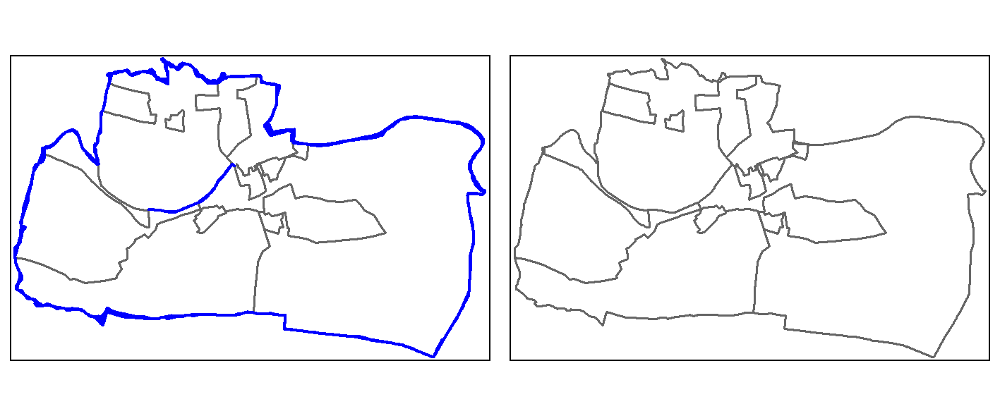
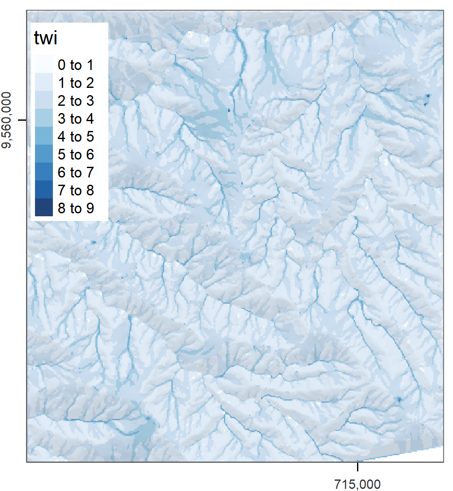
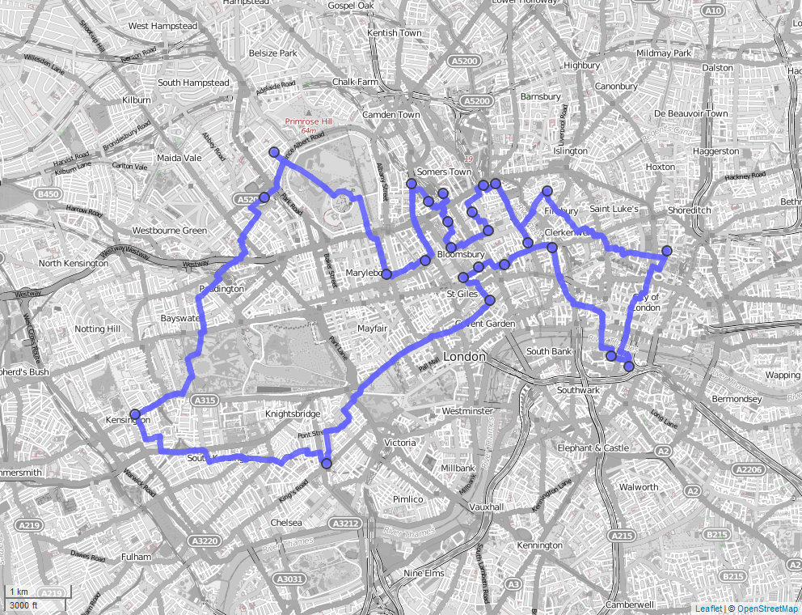

# Bridges to GIS software {#gis}

## Prerequisites {-}

- This chapter requires QGIS\index{QGIS}, SAGA\index{SAGA} and GRASS\index{GRASS} to be installed and the following packages to be attached:^[
Packages that have already been used including **spData**, **spDataLarge** and **dplyr** also need to be installed. 
]

```{r 09-gis-1, message=FALSE}
library(sf)
library(raster)
```

```{r 09-gis-1-2, message=FALSE, eval=FALSE}
#library(RQGIS)
library(RSAGA)
library(rgrass7)
```


## Introduction

A defining feature of R is the way you interact with it:
you type commands and hit `Enter` (or `Ctrl+Enter` if writing code in the source editor in RStudio\index{RStudio}) to execute them interactively.
This way of interacting with the computer is called a command-line interface (CLI)\index{command-line interface} (see definition in the note below).
CLIs are not unique to R.^[
Other 'command-lines' include terminals for interacting with the operating system and other interpreted languages such as Python.
Many GISs originated as a CLI:
it was only after the widespread uptake of computer mice and high-resolution screens in the 1990s that GUIs\index{graphical user interface} became common.
GRASS, one of the longest-standing GIS\index{GIS} programs, for example, relied primarily on command-line interaction before it gained a sophisticated GUI [@landa_new_2008].
]
In dedicated GIS\index{GIS} packages, by contrast, the emphasis tends to be on the graphical user interface (GUI)\index{graphical user interface}.
You *can* interact with GRASS\index{GRASS}, QGIS\index{QGIS}, SAGA\index{SAGA} and gvSIG from system terminals and embedded CLIs\index{command-line interface} such as the [Python Console in QGIS](https://docs.qgis.org/testing/en/docs/pyqgis_developer_cookbook/intro.html)\index{Python}, but 'pointing and clicking' is the norm.
This means many GIS\index{GIS} users miss out on the advantages of the command-line according to Gary Sherman, creator of QGIS\index{QGIS} [@sherman_desktop_2008]:

> With the advent of 'modern' GIS software, most people want to point and
click their way through life. That’s good, but there is a tremendous amount
of flexibility and power waiting for you with the command line. Many times
you can do something on the command line in a fraction of the time you
can do it with a GUI.

The 'CLI vs GUI'\index{graphical user interface} debate can be adversial but it does not have to be; both options can be used interchangeably, depending on the task at hand and the user's skillset.^[GRASS GIS and PostGIS are popular in academia and industry and can be seen as products which buck this trend as they are built around the command-line.]
The advantages of a good CLI\index{command-line interface} such as that provided by R (and enhanced by IDEs\index{IDE} such as RStudio\index{RStudio}) are numerous.
A good CLI:

- Facilitates the automation of repetitive tasks; 
- Enables transparency and reproducibility, the backbone of good scientific practice and data science;
- Encourages software development by providing tools to modify existing functions and implement new ones;
- Helps develop future-proof programming skills which are in high demand in many disciplines and industries; and
- Is user-friendly and fast, allowing an efficient workflow.

On the other hand, GUI-based GIS\index{GIS} systems (particularly QGIS\index{QGIS}) are also advantageous.
A good GIS GUI:

- Has a 'shallow' learning curve meaning geographic data can be explored and visualized without hours of learning a new language;
- Provides excellent support for 'digitizing' (creating new vector datasets), including trace, snap and topological tools;^[
The **mapedit** package allows the quick editing of a few spatial features but not professional, large-scale cartographic digitizing;
]
- Enables georeferencing (matching raster images to existing maps) with ground control points and orthorectification;
- Supports stereoscopic mapping (e.g., LiDAR and structure from motion); and
- Provides access to spatial database management systems with object-oriented relational data models, topology and fast (spatial) querying.

Another advantage of dedicated GISs is that they provide access to hundreds of 'geoalgorithms' (computational recipes to solve geographic problems --- see Chapter \@ref(algorithms)).
Many of these are unavailable from the R command line, except via 'GIS bridges', the topic of (and motivation for) this chapter.^[
An early use of the term 'bridge' referred to the coupling of R with GRASS\index{GRASS} [@neteler_open_2008].
Roger Bivand elaborated on this in his talk, "Bridges between GIS and R", delivered at the 2016 GEOSTAT summer school (see slides at: http://spatial.nhh.no/misc/).
]

```{block2 09-gis-2, type="rmdnote"}
A command-line interface is a means of interacting with computer programs in which the user issues commands via successive lines of text (command lines).
`bash` in Linux and `PowerShell` in Windows are common examples.
CLIs can be augmented with IDEs such as RStudio for R, which provides code auto-completion and other features to improve the user experience.
```

R originated as an interface language.
Its predecessor S provided access to statistical algorithms in other languages (particularly FORTRAN\index{FORTRAN}), but from an intuitive read-evaluate-print loop (REPL) [@chambers_extending_2016].
R continues this tradition with interfaces to numerous languages, notably C++\index{C++}, as described in Chapter \@ref(intro).
R was not designed as a GIS.
However, its ability to interface with dedicated GISs gives it astonishing geospatial capabilities.
R is well known as a statistical programming language, but many people are unaware of its ability to replicate GIS workflows, with the additional benefits of a (relatively) consistent CLI.
Furthermore, R outperforms GISs in some areas of geocomputation\index{geocomputation}, including interactive/animated map making (see Chapter \@ref(adv-map)) and spatial statistical modeling (see Chapter \@ref(spatial-cv)).
This chapter focuses on 'bridges' to three mature open source GIS products (see Table \@ref(tab:gis-comp)): QGIS\index{QGIS} (via the package **RQGIS**\index{RQGIS (package)}; Section \@ref(rqgis)), SAGA\index{SAGA} (via **RSAGA**\index{RSAGA (package)}; Section \@ref(rsaga)) and GRASS\index{GRASS} (via **rgrass7**\index{rgrass7 (package)}; Section \@ref(rgrass)).
Though not covered here, it is worth being aware of the interface to ArcGIS\index{ArcGIS}, a proprietary and very popular GIS software, via **RPyGeo**.^[By the way, it is also possible to use R from within Desktop GIS software packages. 
The so-called R-ArcGIS bridge (see https://github.com/R-ArcGIS/r-bridge) allows R to be used from within ArcGIS\index{ArcGIS}. 
One can also use R scripts from within QGIS\index{QGIS} (see https://docs.qgis.org/2.18/en/docs/training_manual/processing/r_intro.html).
Finally, it is also possible to use R from the GRASS GIS\index{GRASS} command line (see https://grasswiki.osgeo.org/wiki/R_statistics/rgrass7).
]
To complement the R-GIS bridges, the chapter ends with a very brief introduction to interfaces to spatial libraries (Section \@ref(gdal)) and spatial databases\index{spatial database} (Section \@ref(postgis)).

```{r gis-comp, echo=FALSE, message=FALSE}
library(dplyr)
d = tibble("GIS" = c("GRASS", "QGIS", "SAGA"),
            "First release" = c("1984", "2002", "2004"),
            "No. functions" = c(">500", ">1000", ">600"),
            "Support" = c("hybrid", "hybrid", "hybrid"))
knitr::kable(x = d, 
             caption = paste("Comparison between three open-source GIS.", 
                             "Hybrid refers to the support of vector and", 
                             "raster operations."),
             caption.short = "Comparison between three open-source GIS.", 
             booktabs = TRUE) #%>%
  # kableExtra::add_footnote(label = "Comparing downloads of different providers is rather difficult (see http://spatialgalaxy.net/2011/12/19/qgis-users-around-the-world), and here also useless since every Windows QGIS download automatically also downloads SAGA and GRASS.", notation = "alphabet")
```

## (R)QGIS {#rqgis}

QGIS\index{QGIS} is one of the most popular open-source GIS [Table \@ref(tab:gis-comp); @graser_processing_2015]. 
Its main advantage lies in the fact that it provides a unified interface to several other open-source GIS.
This means that you have access to GDAL\index{GDAL}, GRASS\index{GRASS} and SAGA\index{SAGA} through QGIS\index{QGIS} [@graser_processing_2015]. 
To run all these geoalgorithms (frequently more than 1000 depending on your set-up) outside of the QGIS GUI, QGIS provides a Python API\index{API}.
**RQGIS**\index{RQGIS (package)} establishes a tunnel to this Python API\index{API} through the **reticulate** package\index{reticulate (package)}. 
Basically, functions `set_env()` and `open_app()` are doing this. 
Note that it is optional to run `set_env()` and `open_app()` since all functions depending on their output will run them automatically if needed.
Before running **RQGIS**\index{RQGIS (package)}, make sure you have installed QGIS\index{QGIS} and all its (third-party) dependencies such as SAGA\index{SAGA} and GRASS\index{GRASS}.
To install **RQGIS** a number of dependencies are required, as described in the [`install_guide`](https://cran.r-project.org/web/packages/RQGIS/vignettes/install_guide.html) vignette, which covers installation on Windows, Linux and Mac.
At the time of writing (autumn 2018) RQGIS only supports the [Long Term Release](https://qgis.org/en/site/getinvolved/development/roadmap.html) (2.18), but support for QGIS 3 is in the pipeline (see [RQGIS3](https://github.com/jannes-m/RQGIS3)).


```{r qgis_setup, eval=FALSE}
#library(RQGIS)
set_env(dev = FALSE)
#> $`root`
#> [1] "C:/OSGeo4W64"
#> ...
```

Leaving the `path`-argument of `set_env()` unspecified will search the computer for a QGIS\index{QGIS} installation.
Hence, it is faster to specify explicitly the path to your QGIS installation.
Subsequently, `open_app()` sets all paths necessary to run QGIS from within R, and finally creates a so-called QGIS custom application (see [http://docs.qgis.org/testing/en/docs/pyqgis_developer_cookbook/intro.html#using-pyqgis-in-custom-applications](http://docs.qgis.org/testing/en/docs/pyqgis_developer_cookbook/intro.html#using-pyqgis-in-custom-applications)).

```{r 09-gis-3, eval=FALSE}
open_app()
```

We are now ready for some QGIS geoprocessing from within R! 
The example below shows how to unite polygons, a process that unfortunately produces so-called slivers \index{sliver polygons}, tiny polygons resulting from overlaps between the inputs that frequently occur in real-world data.
We will see how to remove them.

For the union\index{union}, we use again the incongruent polygons we have already encountered in Section \@ref(spatial-aggr).
Both polygon datasets are available in the **spData** package, and for both we would like to use a geographic CRS\index{CRS!geographic} (see also Chapter \@ref(reproj-geo-data)).

```{r 09-gis-4}
data("incongruent", "aggregating_zones", package = "spData")
incongr_wgs = st_transform(incongruent, 4326)
aggzone_wgs = st_transform(aggregating_zones, 4326)
```

To find an algorithm to do this work, `find_algorithms()` searches all QGIS geoalgorithms\index{geoalgorithm} using regular expressions.
Assuming that the short description of the function contains the word "union"\index{union}, we can run:

```{r 09-gis-5, eval=FALSE}
find_algorithms("union", name_only = TRUE)
#> [1] "qgis:union"        "saga:fuzzyunionor" "saga:union"
```

Short descriptions for each geoalgorithm\index{geoalgorithm} can also be provided, by setting `name_only = FALSE`.
If one has no clue at all what the name of a geoalgorithm might be, one can leave the `search_term`-argument empty which will return a list of all available QGIS\index{QGIS} geoalgorithms\index{geoalgorithm}.
You can also find the algorithms\index{algorithm} in the [QGIS online documentation](https://docs.qgis.org/2.18/en/docs/user_manual/processing_algs/index.html).

The next step is to find out how `qgis:union` can be used.
`open_help()` opens the online help of the geoalgorithm in question.
`get_usage()` returns all function parameters and default values. 


```{r 09-gis-6, eval=FALSE}
alg = "qgis:union"
open_help(alg)
get_usage(alg)
#>ALGORITHM: Union
#>	INPUT <ParameterVector>
#>	INPUT2 <ParameterVector>
#>	OUTPUT <OutputVector>
```

Finally, we can let QGIS\index{QGIS} do the work.
Note that the workhorse function `run_qgis()` accepts R named arguments, i.e., you can specify the parameter names as returned by `get_usage()` in `run_qgis()` as you would do in any other regular R function.
Note also that `run_qgis()` accepts spatial objects residing in R's global environment as input (here: `aggzone_wgs` and `incongr_wgs`). 
But of course, you could also specify paths to spatial vector files stored on disk.
Setting the `load_output` to `TRUE` automatically loads the QGIS output as an **sf**-object\index{sf} into R.

```{r 09-gis-7, eval=FALSE}
union = run_qgis(alg, INPUT = incongr_wgs, INPUT2 = aggzone_wgs, 
                 OUTPUT = file.path(tempdir(), "union.shp"),
                 load_output = TRUE)
#> $`OUTPUT`
#> [1] "C:/Users/geocompr/AppData/Local/Temp/RtmpcJlnUx/union.shp"
```

Note that the QGIS\index{QGIS} union\index{vector!union} operation merges the two input layers into one layer by using the intersection\index{vector!intersection} and the symmetrical difference of the two input layers (which by the way is also the default when doing a union operation in GRASS\index{GRASS} and SAGA\index{SAGA}).
This is **not** the same as `st_union(incongr_wgs, aggzone_wgs)` (see Exercises)!
The QGIS output contains empty geometries and multipart polygons.
Empty geometries might lead to problems in subsequent geoprocessing tasks which is why they will be deleted.
`st_dimension()` returns `NA` if a geometry is empty, and can therefore be used as a filter. 

```{r 09-gis-8, eval=FALSE}
# remove empty geometries
union = union[!is.na(st_dimension(union)), ]
```

Next we convert multipart polygons into single-part polygons (also known as explode geometries or casting).
This is necessary for the deletion of sliver polygons\index{sliver polygons} later on.

```{r 09-gis-9, eval=FALSE, message=FALSE, warning=FALSE}
# multipart polygons to single polygons
single = st_cast(union, "POLYGON")
```

One way to identify slivers\index{sliver polygons} is to find polygons with comparatively very small areas, here, e.g., 25000 m^2^ (see blue colored polygons in the left panel of Figure \@ref(fig:sliver-fig)). 

```{r 09-gis-10, eval=FALSE}
# find polygons which are smaller than 25000 m^2
x = 25000
units(x) = "m^2"
single$area = st_area(single)
sub = dplyr::filter(single, area < x)
```

The next step is to find a function that makes the slivers\index{sliver polygons} disappear.
Assuming the function or its short description contains the word "sliver", we can run:

```{r 09-gis-11, eval=FALSE}
find_algorithms("sliver", name_only = TRUE)
#> [1] "qgis:eliminatesliverpolygons"
```

This returns only one geoalgorithm\index{geoalgorithm} whose parameters can be accessed with the help of `get_usage()` again.

```{r 09-gis-12, eval=FALSE}
alg = "qgis:eliminatesliverpolygons"
get_usage(alg)
#>ALGORITHM: Eliminate sliver polygons
#>	INPUT <ParameterVector>
#>	KEEPSELECTION <ParameterBoolean>
#>	ATTRIBUTE <parameters from INPUT>
#>	COMPARISON <ParameterSelection>
#>	COMPARISONVALUE <ParameterString>
#>	MODE <ParameterSelection>
#>	OUTPUT <OutputVector>
#>	...
```
\index{sliver polygons}

Conveniently, the user does not need to specify each single parameter.
In case a parameter is left unspecified, `run_qgis()` will automatically use the corresponding default value as an argument if available.
To find out about the default values, run `get_args_man()`.  

To remove the slivers, we specify that all polygons with an area less or equal to 25,000 m^2^ should be joined to the neighboring polygon with the largest area (see right panel of Figure \@ref(fig:sliver-fig)).

```{r 09-gis-13, eval=FALSE}
clean = run_qgis("qgis:eliminatesliverpolygons",
                 INPUT = single,
                 ATTRIBUTE = "area",
                 COMPARISON = "<=",
                 COMPARISONVALUE = 25000,
                 OUTPUT = file.path(tempdir(), "clean.shp"),
                 load_output = TRUE)
#> $`OUTPUT`
#> [1] "C:/Users/geocompr/AppData/Local/Temp/RtmpcJlnUx/clean.shp"
```

```{r sliver-fig, echo=FALSE, fig.cap="Sliver polygons colored in blue (left panel). Cleaned polygons (right panel).", fig.scap="Sliver (left panel) and cleaned (right panel) polygons."}

```

In the code chunk above note that

- leaving the output parameter(s) unspecified saves the resulting QGIS output to a temporary folder created by QGIS\index{QGIS};
`run_qgis()` prints these paths to the console after successfully running the QGIS engine; and
- if the output consists of multiple files and you have set `load_output` to `TRUE`, `run_qgis()` will return a list with each element corresponding to one output file.

To learn more about **RQGIS**\index{RQGIS (package)}, see @muenchow_rqgis:_2017. 

## (R)SAGA {#rsaga}

The System for Automated Geoscientific Analyses (SAGA\index{SAGA}; Table \@ref(tab:gis-comp)) provides the possibility to execute SAGA modules via the command line interface\index{command-line interface} (`saga_cmd.exe` under Windows and just `saga_cmd` under Linux) (see the [SAGA wiki on modules](https://sourceforge.net/p/saga-gis/wiki/Executing%20Modules%20with%20SAGA%20CMD/)).
In addition, there is a Python interface (SAGA Python API\index{API}).
**RSAGA**\index{RSAGA (package)} uses the former to run SAGA\index{SAGA} from within R.

Though SAGA is a hybrid GIS, its main focus has been on raster processing, and here particularly on digital elevation models\index{digital elevation model} (soil properties, terrain attributes, climate parameters). 
Hence, SAGA is especially good at the fast processing of large (high-resolution) raster\index{raster} datasets [@conrad_system_2015]. 
Therefore, we will introduce **RSAGA**\index{RSAGA (package)} with a raster use case from @muenchow_geomorphic_2012.
Specifically, we would like to compute the SAGA wetness index from a digital elevation model.
First of all, we need to make sure that **RSAGA** will find SAGA on the computer when called.
For this, all **RSAGA** functions using SAGA in the background make use of `rsaga.env()`. 
Usually, `rsaga.env()` will detect SAGA\index{SAGA} automatically by searching several likely directories (see its help for more information).

```{r 09-gis-14, warning=FALSE, message=FALSE, eval=FALSE}
library(RSAGA)
rsaga.env()
#> Search for SAGA command line program and modules... 
#> Done
#> $workspace
#> [1] "."
#> ...
```

However, it is possible to have 'hidden' SAGA in a location `rsaga.env()` does not search automatically. 
`linkSAGA` searches your computer for a valid SAGA installation. 
If it finds one, it adds the newest version to the PATH environment variable thereby making sure that `rsaga.env()` runs successfully.
It is only necessary to run the next code chunk if `rsaga.env()` was unsuccessful (see previous code chunk).

```{r 09-gis-15, warning=FALSE, message=FALSE, eval=FALSE}
library(link2GI)
saga = linkSAGA()
rsaga.env()
```

Secondly, we need to write the digital elevation model to a SAGA-format. 
Note that calling `data(landslides)` attaches two objects to the global environment - `dem`, a digital elevation model\index{digital elevation model} in the form of a `list`, and `landslides`, a `data.frame` containing observations representing the presence or absence of a landslide:

```{r 09-gis-16, eval=FALSE}
data(landslides)
write.sgrd(data = dem, file = file.path(tempdir(), "dem"), header = dem$header)
```
 
The organization of SAGA is modular.
Libraries contain so-called modules, i.e., geoalgorithms\index{geoalgorithm}.
To find out which libraries are available, run (output not shown):

```{r 09-gis-17, eval=FALSE}
rsaga.get.libraries()
```

We choose the library `ta_hydrology` (`ta` is the abbreviation for terrain analysis).
Subsequently, we can access the available modules of a specific library (here: `ta_hydrology`) as follows:

```{r 09-gis-18, eval=FALSE}
rsaga.get.modules(libs = "ta_hydrology")
```

`rsaga.get.usage()` prints the function parameters of a specific geoalgorithm\index{geoalgorithm}, e.g., the `SAGA Wetness Index`\index{wetness index}, to the console.

```{r 09-gis-19, eval=FALSE}
rsaga.get.usage(lib = "ta_hydrology", module = "SAGA Wetness Index")
```

Finally, you can run SAGA from within R using **RSAGA**'s geoprocessing workhorse function `rsaga.geoprocessor()`. 
The function expects a parameter-argument list in which you have specified all necessary parameters.

```{r 09-gis-20, eval=FALSE}
params = list(DEM = file.path(tempdir(), "dem.sgrd"),
              TWI = file.path(tempdir(), "twi.sdat"))
rsaga.geoprocessor(lib = "ta_hydrology", module = "SAGA Wetness Index", 
                   param = params)
```

To facilitate the access to the SAGA interface, **RSAGA** frequently provides user-friendly wrapper-functions with meaningful default values (see **RSAGA** documentation for examples, e.g., `?rsaga.wetness.index`).
So the function call for calculating the 'SAGA Wetness Index'\index{wetness index} becomes:

```{r 09-gis-21, eval=FALSE}
rsaga.wetness.index(in.dem = file.path(tempdir(), "dem"), 
                    out.wetness.index = file.path(tempdir(), "twi"))
```

Of course, we would like to inspect our result visually (Figure \@ref(fig:saga-twi)). 
To load and plot the SAGA\index{SAGA} output file, we use the **raster**\index{raster} package. 

```{r 09-gis-22, eval=FALSE}
library(raster)
twi = raster::raster(file.path(tempdir(), "twi.sdat"))
# shown is a version using tmap
plot(twi, col = RColorBrewer::brewer.pal(n = 9, name = "Blues"))
```

```{r saga-twi, fig.cap="SAGA wetness index of Mount Mongón, Peru.", echo=FALSE, out.width="50%"}

```

You can find an extended version of this example in `vignette("RSAGA-landslides")` which includes the use of statistical geocomputing to derive terrain attributes as predictors for a non-linear Generalized Additive Model\index{generalized additive model} (GAM) to predict spatially landslide susceptibility [@muenchow_geomorphic_2012].
The term statistical geocomputation emphasizes the strength of combining R's data science\index{data science} power with the geoprocessing power of a GIS which is at the very heart of building a bridge from R\index{R} to GIS\index{GIS}.

## GRASS through **rgrass7**  {#rgrass}

The U.S. Army - Construction Engineering Research Laboratory (USA-CERL) created the core of the Geographical Resources Analysis Support System (GRASS)\index{GRASS} [Table \@ref(tab:gis-comp); @neteler_open_2008] from 1982 to 1995. 
Academia continued this work since 1997.
Similar to SAGA\index{SAGA}, GRASS focused on raster processing in the beginning while only later, since GRASS 6.0, adding advanced vector functionality [@bivand_applied_2013].

We will introduce **rgrass7**\index{rgrass7 (package)} with one of the most interesting problems in GIScience - the traveling salesman problem\index{traveling salesman}. 
Suppose a traveling salesman would like to visit 24 customers. 
Additionally, he would like to start and finish his journey at home which makes a total of 25 locations while covering the shortest distance possible.
There is a single best solution to this problem; however, to find it is even for modern computers (mostly) impossible [@longley_geographic_2015].
In our case, the number of possible solutions correspond to `(25 - 1)! / 2`, i.e., the factorial of 24 divided by 2 (since we do not differentiate between forward or backward direction).
Even if one iteration can be done in a nanosecond, this still corresponds to `r format(factorial(25 - 1) / (2 * 10^9 * 3600 * 24 * 365))` years. 
Luckily, there are clever, almost optimal solutions which run in a tiny fraction of this inconceivable amount of time.
GRASS GIS\index{GRASS} provides one of these solutions (for more details, see [v.net.salesman](https://grass.osgeo.org/grass77/manuals/v.net.salesman.html)). 
In our use case, we would like to find the shortest path\index{shortest route} between the first 25 bicycle stations (instead of customers) on London's streets (and we simply assume that the first bike station corresponds to the home of our traveling salesman\index{traveling salesman}).

```{r 09-gis-24}
data("cycle_hire", package = "spData")
points = cycle_hire[1:25, ]
```

Aside from the cycle hire points data, we will need the OpenStreetMap\index{OpenStreetMap} data of London.
We download it with the help of the **osmdata**\index{osmdata (package)} package (see also Section \@ref(retrieving-data)).
We constrain the download of the street network (in OSM language called "highway") to  the bounding box\index{bounding box} of the cycle hire data, and attach the corresponding data as an `sf`-object\index{sf}.
`osmdata_sf()` returns a list with several spatial objects (points, lines, polygons, etc.).
Here, we will only keep the line objects.
OpenStreetMap\index{OpenStreetMap} objects come with a lot of columns, `streets` features almost 500.
In fact, we are only interested in the geometry column.
Nevertheless, we are keeping one attribute column; otherwise, we will run into trouble when trying to provide `writeVECT()` only with a geometry object (see further below and `?writeVECT` for more details).
Remember that the geometry column is sticky, hence, even though we are just selecting one attribute, the geometry column will be also returned (see Section \@ref(intro-sf)).

```{r 09-gis-25, eval=FALSE}
library(osmdata)
b_box = st_bbox(points)
london_streets = opq(b_box) %>%
  add_osm_feature(key = "highway") %>%
  osmdata_sf() %>%
  `[[`("osm_lines")
london_streets = dplyr::select(london_streets, osm_id)
```

As a convenience to the reader, one can attach `london_streets` to the global environment using `data("london_streets", package = "spDataLarge")`. 

```{r 09-gis-26, eval=FALSE, echo=FALSE}
data("london_streets", package = "spDataLarge")
```

Now that we have the data, we can go on and initiate a GRASS\index{GRASS} session, i.e., we have to create a GRASS spatial database.
The GRASS geodatabase \index{spatial database} system is based on SQLite.
Consequently, different users can easily work on the same project, possibly with different read/write permissions.
However, one has to set up this spatial database\index{spatial database} (also from within R), and users used to a GIS GUI\index{graphical user interface} popping up by one click might find this process a bit intimidating in the beginning.
First of all, the GRASS database requires its own directory, and contains a location (see the [GRASS GIS Database](https://grass.osgeo.org/grass77/manuals/grass_database.html) help pages at [grass.osgeo.org](https://grass.osgeo.org/grass77/manuals/index.html) for further information).
The location in turn simply contains the geodata for one project. 
Within one location, several mapsets can exist and typically refer to different users. 
PERMANENT is a mandatory mapset and is created automatically.
It stores the projection, the spatial extent and the default resolution for raster data.
In order to share geographic data with all users of a project, the database owner can add spatial data to the PERMANENT mapset.
Please refer to @neteler_open_2008 and the [GRASS GIS quick start](https://grass.osgeo.org/grass77/manuals/helptext.html) for more information on the GRASS spatial database\index{spatial database} system.

You have to set up a location and a mapset if you want to use GRASS\index{GRASS} from within R.
First of all, we need to find out if and where GRASS 7 is installed on the computer.

```{r 09-gis-27, eval=FALSE}
library(link2GI)
link = findGRASS() 
```

`link` is a `data.frame` which contains in its rows the GRASS 7 installations on your computer. 
Here, we will use a GRASS 7\index{GRASS} installation.
If you have not installed GRASS 7 on your computer, we recommend that you do so now.
Assuming that we have found a working installation on your computer, we use the corresponding path in `initGRASS`. 
Additionally, we specify where to store the spatial database\index{spatial database} (gisDbase), name the location `london`, and use the PERMANENT mapset.

```{r 09-gis-28, eval=FALSE}
library(rgrass7)
# find a GRASS 7 installation, and use the first one
ind = grep("7", link$version)[1]
# next line of code only necessary if we want to use GRASS as installed by 
# OSGeo4W. Among others, this adds some paths to PATH, which are also needed
# for running GRASS.
link2GI::paramGRASSw(link[ind, ])
grass_path = 
  ifelse(test = !is.null(link$installation_type) && 
           link$installation_type[ind] == "osgeo4W",
         yes = file.path(link$instDir[ind], "apps/grass", link$version[ind]),
         no = link$instDir)
initGRASS(gisBase = grass_path,
          # home parameter necessary under UNIX-based systems
          home = tempdir(),
          gisDbase = tempdir(), location = "london", 
          mapset = "PERMANENT", override = TRUE)
```

Subsequently, we define the projection, the extent and the resolution.

```{r 09-gis-29, eval=FALSE}
execGRASS("g.proj", flags = c("c", "quiet"), 
          proj4 = st_crs(london_streets)$proj4string)
b_box = st_bbox(london_streets) 
execGRASS("g.region", flags = c("quiet"), 
          n = as.character(b_box["ymax"]), s = as.character(b_box["ymin"]), 
          e = as.character(b_box["xmax"]), w = as.character(b_box["xmin"]), 
          res = "1")
```

Once you are familiar with how to set up the GRASS environment, it becomes tedious to do so over and over again.
Luckily, `linkGRASS7()` of the **link2GI** packages lets you do it with one line of code.
The only thing you need to provide is a spatial object which determines the projection and the extent of the spatial database.\index{spatial database}.
First, `linkGRASS7()` finds all GRASS\index{GRASS} installations on your computer.
Since we have set `ver_select` to `TRUE`, we can interactively choose one of the found GRASS-installations.
If there is just one installation, the `linkGRASS7()` automatically chooses this one.
Second, `linkGRASS7()` establishes a connection to GRASS 7.
 
```{r 09-gis-30, eval=FALSE}
link2GI::linkGRASS7(london_streets, ver_select = TRUE)
```

Before we can use GRASS geoalgorithms\index{geoalgorithm}, we need to add data to GRASS's spatial database\index{spatial database}.
Luckily, the convenience function `writeVECT()` does this for us.
(Use `writeRAST()` in the case of raster data.)
In our case we add the street and cycle hire point data while using only the first attribute column, and name them also `london_streets` and `points`. 

To use **sf**-objects with **rgrass7**, we have to run `use_sf()` first (note: the code below assumes you are running **rgrass7** 0.2.1 or above).

```{r 09-gis-31, eval=FALSE}
use_sf()
writeVECT(SDF = london_streets, vname = "london_streets")
writeVECT(SDF = points[, 1], vname = "points")
```

To perform our network\index{network} analysis, we need a topological clean street network.
GRASS's `v.clean` takes care of the removal of duplicates, small angles and dangles, among others. 
Here, we break lines at each intersection to ensure that the subsequent routing algorithm can actually turn right or left at an intersection, and save the output in a GRASS object named `streets_clean`.
It is likely that a few of our cycling station points will not lie exactly on a street segment.
However, to find the shortest route\index{shortest route} between them, we need to connect them to the nearest streets segment.
`v.net`'s connect-operator does exactly this. 
We save its output in `streets_points_con`.

```{r 09-gis-32, eval=FALSE}
# clean street network
execGRASS(cmd = "v.clean", input = "london_streets", output = "streets_clean",
          tool = "break", flags = "overwrite")
# connect points with street network
execGRASS(cmd = "v.net", input = "streets_clean", output = "streets_points_con", 
          points = "points", operation = "connect", threshold = 0.001,
          flags = c("overwrite", "c"))
```

The resulting clean dataset serves as input for the `v.net.salesman`-algorithm, which finally finds the shortest route between all cycle hire stations.
`center_cats` requires a numeric range as input.
This range represents the points for which a shortest route should be calculated. 
Since we would like to calculate the route for all cycle stations, we set it to `1-25`.
To access the GRASS help page of the traveling salesman\index{traveling salesman} algorithm\index{algorithm}, run `execGRASS("g.manual", entry = "v.net.salesman")`.

```{r 09-gis-33, eval=FALSE}
execGRASS(cmd = "v.net.salesman", input = "streets_points_con",
          output = "shortest_route", center_cats = paste0("1-", nrow(points)),
          flags = c("overwrite"))
```

To visualize our result, we import the output layer into R, convert it into an sf-object keeping only the geometry, and visualize it with the help of the **mapview** package (Figure \@ref(fig:grass-mapview) and Section \@ref(interactive-maps)).

```{r grass-mapview, fig.cap="Shortest route (blue line) between 24 cycle hire stations (blue dots) on the OSM street network of London.", fig.scap="Shortest route between 24 cycle hire stations.", echo=FALSE, out.width="80%"}

```

```{r 09-gis-34, eval=FALSE}
route = readVECT("shortest_route") %>%
  st_as_sf() %>%
  st_geometry()
mapview::mapview(route, map.types = "OpenStreetMap.BlackAndWhite", lwd = 7) +
  points
```

```{r 09-gis-35, eval=FALSE, echo=FALSE}
library("mapview")
m_1 = mapview(route, map.types = "OpenStreetMap.BlackAndWhite", lwd = 7) +
  points
mapview::mapshot(m_1, 
                 file = file.path(getwd(), "figures/09_shortest_route.png"),
                 remove_controls = c("homeButton", "layersControl",
                                     "zoomControl"))
```

There are a few important considerations to note in the process:

- We could have used GRASS's spatial database\index{spatial database} (based on SQLite) which allows faster processing. 
That means we have only exported geographic data at the beginning.
Then we created new objects but only imported the final result back into R.
To find out which datasets are currently available, run `execGRASS("g.list", type = "vector,raster", flags = "p")`.
- We could have also accessed an already existing GRASS spatial database from within R.
Prior to importing data into R, you might want to perform some (spatial) subsetting\index{vector!subsetting}.
Use `v.select` and `v.extract` for vector data. 
`db.select` lets you select subsets of the attribute table of a vector layer without returning the corresponding geometry.
- You can also start R from within a running GRASS\index{GRASS} session [for more information please refer to @bivand_applied_2013 and this [wiki](https://grasswiki.osgeo.org/wiki/R_statistics/rgrass7)].
- Refer to the excellent [GRASS online help](https://grass.osgeo.org/grass77/manuals/) or `execGRASS("g.manual", flags = "i")` for more information on each available GRASS geoalgorithm\index{geoalgorithm}.
- If you would like to use GRASS 6 from within R, use the R package **spgrass6**.

## When to use what?

To recommend a single R-GIS interface is hard since the usage depends on personal preferences, the tasks at hand and your familiarity with different GIS\index{GIS} software packages which in turn probably depends on your field of study.
As mentioned previously, SAGA\index{SAGA} is especially good at the fast processing of large (high-resolution) raster\index{raster} datasets, and frequently used by hydrologists, climatologists and soil scientists [@conrad_system_2015].
GRASS GIS\index{GRASS}, on the other hand, is the only GIS presented here supporting a topologically based spatial database which is especially useful for network analyses but also simulation studies (see below).
QGIS is much more user-friendly compared to GRASS- and SAGA-GIS, especially for first-time GIS users, and probably the most popular open-source GIS.
Therefore, **RQGIS**\index{RQGIS (package)} is an appropriate choice for most use cases.
Its main advantages are

- a unified access to several GIS, and therefore the provision of >1000 geoalgorithms (Table \@ref(tab:gis-comp)) including duplicated functionality, e.g., you can perform overlay-operations using QGIS-\index{QGIS}, SAGA-\index{SAGA} or GRASS-geoalgorithms\index{GRASS};
- automatic data format conversions (SAGA uses `.sdat` grid files and GRASS uses its own database format but QGIS will handle the corresponding conversions);
- its automatic passing of geographic R objects to QGIS geoalgorithms\index{geoalgorithm} and back into R; and
- convenience functions to support the access of the online help, named arguments and automatic default value retrieval (**rgrass7**\index{rgrass7 (package)} inspired the latter two features).

By all means, there are use cases when you certainly should use one of the other R-GIS bridges.
Though QGIS is the only GIS providing a unified interface to several GIS\index{GIS} software packages, it only provides access to a subset of the corresponding third-party geoalgorithms (for more information please refer to @muenchow_rqgis:_2017).
Therefore, to use the complete set of SAGA and GRASS functions, stick with **RSAGA**\index{RSAGA (package)} and **rgrass7**. 
When doing so, take advantage of **RSAGA**'s numerous user-friendly functions.
Note also, that **RSAGA** offers native R functions for geocomputation such as `multi.local.function()`, `pick.from.points()` and many more.
**RSAGA** supports much more SAGA versions than (R)QGIS.
Finally, if you need topological correct data and/or spatial database management functionality such as multi-user access, we recommend the usage of GRASS. 
In addition, if you would like to run simulations with the help of a geodatabase\index{spatial database} [@krug_clearing_2010], use **rgrass7** directly since **RQGIS** always starts a new GRASS session for each call.

Please note that there are a number of further GIS software packages that have a scripting interface but for which there is no dedicated R package that accesses these: gvSig, OpenJump, Orfeo Toolbox and TauDEM.

## Other bridges

The focus of this chapter is on R interfaces to Desktop GIS\index{GIS} software.
We emphasize these bridges because dedicated GIS software is well-known and a common 'way in' to understanding geographic data.
They also provide access to many geoalgorithms\index{geoalgorithm}.

Other 'bridges' include interfaces to spatial libraries (Section \@ref(gdal) shows how to access the GDAL\index{GDAL} CLI\index{command-line interface} from R), spatial databases\index{spatial database} (see Section \@ref(postgis)) and web mapping services (see Chapter \@ref(adv-map)).
This section provides only a snippet of what is possible.
Thanks to R's\index{R} flexibility, with its ability to call other programs from the system and integration with other languages (notably via **Rcpp** and **reticulate**\index{reticulate (package)}), many other bridges are possible.
The aim is not to be comprehensive, but to demonstrate other ways of accessing the 'flexibility and power' in the quote by @sherman_desktop_2008 at the beginning of the chapter.

### Bridges to GDAL {#gdal}

As discussed in Chapter \@ref(read-write), GDAL\index{GDAL} is a low-level library that supports many geographic data formats.
GDAL is so effective that most GIS programs use GDAL\index{GDAL} in the background for importing and exporting geographic data, rather than re-inventing the wheel and using bespoke read-write code.
But GDAL\index{GDAL} offers more than data I/O.
It has [geoprocessing tools](http://www.gdal.org/pages.html) for vector and raster data, functionality to create [tiles](https://www.gdal.org/gdal2tiles.html) for serving raster data online, and rapid [rasterization](https://www.gdal.org/gdal_rasterize.html) of vector data, all of which can be accessed via the system of R command line.

The code chunk below demonstrates this functionality:
`linkGDAL()` searches the computer for a working GDAL\index{GDAL} installation and adds the location of the executable files to the PATH variable, allowing GDAL to be called.
In the example below `ogrinfo` provides metadata on a vector dataset:

```{r 09-gis-36, eval=FALSE, message=FALSE}
link2GI::linkGDAL()
cmd = paste("ogrinfo -ro -so -al", system.file("shape/nc.shp", package = "sf"))
system(cmd)
#> INFO: Open of `C:/Users/geocompr/Documents/R/win-library/3.5/sf/shape/nc.shp'
#>     using driver `ESRI Shapefile' successful.
#> 
#> Layer name: nc
#> Metadata:
#>  DBF_DATE_LAST_UPDATE=2016-10-26
#> Geometry: Polygon
#> Feature Count: 100
#> Extent: (-84.323853, 33.881992) - (-75.456978, 36.589649)
#> Layer SRS WKT:
#> ...
```

This example --- which returns the same result as `rgdal::ogrInfo()` --- may be simple, but it shows how to use GDAL\index{GDAL} via the system command-line\index{command-line interface}, independently of other packages.
The 'link' to GDAL provided by **link2gi** could be used as a foundation for doing more advanced GDAL work from the R or system CLI.^[
Note also that the **RSAGA** package uses the command line interface to use SAGA geoalgorithms from within R (see Section \@ref(rsaga)). 
]
TauDEM (http://hydrology.usu.edu/taudem/taudem5/index.html) and the Orfeo Toolbox (https://www.orfeo-toolbox.org/) are other spatial data processing libraries/programs offering a command line interface. 
At the time of writing, it appears that there is only a developer version of an R/TauDEM interface on R-Forge (https://r-forge.r-project.org/R/?group_id=956).
In any case, the above example shows how to access these libraries from the system command line via R.
This in turn could be the starting point for creating a proper interface to these libraries in the form of new R packages.

Before diving into a project to create a new bridge, however, it is important to be aware of the power of existing R packages and that `system()` calls may not be platform-independent (they may fail on some computers).
Furthermore, **sf** brings most of the power provided by GDAL\index{GDAL}, GEOS\index{GEOS} and PROJ\index{PROJ} to R via the R/C++\index{C++} interface provided by **Rcpp**, which avoids `system()` calls.

### Bridges to spatial databases {#postgis}

\index{spatial database}
Spatial database management systems (spatial DBMS) store spatial and non-spatial data in a structured way.
They can organize large collections of data into related tables (entities) via unique identifiers (primary and foreign keys) and implicitly via space (think for instance of a spatial join). 
This is useful because geographic datasets tend to become big and messy quite quickly.
Databases enable storing and querying large datasets efficiently based on spatial and non-spatial fields, and provide multi-user access and topology\index{topological relations} support.

The most important open source spatial database\index{spatial database} is PostGIS\index{PostGIS} [@obe_postgis_2015].^[
SQLite/SpatiaLite are certainly also important but implicitly we have already introduced this approach since GRASS\index{GRASS} is using SQLite in the background (see Section \@ref(rgrass)).
]
R bridges to spatial DBMSs such as PostGIS\index{PostGIS} are important, allowing access to huge data stores without loading several gigabytes of geographic data into RAM, and likely crashing the R session.
The remainder of this section shows how PostGIS can be called from R, based on "Hello real word" from *PostGIS in Action, Second Edition* [@obe_postgis_2015].^[
Thanks to Manning Publications, Regina Obe and Leo Hsu for permission to use this example.
]

The subsequent code requires a working internet connection, since we are accessing a PostgreSQL/PostGIS\index{PostGIS} database which is living in the QGIS Cloud (https://qgiscloud.com/).^[
QGIS\index{QGIS} Cloud lets you store geographic data and maps in the cloud. 
In the background, it uses QGIS Server and PostgreSQL/PostGIS.
This way, the reader can follow the PostGIS example without the need to have PostgreSQL/PostGIS installed on a local machine.
Thanks to the QGIS Cloud team for hosting this example.
]

```{r 09-gis-37, eval=FALSE}
library(RPostgreSQL)
conn = dbConnect(drv = PostgreSQL(), dbname = "rtafdf_zljbqm",
                 host = "db.qgiscloud.com",
                 port = "5432", user = "rtafdf_zljbqm", 
                 password = "d3290ead")
```

Often the first question is, 'which tables can be found in the database?'.
This can be asked as follows (the answer is 5 tables):

```{r 09-gis-38, eval=FALSE}
dbListTables(conn)
#> [1] "spatial_ref_sys" "topology"        "layer"           "restaurants"    
#> [5] "highways" 
```

We are only interested in the `restaurants` and the `highways` tables.
The former represents the locations of fast-food restaurants in the US, and the latter are principal US highways.
To find out about attributes available in a table, we can run:

```{r 09-gis-39, eval=FALSE}
dbListFields(conn, "highways")
#> [1] "qc_id"        "wkb_geometry" "gid"          "feature"     
#> [5] "name"         "state"   
```

The first query will select `US Route 1` in Maryland (`MD`).
Note that `st_read()` allows us to read geographic data from a database if it is provided with an open connection to a database and a query.
Additionally, `st_read()` needs to know which column represents the geometry (here: `wkb_geometry`).

```{r 09-gis-40, eval=FALSE}
query = paste(
  "SELECT *",
  "FROM highways",
  "WHERE name = 'US Route 1' AND state = 'MD';")
us_route = st_read(conn, query = query, geom = "wkb_geometry")
```

This results in an **sf**-object\index{sf} named `us_route` of type `sfc_MULTILINESTRING`.
The next step is to add a 20-mile buffer (corresponds to 1609 meters times 20) around the selected highway (Figure \@ref(fig:postgis)).

```{r 09-gis-41, eval=FALSE}
query = paste(
  "SELECT ST_Union(ST_Buffer(wkb_geometry, 1609 * 20))::geometry",
  "FROM highways",
  "WHERE name = 'US Route 1' AND state = 'MD';")
buf = st_read(conn, query = query)
```

Note that this was a spatial query using functions (`ST_Union()`\index{vector!union}, `ST_Buffer()`\index{vector!buffers}) you should be already familiar with since you find them also in the **sf**-package, though here they are written in lowercase characters (`st_union()`, `st_buffer()`).
In fact, function names of the **sf** package largely follow the PostGIS\index{PostGIS} naming conventions.^[
The prefix `st` stands for space/time.
]
The last query will find all Hardee restaurants (`HDE`) within the buffer zone (Figure \@ref(fig:postgis)).

```{r 09-gis-42, eval=FALSE, warning=FALSE}
query = paste(
  "SELECT r.wkb_geometry",
  "FROM restaurants r",
  "WHERE EXISTS (",
  "SELECT gid",
  "FROM highways",
  "WHERE",
  "ST_DWithin(r.wkb_geometry, wkb_geometry, 1609 * 20) AND",
  "name = 'US Route 1' AND",
  "state = 'MD' AND",
  "r.franchise = 'HDE');"
)
hardees = st_read(conn, query = query)
```

Please refer to @obe_postgis_2015 for a detailed explanation of the spatial SQL query.
Finally, it is good practice to close the database connection as follows:^[
It is important to close the connection here because QGIS Cloud (free version) allows only ten concurrent connections.
]

```{r 09-gis-43, eval=FALSE}
RPostgreSQL::postgresqlCloseConnection(conn)
```

```{r 09-gis-44, echo=FALSE}
load("extdata/postgis_data.Rdata")
```

```{r postgis, echo=FALSE, fig.cap="Visualization of the output of previous PostGIS commands showing the highway (black line), a buffer (light yellow) and three restaurants (light blue points) within the buffer.", fig.scap="Visualization of the output of previous PostGIS commands.", out.width="60%"}
# plot the results of the queries
par(mar = rep(0, 4))
plot(buf$st_union, col = "lightyellow")
plot(st_geometry(us_route), add = TRUE, lwd = 2)
plot(st_geometry(hardees), pch = 21, cex = 1.5,
     bg = "lightblue", fill = "black", add = TRUE)
```

Unlike PostGIS, **sf** only supports spatial vector data. 
To query and manipulate raster data stored in a PostGIS database, use the **rpostgis** package [@bucklin_rpostgis_2018] and/or use command-line tools such as `rastertopgsql` which comes as part of the PostGIS\index{PostGIS} installation. 

This subsection is only a brief introduction to PostgreSQL/PostGIS.
Nevertheless, we would like to encourage the practice of storing geographic and non-geographic data in a spatial DBMS\index{spatial database} while only attaching those subsets to R's global environment which are needed for further (geo-)statistical analysis.
Please refer to @obe_postgis_2015 for a more detailed description of the SQL queries presented and a more comprehensive introduction to PostgreSQL/PostGIS in general.
PostgreSQL/PostGIS is a formidable choice as an open-source spatial database.
But the same is true for the lightweight SQLite/SpatiaLite database engine and GRASS\index{GRASS} which uses SQLite in the background (see Section \@ref(rgrass)).

As a final note, if your data is getting too big for PostgreSQL/PostGIS and you require massive spatial data management and query performance, then the next logical step is to use large-scale geographic querying on distributed computing systems, as for example, provided by GeoMesa (http://www.geomesa.org/) or GeoSpark [http://geospark.datasyslab.org/; @huang_geospark_2017].

## Exercises

1. Create two overlapping polygons (`poly_1` and `poly_2`) with the help of the **sf**-package (see Chapter \@ref(spatial-class)). 

1. Union `poly_1` and `poly_2` using `st_union()` and `qgis:union`.
What is the difference between the two union operations\index{vector!union}? 
How can we use the **sf**\index{sf} package to obtain the same result as QGIS\index{QGIS}?

1. Calculate the intersection\index{vector!intersection} of `poly_1` and `poly_2` using:

    - **RQGIS**, **RSAGA** and **rgrass7**
    - **sf**

1. Attach `data(dem, package = "spDataLarge")` and `data(random_points, package = "spDataLarge")`.
Select randomly a point from `random_points` and find all `dem` pixels that can be seen from this point (hint: viewshed\index{viewshed}).
Visualize your result.
For example, plot a hillshade\index{hillshade}, and on top of it the digital elevation model\index{digital elevation model}, your viewshed\index{viewshed} output and the point.
Additionally, give `mapview` a try.

1. Compute catchment area\index{catchment area} and catchment slope of `data("dem", package = "spDataLarge")` using **RSAGA** (see Section \@ref(rsaga)).

1. Use `gdalinfo` via a system call for a raster\index{raster} file stored on disk of your choice (see Section \@ref(gdal)).

1. Query all Californian highways from the PostgreSQL/PostGIS\index{PostGIS} database living in the QGIS\index{QGIS} Cloud introduced in this chapter (see Section \@ref(postgis)).

