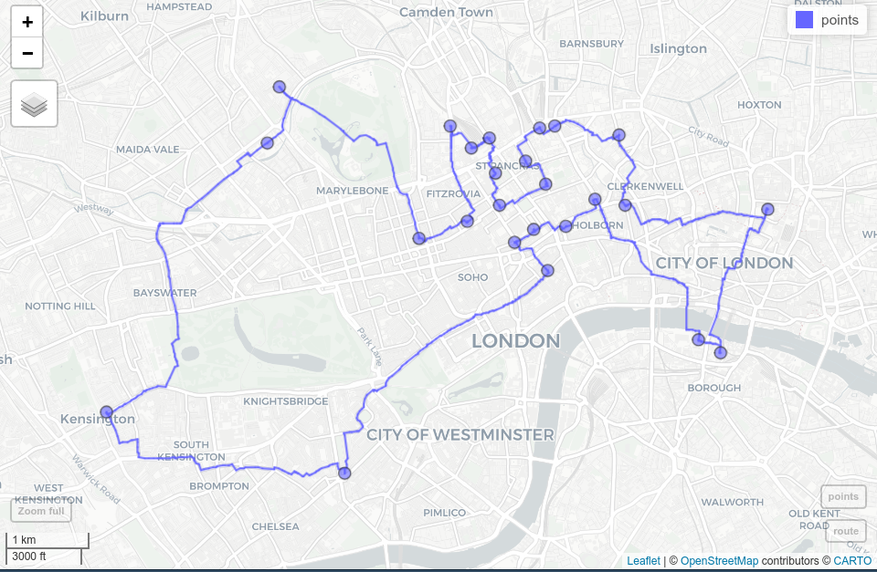

# Bridges to GIS software {#gis}

```{r, include=FALSE}
source("code/before_script.R")
```

## Prerequisites {-}

- This chapter requires QGIS\index{QGIS}, SAGA\index{SAGA} and GRASS GIS\index{GRASS GIS} to be installed and the following packages to be attached:

```{r 09-gis-1, message=FALSE,echo=FALSE}
library(sf)
library(terra)
```

```{r 09-gis-1-2, message=FALSE, eval=FALSE}
library(sf)
library(terra)
library(qgisprocess)
library(Rsagacmd)
library(rgrass)
library(rstac)
library(gdalcubes)
```

```{r 09-gis-1-3, echo=FALSE, message=FALSE}
# Only run code if qgis and relevant plugins are installed
has_qgis_plugins = 
  # make sure that qgisprocess is installed
  "qgisprocess" %in% installed.packages() &&
  # make sure that QGIS is available
  qgisprocess::has_qgis() &&
  # make sure that all required plugins are available
   all(qgisprocess::qgis_has_plugin(c("grassprovider", 
                                      "processing_saga_nextgen")))
```

## Introduction

A defining feature of [interpreted](https://en.wikipedia.org/wiki/Interpreter_(computing)) languages with an interactive console --- technically a read-eval-print loop (REPL) --- such as R is the way you interact with them:
rather than relying on pointing and clicking on different parts of a screen, you type commands into the console and execute them with the `Enter` key.
A common and effective workflow when using interactive development environments such as RStudio or VS Code is to type code into source files in a source editor and control interactive execution of the code with a shortcut such as `Ctrl+Enter`.

Command line interfaces (CLIs) are not unique to R: most early computing environments relied on a command line 'shell' and it was only after the invention and widespread adoption of the computer mouse in the 1990s that graphical user interfaces (GUIs)\index{graphical user interface} became common.
GRASS GIS the longest-standing continuously developed open source GIS\index{GIS} software, for example, relied on its CLI before it gained a GUI [@landa_new_2008].
Most popular GIS software projects are GUI-driven.
You *can* interact with QGIS\index{QGIS}, SAGA\index{SAGA}, GRASS GIS\index{GRASS GIS} and gvSIG from system terminals and embedded CLIs, but their design encourages most people to interact with them by 'pointing and clicking'.
An unintended consequence of this is that most GIS users miss out on the advantages of CLI-driven and scriptable approaches.
According to the creator of the popular QGIS software [@sherman_desktop_2008]:

> With the advent of 'modern' GIS software, most people want to point and click their way through life. That’s good, but there is a tremendous amount of flexibility and power waiting for you with the command line. Many times you can do something on the command line in a fraction of the time you can do it with a GUI.

The 'CLI vs GUI' debate does not have to be adversarial: both ways of working have advantages, depending on a range of factors including the task (with drawing new features being well suited to GUIs), the level of reproducibility desired, and the user's skillset.
GRASS GIS is a good example of GIS software that is primarily based on a CLI but which also has a prominent GUI.
Likewise, while R is focused on its CLI, IDEs such as RStudio provide a GUI for improving accessibility.
Software cannot be neatly categorized into CLI or GUI-based.
However, interactive command-line interfaces have several important advantages in terms of:

- Automating repetitive tasks
- Enabling transparency and reproducibility
- Encouraging software development by providing tools to modify existing functions and implement new ones
- Developing future-proof and efficient programming skills which are in high demand
- Improving touch typing, a key skill in the digital age

On the other hand, good GUIs\index{graphical user interface} also have advantages, including:

- 'Shallow' learning curves meaning geographic data can be explored and visualized without hours of learning a new language
- Support for 'digitizing' (creating new vector datasets), including trace, snap and topological tools^[The **mapedit** R package allows the quick editing of a few spatial features in a browser window opened from R but not professional, large-scale cartographic digitizing.]
- Enables georeferencing (matching raster images to existing maps) with ground control points and orthorectification
- Supports stereoscopic mapping (e.g., LiDAR and structure from motion)

Another advantage of dedicated GIS software projects is that they provide access to hundreds of 'geoalgorithms' via 'GIS bridges' [@neteler_open_2008].
Such bridges to these computational recipes for enhancing R's capabilities for solving geographic data problems are the topic of this chapter.

```{block2 09-gis-2, type="rmdnote"}
A command line interface is an environment for interacting with computer programs by typing and entering successive commands (command lines).
`bash` in Linux and `PowerShell` in Windows are well-known examples that allow the user to control almost any part of their operating system.
IDEs such as RStudio and VS Code provide code auto-completion and other features to improve the user experience when developing code.
```

R is a natural choice for people wanting to build bridges between reproducible data analysis workflows and GIS because it *originated* as an interface language.
A key feature of R (and its predecessor S) is that it provides access to statistical algorithms in other languages (particularly FORTRAN\index{FORTRAN} and C), but from a powerful high-level functional language with an intuitive REPL environment, which C and FORTRAN lacked [@chambers_extending_2016].
R continues this tradition with interfaces to numerous languages, notably C++\index{C++}.

Although R was not designed as a command line GIS, its ability to interface with dedicated GISs gives it astonishing geospatial capabilities.
With GIS bridges, R can replicate more diverse workflows, with the additional reproducibility, scalability and productivity benefits of controlling them from a programming environment and a consistent CLI.
Furthermore, R outperforms GISs in some areas of geocomputation\index{geocomputation}, including interactive/animated map-making (see Chapter \@ref(adv-map)) and spatial statistical modeling (see Chapter \@ref(spatial-cv)).

This chapter focuses on 'bridges' to three mature open source GIS products, summarized in Table \@ref(tab:gis-comp):

- QGIS\index{QGIS}, via the package **qgisprocess**\index{qgisprocess (package)} [@R-qgisprocess; Section \@ref(rqgis)]
- SAGA\index{SAGA}, via **Rsagacmd**\index{Rsagacmd (package)} [@R-Rsagacmd; Section \@ref(saga)]
- GRASS GIS\index{GRASS GIS}, via **rgrass**\index{rgrass (package)} [@R-rgrass; Section \@ref(grass)]

There have also been major developments in enabling open source GIS software to write and execute R scripts inside QGIS\index{QGIS} (see [docs.qgis.org](https://docs.qgis.org/3.28/en/docs/training_manual/processing/r_intro.html)) and GRASS GIS (see [grasswiki.osgeo.org](https://grasswiki.osgeo.org/wiki/R_statistics/rgrass#R_within_GRASS)).

```{r gis-comp, echo=FALSE, message=FALSE}
library(dplyr)
d = tibble(
  "GIS" = c("QGIS", "SAGA", "GRASS GIS"),
  "First Release" = c("2002", "2004", "1982"),
  "No. Functions" = c(">1000", ">600", ">500"),
  "Support" = c("hybrid", "hybrid", "hybrid")
)
knitr::kable(
  x = d,
  caption = paste(
    "Comparison between three open-source GIS.",
    "Hybrid refers to the support of vector and",
    "raster operations."
  ),
  caption.short = "Comparison between three open-source GIS.",
  booktabs = TRUE
) #|>
# kableExtra::add_footnote(label = "Comparing downloads of different providers is rather difficult (see http://spatialgalaxy.net/2011/12/19/qgis-users-around-the-world), and here also useless since every Windows QGIS download automatically also downloads SAGA and GRASS GIS.", notation = "alphabet")
```

In addition to the three R-GIS bridges mentioned above, this chapter also provides a brief introduction to R interfaces to spatial libraries (Section \@ref(gdal)), spatial databases\index{spatial database} (Section \@ref(postgis)), and cloud-based processing of Earth observation data (Section \@ref(cloud)).

## **qgisprocess**: a bridge to QGIS and beyond {#rqgis}

QGIS\index{QGIS} is the most popular open-source GIS (Table \@ref(tab:gis-comp); @graser_processing_2015). 
QGIS provides a unified interface to QGIS's native geoalgorithms, GDAL, and --- when they are installed --- from other *providers* such as GRASS GIS\index{GRASS GIS}, and SAGA\index{SAGA} [@graser_processing_2015]. 
Since version 3.14 (released in summer 2020), QGIS ships with the `qgis_process` command-line utility for accessing a bounty of functionality for geocomputation.
`qgis_process` provides access to 300+ geoalgorithms in the standard QGIS installation and 1,000+ via plugins to external providers such as GRASS GIS and SAGA.

The **qgisprocess** package\index{qgisprocess (package)} provides access to `qgis_process` from R.
The package requires QGIS --- and any other relevant plugins such as GRASS GIS and SAGA, used in this chapter --- to be installed and available to the system.
For installation instructions, see **qgisprocess**'s [documentation](https://r-spatial.github.io/qgisprocess/).

```{block2 qgisdocker, type='rmdnote'}
A quick way to get up-and-running with **qgisprocess** if you have Docker installed is via the `qgis` image developed as part of this project.
Assuming you have Docker installed and sufficient computational resources, you can run an R session with **qgisprocess** and relevant plugins with the following command (see the [geocompx/docker](https://github.com/geocompx/docker) repository for details):

`docker run -e DISABLE_AUTH=true -p 8786:8787 ghcr.io/geocompx/docker:qgis`

```

```{r, eval=FALSE}
library(qgisprocess)
#> Attempting to load the cache ... Success!
#> QGIS version: 3.30.3-'s-Hertogenbosch
#> ...
```

This package automatically tries to detect a QGIS installation and complains if it cannot find it.^[You can see details of the detection process with `qgis_configure()`.]
There are a few possible solutions when the configuration fails: you can set `options(qgisprocess.path = "path/to/your_qgis_process")`, or set up the `R_QGISPROCESS_PATH` environment variable.
The above approaches can also be used when you have more than one QGIS installation and want to decide which one to use.
For more details, please refer to the **qgisprocess** ['getting started' vignette](https://r-spatial.github.io/qgisprocess/articles/qgisprocess.html).
Next, we can find which plugins (meaning different software) are available on our computer:

```{r plugins, eval=FALSE}
qgis_plugins()
#> # A tibble: 4 × 2
#>   name                    enabled
#>   <chr>                   <lgl>
#> 1 grassprovider           FALSE
#> 2 otbprovider             FALSE
#> 3 processing              TRUE
#> 4 processing_saga_nextgen FALSE
```

This tells us that the GRASS GIS (`grassprovider`) and SAGA (`processing_saga_nextgen`) plugins are available on the system but are not yet enabled.
Since we need both later on in the chapter, let's enable them. 

```{r enable-providers, eval=FALSE}
qgis_enable_plugins(c("grassprovider", "processing_saga_nextgen"), 
                    quiet = TRUE)
```

Please note that aside from installing SAGA on your system, you also need to install the QGIS Python plugin Processing Saga NextGen.
You can do so from within QGIS with the [Plugin Manager](https://docs.qgis.org/latest/en/docs/training_manual/qgis_plugins/fetching_plugins.html) or programmatically with the help of the Python package [qgis-plugin-manager](https://github.com/3liz/qgis-plugin-manager) (at least on Linux).

`qgis_providers()` lists the name of the software and the corresponding count of available geoalgorithms.

```{r providers, eval=FALSE}
qgis_providers()
#> # A tibble: 7 × 3
#>   provider provider_title    algorithm_count
#>   <chr>    <chr>                       <int>
#> 1 gdal     GDAL                           56
#> 2 grass    GRASS                         306
#> 3 qgis     QGIS                           50
#> 4 3d       QGIS (3D)                       1
#> 5 native   QGIS (native c++)             243
#> 6 pdal     QGIS (PDAL)                    17
#> 7 sagang   SAGA Next Gen                 509
```

The output table affirms that we can use QGIS geoalgorithms (`native`, `qgis`, `3d`, `pdal`) and external ones from the third-party providers GDAL, SAGA and GRASS GIS through the QGIS interface.

Now, we are ready for some geocomputation with QGIS and friends, from within R!
Let's try two example case studies.
The first one shows how to unite two polygonal datasets with different borders\index{union} (Section \@ref(qgis-vector)).
The second one focuses on deriving new information from a digital elevation model represented as a raster (Section \@ref(qgis-raster)).

### Vector data {#qgis-vector}

Consider a situation when you have two polygon objects with different spatial units (e.g., regions, administrative units).
Our goal is to merge these two objects into one, containing all of the boundary lines and related attributes.
We use again the incongruent polygons\index{spatial congruence} we have already encountered in Section \@ref(incongruent) (Figure \@ref(fig:uniondata)).
Both polygon datasets are available in the **spData** package, and for both we would like to use a geographic CRS\index{CRS!geographic} (see also Chapter \@ref(reproj-geo-data)).

```{r 09-gis-4}
data("incongruent", "aggregating_zones", package = "spData")
incongr_wgs = st_transform(incongruent, "EPSG:4326")
aggzone_wgs = st_transform(aggregating_zones, "EPSG:4326")
```

```{r uniondata, echo=FALSE, fig.cap="Two areal units: incongruent (black lines) and aggregating zones (red borders).", fig.width=8}
#| message: FALSE
#| results: hide
library(tmap)
tm_shape(incongr_wgs) +
  tm_polygons(col = "grey5") +
  tm_shape(aggzone_wgs) +
  tm_borders(col_alpha = 0.5, col = "red") +
  tm_add_legend(type = "lines", labels = c("incongr_wgs", "aggzone_wgs"),
                col = c("grey5", "red"), lwd = 3, position = tm_pos_in("right", "top")) +
  tm_scalebar(position = c("left", "bottom"), breaks = c(0, 0.5, 1)) +
  tm_layout(frame = FALSE, legend.text.size = 1,
            inner.margins = c(0.02, 0.02, 0.03, 0.02))
```

The first step is to find an algorithm that can merge two vector objects.
To list all of the available algorithms, we can use the `qgis_algorithms()` function.
This function returns a data frame containing all of the available providers and the algorithms they contain.^[Therefore, if you cannot see an expected provider, it is probably because you still need to install some external GIS software.] 

```{r, eval=FALSE}
# output not shown
qgis_algorithms()
```

To find an algorithm, we can use the `qgis_search_algorithms()` function.
Assuming that the short description of the function contains the word "union"\index{union}, we can run the following code to find the algorithm of interest:

```{r, eval=FALSE}
qgis_search_algorithms("union")
#> # A tibble: 2 × 5
#>   provider provider_title    group          algorithm         algorithm_title 
#>   <chr>    <chr>             <chr>          <chr>             <chr>           
#> 1 native   QGIS (native c++) Vector overlay native:multiunion Union (multiple)
#> 2 native   QGIS (native c++) Vector overlay native:union      Union  
```

One of the algorithms on the above list, `"native:union"`, sounds promising.
The next step is to find out what this algorithm does and how we can use it.
This is the role of the `qgis_show_help()`, which returns a short summary of what the algorithm does, its arguments, and outputs.^[We can also extract some of information independently with `qgis_get_description()`, `qgis_get_argument_specs()`, and `qgis_get_output_specss()`.]
This makes its output rather long.
The following command returns a data frame with each row representing an argument required by `"native:union"` and columns with the name, description, type, default value, available values, and acceptable values associated with each:

```{r 09-gis-6, eval=FALSE, linewidth=80}
alg = "native:union"
union_arguments = qgis_get_argument_specs(alg)
union_arguments
#> # A tibble: 5 × 6
#>   name    description qgis_type default_value available_values acceptable_...
#>   <chr>   <chr>       <chr>     <list>        <list>           <list>           
#> 1 INPUT   Input layer source    <NULL>        <NULL>           <chr [1]>        
#> 2 OVERLAY Overlay la… source    <NULL>        <NULL>           <chr [1]>        
#> 3 OVERLA… Overlay fi… string    <NULL>        <NULL>           <chr [3]>        
#> 4 OUTPUT  Union       sink      <NULL>        <NULL>           <chr [1]>        
#> 5 GRID_S… Grid size   number    <NULL>        <NULL>           <chr [3]>  

#> [[1]]
#> [1] "A numeric value"                                                                                 
#> [2] "field:FIELD_NAME to use a data defined value taken from the FIELD_NAME
#>      field"                    
#> [3] "expression:SOME EXPRESSION to use a data defined value calculated using
#>      a custom QGIS expression"
```

The arguments, contained in `union_arguments$name`, are `INPUT`, `OVERLAY`, `OVERLAY_FIELDS_PREFIX`, and `OUTPUT`.
`union_arguments$acceptable_values` contains a list with the possible input values for each argument.
Many functions require inputs representing paths to a vector layer; **qgisprocess** functions accept `sf` objects for such arguments.
Objects from the **terra** and **stars** package can be used when a "path to a raster layer" is expected.
This can be very convenient, but we recommend providing the path to your spatial data on disk when you only read it in to submit it to a **qgisprocess** algorithm: the first thing **qgisprocess** does when executing a geoalgorithm is to export the spatial data living in your R session back to disk in a format known to QGIS such as .gpkg or .tif files.
This can increase algorithm runtimes.

The main function of **qgisprocess** is `qgis_run_algorithm()`, which sends inputs to QGIS and returns the outputs.
It accepts the algorithm name and a set of named arguments shown in the help list, and it performs expected calculations.
In our case, three arguments seem important: `INPUT`, `OVERLAY`, and `OUTPUT`.
The first one, `INPUT`, is our main vector object `incongr_wgs`, while the second one, `OVERLAY`, is `aggzone_wgs`.
The last argument, `OUTPUT`, is an output file name, which **qgisprocess** will automatically choose and create in `tempdir()` if none is provided.

```{r 09-gis-7, eval=FALSE}
union = qgis_run_algorithm(alg,
  INPUT = incongr_wgs, OVERLAY = aggzone_wgs
)
union
#>  $ OUTPUT: 'qgis_outputVector' chr "/tmp/...gpkg"
```

Running the above line of code will save our two input objects into temporary .gpkg files, run the selected algorithm on them, and return a temporary .gpkg file as the output.
The **qgisprocess** package stores the `qgis_run_algorithm()` result as a list containing, in this case, a path to the output file.
We can either read this file back into R with `read_sf()` (e.g., `union_sf = read_sf(union[[1]])`) or directly with `st_as_sf()`:

```{r, eval=FALSE}
union_sf = st_as_sf(union)
```

Note that the QGIS\index{QGIS} union\index{vector!union} operation merges the two input layers into one layer by using the intersection\index{vector!intersection} and the symmetrical difference of the two input layers (which, by the way, is also the default when doing a union operation in GRASS GIS\index{GRASS GIS} and SAGA\index{SAGA}).
This is **not** the same as `st_union(incongr_wgs, aggzone_wgs)` (see the Exercises)!

The result, `union_sf`, is a multipolygon with a larger number of features than two input objects.
Notice, however, that many of these polygons are small and do not represent real areas but are rather a result of our two datasets having a different level of detail.
These artifacts of error are called sliver polygons\index{sliver polygons} (see red-colored polygons in the left panel of Figure \@ref(fig:sliver)).
One way to identify slivers is to find polygons with comparatively very small areas, here, e.g., 25000 m^2^, and next remove them.
Let's search for an appropriate algorithm.

```{r, eval=FALSE}
qgis_search_algorithms("clean")
#> # A tibble: 1 × 5
#>   provider provider_title group        algorithm      algorithm_title
#>   <chr>    <chr>          <chr>        <chr>          <chr>
#> 1 grass   GRASS           Vector (v.*) grass:v.clean v.clean
```

This time the found algorithm, `v.clean`, is not included in QGIS, but GRASS GIS\index{GRASS GIS}.
GRASS GIS's `v.clean` is a powerful tool for cleaning topology of spatial vector data\index{topology cleaning}. 
Importantly, we can use it through **qgisprocess**.

```{block2 grass7, type='rmdnote'}
The GRASS GIS provider in QGIS was called `grass7` until QGIS version 3.34.
Thus, if you have an older QGIS version, you must prefix the algorithms with `grass7` instead of `grass`.
```

Similar to the previous step, we should start by looking at this algorithm's help.

```{r, eval=FALSE}
qgis_show_help("grass:v.clean")
```

We have omitted the output here, because the help text is quite long and contains a lot of arguments.^[Also note that these arguments, contrary to the QGIS's ones, are in lowercase.]
This is because `v.clean` is a multi-tool -- it can clean different types of geometries and solve different types of topological problems.
For this example, let's focus on just a few arguments, however, we encourage you to visit this [algorithm's documentation](https://grass.osgeo.org/grass-stable/manuals/v.clean.html) to learn more about `v.clean` capabilities.

```{r, eval=FALSE}
qgis_get_argument_specs("grass:v.clean") |>
  select(name, description) |>
  slice_head(n = 4)
#> # A tibble: 4 × 2
#>   name      description
#>   <chr>     <chr>
#> 1 input     Layer to clean
#> 2 type      Input feature type
#> 3 tool      Cleaning tool
#> 4 threshold Threshold (comma separated for each tool)
```

The main argument for this algorithm is `input` -- our vector object.
Next, we need to select a tool -- a cleaning method. ^[It is also possible to select several tools, which will then be executed sequentially.]
About a dozen tools exist in `v.clean` allowing to remove duplicate geometries, remove small angles between lines, or remove small areas, among others.
In this case, we are interested in the latter tool, `rmarea`.
Several of the tools, `rmarea` included, expect an additional argument `threshold`, whose behavior depends on the selected tool.
In our case, the `rmarea` tool removes all areas smaller or equal to a provided `threshold`. 
Note that the threshold must be specified in square meters regardless of the coordinate reference system of the input layer.

Let's run this algorithm and convert its output into a new `sf` object `clean_sf`.

```{r 09-gis-7c, eval=FALSE, message=FALSE}
clean = qgis_run_algorithm("grass:v.clean",
  input = union_sf, 
  tool = "rmarea", threshold = 25000
)
clean_sf = st_as_sf(clean)
```

The result, the right panel of Figure \@ref(fig:sliver), looks as expected -- sliver polygons are now removed.

```{r sliver, echo=FALSE, fig.cap="Sliver polygons colored in red (left panel). Cleaned polygons (right panel)."}
knitr::include_graphics("images/10-sliver.png")
```

### Raster data {#qgis-raster}

Digital elevation models (DEMs)\index{digital elevation model} contain elevation information for each raster cell.
They are used for many purposes, including satellite navigation, water flow models, surface analysis, or visualization.
Here, we are interested in deriving new information from a DEM raster that could be used as predictors for statistical learning.
Various terrain parameters can be helpful, for example, for the prediction of landslides (see Chapter \@ref(spatial-cv)).

For this section, we will use `dem.tif` -- a digital elevation model of the Mongón study area (downloaded from the Land Process Distributed Active Archive Center, see also `?dem.tif`).
It has a resolution of about 30 x 30 meters and uses a projected CRS.

```{r, eval=FALSE, message=FALSE}
library(qgisprocess)
library(terra)
dem = system.file("raster/dem.tif", package = "spDataLarge")
```

The **terra** package's `terrain()` command already allows the calculation of several fundamental topographic characteristics such as slope, aspect, TPI (*Topographic Position Index*), TRI (*Topographic Ruggedness Index*), roughness, and flow directions.
However, GIS programs offer many more terrain characteristics, some of which can be more suitable in certain contexts.
For example, the topographic wetness index (TWI)\index{topographic wetness index} was found useful in studying hydrological and biological processes [@sorensen_calculation_2006].
Let's search the algorithm list for this index using `"wetness"` as keyword.

```{r, eval=FALSE}
qgis_search_algorithms("wetness") |>
  dplyr::select(provider_title, algorithm) |>
  head(2)
#> # A tibble: 2 × 2
#>   provider_title algorithm
#>   <chr>          <chr>
#> 1 SAGA Next Gen  sagang:sagawetnessindex
#> 2 SAGA Next Gen  sagang:topographicwetnessindexonestep
```

An output of the above code suggests that the desired algorithm exists in the SAGA software\index{SAGA}.^[TWI can be also calculated using the `r.topidx` GRASS GIS function.]
Though SAGA is a hybrid GIS, its main focus has been on raster processing, and here, particularly on digital elevation models\index{digital elevation model} (soil properties, terrain attributes, climate parameters). 
Hence, SAGA is especially good at the fast processing of large (high-resolution) raster\index{raster} datasets [@conrad_system_2015].

The `"sagang:sagawetnessindex"` algorithm is actually a modified TWI, that results in a more realistic soil moisture potential for the cells located in valley floors [@bohner_spatial_2006].

```{r, eval=FALSE}
qgis_show_help("sagang:sagawetnessindex")
```

Here, we stick with the default values for all arguments.
Therefore, we only have to specify one argument -- the input `DEM`.
Of course, when applying this algorithm you should make sure that the parameter values are in correspondence with your study aim.^[The additional arguments of `"sagang:sagawetnessindex"` are well-explained at https://gis.stackexchange.com/a/323454/20955.]

Before running the SAGA algorithm from within QGIS, we change the default raster output format from `.tif` to SAGA's native raster format `.sdat`.
Hence, all output rasters that we do not specify ourselves will from now on be written to the `.sdat` format. 
Depending on the software versions (SAGA, GDAL) you are using, this might not be necessary, but often enough this will save you trouble when trying to read-in output rasters created with SAGA.

```{r, eval=FALSE}
options(qgisprocess.tmp_raster_ext = ".sdat")
dem_wetness = qgis_run_algorithm("sagang:sagawetnessindex",
  DEM = dem
)
```

`"sagang:sagawetnessindex"` returns not one but four rasters -- catchment area, catchment slope, modified catchment area, and topographic wetness index.
We can read a selected output by providing an output name in the `qgis_as_terra()` function.
And since we are done with the SAGA processing from within QGIS, we change the raster output format back to `.tif`.

```{r, eval=FALSE}
dem_wetness_twi = qgis_as_terra(dem_wetness$TWI)
# plot(dem_wetness_twi)
options(qgisprocess.tmp_raster_ext = ".tif")
```

You can see the TWI map in the left panel of Figure \@ref(fig:qgis-raster-map).
The topographic wetness index is unitless: its low values represent areas that will not accumulate water, while higher values show areas that will accumulate water at increasing levels.

Information from digital elevation models can also be categorized, for example, to geomorphons\index{geomorphons} -- the geomorphological phenotypes consisting of ten classes that represent terrain forms, such as slopes, ridges, or valleys [@jasiewicz_geomorphons_2013].
These phenotypes are used in many studies, including landslide susceptibility, ecosystem services, human mobility, and digital soil mapping. 

The original implementation of the geomorphons' algorithm was created in GRASS GIS, and we can find it in the **qgisprocess** list as `"grass:r.geomorphon"`:

```{r, eval=FALSE}
qgis_search_algorithms("geomorphon")
#> [1] "grass:r.geomorphon" "sagang:geomorphons" 
qgis_show_help("grass:r.geomorphon")
# output not shown
```

Calculation of geomorphons requires an input DEM (`elevation`) and can be customized with a set of optional arguments.
It includes, `search` -- a length for which the line-of-sight is calculated, and ``-m`` -- a flag specifying that the search value will be provided in meters (and not the number of cells).
More information about additional arguments can be found in the original paper and the [GRASS GIS documentation](https://grass.osgeo.org/grass-stable/manuals/r.geomorphon.html).

```{r, eval=FALSE}
dem_geomorph = qgis_run_algorithm("grass:r.geomorphon",
  elevation = dem,
  `-m` = TRUE, search = 120
)
```

Our output, `dem_geomorph$forms`, contains a raster file with ten categories -- each representing a terrain form.
We can read it into R with `qgis_as_terra()`, and then visualize it (Figure \@ref(fig:qgis-raster-map), right panel) or use it in our subsequent calculations.

```{r, eval=FALSE}
dem_geomorph_terra = qgis_as_terra(dem_geomorph$forms)
```

Interestingly, there are connections between some geomorphons and the TWI values, as shown in Figure \@ref(fig:qgis-raster-map).
The largest TWI values mostly occur in valleys and hollows, while the lowest values are seen, as expected, on ridges.

```{r qgis-raster-map, echo=FALSE, fig.cap="Topographic wetness index (TWI, left panel) and geomorphons (right panel) derived for the Mongón study area."}
knitr::include_graphics("images/10-qgis-raster-map.png")
```

## SAGA {#saga}

The System for Automated Geoscientific Analyses (SAGA\index{SAGA}; Table \@ref(tab:gis-comp)) provides the possibility to execute SAGA modules via the command-line interface\index{command line interface} (`saga_cmd.exe` under Windows and just `saga_cmd` under Linux) (see the [SAGA wiki on modules](https://sourceforge.net/p/saga-gis/wiki/Executing%20Modules%20with%20SAGA%20CMD/)).
In addition, there is a Python interface (SAGA Python API\index{API}).
**Rsagacmd**\index{Rsagacmd (package)} uses the former to run SAGA\index{SAGA} from within R.

We will use **Rsagacmd** in this section to delineate areas with similar values of the normalized difference vegetation index (NDVI) of the Mongón study area in Peru from September in the year 2000 (Figure \@ref(fig:sagasegments), left panel) by using a seeded region growing algorithm from SAGA\index{segmentation}.^[Read Section \@ref(local-operations) on details of how to calculate NDVI from a remote-sensing image.]

```{r, eval=FALSE}
ndvi = rast(system.file("raster/ndvi.tif", package = "spDataLarge"))
```

To start using **Rsagacmd**, we need to run the `saga_gis()` function.
It serves two main purposes: 

- It dynamically^[This means that the available libraries will depend on the installed SAGA version.] creates a new object that contains links to all valid SAGA libraries and tools
- It sets up general package options, such as `raster_backend` (R package to use for handling raster data), `vector_backend` (R package to use for handling vector data), and `cores` (a maximum number of CPU cores used for processing, default: all)

```{r, eval=FALSE}
library(Rsagacmd)
saga = saga_gis(raster_backend = "terra", vector_backend = "sf")
```

Our `saga` object contains connections to all of the available SAGA tools.
It is organized as a list of libraries (groups of tools), and inside of a library it has a list of tools.
We can access any tool with the `$` sign (remember to use TAB for autocompletion).

The seeded region growing algorithm works\index{segmentation!seeded region growing algorithm} in two main steps [@adams_seeded_1994;@bohner_image_2006].
First, initial cells ("seeds") are generated by finding the cells with the smallest variance in local windows of a specified size\index{autocorrelation!spatial}.
Second, the region growing algorithm is used to merge neighboring pixels of the seeds to create homogeneous areas.

```{r, eval=FALSE}
sg = saga$imagery_segmentation$seed_generation
```

In the above example, we first pointed to the `imagery_segmentation` library and then its `seed_generation` tool.
We also assigned it to the `sg` object, not to retype the whole tool code in our next steps.^[You can read more about the tool at https://saga-gis.sourceforge.io/saga_tool_doc/8.3.0/imagery_segmentation_2.html.]
If we just type `sg`, we will get a quick summary of the tool and a data frame with its parameters, descriptions, and defaults.
You may also use `tidy(sg)` to extract just the parameters' table.
The `seed_generation` tool takes a raster dataset as its first argument (`features`); optional arguments include `band_width` that specifies the size of initial polygons.

```{r, eval=FALSE}
ndvi_seeds = sg(ndvi, band_width = 2)
# plot(ndvi_seeds$seed_grid)
```

Our output is a list of three objects: `variance` -- a raster map of local variance, `seed_grid` -- a raster map with the generated seeds, and `seed_points` -- a spatial vector object with the generated seeds.

The second SAGA tool we use is `seeded_region_growing`.^[You can read more about the tool at https://saga-gis.sourceforge.io/saga_tool_doc/8.3.0/imagery_segmentation_3.html.]
The `seeded_region_growing` tool requires two inputs: our `seed_grid` calculated in the previous step and the `ndvi` raster object.
Additionally, we can specify several parameters, such as `normalize` to standardize the input features, `neighbour` (4- or 8-neighborhood), and `method`.
The last parameter can be set to either `0` or `1` (region growing is based on raster cells' values and their positions or just the values).
For a more detailed description of the method, see @bohner_image_2006.

Here, we will only change `method` to `1`, meaning that our output regions will be created only based on the similarity of their NDVI values.

```{r, eval=FALSE}
srg = saga$imagery_segmentation$seeded_region_growing
ndvi_srg = srg(ndvi_seeds$seed_grid, ndvi, method = 1)
plot(ndvi_srg$segments)
```

The tool returns a list of three objects: `segments`, `similarity`, `table`.
The `similarity` object is a raster showing similarity between the seeds and the other cells, and `table` is a data frame storing information about the input seeds.
Finally, `ndvi_srg$segments` is a raster with our resulting areas (Figure \@ref(fig:sagasegments), right panel).
We can convert it into polygons with `as.polygons()` and `st_as_sf()` (Section \@ref(spatial-vectorization)).

```{r, eval=FALSE}
ndvi_segments = ndvi_srg$segments |>
  as.polygons() |>
  st_as_sf()
```

```{r sagasegments, echo=FALSE, fig.cap="Normalized difference vegetation index (NDVI, left panel) and NDVI-based segments derived using the seeded region growing algorithm for the Mongón study area."}
knitr::include_graphics("images/10-saga-segments.png")
```

The resulting polygons (segments) represent areas with similar values. 
They can also be further aggregated into larger polygons using various techniques, such as clustering (e.g., *k*-means), regionalization (e.g., SKATER) or supervised classification methods.
You can try to do it in the Exercises.

R also has other tools to achieve the goal of creating polygons with similar values (so-called segments).
It includes the **SegOptim** package [@goncalves_segoptim_2019] that allows running several image segmentation algorithms and **supercells** package [@nowosad_extended_2022] that implements superpixels\index{segmentation!superpixels} algorithm SLIC to work with geospatial data.

## GRASS GIS {#grass}

The U.S. Army - Construction Engineering Research Laboratory (USA-CERL) created the core of the Geographical Resources Analysis Support System (GRASS GIS)\index{GRASS GIS} (Table \@ref(tab:gis-comp); @neteler_open_2008) from 1982 to 1995. 
Academia continued this work since 1997.
Similar to SAGA\index{SAGA}, GRASS GIS focused on raster processing in the beginning while, only later since GRASS GIS 6.0, adding advanced vector functionality [@bivand_applied_2013].

GRASS GIS stores the input data in an internal database.
With regard to vector data, GRASS GIS is by default a topological GIS, i.e., it only stores the geometry of adjacent features once.
SQLite is the default database driver for vector attribute management, and attributes are linked to the geometry, i.e., to the GRASS GIS database, via keys ([GRASS GIS vector management](https://grasswiki.osgeo.org/wiki/Vector_Database_Management#GRASS_GIS_vector_management_model)).

Before one can use GRASS GIS, one has to set up the GRASS GIS database\index{spatial database} (also from within R), and users might find this process a bit intimidating in the beginning.
First of all, the GRASS GIS database requires its own directory, which, in turn, contains a location (see the [GRASS GIS Database](https://grass.osgeo.org/grass-stable/manuals/grass_database.html) help pages at [grass.osgeo.org](https://grass.osgeo.org/grass-stable/manuals/index.html) for further information).
The location stores the geodata for one project or one area.
Within one location, several mapsets can exist that typically refer to different users or different tasks.
Each location also has a PERMANENT mapset -- a mandatory mapset that is created automatically.
In order to share geographic data with all users of a project, the database owner can add spatial data to the PERMANENT mapset.
In addition, the PERMANENT mapset stores the projection, the spatial extent and the default resolution for raster data.
So, to sum it all up -- the GRASS GIS database may contain many locations (all data in one location have the same CRS), and each location can store many mapsets (groups of datasets).
Please refer to @neteler_open_2008 and the [GRASS GIS quick start](https://grass.osgeo.org/grass-stable/manuals/helptext.html) for more information on the GRASS GIS spatial database\index{spatial database} system.
To quickly use GRASS GIS from within R, we will use the **link2GI** package, however, one can also set up the GRASS GIS database step-by-step.
See [GRASS within R](https://grasswiki.osgeo.org/wiki/R_statistics/rgrass#GRASS_within_R) for how to do so.
Please note that the code instructions in the following paragraphs might be hard to follow when using GRASS GIS for the first time but by running through the code line-by-line and by examining the intermediate results, the reasoning behind it should become even clearer.

Here, we introduce **rgrass**\index{rgrass (package)} with one of the most interesting problems in GIScience: the traveling salesman problem\index{traveling salesman}.
Suppose a traveling salesman would like to visit 24 customers.
Additionally, the salesman would like to start and finish the journey at home which makes a total of 25 locations while covering the shortest distance possible.
There is a single best solution to this problem; however, to check all of the possible solutions, it is (mostly) impossible for modern computers [@longley_geographic_2015].
In our case, the number of possible solutions correspond to `(25 - 1)! / 2`, i.e., the factorial of 24 divided by 2 (since we do not differentiate between forward or backward direction).
Even if one iteration can be done in a nanosecond, this still corresponds to `r format(factorial(25 - 1) / (2 * 10^9 * 3600 * 24 * 365))` years.
Luckily, there are clever, almost optimal solutions which run in a tiny fraction of this inconceivable amount of time.
GRASS GIS\index{GRASS GIS} provides one of these solutions (for more details, see [v.net.salesman](https://grass.osgeo.org/grass-stable/manuals/v.net.salesman.html)).
In our use case, we would like to find the shortest path\index{shortest route} between the first 25 bicycle stations (instead of customers) on London's streets (and we simply assume that the first bike station corresponds to the home of our traveling salesman\index{traveling salesman}).

```{r 09-gis-24}
data("cycle_hire", package = "spData")
points = cycle_hire[1:25, ]
```

Aside from the cycle hire points data, we need a street network for this area.
We can download it from OpenStreetMap\index{OpenStreetMap} with the help of the **osmdata** \index{osmdata (package)} package (see also Section \@ref(retrieving-data)).
To do this, we constrain the query of the street network (in OSM language called "highway") to the bounding box\index{bounding box} of `points`, and attach the corresponding data as an `sf`-object\index{sf}.
`osmdata_sf()` returns a list with several spatial objects (points, lines, polygons, etc.), but here, we only keep the line objects with their related ids.^[As a convenience to the reader, one can attach `london_streets` to the global environment using `data("london_streets", package = "spDataLarge")`.]

```{r 09-gis-25, eval=FALSE}
library(osmdata)
b_box = st_bbox(points)
london_streets = opq(b_box) |>
  add_osm_feature(key = "highway") |>
  osmdata_sf()
london_streets = london_streets[["osm_lines"]]
london_streets = select(london_streets, osm_id)
```

Now that we have the data, we can go on and initiate a GRASS GIS\index{GRASS GIS} session.
Luckily, `linkGRASS()` of the **link2GI** packages lets one set up the GRASS GIS environment with just one line of code.
The only thing you need to provide is a spatial object which determines the projection and the extent of the spatial database\index{spatial database}.
First, `linkGRASS()` finds all GRASS GIS\index{GRASS GIS} installations on your computer.
Since we have set `ver_select` to `TRUE`, we can interactively choose one of the found GRASS GIS-installations.
If there is just one installation, the `linkGRASS()` automatically chooses it.
Second, `linkGRASS()` establishes a connection to GRASS GIS.

```{r 09-gis-30, eval=FALSE}
library(rgrass)
link2GI::linkGRASS(london_streets, ver_select = TRUE)
```

Before we can use GRASS GIS geoalgorithms\index{geoalgorithm}, we also need to add data to GRASS GIS's spatial database\index{spatial database}.
Luckily, the convenience function `write_VECT()` does this for us.
(Use `write_RAST()` for raster data.)
In our case, we add the street and cycle hire point data while using only the first attribute column, and name them as `london_streets` and `points` in GRASS GIS.

```{r 09-gis-31, eval=FALSE}
write_VECT(terra::vect(london_streets), vname = "london_streets")
write_VECT(terra::vect(points[, 1]), vname = "points")
```

The **rgrass** package expects its inputs and gives its outputs as **terra** objects. 
Therefore, we need to convert our `sf` spatial vectors to **terra**'s `SpatVector`s using the `vect()` function to be able to use `write_VECT()`.^[You can learn more how to convert between spatial classes in R by reading the (Conversions between different spatial classes in R)[https://geocompx.org/post/2021/spatial-classes-conversion/] blog post and the 
(Coercion between object formats)[https://CRAN.R-project.org/package=rgrass/vignettes/coerce.html] vignette.] 

Now, both datasets exist in the GRASS GIS database.
To perform our network\index{network} analysis, we need a topologically clean street network\index{topology cleaning}.
GRASS GIS's `"v.clean"` takes care of the removal of duplicates, small angles and dangles, among others.
Here, we break lines at each intersection to ensure that the subsequent routing algorithm can actually turn right or left at an intersection, and save the output in a GRASS GIS object named `streets_clean`.

```{r 09-gis-32, eval=FALSE}
execGRASS(
  cmd = "v.clean", input = "london_streets", output = "streets_clean",
  tool = "break", flags = "overwrite"
)
```

```{block2 06-raster-vector-22, type='rmdnote'}
To learn about the possible arguments and flags of the GRASS GIS modules, you can use the `help` flag.
For example, try `execGRASS("g.region", flags = "help")`.
```

It is likely that a few of our cycling station points will not lie exactly on a street segment.
However, to find the shortest route\index{shortest route} between them, we need to connect them to the nearest streets segment.
`"v.net"`'s connect-operator does exactly this.
We save its output in `streets_points_con`.

```{r 09-gis-32b, eval=FALSE}
execGRASS(
  cmd = "v.net", input = "streets_clean", output = "streets_points_con",
  points = "points", operation = "connect", threshold = 0.001,
  flags = c("overwrite", "c")
)
```

The resulting clean dataset serves as input for the `"v.net.salesman"` algorithm, which finally finds the shortest route between all cycle hire stations.
One of its arguments is `center_cats`, which requires a numeric range as input.
This range represents the points for which a shortest route should be calculated.
Since we would like to calculate the route for all cycle stations, we set it to `1-25`.
To access the GRASS GIS help page of the traveling salesman\index{traveling salesman} algorithm\index{algorithm}, run `execGRASS("g.manual", entry = "v.net.salesman")`.

```{r 09-gis-33, eval=FALSE}
execGRASS(
  cmd = "v.net.salesman", input = "streets_points_con",
  output = "shortest_route", center_cats = paste0("1-", nrow(points)),
  flags = "overwrite"
)
```

To see our result, we read the result into R, convert it into an `sf`-object keeping only the geometry, and visualize it with the help of the **mapview** package (Figure \@ref(fig:grass-mapview) and Section \@ref(interactive-maps)).

```{r 09-gis-34, eval=FALSE}
route = read_VECT("shortest_route") |>
  st_as_sf() |>
  st_geometry()
mapview::mapview(route) + points
```

```{r grass-mapview, fig.cap="Shortest route (blue line) between 24 cycle hire stations (blue dots) on the OSM street network of London.", fig.scap="Shortest route between 24 cycle hire stations.", echo=FALSE, out.width="80%"}

```

```{r 09-gis-35, eval=FALSE, echo=FALSE}
library(mapview)
m_1 = mapview(route) + points
mapview::mapshot(m_1,
  file = file.path(getwd(), "images/09_shortest_route.png"),
  remove_controls = c(
    "homeButton", "layersControl",
    "zoomControl"
  )
)
```

There are a few important considerations to note in the process:

- We could have used GRASS GIS's spatial database\index{spatial database} which allows faster processing.
That means we have only exported geographic data at the beginning.
Then we created new objects but only imported the final result back into R.
To find out which datasets are currently available, run `execGRASS("g.list", type = "vector,raster", flags = "p")`.
- We could have also accessed an already existing GRASS GIS spatial database from within R.
Prior to importing data into R, you might want to perform some (spatial) subsetting\index{vector!subsetting}.
Use `"v.select"` and `"v.extract"` for vector data.
`"db.select"` lets you select subsets of the attribute table of a vector layer without returning the corresponding geometry.
- You can also start R from within a running GRASS GIS\index{GRASS GIS} session [for more information, please refer to @bivand_applied_2013].
- Refer to the excellent [GRASS GIS online help](https://grass.osgeo.org/grass-stable/manuals/) or `execGRASS("g.manual", flags = "i")` for more information on each available GRASS GIS geoalgorithm\index{geoalgorithm}.

## When to use what?

To recommend a single R-GIS interface is hard since the usage depends on personal preferences, the tasks at hand, and your familiarity with different GIS\index{GIS} software packages which in turn probably depends on your domain.
As mentioned previously, SAGA\index{SAGA} is especially good at the fast processing of large (high-resolution) raster\index{raster} datasets and frequently used by hydrologists, climatologists and soil scientists [@conrad_system_2015].
GRASS GIS\index{GRASS GIS}, on the other hand, is the only GIS presented here supporting a topologically based spatial database which is especially useful for network analyses but also simulation studies.
QGISS\index{QGIS} is much more user-friendly compared to GRASS GIS and SAGA, especially for first-time GIS users, and probably the most popular open-source GIS.
Therefore, **qgisprocess**\index{qgisprocess (package)} is an appropriate choice for most use cases.
Its main advantages are:

- A unified access to several GIS, and therefore the provision of >1000 geoalgorithms (Table \@ref(tab:gis-comp)) including duplicated functionality, e.g., you can perform overlay-operations using QGIS-\index{QGIS}, SAGA-\index{SAGA} or GRASS GIS-geoalgorithms\index{GRASS GIS}
- Automatic data format conversions (SAGA uses `.sdat` grid files and GRASS GIS uses its own database format, but QGIS will handle the corresponding conversions)
- Its automatic passing of geographic R objects to QGIS geoalgorithms\index{geoalgorithm} and back into R
- Convenience functions to support named arguments and automatic default value retrieval (as inspired by **rgrass**\index{rgrass (package)})

By all means, there are use cases when you certainly should use one of the other R-GIS bridges.
Though QGIS is the only GIS providing a unified interface to several GIS\index{GIS} software packages, it only provides access to a subset of the corresponding third-party geoalgorithms (for more information, please refer to @muenchow_rqgis:_2017).
Therefore, to use the complete set of SAGA and GRASS GIS functions, stick with **Rsagacmd**\index{Rsagacmd (package)} and **rgrass**. 
In addition, if you would like to run simulations with the help of a geodatabase\index{spatial database} [@krug_clearing_2010], use **rgrass** directly since **qgisprocess** always starts a new GRASS GIS session for each call.
Finally, if you need topological correct data and/or spatial database management functionality such as multi-user access, we recommend the usage of GRASS GIS. 

Please note that there are a number of further GIS software packages that have a scripting interface but for which there is no dedicated R package that accesses these: gvSig, OpenJump, and the Orfeo Toolbox.^[Please note that **link2GI** provides a partial integration with the Orfeo Toolbox\index{Orfeo Toolbox} and that you can also access the Orfeo Toolbox geoalgorithms via **qgisprocess**. Note also that TauDEM\index{TauDEM} can be accessed from R with package **traudem**.]

## Bridges to GDAL {#gdal}

As discussed in Chapter \@ref(read-write), GDAL\index{GDAL} is a low-level library that supports many geographic data formats.
GDAL is so effective that most GIS programs use GDAL\index{GDAL} in the background for importing and exporting geographic data, rather than reinventing the wheel and using bespoke read-write code.
But GDAL\index{GDAL} offers more than data I/O.
It has [geoprocessing tools](https://gdal.org/programs/index.html) for vector and raster data, functionality to create [tiles](https://gdal.org/programs/gdal2tiles.html#gdal2tiles) for serving raster data online, and rapid [rasterization](https://gdal.org/programs/gdal_rasterize.html#gdal-rasterize) of vector data.
Since GDAL is a command-line tool, all its commands can be accessed from within R via the `system()` command.

The code chunk below demonstrates this functionality:
`linkGDAL()` searches the computer for a working GDAL\index{GDAL} installation and adds the location of the executable files to the PATH variable, allowing GDAL to be called (usually only needed under Windows).

```{r, eval=FALSE}
link2GI::linkGDAL()
```

Now we can use the `system()` function to call any of the GDAL tools.
For example, `ogrinfo` provides metadata of a vector dataset.
Here we will call this tool with two additional flags: `-al` to list all features of all layers and `-so` to get a summary only (and not a complete geometry list):

```{r 09-gis-36, eval=FALSE, message=FALSE}
our_filepath = system.file("shapes/world.gpkg", package = "spData")
cmd = paste("ogrinfo -al -so", our_filepath)
system(cmd)
#> INFO: Open of `.../spData/shapes/world.gpkg'
#>       using driver `GPKG' successful.
#>
#> Layer name: world
#> Geometry: Multi Polygon
#> Feature Count: 177
#> Extent: (-180.000000, -89.900000) - (179.999990, 83.645130)
#> Layer SRS WKT:
#> ...
```

Other commonly used GDAL tools include:

- `gdalinfo`: provides metadata of a raster dataset
- `gdal_translate`: converts between different raster file formats
- `ogr2ogr`: converts between different vector file formats
- `gdalwarp`: reprojects, transforms, and clips raster datasets
- `gdaltransform`: transforms coordinates

Visit https://gdal.org/programs/ to see the complete list of GDAL tools and to read their help files.

The 'link' to GDAL provided by **link2GI** could be used as a foundation for doing more advanced GDAL work from the R or system CLI.
TauDEM (https://hydrology.usu.edu/taudem/) and the Orfeo Toolbox (https://www.orfeo-toolbox.org/) are other spatial data processing libraries/programs offering a command-line interface -- the above example shows how to access these libraries from the system command line via R.
This in turn could be the starting point for creating a proper interface to these libraries in the form of new R packages.

Before diving into a project to create a new bridge, however, it is important to be aware of the power of existing R packages and that `system()` calls may not be platform-independent (they may fail on some computers).
On the other hand, **sf** and **terra** brings most of the power provided by GDAL\index{GDAL}, GEOS\index{GEOS} and PROJ\index{PROJ} to R via the R/C++\index{C++} interface provided by **Rcpp**, which avoids `system()` calls.^[There are also **vapour** and **gdalraster** that provide low-level interfaces to GDAL\index{GDAL}.]

## Bridges to spatial databases {#postgis}

\index{spatial database}
Spatial database management systems (spatial DBMSs) store spatial and non-spatial data in a structured way.
They can organize large collections of data into related tables (entities) via unique identifiers (primary and foreign keys) and implicitly via space (think for instance of a spatial join). 
This is useful because geographic datasets tend to become big and messy quite quickly.
Databases enable storing and querying large datasets efficiently based on spatial and non-spatial fields, and provide multi-user access and topology\index{topological relations} support.

The most important open source spatial database\index{spatial database} is PostGIS\index{PostGIS} [@obe_postgis_2015].^[
SQLite/SpatiaLite are certainly also important, but implicitly we have already introduced this approach since GRASS GIS\index{GRASS GIS} is using SQLite in the background (see Section \@ref(grass)).
]
R bridges to spatial DBMSs such as PostGIS\index{PostGIS} are important, allowing access to huge data stores without loading several gigabytes of geographic data into RAM, and likely crashing the R session.
The remainder of this section shows how PostGIS can be called from R, based on "Hello real-world" from *PostGIS in Action, Second Edition* [@obe_postgis_2015].^[
Thanks to Manning Publications, Regina Obe and Leo Hsu for permission to use this example.
]

The subsequent code requires a working internet connection, since we are accessing a PostgreSQL/PostGIS\index{PostGIS} database which is living in the QGIS Cloud (https://qgiscloud.com/).^[
QGIS\index{QGIS} Cloud lets you store geographic data and maps in the cloud. 
In the background, it uses QGIS Server and PostgreSQL/PostGIS.
This way, the reader can follow the PostGIS example without the need to have PostgreSQL/PostGIS installed on a local machine.
Thanks to the QGIS Cloud team for hosting this example.
]
Our first step here is to create a connection to a database by providing its name, host name, and user information.

```{r 09-gis-37, eval=FALSE}
library(RPostgreSQL)
conn = dbConnect(
  drv = PostgreSQL(),
  dbname = "rtafdf_zljbqm", host = "db.qgiscloud.com",
  port = "5432", user = "rtafdf_zljbqm", password = "d3290ead"
)
```

Our new object, `conn`, is just an established link between our R session and the database.
It does not store any data.

Often the first question is, 'which tables can be found in the database?'.
This can be answered with `dbListTables()` as follows:

```{r 09-gis-38, eval=FALSE}
dbListTables(conn)
#> [1] "spatial_ref_sys" "topology"        "layer"           "restaurants"
#> [5] "highways"
```

The answer is five tables.
Here, we are only interested in the `restaurants` and the `highways` tables.
The former represents the locations of fast-food restaurants in the US, and the latter are principal US highways.
To find out about attributes available in a table, we can run `dbListFields`:

```{r 09-gis-39, eval=FALSE}
dbListFields(conn, "highways")
#> [1] "qc_id"        "wkb_geometry" "gid"          "feature"
#> [5] "name"         "state"
```

Now, as we know the available datasets, we can perform some queries -- ask the database some questions.
The query needs to be provided in a language understandable by the database -- usually, it is SQL.
The first query will select `US Route 1` in the state of Maryland (`MD`) from the `highways` table.
Note that `read_sf()` allows us to read geographic data from a database if it is provided with an open connection to a database and a query.
Additionally, `read_sf()` needs to know which column represents the geometry (here: `wkb_geometry`).

```{r 09-gis-40, eval=FALSE}
query = paste(
  "SELECT *",
  "FROM highways",
  "WHERE name = 'US Route 1' AND state = 'MD';"
)
us_route = read_sf(conn, query = query, geom = "wkb_geometry")
```

This results in an **sf**-object\index{sf} named `us_route` of type `MULTILINESTRING`.

As we mentioned before, it is also possible to not only ask non-spatial questions, but also query datasets based on their spatial properties.
To show this, the next example adds a 35-kilometer (35,000 m) buffer around the selected highway (Figure \@ref(fig:postgis)).

```{r 09-gis-41, eval=FALSE}
query = paste(
  "SELECT ST_Union(ST_Buffer(wkb_geometry, 35000))::geometry",
  "FROM highways",
  "WHERE name = 'US Route 1' AND state = 'MD';"
)
buf = read_sf(conn, query = query)
```

Note that this was a spatial query using functions (`ST_Union()`\index{vector!union}, `ST_Buffer()`\index{vector!buffers}) you should be already familiar with.
You find them also in the **sf**-package, though here they are written in lowercase characters (`st_union()`, `st_buffer()`).
In fact, function names of the **sf** package largely follow the PostGIS\index{PostGIS} naming conventions.^[
The prefix `st` stands for space/time.
]

The last query will find all Hardee's restaurants (`HDE`) within the 35-km buffer zone (Figure \@ref(fig:postgis)).

```{r 09-gis-42, eval=FALSE, warning=FALSE}
query = paste(
  "SELECT *",
  "FROM restaurants r",
  "WHERE EXISTS (",
  "SELECT gid",
  "FROM highways",
  "WHERE",
  "ST_DWithin(r.wkb_geometry, wkb_geometry, 35000) AND",
  "name = 'US Route 1' AND",
  "state = 'MD' AND",
  "r.franchise = 'HDE');"
)
hardees = read_sf(conn, query = query)
```

Please refer to @obe_postgis_2015 for a detailed explanation of the spatial SQL query.
Finally, it is good practice to close the database connection as follows:^[
It is important to close the connection here because QGIS Cloud (free version) allows only ten concurrent connections.
]

```{r 09-gis-43, eval=FALSE}
RPostgreSQL::postgresqlCloseConnection(conn)
```

```{r 09-gis-44, echo=FALSE}
load("extdata/postgis_data.Rdata")
```

```{r postgis, echo=FALSE, fig.cap="Visualization of the output of previous PostGIS commands showing the highway (black line), a buffer (light yellow) and four restaurants (red points) within the buffer.", fig.scap="Visualization of the output of previous PostGIS commands."}
library(tmap)
tm_shape(buf) +
  tm_polygons(fill = "#FFFDD0", col_alpha = 0.3) +
  tm_shape(us_route) +
  tm_lines(col = "black", lwd = 3) +
  tm_shape(hardees) +
  tm_symbols(fill = "#F10C26") +
  tm_add_legend(type = "lines", col = "black", lwd = 3,
                labels = "The US Route 1 highway") +
  tm_add_legend(type = "polygons", fill = "#FFFDD0",
                border.alpha = 0.3, labels = "35km buffer") +
  tm_add_legend(type = "symbols", fill = "#F10C26",
                labels = "Restaurants", shape = 21) +
  tm_scalebar() + 
  tm_layout(frame = FALSE)
```

Unlike PostGIS, **sf** only supports spatial vector data. 
To query and manipulate raster data stored in a PostGIS database, use the **rpostgis** package [@bucklin_rpostgis_2018] and/or use command line tools such as `rastertopgsql` which comes as part of the PostGIS\index{PostGIS} installation. 

This subsection is only a brief introduction to PostgreSQL/PostGIS.
Nevertheless, we would like to encourage the practice of storing geographic and non-geographic data in a spatial DBMS\index{spatial database} while only attaching those subsets to R's global environment which are needed for further (geo-)statistical analysis.
Please refer to @obe_postgis_2015 for a more detailed description of the SQL queries presented and a more comprehensive introduction to PostgreSQL/PostGIS in general.
PostgreSQL/PostGIS is a formidable choice as an open-source spatial database.
But the same is true for the lightweight SQLite/SpatiaLite database engine and GRASS GIS\index{GRASS GIS} which uses SQLite in the background (see Section \@ref(grass)).

If your datasets are too big for PostgreSQL/PostGIS and you require massive spatial data management and query performance, it may be worth exploring large-scale geographic querying on distributed computing systems.
Such systems are outside the scope of this book, but it is worth mentioning that open source software providing this functionality exists.
Prominent projects in this space include [GeoMesa](http://www.geomesa.org/) and [Apache Sedona](https://sedona.apache.org/).
The [**apache.sedona**](https://cran.r-project.org/package=apache.sedona) package provides an interface to the latter.

## Bridges to cloud technologies and services {#cloud}

In recent years, cloud technologies have become more and more prominent on the internet. 
This also includes their use to store and process spatial data.
Major cloud computing providers (Amazon Web Services, Microsoft Azure / Planetary Computer, Google Cloud Platform, and others)\index{cloud computing} offer vast catalogs of open Earth observation data, such as the complete Sentinel-2\index{Sentinel-2} archive, on their platforms. 
We can use R and directly connect to and process data from these archives, ideally from a machine in the same cloud and region.

Three promising developments that make working with such image archives on cloud platforms _easier_ and _more efficient_ are the [SpatioTemporal Asset Catalog (STAC)](https://stacspec.org)\index{STAC}, the [cloud-optimized GeoTIFF (COG)](https://www.cogeo.org/)\index{COG} image file format, and the concept of data cubes\index{data cube}. 
Section \@ref(staccog) introduces these individual developments and briefly describes how they can be used from R.

Besides hosting large data archives, numerous cloud-based services\index{cloud computing} to process Earth observation data have been launched during the last few years.
It includes the OpenEO initiative\index{OpenEO} -- a unified interface between programming languages (including R) and various cloud-based services.
You can find more information about OpenEO in Section \@ref(openeo).

### STAC, COGs, and data cubes in the cloud {#staccog}

The SpatioTemporal Asset Catalog (STAC)\index{STAC} is a general description format for spatiotemporal data that is used to describe a variety of datasets on cloud platforms including imagery, synthetic aperture radar (SAR) data, and point clouds. 
Besides simple static catalog descriptions, STAC-API presents a web service to query items (e.g., images) of catalogs by space, time, and other properties. 
In R, the **rstac** package\index{rstac (package)}  [@simoes_rstac_2021] allows to connect to STAC-API endpoints and search for items. 
In the example below, we request all images from the [Sentinel-2 Cloud-Optimized GeoTIFF (COG) dataset on Amazon Web Services](https://registry.opendata.aws/sentinel-2-l2a-cogs)\index{COG} that intersect with a predefined area and time of interest. 
The result contains all found images and their metadata (e.g., cloud cover) and URLs pointing to actual files on AWS. 

```{r 09-stac-example, eval=FALSE}
library(rstac)
# Connect to the STAC-API endpoint for Sentinel-2 data
# and search for images intersecting our AOI
s = stac("https://earth-search.aws.element84.com/v0")
items = s |>
  stac_search(collections = "sentinel-s2-l2a-cogs",
              bbox = c(7.1, 51.8, 7.2, 52.8),
              datetime = "2020-01-01/2020-12-31") |>
  post_request() |>
  items_fetch()
```

Cloud storage differs from local hard disks and traditional image file formats do not perform well in cloud-based geoprocessing.
Cloud-optimized GeoTIFF\index{COG} makes reading rectangular subsets of an image or reading images at lower resolution much more efficient. 
As an R user, you do not have to install anything to work with COGs because [GDAL](https://gdal.org)\index{GDAL} (and any package using it) can already work with COGs. 
However, keep in mind that the availability of COGs is a big plus while browsing through catalogs of data providers.

For larger areas of interest, requested images are still relatively difficult to work with: they may use different map projections, may spatially overlap, and their spatial resolution often depends on the spectral band. 
The **gdalcubes** package\index{gdalcubes (package)} [@appel_gdalcubes_2019] can be used to abstract from individual images and to create and process image collections as four-dimensional data cubes\index{data cube}.

The code below shows a minimal example to create a lower resolution (250 m) maximum NDVI composite from the Sentinel-2 images returned by the previous STAC-API search.

```{r 09-gdalcubes-example, eval=FALSE}
library(gdalcubes)
# Filter images by cloud cover and create an image collection object
cloud_filter = function(x) {
    x[["eo:cloud_cover"]] < 10
}
collection = stac_image_collection(items$features, 
                                   property_filter = cloud_filter)
# Define extent, resolution (250m, daily) and CRS of the target data cube
v = cube_view(srs = "EPSG:3857", extent = collection, dx = 250, dy = 250,
              dt = "P1D") # "P1D" is an ISO 8601 duration string
# Create and process the data cube
cube = raster_cube(collection, v) |>
  select_bands(c("B04", "B08")) |>
  apply_pixel("(B08-B04)/(B08+B04)", "NDVI") |>
  reduce_time("max(NDVI)")
# gdalcubes_options(parallel = 8)
# plot(cube, zlim = c(0, 1))
```

To filter images by cloud cover, we provide a property filter function that is applied on each STAC\index{STAC} result item while creating the image collection. 
The function receives available metadata of an image as input list and returns a single logical value such that only images for which the function yields TRUE will be considered. 
In this case, we ignore images with 10% or more cloud cover. 
For more details, please refer to this [tutorial presented at OpenGeoHub summer school 2021](https://appelmar.github.io/ogh2021/tutorial.html).^[Another tool for working with STAC\index{STAC} data in R is the **rsi** package that allows to get spatial data from STAC for a given time and location.]

The combination of STAC\index{STAC}, COGs\index{COG}, and data cubes\index{data cube} forms a cloud-native workflow to analyze (large) collections of satellite imagery in the cloud\index{cloud computing}. 
These tools already form a backbone, for example, of the **sits** package\index{sits (package)}, which allows land use and land cover classification of big Earth observation data in R.
The package builds EO data cubes from image collections available in cloud services and performs land classification of data cubes using various machine and deep learning algorithms.
For more information about **sits**, visit https://e-sensing.github.io/sitsbook/ or read the related article [@rs13132428].

### openEO

OpenEO [@schramm_openeo_2021]\index{OpenEO} is an initiative to support interoperability among cloud services by defining a common language for processing the data. 
The initial idea has been described in an [r-spatial.org blog post](https://r-spatial.org/2016/11/29/openeo.html) and aims at making it possible for users to change between cloud services easily with as little code changes as possible. 
The [standardized processes](https://processes.openeo.org) use a multidimensional data cube model\index{data cube} as an interface to the data. 
Implementations are available for eight different backends (see https://hub.openeo.org) to which users can connect with R, Python, JavaScript, QGIS, or a web editor and define (and chain) processes on collections. 
Since the functionality and data availability differs among the backends, the **openeo** R package [@lahn_openeo_2021] dynamically loads available processes and collections from the connected backend. 
Afterwards, users can load image collections, apply and chain processes, submit jobs, and explore and plot results. 

The following code will connect to the [openEO platform backend](https://openeo.cloud/), request available datasets, processes, and output formats, define a process graph to compute a maximum NDVI image from Sentinel-2 data, and finally execute the graph after logging in to the backend. 
The openEO\index{OpenEO} platform backend includes a free tier, and registration is possible from existing institutional or internet platform accounts. 

```{r 09-openeo-example, eval=FALSE}
library(openeo)
con = connect(host = "https://openeo.cloud")
p = processes() # load available processes
collections = list_collections() # load available collections
formats = list_file_formats() # load available output formats
# Load Sentinel-2 collection
s2 = p$load_collection(id = "SENTINEL2_L2A",
                       spatial_extent = list(west = 7.5, east = 8.5,
                                             north = 51.1, south = 50.1),
                       temporal_extent = list("2021-01-01", "2021-01-31"),
                       bands = list("B04", "B08"))
# Compute NDVI vegetation index
compute_ndvi = p$reduce_dimension(data = s2, dimension = "bands",
                                  reducer = function(data, context) {
                                      (data[2] - data[1]) / (data[2] + data[1])
                                  })
# Compute maximum over time
reduce_max = p$reduce_dimension(data = compute_ndvi, dimension = "t",
                                reducer = function(x, y) {
                                    max(x)
                                })
# Export as GeoTIFF
result = p$save_result(reduce_max, formats$output$GTiff)
# Login, see https://docs.openeo.cloud/getting-started/r/#authentication
login(login_type = "oidc", provider = "egi", 
      config = list(client_id = "...", secret = "..."))
# Execute processes
compute_result(graph = result, output_file = tempfile(fileext = ".tif"))
```

## Exercises

```{r, echo=FALSE, results='asis'}
res = knitr::knit_child("_10-ex.Rmd",
  quiet = TRUE,
  options = list(include = FALSE, eval = FALSE)
)
cat(res, sep = "\n")
```
