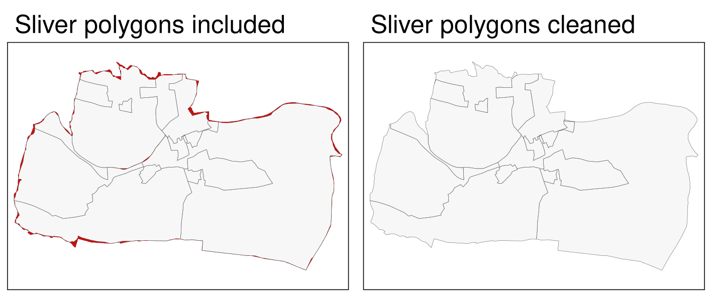
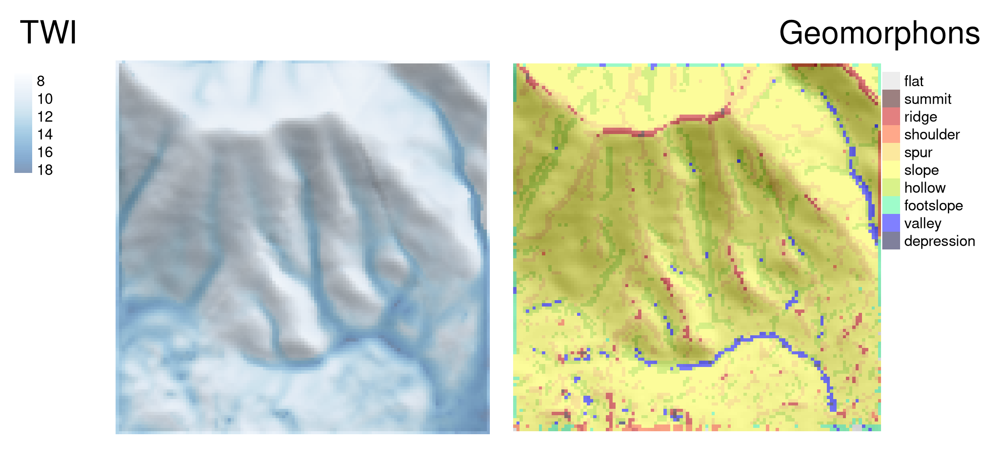

# Bridges to GIS software {#gis}

## Prerequisites {-}

- This chapter requires QGIS\index{QGIS}, SAGA\index{SAGA} and GRASS\index{GRASS} to be installed and the following packages to be attached:

```{r 09-gis-1, message=FALSE}
library(sf)
library(terra)
```

```{r 09-gis-1-2, message=FALSE, eval=FALSE}
# remotes::install_github("paleolimbot/qgisprocess")
library(qgisprocess)
library(Rsagacmd)
library(rgrass7)
```

<!-- RSAGA is no longer under active development and no support is available. Try Rsagacmd. -->
<!-- https://github.com/r-spatial/RSAGA -->
<!-- https://github.com/stevenpawley/Rsagacmd -->

<!-- issue of rgrass -->
<!-- https://github.com/rsbivand/rgrass -->

## Introduction

A defining feature of R is the way you interact with it:
you type commands and hit `Enter` (or `Ctrl+Enter` if writing code in the source editor in RStudio\index{RStudio}) to execute them interactively.
This way of interacting with the computer is called a command-line interface (CLI)\index{command-line interface} (see definition in the note below).
CLIs are not unique to R.^[
Other 'command-lines' include terminals for interacting with the operating system and other interpreted languages such as Python.
Many GISs originated as a CLI:
it was only after the widespread uptake of computer mice and high-resolution screens in the 1990s that GUIs\index{graphical user interface} became common.
GRASS, one of the longest-standing GIS\index{GIS} programs, for example, relied primarily on command-line interaction before it gained a sophisticated GUI [@landa_new_2008].
]
In dedicated GIS\index{GIS} packages, by contrast, the emphasis tends to be on the graphical user interface (GUI)\index{graphical user interface}.
You *can* interact with GRASS\index{GRASS}, QGIS\index{QGIS}, SAGA\index{SAGA} and gvSIG from system terminals and embedded CLIs\index{command-line interface}, but 'pointing and clicking' is the norm.
This means many GIS\index{GIS} users miss out on the advantages of the command-line according to Gary Sherman, creator of QGIS\index{QGIS} [@sherman_desktop_2008]:

> With the advent of 'modern' GIS software, most people want to point and
click their way through life. That’s good, but there is a tremendous amount
of flexibility and power waiting for you with the command line. Many times
you can do something on the command line in a fraction of the time you
can do it with a GUI.

The 'CLI vs GUI'\index{graphical user interface} debate can be adversial but it does not have to be; both options can be used interchangeably, depending on the task at hand and the user's skillset.^[GRASS GIS and PostGIS are popular in academia and industry and can be seen as products which buck this trend as they are built around the command-line.]
The advantages of a good CLI\index{command-line interface} such as that provided by R (and enhanced by IDEs\index{IDE} such as RStudio\index{RStudio}) are numerous.
A good CLI:

- Facilitates the automation of repetitive tasks
- Enables transparency and reproducibility, the backbone of good scientific practice and data science
- Encourages software development by providing tools to modify existing functions and implement new ones
- Helps develop future-proof programming skills which are in high demand in many disciplines and industries
- Is user-friendly and fast, allowing an efficient workflow

On the other hand, GUI-based GIS\index{GIS} systems (particularly QGIS\index{QGIS}) are also advantageous.
A good GIS GUI:

- Has a 'shallow' learning curve meaning geographic data can be explored and visualized without hours of learning a new language
- Provides excellent support for 'digitizing' (creating new vector datasets), including trace, snap and topological tools^[
The **mapedit** package allows the quick editing of a few spatial features but not professional, large-scale cartographic digitizing.
]
- Enables georeferencing (matching raster images to existing maps) with ground control points and orthorectification
- Supports stereoscopic mapping (e.g., LiDAR and structure from motion)
- Provides access to spatial database management systems with object-oriented relational data models, topology and fast (spatial) querying

Another advantage of dedicated GISs is that they provide access to hundreds of 'geoalgorithms' (computational recipes to solve geographic problems --- see Chapter \@ref(algorithms)).
Many of these are unavailable from the R command line, except via 'GIS bridges', the topic of (and motivation for) this chapter.^[
An early use of the term 'bridge' referred to the coupling of R with GRASS\index{GRASS} [@neteler_open_2008].
]

```{block2 09-gis-2, type="rmdnote"}
A command-line interface is a means of interacting with computer programs in which the user issues commands via successive lines of text (command lines).
`bash` in Linux and `PowerShell` in Windows are its common examples.
CLIs can be augmented with IDEs such as RStudio for R, which provides code auto-completion and other features to improve the user experience.
```

R originated as an interface language.
Its predecessor S provided access to statistical algorithms in other languages (particularly FORTRAN\index{FORTRAN}), but from an intuitive read-evaluate-print loop (REPL) [@chambers_extending_2016].
R continues this tradition with interfaces to numerous languages, notably C++\index{C++}, as described in Chapter \@ref(intro).
R was not designed as a GIS.
However, its ability to interface with dedicated GISs gives it astonishing geospatial capabilities.
R is well known as a statistical programming language, but many people are unaware of its ability to replicate GIS workflows, with the additional benefits of a (relatively) consistent CLI.
Furthermore, R outperforms GISs in some areas of geocomputation\index{geocomputation}, including interactive/animated map making (see Chapter \@ref(adv-map)) and spatial statistical modeling (see Chapter \@ref(spatial-cv)).
This chapter focuses on 'bridges' to three mature open source GIS products (see Table \@ref(tab:gis-comp)): QGIS\index{QGIS} (via the package **qgisprocess**\index{qgisprocess (package)}; Section \@ref(rqgis)), SAGA\index{SAGA} (via **Rsagacmd**\index{Rsagacmd (package)}; Section \@ref(rsaga)) and GRASS\index{GRASS} (via **rgrass7**\index{rgrass7 (package)}; Section \@ref(rgrass)).
<!--toDo:jn-->
<!-- Though not covered here, it is worth being aware of the interface to ArcGIS\index{ArcGIS}, a proprietary and very popular GIS software, via **RPyGeo**.^[By the way, it is also possible to use R from within Desktop GIS software packages.  -->
<!-- The so-called R-ArcGIS bridge (see https://github.com/R-ArcGIS/r-bridge) allows R to be used from within ArcGIS\index{ArcGIS}.  -->
<!--toDo:jn-->
<!-- rgee? -->
<!-- whitetoolbox? -->
One can also use R scripts from within QGIS\index{QGIS} (see https://docs.qgis.org/3.16/en/docs/training_manual/processing/r_intro.html).
Finally, it is also possible to use R from the GRASS GIS\index{GRASS} command line (see https://grasswiki.osgeo.org/wiki/R_statistics/rgrass7).
]
To complement the R-GIS bridges, the chapter ends with a very brief introduction to interfaces to spatial libraries (Section \@ref(gdal)) and spatial databases\index{spatial database} (Section \@ref(postgis)).

```{r gis-comp, echo=FALSE, message=FALSE}
library(dplyr)
d = tibble("GIS" = c("GRASS", "QGIS", "SAGA"),
            "First release" = c("1984", "2002", "2004"),
            "No. functions" = c(">500", ">1000", ">600"),
            "Support" = c("hybrid", "hybrid", "hybrid"))
knitr::kable(x = d, 
             caption = paste("Comparison between three open-source GIS.", 
                             "Hybrid refers to the support of vector and", 
                             "raster operations."),
             caption.short = "Comparison between three open-source GIS.", 
             booktabs = TRUE) #%>%
  # kableExtra::add_footnote(label = "Comparing downloads of different providers is rather difficult (see http://spatialgalaxy.net/2011/12/19/qgis-users-around-the-world), and here also useless since every Windows QGIS download automatically also downloads SAGA and GRASS.", notation = "alphabet")
```

## QGIS through **qgisprocess** {#rqgis}

QGIS\index{QGIS} is one of the most popular open-source GIS [Table \@ref(tab:gis-comp); @graser_processing_2015]. 
Its main advantage lies in the fact that it provides a unified interface to several other open-source GIS.
This means that you have access to GDAL\index{GDAL}, GRASS\index{GRASS}, and SAGA\index{SAGA} through QGIS\index{QGIS} [@graser_processing_2015]. 
Since version 3.14, QGIS provides a command line API\index{API}, `qgis_process`, that allows to run all these geoalgorithms (frequently more than 1000, depending on your set-up) outside of the QGIS GUI.

The **qgisprocess** package \index{qgisprocess (package)} wraps this QGIS command-line utility, and thus makes it possible to call QGIS, GDAL, GRASS, and SAGA algorithms from the R session.
Before running **qgisprocess**\index{qgisprocess (package)}, make sure you have installed QGIS\index{QGIS} and all its (third-party) dependencies such as SAGA\index{SAGA} and GRASS\index{GRASS}.

```{r, eval=FALSE}
library(qgisprocess)
#> Using 'qgis_process' at 'qgis_process'.
#> QGIS version: 3.20.3-Odense
#> ...
```

This package automatically tries to detect a QGIS installation and complains if it cannot find it.^[You can see details of the detection process with `qgis_configure()`.]
There are a few possible solutions when the configuration fails: you can set `options(qgisprocess.path = "path/to/your_qgis_process")`, or set up the `R_QGISPROCESS_PATH` environment variable.
<!--toDo:jn-->
<!-- link to the vignette https://github.com/paleolimbot/qgisprocess/pull/31/files when it is online -->
The above approaches can also be used when you have more than one QGIS installation and want to decide which one to use.

Next, we can find which providers (meaning different software) are available on our computer.

```{r providers, eval=FALSE}
qgis_providers()
#> # A tibble: 6 × 2
#>   provider provider_title   
#>   <chr>    <chr>            
#> 1 3d       QGIS (3D)        
#> 2 gdal     GDAL             
#> 3 grass7   GRASS            
#> 4 native   QGIS (native c++)
#> 5 qgis     QGIS             
#> 6 saga     SAGA
```

The output table affirms that we can use QGIS geoalgorithms (`native`, `qgis`, `3d`) and external ones from the third-party providers GDAL, SAGA and GRASS through the QGIS interface.

We are now ready for some QGIS geocomputation from within R!
Let's try two example case studies.
The first one shows how to unite polygons\index{union}.
<!--toDo:jn-->
<!-- add a second one later -->

### Vector data

Consider a situation when you have two polygon objects with different spatial units (e.g., regions, administrative units).
Our goal is to merge these two objects into one, containing all of the boundary lines and related attributes.
We use again the incongruent polygons we have already encountered in Section \@ref(incongruent) (Figure \@ref(fig:uniondata)).
Both polygon datasets are available in the **spData** package, and for both we would like to use a geographic CRS\index{CRS!geographic} (see also Chapter \@ref(reproj-geo-data)).

```{r 09-gis-4}
data("incongruent", "aggregating_zones", package = "spData")
incongr_wgs = st_transform(incongruent, "EPSG:4326")
aggzone_wgs = st_transform(aggregating_zones, "EPSG:4326")
```

```{r uniondata, echo=FALSE, fig.cap="Illustration of two areal units: incongruent (black lines) and aggregating zones (red borders). "}
library(tmap)
tm_shape(incongr_wgs) +
  tm_polygons(border.col = "grey5") +
  tm_shape(aggzone_wgs) +
  tm_borders(alpha = 0.5, col = "red") +
  tm_add_legend(type = "line",
                labels = c("incongr_wgs", "aggzone_wgs"),
                col = c("grey5", "red"),
                lwd = 3) +
  tm_scale_bar(position = c("left", "bottom"),
               breaks = c(0, 0.5, 1)) +
  tm_layout(frame = FALSE,
            legend.text.size = 1)
```

To find an algorithm to do this work, we can search the output of the `qgis_algorithms()` function.
This function returns a data frame containing all of the available providers and the algorithms they contain.^[Therefore, if you cannot see an expected provider, it is probably because you still need to install some external GIS software.] 

```{r, eval=FALSE}
qgis_algo = qgis_algorithms()
```

The `qgis_algo` object has a lot of columns, but usually, we are only interested in the `algorithm` column that combines information about the provider and the algorithm name.
Assuming that the short description of the function contains the word "union"\index{union}, we can run the following code to find the algorithm of interest:

```{r, eval=FALSE}
grep("union", qgis_algo$algorithm, value = TRUE)
#> [1] "native:union"      "saga:fuzzyunionor" "saga:polygonunion"
```

One of the algorithms on the above list, `"native:union"`, sounds promising.
The next step is to find out what this algorithm does and how we can use it.
This is the role of the `qgis_show_help()`, which gives us a help information, including the description of the algorithm, its arguments, and outputs.^[We can also extract some of information independently with `qgis_description()`, `qgis_arguments()`, and `qgis_outputs()`.]

```{r 09-gis-6, eval=FALSE}
alg = "native:union"
qgis_show_help(alg)
```

The description gives a few sentences summary of what the selected algorithm does. 
Next, a list of arguments gives us the possible arguments' names, for example, `INPUT`, `OVERLAY`, `OVERLAY_FIELDS_PREFIX`, and `OUTPUT` in this case, and their acceptable values.
Based on the help information, some of the above arguments seem to expect a "path to a vector layer".
However, the **qgisprocess** package also allows to provide `sf` object as well in these cases.^[Objects from the **terra** and **stars** package can be used when a path to a raster layer.]
The algorithm's outputs (it is possible to have more than one output) are listed at the end of the help list.

Finally, we can let QGIS\index{QGIS} do the work.
The main function of **qgisprocess** is `qgis_run_algorithm()`.
It accepts the used algorithm name and a set of named arguments shown in the help list, and performs expected calculations.
In our case, three arguments seem important - `INPUT`, `OVERLAY`, and `OUTPUT`.
The first one, `INPUT`, is our main vector object `incongr_wgs`, while the second one, `OVERLAY`, is `aggzone_wgs`.
The last argument, `OUTPUT`, expects a path to a new vector file; however, if we do not provide the path, **qgisprocess** will automatically create a temporary file.

```{r 09-gis-7, eval=FALSE}
union = qgis_run_algorithm(alg, INPUT = incongr_wgs, OVERLAY = aggzone_wgs)
union
```

Running the above line of code will save our two input objects into temporary .gpkg files, run the selected algorithm on them, and return a temporary .gpkg file as the output.
The **qgisprocess** package stores the `qgis_run_algorithm()` result as a list containing, in this case, a path to the output file.
We can either read this file back into R with `read_sf()` (e.g., `union_sf = read_sf(union[[1]])`) or directly with `st_as_sf()`:

```{r, eval=FALSE}
union_sf = st_as_sf(union)
```

Note that the QGIS\index{QGIS} union\index{vector!union} operation merges the two input layers into one layer by using the intersection\index{vector!intersection} and the symmetrical difference of the two input layers (which, by the way, is also the default when doing a union operation in GRASS\index{GRASS} and SAGA\index{SAGA}).
This is **not** the same as `st_union(incongr_wgs, aggzone_wgs)` (see Exercises)!

Our result, `union_sf`, is a multipolygon with a larger number of features than two input objects .
Notice, however, that many of these polygons are small and do not represent real areas but are rather a result of our two datasets having a different level of detail.
These artifacts of error are called sliver polygons (see red-colored polygons in the left panel of Figure \@ref(fig:sliver))
One way to identify slivers is to find polygons with comparatively very small areas, here, e.g., 25000 m^2^, and next remove them.
Let's search for an appropriate algorithm.

```{r, eval=FALSE}
grep("clean", qgis_algo$algorithm, value = TRUE)
```

This time the found algorithm, `v.clean`, is not included in QGIS, but GRASS GIS.
GRASS GIS's `v.clean` is a powerful tool for cleaning topology of spatial vector data. 
Importantly, we can use it through **qgisprocess**.

Similarly to the previous step, we should start by looking at this algorithm's help.

```{r, eval=FALSE}
qgis_show_help("grass7:v.clean")
```

You may notice that the help text is quite long and contains a lot of arguments.^[Also note that these arguments, contrary to the QGIS's ones, are in lower case.]
This is because `v.clean` is a multi tool -- it can clean different types of geometries and solve different types of topological problems.
For this example, let's focus on just a few arguments, however, we encourage you to visit [this algorithm's documentation](https://grass.osgeo.org/grass78/manuals/v.clean.html) to learn more about `v.clean` capabilities.

The main argument for this algorithm is `input` -- our vector object.
Next, we need to select a tool -- a cleaning method. ^[It is also possible to select several tools, which will then be executed sequentially.]
About a dozen of tools exist in `v.clean` allowing to, for example, remove duplicate geometries, remove small angles between lines, or remove small areas.
In this case, we are interested in the latter tool, `rmarea`, which is identified by the number 10.
Several of the tools, `rmarea` included, expect an additional argument `threshold`, which behavior depends on the selected tool.
In our case, the `rmarea` tool removes all areas smaller or equal to `threshold`. 

Let's run this algorithm and convert its output into a new `sf` object `clean_sf`.

```{r 09-gis-7c, eval=FALSE}
clean = qgis_run_algorithm("grass7:v.clean", input = union_sf,
                           tool = 10, threshold = 25000)
clean_sf = st_as_sf(clean)
```

The result, the right panel of \@ref(fig:sliver), looks as expected -- sliver polygons are now removed.

```{r sliver, echo=FALSE, fig.cap="Sliver polygons colored in red (left panel). Cleaned polygons (right panel)."}

```

### Raster data

<!-- Explain our goal -->
For this example, we will use `dem.tif` -- a digital elevation model\index{digital elevation model} of the Mongón study area <!--refs??-->.
It has a resolution of about 30 by 30 meters and uses a projected CRS.

```{r, eval=FALSE}
library(qgisprocess)
library(terra)
dem = rast(system.file("raster/dem.tif", package = "spDataLarge"))
```

The **terra** package's `terrain()` allows calculation of several fundamental topographic characteristics such as slope, aspect, TPI (*Topographic Position Index*), TRI (*Topographic Ruggedness Index*), roughness, and flow directions.
<!--toDo:jn-->
<!--refs?-->
It allows selecting a terrain characteristic and, in the case of `"slope"` and `"aspect"`, the output unit.

```{r, eval=FALSE}
dem_slope = terrain(dem, unit = "radians")
dem_aspect = terrain(dem, v = "aspect", unit = "radians")
```

That being said -- many more topographic characteristics exist, which can be more suitable in some contexts.
<!--toDo:jn-->
<!-- for example... -->
<!-- Topographic Wetness Index -->

```{r, eval=FALSE}
qgis_algo = qgis_algorithms()
grep("wetness", qgis_algo$algorithm, value = TRUE)
```

An output of the above code suggests that the algorithm we want exists in the SAGA GIS software.
<!-- https://grass.osgeo.org/grass80/manuals/r.topidx.html -->
Though SAGA is a hybrid GIS, its main focus has been on raster processing, and here, particularly on digital elevation models\index{digital elevation model} (soil properties, terrain attributes, climate parameters). 
Hence, SAGA is especially good at the fast processing of large (high-resolution) raster\index{raster} datasets [@conrad_system_2015]. 
<!-- https://saga-gis.sourceforge.io/saga_tool_doc/2.2.2/ta_hydrology_15.html -->

```{r, eval=FALSE}
qgis_show_help("saga:sagawetnessindex")
```

This algorithm requires only one argument -- the input `DEM` and several additional arguments.^[The additional arguments of `"saga:sagawetnessindex"` are well-explained at https://gis.stackexchange.com/a/323454/20955.]
It returns not one but four rasters -- catchment area, catchment slope, modified catchment area, and topographic wetness index.

```{r, eval=FALSE}
dem_wetness = qgis_run_algorithm("saga:sagawetnessindex", DEM = dem)
```

The result, `dem_wetness` is a list with file paths to the four outputs.
We can read a selected output by providing an output name in the `qgis_as_terra()` function.

```{r, eval=FALSE}
dem_wetness_twi = qgis_as_terra(dem_wetness$TWI)
```

<!-- The result shows (the left panel of Figure \@ref(fig:qgis-raster-map). -->

Information from digital elevation models can also be categorized, for example, to geomorphons [@jasiewicz_geomorphons_2013].
Geomorphons represent terrain forms, such as slopes, ridges, or valleys.
<!-- used for what?? -->

The original implementation of geomorphons' algorithm exists in GRASS GIS.
We can find it in the list of algorithms available through **qgisprocess** as `"grass7:r.geomorphon"`.

```{r, eval=FALSE}
grep("geomorphon", qgis_algo$algorithm, value = TRUE)
qgis_show_help("grass7:r.geomorphon")
```

Calculation of geomorphons requires an input DEM (`elevation`), and can be customized with a set of optional arguments.
It includes, `search` -- a length for which the line-of-sight is calculated, and ``-m`` -- a flag specifying that the search value will be provided in meters (and not the number of cells).
More information about additional arguments can be found in the original paper and the [GRASS GIS documentation](https://grass.osgeo.org/grass78/manuals/r.geomorphon.html).

```{r, eval=FALSE}
dem_geomorph = qgis_run_algorithm("grass7:r.geomorphon", elevation = dem, 
                                    `-m` = TRUE, search = 120)
```

Our output `dem_geomorph$forms` contains a raster file with 10 categories -- each one representing a terrain form.
We can read it into R with `qgis_as_terra()`, and then we are able to visualize it (the right panel of Figure \@ref(fig:qgis-raster-map)) or use it for our subsequent calculations.

```{r, eval=FALSE}
dem_geomorph_terra = qgis_as_terra(dem_geomorph$forms)
```

```{r qgis-raster-map, echo=FALSE, fig.cap="Topographic wetness index (TWI, left panel) and geomorphons (right panel) derived for the Mongón study area."}

```

## Other GIS bridges

### (R)SAGA {#rsaga}

The System for Automated Geoscientific Analyses (SAGA\index{SAGA}; Table \@ref(tab:gis-comp)) provides the possibility to execute SAGA modules via the command line interface\index{command-line interface} (`saga_cmd.exe` under Windows and just `saga_cmd` under Linux) (see the [SAGA wiki on modules](https://sourceforge.net/p/saga-gis/wiki/Executing%20Modules%20with%20SAGA%20CMD/)).
In addition, there is a Python interface (SAGA Python API\index{API}).
**RSAGA**\index{RSAGA (package)} uses the former to run SAGA\index{SAGA} from within R.

<!-- Though SAGA is a hybrid GIS, its main focus has been on raster processing, and here particularly on digital elevation models\index{digital elevation model} (soil properties, terrain attributes, climate parameters).  -->
<!-- Hence, SAGA is especially good at the fast processing of large (high-resolution) raster\index{raster} datasets [@conrad_system_2015].  -->
Therefore, we will introduce **RSAGA**\index{RSAGA (package)} with a raster use case from @muenchow_geomorphic_2012.
Specifically, we would like to compute the SAGA wetness index from a digital elevation model.
First of all, we need to make sure that **RSAGA** will find SAGA on the computer when called.
For this, all **RSAGA** functions using SAGA in the background make use of `rsaga.env()`. 
Usually, `rsaga.env()` will detect SAGA\index{SAGA} automatically by searching several likely directories (see its help for more information).

```{r 09-gis-14, warning=FALSE, message=FALSE, eval=FALSE}
library(RSAGA)
rsaga.env()
#> Search for SAGA command line program and modules... 
#> Done
#> $workspace
#> [1] "."
#> ...
```

However, it is possible to have 'hidden' SAGA in a location `rsaga.env()` does not search automatically. 
`linkSAGA` searches your computer for a valid SAGA installation. 
If it finds one, it adds the newest version to the PATH environment variable thereby making sure that `rsaga.env()` runs successfully.
It is only necessary to run the next code chunk if `rsaga.env()` was unsuccessful (see previous code chunk).

```{r 09-gis-15, warning=FALSE, message=FALSE, eval=FALSE}
library(link2GI)
saga = linkSAGA()
rsaga.env()
```

Secondly, we need to write the digital elevation model to a SAGA-format. 
Note that calling `data(landslides)` attaches two objects to the global environment - `dem`, a digital elevation model\index{digital elevation model} in the form of a `list`, and `landslides`, a `data.frame` containing observations representing the presence or absence of a landslide:

```{r 09-gis-16, eval=FALSE}
data(landslides)
write.sgrd(data = dem, file = file.path(tempdir(), "dem"), header = dem$header)
```
 
The organization of SAGA is modular.
Libraries contain so-called modules, i.e., geoalgorithms\index{geoalgorithm}.
To find out which libraries are available, run (output not shown):

```{r 09-gis-17, eval=FALSE}
rsaga.get.libraries()
```

We choose the library `ta_hydrology` (`ta` is the abbreviation for terrain analysis).
Subsequently, we can access the available modules of a specific library (here: `ta_hydrology`) as follows:

```{r 09-gis-18, eval=FALSE}
rsaga.get.modules(libs = "ta_hydrology")
```

`rsaga.get.usage()` prints the function parameters of a specific geoalgorithm\index{geoalgorithm}, e.g., the `SAGA Wetness Index`\index{wetness index}, to the console.

```{r 09-gis-19, eval=FALSE}
rsaga.get.usage(lib = "ta_hydrology", module = "SAGA Wetness Index")
```

Finally, you can run SAGA from within R using **RSAGA**'s geoprocessing workhorse function `rsaga.geoprocessor()`. 
The function expects a parameter-argument list in which you have specified all necessary parameters.

```{r 09-gis-20, eval=FALSE}
params = list(DEM = file.path(tempdir(), "dem.sgrd"),
              TWI = file.path(tempdir(), "twi.sdat"))
rsaga.geoprocessor(lib = "ta_hydrology", module = "SAGA Wetness Index", 
                   param = params)
```

To facilitate the access to the SAGA interface, **RSAGA** frequently provides user-friendly wrapper-functions with meaningful default values (see **RSAGA** documentation for examples, e.g., `?rsaga.wetness.index`).
So the function call for calculating the 'SAGA Wetness Index'\index{wetness index} becomes:

```{r 09-gis-21, eval=FALSE}
rsaga.wetness.index(in.dem = file.path(tempdir(), "dem"), 
                    out.wetness.index = file.path(tempdir(), "twi"))
```

Of course, we would like to inspect our result visually (Figure \@ref(fig:saga-twi)). 
To load and plot the SAGA\index{SAGA} output file, we use the **raster**\index{raster} package. 

```{r 09-gis-22, eval=FALSE}
library(raster)
twi = raster::raster(file.path(tempdir(), "twi.sdat"))
# shown is a version using tmap
plot(twi, col = RColorBrewer::brewer.pal(n = 9, name = "Blues"))
```

```{r saga-twi, fig.cap="SAGA wetness index of Mount Mongón, Peru.", echo=FALSE, out.width="50%"}
knitr::include_graphics("figures/09_twi.png")
```

You can find an extended version of this example in `vignette("RSAGA-landslides")` which includes the use of statistical geocomputing to derive terrain attributes as predictors for a non-linear Generalized Additive Model\index{generalized additive model} (GAM) to predict spatially landslide susceptibility [@muenchow_geomorphic_2012].
The term statistical geocomputation emphasizes the strength of combining R's data science\index{data science} power with the geoprocessing power of a GIS which is at the very heart of building a bridge from R\index{R} to GIS\index{GIS}.

### GRASS through **rgrass7** {#rgrass}

The U.S. Army - Construction Engineering Research Laboratory (USA-CERL) created the core of the Geographical Resources Analysis Support System (GRASS)\index{GRASS} [Table \@ref(tab:gis-comp); @neteler_open_2008] from 1982 to 1995. 
Academia continued this work since 1997.
Similar to SAGA\index{SAGA}, GRASS focused on raster processing in the beginning while only later, since GRASS 6.0, adding advanced vector functionality [@bivand_applied_2013].

We will introduce **rgrass7**\index{rgrass7 (package)} with one of the most interesting problems in GIScience - the traveling salesman problem\index{traveling salesman}. 
Suppose a traveling salesman would like to visit 24 customers. 
Additionally, he would like to start and finish his journey at home which makes a total of 25 locations while covering the shortest distance possible.
There is a single best solution to this problem; however, to find it is even for modern computers (mostly) impossible [@longley_geographic_2015].
In our case, the number of possible solutions correspond to `(25 - 1)! / 2`, i.e., the factorial of 24 divided by 2 (since we do not differentiate between forward or backward direction).
Even if one iteration can be done in a nanosecond, this still corresponds to `r format(factorial(25 - 1) / (2 * 10^9 * 3600 * 24 * 365))` years. 
Luckily, there are clever, almost optimal solutions which run in a tiny fraction of this inconceivable amount of time.
GRASS GIS\index{GRASS} provides one of these solutions (for more details, see [v.net.salesman](https://grass.osgeo.org/grass77/manuals/v.net.salesman.html)). 
In our use case, we would like to find the shortest path\index{shortest route} between the first 25 bicycle stations (instead of customers) on London's streets (and we simply assume that the first bike station corresponds to the home of our traveling salesman\index{traveling salesman}).

```{r 09-gis-24}
data("cycle_hire", package = "spData")
points = cycle_hire[1:25, ]
```

Aside from the cycle hire points data, we will need the OpenStreetMap\index{OpenStreetMap} data of London.
We download it with the help of the **osmdata**\index{osmdata (package)} package (see also Section \@ref(retrieving-data)).
We constrain the download of the street network (in OSM language called "highway") to  the bounding box\index{bounding box} of the cycle hire data, and attach the corresponding data as an `sf`-object\index{sf}.
`osmdata_sf()` returns a list with several spatial objects (points, lines, polygons, etc.).
Here, we will only keep the line objects.
OpenStreetMap\index{OpenStreetMap} objects come with a lot of columns, `streets` features almost 500.
In fact, we are only interested in the geometry column.
Nevertheless, we are keeping one attribute column; otherwise, we will run into trouble when trying to provide `writeVECT()` only with a geometry object (see further below and `?writeVECT` for more details).
Remember that the geometry column is sticky, hence, even though we are just selecting one attribute, the geometry column will be also returned (see Section \@ref(intro-sf)).

```{r 09-gis-25, eval=FALSE}
library(osmdata)
b_box = st_bbox(points)
london_streets = opq(b_box) %>%
  add_osm_feature(key = "highway") %>%
  osmdata_sf() %>%
  `[[`("osm_lines")
london_streets = dplyr::select(london_streets, osm_id)
```

As a convenience to the reader, one can attach `london_streets` to the global environment using `data("london_streets", package = "spDataLarge")`. 

```{r 09-gis-26, eval=FALSE, echo=FALSE}
data("london_streets", package = "spDataLarge")
```

Now that we have the data, we can go on and initiate a GRASS\index{GRASS} session, i.e., we have to create a GRASS spatial database.
The GRASS geodatabase \index{spatial database} system is based on SQLite.
Consequently, different users can easily work on the same project, possibly with different read/write permissions.
However, one has to set up this spatial database\index{spatial database} (also from within R), and users used to a GIS GUI\index{graphical user interface} popping up by one click might find this process a bit intimidating in the beginning.
First of all, the GRASS database requires its own directory, and contains a location (see the [GRASS GIS Database](https://grass.osgeo.org/grass77/manuals/grass_database.html) help pages at [grass.osgeo.org](https://grass.osgeo.org/grass77/manuals/index.html) for further information).
The location in turn simply contains the geodata for one project. 
Within one location, several mapsets can exist and typically refer to different users. 
PERMANENT is a mandatory mapset and is created automatically.
It stores the projection, the spatial extent and the default resolution for raster data.
In order to share geographic data with all users of a project, the database owner can add spatial data to the PERMANENT mapset.
Please refer to @neteler_open_2008 and the [GRASS GIS quick start](https://grass.osgeo.org/grass77/manuals/helptext.html) for more information on the GRASS spatial database\index{spatial database} system.

You have to set up a location and a mapset if you want to use GRASS\index{GRASS} from within R.
First of all, we need to find out if and where GRASS 7 is installed on the computer.

```{r 09-gis-27, eval=FALSE}
library(link2GI)
link = findGRASS() 
```

`link` is a `data.frame` which contains in its rows the GRASS 7 installations on your computer. 
Here, we will use a GRASS 7\index{GRASS} installation.
If you have not installed GRASS 7 on your computer, we recommend that you do so now.
Assuming that we have found a working installation on your computer, we use the corresponding path in `initGRASS`. 
Additionally, we specify where to store the spatial database\index{spatial database} (gisDbase), name the location `london`, and use the PERMANENT mapset.

```{r 09-gis-28, eval=FALSE}
library(rgrass7)
# find a GRASS 7 installation, and use the first one
ind = grep("7", link$version)[1]
# next line of code only necessary if we want to use GRASS as installed by 
# OSGeo4W. Among others, this adds some paths to PATH, which are also needed
# for running GRASS.
link2GI::paramGRASSw(link[ind, ])
grass_path = 
  ifelse(test = !is.null(link$installation_type) && 
           link$installation_type[ind] == "osgeo4W",
         yes = file.path(link$instDir[ind], "apps/grass", link$version[ind]),
         no = link$instDir)
initGRASS(gisBase = grass_path,
          # home parameter necessary under UNIX-based systems
          home = tempdir(),
          gisDbase = tempdir(), location = "london", 
          mapset = "PERMANENT", override = TRUE)
```

Subsequently, we define the projection, the extent and the resolution.

```{r 09-gis-29, eval=FALSE}
execGRASS("g.proj", flags = c("c", "quiet"), 
          proj4 = st_crs(london_streets)$proj4string)
b_box = st_bbox(london_streets) 
execGRASS("g.region", flags = c("quiet"), 
          n = as.character(b_box["ymax"]), s = as.character(b_box["ymin"]), 
          e = as.character(b_box["xmax"]), w = as.character(b_box["xmin"]), 
          res = "1")
```

Once you are familiar with how to set up the GRASS environment, it becomes tedious to do so over and over again.
Luckily, `linkGRASS7()` of the **link2GI** packages lets you do it with one line of code.
The only thing you need to provide is a spatial object which determines the projection and the extent of the spatial database.\index{spatial database}.
First, `linkGRASS7()` finds all GRASS\index{GRASS} installations on your computer.
Since we have set `ver_select` to `TRUE`, we can interactively choose one of the found GRASS-installations.
If there is just one installation, the `linkGRASS7()` automatically chooses this one.
Second, `linkGRASS7()` establishes a connection to GRASS 7.
 
```{r 09-gis-30, eval=FALSE}
link2GI::linkGRASS7(london_streets, ver_select = TRUE)
```

Before we can use GRASS geoalgorithms\index{geoalgorithm}, we need to add data to GRASS's spatial database\index{spatial database}.
Luckily, the convenience function `writeVECT()` does this for us.
(Use `writeRAST()` in the case of raster data.)
In our case we add the street and cycle hire point data while using only the first attribute column, and name them also `london_streets` and `points`. 

To use **sf**-objects with **rgrass7**, we have to run `use_sf()` first (note: the code below assumes you are running **rgrass7** 0.2.1 or above).

```{r 09-gis-31, eval=FALSE}
use_sf()
writeVECT(SDF = london_streets, vname = "london_streets")
writeVECT(SDF = points[, 1], vname = "points")
```

To perform our network\index{network} analysis, we need a topological clean street network.
GRASS's `v.clean` takes care of the removal of duplicates, small angles and dangles, among others. 
Here, we break lines at each intersection to ensure that the subsequent routing algorithm can actually turn right or left at an intersection, and save the output in a GRASS object named `streets_clean`.
It is likely that a few of our cycling station points will not lie exactly on a street segment.
However, to find the shortest route\index{shortest route} between them, we need to connect them to the nearest streets segment.
`v.net`'s connect-operator does exactly this. 
We save its output in `streets_points_con`.

```{r 09-gis-32, eval=FALSE}
# clean street network
execGRASS(cmd = "v.clean", input = "london_streets", output = "streets_clean",
          tool = "break", flags = "overwrite")
# connect points with street network
execGRASS(cmd = "v.net", input = "streets_clean", output = "streets_points_con", 
          points = "points", operation = "connect", threshold = 0.001,
          flags = c("overwrite", "c"))
```

The resulting clean dataset serves as input for the `v.net.salesman`-algorithm, which finally finds the shortest route between all cycle hire stations.
`center_cats` requires a numeric range as input.
This range represents the points for which a shortest route should be calculated. 
Since we would like to calculate the route for all cycle stations, we set it to `1-25`.
To access the GRASS help page of the traveling salesman\index{traveling salesman} algorithm\index{algorithm}, run `execGRASS("g.manual", entry = "v.net.salesman")`.

```{r 09-gis-33, eval=FALSE}
execGRASS(cmd = "v.net.salesman", input = "streets_points_con",
          output = "shortest_route", center_cats = paste0("1-", nrow(points)),
          flags = c("overwrite"))
```

To visualize our result, we import the output layer into R, convert it into an sf-object keeping only the geometry, and visualize it with the help of the **mapview** package (Figure \@ref(fig:grass-mapview) and Section \@ref(interactive-maps)).

```{r grass-mapview, fig.cap="Shortest route (blue line) between 24 cycle hire stations (blue dots) on the OSM street network of London.", fig.scap="Shortest route between 24 cycle hire stations.", echo=FALSE, out.width="80%"}
knitr::include_graphics("figures/09_shortest_route.png")
```

```{r 09-gis-34, eval=FALSE}
route = readVECT("shortest_route") %>%
  st_as_sf() %>%
  st_geometry()
mapview::mapview(route, map.types = "OpenStreetMap.BlackAndWhite", lwd = 7) +
  points
```

```{r 09-gis-35, eval=FALSE, echo=FALSE}
library("mapview")
m_1 = mapview(route, map.types = "OpenStreetMap.BlackAndWhite", lwd = 7) +
  points
mapview::mapshot(m_1, 
                 file = file.path(getwd(), "figures/09_shortest_route.png"),
                 remove_controls = c("homeButton", "layersControl",
                                     "zoomControl"))
```

There are a few important considerations to note in the process:

- We could have used GRASS's spatial database\index{spatial database} (based on SQLite) which allows faster processing. 
That means we have only exported geographic data at the beginning.
Then we created new objects but only imported the final result back into R.
To find out which datasets are currently available, run `execGRASS("g.list", type = "vector,raster", flags = "p")`.
- We could have also accessed an already existing GRASS spatial database from within R.
Prior to importing data into R, you might want to perform some (spatial) subsetting\index{vector!subsetting}.
Use `v.select` and `v.extract` for vector data. 
`db.select` lets you select subsets of the attribute table of a vector layer without returning the corresponding geometry.
- You can also start R from within a running GRASS\index{GRASS} session [for more information please refer to @bivand_applied_2013 and this [wiki](https://grasswiki.osgeo.org/wiki/R_statistics/rgrass7)].
- Refer to the excellent [GRASS online help](https://grass.osgeo.org/grass77/manuals/) or `execGRASS("g.manual", flags = "i")` for more information on each available GRASS geoalgorithm\index{geoalgorithm}.
- If you would like to use GRASS 6 from within R, use the R package **spgrass6**.

## When to use what?

To recommend a single R-GIS interface is hard since the usage depends on personal preferences, the tasks at hand and your familiarity with different GIS\index{GIS} software packages which in turn probably depends on your field of study.
As mentioned previously, SAGA\index{SAGA} is especially good at the fast processing of large (high-resolution) raster\index{raster} datasets, and frequently used by hydrologists, climatologists and soil scientists [@conrad_system_2015].
GRASS GIS\index{GRASS}, on the other hand, is the only GIS presented here supporting a topologically based spatial database which is especially useful for network analyses but also simulation studies (see below).
QGIS is much more user-friendly compared to GRASS- and SAGA-GIS, especially for first-time GIS users, and probably the most popular open-source GIS.
Therefore, **RQGIS**\index{RQGIS (package)} is an appropriate choice for most use cases.
Its main advantages are:

- A unified access to several GIS, and therefore the provision of >1000 geoalgorithms (Table \@ref(tab:gis-comp)) including duplicated functionality, e.g., you can perform overlay-operations using QGIS-\index{QGIS}, SAGA-\index{SAGA} or GRASS-geoalgorithms\index{GRASS}
- Automatic data format conversions (SAGA uses `.sdat` grid files and GRASS uses its own database format but QGIS will handle the corresponding conversions)
- Its automatic passing of geographic R objects to QGIS geoalgorithms\index{geoalgorithm} and back into R
- Convenience functions to support the access of the online help, named arguments and automatic default value retrieval (**rgrass7**\index{rgrass7 (package)} inspired the latter two features)

By all means, there are use cases when you certainly should use one of the other R-GIS bridges.
Though QGIS is the only GIS providing a unified interface to several GIS\index{GIS} software packages, it only provides access to a subset of the corresponding third-party geoalgorithms (for more information please refer to @muenchow_rqgis:_2017).
Therefore, to use the complete set of SAGA and GRASS functions, stick with **RSAGA**\index{RSAGA (package)} and **rgrass7**. 
When doing so, take advantage of **RSAGA**'s numerous user-friendly functions.
Note also, that **RSAGA** offers native R functions for geocomputation such as `multi.local.function()`, `pick.from.points()` and many more.
**RSAGA** supports much more SAGA versions than (R)QGIS.
Finally, if you need topological correct data and/or spatial database management functionality such as multi-user access, we recommend the usage of GRASS. 
In addition, if you would like to run simulations with the help of a geodatabase\index{spatial database} [@krug_clearing_2010], use **rgrass7** directly since **RQGIS** always starts a new GRASS session for each call.

Please note that there are a number of further GIS software packages that have a scripting interface but for which there is no dedicated R package that accesses these: gvSig, OpenJump, Orfeo Toolbox and TauDEM.

## Other bridges

The focus of this chapter is on R interfaces to Desktop GIS\index{GIS} software.
We emphasize these bridges because dedicated GIS software is well-known and a common 'way in' to understanding geographic data.
They also provide access to many geoalgorithms\index{geoalgorithm}.

Other 'bridges' include interfaces to spatial libraries (Section \@ref(gdal) shows how to access the GDAL\index{GDAL} CLI\index{command-line interface} from R), spatial databases\index{spatial database} (see Section \@ref(postgis)) and web mapping services (see Chapter \@ref(adv-map)).
This section provides only a snippet of what is possible.
Thanks to R's\index{R} flexibility, with its ability to call other programs from the system and integration with other languages (notably via **Rcpp** and **reticulate**\index{reticulate (package)}), many other bridges are possible.
The aim is not to be comprehensive, but to demonstrate other ways of accessing the 'flexibility and power' in the quote by @sherman_desktop_2008 at the beginning of the chapter.

### Bridges to GDAL {#gdal}

As discussed in Chapter \@ref(read-write), GDAL\index{GDAL} is a low-level library that supports many geographic data formats.
GDAL is so effective that most GIS programs use GDAL\index{GDAL} in the background for importing and exporting geographic data, rather than re-inventing the wheel and using bespoke read-write code.
But GDAL\index{GDAL} offers more than data I/O.
It has [geoprocessing tools](http://www.gdal.org/pages.html) for vector and raster data, functionality to create [tiles](https://www.gdal.org/gdal2tiles.html) for serving raster data online, and rapid [rasterization](https://www.gdal.org/gdal_rasterize.html) of vector data, all of which can be accessed via the system of R command line.

The code chunk below demonstrates this functionality:
`linkGDAL()` searches the computer for a working GDAL\index{GDAL} installation and adds the location of the executable files to the PATH variable, allowing GDAL to be called.
In the example below `ogrinfo` provides metadata on a vector dataset:

```{r 09-gis-36, eval=FALSE, message=FALSE}
link2GI::linkGDAL()
cmd = paste("ogrinfo -ro -so -al", system.file("shape/nc.shp", package = "sf"))
system(cmd)
#> INFO: Open of `C:/Users/geocompr/Documents/R/win-library/3.5/sf/shape/nc.shp'
#>     using driver `ESRI Shapefile' successful.
#> 
#> Layer name: nc
#> Metadata:
#>  DBF_DATE_LAST_UPDATE=2016-10-26
#> Geometry: Polygon
#> Feature Count: 100
#> Extent: (-84.323853, 33.881992) - (-75.456978, 36.589649)
#> Layer SRS WKT:
#> ...
```

This example --- which returns the same result as `rgdal::ogrInfo()` --- may be simple, but it shows how to use GDAL\index{GDAL} via the system command-line\index{command-line interface}, independently of other packages.
The 'link' to GDAL provided by **link2gi** could be used as a foundation for doing more advanced GDAL work from the R or system CLI.^[
Note also that the **RSAGA** package uses the command line interface to use SAGA geoalgorithms from within R (see Section \@ref(rsaga)). 
]
TauDEM (http://hydrology.usu.edu/taudem/taudem5/index.html) and the Orfeo Toolbox (https://www.orfeo-toolbox.org/) are other spatial data processing libraries/programs offering a command line interface. 
At the time of writing, it appears that there is only a developer version of an R/TauDEM interface on R-Forge (https://r-forge.r-project.org/R/?group_id=956).
In any case, the above example shows how to access these libraries from the system command line via R.
This in turn could be the starting point for creating a proper interface to these libraries in the form of new R packages.

Before diving into a project to create a new bridge, however, it is important to be aware of the power of existing R packages and that `system()` calls may not be platform-independent (they may fail on some computers).
Furthermore, **sf** brings most of the power provided by GDAL\index{GDAL}, GEOS\index{GEOS} and PROJ\index{PROJ} to R via the R/C++\index{C++} interface provided by **Rcpp**, which avoids `system()` calls.

### Bridges to spatial databases {#postgis}

\index{spatial database}
Spatial database management systems (spatial DBMS) store spatial and non-spatial data in a structured way.
They can organize large collections of data into related tables (entities) via unique identifiers (primary and foreign keys) and implicitly via space (think for instance of a spatial join). 
This is useful because geographic datasets tend to become big and messy quite quickly.
Databases enable storing and querying large datasets efficiently based on spatial and non-spatial fields, and provide multi-user access and topology\index{topological relations} support.

The most important open source spatial database\index{spatial database} is PostGIS\index{PostGIS} [@obe_postgis_2015].^[
SQLite/SpatiaLite are certainly also important but implicitly we have already introduced this approach since GRASS\index{GRASS} is using SQLite in the background (see Section \@ref(rgrass)).
]
R bridges to spatial DBMSs such as PostGIS\index{PostGIS} are important, allowing access to huge data stores without loading several gigabytes of geographic data into RAM, and likely crashing the R session.
The remainder of this section shows how PostGIS can be called from R, based on "Hello real word" from *PostGIS in Action, Second Edition* [@obe_postgis_2015].^[
Thanks to Manning Publications, Regina Obe and Leo Hsu for permission to use this example.
]

The subsequent code requires a working internet connection, since we are accessing a PostgreSQL/PostGIS\index{PostGIS} database which is living in the QGIS Cloud (https://qgiscloud.com/).^[
QGIS\index{QGIS} Cloud lets you store geographic data and maps in the cloud. 
In the background, it uses QGIS Server and PostgreSQL/PostGIS.
This way, the reader can follow the PostGIS example without the need to have PostgreSQL/PostGIS installed on a local machine.
Thanks to the QGIS Cloud team for hosting this example.
]

```{r 09-gis-37, eval=FALSE}
library(RPostgreSQL)
conn = dbConnect(drv = PostgreSQL(), dbname = "rtafdf_zljbqm",
                 host = "db.qgiscloud.com",
                 port = "5432", user = "rtafdf_zljbqm", 
                 password = "d3290ead")
```

Often the first question is, 'which tables can be found in the database?'.
This can be asked as follows (the answer is 5 tables):

```{r 09-gis-38, eval=FALSE}
dbListTables(conn)
#> [1] "spatial_ref_sys" "topology"        "layer"           "restaurants"    
#> [5] "highways" 
```

We are only interested in the `restaurants` and the `highways` tables.
The former represents the locations of fast-food restaurants in the US, and the latter are principal US highways.
To find out about attributes available in a table, we can run:

```{r 09-gis-39, eval=FALSE}
dbListFields(conn, "highways")
#> [1] "qc_id"        "wkb_geometry" "gid"          "feature"     
#> [5] "name"         "state"   
```

The first query will select `US Route 1` in Maryland (`MD`).
Note that `st_read()` allows us to read geographic data from a database if it is provided with an open connection to a database and a query.
Additionally, `st_read()` needs to know which column represents the geometry (here: `wkb_geometry`).

```{r 09-gis-40, eval=FALSE}
query = paste(
  "SELECT *",
  "FROM highways",
  "WHERE name = 'US Route 1' AND state = 'MD';")
us_route = st_read(conn, query = query, geom = "wkb_geometry")
```

This results in an **sf**-object\index{sf} named `us_route` of type `sfc_MULTILINESTRING`.
The next step is to add a 20-mile buffer (corresponds to 1609 meters times 20) around the selected highway (Figure \@ref(fig:postgis)).

```{r 09-gis-41, eval=FALSE}
query = paste(
  "SELECT ST_Union(ST_Buffer(wkb_geometry, 1609 * 20))::geometry",
  "FROM highways",
  "WHERE name = 'US Route 1' AND state = 'MD';")
buf = st_read(conn, query = query)
```

Note that this was a spatial query using functions (`ST_Union()`\index{vector!union}, `ST_Buffer()`\index{vector!buffers}) you should be already familiar with since you find them also in the **sf**-package, though here they are written in lowercase characters (`st_union()`, `st_buffer()`).
In fact, function names of the **sf** package largely follow the PostGIS\index{PostGIS} naming conventions.^[
The prefix `st` stands for space/time.
]
The last query will find all Hardee restaurants (`HDE`) within the buffer zone (Figure \@ref(fig:postgis)).

```{r 09-gis-42, eval=FALSE, warning=FALSE}
query = paste(
  "SELECT r.wkb_geometry",
  "FROM restaurants r",
  "WHERE EXISTS (",
  "SELECT gid",
  "FROM highways",
  "WHERE",
  "ST_DWithin(r.wkb_geometry, wkb_geometry, 1609 * 20) AND",
  "name = 'US Route 1' AND",
  "state = 'MD' AND",
  "r.franchise = 'HDE');"
)
hardees = st_read(conn, query = query)
```

Please refer to @obe_postgis_2015 for a detailed explanation of the spatial SQL query.
Finally, it is good practice to close the database connection as follows:^[
It is important to close the connection here because QGIS Cloud (free version) allows only ten concurrent connections.
]

```{r 09-gis-43, eval=FALSE}
RPostgreSQL::postgresqlCloseConnection(conn)
```

```{r 09-gis-44, echo=FALSE}
load("extdata/postgis_data.Rdata")
```

```{r postgis, echo=FALSE, fig.cap="Visualization of the output of previous PostGIS commands showing the highway (black line), a buffer (light yellow) and three restaurants (light blue points) within the buffer.", fig.scap="Visualization of the output of previous PostGIS commands.", out.width="60%"}
# plot the results of the queries
par(mar = rep(0, 4))
plot(buf$st_union, col = "lightyellow")
plot(st_geometry(us_route), add = TRUE, lwd = 2)
plot(st_geometry(hardees), pch = 21, cex = 1.5,
     bg = "lightblue", fill = "black", add = TRUE)
```

Unlike PostGIS, **sf** only supports spatial vector data. 
To query and manipulate raster data stored in a PostGIS database, use the **rpostgis** package [@bucklin_rpostgis_2018] and/or use command-line tools such as `rastertopgsql` which comes as part of the PostGIS\index{PostGIS} installation. 

This subsection is only a brief introduction to PostgreSQL/PostGIS.
Nevertheless, we would like to encourage the practice of storing geographic and non-geographic data in a spatial DBMS\index{spatial database} while only attaching those subsets to R's global environment which are needed for further (geo-)statistical analysis.
Please refer to @obe_postgis_2015 for a more detailed description of the SQL queries presented and a more comprehensive introduction to PostgreSQL/PostGIS in general.
PostgreSQL/PostGIS is a formidable choice as an open-source spatial database.
But the same is true for the lightweight SQLite/SpatiaLite database engine and GRASS\index{GRASS} which uses SQLite in the background (see Section \@ref(rgrass)).

As a final note, if your data is getting too big for PostgreSQL/PostGIS and you require massive spatial data management and query performance, then the next logical step is to use large-scale geographic querying on distributed computing systems, as for example, provided by GeoMesa (http://www.geomesa.org/) or GeoSpark [http://geospark.datasyslab.org/; @huang_geospark_2017].

## Exercises

1. Create two overlapping polygons (`poly_1` and `poly_2`) with the help of the **sf**-package (see Chapter \@ref(spatial-class)). 

1. Union `poly_1` and `poly_2` using `st_union()` and `qgis:union`.
What is the difference between the two union operations\index{vector!union}? 
How can we use the **sf**\index{sf} package to obtain the same result as QGIS\index{QGIS}?

1. Calculate the intersection\index{vector!intersection} of `poly_1` and `poly_2` using:

    - **RQGIS**, **RSAGA** and **rgrass7**
    - **sf**

1. Attach `data(dem, package = "spDataLarge")` and `data(random_points, package = "spDataLarge")`.
Select randomly a point from `random_points` and find all `dem` pixels that can be seen from this point (hint: viewshed\index{viewshed}).
Visualize your result.
For example, plot a hillshade\index{hillshade}, and on top of it the digital elevation model\index{digital elevation model}, your viewshed\index{viewshed} output and the point.
Additionally, give `mapview` a try.

1. Compute catchment area\index{catchment area} and catchment slope of `data("dem", package = "spDataLarge")` using **RSAGA** (see Section \@ref(rsaga)).

1. Use `gdalinfo` via a system call for a raster\index{raster} file stored on disk of your choice (see Section \@ref(gdal)).

1. Query all Californian highways from the PostgreSQL/PostGIS\index{PostGIS} database living in the QGIS\index{QGIS} Cloud introduced in this chapter (see Section \@ref(postgis)).

