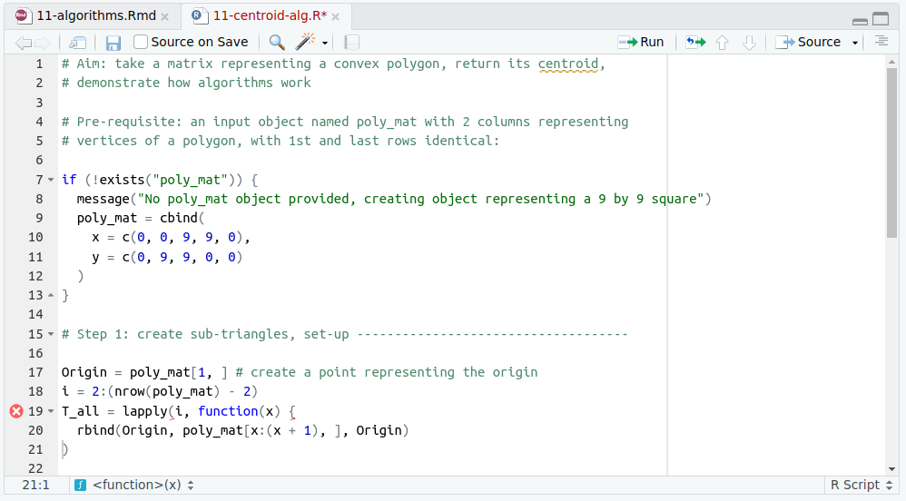

# Scripts, algorithms and functions {#algorithms}

## Prerequisites {-}

This chapter primarily uses base R; the **sf**\index{sf} package is used to check the result of an algorithm we will develop.
It assumes you have an understanding of the geographic classes introduced in Chapter \@ref(spatial-class) and how they can be used to represent a wide range of input file formats (see Chapter \@ref(read-write)).

## Introduction {#intro-algorithms}

Chapter \@ref(intro) established that geocomputation is not only about using existing tools, but developing new ones, "in the form of shareable R scripts and functions".
This chapter teaches these building blocks of reproducible code.
It also introduces low-level geometric algorithms, of the type used in Chapter \@ref(gis).
Reading it should help you to understand how such algorithms work and to write code that can be used many times, by many people, on multiple datasets.
The chapter cannot, by itself, make you a skilled programmer.
Programming is hard and requires plenty of practice [@abelson_structure_1996]:

> To appreciate programming as an intellectual activity in its own right you must turn to computer programming; you must read and write computer programs --- many of them.

There are strong reasons for moving in that direction, however.^[
This chapter does not teach programming itself.
For more on programming, we recommend @wickham_advanced_2019, @gillespie_efficient_2016, and @xiao_gis_2016. 
]
The advantages of reproducibility\index{reproducibility} go beyond allowing others to replicate your work:
reproducible code is often better in every way than code written to be run only once, including in terms of computational efficiency, scalability and ease of adapting and maintaining it.

Scripts are the basis of reproducible R code, a topic covered in Section \@ref(scripts).
Algorithms are recipes for modifying inputs using a series of steps, resulting in an output, as described in Section \@ref(geometric-algorithms).
To ease sharing and reproducibility, algorithms can be placed into functions.
That is the topic of Section \@ref(functions).
The example of finding the centroid\index{centroid} of a polygon will be used to tie these concepts together.
Chapter \@ref(geometry-operations) already introduced a centroid\index{centroid} function `st_centroid()`, but this example highlights how seemingly simple operations are the result of comparatively complex code, affirming the following observation [@wise_gis_2001]:

> One of the most intriguing things about spatial data problems is that things which appear to be trivially easy to a human being can be surprisingly difficult on a computer.

The example also reflects a secondary aim of the chapter which, following @xiao_gis_2016, is "not to duplicate what is available out there, but to show how things out there work".

## Scripts

If functions distributed in packages are the building blocks of R code, scripts are the glue that holds them together, in a logical order, to create reproducible workflows.
To programming novices scripts may sound intimidating but they are simply plain text files, typically saved with an extension representing the language they contain.
R scripts are generally saved with a `.R` extension and named to reflect what they do.
An example is `11-hello.R`, a script file stored in the `code` folder of the book's repository, which contains the following two lines of code:

```r
# Aim: provide a minimal R script
print("Hello geocompr")
```

The lines of code may not be particularly exciting but they demonstrate the point: scripts do not need to be complicated.
Saved scripts can be called and executed in their entirety with `source()`, as demonstrated below which shows how the comment is ignored but the instruction is executed:

```{r 10-algorithms-1}
source("code/11-hello.R")
```

There are no strict rules on what can and cannot go into script files and nothing to prevent you from saving broken, non-reproducible code.^[
Lines of code that do not contain valid R should be commented out, by adding a `#` to the start of the line, to prevent errors.
See line 1 of the `11-hello.R` script.
]
There are, however, some conventions worth following:

- Write the script in order: just like the script of a film, scripts should have a clear order such as 'setup', 'data processing' and 'save results' (roughly equivalent to 'beginning', 'middle' and 'end' in a film).
- Add comments to the script so other people (and your future self) can understand it. At a minimum, a comment should state the purpose of the script (see Figure \@ref(fig:codecheck)) and (for long scripts) divide it into sections. This can be done in RStudio\index{RStudio}, for example, with the shortcut `Ctrl+Shift+R`, which creates 'foldable' code section headings.

- Above all, scripts should be reproducible: self-contained scripts that will work on any computer are more useful than scripts that only run on your computer, on a good day. This involves attaching required packages at the beginning, reading-in data from persistent sources (such as a reliable website) and ensuring that previous steps have been taken.^[
Prior steps can be referred to with a comment or with an if statement such as `if(!exists("x")) source("x.R")` (which would run the script file `x.R` if the object `x` is missing).
]

It is hard to enforce reproducibility in R scripts, but there are tools that can help.
By default, RStudio \index{RStudio} 'code-checks' R scripts and underlines faulty code with a red wavy line, as illustrated below:

```{r codecheck, echo=FALSE, fig.cap="Code checking in RStudio. This example, from the script 11-centroid-alg.R, highlights an unclosed curly bracket on line 19.", fig.scap="Illustration of 'code checking' in RStudio."}

```

```{block2 spellcheck, type='rmdnote'}
A useful tool for reproducibility is the **reprex** package.
Its main function `reprex()` tests lines of R code to check if they are reproducible, and provides markdown output to facilitate communication on sites such as GitHub.
See the web page reprex.tidyverse.org for details.
```

\index{reproducibility}

The contents of this section apply to any type of R script.
A particular consideration with scripts for geocomputation is that they tend to have external dependencies, such as the QGIS\index{QGIS} dependency to run code in Chapter \@ref(gis), and require input data in a specific format.
Such dependencies should be mentioned as comments in the script or elsewhere in the project of which it is a part, as illustrated in the script [`11-centroid-alg.R`](https://github.com/Robinlovelace/geocompr/blob/main/code/11-centroid-alg.R).
The work undertaken by this script is demonstrated in the reproducible example below, which works on a pre-requisite object named `poly_mat`, a square with sides 9 units in length (the meaning of this will become apparent in the next section):^[
This example shows that `source()` works with URLs (a shortened version is used here), assuming you have an internet connection.
If you do not, the same script can be called with `source("code/11-centroid-alg.R")`, assuming you are running R from the root directory of the `geocompr` folder, which can be downloaded from https://github.com/Robinlovelace/geocompr.
]

```{r 10-algorithms-2, eval=FALSE}
poly_mat = cbind(
  x = c(0, 0, 9, 9, 0),
  y = c(0, 9, 9, 0, 0)
)
source("https://raw.githubusercontent.com/Robinlovelace/geocompr/master/code/11-centroid-alg.R")
```

```{r 10-algorithms-3, echo=FALSE}
poly_mat = cbind(
  x = c(0, 0, 9, 9, 0),
  y = c(0, 9, 9, 0, 0)
)
if(curl::has_internet()) {
  source("https://raw.githubusercontent.com/Robinlovelace/geocompr/master/code/11-centroid-alg.R")
  } else {
  source("code/11-centroid-setup.R")
  }
```

## Geometric algorithms

Algorithms\index{algorithm} can be understood as the computing equivalent of a cooking recipe.
They are a complete set of instructions which, when undertaken on the input (ingredients), result in useful (tasty) outputs.
Before diving into a concrete case study, a brief history will show how algorithms relate to scripts (covered in Section \@ref(scripts)) and functions (which can be used to generalize algorithms, as we'll see in Section \@ref(functions)).

The word "algorithm"\index{algorithm} originated in 9^th^ century Baghdad with the publication of *Hisab al-jabr w’al-muqabala*, an early math textbook.
The book was translated into Latin and became so popular that the author's last name, [al-Khwārizmī](https://en.wikipedia.org/wiki/Muhammad_ibn_Musa_al-Khwarizmi), "was immortalized as a scientific term: Al-Khwarizmi
became Alchoarismi, Algorismi and, eventually, algorithm" [@bellos_alex_2011].
In the computing age, algorithm\index{algorithm} refers to a series of steps that solves a problem, resulting in a pre-defined output.
Inputs must be formally defined in a suitable data structure [@wise_gis_2001].
Algorithms\index{algorithm} often start as flow charts or pseudocode\index{pseudocode} showing the aim of the process before being implemented in code.
To ease usability, common algorithms are often packaged inside functions, which may hide some or all of the steps taken (unless you look at the function's source code, see Section \@ref(functions)).

Geoalgorithms\index{geoalgorithm}, such as those we encountered in Chapter \@ref(gis), are algorithms that take geographic data in and, generally, return geographic results (alternative terms for the same thing include *GIS algorithms* and *geometric algorithms*).
That may sound simple but it is a deep subject with an entire academic field, *Computational Geometry*, dedicated to their study [@berg_computational_2008] and numerous books on the subject.
@orourke_computational_1998, for example, introduces the subject with a range of progressively harder geometric algorithms using reproducible and freely available C code.

An example of a geometric algorithm is one that finds the centroid\index{centroid} of a polygon.
There are many approaches to centroid\index{centroid} calculation, some of which work only on specific types of [spatial data](https://en.wikipedia.org/wiki/Centroid).
For the purposes of this section, we choose an approach that is easy to visualize: breaking the polygon into many triangles and finding the centroid\index{centroid} of each of these, an approach discussed by @kaiser_algorithms_1993 alongside other centroid algorithms [and mentioned briefly in @orourke_computational_1998].
It helps to further break down this approach into discrete tasks before writing any code (subsequently referred to as step 1 to step 4, these could also be presented as a schematic diagram or pseudocode\index{pseudocode}):

1. Divide the polygon into contiguous triangles.
2. Find the centroid\index{centroid} of each triangle.
3. Find the area of each triangle.
4. Find the area-weighted mean of triangle centroids\index{centroid}.

These steps may sound straightforward, but converting words into working code requires some work and plenty of trial-and-error, even when the inputs are constrained:
The algorithm will only work for *convex polygons*, which contain no internal angles greater than 180°, no star shapes allowed (packages **decido** and **sfdct** can triangulate non-convex polygons using external libraries, as shown in the [algorithm](https://geocompr.github.io/geocompkg/articles/algorithm.html) vignette at geocompr.github.io). 

The simplest data structure of a polygon is a matrix of x and y coordinates in which each row represents a vertex tracing the polygon's border in order where the first and last rows are identical [@wise_gis_2001].
In this case, we'll create a polygon with five vertices in base R, building on an example from *GIS Algorithms* [@xiao_gis_2016 see [github.com/gisalgs](https://github.com/gisalgs/geom) for Python code], as illustrated in Figure \@ref(fig:polymat):

```{r centroid-setup, echo=FALSE, eval=FALSE}
# show where the data came from:
source("code/11-centroid-setup.R")
```

```{r 10-algorithms-4}
# generate a simple matrix representation of a polygon:
x_coords = c(10, 0, 0, 12, 20, 10)
y_coords = c(0, 0, 10, 20, 15, 0)
poly_mat = cbind(x_coords, y_coords)
```

Now that we have an example dataset, we are ready to undertake step 1 outlined above.
The code below shows how this can be done by creating a single triangle (`T1`), that demonstrates the method; it also demonstrates step 2 by calculating its centroid\index{centroid} based on the [formula](https://math.stackexchange.com/q/1702595/) $1/3(a + b + c)$ where $a$ to $c$ are coordinates representing the triangle's vertices:

```{r 10-algorithms-5}
# create a point representing the origin:
Origin = poly_mat[1, ]
# create 'triangle matrix':
T1 = rbind(Origin, poly_mat[2:3, ], Origin) 
# find centroid (drop = FALSE preserves classes, resulting in a matrix):
C1 = (T1[1, , drop = FALSE] + T1[2, , drop = FALSE] + T1[3, , drop = FALSE]) / 3
```

```{r polymat, echo=FALSE, fig.cap="Illustration of polygon centroid calculation problem.", fig.height="100", warning=FALSE}
# initial plot: can probably delete this:
old_par = par(pty = "s") 
plot(poly_mat)
lines(poly_mat)
lines(T1, col = "blue", lwd = 5)
text(x = C1[ ,1], y = C1[, 2], "C1")
par(old_par)
```

Step 3 is to find the area of each triangle, so a *weighted mean* accounting for the disproportionate impact of large triangles is accounted for. 
The formula to calculate the area of a triangle is as follows [@kaiser_algorithms_1993]:

$$
\frac{Ax ( B y − C y ) + B x ( C y − A y ) + C x ( A y − B y )}
{ 2 }
$$

Where $A$ to $C$ are the triangle's three points and $x$ and $y$ refer to the x and y dimensions.
A translation of this formula into R code that works with the data in the matrix representation of a triangle `T1` is as follows (the function `abs()` ensures a positive result):

```{r 10-algorithms-6}
# calculate the area of the triangle represented by matrix T1:
abs(T1[1, 1] * (T1[2, 2] - T1[3, 2]) +
  T1[2, 1] * (T1[3, 2] - T1[1, 2]) +
  T1[3, 1] * (T1[1, 2] - T1[2, 2]) ) / 2
```

This code chunk outputs the correct result.^[
The result can be verified with the following formula (which assumes a horizontal base):
area is half of the base width times height, $A = B * H / 2$.
In this case $10 * 10 / 2 = 50$.
]
The problem is that code is clunky and must by re-typed if we want to run it on another triangle matrix.
To make the code more generalizable, we will see how it can be converted into a function in Section \@ref(functions).

Step 4 requires steps 2 and 3 to be undertaken not just on one triangle (as demonstrated above) but on all triangles.
This requires *iteration* to create all triangles representing the polygon, illustrated in Figure \@ref(fig:polycent).
`lapply()`\index{loop!lapply} and `vapply()`\index{loop!vapply} are used to iterate over each triangle here because they provide a concise solution in base R:^[
See `?lapply` for documentation and Chapter \@ref(location) for more on iteration.
]

```{r 10-algorithms-7}
i = 2:(nrow(poly_mat) - 2)
T_all = lapply(i, function(x) {
  rbind(Origin, poly_mat[x:(x + 1), ], Origin)
})

C_list = lapply(T_all,  function(x) (x[1, ] + x[2, ] + x[3, ]) / 3)
C = do.call(rbind, C_list)

A = vapply(T_all, function(x) {
  abs(x[1, 1] * (x[2, 2] - x[3, 2]) +
        x[2, 1] * (x[3, 2] - x[1, 2]) +
        x[3, 1] * (x[1, 2] - x[2, 2]) ) / 2
  }, FUN.VALUE = double(1))
```

```{r polycent, fig.cap="Illustration of iterative centroid algorithm with triangles. The X represents the area-weighted centroid in iterations 2 and 3.", fig.scap="Illustration of iterative centroid algorithm with triangles.", echo=FALSE, fig.asp=0.3}
# idea: show animated version on web version
source("code/11-polycent.R")
```

We are now in a position to complete step 4 to calculate the total area with `sum(A)` and the centroid\index{centroid} coordinates of the polygon with `weighted.mean(C[, 1], A)` and `weighted.mean(C[, 2], A)` (exercise for alert readers: verify these commands work).
To demonstrate the link between algorithms\index{algorithm} and scripts, the contents of this section have been condensed into `11-centroid-alg.R`.
We saw at the end of Section \@ref(scripts) how this script can calculate the centroid\index{centroid} of a square.
The great thing about *scripting* the algorithm is that it works on the new `poly_mat` object (see exercises below to verify these results with reference to `st_centroid()`):

```{r 10-algorithms-8}
source("code/11-centroid-alg.R")
```

The example above shows that low-level geographic operations *can* be developed from first principles with base R.
It also shows that if a tried-and-tested solution already exists, it may not be worth re-inventing the wheel:
if we aimed only to find the centroid\index{centroid} of a polygon, it would have been quicker to represent `poly_mat` as an **sf** object and use the pre-existing `sf::st_centroid()` function instead.
However, the great benefit of writing algorithms from 1^st^ principles is that you will understand every step of the process, something that cannot be guaranteed when using other peoples' code.
A further consideration is performance: R is slow compared with low-level languages such as C++\index{C++} for number crunching (see Section \@ref(software-for-geocomputation)) and optimization is difficult.
If the aim is to develop new methods, computational efficiency should not be prioritized.
This is captured in the saying "premature optimization is the root of all evil (or at least most of it) in programming" [@knuth_computer_1974].

Algorithm\index{algorithm} development is hard.
This should be apparent from the amount of work that has gone into developing a centroid\index{centroid} algorithm\index{algorithm} in base R\index{R} that is just one, rather inefficient, approach to the problem with limited real-world applications (convex polygons are uncommon in practice).
The experience should lead to an appreciation of low-level geographic libraries such as GEOS\index{GEOS} (which underlies `sf::st_centroid()`) and CGAL\index{CGAL} (the Computational Geometry Algorithms Library) which not only run fast but work on a wide range of input geometry types.
A great advantage of the open source nature of such libraries is that their source code\index{source code} is readily available for study, comprehension and (for those with the skills and confidence) modification.^[
The CGAL\index{CGAL} function `CGAL::centroid()` is in fact composed of 7 sub-functions as described at https://doc.cgal.org/latest/Kernel_23/group__centroid__grp.html allowing it to work on a wide range of input data types, whereas the solution we created works only on a very specific input data type.
The source code underlying GEOS\index{GEOS} function `Centroid::getCentroid()` can be found at https://github.com/libgeos/geos/search?q=getCentroid.
]

## Functions

Like algorithms\index{algorithm}, functions take an input and return an output.
Functions\index{function}, however, refer to the implementation in a particular programming language, rather than the 'recipe' itself.
In R, functions\index{function} are objects in their own right, that can be created and joined together in a modular fashion.
We can, for example, create a function that undertakes step 2 of our centroid\index{centroid} generation algorithm\index{algorithm} as follows:

```{r 10-algorithms-9}
t_centroid = function(x) {
  (x[1, ] + x[2, ] + x[3, ]) / 3
}
```

The above example demonstrates two key components of [functions](http://adv-r.had.co.nz/Functions.html):
1) the function *body*, the code inside the curly brackets that define what the function does with the inputs; and 2) the *formals*, the list of arguments the function works with --- `x` in this case (the third key component, the environment, is beyond the scope of this section).
By default, functions return the last object that has been calculated (the coordinates of the centroid\index{centroid} in the case of `t_centroid()`).^[
You can also explicitly set the output of a function by adding `return(output)` into the body of the function, where `output` is the result to be returned.
]

```{r 10-algorithms-10, eval=FALSE, echo=FALSE}
body(t_centroid)
formals(t_centroid)
environment(t_centroid)
```

The function now works on any inputs you pass it, as illustrated in the below command which calculates the area of the 1^st^ triangle from the example polygon in the previous section (see Figure \@ref(fig:polycent)):

```{r 10-algorithms-11}
t_centroid(T1)
```

We can also create a function\index{function} to calculate a triangle's area, which we will name `t_area()`:

```{r 10-algorithms-12}
t_area = function(x) {
  abs(
    x[1, 1] * (x[2, 2] - x[3, 2]) +
    x[2, 1] * (x[3, 2] - x[1, 2]) +
    x[3, 1] * (x[1, 2] - x[2, 2])
  ) / 2
}
```

Note that after the function's creation, a triangle's area can be calculated in a single line of code, avoiding duplication of verbose code:
functions are a mechanism for *generalizing* code.
The newly created function\index{function} `t_area()` takes any object `x`, assumed to have the same dimensions as the 'triangle matrix' data structure we've been using, and returns its area, as illustrated on `T1` as follows:

```{r 10-algorithms-13}
t_area(T1)
```

We can test the generalizability of the function\index{function} by using it to find the area of a new triangle matrix, which has a height of 1 and a base of 3:

```{r 10-algorithms-14}
t_new = cbind(x = c(0, 3, 3, 0),
              y = c(0, 0, 1, 0))
t_area(t_new)
```

A useful feature of functions is that they are modular.
Provided that you know what the output will be, one function can be used as the building block of another.
Thus, the functions `t_centroid()` and `t_area()` can be used as sub-components of a larger function\index{function} to do the work of the script `11-centroid-alg.R`: calculate the area of any convex polygon.
The code chunk below creates the function `poly_centroid()` to mimic the behavior of `sf::st_centroid()` for convex polygons:^[
Note that the functions we created are called iteratively in `lapply()`\index{loop!lapply} and `vapply()`\index{loop!vapply} function calls.
]

```{r 10-algorithms-15}
poly_centroid = function(poly_mat) {
  Origin = poly_mat[1, ] # create a point representing the origin
  i = 2:(nrow(poly_mat) - 2)
  T_all = lapply(i, function(x) {
    rbind(Origin, poly_mat[x:(x + 1), ], Origin)
  })
  C_list = lapply(T_all, t_centroid)
  C = do.call(rbind, C_list)
  A = vapply(T_all, t_area, FUN.VALUE = double(1))
  c(weighted.mean(C[, 1], A), weighted.mean(C[, 2], A))
}
```


```{r 10-algorithms-16, echo=FALSE, eval=FALSE}
# a slightly more complex version of the function with output set
poly_centroid = function(poly_mat, output = "matrix") {
  Origin = poly_mat[1, ] # create a point representing the origin
  i = 2:(nrow(poly_mat) - 2)
  T_all = T_all = lapply(i, function(x) {
    rbind(Origin, poly_mat[x:(x + 1), ], Origin)
  })
  C_list = lapply(T_all, t_centroid)
  C = do.call(rbind, C_list)
  A = vapply(T_all, t_area, FUN.VALUE = double(1))
  centroid_coords = c(weighted.mean(C[, 1], A), weighted.mean(C[, 2], A))
  if(output == "matrix") {
    return(centroid_coords)
  } else if(output == "area")
    return(sum(A))
}
```

```{r 10-algorithms-17}
poly_centroid(poly_mat)
```

Functions\index{function} such as `poly_centroid()` can further be extended to provide different types of output.
To return the result as an object of class `sfg`, for example, a 'wrapper' function can be used to modify the output of `poly_centroid()` before returning the result:

```{r 10-algorithms-18}
poly_centroid_sfg = function(x) {
  centroid_coords = poly_centroid(x)
  sf::st_point(centroid_coords)
}
```

We can verify that the output is the same as the output from `sf::st_centroid()` as follows:

```{r 10-algorithms-19}
poly_sfc = sf::st_polygon(list(poly_mat))
identical(poly_centroid_sfg(poly_mat), sf::st_centroid(poly_sfc))
```

## Programming

In this chapter we have moved quickly, from scripts to functions via the tricky topic of algorithms\index{algorithm}.
Not only have we discussed them in the abstract, but we have also created working examples of each to solve a specific problem:

- The script `11-centroid-alg.R` was introduced and demonstrated on a 'polygon matrix'
- The individual steps that allowed this script to work were described as an algorithm\index{algorithm}, a computational recipe
- To generalize the algorithm\index{algorithm} we converted it into modular functions which were eventually combined to create the function `poly_centroid()` in the previous section

Taken on its own, each of these steps is straightforward.
But the skill of programming is combining scripts, algorithms and functions in a way that produces performant, robust and user-friendly tools that other people can use.
If you are new to programming, as we expect most people reading this book will be, being able to follow and reproduce the results in the preceding sections should be seen as a major achievement. 
Programming takes many hours of dedicated study and practice before you become proficient.

The challenge facing developers aiming to implement new algorithms\index{algorithm} in an efficient way is put in perspective by considering that we have only created a toy function.
In its current state, `poly_centroid()` fails on most (non-convex) polygons!
A question arising from this is: how would one generalize the function\index{function}?
Two options are (1) to find ways to triangulate non-convex polygons (a topic covered in the online [algorithm](https://geocompr.github.io/geocompkg/articles/algorithm.html) article that supports this chapter) and (2) to explore other centroid\index{centroid} algorithms\index{algorithm} that do not rely on triangular meshes.

A wider question is: is it worth programming a solution at all when high performance algorithms have already been implemented and packaged in functions such as `st_centroid()`?
The reductionist answer in this specific case is 'no'.
In the wider context, and considering the benefits of learning to program, the answer is 'it depends'.
With programming, it's easy to waste hours trying to implement a method, only to find that someone has already done the hard work.
So instead of seeing this chapter as your first stepping stone towards geometric algorithm programming wizardry, it may be more productive to use it as a lesson in when to try to program a generalized solution, and when to use existing higher-level solutions.
There will surely be occasions when writing new functions is the best way forward, but there will also be times when using functions that already exist is the best way forward.

We cannot guarantee that, having read this chapter, you will be able to rapidly create new functions\index{function} for your work.
But we are confident that its contents will help you decide when is an appropriate time to try (when no other existing functions solve the problem, when the programming task is within your capabilities and when the benefits of the solution are likely to outweigh the time costs of developing it).
First steps towards programming can be slow (the exercises below should not be rushed) but the long-term rewards can be large.

## Exercises {#ex-algorithms}

1. Read the script `11-centroid-alg.R` in the `code` folder of the book's GitHub repo.
    - Which of the best practices covered in Section \@ref(scripts) does it follow?
    - Create a version of the script on your computer in an IDE\index{IDE} such as RStudio\index{RStudio} (preferably by typing-out the script line-by-line, in your own coding style and with your own comments, rather than copy-pasting --- this will help you learn how to type scripts). Using the example of a square polygon (e.g., created with `poly_mat = cbind(x = c(0, 0, 9, 9, 0), y = c(0, 9, 9, 0, 0))`) execute the script line-by-line.
    - What changes could be made to the script to make it more reproducible?
    <!-- - Answer: The script could state that it needs an object called `poly_mat` to be present and, if none is present, create an example dataset at the outset for testing. -->
<!-- 1. Check-out the script `11-earthquakes.R` in the `code` folder of the book's GitHub [repo](https://github.com/Robinlovelace/geocompr/blob/main/code/11-earthquakes.R). -->
<!--     - Try to reproduce the results: how many significant earthquakes were there last month? -->
<!--     - Modify the script so that it provides a map with all earthquakes that happened in the past hour. -->
<!-- change line 10 to: -->
<!-- u = "https://earthquake.usgs.gov/earthquakes/feed/v1.0/summary/significant_hour.geojson" -->
    - How could the documentation be improved?
  <!-- It could document the source of the data better - e.g. with `data from https://earthquake.usgs.gov/earthquakes/feed/v1.0/geojson.php` -->
1. In Section \@ref(geometric-algorithms) we calculated that the area and geographic centroid\index{centroid} of the polygon represented by `poly_mat` was `r sum(A)` and `r round(c(weighted.mean(C[, 1], A), weighted.mean(C[, 2], A)), 1)`, respectively.
    - Reproduce the results on your own computer with reference to the script `11-centroid-alg.R`, an implementation of this algorithm (bonus: type out the commands - try to avoid copy-pasting).
    <!-- Todo: add link to that script file (RL) -->
    - Are the results correct? Verify them by converting `poly_mat` into an `sfc` object (named `poly_sfc`) with `st_polygon()` (hint: this function takes objects of class `list()`) and then using `st_area()` and `st_centroid()`.
<!-- We can verify the answer by converting `poly_mat` into a simple feature collection as follows, which shows the calculations match: -->
```{r 10-algorithms-20, eval=FALSE, echo=FALSE}
poly_sfc = sf::st_polygon(list(poly_mat))
sf::st_area(poly_sfc)
sf::st_centroid(poly_sfc)
```
1. It was stated that the algorithm\index{algorithm} we created only works for *convex hulls*. Define convex hulls\index{convex hull} (see Chapter \@ref(geometry-operations)) and test the algorithm on a polygon that is *not* a convex hull.
     - Bonus 1: Think about why the method only works for convex hulls and note changes that would need to be made to the algorithm to make it work for other types of polygon.
<!-- The algorithm would need to be able to have negative as well as positive area values. -->
     - Bonus 2: Building on the contents of `11-centroid-alg.R`, write an algorithm\index{algorithm} only using base R functions that can find the total length of linestrings represented in matrix form.
<!-- Todo: add example of matrix representing a linestring, demonstrate code to verify the answer, suggest alternative functions to decompose as a bonus. -->
1. In Section \@ref(functions) we created different versions of the `poly_centroid()` function that generated outputs of class `sfg` (`poly_centroid_sfg()`) and type-stable `matrix` outputs (`poly_centroid_type_stable()`). Further extend the function by creating a version (e.g., called `poly_centroid_sf()`) that is type stable (only accepts inputs of class `sf`) *and* returns `sf` objects (hint: you may need to convert the object `x` into a matrix with the command `sf::st_coordinates(x)`).
    - Verify it works by running `poly_centroid_sf(sf::st_sf(sf::st_sfc(poly_sfc)))`
    - What error message do you get when you try to run `poly_centroid_sf(poly_mat)`?
    
```{r 10-algorithms-21, eval=FALSE, echo=FALSE}
poly_centroid_sf = function(x) {
  stopifnot(is(x, "sf"))
  xcoords = sf::st_coordinates(x)
  centroid_coords = poly_centroid(xcoords)
  centroid_sf = sf::st_sf(geometry = sf::st_sfc(sf::st_point(centroid_coords)))
  centroid_sf
}
poly_centroid_sf(sf::st_sf(sf::st_sfc(poly_sfc)))
poly_centroid_sf(poly_sfc)
poly_centroid_sf(poly_mat)
```
