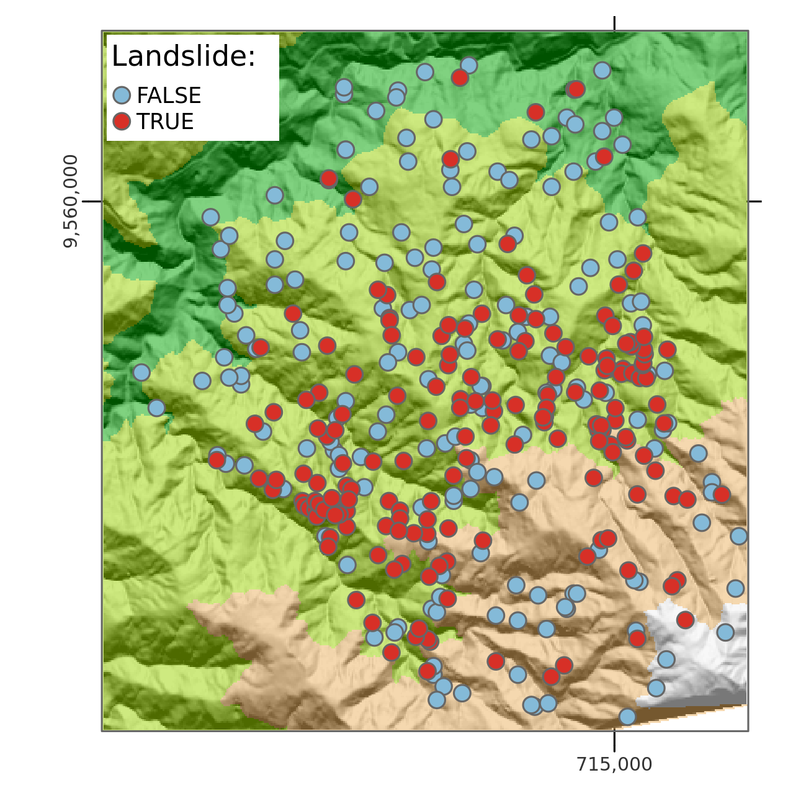
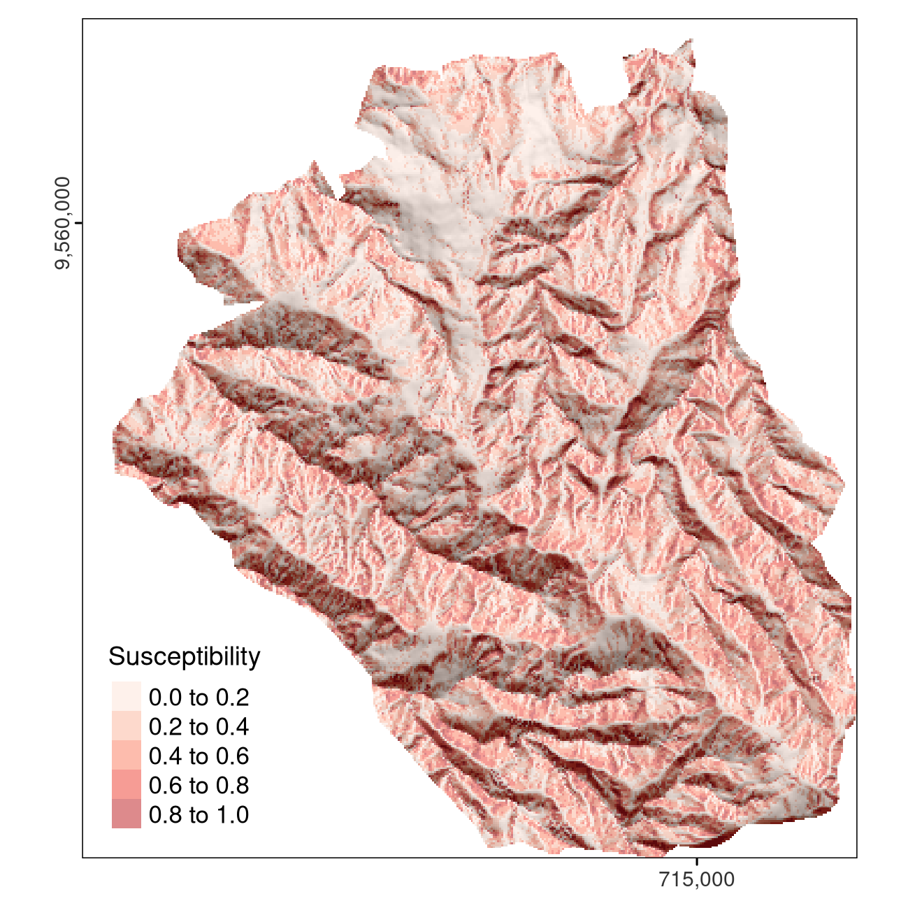
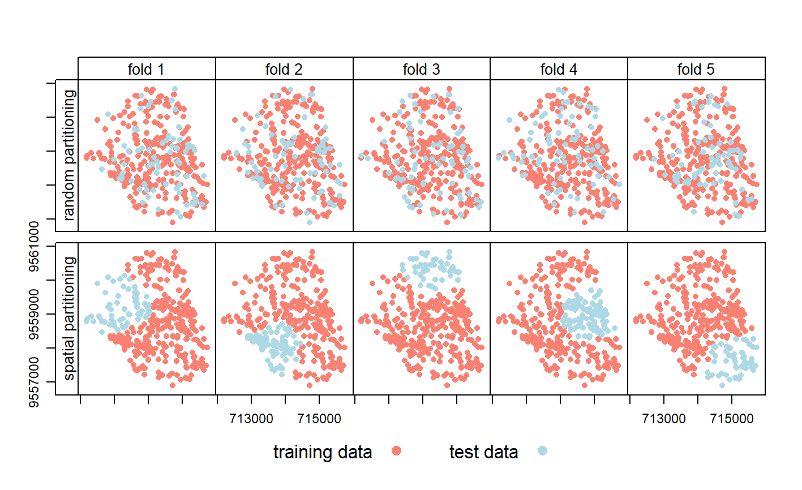
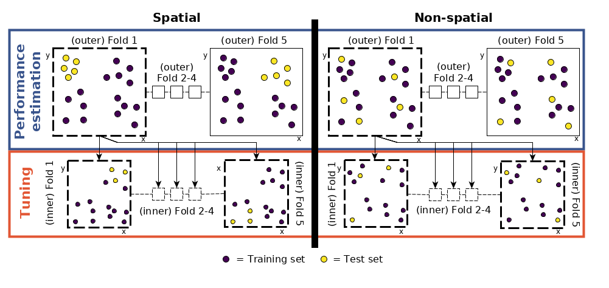

# Statistical learning {#spatial-cv}

## Prerequisites {-}

This chapter assumes proficiency with geographic data analysis\index{geographic data analysis}, for example gained by studying the contents and working-through the exercises in Chapters \@ref(spatial-class) to \@ref(reproj-geo-data).
A familiarity with generalized linear models (GLM)\index{GLM} and machine learning\index{machine learning} is highly recommended [for example from @zuur_mixed_2009;@james_introduction_2013].

The chapter uses the following packages:^[
Packages **GGally**, **lgr**, **kernlab**, **ml3measures**, **paradox**, **pROC**, **progressr** and **spDataLarge** must also be installed although these do not need to be attached.
]

```{r 12-spatial-cv-1, message=FALSE}
library(dplyr)
library(future)
library(lgr)
library(mlr3)
library(mlr3learners)
library(mlr3extralearners)
library(mlr3spatiotempcv)
library(mlr3tuning)
library(mlr3viz)
library(progressr)
library(sf)
library(terra)
```

Required data will be attached in due course.

## Introduction {#intro-cv1}

Statistical learning\index{statistical learning} is concerned with the use of statistical and computational models for identifying patterns in data and predicting from these patterns.
Due to its origins, statistical learning\index{statistical learning} is one of R's\index{R} great strengths (see Section \@ref(software-for-geocomputation)).^[
Applying statistical techniques to geographic data has been an active topic of research for many decades in the fields of geostatistics, spatial statistics and point pattern analysis [@diggle_modelbased_2007; @gelfand_handbook_2010; @baddeley_spatial_2015].
]
Statistical learning\index{statistical learning} combines methods from statistics\index{statistics} and machine learning\index{machine learning} and can be categorized into supervised and unsupervised techniques.
Both are increasingly used in disciplines ranging from physics, biology and ecology to geography and economics [@james_introduction_2013].

This chapter focuses on supervised techniques in which there is a training dataset, as opposed to unsupervised techniques such as clustering\index{clustering}.
Response variables can be binary (such as landslide occurrence), categorical (land use), integer (species richness count) or numeric (soil acidity measured in pH).
Supervised techniques model the relationship between such responses --- which are known for a sample of observations --- and one or more predictors.

<!-- For this we can use techniques from the field of statistics or from the field of machine learning.
Which to use depends on the primary aim: statistical inference or prediction.
Statistical regression techniques are especially useful if the aim is statistical inference.
These techniques also allow predictions of unseen data points but this is usually only of secondary interest to statisticians.
Statistical inference, on the other hand, refers among others to a predictor's significance, its importance for a specific model, its relationship with the response and the uncertainties associated with the estimated coefficients.
To trust the p-values and standard errors of such models we need to perform a thorough model validation testing if one or several of the underlying model assumptions (heterogeneity, independence, etc.) have been violated [@zuur_mixed_2009].
By contrast, statistical inference is impossible with machine learning [@james_introduction_2013].
-->
<!-- The primary aim of machine learning is to make good predictions, whereas the field of statistics is more focussed on the underlying theory [e.g. @zuur_mixed_2009] -->

The primary aim of much machine learning\index{machine learning} research is to make good predictions, as opposed to statistical/Bayesian inference, which is good at helping to understand underlying mechanisms and uncertainties in the data [see @krainski_advanced_2018].
Machine learning thrives in the age of 'big data'\index{big data} because its methods make few assumptions about input variables and can handle huge datasets.
Machine learning is conducive to tasks such as the prediction of future customer behavior, recommendation services (music, movies, what to buy next), face recognition, autonomous driving, text classification and predictive maintenance (infrastructure, industry).

<!-- ^[In this case we do not have too worry too much about possible model misspecifications since we explicitly do not want to do statistical inference.] -->

This chapter is based on a case study: the (spatial) prediction of landslides.
This application links to the applied nature of geocomputation, defined in Chapter \@ref(intro), and illustrates how machine learning\index{machine learning} borrows from the field of statistics\index{statistics} when the sole aim is prediction.
Therefore, this chapter first introduces modeling and cross-validation\index{cross-validation} concepts with the help of a Generalized Linear Model \index{GLM} [@zuur_mixed_2009].
Building on this, the chapter implements a more typical machine learning\index{machine learning} algorithm\index{algorithm}, namely a Support Vector Machine (SVM)\index{SVM}.
The models' **predictive performance** will be assessed using spatial cross-validation (CV)\index{cross-validation!spatial CV}, which accounts for the fact that geographic data is special.

CV\index{cross-validation} determines a model's ability to generalize to new data, by splitting a dataset (repeatedly) into training and test sets.
It uses the training data to fit the model, and checks its performance when predicting against the test data.
CV helps to detect overfitting\index{overfitting} since models that predict the training data too closely (noise) will tend to perform poorly on the test data.

Randomly splitting spatial data can lead to training points that are neighbors in space with test points.
Due to spatial autocorrelation\index{autocorrelation!spatial}, test and training datasets would not be independent in this scenario, with the consequence that CV\index{cross-validation} fails to detect a possible overfitting\index{overfitting}.
Spatial CV\index{cross-validation!spatial CV} alleviates this problem and is the **central** theme in this chapter.

## Case study: Landslide susceptibility {#case-landslide}

This case study is based on a dataset of landslide locations in Southern Ecuador, illustrated in Figure \@ref(fig:lsl-map) and described in detail in @muenchow_geomorphic_2012.
A subset of the dataset used in that paper is provided in the **spDataLarge**\index{spDataLarge (package)} package, which can be loaded as follows:

```{r 12-spatial-cv-2}
data("lsl", "study_mask", package = "spDataLarge")
ta = terra::rast(system.file("raster/ta.tif", package = "spDataLarge"))
```

The above code loads three objects: a `data.frame` named `lsl`, an `sf` object named `study_mask` and a `SpatRaster` (see Section \@ref(raster-classes)) named `ta` containing terrain attribute rasters.
`lsl` contains a factor column `lslpts` where `TRUE` corresponds to an observed landslide 'initiation point', with the coordinates stored in columns `x` and `y`.^[
The landslide initiation point is located in the scarp of a landslide polygon. See @muenchow_geomorphic_2012 for further details.
]
There are 175 landslide and 175 non-landslide points, as shown by `summary(lsl$lslpts)`.
The 175 non-landslide points were sampled randomly from the study area, with the restriction that they must fall outside a small buffer around the landslide polygons.

```{r lsl-map, echo=FALSE, out.width="70%", fig.cap="Landslide initiation points (red) and points unaffected by landsliding (blue) in Southern Ecuador.", fig.scap="Landslide initiation points."}
# library(tmap)
# data("lsl", package = "spDataLarge")
# ta = terra::rast(system.file("raster/ta.tif", package = "spDataLarge"))
# lsl_sf = sf::st_as_sf(lsl, coords = c("x", "y"), crs = "EPSG:32717")
# hs = terra::shade(slope = ta$slope * pi / 180,
#                   terra::terrain(ta$elev, v = "aspect", unit = "radians"))
# # so far tmaptools does not support terra objects
# 
# bbx = tmaptools::bb(raster::raster(hs), xlim = c(-0.0001, 1),
#                     ylim = c(-0.0001, 1), relative = TRUE)
# 
# map = tm_shape(hs, bbox = bbx) +
#   tm_grid(col = "black", n.x = 1, n.y = 1, labels.inside.frame = FALSE,
#           labels.rot = c(0, 90), lines = FALSE) +
#   tm_raster(palette = gray(0:100 / 100), n = 100, legend.show = FALSE) +
#   tm_shape(ta$elev) +
#   tm_raster(alpha = 0.5, palette = terrain.colors(10), legend.show = FALSE) +
#   tm_shape(lsl_sf) +
#   tm_bubbles("lslpts", size = 0.2, palette = "-RdYlBu",
#              title.col = "Landslide: ") +
#   tm_layout(inner.margins = 0) +
#   tm_legend(bg.color = "white")
# tmap::tmap_save(map, filename = "figures/lsl-map-1.png", width = 11,
#                 height = 11, units = "cm")

```
\index{hillshade}

The first three rows of `lsl`, rounded to two significant digits, can be found in Table \@ref(tab:lslsummary).

```{r lslsummary, echo=FALSE, warning=FALSE}
lsl_table = lsl |>
  mutate(across(.cols = -any_of(c("x", "y", "lslpts")), ~signif(., 2)))
knitr::kable(lsl_table[c(1, 2, 350), ], caption = "Structure of the lsl dataset.",
             caption.short = "`lsl` dataset.", booktabs = TRUE) |>
  kableExtra::kable_styling(latex_options = "scale_down")
```

To model landslide susceptibility, we need some predictors.
Since terrain attributes are frequently associated with landsliding [@muenchow_geomorphic_2012], we have already extracted following terrain attributes from `ta` to `lsl`:

- `slope`:  slope angle (°)
- `cplan`: plan curvature (rad m^−1^) expressing the convergence or divergence of a slope and thus water flow
- `cprof`: profile curvature (rad m^-1^) as a measure of flow acceleration, also known as downslope change in slope angle
- `elev`: elevation (m a.s.l.) as the representation of different altitudinal zones of vegetation and precipitation in the study area
- `log10_carea`: the decadic logarithm of the catchment area (log10 m^2^) representing the amount of water flowing towards a location

It might be a worthwhile exercise to compute the terrain attributes with the help of R-GIS bridges (see Chapter \@ref(gis)) and extract them to the landslide points (see Exercise section at the end of this Chapter).

## Conventional modeling approach in R {#conventional-model}

Before introducing the **mlr3**\index{mlr3 (package)} package, an umbrella-package providing a unified interface to dozens of learning algorithms (Section \@ref(spatial-cv-with-mlr3)), it is worth taking a look at the conventional modeling interface in R\index{R}.
This introduction to supervised statistical learning\index{statistical learning} provides the basis for doing spatial CV\index{cross-validation!spatial CV}, and contributes to a better grasp on the **mlr3**\index{mlr3 (package)} approach presented subsequently.

Supervised learning involves predicting a response variable as a function of predictors (Section \@ref(intro-cv)). 
In R\index{R}, modeling functions are usually specified using formulas (see `?formula` and the detailed [Formulas in R Tutorial](https://www.datacamp.com/community/tutorials/r-formula-tutorial) for details of R formulas).
The following command specifies and runs a generalized linear model\index{GLM}:

```{r 12-spatial-cv-6}
fit = glm(lslpts ~ slope + cplan + cprof + elev + log10_carea,
          family = binomial(),
          data = lsl)
```

It is worth understanding each of the three input arguments:

- A formula, which specifies landslide occurrence (`lslpts`) as a function of the predictors
- A family, which specifies the type of model, in this case `binomial` because the response is binary (see `?family`)
- The data frame which contains the response and the predictors (as columns)

The results of this model can be printed as follows (`summary(fit)` provides a more detailed account of the results):

```{r 12-spatial-cv-7}
class(fit)
fit
```

The model object `fit`, of class `glm`, contains the coefficients defining the fitted relationship between response and predictors.
It can also be used for prediction.
This is done with the generic `predict()` method, which in this case calls the function `predict.glm()`.
Setting `type` to `response` returns the predicted probabilities (of landslide occurrence) for each observation in `lsl`, as illustrated below (see `?predict.glm`):

```{r 12-spatial-cv-8}
pred_glm = predict(object = fit, type = "response")
head(pred_glm)
```

Spatial predictions can be made by applying the coefficients to the predictor rasters. 
This can be done manually or with `terra::predict()`.
In addition to a model object (`fit`), this function also expects a `SpatRaster` with the predictors (raster layers) named as in the model's input data frame (Figure \@ref(fig:lsl-susc)).

```{r 12-spatial-cv-9, eval=FALSE}
# making the prediction
pred = terra::predict(ta, model = fit, type = "response")
```

```{r lsl-susc, echo=FALSE, out.width="70%",fig.cap="Spatial prediction of landslide susceptibility using a GLM.", fig.scap = "Spatial prediction of landslide susceptibility.", warning=FALSE}
# # attach study mask for the natural part of the study area
# data("lsl", "study_mask", package = "spDataLarge")
# ta = terra::rast(system.file("raster/ta.tif", package = "spDataLarge"))
# study_mask = terra::vect(study_mask)
# lsl_sf = sf::st_as_sf(lsl, coords = c("x", "y"), crs = 32717)
# hs = terra::shade(ta$slope * pi / 180,
#                   terra::terrain(ta$elev, v = "aspect", unit = "radians"))
# bbx = tmaptools::bb(raster::raster(hs), xlim = c(-0.0001, 1),
#                     ylim = c(-0.0001, 1), relative = TRUE)
# 
# map = tm_shape(hs, bbox = bbx) +
#   tm_grid(col = "black", n.x = 1, n.y = 1, labels.inside.frame = FALSE,
#           labels.rot = c(0, 90), lines = FALSE) +
#   tm_raster(palette = "white", legend.show = FALSE) +
#   # hillshade
#   tm_shape(terra::mask(hs, study_mask), bbox = bbx) +
# 	tm_raster(palette = gray(0:100 / 100), n = 100,
# 	          legend.show = FALSE) +
# 	# prediction raster
#   tm_shape(terra::mask(pred, study_mask)) +
# 	tm_raster(alpha = 0.5, palette = "Reds", n = 6, legend.show = TRUE,
# 	          title = "Susceptibility") +
# 	tm_layout(legend.position = c("left", "bottom"),
# 	          legend.title.size = 0.9,
# 	          inner.margins = 0)
# tmap::tmap_save(map, filename = "figures/lsl-susc-1.png", width = 11,
#                 height = 11, units = "cm")

```

Here, when making predictions we neglect spatial autocorrelation\index{autocorrelation!spatial} since we assume that on average the predictive accuracy remains the same with or without spatial autocorrelation structures.
However, it is possible to include spatial autocorrelation\index{autocorrelation!spatial} structures into models [@zuur_mixed_2009;@blangiardo_spatial_2015;@zuur_beginners_2017] as well as into predictions [kriging approaches, see, e.g., @goovaerts_geostatistics_1997;@hengl_practical_2007;@bivand_applied_2013].
This is, however, beyond the scope of this book.
<!--
Nevertheless, we give the interested reader some pointers where to look it up:

1. The predictions of regression kriging combines the predictions of a regression with the kriging of the regression's residuals [@bivand_applied_2013]. 
2. One can also add a spatial correlation (dependency) structure to a generalized least squares model  [`nlme::gls()`; @zuur_mixed_2009; @zuur_beginners_2017].  
3. Finally, there are mixed-effect modeling approaches.
Basically, a random effect imposes a dependency structure on the response variable which in turn allows for observations of one class to be more similar to each other than to those of another class [@zuur_mixed_2009]. 
Classes can be, for example, bee hives, owl nests, vegetation transects or an altitudinal stratification.
This mixed modeling approach assumes normal and independent distributed random intercepts.^[Note that for spatial predictions one would usually use the population intercept.]
This can even be extended by using a random intercept that is normal and spatially dependent.
For this, however, you will have to resort most likely to Bayesian modeling approaches since frequentist software tools are rather limited in this respect especially for more complex models [@blangiardo_spatial_2015; @zuur_beginners_2017]. 
-->

Spatial prediction maps are one very important outcome of a model.
Even more important is how good the underlying model is at making them since a prediction map is useless if the model's predictive performance is bad.
The most popular measure to assess the predictive performance of a binomial model is the Area Under the Receiver Operator Characteristic Curve (AUROC)\index{AUROC}.
This is a value between 0.5 and 1.0, with 0.5 indicating a model that is no better than random and 1.0 indicating perfect prediction of the two classes. 
Thus, the higher the AUROC\index{AUROC}, the better the model's predictive power.
The following code chunk computes the AUROC\index{AUROC} value of the model with `roc()`, which takes the response and the predicted values as inputs. 
`auc()` returns the area under the curve.

```{r 12-spatial-cv-10, message=FALSE, eval=FALSE}
pROC::auc(pROC::roc(lsl$lslpts, fitted(fit)))
#> Area under the curve: 0.8216
```

An AUROC\index{AUROC} value of
<!-- `r # round(pROC::auc(pROC::roc(lsl$lslpts, fitted(fit))), 2)` -->
0.82 represents a good fit.
However, this is an overoptimistic estimation since we have computed it on the complete dataset. 
To derive a biased-reduced assessment, we have to use cross-validation\index{cross-validation} and in the case of spatial data should make use of spatial CV\index{cross-validation!spatial CV}.

## Introduction to (spatial) cross-validation {#intro-cv} 

Cross-validation\index{cross-validation} belongs to the family of resampling methods\index{resampling} [@james_introduction_2013].
The basic idea is to split (repeatedly) a dataset into training and test sets whereby the training data is used to fit a model which then is applied to the test set.
Comparing the predicted values with the known response values from the test set (using a performance measure such as the AUROC\index{AUROC} in the binomial case) gives a bias-reduced assessment of the model's capability to generalize the learned relationship to independent data.
For example, a 100-repeated 5-fold cross-validation means to randomly split the data into five partitions (folds) with each fold being used once as a test set (see upper row of Figure \@ref(fig:partitioning)). 
This guarantees that each observation is used once in one of the test sets, and requires the fitting of five models.
Subsequently, this procedure is repeated 100 times.
Of course, the data splitting will differ in each repetition.
<!--if the error is calc. on the fold-level. most often its calc. on the repetition level. maybe worth noting.
talk about this in person
-->
Overall, this sums up to 500 models, whereas the mean performance measure (AUROC\index{AUROC}) of all models is the model's overall predictive power.

However, geographic data is special.
As we will see in Chapter \@ref(transport), the 'first law' of geography states that points close to each other are, generally, more similar than points further away [@miller_tobler_2004].
This means these points are not statistically independent because training and test points in conventional CV\index{cross-validation} are often too close to each other (see first row of Figure \@ref(fig:partitioning)).
'Training' observations near the 'test' observations can provide a kind of 'sneak preview':
information that should be unavailable to the training dataset.
<!-- "folds" only for the repetition split, "partitions" or "subsets" for splitting within a fold
talk about this in person
-->
To alleviate this problem 'spatial partitioning' is used to split the observations into spatially disjointed subsets (using the observations' coordinates in a *k*-means clustering\index{clustering!kmeans}; @brenning_spatial_2012; second row of Figure \@ref(fig:partitioning)).
This partitioning strategy is the **only** difference between spatial and conventional CV.
As a result, spatial CV leads to a bias-reduced assessment of a model's predictive performance, and hence helps to avoid overfitting\index{overfitting}.
<!-- Alex suggested to remove this: 
It is important to note that spatial CV reduces the bias introduced by spatial autocorrelation but does not completely remove it. 
This is because there are still a few points in the test and training data which are still neighbors (@brenning_spatial_2012; see second row of \@ref(fig:partitioning)).
-->

```{r partitioning, fig.cap="Spatial visualization of selected test and training observations for cross-validation of one repetition. Random (upper row) and spatial partitioning (lower row).", echo=FALSE, fig.scap="Spatial visualization of selected test and training observations."}

```

## Spatial CV with **mlr3**
\index{mlr3 (package)}
There are dozens of packages for statistical learning\index{statistical learning}, as described for example in the [CRAN machine learning task view](https://CRAN.R-project.org/view=MachineLearning).
Getting acquainted with each of these packages, including how to undertake cross-validation and hyperparameter\index{hyperparameter} tuning, can be a time-consuming process.
Comparing model results from different packages can be even more laborious.
The **mlr3** package and ecosystem was developed to address these issues.
It acts as a 'meta-package', providing a unified interface to popular supervised and unsupervised statistical learning techniques including classification, regression\index{regression}, survival analysis and clustering\index{clustering} [@lang_mlr3_2019; @becker_mlr3_2022].
The standardized **mlr3** interface is based on eight 'building blocks'.
As illustrated in Figure \@ref(fig:building-blocks), these have a clear order.

```{r building-blocks, echo=FALSE, fig.height=4, fig.width=4, fig.cap="Basic building blocks of the mlr3 package. Source: @becker_mlr3_2022. (Permission to reuse this figure was kindly granted.)", fig.scap="Basic building blocks of the mlr3 package."}
knitr::include_graphics("figures/13_ml_abstraction_crop.png")
```

The **mlr3** modeling process consists of three main stages.
First, a **task** specifies the data (including response and predictor variables) and the model type (such as regression\index{regression} or classification\index{classification}).
Second, a **learner** defines the specific learning algorithm that is applied to the created task.
Third, the **resampling** approach assesses the predictive performance of the model, i.e., its ability to generalize to new data (see also Section \@ref(intro-cv)).

### Generalized linear model {#glm}

To implement a GLM\index{GLM} in **mlr3**\index{mlr3 (package)}, we must create a **task** containing the landslide data.
Since the response is binary (two-category variable) and has a spatial dimension, we create a classification\index{classification} task with `TaskClassifST$new()` of the **mlr3spatiotempcv** package [@schratz_mlr3spatiotempcv_2021, for non-spatial tasks, use `mlr3::TaskClassif$new()` or `mlr3::TaskRegr$new()` for regression\index{regression} tasks, see `?Task` for other task types].^[The **mlr3** ecosystem makes heavily use of **data.table** and **R6** classes. And though you might use **mlr3** without knowing the specifics of **data.table** or **R6**, it might be rather helpful. To learn more about **data.table**, please refer to https://rdatatable.gitlab.io/data.table/index.html. To learn more about **R6**, we recommend [Chapter 14](https://adv-r.hadley.nz/fp.html) of the Advanced R book [@wickham_advanced_2019].]
The first essential argument of these `Task*$new()` functions is `backend`.
`backend` expects that the input data includes the response and predictor variables.
The `target` argument indicates the name of a response variable (in our case this is `lslpts`) and `positive` determines which of the two factor levels of the response variable indicate the landslide initiation point (in our case this is `TRUE`).
All other variables of the `lsl` dataset will serve as predictors.
For spatial CV, we need to provide a few extra arguments (`extra_args`).
The `coordinate_names` argument expects the names of the coordinate columns (see Section \@ref(intro-cv) and Figure \@ref(fig:partitioning)).
Additionally, we should indicate the used CRS (`crs`) and decide if we want to use the coordinates as predictors in the modeling (`coords_as_features`).

```{r 12-spatial-cv-11, eval=FALSE}
# create task
task = mlr3spatiotempcv::TaskClassifST$new(
  id = "ecuador_lsl",
  backend = mlr3::as_data_backend(lsl), 
  target = "lslpts", 
  positive = "TRUE",
  extra_args = list(
    coordinate_names = c("x", "y"),
    coords_as_features = FALSE,
    crs = "EPSG:32717")
  )
```

Note that `TaskClassifST$new()` also accepts an `sf`-object as input for the `backend` parameter.
In this case, you might only want to specify the `coords_as_features` argument of the `extra_args` list.
We did not convert `lsl` into an `sf`-object because `TaskClassifST$new()` would just turn it back into a non-spatial `data.table` object in the background.
For a short data exploration, the `autoplot()` function of the **mlr3viz** package might come in handy since it plots the response against all predictors and all predictors against all predictors (not shown).

```{r autoplot, eval=FALSE}
# plot response against each predictor
mlr3viz::autoplot(task, type = "duo")
# plot all variables against each other
mlr3viz::autoplot(task, type = "pairs")
```

Having created a task, we need to choose a **learner** that determines the statistical learning\index{statistical learning} method to use.
All classification\index{classification} **learners** start with `classif.` and all regression\index{regression} learners with `regr.` (see `?Learner` for details). 
`mlr3extralearners::list_mlr3learners()` lists all available learners and from which package **mlr3** imports them (Table \@ref(tab:lrns)). 
To find out about learners that are able to model a binary response variable, we can run:

```{r 12-spatial-cv-12, eval=FALSE}
mlr3extralearners::list_mlr3learners(
  filter = list(class = "classif", properties = "twoclass"), 
  select = c("id", "mlr3_package", "required_packages")) |>
  head()
```

```{r lrns, echo=FALSE}
lrns_df = mlr3extralearners::list_mlr3learners(
  filter = list(class = "classif", properties = "twoclass"), 
  select = c("id", "mlr3_package", "required_packages")) |>
  head()
# dput(lrns_df)
# lrns_df = structure(list(Class = c("classif.adaboostm1", "classif.binomial", 
# "classif.featureless", "classif.fnn", "classif.gausspr", "classif.IBk"
# ), Name = c("ada Boosting M1", "Binomial Regression", "Featureless classifier", 
# "Fast k-Nearest Neighbour", "Gaussian Processes", "k-Nearest Neighbours"
# ), `Short name` = c("adaboostm1", "binomial", "featureless", 
# "fnn", "gausspr", "ibk"), Package = c("RWeka", "stats", "mlr", 
# "FNN", "kernlab", "RWeka")), row.names = c(NA, 6L), class = "data.frame")
knitr::kable(lrns_df, 
             caption = paste("Sample of available learners for binomial", 
                             "tasks in the mlr3 package."), 
             caption.short = "Sample of available learners.", booktabs = TRUE)
```

This yields all learners able to model two-class problems (landslide yes or no).
We opt for the binomial classification\index{classification} method used in Section \@ref(conventional-model) and implemented as `classif.log_reg` in **mlr3learners**.
Additionally, we need to specify the `predict.type` which determines the type of the prediction with `prob` resulting in the predicted probability for landslide occurrence between 0 and 1 (this corresponds to `type = response` in `predict.glm`).

```{r 12-spatial-cv-13, eval=FALSE}
learner = mlr3::lrn("classif.log_reg", predict_type = "prob")
```

To access the help page of the learner and find out from which package it was taken, we can run:

```{r 12-spatial-cv-14, eval=FALSE}
learner$help()
```

<!--
Having specified a learner and a task, we can train our model which basically executes the `glm()` command in the background for our task. 

```{r 12-spatial-cv-15, eval=FALSE}
learner$train(task)
learner$model
```

```{r 12-spatial-cv-16, eval=FALSE, echo=FALSE}
learner$model$formula
task$data()
learner$model
```

```{r 12-spatial-cv-17, eval=FALSE}
fit = glm(lslpts ~ ., family = binomial(link = "logit"), 
          data = dplyr::select(lsl, -x, -y))
identical(fit$coefficients, learner$model$coefficients)
```
-->

The set-up steps for modeling with **mlr3**\index{mlr3 (package)} may seem tedious. 
But remember, this single interface provides access to the 130+ learners shown by `mlr3extralearners::list_mlr3learners()`; it would be far more tedious to learn the interface for each learner!
Further advantages are simple parallelization of resampling techniques and the ability to tune machine learning hyperparameters\index{hyperparameter} (see Section \@ref(svm)).
Most importantly, (spatial) resampling in **mlr3spatiotempcv** [@schratz_mlr3spatiotempcv_2021] is straightforward, requiring only two more steps: specifying a resampling method and running it.
We will use a 100-repeated 5-fold spatial CV\index{cross-validation!spatial CV}: five partitions will be chosen based on the provided coordinates in our `task` and the partitioning will be repeated 100 times:[^13]

[^13]: 

    Note that package **sperrorest** initially implemented spatial cross-validation in R [@brenning_spatial_2012].
    In the meantime, its functionality was integrated into the **mlr3** ecosystem which is the reason why we are using **mlr3** [@schratz_hyperparameter_2019]. The **tidymodels** framework is another umbrella-package for streamlined modeling in R; however, it only recently integrated support for spatial cross validation via **spatialsample** which so far only supports one spatial resampling method.


```{r 12-spatial-cv-18, eval=FALSE}
resampling = mlr3::rsmp("repeated_spcv_coords", folds = 5, repeats = 100)
```

To execute the spatial resampling, we run `resample()` using the previously specified task, learner, and resampling strategy.
This takes some time (around 15 seconds on a modern laptop) because it computes 500 resampling partitions and 500 models. 
As performance measure, we again choose the AUROC.
To retrieve it, we use the `score()` method of the resampling result output object (`score_spcv_glm`).
This returns a `data.table` object with 500 rows -- one for each model.

<!--toDo:jn-->
<!--fix pipes-->

```{r 12-spatial-cv-19, eval=FALSE}
# reduce verbosity
lgr::get_logger("mlr3")$set_threshold("warn")
# run spatial cross-validation and save it to resample result glm (rr_glm)
rr_spcv_glm = mlr3::resample(task = task,
                             learner = learner,
                             resampling = resampling)
# compute the AUROC as a data.table
score_spcv_glm = rr_spcv_glm$score(measure = mlr3::msr("classif.auc")) %>%
  # keep only the columns you need
  .[, .(task_id, learner_id, resampling_id, classif.auc)]
```

The output of the preceding code chunk is a bias-reduced assessment of the model's predictive performance.
We have saved it as `extdata/12-bmr_score.rds` in the book's GitHub repo.
If required, you can read it in as follows:

```{r 12-spatial-cv-21}
score = readRDS("extdata/12-bmr_score.rds")
score_spcv_glm = score[learner_id == "classif.log_reg" & 
                         resampling_id == "repeated_spcv_coords"]
```

To compute the mean AUROC over all 500 models, we run:

```{r 12-spatial-cv-22}
mean(score_spcv_glm$classif.auc) |>
  round(2)
```

To put these results in perspective, let us compare them with AUROC\index{AUROC} values from a 100-repeated 5-fold non-spatial cross-validation (Figure \@ref(fig:boxplot-cv); the code for the non-spatial cross-validation\index{cross-validation} is not shown here but will be explored in the exercise section).
<!--JN: why "as expected"? I think it would be great to explain this expectation in a few sentences here...-->
As expected, the spatially cross-validated result yields lower AUROC values on average than the conventional cross-validation approach, underlining the over-optimistic predictive performance due to spatial autocorrelation\index{autocorrelation!spatial} of the latter.

```{r boxplot-cv, echo=FALSE, out.width="75%", fig.cap="Boxplot showing the difference in GLM AUROC values on spatial and conventional 100-repeated 5-fold cross-validation.", fig.scap="Boxplot showing AUROC values."}
library(ggplot2)
# rename the levels of resampling_id
score[, resampling_id := as.factor(resampling_id) |>
        forcats::fct_recode("conventional CV" = "repeated_cv", 
                            "spatial CV" = "repeated_spcv_coords") |> 
            forcats::fct_rev()]
# create the boxplot
ggplot2::ggplot(data = score[learner_id == "classif.log_reg"], 
                mapping = ggplot2::aes(x = resampling_id, y = classif.auc)) +
  ggplot2::geom_boxplot(fill = c("lightblue2", "mistyrose2")) +
  ggplot2::theme_bw() +
  ggplot2::labs(y = "AUROC", x = "")
```

### Spatial tuning of machine-learning hyperparameters {#svm}

Section \@ref(intro-cv) introduced machine learning\index{machine learning} as part of statistical learning\index{statistical learning}.
To recap, we adhere to the following definition of machine learning by [Jason Brownlee](https://machinelearningmastery.com/linear-regression-for-machine-learning/):

> Machine learning, more specifically the field of predictive modeling, is primarily concerned with minimizing the error of a model or making the most accurate predictions possible, at the expense of explainability.
In applied machine learning we will borrow, reuse and steal algorithms from many different fields, including statistics and use them towards these ends.

In Section \@ref(glm) a GLM was used to predict landslide susceptibility.
This section introduces support vector machines (SVM)\index{SVM} for the same purpose.
Random forest\index{random forest} models might be more popular than SVMs; however, the positive effect of tuning hyperparameters\index{hyperparameter} on model performance is much more pronounced in the case of SVMs [@probst_hyperparameters_2018].
Since (spatial) hyperparameter tuning is the major aim of this section, we will use an SVM.
For those wishing to apply a random forest model, we recommend to read this chapter, and then proceed to Chapter \@ref(eco) in which we will apply the currently covered concepts and techniques to make spatial predictions based on a random forest model.

SVMs\index{SVM} search for the best possible 'hyperplanes' to separate classes (in a classification\index{classification} case) and estimate 'kernels' with specific hyperparameters to create non-linear boundaries between classes [@james_introduction_2013].
Hyperparameters\index{hyperparameter} should not be confused with coefficients of parametric models, which are sometimes also referred to as parameters.^[
For a detailed description of the difference between coefficients and hyperparameters, see the 'machine mastery' blog post on the subject.
<!-- For a more detailed description of the difference between coefficients and hyperparameters, see the [machine mastery blog](https://machinelearningmastery.com/difference-between-a-parameter-and-a-hyperparameter/). -->
]
Coefficients can be estimated from the data, while hyperparameters are set before the learning begins.
Optimal hyperparameters are usually determined within a defined range with the help of cross-validation methods.
This is called hyperparameter tuning.

Some SVM implementations such as that provided by **kernlab** allow hyperparameters to be tuned automatically, usually based on random sampling (see upper row of Figure \@ref(fig:partitioning)).
This works for non-spatial data but is of less use for spatial data where 'spatial tuning' should be undertaken.

Before defining spatial tuning, we will set up the **mlr3**\index{mlr3 (package)} building blocks, introduced in Section \@ref(glm), for the SVM.
The classification\index{classification} task remains the same, hence we can simply reuse the `task` object created in Section \@ref(glm).
Learners implementing SVM can be found using `listLearners()` as follows:

```{r 12-spatial-cv-23}
mlr3_learners = list_mlr3learners()
mlr3_learners[class == "classif" & grepl("svm", id),
              .(id, class, mlr3_package, required_packages)]
```

Of the options illustrated above, we will use `ksvm()` from the **kernlab** package [@karatzoglou_kernlab_2004].
To allow for non-linear relationships, we use the popular radial basis function (or Gaussian) kernel which is also the default of `ksvm()`.
To make sure that the tuning does not stop because of one failing model, we additionally define a fallback learner (for more information please refer to https://mlr3book.mlr-org.com/technical.html#fallback-learners).

```{r 12-spatial-cv-24}
lrn_ksvm = mlr3::lrn("classif.ksvm", predict_type = "prob", kernel = "rbfdot")
lrn_ksvm$fallback = lrn("classif.featureless", predict_type = "prob")
```

The next stage is to specify a resampling strategy.
Again we will use a 100-repeated 5-fold spatial CV\index{cross-validation!spatial CV}.

<!-- Instead of saying "outer resampling" we concluded to use "performance estimation level" and "tuning level" (inner) in our paper
# this is also what is shown in the nested CV figure so it would be more consistent -->

```{r 12-spatial-cv-25}
# performance estimation level
perf_level = mlr3::rsmp("repeated_spcv_coords", folds = 5, repeats = 100)
```

Note that this is the exact same code as used for the resampling for the GLM\index{GLM} in Section \@ref(glm); we have simply repeated it here as a reminder.

So far, the process has been identical to that described in Section \@ref(glm).
The next step is new, however: to tune the hyperparameters\index{hyperparameter}.
Using the same data for the performance assessment and the tuning would potentially lead to overoptimistic results [@cawley_overfitting_2010].
This can be avoided using nested spatial CV\index{cross-validation!spatial CV}.

```{r inner-outer, echo=FALSE, fig.cap="Schematic of hyperparameter tuning and performance estimation levels in CV. (Figure was taken from Schratz et al. (2019). Permission to reuse it was kindly granted.)", fig.scap="Schematic of hyperparameter tuning."}

```

This means that we split each fold again into five spatially disjoint subfolds which are used to determine the optimal hyperparameters\index{hyperparameter} (`tune_level` object in the code chunk below; see Figure \@ref(fig:inner-outer) for a visual representation).
To find the optimal hyperparameter combination, we fit 50 models (`terminator` object in the code chunk below) in each of these subfolds with randomly selected values for the hyperparameters C and Sigma.
The random selection of values C and Sigma is additionally restricted to a predefined tuning space (`search_space` object).
The range of the tuning space was chosen with values recommended in the literature [@schratz_hyperparameter_2019].

<!--
Questions Pat:
- why not using e1071 svm -> inner hyperparameter tuning also possible I guess...
## Because kernlab has more kernel options. Other than that there is no argument
- explanation correct?
## If you mean the paragraph above, yes
- trafo-function?
## is just a different approach of writing the limits. You could also directly write 2^{-15}. Makes it easier to see the limits at the first glance. Personal preference though
- 125,000 models
-->

<!--
talk in person (see also exercises):
- can I compare the mean AUROC of the GLM and the SVM when using the same seed? Or is seeding not strictly necessary? I mean, ok, the partitions vary a bit but overall...
-->

```{r 12-spatial-cv-26, eval=FALSE}
# five spatially disjoint partitions
tune_level = mlr3::rsmp("spcv_coords", folds = 5)
# use 50 randomly selected hyperparameters
terminator = mlr3tuning::trm("evals", n_evals = 50)
tuner = mlr3tuning::tnr("random_search")
# define the outer limits of the randomly selected hyperparameters
search_space = paradox::ps(
  C = paradox::p_dbl(lower = -12, upper = 15, trafo = function(x) 2^x),
  sigma = paradox::p_dbl(lower = -15, upper = 6, trafo = function(x) 2^x)
)
```

The next stage is to modify the learner `lrn_ksvm` in accordance with all the characteristics defining the hyperparameter tuning with `AutoTuner$new()`.

```{r 12-spatial-cv-27, eval=FALSE}
at_ksvm = mlr3tuning::AutoTuner$new(
  learner = lrn_ksvm,
  resampling = tune_level,
  measure = mlr3::msr("classif.auc"),
  search_space = search_space,
  terminator = terminator,
  tuner = tuner
)
```

The tuning is now set-up to fit 250 models to determine optimal hyperparameters for one fold.
Repeating this for each fold, we end up with 1,250 (250 \* 5) models for each repetition.
Repeated 100 times means fitting a total of 125,000 models to identify optimal hyperparameters (Figure \@ref(fig:partitioning)).
These are used in the performance estimation, which requires the fitting of another 500 models (5 folds \* 100 repetitions; see Figure \@ref(fig:partitioning)). 
To make the performance estimation processing chain even clearer, let us write down the commands we have given to the computer:

1. Performance level (upper left part of Figure \@ref(fig:inner-outer)) - split the dataset into five spatially disjoint (outer) subfolds
1. Tuning level (lower left part of Figure \@ref(fig:inner-outer)) - use the first fold of the performance level and split it again spatially into five (inner) subfolds for the hyperparameter tuning. 
Use the 50 randomly selected hyperparameters\index{hyperparameter} in each of these inner subfolds, i.e., fit 250 models
1. Performance estimation - Use the best hyperparameter combination from the previous step (tuning level) and apply it to the first outer fold in the performance level to estimate the performance (AUROC\index{AUROC})
1. Repeat steps 2 and 3 for the remaining four outer folds
1. Repeat steps 2 to 4, 100 times

The process of hyperparameter tuning and performance estimation is computationally intensive.
To decrease model runtime, **mlr3** offers the possibility to use parallelization\index{parallelization} with the help of the **future** package.
Since we are about to run a nested cross-validation, we can decide if we would like to parallelize the inner or the outer loop (see lower left part of Figure \@ref(fig:inner-outer)).
Since the former will run 125,000 models, whereas the latter only runs 500, it is quite obvious that we should parallelize the inner loop.
To set up the parallelization of the inner loop, we run:

```{r future, eval=FALSE}
library(future)
# execute the outer loop sequentially and parallelize the inner loop
future::plan(list("sequential", "multisession"), 
             workers = floor(availableCores() / 2))
```

Additionally, we instructed **future** to only use half instead of all available cores (default), a setting that allows possible other users to work on the same high performance computing cluster in case one is used.

Now we are set up for computing the nested spatial CV.
Specifying the `resample()` parameters follows the exact same procedure as presented when using a GLM\index{GLM}, the only difference being the `store_models` and `encapsulate` arguments.
Setting the former to `TRUE` would allow the extraction of the hyperparameter\index{hyperparameter} tuning results which is important if we plan follow-up analyses on the tuning.
The latter ensures that the processing continues even if one of the models throws an error.
This avoids the process stopping just because of one failed model, which is desirable on large model runs.
Once the processing is completed, one can have a look at the failed models.
After the processing, it is good practice to explicitly stop the parallelization\index{parallelization} with `future:::ClusterRegistry("stop")`.
Finally, we save the output object (`result`) to disk in case we would like to use it in another R session.
Before running the subsequent code, be aware that it is time-consuming since it will run the spatial cross-validation with 125,500 models.
Note that runtime depends on many aspects: CPU speed, the selected algorithm, the selected number of cores and the dataset.

<!--toDo:jn-->
<!--fix pipes-->

```{r 12-spatial-cv-30, eval=FALSE}
progressr::with_progress(expr = {
  rr_spcv_svm = mlr3::resample(task = task,
                               learner = at_ksvm, 
                               # outer resampling (performance level)
                               resampling = perf_level,
                               store_models = FALSE,
                               encapsulate = "evaluate")
})

# stop parallelization
future:::ClusterRegistry("stop")
# compute the AUROC values
score_spcv_svm = rr_spcv_svm$score(measure = mlr3::msr("classif.auc")) %>%
  # keep only the columns you need
  .[, .(task_id, learner_id, resampling_id, classif.auc)]
```

In case you do not want to run the code locally, we have saved [score_svm](https://github.com/Robinlovelace/geocompr/blob/main/extdata/12-bmr_score.rds) in the book's GitHub repo.
They can be loaded as follows:

```{r 12-spatial-cv-31}
score = readRDS("extdata/12-bmr_score.rds")
score_spcv_svm = score[learner_id == "classif.ksvm.tuned" & 
                         resampling_id == "repeated_spcv_coords"]
```

Let us have a look at the final AUROC\index{AUROC}: the model's ability to discriminate the two classes. 

```{r 12-spatial-cv-33}
# final mean AUROC
round(mean(score_spcv_svm$classif.auc), 2)
```

It appears that the GLM\index{GLM} (aggregated AUROC\index{AUROC} was `r score[resampling_id == "repeated_spcv_coords" & learner_id == "classif.log_reg", round(mean(classif.auc), 2)]`) is slightly better than the SVM\index{SVM} in this specific case.
To guarantee an absolute fair comparison, one should also make sure that the two models use the exact same partitions -- something we have not shown here but have silently used in the background (see `code/12_cv.R` in the book's github repo for more information).
To do so, **mlr3** offers the functions `benchmark_grid()` and `benchmark()` [see also https://mlr3book.mlr-org.com/perf-eval-cmp.html#benchmarking, @becker_mlr3_2022]. 
We will explore these functions in more detail in the Exercises.
Please note also that using more than 50 iterations in the random search of the SVM would probably yield hyperparameters\index{hyperparameter} that result in models with a better AUROC [@schratz_hyperparameter_2019].
On the other hand, increasing the number of random search iterations would also increase the total number of models and thus runtime.

So far spatial CV\index{cross-validation!spatial CV} has been used to assess the ability of learning algorithms to generalize to unseen data.
For spatial predictions, one would tune the hyperparameters\index{hyperparameter} on the complete dataset.
This will be covered in Chapter \@ref(eco).

## Conclusions

Resampling methods are an important part of a data scientist's toolbox [@james_introduction_2013]. 
This chapter used cross-validation\index{cross-validation} to assess predictive performance of various models.
As described in Section \@ref(intro-cv), observations with spatial coordinates may not be statistically independent due to spatial autocorrelation\index{autocorrelation!spatial}, violating a fundamental assumption of cross-validation.
Spatial CV\index{cross-validation!spatial CV} addresses this issue by reducing bias introduced by spatial autocorrelation\index{autocorrelation!spatial}. 

The **mlr3**\index{mlr3 (package)} package facilitates (spatial) resampling\index{resampling} techniques in combination with the most popular statistical learning\index{statistical learning} techniques including linear regression\index{regression!linear}, semi-parametric models such as generalized additive models\index{generalized additive model} and machine learning\index{machine learning} techniques such as random forests\index{random forest}, SVMs\index{SVM}, and boosted regression trees [@bischl_mlr:_2016;@schratz_hyperparameter_2019].
Machine learning algorithms often require hyperparameter\index{hyperparameter} inputs, the optimal 'tuning' of which can require thousands of model runs which require large computational resources, consuming much time, RAM and/or cores.
**mlr3** tackles this issue by enabling parallelization\index{parallelization}.

Machine learning overall, and its use to understand spatial data, is a large field and this chapter has provided the basics, but there is more to learn.
We recommend the following resources in this direction:

- The **mlr3 book** [@becker_mlr3_2022; https://mlr-org.github.io/mlr-tutorial/release/html/] and especially the [chapter on the handling of spatio-temporal data](https://mlr3book.mlr-org.com/spatiotemporal.html)
- An academic paper on hyperparameter\index{hyperparameter} tuning [@schratz_hyperparameter_2019]
- An academic paper on how to use **mlr3spatiotempcv** [@schratz_mlr3spatiotempcv_2021]
- In case of spatio-temporal data, one should account for spatial\index{autocorrelation!spatial} and temporal\index{autocorrelation!temporal} autocorrelation when doing CV\index{cross-validation} [@meyer_improving_2018]

## Exercises

```{r, echo=FALSE, results='asis'}
res = knitr::knit_child('_12-ex.Rmd', quiet = TRUE, options = list(include = FALSE, eval = FALSE))
cat(res, sep = '\n')
```
