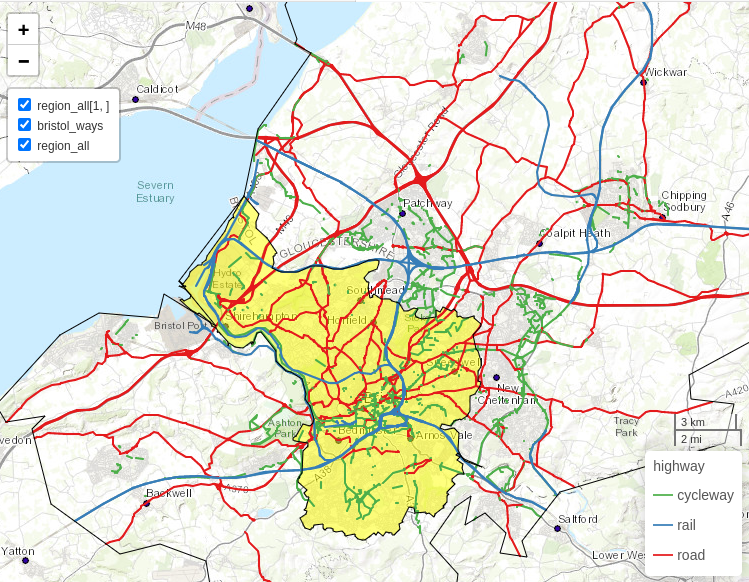
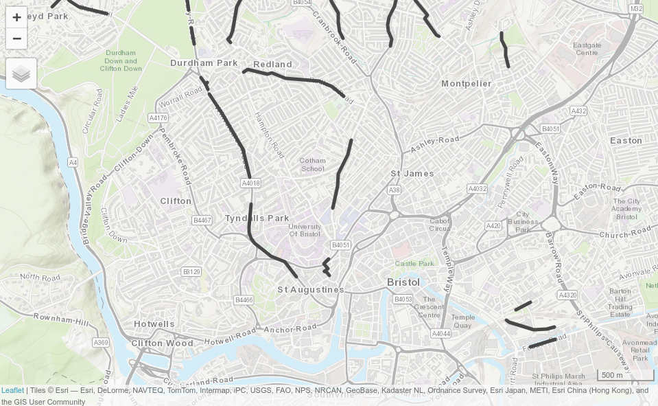

# (PART) Applications {.unnumbered}

# Transportation {#transport}

```{r, include=FALSE}
source("code/before_script.R")
```

```{r transport-setup, include=FALSE}
knitr::opts_chunk$set(warning = FALSE)
```

## Prerequisites {.unnumbered}

- This chapter uses the following packages:[^13-transport-1]

[^13-transport-1]: The **nabor** package must also be installed, although it does not need to be attached.

```{r 13-transport-1, message=FALSE, results='hide'}
library(sf)
library(dplyr)
library(spDataLarge)
library(stplanr)      # for processing geographic transport data
library(tmap)         # map making (see Chapter 9)
library(ggplot2)      # data visualization package
library(sfnetworks)   # spatial network classes and functions 
```

## Introduction

In few other sectors is geographic space more tangible than transportation.
The effort of moving (overcoming distance) is central to the 'first law' of geography, defined by Waldo Tobler in 1970 as follows [@tobler_computer_1970]:

> Everything is related to everything else, but near things are more related than distant things.

This 'law' is the basis for spatial autocorrelation\index{autocorrelation!spatial} and other key geographic concepts.
It applies to phenomena as diverse as friendship networks and ecological diversity and can be explained by the costs of transport --- in terms of time, energy and money --- which constitute the 'friction of distance'.
From this perspective, transport technologies are disruptive, changing spatial relationships between geographic entities including mobile humans and goods: "the purpose of transportation is to overcome space" [@rodrigue_geography_2013].

Transport is an inherently spatial activity, involving moving from an origin point 'A' to a destination point 'B', through infinite localities in between.
It is therefore unsurprising that transport researchers have long turned to geographic and computational methods to understand movement patterns, and how interventions can improve their performance [@lovelace_open_2021].

This chapter introduces the geographic analysis of transport systems at different geographic levels:

- **Areal units**\index{areal units}: transport patterns can be understood with reference to zonal aggregates, such as the main mode of travel (by car, bike or foot, for example), and average distance of trips made by people living in a particular zone, covered in Section \@ref(transport-zones)
- **Desire lines**\index{desire lines}: straight lines that represent 'origin-destination' data that records how many people travel (or could travel) between places (points or zones) in geographic space, the topic of Section \@ref(desire-lines)
- **Nodes**\index{node}: these are points in the transport system that can represent common origins and destinations and public transport stations such as bus stops and rail stations, the topic of Section \@ref(nodes)
- **Routes**\index{routes}: these are lines representing a path along the route network along the desire lines and between nodes.
Routes (which can be represented as single linestrings or multiple short *segments*) and the *routing engines* that generate them, are covered in Section \@ref(routes)
- **Route networks**\index{network}: these represent the system of roads, paths and other linear features in an area and are covered in Section \@ref(route-networks).
They can be represented as geographic features (typically short segments of road that add up to create a full network) or structured as an interconnected graph, with the level of traffic on different segments referred to as 'flow' by transport modelers [@hollander_transport_2016]

Another key level is **agents**, mobile entities like you and me and vehicles that enable us to move such as bikes and buses.
These can be represented computationally in software such as [MATSim](http://www.matsim.org/) and [A/B Street](https://github.com/a-b-street/abstreet), which represent the dynamics of transport systems using an agent-based modeling (ABM)\index{agent-based modeling} framework, usually at high levels of spatial and temporal resolution [@horni_multi-agent_2016]. 
ABM is a powerful approach to transport research with great potential for integration with R's spatial classes [@thiele_r_2014; @lovelace_spatial_2016], but is outside the scope of this chapter.
Beyond geographic levels and agents, the basic unit of analysis in many transport models is the **trip**, a single purpose journey from an origin 'A' to a destination 'B' [@hollander_transport_2016].
Trips join-up the different levels of transport systems and can be represented simplistically as geographic *desire lines* connecting *zone* centroids\index{centroid} (*nodes*) or as routes that follow the transport *route network*.
In this context, *agents*\index{agent-based modeling} are usually point entities that move within the transport network.

Transport systems are dynamic [@xie_evolving_2011].
While the focus of this chapter is the *geographic* analysis of a transport systems, it provides insights into how the approach can be used to simulate scenarios of change, in Section \@ref(prioritizing-new-infrastructure). 
The purpose of geographic transport modeling can be interpreted as simplifying the complexity of these spatio-temporal systems in ways that capture their essence.
Selecting appropriate levels of geographic analysis can help simplify this complexity without losing its most important features and variables, enabling better decision making and more effective interventions [@hollander_transport_2016].

Typically, models are designed to tackle a particular problem, such as how to improve safety or the environmental performance of transport systems.
For this reason, this chapter is based around a policy scenario, introduced in the next section, that asks: how to increase cycling in the city of Bristol?
Chapter \@ref(location) demonstrates a related application of geocomputation: prioritizing the location of new bike shops.
There is a link between the chapters: new and effectively-located cycling infrastructure can get people cycling, boosting demand for bike shops and local economic activity.
This highlights an important feature of transport systems: they are closely linked to broader phenomena and land-use patterns.

## A case study of Bristol {#bris-case}

The case study used for this chapter is located in Bristol, a city in the west of England, around 30 km east of the Welsh capital Cardiff.
An overview of the region's transport network is illustrated in Figure \@ref(fig:bristol), which shows a diversity of transport infrastructure, for cycling, public transport, and private motor vehicles.

```{r 13-transport-2, echo=FALSE, eval=FALSE}
# code that generated the input data - see also ?bristol_ways
# source("https://github.com/geocompx/geocompr/raw/main/code/13-transport-data-gen.R") 
# view input data
# summary(bristol_ways)
# summary(bristol_ttwa)
# summary(bristol_region)
library(tmap)
region_all = rbind(bristol_region, bristol_ttwa)
tmap_mode("view")
tm_shape(region_all[1, ], bbox = region_all) +
  tm_fill("yellow", col_alpha = 0.5) +
  tm_shape(bristol_ways) +
  tm_lines(col = "highway", lwd = 2.1, col.scale = tm_scale(values = "-Set1")) +
  tm_scalebar() +
  tm_shape(region_all) +
  tm_borders(col = "black") +
  tm_basemap(server = leaflet::providers$Esri.WorldTopoMap)
```

```{r bristol, echo=FALSE, fig.cap="Bristol's transport network represented by colored lines for active (green), public (railways, blue) and private motor (red) modes of travel. Black border lines represent the inner city boundary (highlighted in yellow) and the larger Travel To Work Area (TTWA).", fig.scap="Bristol's transport network."}

```

Bristol is the 10^th^ largest city council in England, with a population of half a million people, although its travel catchment area\index{catchment area} is larger (see Section \@ref(transport-zones)).
It has a vibrant economy with aerospace, media, financial service and tourism companies, alongside two major universities.
Bristol shows a high average income per person but also contains areas of severe deprivation [@bristol_city_council_deprivation_2015].

In terms of transport, Bristol is well served by rail and road links, and has a relatively high level of active travel.
19% of its citizens cycle and 88% walk at least once per month according to the [Active People Survey](https://www.gov.uk/government/statistical-data-sets/how-often-and-time-spent-walking-and-cycling-at-local-authority-level-cw010#table-cw0103) (the national average is 15% and 81%, respectively).
8% of the population said they cycled to work in the 2011 census, compared with only 3% nationwide.

```{r 13-transport-3, eval=FALSE, echo=FALSE}
if (!require(readODS)) {
  install.packages("readODS")
}
u = "https://www.gov.uk/government/uploads/system/uploads/attachment_data/file/536823/local-area-walking-and-cycling-in-england-2015.zip"
download.file(u, "local-area-walking-and-cycling-in-england-2015.zip")
unzip("local-area-walking-and-cycling-in-england-2015.zip")
View(readODS::read_ods("Table index.ods"))
cw0103 = readODS::read_ods("cw0103.ods")
View(cw0103)
```

Like many cities, Bristol has major congestion, air quality and physical inactivity problems.
Cycling can tackle all of these issues efficiently: it has a greater potential to replace car trips than walking, with typical [speeds](https://en.wikipedia.org/wiki/Bicycle_performance) of 15-20 km/h vs 4-6 km/h for walking.
For this reason Bristol's [Transport Strategy](https://www.bristol.gov.uk/council-and-mayor/policies-plans-and-strategies/bristol-transport-strategy) has ambitious plans for cycling.

To highlight the importance of policy considerations in transportation research, this chapter is guided by the need to provide evidence for people (transport planners, politicians and other stakeholders) tasked with getting people out of cars and onto more sustainable modes --- walking and cycling in particular.
The broader aim is to demonstrate how geocomputation can support evidence-based transport planning.
In this chapter you will learn how to:

- Describe the geographical patterns of transport behavior in cities
- Identify key public transport nodes supporting multi-modal trips
- Analyze travel 'desire lines' to find where many people drive short distances
- Identify cycle route locations that will encourage less car driving and more cycling

To get the wheels rolling on the practical aspects of this chapter, the next section begins by loading zonal data on travel patterns.
These zone-level datasets are small but often vital for gaining a basic understanding of a settlement's overall transport system.

## Transport zones

Although transport systems are primarily based on linear features and nodes --- including pathways and stations --- it often makes sense to start with areal data, to break continuous space into tangible units [@hollander_transport_2016].
In addition to the boundary defining the study area (Bristol in this case), two zone types are of particular interest to transport researchers: origin and destination zones.
Often, the same geographic units are used for origins and destinations.
However, different zoning systems, such as '[Workplace Zones](https://www.data.gov.uk/dataset/022e455a-b5cc-4247-bfc5-1aaf9da78379/workplace-zones-a-new-geography-for-workplace-statistics)', may be appropriate to represent the increased density of trip destinations in areas with many 'trip attractors' such as schools and shops [@office_for_national_statistics_workplace_2014].

The simplest way to define a study area is often the first matching boundary returned by OpenStreetMap\index{OpenStreetMap}.
This can be done with a command such as `osmdata::getbb("Bristol", format_out = "sf_polygon",  limit = 1)`.
This returns an `sf` object (or a list of `sf` objects if `limit = 1` is not specified) representing the bounds of the largest matching city region, either a rectangular polygon of the bounding box or a detailed polygonal boundary.[^13-transport-2]
For Bristol, a detailed polygon is returned, as represented by the `bristol_region` object in the **spDataLarge** package.
See the inner blue boundary in Figure \@ref(fig:bristol): there are a couple of issues with this approach:

[^13-transport-2]: In cases where the first match does not provide the right name, the country or region should be specified, for example `Bristol Tennessee` for a Bristol located in America.

- The first boundary returned by OSM may not be the official boundary used by local authorities
- Even if OSM returns the official boundary, this may be inappropriate for transport research because they bear little relation to where people travel

Travel to Work Areas (TTWAs) address these issues by creating a zoning system analogous to hydrological watersheds.
TTWAs were first defined as contiguous zones within which 75% of the population travels to work [@coombes_efficient_1986], and this is the definition used in this chapter.
Because Bristol is a major employer attracting travel from surrounding towns, its TTWA is substantially larger than the city bounds (see Figure \@ref(fig:bristol)).
The polygon representing this transport-orientated boundary is stored in the object `bristol_ttwa`, provided by the **spDataLarge** package loaded at the beginning of this chapter.

The origin and destination zones used in this chapter are the same: officially defined zones of intermediate geographic resolution (their [official](https://www.ons.gov.uk/peoplepopulationandcommunity/populationandmigration/populationestimates/bulletins/annualsmallareapopulationestimates/2014-10-23) name is Middle layer Super Output Areas or MSOAs).
Each houses around 8,000 people.
Such administrative zones can provide vital context to transport analysis, such as the type of people who might benefit most from particular interventions (e.g., @moreno-monroy_public_2017).

The geographic resolution of these zones is important: small zones with high geographic resolution are usually preferable but their high number in large regions can have consequences for processing (especially for origin-destination analysis in which the number of possibilities increases as a non-linear function of the number of zones) [@hollander_transport_2016].

```{block 13-transport-4, type='rmdnote'}
Another issue with small zones is related to anonymity rules.
To make it impossible to infer the identity of individuals in zones, detailed socio-demographic variables are often only available at a low geographic resolution. 
Breakdowns of travel mode by age and sex, for example, are available at the Local Authority level in the UK, but not at the much higher Output Area level, each of which contains around 100 households.
For further details, see www.ons.gov.uk/methodology/geography.
```

The 102 zones used in this chapter are stored in `bristol_zones`, as illustrated in Figure \@ref(fig:zones).
Note the zones get smaller in densely populated areas: each houses a similar number of people.
`bristol_zones` contains no attribute data on transport, however, only the name and code of each zone:

```{r 13-transport-5}
names(bristol_zones)
```

To add travel data, we will perform an *attribute join*\index{attribute!join}, a common task described in Section \@ref(vector-attribute-joining).
We will use travel data from the UK's 2011 census question on travel to work, data stored in `bristol_od`, which was provided by the [ons.gov.uk](https://www.ons.gov.uk/help/localstatistics) data portal.
`bristol_od` is an origin-destination (OD) dataset on travel to work between zones from the UK's 2011 Census (see Section \@ref(desire-lines)).
The first column is the ID of the zone of origin and the second column is the zone of destination.
`bristol_od` has more rows than `bristol_zones`, representing travel *between* zones rather than the zones themselves:

```{r 13-transport-6}
nrow(bristol_od)
nrow(bristol_zones)
```

The results of the previous code chunk shows that there are more than 10 OD pairs for every zone, meaning we will need to aggregate the origin-destination data before it is joined with `bristol_zones`, as illustrated below (origin-destination data is described in Section \@ref(desire-lines)).

```{r 13-transport-7}
zones_attr = bristol_od |> 
  group_by(o) |> 
  summarize(across(where(is.numeric), sum)) |> 
  dplyr::rename(geo_code = o)
```

The preceding chunk:

- Grouped the data by zone of origin (contained in the column `o`)
- Aggregated the variables in the `bristol_od` dataset *if* they were numeric, to find the total number of people living in each zone by mode of transport[^13-transport-3]
- Renamed the grouping variable `o` so it matches the ID column `geo_code` in the `bristol_zones` object

[^13-transport-3]: The `_if` affix requires a `TRUE`/`FALSE` question to be asked of the variables, in this case 'is it numeric?' and only variables returning true are summarized.

The resulting object `zones_attr` is a data frame with rows representing zones and an ID variable.
We can verify that the IDs match those in the `zones` dataset using the `%in%` operator as follows:

```{r 13-transport-8}
summary(zones_attr$geo_code %in% bristol_zones$geo_code)
```

The results show that all 102 zones are present in the new object and that `zone_attr` is in a form that can be joined onto the zones.[^13-transport-4]
This is done using the joining function `left_join()` (note that `inner_join()` would produce here the same result): \index{join!inner} \index{join!left}

[^13-transport-4]: It would also be important to check that IDs match in the opposite direction on real data.
    This could be done by changing the order of the IDs in the `summary()` command --- `summary(bristol_zones$geo_code %in% zones_attr$geo_code)` --- or by using `setdiff()` as follows: `setdiff(bristol_zones$geo_code, zones_attr$geo_code)`.

```{r 13-transport-9}
zones_joined = left_join(bristol_zones, zones_attr, by = "geo_code")
sum(zones_joined$all)
names(zones_joined)
```

The result is `zones_joined`, which contains new columns representing the total number of trips originating in each zone in the study area (almost 1/4 of a million) and their mode of travel (by bicycle, foot, car and train).
The geographic distribution of trip origins is illustrated in the left-hand map in Figure \@ref(fig:zones).
This shows that most zones have between 0 and 4,000 trips originating from them in the study area.
More trips are made by people living near the center of Bristol and fewer on the outskirts.
Why is this?
Remember that we are only dealing with trips within the study region: low trip numbers in the outskirts of the region can be explained by the fact that many people in these peripheral zones will travel to other regions outside of the study area.
Trips outside the study region can be included in regional model by a special destination ID covering any trips that go to a zone not represented in the model [@hollander_transport_2016].
The data in `bristol_od`, however, simply ignores such trips: it is an 'intra-zonal' model.

In the same way that OD datasets can be aggregated to the zone of origin, they can also be aggregated to provide information about destination zones.
People tend to gravitate towards central places.
This explains why the spatial distribution represented in the right panel in Figure \@ref(fig:zones) is relatively uneven, with the most common destination zones concentrated in Bristol city center.
The result is `zones_od`, which contains a new column reporting the number of trip destinations by any mode, is created as follows:

```{r 13-transport-10}
zones_destinations = bristol_od |> 
  group_by(d) |> 
  summarize(across(where(is.numeric), sum)) |> 
  select(geo_code = d, all_dest = all)
zones_od = inner_join(zones_joined, zones_destinations, by = "geo_code")
```

A simplified version of Figure \@ref(fig:zones) is created with the code below (see `13-zones.R` in the [`code`](https://github.com/geocompx/geocompr/tree/main/code) folder of the book's GitHub repository to reproduce the figure and Section \@ref(faceted-maps) for details on faceted maps with **tmap**\index{tmap (package)}):

```{r 13-transport-11, eval=FALSE}
qtm(zones_od, c("all", "all_dest")) +
  tm_layout(panel.labels = c("Origin", "Destination"))
```

```{r zones, echo=FALSE, fig.cap="Number of trips (commuters) living and working in the region. The left map shows zone of origin of commute trips; the right map shows zone of destination (generated by the script 13-zones.R).", message=FALSE, fig.scap="Number of trips (commuters) living and working in the region."}
# file.edit("code/13-zones.R")
source("code/13-zones.R", print.eval = TRUE)
```

## Desire lines

Desire lines\index{desire lines} connect origins and destinations, representing where people *desire* to go, typically between zones.
They represent the quickest 'bee line' or 'crow flies' route between A and B that would be taken, if it were not for obstacles such as buildings and windy roads getting in the way (we will see how to convert desire lines into routes in the next section).
Typically, desire lines are represented geographically as starting and ending in the geographic (or population weighted) centroid of each zone.
This is the type of desire line that we will create and use in this section, although it is worth being aware of 'jittering' techniques that enable multiple start and end points to increase the spatial coverage and accuracy of analyses building on OD data [@lovelace_jittering_2022b].

We have already loaded data representing desire lines in the dataset `bristol_od`.
This origin-destination (OD) data frame object represents the number of people traveling between the zone represented in `o` and `d`, as illustrated in Table \@ref(tab:od).
To arrange the OD data by all trips and then filter-out only the top 5, type (please refer to Chapter \@ref(attr) for a detailed description of non-spatial attribute operations):

```{r 13-transport-12}
od_top5 = bristol_od |> 
  slice_max(all, n = 5)
```

```{r od, echo=FALSE}
od_top5 |> 
  knitr::kable(
    caption = paste("Sample of the top 5 origin-destination pairs in the",
                    "Bristol OD data frame, representing travel desire",
		    "lines between zones in the study area."),
    caption.short = "Sample of the origin-destination data.",
    booktabs = TRUE)
```

The resulting table provides a snapshot of Bristolian travel patterns in terms of commuting (travel to work).
It demonstrates that walking is the most popular mode of transport among the top 5 origin-destination pairs, that zone `E02003043` is a popular destination (Bristol city center, the destination of all the top 5 OD pairs), and that the *intrazonal* trips, from one part of zone `E02003043` to another (first row of Table \@ref(tab:od)), constitute the most traveled OD pair in the dataset.
But from a policy perspective, the raw data presented in Table \@ref(tab:od) is of limited use: aside from the fact that it contains only a tiny portion of the 2,910 OD pairs, it tells us little about *where* policy measures are needed, or *what proportion* of trips are made by walking and cycling.
The following command calculates the percentage of each desire line that is made by these active modes:

```{r 13-transport-13}
bristol_od$Active = (bristol_od$bicycle + bristol_od$foot) /
  bristol_od$all * 100
```

There are two main types of OD pairs: *interzonal* and *intrazonal*.
Interzonal OD pairs represent travel between zones in which the destination is different from the origin.
Intrazonal OD pairs represent travel within the same zone (see the top row of Table \@ref(tab:od)).
The following code chunk splits `od_bristol` into these two types:

```{r 13-transport-14}
od_intra = filter(bristol_od, o == d)
od_inter = filter(bristol_od, o != d)
```

The next step is to convert the interzonal OD pairs into an `sf` object representing desire lines that can be plotted on a map with the **stplanr**\index{stplanr (package)} function `od2line()`.[^13-transport-5]

[^13-transport-5]: `od2line()` works by matching the IDs in the first two columns of the `bristol_od` object to the `zone_code` ID column in the geographic `zones_od` object.
    Note that the operation emits a warning because `od2line()` works by allocating the start and end points of each origin-destination pair to the *centroid*\index{centroid} of its zone of origin and destination.
    For real-world use one would use centroid values generated from projected data or, preferably, use *population-weighted* centroids [@lovelace_propensity_2017].

```{r 13-transport-15, warning=FALSE}
desire_lines = od2line(od_inter, zones_od)
```

An illustration of the results is presented in Figure \@ref(fig:desire), a simplified version of which is created with the following command (see the code in `13-desire.R` to reproduce the figure exactly and Chapter \@ref(adv-map) for details on visualization with **tmap**\index{tmap (package)}):

```{r 13-transport-16, eval=FALSE}
qtm(desire_lines, lines.lwd = "all")
```

```{r desire, echo=FALSE, warning=FALSE, message=FALSE, fig.cap="Desire lines representing trip patterns in Bristol, with width representing number of trips and color representing the percentage of trips made by active modes (walking and cycling). The four black lines represent the interzonal OD pairs in Table 13.1.", fig.asp=0.8, fig.scap="Desire lines representing trip patterns in Bristol."}
source("code/13-desire.R", print.eval = TRUE)
```

The map shows that the city center dominates transport patterns in the region, suggesting policies should be prioritized there, although a number of peripheral sub-centers can also be seen.
Desire lines are important generalized components of transport systems.
More concrete components include nodes, which have specific destinations (rather than hypothetical straight lines represented in desire lines).
Nodes are covered in the next section.

## Nodes {#nodes}

Nodes in geographic transport datasets are points among the predominantly linear features that comprise transport networks.
Broadly are two main types of transport nodes:

1.  Nodes not directly on the network\index{network} such as zone centroids\index{centroid} or individual origins and destinations such as houses and workplaces
2.  Nodes that are a part of transport networks. 
Technically, a node can be located at any point on a transport network but in practice they are often special kinds of vertex such as intersections between pathways (junctions) and points for entering or exiting a transport network such as bus stops and train stations[^13-transport-6]

[^13-transport-6]: The function [`st_network_blend()`](https://luukvdmeer.github.io/sfnetworks/reference/st_network_blend.html) from the **sfnetworks** package allows new nodes to be created on the network based on proximity to arbitrary points on or off the network.

Transport networks can be represented as graphs\index{graph}, in which each segment is connected (via edges representing geographic lines) to one or more other edges\index{edge} in the network.
Nodes outside the network can be added with "centroid connectors", new route segments to nearby nodes on the network [@hollander_transport_2016].[^13-transport-7]
Every node\index{node} in the network is then connected by one or more 'edges' that represent individual segments on the network.
We will see how transport networks can be represented as graphs in Section \@ref(route-networks).

[^13-transport-7]: The location of these connectors should be chosen carefully because they can lead to over-estimates of traffic volumes in their immediate surroundings [@jafari_investigation_2015].

Public transport stops are particularly important nodes that can be represented as either type of node: a bus stop that is part of a road, or a large rail station that is represented by its pedestrian entry point hundreds of meters from railway tracks.
We will use railway stations to illustrate public transport nodes, in relation to the research question of increasing cycling in Bristol.
These stations are provided by **spDataLarge** in `bristol_stations`.

A common barrier preventing people from switching away from cars for commuting to work is that the distance from home to work is too far to walk or cycle.
Public transport can reduce this barrier by providing a fast and high-volume option for common routes into cities.
From an active travel perspective, public transport 'legs' of longer journeys divide trips into three:

- The origin leg, typically from residential areas to public transport stations
- The public transport leg, which typically goes from the station nearest a trip's origin to the station nearest its destination
- The destination leg, from the station of alighting to the destination

Building on the analysis conducted in Section \@ref(desire-lines), public transport nodes can be used to construct three-part desire lines for trips that can be taken by bus and (the mode used in this example) rail.
The first stage is to identify the desire lines with most public transport travel, which in our case is easy because our previously created dataset `desire_lines` already contains a variable describing the number of trips by train (the public transport potential could also be estimated using public transport routing services such as [OpenTripPlanner](http://www.opentripplanner.org/)).
To make the approach easier to follow, we will select only the top three desire lines\index{desire lines} in terms of rails use:

```{r 13-transport-20}
desire_rail = top_n(desire_lines, n = 3, wt = train)
```

The challenge now is to 'break-up' each of these lines into three pieces, representing travel via public transport nodes.
This can be done by converting a desire line into a multilinestring object consisting of three line geometries representing origin, public transport and destination legs of the trip.
This operation can be divided into three stages: matrix creation (of origins, destinations and the 'via' points representing rail stations), identification of nearest neighbors\index{nearest neighbor} and conversion to multilinestrings\index{vector!multilinestrings}.
These are undertaken by `line_via()`.
This **stplanr**\index{stplanr (package)} function takes input lines and points and returns a copy of the desire lines --- see the [`?line_via()`](https://docs.ropensci.org/stplanr/reference/line_via.html) for details on how this works.
The output is the same as the input line, except it has new geometry columns representing the journey via public transport nodes, as demonstrated below:

```{r 13-transport-21}
ncol(desire_rail)
desire_rail = line_via(desire_rail, bristol_stations)
ncol(desire_rail)
```

As illustrated in Figure \@ref(fig:stations), the initial `desire_rail` lines now have three additional geometry list columns\index{list column} representing travel from home to the origin station, from there to the destination, and finally from the destination station to the destination.
In this case, the destination leg is very short (walking distance) but the origin legs may be sufficiently far to justify investment in cycling infrastructure to encourage people to cycle to the stations on the outward leg of peoples' journey to work in the residential areas surrounding the three origin stations in Figure \@ref(fig:stations).

```{r stations, echo=FALSE, message=FALSE, warning=FALSE, fig.cap="Station nodes (red dots) used as intermediary points that convert straight desire lines with high rail usage (thin green lines) into three legs: to the origin station (orange) via public transport (blue) and to the destination (pink, not visible because it is so short).", fig.scap="Station nodes."}
# zone_cents = st_centroid(zones_od)
zone_cents = st_centroid(zones_od)
zone_cents_rail = zone_cents[desire_rail, ]
bb = tmaptools::bb(desire_rail, ext = 1.1)
desire_rail_plot = rbind(
  st_sf(data.frame(Geometry = "Desire line (original)"), geometry = desire_rail$geometry),
  st_sf(data.frame(Geometry = "Leg 1 (origin to station)"), geometry = desire_rail$leg_orig),
  st_sf(data.frame(Geometry = "Leg 2 (station to station)"), geometry = desire_rail$leg_via),
  st_sf(data.frame(Geometry = "Leg 3 (station to destination)"), geometry = desire_rail$leg_dest)
) 
desire_rail_plot = desire_rail_plot |> 
  mutate(lty = case_when(Geometry == "Desire line (original)" ~ 2, TRUE ~ 1)) |> 
  mutate(size = case_when(Geometry == "Desire line (original)" ~ 1, TRUE ~ 2))
bristol_rail_points = rbind(
  st_sf(data.frame(
    Node = "Origin and destination locations",
    col = "black"
    ), geometry = zone_cents_rail$geometry),
  st_sf(data.frame(
    Node = "Public transport node",
    col = "red"
    ), geometry = bristol_stations$geometry)
)
tm_shape(zones_od) +
  tm_fill(fill_alpha = 0.2, lwd = 0.1) +
  tm_shape(desire_rail_plot, bbox = bb, is.main = TRUE) +
  tm_lines(col = "Geometry",
           col.scale = tm_scale(values = "Set2"),
           col.legend = tm_legend(position = tm_pos_in("left", "top")),
           lwd = 2,
           lty = "lty",
           lty.scale = tm_scale_categorical(),
           lty.legend = tm_legend_hide()) +
  tm_shape(bristol_rail_points) +
  tm_symbols(fill = "col", size = 0.75) +
  tm_scalebar()
```

## Routes

\index{routes}
From a geographical perspective, routes are desire lines\index{desire lines} that are no longer straight: the origin and destination points are the same as in the desire line representation of travel, but the pathway to get from A to B is more complex.
The geometries of routes are typically (but not always) determined by the transport network.

While desire lines contain only two vertices (their beginning and end points), routes can contain any number of vertices, representing points between A and B joined by straight lines: the definition of a linestring geometry.
Routes covering large distances or following intricate network can have many hundreds of vertices; routes on grid-based or simplified road networks tend to have fewer.

Routes are generated from desire lines or, more commonly, matrices containing coordinate pairs representing desire lines.
This routing process is done by a range of broadly-defined *routing engines*: software and web services that return geometries and attributes describing how to get from origins to destinations.
Routing engines can be classified based on *where* they run relative to R:

- In-memory routing using R packages that enable route calculation (described in Section \@ref(memengine))
- Locally hosted routing engines external to R that can be called from R (Section \@ref(localengine))
- Remotely hosted routing engines by external entities that provide a web API that can be called from R (Section \@ref(remoteengine))

Before describing each, it is worth outlining other ways of categorizing routing engines.
Routing engines can be multi-modal, meaning that they can calculate trips composed of more than one mode of transport, or not.
Multi-modal routing engines can return results consisting of multiple *legs*, each one made by a different mode of transport.
The optimal route from a residential area to a commercial area could involve 1) walking to the nearest bus stop, 2) catching the bus to the nearest node to the destination, and 3) walking to the destination, given a set of input parameters.
The transition points between these three legs are commonly referred to as 'ingress' and 'egress', meaning getting on/off a public transport vehicle.
Multi-modal routing engines such as R5 are more sophisticated and have larger input data requirements than 'uni-modal' routing engines such as OSRM (described in Section \@ref(localengine)).

A major strength of multi-modal engines is their ability to represent 'transit' (public transport) trips by trains, buses etc.
Multi-model routing engines require input datasets representing public transport networks, typically in General Transit Feed Specification ([GTFS](https://developers.google.com/transit/gtfs)) files, which can be processed with functions in the [**tidytransit**](https://r-transit.github.io/tidytransit/index.html) and [**gtfstools**](https://ipeagit.github.io/gtfstools/) packages (other packages and tools for working with GTFS files are available).
Single mode routing engines may be sufficient for projects focused on specific (non public) modes of transport.
Another way of classifying routing engines (or settings) is by the geographic level of the outputs: routes, legs and segments.


### Routes, legs and segments {#route-legs-segments}

Routing engines can generate outputs at three geographic levels of routes, legs and segments:

- **Route** level outputs contain a single feature (typically a multilinestring and associated row in the data frame representation) per origin-destination pair, meaning a single row of data per trip
- **Leg** level outputs contain a single feature and associated attributes each *mode* within each origin-destination pair, as described in Section \@ref(nodes). For trips only involving one mode (for example driving from home to work, ignoring the short walk to the car) the leg is the same as the route: the car journey. For trips involving public transport, legs provide key information.  The **r5r** function `detailed_itineraries()` returns legs which, confusingly, are sometimes referred to as 'segments'
- Segment level outputs provide the most detailed information about routes, with records for each small section of the transport network. Typically segments are similar in length, or identical to, ways in OpenStreetMap. The **cyclestreets** function `journey()` returns data at the segment level which can be aggregated by grouping by origin and destination level data returned by the `route()` function in **stplanr**

Most routing engines return route level by default, although multi-modal engines generally provide outputs at the leg level (one feature per continuous movement by a single mode of transport).
Segment level outputs have the advantage of providing more detail.
The **cyclestreets** package returns multiple 'quietness' levels per route, enabling identification of the 'weakest link' in cycle networks.
Disadvantages of segment level outputs include increased file sizes and complexities associated with the extra detail.

Route level results can be converted into segment level results using the function `stplanr::overline()` [@morgan_travel_2020].
When working with segment or leg-level data, route-level statistics can be returned by grouping by columns representing trip start and end points and summarizing/aggregating columns containing segment-level data.

### In-memory routing with R {#memengine}

Routing engines in R enable route networks stored as R objects *in memory* to be used as the basis of route calculation.
Options include [**sfnetworks**](https://luukvdmeer.github.io/sfnetworks/)\index{sfnetworks (package)}, [**dodgr**](https://urbananalyst.github.io/dodgr/) and [**cppRouting**](https://github.com/vlarmet/cppRouting) packages, each of which provide their own class system to represent route networks, the topic of the next section.

While fast and flexible, native R routing options are generally harder to set-up than dedicated routing engines for realistic route calculation.
Routing is a hard problem and many hundreds of hours have been put into open source routing engines that can be downloaded and hosted locally.
On the other hand, R-based routing engines may be well-suited to model experiments and the statistical analysis of the impacts of changes on the network.
Changing route network characteristics (or weights associated with different route segment types), re-calculating routes, and analyzing results under many scenarios in a single language has benefits for research applications.

### Locally hosted dedicated routing engines {#localengine}

**Locally hosted** routing engines include OpenTripPlanner, [Valhalla](https://github.com/valhalla/valhalla), and R5 (which are multi-modal), and the OpenStreetMap Routing Machine (OSRM) (which is 'uni-modal').
These can be accessed from R with the packages **opentripplanner**, [**valhallr**](https://github.com/chris31415926535/valhallr), **r5r** and [**osrm**](https://github.com/riatelab/osrm) [@morgan_opentripplanner_2019; @pereira_r5r_2021].
Locally hosted routing engines run on the user's computer but in a process separate from R.
They benefit from speed of execution and control over the weighting profile for different modes of transport.
Disadvantages include the difficulty of representing complex networks locally; temporal dynamics (primarily due to traffic); and the need for specialized external software.

### Remotely hosted dedicated routing engines {#remoteengine}

**Remotely hosted**\index{routing} routing engines use a web API\index{API} to send queries about origins and destinations and return results.
Routing services based on open source routing engines, such as OSRM's publicly available service, work the same when called from R as locally hosted instances, simply requiring arguments specifying 'base URLs' to be updated.
However, the fact that external routing services are hosted on a dedicated machine (usually funded by commercial company with incentives to generate accurate routes) can give them advantages, including:

- Provision of routing services worldwide (or usually at least over a large region)
- Established routing services are usually updated regularly and can often respond to traffic levels
- Routing services usually run on dedicated hardware and software including systems such as load balancers to ensure consistent performance

Disadvantages of remote routing services include speed when batch jobs are not possible (they often rely on data transfer over the internet on a route-by-route basis), price (the Google routing API, for example, limits the number of free queries) and licensing issues.
[**googleway**](http://symbolixau.github.io/googleway/) and [**mapbox**](https://walker-data.com/mapboxapi/articles/navigation.html) packages demonstrate this approach by providing access to routing services from Google and Mapbox, respectively\index{API}.
Free (but rate limited) routing service include [OSRM](http://project-osrm.org/) and [openrouteservice.org](https://openrouteservice.org/) which can be accessed from R with the [**osrm**](https://rgeomatic.hypotheses.org/category/osrm) and [**openrouteservice**](https://github.com/GIScience/openrouteservice-r) packages, the latter of which is not on CRAN.
There are also more specific routing services such as that provided by [CycleStreets.net](https://www.cyclestreets.net/), a cycle journey planner and not-for-profit transport technology company "for cyclists, by cyclists".
While R users can access CycleStreets routes via the package [**cyclestreets**](https://rpackage.cyclestreets.net/), many routing services lack R interfaces, representing a substantial opportunity for package development: building an R package to provide an interface to a web API can be a rewarding experience.

### Contraction hierarchies and traffic assigment

Contraction hierarchies and traffic assignment are advanced but important topics in transport modeling worth being aware of, especially if you want your code to scale to large networks.
Calculating many routes is computationally resource intensive and can take hours, leading to the development of several algorithms to speed-up routing calculations.
**Contraction hierarchies** is a well-known algorithm that can lead to a substantial (1000x+ in some cases) speed-up in routing tasks, depending on network size.
Contraction hierarchies are used behind the scenes in the routing engines mentioned in the previous sections.

Traffic assignment is a problem that is closely related to routing: in practice, the shortest path between two points is not always the fastest, especially if there is congestion.
The process takes OD datasets, of the kind described in Section \@ref(desire-lines), and assigns traffic to each segment in the network, generating route networks of the kind described in Section \@ref(route-networks).
An established solution is Wardrop’s principle of user equilibrium which shows that, to be realistic, congestion should be considered when estimating flows on the network, with reference to a mathematically defined relationship between cost and flow [@wardrop_theoretical_1952].
This optimization problem can be solved by iterative algorithms which are implemented in the [**cppRouting**](https://github.com/vlarmet/cppRouting) package, which also implements contraction hierarchies for fast routing.


### Routing: A worked example

Instead of routing\index{routing} *all* desire lines generated in Section \@ref(desire-lines), we focus on a subset that is highly policy relevant.
Running a computationally intensive operation on a subset before trying to process the whole dataset is often sensible, and this applies to routing.
Routing can be time and memory-consuming, resulting in large objects, due to the detailed geometries and extra attributes of route objects.
We will therefore filter the desire lines before calculating routes in this section.

Cycling is most beneficial when it replaces car trips.
Short trips (around 5 km, which can be cycled in 15 minutes at a speed of 20 km/hr) have a relatively high probability of being cycled, and the maximum distance increases when trips are made by electric bike [@lovelace_propensity_2017].
These considerations inform the following code chunk which filters the desire lines and returns the object `desire_lines_short` representing OD pairs between which many (100+) short (2.5 to 5 km Euclidean distance) trips are driven:

```{r 13-transport-17, message=FALSE}
desire_lines$distance_km = as.numeric(st_length(desire_lines)) / 1000
desire_lines_short = desire_lines |> 
  filter(car_driver >= 100, distance_km <= 5, distance_km >= 2.5)
```

In the code above `st_length()` calculated the length of each desire line, as described in Section \@ref(distance-relations).
The `filter()` function from **dplyr** filtered the `desire_lines` dataset based on the criteria outlined above\index{filter operation|see{attribute!subsetting}}, as described in Section \@ref(vector-attribute-subsetting).
The next stage is to convert these desire lines into routes.
This is done using the publicly available OSRM service with the **stplanr** functions `route()` and `route_osrm()`\index{stplanr (package)} in the code chunk below:

```{r 13-transport-18, message=FALSE}
routes_short = route(l = desire_lines_short, route_fun = route_osrm,
                     osrm.profile = "bike")
```

The output is `routes_short`, an `sf` object representing routes on the transport network\index{network} that are suitable for cycling (according to the OSRM routing engine at least), one for each desire line.
Note: calls to external routing engines such as in the command above only work with an internet connection (and sometimes an API key stored in an environment variable, although not in this case).
In addition to the columns contained in the `desire_lines` object, the new route dataset contains `distance` (referring to route distance this time) and `duration` columns (in seconds), which provide potentially useful extra information on the nature of each route.
We will plot desire lines along which many short car journeys take place alongside cycling routes.
Making the width of the routes proportional to the number of car journeys that could potentially be replaced provides an effective way to prioritize interventions on the road network [@lovelace_propensity_2017].
Figure \@ref(fig:routes) shows routes along which people drive short distances (see the github.com/geocompx for the source code).[^13-transport-8]

[^13-transport-8]: Note that the red routes and black desire lines do not start at exactly the same points.
    This is because zone centroids rarely lie on the route network: instead the routes originate from the transport network node nearest the centroid.
    Note also that routes are assumed to originate in the zone centroids, a simplifying assumption which is used in transport models to reduce the computational resources needed to calculate the shortest path between all combinations of possible origins and destinations [@hollander_transport_2016].

```{r routes, warning=FALSE, fig.cap="Routes along which many (100+) short (<5km Euclidean distance) car journeys are made (red) overlaying desire lines representing the same trips (black) and zone centroids (dots).", fig.scap="Routes along which many car journeys are made.", echo=FALSE}
# TODO (low priority, RL): add a facetted plot showing network cleaning/overline functions
# TODO (low priority, RL, 2022-10): add points representing Bradley Stoke and Bristol to the map
# waldo::compare(
#   sf::st_crs(desire_lines_short),
#   sf::st_crs(routes_short)
# )
routes_plot_data = rbind(
  desire_lines_short |> transmute(Entity = "Desire lines") |> sf::st_set_crs("EPSG:4326"),
  routes_short |> transmute(Entity = "Routes") |> sf::st_set_crs("EPSG:4326")
)
zone_cents_routes = zone_cents[desire_lines_short, ]
tm_shape(zones_od) +
  tm_fill(fill_alpha = 0.2, lwd = 0.1) +
  tm_shape(desire_lines_short, is.main = TRUE) + 
  tm_lines(lty = 2) +
  tm_shape(routes_short) +
  tm_lines(col = "red") +
  tm_add_legend(title = "Entity", labels = c("Desire lines", "Routes"),
                type = "lines", col = c("black", "red"), lty = c(2, 1),
                position = tm_pos_in("left", "top")) +
  tm_shape(zone_cents_routes) +
  tm_symbols(fill = "black", size = 0.5) +
  tm_scalebar()
```

Visualizing the results in an interactive map shows that many short car trips take place in and around Bradley Stoke, around 10 km North of central Bristol.
It is easy to find explanations for the area's high level of car dependency: according to [Wikipedia](https://en.wikipedia.org/wiki/Bradley_Stoke), Bradley Stoke is "Europe's largest new town built with private investment", suggesting limited public transport provision.
Furthermore, the town is surrounded by large (cycling unfriendly) road structures, including the M4 and M5 motorways [@tallon_bristol_2007].

There are many benefits of converting travel desire lines\index{desire lines} into routes.
It is important to remember that we cannot be sure how many (if any) trips will follow the exact routes calculated by routing engines.
However, route and street/way/segment level results can be highly policy relevant.
Route segment results can enable the prioritization of investment where it is most needed, according to available data [@lovelace_propensity_2017].

## Route networks

\index{network}
While routes generally contain data on travel *behavior*, at the same geographic level as desire lines and OD pairs, route network datasets usually represent the physical transport network.
Each *segment* in a route network roughly corresponds to a continuous section of street between junctions and appears only once, although the average length of segments depends on the data source (segments in the OSM-derived `bristol_ways` dataset used in this section have an average length of just over 200 m, with a standard deviation of nearly 500 m).
Variability in segment lengths can be explained by the fact that in some rural locations junctions are far apart while in dense urban areas there are crossings and other segment breaks every few meters.

Route networks can be an input into, or an output of, transport data analysis projects, or both.
Any transport research that involves route calculation requires a route network dataset in the internal or external routing engines (in the latter case the route network data is not necessarily imported into R).
However, route networks are also important outputs in many transport research projects: summarizing data such as the potential number of trips made on particular segments and represented as a route network, can help prioritize investment where it is most needed.
\index{network}

To demonstrate how to create route networks as an output derived from route level data, imagine a simple scenario of mode shift.
Imagine that 50% of car trips between 0 to 3 km in route distance are replaced by cycling, a percentage that drops by 10 percentage points for every additional km of route distance so that 20% of car trips of 6 km are replaced by cycling and no car trips that are 8 km or longer are replaced by cycling.
This is of course an unrealistic scenario [@lovelace_propensity_2017], but is a useful starting point.
In this case, we can model mode shift from cars to bikes as follows:

```{r uptakefun}
uptake = function(x) {
  case_when(
    x <= 3 ~ 0.5,
    x >= 8 ~ 0,
    TRUE ~ (8 - x) / (8 - 3) * 0.5
  )
}
routes_short_scenario = routes_short |> 
  mutate(uptake = uptake(distance / 1000)) |> 
  mutate(bicycle = bicycle + car_driver * uptake,
         car_driver = car_driver * (1 - uptake))
sum(routes_short_scenario$bicycle) - sum(routes_short$bicycle)
```

Having created a scenario in which approximately 4000 trips have switched from driving to cycling, we can now model where this updated modeled cycling activity will take place.
For this, we will use the function `overline()` from the **stplanr** package.
The function breaks linestrings at junctions (were two or more linestring geometries meet), and calculates aggregate statistics for each unique route segment [@morgan_travel_2020], taking an object containing routes and the names of the attributes to summarize as the first and second argument:

```{r rnet1}
route_network_scenario = overline(routes_short_scenario, attrib = "bicycle")
```

The outputs of the two preceding code chunks are summarized in Figure \@ref(fig:rnetvis) below.

```{r rnetvis, out.width="49%", fig.show='hold', fig.cap="Illustration of the percentage of car trips switching to cycling as a function of distance (left) and route network level results of this function (right).", echo=FALSE, fig.height=9.5}
routes_short_scenario |> 
  ggplot() +
  geom_line(aes(distance / 1000, uptake), color = "red", linewidth = 3) +
  labs(x = "Route distance (km)", y = NULL, title = "Percent trips switching from driving to cycling") +
  scale_y_continuous(labels = scales::percent)
tm_shape(zones_od) +
  tm_fill(fill_alpha = 0.2, lwd = 0.1) +
  tm_shape(route_network_scenario, is.main = TRUE) +
  tm_lines(lwd = "bicycle", 
           lwd.scale = tm_scale(values.scale = 1.5),
           lwd.legend = tm_legend(title = "Number of bike trips per day\n(modeled, one direction)",
                                  position = tm_pos_in("left", "top")),
           col = "red")
```

Transport networks with records at the segment level, typically with attributes such as road type and width, constitute a common type of route network.
Such route network datasets are available worldwide from OpenStreetMap, and can be downloaded with packages such as **osmdata**\index{osmdata (package)} and **osmextract**\index{osmextract (package)}.
To save time downloading and preparing OSM\index{OpenStreetMap}, we will use the `bristol_ways` object from the **spDataLarge** package, an `sf` object with LINESTRING geometries and attributes representing a sample of the transport network in the case study region (see `?bristol_ways` for details), as shown in the output below:

```{r 13-transport-22}
summary(bristol_ways)
```

The output shows that `bristol_ways` represents just over 6 thousand segments on the transport network\index{network}.
This and other geographic networks can be represented as mathematical graphs\index{graph}, with nodes\index{node} on the network, connected by edges\index{edge}.
A number of R packages have been developed for dealing with such graphs, notably **igraph**\index{igraph (package)}.
You can manually convert a route network into an `igraph` object, but the geographic attributes will be lost.
To overcome this limitation of **igraph**, the **sfnetworks**\index{sfnetworks (package)} package [@R-sfnetworks], which to represent route networks simultaneously as graphs *and* geographic lines, was developed.
We will demonstrate **sfnetworks** functionality on the `bristol_ways` object.

```{r 13-transport-23}
bristol_ways$lengths = st_length(bristol_ways)
ways_sfn = as_sfnetwork(bristol_ways)
class(ways_sfn)
```

```{r 13-transport-23-2, eval=FALSE}
ways_sfn
#> # A sfnetwork with 5728 nodes and 4915 edges
#> # A directed multigraph with 1013 components with spatially explicit edges
#> # Node Data:     5,728 × 1 (active)
#> # Edge Data:     4,915 × 7
#>    from    to highway maxspeed ref                              geometry lengths
#>   <int> <int> <fct>   <fct>    <fct>                    <LINESTRING [°]>     [m]
#> 1     1     2 road    <NA>     B3130 (-2.61 51.4, -2.61 51.4, -2.61 51.…    218.
#> # … 
```

The output of the previous code chunk (with the final output shortened to contain only the most important 8 lines due to space considerations) shows that `ways_sfn` is a composite object, containing both nodes and edges in graph and spatial form.
`ways_sfn` is of class `sfnetwork`, which builds on the `igraph` class from the **igraph** package.
In the example below, the 'edge betweenness'\index{edge}, meaning the number of shortest paths\index{shortest route} passing through each edge, is calculated (see `?igraph::betweenness` for further details).
The output of the edge betweenness calculation is shown Figure \@ref(fig:wayssln), which has the cycle route network dataset calculated with the `overline()` function as an overlay for comparison.
The results demonstrate that each graph edge represents a segment: the segments near the center of the road network have the highest betweenness values, whereas segments closer to central Bristol have higher cycling potential, based on these simplistic datasets.

```{r wayssln-gen}
ways_centrality = ways_sfn |> 
  activate("edges") |>  
  mutate(betweenness = tidygraph::centrality_edge_betweenness(lengths)) 
```

```{r wayssln, fig.cap="Illustration of route network datasets. The grey lines represent a simplified road network, with segment thickness proportional to betweenness. The green lines represent potential cycling flows (one way) calculated with the code above.", fig.scap="Illustration of a small route network.", echo=FALSE}
bb_wayssln = tmaptools::bb(route_network_scenario, xlim = c(0.1, 0.9), ylim = c(0.1, 0.6), relative = TRUE)
tm_shape(zones_od) +
  tm_fill(fill_alpha = 0.2, lwd = 0.1) +
  tm_shape(ways_centrality |> st_as_sf(), bb = bb_wayssln, is.main = TRUE) +
  tm_lines(lwd = "betweenness", 
           lwd.scale = tm_scale(n = 2, values.scale = 2),
           lwd.legend = tm_legend(title = "Betweenness"),
           col = "#630032", col_alpha = 0.75) +
  tm_shape(route_network_scenario) +
  tm_lines(lwd = "bicycle",
           lwd.scale = tm_scale(n = 2, values.scale = 2),
           lwd.legend = tm_legend(title = "Number of bike trips (modeled, one direction)"),
           col = "darkgreen", col_alpha = 0.75) +
  tm_scalebar()
```

```{r 13-transport-24, eval=FALSE, echo=FALSE}
# not producing groups of routes so removing for now...
# m = igraph::clusters(ways_sfn@g)
# igraph::V(ways_sfn@g)$m = m$membership
# gdf = igraph::as_long_data_frame(ways_sfn@g)
```

One can also find the shortest route\index{shortest route} between origins and destinations using this graph representation of the route network with the **sfnetworks** package.
<!-- TODO: make an exercise based on this if time allows (RL 2022-07) -->
The methods presented in this section are relatively simple compared with what is possible.
The dual graph/spatial capabilities that **sfnetworks** enable many new powerful techniques can cannot be fully covered in this section.
This section does, however, provide a strong starting point for further exploration and research into the area.
A final point is that the example dataset we used above is relatively small.
It may also be worth considering how the work could adapt to larger networks: testing methods on a subset of the data, and ensuring you have enough RAM will help, although it's also worth exploring other tools that can do transport network analysis that are optimized for large networks, such as R5 [@alessandretti_multimodal_2022].

## Prioritizing new infrastructure

This section demonstrates how geocomputation can create policy relevant outcomes in the field of transport planning.
We will identify promising locations for investment in sustainable transport infrastructure, using a simple approach for educational purposes.

An advantage of the data driven approach outlined in this chapter is its modularity: each aspect can be useful on its own, and feed into wider analyses.
The steps that got us to this stage included identifying short but car-dependent commuting routes (generated from desire lines) in Section \@ref(routes) and analysis of route network characteristics with the **sfnetworks** package in Section \@ref(route-networks).
The final code chunk of this chapter combines these strands of analysis, by overlaying estimates of cycling potential from the previous section on top of a new dataset representing areas within a short distance of cycling infrastructure.
This new dataset is created in the code chunk below which: 1) filters out the cycleway entities from the `bristol_ways` object representing the transport network; 2) 'unions' the individual LINESTRING entities of the cycleways into a single multilinestring object (for speed of buffering); and 3) creates a 100 m buffer around them to create a polygon.

```{r 13-transport-25}
existing_cycleways_buffer = bristol_ways |> 
  filter(highway == "cycleway") |>    # 1) filter out cycleways
  st_union() |>                       # 2) unite geometries
  st_buffer(dist = 100)               # 3) create buffer
```

The next stage is to create a dataset representing points on the network where there is high cycling potential but little provision for cycling.

```{r, echo=FALSE, eval=FALSE}
waldo::compare(
  sf::st_crs(route_network_scenario),
  sf::st_crs(existing_cycleways_buffer)
)
```

```{r 13-transport-26, eval=FALSE}
route_network_no_infra = st_difference(
  route_network_scenario,
  route_network_scenario |> st_set_crs(st_crs(existing_cycleways_buffer)),
  existing_cycleways_buffer
)
```

```{r 13-transport-26-workaround, echo=FALSE}
# TODO: remove this hidden chunk when rocker project updates PROJ version
route_network_no_infra = st_difference(
  # route_network_scenario,
  # Temporary workaround, see https://github.com/geocompx/geocompr/issues/863:
  route_network_scenario |> st_set_crs(st_crs(existing_cycleways_buffer)),
  existing_cycleways_buffer
)
```

The results of the preceding code chunks are shown in Figure \@ref(fig:cycleways), which shows routes with high levels of car dependency and high cycling potential but no cycleways.

```{r 13-transport-28, eval=FALSE}
tmap_mode("view")
qtm(route_network_no_infra, basemaps = leaflet::providers$Esri.WorldTopoMap,
    lines.lwd = 5)
```

<!-- toDo: rl -->
<!-- the next figure must be updated -->

```{r cycleways, echo=FALSE, message=FALSE, fig.cap="Potential routes along which to prioritise cycle infrastructure in Bristol to reduce car dependency. The static map provides an overview of the overlay between existing infrastructure and routes with high car-bike switching potential (left). The screenshot the interactive map generated from the `qtm()` function highlights Whiteladies Road as somewhere that would benefit from a new cycleway (right).", out.width="50%", fig.show='hold', fig.scap="Routes along which to prioritise cycle infrastructure.", fig.height=9}
# Previous verson:
# source("code/13-cycleways.R")
tm_shape(existing_cycleways_buffer, bbox = bristol_region) +
  tm_polygons(fill = "lightgreen") +
  tm_shape(route_network_scenario) +
  tm_lines(lwd = "bicycle",
           lwd.scale = tm_scale(values.scale = 3),
           lwd.legend = tm_legend(title = "Number of bike trips (modeled, one direction)"),
                                  position = tm_pos_out("center", "bottom"))

```

The method has some limitations: in reality, people do not travel to zone centroids or always use the shortest route\index{shortest route} algorithm for a particular mode.
However, the results demonstrate how geographic data analysis can be used to highlight places where new investment in cycleways could be particularly beneficial, despite the simplicity of the approach.
The analysis would need to be substantially expanded --- including with larger input datasets --- to inform transport planning design in practice.

## Future directions of travel

This chapter provided a taste of the possibilities of using geocomputation for transport research, and explored some key geographic elements that make-up a city's transport system with open data and reproducible code.
The results could help plan where investment is needed.

Transport systems operate at multiple interacting levels, meaning that geocomputational methods have great potential to generate insights into how they work, and the likely impacts of different interventions.
There is much more that could be done in this area: it would be possible to build on the foundations presented in this chapter in many directions.
Transport is the fastest growing source of greenhouse gas emissions in many countries, and is set to become "the largest GHG emitting sector, especially in developed countries" (see [EURACTIV.com](https://www.euractiv.com/section/agriculture-food/opinion/transport-needs-to-do-a-lot-more-to-fight-climate-change/)).
Transport-related emissions are unequally distributed across society but (unlike food and heating) are not essential for well-being.
There is great potential for the sector to rapidly decarbonize through demand reduction, electrification of the vehicle fleet and the uptake of active travel modes such as walking and cycling.
New technologies can reduce car dependency by enabling more car sharing.
'Micro-mobility' systems such as dockless bike and e-scooter schemes are also emerging, creating valuable datasets in the General Bikeshare Feed Specification (GBFS) format, which can be imported and processed with the [**gbfs**](https://github.com/simonpcouch/gbfs) package.
These and other changes will have large impacts on accessibility, the ability of people to reach employment and service locations that they need, something that can be quantified currently and under scenarios of change with packages such as [**accessibility**](https://ipeagit.github.io/accessibility/) packages.
Further exploration of such 'transport futures' at local, regional and national levels could yield important new insights.

Methodologically, the foundations presented in this chapter could be extended by including more variables in the analysis.
Characteristics of the route such as speed limits, busyness and the provision of protected cycling and walking paths could be linked to 'mode-split' (the proportion of trips made by different modes of transport).
By aggregating OpenStreetMap\index{OpenStreetMap} data using buffers and geographic data methods presented in Chapters \@ref(attr) and \@ref(spatial-operations), for example, it would be possible to detect the presence of green space in close proximity to transport routes.
Using R's\index{R} statistical modeling capabilities, this could then be used to predict current and future levels of cycling, for example.

This type of analysis underlies the Propensity to Cycle Tool (PCT), a publicly accessible (see [www.pct.bike](https://www.pct.bike/)) mapping tool developed in R\index{R} that is being used to prioritize investment in cycling across England [@lovelace_propensity_2017].
Similar tools could be used to encourage evidence-based transport policies related to other topics such as air pollution and public transport access around the world.

## Exercises {#ex-transport}

```{r, echo=FALSE, results='asis'}
res = knitr::knit_child('_13-ex.Rmd', quiet = TRUE, options = list(include = FALSE, eval = FALSE))
cat(res, sep = '\n')
```
