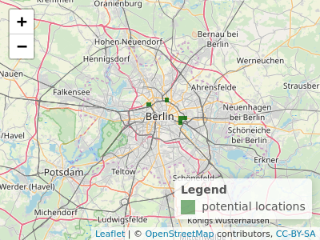

# ジオマーケティング  {#location}

## 必須パッケージ  {- #prerequisites-14}

- この章では、以下のパッケージが必要である（**tmaptools**もインストールされている必要がある）。

```{r 14-location-1, message=FALSE }
library(sf)
library(dplyr)
library(purrr)
library(terra)
library(osmdata)
library(spDataLarge)
```

- 必要なデータは順次ダウンロードする。

読者の利便性と再現性を確保するため、ダウンロードしたデータを **spDataLarge** パッケージで公開している。

## イントロダクション

この章では、パート I とパート II で学んだスキルを特定のドメインに適用する方法を示す。ジオマーケティング\index{geomarketing} （ロケーション分析\index{location analysis}  やロケーションインテリジェンスとも呼ばれることがある）である。
研究・実用化されている分野は幅広い。
その典型的な例が、新しい店舗をどこに置くかというジオマーケティング (geomarketing) である。
ここでの目的は、最も多くの訪問者を集め、最終的に最も多くの利益を上げることである。
また、例えば新しい医療サービスをどこに配置するかなど、この技術を公共の利益のために利用できる非商業的なアプリケーションも多い [@tomintz_geography_2008]。

ロケーション分析\index{location analysis}の基本は人である。 特に時間やその他のリソースを費やす可能性が高い場所である。
興味深いことに、エコロジーの概念やモデルは、店舗立地分析に使われるものと非常によく似ている。
動物や植物は、空間的に変化する変数に基づいて、特定の「最適な」場所でそのニーズを最もよく満たすことができる（@muenchow_review_2018; Chapter \@ref(eco) も参照)。
これはジオコンピューティングやGISサイエンス全般の大きな強みである。コンセプトや手法は他の分野にも転用可能である。
例えば、ホッキョクグマは気温が低く、餌（アザラシやアシカ）が豊富な北緯を好む。
同様に、人間は特定の場所に集まる傾向があり、北極の生態学的ニッチに類似した経済的ニッチ（そして高い地価）を作り出する。
ロケーション分析の主な作業は、利用可能なデータに基づいて、特定のサービスにとってそのような「最適な場所」がどこであるかを見つけ出すことである。
典型的なリサーチクエスチョンとしては、以下のようなものがある。

- ターゲット層はどこに住んでいて、どのエリアによく行くのか？
- 競合する店舗やサービスはどこにあるのか？
- 特定の店舗にどれくらいの人が行きやすいか？
- 既存のサービスは、市場の潜在力を過大に、あるいは過小に使用していないか？
- ある企業の特定地域における市場シェアはどのくらいか？

本章では、実データに基づく仮想的なケーススタディに基づき、ジオコンピューティングがそのような疑問に答えることができることを示す。

## ケーススタディ: ドイツの自転車店  {#case-study}

あなたがドイツで自転車ショップのチェーンを始めたとする。
店舗は、できるだけ多くの潜在顧客がいる都市部に配置すること。
さらに、仮定の調査（この章のために考案されたもので、商業利用はできない！）によると、独身の若い男性（20歳から40歳）が貴社の製品を購入する可能性が最も高いということである：これが*ターゲット層*である。
あなたは、何店舗も出店できる十分な資金をお持ちの幸運な立場にある。
しかし、どこに配置すればいいのだろうか？
コンサルティング会社（ジオマーケティング \index{geomarketing}  アナリストを雇っている）は、このような質問に答えるために喜んで高い料金を取るだろう。
幸い、オープンデータ（ \index{open data}  ）やオープンソースソフトウェア（ \index{open source software}  ）の力を借りれば、私たち自身でそれを行うことができる。
以下の章では、本書の最初の章で学んだテクニックを、サービスロケーション解析の一般的なステップにどのように応用できるかを紹介する。

- ドイツの国勢調査の入力データを整頓する ( Section \@ref(tidy-the-input-data) )
- 集計された国勢調査データをラスタに変換 \index{raster}  オブジェクト ( Section \@ref(create-census-rasters) )
- 人口密度の高い都市圏の特定 ( Section \@ref(define-metropolitan-areas) )
- これらの地域の詳細な地理データ（OpenStreetMap \index{OpenStreetMap} , with **osmdata** \index{osmdata (package)}  ）をダウンロードする ( Section \@ref(points-of-interest) ) 。
- 地図代数を用いて異なる場所の相対的な望ましさをスコアリングするためのラスタ \index{raster}  を作成する \index{map algebra}  ( Section \@ref(identifying-suitable-locations) )

これらのステップは、特定のケーススタディに適用されたが、店舗立地や公共サービス提供の多くのシナリオに一般化することが可能である。

## 入力データを整頓  {#tidy-the-input-data}

ドイツ政府は、1kmまたは100mの解像度でグリッド化された国勢調査データを提供している。
次のコードは、1kmのデータをダウンロードし、解凍し、読み込むものである。

```{r 14-location-2, eval=FALSE}
download.file("https://tinyurl.com/ybtpkwxz", 
              destfile = "census.zip", mode = "wb")
unzip("census.zip") # unzip the files
census_de = readr::read_csv2(list.files(pattern = "Gitter.csv"))
```

なお、`census_de` は **spDataLarge** パッケージからも入手可能である。

```{r attach-census}
data("census_de", package = "spDataLarge")
```

`census_de` オブジェクトは、ドイツ全土の30万以上のグリッドセルについて、13の変数を含むデータフレームである。
私たちの仕事では、これらのサブセットだけが必要である。東経（`x`）と北緯（`y`）、住民数（人口；`pop`）、平均年齢（`mean_age`）、女性の割合（`women`）、平均世帯人員（`hh_size`）である。
これらの変数は、以下のコードチャンクで選択され、ドイツ語から英語に名前が変更され、 Table \@ref(tab:census-desc) に要約される。 
さらに、`mutate()` は、値 -1 と -9 (「不明」を意味する) を `NA` に変換するために使用される。

```{r 14-location-4}
# pop = population, hh_size = household size
input = dplyr::select(census_de, x = x_mp_1km, y = y_mp_1km, pop = Einwohner,
                      women = Frauen_A, mean_age = Alter_D, hh_size = HHGroesse_D)
# -1 と -9 を NA に設定
input_tidy = dplyr::mutate(input,
  dplyr::across(.fns =  ~ifelse(.x %in% c(-1, -9), NA, .x)))
```

```{r census-desc, echo=FALSE}
tab = dplyr::tribble(
  ~"class", ~"pop", ~"women", ~"age", ~"hh",
  1, "3-250", "0-40", "0-40", "1-2", 
  2, "250-500", "40-47", "40-42", "2-2.5",
  3, "500-2000", "47-53", "42-44", "2.5-3",
  4, "2000-4000", "53-60", "44-47", "3-3.5",
  5, "4000-8000", ">60", ">47", ">3.5",
  6, ">8000", "", "", ""
)
# commented code to show the input data frame with factors (RL):
# summary(input_tidy) # all integers
# fct_pop = factor(input_tidy$pop, labels = tab$pop)
# summary(fct_pop)
# sum(is.na(input_tidy$pop))
# fct_women = factor(input_tidy$women, labels = tab$women[1:5])
# summary(fct_women)
# sum(is.na(input_tidy$women))
# fct_mean_age = factor(input_tidy$mean_age, labels = tab$age[1:5])
# summary(fct_mean_age)
# sum(is.na(input_tidy$mean_age))
# fct_hh_size = factor(input_tidy$hh_size, labels = tab$hh[1:5])
# summary(fct_hh_size)
# sum(is.na(input_tidy$hh_size))
# input_factor = bind_cols(
#   select(input_tidy, 1:2),
#   pop = fct_pop,
#   women = fct_women,
#   mean_age = fct_mean_age,
#   hh_size = fct_hh_size,
# )
# summary(input_factor)
cap = paste("Categories for each variable in census data from",
            "Datensatzbeschreibung...xlsx", 
            "located in the downloaded file census.zip (see Figure",
            "\\@ref(fig:census-stack) for their spatial distribution).")
knitr::kable(tab,
             col.names = c("Class", "Population", "% female", "Mean age",
                           "Household size"),
             caption = cap, 
             caption.short = "Categories for each variable in census data.",
             align = "c", booktabs = TRUE)
```

## 国勢調査ラスタを作成  {#create-census-rasters}

前処理を行った後、`rast()` 関数を使って `SpatRaster` オブジェクトに変換することができる（Section \@ref(raster-classes) と \@ref(raster-subsetting) を参照）。
`type` 引数に `xyz` を指定するときは、入力データフレームの `x` と `y` 列は、正規グリッドに一致しなければならない。
残りの列（ここでは、`pop` , `women` , `mean_age` , `hh_size` ）は、ラスタブリックレイヤ（ Figure \@ref(fig:census-stack) ; github リポジトリの `code/14-location-jm.R` も参照）の入力として機能する。

```{r 14-location-5}
input_ras = terra::rast(input_tidy, type = "xyz", crs = "EPSG:3035")
```

```{r 14-location-6}
input_ras
```

```{block2 14-location-7, type='rmdnote'}
Note that we are using an equal-area projection (EPSG:3035; Lambert Equal Area Europe), i.e., a projected CRS\index{CRS!projected} where each grid cell has the same area, here 1000 x 1000 square meters. 
Since we are using mainly densities such as the number of inhabitants or the portion of women per grid cell, it is of utmost importance that the area of each grid cell is the same to avoid 'comparing apples and oranges'.
Be careful with geographic CRS\index{CRS!geographic} where grid cell areas constantly decrease in poleward directions (see also Section \@ref(crs-intro) and Chapter \@ref(reproj-geo-data)). 
```

```{r census-stack, echo=FALSE, fig.cap="Gridded German census data of 2011 (see Table \\@ref(tab:census-desc) for a description of the classes).", fig.scap="Gridded German census data."}
knitr::include_graphics("figures/14_census_stack.png")
```

次に、`input_ras` に格納されているラスタの値を、Section \@ref(case-study) で述べた調査に従って、Section \@ref(local-operations) \index{map algebra!local operations}  で紹介した **terra** 関数 `classify()` を用いて再分類している。
母集団データの場合、クラスの平均値を用いて数値データ型に変換する。 
ラスタセルは、値1（「クラス1」のセルが3～250人の住民を含む）の場合は127人、値2（250～500人の住民を含む）の場合は375人、と仮定される（ Table \@ref(tab:census-desc) を参照）。
これらのセルには8000人以上の人が含まれているため、「クラス6」のセル値には8000人の住民が選ばれた。
もちろん、これは真の母集団の近似値であり、正確な値ではない。^[
この再分類の段階で生じる潜在的な誤差については、演習で検討する。
]
しかし、大都市圏を定義するには十分なレベルである（次章参照）。

総人口の絶対推計を表す変数 `pop` とは対照的に、残りの変数は、調査で使用されたウェイトに対応するウェイトに分類し直した。
例えば、変数 `women` のクラス1は、人口の0～40％が女性である地域を表す。
は、ターゲット層が男性であるため、比較的高いウェイトである3に分類し直した。
同様に、若年層や単身世帯の割合が高い層は、高いウェイトを持つように分類し直した。

```{r 14-location-8}
rcl_pop = matrix(c(1, 1, 127, 2, 2, 375, 3, 3, 1250, 
                   4, 4, 3000, 5, 5, 6000, 6, 6, 8000), 
                 ncol = 3, byrow = TRUE)
rcl_women = matrix(c(1, 1, 3, 2, 2, 2, 3, 3, 1, 4, 5, 0), 
                   ncol = 3, byrow = TRUE)
rcl_age = matrix(c(1, 1, 3, 2, 2, 0, 3, 5, 0),
                 ncol = 3, byrow = TRUE)
rcl_hh = rcl_women
rcl = list(rcl_pop, rcl_women, rcl_age, rcl_hh)
```

なお、リスト中の再分類行列の順序は、`input_ras` の要素と同じになるようにした。
例えば、最初の要素はどちらの場合も母集団に対応する。
その後、`for` -loop \index{loop!for}、再分類行列を対応するラスタレイヤーに適用する。
最後に、以下のコードで、`reclass` のレイヤが `input_ras` のレイヤと同じ名前であることを確認する。

```{r 14-location-9}
reclass = input_ras
for (i in seq_len(terra::nlyr(reclass))) {
  reclass[[i]] = terra::classify(x = reclass[[i]], rcl = rcl[[i]], right = NA)
}
names(reclass) = names(input_ras)
```

```{r 14-location-10, eval=FALSE}
reclass
#> ... (full output not shown)
#> names       :  pop, women, mean_age, hh_size 
#> min values  :  127,     0,        0,       0 
#> max values  : 8000,     3,        3,       3
```


## 大都市圏を定義  {#define-metropolitan-areas}

ここでは、大都市圏を50万人以上が住む20km^2^のピクセルと定義している。
この粗い解像度のピクセルは、Section \@ref(aggregation-and-disaggregation) で紹介したように、`aggregate()` \index{aggregation}、速やかに作成することができる。
以下のコマンドは、引数 `fact = 20`、結果の解像度を20倍にしている（元のラスタの解像度が1km^2^であったことを思い出してみよう）。

```{r 14-location-11, warning=FALSE, cache=TRUE, cache.lazy=FALSE}
pop_agg = terra::aggregate(reclass$pop, fact = 20, fun = sum, na.rm = TRUE)
summary(pop_agg)
```

次のステージは、50万人以上のセルだけを残すことである。

```{r 14-location-12, warning=FALSE, cache.lazy=FALSE, cache=TRUE}
pop_agg = pop_agg[pop_agg > 500000, drop = FALSE] 
```

これをプロットすると、8つの大都市圏（Figure \@ref(fig:metro-areas)）が見えてくる。
各領域は、1つ以上のラスタセルで構成される。
1つのリージョンに属するすべてのセルを結合できればコマンドは、
**terra**\index{raster}の `patches()` である。
その後、`as.polygons()` でラスタオブジェクトを空間ポリゴンに変換し、`st_as_sf()` で `sf` -オブジェクトに変換する。

```{r 14-location-13, warning=FALSE, message=FALSE}
metros = pop_agg |> 
  terra::patches(directions = 8) |>
  terra::as.polygons() |>
  sf::st_as_sf()
```

```{r metro-areas, echo=FALSE, out.width= "70%", fig.cap="The aggregated population raster (resolution: 20 km) with the identified metropolitan areas (golden polygons) and the corresponding names.", fig.scap="The aggregated population raster."}
knitr::include_graphics("figures/14_metro_areas.png")
```

その結果、自転車店に適した8つの都市圏（ Figure \@ref(fig:metro-areas) ;図の作成については `code/14-location-jm.R` も参照）が、まだ名前が出てこない。
リバースジオコーディング \index{geocoding}  のアプローチでこの問題を解決することができる。座標が与えられると、逆ジオコーディングにより対応する住所が求められる。
その結果、各都市圏の重心 \index{centroid}  座標を抽出することで、リバースジオコーディング API\index{API}  の入力とすることができる。
これが、**tmaptools** の `rev_geocode_OSM()` 関数が期待するものである。
`as.data.frame` を `TRUE` とすることで、通り名、建物番号、都市などの地名に対応する列を返す。
ただし、ここでは都市だけに興味がある。

```{r 14-location-17, warning=FALSE, eval=FALSE}
metro_names = sf::st_centroid(metros, of_largest_polygon = TRUE) |>
  tmaptools::rev_geocode_OSM(as.data.frame = TRUE) |>
  dplyr::select(city, town, state)
# smaller cities are returned in column town. To have all names in one column,
# we move the town name to the city column in case it is NA
metro_names = dplyr::mutate(metro_names, city = ifelse(is.na(city), town, city))
```

読者も同じ結果を得られるよう、**spDataLarge** に `metro_names` を追加しておいた。

```{r metro-names, echo=FALSE}
data("metro_names", package = "spDataLarge")
knitr::kable(dplyr::select(metro_names, city, state), 
             caption = "Result of the reverse geocoding.", 
             caption.short = "Result of the reverse geocoding.", 
             booktabs = TRUE)
```

全体として、私たちは `city` 列が大都市名 ( Table \@ref(tab:metro-names) ) として機能していることに満足している。例外は、Wülfrath が Düsseldorf の大領域に属していることで ある。
したがって、Wülfrath を Düsseldorf ( Figure \@ref(fig:metro-areas) ) に置き換える。
`ü` のようなウムラウトは、例えば `opq()` を使って大都市圏のバウンディングボックスを決定する場合（後述）、後々トラブルになる可能性があるため、避けているのである。

```{r 14-location-19}
metro_names = metro_names$city |> 
  as.character() |>
  {\(x) ifelse(x == "Velbert", "Düsseldorf", x)}() |>
  {\(x) gsub("ü", "ue", x)}()
```

## 関心地点  {#Points-of-interest}

\index{point of interest}
**osmdata**\index{osmdata (package)} パッケージは、OSM \index{OpenStreetMap}  データへの使いやすいアクセスを提供する ( Section \@ref(retrieving-data) も参照)。
ドイツ全土の店舗をダウンロードするのではなく、定義された大都市圏にクエリを限定することで、計算負荷を軽減し、関心のあるエリアのみの店舗位置を提供している。
この後のコードチャンクは、以下のようないくつかの関数を用いてこれを行う。

- `map()` \index{loop!map}  ( `lapply()` \index{loop!lapply}  の **tidyverse** 相当)。これは、OSM \index{OpenStreetMap}  クエリー関数 `opq()` ( Section \@ref(retrieving-data) 参照) のバウンディングボックス\index{bounding box}  を定義する、8つの大都市名すべてを繰り返し処理するものである。
- `add_osm_feature()` で、キー値が `shop` の OSM\index{OpenStreetMap}  要素を指定する (共通のキー:値のペアの一覧は [wiki.openstreetmap.org](http://wiki.openstreetmap.org/wiki/Map_Features) を参照)。
- `osmdata_sf()`、これは OSM\index{OpenStreetMap} データを空間オブジェクト（クラス `sf` ）に変換するものである。
- `while()` \index{loop!while}、1回目のダウンロードに失敗すると繰り返し（今回は3回）ダウンロードを試みる^[OSM-downloadは1回目で失敗することもあるようである。
]

このコードを実行する前に: 約2GBのデータをダウンロードすることを考慮してみよう。
時間とリソースを節約するために、`shops` という名前の出力を **spDataLarge** に入れてある。
お使いの環境で利用できるようにするには、`data("shops", package = "spDataLarge")` を実行してみよう。

```{r 14-location-20, eval=FALSE, message=FALSE}
shops = purrr::map(metro_names, function(x) {
  message("Downloading shops of: ", x, "\n")
  # give the server a bit time
  Sys.sleep(sample(seq(5, 10, 0.1), 1))
  query = osmdata::opq(x) |>
    osmdata::add_osm_feature(key = "shop")
  points = osmdata::osmdata_sf(query)
  # request the same data again if nothing has been downloaded
  iter = 2
  while (nrow(points$osm_points) == 0 && iter > 0) {
    points = osmdata_sf(query)
    iter = iter - 1
  }
  # return only the point features
  points$osm_points
})
```

定義された大都市圏に店舗がないことはまずありえない。
次の `if` の条件は、各リージョンに少なくとも1つのショップがあるかどうかをチェックするだけである。
その場合は、該当する地域のショップを再度ダウンロードすることを勧める。

```{r 14-location-21, eval=FALSE}
# checking if we have downloaded shops for each metropolitan area
ind = purrr::map_dbl(shops, nrow) == 0
if (any(ind)) {
  message("There are/is still (a) metropolitan area/s without any features:\n",
          paste(metro_names[ind], collapse = ", "), "\nPlease fix it!")
}
```

各リスト要素 (`sf`\index{sf} データフレーム) が同じ列を持つことを確認するために^[OSM の投稿者は、データを収集する際に同じように細心の注意を払っているわけではないので、これは当たり前のことではない。]、`osm_id` と `shop` の列だけを、`map_dfr` ループの助けを借りて保持する。これは、すべてのショップを1つの大きな `sf`\index{sf} オブジェクトにまとめる。

```{r 14-location-22, eval=FALSE}
# select only specific columns
shops = purrr::map_dfr(shops, dplyr::select, osm_id, shop)
```

注： `shops` は、`spDataLarge` パッケージで提供される。

```{r attach-shops}
data("shops", package = "spDataLarge")
```

あとは、空間点オブジェクトをラスタに変換するだけである（Section \@ref(rasterization) 参照）。
`sf` オブジェクト `shops` は、`reclass` オブジェクトと同じパラメータ（寸法、解像度、CRS \index{CRS}  ）を持つラスタ \index{raster}  に変換される。
重要なのは、ここで `count()` 関数を用いて、各セルのショップ数を算出していることだ。

そのため、後続のコードチャンクの結果は、店舗密度（店舗/km^2^）の推定値となる。
`st_transform()`\index{sf!st\_transform} は、両入力の CRS\index{CRS} が一致するように、   `rasterize()`\index{raster!rasterize} の前に使用される。

```{r 14-location-25, message=FALSE, warning=FALSE}
shops = sf::st_transform(shops, st_crs(reclass))
# create poi raster
poi = terra::rasterize(x = shops, y = reclass, field = "osm_id", fun = "length")
```

他のラスタレイヤ（人口、女性、平均年齢、世帯人員）と同様、`poi` ラスタは4つのクラスに再分類される（Section \@ref(create-census-rasters) 参照）。 
クラス間隔の定義は、ある程度恣意的に行われるものである。
均等割、分位割、固定値などを使用することができる。
ここでは、クラス内分散を最小化する Fisher-Jenks 自然休息法を選択し、その結果を再分類行列の入力とする。

```{r 14-location-26, message=FALSE, warning=FALSE}
# construct reclassification matrix
int = classInt::classIntervals(terra::values(poi), n = 4, style = "fisher")
int = round(int$brks)
rcl_poi = matrix(c(int[1], rep(int[-c(1, length(int))], each = 2), 
                   int[length(int)] + 1), ncol = 2, byrow = TRUE)
rcl_poi = cbind(rcl_poi, 0:3)  
# reclassify
poi = terra::classify(poi, rcl = rcl_poi, right = NA) 
names(poi) = "poi"
```

## 適当な場所を特定  {#identifying-suitable-locations}

すべてのレイヤを結合する前に残っている唯一のステップは、`poi` を `reclass` のラスタスタックに追加し、そこから人口レイヤを削除することである。
後者の理由は2つある。
まず、大都市圏、つまりドイツの他の地域に比べて人口密度が平均的に高い地域はすでに定義されている。
第二に、特定のキャッチメントエリア\index{catchment area}内に多くの潜在顧客がいることは有利であるが、数が多いだけでは、実際には望ましいターゲットグループを表していない可能性がある。
例えば、タワーマンションは人口密度が高い地域であるが、高価なサイクル部品の購買力が高いとは限らない。

```{r 14-location-27}
# remove population raster and add poi raster
reclass = reclass[[names(reclass) != "pop"]] |>
  c(poi)
```

他のデータサイエンス・プロジェクトと同様、これまでのところ、データの検索と「整理」が全体の作業負荷の多くを占めている。
きれいなデータであれば、最後のステップであるすべてのラスタ\index{raster}のレイヤを合計して最終的なスコアを計算することも、1行のコードで実現できる。

```{r 14-location-28}
# calculate the total score
result = sum(reclass)
```

例えば、9以上のスコアは、自転車ショップを配置できるラスタセルを示す適切な閾値かもしれない（Figure \@ref(fig:bikeshop-berlin) ; `code/14-location-jm.R` も参照）。

```{r bikeshop-berlin, echo=FALSE, eval=TRUE, fig.cap="Suitable areas (i.e., raster cells with a score > 9) in accordance with our hypothetical survey for bike stores in Berlin.", fig.scap="Suitable areas for bike stores.", warning=FALSE}
if (knitr::is_latex_output()) {
    
} else if (knitr::is_html_output()) {
    library(leaflet)
    # have a look at suitable bike shop locations in Berlin
    berlin = metros[metro_names == "Berlin", ]
    berlin_raster = terra::crop(result, terra::vect(berlin)) 
    # summary(berlin_raster)
    # berlin_raster
    berlin_raster = berlin_raster[berlin_raster > 9, drop = FALSE]
    leaflet::leaflet() |> 
      leaflet::addTiles() |>
      # addRasterImage so far only supports raster objects
      leaflet::addRasterImage(raster::raster(berlin_raster), colors = "darkgreen",
                              opacity = 0.8) |>
      leaflet::addLegend("bottomright", colors = c("darkgreen"), 
                         labels = c("potential locations"), title = "Legend")  
}
```

## ディスカッションと次のステップ  {#discussion-and-next-steps}

今回紹介したアプローチは、GIS\index{GIS} の規範的な使い方の典型的な例である [@longley_geographic_2015]。
調査データと専門家による知識・仮定（大都市圏の定義、クラス間隔の定義、最終的なスコア閾値の定義）を組み合わせている。
このアプローチは、科学的な研究よりも、他の情報源と比較すべき、自転車店に適した地域のエビデンスに基づく指標を提供する応用分析に適している。
アプローチにいくつかの変更を加えることで、分析結果を改善することができる。

- 最終的なスコアの算出には均等なウェイトを用いたが、世帯規模など他の要因も、女性の割合や平均年齢と同様に重要である可能性がある。
- 全てのポイントオブインタレスト\index{point of interest}  を使用したが、DIY、ハードウェア、自転車、釣り、ハンティング、バイク、アウトドア、スポーツショップなど、バイクショップに関連するもののみ（ショップ値の範囲は [OSM Wiki](http://wiki.openstreetmap.org/wiki/Map_Features#Shop) で確認可能）、より洗練された結果を得ることができたかもしれない
- より高い解像度のデータにより、出力が向上する場合がある（演習参照）
- 私たちは限られた変数のみを使用し、 [INSPIRE geoportal](http://inspire-geoportal.ec.europa.eu/discovery/) やOpenStreetMapのサイクリングロードのデータなど、他の情報源からのデータは分析を豊かにするかもしれない（Section \@ref(retrieving-data) も参照のこと）。
- 男性比率と単身世帯の関係などの相互作用は考慮されていない。

つまり、この分析は多方面に拡張できるのである。
とはいえ、ジオマーケティング\index{geomarketing}の文脈の中で、R\index{R}  で空間データを取得し、扱う方法について、第一印象と理解を深めていただけたと思われる。

最後に、今回の分析は、あくまでも適地探しの第一歩に過ぎないということを指摘しておく必要がある。
これまでの調査により、1km四方でバイクショップの立地が可能なエリアを特定した。
その後の分析のステップを踏むことができる。

- 特定のキャッチメントエリア内の住民の数に基づいて最適な場所を見つける \index{catchment area} .
例えば、できるだけ多くの人が自転車で15分以内の移動距離で行けるお店であること（キャッチメントエリア \index{catchment area}  ルーティング \index{routing}  ）。
そのため、店舗から遠ければ遠いほど、実際に店舗を訪れる可能性が低くなることを考慮する必要がある（距離減衰関数）。
- また、競合他社を考慮するのも良いアイデアだろう。 
つまり、選択した場所の近辺にすでに自転車屋がある場合、可能性のある顧客（または販売可能性）を競合他社に分散させる必要がある [@huff_probabilistic_1963; @wieland_market_2017]。
- 例えば、アクセスの良さ、駐車場の有無、通行人の希望頻度、大きな窓があることなど、適切かつ手頃な価格の不動産を探す必要がある。

## 演習

```{r, echo=FALSE, results='asis'}
res = knitr::knit_child('_14-ex.Rmd', quiet = TRUE, options = list(include = FALSE, eval = FALSE))
cat(res, sep = '\n')
```
