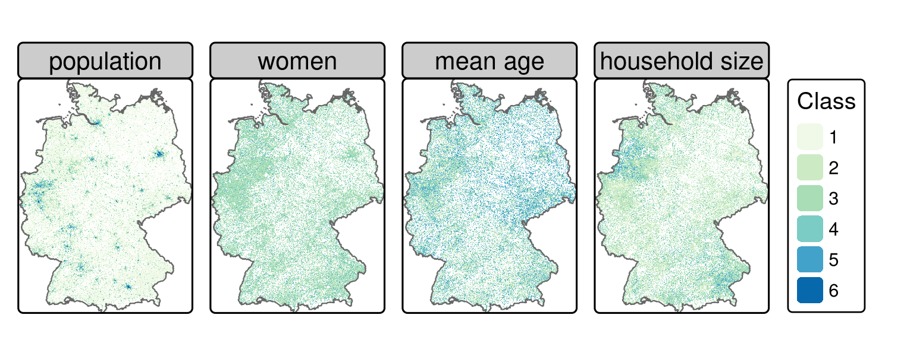
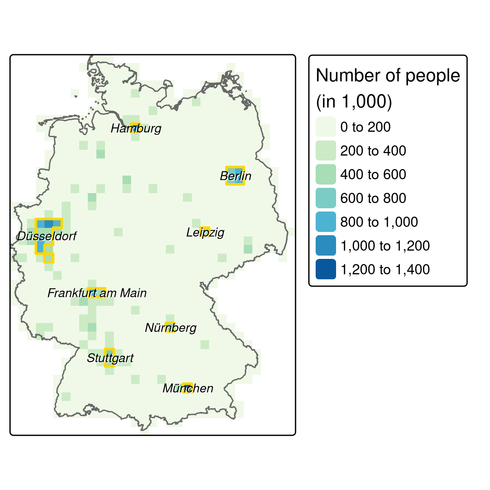

# Geomarketing {#location}

## Prerequisites {-}

- This chapter requires the following packages (**tmaptools** must also be installed):

```{r 14-location-1, message=FALSE }
library(sf)
library(dplyr)
library(purrr)
library(terra)
library(osmdata)
library(spDataLarge)
```

- Required data will be downloaded in due course.

As a convenience to the reader and to ensure easy reproducibility, we have made available the downloaded data in the **spDataLarge** package.

## Introduction

This chapter demonstrates how the skills learned in Parts I and II can be applied to a particular domain: geomarketing\index{geomarketing} (sometimes also referred to as location analysis\index{location analysis} or location intelligence).
This is a broad field of research and commercial application.
A typical example of geomarketing is where to locate a new shop.
The aim here is to attract most visitors and, ultimately, make the most profit.
There are also many non-commercial applications that can use the technique for public benefit, for example where to locate new health services [@tomintz_geography_2008].

People are fundamental to location analysis\index{location analysis}, in particular where they are likely to spend their time and other resources.
Interestingly, ecological concepts and models are quite similar to those used for store location analysis.
Animals and plants can best meet their needs in certain 'optimal' locations, based on variables that change over space (@muenchow_review_2018; see also chapter \@ref(eco)).
This is one of the great strengths of geocomputation and GIScience in general: concepts and methods are transferable to other fields.
Polar bears, for example, prefer northern latitudes where temperatures are lower and food (seals and sea lions) is plentiful.
Similarly, humans tend to congregate in certain places, creating economic niches (and high land prices) analogous to the ecological niche of the Arctic.
The main task of location analysis is to find out, based on available data, where such 'optimal locations' are for specific services.
Typical research questions include:

- Where do target groups live and which areas do they frequent?
- Where are competing stores or services located?
- How many people can easily reach specific stores?
- Do existing services over- or under-utilize the market potential?
- What is the market share of a company in a specific area?

This chapter demonstrates how geocomputation can answer such questions based on a hypothetical case study based on real data.

## Case study: bike shops in Germany {#case-study}

Imagine you are starting a chain of bike shops in Germany.
The stores should be placed in urban areas with as many potential customers as possible.
Additionally, a hypothetical survey (invented for this chapter, not for commercial use!) suggests that single young males (aged 20 to 40) are most likely to buy your products: this is the *target audience*.
You are in the lucky position to have sufficient capital to open a number of shops.
But where should they be placed?
Consulting companies (employing geomarketing\index{geomarketing} analysts) would happily charge high rates to answer such questions.
Luckily, we can do so ourselves with the help of open data\index{open data} and open source software\index{open source software}.
The following sections will demonstrate how the techniques learned during the first chapters of the book can be applied to undertake common steps in service location analysis:

- Tidy the input data from the German census (Section \@ref(tidy-the-input-data))
- Convert the tabulated census data into raster\index{raster} objects (Section \@ref(create-census-rasters))
- Identify metropolitan areas with high population densities (Section \@ref(define-metropolitan-areas))
- Download detailed geographic data (from OpenStreetMap\index{OpenStreetMap}, with **osmdata**\index{osmdata (package)}) for these areas (Section \@ref(points-of-interest))
- Create rasters\index{raster} for scoring the relative desirability of different locations using map algebra\index{map algebra} (Section \@ref(identifying-suitable-locations))

Although we have applied these steps to a specific case study, they could be generalized to many scenarios of store location or public service provision.

## Tidy the input data

The German government provides gridded census data at either 1 km or 100 m resolution.
The following code chunk downloads, unzips and reads in the 1 km data.

```{r 14-location-2, eval=FALSE}
download.file("https://tinyurl.com/ybtpkwxz", 
              destfile = "census.zip", mode = "wb")
unzip("census.zip") # unzip the files
census_de = readr::read_csv2(list.files(pattern = "Gitter.csv"))
```

Please note that `census_de` is also available from the **spDataLarge** package:

```{r attach-census}
data("census_de", package = "spDataLarge")
```

The `census_de` object is a data frame containing 13 variables for more than 360,000 grid cells across Germany.
For our work, we only need a subset of these: Easting (`x`) and Northing (`y`), number of inhabitants (population; `pop`), mean average age (`mean_age`), proportion of women (`women`) and average household size (`hh_size`).
These variables are selected and renamed from German into English in the code chunk below and summarized in Table \@ref(tab:census-desc). 
Further, `mutate()` is used to convert values -1 and -9 (meaning "unknown") to `NA`.

```{r 14-location-4}
# pop = population, hh_size = household size
input = dplyr::select(census_de, x = x_mp_1km, y = y_mp_1km, pop = Einwohner,
                      women = Frauen_A, mean_age = Alter_D, hh_size = HHGroesse_D)
# set -1 and -9 to NA
input_tidy = dplyr::mutate(input,
  dplyr::across(.fns =  ~ifelse(.x %in% c(-1, -9), NA, .x)))
```

```{r census-desc, echo=FALSE}
tab = dplyr::tribble(
  ~"class", ~"pop", ~"women", ~"age", ~"hh",
  1, "3-250", "0-40", "0-40", "1-2", 
  2, "250-500", "40-47", "40-42", "2-2.5",
  3, "500-2000", "47-53", "42-44", "2.5-3",
  4, "2000-4000", "53-60", "44-47", "3-3.5",
  5, "4000-8000", ">60", ">47", ">3.5",
  6, ">8000", "", "", ""
)
# commented code to show the input data frame with factors (RL):
# summary(input_tidy) # all integers
# fct_pop = factor(input_tidy$pop, labels = tab$pop)
# summary(fct_pop)
# sum(is.na(input_tidy$pop))
# fct_women = factor(input_tidy$women, labels = tab$women[1:5])
# summary(fct_women)
# sum(is.na(input_tidy$women))
# fct_mean_age = factor(input_tidy$mean_age, labels = tab$age[1:5])
# summary(fct_mean_age)
# sum(is.na(input_tidy$mean_age))
# fct_hh_size = factor(input_tidy$hh_size, labels = tab$hh[1:5])
# summary(fct_hh_size)
# sum(is.na(input_tidy$hh_size))
# input_factor = bind_cols(
#   select(input_tidy, 1:2),
#   pop = fct_pop,
#   women = fct_women,
#   mean_age = fct_mean_age,
#   hh_size = fct_hh_size,
# )
# summary(input_factor)
cap = paste("Categories for each variable in census data from",
            "Datensatzbeschreibung...xlsx", 
            "located in the downloaded file census.zip (see Figure",
            "\\@ref(fig:census-stack) for their spatial distribution).")
knitr::kable(tab,
             col.names = c("Class", "Population", "% female", "Mean age",
                           "Household size"),
             caption = cap, 
             caption.short = "Categories for each variable in census data.",
             align = "c", booktabs = TRUE)
```

## Create census rasters
 
After the preprocessing, the data can be converted into a `SpatRaster` object (see Sections \@ref(raster-classes) and \@ref(raster-subsetting)) with the help of the `rast()` function.
When setting its `type` argument to `xyz`, the `x` and `y` columns of the input data frame should correspond to coordinates on a regular grid.
All the remaining columns (here: `pop`, `women`, `mean_age`, `hh_size`) will serve as values of the raster layers (Figure \@ref(fig:census-stack); see also `code/14-location-figures.R` in our github repository).

```{r 14-location-5}
input_ras = terra::rast(input_tidy, type = "xyz", crs = "EPSG:3035")
```

```{r 14-location-6}
input_ras
```

```{block2 14-location-7, type='rmdnote'}
Note that we are using an equal-area projection (EPSG:3035; Lambert Equal Area Europe), i.e., a projected CRS\index{CRS!projected} where each grid cell has the same area, here 1000 x 1000 square meters. 
Since we are using mainly densities such as the number of inhabitants or the portion of women per grid cell, it is of utmost importance that the area of each grid cell is the same to avoid 'comparing apples and oranges'.
Be careful with geographic CRS\index{CRS!geographic} where grid cell areas constantly decrease in poleward directions (see also Section \@ref(crs-intro) and Chapter \@ref(reproj-geo-data)). 
```

```{r census-stack, echo=FALSE, fig.cap="Gridded German census data of 2011 (see Table \\@ref(tab:census-desc) for a description of the classes).", fig.scap="Gridded German census data."}

```

The next stage is to reclassify the values of the rasters stored in `input_ras` in accordance with the survey mentioned in Section \@ref(case-study), using the **terra** function `classify()`, which was introduced in Section \@ref(local-operations)\index{map algebra!local operations}.
In the case of the population data, we convert the classes into a numeric data type using class means. 
Raster cells are assumed to have a population of 127 if they have a value of 1 (cells in 'class 1' contain between 3 and 250 inhabitants) and 375 if they have a value of 2 (containing 250 to 500 inhabitants), and so on (see Table \@ref(tab:census-desc)).
A cell value of 8000 inhabitants was chosen for 'class 6' because these cells contain more than 8000 people.
Of course, these are approximations of the true population, not precise values.^[
The potential error introduced during this reclassification stage will be explored in the exercises.
]
However, the level of detail is sufficient to delineate metropolitan areas (see next section).

In contrast to the `pop` variable, representing absolute estimates of the total population, the remaining variables were re-classified as weights corresponding with weights used in the survey.
Class 1 in the variable `women`, for instance, represents areas in which 0 to 40% of the population is female;
these are reclassified with a comparatively high weight of 3 because the target demographic is predominantly male.
Similarly, the classes containing the youngest people and highest proportion of single households are reclassified to have high weights.

```{r 14-location-8}
rcl_pop = matrix(c(1, 1, 127, 2, 2, 375, 3, 3, 1250, 
                   4, 4, 3000, 5, 5, 6000, 6, 6, 8000), 
                 ncol = 3, byrow = TRUE)
rcl_women = matrix(c(1, 1, 3, 2, 2, 2, 3, 3, 1, 4, 5, 0), 
                   ncol = 3, byrow = TRUE)
rcl_age = matrix(c(1, 1, 3, 2, 2, 0, 3, 5, 0),
                 ncol = 3, byrow = TRUE)
rcl_hh = rcl_women
rcl = list(rcl_pop, rcl_women, rcl_age, rcl_hh)
```

Note that we have made sure that the order of the reclassification matrices in the list is the same as for the elements of `input_ras`.
For instance, the first element corresponds in both cases to the population.
Subsequently, the `for`-loop\index{loop!for} applies the reclassification matrix to the corresponding raster layer.
Finally, the code chunk below ensures the `reclass` layers have the same name as the layers of `input_ras`.

```{r 14-location-9}
reclass = input_ras
for (i in seq_len(terra::nlyr(reclass))) {
  reclass[[i]] = terra::classify(x = reclass[[i]], rcl = rcl[[i]], right = NA)
}
names(reclass) = names(input_ras)
```

```{r 14-location-10, eval=FALSE}
reclass
#> ... (full output not shown)
#> names       :  pop, women, mean_age, hh_size 
#> min values  :  127,     0,        0,       0 
#> max values  : 8000,     3,        3,       3
```


## Define metropolitan areas

We decided to define metropolitan areas as pixels of 20 km^2^ inhabited by more than 500,000 people.
Pixels at this coarse resolution can rapidly be created using `aggregate()`\index{aggregation}, as introduced in Section \@ref(aggregation-and-disaggregation).
The command below uses the argument `fact = 20` to reduce the resolution of the result twenty-fold (recall the original raster resolution was 1 km^2^):

```{r 14-location-11, warning=FALSE, cache=TRUE, cache.lazy=FALSE}
pop_agg = terra::aggregate(reclass$pop, fact = 20, fun = sum, na.rm = TRUE)
summary(pop_agg)
```

The next stage is to keep only cells with more than half a million people.

```{r 14-location-12, warning=FALSE, cache.lazy=FALSE, cache=TRUE}
pop_agg = pop_agg[pop_agg > 500000, drop = FALSE] 
```

Plotting this reveals eight metropolitan regions (Figure \@ref(fig:metro-areas)).
Each region consists of one or more raster cells.
It would be nice if we could join all cells belonging to one region.
**terra**'s\index{terra} `patches()` command does exactly that.
Subsequently, `as.polygons()` converts the raster object into spatial polygons, and `st_as_sf()` converts it into an `sf` object.

```{r 14-location-13, warning=FALSE, message=FALSE}
metros = pop_agg |> 
  terra::patches(directions = 8) |>
  terra::as.polygons() |>
  sf::st_as_sf()
```

```{r metro-areas, echo=FALSE, out.width= "70%", fig.cap="The aggregated population raster (resolution: 20 km) with the identified metropolitan areas (golden polygons) and the corresponding names.", fig.scap="The aggregated population raster."}

```

The resulting eight metropolitan areas suitable for bike shops (Figure \@ref(fig:metro-areas); see also `code/14-location-figures.R` for creating the figure) are still missing a name.
A reverse geocoding\index{geocoding} approach can settle this problem: given a coordinate, reverse geocoding finds the corresponding address.
Consequently, extracting the centroid\index{centroid} coordinate of each metropolitan area can serve as an input for a reverse geocoding API\index{API}.
This is exactly what the `rev_geocode_OSM()` function of the **tmaptools** package expects.
Setting additionally `as.data.frame` to `TRUE` will give back a `data.frame` with several columns referring to the location including the street name, house number and city.
However, here, we are only interested in the name of the city.

```{r 14-location-17, warning=FALSE, eval=FALSE}
metro_names = sf::st_centroid(metros, of_largest_polygon = TRUE) |>
  tmaptools::rev_geocode_OSM(as.data.frame = TRUE) |>
  dplyr::select(city, town, state)
# smaller cities are returned in column town. To have all names in one column,
# we move the town name to the city column in case it is NA
metro_names = dplyr::mutate(metro_names, city = ifelse(is.na(city), town, city))
```

To make sure that the reader uses the exact same results, we have put them into **spDataLarge** as the object `metro_names`.

```{r metro-names, echo=FALSE}
data("metro_names", package = "spDataLarge")
knitr::kable(dplyr::select(metro_names, city, state), 
             caption = "Result of the reverse geocoding.", 
             caption.short = "Result of the reverse geocoding.", 
             booktabs = TRUE)
```

Overall, we are satisfied with the `city` column serving as metropolitan names (Table \@ref(tab:metro-names)) apart from one exception, namely Velbert which belongs to the greater region of Düsseldorf.
Hence, we replace Velbert with Düsseldorf (Figure \@ref(fig:metro-areas)).
Umlauts like `ü` might lead to trouble further on, for example when determining the bounding box of a metropolitan area with `opq()` (see further below), which is why we avoid them.

```{r 14-location-19}
metro_names = metro_names$city |> 
  as.character() |>
  {\(x) ifelse(x == "Velbert", "Düsseldorf", x)}() |>
  {\(x) gsub("ü", "ue", x)}()
```

## Points of interest

\index{point of interest}
The **osmdata**\index{osmdata (package)} package provides easy-to-use access to OSM\index{OpenStreetMap} data (see also Section \@ref(retrieving-data)).
Instead of downloading shops for the whole of Germany, we restrict the query to the defined metropolitan areas, reducing computational load and providing shop locations only in areas of interest.
The subsequent code chunk does this using a number of functions including:

- `map()`\index{loop!map} (the **tidyverse** equivalent of `lapply()`\index{loop!lapply}), which iterates through all eight metropolitan names which subsequently define the bounding box\index{bounding box} in the OSM\index{OpenStreetMap} query function `opq()` (see Section \@ref(retrieving-data)).
- `add_osm_feature()` to specify OSM\index{OpenStreetMap} elements with a key value of `shop` (see [wiki.openstreetmap.org](http://wiki.openstreetmap.org/wiki/Map_Features) for a list of common key:value pairs).
- `osmdata_sf()`, which converts the OSM\index{OpenStreetMap} data into spatial objects (of class `sf`).
- `while()`\index{loop!while}, which tries repeatedly (three times in this case) to download the data if it fails the first time.^[The OSM-download will sometimes fail at the first attempt.
]

Before running this code: please consider it will download almost 2GB of data.
To save time and resources, we have put the output named `shops` into **spDataLarge**.
To make it available in your environment run `data("shops", package = "spDataLarge")`.

```{r 14-location-20, eval=FALSE, message=FALSE}
shops = purrr::map(metro_names, function(x) {
  message("Downloading shops of: ", x, "\n")
  # give the server a bit time
  Sys.sleep(sample(seq(5, 10, 0.1), 1))
  query = osmdata::opq(x) |>
    osmdata::add_osm_feature(key = "shop")
  points = osmdata::osmdata_sf(query)
  # request the same data again if nothing has been downloaded
  iter = 2
  while (nrow(points$osm_points) == 0 && iter > 0) {
    points = osmdata_sf(query)
    iter = iter - 1
  }
  # return only the point features
  points$osm_points
})
```

It is highly unlikely that there are no shops in any of our defined metropolitan areas.
The following `if` condition simply checks if there is at least one shop for each region.
If not, we recommend to try to download the shops again for this/these specific region/s.

```{r 14-location-21, eval=FALSE}
# checking if we have downloaded shops for each metropolitan area
ind = purrr::map_dbl(shops, nrow) == 0
if (any(ind)) {
  message("There are/is still (a) metropolitan area/s without any features:\n",
          paste(metro_names[ind], collapse = ", "), "\nPlease fix it!")
}
```

To make sure that each list element (an `sf`\index{sf} data frame) comes with the same columns^[This is not a given since OSM contributors are not equally meticulous when collecting data.] we only keep the `osm_id` and the `shop` columns with the help of the `map_dfr` loop which additionally combines all shops into one large `sf`\index{sf} object.

```{r 14-location-22, eval=FALSE}
# select only specific columns
shops = purrr::map_dfr(shops, dplyr::select, osm_id, shop)
```

Note: `shops` is provided in the `spDataLarge` and can be accessed as follows:

```{r attach-shops}
data("shops", package = "spDataLarge")
```

The only thing left to do is to convert the spatial point object into a raster (see Section \@ref(rasterization)).
The `sf` object, `shops`, is converted into a raster\index{raster} having the same parameters (dimensions, resolution, CRS\index{CRS}) as the `reclass` object.
Importantly, the `length()` function is used here to count the number of shops in each cell.

The result of the subsequent code chunk is therefore an estimate of shop density (shops/km^2^).
`st_transform()`\index{sf!st\_transform} is used before `rasterize()`\index{raster!rasterize} to ensure the CRS\index{CRS} of both inputs match.

```{r 14-location-25, message=FALSE, warning=FALSE}
shops = sf::st_transform(shops, st_crs(reclass))
# create poi raster
poi = terra::rasterize(x = shops, y = reclass, field = "osm_id", fun = "length")
```

As with the other raster layers (population, women, mean age, household size) the `poi` raster is reclassified into four classes (see Section \@ref(create-census-rasters)). 
Defining class intervals is an arbitrary undertaking to a certain degree.
One can use equal breaks, quantile breaks, fixed values or others.
Here, we choose the Fisher-Jenks natural breaks approach which minimizes within-class variance, the result of which provides an input for the reclassification matrix.

```{r 14-location-26, message=FALSE, warning=FALSE}
# construct reclassification matrix
int = classInt::classIntervals(terra::values(poi), n = 4, style = "fisher")
int = round(int$brks)
rcl_poi = matrix(c(int[1], rep(int[-c(1, length(int))], each = 2), 
                   int[length(int)] + 1), ncol = 2, byrow = TRUE)
rcl_poi = cbind(rcl_poi, 0:3)  
# reclassify
poi = terra::classify(poi, rcl = rcl_poi, right = NA) 
names(poi) = "poi"
```

## Identifying suitable locations

The only steps that remain before combining all the layers are to add `poi` to the `reclass` raster stack and remove the population layer from it.
The reasoning for the latter is twofold.
First of all, we have already delineated metropolitan areas, that is areas where the population density is above average compared to the rest of Germany.
Second, though it is advantageous to have many potential customers within a specific catchment area\index{catchment area}, the sheer number alone might not actually represent the desired target group.
For instance, residential tower blocks are areas with a high population density but not necessarily with a high purchasing power for expensive cycle components.

```{r 14-location-27}
# remove population raster and add poi raster
reclass = reclass[[names(reclass) != "pop"]] |>
  c(poi)
```

In common with other data science projects, data retrieval and 'tidying' have consumed much of the overall workload so far.
With clean data, the final step --- calculating a final score by summing all raster\index{raster} layers --- can be accomplished in a single line of code.

```{r 14-location-28}
# calculate the total score
result = sum(reclass)
```

For instance, a score greater than 9 might be a suitable threshold indicating raster cells where a bike shop could be placed (Figure \@ref(fig:bikeshop-berlin); see also `code/14-location-figures.R`).

```{r bikeshop-berlin, echo=FALSE, eval=TRUE, fig.cap="Suitable areas (i.e., raster cells with a score > 9) in accordance with our hypothetical survey for bike stores in Berlin.", fig.scap="Suitable areas for bike stores.", warning=FALSE}
if (knitr::is_latex_output()) {
    knitr::include_graphics("figures/bikeshop-berlin-1.png")
} else if (knitr::is_html_output()) {
    library(leaflet)
    # have a look at suitable bike shop locations in Berlin
    berlin = metros[metro_names == "Berlin", ]
    berlin_raster = terra::crop(result, terra::vect(berlin)) 
    # summary(berlin_raster)
    # berlin_raster
    berlin_raster = berlin_raster[berlin_raster > 9, drop = FALSE]
    leaflet::leaflet() |> 
      leaflet::addTiles() |>
      # addRasterImage so far only supports raster objects
      leaflet::addRasterImage(raster::raster(berlin_raster), colors = "darkgreen",
                              opacity = 0.8) |>
      leaflet::addLegend("bottomright", colors = c("darkgreen"), 
                         labels = c("potential locations"), title = "Legend")  
}
```

## Discussion and next steps

The presented approach is a typical example of the normative usage of a GIS\index{GIS} [@longley_geographic_2015].
We combined survey data with expert-based knowledge and assumptions (definition of metropolitan areas, defining class intervals, definition of a final score threshold).
This approach is less suitable for scientific research than applied analysis that provides an evidence based indication of areas suitable for bike shops that should be compared with other sources of information.
A number of changes to the approach could improve the analysis:

- We used equal weights when calculating the final scores but other factors, such as the household size, could be as important as the portion of women or the mean age
- We used all points of interest\index{point of interest} but only those related to bike shops, such as do-it-yourself, hardware, bicycle, fishing, hunting, motorcycles, outdoor and sports shops (see the range of shop values available on the  [OSM Wiki](http://wiki.openstreetmap.org/wiki/Map_Features#Shop)) may have yielded more refined results
- Data at a higher resolution may improve the output (see exercises)
- We have used only a limited set of variables and data from other sources, such as the [INSPIRE geoportal](http://inspire-geoportal.ec.europa.eu/discovery/) or data on cycle paths from OpenStreetMap, may enrich the analysis (see also Section \@ref(retrieving-data))
- Interactions remained unconsidered, such as a possible relationships between the portion of men and single households

In short, the analysis could be extended in multiple directions.
Nevertheless, it should have given you a first impression and understanding of how to obtain and deal with spatial data in R\index{R} within a geomarketing\index{geomarketing} context.

Finally, we have to point out that the presented analysis would be merely the first step of finding suitable locations.
So far we have identified areas, 1 by 1 km in size, representing potentially suitable locations for a bike shop in accordance with our survey.
Subsequent steps in the analysis could be taken:

- Find an optimal location based on number of inhabitants within a specific catchment area\index{catchment area}.
For example, the shop should be reachable for as many people as possible within 15 minutes of traveling bike distance (catchment area\index{catchment area} routing\index{routing}).
Thereby, we should account for the fact that the further away the people are from the shop, the more unlikely it becomes that they actually visit it (distance decay function)
- Also it would be a good idea to take into account competitors. 
That is, if there already is a bike shop in the vicinity of the chosen location, possible customers (or sales potential) should be distributed between the competitors [@huff_probabilistic_1963; @wieland_market_2017]
- We need to find suitable and affordable real estate, e.g., in terms of accessibility, availability of parking spots, desired frequency of passers-by, having big windows, etc.

## Exercises

```{r, echo=FALSE, results='asis'}
res = knitr::knit_child('_14-ex.Rmd', quiet = TRUE, options = list(include = FALSE, eval = FALSE))
cat(res, sep = '\n')
```
