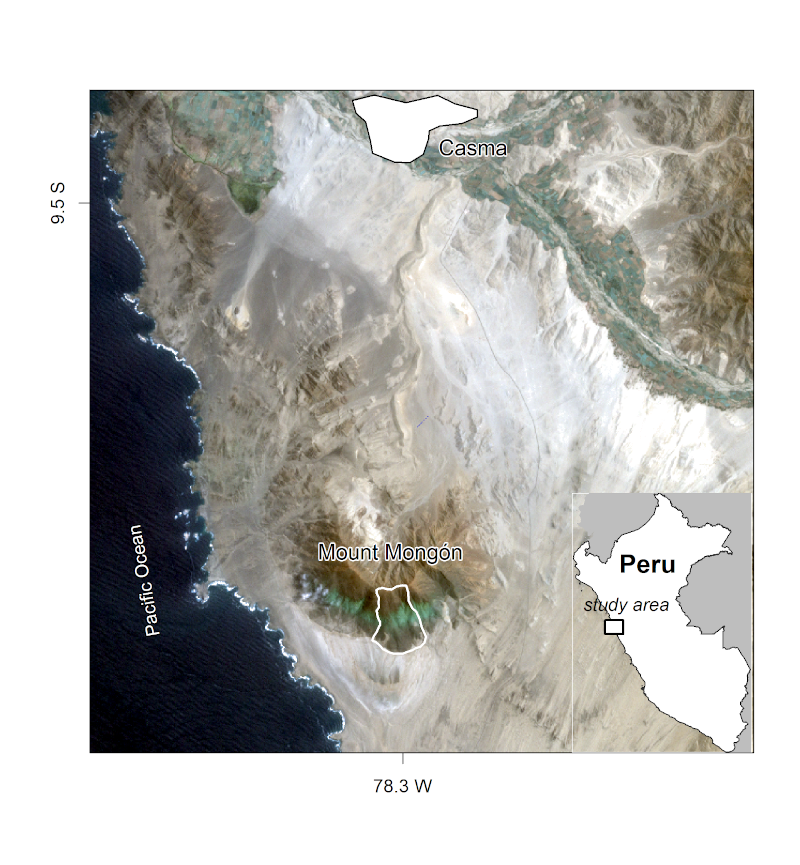
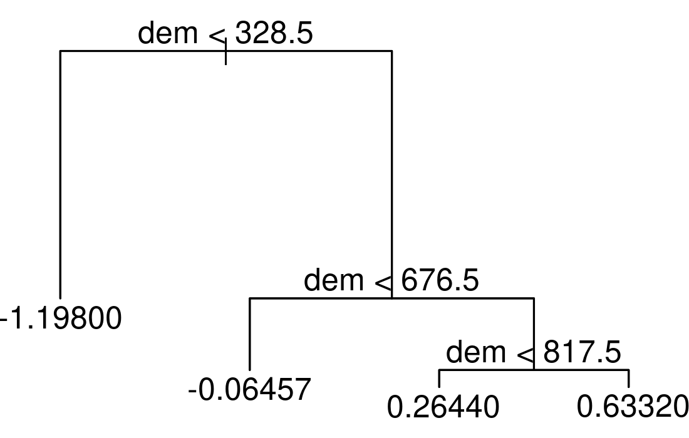
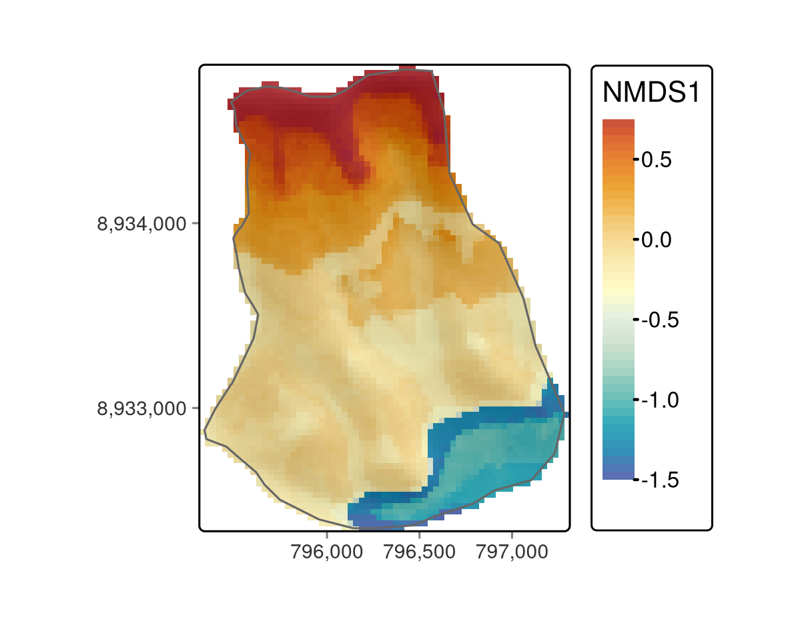

# 生態学  {#eco}

## 必須パッケージ  {- #prerequisites-15}

この章では、Chapter \@ref(spatial-class) ～ Chapter \@ref(geometry-operations) で説明した地理データ解析\index{geographic data analysis}と処理について十分に理解していることを前提に説明する。
また、、Chapters \@ref(gis) で解説した R\index{R} の専用 GIS\index{GIS} インタフェースや、Chapter \@ref(spatial-cv) の空間クロスバリデーション（CV）\index{cross-validation!spatial CV}も活用することができる。

この章では、以下のパッケージを使用する。

```{r 15-eco-1, message=FALSE}
library(sf)
library(terra)
library(dplyr)
library(data.table)        # fast data.frame manipulation (used by mlr3)
library(mlr3)              # machine learning (see Chapter 12)
library(mlr3spatiotempcv)  # spatio-temporal resampling 
library(mlr3tuning)        # hyperparameter tuning package
library(mlr3learners)      # interface to most important machine learning packages
library(paradox)           # defining hyperparameter spaces
library(ranger)            # random forest package
library(qgisprocess)       # bridge to QGIS (Chapter 10)
library(tree)              # decision tree package
library(vegan)             # community ecology package
```

## イントロダクション  {#introduction-15}

本章では、霧のオアシスの植生勾配をモデル化し、水の利用可能性に明らかに支配されている特徴的な植生帯を明らかにする。
そのために、これまでの章で紹介した概念をまとめ、さらに拡張していく（Chapter \@ref(spatial-class)〜\@ref(geometry-operations) 、Chapters \@ref(gis)、Chapter \@ref(spatial-cv)）。

霧のオアシスは、これまでに出会った中で最も魅力的な植生形態の一つである。
このような地層は、地元では *lomas* と呼ばれ、ペルーやチリの海岸砂漠に沿った山々に発達している。^[同様の植生形態は、ナミビアやイエメン、オマーンの海岸沿いなど他の地域でも見られる [@galletti_land_2016]。] 
砂漠の極限状態と遠隔地であることが、霧のオアシスの固有種を含むユニークな生態系の生息地となっている。
年間平均 30〜50 mm 程度の降水量と乾燥した条件にもかかわらず、霧の発生により、南半球の冬の間に植物が利用できる水量が増加する。
その結果、ペルーの海岸線に沿った南向きの山の斜面が緑色になる（Figure \@ref(fig:study-area-mongon)）。 
冬のフンボルト海流がもたらす逆転現象の下に発生する霧が、この生息地の名前の由来となっている。
数年に一度、エルニーニョ現象によって、この太陽の降り注ぐ環境に集中豪雨がもたらされる [@dillon_lomas_2003]。
その結果、砂漠に花が咲き、木の苗が次の乾燥した環境を生き抜くために十分な長さの根を張ることが可能になる。

残念ながら、霧のオアシスは、主に人間の活動（農業と気候変動）により、大きく危機に瀕している。
このユニークな植生生態系の最後の残りを効果的に保護するためには、原生植物相の構成と空間分布に関するエビデンスが必要である [@muenchow_predictive_2013; @muenchow_soil_2013]。
また、 *lomas* のある山には観光地としての経済的な価値もあり、レクリエーションを通じて地域住民の幸福にも貢献する。
例えば、ペルー人の多くは海岸沿いの砂漠に住んでいて、「緑」に一番近いのはロマス山であることが多いんである。

この章では、前の章で学んだ技術を生態学的に実際に応用していこう。
事例として、ペルー中央北岸のカスマ近郊にある *lomas* のある山、モンゴン山の南斜面における維管束植物の構成と空間分布を分析する（Figure \@ref(fig:study-area-mongon)）。

```{r study-area-mongon, echo=FALSE, fig.cap="Mongón 山調査地、Muenchow, Schratz, and Brenning (2017) より。", out.width="60%", fig.scap="The Mt. Mongón study area."}

# knitr::include_graphics("https://user-images.githubusercontent.com/1825120/38989956-6eae7c9a-43d0-11e8-8f25-3dd3594f7e74.png")
```

モンゴル山への野外調査において、2011年の冬、ランダムにサンプルした 4x4 m^2^ の 100 区画に生息するすべての維管束植物を記録した [@muenchow_predictive_2013]。
サンプル採取は、その年の強いラニーニャ現象に重なった（ENSO monitoring of [NOASS Climate Prediction Center](http://origin.cpc.ncep.noaa.gov/products/analysis_monitoring/ensostuff/ONI_v5.php)を参照）。
そのため、沿岸部の砂漠は通常よりもさらに高い乾燥度を示すようになった。
一方、ペルーの *lomas* のある山脈の南斜面では、霧の活動も活発になっている。

<!--
最初の仮説は、標高勾配に沿って4つの植物帯が見られるというものだ。低標高の*チランジア*帯、草本帯、ブロメリアド帯、そして最上部の多肉植物帯である。 [@muenchow_soil_2013] .
-->

Ordinations\index{ordination}  は、（ノイズの多い）データセットから主要な勾配を抽出するための次元削減技術であり、私たちの場合は南山斜面に沿って発達した植物学的勾配である（次のセクションを参照）。
本章では、最初の序列軸である植物相の勾配を、標高、傾斜、集水域\index{catchment area}および NDVI\index{NDVI}  といった環境予測因子の関数としてモデル化することにする。
このために、非常に有名な機械学習\index{machine learning}アルゴリズムであるランダムフォレストモデル\index{random forest}を利用する [@breiman_random_2001]。
このモデルを使えば、調査地のどこでも植物組成の空間的な予測が可能になる。
最適な予測を保証するために、空間クロスバリデーション \index{cross-validation!spatial CV}（Section \@ref(svm) 参照）の助けを借りて、ハイパーパラメータ\index{hyperparameter}を事前に調整することが推奨される。

## データとデータ準備  {#data-and-data-preparation}

以降の解析に必要なデータは、**spDataLarge**パッケージから入手可能である。

```{r 15-eco-2}
data("study_area", "random_points", "comm", package = "spDataLarge")
dem = rast(system.file("raster/dem.tif", package = "spDataLarge"))
ndvi = rast(system.file("raster/ndvi.tif", package = "spDataLarge"))
```

`study_area` は調査地域の外形を表すポリゴン、 はランダムに選ばれた 100 地点を含む オブジェクトである。
`random_points` `sf` `comm` はワイドデータ形式 の群集行列で、行はフィールドで訪問した場所、列は観察された種を表している。^[統計学では、分割表やクロス表とも呼ばれる。]

```{r 15-eco-3, eval=FALSE}
# 35から40のサイトと、それに対応する群集マトリックスの
# 最初の5種の発生状況
comm[35:40, 1:5]
#>    Alon_meri Alst_line Alte_hali Alte_porr Anth_eccr
#> 35         0         0         0       0.0     1.000
#> 36         0         0         1       0.0     0.500
#> 37         0         0         0       0.0     0.125
#> 38         0         0         0       0.0     3.000
#> 39         0         0         0       0.0     2.000
#> 40         0         0         0       0.2     0.125
```

数値はサイトごとの種の被度を表し、サイト面積に対する種の被度の割合（％；ひとつのサイトでは、個々の植物間の被度の重複により100％を超える場合があることに注意）で記録された。
`comm` の rownames は `random_points` の `id` 列に対応する。
`dem` は調査地域の数値標高モデル （DEM\index{digital elevation model}）は Landsat シーンの赤色および近赤外チャネルから算出した正規化植生指標（NDVI`ndvi`）である（Section \@ref(local-operations) および `?spDataLarge::ndvi.tif` を参照）。
Figure \@ref(fig:sa-mongon) に示すように、`dem` に `random_points` と `study_area` を重ねて表示すことで、データをより身近なものにすることができる。

\index{hillshade}

```{r sa-mongon, echo=FALSE, message=FALSE, fig.cap="スタディマスク（ポリゴン）、サンプリング地点（黒点）、背景の DEM。", fig.scap="Study mask, location of the sampling sites."}
# hs = terra::shade(terra::terrain(dem, v = "slope", unit = "radians"),
#                   terra::terrain(dem, v = "aspect", unit = "radians"),
#                   10, 200)
# library(tmap)
# tm = tm_shape(hs) +
#   tm_grid(n.x = 3, n.y = 3) +
#   tm_raster(style = "cont", palette = rev(hcl.colors(99, "Grays")),
#             legend.show = FALSE) +
#   tm_shape(dem) +
#   tm_raster(alpha = 0.5,
#             style = "cont",
#             title = "m asl",
#             legend.reverse = TRUE,
#             n = 11,
#             palette = terrain.colors(50)) +
#   tm_shape(study_area) +
#   tm_borders() +
#   tm_shape(random_points) +
#   tm_dots() +
#   tm_layout(inner.margins = 0, legend.outside = TRUE)
# tmap_save(tm, "figures/15_sa_mongon_sampling.png",
#           width = 12, height = 7, units = "cm")
knitr::include_graphics("figures/15_sa_mongon_sampling.png")
```

次のステップは、モデリングと予測地図作成に必要な変数（ Section \@ref(predictive-mapping) 参照）だけでなく、Non-metric multidimensional scaling (NMDS\index{NMDS}) 軸を調査地域の主要勾配、高度と湿度にそれぞれ整合させるための変数も計算することである（Section \@ref(nmds) 参照）。

具体的には、R-GIS ブリッジを用いて、デジタル標高モデル\index{digital elevation model}から集水勾配と集水面積\index{catchment area}を計算する（Chapter \@ref(gis) 参照）。
曲率も重要な予測因子である可能性があり、「演習」セクションで、それらがモデリング結果にどのような影響を与えるかを確認することができる。

集水域\index{catchment area}と集水勾配を計算するには、`saga:sagawetnessindex` 関数を利用することができる。^[残念ながら、`sagawetnessindex` で望ましい地形属性を計算するには SAGA\index{SAGA} に詳しくなければならない。] 
`qgis_show_help()` 特定のジオアルゴリズム\index{geoalgorithm}のすべての関数\index{function}パラメータとデフォルト値を返す。
ここでは、その一部のみを紹介する。

```{r 15-eco-5, eval=FALSE}
qgisprocess::qgis_show_help("saga:sagawetnessindex")
#> Saga wetness index (saga:sagawetnessindex)
#> ...
#> ----------------
#> Arguments
#> ----------------
#> 
#> DEM: Elevation
#> 	Argument type:	raster
#> 	Acceptable values:
#> 		- Path to a raster layer
#> ...
#> SLOPE_TYPE: Type of Slope
#> 	Argument type:	enum
#> 	Available values:
#> 		- 0: [0] local slope
#> 		- 1: [1] catchment slope
#> ...
#> AREA: Catchment area
#> 	Argument type:	rasterDestination
#> 	Acceptable values:
#> 		- Path for new raster layer
#>... 
#> ----------------
#> Outputs
#> ----------------
#> 
#> AREA: <outputRaster>
#> 	Catchment area
#> SLOPE: <outputRaster>
#> 	Catchment slope
#> ...
```

次に、R の名前付き引数を使って、必要なパラメータを指定する（Section \@ref(rqgis) を参照）。
R\index{R} のグローバル環境に住んでいる `SpatRaster` を使って、入力ラスタ `DEM` を指定できることを思い出そう（Section \@ref(rqgis) 参照）。
`SLOPE_TYPE` に 1 を指定することで、アルゴリズムが集水勾配を返すようになる。
出来上がったラスタ \index{raster}  は、SAGA \index{SAGA}  のラスタフォーマットである `.sdat` という拡張子で一時ファイルに保存される。

```{r 15-eco-6, eval=FALSE}
# 環境予測因子：集水勾配と集水面積
ep = qgisprocess::qgis_run_algorithm(
  alg = "saga:sagawetnessindex",
  DEM = dem,
  SLOPE_TYPE = 1, 
  SLOPE = tempfile(fileext = ".sdat"),
  AREA = tempfile(fileext = ".sdat"),
  .quiet = TRUE)
```

これは、計算された出力ラスタへのパスを含む `ep` という名前のリストを返す。
集水域と集水勾配を多層構造 `SpatRaster` オブジェクトに読み込んでみよう（Section \@ref(raster-classes) 参照）。
さらに、これに2つのラスタオブジェクト、すなわち `dem` と `ndvi` を追加する。

```{r 15-eco-7, eval=FALSE}
# 集水域と集水勾配を読み取る
ep = ep[c("AREA", "SLOPE")] |>
  unlist() |>
  terra::rast()
names(ep) = c("carea", "cslope") # 名前をつける
terra::origin(ep) = terra::origin(dem) # ラスタが同じ原点を持つことを確認
ep = c(dem, ndvi, ep) # 多層 SpatRaster オブジェクトに dem と ndvi を追加する。
```

さらに、集水域\index{catchment area} の値は右側に大きく偏っている (`hist(ep$carea)`)。
対数10変換をすると、より正規分布に近くなる。

```{r 15-eco-8, eval=FALSE}
ep$carea = log10(ep$carea)
```

読者の便宜を図るため、**spDataLarge** に `ep` を追加した。

```{r 15-eco-9, cache.lazy=FALSE}
ep = terra::rast(system.file("raster/ep.tif", package = "spDataLarge"))
```

最後に、現地観測に地形属性を抽出することができる（Section \@ref(raster-extraction) も参照）。

```{r 15-eco-10, cache=TRUE, cache.lazy=FALSE, message=FALSE, warning=FALSE}
# terra::extract は、不要な ID 列を自動的に追加
ep_rp = terra::extract(ep, random_points) |>
  dplyr::select(-ID)
random_points = cbind(random_points, ep_rp)
```

## 次元性を低減  {#nmds}

順序付け（Ordination\index{ordination}）は、植生学において、0 で埋め尽くされた大規模な種間プロット行列から主要情報（生態的勾配に相当することが多い）を抽出するための一般的なツールである。 
しかし、リモートセンシング\index{remote sensing}、土壌学、ジオマーケティング\index{geomarketing} などの分野でも利用されている。
順序付け\index{ordination}テクニックに馴染みがない場合、または復習が必要な場合は、生態学で人気の順序付けテクニックを簡単に紹介した Michael W. Palmer の [web page](http://ordination.okstate.edu/overview.htm) と R でこれらのテクニックを適用する方法について深く調べた @borcard_numerical_2011 に目を通してみよう。 
**vegan**\index{vegan (package)} のパッケージのドキュメントも非常に有用なリソースである (`vignette(package = "vegan")`)。

主成分分析 (principal component analysis, PCA\index{PCA}) は、おそらく最も有名な順序付け \index{ordination}の手法である。 
変数間の線形関係が期待でき、2 つのプロット（オブザベーション）における変数の共同不在が類似性とみなせる場合、次元を削減するためのすばらしいツールである。
これは植生データではほとんどない。

ひとつは、植物の存在は通常、勾配（湿度、温度、塩分など）に沿って、最も好ましい条件でピークを迎え、好ましくない条件に向かって減少していくという単峰性の関係にある。 

第二に、ある種が 2 つの区画で同時に存在しないことは、類似性を示す指標とはなりにくい。
ある植物種が、サンプルの中で最も乾燥した場所（例：極度の砂漠）と最も湿った場所（例：木のサバンナ）から姿を消したとする。
というのも、この2つの全く異なる環境設定に共通するのは、（稀少なユビキタス種を除いて）種が存在しないという点だけである可能性が非常に高いからである。 

Non-metric multidimensional scaling (NMDS\index{NMDS}) は、生態学でよく使われる次元削減手法の一つである [@vonwehrden_pluralism_2009]。
NMDS\index{NMDS}  は、元の行列のオブジェクト間の距離と、順序付けられたオブジェクト間の距離の間のランクベースの差異を低減する。 
その差をストレスとして表現している。 
ストレス値が低いほど、順序付け、すなわち元の行列の低次元表現が良好であることを示す。
ストレス値が 10 より小さいと適合性が高く、15程度でも良好、20より大きいと適合性が低いことを表している [@mccune_analysis_2002]。
R では、**vegan**\index{vegan (package)} パッケージの `metaMDS()` で NMDS を実行することができる。
入力として、サイトを行、種を列とする群集行列を期待する。
しばしば、有-無データを用いた順序付け\index{ordination}  は、（説明される分散の点で）より良い結果をもたらするが、その代償として、もちろん、入力行列の情報量は少なくなる（演習も参照）。
`decostand()` は、数値の観測結果を、1が種の発生、0が種の不在を示す有無に変換する。
NMDS\index{NMDS} のようなオーダリング技術では、部位ごとに少なくとも1回の観測が必要である。
したがって、種が発見されなかったサイトはすべて除外する必要がある。

```{r 15-eco-11}
# presence-absence 行列
pa = vegan::decostand(comm, "pa") # 100 行（箇所）, 69 列（種）
# 1種以上発見されたサイトのみを残す
pa = pa[rowSums(pa) != 0, ]  # 84 行, 69 列（種）
``` 

得られた行列は、NMDS\index{NMDS} の入力として機能する。
`k` は出力軸数を指定し、ここでは 4 とする。 ^[
`k` を選択する一つの方法として、1 から 6 の間で `k` を試し、最も良いストレス値が得られる結果を使用する方法がある [@mccune_analysis_2002]。
]
NMDS\index{NMDS} は、各ステップで順序付けされた空間をより入力行列に近づけようとする反復的な手順である。
アルゴリズムの収束を確認するために、ステップ数を 500 に設定した（`try` パラメータ）。

```{r 15-eco-12, eval=FALSE, message=FALSE}
set.seed(25072018)
nmds = vegan::metaMDS(comm = pa, k = 4, try = 500)
nmds$stress
#> ...
#> Run 498 stress 0.08834745 
#> ... Procrustes: rmse 0.004100446  max resid 0.03041186 
#> Run 499 stress 0.08874805 
#> ... Procrustes: rmse 0.01822361  max resid 0.08054538 
#> Run 500 stress 0.08863627 
#> ... Procrustes: rmse 0.01421176  max resid 0.04985418 
#> *** Solution reached
#> 0.08831395
```

```{r 15-eco-13, eval=FALSE, echo=FALSE}
saveRDS(nmds, "extdata/15-nmds.rds")
```

```{r 15-eco-14, include=FALSE}
nmds = readRDS("extdata/15-nmds.rds")
```

ストレス値 9 は非常に良い結果を表し、縮小された順序付け空間が入力行列の分散の大部分を表していることを意味する。
全体として、NMDS\index{NMDS} は、順序付け空間において、（種の構成という点で）より類似したオブジェクトがより近くに配置される。
しかし、他の多くの順序付け \index{ordination}  の手法とは対照的に、軸は任意であり、必ずしも重要度 [@borcard_numerical_2011]  によって順序付けされるわけではない。
しかし、調査地では湿度が主な勾配を表していることが既に分かっている [@muenchow_predictive_2013;@muenchow_rqgis:_2017]。
湿度は標高と高い相関があるため、標高に応じて NMDS 軸 \index{NMDS}  を回転させる（NMDS 軸の回転の詳細については `?MDSrotate` も参照）。
結果をプロットしてみると、意図したとおり、第1軸は明らかに高度（Figure \@ref(fig:xy-nmds)）と関連していることがわかる。

```{r xy-nmds-code, fig.cap="NMDS の第1軸を高度に対してプロット。", fig.scap = "First NMDS axis against altitude plot.", fig.asp=1, out.width="60%", eval=FALSE}
elev = dplyr::filter(random_points, id %in% rownames(pa)) |> 
  dplyr::pull(dem)
# 高度（湿度の代理）に応じて NMDS を回転
rotnmds = vegan::MDSrotate(nmds, elev)
# 最初の2軸の抽出
sc = vegan::scores(rotnmds, choices = 1:2, display = "sites")
# 第1軸を高度にプロット
plot(y = sc[, 1], x = elev, xlab = "elevation in m", 
     ylab = "First NMDS axis", cex.lab = 0.8, cex.axis = 0.8)
```

```{r xy-nmds, fig.cap="NMDS の第1軸を高度に対してプロット。", fig.asp=1, out.width="60%", message=FALSE, echo=FALSE}
elev = dplyr::filter(random_points, id %in% rownames(pa)) |> 
  dplyr::pull(dem)
# 高度（湿度の代理）に応じて NMDS を回転
rotnmds = vegan::MDSrotate(nmds, elev)
# 最初の2軸の抽出
sc = vegan::scores(rotnmds, choices = 1:2, display = "sites")
knitr::include_graphics("figures/15_xy_nmds.png")
```

```{r 15-eco-15, eval=FALSE, echo=FALSE}
# 点数、回転点数を一枚の図にまとめる
p1 = xyplot(scores(rotnmds, display = "sites")[, 2] ~ 
              scores(rotnmds, display = "sites")[, 1], pch = 16, 
             col = "lightblue", xlim = c(-3, 2), ylim = c(-2, 2),
             xlab = list("Dimension 1", cex = 0.8), 
             ylab = list("Dimension 2", cex = 0.8),
             scales = list(x = list(relation = "same", cex = 0.8),  
                           y = list(relation = "same", cex = 0.8),
                           # ticks on top are suppressed
                           tck = c(1, 0),  
                           # plots axes labels only in row and column 1 and 4
                           alternating = c(1, 0, 0, 1),    
                           draw = TRUE),
             # we have to use the same colors in the legend as used for the plot
             # points
             par.settings = simpleTheme(col = c("lightblue", "salmon"), 
                                        pch = 16, cex = 0.9), 
             # also the legend point size should be somewhat smaller
             auto.key = list(x = 0.7, y = 0.9, text = c("unrotated", "rotated"), 
                             between = 0.5, cex = 0.9),
             panel = function(x, y, ...) {
                           # Plot the points
                           panel.points(x, y, cex = 0.6, ...)
                           panel.points(x = scores(nmds, display = "sites")[, 1], 
                                        y = scores(nmds, display = "sites")[, 2], 
                                        col = "salmon", pch = 16, cex = 0.6)
                           panel.arrows(x0 = scores(nmds, display = "sites")[, 1], 
                                        y0 = scores(nmds, display = "sites")[, 2],
                                        x1 = x,
                                        y1 = y, 
                                        length = 0.04,
                                        lwd = 0.4)
            })

plot(scores(nmds, choices = 1:2, display = "sites"))
points(scores(rotnmds, choices = 1:2, display = "sites"), col = "lightblue", 
       pch = 16) 

sc = scores(nmds, choices = 1:2, display = "sites") |> as.data.frame()
sc$id = rownames(sc) |> as.numeric()
rp = inner_join(select(sc, id), st_drop_geometry(random_points))
fit_1 = envfit(nmds, select(rp, dem))
fit_2 = envfit(rotnmds, select(rp, dem))
par(mfrow = c(1, 2))
plot(nmds, display = "sites")
plot(fit_1)
plot(rotnmds, display = "sites")
plot(fit_2)
```

最初の NMDS\index{NMDS}  軸のスコアは、Mont.Mongón の斜面に沿って現れる異なる植生形態、すなわち植物学的勾配を表している。
それらを空間的に可視化するために、NMDS\index{NMDS}  のスコアを先に作成した予測因子（Section \@ref(data-and-data-preparation)）でモデル化し、得られたモデルを予測マッピングに利用する（次節参照）ことができる。

## 植物相の勾配をモデル化  {#modeling-the-floristic-gradient}

植物相の勾配を空間的に予測するために、ランダムフォレスト \index{random forest}  モデル [@hengl_random_2018]  を使用する。
ランダムフォレスト \index{random forest}  モデルは、環境・生態系のモデリングに頻繁に適用され、予測性能の面で最良の結果をもたらすことが多い [@schratz_hyperparameter_2019]。
ここで、決定木とバギングについて簡単に紹介する。これらはランダムフォレストの基礎を形成するものであるため、 \index{random forest}。
ランダムフォレスト \index{random forest}  と関連する技術についてのより詳細な説明は @james_introduction_2013 を参照。

決定木を例として紹介すると、まず、回転した NMDS\index{NMDS} スコアと現場観測値 (`random_points`) を結合して、応答予測行列を構築する。
また、得られたデータフレームは、後で **mlr3**\index{mlr3 (package)} のモデリングに使用する予定である。

```{r 15-eco-16, message=FALSE, eval=TRUE}
# response-predictor 行列を作成
# id- と response 変数
rp = data.frame(id = as.numeric(rownames(sc)), sc = sc[, 1])
# 予測因子（dem、ndvi、terrain 属性）を結合 
rp = inner_join(random_points, rp, by = "id")
```

決定木は、予測変数空間をいくつかの領域に分割する。
これを説明するために、最初の NMDS\index{NMDS}  の軸のスコアを応答(`sc`)、高度(`dem`)を唯一の予測因子として、このデータに決定木を適用してみる。

```{r 15-eco-17, eval=FALSE}
tree_mo = tree::tree(sc ~ dem, data = rp)
plot(tree_mo)
text(tree_mo, pretty = 0)
```

```{r tree, echo=FALSE, fig.cap="3つの内部ノードと4つの終端ノードを持つ決定木の単純な例。", out.width="60%", fig.scap="Simple example of a decision tree."}
# tree_mo = tree::tree(sc ~ dem, data = rp)
# png("figures/15_tree.png", width = 1100, height = 700, units = "px", res = 300)
# par(mar = rep(1, 4))
# plot(tree_mo)
# text(tree_mo, pretty = 0)
# dev.off()

```

結果として得られる木は、3つの内部ノードと4つの終端ノード( Figure \@ref(fig:tree) )で構成される。
木の一番上にある最初の内部ノードは、328.5 m 以下のすべてのオブザベーションを左に、それ以外のすべてのオブザベーションを右の枝に割り当てる。
<!-- `r # gsub("<", "", as.character(as.data.frame(tree_mo$fram$splits)[1, "cutleft"]))` -->

左の枝に入るオブザベーションは、平均 NMDS\index{NMDS} スコアが -1.198 である。
<!-- `r # round(tree_mo$frame$yval[2], 3)` -->-1.198.
全体として、標高が高いほどNMDS\index{NMDS}  のスコアが高くなる、というように解釈できる。
つまり、単純な決定木によって、すでに4つの異なる植物群像が明らかにされているのである。
詳しく学びたい方は、Section \@ref(predictive-mapping) を参照。
決定木は \index{overfitting}  に過剰に適合する傾向がある。つまり、ノイズを含む入力データを忠実に反映しすぎるため、予測性能が低下するのである。  [ Section \@ref(intro-cv) ; @james_introduction_2013] .
ブートストラップ集計（バギング）は、この問題を克服するためのアンサンブル手法である。
アンサンブル技術は、複数のモデルの予測値を単純に結合するものである。
このように、バギングでは同じ入力データから繰り返しサンプルを取り、その予測値を平均化する。
これにより、分散とオーバーフィッティング\index{overfitting}、決定木と比較してはるかに優れた予測精度を実現する。
最後に、ランダムフォレスト\index{random forest}は、相関の高い木の予測を平均化すると、相関の低い木の予測を平均化するよりも分散が大きく、信頼性が低くなるので、バギングを拡張して改良することが望ましい [@james_introduction_2013]。
これを実現するために、ランダムフォレスト\index{random forest}はバギングを使用するが、従来のバギングでは各木が利用可能なすべての予測子を使用できるのとは対照的に、ランダムフォレストは利用可能なすべての予測子のランダムサンプルだけを使用する。

<!--
バギングとは、単にm=pのランダムフォレストの特殊な場合であることを思い出してみよう。したがって、randomForest()関数は、ランダムフォレストとバギングの両方を実行するために使用することが可能である。 
引数 mtry=13 は、13 個の予測変数すべてを考慮することを示す。
をツリーの各分割に対して行うこと、つまりバギングを行うことである。
ジェームス・イントロダクション 2013
-->

### **mlr3** のビルドブロック  {#mlr3-building-blocks}

このセクションのコードは、Section \@ref(svm) で紹介したステップをほぼ踏襲している。
違いは以下の通りである。

1. 応答変数は数値なので、回帰 \index{regression}  タスクは、Section \@ref(svm) の分類 \index{classification}  タスクに取って代わる。
1. カテゴリー応答変数にしか使えないAUROC \index{AUROC}  の代わりに、性能指標として平均二乗誤差（RMSE \index{RMSE}  ）を使うことにする。
1. サポートベクタマシン \index{SVM}  の代わりに、ランダムフォレスト\index{random forest}  モデルを使用している。これは当然ながら、異なるハイパーパラメータ\index{hyperparameter}を伴う。
1. バイアスを低減した性能指標の評価は、読者の皆様への課題として残している（演習問題参照）。
その代わりに、（空間）予測のためのハイパーパラメータ\index{hyperparameter}を調整する方法を示す。

100 回繰り返しの 5 回空間クロスバリデーション \index{cross-validation!spatial CV}  と 50 回のランダムサーチを使用した場合、バイアス低減された性能推定値を得るために 125,500 個のモデルが必要だったことを思い出してみよう (Section \@ref(svm) を参照)。
ハイパーパラメータ \index{hyperparameter}  のチューニングレベルでは、最適なハイパーパラメータの組み合わせを見つけ、それを特定の空間分割のテストデータを予測するための外部パフォーマンスレベルで使用した（Figure \@ref(fig:inner-outer) も参照）。 
これを 5 つの空間分割に対して行い、100 回繰り返した結果、合計 500 の最適なハイパーパラメータの組み合わせが得られた。
空間予測に使うべきはどちらか？
答えは簡単で、全くない。 
このチューニングは、バイアスを低減した性能推定値を得るために行われたものであり、最良の空間予測を行うために行われたものではないことに留意してみよう。
後者については、完全なデータセットから最適なハイパーパラメータ\index{hyperparameter}の組み合わせを推定する。
これは、内部のハイパーパラメータ \index{hyperparameter}  のチューニング・レベルがもはや必要ないことを意味する。これは、真のアウトカムが利用できない新しいデータ（未訪問のフィールド観測）に私たちのモデルを適用するので、完全に理にかなっており、したがってテストはいかなる場合でも不可能なのである。 
そこで、5回繰り返しの空間 CV \index{cross-validation!spatial CV}  によって、完全なデータセットで良好な空間予測を行うためにハイパーパラメータ\index{hyperparameter}を調整することにした。
<!-- If we used more than one repetition (say 2) we would retrieve multiple optimal tuned hyperparameter combinations (say 2) -->

既に入力変数 (`rp`) を構築しているので、**mlr3** \index{mlr3 (package)}  の構成要素（タスク、学習器、リサンプリング）を指定するための準備は全て整っている。
空間タスクの指定には、再び **mlr3spatiotempcv** パッケージを使用する [@schratz_mlr3spatiotempcv_2021 &  Section \@ref(spatial-cv-with-mlr3) ]。そして、私たちの応答 (`sc`) は数値なので、回帰\index{regression}タスクを使用する。

```{r 15-eco-20}
# task を作成
task = mlr3spatiotempcv::as_task_regr_st(dplyr::select(rp, -id, -spri),
  id = "mongon", target = "sc")
```

バックエンドとして `sf` オブジェクトを使用すると、後の空間分割に必要なジオメトリ情報が自動的に提供される。
さらに、`id` と `spri` の列は、これらの変数をモデリングにおける予測因子として使用すべきではないため、削除した。
次に、**ranger** パッケージのランダムフォレスト\index{random forest}  学習器を構築する [@wright_ranger_2017]。

```{r 15-eco-21}
lrn_rf = lrn("regr.ranger", predict_type = "response")
```

例えばサポートベクタマシン\index{SVM}（Section \@ref(svm) 参照）とは対照的に、ランダムフォレストはハイパーパラメータのデフォルト値で使用した場合、既に良い性能を示すことが多い（これが人気の理由の一つだろう）。
それでも、チューニングによってモデル結果が適度に改善されることが多いので、努力する価値はある [@probst_hyperparameters_2018]。
ランダムフォレスト\index{random forest}では、ハイパーパラメータ\index{hyperparameter}   `mtry`、`min.node.size`、`sample.fraction` がランダム性の度合いを決定するので、これらを調整する必要がある [@probst_hyperparameters_2018]。
`mtry` は、各ツリーでいくつの予測変数を使用すべきかを示す。 
すべての予測変数が使用される場合、これは事実上バギングに相当する（Section \@ref(modeling-the-floristic-gradient) の冒頭を参照）。
`sample.fraction` パラメータは、各ツリーで使用されるオブザベーションの割合を指定する。
分画が小さいと多様性が増すので、相関のある樹木が少なくなり、望ましいことが多い（上記参照）。
`min.node.size` パラメータは、端末ノードが少なくとも持つべき観測値の数を示す（ Figure \@ref(fig:tree) も参照）。
当然ながら、木や演算時間が大きくなればなるほど、`min.node.size` は小さくなる。

ハイパーパラメータ\index{hyperparameter}の組み合わせはランダムに選択されるが、特定のチューニング限界（`paradox::ps()` で作成）の範囲内に収まる必要がある。
`mtry` は 1 から予測変数の数 `r ncol(task$data()) - 1`) までの範囲でなければならない。`sample.fraction` は 0.2 から 0.9 の間、`min.node.size` は 1 から 10 の間でなければならない [@probst_hyperparameters_2018]。

```{r 15-eco-22, eval=FALSE}
# 探索空間を指定
search_space = paradox::ps(
  mtry = paradox::p_int(lower = 1, upper = ncol(task$data()) - 1),
  sample.fraction = paradox::p_dbl(lower = 0.2, upper = 0.9),
  min.node.size = paradox::p_int(lower = 1, upper = 10)
)
```

探索空間を定義したことで、`AutoTuner()` 関数でチューニングを指定する準備が整いた。
地理的なデータを扱うので、今回も空間クロスバリデーションを用いてハイパーパラメータ\index{hyperparameter}を調整する（Section \@ref(intro-cv) と Section \@ref(spatial-cv-with-mlr3) を参照）。
具体的には、1回だけ繰り返す5分割の空間分割（`rsmp()`）を使用することにする。 
これらの空間分割のそれぞれにおいて、あらかじめ定義された限界値(`seach_space`)の範囲内でランダムに選択されたハイパーパラメータ構成( `tnr()` )を用いながら50個のモデル(`trm()`)を実行し、最適なハイパーパラメータ\index{hyperparameter}の組合せを見出す [Section \@ref(svm) と https://mlr3book.mlr-org.com/optimization.html#autotuner, @becker_mlr3_2022 を参照]。
性能指標は二乗平均平方根誤差（RMSE\index{RMSE}）である。

```{r 15-eco-23, eval=FALSE}
autotuner_rf = mlr3tuning::AutoTuner$new(
  learner = lrn_rf,
  resampling = mlr3::rsmp("spcv_coords", folds = 5), # spatial partitioning
  measure = mlr3::msr("regr.rmse"), # performance measure
  terminator = mlr3tuning::trm("evals", n_evals = 50), # specify 50 iterations
  search_space = search_space, # predefined hyperparameter search space
  tuner = mlr3tuning::tnr("random_search") # specify random search
)
```

`AutoTuner` -オブジェクトの `train()` -メソッドを呼び出すと、最終的にハイパーパラメータ\index{hyperparameter}のチューニングが実行され、指定したパラメータに対して最適なハイパーパラメータ\index{hyperparameter}の組み合わせが見つかる。

```{r 15-eco-24, eval=FALSE, cache=TRUE, cache.lazy=FALSE}
# hyperparameter tuning
set.seed(0412022)
autotuner_rf$train(task)
```

```{r 15-eco-25, cache=TRUE, cache.lazy=FALSE, eval=FALSE, echo=FALSE}
saveRDS(autotuner_rf, "extdata/15-tune.rds")
```

```{r 15-eco-26, echo=FALSE, cache=TRUE, cache.lazy=FALSE}
autotuner_rf = readRDS("extdata/15-tune.rds")
```

```{r tuning-result, cache=TRUE, cache.lazy=FALSE}
autotuner_rf$tuning_result
```


### 予測マッピング  {#predictive-mapping}

調整されたハイパーパラメータ\index{hyperparameter}は、これで予測に使用することができる。
そのためには、フィットした `AutoTuner` オブジェクトの `predict` メソッドを実行するだけでよいのである。

```{r 15-eco-27, cache=TRUE, cache.lazy=FALSE}
# 最適なハイパーパラメータの組み合わせで予測
autotuner_rf$predict(task)
```

`predict` メソッドは、モデリングに使用されるすべてのオブザベーションにモデルを適用する。
モデリングで使用された予測因子として名付けられたラスタを含む多層 `SpatRaster`、`terra::predict()` は空間予測、すなわち新しいデータに対する予測も行う。

```{r 15-eco-28, cache=TRUE, cache.lazy=FALSE, eval=FALSE}
pred = terra::predict(ep, model = autotuner_rf, fun = predict)
```

```{r rf-pred, eval=TRUE, fig.cap="植物相の勾配を予測するマッピングにより、はっきりとした植生帯が明らかになった。", out.width="60%", fig.scap="Predictive mapping of the floristic gradient."}
# hs = terra::shade(terra::terrain(dem, v = "slope", unit = "radians"),
#                   terra::terrain(dem, v = "aspect", unit = "radians"),
#                   10, 200) |>
#   terra::mask(terra::vect(study_area))
# pred = terra::mask(pred, terra::vect(study_area)) |>
#   terra::trim()
# library(tmap)
# pal = rev(hcl.colors(n = 15, "RdYlBu"))
# tm = tm_shape(hs) +
#   tm_grid(n.x = 3, n.y = 3, lines = FALSE) +
#   tm_raster(style = "cont", palette = rev(hcl.colors(99, "Grays")),
#             legend.show = FALSE) +
#   tm_shape(pred, is.master = TRUE) +
#   tm_raster(style = "cont", title = "NMDS1", alpha = 0.8,
#             legend.reverse = TRUE, palette = pal, midpoint	= NA) +
#   tm_shape(study_area) +
#   tm_borders() +
#   tm_layout(inner.margins = 0.02, legend.outside = TRUE)
# tmap_save(tm, "figures/15_rf_pred.png",
#           width = 12, height = 7, units = "cm")

```

`terra::predict()` がモデル・アルゴリズムに対応していない場合でも、手動で予測を行うことができる。

```{r 15-eco-29, cache=TRUE, cache.lazy=FALSE, eval=FALSE}
newdata = as.data.frame(as.matrix(ep))
colSums(is.na(newdata))  # 0 NAs
# 0 があると仮定すると、より一般的なアプローチになる
ind = rowSums(is.na(newdata)) == 0
tmp = autotuner_rf$predict_newdata(newdata = newdata[ind, ], task = task)
newdata[ind, "pred"] = data.table::as.data.table(tmp)[["response"]]
pred_2 = ep$dem
# ここで、ラスタを予測値で埋める
pred_2[] = newdata$pred
# terra と我々の手動予測が同じかどうかをチェックする。
all(values(pred - pred_2) == 0)
```

予測地図には、はっきりとした植生帯（ Figure \@ref(fig:rf-pred)）が描かれている。
**ロマス**山の植生帯の詳細については、@muenchow_soil_2013 を参照。
青い色調は、いわゆる *Tillandsia*-帯を表している。
*Tillandsia* は、特に**ロマス**山脈の砂地やかなり砂漠的な麓で大量に見られる、高度に適応した属植物である。
黄色は草本植生帯で、*Tillandsia*-植生帯に比べ植物被度が高いことを表している。
オレンジ色はブロメリア帯を表し、種の豊富さと植物被覆率が最も高いことを特徴としている。
霧による湿度が最も高い気温逆転地帯（標高約750-850m）の真下で見られる。
逆転温度以上になると当然水分は減少し、再び砂漠化し、数種の多肉植物が見られるようになる（多肉植物帯；赤色）。
興味深いのは、空間予測によってブロメリア帯が途切れていることが明らかになったことである。これは、予測マッピングなしでは発見できなかった非常に興味深い発見であった。

## 結論

本章では、NMDS\index{NMDS}（Section \@ref(nmds)）を用いて、**ロマス** モンゴル山の群集行列を順序付け\index{ordination}した。
最初の軸は、調査地域の主な植物相の勾配を表し、部分的に R-GIS\index{GIS} ブリッジ ( Section \@ref(data-and-data-preparation) ) を使って導き出した環境予測因子の関数としてモデル化された。
**mlr3** \index{mlr3 (package)}  パッケージは、ハイパーパラメータ\index{hyperparameter}   `mtry` , `sample.fraction` および `min.node.size` ( Section \@ref(mlr3-building-blocks) ) を空間的に調整するためのビルディングブロックを提供した。
調整されたハイパーパラメータ \index{hyperparameter}  は最終モデルの入力となり、このモデルを環境予測変数に適用して植物相の勾配を空間的に表現した ( Section \@ref(predictive-mapping) ) 。
その結果、砂漠の真ん中にある驚異的な生物多様性を空間的に示すことができたのである。
**ロマス**山は絶滅の危機に瀕しているため、予測地図は保護区域を定める際の判断材料となり、地域住民に身近にあるユニークな存在であることを認識させることができるのである。

方法論の面では、いくつかの追加的な指摘ができる。

- 2つ目の軸（ \index{ordination}  ）もモデル化し、2つの軸のモデル化されたスコアを1つの予測地図に統合して可視化する革新的な方法を見つけるのは興味深いことである。
- もし、生態学的に意味のある方法でモデルを解釈することに興味があれば、おそらく（セミ）パラメトリックモデルを使うべきだろう [@muenchow_predictive_2013;@zuur_mixed_2009;@zuur_beginners_2017] 
しかし、少なくともランダムフォレスト\index{random forest}のような機械学習モデルの解釈を助けるアプローチは存在する（例えば、 [https://mlr-org.github.io/interpretable-machine-learning-iml-and-mlr/](https://mlr-org.github.io/interpretable-machine-learning-iml-and-mlr/) を参照）
- 本章で使用したハイパーパラメータ \index{hyperparameter}  のランダム化最適化よりも、逐次モデルベース最適化（SMBO）の方が望ましいかもしれない [@probst_hyperparameters_2018] 

最後に、ランダムフォレスト \index{random forest}  と他の機械学習 \index{machine learning}  モデルは、多くのオブザベーションと多くの予測因子、この章で使われるよりもはるかに多く、どの変数と変数の相互作用が応答を説明するのに寄与するかが不明である設定で頻繁に使用されることに注意しておこう。
さらに、その関係は高度に非線形である可能性もある。
私たちのユースケースでは、レスポンスと予測変数の関係はかなり明確で、非線型はわずかであり、オブザベーションと予測変数の数は少ない。
したがって、線形モデル \index{regression!linear}  を試してみる価値はあるかもしれない。
線形モデルは、ランダムフォレスト（ \index{random forest}  ）モデルよりも説明や理解がしやすいので好まれ（パーシモンの法則）、さらに計算負荷が少ない（演習を参照）。
線形モデルがデータに存在する非線形性の程度に対処できない場合、一般化加法モデル\index{generalized additive model}  (GAM) を試してみることもできる。
ここで重要なのは、データサイエンティストのツールボックスは複数のツールで構成されており、目の前のタスクや目的に最適なツールを選択するのはあなたの責任であるということである。
ここでは、ランダムフォレスト\index{random forest}のモデリングと、それに対応した空間予測への利用方法を紹介したいと思われる。
この目的のためには、反応と予測因子の関係が既知の、よく研究されたデータセットが適切である。
しかし、これはランダムフォレスト\index{random forest}モデルが予測性能の面で最良の結果を返したことを意味するものではない（演習を参照）。

## 演習

```{r, echo=FALSE, results='asis'}
res = knitr::knit_child('_15-ex.Rmd', quiet = TRUE, options = list(include = FALSE, eval = FALSE))
cat(res, sep = '\n')
```
