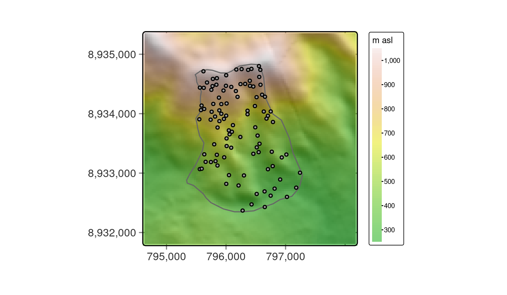

# Ecology {#eco}

## Prerequisites {-}

This chapter assumes you have a strong grasp of geographic data analysis\index{geographic data analysis} and processing, covered in Chapters \@ref(spatial-class) to \@ref(geometry-operations).
In it you will also make use of R's\index{R} interfaces to dedicated GIS\index{GIS} software, and spatial cross-validation\index{cross-validation!spatial CV}, topics covered in Chapters \@ref(gis) and \@ref(spatial-cv), respectively.

The chapter uses the following packages:

```{r 15-eco-1, message=FALSE}
library(data.table)
library(dplyr)
library(mlr3)
library(mlr3spatiotempcv)
library(mlr3tuning)
library(mlr3learners)
library(qgisprocess)
library(paradox)
library(ranger)
library(tree)
library(sf)
library(terra)
library(tree)
library(vegan)
```

## Introduction

In this chapter we will model the floristic gradient of fog oases to reveal distinctive vegetation belts that are clearly controlled by water availability.
To do so, we will bring together concepts presented in previous chapters and even extend them (Chapters \@ref(spatial-class) to \@ref(geometry-operations) and  Chapters \@ref(gis) and \@ref(spatial-cv)).

Fog oases are one of the most fascinating vegetation formations we have ever encountered.
These formations, locally termed *lomas*, develop on mountains along the coastal deserts of Peru and Chile.^[Similar vegetation formations develop also in other parts of the world, e.g., in Namibia and along the coasts of Yemen and Oman [@galletti_land_2016].]
The deserts' extreme conditions and remoteness provide the habitat for a unique ecosystem, including species endemic to the fog oases.
Despite the arid conditions and low levels of precipitation of around 30-50 mm per year on average, fog deposition increases the amount of water available to plants during winter.
This results in green southern-facing mountain slopes along the coastal strip of Peru (Figure \@ref(fig:study-area-mongon)). 
The fog, which develops below the temperature inversion caused by the cold Humboldt current in austral winter, provides the name for this habitat.
Every few years, the El Niño phenomenon brings torrential rainfall to this sun-baked environment [@dillon_lomas_2003].
This causes the desert to bloom, and provides tree seedlings a chance to develop roots long enough to survive the following arid conditions.

Unfortunately, fog oases are heavily endangered, primarily due to human activity (agriculture and climate change).
To effectively protect the last remnants of this unique vegetation ecosystem, evidence is needed on the composition and spatial distribution of the native flora [@muenchow_predictive_2013; @muenchow_soil_2013].
*Lomas* mountains also have economic value as a tourist destination, and can contribute to the well-being of local people via recreation.
For example, most Peruvians live in the coastal desert, and *lomas* mountains are frequently the closest "green" destination.

In this chapter we will demonstrate ecological applications of some of the techniques learned in the previous chapters.
This case study will involve analyzing the composition and the spatial distribution of the vascular plants on the southern slope of Mt. Mongón, a *lomas* mountain near Casma on the central northern coast of Peru (Figure \@ref(fig:study-area-mongon)).

```{r study-area-mongon, echo=FALSE, fig.cap="The Mt. Mongón study area, from Muenchow, Schratz, and Brenning (2017).", out.width="60%", fig.scap="The Mt. Mongón study area."}
knitr::include_graphics("figures/15_study_area_mongon.png")
# knitr::include_graphics("https://user-images.githubusercontent.com/1825120/38989956-6eae7c9a-43d0-11e8-8f25-3dd3594f7e74.png")
```

During a field study to Mt. Mongón, we recorded all vascular plants living in 100 randomly sampled 4x4 m^2^ plots in the austral winter of 2011 [@muenchow_predictive_2013].
The sampling coincided with a strong La Niña event that year (see ENSO monitoring of the [NOASS Climate Prediction Center](http://origin.cpc.ncep.noaa.gov/products/analysis_monitoring/ensostuff/ONI_v5.php)).
This led to even higher levels of aridity than usual in the coastal desert.
On the other hand, it also increased fog activity on the southern slopes of Peruvian *lomas* mountains.

<!--
The first hypothesis is that four plant belts will be found along the altitudinal gradient: a low-elevation *Tillandsia* belt, a herbaceous belt, a bromeliad belt, and an uppermost succulent belt [@muenchow_soil_2013].
-->

Ordinations\index{ordination} are dimension-reducing techniques that allow the extraction of the main gradients from a (noisy) dataset, in our case the floristic gradient developing along the southern mountain slope (see next section).
In this chapter, we will model the first ordination axis, i.e., the floristic gradient, as a function of environmental predictors such as altitude, slope, catchment area\index{catchment area} and NDVI\index{NDVI}.
For this, we will make use of a random forest model\index{random forest} - a very popular machine learning\index{machine learning} algorithm [@breiman_random_2001].
The model will allow us to make spatial predictions of the floristic composition anywhere in the study area.
To guarantee an optimal prediction, it is advisable to tune beforehand the hyperparameters\index{hyperparameter} with the help of spatial cross-validation\index{cross-validation!spatial CV} (see Section \@ref(svm)).

## Data and data preparation

All the data needed for the subsequent analyses is available via the **spDataLarge** package.

```{r 15-eco-2}
data("study_area", "random_points", "comm", package = "spDataLarge")
dem = rast(system.file("raster/dem.tif", package = "spDataLarge"))
ndvi = rast(system.file("raster/ndvi.tif", package = "spDataLarge"))
```

`study_area` is a polygon representing the outline of the study area, and `random_points` is an `sf` object containing the 100 randomly chosen sites.
`comm` is a community matrix of the wide data format [@wickham_tidy_2014] where the rows represent the visited sites in the field and the columns the observed species.^[In statistics, this is also called a contingency table or cross-table.]

```{r 15-eco-3, eval=FALSE}
# sites 35 to 40 and corresponding occurrences of the first five species in the
# community matrix
comm[35:40, 1:5]
#>    Alon_meri Alst_line Alte_hali Alte_porr Anth_eccr
#> 35         0         0         0       0.0     1.000
#> 36         0         0         1       0.0     0.500
#> 37         0         0         0       0.0     0.125
#> 38         0         0         0       0.0     3.000
#> 39         0         0         0       0.0     2.000
#> 40         0         0         0       0.2     0.125
```

The values represent species cover per site, and were recorded as the area covered by a species in proportion to the site area (%; please note that one site can have >100% due to overlapping cover between individual plants).
The rownames of `comm` correspond to the `id` column of `random_points`.
`dem` is the digital elevation model\index{digital elevation model} (DEM) for the study area, and `ndvi` is the Normalized Difference Vegetation Index (NDVI) computed from the red and near-infrared channels of a Landsat scene (see Section \@ref(local-operations) and `?spDataLarge::ndvi.tif`).
Visualizing the data helps to get more familiar with it, as shown in Figure \@ref(fig:sa-mongon) where the `dem` is overplotted by the `random_points` and the `study_area`.

\index{hillshade}

```{r sa-mongon, echo=FALSE, message=FALSE, fig.cap="Study mask (polygon), location of the sampling sites (black points) and DEM in the background.", fig.scap="Study mask, location of the sampling sites."}
# hs = terra::shade(terra::terrain(dem, v = "slope", unit = "radians"),
#                   terra::terrain(dem, v = "aspect", unit = "radians"),
#                   10, 200)
# library(tmap)
# tm = tm_shape(hs) +
#   tm_grid(n.x = 3, n.y = 3) +
#   tm_raster(style = "cont", palette = rev(hcl.colors(99, "Grays")),
#             legend.show = FALSE) +
#   tm_shape(dem) +
#   tm_raster(alpha = 0.5,
#             style = "cont",
#             title = "m asl",
#             legend.reverse = TRUE,
#             n = 11,
#             palette = terrain.colors(50)) +
#   tm_shape(study_area) +
#   tm_borders() +
#   tm_shape(random_points) +
#   tm_dots() +
#   tm_layout(inner.margins = 0, legend.outside = TRUE)
# tmap_save(tm, "figures/15_sa_mongon_sampling.png",
#           width = 12, height = 7, units = "cm")

```

The next step is to compute variables which are not only needed for the modeling and predictive mapping (see Section \@ref(predictive-mapping)) but also for aligning the Non-metric multidimensional scaling (NMDS)\index{NMDS} axes with the main gradient in the study area, altitude and humidity, respectively (see Section \@ref(nmds)).

Specifically, we compute catchment slope and catchment area\index{catchment area} from a digital elevation model\index{digital elevation model} using R-GIS bridges (see Chapter \@ref(gis)).
Curvatures might also represent valuable predictors, and in the Exercise section you can find out how they would impact the modeling result.

To compute catchment area\index{catchment area} and catchment slope, we can make use of the `saga:sagawetnessindex` function.^[Admittedly, it is a bit unsatisfying that the only way of knowing that `sagawetnessindex` computes the desired terrain attributes is to be familiar with SAGA\index{SAGA}.]
`qgis_show_help()` returns all function\index{function} parameters and default values of a specific geoalgorithm\index{geoalgorithm}.
Here, we present only a selection of the complete output.

```{r 15-eco-5, eval=FALSE}
qgisprocess::qgis_show_help("saga:sagawetnessindex")
#> Saga wetness index (saga:sagawetnessindex)
#> ...
#> ----------------
#> Arguments
#> ----------------
#> 
#> DEM: Elevation
#> 	Argument type:	raster
#> 	Acceptable values:
#> 		- Path to a raster layer
#> ...
#> SLOPE_TYPE: Type of Slope
#> 	Argument type:	enum
#> 	Available values:
#> 		- 0: [0] local slope
#> 		- 1: [1] catchment slope
#> ...
#> AREA: Catchment area
#> 	Argument type:	rasterDestination
#> 	Acceptable values:
#> 		- Path for new raster layer
#>... 
#> ----------------
#> Outputs
#> ----------------
#> 
#> AREA: <outputRaster>
#> 	Catchment area
#> SLOPE: <outputRaster>
#> 	Catchment slope
#> ...
```

Subsequently, we can specify the needed parameters using R named arguments (see Section \@ref(rqgis)).
Remember that we can use a `SpatRaster` living in R's\index{R} global environment to specify the input raster `DEM` (see Section \@ref(rqgis)).
Specifying 1 as the `SLOPE_TYPE` makes sure that the algorithm will return the catchment slope.
The resulting rasters\index{raster} are saved to temporary files with an `.sdat` extension which is a SAGA\index{SAGA} raster format.

```{r 15-eco-6, eval=FALSE}
# environmental predictors: catchment slope and catchment area
ep = qgisprocess::qgis_run_algorithm(
  alg = "saga:sagawetnessindex",
  DEM = dem,
  SLOPE_TYPE = 1, 
  SLOPE = tempfile(fileext = ".sdat"),
  AREA = tempfile(fileext = ".sdat"),
  .quiet = TRUE)
```

This returns a list named `ep` containing the paths to the computed output rasters.
Let's read in catchment area as well as catchment slope into a multilayer `SpatRaster` object (see Section \@ref(raster-classes)).
Additionally, we will add two more raster objects to it, namely `dem` and `ndvi`.

```{r 15-eco-7, eval=FALSE}
# read in catchment area and catchment slope
ep = ep[c("AREA", "SLOPE")] |>
  unlist() |>
  terra::rast()
names(ep) = c("carea", "cslope") # assign proper names 
terra::origin(ep) = terra::origin(dem) # make sure rasters have the same origin
ep = c(dem, ndvi, ep) # add dem and ndvi to the multilayer SpatRaster object
```

Additionally, the catchment area\index{catchment area} values are highly skewed to the right (`hist(ep$carea)`).
A log10-transformation makes the distribution more normal.

```{r 15-eco-8, eval=FALSE}
ep$carea = log10(ep$carea)
```

As a convenience to the reader, we have added `ep` to **spDataLarge**:

```{r 15-eco-9, cache.lazy=FALSE}
ep = terra::rast(system.file("raster/ep.tif", package = "spDataLarge"))
```

Finally, we can extract the terrain attributes to our field observations (see also Section \@ref(raster-extraction)).

```{r 15-eco-10, cache=TRUE, cache.lazy=FALSE, message=FALSE, warning=FALSE}
# terra::extract adds automatically a for our purposes unnecessary ID column
ep_rp = terra::extract(ep, random_points) |>
  dplyr::select(-ID)
random_points = cbind(random_points, ep_rp)
```

## Reducing dimensionality {#nmds}

Ordinations\index{ordination} are a popular tool in vegetation science to extract the main information, frequently corresponding to ecological gradients, from large species-plot matrices mostly filled with 0s. 
However, they are also used in remote sensing\index{remote sensing}, the soil sciences, geomarketing\index{geomarketing} and many other fields.
If you are unfamiliar with ordination\index{ordination} techniques or in need of a refresher, have a look at Michael W. Palmer's [web page](http://ordination.okstate.edu/overview.htm) for a short introduction to popular ordination techniques in ecology and at @borcard_numerical_2011 for a deeper look on how to apply these techniques in R. 
**vegan**'s\index{vegan (package)} package documentation is also a very helpful resource (`vignette(package = "vegan")`).

Principal component analysis (PCA\index{PCA}) is probably the most famous ordination\index{ordination} technique. 
It is a great tool to reduce dimensionality if one can expect linear relationships between variables, and if the joint absence of a variable in two plots (observations) can be considered a similarity.
This is barely the case with vegetation data.

For one, relationships are usually non-linear along environmental gradients.
That means the presence of a plant usually follows a unimodal relationship along a gradient (e.g., humidity, temperature or salinity) with a peak at the most favorable conditions and declining ends towards the unfavorable conditions. 

Secondly, the joint absence of a species in two plots is hardly an indication for similarity.
Suppose a plant species is absent from the driest (e.g., an extreme desert) and the most moistest locations (e.g., a tree savanna) of our sampling.
Then we really should refrain from counting this as a similarity because it is very likely that the only thing these two completely different environmental settings have in common in terms of floristic composition is the shared absence of species (except for rare ubiquitous species). 

Non-metric multidimensional scaling (NMDS\index{NMDS}) is one popular dimension-reducing technique used in ecology [@vonwehrden_pluralism_2009].
NMDS\index{NMDS} reduces the rank-based differences between the distances between objects in the original matrix and distances between the ordinated objects. 
The difference is expressed as stress. 
The lower the stress value, the better the ordination, i.e., the low-dimensional representation of the original matrix.
Stress values lower than 10 represent an excellent fit, stress values of around 15 are still good, and values greater than 20 represent a poor fit [@mccune_analysis_2002].
In R, `metaMDS()` of the **vegan**\index{vegan (package)} package can execute a NMDS.
As input, it expects a community matrix with the sites as rows and the species as columns.
Often ordinations\index{ordination} using presence-absence data yield better results (in terms of explained variance) though the prize is, of course, a less informative input matrix (see also Exercises).
`decostand()` converts numerical observations into presences and absences with 1 indicating the occurrence of a species and 0 the absence of a species.
Ordination techniques such as NMDS\index{NMDS} require at least one observation per site.
Hence, we need to dismiss all sites in which no species were found.

```{r 15-eco-11}
# presence-absence matrix
pa = vegan::decostand(comm, "pa")  # 100 rows (sites), 69 columns (species)
# keep only sites in which at least one species was found
pa = pa[rowSums(pa) != 0, ]  # 84 rows, 69 columns
``` 

The resulting matrix serves as input for the NMDS\index{NMDS}.
`k` specifies the number of output axes, here, set to 4.^[
One way of choosing `k` is to try `k` values between 1 and 6 and then using the result which yields the best stress value [@mccune_analysis_2002].
]
NMDS\index{NMDS} is an iterative procedure trying to make the ordinated space more similar to the input matrix in each step.
To make sure that the algorithm converges, we set the number of steps to 500 (`try` parameter).

```{r 15-eco-12, eval=FALSE, message=FALSE}
set.seed(25072018)
nmds = vegan::metaMDS(comm = pa, k = 4, try = 500)
nmds$stress
#> ...
#> Run 498 stress 0.08834745 
#> ... Procrustes: rmse 0.004100446  max resid 0.03041186 
#> Run 499 stress 0.08874805 
#> ... Procrustes: rmse 0.01822361  max resid 0.08054538 
#> Run 500 stress 0.08863627 
#> ... Procrustes: rmse 0.01421176  max resid 0.04985418 
#> *** Solution reached
#> 0.08831395
```

```{r 15-eco-13, eval=FALSE, echo=FALSE}
saveRDS(nmds, "extdata/15-nmds.rds")
```

```{r 15-eco-14, include=FALSE}
nmds = readRDS("extdata/15-nmds.rds")
```

A stress value of 9 represents a very good result, which means that the reduced ordination space represents the large majority of the variance of the input matrix.
Overall, NMDS\index{NMDS} puts objects that are more similar (in terms of species composition) closer together in ordination space.
However, as opposed to most other ordination\index{ordination} techniques, the axes are arbitrary and not necessarily ordered by importance [@borcard_numerical_2011].
However, we already know that humidity represents the main gradient in the study area [@muenchow_predictive_2013;@muenchow_rqgis:_2017].
Since humidity is highly correlated with elevation, we rotate the NMDS axes\index{NMDS} in accordance with elevation (see also `?MDSrotate` for more details on rotating NMDS axes).
Plotting the result reveals that the first axis is, as intended, clearly associated with altitude (Figure \@ref(fig:xy-nmds)).

```{r xy-nmds-code, fig.cap="Plotting the first NMDS axis against altitude.", fig.scap = "First NMDS axis against altitude plot.", fig.asp=1, out.width="60%", eval=FALSE}
elev = dplyr::filter(random_points, id %in% rownames(pa)) |> 
  dplyr::pull(dem)
# rotating NMDS in accordance with altitude (proxy for humidity)
rotnmds = vegan::MDSrotate(nmds, elev)
# extracting the first two axes
sc = vegan::scores(rotnmds, choices = 1:2)
# plotting the first axis against altitude
plot(y = sc[, 1], x = elev, xlab = "elevation in m", 
     ylab = "First NMDS axis", cex.lab = 0.8, cex.axis = 0.8)
```

```{r xy-nmds, fig.cap="Plotting the first NMDS axis against altitude.", fig.scap = "First NMDS axis against altitude plot.", fig.asp=1, out.width="60%", message=FALSE, echo=FALSE}
elev = dplyr::filter(random_points, id %in% rownames(pa)) |> 
  dplyr::pull(dem)
# rotating NMDS in accordance with altitude (proxy for humidity)
rotnmds = vegan::MDSrotate(nmds, elev)
# extracting the first two axes
sc = vegan::scores(rotnmds, choices = 1:2)

```

```{r 15-eco-15, eval=FALSE, echo=FALSE}
# scores and rotated scores in one figure
p1 = xyplot(scores(rotnmds)[, 2] ~ scores(rotnmds)[, 1], pch = 16, 
             col = "lightblue", xlim = c(-3, 2), ylim = c(-2, 2),
             xlab = list("Dimension 1", cex = 0.8), 
             ylab = list("Dimension 2", cex = 0.8),
             scales = list(x = list(relation = "same", cex = 0.8),  
                           y = list(relation = "same", cex = 0.8),
                           # ticks on top are suppressed
                           tck = c(1, 0),  
                           # plots axes labels only in row and column 1 and 4
                           alternating = c(1, 0, 0, 1),    
                           draw = TRUE),
             # we have to use the same colors in the legend as used for the plot
             # points
             par.settings = simpleTheme(col = c("lightblue", "salmon"), 
                                        pch = 16, cex = 0.9), 
             # also the legend point size should be somewhat smaller
             auto.key = list(x = 0.7, y = 0.9, text = c("unrotated", "rotated"), 
                             between = 0.5, cex = 0.9),
             panel = function(x, y, ...) {
                           # Plot the points
                           panel.points(x, y, cex = 0.6, ...)
                           panel.points(x = scores(nmds)[, 1], 
                                        y = scores(nmds)[, 2], 
                                        col = "salmon", pch = 16, cex = 0.6)
                           panel.arrows(x0 = scores(nmds)[, 1], 
                                        y0 = scores(nmds)[, 2],
                                        x1 = x,
                                        y1 = y, 
                                        length = 0.04,
                                        lwd = 0.4)
            })

plot(scores(nmds, choices = 1:2))
points(scores(rotnmds, choices = 1:2), col = "lightblue", pch = 16)


sc = scores(nmds, choices = 1:2) |> as.data.frame()
sc$id = rownames(sc) |> as.numeric()
rp = inner_join(select(sc, id), st_drop_geometry(random_points))
fit_1 = envfit(nmds, select(rp, dem))
fit_2 = envfit(rotnmds, select(rp, dem))
par(mfrow = c(1, 2))
plot(nmds, display = "sites")
plot(fit_1)
plot(rotnmds, display = "sites")
plot(fit_2)
```

The scores of the first NMDS\index{NMDS} axis represent the different vegetation formations, i.e., the floristic gradient, appearing along the slope of Mt. Mongón.
To spatially visualize them, we can model the NMDS\index{NMDS} scores with the previously created predictors (Section \@ref(data-and-data-preparation)), and use the resulting model for predictive mapping (see next section).

## Modeling the floristic gradient

To predict the floristic gradient spatially, we use a random forest\index{random forest} model [@hengl_random_2018].
Random forest\index{random forest} models are frequently applied in environmental and ecological modeling, and often provide the best results in terms of predictive performance [@schratz_hyperparameter_2019]. 
Here, we shortly introduce decision trees and bagging, since they form the basis of random forests\index{random forest}.
We refer the reader to @james_introduction_2013 for a more detailed description of random forests\index{random forest} and related techniques.

To introduce decision trees by example, we first construct a response-predictor matrix by joining the rotated NMDS\index{NMDS} scores to the field observations (`random_points`).
We will also use the resulting data frame for the **mlr3**\index{mlr3 (package)} modeling later on.
<!-- JM: build process stops telling us that sc[, 1] causes the problem though I really don't know why... -->
```{r 15-eco-16, message=FALSE, eval=FALSE}
# construct response-predictor matrix
# id- and response variable
rp = data.frame(id = as.numeric(rownames(sc)), sc = sc[, 1])
# join the predictors (dem, ndvi and terrain attributes)
rp = inner_join(random_points, rp, by = "id")
```

```{r attach-rp, echo=FALSE}
# rp = data.frame(id = as.numeric(rownames(sc)), sc = sc[, 1])
# rp = inner_join(random_points, rp, by = "id")
# saveRDS(rp, "extdata/15-rp.rds")
rp = readRDS("extdata/15-rp.rds")
```

Decision trees split the predictor space into a number of regions.
To illustrate this, we apply a decision tree to our data using the scores of the first NMDS\index{NMDS} axis as the response (`sc`) and altitude (`dem`) as the only predictor.

```{r 15-eco-17, eval=FALSE}
tree_mo = tree::tree(sc ~ dem, data = rp)
plot(tree_mo)
text(tree_mo, pretty = 0)
```

```{r tree, echo=FALSE, fig.cap="Simple example of a decision tree with three internal nodes and four terminal nodes.", out.width="60%", fig.scap="Simple example of a decision tree."}
# tree_mo = tree::tree(sc ~ dem, data = rp)
# png("figures/15_tree.png", width = 1100, height = 700, units = "px", res = 300)
# par(mar = rep(1, 4))
# plot(tree_mo)
# text(tree_mo, pretty = 0)
# dev.off()
knitr::include_graphics("figures/15_tree.png")
```

The resulting tree consists of three internal nodes and four terminal nodes (Figure \@ref(fig:tree)).
The first internal node at the top of the tree assigns all observations which are below
<!--`r # gsub("<", "", as.character(as.data.frame(tree_mo$fram$splits)[1, "cutleft"]))`-->
328.5 m to the left and all other observations to the right branch.
The observations falling into the left branch have a mean NMDS\index{NMDS} score of
<!--`r # round(tree_mo$frame$yval[2], 3)`-->-1.198.
Overall, we can interpret the tree as follows: the higher the elevation, the higher the NMDS\index{NMDS} score becomes.
Decision trees have a tendency to overfit\index{overfitting}, that is they mirror too closely the input data including its noise which in turn leads to bad predictive performances [Section \@ref(intro-cv); @james_introduction_2013].
Bootstrap aggregation (bagging) is an ensemble technique that can help to overcome this problem.
Ensemble techniques simply combine the predictions of multiple models.
Thus, bagging takes repeated samples from the same input data and averages the predictions.
This reduces the variance and overfitting\index{overfitting} with the result of a much better predictive accuracy compared to decision trees.
Finally, random forests\index{random forest} extend and improve bagging by decorrelating trees which is desirable since averaging the predictions of highly correlated trees shows a higher variance and thus lower reliability than averaging predictions of decorrelated trees [@james_introduction_2013].
To achieve this, random forests\index{random forest} use bagging, but in contrast to the traditional bagging where each tree is allowed to use all available predictors, random forests only use a random sample of all available predictors.

<!--
Recall that bagging is simply a special case of a random forest with m = p. Therefore, the randomForest() function can be used to perform both random forests and bagging. 
The argument mtry=13 indicates that all 13 predictors should be considered
for each split of the tree—in other words, that bagging should be done.
@james_introduction_2013
-->

### **mlr3** building blocks

The code in this section largely follows the steps we have introduced in Section \@ref(svm).
The only differences are the following:

1. The response variable is numeric, hence a regression\index{regression} task will replace the classification\index{classification} task of Section \@ref(svm)
1. Instead of the AUROC\index{AUROC} which can only be used for categorical response variables, we will use the root mean squared error (RMSE\index{RMSE}) as performance measure
1. We use a random forest\index{random forest} model instead of a support vector machine\index{SVM} which naturally goes along with different hyperparameters\index{hyperparameter}
1. We are leaving the assessment of a bias-reduced performance measure as an exercise to the reader (see Exercises).
Instead we show how to tune hyperparameters\index{hyperparameter} for (spatial) predictions

Remember that 125,500 models were necessary to retrieve bias-reduced performance estimates when using 100-repeated 5-fold spatial cross-validation\index{cross-validation!spatial CV} and a random search of 50 iterations (see Section \@ref(svm)).
In the hyperparameter\index{hyperparameter} tuning level, we found the best hyperparameter combination which in turn was used in the outer performance level for predicting the test data of a specific spatial partition (see also Figure \@ref(fig:inner-outer)). 
This was done for five spatial partitions, and repeated a 100 times yielding in total 500 optimal hyperparameter combinations.
Which one should we use for making spatial predictions?
The answer is simple: none at all. 
Remember, the tuning was done to retrieve a bias-reduced performance estimate, not to do the best possible spatial prediction.
For the latter, one estimates the best hyperparameter\index{hyperparameter} combination from the complete dataset.
This means, the inner hyperparameter\index{hyperparameter} tuning level is no longer needed which makes perfect sense since we are applying our model to new data (unvisited field observations) for which the true outcomes are unavailable, hence testing is impossible in any case. 
Therefore, we tune the hyperparameters\index{hyperparameter} for a good spatial prediction on the complete dataset via a 5-fold spatial CV\index{cross-validation!spatial CV} with one repetition.
<!-- If we used more than one repetition (say 2) we would retrieve multiple optimal tuned hyperparameter combinations (say 2) -->

Having already constructed the input variables (`rp`), we are all set for specifying the **mlr3**\index{mlr3 (package)} building blocks (task, learner, and resampling).
For specifying a spatial task, we use again the **mlr3spatiotempcv** package [@schratz_mlr3spatiotempcv_2021 & Section \@ref(spatial-cv-with-mlr3)], and since our response (`sc`) is numeric, we use a regression\index{regression} task.

```{r}
knitr::opts_chunk$set(eval = FALSE)
```


```{r 15-eco-20}
# create task
task = mlr3spatiotempcv::as_task_regr_st(dplyr::select(rp, -id, -spri),
  id = "mongon", target = "sc")
```

Using an `sf` object as the backend automatically provides the geometry information needed for the spatial partitioning later on.
Additionally, we got rid of the columns `id` and `spri` since these variables should not be used as predictors in the modeling.
Next, we go on to construct the a random forest\index{random forest} learner from the **ranger** package.

```{r 15-eco-21}
lrn_rf = lrn("regr.ranger", predict_type = "response")
```

As opposed to, for example, support vector machines\index{SVM} (see Section \@ref(svm)), random forests often already show good performances when used with the default values of their hyperparameters (which may be one reason for their popularity).
Still, tuning often moderately improves model results, and thus is worth the effort [@probst_hyperparameters_2018].
In random forests\index{random forest}, the hyperparameters\index{hyperparameter} `mtry`, `min.node.size` and `sample.fraction` determine the degree of randomness, and should be tuned [@probst_hyperparameters_2018].
`mtry` indicates how many predictor variables should be used in each tree. 
If all predictors are used, then this corresponds in fact to bagging (see beginning of Section \@ref(modeling-the-floristic-gradient)).
The `sample.fraction` parameter specifies the fraction of observations to be used in each tree.
Smaller fractions lead to greater diversity, and thus less correlated trees which often is desirable (see above).
The `min.node.size` parameter indicates the number of observations a terminal node should at least have (see also Figure \@ref(fig:tree)).
Naturally, as trees and computing time become larger, the lower the `min.node.size`.

Hyperparameter\index{hyperparameter} combinations will be selected randomly but should fall inside specific tuning limits (created with `paradox::ps()`).
`mtry` should range between 1 and the number of predictors (`r ncol(rp) - 1`) <!-- (4)-->, `sample.fraction` should range between 0.2 and 0.9 and `min.node.size` should range between 1 and 10.

```{r 15-eco-22}
# specifying the search space
search_space = paradox::ps(
  mtry = paradox::p_int(lower = 1, upper = ncol(task$data()) - 1),
  sample.fraction = paradox::p_dbl(lower = 0.2, upper = 0.9),
  min.node.size = paradox::p_int(lower = 1, upper = 10)
)
```

Having defined the search space, we are all set for specifying our tuning via the `AutoTuner()` function.
Since we deal with geographic data, we will again make use of spatial cross-validation to tune the hyperparameters\index{hyperparameter} (see Sections \@ref(intro-cv) and \@ref(spatial-cv-with-mlr3)).
Specifically, we will use a five-fold spatial partitioning with only one repetition (`rsmp()`). 
In each of these spatial partitions, we run 50 models (`trm()`) while using randomly selected hyperparameter configurations (`tnr()`) within predefined limits (`seach_space`) to find the optimal hyperparameter\index{hyperparameter} combination [see also Section \@ref(svm) and https://mlr3book.mlr-org.com/optimization.html#autotuner, @becker_mlr3_2022].
The performance measure is the root mean squared error (RMSE\index{RMSE}).

```{r 15-eco-23}
autotuner_rf = mlr3tuning::AutoTuner$new(
  learner = lrn_rf,
  resampling = mlr3::rsmp("spcv_coords", folds = 5), # spatial partitioning
  measure = mlr3::msr("regr.rmse"), # performance measure
  terminator = mlr3tuning::trm("evals", n_evals = 50), # specify 50 iterations
  search_space = search_space, # predefined hyperparameter search space
  tuner = mlr3tuning::tnr("random_search") # specify random search
)
```

Calling the `train()`-method of the `AutoTuner`-object finally runs the hyperparameter\index{hyperparameter} tuning, and will find the optimal hyperparameter\index{hyperparameter} combination for the specified parameters.

```{r 15-eco-24, eval=FALSE, cache=TRUE, cache.lazy=FALSE}
# hyperparameter tuning
set.seed(0412022)
autotuner_rf$train(task)
```

```{r 15-eco-25, cache=TRUE, cache.lazy=FALSE, eval=FALSE, echo=FALSE}
saveRDS(autotuner_rf, "extdata/15-tune.rds")
```

```{r 15-eco-26, echo=FALSE, cache=TRUE, cache.lazy=FALSE}
autotuner_rf = readRDS("extdata/15-tune.rds")
```

```{r tuning-result, cache=TRUE, cache.lazy=FALSE}
autotuner_rf$tuning_result
```

<!--
An `mtry` of `r # autotuner_rf$tuning_result$mtry`, a `sample.fraction` of `r # round(autotuner_rf$tuning_result$sample.fraction, 2)`, and a `min.node.size` of `r # autotuner_rf$tuning_result$min.node.size` represent the best hyperparameter\index{hyperparameter} combination.
An RMSE\index{RMSE} of `r # round(autotuner_rf$tuning_result$regr.rmse, 2)`
is relatively good when considering the range of the response variable which is `r # round(diff(range(rp$sc)), 2)` (`diff(range(rp$sc))`).
-->
### Predictive mapping

The tuned hyperparameters\index{hyperparameter} can now be used for the prediction.
To do so, we only need to run the `predict` method of our fitted `AutoTuner` object.

```{r 15-eco-27, cache=TRUE, cache.lazy=FALSE}
# predicting using the best hyperparameter combination
autotuner_rf$predict(task)
```

The `predict` method will apply the model to all observations used in the modeling.
Given a multilayer `SpatRaster` containing rasters named as the predictors used in the modeling, `terra::predict()` will also make spatial predictions, i.e., predict to new data.

```{r 15-eco-28, cache=TRUE, cache.lazy=FALSE, eval=FALSE}
pred = terra::predict(ep, model = autotuner_rf, fun = predict)
```

```{r rf-pred, echo=FALSE, fig.cap="Predictive mapping of the floristic gradient clearly revealing distinct vegetation belts.", out.width="60%", fig.scap="Predictive mapping of the floristic gradient."}
# hs = terra::shade(terra::terrain(dem, v = "slope", unit = "radians"),
#                   terra::terrain(dem, v = "aspect", unit = "radians"),
#                   10, 200) |>
#   terra::mask(terra::vect(study_area))
# pred = terra::mask(pred, terra::vect(study_area)) |>
#   terra::trim()
# library(tmap)
# pal = rev(hcl.colors(n = 15, "RdYlBu"))
# tm = tm_shape(hs) +
#   tm_grid(n.x = 3, n.y = 3, lines = FALSE) +
#   tm_raster(style = "cont", palette = rev(hcl.colors(99, "Grays")),
#             legend.show = FALSE) +
#   tm_shape(pred, is.master = TRUE) +
#   tm_raster(style = "cont", title = "NMDS1", alpha = 0.8,
#             legend.reverse = TRUE, palette = pal, midpoint	= NA) +
#   tm_shape(study_area) +
#   tm_borders() +
#   tm_layout(inner.margins = 0.02, legend.outside = TRUE)
# tmap_save(tm, "figures/15_rf_pred.png",
#           width = 12, height = 7, units = "cm")
knitr::include_graphics("figures/15_rf_pred.png")
```

In case, `terra::predict()` does not support a model algorithm, you can still make the predictions manually.

```{r 15-eco-29, cache=TRUE, cache.lazy=FALSE, eval=FALSE}
newdata = as.data.frame(as.matrix(ep))
colSums(is.na(newdata))  # 0 NAs
# but assuming there were 0s results in a more generic approach
ind = rowSums(is.na(newdata)) == 0
tmp = autotuner_rf$predict_newdata(newdata = newdata[ind, ], task = task)
newdata[ind, "pred"] = data.table::as.data.table(tmp)[["response"]]
pred_2 = ep$dem
# now fill the raster with the predicted values
pred_2[] = newdata$pred
# check if terra and our manual prediction is the same
all(values(pred - pred_2) == 0)
```

The predictive mapping clearly reveals distinct vegetation belts (Figure \@ref(fig:rf-pred)).
Please refer to @muenchow_soil_2013 for a detailed description of vegetation belts on **lomas** mountains.
The blue color tones represent the so-called *Tillandsia*-belt.
*Tillandsia* is a highly adapted genus especially found in high quantities at the sandy and quite desertic foot of *lomas* mountains.
The yellow color tones refer to a herbaceous vegetation belt with a much higher plant cover compared to the *Tillandsia*-belt.
The orange colors represent the bromeliad belt, which features the highest species richness and plant cover.
It can be found directly beneath the temperature inversion (ca. 750-850 m asl) where humidity due to fog is highest.
Water availability naturally decreases above the temperature inversion, and the landscape becomes desertic again with only a few succulent species (succulent belt; red colors).
Interestingly, the spatial prediction clearly reveals that the bromeliad belt is interrupted which is a very interesting finding we would have not detected without the predictive mapping.

## Conclusions

In this chapter we have ordinated\index{ordination} the community matrix of the **lomas** Mt. Mongón with the help of a NMDS\index{NMDS} (Section \@ref(nmds)).
The first axis, representing the main floristic gradient in the study area, was modeled as a function of environmental predictors which partly were derived through R-GIS\index{GIS} bridges (Section \@ref(data-and-data-preparation)).
The **mlr3**\index{mlr3 (package)} package provided the building blocks to spatially tune the hyperparameters\index{hyperparameter} `mtry`, `sample.fraction` and `min.node.size` (Section \@ref(mlr3-building-blocks)).
The tuned hyperparameters\index{hyperparameter} served as input for the final model which in turn was applied to the environmental predictors for a spatial representation of the floristic gradient (Section \@ref(predictive-mapping)).
The result demonstrates spatially the astounding biodiversity in the middle of the desert.
Since **lomas** mountains are heavily endangered, the prediction map can serve as basis for informed decision-making on delineating protection zones, and making the local population aware of the uniqueness found in their immediate neighborhood.

In terms of methodology, a few additional points could be addressed:

- It would be interesting to also model the second ordination\index{ordination} axis, and to subsequently find an innovative way of visualizing jointly the modeled scores of the two axes in one prediction map
- If we were interested in interpreting the model in an ecologically meaningful way, we should probably use (semi-)parametric models [@muenchow_predictive_2013;@zuur_mixed_2009;@zuur_beginners_2017]
However, there are at least approaches that help to interpret machine learning models such as random forests\index{random forest} (see, e.g., [https://mlr-org.github.io/interpretable-machine-learning-iml-and-mlr/](https://mlr-org.github.io/interpretable-machine-learning-iml-and-mlr/))
- A sequential model-based optimization (SMBO) might be preferable to the random search for hyperparameter\index{hyperparameter} optimization used in this chapter [@probst_hyperparameters_2018]

Finally, please note that random forest\index{random forest} and other machine learning\index{machine learning} models are frequently used in a setting with lots of observations and many predictors, much more than used in this chapter, and where it is unclear which variables and variable interactions contribute to explaining the response.
Additionally, the relationships might be highly non-linear.
In our use case, the relationship between response and predictors are pretty clear, there is only a slight amount of non-linearity and the number of observations and predictors is low.
Hence, it might be worth trying a linear model\index{regression!linear}.
A linear model is much easier to explain and understand than a random forest\index{random forest} model, and therefore to be preferred (law of parsimony), additionally it is computationally less demanding (see Exercises).
If the linear model cannot cope with the degree of non-linearity present in the data, one could also try a generalized additive model\index{generalized additive model} (GAM).
The point here is that the toolbox of a data scientist consists of more than one tool, and it is your responsibility to select the tool best suited for the task or purpose at hand.
Here, we wanted to introduce the reader to random forest\index{random forest} modeling and how to use the corresponding results for spatial predictions.
For this purpose, a well-studied dataset with known relationships between response and predictors, is appropriate.
However, this does not imply that the random forest\index{random forest} model has returned the best result in terms of predictive performance (see Exercises).

## Exercises

```{r, echo=FALSE, results='asis'}
res = knitr::knit_child('_15-ex.Rmd', quiet = TRUE, options = list(include = FALSE, eval = FALSE))
cat(res, sep = '\n')
```
