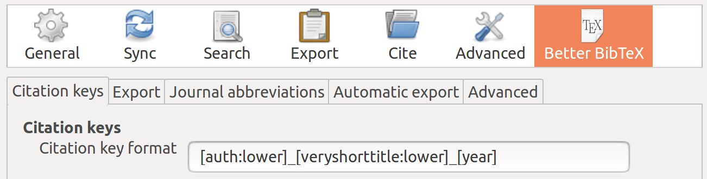

<!-- README.md is generated from README.Rmd. Please edit that file - rmarkdown::render('README.Rmd', output_format = 'github_document', output_file = 'README.md') -->

```{r, echo = FALSE}
knitr::opts_chunk$set(
  collapse = TRUE,
  comment = "#>",
  fig.path = "figures/"
)
is_online = curl::has_internet()
```

# Geocomputation with R  

<!-- badges: start -->
[](https://mybinder.org/v2/gh/robinlovelace/geocompr/main?urlpath=rstudio)
[](https://rstudio.cloud/project/1642300)
[](https://github.com/Robinlovelace/geocompr/actions)
[](https://github.com/geocompr/docker/)
[](https://discord.gg/PMztXYgNxp)

<!-- [](https://zenodo.org/badge/latestdoi/84222786) -->
<!-- badges: end -->

## Introduction

This repository hosts the code underlying Geocomputation with R, a book by [Robin Lovelace](https://www.robinlovelace.net/), [Jakub Nowosad](https://jakubnowosad.com/), and [Jannes Muenchow](https://github.com/jannes-m).
If you find the contents useful, please [cite it](https://github.com/Robinlovelace/geocompr/raw/main/CITATION.bib) as follows:

> Lovelace, Robin, Jakub Nowosad and Jannes Muenchow (2019). Geocomputation with R. The R Series. CRC Press.

The first version of the book has been published by [CRC Press](https://www.crcpress.com/9781138304512) in the [R Series](https://www.routledge.com/Chapman--HallCRC-The-R-Series/book-series/CRCTHERSER) and can be viewed online at [bookdown.org](https://bookdown.org/robinlovelace/geocompr/).
Read the latest version at [geocompr.robinlovelace.net](https://geocompr.robinlovelace.net/).


### Note: we are actively working on the Second Edition 🏗

Since commencing work on the Second Edition in September 2021 much has changed, including:

- Replacement of `raster` with `terra` in Chapters 1 to 7 (see commits related to this update [here](https://github.com/Robinlovelace/geocompr/search?q=terra&type=commits)) 
- Update of Chapter 7 to include mention alternative ways or reading-in OSM data in [#656](https://github.com/Robinlovelace/geocompr/pull/656)
- Refactor build settings so the book builds on Docker images in the [geocompr/docker](https://github.com/geocompr/docker) repo
- Improve the experience of using the book in Binder (ideal for trying out the code before installing or updating the necessary R packages), as documented in issue [#691](https://github.com/Robinlovelace/geocompr/issues/691) (thanks to [yuvipanda](https://github.com/yuvipanda))
- Improved communication of binary spatial predicates in Chapter 4 (see [#675](https://github.com/Robinlovelace/geocompr/pull/675))
- New section on the links between subsetting and clipping (see [#698](https://github.com/Robinlovelace/geocompr/pull/698)) in Chapter 5
- New [section](https://geocompr.robinlovelace.net/spatial-operations.html#de-9im-strings) on the dimensionally extended 9 intersection model (DE-9IM)
- New [chapter](https://geocompr.robinlovelace.net/raster-vector.html) on raster-vector interactions split out from Chapter 5
- New [section](https://geocompr.robinlovelace.net/spatial-class.html#the-sfheaders-package) on the **sfheaders** package
- New [section](https://geocompr.robinlovelace.net/spatial-class.html#s2) in Chapter 2 on spherical geometry engines and the **s2** package
- Replacement of code based on the old **mlr** package with code based on the new **mlr3** package, as described in a huge [pull request](https://github.com/Robinlovelace/geocompr/pull/771)
<!-- Todo: update this bullet point (Rl 2021-11) -->
<!-- - Next issue  -->

<!-- Todo: add news file? (RL 2021-11) -->
<!-- See NEWS.md for a summary of the changes. -->
See [https://github.com/Robinlovelace/geocompr/compare/1.9...main](https://github.com/Robinlovelace/geocompr/compare/1.9...main#files_bucket) for a continuously updated summary of the changes to date.
At the time of writing (April 2022) there have been more than 10k lines of code/prose added, lots of refactoring!

[](https://github.com/Robinlovelace/geocompr/compare/1.9...main)

Contributions at this stage are very welcome.

## Contributing

We encourage contributions on any part of the book, including:

- improvements to the text, e.g. clarifying unclear sentences, fixing typos (see guidance from [Yihui Xie](https://yihui.org/en/2013/06/fix-typo-in-documentation/));
- changes to the code, e.g. to do things in a more efficient way; 
- suggestions on content (see the project's [issue tracker](https://github.com/Robinlovelace/geocompr/issues));
- improvements to and alternative approaches in the Geocompr solutions booklet hosted at [geocompr.github.io/solutions](https://geocompr.github.io/solutions/) (see a blog post on how to update solutions in files such as [_01-ex.Rmd](https://github.com/Robinlovelace/geocompr/blob/main/_01-ex.Rmd) [here](https://geocompr.github.io/post/2022/geocompr-solutions/))

See [our-style.md](https://github.com/Robinlovelace/geocompr/blob/main/misc/our-style.md) for the book's style.

```{r contributors, include=FALSE}
contributors = source("code/list-contributors.R")[[1]]
# save for future reference:
readr::write_csv(contributors, "extdata/contributors.csv")
# table view:
# knitr::kable(contributors, caption = "Contributors to Geocomputation with R")
# text view
c_txt = contributors$name
c_url = contributors$link
c_rmd = paste0("[", c_txt, "](", c_url, ")")
contributors_text = paste0(c_rmd, collapse = ", ")
```

Many thanks to all contributors to the book so far via GitHub (this list will update automatically): `r contributors_text`.

During the project we aim to contribute 'upstream' to the packages that make geocomputation with R possible.
This impact is recorded in [`our-impact.csv`](https://github.com/Robinlovelace/geocompr/blob/main/misc/our-impact.csv).

## Reproducing the book

To ease reproducibility, we created the `geocompkg` package.
Installing it from GitHub will install all the R packages needed build the book (you will need a computer with necessary [system dependencies](https://github.com/r-spatial/sf#installing) and the [**remotes**](https://github.com/r-lib/remotes/) package installed):

```{r readme-install-github, eval=FALSE}
install.packages("remotes")
# To reproduce the first Part (chapters 1 to 8):
remotes::install_github("geocompr/geocompkg")
```

Running the commands above should install the packages needed to run the first part of the book (chapters 1 to 8).
To install and build the book in its entirety, run the following command (which installs additional 'Suggests' packages, this may take some time to run!):

```{r readme-install-github-2, message=FALSE, eval=FALSE, results='hide'}
# To reproduce all chapters (install lots of packages, may take some time!)
remotes::install_github("geocompr/geocompkg", dependencies = TRUE)
```

You need a recent version of the GDAL, GEOS, PROJ and udunits libraries installed for this to work on Mac and Linux.
See the **sf** package's [README](https://github.com/r-spatial/sf) for information on that.

Once the dependencies have been installed you should be able to build and view a local version the book with:

```{r readme-render-book, eval=FALSE}
bookdown::render_book("index.Rmd") # to build the book
browseURL("_book/index.html") # to view it
```

<!-- The code associated with each chapter is saved in the `code/chapters/` folder. -->
<!-- `source("code/chapters/07-transport.R")` runs run the code chunks in chapter 7, for example. -->
<!-- These R scripts are generated with the follow command which wraps `knitr::purl()`: -->

```{r gen-code, results='hide', echo=FALSE, eval=FALSE}
geocompkg:::generate_chapter_code()
```

## Geocompr in binder

For many people the quickest way to get started with Geocomputation with R is in your web browser via Binder.
To see an interactive RStudio Server instance click on the following button, which will open [mybinder.org](https://mybinder.org/v2/gh/robinlovelace/geocompr/main?urlpath=rstudio) with an R installation that has all the dependencies needed to reproduce the book:

[](https://mybinder.org/v2/gh/robinlovelace/geocompr/main?urlpath=rstudio)

You can also have a play with the repo in RStudio Cloud by clicking on this link (requires log-in):

[](https://rstudio.cloud/project/1642300)


## Geocomputation with R in a Docker container

To ease reproducibility we have made Docker images available, at [geocompr/geocompr](https://hub.docker.com/r/geocompr/geocompr/) on DockerHub.
These images allow you to explore Geocomputation with R in a virtual machine that has up-to-date dependencies.

After you have [installed docker](https://www.docker.com/products/container-runtime/) and set-it up on [your computer](https://docs.docker.com/engine/install/linux-postinstall/) you can start RStudio Server without a password (see the [Rocker project](https://www.rocker-project.org/use/managing_users/) for info on how to add a password and other security steps for public-facing servers):

```sh
docker run -p 8787:8787 -e DISABLE_AUTH=TRUE geocompr/geocompr
```

If it worked you should be able to open-up RStudio server by opening a browser and navigating to
http://localhost:8787/ resulting in an up-to-date version of R and RStudio running in a container.

Start a plain R session running:

```sh
docker run -it geocompr/geocompr R
```


If you see something like this after following the steps above, congratulations: it worked!
See [github.com/rocker-org](https://github.com/rocker-org/rocker/wiki/Using-the-RStudio-image#running-rstudio-server) for more info.

If you want to call QGIS from R, you can use the `qgis` tag, by running the following command for example (which also shows how to set a password and use a different port on localhost):

```
docker run -d -p 8799:8787 -e USERID=$UID -e PASSWORD=strongpass -v $(pwd):/home/rstudio/geocompr robinlovelace/geocompr:qgis
```

From this point to *build* the book you can open projects in the `geocompr` directory from the project box in the top-right hand corner, and  knit `index.Rmd` with the little `knit` button above the the RStudio script panel (`Ctl+Shift+B` should do the same job).


See the [geocompr/docker](https://github.com/geocompr/docker#geocomputation-with-r-in-docker) repo for details, including how to share volumes between your computer and the Docker image, for using geographic R packages on your own data and for information on available tags.


## Reproducing this README

To reduce the book's dependencies, scripts to be run infrequently to generate input for the book are run on creation of this README.

The additional packages required for this can be installed as follows:

```{r extra-pkgs, message=FALSE, eval=FALSE}
source("code/extra-pkgs.R")
```

With these additional dependencies installed, you should be able to run the following scripts, which create content for the book, that we've removed from the main book build to reduce package dependencies and the book's build time:

```{r source-readme, eval=FALSE}
source("code/01-cranlogs.R")
source("code/sf-revdep.R")
source("code/09-urban-animation.R")
source("code/09-map-pkgs.R")
```

Note: the `.Rproj` file is configured to build a website not a single page.
To reproduce this [README](https://github.com/Robinlovelace/geocompr/blob/main/README.Rmd) use the following command:

```{r render-book, eval=FALSE}
rmarkdown::render("README.Rmd", output_format = "github_document", output_file = "README.md")
```


```{r scripts,  eval=FALSE, echo=FALSE}
# We aim to make every script in the `code` folder reproducible.
# To check they can all be reproduced run the following:
# Aim: test reproducibility of scripts
script_names = list.files("code", full.names = T)
avoid = "pkgs|anim|us|saga|sliver|tsp|parti|polycent|cv|svm|data|location|eco|rf|cran|hex"
dontrun = grepl(avoid, script_names)
script_names = script_names[!dontrun]
counter = 0
for(i in script_names[45:length(script_names)]) {
  counter = counter + 1
  print(paste0("Script number ", counter, ": ", i))
  source(i)
}
```


<!-- ## Book statistics -->

<!-- An indication of the book's progress over time is illustrated below (to be updated roughly every week as the book progresses). -->

```{r gen-stats, echo=FALSE, message=FALSE, warning=FALSE, eval=FALSE}
# source("code/generate-chapter-code.R")
book_stats = readr::read_csv("extdata/word-count-time.csv",
                             col_types=('iiDd'))

# to prevent excessive chapter count
if(Sys.Date() > max(book_stats$date) + 5) {
  book_stats_new = geocompkg:::generate_book_stats()
  book_stats = bind_rows(book_stats, book_stats_new)
  readr::write_csv(book_stats, "extdata/word-count-time.csv")
}
book_stats = dplyr::filter(book_stats, chapter <= 15) 
library(ggplot2)
book_stats$chapter = formatC(book_stats$chapter, width = 2, format = "d", flag = "0")
book_stats$chapter = fct_rev(as.factor(book_stats$chapter))
book_stats$n_pages = book_stats$n_words / 300
```

```{r bookstats, warning=FALSE, echo=FALSE, fig.width=8, fig.height=5, eval=FALSE}
ggplot(book_stats) +
  geom_area(aes(date, n_pages, fill = chapter), position = "stack") +
  ylab("Estimated number of pages") +
  xlab("Date") + 
  scale_x_date(date_breaks = "2 month",
               limits = c(min(book_stats$date), as.Date("2018-10-01")),
               date_labels = "%b %Y") +
  coord_cartesian(ylim = c(0, 350))
```

<!-- Book statistics: estimated number of pages per chapter over time. -->

## Citations

To cite packages used in this book we use code from [Efficient R Programming](https://csgillespie.github.io/efficientR/):

```{r gen-cite, warning=FALSE}
# geocompkg:::generate_citations()
```

This generates .bib and .csv files containing the packages.
The current of packages used can be read-in as follows:

```{r pkg_df, message=FALSE}
pkg_df = readr::read_csv("extdata/package_list.csv")
```

Other citations are stored online using Zotero.

If you would like to add to the references, please use Zotero, join the [open group](https://www.zotero.org/groups/418217/energy-and-transport) add your citation to the open [geocompr library](https://www.zotero.org/groups/418217/energy-and-transport/items/collectionKey/9K6FRP6N).

We use the following citation key format:

```
[auth:lower]_[veryshorttitle:lower]_[year]
```

This can be set from inside Zotero desktop with the Better Bibtex plugin installed (see [github.com/retorquere/zotero-better-bibtex](https://github.com/retorquere/zotero-better-bibtex)) by selecting the following menu options (with the shortcut `Alt+E` followed by `N`), and as illustrated in the figure below:

```
Edit > Preferences > Better Bibtex
```



Zotero settings: these are useful if you want to add references.

We use Zotero because it is a powerful open source reference manager that integrates well with the **citr** package.
As described in the GitHub repo [Robinlovelace/rmarkdown-citr-demo](https://github.com/Robinlovelace/rmarkdown-citr-demo).
