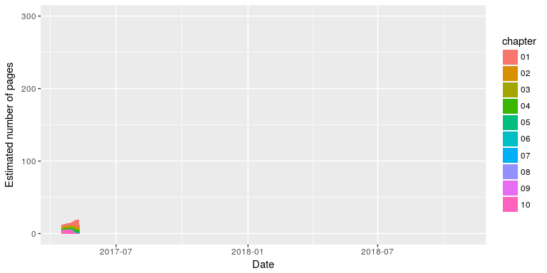

<!-- README.md is generated from README.Rmd. Please edit that file - rmarkdown::render('README.Rmd', output_format = 'md_document', output_file = 'README.md') -->
Geocomputation with R
=====================

[](https://travis-ci.org/Robinlovelace/geocompr) [](https://gitter.im/geocompr/Lobby)

Introduction
============

This repository hosts the code underlying Geocomputation with R, a book by [Robin Lovelace](http://robinlovelace.net/) and [Jakub Nowosad](https://nowosad.github.io/).

The online version of the book will be developed in the open. We plan to publish the hard copy of the book with CRC Press in 2018.

Contributing
------------

We encourage contributions on any part of the book, including:

-   Improvements to the text, e.g. clarifying unclear sentences, fixing typos (see guidance from [Yihui Xie](https://yihui.name/en/2013/06/fix-typo-in-documentation/)).
-   Changes to the code, e.g. to do things in a more efficient way.
-   Suggestions on content (see the project's [issue tracker](https://github.com/Robinlovelace/geocompr/issues) and the [work-in-progress](https://github.com/Robinlovelace/geocompr/tree/master/work-in-progress) folder for chapters in the pipeline).

Please see [style.md](https://github.com/Robinlovelace/geocompr/blob/master/style.md) for the book's style.

Reproducing the book
--------------------

To ease reproducibility, this book is also a package. Installing it from GitHub will ensure all dependencies are available on your computer (you need [**devtools**](https://github.com/hadley/devtools)):

``` r
devtools::install_github("robinlovelace/geocompr")
```

You need a recent version of the GDAL, GEOS, Proj.4 and UDUNITS libraries installed for this to work on Mac and Linux. See the **sf** package's [README](https://github.com/edzer/sfr) for information on that.

Once the dependencies have been installed you should be able to build and view a local version the book with:

``` r
bookdown::render_book("index.Rmd") # to build the book
browseURL("_book/index.html") # to view it
```

Note: the `.Rproj` file is configured to build a website not a single page. To reproduce this [README](https://github.com/Robinlovelace/geocompr/blob/master/README.Rmd) use the following command:

``` r
rmarkdown::render("README.Rmd", output_format = "md_document", output_file = "README.md")
```

Book statistics
---------------

An indication of the book's progress over time is illustrated below (to be updated roughly every week as the book progresses).



Book statistics: estimated number of pages per chapter over time.

Citations
---------

To cite packages used in this book we use code from [Efficient R Programming](https://csgillespie.github.io/efficientR/):

``` r
geocompr:::generate_citations()
```

This generates .bib and .csv files containing the packages. The current list of files used is as follows:

``` r
pkg_df = readr::read_csv("extdata/package_list.csv")
knitr::kable(pkg_df)
```

| Name           | Title                                                                                        | version |
|:---------------|:---------------------------------------------------------------------------------------------|:--------|
| bookdown       | Authoring Books and Technical Documents with R Markdown (Xie 2017)                           | 0.4     |
| dismo          | Species Distribution Modeling (Hijmans et al. 2017)                                          | 1.1.4   |
| gstat          | Spatial and Spatio-Temporal Geostatistical Modelling, Prediction (Pebesma and Graeler 2017)  | 1.1.5   |
| leaflet        | Create Interactive Web Maps with the JavaScript 'Leaflet' (Cheng, Karambelkar, and Xie 2017) | 1.1.0   |
| mapview        | Interactive Viewing of Spatial Objects in R (Appelhans et al. 2017)                          | 2.0.1   |
| microbenchmark | Accurate Timing Functions (Mersmann 2015)                                                    | 1.4.2.1 |
| raster         | Geographic Data Analysis and Modeling (Hijmans 2016)                                         | 2.5.8   |
| rgdal          | Bindings for the Geospatial Data Abstraction Library (Bivand, Keitt, and Rowlingson 2017)    | 1.2.7   |
| rgeos          | Interface to Geometry Engine - Open Source (GEOS) (Bivand and Rundel 2017)                   | 0.3.23  |
| sf             | Simple Features for R (Pebesma 2017)                                                         | 0.5.1   |
| sp             | Classes and Methods for Spatial Data (Pebesma and Bivand 2016)                               | 1.2.4   |
| spData         | Datasets for spatial analysis packages (Bivand, Nowosad, and Lovelace 2017)                  | 0.1.3   |
| tidyverse      | Easily Install and Load 'Tidyverse' Packages (Wickham 2017)                                  | 1.1.1   |
| tmap           | Thematic Maps (Tennekes 2017)                                                                | 1.10    |

Other citations are stored online using Zotero and downloaded with:

``` r
geocompr:::dl_citations(f = "refs.bib", user = 418217, collection = "9K6FRP6N")
```

If you would like to add to the references, please join Zotero and add your citation to the open [geocompr group library](https://www.zotero.org/groups/418217/energy-and-transport/items/collectionKey/9K6FRP6N).

Code with additional dependencies
---------------------------------

To reduce the book's dependencies, scripts to be run infrequently to generate input for the book are run on creation of this README:

``` r
source("code/cranlogs.R")
source("code/sf-revdep.R")
```

References
----------

Appelhans, Tim, Florian Detsch, Christoph Reudenbach, and Stefan Woellauer. 2017. *Mapview: Interactive Viewing of Spatial Objects in R*. <https://CRAN.R-project.org/package=mapview>.

Bivand, Roger, and Colin Rundel. 2017. *Rgeos: Interface to Geometry Engine - Open Source (Geos)*. <https://CRAN.R-project.org/package=rgeos>.

Bivand, Roger, Tim Keitt, and Barry Rowlingson. 2017. *Rgdal: Bindings for the Geospatial Data Abstraction Library*. <https://CRAN.R-project.org/package=rgdal>.

Bivand, Roger, Jakub Nowosad, and Robin Lovelace. 2017. *SpData: Datasets for Spatial Analysis Packages*. <https://github.com/Nowosad/spData>.

Cheng, Joe, Bhaskar Karambelkar, and Yihui Xie. 2017. *Leaflet: Create Interactive Web Maps with the Javascript ’Leaflet’ Library*. <https://CRAN.R-project.org/package=leaflet>.

Hijmans, Robert J. 2016. *Raster: Geographic Data Analysis and Modeling*. <https://CRAN.R-project.org/package=raster>.

Hijmans, Robert J., Steven Phillips, John Leathwick, and Jane Elith. 2017. *Dismo: Species Distribution Modeling*. <https://CRAN.R-project.org/package=dismo>.

Mersmann, Olaf. 2015. *Microbenchmark: Accurate Timing Functions*. <https://CRAN.R-project.org/package=microbenchmark>.

Pebesma, Edzer. 2017. *Sf: Simple Features for R*. <https://github.com/edzer/sfr/>.

Pebesma, Edzer, and Roger Bivand. 2016. *Sp: Classes and Methods for Spatial Data*. <https://CRAN.R-project.org/package=sp>.

Pebesma, Edzer, and Benedikt Graeler. 2017. *Gstat: Spatial and Spatio-Temporal Geostatistical Modelling, Prediction and Simulation*. <https://CRAN.R-project.org/package=gstat>.

Tennekes, Martijn. 2017. *Tmap: Thematic Maps*. <https://CRAN.R-project.org/package=tmap>.

Wickham, Hadley. 2017. *Tidyverse: Easily Install and Load ’Tidyverse’ Packages*. <https://CRAN.R-project.org/package=tidyverse>.

Xie, Yihui. 2017. *Bookdown: Authoring Books and Technical Documents with R Markdown*. <https://CRAN.R-project.org/package=bookdown>.
