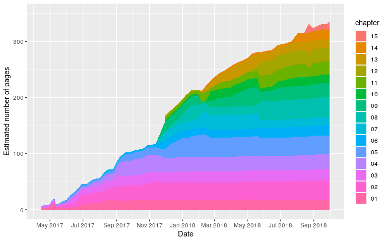
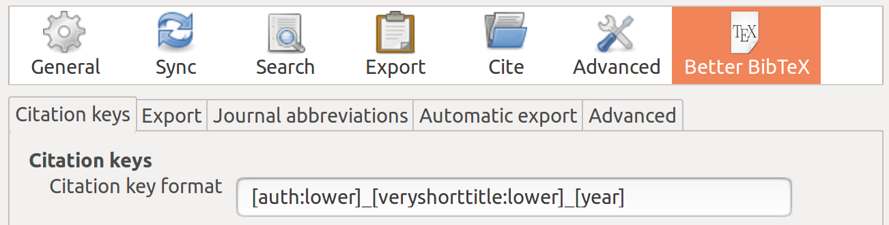

<!-- README.md is generated from README.Rmd. Please edit that file - rmarkdown::render('README.Rmd', output_format = 'github_document', output_file = 'README.md') -->

# Geocomputation with R

[](https://mybinder.org/v2/gh/robinlovelace/geocompr/master?urlpath=rstudio)
[](https://travis-ci.org/Robinlovelace/geocompr)
[](https://hub.docker.com/r/robinlovelace/geocompr/builds/)
[](https://zenodo.org/badge/latestdoi/84222786)

# Introduction

This repository hosts the code underlying Geocomputation with R, a book
by [Robin Lovelace](https://www.robinlovelace.net/), [Jakub
Nowosad](https://nowosad.github.io/), and [Jannes
Muenchow](http://www.geographie.uni-jena.de/en/Muenchow.html):

> Lovelace, Robin, Jakub Nowosad and Jannes Muenchow (2019).
> Geocomputation with R. The R Series. CRC Press.

This book has been published by [CRC
Press](https://www.crcpress.com/9781138304512) in the [R
Series](https://www.crcpress.com/Chapman--HallCRC-The-R-Series/book-series/CRCTHERSER).
The online version of this book is free to read at
<https://geocompr.robinlovelace.net/>.

## Contributing

We encourage contributions on any part of the book, including:

  - Improvements to the text, e.g. clarifying unclear sentences, fixing
    typos (see guidance from [Yihui
    Xie](https://yihui.name/en/2013/06/fix-typo-in-documentation/)).
  - Changes to the code, e.g. to do things in a more efficient way.
  - Suggestions on content (see the project’s [issue
    tracker](https://github.com/Robinlovelace/geocompr/issues)).

Please see
[our-style.md](https://github.com/Robinlovelace/geocompr/blob/master/our-style.md)
for the book’s style.

Many thanks to all contributors to the book so far via GitHub (this list
will update automatically): [prosoitos](https://github.com/prosoitos),
[florisvdh](https://github.com/florisvdh),
[katygregg](https://github.com/katygregg),
[erstearns](https://github.com/erstearns),
[eyesofbambi](https://github.com/eyesofbambi),
[tyluRp](https://github.com/tyluRp),
[marcosci](https://github.com/marcosci),
[giocomai](https://github.com/giocomai),
[mdsumner](https://github.com/mdsumner),
[rsbivand](https://github.com/rsbivand),
[pat-s](https://github.com/pat-s), [gisma](https://github.com/gisma),
[ateucher](https://github.com/ateucher),
[annakrystalli](https://github.com/annakrystalli),
[kant](https://github.com/kant),
[gavinsimpson](https://github.com/gavinsimpson),
[Henrik-P](https://github.com/Henrik-P),
[Himanshuteli](https://github.com/Himanshuteli),
[yutannihilation](https://github.com/yutannihilation),
[jbixon13](https://github.com/jbixon13),
[katiejolly](https://github.com/katiejolly),
[layik](https://github.com/layik), [mvl22](https://github.com/mvl22),
[nickbearman](https://github.com/nickbearman),
[ganes1410](https://github.com/ganes1410),
[richfitz](https://github.com/richfitz),
[SymbolixAU](https://github.com/SymbolixAU).

During the project we aim to contribute ‘upstream’ to the packages that
make geocomputation with R possible. This impact is recorded in
[`our-impact.csv`](https://github.com/Robinlovelace/geocompr/blob/master/our-impact.csv).

## Reproducing the book

To ease reproducibility, this book is also a package. Installing it from
GitHub will ensure all dependencies to build the book are available on
your computer (you need
[**remotes**](https://github.com/r-lib/remotes/)):

``` r
install.packages("remotes")
remotes::install_github("geocompr/geocompkg")
```

You need a recent version of the GDAL, GEOS, PROJ and UDUNITS libraries
installed for this to work on Mac and Linux. See the **sf** package’s
[README](https://github.com/r-spatial/sf) for information on that.

Once the dependencies have been installed you should be able to build
and view a local version the book with:

``` r
bookdown::render_book("index.Rmd") # to build the book
browseURL("_book/index.html") # to view it
```

<!-- The code associated with each chapter is saved in the `code/chapters/` folder. -->

<!-- `source("code/chapters/07-transport.R")` runs run the code chunks in chapter 7, for example. -->

<!-- These R scripts are generated with the follow command which wraps `knitr::purl()`: -->

## Running geocompr code in docker

To ease reproducibility we have set-up a docker image
([robinlovelace/geocompr](https://hub.docker.com/r/robinlovelace/geocompr/)
on docker hub) containing all the dependencies needed to reproduce the
book. After you have [installed
docker](https://www.docker.com/community-edition#/download) and set-it
up on [your
computer](https://docs.docker.com/install/linux/linux-postinstall/) you
can start a rocker-docker RStudio Server version by running:

``` sh
docker run -p 8787:8787 -e DISABLE_AUTH=TRUE robinlovelace/geocompr
```

If it worked you should be able to open-up RStudio server by opening a
browser and navigating to <http://localhost:8787/> resulting in an
up-to-date version of R and RStudio running in a container.

On the other hand, you could also start a plain R session running:

``` sh
docker run -it robinlovelace/geocompr R
```

To reproduce the entire book in the docker container, you will also need
to mount your local geocompr repository with the following steps
(resulting in output shown below):

``` bash
# download repo with Windows Powershell or a Unix terminal
git clone https://github.com/Robinlovelace/geocompr.git 
# or download manually from here:
# https://github.com/Robinlovelace/geocompr/archive/master.zip
cd geocompr # navigate into the repo
# on linux and mac:
docker run -d -p 8787:8787 -e DISABLE_AUTH=TRUE -v $(pwd):/home/rstudio/geocompr  robinlovelace/geocompr
# on windows:
docker run -d -p 8787:8787 -v ${pwd}:/home/rstudio/data -e DISABLE_AUTH=TRUE robinlovelace/geocompr
```


If you see something like this after following the steps above,
congratulations: it worked\! See
[github.com/rocker-org](https://github.com/rocker-org/rocker/wiki/Using-the-RStudio-image#running-rstudio-server)
for more info.

From this point to *build* the book you can open projects in the
`geocompr` directory from the project box in the top-right hand corner,
and knit `index.Rmd` with the little `knit` button above the the RStudio
script panel (`Ctl+Shift+B` should do the same job).

## Reproducing this README

To reduce the book’s dependencies, scripts to be run infrequently to
generate input for the book are run on creation of this README.

The additional packages required for this can be installed as follows:

``` r
source("code/extra-pkgs.R")
```

With these additional dependencies installed, you should be able to run
the following scripts, which create content for the book, that we’ve
removed from the main book build to reduce package dependencies and the
book’s build time:

``` r
# source("code/cranlogs.R")
# source("code/sf-revdep.R")
# source("code/08-urban-animation.R")
# source("code/08-map-pkgs.R")
```

Note: the `.Rproj` file is configured to build a website not a single
page. To reproduce this
[README](https://github.com/Robinlovelace/geocompr/blob/master/README.Rmd)
use the following command:

``` r
rmarkdown::render("README.Rmd", output_format = "github_document", output_file = "README.md")
```

## Book statistics

An indication of the book’s progress over time is illustrated below (to
be updated roughly every week as the book progresses).

<!-- -->

Book statistics: estimated number of pages per chapter over time.

## Citations

To cite packages used in this book we use code from [Efficient R
Programming](https://csgillespie.github.io/efficientR/):

``` r
# geocompkg:::generate_citations()
```

This generates .bib and .csv files containing the packages. The current
of packages used can be read-in as follows:

``` r
pkg_df = readr::read_csv("extdata/package_list.csv")
```

Other citations are stored online using Zotero.

If you would like to add to the references, please use Zotero, join the
[open group](https://www.zotero.org/groups/418217/energy-and-transport)
add your citation to the open [geocompr
library](https://www.zotero.org/groups/418217/energy-and-transport/items/collectionKey/9K6FRP6N).

We use the following citation key format:

    [auth:lower]_[veryshorttitle:lower]_[year]

This can be set from inside Zotero desktop with the Better Bibtex plugin
installed (see
[github.com/retorquere/zotero-better-bibtex](https://github.com/retorquere/zotero-better-bibtex))
by selecting the following menu options (with the shortcut `Alt+E`
followed by `N`), and as illustrated in the figure below:

    Edit > Preferences > Better Bibtex



Zotero settings: these are useful if you want to add references.

We use Zotero because it is a powerful open source reference manager
that integrates well with the **citr** package. As described in the
GitHub repo
[Robinlovelace/rmarkdown-citr-demo](https://github.com/Robinlovelace/rmarkdown-citr-demo).

## References

``` r
knitr::kable(pkg_df)
```

| Name              | Title                                                                                     | version    |
| :---------------- | :---------------------------------------------------------------------------------------- | :--------- |
| bookdown          | Authoring Books and Technical Documents with R Markdown \[@R-bookdown\]                   | 0.7        |
| cartogram         | Create Cartograms with R \[@R-cartogram\]                                                 | 0.1.0      |
| dismo             | Species Distribution Modeling \[@R-dismo\]                                                | 1.1.4      |
| geosphere         | Spherical Trigonometry \[@R-geosphere\]                                                   | 1.5.7      |
| ggmap             | Spatial Visualization with ggplot2 \[@R-ggmap\]                                           | 2.6.1      |
| ggplot2           | Create Elegant Data Visualisations Using the Grammar of Graphics \[@R-ggplot2\]           | 3.0.0.9000 |
| gstat             | Spatial and Spatio-Temporal Geostatistical Modelling, Prediction \[@R-gstat\]             | 1.1.6      |
| historydata       | Datasets for Historians \[@R-historydata\]                                                | 0.2.9001   |
| htmlwidgets       | HTML Widgets for R \[@R-htmlwidgets\]                                                     | 1.2        |
| kableExtra        | Construct Complex Table with ‘kable’ and Pipe Syntax \[@R-kableExtra\]                    | 0.9.0      |
| kernlab           | Kernel-Based Machine Learning Lab \[@R-kernlab\]                                          | 0.9.26     |
| knitr             | A General-Purpose Package for Dynamic Report Generation in R \[@R-knitr\]                 | 1.20       |
| latticeExtra      | Extra Graphical Utilities Based on Lattice \[@R-latticeExtra\]                            | 0.6.28     |
| leaflet           | Create Interactive Web Maps with the JavaScript ‘Leaflet’ \[@R-leaflet\]                  | 2.0.1      |
| link2GI           | Linking Geographic Information Systems, Remote Sensing and Other \[@R-link2GI\]           | 0.3.0      |
| lwgeom            | Bindings to Selected ‘liblwgeom’ Functions for Simple Features \[@R-lwgeom\]              | 0.1.4      |
| mapview           | Interactive Viewing of Spatial Data in R \[@R-mapview\]                                   | 2.4.0      |
| microbenchmark    | Accurate Timing Functions \[@R-microbenchmark\]                                           | 1.4.4      |
| mlr               | Machine Learning in R \[@R-mlr\]                                                          | 2.12.1     |
| osmdata           | Import ‘OpenStreetMap’ Data as Simple Features or Spatial \[@R-osmdata\]                  | 0.0.7      |
| pROC              | Display and Analyze ROC Curves \[@R-pROC\]                                                | 1.12.1     |
| ranger            | A Fast Implementation of Random Forests \[@R-ranger\]                                     | 0.10.1     |
| raster            | Geographic Data Analysis and Modeling \[@R-raster\]                                       | 2.6.7      |
| rcartocolor       | ‘CARTOColors’ Palettes \[@R-rcartocolor\]                                                 | 0.0.22     |
| rgdal             | Bindings for the ‘Geospatial’ Data Abstraction Library \[@R-rgdal\]                       | 1.3.3      |
| rgeos             | Interface to Geometry Engine - Open Source (‘GEOS’) \[@R-rgeos\]                          | 0.3.28     |
| rgrass7           | Interface Between GRASS 7 Geographical Information System and R \[@R-rgrass7\]            | 0.1.10     |
| rmapshaper        | Client for ‘mapshaper’ for ‘Geospatial’ Operations \[@R-rmapshaper\]                      | 0.4.0      |
| rmarkdown         | Dynamic Documents for R \[@R-rmarkdown\]                                                  | 1.10       |
| rnaturalearth     | World Map Data from Natural Earth \[@R-rnaturalearth\]                                    | 0.2.0      |
| rnaturalearthdata | World Vector Map Data from Natural Earth Used in ‘rnaturalearth’ \[@R-rnaturalearthdata\] | 0.1.0      |
| RPostgreSQL       | R Interface to the ‘PostgreSQL’ Database System \[@R-RPostgreSQL\]                        | 0.6.2      |
| RQGIS             | Integrating R with QGIS \[@R-RQGIS\]                                                      | 1.0.3      |
| RSAGA             | SAGA Geoprocessing and Terrain Analysis \[@R-RSAGA\]                                      | 1.1.0      |
| sf                | Simple Features for R \[@R-sf\]                                                           | 0.6.3      |
| sp                | Classes and Methods for Spatial Data \[@R-sp\]                                            | 1.3.1      |
| spData            | Datasets for Spatial Analysis \[@R-spData\]                                               | 0.2.9.0    |
| spDataLarge       | Large datasets for spatial analysis \[@R-spDataLarge\]                                    | 0.2.7.0    |
| stplanr           | Sustainable Transport Planning \[@R-stplanr\]                                             | 0.2.4.9000 |
| tabularaster      | Tidy Tools for ‘Raster’ Data \[@R-tabularaster\]                                          | 0.5.0      |
| tidyverse         | Easily Install and Load the ‘Tidyverse’ \[@R-tidyverse\]                                  | 1.2.1      |
| tmap              | Thematic Maps \[@R-tmap\]                                                                 | 2.0.1      |
| tmaptools         | Thematic Map Tools \[@R-tmaptools\]                                                       | 2.0.1      |
| tree              | Classification and Regression Trees \[@R-tree\]                                           | 1.0.39     |
| vegan             | Community Ecology Package \[@R-vegan\]                                                    | 2.5.2      |
