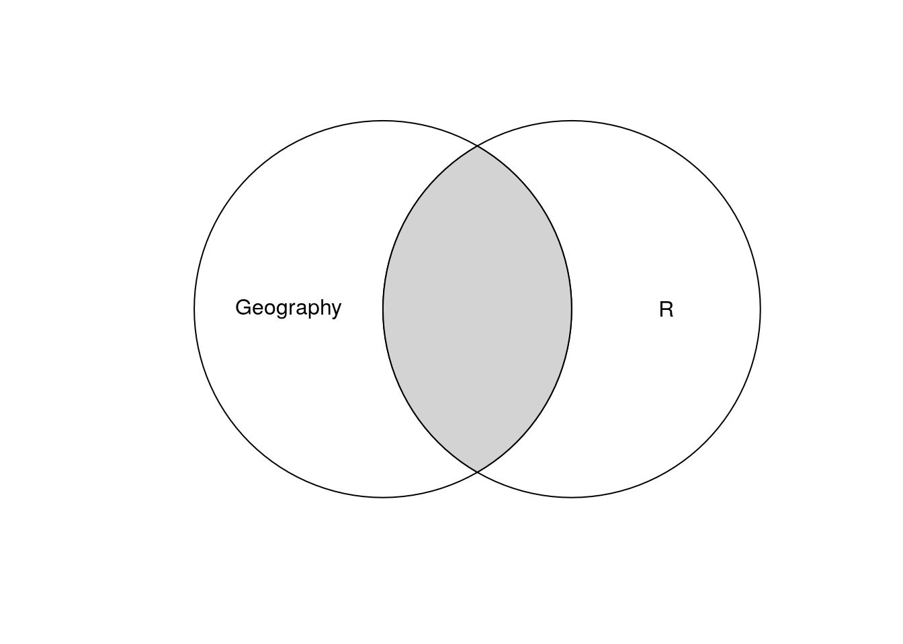
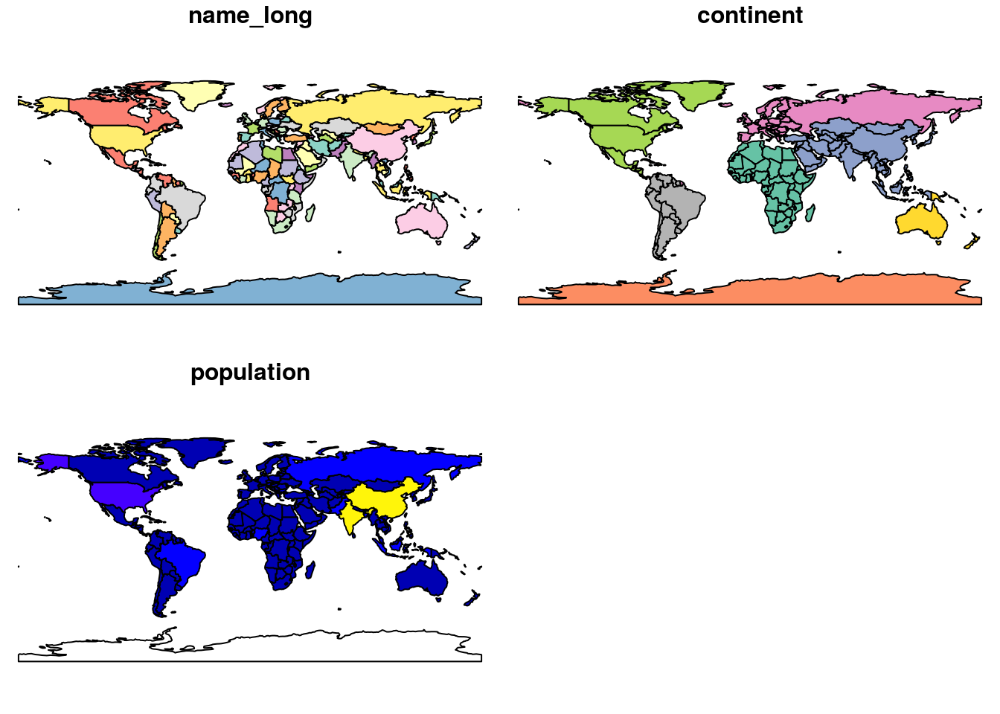
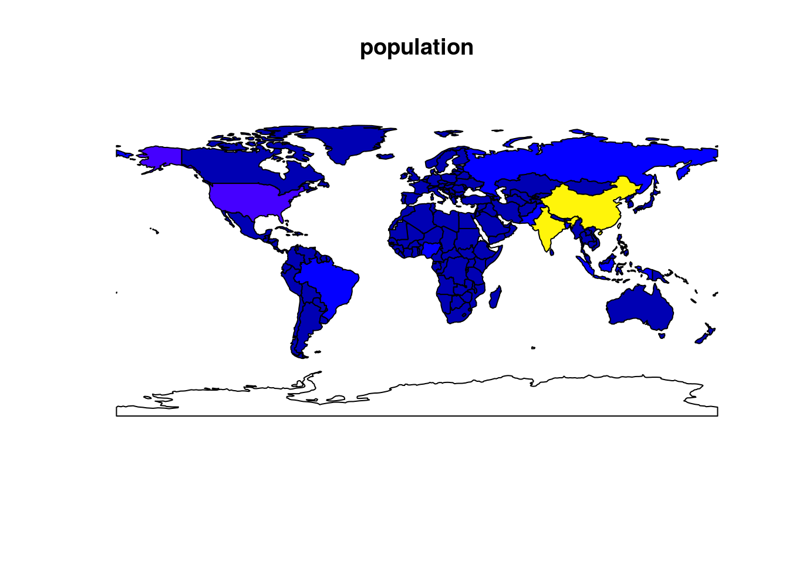
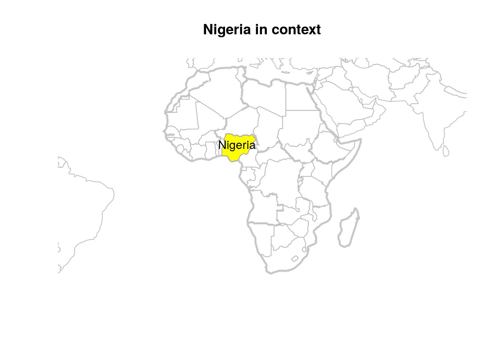

--- 
title: 'Geocomputation with R'
author:
- Robin Lovelace
- Jakub Nowosad
date: '2017-05-17'
knit: bookdown::render_book
site: bookdown::bookdown_site
documentclass: book
bibliography:
  - refs.bib
  - packages.bib
biblio-style: apalike
link-citations: yes
github-repo: Robinlovelace/geocompr
url: https\://bookdown.org/robinlovelace/geocompr/
---

# Prerequisites {-}

The required packages should be installed by installing the book as a github package:


```r
if(!require(devtools)) {
  install.packages("devtools")
}
devtools::install_github("robinlovelace/geocompr")
```

This should allow you to build the book:


```r
bookdown::render_book("index.Rmd")
```

For further details and to report any issues, see the book's GitHub page at [Robinlovelace/geocompr](https://github.com/Robinlovelace/geocompr#geocomputation-with-r).

<!--chapter:end:index.Rmd-->

# Introduction {#intro}

This book exists at the intersection between Geography and R (Figure \@ref(fig:venn)).
Suggested titles were *Geography with R* and *R for GIS*.
The former conveyed the message that it's not just about spatial data: 
non-spatial attribute data are inevitably linked with geometry data.
The latter communicated the emphasis on *geographic data* and using R as a *Geographic Information System* (GIS), to perform spatial operations [@bivand_applied_2013], but not one of R's greatest strengths compared with other GIS software: its ability to seamlessly switch between geographic and non-geographic data processing, modelling and visualisation tasks.

*Geocomputation with R* is therefore about spatial data processing but also much more than that.
What defines geocomputation as a development on previous work is the "creative and experimental use of GIS that it entails" [@longley_geocomputation:_1998].
Geocomputation is a relatively young field, with a ~30 year history dating back to the first [conference](http://www.geocomputation.org/) in 1996 on the subject and a flurry of subsequent publications.
It's worth remembering that the topic is part of the wider field of Geography which is over 2000 years old [@roller_eratosthenes_2010] and has played an important role in explaining and influencing humanity's relationship with the natural world.

Geocomputation in this book means more than simply analysing geographic data on a computer.
It's about trying to make research which involves geographic data more reproducible and therefore scientific, a concept captured by the term Geographic Data Science (GDS) which differs from GIS in several ways, some of which are outlined in Table \@ref(tab:gdsl).


Table: (\#tab:gdsl)Differences in emphasis between the fields of Geographic Information Systems (GIS) and Geographic Data Science (GDS).

Attribute          GIS                        GDS                            
-----------------  -------------------------  -------------------------------
Home disciplines   Geography                  Geography,Computing,Statistics 
Software focus     Graphical User Interface   Code                           
Reproduciblility   Minimal                    Maximal                        

This book aims teach how to do geocomputation rather than just think about it.
The hope is that it will enable more people to conduct reproducible scientific research in persuit of knowledge and for the greater good.


## Why Geocomputation with R?

In this book we treat R as a 'tool for the trade', in a similar way that early geographers used rulers, compasses, sextants and other instruments to advance knowledge about the world.
Actions often speak louder than words, so this book teaches Geocomputation with reference to real-world examples and reproducible code rather than abstract concepts.
But before we crack-on with the action, a few introductory remarks are needed to explain the approach taken here and provide context.
However, background an understanding of both topics will help you get the most out of the subsequent work, so we start with some definitions and references for further reading for historical context:

- Geography, of which Geocomputation is a part, is the study of where things are located on the Earth. Primarily we are interested in the part of Geography that deals with *geographic data* and *maps*: information with a location and the visualisation of such data.

- R is an open source statistical programming language that has powerful geographical capabilities, thanks largely to add-on packages.

<div class="figure">

<p class="caption">(\#fig:venn)Venn diagram of the intersection between Geography and R.</p>
</div>

## R's spatial ecosystem

<!-- Ideas here on the history please @nowosad! -->

The most important recent evolution in R's spatial ecosystem has without doubt been support for simple features thanks to the **sf** package, introduced below (see Chapter \@ref(spatial-class) for a detailed account of the `sf` class system).

## An introduction to Simple Features

Simple Features is an open standard data model developed and endorsed by the Open Geospatial Consortium ([OGC](http://portal.opengeospatial.org/files/?artifact_id=25355)) to describe how features with geographical and non-geographical features should be represented.
It is a hierarchical data model that simplifies geographic data by condensing the complex range of possible geographic forms (e.g., line, point, polygon, multipolygon forms) into a single geometry class.

<!-- (Figure \@ref(fig:sf-ogc)). -->

<!-- ```{r sf-ogc, fig.cap="The Simple Features class hierarchy, used with permission (on condition of linking to the source) from the Open Geospatial Consortium's document 06-103r4 (see http://www.opengeospatial.org/standards/sfa)", out.width="100%", echo=FALSE} -->
<!-- knitr::include_graphics("figures/simple-feature-class-hierarchy.png") -->
<!-- ``` -->

The R implementation of Simple Features is provided by the **sf** package [@R-sf].
**sf** incorporates the functionality of the 3 main packages of the **sp** paradigm (**sp** [@R-sp] for the class system, **rgdal** [@R-rgdal] for reading and writing data, **rgeos** [@R-rgeos] for spatial operations undertaken by GEOS) in a single, cohesive whole.
This is well-documented in **sf**'s [vignettes](http://cran.rstudio.com/package=sf):


```r
vignette("sf1") # for an introduction to the package
vignette("sf2") # for reading, writing and converting Simple Features
vignette("sf3") # for manipulating Simple Features
```

As the first vignette explains, simple feature objects in R are stored in a data frame, with geographical data occupying special column, a 'list-column'. This column is usually named 'geom' or 'geometry'.
Let's see how simple feature in R work, with reference to world boundary data from the **spData** package:


```r
library(sf)
# devtools::install_github("nowosad/spData")
f = system.file("shapes/wrld.shp", package = "spData")
world = st_read(f)
```

This has loaded an object that is simultaneously of class `data.frame` and `sf`:


```r
class(world)
```

```
## [1] "sf"         "data.frame"
```

The output of the preceding command shows that objects with class `sf` are also data frames. Thus, they can be treated like regular `data.frame`, making life easy if you are already used to working with data frames.

Let's look the first 2 rows and 3 columns of this object.
The output shows 2 major differences compared with a regular `data.frame`: the inclusion of additional geographical data (`geometry type`, `dimension`, `bbox` and CRS information - `epsg (SRID)`, `proj4string`), and the presence of final `geometry` column:


```r
world[1:2, 1:3]
```

```
## Simple feature collection with 2 features and 3 fields
## geometry type:  MULTIPOLYGON
## dimension:      XY
## bbox:           xmin: 11.6401 ymin: -17.93064 xmax: 75.15803 ymax: 38.48628
## epsg (SRID):    4326
## proj4string:    +proj=longlat +datum=WGS84 +no_defs
##   iso_a2   name_long continent                       geometry
## 1     AF Afghanistan      Asia MULTIPOLYGON(((61.210817091...
## 2     AO      Angola    Africa MULTIPOLYGON(((16.326528354...
```

All this may seem rather complex, especially for a class system that is supposed to be simple.
However, there are good reasons for organising things this way and using **sf**.

### Exercises

What does the summary of the `geometry` column tell us about the `world` dataset, in terms of:

- The geometry type?
- How many countries there are?
- The coordinate reference system (CRS)?

## Why Simple Features?

There are many advantages of **sf** over **sp**, including:

- Faster reading and writing of data (more than 10 times faster in some cases)
- Better plotting performance
- **sf** objects can be treated as dataframes in most operations
- **sf** functions can be combined using `%>%` operator and works well with the [tidyverse](http://tidyverse.org/) collection of R packages
- **sf** function names are relatively consistent and intuitive (all begin with `st_`) compared with the function names and syntax of the **sp**, **rgdal** and **rgeos** packages that it supercedes.

A broader advantage is that simple features are so well supported by other software products, not least PostGIS, which has heavily influenced the design of **sf**.

A disadvantage you should be aware of, however, is that **sf** is not *feature complete* and that it continues to evolve.
The transition from **sp** to **sf** will likely take many years, and many spatial packages may never switch.
Even if you discover spatial data with R through the **sf** package, it is still worth at least being aware of **sp** classes, even if you rarely use them for everyday geospatial tasks.

Fortunately it is easy to translate between **sp** and **sf** using the `as()` function, even when **sp** is not loaded: 


```r
world_sp = as(object = world, Class = "Spatial")
```


<!-- 
- r, rstudio, gdal, proj4, geos, udunits 
- r packages sf, raster, etc.
- datasets 
-->

<!-- ## Introduction to GIS -->

<!-- 
- what's R
- what's GIS
- GIS data models (vector vs raster)
- coordinate reference system - CRS
- GIS data formats
- GDAL, GEOS, PROJ4
- GIS R package
- GIS beyond R 
-->

<!--chapter:end:01-introduction.Rmd-->

# Reading and writing spatial data {#read-write}

## Prerequisites {-}

- You must have run the code in Chapter \@ref(intro)


## Introduction

Spatial data comes in a wide variety of file formats, and **sf** is adept at handling them, via its interface to GDAL.
A major advantage of **sf** is that it is fast at geographical data I/O, as illustrated in the benchmark below:


```r
library(microbenchmark)
bench_read = microbenchmark(times = 5,
        st_read(f),
        rgdal::readOGR(f)
)
```


```r
bench_read$time[1] / bench_read$time[2]
```

```
## [1] 65.71776
```

The results demonstrate that **sf** can be much faster (*66 times faster* in this case) than **rgdal** at reading-in the world countries shapefile.

The counterpart of `st_read()` is `st_write()`. This allows writing to a range of geographic vector file types, including the common formats `.geojson`, `.shp` and `.gpkg`. `st_read()` will decide which driver to use automatically, based on the file name, as illustrated in the benchmark below demonstrating write speeds for each format.


```r
system.time(st_write(world, "world.geojson", quiet = TRUE))
```

```
##    user  system elapsed 
##   0.069   0.001   0.071
```

```r
system.time(st_write(world, "world.shp", quiet = TRUE)) 
```

```
##    user  system elapsed 
##   0.015   0.002   0.017
```

```r
system.time(st_write(world, "world.gpkg", quiet = TRUE))
```

```
##    user  system elapsed 
##   0.028   0.024   0.052
```

The full range of file-types supported by **sf** is reported by `st_drivers()`, the first 2 of which are shown below:


```r
sf_drivers = st_drivers()
head(sf_drivers, n = 2)
```

```
##          name                  long_name write  copy is_raster is_vector
## PCIDSK PCIDSK       PCIDSK Database File  TRUE FALSE      TRUE      TRUE
## netCDF netCDF Network Common Data Format  TRUE  TRUE      TRUE      TRUE
```


<!-- ## Vector -->

<!-- 
- sf package 
- st_drivers
- st_read, read_sf
- st_write, write_sf
- text files 
- WKT, WKB, sp (st_as_sf)
-->

<!-- ## Raster -->

<!-- 
- raster package 
- raster
-->

<!--chapter:end:02-read-write.Rmd-->

# Working with attribute table {#attr}

## Prerequisites {-}

- You need the **dplyr** and **units** packages installed and loaded
- You must have run the code in Chapter \@ref(intro)


## Introduction

Attribute data is non-geographical information associated with columns geometry.
**sf** makes working with attribute data because objects of class `sf` are data frames.
This is illustrated below for the `world` object representing the countries of the world:


```r
class(world)
```

```
## [1] "sf"         "data.frame"
```

This 'world' dataset contains 63 non-geographical variables (and one geometry column) with data for almost 200 countries, as can be ascertained using base functions for working with tabular data:


```r
dim(world) # it is a 2 dimensional object, with rows and columns
```

```
## [1] 177  11
```

```r
nrow(world) # how many rows?
```

```
## [1] 177
```

```r
ncol(world) # how many columns?
```

```
## [1] 11
```

Extracting the attribute data of an `sf` object is the same as removing the geometry column:


```r
world_df = world
st_geometry(world_df) = NULL
class(world_df)
```

```
## [1] "data.frame"
```

This can be useful if the geometry column causes problem, e.g. by occupying large amounts of RAM.
However, for most cases there is no harm in keeping the geometry column, as data frame operations on `sf` will only act on the attribute data.
For this reason, being good at working with attribute data in geographical data is the same being proficient at handling data frames in R.
For many applications, the most effective and intuitive way to work with data frames is with the **dplyr** package.
The subsequent examples briefly demonstrate how attribute data in `sf` objects can be manipulated using R's base `data.frame` handling function before moving on to the more expressive **dplyr** approach.

## Handling attribute data with base R

`sf` objects behave exactly the same as `data.frame` objects for most base R operations, including subsetting rows and columns, creating new variables and modelling, as illustrated in the code examples below (results not shown).


```r
world[1:6, ] # subset rows
```


```r
world[, 1:3] # subset columns
```

Note that after each operation, the geometry column is preserved.

## Handling attribute data with dplyr

**dplyr** makes working with data frames easier and is compatible with `sf` objects, after the package has been loaded:


```r
library(dplyr)
```

`dplyr` is a powerful package and sub-language of R in its own right, worthy of study in its own right.
The `select()` function, for example, can be used to both subset and renames columns in a single line, for example:


```r
world_orig = world # create copy of world dataset for future reference
world = select(world_orig, name_long, continent, population = pop)
head(world, n = 2)
```

```
## Simple feature collection with 2 features and 3 fields
## geometry type:  MULTIPOLYGON
## dimension:      XY
## bbox:           xmin: 11.6401 ymin: -17.93064 xmax: 75.15803 ymax: 38.48628
## epsg (SRID):    4326
## proj4string:    +proj=longlat +datum=WGS84 +no_defs
##     name_long continent population                       geometry
## 1 Afghanistan      Asia   31627506 MULTIPOLYGON(((61.210817091...
## 2      Angola    Africa   24227524 MULTIPOLYGON(((16.326528354...
```

This is more concises than the base R equivalent (which saves the result as an object called `world2` to avoid overiding the `world` dataset created previously):


```r
world2 = world_orig[c("name_long", "continent", "pop")] # subset columns by name
names(world2)[3] = "population" # rename column manually
```

The *pipe* operator (` %>% `), which passes the output of one function into the first argument of the next function, is commonly used in **dplyr** data analysis workflows.
This works because the fundamental **dplyr** functions (or 'verbs', like `select()`) all take a data frame object in and spit a data frame object out.
Combining many functions together with pipes is called *chaining* or *piping*.
The advantage over base R for complex data processing operations is that this approach prevents nested functions and is easy to read because there is a clear order and modularity to the work (a piped command can be commented out, for example).

The example below shows yet another way of creating the renamed `world` dataset, using the pipe operator:


```r
world3 = world_orig %>%
        select(name_long, continent)
```

The pipe operator can be used for many data processing tasks with attribute data:


```r
# ==, !=, >, >=, <, <=, &, |

# subsetting simple feature rows by values
world_few_rows = world[world$population > 1e9,]

#OR
world_few_rows = world %>% 
        filter(population > 1e9)

head(world_few_rows)
```

```
## Simple feature collection with 2 features and 3 fields
## geometry type:  MULTIPOLYGON
## dimension:      XY
## bbox:           xmin: 68.17665 ymin: 7.965535 xmax: 135.0263 ymax: 53.4588
## epsg (SRID):    4326
## proj4string:    +proj=longlat +datum=WGS84 +no_defs
##   name_long continent population                       geometry
## 1     China      Asia 1364270000 MULTIPOLYGON(((110.33918786...
## 2     India      Asia 1295291543 MULTIPOLYGON(((77.837450799...
```

<!-- ```{r} -->
<!-- # # add a new column -->
<!-- # world$area = set_units(st_area(world), value = km^2) -->
<!-- # world$pop_density = world$population / world$area -->
<!-- #  -->
<!-- # # OR -->
<!-- # world = world %>% -->
<!-- #         mutate(area = set_units(st_area(.), value = km^2)) %>% -->
<!-- #         mutate(pop_density = population / area) -->
<!-- ``` -->

<!-- Note that this has created a attributes for the area and population density variables: -->

<!-- ```{r} -->
<!-- attributes(world$area) -->
<!-- attributes(world$pop_density) -->
<!-- ``` -->

<!-- These can be set to `NULL` as follows: -->

<!-- ```{r} -->
<!-- attributes(world$area) = NULL -->
<!-- attributes(world$pop_density) = NULL -->
<!-- ``` -->


```r
# data summary (not shown)
summary(world)

# data summary by groups (not shown)
world_continents = world %>% 
        group_by(continent) %>% 
        summarise(continent_pop = sum(population), country_n = n())
world_continents
```


```r
# sort variables
## by name
world_continents %>% 
        arrange(continent)
```

```
## Simple feature collection with 8 features and 3 fields
## geometry type:  GEOMETRY
## dimension:      XY
## bbox:           xmin: -180 ymin: -90 xmax: 180 ymax: 83.64513
## epsg (SRID):    4326
## proj4string:    +proj=longlat +datum=WGS84 +no_defs
## # A tibble: 8 × 4
##                 continent continent_pop country_n          geometry
##                    <fctr>         <dbl>     <int>  <simple_feature>
## 1                  Africa            NA        51 <MULTIPOLYGON...>
## 2              Antarctica            NA         1 <MULTIPOLYGON...>
## 3                    Asia            NA        47 <MULTIPOLYGON...>
## 4                  Europe            NA        39 <MULTIPOLYGON...>
## 5           North America     565318889        18 <MULTIPOLYGON...>
## 6                 Oceania      37422867         7 <MULTIPOLYGON...>
## 7 Seven seas (open ocean)            NA         1 <POLYGON((68....>
## 8           South America            NA        13 <MULTIPOLYGON...>
```

```r
## by population (in descending order)
world_continents %>% 
        arrange(-continent_pop)
```

```
## Simple feature collection with 8 features and 3 fields
## geometry type:  GEOMETRY
## dimension:      XY
## bbox:           xmin: -180 ymin: -90 xmax: 180 ymax: 83.64513
## epsg (SRID):    4326
## proj4string:    +proj=longlat +datum=WGS84 +no_defs
## # A tibble: 8 × 4
##                 continent continent_pop country_n          geometry
##                    <fctr>         <dbl>     <int>  <simple_feature>
## 1           North America     565318889        18 <MULTIPOLYGON...>
## 2                 Oceania      37422867         7 <MULTIPOLYGON...>
## 3                  Africa            NA        51 <MULTIPOLYGON...>
## 4              Antarctica            NA         1 <MULTIPOLYGON...>
## 5                    Asia            NA        47 <MULTIPOLYGON...>
## 6                  Europe            NA        39 <MULTIPOLYGON...>
## 7 Seven seas (open ocean)            NA         1 <POLYGON((68....>
## 8           South America            NA        13 <MULTIPOLYGON...>
```

Most of the function from **sf** package do not drop a `geometry` column. To extract a data frame `st_geometry()` or `st_set_geometry()` function can be used.


```r
world_st = world
st_geometry(world_st) = NULL
class(world_st)
```

```
## [1] "data.frame"
```

```r
# OR

world_st2 = world
world_st2 = world_st2 %>% st_set_geometry(NULL)
class(world_st2)
```

```
## [1] "data.frame"
```


<!-- 
- dplyr, tidyr, and purrr packages
- lubridate??
- pipes
-->

<!-- 
- view, add new rows/columns, subset, select, summarize 
-->

<!--chapter:end:03-attr.Rmd-->

# Basic map making {#basic-map}

## Prerequisites {-}


Like **sp**, basic maps in **sf** can be created quickly with the base `plot()` function. Unlike **sp**, however, **sf** by default creates a faceted plot, one sub-plot for each variable, as illustrated in the left-hand image in Figure \@ref(fig:sfplot). 


```r
plot(world)
plot(world["population"])
```

<div class="figure">

<p class="caption">(\#fig:sfplot)Plotting with sf, with multiple variables (left) and a single variable (right).</p>
</div>

As with **sp**, you can add layers to your maps created with `plot()`, with the argument `add = TRUE`^[In
fact, when you `plot()` an **sf** object, R is calling `sf:::plot.sf()` behind the scenes.
`plot()` is a generic method that behaves differently depending on the class of object being plotted.].
However, this only works if the initial plot has only 1 layer (result not shown):


```r
plot(world["population"])
africa = world_continents[1, ]
plot(africa, add = TRUE, col = "red")
```

This can be very useful when quickly checking the geographic correspondence between two or more layers.
These plots work well for gaining a quick understanding of the data with few lines of code.
For more advanced map making we recommend using a dedicated visualisation package such as **tmap**, **ggplot2**, **mapview**, or **leaflet**.

<!-- 
- plot() function 
- map export 
-->

## Challenge

Using **sf**'s `plot()` command, create a map of Nigeria in context, like the one presented in figure \@ref(fig:nigeria). 

- Hint: this used the `lwd`, `main` and `col` arguments of `plot()`. 
- Bonus: make the country boundaries a dotted grey line.
- Hint: `border` is an additional argument of `plot()` for **sf** objects.

<div class="figure">

<p class="caption">(\#fig:nigeria)Map of Nigeria in context illustrating sf's plotting capabilities</p>
</div>

## Further work

**sf** makes R data objects more closely alligned to the data model used in GDAL and GEOS, in theory making spatial data operations faster.
The work here provides a taster of the way that **sf** operates but there is much more to learn.
There is a wealth of information that is available in the package's vignettes: these are highly recommended.

As a final exercise, we'll see how to do a spatial overlay in **sf** by first converting the countries of the world into centroids and then subsetting those in Africa:


```r
world_centroids = st_centroid(world)
```

```
## Warning in st_centroid.sfc(st_geometry(x)): st_centroid does not give
## correct centroids for longitude/latitude data
```

```r
plot(world_centroids[1])
africa_centroids = world_centroids[africa,]
```

```
## although coordinates are longitude/latitude, it is assumed that they are planar
```

```r
plot(africa_centroids, add = TRUE, cex = 2)
```

<div class="figure">

<p class="caption">(\#fig:unnamed-chunk-30)Centroids in Africa</p>
</div>

Note: another way of acheiving the same result is with a GEOS function for identifying spatial overlay:


```r
sel_africa = st_covered_by(world_centroids, africa, sparse = FALSE)
```

```
## although coordinates are longitude/latitude, it is assumed that they are planar
```

```r
summary(sel_africa)
```

```
##      V1         
##  Mode :logical  
##  FALSE:126      
##  TRUE :51       
##  NA's :0
```

This shows that there are 56 countries in Africa.
We can check if they are the same countries as follows:


```r
africa_centroids2 = world_centroids[sel_africa,]
identical(africa_centroids, africa_centroids2)
```

```
## [1] TRUE
```

## Exercises

- Perform the same operations and map making for another continent of your choice.
- Bonus: Download some global geographic data and add attribute variables assigning them to the continents of the world.


<!--chapter:end:04-basic-map.Rmd-->

# Spatial classes {#spatial-class}


## Prerequisites {-}

<!--
- classes and methods in R
-->

## Vector data

<!-- 
sf data types:
- POINT
- LINESTRING
- POLYGON
- MULTIPOINT
- MULTILINESTRING
- MULTIPOLYGON
- GEOMETRYCOLLECTION
- CIRCULARSTRING
- COMPOUNDCURVE
- CURVEPOLYGON
- MULTICURVE
- MULTISURFACE
- CURVE
- SURFACE
- POLYHEDRALSURFACE
- TIN
- TRIANGLE

- what's sf, sfc, sfg
- methods(class = "sf")

-->

## Raster data

<!-- 
- raster data types 
- RasterLayer
- RasterStack
- RasterBrick
-->

<!--chapter:end:05-spatial-class.Rmd-->

# Coordinate systems/reprojecting {#coord}

## Prerequisites {-}

<!--
- st_as_sf(x, coords = c("x","y"))
- st_crs(x)
- st_transform(x, crs)
- ==
- !st_is_longlat(x)
- st_set_crs(x, crs)
- st_proj_info
- st_bbox
- projectRaster
-->

<!--chapter:end:06-coord.Rmd-->

# Working with vector data {#vector}

## Prerequisites {-}

<!--

- summary
- proj4string

## Attribute joins

- merge, cbind, rbind
- left_join, full_join, inner_join, etc

## Spatial relations I

- st_union
- st_difference
- st_intersection
- st_sym_difference

## Spatial relations II

- st_intersects, st_disjoint, st_touches, st_crosses, st_within, st_contains, st_overlaps, st_equals, st_covers, st_covered_by, st_equals_exact, st_is_within_distance

## Spatial joins

## Spatial transformation

- st_cast

## Spatial aggregation/disaggregation

- group_by and summarise
- st_simplify
- st_centroid
- st_convex_hull
- st_simplify
- st_triangulate
- st_polygonize
- st_centroid
- st_segmentize
- st_buffer
- st_boundary
- rmapshaper

## Spatial sampling

## Spatial properties

- area, distance, etc.
- st_distance(x,y)
- st_length
- st_area

-->

<!--chapter:end:07-vector.Rmd-->

# Working with raster data {#raster}

## Prerequisites {-}

<!-- 
- nrow, ncol, nlayers, dim, ncell, res, extent, crs
- crop, mask, merge
- aggregate, disaggregate, resample
- projectRaster
- reclass, cut
- focal, focalStack, focalNA, zonal
- overlay, calc
- area, distance
- clump
- mosaic
- cellStats
- stackApply
- getValues
- terrain, hillshade ?
-->

<!--chapter:end:08-raster.Rmd-->

# Raster-vector interaction {#raster-vector}

## Prerequisites {-}

<!-- 
- crop, mask
- extract

Raster-vector conversion

- rasterize, rasterToPoints, rasterToPolygons, rasterToContour
-->

<!--chapter:end:09-raster-vector.Rmd-->

# References

<!--chapter:end:references.Rmd-->

