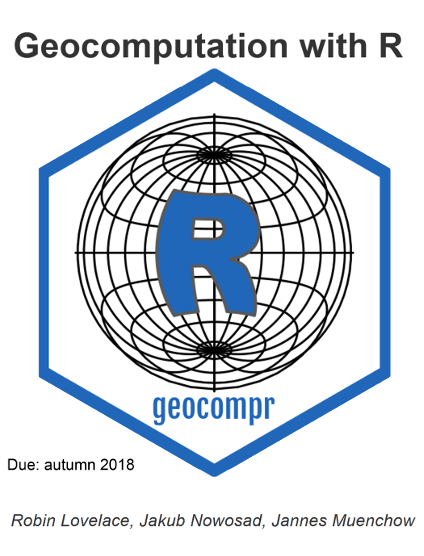
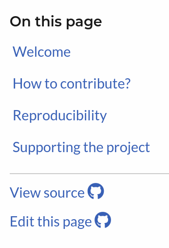

--- 
title: 'Geocomputation with R'
author: 'Robin Lovelace, Jakub Nowosad, Jannes Muenchow'
date: '`r Sys.Date()`'
site: bookdown::bookdown_site
output: bookdown::bs4_book
documentclass: krantz
monofont: "Source Code Pro"
monofontoptions: "Scale=0.7"
bibliography:
  - geocompr.bib
  - packages.bib
biblio-style: apalike
link-citations: yes
colorlinks: yes
graphics: yes
description: "Geocomputation with R is for people who want to analyze, visualize and model geographic data with open source software. It is based on R, a statistical programming language that has powerful data processing, visualization, and geospatial capabilities. The book equips you with the knowledge and skills to tackle a wide range of issues manifested in geographic data, including those with scientific, societal, and environmental implications. This book will interest people from many backgrounds, especially Geographic Information Systems (GIS) users interested in applying their domain-specific knowledge in a powerful open source language for data science, and R users interested in extending their skills to handle spatial data."
github-repo: "Robinlovelace/geocompr"
cover-image: "images/cover.png"
url: https://geocompr.robinlovelace.net/
---

```{r index-1, echo=FALSE}
is_on_ghactions = identical(Sys.getenv("GITHUB_ACTIONS"), "true")
is_online = curl::has_internet()
is_html = knitr::is_html_output()
```

```{r, echo = FALSE}
# google scholar metadata
library(metathis)
if (is_html) {
  meta() |> 
    meta_google_scholar(
      title = "Geocomputation with R",
      author = c("Robin Lovelace", "Jakub Nowosad", "Jannes Muenchow"),
      publication_date = "2019",
      isbn = "9780203730058"
    ) 
}
```

```{asis index-2, echo=is_html}
# Welcome {-}

This is the online home of *Geocomputation with R*, a book on geographic data analysis, visualization and modeling.

<a href="https://www.routledge.com/9781138304512"></a>
  
**Note**: The first edition of the book has been published by CRC Press in the [R Series](https://www.routledge.com/Chapman--HallCRC-The-R-Series/book-series/CRCTHERSER).
You can buy the book from [CRC Press](https://www.routledge.com/9781138304512), or [Amazon](https://www.amazon.com/Geocomputation-R-Robin-Lovelace-dp-0367670577/dp/0367670577/), and see the archived **First Edition** hosted on [bookdown.org](https://bookdown.org/robinlovelace/geocompr/). 

Inspired by the Free and Open Source Software for Geospatial ([FOSS4G](https://foss4g.org/)) movement, the code and prose underlying this book are open, ensuring that the content is reproducible, transparent, and accessible.
Hosting the source code on [GitHub](https://github.com/Robinlovelace/geocompr/) allows anyone to interact with the project by opening issues or contributing new content and typo fixes for the benefit of everyone.

[](https://github.com/robinlovelace/geocompr)
[](https://github.com/Robinlovelace/geocompr/graphs/contributors)

The online version of the book is hosted at [geocompr.robinlovelace.net](https://geocompr.robinlovelace.net) and kept up-to-date by [GitHub Actions](https://github.com/Robinlovelace/geocompr/actions).
Its current 'build status' as follows:

[](https://github.com/Robinlovelace/geocompr/actions)
```

```{r index-2-2, echo=FALSE, eval=is_html, results="asis"}
if (is_on_ghactions){
    cat(paste0("This version of the book was built on GH Actions on ", Sys.Date(), "."))
} else {
    cat(paste0("This version of the book was built on ", Sys.Date(), "."))
}
```

```{asis index-2-3, echo=is_html}
<a rel="license" href="http://creativecommons.org/licenses/by-nc-nd/4.0/"></a><br />This work is licensed under a <a rel="license" href="http://creativecommons.org/licenses/by-nc-nd/4.0/">Creative Commons Attribution-NonCommercial-NoDerivatives 4.0 International License</a>.

## How to contribute? {-}

**bookdown** makes editing a book as easy as editing a wiki, provided you have a GitHub account ([sign-up at github.com](https://github.com/join)).
Once logged-in to GitHub, click on the 'Edit this page' icon in the right panel of the book website.
This will take you to an editable version of the the source [R Markdown](http://rmarkdown.rstudio.com/) file that generated the page you're on.

<!--[](https://github.com/Robinlovelace/geocompr/edit/main/index.Rmd)-->

To raise an issue about the book's content (e.g. code not running) or make a feature request, check-out the [issue tracker](https://github.com/Robinlovelace/geocompr/issues).

Maintainers and contributors must follow this repository’s [CODE OF CONDUCT](https://github.com/Robinlovelace/geocompr/blob/main/CODE_OF_CONDUCT.md).

## Reproducibility {-}

The quickest way to reproduce the contents of the book if you're new to geographic data in R may be in the web browser, thanks to [Binder](https://mybinder.org/).
Clicking on the link below should open a new window containing RStudio Server in your web browser, enabling you to open chapter files and running code chunks to test that the code is reproducible.

[](https://mybinder.org/v2/gh/robinlovelace/geocompr/main?urlpath=rstudio)

If you see something like the image below, congratulations, it worked!
You can start exploring Geocomputation with R in a cloud-based environment, noting [mybinder.org user guidelines](https://mybinder.readthedocs.io/en/latest/about/user-guidelines.html)):

<!--  -->
```


```{r index-2-4, echo=FALSE, fig.cap="Screenshot of reproducible code contained in Geocomputation with R running in RStudio Server on a browser served by Binder", eval=is_html}
knitr::include_graphics("https://user-images.githubusercontent.com/1825120/134802314-6dd368c7-f5eb-4cd7-b8ff-428dfa93954c.png")
```


```{asis index-2-5, echo=is_html}
To reproduce the code in the book on your own computer, you need a recent version of [R](https://cran.r-project.org/) and up-to-date packages.
These can be installed using the [**remotes**](https://github.com/r-lib/remotes) package.
```

```{r index-3, message=FALSE, eval=FALSE, echo=is_html, results='hide'}
install.packages("remotes")
remotes::install_github("geocompr/geocompkg")
```

```{r, echo=FALSE, eval=FALSE}
remotes::install_github("nowosad/spData")
remotes::install_github("nowosad/spDataLarge")

# During development work on the 2nd edition you may also need dev versions of
# other packages to build the book, e.g.,:
remotes::install_github("rspatial/terra")
remotes::install_github("mtennekes/tmap")
```


```{asis index-3-1a, echo=is_html}
After installing the book's dependencies, you can rebuild the book for testing and educational purposes.
To do this [download](https://github.com/Robinlovelace/geocompr/archive/refs/heads/main.zip) and unzip or [clone](https://docs.github.com/en/repositories/creating-and-managing-repositories/cloning-a-repository) the book's source code.
After opening the `geocompr.Rproj` project in [RStudio](https://www.rstudio.com/products/rstudio/download/#download) (or opening the folder in another IDE such as [VS Code](https://github.com/REditorSupport/vscode-R)), you should be able to reproduce the contents with the following command:
```

```{r index-3-1, eval=FALSE, echo=is_html}
bookdown::serve_book(".")
```

```{r index-3-2, echo=FALSE, include=FALSE}
# is geocompkg installed?
geocompkg_is_installed = "geocompkg" %in% installed.packages()
if(!geocompkg_is_installed){
  message(
  'geocompkg not installed, run\nremotes::install_github("geocompr/geocompkg") # to install it'
  )
} 
```

```{asis index-23, echo=is_html}
See the project's [GitHub repo](https://github.com/robinlovelace/geocompr#reproducing-the-book) for full details on reproducing the book.
```

```{asis index-22, echo=is_html}
## Getting involved {-}

If you find the project of use and interest, you can get involved in many ways, by:

- Telling people about it
- [Buying](https://www.amazon.com/Geocomputation-R-Robin-Lovelace-dp-0367670577/dp/0367670577) a copy
- Helping people get started with open source software for reproducible research in general, and working with geographic data in R in particular (this can be an excellent way to consolidate and build your own skills)
- Communicating about the book online, via the [#geocompr hashtag](https://twitter.com/hashtag/geocompr) on Twitter (see our [Guestbook at geocompr.github.io](https://geocompr.github.io/guestbook/)) or by letting us know of [courses](https://github.com/geocompr/geocompr.github.io/edit/source/content/guestbook/index.md) using the book
- [Citing](https://github.com/Robinlovelace/geocompr/raw/main/CITATION.bib) and [linking-to](https://geocompr.robinlovelace.net/) it
- '[Starring](https://help.github.com/articles/about-stars/)' the [geocompr GitHub repository](https://github.com/robinlovelace/geocompr)
- Reviewing it, on [Amazon](https://www.amazon.com/Geocomputation-Chapman-Hall-Robin-Lovelace/dp/1138304514/), [Goodreads](https://www.goodreads.com/book/show/42780859-geocomputation-with-r) or elsewhere
- Asking questions about the content or making suggestion on [GitHub](https://github.com/Robinlovelace/geocompr/issues), [Twitter](https://twitter.com/hashtag/geocompr?src=hashtag_click) or [Discord](https://discord.gg/PMztXYgNxp)
- Answering questions, or at least responding to people asking for clarification or reproducible examples to demonstrate their question
- Supporting community translations
  - The Spanish version: https://geocompr.github.io/es/
  - The French version: https://geocompr.github.io/fr/
  - The Japanese version: http://babayoshihiko.ddns.net/geo/

Further details can be found at [github.com/Robinlovelace/geocompr](https://github.com/Robinlovelace/geocompr#geocomputation-with-r).

<hr>

The globe icon used in this book was created by [Jean-Marc Viglino](https://github.com/Viglino) and is licensed under [CC-BY 4.0 International](https://github.com/Viglino/font-gis/blob/main/LICENSE-CC-BY.md).

<a href="https://www.netlify.com"></a>
```

```{asis index-5a, echo=!is_html}
\newpage

\vspace*{5cm}

\thispagestyle{empty}

\begin{center} \Large \emph{For Katy  } \end{center}

\vspace*{2cm}
\begin{center} \Large \emph{Dla Jagody} \end{center}

\vspace*{2cm}
\begin{center} \Large \emph{F{\"u}r meine Katharina und alle unsere Kinder  } \end{center}
```

# Foreword (1st Edition) {-}

Doing 'spatial' in R has always been about being broad, seeking to provide and integrate tools from geography, geoinformatics, geocomputation and spatial statistics for anyone interested in joining in: joining in asking interesting questions, contributing fruitful research questions, and writing and improving code.
That is, doing 'spatial' in R has always included open source code, open data and reproducibility.

Doing 'spatial' in R has also sought to be open to interaction with many branches of applied spatial data analysis, and also to implement new advances in data representation and methods of analysis to expose them to cross-disciplinary scrutiny. 
As this book demonstrates, there are often alternative workflows from similar data to similar results, and we may learn from comparisons with how others create and understand their workflows.
This includes learning from similar communities around Open Source GIS and complementary languages such as Python, Java and so on.

R's wide range of spatial capabilities would never have evolved without people willing to share what they were creating or adapting.
This might include teaching materials, software, research practices (reproducible research, open data), and combinations of these. 
R users have also benefitted greatly from 'upstream' open source geo libraries such as GDAL, GEOS and PROJ.

This book is a clear example that, if you are curious and willing to join in, you can find things that need doing and that match your aptitudes.
With advances in data representation and workflow alternatives, and ever increasing numbers of new users often without applied quantitative command-line exposure, a book of this kind has really been needed.
Despite the effort involved, the authors have supported each other in pressing forward to publication.

So, this fresh book is ready to go; its authors have tried it out during many tutorials and workshops, so readers and instructors will be able to benefit from knowing that the contents have been and continue to be tried out on people like them.
Engage with the authors and the wider R-spatial community, see value in having more choice in building your workflows and most important, enjoy applying what you learn here to things you care about.

Roger Bivand

Bergen, September 2018

# Preface {-}

## Who this book is for {-}

This book is for people who want to analyze, visualize and model geographic data with open source software.
It is based on R, a statistical programming language that has powerful data processing, visualization and geospatial capabilities.
The book covers a wide range of topics and will be of interest to a wide range of people from many different backgrounds, especially:

- People who have learned spatial analysis skills using a desktop Geographic Information System (GIS), such as [QGIS](http://qgis.org/en/site/), [ArcGIS](http://desktop.arcgis.com/en/arcmap/), [GRASS](https://grass.osgeo.org/) or [SAGA](http://www.saga-gis.org/en/index.html), who want access to a powerful (geo)statistical and visualization programming language and the benefits of a command-line approach [@sherman_desktop_2008]:

  > With the advent of 'modern' GIS software, most people want to point and click their way through life. That’s good, but there is a tremendous amount of flexibility and power waiting for you with the command line.

- Graduate students and researchers from fields specializing in geographic data including Geography, Remote Sensing, Planning, GIS and Geographic Data Science
- Academics and post-graduate students working with geographic data --- in fields such as Geology, Regional Science, Biology and Ecology, Agricultural Sciences, Archaeology, Epidemiology, Transport Modeling, and broadly defined Data Science --- who require the power and flexibility of R for their research
- Applied researchers and analysts in public, private or third-sector organizations who need the reproducibility, speed and flexibility of a command-line language such as R in applications dealing with spatial data as diverse as Urban and Transport Planning, Logistics, Geo-marketing (store location analysis) and Emergency Planning

The book is designed for intermediate-to-advanced R users interested in geocomputation and R beginners who have prior experience with geographic data.
If you are new to both R and geographic data, do not be discouraged: we provide links to further materials and describe the nature of spatial data from a beginner's perspective in Chapter \@ref(spatial-class) and in links provided below.

## How to read this book {-}

The book is divided into three parts:

1. Part I: Foundations, aimed at getting you up-to-speed with geographic data in R.
2. Part II: Extensions, which covers advanced techniques.
3. Part III: Applications, to real-world problems.

The chapters get progressively harder in each so we recommend reading the book in order.
A major barrier to geographical analysis in R is its steep learning curve.
The chapters in Part I aim to address this by providing reproducible code on simple datasets that should ease the process of getting started.

An important aspect of the book from a teaching/learning perspective is the **exercises** at the end of each chapter.
Completing these will develop your skills and equip you with the confidence needed to tackle a range of geospatial problems.
Solutions to the exercises can be found in an online booklet that accompanies Geocomputation with R, hosted at [geocompr.github.io/solutions](https://geocompr.github.io/solutions/).
To learn how to this booklet was created, and how to update solutions in files such as [_01-ex.Rmd](https://github.com/Robinlovelace/geocompr/blob/main/_01-ex.Rmd), see this [blog post](https://geocompr.github.io/post/2022/geocompr-solutions/).
For more blog posts and extended examples see the book's supporting website at [geocompr.github.io](https://geocompr.github.io/).

Impatient readers are welcome to dive straight into the practical examples, starting in Chapter \@ref(spatial-class).
However, we recommend reading about the wider context of *Geocomputation with R* in Chapter \@ref(intro) first.
If you are new to R, we also recommend learning more about the language before attempting to run the code chunks provided in each chapter (unless you're reading the book for an understanding of the concepts).
Fortunately for R beginners R has a supportive community that has developed a wealth of resources that can help.
We particularly recommend three tutorials:  [R for Data Science](http://r4ds.had.co.nz/) [@grolemund_r_2016] and [Efficient R Programming](https://csgillespie.github.io/efficientR/) [@gillespie_efficient_2016], especially [Chapter 2](https://csgillespie.github.io/efficientR/set-up.html#r-version) (on installing and setting-up R/RStudio) and [Chapter 10](https://csgillespie.github.io/efficientR/learning.html) (on learning to learn), and  [An introduction to R](http://colinfay.me/intro-to-r/) [@rcoreteam_introduction_2021].

## Why R? {-}

Although R has a steep learning curve, the command-line approach advocated in this book can quickly pay off.
As you'll learn in subsequent chapters, R is an effective tool for tackling a wide range of geographic data challenges.
We expect that, with practice, R will become the program of choice in your geospatial toolbox for many applications.
Typing and executing commands at the command-line is, in many cases, faster than pointing-and-clicking around the graphical user interface (GUI) of a desktop GIS.
For some applications such as Spatial Statistics and modeling R may be the *only* realistic way to get the work done.

As outlined in Section \@ref(why-use-r-for-geocomputation), there are many reasons for using R for geocomputation:
R is well-suited to the interactive use required in many geographic data analysis workflows compared with other languages.
R excels in the rapidly growing fields of Data Science (which includes data carpentry, statistical learning techniques and data visualization) and Big Data (via efficient interfaces to databases and distributed computing systems).
Furthermore R enables a reproducible workflow: sharing scripts underlying your analysis will allow others to build-on your work.
To ensure reproducibility in this book we have made its source code available at [github.com/Robinlovelace/geocompr](https://github.com/Robinlovelace/geocompr#geocomputation-with-r).
There you will find script files in the `code/` folder that generate figures:
when code generating a figure is not provided in the main text of the book, the name of the script file that generated it is provided in the caption (see for example the caption for Figure \@ref(fig:zones)).

Other languages such as Python, Java and C++ can be used for geocomputation and there are excellent resources for learning geocomputation *without R*, as discussed in Section \@ref(software-for-geocomputation).
None of these provide the unique combination of package ecosystem, statistical capabilities, visualization options, powerful IDEs offered by the R community.
Furthermore, by teaching how to use one language (R) in depth, this book will equip you with the concepts and confidence needed to do geocomputation in other languages.

## Real-world impact {-}

*Geocomputation with R* will equip you with knowledge and skills to tackle a wide range of issues, including those with scientific, societal and environmental implications, manifested in geographic data.
As described in Section \@ref(what-is-geocomputation), geocomputation is not only about using computers to process geographic data:
it is also about real-world impact.
If you are interested in the wider context and motivations behind this book, read on; these are covered in Chapter \@ref(intro).

## Acknowledgements {-}

```{r contrib-preface, include=FALSE}
contributors = readr::read_csv("extdata/contributors.csv")
c_txt = contributors$name
c_url = contributors$link
c_rmd = paste0("[", c_txt, "](", c_url, ")")
contributors_text = paste0(c_txt, collapse = ", ")
```

Many thanks to everyone who contributed directly and indirectly via the code hosting and collaboration site GitHub, including the following people who contributed direct via pull requests: `r contributors_text`.
Special thanks to Marco Sciaini, who not only created the front cover image, but also published the code that generated it (see `code/frontcover.R` in the book's GitHub repo). 
Dozens more people contributed online, by raising and commenting on issues, and by providing feedback via social media.
The `#geocompr` hashtag will live on!

We would like to thank John Kimmel from CRC Press, who has worked with us over two years to take our ideas from an early book plan into production via four rounds of peer review.
The reviewers deserve special mention here: their detailed feedback and expertise substantially improved the book's structure and content.

We thank Patrick Schratz and Alexander Brenning from the University of Jena for fruitful discussions on and input into Chapters \@ref(spatial-cv) and \@ref(eco).
We thank Emmanuel Blondel from the Food and Agriculture Organization of the United Nations for expert input into the section on web services;
Michael Sumner for critical input into many areas of the book, especially the discussion of algorithms in Chapter 10;
Tim Appelhans and David Cooley for key contributions to the visualization chapter (Chapter 8);
and Katy Gregg, who proofread every chapter and greatly improved the readability of the book.

Countless others could be mentioned who contributed in myriad ways.
The final thank you is for all the software developers who make geocomputation with R possible.
Edzer Pebesma (who created the **sf** package), Robert Hijmans (who created **raster**) and Roger Bivand (who laid the foundations for much R-spatial software) have made high performance geographic computing possible in R.
