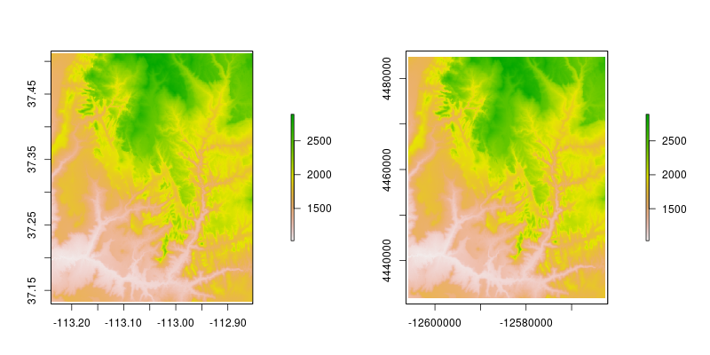

```{r setup, include=FALSE}
options(htmltools.dir.version = FALSE)
knitr::opts_chunk$set(fig.align = "center", warning = FALSE, message = FALSE)
```

### Prerequisites

- The latest versions of [R](https://cloud.r-project.org/) and [RStudio](https://www.rstudio.com/)
- A set of packages installed by running the below code in R:

```{r, eval=FALSE}
install.packages(c("raster", "sf", "rasterVis", "tmap", "leaflet",
                   "widgetframe", "tidyverse", "spData", "geofacet",
                   "tidycensus", "linemap", "gapminder", "tigris", 
                   "osmdata", "mapview", "opencage"))
```

Note: `tidycensus` and `opencage` require API keys. More info [here](https://walkerke.github.io/tidycensus/articles/basic-usage.html) and [here](https://github.com/ropensci/opencage). 
<!-- http://happygitwithr.com/api-tokens.html -->

- Datasets downloaded from [this webpage](https://github.com/Nowosad/gis_with_r_how_to_start/archive/master.zip).

---
class: center, middle

# Part I - Examples

---
### Static visualization (I)

```{r, echo = FALSE, out.width = "650px"}
knitr::include_graphics("figs/01_world_globe.png")
```

---
### Static visualization (II)

```{r, echo = FALSE, out.width = "600px"}
knitr::include_graphics("figs/02_state_unemp.png")
```

---
### Static visualization (III)

```{r, echo = FALSE, out.width = "600px"}
knitr::include_graphics("figs/03_ohio_linemap.png")
```

---
### Animation

```{r, echo = FALSE, out.width = "550px"}
knitr::include_graphics("figs/04_anim.gif")
```

---
### Interactive visualization

<iframe src="05_leaflet.html" height="500" width="700"></iframe> 

---
### Remote sensing calculations

```{r, echo=FALSE, out.width = "700px"}
knitr::include_graphics("figs/06_ndvi.png")
```

---
### Terrain calculations

```{r, echo=FALSE, out.width = "650px"}
knitr::include_graphics("figs/07_terrain.png")
```

---
### Geocoding

What's the coordinates of New York, Los Angeles, Chicago, Houston, and Philadelphia?

<iframe src="08_geocoding.html" height="450" width="700"></iframe> 

---
class: center, middle
# Part II - An intro to R

---
### How to get R

- https://www.r-project.org/
- http://cran.rstudio.com/bin/linux/
- http://cran.rstudio.com/bin/windows/base/
- http://cran.rstudio.com/bin/macosx/

  

---
### Rstudio

- http://www.rstudio.com/ide/download/desktop
- This is an Integrated Development Environment (IDE) for R
- RStudio has many useful features, such as text editor, syntax highlighting, suggested code auto-completion, and many more


---
### How to get help?

```{r, eval=FALSE}
# if you know a function name
?crop
```

- You can also look for help using the help window or **F1** key

## Online help
- [stackoverflow.com](http://stackoverflow.com/questions/tagged/r) - R related questions
- [gis.stackexchange.com](https://gis.stackexchange.com/questions/tagged/r) - GIS and R related questions
- [twitter](http://twitter.com/) - `#rstats`
- Web search engines [Rseek](http://www.rseek.org/), [Duckduckgo](http://duckduckgo.com/), [Google](http://google.com/), [Bing](http://bing.com/), etc.

---
### How to start with R?

- [Intro to R](https://github.com/Nowosad/Intro_to_R)
- [Beginner's guide to R: Introduction](https://www.computerworld.com/article/2497143/business-intelligence/business-intelligence-beginner-s-guide-to-r-introduction.html)
- [R for cats](https://rforcats.net/)
- [Introducing R to a non-programmer in one hour](http://alyssafrazee.com/introducing-R.html)
- [DataCamp: Introduction to R](https://www.datacamp.com/courses/free-introduction-to-r)
- [try R](http://tryr.codeschool.com/)
- [R news and tutorials contributed by R bloggers](https://www.r-bloggers.com/)
- [RStudio Cheat Sheets](https://www.rstudio.com/resources/cheatsheets/)
- [R for Data Science](http://r4ds.had.co.nz/)
- [Efficient R programming](https://csgillespie.github.io/efficientR/)
- [60+ R resources to improve your data skills](http://www.computerworld.com/article/2497464/business-intelligence/business-intelligence-60-r-resources-to-improve-your-data-skills.html)

---
### R packages

- A package is a group of functions
- `install.packages()` can be used to install packages from CRAN:

```{r, eval=FALSE}
install.packages("raster")
```

- To use a package, load it with function `library()`
- Unlike `install.packages()`, you need to load selected packages everytime you run R!

```{r}
library(raster)
```

---
class: center, middle
# Part III - An intro to spatial R

---
### Spatial R 

```{r gdsl, echo=FALSE, message=FALSE, results="asis"}
d = readr::read_csv("figs/gis-vs-gds-table.csv")
knitr::kable(x = d, caption = "Differences in emphasis between the fields of Geographic Information Systems (GIS) and Geographic Data Science (GDS)", format = "html")
```

- **sf** and **sp** are the most important R packages to handle vector data; **sf** is a successor of **sp** but its still evolving. Moreover, many other R packages depend on the functions and classes for the **sp** package
- **raster** is an extension of spatial data classes to work with rasters
- There are many ways to vizualize spatial data in R, such as the **ggplot2**, **rasterVis**, **tmap**, **leaflet**, and **mapview** packages
- It is easy to connect R with a GIS software - GRASS GIS (**rgrass7**), SAGA (**RSAGA**), QGIS (**RQGIS** and **qgisremote**), and ArcGIS (**arcgisbinding**)

---
### The **sf** package

The **sf** package in an R implementation of [Simple Features](https://en.wikipedia.org/wiki/Simple_Features). This package incorporates:
- A new spatial data class system in R
- Functions for reading and writing data
- Tools for spatial operations on vectors

Most of the functions in this package starts with prefix `st_`.

```{r, eval=FALSE}
devtools::install_github("edzer/sfr") # development version
```

or

```{r, eval=FALSE}
install.packages("sf") # stable version
```

You need a recent version of the GDAL, GEOS, Proj.4, and UDUNITS libraries installed for this to work on Mac and Linux. More information on that at https://github.com/edzer/sfr.

```{r, message=FALSE}
library(sf)
```

---
### Reading spatial data

```{r}
wrld = st_read("data/wrld.shp")
```

```{r}
ham = st_read("data/hamilton_county.gpkg")
```

---
### Reading spatial data - text files

```{r}
ham_cities_sf = st_read("data/hamiltion_cities.csv", 
                        options = c("X_POSSIBLE_NAMES=X",
                                    "Y_POSSIBLE_NAMES=Y",
                                    "KEEP_GEOM_COLUMNS=NO"))
```

---
### Writing spatial data

```{r, warning=FALSE, results="hide", echo=FALSE}
file.remove(c("data/new_wrld.shp", "data/new_wrld.gpkg"))
```

```{r, warning=FALSE}
st_write(wrld, "data/new_wrld.shp")
```

```{r, warning=FALSE}
st_write(wrld, "data/new_wrld.gpkg")
```

```{r, warning=FALSE, results="hide", echo=FALSE}
file.remove(c("data/new_wrld.shp", "data/new_wrld.gpkg"))
```

---
### **sf** structure

The **sf** object is a table (`data.frame`) with an additional geometry column - typically named `geom` or `geometry` and spatial metadata (`geometry type`, `dimension`, `bbox`, `epsg (SRID)`, `proj4string`).

```{r, echo = FALSE}
wrld[1:5, 1:3]
```

---
### Attributes - the **dplyr** package

- It is easy to use the **dplyr** package on `sf` objects:

```{r, message=FALSE}
library(dplyr)
```

- `filter()`:

```{r}
wrld_fil = filter(wrld, pop < 297517)
```

```{r, echo=FALSE}
wrld_fil[1:3, ]
```

---
### Attributes - the **dplyr** package

- `mutate()`:

```{r}
wrld_mut = mutate(wrld, pop_density = pop/area_km2)
```

```{r, echo=FALSE}
wrld_mut[1:3, ]
```

---
### Attributes - the **dplyr** package

- `summarize()`:

```{r}
wrld_sum1 = summarize(wrld, pop_sum = sum(pop, na.rm = TRUE), 
                      pop_mean = mean(pop, na.rm = TRUE), 
                      pop_median = median(pop, na.rm = TRUE))
```

```{r, echo=FALSE}
wrld_sum1[1, ]
```

---
### Attributes - the **dplyr** package

- `summarize()`:

```{r}
wrld_sum1 = wrld %>% 
        group_by(continent) %>% 
        summarize(pop_sum = sum(pop, na.rm = TRUE), 
                      pop_mean = mean(pop, na.rm = TRUE), 
                      pop_median = median(pop, na.rm = TRUE))
```

```{r, echo=FALSE}
wrld_sum1[1:3, ]
```

---
### CRS and Reprojection

```{r}
st_crs(wrld)
```

- The `st_transform()` can be used to transform coordinates

```{r}
wrld_3857 = st_transform(wrld, 3857)
st_crs(wrld_3857)
```

---
### CRS and Reprojection

```{r,echo=FALSE, eval=TRUE, include=FALSE}
png("figs/coord_compare.png", width = 800, height = 500)
par(mfrow = c(1, 2), mar=c(0,0,0,0))
plot(wrld[0]);plot(wrld_3857[0])
dev.off()
```


---
### Spatial operations

- Spatial subsetting
- Spatial joining/aggregation
- Topological relations
- Distances
- Spatial geometry modification

```{r, eval=FALSE}
continents = wrld %>% 
        st_set_precision(1000) %>% 
        st_union()
plot(continents)
```

```{r, fig.height=3, fig.width=6, echo=FALSE}
continents = wrld %>% 
        st_set_precision(1000) %>% 
        st_union()
par(mar = c(0, 0, 0, 0))
plot(continents)
```

---
### The **raster** package

The **raster** package consists of method and classes for raster processing. It allows to:

- Read and write raster data
- Perform raster algebra and raster manipulations
- Work on large datasets due to its ability to process data in chunks
- Visualize raster data
- Many more...

Basic **raster** operations are ilustrated at https://rpubs.com/etiennebr/visualraster.

This package has three object classes:

- `RasterLayer` - for single-layer objects
- `RasterStack` - for multi-layer objects from separate files or a few layers from a single file
- `RasterBrick` - for multi-layer objects linked to a single file

```{r, message=FALSE}
library(raster)
```
---
### Reading

```{r}
dem = raster("data/srtm.tif")
dem
```

---
### Writing

```{r, warning=FALSE, results="hide", echo=FALSE}
file.remove(c("data/new_dem.tif", "data/new_dem2.tif"))
```

```{r}
writeRaster(dem, "data/new_dem.tif")
```


```{r}
writeRaster(dem, "data/new_dem2.tif", 
            datatype = "FLT4S", options=c("COMPRESS=DEFLATE"))
```

```{r, warning=FALSE, results="hide", echo=FALSE}
file.remove(c("data/new_dem.tif", "data/new_dem2.tif"))
```

```{r}
writeFormats()
```

---
### **raster** structure

```{r}
dem
```

```{r}
inMemory(dem)
```

---
### Attributes

- the `getValues` function returns values from a raster object:

```{r}
values_dem = getValues(dem)
```

```{r, echo=FALSE}
values_dem[1:50]
```

---
### Attributes

.pull-left[
```{r}
new_dem = dem + 50
```

```{r, fig.align="center", fig.height=5, echo=FALSE}
plot(new_dem)
```
]

.pull-right[
```{r}
new_dem2 = dem * new_dem
```

```{r, fig.align="center", fig.height=5, echo=FALSE}
plot(new_dem2)
```
]

---
### CRS and Reprojection

```{r}
crs(dem)
```

```{r}
dem3857 = projectRaster(dem, 
                         crs="+proj=merc +lon_0=0 +k=1 +x_0=0 +y_0=0
                         +a=6378137 +b=6378137 +towgs84=0,0,0,0,0,0,0
                         +units=m +no_defs")
```

http://spatialreference.org/

---
### CRS and Reprojection

```{r,echo=FALSE, eval=TRUE, include=FALSE}
png("figs/coord_compare_raster.png", width = 800, height = 400)
par(mfrow = c(1, 2), mar=c(4,4,4,8))
# par(mfrow = c(1, 2))
plot(dem);plot(dem3857)
dev.off()
```



---
### Extract

```{r}
ham_cities_sp = as(ham_cities_sf, "Spatial")
raster::extract(dem, ham_cities_sp)
```

```{r}
ham_cities_sf$dem = raster::extract(dem, ham_cities_sp)
ham_cities_sf
```

---
### Crop

```{r}
ham84 = st_transform(ham, 4326)
ham_sp = as(ham84, "Spatial")
```

.pull-left[ 
```{r}
dem_crop = crop(dem, ham_sp)
```

```{r, echo=FALSE}
plot(dem_crop)
```
]

.pull-right[ 
```{r}
dem_mask = mask(dem_crop, ham_sp)
```

```{r, echo=FALSE}
plot(dem_mask)
```
]

---
### Reading spatial data - data packages

```{r datapackages, echo=FALSE, results='asis'}
datapackages = tibble::tribble(~`Package name`, ~Description,
                               "osmdata", "Download and import of OpenStreetMap data",
                               "raster", "The getData() function downloads and imports administrative country, SRTM/ASTER elevation, WorldClim data",
                               "rnaturalearth", "Functions to download Natural Earth vector and raster data, including world country borders",
                               "tigirs", "Census TIGER/Line shapefiles in R",
                               "USAboundaries", "Contemporary state, county, and congressional district boundaries for the United States of America, as well as historical boundaries from 1629 to 2000 for states and counties",
                               "rnoaa", "An interface to many NOAA data sources",
                               "rWBclimate", "The World Bank climate data")
knitr::kable(datapackages, format = "html")
```

---
### Basic maps

- Basic maps of `sf` object can be quickly created using the `plot()` function:

```{r, eval=FALSE}
plot(wrld[0])
```

```{r, eval=FALSE}
plot(wrld["pop"])
```

```{r, eval=TRUE, echo=FALSE, message=FALSE, include=FALSE}
png("figs/plot_compare.png", width = 800, height = 300)
par(mfrow = c(1, 2), mar=c(0,0,1,0))
plot(wrld[0]);plot(wrld["pop"])
dev.off()
```


---
### Basic maps

```{r, fig.align="center"}
plot(dem)
```

---
### **rasterVis**

- https://oscarperpinan.github.io/rastervis/
- http://www.colorbrewer.org

```{r, message=FALSE, fig.align="center", fig.height=4}
library(rasterVis)
my_theme = rasterTheme(region=brewer.pal("RdYlGn", n = 9))
p = levelplot(dem_crop, margin = FALSE, par.settings = my_theme)
p = p + layer(sp.lines(ham_sp, lwd = 3, col = "darkgrey"))
p + layer(sp.points(ham_cities_sp, pch = 19, col = "black"))
```

---
### **tmap**

- https://cran.r-project.org/web/packages/tmap/vignettes/tmap-nutshell.html

```{r, fig.align="center", fig.height=4}
library(tmap)
tm_shape(wrld, projection="wintri") +
        tm_polygons("lifeExp", style="pretty", palette="RdYlGn",
                    auto.palette.mapping=FALSE, title=c("Life expactancy")) +
        tm_style_grey()
```

---
### **leaflet**

```{r, eval=FALSE}
library(leaflet)
leaflet(ham_sp) %>%
        addPolygons() %>% 
        addMarkers(data=ham_cities_sp, popup=~as.character(name))
```

```{r, echo=FALSE, message=FALSE}
library(widgetframe)
library(leaflet)
l = leaflet(ham_sp) %>%
        addPolygons() %>% 
        addMarkers(data=ham_cities_sp, popup=~as.character(name))
frameWidget(l, height = "400")
```

---
class: center, middle
# Part IV - Examples

---
### Static visualization (I)

```{r, echo = FALSE, out.width = "650px"}
knitr::include_graphics("figs/01_world_globe.png")
```

---
### Static visualization (I)

```{r, eval = FALSE}
library(tidyverse)
library(sf)
library(spData)

world = st_read(system.file("shapes/world.gpkg", package = "spData"))
world_globe = sf::st_transform(world,
        "+proj=ortho +x_0=0 +y_0=0 +lon_0=-100 +lat_0=40")

p1 = ggplot(world_globe) +
        geom_sf(data = world_globe, aes(fill = lifeExp))  +
        scale_fill_viridis_c(name = "Life expactancy: ") +
        theme_void()
p1
ggsave(p1, file="figs/01_world_globe.png", 
       width = 70, height = 60, units = "mm", scale = 2)
```

---
### Static visualization (II)

```{r, echo = FALSE, out.width = "600px"}
knitr::include_graphics("figs/02_state_unemp.png")
```

---
### Static visualization (II)
https://hafen.github.io/geofacet/

```{r, eval=FALSE}
library(geofacet)
library(ggplot2)
data("state_unemp", package = "geofacet")
p2 = ggplot(state_unemp, aes(year, rate)) +
        geom_line() +
        facet_geo(~state, grid = "us_state_grid2", label = "name") +
        scale_x_continuous(labels = function(x) paste0("'", substr(x, 3, 4))) +
        labs(title = "Seasonally Adjusted US Unemployment Rate 2000-2016",
             caption = "Data Source: bls.gov",
             x = "Year",
             y = "Unemployment Rate (%)") +
        theme(strip.text.x = element_text(size = 2)) + 
        theme_bw()
ggsave(p2, file="figs/02_state_unemp.png", 
       width = 70, height = 60, units = "mm", scale = 4)        
```

---
### Static visualization (III)

```{r, echo = FALSE, out.width = "600px"}
knitr::include_graphics("figs/03_ohio_linemap.png")
```

---
### Static visualization (III)
https://github.com/rCarto/linemap

```{r, eval = FALSE}
library(sf)
library(tidycensus)
library(linemap)
# A key can be acquired at http://api.census.gov/data/key_signup.html
# census_api_key("your key")
oh_pop = get_acs(geography = "tract", variables = "B01003_001E", 
                  state = "OH", geometry = TRUE) 
plot(oh_pop$geometry)
oh_pop
oh_pop2 = st_transform(oh_pop, 26917)

oh_pop2_grid = getgrid(x = oh_pop2, cellsize = 2500, var = "estimate")

png("figs/03_ohio_linemap.png", width = 650, height = 600)
opar = par(mar = c(0,0,0,0))
plot(st_geometry(oh_pop2), col="lightsteelblue3", border = NA, bg = "lightsteelblue1")
linemap(x = oh_pop2_grid, var = "estimate", k = 3, threshold = 1,
        col = "lightsteelblue3", border = "white", lwd = 0.8,
        add = TRUE)
par(opar)
dev.off()
```

---
### Animation

```{r, echo = FALSE, out.width = "550px"}
knitr::include_graphics("figs/04_anim.gif")
```
---
### Animation

<!-- https://github.com/mtennekes/tmap/issues/142 -->

```{r, eval=FALSE}
library(gapminder)
library(tidyverse)
library(sf)
library(tmap)
library(spData)
europe_area = st_polygon(list(rbind(c(-13, 34), c(-13, 72),
                                    c(43, 72), c(43, 34), c(-13, 34)))) %>% 
        st_sfc(crs = st_crs(world)) 
europe = st_intersection(world, europe_area) 
europe_gdp = europe %>% 
        inner_join(gapminder, by = c("name_long" = "country"))
m1 = tm_shape(europe) + 
        tm_fill("grey") + 
     tm_shape(europe_gdp) + 
        tm_fill("gdpPercap.y", title = "GDP per capita: ") +
        tm_borders() + 
        tm_facets(by = "year", nrow = 1, ncol = 1, drop.units = TRUE) + 
        tm_legend(text.size = 1, title.size = 1.2, 
                  position = c("left", "TOP"), height = 0.3)

animation_tmap(m1, filename = "figs/04_anim.gif", width = 650, height = 600)
```

```{r, eval=FALSE, echo=FALSE}
world_gdp = world %>% 
        left_join(gapminder, by = c("name_long" = "country"))

m1 = tm_shape(world_gdp, bbox = raster::extent(-13, 43, 34, 72)) + 
        tm_fill("grey") +
     tm_shape(world_gdp) +
        tm_fill("gdpPercap.y", title = "GDP per capita: ") +
        tm_borders() + 
        tm_facets(by = "year", nrow = 1, ncol = 1, drop.units = TRUE, showNA = FALSE) + 
        tm_legend(text.size = 1,
                  title.size = 1.2,
                  position = c("left", "TOP"),
                  height = 0.3)

animation_tmap(m1, filename = "figs/anim.gif", width = 650, height = 600)
```

---
### Interactive visualization

<iframe src="05_leaflet.html" height="500" width="700"></iframe> 

---
### Interactive visualization

<!-- https://rstudio.github.io/leaflet/ -->

```{r, eval=FALSE}
library(tigris)
library(leaflet)
library(sf)
library(tidyverse)
library(osmdata)
library(widgetframe)
oh = counties(state="OH")
hamilton = oh %>% 
        st_as_sf() %>% 
        filter(NAME == "Hamilton") %>% 
        st_transform(4326)
pubs = opq(bbox = "Cincinnati OH") %>% 
  add_osm_feature(key = "amenity", value = "pub") %>% 
  osmdata_sf()
l1 = leaflet(hamilton) %>%
        addTiles(group = "OSM") %>%
        addProviderTiles(providers$Stamen.Watercolor, group = "Watercolor") %>% 
        addProviderTiles(providers$Stamen.TonerLite, group = "Toner Lite") %>% 
        addLayersControl(    baseGroups = c("OSM", "Watercolor", "Toner Lite")) %>% 
        addPolygons() %>% 
        addMarkers(data = pubs$osm_points, popup=~as.character(name))
saveWidget(l1, file = "05_leaflet.html", selfcontained = FALSE)
```

---
### Remote sensing calculations

```{r, echo=FALSE, out.width = "700px"}
knitr::include_graphics("figs/06_ndvi.png")
```

---
### Remote sensing calculations

```{r, eval=FALSE}
library(raster)
# download_landsat8 = function(destination_filename, band){
#         filename = paste0("http://landsat-pds.s3.amazonaws.com/L8/038/034/LC80380342015230LGN00/LC80380342015230LGN00_B", band, ".TIF")
#         download.file(filename, destination_filename, method='auto')
# }
# download_landsat8("data/landsat_b4.tif", band = 4)
# download_landsat8("data/landsat_b5.tif", band = 5)
b4 = raster("data/landsat_b4.tif")
b5 = raster("data/landsat_b5.tif")

ndvi_calc = function(b4, b5){
        ndvi = (b5 - b4)/(b5 + b4)
        ndvi
}

my_ndvi = overlay(b4, b5, fun = ndvi_calc)

png("figs/06_ndvi.png", width = 650, height = 500)
par(mfrow=c(1,2))
plot(my_ndvi, main = "NDVI")
hist(my_ndvi, main = "", xlab = "NDVI")
dev.off()
```

---
### Terrain calculations

```{r, echo=FALSE, out.width = "650px"}
knitr::include_graphics("figs/07_terrain.png")
```

---
### Terrain calculations

```{r, eval=FALSE}
library(raster)
# getData('SRTM', lon = 5, lat = 45, path = "data")
srtm = raster("data/srtm_38_04.tif")
my_area = extent(c(8, 10, 41.3, 43.1))
my_srtm = crop(srtm, my_area)
plot(my_srtm)

library(mapview)
mapView(my_srtm)

my_terrain = terrain(my_srtm, opt = c("slope", "aspect", "tpi", "tri", "roughness", "flowdir"))

png("figs/07_terrain.png", width = 650, height = 500)
plot(my_terrain)
dev.off()
```

---
### Geocoding

What's the coordinates of New York, Los Angeles, Chicago, Houston, and Philadelphia?

<iframe src="08_geocoding.html" height="450" width="700"></iframe> 

---
### Geocoding

```{r, eval=FALSE}
# http://happygitwithr.com/api-tokens.html
library(opencage)
library(tidyverse)
library(sf)
library(mapview)
library(htmlwidgets)

my_places = c("New York", "Los Angeles", "Chicago",
              "Houston", "Philadelphia")

output = my_places %>%
        map(opencage_forward, limit = 1) %>% 
        map_df(1)

output_sf = st_as_sf(output, 
                     coords = c("geometry.lng", "geometry.lat"), crs = 4326)
plot(output_sf$geometry, axes = TRUE)

m1 = mapview(output_sf)
mapshot(m1, "08_geocoding.html")
```

---
class: center, middle
# Part V - The end

---


The online version of the book is at http://robinlovelace.net/geocompr/ and its source code at https://github.com/robinlovelace/geocompr.

We encourage contributions on any part of the book, including:

- Improvements to the text, e.g. clarifying unclear sentences, fixing typos (see guidance from [Yihui Xie](https://yihui.name/en/2013/06/fix-typo-in-documentation/))
- Changes to the code, e.g. to do things in a more efficient way
- Suggestions on content (see the projects [issue tracker](https://github.com/Robinlovelace/geocompr/issues) and the [work-in-progress](https://github.com/Robinlovelace/geocompr/tree/master/work-in-progress) folder for chapters in the pipeline)

Please see [our_style.md](https://github.com/Robinlovelace/geocompr/blob/master/our_style.md) for the books style.

---
### References

- Lovelace Robin, Nowosad Jakub, Meunchow Jannes. 2018. Geocomputation with R. CRC Press.
- Pebesma, Edzer. 2017. Sf: Simple Features for R. https://github.com/r-spatial/sf/.
- Pebesma, Edzer, and Roger Bivand. 2017. Sp: Classes and Methods for Spatial Data. https://CRAN.R-project.org/package=sp.
- Hijmans, Robert J.. 2016b. Raster: Geographic Data Analysis and Modeling. https://CRAN.R-project.org/package=raster.
- Hadley Wickham (2017). tidyverse: Easily Install and Load 'Tidyverse' Packages. R package version 1.1.1.
  https://CRAN.R-project.org/package=tidyverse
  
---
### References

- Ryan Hafen. 2017. geofacet: 'ggplot2' Faceting Utilities for Geographical Data. R package version 0.1.5. https://CRAN.R-project.org/package=geofacet
- Oscar Perpinan Lamigueiro and Robert Hijmans. 2016, rasterVis. R package version 0.41. 
- Tennekes, Martijn. 2017. Tmap: Thematic Maps. https://CRAN.R-project.org/package=tmap.
- Cheng, Joe, Bhaskar Karambelkar, and Yihui Xie. 2017. Leaflet: Create Interactive Web Maps with the JavaScript ’Leaflet’ Library. https://CRAN.R-project.org/package=leaflet.
- Appelhans, Tim, Florian Detsch, Christoph Reudenbach, and Stefan Woellauer. 2017. Mapview: Interactive Viewing of Spatial Objects in R. https://CRAN.R-project.org/package=mapview.
- Timothée Giraud. 2017. linemap: Line Maps. R package version 0.1.0.
- Bhaskar Karambelkar. 2017. widgetframe: 'Htmlwidgets' in Responsive 'iframes'. R package version 0.3.0.
  https://CRAN.R-project.org/package=widgetframe

---
### References

- Kyle Walker. 2017. tidycensus: Load US Census Boundary and Attribute Data as 'tidyverse' and 'sf'-Ready Data Frames. R package
  version 0.3. https://CRAN.R-project.org/package=tidycensus
- Roger Bivand, Jakub Nowosad and Robin Lovelace. 2017. spData: Datasets for Spatial Analysis. R package version 0.2.6.0.
  https://github.com/Nowosad/spData  
- Jennifer Bryan. 2015. gapminder: Data from Gapminder. R package version 0.2.0. https://CRAN.R-project.org/package=gapminder
- Kyle Walker. 2017. tigris: Load Census TIGER/Line Shapefiles into R. R package version 0.5.5. https://github.com/walkerke/tigris
- Mark Padgham, Bob Rudis, Robin Lovelace and Maëlle Salmon. 2017. osmdata: Import 'OpenStreetMap' Data as Simple Features or Spatial
  Objects. R package version 0.0.5. https://CRAN.R-project.org/package=osmdata
- Maëlle Salmon. 2017. opencage: Interface to the OpenCage API. R package version 0.1.2. https://CRAN.R-project.org/package=opencage
