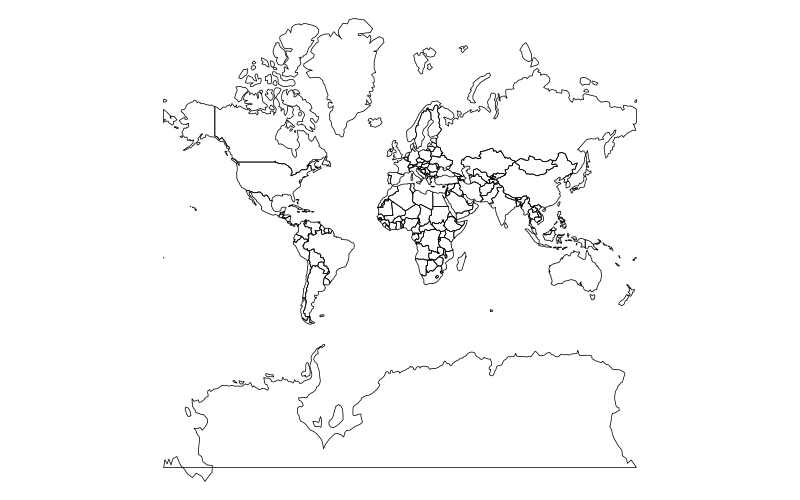
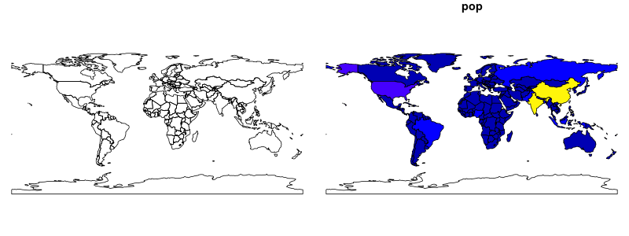

```{r, echo=FALSE}
# download.file("https://raw.githubusercontent.com/Robinlovelace/geocompr/master/refs.bib", "refs.bib")
# download.file("https://raw.githubusercontent.com/Robinlovelace/geocompr/master/packages.bib", "packages.bib")
```

```{r, echo=FALSE}
library(methods)
```


This mini-workshop will introduce you to recent developments that enable work with spatial data 'in the tidyverse'. By this we mean handling spatial datasets using functions (such as ` %>% ` and `filter()`) and concepts (such as type stability) from R packages that are part of the metapackage **tidyverse**, which can now be installed from CRAN with the following command:

```{r, eval=FALSE}
install.packages("tidyverse")
```

This functionality is possible thanks to **sf**, a recent package (first release in 2016) that implements the open standard data model *simple features*. Get **sf** with:

```{r, eval=FALSE}
install.packages("sf")
```

The workshop will briefly introduce both packages (which should be installed on your computer before attending) before demonstrating how they can work in harmony using a dataset from the **spData** package, which can be installed with:

```{r, eval=FALSE}
install.packages("spData")
```

The workshop is based on our work on the forthcoming book *Geocomputation with R* - please take a look at the book and its source code prior to the workshop here: [github.com/Robinlovelace/geocompr](https://github.com/Robinlovelace/geocompr). 

---


## Context

- Software for 'data science' is evolving
- In R, packages **ggplot2** and **dplyr** have become immensely popular and now they are a part of the **tidyverse**
- These packages use the 'tidy data' principles for consistency and speed of processing (from `vignette("tidy-data")`):


>    - Each variable forms a column.
>    - Each observation forms a row.
>    - Each type of observational unit forms a table

- Historically spatial R packages have not been compatible with the **tidyverse**

---
background-image: url("https://pbs.twimg.com/media/CvzEQcfWIAAIs-N.jpg")
background-size: cover

---

## Enter sf

- **sf** is a recently developed package for spatial (vector) data
- Combines the functionality of three previous packages: **sp**, **rgeos** and **rgdal**
- Has many advantages, including:
    - Faster data I/O
    - More geometry types supported
    - Compatibility with the *tidyverse*
    
That's the topic of this workshop

---
background-image: url("https://media1.giphy.com/media/Hw5LkPYy9yfVS/giphy.gif")

## Geocomputation with R

- A book we are working on for CRC Press (to be published in 2018)
- Chapters 3 ~~and 4~~ of this book form the basis of the worked examples presented here

---

## Prerequisites

- Install the required packages. You need a recent version of the GDAL, GEOS, Proj.4, and UDUNITS libraries installed for this to work on Mac and Linux. More information on that at https://github.com/r-spatial/sf#installling.

```{r, eval=FALSE}
devtools::install_github("robinlovelace/geocompr")
```

- Load the ones we need:

```{r, message=FALSE}
library(spData)
library(dplyr)
library(sf)
```

- Check it's all working, e.g. with this command:

```{r, eval=FALSE}
world %>%
  plot()
```

---

## Reading and writing spatial data

```{r}
library(sf)
library(spData)
vector_filepath = system.file("shapes/world.gpkg", package = "spData")
vector_filepath
world = st_read(vector_filepath)
```

Counterpart to `st_read()` is the `st_write` function, e.g. `st_write(world, 'data/new_world.gpkg')`. A full list of supported formats could be found using `sf::st_drivers()`.

---

## Structure of the sf objects 

```{r, eval = FALSE}
world
```

```{r, echo = FALSE}
print(world, n=3)
```

```{r}
class(world)
```

---

## Structure of the sf objects 

```{r, eval=FALSE}
world$name_long
```

```{r, echo=FALSE}
world$name_long[1:3]
```

```{r, eval=FALSE}
world$geom
```

```{r, echo=FALSE}
print(world$geom, n = 3)
```

---
## sf vs sp


- The **sp** package is a predecessor of the **sf** package 
- Together with the **rgdal** and **rgeos** package, it creates a powerful tool to works with spatial data
- Many spatial R packages still depends on the **sp** package, therefore it is important to know how to convert **sp** to and from **sf** objects

```{r}
library(sp)
world_sp = as(world, "Spatial")
world_sf = st_as_sf(world_sp)
```

- The structures in the **sp** packages are more complicated - `str(world_sf)` vs `str(world_sp)`
  
- Moreover, many of the **sp** functions are not "pipeable" (it's hard to combine them with the **tidyverse**)

```{r, eval = FALSE}
world_sp %>% 
  filter(name_long == "England")
```

`Error in UseMethod("filter_") : 
  no applicable method for 'filter_' applied to an object of class "c('SpatialPolygonsDataFrame', 'SpatialPolygons', 'Spatial')"`

---

## Non-spatial operations on the sf objects

```{r, warning=FALSE}
world %>% 
  left_join(worldbank_df, by = "iso_a2") %>%
  select(name_long, pop, pop_growth, area_km2) %>%
  arrange(area_km2) %>% 
  mutate(pop_density = pop/area_km2) %>%
  rename(population = pop)
```

---

## Non-spatial operations

```{r}
world_cont = world %>% 
        group_by(continent) %>% 
        summarize(pop_sum = sum(pop, na.rm = TRUE))
```

```{r, echo=FALSE}
print(world_cont, n = 1)
```


- The `st_set_geometry` function can be used to remove the geometry column:

```{r}
world_df =st_set_geometry(world_cont, NULL)
class(world_df)
```

---

## Spatial operations

It's a big topic which includes:

- Spatial subsetting
- Spatial joining/aggregation
- Topological relations
- Distances
- Spatial geometry modification
- Raster operations (map algebra)

See [Chapter 4](http://robinlovelace.net/geocompr/spatial-data-operations.html#spatial-operations-on-raster-data) of *Geocomputation with R* 

---

## Spatial subsetting

```{r}
lnd_buff = lnd[1, ] %>% 
  st_transform(crs = 27700) %>%  # uk CRS
  st_buffer(500000) %>%
  st_transform(crs = 4326)
near_lnd = world[lnd_buff, ]
plot(near_lnd$geom)
```

- What is going with the country miles away?

---

## Multi-objects

Some objects have multiple geometries

```{r}
st_geometry_type(near_lnd)
```

Which have more than 1?

```{r}
data.frame(near_lnd$name_long,
           sapply(near_lnd$geom, length))
```

---

## Subsetting contiguous polygons

```{r}
near_lnd_new = world %>% 
  st_cast(to = "POLYGON") %>% 
  filter(st_intersects(., lnd_buff, sparse = FALSE))
plot(near_lnd_new$geometry)
```

---

## CRS

```{r}
na_2163 = world %>%
  filter(continent == "North America") %>% 
  st_transform(2163) #US National Atlas Equal Area
st_crs(na_2163)
```

```{r, echo=FALSE, eval=FALSE}
na = world %>%
  filter(continent == "North America") 
png('slides/figs/coord_compare.png', width = 1000, height = 250)
par(mfrow = c(1, 2), mar=c(0,0,0,0))
plot(na[0]);plot(na_2163[0])
dev.off()
```



---
## Basic maps

- Basic maps of `sf` object can be quickly created using the `plot()` function:

```{r, eval=FALSE}
plot(wrld[0])
```

```{r, eval=FALSE}
plot(wrld["pop"])
```

```{r, echo=FALSE, message=FALSE, eval=FALSE, warning=FALSE, results='hide'}
png('slides/figs/plot_compare.png', width = 800, height = 300)
par(mfrow = c(1, 2), mar=c(0,0,1,0))
plot(world[0]);plot(world["pop"])
dev.off()
```



---
## tmap

https://cran.r-project.org/web/packages/tmap/vignettes/tmap-nutshell.html
```{r, fig.align='center', fig.height=4}
library(tmap)
tmap_mode("view")
tm_shape(world, projection="wintri") +
        tm_polygons("lifeExp", title=c("Life expactancy"),
          style="pretty", palette="RdYlGn", auto.palette.mapping=FALSE) +
        tm_style_grey()
```

---
## leaflet

```{r, eval=FALSE}
library(leaflet)
leaflet(world) %>%
        addTiles() %>%
        addPolygons(color = "#444444", weight = 1, fillOpacity = 0.5,
                    fillColor = ~colorQuantile("YlOrRd", lifeExp)(lifeExp),
                    popup = paste(round(world$lifeExp, 2)))
```

```{r, echo=FALSE, message=FALSE}
library(widgetframe)
library('leaflet')
l = leaflet(world) %>%
  addTiles() %>%
  addPolygons(color = "#444444", weight = 1,
                    opacity = 1, fillOpacity = 0.5,
                    fillColor = ~colorQuantile("YlOrRd", lifeExp)(lifeExp),
                    popup = paste(round(world$lifeExp, 2)))
frameWidget(l, height = '400')
```

---

## Raster data in the tidyverse

Raster data is not yet closely connected to the **tidyverse**, however:

- Some functions from the **raster** package works well in `pipes`
- You can convert vector data to the `Spatial*` form using `as(my_vector, "Spatial")`before working on raster-vector interactions
- There are some initial efforts to bring raster data closer to the **tidyverse**, such as [tabularaster](https://github.com/hypertidy/tabularaster), [sfraster](https://github.com/mdsumner/sfraster), or [fasterize](https://github.com/ecohealthalliance/fasterize)
- The development of the new s[tars](https://github.com/r-spatial/stars), package focused on multidimensional, large datasets should start soon. It will allow pipe-based workflows

---

## Geocomputation with R

The online version of the book is at http://robinlovelace.net/geocompr/ and its source code at https://github.com/robinlovelace/geocompr.

We encourage contributions on any part of the book, including:

- Improvements to the text, e.g. clarifying unclear sentences, fixing typos (see guidance from [Yihui Xie](https://yihui.name/en/2013/06/fix-typo-in-documentation/))
- Changes to the code, e.g. to do things in a more efficient way
- Suggestions on content (see the project's [issue tracker](https://github.com/Robinlovelace/geocompr/issues) and the [work-in-progress](https://github.com/Robinlovelace/geocompr/tree/master/work-in-progress) folder for chapters in the pipeline)

Please see [our_style.md](https://github.com/Robinlovelace/geocompr/blob/master/our_style.md) for the book's style.

<!-- --- -->

<!-- ## Thanks + references -->

<!-- Slides created via the R package [**xaringan**](https://github.com/yihui/xaringan). -->

<!-- add a list of resources (e.g. vignette for sf) and packages websites (e.g. tmap, sf, leaflet) -->

