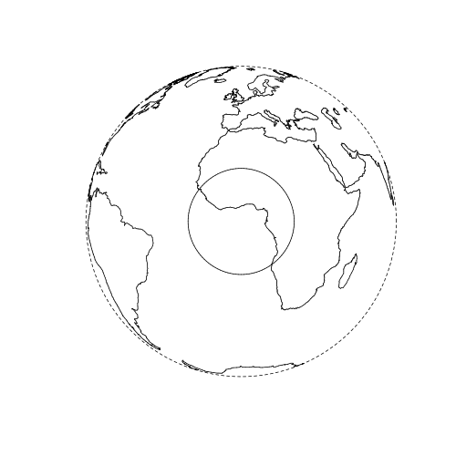

```{r}
library(sf)
library(spData)
library(tidyverse)
```


#### Spatial subsetting in base R

Another spatial subsetting example will use an object representing the countries of Africa, created using attribute subsetting as follows:^[Recall
attribute subsetting can also be done in base R with `africa_wgs = world[world$continent == "Africa", ]`.]

```{r}
africa_wgs = world %>% filter(continent == "Africa")
```

To further prepare the input data, we will reproject the data to the coordinate reference system (CRS) 32630, its EPSG code (explained in Chapter 6):

```{r}
africa = st_transform(africa_wgs, crs = 32630)
```

We can also use the `[` operator for *Spatial* subsetting.
The difference is that we use *another spatial object* inside the square brackets instead of an `integer` or `logical` vector.
This is a concise and consistent syntax, as shown in the next code chunk.
Let's test it with a hypothetical scenario: we want to subset all countries within 2000 km of the point where the equator (where latitude = 0 degrees) intersects the prime meridian (longitude = 0 degrees), as illustrated in Figure \@ref(fig:globe).
The subsetting object is created below.
Note that this must have the same CRS as the target object (set with the `crs` argument):

```{r, warning=FALSE}
center_wgs = st_sf(geometry = st_sfc(st_point(c(0, 0)), crs = 4326))
center = st_transform(center_wgs, 32630)
buff = st_buffer(center, dist = 2e6)
```

```{r globe, echo=FALSE, fig.cap="Subsetting scenario: which countries intersect with a circle of 2000 km in radius located at zero degrees longitude and zero degrees latitude? Figure created with the **[globe](https://cran.r-project.org/package=globe)** package."}

```

The data to be subset, or 'target layer', is the `africa` object created above, which has a projected CRS (`32630`).
Subsequently, spatial subsetting can be done with a single, concise command:

```{r}
africa_buf = africa[buff, ]
```

```{block2 type='rmdnote'}
If we were using geographic ('lon/lat') data the previous command would have emitted a message warning about assuming `planar coordinates`.
This is because spatial operations (especially distance and area calculations) cannot be assumed to be accurate in a geographic (longitude/latitude) CRS.
In this case one could justify the use of a lon/lat CRS: the data is close to the equator where there is least distortion caused by the curvature of the earth.
It is good practice to reproject spatial datasets before performing spatial operations on them.
```

The spatial subsetting clearly worked: only countries intersecting with the giant circle are returned (Figure \@ref(fig:africa-buff)):

```{r, eval=FALSE}
plot(africa_buf["pop"])
plot(buff, add = TRUE)
```


Todo: improve this figure, e.g. by creating a new hidden chunk - still show this one
```{r africa-buff, fig.cap="Subset of the `africa` data selected based on their intersection with a circle 2000 km in radius with a center point at 0 degrees longitude and 0 degrees latitude.", echo=FALSE}
library(leaflet)
leaflet() %>%
  addProviderTiles("OpenMapSurfer.Grayscale") %>%
  addPolygons(data = st_transform(africa_buf, 4326)) %>%
  addPolygons(data = st_transform(buff, 4326), color = "red")
```

Note that countries that just touch the giant circle are selected such as Chad (northeast of the circle).
This is because the default subsetting operator is `st_intersects()`, which returns any type of spatial relation.
Other spatial subsetting operations such as `st_within()` are more conservative, as shown in section \@ref(topological-relations).


```{r}
buff_agg = aggregate(x = africa[, "pop"], by = buff, FUN = sum)
```
<!--
show also tidyverse way, so what you are doing is basically a spatial join and a subsequent aggregation without a grouping variable. Didactically, it might be better to present a grouping variable.
-->


```{r, echo=FALSE}
st_join(buff, africa[, "pop"]) %>%
  summarize(pop = sum(pop, na.rm = TRUE))
summarize(africa[buff, "pop"], pop = sum(pop, na.rm = TRUE))
```

The result, `buff_agg`, is a spatial object with the same geometry as `by` (the circular buffer in this case) but with an additional variable, `pop` reporting summary statistics for all features in `x` that intersect with `by` (the total population of the countries that touch the buffer in this case).
Plotting the result (with `plot(buff_agg)`) shows that the operation does not really make sense:
Figure \@ref(fig:buff-agg) shows a population of over half a billion people mostly located in a giant circle floating off the west coast of Africa!  

```{r buff-agg, fig.cap="Result of spatial aggregation showing the total population of countries that intersect with a large circle whose center lies at 0 degrees longitude and latitude.", echo=FALSE, message=FALSE}
library(tmap)
pal = tmaptools::get_brewer_pal(palette = "BuPu", n = 4, plot = F)
breaks = c(0, 1e7, 1e8, 5e8, 1e9)
bb_buff = tmaptools::bb(buff_agg, ext = 1.5)
qtm(buff_agg, fill = pal[4], bbox = bb_buff) +
  tm_shape(africa_buf) +
  tm_fill("pop", palette = pal, breaks = breaks) +
  tm_borders() +
  qtm(africa[st_disjoint(africa, buff, sparse = FALSE), ]) +
  tm_shape(buff) +
  tm_borders(lwd = 3, lty = 3) +
  tm_layout(legend.position = c("left", "bottom"))
detach("package:tmap", unload = TRUE)
```

The results of the spatial aggregation exercise presented in Figure \@ref(fig:buff-agg) are unrealistic for three reasons:

- People do not live in the sea (the geometry of the aggregating object is not appropriate for the geometry target object).
- This method would 'double count' countries whose borders cross aggregating polygons when multiple, spatially contiguous, features are used as the aggregating object.
- It is wrong to assume that all the people living in countries that *touch* the buffer reside *within* it (the default spatial operator `st_intersects()` is too 'greedy'). The most extreme example of this is Algeria, the most northerly country selected:
the spatial aggregation operation assumes that all 39 million Algerian citizens reside in the tiny southerly tip that is within the circular buffer.

A number of methods can be used to overcome these issues, and generate a more realistic population attributed to the circular buffer illustrated in Figure \@ref(fig:buff-agg).
The simplest of these is to convert the country polygons into points representing their *geographic centroids* before aggregation, covered in section \@ref(modifying-geometry-data).
<!-- Todo: reference section where we demonstrate geographic centroid generation -->
This would ensure that any spatially contiguous aggregating object covering the target object (the Earth in this case) would result in the same total: there would be no double counting.
The estimated total population residing within the study area would be more realistic if geographic centroids were used.
(The centroid of Algeria, for example, is far outside the aggregating buffer.)

Except in cases where the number of target features per aggregating feature is very large, or where the aggregating object is *spatially congruent* with the target (covered in section \@ref(spatial-congruence-and-areal-interpolation)), using centroids can also lead to errors due to boundary effects:
imagine a buffer that covers a large area but contains no centroids.
These issues can be tackled when aggregating areal target data with areal interpolation.